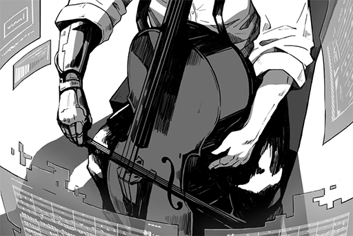

# The Cello
## Post
**ConneR** 
　The first assembled acoustic instrument to be discovered is an ancient instrument known as the 'Cello". Perhaps due to its large size, it's preserved in a relatively good condition. It's discovered in a concert hall ruins near Node 13. It was buried 45 meters deep and was detected by an unmanned drone. 

　With modern technology, they are many ways to simulate a good low-pitch string instrument. However, the Cello, which is created with top quality lumber and delicate crafts, can give out a very clear and deep tone. 

　A bit sad, yet extremely mesmerizing. This instrument provides a steadiness that makes even the piano, a one-piece chord instrument, feel inferior. 

## Replies
**Amberclove** 
Can we see Sensei perform with the Cello at the Border of the North Concert?

**DMO** 
Yes. It's on the program schedule

**T.Goldwell** 
Sensei will perform with more than 8 different instruments!!!

**DiiR** 
I heard it when I was visiting Node13. It's a low but melodious tune. I really like it :)

