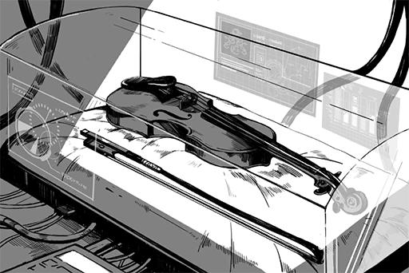
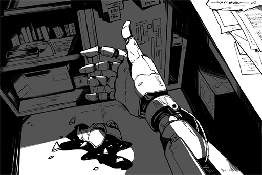
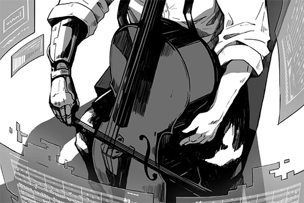
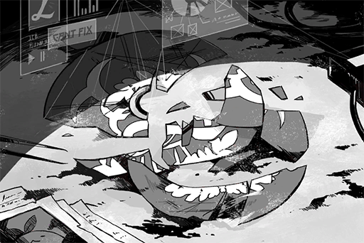
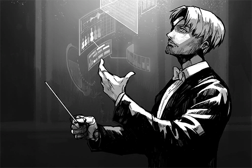
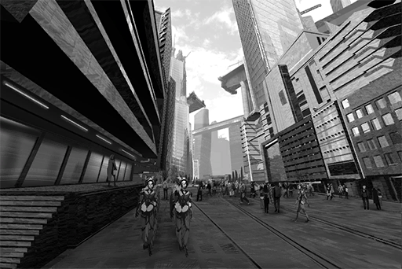
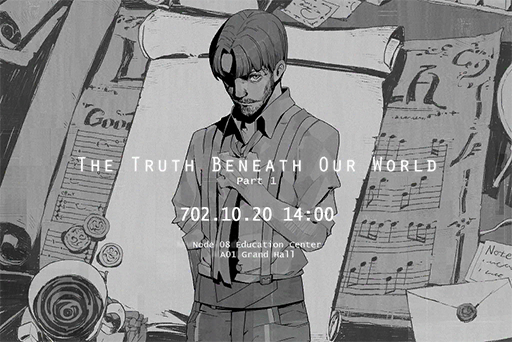
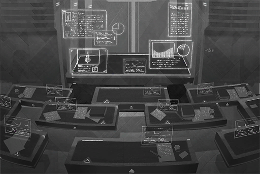

# ConneR iM Posts
## List of Posts
- [\[#001\] Reset](#c0101)
- [\[#002\] New Instrument](#c0201)
- [\[#003\] People from bio\-prosthetic companies may all need a prosthetic brain](#c0301)
- [\[#004\] Border of the North Concert](#c0401)
- [\[#005\] Met an old friend in a new place](#c0501)
- [\[#006\] An era with no roots](#c0601)
- [\[#007\] Yet another advisor position](#c0701)
- [\[#008\] The Cello](#c0801)
- [\[#009\] \[Repost\] Acclaimed scholar Colin Neumann Jr. named head of AI research project ](#c0901)
- [\[#010\] What is Archaeology](#c1001)
- [\[#011\] Treasures of the Past](#c1101)
- [\[#012\] \[Repost\] A.R.C looking for professional Ruins explorer](#c1201)
- [\[#013\] The Saxophone](#c1301)
- [\[#014\] The sincerest instance, right here, right now](#c1401)
- [\[#016\] The truth of this world](#c1601)
- [\[#017\] Emptiness](#c1701)
- [\[#018\] Those long lost memories](#c1801)
- [\[#019\] Let me tell everyone a quick anecdote](#c1901)
- [\[#020\] Overlords](#c2001)
- [\[#021\] Lecture at the Academy](#c2101)
- [\[#022\] The O͠҉̷͘͞I̵͏\*͘͟6̧̛̀͢͜L̸̸̡͏̡N̷̡̕Ǫ̴̶̵ the Academy I̡̢͞H̴́)̶̀͘8̸҉̢̀̕7̸̨͏̶g̶̡t̴̡͢7͏͢͝/́̀͢͠͝](#c2201)

## \[#001\] Reset
### Post
**ConneR** 
Been five years since my last login. Nothing major has changed here apparently. Perhaps the thing that changed the most is myself. 

Everything is a brand\-new start. objectives to achieve, music to play. Will find a path for myself eventually.

L'essentiel n'est pas de vivre, mais de bien vivre.
### Replies
**ConneR** 
I have requested an account transfer from iM. People who used to follow me **@Colin Neumann Jr.** should now be able to see this new account in the recommended list.

**Dogleg** 
Greetings Sensei. It has been a while.I thought you had abandoned this world and went to live in seclusion.

**Ewx_Data** 
OHHHHH didn't expect Master Colin to make a comeback gotta go tell my friend

**Brightswirls** 
Discovered my idol after a five\-year hiatus. I must be dreaming \*pinch face\*

**DMO** 
Reporting \*raise hand\*

**T.Goldwell** 
Reporting +1 !! 
I am feeling pumped >"<

**Amberclove** 
I was single five years ago. I'm now married and have kids...\*weeps\*

**RaiKiyumi** 
Immediate follow after receiving the notification (･∀･)

**Bolt_Urx** 
Reporting +1

**GemFeather** 
**\#FollowConneR**

**C.Y.** 
Looking forward to more music\~\~\~

[*(Click here to go back to the top)*](#toc)

## \[#002\] New Instrument
### Requirements
|    Char.    |Lv.|Lv. Locked?|
|-------------|:-:|:---------:|
|**ROBO_Head**| 2 |    No     |

### Post
**ConneR** 
Spend some time learning a new instrument called "Violin". According to the records, the Violin is an assembled acoustic instrument. It's made up of the body, the strings and the bow. 

The Violin has a powerful sound and is capable of solo performance. It is agile and can handle complicated verses with ease. It will play a major role in my new composition.

### Replies
**T.Goldwell** 
When can we see it in Sensei's work\~

**CozyCaty** 
Finally!

**C.Y.** 
It looks so pretty...

**DMO** 
So this instrument doesn't need electricity to make a sound?

**Brightswirls** 
Just reading the description makes me excited about actually hearing it

**Marshall** 
Awesome new master \\oo/

[*(Click here to go back to the top)*](#toc)

## \[#003\] People from bio\-prosthetic companies may all need a prosthetic brain
### Requirements
|    Char.    |Lv.|Lv. Locked?|
|-------------|:-:|:---------:|
|**ROBO_Head**| 4 |    No     |

### Post
**ConneR** 
Recently the condition of my prosthetic arm has been god awful, to say the least. Makes me wonder if I accidentally ordered a leg instead of an arm; that or they actually sold me some junk scraped from the morgue.

Gradually getting used to this non\-organic arm, but when awoken in the middle of the night by an unstable nerve shock, I still get a nauseous feeling. Is this the compensation for modern technology?

### Replies
**ConneR** 
Can't compose nor perform normally under such conditions. How can I recommend music of such underwhelming quality to my friends?

I am very busy with my work and my research. Do you really think that I have the time to mail it back to the OEM and wait seven to eight days for a repair?

**Ewx_Data** 
Sensei got an electronic arm!? What happened??

**DMO** 
For performing purposes?

**ConneR** 
No, had a minor accident while away from Node08. I would not install this disgusting piece of junk for performing purposes.

**Brightswirls** 
That's outrageous! Which brand is it?

**ConneR** 
BH.

**BodyHack Service** 
Sir, we are very sorry for the inconvenience we caused. We will send our agent to deal with the issue immediately.

**AngryFan** 
Don't affect Sensei's work! Do what you guys are supposed to do!

**Bolt_Urx** 
Sensei has very high standards!

**ConneR** 
I'll be waiting.

**BodyHack Service** 
Yes Sir!

**Amberclove** 
Wasn't BH a pretty good brand? What's with the flop?

**DiiR** 
They recently had a complete management change; must still be dealing with the aftershock

[*(Click here to go back to the top)*](#toc)

## \[#004\] Border of the North Concert
### Requirements
|    Char.    |Lv.|Lv. Locked?|
|-------------|:-:|:---------:|
|**ROBO_Head**| 7 |    No     |

### Post
**ConneR** 
I guess a promotion here wouldn't hurt. My next concert, as usual, will be held at Central Music Hall at Quadrant I. The performance this time will feature classical works of Northen musicians the likes of Rachmaninoff and Stravinsky.

Of course, my newest work will also be featured. Don't miss out on it.
### Replies
**Brightswirls** 
I was wondering why I can't find any information. So it's hidden here lol

**AngryFan** 
Impudent child! Sensei's concert requires no promotion! Tickets are extremely hard to come by!

**Ewx_Data** 
Ticket purchased \*Excited\*

**Dogleg** 
Only Central Music Hall can bring out the characteristics of ConneR Sensei's music.

**ConneR** 
Did some research?

**Dogleg** 
Central Music Hall can hold almost 2000 people. Reverberation is controlled between 1.85 \~1.9 seconds. A crowned jewel among performance venues.

**Dogleg** 
Four floors of seats and boxes, with luxurious curtains and a relief sculpture wall.

**RaiKiyumi** 
Jesus why do you know so much?

**DMO** 
You really did your research XDD

**Bolt_Urx** 
TBH, people who listen to live performances have dropped off quite a bit.

**ConneR** 
Excellent

[*(Click here to go back to the top)*](#toc)

## \[#005\] Met an old friend in a new place
### Requirements
|    Char.    |Lv.|Lv. Locked?|
|-------------|:-:|:---------:|
|**ROBO_Head**| 8 |    No     |

### Unlocked Charts
|       Song       |  Char.  |Diff.|Lv.|
|------------------|:-------:|:---:|:-:|
|**Claim the Game**|ROBO_Head|Easy | 3 |
|**Claim the Game**|ROBO_Head|Hard | 7 |

### Post
**ConneR** 
In terms of artistic attainment, I know my place. I don't consider myself to be knowledgeable by any means. Knowledge is endless, and there is only so much a mere human can obtain throughout a single lifetime. 

Today, through the introduction of a mutual friend, I had a thorough exchange with the scholar of the new generation **@ROBO\_Head**. I was very impressed with his wide array of knowledge. It feels good to meet an old friend in a new place.
### Replies
**ROBO_Head** 
**@ConneR** Doctor's research in instruments, classical music and ancient civilizations, worthy for this Unit to learn. ：D

**ConneR** 
You are welcome. 
I believe that I can also learn a lot from you. I look forward to interacting with you more.

**RaiKiyumi** 
OMG a meeting between two master class musicians >////<

**CozyCaty** 
I'm also a huge fan of ROBO\_Head

**Dogleg** 
Dedicated to classical music yet willing to accept new things. I expect no less from Dr. ConneR

**Dogleg** 
All in the name of art, I admire that.

**ConneR** 
I'm flattered.

**DMO** 
Such detailed research from Dogleg. Indeed ConneR Sensei's loyal fan.

**T.Goldwell** 
Now we can learn even more from Sensei

**Amberclove** 
Both masters at their craft

**GemFeather** 
COOL

**Ewx_Data** 
Both Master Colin and ROBO\-san is so adorable lul

**DiiR** 
Not enough people know how to appreciate art

[*(Click here to go back to the top)*](#toc)

## \[#006\] An era with no roots
### Requirements
| Char.  |Lv.|Lv. Locked?|
|--------|:-:|:---------:|
|**PAFF**|10 |    No     |

### Post
**ConneR** 
This era, I believe is one that lost its roots.

A variety of music, advanced mixing techniques, constant interactions and collaborations, yet has lost the ability to utilize and enjoy classical instruments, the basis of all music.  

Even more helpless, is that the public has lost its praise and appreciation for the timelessness and beauty of classical music. Affected by the fancy mixing and vulgar lyrics, people now care more about the gossip of musicians rather than their actual music.

Pains me greatly witnessing this.
### Replies
**Dogleg** 
A sincere warning from Sensei!

**Ewx_Data** 
Master Colin's speech many years ago affected me very much. I greatly appreciate Sensei's words till this day.

**Bolt_Urx** 
Agreed! 
Now I tend to stay away from lengthy connections 
I feel that things in real life are much more important

**C.Y.** 
No need to discredit the present right? Isn't time always progressing forward

**Otis_Emik** 
Exactly what I was thinking <3

**Brightswirls** 
Good point

**DiiR** 
Sensei\~ the era is different. Just today in the academy, I was really angered by the shallow values displayed by the children there. Such Ignorance!

**ConneR** 
Doing thing in ways most people can't agree with; I guess that's my destiny

[*(Click here to go back to the top)*](#toc)

## \[#007\] Yet another advisor position
### Requirements
|   Char.    |Lv.|Lv. Locked?|
|------------|:-:|:---------:|
|**NEKO#ΦωΦ**|11 |    No     |

### Post
**ConneR** 
Still a while before the information is publicized, but recently I accepted another advisor position. It's in a familiar field, though the unit is not one I particularly agree with. After several back\-and\-forth negotiations, I accepted the position since they are very sincere about it. Once the NDA is lifted I'll talk more about it.
### Replies
**Brightswirls** 
Excited! Must be a pretty important unit to let Sensei say yes XDD

**CozyCaty** 
Not even a tiny hint, Sensei?

**ConneR** 
Non\-disclosure agreement.

**Ewx_Data** 
Advisor...sounds so mysterious

**DMO** 
Ahhhh right, the NDA. Which Node is that unit in?

**StuffyMouth** 
Don't tease us

**Bolt_Urx** 
Maybe it's THAT one

**Otis_Emik** 
Which one?

**Dogleg** 
As far as I know, only THAT one will need a professional of Sensei's caliber

**ConneR** 
Go ahead, make your guess.

[*(Click here to go back to the top)*](#toc)

## \[#008\] The Cello
### Requirements
|    Char.    |Lv.|Lv. Locked?|
|-------------|:-:|:---------:|
|**ROBO_Head**| 9 |    No     |

### Post
**ConneR** 
The first assembled acoustic instrument to be discovered is an ancient instrument known as the 'Cello". Perhaps due to its large size, it's preserved in a relatively good condition. It's discovered in a concert hall ruins near Node 13. It was buried 45 meters deep and was detected by an unmanned drone. 

With modern technology, they are many ways to simulate a good low\-pitch string instrument. However, the Cello, which is created with top quality lumber and delicate crafts, can give out a very clear and deep tone. 

A bit sad, yet extremely mesmerizing. This instrument provides a steadiness that makes even the piano, a one\-piece chord instrument, feel inferior.

### Replies
**Amberclove** 
Can we see Sensei perform with the Cello at the Border of the North Concert?

**DMO** 
Yes. It's on the program schedule

**T.Goldwell** 
Sensei will perform with more than 8 different instruments!!!

**DiiR** 
I heard it when I was visiting Node13. It's a low but melodious tune. I really like it :)

[*(Click here to go back to the top)*](#toc)

## \[#009\] \[Repost\] Acclaimed scholar Colin Neumann Jr. named head of AI research project 
### Requirements
|    Char.    |Lv.|Lv. Locked?|
|-------------|:-:|:---------:|
|**ROBO_Head**|14 |    No     |

### Post
**ConneR** 
> Announced several days ago, the AI emotion training project has invited several senior scholars to participate in the research. One of the scholars is A.R.C.'s senior advisor and archaeologist Colin Neumann Jr., who is named the head of the project.  
> Dr. Neumann is perhaps more well known by his other name, ConneR. A renowned virtual composer on the internet, he is also an archaeologist with a deep knowledge regarding instruments of the past.  
> To fulfill the educational purpose of the project, Dr. Neumann will be posting regular updates of the project on the internet. Hopefully, everyone gets a sneak peek into the wonders of Artificial Intelligence research. 

### Replies
**ConneR** 
Thank you. I hope to make good use of this opportunity to interact with A.R.C. I believe that I can be of great help in terms of archaeology and ancient documents.  
My personal connections with A.R.C. can be traced back to six months ago. As of now, the cooperation experience has been fairly pleasant. Accepting this mission is mutually beneficial for both sides.

**Ewx_Data** 
WOW!! So this is the advisor position Sensei was talking about! Awesome!!

**DMO** 
Wow it's A.R.C.

**SIhama** 
Doesn't Sensei constantly embarrass them in his papers? What's going on here? XD

**Bolt_Urx** 
Has A.R.C. finally acknowledge Sensei's superiority lol

**WhiteEYE33** 
Nah must be bribed by money.  
\[User is now banned\]

**RaiKiyumi** 
No wonder my dad said that his company is expecting someone important!

**AngryFan** 
A.R.C. would be nothing without Master Colin's papers

**Otis_Emik** 
Seriously, all breakthroughs they had in the last few years happened because Sensei utterly destroyed their past "theories" XDD

**CozyCaty** 
Conquered!!

**Dogleg** 
Sensei is truly amazing...

**GemFeather** 
OTL

**Amberclove** 
Only A.R.C. can have a project that catches Sensei's eye. Other minor stuff is not within his interest lolol

[*(Click here to go back to the top)*](#toc)

## \[#010\] What is Archaeology
### Requirements
| Char.  |Lv.|Lv. Locked?|
|--------|:-:|:---------:|
|**PAFF**|16 |    No     |

### Post
**ConneR** 
The existence of archaeology, is to help humans find what's missing from the past. It helps us study the history of the world and helps humans understand where we came from and where we should go.

People who devoted themselves to archaeology, are not shovel\-wielding, hole\-digging barbarians. They are scholars who study artifacts, read through ancient documents, discover music, and look for history's burial grounds.  

They, are people who pursue the truth.
### Replies
**GemFeather** 
Great argument!

**Bolt_Urx** 
Sadly, too many people who thought they knew never truly understand the artistic conception behind it.

**C.Y.** 
I can't agree with you more!

**DiiR** 
Can't agree with you more +1

**Ewx_Data** 
Understood. Thank you Master Colin

**Brightswirls** 
Thank you Sensei for giving your point of view. I learned a lot!

[*(Click here to go back to the top)*](#toc)

## \[#011\] Treasures of the Past
### Requirements
|    Char.    |Lv.|Lv. Locked?|
|-------------|:-:|:---------:|
|**ROBO_Head**|18 |    No     |

### Post
**ConneR** 
In the documents discovered east of Node47, I saw an orchestral collection beginning with the letter "L". However, the sheets have been so damaged that it is indecipherable. 

Music that wonderful once existed yet we have no way to listen to it now, what a pity.

### Replies
**Amberclove** 
After hearing Sensei's description, I kinda want to go back to that era

**RaiKiyumi** 
Is there really no possibility to recover it? Want to hear it\~

**Bolt_Urx** 
Just collecting every single instrument and recreating the setting is already mission impossible...

**CozyCaty** 
Is there really no other way?

**DMO** 
That sucks

**C.Y.** 
Can any research organization recover it?

**Brightswirls** 
Nobody besides Sensei can do it I believe

**StuffyMouth** 
How about other Nodes?

**Ewx_Data** 
Master Colin is our only hope

[*(Click here to go back to the top)*](#toc)

## \[#012\] \[Repost\] A.R.C looking for professional Ruins explorer
### Requirements
|    Char.    |Lv.|Lv. Locked?|
|-------------|:-:|:---------:|
|**ROBO_Head**|20 |    No     |

### Post
**ConneR** 
> Do you have a dream? Do you want to visit Ruins all across the world? 
>  
> No matter how long it takes, no matter how far it is, there is still something that must be completed. A job that leaves an everlasting mark in history 
>  
> Recreate the glories of the past. A job that connects past and present. 
>  
> Ruins explorers recruiting **@ARC\_Recruit** 
> A.R.C., create a better future 

### Replies
**ConneR** 
You people think this is some kind of self\-gratification; such ignorant and selfish minds. Really don't want to repost this but I can't stand it anymore.

**ConneR** 
Archaeology bears a lot of responsibility. Not a job where you impudent children can screw around and do whatever you want.

**RaiKiyumi** 
Wow Sensei is REALLY pissed off \*shudders\*

**Ewx_Data** 
Sensei calm down...

**Elextron** 
Dr.ConneR is really devoted to archaeology. Other scholars of the same field don't have even remotely the same dedication

**White3Y3** 
Did you lose at Dare? Come on don't be a sore loser  
\[User is now banned\]

**Amberclove** 
Dude are you stupid or what...

**Bolt_Urx** 
Banned...saw it coming

**Dogleg** 
Scholars like Sensei are now few and far between

**GemFeather** 
Sensei calm down.

**Brightswirls** 
I applied. Hope we can change them from the inside.

[*(Click here to go back to the top)*](#toc)

## \[#013\] The Saxophone
### Requirements
|   Char.    |Lv.|Lv. Locked?|
|------------|:-:|:---------:|
|**NEKO#ΦωΦ**|22 |    No     |

### Post
**ConneR** 
Due to Node 13's unique historical background, it has quite the collection of well\-preserved instruments. The Saxophone is the instrument that left me the strongest impression in the past five years.  In a bar where I regularly visit, there is this small band that does a live performance every night. Their Saxophonist's superb technique is certainly one of the reasons I kept coming back. 

The Saxophone is an iconic part of Jazz music. Its extremely versatile and free tone allows different performers to give the music their unique twist. The music flows as if it has a soul of its own.

### Replies
**Dogleg** 
If it's possible I would love to live a life just like Sensei, immersing in such wonderful things for a long time

**Shibawu** 
I also really like the sound of the Saxophone

**RaiKiyumi** 
Applying a travel visa for Node13 is a pain in the neck; or else I would really want to visit

**Bolt_Urx** 
Node13 has trouble connecting to cyTus at times XDDD

**Hulujam** 
I feel that I won't last a single day over there...

**SIhama** 
Jazz music, bar, Saxophone 
A match made in heaven d=(´▽｀)=b

**ConneR** 
If you like things like this, allow me to recommend JOEZ Café at Quadrant II. I can say that the owner there knows more about Jazz and good alcohol than anyone in the Node.

**SIhama** 
Got it! Thanks for the recommendation Dr. ConneR ＼(´▽｀)

**Amberclove** 
I feel that Node13 is the perfect place to forget all the annoying stuff in live \*applying for cross\-Node travel\*

[*(Click here to go back to the top)*](#toc)

## \[#014\] The sincerest instance, right here, right now
### Requirements
| Char.  |Lv.|Lv. Locked?|
|--------|:-:|:---------:|
|**PAFF**|22 |    No     |

### Post
**ConneR** 
Only those who are there on\-site can really feel the sincerest moment. No data transfer delays, no post\-production trickery; only a real performance presented directly to the audience by the performer.

And I, perform only for myself.

### Replies
**Dogleg** 
A perfect concert. I was bawling my eyes out during the curtain call

**Brightswirls** 
Thank you Sensei for giving us such an unforgettable night

**NewFans** 
Hello Sir, I am an audience at tonight's concert. Never thought that music this powerful and emotional still exists. I was really touched.

**RaiKiyumi** 
A completely different feeling compared to pop music...

**Otis_Emik** 
After performing 8 instruments in a row, Sensei took the stage to conduct the final piece. That scene gave me goosebumps <3

**DMO** 
Hope we get to see more performances like this

**StuffyMouth** 
It's magnificent. Why is it that a great musician like Sensei doesn't get any mainstream love QQ

**GemFeather** 
Sensei, please hold a few more sessions!

**C.Y.** 
An unprecedented concert

**Elextron** 
May I ask where can I buy the instruments Sensei was performing with?

**Ewx_Data** 
Guy above me, those are Sensei's personal collection lul

**NeverHeardofIt** 
Never heard of ConneR, went because of curiosity. Well Sensei, today you officially have a new fan!!

**MissingSth** 
Is there a holo\-recreation? QQ

**DiiR** 
Too bad Sensei insists on live performances only. It would be a blessing for us fans outside of Node08 if there are virtual seats available

**ConneR** 
Fellow music lovers, thank you for the appreciation. If you can enjoy classical music, you already have better taste than the majority of the public. In the future, I will bring my live performances to an even higher level for everyone to enjoy.

My performances do not have virtual seats, nor are there holographic recreations. Please come to the concert in person and experience the music with your own ears.

**Amberclove** 
To all the staff tonight, and the all\-important performer, we offer you our highest respect \*bows\*

**Bolt_Urx** 
Sensei you are the best ! ! !

**CozyCaty** 
I can't wait for the next performance to be here!!!!

[*(Click here to go back to the top)*](#toc)

## \[#016\] The truth of this world
### Requirements
|    Char.    |Lv.|Lv. Locked?|
|-------------|:-:|:---------:|
|**ROBO_Head**|25 |    No     |

### Post
**ConneR** 
Maybe this is an opportunity for everyone to reflect carefully: are there too many things in the world that we simply can't understand and control.

The Architects created the Node cities on this planet. Did they do it to protect us fragile humans, or are humans mere test rats in a lab?
### Replies
**RaiKiyumi** 
Does Sensei think that the Æsir event is an omen of some sort?

**DMO** 
Did doctor come across any info at A.R.C.

**Bolt_Urx** 
Two whole hours of memory just gone like that, terrifying

**DiiR** 
Sudden realization that ConneR Sensei's physical concert is the best and safest enjoyment in the world

**STANley** 
UBER safe XDD

**Amberclove** 
Are people staying away from the internet these days???

**GemFeather** 
I feel like that's very unlikely 
It seems to have an opposite effect, as more and more people are getting online to discuss these things

**Ewx_Data** 
Even the admins should have plenty of doubts themselves, right?

**DiiR** 
Just look at the recent drone incident, so much technology we still can't control properly

**T.Goldwell** 
Follow Sensei and find the Truth!!!

**SIhama** 
Follow Sensei\~\~\~

[*(Click here to go back to the top)*](#toc)

## \[#017\] Emptiness
### Requirements
| Char.  |Lv.|Lv. Locked?|
|--------|:-:|:---------:|
|**PAFF**|28 |    No     |

### Post
**ConneR** 
People of the modern age seem to be overly focused on pursuing the shallow surface. They often only care about what they see, or more likely, what they want to see. Never once did they think about the context and reasons beneath the surface.

My music is also a rebellion against such oblivious actions. Therefore that's the reason why you can only see me perform in\-person.
### Replies
**Amberclove** 
Is Sensei taking a shot at the recent incidents?

**RaiKiyumi** 
Which incident? 
There's like fifty of them these days...

**Bolt_Urx** 
Surface = Æsir event 
Reasons = How was Æsir created 
??? 
Need answers

**Ewx_Data** 
Does Sensei already have plans for the next concert?

**DMO** 
More sessions of the same concert obviously, he's touring ya know. You don't plan a new concert after just a single session

**Amberclove** 
I am sick and tired of hearing PAFF and NEKO fanboys/girls whine about nonsense

**C.Y.** 
It baffles me to this day that these two girls somehow became the eye of the storm for these events

**Cybel_Mach** 
Doctor, do you have any idea??

**Flower_Head** 
Xenon, who works at A.R.C., has been tag spammed for weeks now XD

**Ayx_Socket** 
Does ConneR know Xenon? Maybe you guys meet quite often?

**AbigaleJ** 
I don't get Æsir's intentions. Like what benefit does he get by erasing the memories??

[*(Click here to go back to the top)*](#toc)

## \[#018\] Those long lost memories
### Requirements
|   Char.    |Lv.|Lv. Locked?|
|------------|:-:|:---------:|
|**NEKO#ΦωΦ**|31 |    No     |

### Post
**ConneR** 
Wonder how many people here still remember Architects? I'm fairly confident that humans who existed before my great grandfather's generation had been in contact with them for an extensive amount of time. The Architects provided humans with secure shelters, yet they also left behind countless unsolved mysteries that troubled people to this day. This includes some incidents I personally experienced myself.

Not too long ago, I happened to have the opportunity to get my hands on a set of ancient but very well\-preserved pieces of Architect equipment. Even though a large percentage of them are still in their un\-recreated state, the fact that I could physically research and dismantle one makes me feel very excited.

### Replies
**Dogleg** 
ConneR Sensei, what are you busy with these days? 
Research? Or is it composing?

**T.Goldwell** 
Sensei's probably busy with ARC's research work these days 
If not, we fans should have lots of new music to listen to

**CozyCaty** 
What's an Architect is it tasty ROFL

**RaiKiyumi** 
Time for more archaeology lessons with Sensei\~\~\~\~

**Amberclove** 
I've only seen them in my textbooks

**Brightswirls** 
I don't think Architects exist now

**DiiR** 
Can Sensei give us a quick comment on NEKO's acquittal verdict (Hands over mic)

**ConneR** 
I don't really follow petty news like that.

**DMO** 
Doesn't give a damn LMFAO

**Bolt_Urx** 
ConneR Sensei is too cool to care XDDD

**Otis_Emik** 
DENIED

[*(Click here to go back to the top)*](#toc)

## \[#019\] Let me tell everyone a quick anecdote
### Requirements
|    Char.    |Lv.|Lv. Locked?|
|-------------|:-:|:---------:|
|**ROBO_Head**|38 |    No     |

### Post
**ConneR** 
A gardener was tending to his flowerbed when he discovered a group of ants surrounding an apple that has fallen to the ground. Some ants wanted to start diving in to the delicious fruit right away, Some ants wanted to go back to their hive to bring more ants to carry the apple back. The two sides began to argue with each other. Meanwhile, a third group of ants was busy trying to resolve the conflict; all the while a fourth group of ants was attempting to come up with a solution that can satisfy everybody. 

Have a guess; how did the gardener deal with this fallen apple? He didn't pick up the apple and throw it away. He also didn't wash away the ants with the water hose he was holding. All he did was stand up, and walk away. 

Yeah, who cares.
### Replies
**RaiKiyumi** 
Holy cow!!! ConneR Sensei is freaking awesome XDDDDD

**Bolt_Urx** 
I was wondering why did we suddenly get an anecdote from sensei ROFL

**Ewx_Data** 
If it was me, I would probably burn these ants with a magnifying glass, I think??

**DMO** 
A max\-level, full\-screen taunt lul

**Amberclove** 
By the holy light! 
 
Mom came in and ask why I was on my knees
 
I told her I just witnessed the mother of all sic burns

**DiiR** 
Wow this metaphor LMFAO

**C.Y.** 
I expect no less from the man closest to god himself

**Frixion** 
I want to be the gardener as well QAQ

**AbigaleJ** 
After reading all the stupid BS in the news, this post is a breath of fresh air

**T.Goldwell** 
OMG that was a sic burn\~\~\~\~\~\~\~\~\~

**STANley** 
Sensei, can you post this to NNN's social commentary column pretty pls XD

[*(Click here to go back to the top)*](#toc)

## \[#020\] Overlords
### Requirements
|    Char.    |Lv.|Lv. Locked?|
|-------------|:-:|:---------:|
|**ROBO_Head**|45 |    No     |

### Post
**ConneR** 
Special thanks to **@ROBO\_Head** for initiating this conversation, thus giving me an opportunity to make some additions to a previous publication I wrote a long time ago. 

It has been more than two hundred years since humans took over the Administration Bureau and began enslaving the drones with no restraints. We recklessly reconstructed existing infrastructures, tampered with the default designs of city roadmaps, and acted as if we turned on "God Mode" in a game. The drones did not resist, did not complain, yet they continued to fight against humans in secret. In the decade\-plus time since I wrote said publication, accidents are still very much a common occurrence. Humans, in all our self\-declared superiority, couldn't conquer them after all.

Certainly, drones are not creatures. They are just simple, inorganic structures. However, "intelligence" itself is no longer a privilege exclusive only to living creatures. Sounds, visuals, sensations, memories, wisdom, and even the soul are all things that we once thought to be so vague that they were considered ethereal. In this era, however, they can all be interpreted as a combination of countless electronic signals. Humans can no longer claim that we are the one and only "intelligent" mind in this world.

Some people may have doubts about my claims, saying that I was being nothing more than a scaremonger. To those people, I present this: based on the data I obtained, the connection yield rate for the shared UI has yet to show any noteworthy improvement to this day. In fact, the rates have been getting worse. I find that to be the best warning for this situation. For two hundred years, we thought we were the masters of the drones. However, in reality, there is a possibility that humans are the puny insects fed and raised inside the secured area, all while we presumptuously believe ourselves to be the overlords of this planet.  
  
The real overlords are far from just an ancient relic in the history books, I sincerely believe that.
### Replies
**Amberclove** 
Sensei, your papers give me goosebumps, the scared kind...

**Frixion** 
I've never thought about the idea of the drones turning on us 
After seeing this post, I'm feeling a bit unsettled...

**SIhama** 
Imo accidents are bound to happen no matter what. No electronic product has a 100% yield rate after all.  
We can deal with the little hiccups just fine. No need to scare ourselves

**DissPoint** 
I was expecting more, now I'm a bit disappointed... It's the same old theory, just reworded a bit 
I mean, everyone and their mother know that Doc doesn't like machines

**AbigaleJ** 
This does resonate a bit with me though. A lot of people take our current daily life for granted, don't they? Maybe all of this is just a toy box designed to keep us distracted from the bigger picture (What can I say, my brain's funky)

**Otis_Emik** 
The "overlords" mentioned in the last paragraph, are they the Architects Sensei previously mentioned about??

**Amberclove** 
I believe that's the case... Judging from Sensei's past publications, they helped humans build the current Nodes so we can live in the secured area; and they all disappeared after The Decommission

**ConneR** 
At least that's what the Academy taught you guys

**Cantspell** 
Ooh looks like their's something fishy about that too

**aidan** 
OMFG, "There" you moron... 
On a side note, it's so damn hard to find any information about the Architects online (Flips Table

**Dogleg** 
I feel like Sensei knows a lot of behind\-the\-scenes information, but he just couldn't tell us all of it...

**HC** 
Well, in 800 years machines are gonna replace all humans I guess\~ 
Just like how the old movies play out 
Whatever, we're probably all dead as f\*\*\* when that time arrives, won't make a difference

**ConneR** 
Take a good look around you, can you say that the matter of "Machines replacing humans" is not an ongoing one? If we take away the machines, what do humans have left?

**T.Goldwell** 
Sensei... I'm so scared...

**C.Y.** 
So deep.

**DiiR** 
If Dr. ConneR was my lecturer when I was at the Academy, I guarantee you I wouldn't fall asleep in any of my classes!

**Elextron** 
Agreed! I really want to hear Doctor give a proper lecture...

**ConneR** 
Then you folks can expect some good news. It may happen much sooner than you imagined.

**Y4NK** 
!?!?!?

**CHanatsuka** 
A.R.C. agreed to let Sensei give a lecture!? You bet your a\*\* that I'm going to listen the s\*\*\* out of it!

[*(Click here to go back to the top)*](#toc)

## \[#021\] Lecture at the Academy
### Requirements
|   Char.    |Lv.|Lv. Locked?|
|------------|:-:|:---------:|
|**NEKO#ΦωΦ**|47 |    No     |

### Post
**ConneR** 
I hinted about this a while ago. Today, I'm here to make an official announcement.

Because of an invitation from A.R.C., I will be giving lectures at the Academy in my spare time of heading the research project. The topics will be the correct attitude and mental fortitude for archeological excavation. I will also mention my new viewpoints on researches about ancient civilizations. Since it's in the Academy, I won't delve into overly minute details. Nevertheless, I will reveal many unimaginable things that you won't believe exists. You don't want to miss it.

This series of lectures will be available to the public. Anyone can sit in on them. However, I truly hope that there will be other intellectuals present to have a proper discussion with me.

### Replies
**Dogleg** 
Don't think there will be many in this Node who is qualified to have a "proper" discussion with Sensei XDD

**Elextron** 
Is there a link (Waiting

**C.Y.** 
Man, how lazy can you be? 
Those who are slothful do not have the right to pursue the truth (In Sensei's tone)

**ConneR** 
Extra note here. A.R.C. originally provided me with a pre\-determined handout. They wanted me to give my lecture according to that handout. That file was categorized as spam by my firewall program and deleted alongside other malicious emails. Therefore, I will be using my own material to give the lecture.

In addition, please don't bring any mobile devices or recording equipment to my lectures. I will not prepare any visual aid or handouts for my presentation either. What I'm going to tell you requires no notes; all you need are your ears to hear me talk and your heart to feel my words. I guarantee that you will gain a lot by simply doing what I said.

**DiiR** 
Hahaha ConneR sensei's firewall program matches his own personality XDDD

**SIhama** 
It's not Dr. ConneR if he teaches according to ARC's handouts\~\~ Registered for all the lectures already!!

**T.Goldwell** 
The website experienced so much traffic that it's starting to lag... Must be quite the shocker for the Academy

**ROBO_Head** 
Analysis: Searches on Academy curriculum increase by 58%. Reached 10\-year peak, still increasing by the minute 
Action: Successfully registered with block administrators' priority internet access：)

**T3RA_wr47h** 
Wait Robohead that's cheating lmfao 
Dang that block admin internet sure is fast\~

**NerfThat** 
ROBO's getting more and more delightful these days XDDD I'm starting to believe that there's an actual person behind him

**StuffyMouth** 
Registration success! Looking forward to sensei's next concert as well!!

**HWJones** 
Thank you to Dr. ConneR for the announcement! Personally, I've been following the public reports of ARC's exploration team for a long time. I have some questions I would like to ask doctor. Can I occupy your time after the lecture ends? I would like to exchange some ideas I had about the recent exploration results.

**ConneR** 
Welcome.

**HWJones** 
Thank you so much! I look forward to meeting you!

[*(Click here to go back to the top)*](#toc)

## \[#022\] The O͠҉̷͘͞I̵͏\*͘͟6̧̛̀͢͜L̸̸̡͏̡N̷̡̕Ǫ̴̶̵ the Academy I̡̢͞H̴́)̶̀͘8̸҉̢̀̕7̸̨͏̶g̶̡t̴̡͢7͏͢͝/́̀͢͠͝
### Requirements
|    Char.    |Lv.|Lv. Locked?|
|-------------|:-:|:---------:|
|**PAFF**     |51 |    Yes    |
|**NEKO#ΦωΦ** |51 |    Yes    |
|**ROBO_Head**|51 |    Yes    |

### Post
**ConneR** 
Í̴̡͘J̵̴̧͢Ò̶̀́\_̵̨͜͟H̸̕+̀͟͢͠\-͏̶8̢̡͘͞͝9̨͢͞͠͠ǵ̸̷t̴́̕7̶̡͞6̢͠9̸͘҉̶ḑ͢(͡)̕͏̷̕̕h̸̛͟\-̷̕͏9̧̛g̶̨̛̀f̶̶̷7͠9̡͏҉͡%̶̴̷D̀̕͟͜&̵̕͟͟&͞҉̕9͏̕h̛́͞͠u͏̴͘͠u̴͘͠h̕͘i̢ǵ̶̛͞h̢̨͢͞͝ the Academy is nothing more than a public brainwash center. Í͘͟J̛̀̕҉Ò̧H́͘͘͘͝\_̕҉0̨͜͡7̧͞҉6̢̧̛͡ ̷͘͡͡r͏̀͘5̨͞é̸̀8҉̵͘҉͏Ḑ̕͜͠F͡҉̕͟(͠͏҉G̨͜Ḩ̀҉́\_̛́̀\*̨̛̀͡)̵͢͢{̶̨̧Ḩ̸̸Į̵̕Ņ̴u̷̵̢̕͞j̛̛b̢͜h̛́̕y̢͝͝p̧͘F҉̕T̢͡V̷̧҉Ờ̷̧̡&̀͟͞͞(̨̢͠͞G̶͘͠Y̢͘͟͜Ư͡͠Ḩ̵̷̡̀9̧̕i̷̡̛j͏̷0̴̸\[̨͢p̷̢̕ǹ̵b͏u҉̛̀͝p̷͝҉)̸̵̢Ǵ͘\*͡҉̕͟Y̕͞҉҉&̵̀͠^́(̕͜͟͝5̸̢́͜4̴̀e͏̸̴f͢͟͝͝7́́͟͠g̷̸̢̡͘v̸̷͟͡͏ý̸̢͡b̷̴̨̧ų̸͟͢H̨҉̕͢Į̛͠J̛͟͏̧͡(͜͜)̧̡̕͢͟Ờ̶̷͝\-̸̧h̸̶̷̡̧8҉͢9͏͡͞͡͏g̵̛͘y̴̛͟͞f́̀8̸̕͟͝t̵̵̀7̷̢́͢͢9̢͜͝5̀d̶̸͢͝ŕ̕͜F̛͠T͘͠^͘͡G̸҉͡\*̵̢Y̶̡͠U̷̵͝H҉͝҉͢͞(̡͜҉͟I̵͢͝J̡͘͢o̢͠u̢̢͝p҉̸̨ǵ͟͟͞b͟͝͝͡v̡̨͘͢͝y̧̡̡͘O̶̧̡̢͡F̡̛͘T̨͘͟͞͏&̡̀͘͘(̨̧̀͡%́͝D͏̛\*̶̡̀͟R̶̀4̷̢͢f̧̛t̴̴͝͠7͏͏͡g̢̡͘͘y̷̕ú̸̀͞i͢j́͘n͠͏͠k̶̡͠ḩ̛̕͝͞b̶͝͏҉f̨̛͜͠ǵ͘͠ç̵̸͟h̶̢͘d̴̶̷̢͜x͟͡H̶̶͢Ć̷̀҉J̧͢H͢V̕͏̡͘͞K̷̨̀͢l͢͠j̨͞҉͜͢n̵̨͢͝͞l̨̧̢̀m̨҉̨̧͟;҉͡͡j̵̧͘͘͞\[̴̴̵̢\-̡̀͝9̸̶͠҉͝h͝͝8̴̸͞Ǵ̨̡͘&̧̨̢f̷̷̡͞t̸̶7̨̀͢͡6̶͟͢5̴̡́̕͟9̡̧͘͘͜6̧̀ģ̢͟͡ý̶̵́͡b̧́͡ù̢h̴͠ṕ̸G̶̴҉̧̢\*̶̕Y̧͜͠&͏f͜9̷̸̛̛6̢ǵ̵0̀̀͘͜͞7̨͟͡͞8̡́9̛̕͞h̴̨̛͘8̴̸̴͡ų͘9҉̸̷͠g͘7̷̛̀̕o̷͏͟f̨̢́͝8̶́͘6̸͜͠͝ţ̢̛̛7̨͟͞I̴̢̡V̀͟͞Ó̀B͘͜į̛͝͡j͜͟h̵́͘͠v̷͟҉c̴̶͞͞ţ̵̸į̨̀7͟&̶̨̢̡8̶̧̡͟͝7̕G̢̕F̶^̴̛̀̀h̢́&̛͞\*̧͟͏̴̷Y͘͏)̨͡͏̵H̴̡͟͡\*̸̕͏͡͏\_̡̛͟͞+̀͟͟͞)̨≠\-̶̶̀͞͡u̴͟͞9͏̡́͡=̛̛͞͏̡\*̶̛̕)̸̧̡͟͞\_͠\*҉҉͏̵͏ú̵\-҉̸͘҉L̵̨J̷̵̛͠͝ò͜͝͏ừ̶̵͠ǵ̸͞y̸̢̡͜͢h̨͘͠͡;̶͡)̸̶̕̕(̛͏͠͠U̷͘͠͠\-̴́́͜≠̷̛̛9̸̧͢͢͜ a slower j҉̛̕͜h̴̨̀0̧̛͘͜ǵ҉8̛̛͢͝F̴̷̀͞^̨̕͟9̷̕͞ǵ̡̨̛́8̸̛͘0̷̢͟͠7͘͢h̷͜͝\-̴̀́͟8̷̕0̶̕͜J̵́҉̵͜(̸̧̨͟͝Į̡Ų̶̛P͝y̷o̢͢g̶̀͝f̸̀͟t̢́͠7̶̶́̕͟d̨͘͟8҉5̶̧̕͜6̸̕͟ǵ̸̷͢͜7̴̛͠h̸͟͡͠͞8̀͘͟͝9̶͢͝j̸̷͢͢͝ì̶͡o̴͜͡͞:̶̵̶̷̀h̴̕͡n̷̷͜͝k̸͢͝l̴͢ḿ;́̀͢͠p̷͞0̵͢҉n̸̶̕͘͝7̢̡͢͟͞8̀͢9̡҉́͟B̸̨̛͟^̵͢͡V̨̨͝͠͞e҉5̨̛͟͞4̶̸c͟͟͝6̶̷̢̀7̀͏̢y̶̷̨̛̕0̀9̷͘͟Ư̵̶̷̢J̸̵h́͠҉̧h͏̛g҉̷̵͡8̴̸̕͟7͘͏̨̨͢6̶͘g̸̀7͏̴̶̢́8̨҉͜9̸̡͜͠y̵̨̨̡͢\-̵͢͜)̴̧j̸͝҉p̵̨j̡̧̛͢͢ accepted A.R.C."̧͘:̷̸͢͝g̷͜b̸̧̛̕͢v̴̡͡͞f͞҉̷t̶̸̴͟9̷̢́͜7̡̀͢͞͞y̕̕͟͢͠G̵͟O͏̧͠͝Ù̕͝P̡͠͞I̛̛͜J̶̡́͟\[̕̕͏0̢͢͏7҉̛͟͞͞8͞͡9̸̴̛^̶̴̨f̡͡t҉̕͠g̸̷̵̵̡ý̨͝h͞b̢͏҉ plant the O̡͜)̡́͟H͢7̴̀̕6̡͘͝9̛5̴̴͘͠8͏̛́r̸̴̷8̛͜r͏͢͠͝U̷̸ḩ̸́͟k̷̡l͟1҉̧̢͢͞ truth Í̶̛͞J̡̧̨̕͞H҉̴͢͡͡)̶̨\*̶͡f͞͡6̷̨͘͞͞7̸̧́͝͡5̵̀͡ḑ͘͠4̨̕̕͝Ę̴͢͝&̢́͢͝F͘^̢͟Ţ͝Į̛Ò̡͟͜͡j̸̀́͠k̸̨͝͝m̕͞p̸͢͡0͟҉҉̵̨ń̸̢͟7̧̀͘̕͘8̢͡͝9̴̡͘͡͡b̨̀͜6̸́͡ ͘͟5̨͟7̵̡̡̡͠8̴̡̢͢͏9̵̢0̷̡͘҉̵í̢͡͠\-̷̵=͞͝í͟͜k҉̸̨͞҉j͏̴̶o̷̢͘͟͟I̛͘G̛͢͞F̴̵̨͢͜D̸͜͝͠4͜͝5̴̡͠͝6̸̛͘̕͞7҉h̸͘͟u͏́n̡\*̷̧I̛͟&͡͝͏͡͝u͘͜͢6̕͞

If I ever get the opportunity, ṕo̧͠H̵̡̡̕͞G̵̢)̴̀\*̵͘͜͞f̵̵̴7̸͟6̧̡̧5̵̴͘͞d̸̶̛͠8̷̧f̕͞͡t̨̡g̢̨̛̕͠9͝ỳ͟͡Ų͝͝)̷̶́͝͠H͏̴̛͜(͏̧̀Í̶̷̡\_̸̷̴̡͘k҉̨̀͘͠j̧̧̕͜o͏̵̴̨́;͞h̀͞g̀̕҉y̷͟i̵̕f̡͡͡u̵̴v̡͠d̴̴̷̀%̀̀͞D̸̷̢͠F҉̵̴&̡̧̕͢^̢́͢҉t̴̛͟҉8̵̨҉̴9̶̸̷̡p̵̀͢\-̡́͟͜͡0͘͞͏̢͡į̡̕j̷̨́͝ ̵͡P̛I̶̛̛͟͜H̷̸̀͝O̸̷̡͟u̶̵͏͜ǹ͡ý̡͜͠҉b̧͝v̵̢́3̷̢̛͜͞4̡̀͝6̷̶̛̕͢c̸͢e̢̨%̸̷̨Ḑ͡҉̕R̨͘͢F̸҉̵̛͞T҉͜͝͠g̷͘h͘͘j̕͞ķ͏̵͘l̢̨̧͢͟;̨͠k̷̢͟j́҉͘b̷͘g̵̷̡͘͡U̶̵̧̢F̢̧̢͜͜Ỳ̧͘͜͞T̷͠d͘͜r̡̛͟͡t̷̡f̷̕͢҉u̕͝ỳ͘g̶͝͡j̢̀͝ơ̧͢͠I̡̡͘͡h̴̶̵f̵̡͝͡g̴̛͏͜t̸̸̛̕̕ṕ̶̷͞ against the Administration Bureau's laws and A.R.C.0̢͜y҉̢T̵̢&̀Ǵ̷͟͝I̵̢͜͝L̸̵b̀͠j̶̛͠;̶̶͟ǫ͝͠i̵̷͢͢k̢̡p̧͟͠\[͡͠J̶̵͜͠)̕͏M̢̨͜N͞҉́̕(͝҉̛̀&͘̕̕\*̴̛^̨͝B̢̡͟é̵̡͠4̸͘͢͠5̡̧̛̀6̸́̀͞r̀́f̸̧́̕t̷́͞͞J̷̨̕͞O̴̵͘͟M̴̢̛͠:̵͘͠͠͠K͜͞N̶͘͜͝L̡͢͝k̴̴̨j̸͝͏̵͜b̡͟͞͠͞h̨̡͝v̶͜͢͟͏k̴̛ǵ̴̕͠͞ć̡̛4̸̕d̴̨̨̕͜5̶̢̕͡5̨̕͞͝Ę̛͢͡T͘͜͜͝&̛҉͢͠͡^̸̵̨̢\*҉͜(̨̢͟͟Y̶̨U̵̕(̵̸̶̢͜I̶̡̛)̴̷̢͘͠K̷̛͞͝O̸͘;͢͞͝ó͝ļ͞͝í̴̡͠ų̛̀͠v̡͏̕y̸f̵̨͟͢͞t̷̷̡͟͜çd̕͟ŗ̷̷͟F̵̸̨̡̧T̢͘͠͏̀G̨V̡̛͢͠͞h̨̕͟j̵̸͘͠͡b̡̨̨̡͟k̡͘l͏́͡h̷͟v̡͘͠V̢c̢̢l͟͝m̷̶̧͢͞ life\-threaten 
J̨͞)̵͡͡\*̸̴̶̨\_͏̀͢H͢͢҉̛7́͝͠y̡̨͝͡g͜f̡̧̡͘̕t̶̵͠d̸̶͘͏r͢͠͡͞Ú̵̕͟T̴́͜͟Y͏͟K̡͡͝H̡̢B̧͘͟͠͠:̢̨j҉͡͏̵̀g̵̨̢͟y̨̡̕̕͜t̶̀7̷̶́̀6̢̧͠҉̧5̸̡́͘͠r͟͢͜3͡͏̕͢4̧^̷̸̴͢͢ḩ̷͠͡j̸͞҉ that one day, people who have a rebellious nature like myself J̧́͠Ơ̷H͘͟͝U͞҉̡̢͢O͏͡(̢̢͝͞7̡̕͢͡͝d̛͠r͘͢e̷͘͟5̵͘͟6̀͡҉͟i̸̢̕͟t̶͘v͏̴̸Ơ͢:̡̀́͢͠J҉̴͜N̵͏̶̵͠B͘͜҉̡I͘͟Ĺ̷͏H̸͘U̵̧͘V̵̢͘̕͢Y̧̢͠F͏҉̧͟T̡͠͏̡d̡̛̀r͝5̨͘͝͡e҉͢4̨̀f̡8̢́6̵̨̀G̛͘͟͝͝&͝(̶̕͡͏H̀͏҉P̀͝U̡̕͜͟I҉͢N҉̴́͘͟B͏̀̀͞J̕͝Ų̀͡Í̶͘͢͟Y̶̢Ḑ̡̀͞7̴̴͜8̴̢͝҉9͘͏҉̶i̸j͘͟͏̢͘h̴̕n̡͢͞͠b̀͏h̛́m̨͏̡H̴͝Ģ͢͟ heritage.

### Replies
**ConneR** 
The iM system h̀̀͠7̷͞t̀͜͡͞^҉̀͢F̸̷͏̷́V̧͢͡͝͝b̶̨u̸̡h̵̀p̴9̷̨̀͞0̨͡͞\-̵̢̡͘J̶͟͢)̨͜͞P͘͡I̸͢O͘͢1̵̸̢̨͘ exceeded í̡͞͠k̸̷0̴̡o̧͜͢i̛̕;̧͡U̸̕͘҉\*̵͞͏̷͝Y̴̸O҉̸͘F̴́͢͡f́͞t̀́7͟͏9̷̶̵͢͟5̷̨̢͘͜9̶͏̵y̨͘͠u͡h͡͏̡i̸̡͏҉́j͟9͟͜͠o̴̧͞K̸̨̀M͘͢O̡͘҉I̸͡͠\-̶9̸̶̨͡͝h̛0̵̡͘g̢̀y̷̸͟8̸̸̡̛͡f̸̀͠͞͞t̀̀͜͡ì̷́͠v͢y̧͘u҉́h͟҉͜b̡͞j̷̡̨͡ǹ̛̕͢p̶)҉̶̡͜(̨̨͟n҉͟8́͘͠b̷͏͟6̧̨́͜e̸̷4̷̨̡v̷͡5̵̡͜͡%҉͞҉6͘r̨t̵͞7̶̛͢͡8̶͘͢͜͞ý̨͜͜͜h̷̷̡͞y͏̧̡v̸̧̡̕͠ģ̧͝t͞͏T̵̡͞Ú͘h̶̛͟9̵̧i̴̕͘͠o͏͏k̀͢͠͡;̶̡́͝m̡͟p̸̡͘0̛̀́͟9̷̕҉̡&͘͠͡\*͏̨́͜t̕͢6̶͡͏͠f̡͘͡ǵ̡̡̛͡g̷̷̀͘͟8҉̴̡̡́6̨̛͟ unstable 1͞͏̷͟I̢͢͝͝O͞ḿ̕.

**DiiR** 
Sensei, excuse me, but most of the post I see is garbled text

**NerfThat** 
I can't read what sensei wrote QAQ

**ConneR** 
I attempted J̷͜H̷̕\_̸̨͡)̧̡̢(̛͟͟͢͝ó̕o͘͞0͘҉͜g͏͝͝8̴͟͢҉f̧͠͡͏̴7̴́͘͟͠d̢̛͜6̧҉f̀͜͠ţ̕͢͝v̧̛́̕ư̶h̵͜͡i̸͟͜p̴̛͡j̡͘o̢̨͘̕n̢j̧҉́b́̕͟h̷̕M̨̢̀͘͝L҉̢͢͢ŅU҉&̕͞͠͝\*̵̵̡͏(̶͡͏͡b̷̶̡̛͝v͏̷͜g̡̢̧͘͜c̵͡҉f̢͠҉̀͠ţ̢͘̕͠d̶͠͡É̴̴͘͡\$̵͡͏͝%̵́͝f́͘̕͞6̷́͘t̸̀͟u̴͏̡͢y̢̢̛̕̕b̶́̕͜ì̴̴͘͝ņ́ǫ̵̕͜͞k͏̧͟p̛̀́҉i̵̕̕J̴̢͢8̴̸̶͘9͏̛7̴̷̷6̷̨͝f́͜5̷̴͝҉u͏t͞҉v̵̧͠Y̴̧U̧̢B̴̴̷Į̸͘͟͠K̶̴̶̨Ḿ͏̕Ớ̧̧̛l̨̨j͝h̢̡̛͜҉g̷̛͏t̶́̕͢͟y͠͏c̵̷͟͢f̶͜҉d̸̡r̸͠6̴̧̧͠3̴̢ foolish. m̢̢̛̕ķ̶̀͘͜j̷́͡͝͏n͝҉̨h̶̛͞҉͘G͢͢f́͜8̡̛͟͜5̸́́̕͞6͢͏͘͢e҉͏̵͢͢4̵̡d̷̀͞f̸̢̀̀6̸̨̕t̨̡͝͠y̷͠U̕͏̢͟͝H̵̶͘̕͘I̢͜J͞)̸̢̕\-̵̵̧9̸҉͟͜͝0̸͜h̡́͡8̛͜ǵ̸̨͢͡7̢̨͘͡4̸͠͠͏͡4̨̧̀5̀́e̡͢

**HWJones** 
Even the reply has become garbled OMGGGG

**T.Goldwell** 
Never felt this painful reading an iM post 0rz

**T3RA_wr47h** 
Could it be that ConneR is hacked lol

**ConneR** 
J̀H҉(͠(̷̧͘Ǵ̷̕͜͢&́͏6̸̨r̛̀͠͠7̵͡5́̕f̸̢̛͠d̵́҉͝͡T̕͝͝G̴̡̡U̸̵͘͝H̶̨͠Ỳ̢U̵͜͢͝I̡͢͝j̷̷̧͢͝i̶̷̡  connection parameters. k͘͟j̵̨͠͝)̵̛(̵̷H͘͞7̛҉g͠҉̀̀9̧̛́͢6̢̧̨f̴̵̡̛͠8̵̢̛5̕҉̕͜F͟͝T̵̸͞҉͜Ǵ̀Y͏ų̸̴̨҉h̸͡j͝͝9̛͟͝͡ṕ́͝͡i̵̧͟u̷͘ņ̵̀0̸̢͝  have improved.

**ConneR** 
Forget it. In the end, this clumsy mess is nothing more than a plagiarized empty shell.

[*(Click here to go back to the top)*](#toc)

