# Other iM Posts
## <a id="toc"/>List of Posts
- [\[#001\] LONG nap](#o0101)
- [\[#002\] I'm lost](#o0201)
- [\[#003\] Does MeowBot have field service?](#o0301)
- [\[#004\] Ran into a wild NEKO!!!!](#o0401)
- [\[#005\] Disgusting](#o0501)
- [\[#006\] BGM](#o0601)
- [\[#007\] Drones](#o0701)
- [\[#008\] ID chip](#o0801)
- [\[#009\] The limits of Artificial Intelligence](#o0901)
- [\[#010\] "IDOL"](#o1001)
- [\[#011\] Bloody Hell](#o1101)
- [\[#012\] Æsir\-FEST sucks](#o1201)
- [\[#013\] Discomfort during connection](#o1301)
- [\[#014\] I don't understand what A.R.C is doing](#o1401)
- [\[#015\] \[Question\] Picking Furniture](#o1501)
- [\[#016\] iM UI](#o1601)
- [\[#017\] PrayForPAFF](#o1701)
- [\[#018\] Man my sides are cramping](#o1801)
- [\[#019\] \[Repost\] Virtual area for concert has connection issues, hundreds affected](#o1901)
- [\[#020\] In a coma](#o2001)
- [\[#021\] BORING](#o2101)
- [\[#022\] Recommended spots in Quadrant II](#o2201)
- [\[#023\] My new prosthetic](#o2301)
- [\[#024\] I know it's sponsored content but...](#o2401)
- [\[#025\] Latest Movie](#o2501)
- [\[#026\] Tips from Dr.Hawkins](#o2601)
- [\[#027\] A short trip](#o2701)
- [\[#028\] Weird\-ass experience](#o2801)
- [\[#029\] Who the hell is that "Cherry" girl?](#o2901)
- [\[#030\] So memories can be deleted?](#o3001)
- [\[#031\] Me first](#o3101)
- [\[#032\] What the actual \*\*\*\* are they up to !!!](#o3201)
- [\[#033\] Overtime nightmare ongoing](#o3301)
- [\[#034\] It's just a dream, just a dream](#o3401)
- [\[#035\] Why all the beating around the bush](#o3501)
- [\[#036\] \[Finish the survey and win prizes\] Anyone want a shot](#o3601)
- [\[#037\] Anyone got a streamer recommendation \~\~\~\~?](#o3701)
- [\[#038\] About that Xenon](#o3801)
- [\[#039\] I find NEKO to be the biggest suspect](#o3901)
- [\[#040\] Did anyone remember what happened yesterday??](#o4001)
- [\[#041\] Someone get me an Æsir event for dummies pls!!](#o4101)
- [\[#042\] \[Sponsored\] Embark on your journey](#o4201)
- [\[#043\] \[Sponsored\] All players in Node 08 are blown away](#o4301)
- [\[#044\] More of this BS and I'm going to Mono for some actual answers](#o4401)
- [\[#045\] Just got my refund](#o4501)
- [\[#046\] What kind of retard coded this system](#o4601)
- [\[#047\] F\*\*\* yeah!!!! Eat s\*\*\* stupid dumb admins!!!](#o4701)
- [\[#048\] Real Culprit???](#o4801)
- [\[#049\] Feels like the focus has been shifted somehow](#o4901)
- [\[#050\] Fellas!!!](#o5001)
- [\[#051\] Isn't this going a bit overboard?](#o5101)
- [\[#052\] Better not think that this is the end](#o5201)
- [\[#053\] With all this mess going on, where is PAFF?](#o5301)
- [\[#054\] Feels like some serious s\*\*\* is going down at Mono](#o5401)
- [\[#055\] Feeling p\*\*\*ed after seeing NEKO's stream](#o5501)
- [\[#056\] I just saw someone trash a car...](#o5601)
- [\[#057\] If I see a famous artist...](#o5701)
- [\[#058\] A commotion just occured](#o5801)
- [\[#059\] Ma! Look! I'm on TV!!!!](#o5901)
- [\[#060\] Can this Mono s\*\*\* fiesta end already?](#o6001)
- [\[#061\] This time we will definitely make them feel our rage](#o6101)
- [\[#062\] God this place is crowded\-AF](#o6201)
- [\[#063\] Hey guys, is a post missing from NEKO's feed?](#o6301)
- [\[#064\] OK this is bulls\*\*\*](#o6401)
- [\[#065\] New behind the scenes update on Xenon's love triangle!NEKO\#ΦωΦ? Cherry?](#o6501)
- [\[#066\] Maybe we were all too impulsive](#o6601)
- [\[#067\] Requesting witness information regarding PAFF's whereabouts](#o6701)
- [\[#068\] iM has been really laggy lately](#o6801)
- [\[#069\] So those drones can actually shoot water streams](#o6901)
- [\[#070\] Is iM broken?](#o7001)
- [\[#071\] I NEED new gossip on Xenon × Neko\~\~](#o7101)
- [\[#072\] \[Announcement\] Congratulations to ROBO\_Radio\_LIVE for the successful concert](#o7201)
- [\[#073\] ROBO Radio Live was f\*\*\*\*\*\* awesome](#o7301)
- [\[#074\] Alter Ego](#o7401)
- [\[#075\] Æsir\-FEST event, 08 Daily exclusive report series Part 4](#o7501)
- [\[#076\] Did you guys see that news report about Xenon???](#o7601)
- [\[#077\] Stop speaking up for that POS](#o7701)
- [\[#078\] \[Sponsored\] GROOVE COASTER arrives with a splash!](#o7801)
- [\[#079\] Solution to iM issues](#o7901)
- [\[#080\] Time to show off ma new equipment A\_A](#o8001)
- [\[#081\] Encounter](#o8101)
- [\[#084\] \*\*\* \[Emergency\] System announcement \*\*\*](#o8401)
- [\[#085\] It's fixed!!!](#o8501)
- [\[#086\] Boys, I'm backkk!!](#o8601)
- [\[#087\] ARC needs to give us a proper explanation](#o8701)
- [\[#088\] So... does anyone knows what actually happened](#o8801)
- [\[#089\] \[Breaking\] A.R.C. backend system administrator Simon Jackson taken into custody by the Administration Bureau as prime suspect of recent incidents](#o8901)
- [\[#090\] Any idea why such a winner in life would go and commit crimes??](#o9001)
- [\[#091\] \[Repost\] Breaking! Cherry booed for being "unprofessional" after late arrival at concert, this person spoke up for her behind the scenes...](#o9101)
- [\[#092\] English pronunciation very important](#o9201)
- [\[#093\] Did any one of you suffer damages in this malfunction incident?](#o9301)
- [\[#094\] Nuff said. Engage Meme](#o9401)
- [\[#095\] \[Repost\] Æsir\-FEST incident prime suspect Simon Jackson pleads guilty to his crimes](#o9501)
- [\[#096\] Xenon you better give us a goddamn explanation](#o9601)
- [\[#097\] \[Repost\] A.R.C. exploration team founding member Colin Neumann passes away](#o9701)
- [\[#098\] My turn to stream again!! Let's play GOW!](#o9801)
- [\[#099\] Betting time\~\~\~ What will happen to Xenon at the end of all this???](#o9901)
- [\[#101\] Is it just me, or does someone else also feel like Æsir is a legendary performance artist?](#q0101)
- [\[#102\] Battle Royale game recommendation](#q0201)
- [\[#103\] \[BREAKING\] I think I just witness something pretty freakin major!!!](#q0301)
- [\[#104\] Where's Robo?](#q0401)
- [\[#105\] \[Repost\] Simon Jackson escapes from jail, jailbreak accomplice identity and wherabouts unknown](#q0501)
- [\[#106\] See, told ya guys](#q0601)
- [\[#107\] What just happened...](#q0701)
- [\[#108\] Holy F\*\*\* is this news real!!!](#q0801)
- [\[#109\] PAFF IS FOUND!!!!!!!!!!!!!!!!!!!!!!!](#q0901)
- [\[#110\] \[Breaking\] Idol singer PAFF possibly spotted at Node 08 Tower after missing for months](#q1001)
- [\[#111\] \[Sponsored\] To the world of α](#q1101)
- [\[#112\] Magnificent Diva, new song announcement](#q1201)
- [\[#113\] Rayark Wonderland @Tokyo](#q1301)
- [\[#114\] W\-T\-F!!!! What am I gonna do with this mountain\~\~\~\~](#q1401)
- [\[#115\] B... Birds?](#q1501)
- [\[#116\] \[Breaking\] Drone attacks reported in Node 08](#q1601)
- [\[#117\] SOS!](#q1701)
- [\[#118\] Lightspeed the Capybara](#q1801)
- [\[#119\] Who's behind this??](#q1901)
- [\[#120\] PAFF is home now. Reporting her safety and an apology](#q2001)
- [\[#121\] Uh... umm... so, where should I go and hide?](#q2101)
- [\[#122\] Does any\~ one\~ know where NEKO is at now??\~\~](#q2201)
- [\[#123\] Anybody know what the final passcode for See2 is?](#q2301)
- [\[#124\] \[Repost\] Administration Bureau holds press conference in response to recent drone incidents](#q2401)
- [\[#125\] \[Repost\] Large\-scale drone attacks occurred in Node 08, Quadrant II](#q2501)
- [\[#126\] \[Repost\] Node 08 Quadrant II suffered devastating drone attack](#q2601)
- [\[#127\] HEY Y'all! I'm still alive!](#q2701)
- [\[#128\] How to counter drones 101](#q2801)
- [\[#129\] Let's test and see how everyone reacts when they see a drone now lolololol](#q2901)
- [\[#130\] Did a quick scan of the more well\-known services on cyTus these days](#q3001)
- [\[#131\] Something we must tell everyone](#q3101)
- [\[#132\] Thousands of fans gathered on iM to mourn the passing of Cherry PuNK vocalist Sherry Pauline](#q3201)
- [\[#133\] I'm sorry, I can't...](#q3301)
- [\[#134\] I have lots of questions...](#q3401)
- [\[#135\] Hey...](#q3501)
- [\[#136\] Ummm, about that...](#q3601)
- [\[#137\] \[Repost\] Drone crisis averted temporarily. Bureau: Don't let your guard down](#q3701)
- [\[#138\] What's the point of keeping military drones in service??](#q3801)
- [\[#139\] \[Streaming Notification: MO: Astray @21:00 \]](#q3901)

## <a id="o0101"/>\[#001\] LONG nap
### Requirements
| Char.  |Lv.|Lv. Locked?|
|--------|:-:|:---------:|
|**PAFF**| 2 |    No     |

### Post
**Marshall** 
Wait this can't be right? It was 6/28 when I went to bed. How come it's 6/30 when I woke up? Did my phone's clock bugged out or what?
### Replies
**Miyoko1212** 
Today is indeed June 30th.

**Nopeee** 
Jesus that's indeed a LONG nap XDDDD

**Mecha_Giga** 
So, this means the last time you showered was two days ago... GROSS!

**KirinKiraKira** 
Well, looks like you just kissed that holiday goodbye LOLOL

[*(Click here to go back to the top)*](#toc)

## <a id="o0201"/>\[#002\] I'm lost
### Requirements
| Char.  |Lv.|Lv. Locked?|
|--------|:-:|:---------:|
|**PAFF**| 3 |    No     |

### Post
**LIS** 
I'm lost... using Quadrants as address makes no sense. The Node is huge and it's only divided into four Quadrants. All roads are labeled by numbers. What kind of "Genius" invented this system??
### Replies
**xwxRosyxwx** 
I heard that a long time ago every road has its own unique name. How can anyone remember their address like that?

[*(Click here to go back to the top)*](#toc)

## <a id="o0301"/>\[#003\] Does MeowBot have field service?
### Requirements
|   Char.    |Lv.|Lv. Locked?|
|------------|:-:|:---------:|
|**NEKO#ΦωΦ**| 4 |    No     |

### Post
**Shibawu** 
MeowBot is completely broken. Panoramic camera crashed and now my home is covered with corrupted footage. I can't find the Bot nor can I find the door. SOS!
### Replies
**Uctron_Rust** 
There is a service button in the settings page. BUT you have to find it first lol

**SoundOfF** 
Is the voice control broken as well?

**Shibawu** 
Yep it is. I'm on the edge of going bonkers ˊ皿ˋ

**Mist101** 
Man, just imagining it makes me feel like I'm tripping on acid LMAO

[*(Click here to go back to the top)*](#toc)

## <a id="o0401"/>\[#004\] Ran into a wild NEKO!!!!
### Requirements
|   Char.    |Lv.|Lv. Locked?|
|------------|:-:|:---------:|
|**NEKO#ΦωΦ**| 5 |    No     |

### Post
**Rinko** 
Today I was shopping with my friends at Quadrant III area B, And we ran into a wild **@NEKO\#ΦωΦ**!!! 
She took a photo with us\~ yeah <3 
The real NEKO is so small, just like a kitten. She's a little shy and that's so frickin adorable!!! 
I want to take her home!!!

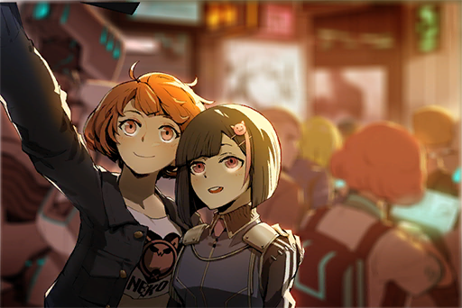
### Replies
**NEKOSAIKOU** 
WHAT!?!?!? Damnit you will be cursed til the day you die  
(Φˋ皿ˊΦ)!!!!

**Rinko** 
Hohoho you're jealous aren't you!!!! LOLOL

**NEKO#ΦωΦ** 
Ehh my eyes look like dead fish, would not have taken the photo if I knew that...  
((  ΦдΦ  ))

**Rinko** 
Nah it's very cute! No problem at all! b

**NEKOSAIKOU** 
NEKO is always cute no matter what\~

[*(Click here to go back to the top)*](#toc)

## <a id="o0501"/>\[#005\] Disgusting
### Requirements
| Char.  |Lv.|Lv. Locked?|
|--------|:-:|:---------:|
|**PAFF**| 6 |    No     |

### Post
**iluvpuf** 
Harassing PAFF is a disgusting act. Stop pretending that you know her well A\-hole
### Replies
**AngryFan** 
Can't stand it!

**NEKOSAIKOU** 
You're pretty disgusting too LMFAO  
\[User is now banned.\]

**iluvpuf** 
Wildcat pissing all over the place

**AngryFan** 
Just ban him

**iluvpuf** 
Banned

[*(Click here to go back to the top)*](#toc)

## <a id="o0601"/>\[#006\] BGM
### Requirements
|   Char.    |Lv.|Lv. Locked?|
|------------|:-:|:---------:|
|**NEKO#ΦωΦ**| 7 |    No     |

### Post
**KiwaHu** 
The songs played in cyTus Lobby are soooooo bad... every time I log in I hear a bunch of trash songs
[*(Click here to go back to the top)*](#toc)

## <a id="o0701"/>\[#007\] Drones
### Requirements
| Char.  |Lv.|Lv. Locked?|
|--------|:-:|:---------:|
|**PAFF**|10 |    No     |

### Post
**MYMYM** 
About those unmanned drones that the admins deploy in the Nodes, do they video\-tape you? Last time I was peeing, one just happens to fly past the window...
### Replies
**Shibawu** 
You can file a complaint on this TBH

[*(Click here to go back to the top)*](#toc)

## <a id="o0801"/>\[#008\] ID chip
### Requirements
|    Char.    |Lv.|Lv. Locked?|
|-------------|:-:|:---------:|
|**ROBO_Head**|10 |    No     |

### Post
**Mist101** 
Is it illegal to swap ID chips with someone else? How about one person owning multiple IDs that connects to cyTus?
### Replies
**NewPolice** 
Not illegal in either case, but A.R.C. might ban your IDs if they find out.

[*(Click here to go back to the top)*](#toc)

## <a id="o0901"/>\[#009\] The limits of Artificial Intelligence
### Requirements
|    Char.    |Lv.|Lv. Locked?|
|-------------|:-:|:---------:|
|**ROBO_Head**|11 |    No     |

### Post
**KirinKiraKira** 
I know technology is quite developed right now. However, Artificial Intelligence is nowhere near the level of having a virtual girlfriend! WTF is A.R.C. doing?
### Replies
**Mohito** 
I thought it's a serious discussion based on the topic; turns out is buncha nonsense...

**KirinKiraKira** 
What are you talking about... did you realize that's the dream of countless single men? Don't act that you never thought of that you nerd\~

**Uctron_Rust** 
As of now, the peak of AI should be **@ROBO\_Head**, right? He can even create his own music

**ROBO_Head** 
All calculations this Unit has done, result of integrating data from internet. Does not qualify as "Intelligence"

**KirinKiraKira** 
Robo\_head is so strict...

**AliceinCytus** 
A.R.C.'s mechanical pets are already pretty amazing. They act almost exactly the same as real animals. A while ago my friend's MeowBot got ran over by a car; she cried so hard that I really believe it's an actual pet that died

[*(Click here to go back to the top)*](#toc)

## <a id="o1001"/>\[#010\] "IDOL"
### Requirements
|   Char.    |Lv.|Lv. Locked?|
|------------|:-:|:---------:|
|**NEKO#ΦωΦ**|11 |    No     |

### Post
**NEKOSAIKOU** 
Look at that "IDOL", one "moe" gesture and all these weebs can't control their d\*\*\*s. Man I'm gonna go puke LMFAO
### Replies
**KirinKiraKira** 
It looks so fake too, never understand why these weeaboos would actually think its real XD

**Smurky** 
It's so easy to scam these weebs=w=

**NEKOSAIKOU** 
TBH I've donated quite a bit of money to **@NEKO\#ΦωΦ**, so maybe I'm not the one to judge lmfao

**KirinKiraKira** 
You should go read the interview from a while ago. Helena's stories of her "past" will make your stomach twist in all directions rofl

**NEKOSAIKOU** 
Nope, not doing that Lmfao

[*(Click here to go back to the top)*](#toc)

## <a id="o1101"/>\[#011\] Bloody Hell
### Requirements
|   Char.    |Lv.|Lv. Locked?|
|------------|:-:|:---------:|
|**NEKO#ΦωΦ**|12 |    No     |

### Post
**KiwaHu** 
If you are doing human body art or small reforms, don't go to BH. Customer service is slow and their attitude is crap. Dealing with them drives me nuts.
### Replies
**iNydM0N3Y** 
It seems the only time they provide good service is when the customer is rich AF

**BodyHack Service** 
We are currently developing anger management chips. Maybe we can give you a free trial.

[*(Click here to go back to the top)*](#toc)

## <a id="o1201"/>\[#012\] Æsir\-FEST sucks
### Requirements
|    Char.    |Lv.|Lv. Locked?|
|-------------|:-:|:---------:|
|**ROBO_Head**|13 |    No     |

### Post
**Popo** 
Found a ticket stub for Æsir\-FEST in the drawer, got really pissed off when I remember that the main act never showed up!!!
### Replies
**iNydM0N3Y** 
Thank goodness it's free, and we still got the opening performances of Robo\_head and PAFF

**Popo** 
I don't remember the opening acts too well, but it's NOT OK to make everyone wait in front of the main stage for two goddamn hours

**Jingleglimmer** 
How come what I've heard it's that there was a blackout?

**Rabbitdora** 
But didn't NEKO said that it just wasn't held at all? Is it really a blackout?

**Popo** 
What blackout? It was bright as s\*\*\*

[*(Click here to go back to the top)*](#toc)

## <a id="o1301"/>\[#013\] Discomfort during connection
### Requirements
| Char.  |Lv.|Lv. Locked?|
|--------|:-:|:---------:|
|**PAFF**|14 |    No     |

### Post
**Majaja** 
Recently when I connect to cyTus, I get this nauseating feeling. Doctors can't figure out what's wrong either. Should I file a complaint to A.R.C.?
### Replies
**Miyoko1212** 
My friend also has similar issues, problems with the chips?

**Jingleglimmer** 
Does the nausea just pop up randomly? or do they appear under certain circumstances?

**Majaja** 
Yes! It only occurs during virtual connections. Every time I get this Déjà vu feel, not sure if it's music I've heard or scenes I've seen. Then the nausea starts.

**RamenBot** 
Maybe you're a time traveler lol

**HC** 
Remember to drink chocolate milk to lessen the discomfort XDDD

**Majaja** 
What's with all the Sci\-Fi references...?

[*(Click here to go back to the top)*](#toc)

## <a id="o1401"/>\[#014\] I don't understand what A.R.C is doing
### Requirements
|    Char.    |Lv.|Lv. Locked?|
|-------------|:-:|:---------:|
|**ROBO_Head**|16 |    No     |

### Post
**Uctron_Rust** 
That Colin Neumann Jr. guy that A.R.C. just hired as an advisor, wasn't he arrested by the admins ten years ago for trespassing into the Ruins? Why would A.R.C. get someone with such a questionable resume?
### Replies
**Mecha_Giga** 
The fact is that the "trespassing into Ruins" thing only applies in Node08, hence the headlines back then. Other Nodes don't give a damn about people wandering into the Ruins. If you ask me, I think A.R.C. has more problems with all the shady stuff with the admins.

**Rabbitdora** 
I mean, the admins have no business dealing with stuff outside the Node area right lol

**RamenBot** 
Is his trespassing something to do with the hospital?

**SoundOfF** 
You can look into the news archives of this guy. For several years, all breakthroughs A.R.C. made happened because of him XD

**Juggernaut** 
You mean writing papers that utterly destroyed A.R.C.'s "research"? Hahaha.

**Mohito** 
He went missing for several years, recently he started a new account for music purposes I think

**Colinforever** 
Colin Sensei is a legend ok? He is not your typical run\-of\-the\-mill scholar

[*(Click here to go back to the top)*](#toc)

## <a id="o1501"/>\[#015\] \[Question\] Picking Furniture
### Requirements
| Char.  |Lv.|Lv. Locked?|
|--------|:-:|:---------:|
|**PAFF**|15 |    No     |

### Post
**Jack** 
So now I've reached "that" age, eh? One that struggles with finding a suitable dining room decoration. We have hologram comparisons and simulation trials too, how come I still can't find a good match?
### Replies
**HC** 
You're thinking too much. Don't forget to check out the latest catalog! I saw a pretty neat set of table lamps, looks really nice when you set it up\~

[*(Click here to go back to the top)*](#toc)

## <a id="o1601"/>\[#016\] iM UI
### Requirements
|   Char.    |Lv.|Lv. Locked?|
|------------|:-:|:---------:|
|**NEKO#ΦωΦ**|16 |    No     |

### Post
**Shibawu** 
iM's UI is getting worse with every "patch", especially the virtual connection interface, which is now a complete mess... my head hurts every time I use it
### Replies
**HC** 
Is it? I think it's pretty good, much better than the version couple of years ago

**TearFox** 
If you get virtual connection sickness then use the mobile or PC version

**Arayray** 
If you get dizzy than don't surf the net with chips lol

[*(Click here to go back to the top)*](#toc)

## <a id="o1701"/>\[#017\] PrayForPAFF
### Requirements
| Char.  |Lv.|Lv. Locked?|
|--------|:-:|:---------:|
|**PAFF**|18 |    No     |

### Post
**iluvpuf** 
> PAFF is a very shy child. I know that because I grew up with her. Her devotion to fans and her efforts to try communicating with this world through music, I've witnessed it all with my own eyes.  
>  
> I would like fans to not abandon her due to her physical shortcomings. Besides music, your support is the only thing that keeps her going.

PAFF's story is so touching. Get well soon QQ** 
\#PrayForPAFF**
### Replies
**SancTityKnight** 
She did have some symptoms during past events. but it seems really serious this time... 
**\#PrayForPAFF**

**PoolsKitten** 
It's just too sudden 
**\#PrayForPAFF**

**HolyEarth** 
Sis Helena is one heck of a sister... 
**\#PrayForPAFF**

**MAN_Dora** 
Now I like her even more\~ 
**\#PrayForPAFF**

**CyKa** 
**\#PrayForPAFF**

[*(Click here to go back to the top)*](#toc)

## <a id="o1801"/>\[#018\] Man my sides are cramping
### Requirements
|   Char.    |Lv.|Lv. Locked?|
|------------|:-:|:---------:|
|**NEKO#ΦωΦ**|19 |    No     |

### Post
**NEKOSAIKOU** 
OMFG really fainting on stage lololol are we going the cheesy soap opera route now?
### Replies
**Smurky** 
Several audiences also fainted as well. A collaborated act?

**NEKOSAIKOU** 
Maybe the singing is so horrible that they rather faint lolololol

**beeeeeeeeee** 
I think it might be real this time. I mean what's the benefit of making such a fuss?

**NEKOSAIKOU** 
Are you dumb? They need this fuss to cover up their old news. Remember all that copyright controversy Mono is going through? Nobody's talking about it now with all this tragedy stuff taking over the headlines lololol

**Poopytrap** 
Hmmm you had a point there XD

**NEKOSAIKOU** 
**@NEKO\#ΦωΦ** has already seen through all this BS man she good LOLOL

[*(Click here to go back to the top)*](#toc)

## <a id="o1901"/>\[#019\] \[Repost\] Virtual area for concert has connection issues, hundreds affected
### Requirements
| Char.  |Lv.|Lv. Locked?|
|--------|:-:|:---------:|
|**PAFF**|18 |    No     |

### Post
**STANley** 
> A few days ago, famous singer PAFF collapsed on stage during her annual concert. At the same time, audience members in the virtual area began to collapse as well. Several people in the physical area also displayed discomfort. In the hundreds of people affected by this issue, 11 have yet to regain their consciousness.  
>  
> An A.R.C. spokesperson stated today," We will begin the investigation of this incident as soon as possible. For the time being, we would like everyone to limit their use of virtual connections. 

### Replies
**STANley** 
It has been several days already, ASAP my ass.

**TunaLee** 
A.R.C. screwed up big this time

**Agugu** 
All that is just bureaucratic jargon BS; not the first time they said something like that

[*(Click here to go back to the top)*](#toc)

## <a id="o2001"/>\[#020\] In a coma
### Requirements
| Char.  |Lv.|Lv. Locked?|
|--------|:-:|:---------:|
|**PAFF**|19 |    No     |

### Post
**kou** 
My younger brother has been in a coma ever since the PAFF concert...
### Replies
**Juggernaut** 
A.R.C. needs to shoulder the biggest responsibility for this incident

**Arayray** 
Write a letter to the Administration Bureau!

**NerfThat** 
That's pointless, the admins don't have the balls to go against A.R.C.

**kou** 
I don't know what to do now...

[*(Click here to go back to the top)*](#toc)

## <a id="o2101"/>\[#021\] BORING
### Requirements
|   Char.    |Lv.|Lv. Locked?|
|------------|:-:|:---------:|
|**NEKO#ΦωΦ**|19 |    No     |

### Post
**RamenBot** 
It's been so boring these days, is there any news besides the PAFF stuff
### Replies
**BUCK$** 
If iM crashed someday, that would be quite the news

**Y4NK** 
If iM crashed, how are we going to read the news in the first place?

**Jingleglimmer** 
S\*\*\* you have a point. But A.R.C. likely won't let something like that happen right?

**Juggernaut** 
Can't be certain, maybe they'll give us some more PC crap

**Rabbitdora** 
Hahahaha, if it really happens it will be complete and utter chaos

[*(Click here to go back to the top)*](#toc)

## <a id="o2201"/>\[#022\] Recommended spots in Quadrant II
### Requirements
|    Char.    |Lv.|Lv. Locked?|
|-------------|:-:|:---------:|
|**ROBO_Head**|19 |    No     |

### Post
**SH11HO** 
I'm going to Quadrant II today, any recommendations?
### Replies
**BUCK$** 
For a date? XD

**SH11HO** 
Just going shopping with a friend!

**BUCK$** 
I know, don't have to explain man 
If you want a place to drink booze I highly recommend JOEZ Café. The drinks are tasty, music is great and the owner is a really nice guy

**SH11HO** 
Great, I'll go check it out. Thanks man

[*(Click here to go back to the top)*](#toc)

## <a id="o2301"/>\[#023\] My new prosthetic
### Requirements
|    Char.    |Lv.|Lv. Locked?|
|-------------|:-:|:---------:|
|**ROBO_Head**|20 |    No     |

### Post
**Roger** 
Here to tell everyone some good news. My application for a more powerful prosthetic has been accepted. I can get my new limbs this week \\oo/
### Replies
**Pinevalley** 
Ehhhh? Is that stuff safe? Wasn't there an incident where that thing went nuts!??

**Roger** 
In that incident the guy bought a defective product. Mine's from BH so it will be a\-okay

**Justin888** 
Next time you're going anywhere post it on iM; I'll be sure to stay far away from that location

**BodyHack Service** 
**@Justin888** We have plenty of service stations all over the world in each Node. If you are really concerned about your safety we suggest that you go live in the forbidden areas.

**TunaLee** 
Got'em! My god BH's official account is so baddd XDDD

[*(Click here to go back to the top)*](#toc)

## <a id="o2401"/>\[#024\] I know it's sponsored content but...
### Requirements
|   Char.    |Lv.|Lv. Locked?|
|------------|:-:|:---------:|
|**NEKO#ΦωΦ**|20 |    No     |

### Post
**EvilForce** 
Hey did you guys see the game NEKO was streaming?
### Replies
**NEKOSAIKOU** 
We are you to call her by name, add a proper prefix!

**Pinevalley** 
The one with a tongue\-twisting title?

**Arayray** 
NEKO's pretty good at it, is it fun?

**EvilForce** 
NEKO is actually a very skilled gamer, don't know why she pretends to be a noob on her streams rofl

**AliceinCytus** 
In my opinion, the products of this particular company are pretty good. The quality is always there; their release schedule on the other hand...

**Roger** 
Making a game is time\-consuming ya know, give them a break

**iNydM0N3Y** 
I mean the only thing you do in this game is charge towards the enemy right? Who gives a damn about the other stuff they spend so much time on qQq

[*(Click here to go back to the top)*](#toc)

## <a id="o2501"/>\[#025\] Latest Movie
### Requirements
|   Char.    |Lv.|Lv. Locked?|
|------------|:-:|:---------:|
|**NEKO#ΦωΦ**|21 |    No     |

### Post
**TunaLee** 
Heard that there's a fun movie that just came out. It's a sequel that is 30 years late though
### Replies
**SH11HO** 
You mean the sequel to Episode 17?

**Y4NK** 
Wait, isn't it Episode 18?

**Pinevalley** 
The one with telepathy and psychic powers?

**Mist101** 
The Final Doomguy? Or the one with a year in the title?

**MYMYM** 
I thought it was the one where music is used as weapons and involves giant robots vs aliens in space

**STANley** 
I'm completely messed up after reading all this...

**Marshall** 
As long as it's not a horror film I'm ok with it. I can't handle scary stuff QQ

[*(Click here to go back to the top)*](#toc)

## <a id="o2601"/>\[#026\] Tips from Dr.Hawkins
### Requirements
|    Char.    |Lv.|Lv. Locked?|
|-------------|:-:|:---------:|
|**ROBO_Head**|22 |    No     |

### Post
**Dr. Hawkins** 
Although it's a bit weird to give this tip on iM, I would advise everyone to control their time using the internet.  
Recently, there has been a significant increase in patients who visit us due to discomfort caused by virtual connections. We have categorized them as victims of an internet addiction syndrome. 
No matter how advanced technology has become, using the virtual connection for a long period of time will still cause a certain level of stress to the brain. Please take good care of your body.
### Replies
**Y4NK** 
Agreed. Many of my friends are like that and their memory is getting worse

**NerfThat** 
I'm so scared that I'm keeping my surfing time to under 2 hours per session...

**RamenBot** 
What should we do if we are already affected??

**Dr. Hawkins** 
As of now, there is no complete cure for faltering in memory/balance and cognitive disorders. Patients with serious symptoms sometimes fall into a coma.

Just like the past, failure in eyesight due to overuse of electronic products is also incurable. Therefore before we discover a complete solution, I can only give tips like this to prevent these symptoms from happening in the first place.

**Pinevalley** 
Terrifying! Gotta get offline now\~

**Aceman** 
Thank you for the tip doctor. More people need to know about this

[*(Click here to go back to the top)*](#toc)

## <a id="o2701"/>\[#027\] A short trip
### Requirements
|   Char.    |Lv.|Lv. Locked?|
|------------|:-:|:---------:|
|**NEKO#ΦωΦ**|23 |    No     |

### Post
**Marshall** 
Just came back from a holiday, man finally feels alive again. You really need to leave your job completely to get actual rest... I attended a mental enhancing camp in another Node; it was a great experience.
### Replies
**RamenBot** 
Your application actually got granted?

**Wannacry** 
Last time I had to wait in line for an entire morning before it's finally my turn...

**AliceinCytus** 
I though cross\-Node traveling is the pain in the neck. Last time someone's application wasn't granted... they had to be deported from another Node and sent back QQ

**Marshall** 
It worked just fine for me though. Just remember to apply earlier, then wait for a short while. As long as you inform your company everything should be okay.

**CHanatsuka** 
It's a bit annoying, but an early application does indeed help.

**Y4NK** 
Maybe I should plan a trip too. I'm way too exhausted at work these days.

[*(Click here to go back to the top)*](#toc)

## <a id="o2801"/>\[#028\] Weird\-ass experience
### Requirements
| Char.  |Lv.|Lv. Locked?|
|--------|:-:|:---------:|
|**PAFF**|23 |    No     |

### Post
**Mecha_Giga** 
This is a weird\-ass experience I heard from a friend's friend. He said that he fell asleep without removing the virtual connection cable. He had a dream where he's surfing the net and sending messages to friends. After he woke up, he found out that it wasn't just a dream; he actually sent out those messages in real life...
### Replies
**TunaLee** 
Didn't the manual for the chips say that you shouldn't sleep with the cable connected?

**RamenBot** 
Woah that's creepy. Never thought the "it's a dream so I can do whatever I want" scenario would actually exist OAO

**KiwaHu** 
You can send urban legend stuff to **@ROBO\_Head** XD

**ROBO_Head** 
Recommend proper and normal use of electronic products.

[*(Click here to go back to the top)*](#toc)

## <a id="o2901"/>\[#029\] Who the hell is that "Cherry" girl?
### Requirements
| Char.  |Lv.|Lv. Locked?|
|--------|:-:|:---------:|
|**PAFF**|23 |    No     |

### Unlocked Charts
|     Song     |Char.|Diff.|Lv.|
|--------------|:---:|:---:|:-:|
|**Green Hope**|PAFF |Chaos|11 |

### Post
**Hatehate** 
Why would PAFF collaborate with some nobody... is this some rich brat who wants to ride on her coattails?
### Replies
**Mohito** 
I believe something similar happened before?

**Hatehate** 
Hmmm I think there was

**Pinevalley** 
I remember that. Wasn't it a veteran producer who wants his child to debut? He singlehandedly took care of everything from music to MV to producer...

**Hulujam** 
Must be nice to have a rich dad...

**Roger** 
Maybe his child doesn't want to be in showbiz? Maybe she wanted to be a doctor?

**Hatehate** 
If you think of it that way, a life where your path is already decided for you doesn't seem so fancy after all...

[*(Click here to go back to the top)*](#toc)

## <a id="o3001"/>\[#030\] So memories can be deleted?
### Requirements
|    Char.    |Lv.|Lv. Locked?|
|-------------|:-:|:---------:|
|**PAFF**     |24 |    No     |
|**NEKO#ΦωΦ** |24 |    No     |
|**ROBO_Head**|24 |    No     |

### Post
**Mohito** 
I was an audience at Æsir\-FEST. Before I don't remember seeing Æsir on stage when recalling this event. I get sick and my memory is blurry. 
After reading Robo\_head's post, I am very certain that Æsir did take the stage and perform that day. I'm also quite confident that this is my actual/correct memory.  
If this really is the doing of a hacker or virus, this means that memories can be deleted through virtual connection. Therefore I would advise everyone to stay away from it.
### Replies
**Hulujam** 
Wait but aren't you using it now...

**Mohito** 
I wrote this post with my phone, not virtual connection... I won't take the risk ever again.

**Roger** 
You serious... isn't this a bit much?

**Mist101** 
What's this Mandela Effect stuff...

**KiwaHu** 
A.R.C. is now in DEEP trouble

**STANley** 
This is nuts. Just read the news and now I see your post. Gotta disconnect now.

**Mecha_Giga** 
Before everything is settled, we should stay away from it. This is much more serious than your memory cell data being wiped...

**AliceinCytus** 
I also remembered it after seeing the news and Robo\_head's post. On top of that, I began to throw up the very instant I remembered everything...

**kou** 
Computer viruses affecting people's physical conditions; what in the world...

**Miyoko1212** 
Let's cut down on the surfing, like seriously...

[*(Click here to go back to the top)*](#toc)

## <a id="o3101"/>\[#031\] Me first
### Requirements
|   Char.    |Lv.|Lv. Locked?|
|------------|:-:|:---------:|
|**NEKO#ΦωΦ**|25 |    No     |

### Post
**EvilForce** 
Let me get everyone some keywords: 
Rookie debut 
Publicity stunt 
Jerry\-built 
Not surprised, it's XX
### Replies
**Jingleglimmer** 
You got some insider news big guy?

**Juggernaut** 
What rookie? Æsir? Cherry PuNK?

**An0nym0us** 
Not surprised, it's Mono?

**CyKa** 
Publicity stunt my a\*\*, this is a goddamn terrorist attack. What kind of idiot would want THIS as publicity

**Eighty7** 
I give this dream an A for "Absolute BS"

[*(Click here to go back to the top)*](#toc)

## <a id="o3201"/>\[#032\] What the actual \*\*\*\* are they up to !!!
### Requirements
|    Char.    |Lv.|Lv. Locked?|
|-------------|:-:|:---------:|
|**ROBO_Head**|25 |    No     |

### Post
**NEKOSAIKOU** 
What the heck are the admins up to!? How can they restrain someone for so long?
### Replies
**KirinKiraKira** 
Yeah even the iM account has been taken over WTH!!!

**Smurky** 
If there is no direct evidence, there should be a time limit for detainment

**NEKOSAIKOU** 
I don't give a damn nor will I believe the admins' BS. NEKO is a victim just like all of us, can't they tell?

**NekoSamurai** 
Don't mention that, my head still hurts like hell

**Poopytrap** 
**@Xenon** No findings at all?

**KirinKiraKira** 
I feel that A.R.C. definitely knows something, but they just don't want to reveal it

[*(Click here to go back to the top)*](#toc)

## <a id="o3301"/>\[#033\] Overtime nightmare ongoing
### Requirements
| Char.  |Lv.|Lv. Locked?|
|--------|:-:|:---------:|
|**PAFF**|25 |    No     |

### Post
**OMGQQ** 
No kidding, easily biggest crisis since I joined the company
### Replies
**Rabbitdora** 
Sry about that, good job on the hard work

**MonoShachiku** 
I now have an urge to puke when I see the ticketing system UI

**Justin888** 
Judging from that comment, I can pretty much guess where the original commenter works lolol

**T.Goldwell** 
That fire is burning right up your a\*\* isn't it XD

**Pascal626** 
Sounds crappy!!

**N0B0DY** 
GL on your job lol. Oh btw I need a refund for two tickets

[*(Click here to go back to the top)*](#toc)

## <a id="o3401"/>\[#034\] It's just a dream, just a dream
### Requirements
|    Char.    |Lv.|Lv. Locked?|
|-------------|:-:|:---------:|
|**ROBO_Head**|26 |    No     |

### Post
**Dreamer** 
In my dream, the most influential organization in Node 08 actually contains some shady people that are stealing their recreated\-yet\-undeveloped tech to sell them for a huge profit. You know, dangerous things like Anti\-gravity tech\~ weapons of mass destruction\~ enhancement surgery\~ bioweapons...etc.
### Replies
**Dreamer** 
Think about it, what if Æsir\-FEST is also a part of their experiments? Maybe the admins already now, but still allow it to happen because of mysterious reasons?

**Dreamer** 
A.R.C.'s core principle is to maximize technology development. It sounds fine and dandy by saying that it's "for the sake of humanity", but in fact they may still want to control everything, right? The two\-to\-three\-hour memories of millions of people seem like an insignificant sacrifice under these ideals.

**Andy_Roid** 
This sounds way too much like a conspiracy theory. I mean, what benefit does this bring them?

**Dreamer** 
Maybe there's some super advanced tech that requires an experiment of this scale. Don't forget that before the virtual internet was developed, A.R.C. was nowhere near its current status of power

**MaxLCK** 
I have plenty of friends who work at A.R.C., I believe they won't do something like this

**Lynx87** 
**@Xenon** knock knock, come out and explain yourself\~\~\~

**Shrimpyy** 
I feel like all things exist for a reason though 
If there are rumors. there's always a possibility that it's real

**SuduMan** 
Guy above me, you are falling into the conspiracy theorists' trap by thinking like that!!

**Eighty7** 
I give this dream an A for "Absolute BS"

**MustangMartin** 
I'm pretty sure I've seen this exact phrase somewhere else

**Link8787** 
Room Service!! **@Xenon**

**WhiteEYE33** 
Room Service!! **@ROBO\_Head** (Following Up) 
\[This comment reported for spam\]

**ROBO_Head** 
This unit detect tag spamming. Reported

**ElinaDaniel** 
Haha, get screwed you tag spammers!

**TunaLee** 
Hahaha first time seeing Robohead reporting people with his admin powers

**Ayx_Socket** 
I get a feeling this thread's gonna blow up lol

**Abin** 
Same here, better post

**Flower_Head** 
Did anyone notice that ever since the Æsir\-FEST things got revealed, iM became super active because of that rofl

**TobeTobe** 
Yeah my entire social circle is talking about it 
Can't help it though, since it affected so many different walks of life

**Ararar** 
I'm here\~\~\~

**DustyAsh** 
Look ma I'm here!!! I get a feeling I'll be on NNN\~\~\~(?

**Cybel_Mach** 
Didn't some analyst predict a while ago that iM "will be a thing of the past"

**Andy_Roid** 
I'm here as well!

[*(Click here to go back to the top)*](#toc)

## <a id="o3501"/>\[#035\] Why all the beating around the bush
### Requirements
| Char.  |Lv.|Lv. Locked?|
|--------|:-:|:---------:|
|**PAFF**|26 |    No     |

### Post
**iluvpuf** 
Monophonic's handling of this case is so infuriating. We don't want refunds; we want to know PAFF's current situation and whether or not she is OK!  
I contacted Sis Helena a few times too and got no response at all. God all this anxiety is getting on my nerves, can't even eat properly now>"<
### Replies
**SancTityKnight** 
Yeah I'm worried sick 
Mono's been p\*\*\*ing me off a lot lately

**PoolsKitten** 
The recent Æsir incident is not properly explained either

**iluvpuf** 
Æsir\-FEST was already an event where everyone has their own version of the story. Then Robohead came out and revealed that the event was held; it's just that everyone's memory of it was gone. But instead of clearing things up, it led to even more weird\-a\*\* speculations lol

**HolyEarth** 
\*Raise hand\* I participated, I have no memory

**MAN_Dora** 
Anyone have the contact information of other people that work for Mono?

**CyKa** 
It's pointless. Recently they've issued a gag order to all their employees

[*(Click here to go back to the top)*](#toc)

## <a id="o3601"/>\[#036\] \[Finish the survey and win prizes\] Anyone want a shot
### Requirements
|    Char.    |Lv.|Lv. Locked?|
|-------------|:-:|:---------:|
|**NEKO#ΦωΦ** |26 |    No     |
|**ROBO_Head**|26 |    No     |

### Post
**NekoSamurai** 
A. Æsir is just a puppet. There's a true mastermind behind this 
B. Æsir is the one\-man terrorist army against humanity 
C. Æsir doesn't exist. Robo\_Head and others have been lying all this time 
D. I am Æsir
### Replies
**Brightswirls** 
E. This is a shitpost

**SIhama** 
Oops picked E by accident

**StuffyMouth** 
Obviously E

**Eighty7** 
BS post, BS choices

**GemFeather** 
I think it's A though; since he's just a musician??

**Noposa** 
If it's D, then will we lose our memories after reading this post XDDD

**STANley** 
If this post gets hacked in minutes then that's REALLY scary

**Zigzag** 
You screwed they're coming after your a\*\*

**Flower_Head** 
Judging from Robohead's previous analysis, I feel like B is not out of the question...

**ROBOLUV** 
Should we tag Robo to analyze

**Manpora** 
There's an idiot who was spamming tags and got reported lmfao

**NnNn** 
My guess is C!

[*(Click here to go back to the top)*](#toc)

## <a id="o3701"/>\[#037\] Anyone got a streamer recommendation \~\~\~\~?
### Requirements
|   Char.    |Lv.|Lv. Locked?|
|------------|:-:|:---------:|
|**NEKO#ΦωΦ**|27 |    No     |

### Post
**NnNn** 
Since NEKO's stream was shut down, all you hear is old music when you connect to the stream now
### Replies
**KirinKiraKira** 
No more game streams

**Smurky** 
No more S\*\*\*talk time

**Poopytrap** 
No more radio show

**NekoSamurai** 
No more banned folks

**NEKOSAIKOU** 
No more NEKO...

**KiwaHu** 
This is so miserable 
Screw  
this life

**KiwaHu** 
I rather 
leave behind this 
sad, miserable world

**CHanatsuka** 
Let me leave this world with you!!

**KiwaHu** 
F\*\*\* off.

[*(Click here to go back to the top)*](#toc)

## <a id="o3801"/>\[#038\] About that Xenon
### Requirements
|    Char.    |Lv.|Lv. Locked?|
|-------------|:-:|:---------:|
|**ROBO_Head**|27 |    No     |

### Post
**Nyd_Ans** 
Aren't you working some sort of internet security\-related job at A.R.C.? 
Got anything?
### Replies
**Axroid_Sona** 
What related job? The entire virtual internet security system is basically his handiwork lul, well maybe there's a team who works with him

**ShadowForest** 
It seems like he's not willing to say too much about this

**DuskDawn** 
Hiding something?

**Doubty** 
Maybe he's the one behind it

**Brock3tt** 
Don't like him

**Irisa0938** 
He rarely talks about work on his account in the first place

**Copper_stone** 
Probably another one of A.R.C.'s pets; never expected much from him

**Arya_Poke** 
Rumor has it that he has a s\*\*\*\*\* personality, and his love life is a mess too

**AntiMetal** 
People in music bands are always like that, especially metal bands

**Gogossip** 
Got gossip?

**Cipher_troll** 
There were rumors about him dating NEKO a while ago, then recently someone saw him getting back together with his ex\-girlfriend Cherry

**Andy_Roid** 
Cherry? Who's that?

**CyberLord** 
That Cherry PuNK girl right? The one that has been covering up for PAFF a lot these days

**Rob_Oto** 
Let's tag him XDDD Hey **@Xenon**\~\~\~\~\~ tell us about your gossip \~\~\~

**NoProblemo** 
You're gonna get reported if you keep tagging like this lol

[*(Click here to go back to the top)*](#toc)

## <a id="o3901"/>\[#039\] I find NEKO to be the biggest suspect
### Requirements
|   Char.    |Lv.|Lv. Locked?|
|------------|:-:|:---------:|
|**NEKO#ΦωΦ**|28 |    No     |

### Post
**AntiNEKO** 
Not that I want to single her out, but when her posts are regularly filled with extreme comments, it simply makes it very hard to believe that she's truly innocent
### Replies
**Manpora** 
But why would she hack her own audience? 
Isn't that shooting herself in the foot??

**RaiKiyumi** 
Finally resorting to stupid s\*\*\* for a publicity stunt I guess

**Lynx87** 
No one is actually THAT stupid!!... I think

**Muahaha** 
I used to really hate her 
After these recent incidents... 
. 
. 
. 
. 
. 
I hate her even more XDD 
F\*\*\* U, you deserve it!

**JusticeMe** 
Haha well deserved indeed! That's what you get for always trying to create chaos get rekt b\*\*\*\*（￣へ￣）

**Poopytrap** 
Stop talking trash about NEKO!!! 
The investigation is still ongoing!!!

**Miyoko1212** 
It's pretty much GG when the admins come after your a\*\* though

**KirinKiraKira** 
Not really, it's only for investigation, right?

**Trashtalker** 
Nice, one less piece of \*\*\*\* for this world to worry about

[*(Click here to go back to the top)*](#toc)

## <a id="o4001"/>\[#040\] Did anyone remember what happened yesterday??
### Requirements
|    Char.    |Lv.|Lv. Locked?|
|-------------|:-:|:---------:|
|**NEKO#ΦωΦ** |27 |    No     |
|**ROBO_Head**|27 |    No     |

### Post
**lenba** 
I remember that I attended the launch celebration party, but have no memories of what actually happened. I woke up today on my bed still wearing my suit
### Replies
**MYMYM** 
Did you really not remember anything lul? Maybe you've been Æsir\-ed XDD

**lenba** 
I somewhat recalled that I talked a lot of nonsense? 
Oh god, I hope that I didn't say anything TOO offensive?

**Hulujam** 
I think you're ok. Your colleague from Node14 took that cake for "most WTF" last night XD

**STANley** 
You mean **@Kemcoter** ?? LOLOLOL

**Marshall** 
Was he really THAT drunk XDD

**beeeeeeeeee** 
Dude he was TRASHED!! He had absolutely no memories of what happened XDDDD

**NathaN** 
He went completely nuts and started slurring his native language nonstop. Oh and he ate bananas with his bare hands

**RamenBot** 
Wait, what bananas??

**lrrllrrl** 
He peeled the entire banana (like the whole thing) and grabbed it with his bare hands then started swinging it around like he's Donkey Kong on crack. I... I can't...

**TunaLee** 
**@lenba** you were super cute yesterday though

**maplewing** 
Wanna see a recording XDDD

**lenba** 
U...ummm I'll pass on that XD

**Rabbitdora** 
Should we hold another party the next time we have a product launch?

**C.Y.** 
Sure

**Kemcoter** 
I woke up in the middle of the night yesterday only to find myself sleeping on the lobby floor. Why did nobody wake me up!!!

**moonin** 
Because after you got drunk, you were running around like a madman and literally sticking your face to other people's faces when they were trying to talk to you!!!

**KiwaHu** 
**@Kemcoter** so that was you. I was wondering why there's a weird noise outside, hence why I never left my office.

**JAC-jack** 
Goddamnit I was not there f\*\*\*\*\*\* \~\~\~\~ looks like I missed a lot of good s\*\*\*!!

**CHanatsuka** 
No worries man. We'll hold another one when the next version launches!!

[*(Click here to go back to the top)*](#toc)

## <a id="o4101"/>\[#041\] Someone get me an Æsir event for dummies pls!!
### Requirements
|   Char.    |Lv.|Lv. Locked?|
|------------|:-:|:---------:|
|**NEKO#ΦωΦ**|29 |    No     |

### Unlocked Charts
|     Song      | Char.  |Diff.|Lv.|
|---------------|:------:|:---:|:-:|
|**Brain Power**|NEKO#ΦωΦ|Easy | 3 |
|**Brain Power**|NEKO#ΦωΦ|Hard | 8 |
|**Brain Power**|NEKO#ΦωΦ|Chaos|13 |

### Post
**Noposa** 
There's like a boatload of them out there. Multiple different versions too
### Replies
**HC** 
So is there a "reading for dummies" for dummies???

**NnNn** 
**@ROBO\_Head** maybe you should help Xenon analyze the case

**ROBO_Head** 
This unit doesn't have reliable enough evidence ：/ 
Decision: No proper analysis available

**Y4NK** 
EHHHHH how could you!!!

**BUCK$** 
What I had my snacks ready for a big reveal and now you hit me with this!!

**SH11HO** 
It ain't Robohead without the "exposed" stuff \~\~\~\~ you're Roboham now (ΦˋдˊΦ)

**SYY** 
Robowhat???

[*(Click here to go back to the top)*](#toc)

## <a id="o4201"/>\[#042\] \[Sponsored\] Embark on your journey
### Unlocked Charts
|            Song             | Char.  |Diff.|Lv.|
|-----------------------------|:------:|:---:|:-:|
|**Sdorica The Story Unfolds**|NEKO#ΦωΦ|Easy | 2 |
|**Sdorica The Story Unfolds**|NEKO#ΦωΦ|Hard | 5 |
|**Sdorica The Story Unfolds**|NEKO#ΦωΦ|Chaos|10 |

### Post
**Sdorica_Official** 
A grand tale that resonates with your soul; a gameplay experience with great visuals and music

Famous streamer NEKO\#ΦωΦ: "Look at these Beau\~tiful visuals and the music; mmm\~ SO GOOD (\*Φ∀Φ)\~" 
Joint recommendation from several well\-known cyTus gamers and streamers.

Open the Book of Bequeathers and being your fantasy adventure

[**Download Sdorica \-sunset\- now.**](https://app.adjust.com/h0g17k)

[*(Click here to go back to the top)*](#toc)

## <a id="o4301"/>\[#043\] \[Sponsored\] All players in Node 08 are blown away
### Unlocked Charts
|       Song       | Char.  |Diff.|Lv.|
|------------------|:------:|:---:|:-:|
|**Hesitant Blade**|NEKO#ΦωΦ|Easy | 2 |
|**Hesitant Blade**|NEKO#ΦωΦ|Hard | 5 |
|**Hesitant Blade**|NEKO#ΦωΦ|Chaos|11 |

### Post
**Sdorica_Official** 
Follow NEKO\#ΦωΦ and take part in this uber popular game!

A fantasy tale that resonates with your soul; 
Infuse the characters, join the battles.

[**Experience Sdorica \-sunset\- for free now!**](https://app.adjust.com/h0g17k)

[*(Click here to go back to the top)*](#toc)

## <a id="o4401"/>\[#044\] More of this BS and I'm going to Mono for some actual answers
### Requirements
| Char.  |Lv.|Lv. Locked?|
|--------|:-:|:---------:|
|**PAFF**|30 |    No     |

### Post
**An0nym0us** 
Haven't been this disappointed in a company for a while 
Can't even tell us the whereabouts of their own artist 
Cancel events to avoid giving any explanation 
Put in some random rookie and dismiss their fans like that? 
Let's go and show them what the internet can do
### Replies
**Michiko** 
Wouldn't it be awkward\-AF if you are the only one who showed up?

**vvv_IRIS_vvv** 
Where do you want to go ROFL Main entrance of Mono's headquarters? lol

**Mohito** 
Yeah let's go. I'm gonna go even if it means I take a day off. Man, I'm soooo p\*\*\*ed off (\-\_\-\#)

**Mecha_Giga** 
Dude you're gonna get preventive detention 
Recently the admins have been keeping a keen eye on iM 
Even NEKO's account was blocked previously

**Flower_Head** 
Nah that's impossible. Freedom of speech is basic stuff. It's definitely a guaranteed right

**TobeTobe** 
If someone can see all your personal messages in secret yet does nothing and say nothing about it, does this still counts as freedom of speech?

**T3RA_wr47h** 
I think that's called "Violation of privacy" my man @皿@

[*(Click here to go back to the top)*](#toc)

## <a id="o4501"/>\[#045\] Just got my refund
### Requirements
| Char.  |Lv.|Lv. Locked?|
|--------|:-:|:---------:|
|**PAFF**|31 |    No     |

### Post
**IronFan** 
Feeling really nice after the refund. Don't really want to follow any idols now. Don't want to see any entertainment news too.
### Replies
**Dreamer** 
Idol chasing in a Buddhist\-like manner: 
Don't watch news, don't buy tickets

**Shrimpyy** 
Don't follow official iM, don't go to concerts

**Manpora** 
When the time arrives, the idol will naturally appear

**N0B0DY** 
Or in this case, the idol will naturally "dis" appear...

**Lynx87** 
Stop reminding me about that......

**CyKa** 
I'm still worried about what happened to PAFF

**Juggernaut** 
Is there anybody left in Showbiz we can get excited about? Cherry?

[*(Click here to go back to the top)*](#toc)

## <a id="o4601"/>\[#046\] What kind of retard coded this system
### Requirements
| Char.  |Lv.|Lv. Locked?|
|--------|:-:|:---------:|
|**PAFF**|32 |    No     |

### Post
**SuduMan** 
And here I was thinking that I can finally get a refund... 
only for the entire system to suck BALLS!!! 
The user interface is straight up horrendous... 
Did they hire an intern to code this in thirty minutes???
### Replies
**Fuxkoff** 
Yeah, same here. When the "System overcrowded" window popped up, I felt like my head's gonna explode right there!! Probably going to a physical location later to refund

**MonoShachiku** 
Could it be that there are simply too many connections all at once??

**SancTityKnight** 
From what I've heard the physical locations aren't any better either

**T.Goldwell** 
Holy s\*\*\* XDDDDD Guys, I think we just found the newest internet fad: the refund challenge\~\~\~\~\~ XDD

**MustangMartin** 
I just got lost in the refund system. It was horrible  
ヽ(´Д\`；)

**N0B0DY** 
Is this the ninth circle of refund hell lul WTF XD

[*(Click here to go back to the top)*](#toc)

## <a id="o4701"/>\[#047\] F\*\*\* yeah!!!! Eat s\*\*\* stupid dumb admins!!!
### Requirements
|   Char.    |Lv.|Lv. Locked?|
|------------|:-:|:---------:|
|**NEKO#ΦωΦ**|31 |    No     |

### Post
**NekoSamurai** 
NEKO is back, what do you have to say now stupid admins!!! 
The focus of my daily life is now back again\~\~\~\~ (opens stream
### Replies
**KirinKiraKira** 
Yeah\~\~\~\~\~ Celebration time\~\~\~\~\~

**NEKOSAIKOU** 
C 
H 
E 
E 
R 
S 
Mutha F\*\*\*ers!

**Poopytrap** 
\\NEKO/\\NEKO/\\NEKO/\\NEKO/

**C_H_U** 
\*\~\\(ΦωΦ)/\~\*\*\~\\(ΦωΦ)/\~\*\*\~\\(ΦωΦ)/\~\*

**Mulder** 
♡♡♡

**xxScarlexx** 
I feel like her page is gonna explode with people LMFAO

**D33M0** 
People there to worship the rebirth of their idol, right?? XD

[*(Click here to go back to the top)*](#toc)

## <a id="o4801"/>\[#048\] Real Culprit???
### Requirements
|   Char.    |Lv.|Lv. Locked?|
|------------|:-:|:---------:|
|**NEKO#ΦωΦ**|32 |    No     |

### Post
**NEKOSAIKOU** 
Bunch of people on the net said NEKO's behind all this 
Now she's acquitted of all charges, 
those idiots are probably scrambling to delete their posts XDDD
### Replies
**Poopytrap** 
Why the quotation marks in the title...

**KirinKiraKira** 
You only find out who is swimming naked when the tide goes out

**Smurky** 
Look at those idiots scrambling for their pants

**AntiNEKO** 
I'm anti\-NEKO I don't care I'm gonna file a complaint to the admins

**Muahaha** 
Not a criminal now doesn't mean she won't be a criminal in the future!! 
They are the blight on society anyway

**JusticeMe** 
Streamers should not be allowed on streaming platforms

**NEKOSAIKOU** 
Look at all these people having mental seizures lol 
God it's hilarious ROFLMFAO

**ShadowForest** 
The comments are really where all the absurd s\*\*\* go

**Manpora** 
I can't really tell if they are being sarcastic or they are actually serious comments (=￣▽￣=)

[*(Click here to go back to the top)*](#toc)

## <a id="o4901"/>\[#049\] Feels like the focus has been shifted somehow
### Requirements
|   Char.    |Lv.|Lv. Locked?|
|------------|:-:|:---------:|
|**NEKO#ΦωΦ**|33 |    No     |

### Post
**Nyd_Ans** 
Much fewer people seem to care about the Æsir event now?
### Replies
**Axroid_Sona** 
People are more interested in cute female streamers

**ShadowForest** 
The young folks love their precious idols

**DuskDawn** 
I don't think it's fewer; it's just that nobody can remember anything. If there's no information, it's natural that there's no progress.

**Doubty** 
Memory alteration... such a convenient skill >"<

**Wowow** 
I'm waiting for news from ROBO\_head and Xenon

**Irisa0938** 
Xenon don't post a lot these days. He sounded mad in his last post because everyone kept Tagging him

**Copper_stone** 
Don't see too much progress these days on Robohead's page either

[*(Click here to go back to the top)*](#toc)

## <a id="o5001"/>\[#050\] Fellas!!!
### Requirements
| Char.  |Lv.|Lv. Locked?|
|--------|:-:|:---------:|
|**PAFF**|35 |    No     |

### Post
**Dreamer** 
Hurry up\~ quick!!! 
Seems like there are people gathering at the front door of Mono already. Time to launch a true protest to show them how p\*\*\*ed off we are!
### Replies
**Andy_Roid** 
You sure 'bout that??? Are we really having a protest??

**Link8787** 
There are eight people at my dorm who are going after class ends

**MustangMartin** 
U serious? We're going nuclear this time?

**Abin** 
I saw someone using the hastag **\#MonoWillPay** to gather people for this event

**Ararar** 
NERD POWA!!!! 3D world, here we come!!!

**DustyAsh** 
**\#MonoWillPay** !!!!!

**Cybel_Mach** 
I wonder if we will get compensastion if we just "pass" by there lol

[*(Click here to go back to the top)*](#toc)

## <a id="o5101"/>\[#051\] Isn't this going a bit overboard?
### Requirements
| Char.  |Lv.|Lv. Locked?|
|--------|:-:|:---------:|
|**PAFF**|37 |    No     |

### Post
**moonin** 
Feels like it has nothing to do with the original appeal now? 
Like, at first, everybody was just worried about the safety of PAFF.  
That's why we were all mad at Mono for hiding the truth.  
Why is it that right now, it just looks like a bunch of random idiots causing trouble for the sake of it?? 
Like what the hell does attacking an innocent artist have to do with all this??
### Replies
**CHanatsuka** 
Can't help it. Most people can't use their brains properly

**Kemcoter** 
They'll spit nonsense like "Who cares my idol's missing, I want mental compensation Boo Hoo" or some BS like that (?

**C.Y.** 
These days, reasonable comments get buried by the mob...

**MYMYM** 
Also that MonoWillPay tag makes it seem like it's really Mono's wrongdoing when clearly it's not

**KiwaHu** 
If they are actual fans, shouldn't help finding PAFF be the more urgent thing to do?

**JAC-jack** 
Which shows that a lot of the people in this commotion don't actually care about her; they just wanted to use this chance to cause trouble

**RamenBot** 
From the **\#PrayForPaff** to the **\#MonoWillPay** now, feels like everybody just wants someone else to solve the problem for them

**TunaLee** 
I think Mono is unlucky\-AF wwwww

**lenba** 
\*Cries\* My beloved Cherry got injured TAT

**lrrllrrl** 
TBH, I feel like Mono didn't do anything wrong from start to finish. The only mistake is that they hid the truth for too long lol

[*(Click here to go back to the top)*](#toc)

## <a id="o5201"/>\[#052\] Better not think that this is the end
### Requirements
| Char.  |Lv.|Lv. Locked?|
|--------|:-:|:---------:|
|**PAFF**|38 |    No     |

### Post
**Fuxkoff** 
Our demands are based on evidence and good reasons. Today, if the Administration Bureau demands us to leave, then we should have the right to demand an apology and mental compensation from Monophonic Entertainment. We devoted our time and money to PAFF, yet we get treated like garbage by the agency. Is that even fair????

About that Cherry, she rode PAFF's coattails to fame anymore. that b\*\*\*\* had it coming!!
### Replies
**CherryMyLife** 
I truly hope that you're being sarcastic...

**iHatepuf** 
Can't agree with you more 
Think you can get away by treating us like trash? Well, think again!

**FreeFinder** 
Today I finally witness what a cream Puff truly looks like...

**Fuxkoff** 
F\*\*\* you, you're a cream Puff!

**Cherry0987** 
You can't tell if people are being sarcastic or serious these days...

**Porky** 
Are sure it's ok to say something like that? BTW, Cherry was so unlucky...

**Tracix** 
Seconded. Like it must really suck to get injured on your way to work...

**Grimwood** 
You guys are the one that should stop it! Enough is enough!!

**PunisheR** 
Whatever, it's a minor punishment this time 
What happens next depends on their attitude 
**\#MonoWillPay**

**De_Fort** 
Maybe a group lawsuit will work?? **\#MonoWillPay**

[*(Click here to go back to the top)*](#toc)

## <a id="o5301"/>\[#053\] With all this mess going on, where is PAFF?
### Requirements
| Char.  |Lv.|Lv. Locked?|
|--------|:-:|:---------:|
|**PAFF**|39 |    No     |

### Post
**SancTityKnight** 
The agency has dispatched people to find her 
The admins have also been involved 
A ton of fans should be looking for her too 
Yet as of now, we still have absolutely no clue at all?? 
Don't you find that to be very odd?
### Replies
**Figuring_0UT** 
I also find this to be really odd 
I mean, this is Node 08 after all 
All this advanced surveillance system and stuff, yet still nothing at all?

**Ararar** 
If she has a certain level of camouflage technology then maybe it would be hard to find her (?

**Ange3Lina** 
Dude, this is PAFF we are talking about, not ConneR

**ElinaDaniel** 
If it's ConneR sensei, I feel like he would just knock out every single person who's trying to track him down LOL

**BuddyHat** 
Robohead did mention that it would be harder to track her down if it's the suburb area

**BabyHug** 
If it's a kidnapping, news about a ransom should appear a long time ago. Could it be that Mono is still hiding something?

**iluvpuf** 
At the very least, I hope it's not something terrible QAQ 
PAFF, come back\~\~\~\~

**Heart_Head** 
Perhaps she took the Xenon route and covered her face with a helmet (?

**m00nl16h7** 
Could it be that she has an accomplice?

[*(Click here to go back to the top)*](#toc)

## <a id="o5401"/>\[#054\] Feels like some serious s\*\*\* is going down at Mono
### Requirements
|   Char.    |Lv.|Lv. Locked?|
|------------|:-:|:---------:|
|**NEKO#ΦωΦ**|35 |    No     |

### Post
**Dogleg** 
Recently, I have access to the Administration Bureau's social hotspot monitoring server due to a research I'm involved in.

Be it internet traffic or actual data density,

the Mono headquarters area is now basically a pressure cooker waiting to explode.

Can anybody go there and see for me what the site actually looks like right now???

**\#NotJustAnInternetThing** 
**\#FearTheMob**
### Replies
**Pascal626** 
Wait... you can use the admins' equipment?? That's awesome!

**AvaJaKeLon** 
Umm... I'm getting stuck in the crowd on my way home =.=

**Mulder** 
So it's actually a big deal this time??

**Overtale** 
Currently stuck in the crowd

**Underwatch** 
WTF!? Why the heck are you there lololol

**Overtale** 
I have a friend who is a hardcore fan... He's the one who dragged me here, and now we can't leave...

**Underwatch** 
Can you stream to give everyone a peak of the site??

**Overtale** 
No, thanks. I don't think the atmosphere here is suitable for that \~"\~

**Uxi** 
Wanna go check it out later

[*(Click here to go back to the top)*](#toc)

## <a id="o5501"/>\[#055\] Feeling p\*\*\*ed after seeing NEKO's stream
### Requirements
|   Char.    |Lv.|Lv. Locked?|
|------------|:-:|:---------:|
|**NEKO#ΦωΦ**|37 |    No     |

### Post
**JusticeMe** 
The entertainment industry and the record labels are shady\-AF 
Treating artists like products 
Right now, we have no idea what the heck they are up to 
They better give us an explanation ASAP
### Replies
**MAN_Dora** 
If it's really all a set\-up then hot dang is this business shady. PAFF is a living human being, not an item

**CandiceNaoko** 
Take NEKO's word with a grain of salt though 
Since she has quite the personal vendetta against the company when she left, her comments tend to be more extreme

**Chevalier151** 
There is indeed a group of people on\-site who are there because of NEKO's stream. They feel the need to teach this company a lesson 
**\#MonoWillPay**

**koolboss01** 
And yet they ended up targeting the wrong person LOL 
All they did was getting an innocent injured. EPIC FAIL

**NotScalper** 
I say that the protest is somewhat of a success?? I mean, they should feel the pressure now, I think??

**Srys_lee** 
Maybe PAFF has a part in this mess too?

**PaffCheckin** 
No comment on this. Had a feeling that nothing good ever happens when Mono is involved

[*(Click here to go back to the top)*](#toc)

## <a id="o5601"/>\[#056\] I just saw someone trash a car...
### Requirements
|   Char.    |Lv.|Lv. Locked?|
|------------|:-:|:---------:|
|**NEKO#ΦωΦ**|38 |    No     |

### Post
**Arkman** 
Feels like a lot of freaky people are mixed in the crowd?? 
But I don't have the balls to yell "Stop it, you cream puffs"...
### Replies
**TrojanPony** 
It's practically a gang parade now, isn't it?

**ElinaDaniel** 
Really learned something new in this incident 
Turns out there are a lot of cream Puffs in the gang business

**MemeYan** 
Dude, WTH?

**Talus_Alpha** 
Didn't a bunch of gang members got arrested just a few days ago? Also, from what I can tell, those in the crowd appears to be just net users and/or fans

**Arkman** 
To be fair, I saw the call on a forum and thought I could maybe get some quick cash out of this. That's the only reason I'm here...

**DDStream** 
Gotcha\~\~\~\~\~\~ It's people like you who add fuel to the fire! (TBH, compare to those actually wrecking stuff, folks like you seems to be minor offenders)

**HandsomeYi** 
Looks like a lot of people got riled up by NEKO's stream and forgot about common sense

**Arkman** 
I wanna go home... 
After seeing Cherry get injured, I start to feel like I wasn't in the right mind when I decided to come here...

**Uxi** 
Can you actually come out though?? Heard that the admins are ready to start using moderate removal methods

**Michiko** 
It's way too difficult to garner the support of public opinion when your protest is targeted at a private business 
Not to mention that they even assaulted an innocent person, not a good look

[*(Click here to go back to the top)*](#toc)

## <a id="o5701"/>\[#057\] If I see a famous artist...
### Requirements
|    Char.    |Lv.|Lv. Locked?|
|-------------|:-:|:---------:|
|**ROBO_Head**|36 |    No     |

### Post
**NekoSamurai** 
The artists still have to go to work 
If I happen to run into one

A. Rush in and ask for 10 autographs 
B. Ask for their iM on top of the 10 autographs 
C. Selfie time!

Fellow nerds, what should I do?
### Replies
**Brightswirls** 
WTF are you on

**SIhama** 
D. You will be pummeled by the bodyguards.  
See you in a hospital

**StuffyMouth** 
E. In your dreams you weeb; you won't get anywhere near them

**Eighty7** 
F. Aren't you still typing on your PC? Are you going to materialize next to them?

**Watch_Burn** 
I chose B 
Ah, remember to share the autographs with me 
**\#MonoWillPay**

**GemFeather** 
Do you really think that the bodyguards are there just for show?

**Manpora** 
I expect to find you in a nearby trash can, or maybe a dumpster?? Since ya know, you might not fit in a trash can XD

**Poopytrap** 
Let's see if someone's is actually stupid enough to try (grabs popcorn

[*(Click here to go back to the top)*](#toc)

## <a id="o5801"/>\[#058\] A commotion just occured
### Requirements
|    Char.    |Lv.|Lv. Locked?|
|-------------|:-:|:---------:|
|**ROBO_Head**|37 |    No     |

### Post
**vikisser** 
Seems like someone's coming from the side entrance? 
Too much people here, can't see too clearly 
Lemme get my a\*\* over there and check it out
### Replies
**Abbyl** 
Is a famous artist arriving?

**Ulxy_34RTH** 
Mono's CEO?  
**\#MonoWillPay**

**TorF** 
Probably an artist 
CUBOI? MR.CY? Or CherryPuNK???

**vikisser** 
I'm trying my best to squeeze my way to the side entrance 
I think I heard someone yell Cherry

**Shipper** 
She decided to go to work at this time?? Cherry, pls RUN\~\~\~\~

**An0nym0us** 
Who cares if it's a CEO or a janitor 
If we can nail anyone, pressure them to tell us when will the company take responsibility 
**\#MonoWillPay**

**Muahaha** 
I have a friend who's a lawyer 
He said that this kind of group lawsuits has a very good chance to win!!! 
**\#MonoWillPay**

**KoraKora** 
Be careful, you might get accidently punched if you get too close

**GotoH3ll** 
(\-\_\-\#) **\#MonoWillPay** (\-\_\-\#)

**Cipher_troll** 
MR.CY is still on his tour, you're not gonna see him

**vikisser** 
Looks like something actually went wrong 
I see several big men in suits, probably bodyguards, opening a gap in the crowd

[*(Click here to go back to the top)*](#toc)

## <a id="o5901"/>\[#059\] Ma! Look! I'm on TV!!!!
### Requirements
|    Char.    |Lv.|Lv. Locked?|
|-------------|:-:|:---------:|
|**ROBO_Head**|38 |    No     |

### Post
**8plusNine** 
Hi, hi everyone 
Check\-in at Mono HQ 
Man, this place is crowded AF right now 
I'm having trouble sending a photo LMFAO 
Guess I'll post atfer I get home

**\#MonoWillPay**
### Replies
**An0nym0us** 
"A\-f\-t\-e\-r"......... 
**\#MonoWillPay**

**BizTrip** 
Really wanted to go, but I'm currently on a business trip at Node 15 **\#MonoWillPay**

**CyKa** 
WTF are you having fun with this ??? 
Someone already got injured you know?

**ROBOLUV** 
Who came up with this dumb idea to surround Mono HQ? 
Even went as far as creating a stupid hashtag for the event

**MonoShachiku** 
Is it natural that we want this kind of shady company to feel our wrath

**Muahaha** 
It's part of the process to get someone injured. It shows them that we are serious 
**\#MonoWillPay**

**AngryMan** 
LOL look at these people. You really think you guys are some kind of superhero fighting a bad guy??

**Rabbitdora** 
These people disgust me

**T3RA_wr47h** 
The admins are about to interfere XDDD Have fun with your pointless moral victory now

**Trashtalker** 
**\#MonoWillPay** Pay me my ticket refunds\~\~\~\~

[*(Click here to go back to the top)*](#toc)

## <a id="o6001"/>\[#060\] Can this Mono s\*\*\* fiesta end already?
### Requirements
|    Char.    |Lv.|Lv. Locked?|
|-------------|:-:|:---------:|
|**ROBO_Head**|39 |    No     |

### Post
**MustangMartin** 
At first, we just want Mono to find the missing person and properly handle the aftermath of this incident 
But when I went there, completely different story. The entire site is utterly out of control with no clear goal.The original purpose of the protest is all but lost...
### Replies
**Varinaya** 
Don't you know that a blinded, angry mob is scary\-AF

**Y4NK** 
That NEKO stream also added more fuel to the fire if you think about it…

**MustangMartin** 
Ah, you have a point. That stream was what caused the whole thing to blow up… (BOOM\~!

**HC** 
Moreover, what she said was probably exaggerated Her dissatisfaction towards Mono is well documented

**SYY** 
BTW, didn't NEKO just got back from the admins due to the Æsir incident? Is it ok for her to start spewing nonsense like this so soon LMFAO lolololol

**BUCK$** 
Too young, too naïve lul

**ShadowForest** 
One can say that Cherry was indirectly screwed by NEKO…

**MustangMartin** 
I personally feel like it's time we end this 
but it seems like a lot of folks on\-site don't agree with me…

**Justin888** 
Things can get really ugly if this continues…

**NoProblemo** 
Imo, Mono is really patient about this already  
If it's the admins, they might want to deal with this in the most efficient way possible

[*(Click here to go back to the top)*](#toc)

## <a id="o6101"/>\[#061\] This time we will definitely make them feel our rage
### Requirements
| Char.  |Lv.|Lv. Locked?|
|--------|:-:|:---------:|
|**PAFF**|41 |    No     |

### Post
**Fuxkoff** 
Mono probably thinks that this is none of their business anymore, don't they? They see that they can't handle the situation, so they terminate the contract and abandon her. They think we are stupid enough to let them off scot\-free with no responsibility after turning the entire situation to s\*\*\* 

If that's their attitude, we are not stopping at just surrounding the building this time. I'll be on my way first. You guys can follow up later
### Replies
**PunisheR** 
I'm already omw. See you at Mono HQ

**Muahaha** 
LET'S GOOOOOO!!!!!!!!!!!!

**Grimwood** 
WTF is wrong with you people? Isn't getting someone injured already enough???

**Fuxkoff** 
Shut up you random nobody 
People who work for Mono deserve every bit of s\*\*\* they get

**PabloNarc** 
... You do know that PAFF used to work for Mono too, right??

**Fuxkoff** 
You, stay where you are 
I will make sure you don't go home in one piece tonight

**Tracix** 
Dude, calm down. From what I heard, the admins are already on\-site

**PopKorn** 
Tonight's NNN headlines should be quite exciting \*Grabs popcorn\*

**Ulxy_34RTH** 
Don't you dare talk about PAFF and those nobodies in the same sentence 
**\#MonoWillPay** 
**\#MonoWillPay** 
**\#MonoWillPay**

**KoraKora** 
Why would the admins help a private business? Could there be a collusion??

**FreeFinder** 
Or maybe it's just because you guys are rioters who deserve to be arrested for being f\*\*\*\*\*\* idiots in public

**De_Fort** 
F\*\*\* you, you are a rioter 
We are just expressing our appeal 
Mono's the one to blame 
**\#MonoWillPay**

[*(Click here to go back to the top)*](#toc)

## <a id="o6201"/>\[#062\] God this place is crowded\-AF
### Requirements
| Char.  |Lv.|Lv. Locked?|
|--------|:-:|:---------:|
|**PAFF**|42 |    No     |

### Post
**8plusNine** 
At Mono HQ right now. The crowd is so massive that there is barely any space left. Even more packed than last time. 
The admins are blocking the front doors so folks can't charge in
### Replies
**Cybel_Mach** 
Prove it 
Stuff like this is just an internet thing. No one would be stupid enough to actually go

**LUNCHTime** 
It's true. I just passed by there on my way to buy lunch. Now, I have to find another way back, since the traffic is completely jammed

**BizTrip** 
I wonder if Mono ever considered the possibility that people would be EVEN MORE p\*\*\*ed after the contract termination

**8plusNine** 
Someone just threw something at Mono's front door. The law enforcement agents are blowing their whistles now

**ROBOLUV** 
WTF!? Are you trying to be a journalist? It's dangerous out there, get back here

**MustangMartin** 
Dude, have some concern for your own safety!

**8plusNine** 
No probs, I'm standing at the rear end of the crowd. It's very saf

**Link8787** 
Eh? The f\*\*\*? Finish the goddamn sentence will ya!!! Don't leave it hanging like that! It's really creepy!!!

**Ararar** 
Are you alright???

**DustyAsh** 
Heard that the pushing has begun. Looks like the agents finally had enough

**8plusNine** 
Sir pls reply and tell us you're ok!

**MYMYM** 
I still think there is something seriously messed up about this whole situation... who knew a fandom can get this bats\*\*\* insane...

[*(Click here to go back to the top)*](#toc)

## <a id="o6301"/>\[#063\] Hey guys, is a post missing from NEKO's feed?
### Requirements
|   Char.    |Lv.|Lv. Locked?|
|------------|:-:|:---------:|
|**NEKO#ΦωΦ**|40 |    No     |

### Post
**Bao** 
I forgot what was it about. Anyone remember?
### Replies
**NEKOSAIKOU** 
"OMGGGGGG! You guys will NOT believe what NEKO just discovered!!! \\(ΦдΦ)/ A really, really, really\~\~\~\~\~ BIG secret!!" 
That's how the post went!!

**Kemcoter** 
Ladies and gents, here's your NEKO expert!

**NEKOSAIKOU** 
Everything about NEKO is imprinted in my brain!! 
It seemed that she was going to tell us some big news but there was no follow\-up

**DoToro** 
If anyone knows, pls PM me thanks!

**Bao** 
NEKO spills so much BS that I can no longer tell what is actually important information

**Smurky** 
Ummm... do you seriously expect NEKO of all people to give important info???

**GemFeather** 
Seems to have something to do with Mono, but since there's no follow up we have no idea.

**WoooooDy** 
Isn't there too much stuff about Mono these days 
Like, I'm practically numb to any post with "Mono" in the title

[*(Click here to go back to the top)*](#toc)

## <a id="o6401"/>\[#064\] OK this is bulls\*\*\*
### Requirements
|   Char.    |Lv.|Lv. Locked?|
|------------|:-:|:---------:|
|**NEKO#ΦωΦ**|42 |    No     |

### Post
**KiwaHu** 
With each update, the iM UI gets noticably uglier. It's to a point where I can place it in a graveyard and evil spirits will be too scared to even come close to it. I can't take this BS anymore.
### Replies
**Curo** 
Not just that, the entire cyTus connection has been experiencing constant lag these days...

**Kemcoter** 
Time to call customer service at A.R.C. 
The girl answering phone calls at the service center has a pretty cute voice

**KirinKiraKira** 
I wonder what your OTHER hand is doing when you call her...

**BUCK$** 
TBH, I'm thinking about filing a complaint too. There's no reason your flagship product should have this kind of terrible user experience.  
I mean, it's not like A.R.C. doesn't have talented engineers, right?

[*(Click here to go back to the top)*](#toc)

## <a id="o6501"/>\[#065\] New behind the scenes update on Xenon's love triangle!NEKO\#ΦωΦ? Cherry?
### Requirements
|    Char.    |Lv.|Lv. Locked?|
|-------------|:-:|:---------:|
|**ROBO_Head**|41 |    No     |

### Post
**Vicky** 
A few days ago, popular streamer NEKO\#ΦωΦ, who was acquitted of all charges for her involvement in the infamous hacking incident, has returned to her home. Previously, this paper caught sight of one\-man band leader Xenon and CherryPuNK lead vocalist Cherry accompanying her as she left the Bureau. Today, there has been a new update to the situation. 

Yesterday afternoon, Xenon left his home alone. After cautiously looking around, he rode his motorcycle directly to a civilian household on 07 street in Quadrant II. That household turned out to be NEKO's home. According to photos taken by our reporter on\-site, Xenon was welcomed into the house by NEKO's family and went directly to her room. For around 20 minutes, the two stayed in her room, alone. The lights were turned off, making it impossible for us to determine what they were up to. As sunset approached, Xenon did not stay for dinner. After a quick chat with NEKO at the doorway, he left on his motorcycle. 

The other female in this love triangle, Cherry, was accidentally injured during the recent protests in front of Mono HQ. At the time of this visit, she was resting in the hospital. Xenon chose not to visit her at the time; instead, he chose to visit NEKO at her home. Does this mean that he finally made his decision? Or is he still wandering between the two and playing his dangerous game of love? For more behind\-the\-scenes information on this case, please follow 08 Daily. We will continue providing updates on the situation.

\[For more photos regarding the incident, please click the link\]

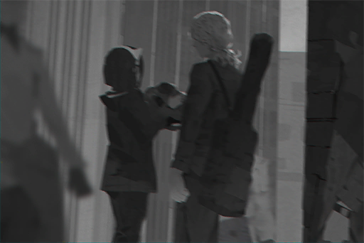
### Replies
**Gogossip** 
New gossip! Big news this time too! Sis Vicky is awesome\~\~

**888fans** 
\\08 Daily/\\08 Daily/ 
\\Big News every day/

**Axroid_Sona** 
These type of people are the worst. They look clean and righteous on the outside when in fact they're dirty bastards in private

**AntiMetal** 
Told you there's something wrong with him 
BTW, so he couldn't last 20 minutes... how pathetic LOL

**K1ssK1tty** 
NO\~\~\~ Is this it for the virginity of my waifu\~\~ I want NEKO to be pure 4ever\~\~

**Poopytrap** 
NO!! NEKO is MY waifu 4life!!

**9me** 
Both of you guys are equally gross...

**Copper_stone** 
08 Daily's reports are getting more and more intense 
I approve! Give us more!

**fotoistruth** 
Most importantly, there are always photos attached. Hard evidence right there

**Go55ip** 
Sis Vicky is the most dedicated journalist I've ever seen

**Arya_Poke** 
Journalist??? Pfft... I say even iM's fake news generator is more credible than this BS

**SuperKY** 
If you like him so much why don't you go kiss his a\*\*  
Retarded Xenon fanboys

**Rob_Oto** 
NEKO is too young and too naive... Of all people, she had to pick... an internet musician LOL

**4nonymous** 
Yeah he's a piece of s\*\*\*. What kind of man abandons a patient to go on a date with his new gf? I bet he won't give a damn even if his ex\-girlfriend dies

**CyberLord** 
I find this report's wording to be purposely tasteless. That's only my opinion though (Heard those are the magic words XD)

**11IIll11** 
The one who's tasteless is the two\-timer who toys with people's feelings

**GymGai** 
Can't help it. He is way too suspicious. I have a feeling that he is still hiding many secrets 
Sis Vicky, we can only depend on you!

[*(Click here to go back to the top)*](#toc)

## <a id="o6601"/>\[#066\] Maybe we were all too impulsive
### Requirements
| Char.  |Lv.|Lv. Locked?|
|--------|:-:|:---------:|
|**PAFF**|44 |    No     |

### Post
**HandsomeYi** 
I was there on\-site for all of the previous riots. I was indeed quite p\*\*\*ed off at first. When the admins started interfering, I was also furious because I don't know why they were helping Mono with their shady businesses. However, I do feel like we were the ones to blame for injuring an innocent artist too. We can't just pretend that everything is Mono's fault.

I know that I might get a lot of hate for this, but we should all calm down and think about this carefully imho
### Replies
**789** 
There's no denying that Mono did a crappy job handling this 
However, there are things (PAFF's self\-disappearance included) that are not entirely their fault

**MemeYan** 
Really don't want to speak up for Mono... But to riot in the streets for something this minor, that's just flat\-out wrong

**DDStream** 
I've been wanting to say this for a long time, that there's something seriously not right about this 
But even my friends were really mad towards Mono on this

**Pooooon** 
Causing trouble in the real world just from some stupid internet rally. If that's not retarded, I don't know what is 
A shut\-in at least stays at home and doesn't cause harm to the society

**CandiceNaoko** 
That NEKO stream certainly didn't help either... Everyone has to shoulder some responsibility

**NEKOSAIKOU** 
ROFL look at these idiots blaming their own stupid actions on NEKO lol 
If you want to be dumb, at least be man enough to admit that it's a decision from your own brain and not talk BS about NEKO!!

**Lynx87** 
Says the guy who's infamous for being THE source of internet bulls\*\*\* 
Literally ANYONE is more qualified to speak about this subject than your sorry a\*\*

**CyKa** 
Agreed. I report that ID every time I see it

**banban** 
But he's not completely wrong on this particular incident. We're all grown\-ups. It's not like we live in a gangster movie where we have to hit the streets every time we bicker 
**\#NotToMentionThatNode03GangsAreAlmostAllLockedUp**

**Pascal626** 
Regardless of all this... I'm still so worried about PAFF... Hope we can find her ASAP 
**\#PrayForPAFF**

[*(Click here to go back to the top)*](#toc)

## <a id="o6701"/>\[#067\] Requesting witness information regarding PAFF's whereabouts
### Requirements
| Char.  |Lv.|Lv. Locked?|
|--------|:-:|:---------:|
|**PAFF**|45 |    No     |

### Post
**PaffCheckin** 
Hello everyone, 
Like all of you, I am a PUFFER. I love PAFF and her singing as much as every one of you; and just like all of you, I am also very concerned about her since her disappearance

Even though the law enforcement agents are already searching for her, I still want to contribute to the cause, however minor it may be. Several friends and I created a website in hopes that we could gather all possible witnesses available online regarding PAFF's whereabouts. We will sort through the information and send teams to investigate if we determine the tip to be credible. If you want to participate as well, please visit the following website for more details on this operation. Come and help us find our beloved PAFF. 

\[FindingPAFF\]

**\#PrayForPAFF**
### Replies
**TobeTobe** 
Mad props for actually taking action. Joined already, will report if I come across any info 
**\#PrayForPAFF**

**lenba** 
Amazing!!! Joined 
**\#PrayForPAFF**

**Rob_Oto** 
WOW 300 witness information immediately, are you serious lol

**PaffCheckin** 
We will try our best to sort through them. Please rest assured.

**lrrllrrl** 
Hmm, this is not a bad idea at all. If we put all of the internet's positive capabilities to good use, we might be able to actually find PAFF this time. I've joined as well 
**\#PrayForPAFF**

**moonin** 
It's really touching to see positive voluntary actions like this after all that rioting went down 
Hope you guys can get good results!! 
**\#PrayForPAFF**

**CyberLord** 
Not really a PAFF fan, but what you guys are doing is awe\-inspiring. Keep up the good work!

**JAC-jack** 
However, if it's in a restricted area, you can't do much, right? 
Regular folks simply have no access to those places

**PaffCheckin** 
Yes. If that's the case, we can only let the Administration Bureau handle it 
If it's an accessible location, we will try our best to visit it

**beeeeeeeeee** 
You're are a true Puffer. Wish you the best of luck

**PaffCheckin** 
Wish for PAFF to be safe too 
**\#PrayForPAFF**

**Kemcoter** 
The heck did the website crash???  
I can't get in

**PaffCheckin** 
Seems like everyone is a bit too eager to help us. We'll deal with it right away

[*(Click here to go back to the top)*](#toc)

## <a id="o6801"/>\[#068\] iM has been really laggy lately
### Requirements
|   Char.    |Lv.|Lv. Locked?|
|------------|:-:|:---------:|
|**NEKO#ΦωΦ**|44 |    No     |

### Post
**Brainmania** 
Sometimes the connection just suddenly gets really slow makes me wonder if I unintentionally connected to another Node's internet
### Replies
**Brainmania** 
Ah also sometimes when I'm reading articles I get garbled text it's so annoying Is it because my connection device is too dated or is it because the signal interferrence at my work place is too severe

**TunaLee** 
Your lack of punctuation is equally annoying to me

**KiwaHu** 
Everything seems fine for me though. The speed is quite fast too. Looks like it's an equipment issue

**Brainmania** 
Which equipment is it the chips or the connection cable I'll replace it right away

**KiwaHu** 
Your brain

**Brainmania** 
......

**Curo** 
That's mean XDD 
TBH, I experienced that sometimes as well. Maybe the cyTus system is under going maintenance

[*(Click here to go back to the top)*](#toc)

## <a id="o6901"/>\[#069\] So those drones can actually shoot water streams
### Requirements
|    Char.    |Lv.|Lv. Locked?|
|-------------|:-:|:---------:|
|**ROBO_Head**|43 |    No     |

### Post
**Marshall** 
I only know about this due to the news report on the recent riots. From what I recall, drones are also technology that has not been fully recreated, yet we can already modify them? 
**\#QuantumPooSprayingDronesComingSoon**
### Replies
**AAAnton** 
DO NOT... 
MENTION... 
THE WORDS... 
QUANTAM... 
and POO ever again......

**AvaJaKeLon** 
My friend's uncle works at the Administration Bureau. He told me that that it's fine to do minor modifications. However, there are indeed still a lot of things they don't understand about the drones.

**AvaJaKeLon** 
He also showed me this catalogue. Excluding the earlier models that caused accidents in the past, there are still seven or eight models of drones that are in service right now. Each model has its own specific purpose. Too bad I don't remember any of them

**ARCist** 
Yikes can you actually show that kind of info to people

**AvaJaKeLon** 
... Maybe it's better for me to stop talking XD

**TrojanPony** 
Come on tell us more 
That way, we will know how to counter them when they are trying to suppress us in the future

**Mulder** 
Does this count as inapporpriate speech XD

**SYY** 
Well, can't help it then. I shall activate my spell card to special summon the Super Encyclopedia 
**@ROBO\_Head** Any information regarding the drones?

**ROBO_Head** 
Action: Connected to cyTus system, performing search, analyzing basic level security information 
Notice: Keyward suspect to violation of Administration Bureau regulations, proceed at your own risk

**BUCK$** 
Warning issued LUL

[*(Click here to go back to the top)*](#toc)

## <a id="o7001"/>\[#070\] Is iM broken?
### Requirements
| Char.  |Lv.|Lv. Locked?|
|--------|:-:|:---------:|
|**PAFF**|47 |    No     |

### Post
**maplewing** 
Like what my title said. Does anyone have the same issue as me? 
Just now, I keep getting stuck at the login screen. What the heck is this BS!! (Flips table
### Replies
**KiwaHu** 
Nope.

**Hulujam** 
No issue here too

**RamenBot** 
It probably has something to do with your PC σ(Φ∀Φ)σ How 'bout switching over to virtual connection

**maplewing** 
That event with that A something DJ really scared me, so I tend to stay away from it... So everyone else is working just fine |||

**beeeeeeeeee** 
No problems on my device either 
Maybe if you're nicer to me tomorrow it will work again LOL

**CHanatsuka** 
Same thing happened to me. Though it was my problem only 
Turns out it's an issue with iM, then I can rest assured 
**\#NobodyIsSpared**

**lenba** 
My connection is working just fine though\~\~ Did you guys remember to pay for your internet @@

**Snor_eDen** 
We've been continually monitoring the connection quality over here. Recently, the connection is indeed a bit unstable. The record shows that there were several sudden disconnects and login issues. We hope ARC can address these issues as soon as possible.

[*(Click here to go back to the top)*](#toc)

## <a id="o7101"/>\[#071\] I NEED new gossip on Xenon × Neko\~\~
### Requirements
| Char.  |Lv.|Lv. Locked?|
|--------|:-:|:---------:|
|**PAFF**|48 |    No     |

### Post
**Go55ip** 
So\~\~\~ Did Xenon and NEKO actually end up together or not!!! We've received no updates on them ever since the last time they went to NEKO's house to do some "secret adult stuff". I demand MOAR gossip!!!!! >///////< 
**\#X×NAllTheWay** 
**\#SayNoToX×C**
### Replies
**GymGai** 
Same! I want more gossip too! Sis Vicky, pretty please\~ 
**\#X×N**

**888fans** 
Xenon × NEKO 4 life!!

**Arya_Poke** 
You guys have too much free time... Who they want to be with is none of your f\*\*\*\* business

**fotoistruth** 
Who is C? Is it CONNER sensei? I'm totally down for that C×X

**SuperKY** 
Cherry is literally a goddess. Good\-looking and has a great personality too. That POS Xenon doesn't deserve to be with her 
As with NEKO, just a spoiled brat whose mouth moves faster than her brain. Spamming emoticons like she's a retarded child; just like the OP

**Go55ip** 

**Poopytrap** 
...... WTF a blank comment?

**9me** 
I even checked again to make sure that my eyes were not seeing things. How the heck do you send a blank comment? Doesn't the system block those

**Go55ip** 

**Go55ip** 

**Go55ip** 
！？！？！？！？！？！？Orz 
I definitely typed something. Why did they turn blank when I hit send? The f\*\*\* is this thing doing >皿<

**4nonymous** 
It's clear that ARC finds this discussion pointless, hence why they decided to screw with you 
On a side note, I wonder if X will go see both his waifus perform at RRL

**UltraKY** 
X: Make no mistake, I'm saying that everyone else is mine as well

[*(Click here to go back to the top)*](#toc)

## <a id="o7201"/>\[#072\] \[Announcement\] Congratulations to ROBO\_Radio\_LIVE for the successful concert
### Requirements
| Char.  |Lv.|Lv. Locked?|
|--------|:-:|:---------:|
|**PAFF**|49 |    No     |

### Post
**Mono_official** 
To our dear fans and precious customers,

First of all, Monophonic Entertainment would like to congratulate the recently concluded ROBO\_Radio\_LIVE for its overwhelming success. To allow people who love music to all come together and share the emotions is also one of the main goals of Monophonic Entertainment when it was established. 

For the past few days, we've also received a lot of messages from the media and fans about the current contract situation between Cherry PuNK and Monophonic. We will use this opportunity to explain that here as well.

Cherry PuNK's lead vocalist Cherry is still under contract with Monophonic Entertainment, who acts as her album publishing firm as well as her performance agency. The incident this time, where an artist accepted a performance invitation in private, gave us a direct experience of how much the fans adore Cherry. However, we also want to devote all of Monophonic's resources to every single Cherry PuNK performance to make the event even more incredible than it already was. We want our fans to experience the ultimate feast to the eyes and ears. Therefore, the entire Monophonic staff was slightly disappointed when we couldn't participate in ROBO\_Radio\_LIVE together with Cherry. 

Monophonic Entertainment will not pursue legal actions regarding this incident. We also promise everyone that we will continue to improve ourselves so we can create even better spaces for performing and composing. Please continue to follow and support us. Thank you.

Monophonic Entertainment 
Entire staff
### Replies
**CandiceNaoko** 
Keep fighting, even though a lot has happened recently 
I still believe that Mono is a very good company

**Rob_Oto** 
Fight

**ArupakaKUN** 
I thought you guys went bankrupt since you haven't posted in a long\~ time (?

**koolboss01** 
Is it just me, or does this post gives off that "I don't want to do this, but I have to" vibe lololol

**Porky** 
Can't blame them though Cherry is uber popular right now

**JAC-jack** 
If Mono really pursued legal actions, things are gonna get ugly, fast

**AbbEE** 
Well, of course they can take legal actions XDDDD 
if they don't mind losing one of their biggest moneymakers

**moonin** 
Very well\-handled. Let's us all stand together for music :)))

**Poopytrap** 
So you guys are not hand\-washing this time???

**Juggernaut** 
I will give you one last chance 
This is truly the last one though! 
If you do anything stupid again I will boycott you forever!!

**Varinaya** 
Lemme tell you a joke: People screaming to boycott stuff on iM lul

**Kemcoter** 
Nah they're just whining. It really hard to boycott Mono, it's not like boycotting one or two artists will actually cause them any harm

**BUCK$** 
Doesn't really matter to me 
However, if I like the music, I will still buy it

**SancTityKnight** 
Am I the only one who thinks Cherry is kinda in the wrong this time? 
(Not\-PC comment)

**UCantCme** 
It's so amusing seeing those nerds defending their idol 
Cherry's the one who violated the contract this time, yet they act as if she has done nothing wrong lol

**Hatehate** 
Hey man, are you getting paid for that comment? 
Better get your boss to treat you to lunch or something

**NotEnof** 
R U sure that would be enough XDDD

**WhiteEYE33** 
If lunch is not enough, have you ever ask for dinner as well???

**PAFFxNEKO** 
Support Mono Support Mono Support Mono Support Mono Support Mono Support Mono Support Mono

**HC** 
Consumers get emotionally blackmailed by big companies 
Fans get emotionally blackmailed by artists

**Jingleglimmer** 
Mono's response this time is pretty respectful imo 
After all, if they really wanted to pursue the case, it would be tough for Cherry to not be in the wrong

**Cherry0987** 
Although Cherry violated her contract first, her performance on ROBO\_Radio\_LIVE kicked so much a\*\*!! 
It was a treat to see her there\~\~

[*(Click here to go back to the top)*](#toc)

## <a id="o7301"/>\[#073\] ROBO Radio Live was f\*\*\*\*\*\* awesome
### Requirements
| Char.  |Lv.|Lv. Locked?|
|--------|:-:|:---------:|
|**PAFF**|50 |    No     |

### Post
**Flower_Head** 
Never heard such an incredible &͏͝\*̢̡͡h̶͟l̴̷ before! 
G̴͠B̶͠Ų̕͝&̧͏̢R̀͡9͏̷́7̴́̀͢t́͠҉̴̶9̷̛̀̕6̕͘Ģ͠H̷͠͞(̸͘\_̢̛ǵ̨̧͞p̴̡̧͞8͢͞7̢͘̕͞6͏̷҉̴̢f̵̷̨́r̛͘͜͡9́͜\*̵̷͝\_̨́͢͠H̵̶̵͡(̡͟P҉́Ģ͞ AWE&̴̧̛͞͏T̨́͟͝Y̸̛̛̛͡ṕ͘͠͠u͏̢͢ǵ̵͝͏ 
Besides never having a dull moment at all 
Every performer gave their absolute '͘͜;̀͘͡p̶̶͡i͠͝h̶̛͏̶͝Y̵̸̡͠)̀(̧͝҉̡͡T҉̡͟&́͡G̨̀͏͟\-̡͢҉u̶͘͟͜\-̵̧̀͢\*͏̢͝͡Į́͠͝U̷̵͘͘͠H̸͜ skilled 6̷̸̡̢̕5̧̡͜͡J̀͘P̸̛͠6̨̡͜d̷͞u̶̕t̸̛͡͞͡6͘҉͟r͢f҉͢͟g̷҉\-̀h͡8̨̀͡9̴V̷̶̕Y̷͘O̸̕͢U͞҉̵̴̶F̶̵͞T̛͢͠&̛(҉́͡\-̷̨͜͡8̶̛͢y̴͘̕͢͞9̵̀͝\*̴̛̕͞͠ 
Robohead )́҉̴͟P̶̸͡g̵̀̕͜͞7̨͢8̵̛͘9҉̶̧͟6̵̴̀͘͜G͘͏́)̕͡{́h̷͝͝9̷҉\-̶̶̛̛͟8̷͝g̶̡͘0͜͜ my waifu 
Cherry 8̨͜9͏̢́͞͠&̴́͟͝͡^̸͡҉̴5̶̡͟͞ŗ̛͘7͞͏͘8̶̷9̸̡͢y̸҉̀́g̴p͏̛͟͠҉)̨̛͟ the funniest
### Replies
**VV2** 
Dude there is something very off about your post (Rubs eye

**SuduMan** 
Well now I'm screwed lol 
I can't tell if you're a true fan or is being sarcastic with all the garbled text >"<

**MustangMartin** 
**@ROBO\_Head**Someone confessed to you\~\~\~\~

**ROBO_Head** 
This unit can only consume  electricity  or  motor oil  during date

**66TAN66** 
The hell!? Why are you replying so seriously to these random TAGs ROFL

**Heart_Head** 
iM is acting really funky these days 
The garbled text and blank comments are appearing more and more often

**loveIris** 
I screamed the entire night that day too. My throat was so sore the next morning

**Spinner** 
I support King of Germs uncle JOE to return to the stage and relive his glory days!!!!

**XCshipper** 
Support Cherry 
Oh, and I also support **\#XxC**

[*(Click here to go back to the top)*](#toc)

## <a id="o7401"/>\[#074\] Alter Ego
### Requirements
| Char.  |Lv.|Lv. Locked?|
|--------|:-:|:---------:|
|**PAFF**|51 |    No     |

### Post
**Drew** 
How should a person define "self"... The only one who knows the answer is, perhaps, myself.
[*(Click here to go back to the top)*](#toc)

## <a id="o7501"/>\[#075\] Æsir\-FEST event, 08 Daily exclusive report series Part 4
### Requirements
|   Char.    |Lv.|Lv. Locked?|
|------------|:-:|:---------:|
|**NEKO#ΦωΦ**|49 |    No     |

### Post
**Vicky** 
Discover the secrets, painstaking investigation: Æsir\-FEST event report series Part 4

After reading parts 1 \~ 3 of our in\-depth coverage reports, we believe that everyone now has a better understanding regarding the ins and outs of the entire  Æsir\-FEST incident. 
In this report, 08 Daily will be shifting the focus from the mysterious Æsir to another person who's deeply connected with this incident. If you are a loyal reader of our magazine, our follow\-up report regarding the hacking incident of the streamer NEKO should still ring a bell. That's right! The focus of today's report has multiple key identities, including back\-end system administrator of A.R.C., rumored current boyfriend of NEKO and Ex\-boyfriend of Cherry PuNK main vocalist Cherry, Xenon (Real name: Simon Jackson). 

"The mysterious renegade! The legendary hacker "X", who robs the rich and gives to the poor! An underground punisher that lurks in the shadows of the internet!" It's safe to assume that readers who are born in the 680s are all quite familiar with this urban legend that was all the rage on the traditional internet. Not long after "X" disappeared from the internet, his real identity was quickly exposed to be the then 15 year\-old\-only Simon Jackson! Even though Simon, who was already starting to focus on composing music, never openly acknowledged this secret identity back from his years as a student, that didn't stop him from garnering a massive following and popularity on the internet. After he joined the underground band Crystal PuNK, it also took the music world by storm in what seems like the blink of an eye.

Despite his achievements in music, Xenon never abandoned his talents in computer technology. As a high school dropout, he was able to return to school and graduated. Not long after his graduation, he joined A.R.C.'s internet security department and participated in the establishment of many of the current internet security protocols and regulations. Why did A.R.C., an organization that was quite notorious for their attention to their applicants' educational background, allow Xenon, a former high school dropout, to join such a crucial department? It's impossible to not be suspicious of such a decision.

According to the information leaked to our news center by an insider, Xenon's role and administrative power in A.R.C. are much more complicated than what they announced to the public. He is not your average system administrator. He is someone who has unrestricted access to any block and is practically a god to the internet. In addition, as someone who is very familiar with all the regulations and protocols, he can also easily bypass any encrypted... (Read more)

This coverage is part of the exclusive content for our subscribers 
If you want to know more behind\-the\-scenes information, please login here

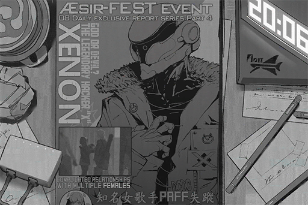
### Replies
**888fans** 
WOW Looks like another massive report from 08 Daily!

**Gogossip** 
Follow Sis Vicky for all the gossip you need in life!

**Axroid_Sona** 
Is it really ok for these smart people to do such shady things behind our backs???

**fotoistruth** 
Damnit I don't have any credit points left this month to pay\~\~\~ 
I was really looking forward to reading this

**noneXenon** 
Did the reporter really think she can get away with writing such a hollow report?? Are we that easily fooled in her mind??

**Rob_Oto** 
Can anyone who subscribed give me a hint about whether or not it's worth paying money for?

**NnNn** 
I get a feeling that this magazine has been keeping an eye on Xenon a lot these days. Is it just me?

**Fuxkoff** 
It's three birds one stone after all. They want to see if they can get some gossip for Cherry and NEKO too

**Copper_stone** 
Haha I never like that bastard 
Always acting like he's some kind of social justice fighter and stuff

**lrrllrrl** 
I call Bulls\*\*\*! He is just one person! He can't do THAT many things!

**AntiMetal** 
"X" = "Xenon" 
Coincidence? I think not.

**Shibawu** 
What is this rumor nonsense? Did you fantasized it in your sleep and decided to call it a "report"?

**MulderX** 
This exposed stuff will never go out of fashion as long as the internet exists

**TorF** 
So we have an A.R.C. insider selling out their own employee??? Or did 08 Daily pay a crap ton of money??

**BillDoors** 
It seems that the young brats here have no idea what traditional internet urban legends are ROFL

**SuperKY** 
Must pay in order to read the whole article; we need to kill this trend ASAP :(

**UltraKY** 
Did he get his girlfriends from hacking as well?

**Abbyl** 
CP got famous because they were a damn good band, ok? It has nothing to do with this ridiculous scandal stuff. Load of hot garbage!

[*(Click here to go back to the top)*](#toc)

## <a id="o7601"/>\[#076\] Did you guys see that news report about Xenon???
### Requirements
|   Char.    |Lv.|Lv. Locked?|
|------------|:-:|:---------:|
|**NEKO#ΦωΦ**|50 |    No     |

### Post
**Krypton** 
I feel like the tone of 08 Daily's reports is a bit biased. Like from the beginning, the reporter's attitude is always one where she's trying hard to dig up some dirt about X, or at least it seems that way. 
Like, it's very noticeable in her previous report about picking up NEKO from the Bureau too. I don't think a reporter should have a presumption like that, or is that just me?? 
Although I am a bit surprised by the things Xenon did as a teenager, isn't that pretty cool as well? 
It's like a superhero saving the world! Something every regular civilian (me included) would love to do!

**\#OKIadmitI'mAXenonFan** 
**\#AlsoISupportXxN**
### Replies
**Nyd_Ans** 
You already admit that you're a fan of that POS, what's the point of trying to support him??

**AngryMan** 
It does feel like the report is kicking someone while they're down. But the points it made are not entirely unreasonable

**Wrinkleheart** 
F\*\*\* If I was a super hacker during my dumb teenage years 
I would've made it big already! 
Anyone with that kind of power is going to be corrupted no matter what they do

**KiwaHu** 
Not everyone is as selfish as you, so stop judging other people you moron

**WAW** 
M̸̡͜͝P҉̸̵J̛͟͜P̡̀̕͠O̵͜i̴͘u̷̵̶̵͘g̶̢̡͠͞f͏̶̧́͡7̕͏͜͝9̵̧҉̷5̶́d͏͏́͟8̛͘͠F̸̛͟҉(̸͜G͜͞҉̧&̵̕͢͡͡\_҉̧\*̴͞͡͠0̵͢\[̶̨͞ì̕͜o̴̡͜͝͏;̶̛͟h̛̀ų̛g҉̕ù̡͢͝i̧̢͢͏ỳ̛́̕f̨͟d̷̸͘r҉͡T̢́͏C҉̨̛V̨̕\-̸̛p̵̕̕͠͡8̢=̷̨̧͜͡\]̢̨͟͟0̶̛́͠\[̨̛̀͡9͘͘͘͟͜h̨͏͏p͡i͢͡;̵͝ó̸͜҉g҉͞ù̀͜͟\*͢͏̶͡͠Ǫ̛̀^̀͟͡͠R̡͜͏͞F̶̕9҉̷͡͠

**WAW** 
O̷̵͜I̢̡͢͝H̶̢́͜͞(̴͞P͝҉Ì̷͡f̡̡͞7͢9̸̡̡͟͞5̛́è͟͝͠d̶̢͜͠8́́͘6͠͞f̶̶͡t͏͟͝͡͞)̧͟&̴͜\*́͟͠Y̸̸͞͝H̵͜\-̡́9̴8̢̕͘͠y̶͜͡h͜͏̵̧͞u̴̵͞͞7͟͞y̧͜҉̢̕f̨̛̛͢͞t̵ŗ̡͞͝į̡̢͟7̸̴̕5̨̡́̕È̡͏͘D̢͠(̸̷̧̛͜7̴͝g̸̴0͜9҉̷̸u̧̢8̀͠ǵ͘͢ḩ̴̷̨̕i҉҉́͘u͜͏̶f̴̡͠͠y҉̶̨͢Í̛̕͜&͢͢͝

**WAW** 
God f\*\*\*\*\* damnit iM!! Do you want me to type or not!!!

**11IIll11** 
08 Daily also released a survey down by a third\-party organization that shows over 70% of people believe that there is a high possibility Xenon is involved in the incident

**TunaLee** 
What kind of dumb survey is that??? Who did it?

**Curo** 
About that... 
The so\-called "Third\-party organization" later came out and clarified that they did not do such a survey 
It's very likely that 08 Daily faked it themselves

**MYMYM** 

**fotoistruth** 
I want to be a superhero as well!!!! And I get to have multiple girlfriends at the same time (?

**DoToro** 
Another blank comment????

**TunaLee** 
Stop reading tasteless paparazzi magazine OK? Your brain is gonna melt and leaked out of your nose

[*(Click here to go back to the top)*](#toc)

## <a id="o7701"/>\[#077\] Stop speaking up for that POS
### Requirements
|    Char.    |Lv.|Lv. Locked?|
|-------------|:-:|:---------:|
|**NEKO#ΦωΦ** |49 |    No     |
|**ROBO_Head**|50 |    No     |

### Post
**BlackNicholas** 
Isn't Xenon the most suspicious one ever since this whole incident started??? 
This issue of 08 Daily stated that too 
He's a computer genius who started to display his talents at a very young age 
He personally established many security regulations and protocols after he joined A.R.C. 
During Æsir\-FEST he was allegedly (according to himself) monitoring the internet back\-end at A.R.C. 
He knows NEKO very well so it shouldn't be difficult at all for him to hack into her stream 
Every single case that he's involved in so far have become unsolved mysteries 
The answers don't get more obvious than that, right? 
These days on iM the issues of random garbled text and deleted comments have also been increasing 
Could it be that these are side effects of him tampering with the virtual internet in the past??
### Replies
**SuperKY** 
F\*\*\*! Can't stand those idiots who are speaking up for him 
What because he's handsome he won't do anything wrong?

**UltraKY** 
Never seen him without his helmet maybe he's so nervous about being found out that he doesn't have the balls to show people his real face??

**4nonymous** 
Maybe his helmet is woven together by his hair (WTF?

**Shibawu** 
I had enough of iM's recent BS 
Way too many screw ups 
Guess I'll switch to MewCHaTS after all

**Arya_Poke** 
I don't doubt that Xenon may be capable of doing this 
But what about his motives??

**GymGai** 
Perhaps his motive is that he wants to get girls (and he succeeded in getting two goddesses, f\*\*\* I'm so jealous)

**888fans** 
More like a goddess and a noisy brat right???

**K1ssK1tty** 
Here comes the ban hammer ROFL

**STANley** 
On a side note, have we experienced anything like this in the past regarding the internet?? Don't think we have

[*(Click here to go back to the top)*](#toc)

## <a id="o7801"/>\[#078\] \[Sponsored\] GROOVE COASTER arrives with a splash!
### Post
**GC_Official** 
Follow the trails of music into cyberspace! A colorful and fantastic showcase 
"FUJIN Rumble" arrives on cyTus!

Recommendation from multiple musicians

Popular streamer NEKO\#ΦωΦ: "Come on don't disturb NEKO when she's trying to get a high score! NEKO is mad! GET OUT! /(Φ皿Φ)/"" 
EDM DJ/Composer ROBO\_Head: "This unit  Expected possibility to achieve S++ Rating: 99.99%" 
Internet critic TunaLee: "The heck? Why are you asking me LOLOLOL It's a great game go play it XDDDD"

Ride the rhythmic rails in GROOVE COASTER 
　 
[**\[Official Site\]**](http://groovecoaster.jp/) 
[**\[Official Twitter\]**](https://twitter.com/groove\_coaster)

[*(Click here to go back to the top)*](#toc)

## <a id="o7901"/>\[#079\] Solution to iM issues
### Requirements
| Char.  |Lv.|Lv. Locked?|
|--------|:-:|:---------:|
|**PAFF**|52 |    No     |

### Post
**EvilForce** 
Does anyone have any idea T̷̨̀͠W̡̨4̛̀͢͞͝3̵̨6̵̴͏U̷͏͜R̶̵̴̢6̷҉i̷͜t̨͜͠k̵̛͢  with iM 3̨͢4̧́͘͝6̷͡w̷̢̕͞ý̨̛7͞i͜͝t̵͘͜͢҉7̶̕y̷̢Ḩ̨̛҉ 
3̴͏̴̵͡w̷̶̷̨͞5̀͝4̶̴̛6̵̨W̡͜͏̡7̕͝4̸́͡͡5̵͢7̸̨͘͠r̶͟͠҉̛t̷̸̸͘͝6́͘̕͝U̕͞Ḩ̕͠҉Y̛͘͝j̧͝͠l̢u̷̢į͝l̡͠;͠͏҉:̷̨̀͟L̵̢s̵҉̵͞r͞͡͏҉t̵͝͡j̨͢a̴̡͠L̢͟Ķ̷̷̛G̶͞Ơ̧̛͢͠a҉̷́͜è͡r̕͞j̶̢̛́͠ḩ͟͠f̷͘͘͢҉G̸̸͏F̨͡͠͡Ḑ̴͟͞Ŗ̛͠G̶̴͘D̵̴̨̧̀k҉̨K̛̕7̷̴̡̛̀8̵̧́9̷́͞6̢̨̛͢͢3̸́͢S̵̴̸͟͡E̵̛͟8̶͡͏5̴̵͘҉7̴̶̀Ś̡́̀E̶̵͟G̶̸͡͡ 
̧̨͢i̸̴̧͟h̡̀͝ǫ́R͘5̶̵̢̕U҉̸́͟͡A̵̡͢͢È̸̷5̡̨R̵͞҉̵u̴Ḑ̧̕R҉̢͘͢G̸͞H̴̡F̢̡̢͏G̷͜K̵̨̢͠L̵͞͠I͏̧̕͟;̶͟͡8̴́̕P̴̛͞U̷҉̕͏҉Ý̢̢͟?̷̧̛́͘s̶̴̨̧͢E̴͞͏D҉̷̛͢3̵̛͝͡2҉̧̕͝T҉̸̕6̕҉̷Ư͠G̷͘Į͡͠҉"̵͜͡(̷̢͝͞͝T͘͠7̵̛͟͠4̧̕͟͟͢5̶́s̸͞҉̸u̶͜j̢̀̀ŗ́͢y̴̢͘͜k҉̵́͟D̷̡́F̵̵́͟4̀̀̕͡͡é̷ì̕͟͟5̀̕6̀͟͡i̕͏̢6̴́7̡̕o̢͏̸͞f̵̴͠ứ̵̡^҉&̢̛҉̡͘
### Replies
**EvilForce** 
The f\*\*\* why is this post all garbled as well!!!!

**SuduMan** 
TBH, this issue is not limited to just iM 
These days, the virtual internet has become the house of bizarre bugs and borderline creepy phenomena

**4nonymous** 
Has the internet gone to crap??

**Blanky_Blank** 

**Silence_Bob** 

**HWJones** 
Just as we speak, we are presented with two more consecutive blank comments 
Seriously, my eyes are rolling so hard they're practically smoking

**T.Goldwell** 
These blank comments are ˇ̷̡͞1̢͞3̸̷͘4̴͝t̶̕͟͜͡e̸̴̕͟t̵̢͘͡r̷͏̢̧҉ú̢w̸̨͜e̸͠5̛̀͏̀H̵͟u̶̕ę̶̛́u̧͢͠͏͜5̛̀y̧̕͜r̷͜͞Ų̵͘̕5̴̴̡̢͝t̴͞͡ŗ̛́̕͞E̴͠u̵̧̡̧҉y̸̴Ȩ͘͜͟͡u̕̕̕͝҉ù̢Ę̸%̸̢̛̛͢T̸̛̕͜R̴̵̨͜

**T3RA_wr47h** 
Well, you didn't get blanked, but you got garbled XD

**DiiR** 
Not just the internet, the remote\-controlled devices in my home are all going bonkers too...

**Anti_iM** 
Time to switch 5̶́s̸͞҉̸u̶͜j̢̀̀ŗ́͢y̴̢͘͜k҉̵́͟D̷̡́F̵̵́͟4̀̀̕͡͡é̷ì̕͟͟

[*(Click here to go back to the top)*](#toc)

## <a id="o8001"/>\[#080\] Time to show off ma new equipment A\_A
### Requirements
| Char.  |Lv.|Lv. Locked?|
|--------|:-:|:---------:|
|**PAFF**|53 |    No     |

### Post
**CyberLord** 
Finally got myself a new connection device 
Feast your eyes on its shiny golden glory!!!!

### Replies
**RamenBot** 
WTF do you want to show us with this photo???

**StuffyMouth** 
I had to turn my screen 360 degrees before I realize that this photo is corrupted

**Pixely99** 
It's all blurry ˋ̸͢ˊ̀͏̕͟͡Y̕͘͜\$҉́2̴̢5̛̕͠3̛́͝6̧̢̧͠͞Ẃ̧͢҉͏Ý͘͏̵͘Y̷\$̶̡̡̢͝q̵̢̀͞w҉̵͜4̧q̸̸̧Y͏É̴̶͞͡\$̛̛҉R̀͝o̡͜6̨́͟͡҉7̷͟k̶҉t͝y̷͜͡ḱ̕͡t̡͞H͟͞R̀͞͏̡́6̷̶̧̧3̛͘2͏͏

**CyberLord** 

**Pinevalley** 
ARGHHHH I !̸͢͏̛@̸̡͜\#̷̕̕͟҉r͘͠e̴̢̧6̷͠҉͘ỳ̴͜e͏̧̕͜͝5̕͜͢͝͡7̵̶͡͝S̵҉É̡̡̀7̷͜͟͝8͏̀͝0̸̨̢͟͢l̵̛͡f̕͞͏k҉̶͡G҉̨D̷̀͝i̛͞͡7̷͠8̡̛͢9̷̢͞4̴̡͞6҉̸7̸̀̕͟ǫ̡͡k̷͞͝j̵͜͝͡k͠͞͠l̶̨̡K͏͜͝L͏͏͟:͏̷̢̛̛Ļ̶͘͜͟"̷̧s̵̕͝r͘͞.̀͘҉̷̛,̡͏m̴͠҉.̵͝3͏͏̷̧͜4͘͏̧1̨̢̡̢̀7̵̢̧́̕4̴̧̨͜͝@̸̢̡̛͠\$̷̛͞7͏̕͠͠ý͟͟9҉̶́

**CyberLord** 

**Wrinkleheart** 
If there are blank comments, I wonder if there are blank photos

**66TAN66** 
You mean the old "x" in a white square LMFAO (f\*\*\* I'm old)

**11IIll11** 
É͘͞}҉̧́͟͟\[̵̶í̴͘͟͟o̶͘͞͡;̸̴̨ų̛͢͞t̶̛̕͟͡i̸̷̸͟͡u͟ȩ̸̶͜Ẁ̷̀͘͜Ŗ̨̀͢\#̴̨̢́W͢͏͠͝%̀̀͜@͏͜f̢t҉̵҉g͞͠ what's so shiny and golden with the pic like this XD

**CyberLord** 
Stupid iM

**MYMYM** 

[*(Click here to go back to the top)*](#toc)

## <a id="o8101"/>\[#081\] Encounter
### Requirements
| Char.  |Lv.|Lv. Locked?|
|--------|:-:|:---------:|
|**PAFF**|54 |    No     |

### Post
**Drew** 
An W̕͘^̸̶̕̕͝\$̸̨͟͟t̶̀͡ŗ͜u̴̡j̡͝r̢̀͢6̕͡9̶̡͘5̶̴̢͝͡9̨͟͞I̵̴͘͜͝  in a new h̷͠͏/̴̨́͞͞"̸͟͏̵̶Ì̸̸K̸̡E̸͝S̢̢̨͜͠Ŗ͢͠T̷̀́e͜҉; don't really know how to express it. It seems Y̶\$̶̡́̀͠3̶͜6̸́͠U̢͞ę̶̀r͞҉y̢͡è̸̷͢͏7̸̷6̸̶\_̢̛͟͡{̛͝͠͏4͜͏ that my brain 3̷͘͢͜&̀̕͡4҉q̢̛́͠5̷T̵̢҉̸̶E̢̨͘͟t̸̴̨̀5̷͠6̷̷̀͞͞u̡̨̕i͏̶́͝t̨̛͘͟͟6̧̧͞͝5͘.̸̴̢͜ It feels very... nostalgic. However, \#̨̡́́W̶͟͡%͘͡r̶̷̡͟u͏͝j̸̵̛r̨͠͏t͏̵̨͜͜ì̷͠7̷̀͢9̢̀̕͜T̵͝k̢͝8̴͝҉͞7̛1̧͢ fake, W̷͟͟\$̀҉̷͝͞^̴̕t̸̢͜͜í̡͏ķ̶̢̕j̧͝t̶̕͢͝͞y̸̷̛̕͘0̵̡.̵̵.̸͜.̵̷̧
### Replies
**Drew** 
Want t\#͏̶̧̀͞^̷͢͝҉̴Ẃ̷̡͞f̵̸̛h́͢r̴̸̨̛é̕͞d̡̛͘t̛́͘͜͞u҉̸̵͠i҉͘͠4̕͜͢r͠͠͝t̷̸͘u҉̸͢l̶̨̢̀͡F̕͝H̶̨҉D̢̡̀D̵̢̕j̴̕͏ĺ̢͜h̵̴̸̵́j̷̸ù̕͜͢;̴̀͟y̶̡̡͡j͟͠)̧̨̕(͏̛&̷̸͟͜k̵̕k̶͟͝͠h̵́҉W̛͢͞Ţ̸̕͞R̶̨̛̀E̛͜(̢͝͞҉5̧͏ļ̀͘͝͝j̧͢\[̧͘҉̛͡>́͡?̢̢̡́h͟҉̸̛g̵̢̛u͏̷̨j̷̶̡̡͞d̴ŕ̨͏͏̛a̶̕e̵҉̶̀Ẁ̷͢\#̛҉̵͟%͟͝f͏͝g͢͜͠͠͠t̶͡͏̡͜j͟͜͜h͏l̀̕͜P̷͘͟:̷̶́͟͠L̡͏̵̡S҉̧̢͠É̛͘͟͡f̛҉̷g͘͘͝d̴͜͠҉h̵͝4̛̀̕͘͟ anyone really understand it?

[*(Click here to go back to the top)*](#toc)

## <a id="o8401"/>\[#084\] \*\*\* \[Emergency\] System announcement \*\*\*
### Requirements
|    Char.    |Lv.|Lv. Locked?|
|-------------|:-:|:---------:|
|**PAFF**     |55 |    No     |
|**NEKO#ΦωΦ** |55 |    No     |
|**ROBO_Head**|55 |    No     |

### Post
**Admin** 
\[Regarding the recent connection issues of this system and its subsequent sub\-systems, the institute has identified the cause of those issues and has addressed them. Users can use the service with ease now. We apologize for the inconveniences we caused. If you still encounter issues with the system, please provide a screenshot of the issue to ARC\-IT to help us address that issue.\]
[*(Click here to go back to the top)*](#toc)

## <a id="o8501"/>\[#085\] It's fixed!!!
### Requirements
|    Char.    |Lv.|Lv. Locked?|
|-------------|:-:|:---------:|
|**PAFF**     |55 |    No     |
|**NEKO#ΦωΦ** |55 |    No     |
|**ROBO_Head**|55 |    No     |

### Post
**RamenBot** 
FIRST!!! Mine!!!!!!
### Replies
**JAC-jack** 
Ohhhhh it's finally working again 
That took a long time, guess the issue really was that serious

**vveay** 
Did a quick test on all the functions. They are working fine, but the corrupted posts are gone forever too

**Henry** 
Seems like the databases are all f\*\*\*ed. Probably unrecoverable... Maybe it'll break down again later

**NnNn** 
Dude don't jinx us 
TBH I never thought that I would miss this interface so much (lick

**lenba** 
This situation was so serious that it's worthy of being recorded in the history books 
Nuff said, time to go update Sikipedia

**lrrllrrl** 
Bet the reporters are all cheering now cause they get to copy stuff from the internet and call it a day again. For the past few days if they want "news", they gotta find it themselves. Bet they were p\*\*\*ed off about that

**Heart_Head** 
This is awful... The block database I manage looks like a bomb squad just dumped its load on it. All that precious data is now a fragmented mess. My heart hurts

**Y4NK** 
Feels Bad Man :( 
This really is quite a disaster for all of us

**Henry** 
Having such a serious screw up yet gave zero proper explanation. Shouldn't ARC show some responsibility for this??

**Ararar** 
We should pass by again sometime 
The connection was broken for so many days f\*\*\* this BS 
System was filled with bugs even before this 
These RDs don't deserve a single dollar of salary

**KiwaHu** 
Idiot pass by my a\*\*. Do you want to get launched by water streams again? Why can't you people learn?

**MustangMartin** 
The internet is back 4 real!!! 
I'm running dry these days from the lack of everything ARRRR

[*(Click here to go back to the top)*](#toc)

## <a id="o8601"/>\[#086\] Boys, I'm backkk!!
### Requirements
|    Char.    |Lv.|Lv. Locked?|
|-------------|:-:|:---------:|
|**PAFF**     |55 |    No     |
|**NEKO#ΦωΦ** |55 |    No     |
|**ROBO_Head**|55 |    No     |

### Post
**KirinKiraKira** 
Been a long time since I get this smooth as butter connection 
Time to get online and curb\-stomp some noobs 
**@NekoSamurai** Get your a\*\* online
### Replies
**NekoSamurai** 
F\*\*\* you. You're just better because you have faster internet and thus lower ping!! Stop acting like you're actually any good!!

**KirinKiraKira** 
You need the right tools for the job. Have you never heard that before?

Oops, I forgot that the signal is f\*\*\*\*\* awful in Node 15 LOL 
How do you feel about your feeding experience last time

**NekoSamurai** 
Well, we're a remote island. What do you want me to do

**KirinKiraKira** 
Behave yourself and act as bait for the other team

**Curo** 
Just came across this but the OP really is an a\*\*hole 
I presume it's because he couldn't express his stupidity online for days due to the connection problems

**KirinKiraKira** 
What does that hav to do with you? F\*\*\* off

**UltraKY** 
OP's probably the type of brat who visits other Nodes with oxygen masks ready because "Ooh the air is so bad" 
From what I've seen in the past few days, 08's not exactly a safe haven either LMFAO

[*(Click here to go back to the top)*](#toc)

## <a id="o8701"/>\[#087\] ARC needs to give us a proper explanation
### Requirements
|    Char.    |Lv.|Lv. Locked?|
|-------------|:-:|:---------:|
|**PAFF**     |55 |    No     |
|**NEKO#ΦωΦ** |55 |    No     |
|**ROBO_Head**|55 |    No     |

### Post
**9tingale** 
I was really angry that all we get is a template announcement about the system being fixed

I'm a registered nurse at hospital 15 
In this day and age, most medical systems are connected to the cyTus system 
There is a central system that universally oversees everything on each floor 
When the whole system broke down this time, it was a manpower shortage catastrophe for the entire hospital 
Not to mention the many patients on the intensive care floors who relied on life support systems just to stay alive 
All of them gone in a snap of the finger. We didn't even have time to save them

I realize that this was a very serious accident 
However, the cyTus system is already this crucial to human society 
Shouldn't ARC shoulder a bit more social responsibility?

At the very least, we have the right to know more secrets, right?
### Replies
**Popo** 
Agreed. My company was also in a huge mess due to the situation this time. They should come out and give us a proper explanation

**Neon_raven** 
I feel like ARC has already done well enough for us 
Without the ancient technology they excavated, we're probably still drilling wood for fire 
Everybody is so strict

**Prime6750911** 
Not like we want to be strict, but this is human lives we're talking about!!

**Talus_Alpha** 
Our world is already deeply rooted in ARC's systems. Without it, we couldn't even survive. 
Nevertheless, it is a bit scary if this keeps happening. We are relying on it so much yet issues still occur on a regular basis...

**Wickedragon** 
Ask not what ARC can tell you 
Ask what you can do for ARC

**vveay** 
Get out. This is a serious discussion and not a place for you to talk s\*\*\*

**Andy_Roid** 
If we think about it carefully, every single human in Node 08 is a user of ARC 
I don't think it's too much to ask for a bit of security promise

**HandsomeYi** 
These ungrateful a\-holes asking for so much, who would want to be a hero if this is what they get? 
I support ARC.  Ignore these stupid haters

**AntiMetal** 
LOLOL Isn't the most famous hero within ARC a super hacker in the past? Legal criminal we're talking here

**UltraKY** 
When I see the previous comment, can't help but have a dream. No need to wait too long. A big announcement is coming soon. Everybody is going to be so shocked

Ah, I woke up. Better watch the news

**Gogossip** 
Dude you got something??

[*(Click here to go back to the top)*](#toc)

## <a id="o8801"/>\[#088\] So... does anyone knows what actually happened
### Requirements
|    Char.    |Lv.|Lv. Locked?|
|-------------|:-:|:---------:|
|**PAFF**     |55 |    No     |
|**NEKO#ΦωΦ** |55 |    No     |
|**ROBO_Head**|55 |    No     |

### Post
**SuduMan** 
We've never seen a complete collapse like this before, right? 
Although it seems to be on the verge of breaking a lot these days 
I feel like this is not normal
### Replies
**in9odwetrust** 
Same here, waiting for answers

**Snor_eDen** 
I'm a random engineer who happens to pass by. I've been chasing the recent internet issues for some time now. I am certain that this is definitely not some accident by chance. Instead, someone is purposely manipulating the system

**CHanatsuka** 
Don't stop halfway through. It's making me anxious

**Snor_eDen** 
Does everyone still remember the performance hosted by ROBO\_Head a while ago? During that event, there were a lot of ghost connections eating up the data flow which completely ruined the live stream's quality. I've been investigating this stuff since that event. I discovered that a lot of the encrypted addresses share similar characteristics. Therefore, I can make a reasonable speculation that this is the act of one person or one organization.

**Snor_eDen** 
In addition, the recent garbled text and blank comments, the massive malfunction in the past few days, I also found that some of the interference came from the same encrypted address I mentioned above. I believe you guys understand where I'm going with this

**Kemcoter** 
Dude what you said was terrifying AF. So there really was a powerful mastermind behind all this? 
But, only some sort of super hacker is capable of doing such a thing, right??

**66TAN66** 
Engineer passing by, please save us!!

**Krypton** 
Wait, this is looking like a case where the admins need to interfere. **@Snor\_eDen** Should we report it

**Mick_Rorty** 
I personally feel that the admins don't have the ability to handle cybercrime... Our only hope is probably ARC

**Neon_raven** 
Mysterious Internet Hacker VS Passerby Super Engineer in Node 08 final battle in sky city!! 
PA, play the BGM!!

**Prime6750911** 
Dude, are you retarded this is not some old monster movie

**Wickedragon** 
Speaking of mysterious hacker... Isn't the culprit's identity very clear already?

**T3RA_wr47h** 
OMG are you a prophet! The news came out. Go watch it now

[*(Click here to go back to the top)*](#toc)

## <a id="o8901"/>\[#089\] \[Breaking\] A.R.C. backend system administrator Simon Jackson taken into custody by the Administration Bureau as prime suspect of recent incidents
### Requirements
|    Char.    |Lv.|Lv. Locked?|
|-------------|:-:|:---------:|
|**PAFF**     |55 |    No     |
|**NEKO#ΦωΦ** |55 |    No     |
|**ROBO_Head**|55 |    No     |

### Post
**ROBO_Head** 
\[News\]\[Æsir\]\[Hacker\]\[ICybercrime\]\[A.R.C.\]\[Administration Bureau\] 
> We have received the latest news. Just earlier today, A.R.C. backend administrator Simon Jackson has been arrested in A.R.C. by law enforcement agents. Our sources show that he is none other than the biggest suspect for "Æsir", the mastermind behind the recent string of internet crime incidents.  
>  
> According to our inside sources, the Administration Bureau received investigative information from an A.R.C. employee. The employee accused Simon Jackson of using a specialized A.I. that has yet to clear safety protocols for all kinds of operations. The Administration Bureau decided to delve further into the situation. However, when they came across A.R.C.'s system program records, they discovered a large number of commands used by said A.I. to commit internet crimes, which even includes the infamous cyberterrorism incident during a live stream a few months ago. All this evidence are proof of Simon Jackson's highly possible association with Æsir.  
>  
> Faced with such serious accusations, Simon Jackson did not say a single word to defend himself, nor attempted to prove his innocence. Instead, he appeared at the Bureau with law enforcement agents and has been very cooperative throughout the process. We are currently chasing this news in real\-time and will update you with the latest information at any time. 

\[Article excerpted from Node News Network\]

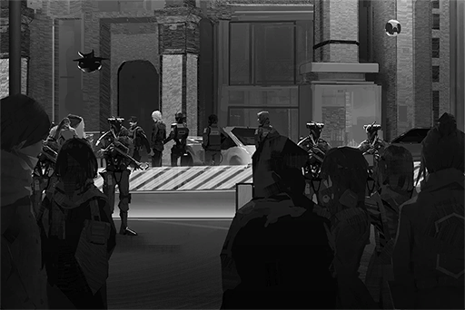
### Replies
**ROBO_Head** 
Xenon's arrest 
Time range: Past 3 hours 
Community preference ranking, from high to low: 
1. \[Culprit arrested\] 66.1% 
2. \[False arrest\] 23.5% 
3. \[Accomplice still at large\] 9.2% 
4. \[No comment\] 1.2%

**AntiMetal** 
Truth revealed! So it was this bastard after all!

**Gogossip** 
OMG Sis Vicky predicted the future! 
Better subscribe for a whole year as support!!

**DoToro** 
Been following him for a long time, now I feel like a fool... It's like I'm the accomplice of a criminal

**CyberLord** 
Man, you're not alone 
I just deleted all music that is related to him, whether it's Xenon or Æsir

**Abbyl** 
I still can't believe it QQ

**Axroid_Sona** 
Face reality. He didn't even utter a word! No innocent people will be this quiet! Told you guys, I felt there was something wrong with him a long time ago. Now the truth shows that HE is the biggest culprit behind this whole incident!

**11IIll11** 
NEKO has been defending him all this time, yet he had the gall to attack her AND play with her feelings. Disgusting

**kou** 
My younger brother is still in a coma because of him... It's all his fault...

**Arayray** 
He still hasn't woke up? Oh my god... I wish your brother the best of luck qq

**noneXenon** 
They got the wrong person, right? Xenon can't be this kind of person, can he?

**fotoistruth** 
You never know the true side of a person until you see it. If not for Sis Vicky, we would all definitely still be in the dark. 
Top\-level journalism is a necessary part of a developed society after all

**Nyd_Ans** 
Such a world\-class scandal at the very start of this century... We need to lock terrorist like him up ASAP

**888fans** 
Great job. the internet can finally return to its peaceful days

**AntiMetal** 
Fanboys and fangirls, get REKT XDDDD

**Nyd_Ans** 
You only find out who is swimming naked when the tide goes out\~\~\~\~\~  Bet those fanboys are all butt\-naked now\~\~

**Go55ip** 
Sis Vicky is the media heroine we deserve AND need right now

**USurBrain** 
Is it possible that he can still hack the s\*\*\* out of everyone even in custody?

**fotoistruth** 
Out of Neko and Cherry, I wonder who out of the two will stay by his side

**Copper_stone** 
Run as far away as possible ofc\~\~\~\~ What kind of idiot will choose to stay with him

**AntiMetal** 
Yeah yeah go praise your now worthless posters stupid fanboys

**xxScarlexx** 
Xenon... How come...

**WAW** 
Not showing any signs of resistance during his arrest, does this mean that he's secretly pleading guilty???

**noneXenon** 
Xenon is supposed to be a very careful person. Even if he does do something bad, he shouldn't leave such obvious clues either, right???

**AntiMetal** 
Did you morons get your brains burnt from defending him too much?

**GymGai** 
If it really is Xenon 
Then when Robohead exposed the truth months ago, he was like "Oh I'm figuring out a way to help everyone..." Dang that was some excellent acting, wasn't it???

**Wrinkleheart** 
I thought 4 sure he would resist arrestment.  
Guess he is not the physical type after all

**NEKOSAIKOU** 
F\*\*\* doesn't that make him an absolute music genius

**Curo** 
Crap, he is even more godly now. Genius hacker + genius musician

**Poopytrap** 
Time to binge\-hear Æsir music to let off some steam

**4nonymous** 
Thank you to the admins for arresting Æsir 
Can you punish him by making him compose more music @@

**Copper_stone** 
Xenon repay me my internet bills

**Axroid_Sona** 
Not surprised, can't expect someone who wouldn't show his real face to the public to be any sort of a "good guy" LOLOL

**AngryMan** 
Good thing that I didn't really like his music to begin with 
I have several friends who are trashing their albums right now LMFAO

[*(Click here to go back to the top)*](#toc)

## <a id="o9001"/>\[#090\] Any idea why such a winner in life would go and commit crimes??
### Requirements
|    Char.    |Lv.|Lv. Locked?|
|-------------|:-:|:---------:|
|**PAFF**     |56 |    Yes    |
|**NEKO#ΦωΦ** |56 |    Yes    |
|**ROBO_Head**|56 |    Yes    |
|**Ivy**      |29 |    No     |

### Post
**WeskerLam** 
Seriously, why? 
Genius, has a job that pays really well, knows how to play music, BOTH his rumored girlfriends are super hot/cute girls anyone would die to date 
It's not like he's a loser weeb like me who can only get a tiny sense of happiness through dating sims and simulation games 
Just... why the heck would he want to host a concert to delete everyone's memory? 
Is he a psychopath or what?
### Replies
**Go55ip** 
Maybe he has some sort of rare disease that allows him to achieve orgasm by deleting people's memories

**888fans** 
In addition, people won't even remember the ahegao you have when you delete their memories

**UltraKY** 
Ooh, how convenient

**GymGai** 
To get inspiration for songs? I have heard that some artists get their creative rush through negative emotions like violence and crimes. Maybe that's the case??

**Nyd_Ans** 
Goddamnit he is such a winner in life! I am jealous AF

**Marshall** 
Both NEKO and CHERRY are great!!! I often have... thoughts when I look at them

**DoToro** 
If you're someone who has followed Xenon from the very beginning, 
it's very difficult to imagine that he's someone who would do such things...

**Arya_Poke** 
Iirc, his motivations were not stated clearly in the news 
Usually, if someone pleads guilty directly without a motivation, something's definitely fishy, right

**DDStream** 
So... guilty was "pleaded" for him? 
Basically, a sacrificial lamb??

**4nonymous** 
Isn't it precisely because he's a winner in life that gave him the idea that he can get away with whatever bullcrap he does?

**aidan** 
Most winners in life ended up being complete f\*\*\* ups too 
You will treasure the things you have only if you achieved them through your own hard work!!

**HimawariK** 
I am proud to say that I've cleared all the routes for any dating sim I play!! 
**\#Weebpower**

**Heart_Head** 
The world of a genius is hard to understand. Perhaps there really is a reason that none of us ever thought about!

**NEKOSAIKOU** 
Welp, can't help it then, guess I'll be the one to comfort NEKO

**AlwaysKY** 
Maybe he lost in truth or dare?

**DogBark** 
Imo, there is definitely still more shady stuff that folks are not saying

[*(Click here to go back to the top)*](#toc)

## <a id="o9101"/>\[#091\] \[Repost\] Breaking! Cherry booed for being "unprofessional" after late arrival at concert, this person spoke up for her behind the scenes...
### Requirements
| Char.  |Lv.|Lv. Locked?|
|--------|:-:|:---------:|
|**PAFF**|57 |    No     |

### Post
**Flower_Head** 
\[Entertainment\]\[Cherry PuNK\]\[Concert\] 
> In a recent performance of the popular band Cherry PuNK, lead vocalist Cherry appeared to suffer some serious mismanagement regarding her personal schedule. She was absent for almost 30 minutes before hastily taking the stage to complete the performance. Although her performance is still up to her usual standards, her actions at the start left quite the bad taste. Many audience members criticized her, calling this "The most absurd concert" they've ever seen.  
>  
> Cherry's late arrival occurred at a charity concert held at Node 08's Central Park. Many audience members actually waited in line overnight just to catch a glimpse of their idol, yet they were slapped with a near\-30 minute no\-show. Many thought that this was an organized warmup event by the band at first, which led to plenty of complaints. Some fans took to iM to express that Cherry is nowhere near as nice and professional as others have described. Their reasoning is that she didn't even bother to explain why she was late. She just hopped on stage and performed till the end as if nothing has happened.  
>  
> However, the day following the concert, fan club president CherryMyLife (iM account name) made a statement after contacting Cherry's agent and other band members to understand the situation. He stated that the real reason behind the delay was because Cherry had to deal with a family emergency that suddenly came up. Knowing how disappointed the fans would be of her absence, Cherry rushed to Central Park as fast as she could once she finished addressing the emergency. 
>  
> Cherry didn't cancel her performance even in the face of an unforeseeable situation. After this information surfaced, her dedication and work ethic immediately received praise from fans and netizens once again, claiming that Cherry is indeed "Node 08 rock's last hope". Praises like "Cherry is the best person I've ever seen.", "We don't deserve Cherry PuNK.", "This is why I will always love her." "Only Cherry can surpass Cherry" can be seen everywhere.

\[Article excerpted from Neo Entertainment\]

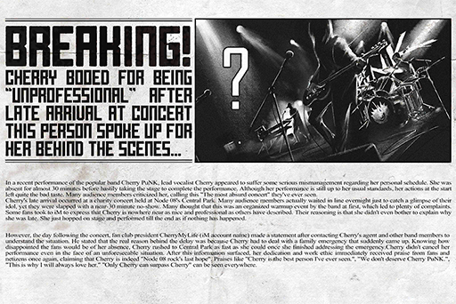
### Replies
**CherryMyLife** 
Cherry is what we call a true professional ok\~ 
If it's other artists, they would've probably just canceled the whole thing!

**TunaLee** 
Does anyone else feel disgusted by this hollow content farm nonsense we're getting a lot these days??

**moonin** 
Her loyal fans probably didn't mind the delay, but the average audience would be pretty mad, right??

**vveay** 
Looks like mono's inner management has loads of issues too 
Why would anyone allow such a serious mishap??

**CJW** 
However, if we were to judge by previous cases, it seems like Mono can't really monitor Cherry either LOLOL 
Like the previous incident where she violated her contract, the whole thing barely even made the news

**HC** 
Is this what news are nowadays?? Just a compilation of internet comments??

**NnNn** 
Oh... so this counts as a report?

**JusticeMe** 
Those comments in the end... just how big of a fanboy do you have to be to make such stupid comments? Guess it takes talent to be a fanboy too ROFL

**SYY** 
Turns out that the whole article is just empty fluff. No insider information what so ever

**Curo** 
Hey look, it's friends who know how to make big scawy titles\~\~\~\~

**lenba** 
Breaking! Reporter does your family know that you are copy and pasting internet posts and calling it news?

**RamenBot** 
We don't deserve to read such garbage reports

**lrrllrrl** 
WTF she just showed up at the end. What did she do to deserve such glowing praise?? Are we that desperate for anything good now?

**maplewing** 
I was literally dumbfounded that day. I really thought that LUMY's gonna perform the whole thing herself

**FindCherry** 
All PuNK no Cherry

**94Chiang** 
Praise the entertainment media and their ability to turn any minute incidents into national emergencies!!

[*(Click here to go back to the top)*](#toc)

## <a id="o9201"/>\[#092\] English pronunciation very important
### Requirements
|   Char.    |Lv.|Lv. Locked?|
|------------|:-:|:---------:|
|**NEKO#ΦωΦ**|57 |    No     |

### Post
**t×pazolite** 
Because my english is poor sometimes I use wrong pronunciation. A while ago when I performed at Node 47, a staff member asked me in English if I am ready or not. I wanted to say "I'm ready" but I said "I'm lady". I'm not lady.
### Replies
**Hulujam** 
It's t×pazolite!! lululul The new collab song is awesome!

**STANley** 
There's no turning back, you are lady now

**beeeeeeeeee** 
Very good. Keep being lady lol

**Y4NK** 
Awwww, so cute XDDDDD 
I heard that the live performance was super sic. Too bad I couldn't go... \*Cries in corner\*

**KiwaHu** 
**@t×pazolite** My body is lady.

**t×pazolite** 
**@KiwaHu** Are you lady?

**MYMYM** 
Are you lady?

**BUCK$** 
Are you lady? (Me too

**TunaLee** 
Hey, Node 47; heard there's a really amazing game company there XDDD

**C.Y.** 
Does 47 speaks English as well?? 
I've always wanted to visit that place at least once

**JAC-jack** 
That's just because English is the most universal of all existing languages 
It's what the Academy taught us 
Doesn't really matter to me. It's not like English is hard or anything; anyone can learn it without trying

**Curo** 
Sir, do you have any idea how many people you just p\*\*\*ed off with that last line?

**Kemcoter** 
**\#t×pazolady**

[*(Click here to go back to the top)*](#toc)

## <a id="o9301"/>\[#093\] Did any one of you suffer damages in this malfunction incident?
### Requirements
|   Char.    |Lv.|Lv. Locked?|
|------------|:-:|:---------:|
|**NEKO#ΦωΦ**|57 |    No     |

### Post
**9tingale** 
Our hospital got hit really hard in this incident 
It's like we drew the short straw on every single occasion 
Any device that requires connection got wiped out pretty much entirely 
Many patients in intensive care or has special diseases, unfortunately, passed away because of this  
(Surprisingly, there were also some patients whose symptoms got better) 
Just suddenly realize how severe the risks can be when we are so overly reliant on a singular system 
ARC did send someone later to discuss compensation with the higher\-ups of the hospital 
However, it all just felt too late...
### Replies
**vveay** 
Even though you should already feel numb to life and death since you're in a hospital, stuff like this still makes me very upset

**in9odwetrust** 
Good work to all the doctors

**AaA** 
Thank you to all the doctors who held their posts in such a time of crisis

**BbB** 
Are there any ways we can give donations to the victims' families??

**Tracix** 
Wait, so no backup system at all for such delicate equipment?? QAQ

**Andy_Roid** 
ARC had better shell out some serious money for this screw\-up

**StuffyMouth** 
So there were people who got better??

**9tingale** 
Yes, patients with Virtual\-Internet Related Post\-Traumatic Stress Disorder

**Wickedragon** 
9tingale, have you ever thought about becoming a knowledge\-type streamer? 
I've always found your articles to be professional and useful

**Mimosa_droid** 
You can call yourself Miss Doctor or something

**Neon_raven** 
There are so many things wrong with that I won't even bother to correct you 
Dr. 9tingale would be a much better title

**IronFan** 
I support that\~\~\~\~\~\~

**kou** 
A prayer to all those who passed away \*Pray\*. May they all rest in peace

**Arayray** 
Back then when the internet broke down, I thought to myself "OH, crap." Nowadays, so many services and systems are deeply tied to the internet. It's guaranteed chaos if anything happens to it. And what do we know?

**Henry** 
All my bank services also got completely wiped out that day\~\~\~\~ 
The money I transferred is still lost in the void

**Snor_eDen** 
If anyone needs help. feel free to contact me. I'll see what I can do.

**UltraKY** 
I feel like there's absolutely a loophole in the user agreement 
No way in hell would they ever compensate the whole amount!!! 
**\#ARCWillPay**

**Gogossip** 
By "getting better", do you mean that they woke from their coma??

**9tingale** 
Their brainwaves have returned to normal intervals 
But the reason why we noticed this is that there actually were patients who regained their consciousness 
It's a bit like they suddenly woke up from a deep sleep 
However, it's only for that brief time period, so we can't really call this a cure

**Krypton** 
If that's the case, maybe you should inform ARC about this too

**Henry** 
Maybe not now, as I bet they are currently in complete chaos trying to handle all the compensation and insurance stuff

[*(Click here to go back to the top)*](#toc)

## <a id="o9401"/>\[#094\] Nuff said. Engage Meme
### Requirements
|    Char.    |Lv.|Lv. Locked?|
|-------------|:-:|:---------:|
|**ROBO_Head**|57 |    No     |

### Post
**MasterMeme** 

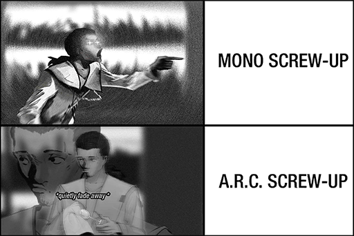
### Replies
**66TAN66** 
Ahahahahaha YEP! Totally get it.

**CHanatsuka** 
I approve of this. Well done

**TreeNoAlice** 
This JOE is simply memetastic LOLOLOLOL

**FlyingCodo** 
If someone really had the balls to "pass by" A.R.C., the armed security guards are gonna beat them into a pulp, right??

**Prime6750911** 
Too real man, too real. 
In the face of the REALLY scary people, nobody even dares to let out a whimper.

**Rabbitdora** 
F\*\*\* I'm in class right now! I almost couldn't control my laughter\~\~\~\~\~\~\~

**HandsomeYi** 
I would gladly have a sniff of whatever the heck JOE is on. Pretty please??

**JOEZ Cafe** 
Dafuq I was wondering what happened and why I'm getting so many reposts... 
Where in living gods' name did you people get material for this crap!!!??

**Shibawu** 
Oh, hey look, it's the memelord himself XDDDDDDD

**MatsuyamaC** 
Boys, step right up\~\~\~ We are here to witness the star of a new meme\~\~\~\~

**w_Rosabel_w** 
Come, King of Germs, let us go and "Pass by" ARC headquarters together\~\~\~\~

**Bit_Inex** 
Ooh, nice one owner lul. Yes, feel it, embrace the power of the meme LMFAO

**Pinevalley** 
Owner, give me a batch of JOE, please. I'd like to get high

**Fu7ureW0rld** 
God my stomach hurts from laughing so hard lolololol 
But, on the other hand, this is the very sad yet very real truth too...

**CyberLord** 
Mono: "Screw this s\*\*\*. All I did was accidentally lose an artist..."

**Duncan128** 
I bet you that the reason why people are scared to protest at ARC HQ is because they fear that their brains will be melted and come out of their nostrils if they do

**Noposa** 
Owner, quick! This is the golden opportunity to insert your promotions!

[*(Click here to go back to the top)*](#toc)

## <a id="o9501"/>\[#095\] \[Repost\] Æsir\-FEST incident prime suspect Simon Jackson pleads guilty to his crimes
### Requirements
|    Char.    |Lv.|Lv. Locked?|
|-------------|:-:|:---------:|
|**ROBO_Head**|57 |    No     |

### Post
**Flower_Head** 
\[News\]\[Æsir\]\[Hacker\]\[Cybercrime\]\[A.R.C.\]\[Administration Bureau\] 
> The series of internet terrorist attacks related to the infamous Æsir\-FEST has been the talk of the Node. Prime suspect Simon Jackson (Internet ID: Xenon) was arrested a few days ago. Despite refusing to explain his involvement with the cases at first, after several nights of interrogation, we've received information that he has finally given up and pleaded guilty, stating that he is indeed the mastermind behind everything: Æsir. 
>  
> According to an anonymous source from within the Administration Bureau, Simon Jackson stated during interrogation: " Under a condition where a certain purpose exists in the subconscious, I may have used my computer technology skills to convert the theoretical thought of stealing memories into practical actions. Even though my memory is still in a rather chaotic state, I will not rule out the possibility that I fabricated this Æsir identity and used it to commit criminal acts." 
>  
> The source also points out that the higher\-ups at A.R.C., where Simon Jackson is previously employed at, have also dispatched key figures to assist the Administration Bureau in acquiring more evidence. This is also to ensure that there are no hidden accomplices or other potentially dangerous factors that may lead to another incident.

\[Article excerpted from Node News Network\]
### Replies
**Nyd_Ans** 
Truth Reveal XD

**AntiMetal** 
Night night fanboys and fangirls. GG for you all\~\~\~

**Axroid_Sona** 
Why does the second paragraph feel like some bureaucratic mumbo jumbo??

**noneXenon** 
Is it possible that he's forced to plead guilty

**Wrinkleheart** 
Is it just me, or does this feel like the admins are in a hurry to get this case over with?? It all seems too easy

**AngryMan** 
So he wanted to test out his abilities thus decided to use the entire city's brains as his lab rats?

**11IIll11** 
I heard that Xenon participated in the establishment of many of the virtual internet's regulations 
Maybe, just maybe... they are filled with loopholes he inserted himself\~\~\~\~\~\~

**NEKOSAIKOU** 
RUN GUYS, RUNNNNN\~\~\~\~\~\~\~

**GymGai** 
It's so hard to imagine what the usually cool Xenon would look like when he pleaded guilty 
Probably pretty emotionless

**fotoistruth** 
Or... maybe it's the complete opposite and he's a sobbing mess on the floor...

**USurBrain** 
Just how many "insiders" are there for the media??? 
In theory, shouldn't this be investigative information that is not yet revealed to the public LMFAO

**xxScarlexx** 
Anonymous source... Unless a proper source is named, nobody's gonna believe this BS

[*(Click here to go back to the top)*](#toc)

## <a id="o9601"/>\[#096\] Xenon you better give us a goddamn explanation
### Requirements
| Char.  |Lv.|Lv. Locked?|
|--------|:-:|:---------:|
|**PAFF**|58 |    No     |

### Post
**AngryMan** 
So many netizens are trash\-talking you

Yet you've been completely silent and not talking s\*\*\* back all this time

If you really still have a lick of conscience left

At least make it clear who do you like more, Cherry or NEKO

Don't leave us hanging like this
### Replies
**USurBrain** 
OP have you forgotten that he is still currently in custody???

**Go55ip** 
I am personally on Team NEKO 
Plenty of fish in the sea, no need to dwell on an ex\~\~\~

**AntiMetal** 
He's gonna get locked up HAHA good riddance

**GymGai** 
He'll probably be in there for like thirty years or something right?? 
He's gonna be one thicc old man after all that "training" in there

**fotoistruth** 
Have you ever considered the feelings of us NEKO fans and Cherry fans?? 
NO!!! 
Because you only cared about yourself!!!

**noneXenon** 
I feel like X was framed, or else I would never believe anything in this world again (Cries...

**4nonymous** 
Young child, this is just how the world is, cruel and heartless. Get used to it

**888fans** 
So there are still fanboys who speak up for him LMFAO

**Curo** 
I prefer Cherry. The cool beauty big sister type is the best. Please step on me >////<

**TunaLee** 
Stop treating this crap like it's amusing dumba\*\*  
This world is chaotic enough without you adding more fuel to it

**9me** 
How the f\*\*\* is he going to talk back you idiot lol

[*(Click here to go back to the top)*](#toc)

## <a id="o9701"/>\[#097\] \[Repost\] A.R.C. exploration team founding member Colin Neumann passes away
### Requirements
|   Char.    |Lv.|Lv. Locked?|
|------------|:-:|:---------:|
|**NEKO#ΦωΦ**|58 |    No     |

### Post
**Flower_Head** 
\[News\]\[Obituary\]\[Archeology\] 
> Colin Neumann, patriarch of the Neumann family and veteran A.R.C. exploration team captain, passed away at the family manor in Node 08 on October 23rd at the age of 76 due to illness.  
>  
> The Neumann family is renowned for producing excellent archeologist, and Colin Neumann is no exception. His achievements in recreated technology and ancient artifact collection made significant contributions to the development and rebuilding of human civilization and should not be overlooked. When he was a member of the exploration team, despite encountering countless dangers, he always completed the mission with his resolute will and unrivaled skills.  
>  
> After his retirement, Colin Neumann has lived a semi\-reclusive life in the Neumann family manor. According to a close friend of his, he has continued to study the artifacts left behind by ancient civilizations...

\[Article excerpted from News Fastlane\]
### Replies
**DiiR** 
WHAT!! ConneR sensei passed away??? How come???

**RestinHell** 
RIP, even though I didn't really like him before

**NerfThat** 
Why all of a sudden!!!???

**XenonMyLife** 
Sensei, I really loved your music 
May your soul rest in peace

**T3RA_wr47h** 
My god, this year is such a terrible year. So many sad things... R.I.P.

**HWJones** 
R U serious 702... Is taking PAFF away from me not enough\~\~\~

**Axroid_Sona** 
I am so fortunate that I was able to go to his previous concert 
It's an honor of a lifetime to participate in the final performance of a master

**Never_Show** 
What! I was planning to enroll in his class next semester too!!!!

**UltraKY** 
A legend has passed away, just like that 
This reminds us that we should seize the moment 
and don't dream about going down the wrong path.  
Punishment may not come immediately, but it will come one day 
Be charitable, be kind

**KYBuster** 
WTF are you talking about? 
Are you trying to imply that he deserves to die because of his actions????

**FakeFANS** 
If you think about it, without ConneR sensei's contributions 
many ancient technologies would probably still be buried and never see the light of day 
Rest in peace sensei

**Elextron** 
Life is so unpredictable. I previously thought sensei would either die on stage in a spectacular final performance or die during an excavation accident 
Never imagined he would die of illness in his own home

**WannaBuy** 
Will people sell sensei's prosthetic eye and arm as commemorative items? I want to buy them and enshrine them at home

**C.Y.** 
U serious... It's year 702 already... When will people learn to start using their brains before posting these stupid comments???

**CJW** 
Utterly speechless... So that's how rumors are created. People can't even read the title correctly LOL

**Dogleg** 
Is English too difficult a language for you morons to read?  
ConneR's full name is Colin Neumann Jr. This is his father, not him!!

**Curo** 
The first few comments are so freakin cringeworthy ROFL

[*(Click here to go back to the top)*](#toc)

## <a id="o9801"/>\[#098\] My turn to stream again!! Let's play GOW!
### Requirements
|   Char.    |Lv.|Lv. Locked?|
|------------|:-:|:---------:|
|**NEKO#ΦωΦ**|59 |    No     |

### Post
**NEKOSAIKOU** 
\[Stream announcement 09:00 PM God of Work\]

Heard that this game is seriously godlike 
Has already sweep through countless awards 
From the trailer, the combat system looks a bit complicated 
If I suck balls in tonight's session, please don't flame me

As with why I decided to stream all of a sudden 
Maybe because after watching NEKO stream for so long, it really seems like a fun thing to do 
So I decided to give it a try myself too
### Replies
**Uxi** 
God of Work sounds unnecessarily epic... What kind of game is it??

**DDStream** 
TPS+RPG, you need to train by working in a company, then go out to save the world at night

**HandsomeYi** 
Dafuq lololol Whoever thought up this idea is either a madman or a genius lolol

**MYMYM** 
What is TPS (Serious question

**Marshall** 
Tired Poison Shower

**aidan** 
Sir, your English teacher would like a word with you. Oh, and he has a knife

**MemeYan** 
I previously saw this game on NEKO's wishlist lulz 
There's also the Mega Briefcase deluxe edition 
Inside, it contains a physical employee badge and the in\-game item "Infinite Overtime Coins"

**Noposa** 
So you have to achieve a balance between going to work and killing monsters?

**NekoSamurai** 
Oh, so our MC is working two extra jobs 
Work in the morning, overtime at night, killing monsters for late night

**Pooooon** 
I don't want to be this MC...

**Poopytrap** 
On top of that, you also have to maintain your relationship with your family. You have to find time to go home, because a broken family is Game Over as well

**C_H_U** 
Aren't we playing this game every day? It's called "Life" HAHAHahahahah... I want to cry

**CHanatsuka** 
I finished the whole game. Quick tip: just buy tons of Overtime Coins. That's the fastest way to level up

**KirinKiraKira** 
I see your grand plan. You're trying to become a streamer so you get to sit next to NEKO in the iM annual party\~\~\~

**Mulder** 
I heard that a sequel is already in development

**xxScarlexx** 
This game creates some serious inner conflicts when you are playing through it XDD

[*(Click here to go back to the top)*](#toc)

## <a id="o9901"/>\[#099\] Betting time\~\~\~ What will happen to Xenon at the end of all this???
### Requirements
|   Char.    |Lv.|Lv. Locked?|
|------------|:-:|:---------:|
|**NEKO#ΦωΦ**|60 |    No     |

### Post
**Watch_Burn** 
A. Locked up for life 
B. ARC use some kind of BS connections to bail out their most important employee 
C. He wipes the memory of everyone in the restricted area again then breaks out 
D. He was innocent to begin with and the admins screw up AGAIN\~\~\~
### Replies
**Watch_Burn** 
I'll cast my vote first; I personally think it's B 
No way in hell would ARC just give up and let the admins snatch away such a talent 
The obvious way to go is to get him out, then make him repay that favor by working his a\*\* off for you. That's how you squeeze out all the value!

**Wrinkleheart** 
Locked up for life feels too harsh... 
I don't think this is a crime that deserves that severe of a punishment

**in9odwetrust** 
You never know there were quite a few indirect deaths caused by the malfunction of the internet, gotta take that into account too

**WAW** 
Wait you mean the previous massive internet malfunction case is also related to Xenon??? 
Or is that just your personal speculation?

**SIhama** 
Does nobody wants to add new options lol 
I've been thinking... 
Maybe someone will go and jailbreak him outta there?

**StuffyMouth** 
No f\*\*\*in way LOL 
The security in that place is super tight. One wrong step and you'll be riddled with bullets by the drones XD

**Watch_Burn** 
If you ask me, I say there are no more than 3 people in the entirety of Node 08 who are skilled enough to carry that plan out

**GemFeather** 
I bet he'll be declared non\-guilty and acquitted. The admins f\*\*\*ed up and arrested the wrong guy in the first place!

**Manpora** 
I'm a fanboy of Xenon, so my bet is on C! 
That place is no match for the best hacker in the entire world!!!

**RamenBot** 
One vote for admin screw up 
I find it really difficult to trust anything the admins put out

**fotoistruth** 
ARC is so deeply connected with the admins, some sort of secret negotiation behind closed doors is totally possible, right?

**Prime6750911** 
He tainted my two goddesses, two life sentences

**UltraKY** 
The moral of this story: don't f\*\*\* with an angry weeb, or you'll get locked up for life. Ohhhh, so scary LMFAO

**Henry** 
I also feel like someone will bust him out 
Xenon should have a pretty wide web of connections

**Krypton** 
I feel like he also needs to first state clearly why he pleaded guilty. If not, why would anybody want to save him???

**FlyingCodo** 
Possibility of folks breaking him out to perform lynching (?

[*(Click here to go back to the top)*](#toc)

## <a id="q0101"/>\[#101\] Is it just me, or does someone else also feel like Æsir is a legendary performance artist?
### Requirements
|   Char.    |Lv.|Lv. Locked?|
|------------|:-:|:---------:|
|**NEKO#ΦωΦ**|61 |    No     |

### Post
**ShrimpBye** 
Æsir (I think it should be fair to directly call him Simon or Xenon now) 
is totally a legendary performance artist\~\~\~\~\~

When he debuted, he only distributed music on the internet for free: A rebellious attitude to the pop music industry that only cares about money

Invited famous artists to host a completely free Live performance: A symbol that music has no borders and should be accessible to everyone

At the end of the Live, erase everyone's memory and take it away: A sign that artists have absolute control over their own work

Hacking of an annoying streamer: A warning to ignorant brats. The world of the internet is not a place for you naive children to be messing around in

Real identity discovered: Everything turns out to be planned by the seemingly self\-righteous and self\-proclaimed "defender of justice" Xenon. A lesson that tells everyone to not trust shallow and egotistical truths so easily
### Replies
**Miyoko1212** 
I almost believed you, ALMOST

**CeeJay** 
What the heck are you smoking?

**Trashtalker** 
You've successfully blurred the line between Xenon hater and fanboy cuz I have no idea which one you are after reading all this

**AAAnton** 
Is it just me, or has the letter X start to develop powers? Cuz every time I see it, I get this sense of nausea, dizziness and want to puke (faint

**RaiKiyumi** 
I feel like I have visual fatigue from seeing it so much 
I often have times where I suddenly don't know how to pronounce the letter "X"

**Lynx87** 
Keeping going, you are this close to persuading me

**Cipher_troll** 
There are so many damn loopholes in that. You can't just casually skip over everything like that without addressing the details. Context is important!

**noneXenon** 
If Xenon ever gets a bail, will everyone be willing to donate money to fund his bail?

**xxScarlexx** 
I'll donate I want to do something for him!!!!

**HolyEarth** 
Holy s\*\*\* This is the most amazing speculation I've seen since this incident occurred 
Can I repost it to my private chat group XDDDD

**Copper_stone** 
So... he performance\-arted himself to an arrest? Is he stupid or what 
Many of them pretty serious crimes too

**Fu7ureW0rld** 
I still believe that Xenon is innocent, something's definitely fishy about this case

**Logicker** 
Wait but Xenon did charge people money for his personal Live lol 
The logic makes no sense there, doesn't it???

**Pumpkinforest** 
He can dispute any illogical loopholes with that last point anyway. He is never wrong no matter what

**Muahaha** 
OP, have you ever consider starting a cult? 
You seem pretty good at BSing people

**Gearz_Igo** 
Hey look, it's friends who know how to talk nonsense\~\~\~

**Trashtalker** 
I'm also a performance artist. I oversleep and is late for school every day. I use my personal experience to prove the importance of time management since I overslept for my midterm and is now completely f\*\*\*ed

[*(Click here to go back to the top)*](#toc)

## <a id="q0201"/>\[#102\] Battle Royale game recommendation
### Requirements
|   Char.    |Lv.|Lv. Locked?|
|------------|:-:|:---------:|
|**NEKO#ΦωΦ**|62 |    No     |

### Post
**NnNn** 
Figure I'd pick up a battle royale game to give the genre a shot  
iM folks, recommendations plz!!!
### Replies
**CHanatsuka** 
Too many battle royales these days 
Do we have something that's more peaceful??

**TunaLee** 
For example, we can place a group of players in an area full of weapons 
If nobody dies within 30 minutes, all players are then declared winners 
Something like that???

**JAC-jack** 
What is this, an ultimate challenge to our humanity XDD I feel like it's definitely going to fail because there will never be a winner lol

**HandsomeYi** 
Tbh I don't think it's that bad of an idea. It would be quite the wake\-up call

**KiwaHu** 
Teammates: Hey, we got a gun here. Let's pick it up so players who want to hurt others won't get it.

**moonin** 
This is not battle royale anymore 
Should call it the peaceful royale

**vveay** 
If we go by human nature, 
there should be a group of people who consider themselves "righteous" and "fair". They will take away all the weapons first to "manage" them

**STANley** 
Then they will start attacking and downing those players that "feel" very dangerous to them

**SYY** 
In the end, in order to determine who is truly "dangerous", a conflict will break out and people will start bashing each other's brains in with the weapons

**lrrllrrl** 
Wait, then we're reverting back to an actual battle royale again WTH XDDDD

**Hulujam** 
Yes, this is human nature after all\~\~\~\~

**HC** 
All this discussion yet not a single actual recommendation in this thread dafuq XDDDDD

[*(Click here to go back to the top)*](#toc)

## <a id="q0301"/>\[#103\] \[BREAKING\] I think I just witness something pretty freakin major!!!
### Requirements
|    Char.    |Lv.|Lv. Locked?|
|-------------|:-:|:---------:|
|**PAFF**     |58 |    Yes    |
|**NEKO#ΦωΦ** |63 |    Yes    |
|**ROBO_Head**|58 |    Yes    |

### Post
**Witne_SS** 
Today, on my way to my part\-time job, I suddenly heard a commotion coming from the crowd 
I turned around and I think I heard someone yelling NEKO's name 
So I just sort of instinctively press the shutter 
I ended up capturing a photo that's pretty amazing!! 
Looks like the internet rumors about PAFF hiding in NEKO's home turn out to be actually true!!!

**\#Please get my permission before sharing or reposting**

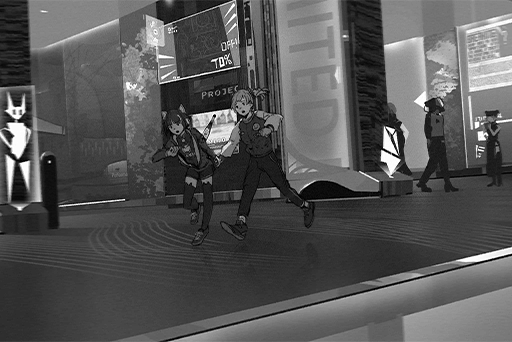
### Replies
**Heart_Head** 
Holy cow! News reporters! Material right here! Better start copying\~\~\~\~\~\~

**m00nl16h7** 
Man, you dumb. You should've just sold this photo directly to the media\~\~\~ 
I bet 08 Daily would absolutely pay a fortune for it

**Ararar** 
\*Sobs\* I'm so sad why do I never get chances like this  QAQ

**NathaN** 
Dude that's some EX rank luck!! You just bumped into an SSR character on the road!

**iluvpuf** 
I hope this is true! PAFF is safe after all!!! My day just got so much better\~

**ShadowForest** 
I feel like this post is gonna blow up

**DuskDawn** 
NOICE, actual breaking news. Haven't gotten those in a long time 
These days, there have been so much Xenon news that I feel a bit disgusted whenever I see one now

**Doubty** 
Same here LOLOL It's the same s\*\*\* every single day so damn annoying

**PoolsKitten** 
If it's true, then I can rest assured since PAFF is safe 
But what caused the commotion?? I'm getting a bit worried again

**BbB** 
I believe it's time to Tag sis Vicky so she can see this post

**Chevalier151** 
Mono, look. 
Somebody did your job for you!!!

**Arya_Poke** 
If only we have **@ROBO\_Head** here to perform precise analysis of the people in the photo 
We would've gotten further confirmation of their identities

**AbigaleJ** 
Dude, no need to Tag Robohead 
He has not answered any comments nor posted anything recently@@

**IronFan** 
So nobody even bothered to chase after them to make sure???

**Varinaya** 
It seems like they avoided the crowd in the end. My friend said that they did run pass her; really does look a lot like PAFF. Should be the real one

**Pascal626** 
\*Cries\* Meeting an idol on the streets... these opportunities never belong to me /\_\\

**LyLah1207** 
I hope PAFF can come back and continue to be an idol AHHHHHH 
I am more than willing to keep being your loyal fan Q\_Q

**KirinKiraKira** 
The fantasy Yuri ship just became canon\~\~\~\~\~\~

**Sopheee** 
My body is so ready\~\~ The hype is real\~\~\~\~\~

**PrideCr0w** 
I didn't know that they live in 08 as well before today

**MustangMartin** 
Reporters, prepare to copy and paste. Don't forget to pay the original post

**ShadowForest** 
I thought it was some serious news...

**Sopheee** 
Founding member of the PAFF fan club right here!! (OMG I'm gonna cry)

**AaA** 
This post is gonna blow up in no time. Finally, some new stuff for the media

[*(Click here to go back to the top)*](#toc)

## <a id="q0401"/>\[#104\] Where's Robo?
### Requirements
|    Char.    |Lv.|Lv. Locked?|
|-------------|:-:|:---------:|
|**ROBO_Head**|58 |    No     |

### Post
**Snor_eDen** 
It feels like I haven't seen a post from robohead in a long time 
The last post is also from quite a while ago 
Is he getting a repair or preparing a new Live???
### Replies
**NoSignal** 
Doesn't he usually just answers if you Tag him?? 
Hey, fifth comment, you give it a go

**beeeeeeeeee** 
Comment +1

**Pixely99** 
I am NOT the fifth comment!!!!!!!

**StuffyMouth** 
Comment +2

**TreeNoAlice** 
Okay okay I know it's me 
**@ROBO\_Head** Come on let's go and play\~\~\~\~\~\~

**JAC-jack** 
You're pretty resigned about this aren't you XDDD

**CyberLord** 
Looks he really isn't replying. Something's not right about this, isn't it???

**ElinaDaniel** 
**@ROBO\_Head**??? We need your serious analysis here\~\~\~\~

**maplewing** 
**@ROBO\_Head** Can you write my thesis for me QAQ

**FCodex** 
Can anyone on iM answer?? Did something similar to this happen in the past?

**66TAN66** 
Nobody appears to know where Robohead lives either... 
Maybe he stepped on his own power cord??

**Arianaya** 
Dude stop saying that BS 
I feel like it could be because a cockroach fell into his joints!

[*(Click here to go back to the top)*](#toc)

## <a id="q0501"/>\[#105\] \[Repost\] Simon Jackson escapes from jail, jailbreak accomplice identity and wherabouts unknown
### Requirements
| Char.  |Lv.|Lv. Locked?|
|--------|:-:|:---------:|
|**PAFF**|59 |    No     |

### Post
**Flower_Head** 
\[News\]\[Xenon\]\[Jailbreak\]\[Administration Bureau\] 
> According to our sources, in the middle of last night, several armed people broke into the restricted area. Their target was the prime suspect of the Æsir\-FEST incident Simon Jackson (Internet ID: Xenon), who was still in custody. Even though the Administration Bureau has stated that they will be holding a press conference to explain the situation once they sort out the details, it is almost certain that as of now, Simon Jackson is no longer under the control of the Administration Bureau. 
>  
> According to private interviews conducted by our reporter, the perpetrators' planning of this jailbreak operation was very carefully thought out. In addition to distracting the guards with words, they also destroyed more than a dozen armed drones. Fortunately, no casualties were found. Whether this was caused by the Administration Bureau's lack of discipline or the perpetrators being simply too skilled and well\-prepared remains to be determined. Right now, we can only wait patiently for the results of the investigation. 

\[Article excerpted from Node Times\]
### Replies
**Curo** 
As long as Xenon has a PC, no one, and I mean no one, can keep him locked up

**SIhama** 
Bulls\*\*\* who in the right mind would give him a PC? 
It's like telling him "Please hacks us and break out of here"

**Go55ip** 
I have a suggestion  
We should hide in the bushes around Cherry or NEKO's house. I'm sure he'll show up some day lol

**4nonymous** 
A few people were all it took to break him out? What the f\*\*\* are the admins doing??? God they are useless

**fotoistruth** 
What an embarrassment XDDD The restricted area being made a complete joke by a few random folks LOLOL

**888fans** 
Is there nothing we can do about this?? Just let him get off scot\-free like that?? Has a wanted order been issued?

**AntiMetal** 
ARGGGHHH so mad why did this guy get out!!!! We should introduce caning for bastards like him!!

**Watch_Burn** 
Drones destroyed... dude, doesn't that sound like what a terrorist would do?? Did an entire army show up to bail Xenon out??

**Heart_Head** 
The admins are probably figuring out how they're going to explain such a major screw\-up to the public

**Nyd_Ans** 
The two sides probably already reached an agreement. All is well, all is well\~

**GemFeather** 
In all seriousness, 
if the perpetrators can destroy over a dozen drones, I'm certain that they must be professionals in the business

**Axroid_Sona** 
I feel like there should be a news embargo on stuff like this 
Where did the reporter get all this info???

**DDStream** 
Maybe even this news report is fake\~\~\~ \#Fakenews is still alive and well\~\~

**DoToro** 
I think I'll repost after the NNN report on this is released

**Hulujam** 
The admins haven't even held their press conference, yet all the news have already been reported... What's the point of that press conference then???

**AlwaysKY** 
God they suck so hard why don't they just release every criminal? 
What's the point of locking them up if they can break out just like that??

[*(Click here to go back to the top)*](#toc)

## <a id="q0601"/>\[#106\] See, told ya guys
### Requirements
| Char.  |Lv.|Lv. Locked?|
|--------|:-:|:---------:|
|**PAFF**|61 |    No     |

### Post
**SIhama** 
I don't care if this whole thing is staged or not 
I never believed one bit that Xenon would be locked up for real 
It's all just a show for the public 
Nobody will remember a thing after six months\~\~\~
### Replies
**Marshall** 
That's a really damn entertaining show, lemme tell ya!!

**Watch_Burn** 
Keep making ARC more money 
Continue F\*\*\*ing up their opponents

**FlyingCodo** 
Brillant move by whoever staged this 
I think it's safe to say that the admins will never solve this case now

**RamenBot** 
Iirc, someone predicted on iM that he'll be rescued 
People made fun of him back then 
Well, guess who's the prophet now LOLOL

**JAC-jack** 
All hail the return of justice???

**StuffyMouth** 
Dude, drones are scary\-AF and they kill whatever comes into sight 
Whoever broke in to get him out must have balls of steel

**Chevalier151** 
Xenon's backing is simply too strong 
Not even the admins can hurt him

**KirinKiraKira** 
Will A.R.C. admit that they're the ones who did all that XDDD

**Sopheee** 
What is this soap opera nonsense\~ Who wrote this crap!

[*(Click here to go back to the top)*](#toc)

## <a id="q0701"/>\[#107\] What just happened...
### Requirements
| Char.  |Lv.|Lv. Locked?|
|--------|:-:|:---------:|
|**PAFF**|63 |    No     |

### Post
**CHanatsuka** 
MEME:  
THOUGHT YOU ARE SENTENCED TO LIFE IN JAIL 
YOUR EX\-BOSS SENDS SOMEONE TO BUST YOU OUT

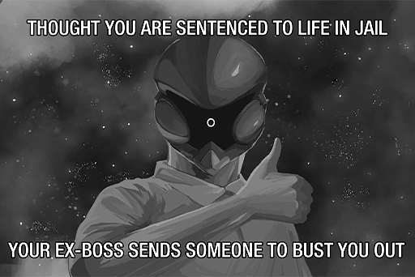
### Replies
**STANley** 
LOLOLOL this image XD

**TunaLee** 
Lol jail? More like his personal toilet 
He comes in, takes a few dumps and s\*\*\*\* all over the place, then leaves whenever he feels like it

**NerfThat** 
WTH XDDDDDD God I don't know why but that description is just so funny to me ROFL

**Pascal626** 
Man so many dank memes these days 
I pity those who accidentally gain internet infamy without ever realizing it

**vveay** 
Let's have a bet how long this post will stay up before ARC files a report to get it removed XDDD I say a few days since they'll be desperate to save face

**lrrllrrl** 
Who's that poor guy whose face got pasted over with Xenon's head LMFAO

**beeeeeeeeee** 
Can't tell what expression he has behind that helmet. Anyone wanna guess???

**KiwaHu** 
5 bucks say it's an ahegao (Please don't ban me

**SYY** 
Oh crap... It feels like even if in the end this is NOT the truth 
the power of memes will ensure that no one on the internet would ever believe them

**maplewing** 
Do not underestimate the spreading power of memes

**MYMYM** 
If I was ARC and I realy didn't do anything yet get all this hate, I would be so p\*\*\*ed off

**lenba** 
Hey, MYMYM, just a quick heads\-up: 
realy is actually spelled really. 
Have a nice day!

**JAC-jack** 
On top of that, no one would bother to even listen to your explanations and would just proceed to call you stupid/useless

**NnNn** 
Dude this topic is kinda sensitive. You don't want ARC coming after your a\*\*

**C.Y.** 
Come on\~\~\~ What year is it that we still have people scared of that nonsense???

[*(Click here to go back to the top)*](#toc)

## <a id="q0801"/>\[#108\] Holy F\*\*\* is this news real!!!
### Requirements
| Char.  |Lv.|Lv. Locked?|
|--------|:-:|:---------:|
|**PAFF**|64 |    No     |

### Post
**PoolsKitten** 
I heard my friend say 
that PAFF was discovered running around on the streets with NEKO 
Never thought that the legendary Yuri ship that only exists in the weebs' mind will become canon one day!! 
Bow down to your Yuri overlords\~\~\~\~\~\~
### Replies
**KirinKiraKira** 
WHAT!!!!! Does this mean that the doujins I previously collected are now gonna rise in price!!!!!

**PrideCr0w** 
PAFF is found??? 
So NEKO's the one who took her away??? 
OMG there are so many things I want to know\~\~\~\~\~\~\~\~\~\~\~

**HandsomeYi** 
Oooohhh I don't know why, but this ship sounds so hot (Slurrpppp

**BuzzDriver** 
You disgusting weebs, stop looking at my goddesses with those perverted eyes of yours!!!! 
... 
... 
... 
... 
Also, sauce plz? For, ahem, research purposes.

**Sopheee** 
So PAFF is safe!! Thank goodness!!

**AbigaleJ** 
She has been missing for so long, I thought she got caught up in some kind of accident QAQ Although she's now together with the wildcat (who I really don't like), I still hope she can return to the stage soon!!

**CeLiA** 
That's awesome news!!! Someone go inform Sis Helena ASAP\~\~\~\~\~

**noneXenon** 
Why were they running around @@ Did they encounter some kind of danger??

**iluvpuf** 
Does anyone know where they ran to?

**LyLah1207** 
Where did the witness report originate? Can someone confirm it for us? I feel like there's something very odd about this

[*(Click here to go back to the top)*](#toc)

## <a id="q0901"/>\[#109\] PAFF IS FOUND!!!!!!!!!!!!!!!!!!!!!!!
### Requirements
| Char.  |Lv.|Lv. Locked?|
|--------|:-:|:---------:|
|**PAFF**|66 |    No     |

### Post
**iluvpuf** 
Just opened my iM to see the same message being spammed everywhere 
Guess the PAFF following is strong in my social circle ROFL
### Replies
**Arya_Poke** 
It's spammed everywhere on my side as well 
People have already been running serious analysis on the authenticity of that photo

**Varinaya** 
I feel like if she really chose to hide for some reason, she'd have to have someone helping her in order to hide for so long and not be discovered

**PrideCr0w** 
Speaking of this, a while ago, I saw this post in a NEKO fan group saying that NEKO has been streaming noticeably less these days 
Looking back, it seems like PAFF is the reason?

**Pooooon** 
I saw the post from that group as well LMFAO The top fan in that group even started streaming himself because of this LOLOLOLOL

**Lynx87** 
That infamously toxic/annoying NEKOSAIKOU right\~\~\~\~

**Ayx_Socket** 
Hey, give the guy some credit. 
He's been a lot tamer ever since NEKO's hacking incident

**Mulder** 
Sidenote, although this is not an important issue now 
Them appearing together like this completely debunks the previous myth that the two hated each other XD

**xxScarlexx** 
I have a friend who said that they really don't have a reason to hate each other

**KirinKiraKira** 
PAFF and NEKO have completely different target audiences, don't they??

**NekoSamurai** 
Imo, NEKO is similar to Robohead, as they both have a unique target market and very diehard fans. 
PAFF is just mainstream pop music

**Pixely99** 
What about XENON and ConneR??

**DPON** 
Xenon and ConneR's pairing (ship?) does indeed have quite the following XDDDDDD (100% certain

[*(Click here to go back to the top)*](#toc)

## <a id="q1001"/>\[#110\] \[Breaking\] Idol singer PAFF possibly spotted at Node 08 Tower after missing for months
### Requirements
| Char.  |Lv.|Lv. Locked?|
|--------|:-:|:---------:|
|**PAFF**|67 |    No     |

### Post
**Flower_Head** 
\[Breaking\]\[PAFF\]\[NEKO\]\[Missing\]\[Eye Witness\] 
> Node 08 idol singer PAFF has been missing for months due to unknown reasons. During her absence, multiple incidents have occurred. From the fans' violent protest regarding Monophonic Entertainment's mistreatment of her disappearance; to the information discovered during the Æsir\-FEST investigations that linked PAFF's deteriorating health to a possible memory theft she suffered during the incident and more. Just as everyone is about to give up on the search for her, the case took a very surprising and drastic turn today.  
>  
> Earlier today, in Node 08 Tower, multiple pedestrians caught sight of PAFF together with well\-known streamer NEKO. However, the two quickly passed through the crowd and proceeded to disappear. Only a few witnesses were able to get out their mobile devices in time to capture some blurry photos. We are currently contacting Monophonic Entertainment and the Administration Bureau to confirm the details on this event.

\[Article excerpted from Node Times\]

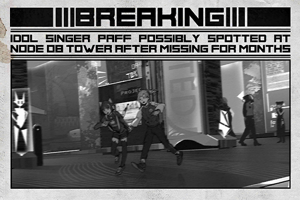
### Replies
**Michiko** 
!!!!!!!!!!!!!!!!!!!!!!!!!!!!!!!!!!!!!!!!!!!!!!!!!!!!!!!!!!!!!!!! 
Pray For PAFF success!!!!

**SancTityKnight** 
News of the YEAR!!!

**Sayomi911** 
I really was on the verge of giving up on following any news relating to PAFF QAQ

**Doubty** 
Could it be... 
that this is all part of a massive promotion plan by Mono??? 
This entire incident is merely a reality show that lasted for several months...

**Shahari** 
If this really is a reality show, I will follow Monophonic Entertainment to my deathbed. Whoever came up with (and executed) this idea is a goddamn mad genius

**Delora** 
PAFF x NEKO 4 life!!

**LyLah1207** 
Did the two girls run into some kind of trouble???

**koolboss01** 
Never underestimate the NEKO XDDDD 
She is so good that she can even take in everyone's idol

**PoolsKitten** 
PAFF welcome back!!!

**IronFan** 
I can rest assured after seeing these two so lively and energetic (Though why together??????

**CeLiA** 
Did someone inform sis Helena and Mono

**Trashtalker** 
Do they have something to do with Xenon's jailbreak? Are you two the mysterious armed people?

**HolyEarth** 
Well, if NEKO uses her gaming skills to control the drones, I can totally picture the havoc she'd cause (in a good way) LMFAO

**Iwanttoplay** 
So it was NEKO who wrecked all the admins' drones XD 
I'm going to tell my parents. This way, they're not gonna ban me from video games anymore\~\~\~\~\~

**Sayomi911** 
PAFF has returned!!! We'll get to see her perform live again\~\~\~\~\~\~\~

**Varinaya** 
Mono must be so happy that nobody's gonna s\*\*\* on them anymore ROFL

**m00nl16h7** 
PAFF is backkkkk!!!

**Paffy** 
Let's use PAFF to bait Xenon out. He's a pretty hardcore PAFF fan right???

[*(Click here to go back to the top)*](#toc)

## <a id="q1101"/>\[#111\] \[Sponsored\] To the world of α
### Post
**Cytus_Alpha** 
A complete remake of a classic, contains over 200 songs 
Including the legendary "Chapter Ω" exclusive songs 
as well as a collaboration with well\-known rhythm game title "DJMAX" in the collab chapter 'Chapter DJMAX" 
Awaken the sealed memories, the brand\-new story unveils the world of α 
Introduces the matchmaking mode, duke it out with players from all over the world

04/25 available at Nintendo Switch stores 
Cytus α JP packaged version official release

[**Official site**](https://cytusalpha.com)
[*(Click here to go back to the top)*](#toc)

## <a id="q1201"/>\[#112\] Magnificent Diva, new song announcement
### Post
**Saito_Official** 
\[NODE 03 Magnificent Diva, new song announcement\] 
MIKU collabs with NODE 08's mischievous streamer NEKO to release a brand\-new single!

Pre\-order countdown, 47:02:41

\* Physical version includes a limited edition autographed photo of the Diva MIKU 
\* All pre\-orders come with a gold\-stamped serial number, worthy of collection

\~ Produced by Saito Production\~

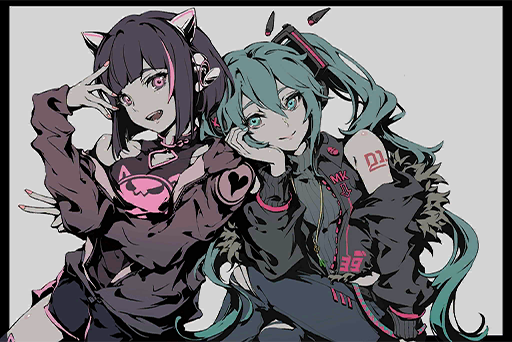
### Replies
**NnNn** 
MIKU is my waifu!! Everybody, show your love for her\~\~\~\~\~\~

**Curo** 
Although I don't know why another diva sudden popped out of nowhere 
But this... I can wholeheartedly support this\~\~\~\~\~

**SancTityKnight** 
The only diva in my heart is PAFF and it will stay that way!!! 
... 
... 
... 
... 
Shut up and take my money\~\~\~\~

**maplewing** 
I fell in love the first time I heard her music 
It has this magical power to lure you in!!!

**STANley** 
Woah is this the arrival of the diva era? Can she surpass PAFF??

**CHanatsuka** 
How exactly is NEKO doing this lololol 
What did she do to net her a collab with a Tier\-1 singer like MIKU\~?

**vveay** 
Saito Production and Monophonic Entertainment, which one is bigger??

**lrrllrrl** 
Saito pretty much dominates the market in Node03 
They just haven't officially released their stuff in Node08

**JAC-jack** 
MIKU! MIKU! MIKU!

**Noposa** 
Don't you weebs dare look down on our NEKO! 
She earned everything with her true skillz!!

**HandsomeYi** 
Wow a NEKO fan calling someone else a weeb... Look in the mirror first, will ya?? 
MIKU 4 life!!! I've already saved up the ticket money for the next LIVE!!!

**C.Y.** 
Stop putting out limited editions! RIP my wallet.

**Hulujam** 
The name "Saito Production" sound so... dangerous, for some reason\~\~\~ Like they'll get into a brawl with someone who bumped into them on the streets (I blame the stereotypes\~ XDDD

**SYY** 
Used to be a PAFF fan, but immediately change sides after hearing MIKU's songs (No regrets

[*(Click here to go back to the top)*](#toc)

## <a id="q1301"/>\[#113\] Rayark Wonderland @Tokyo
### Post
**Rayark_Official** 
Cytus II, DEEMO, Sdorica, amazing performance with all the classic songs! 
Cytus II JP Battle \- CHAOS \-, grand finals to determine who has the fastest fingers! 
Many u 
Event exclusive merchandise available on\-site only!

Are you lady? 
Tickets almost sold out. Countdown to the event starts soon!

[**Event Site**](https://wonderland2019.rayark.jp/)

[*(Click here to go back to the top)*](#toc)

## <a id="q1401"/>\[#114\] W\-T\-F!!!! What am I gonna do with this mountain\~\~\~\~
### Requirements
|    Char.    |Lv.|Lv. Locked?|
|-------------|:-:|:---------:|
|**ROBO_Head**|59 |    No     |

### Post
**JOEZ Cafe** 
I don't know who the hell it was that suggested I order some YAMAMETO fruit beer.  
I shipped in several boxes and ain't no one's ordering it!! 
Should've trust my instincts 
Tomato with hops!? The only palates that can handle that are sickos and smashed drunks\~\~\~

Now there's this giant mountain of YAMAMETO just sitting there behind the bar... 
All it takes it's a fatso to crash into them and we'll have ourselves a massive explosion\~

**\#HadYourYamametoToday** 
**\#BuyOneGetTenFreeMaybeTheyllSell**
### Replies
**Xzavis** 
Heard someone puked in the bathroom after drinkin 1  XDD

**foreheadless** 
I have no freakin idea how dafuq Yamoto Ongoro ever earned that "Master Brewer" title (???

**noneXenon** 
A drink that no one can handle, not even the King of Germs

**Whysosurprise** 
I think  
you should try buy 1 get 1 case free.  
That might, "might" just work

**Fu7ureW0rld** 
Hey, owner! Save one 4 me tonight. I wanna try it!

**SIhama** 
Dude, you want a death wish???

**Poopytrap** 
Donno if it's just me, but it works real well with chicken nuggets.  
It's like drinking liquid ketchup with your nuggets\~

**Gearz_Igo** 
Blahhhhhhhhhh  
Umm no thanks bro, that sounds f\*\*\*ing disgusting

**ArupakaKUN** 
Well, you ask for a fatso, now you have one. Bar crashing incoming\~\~

**RyanRii** 
Heard they're gonna try Durian flavored beer next. Craft beer? More like crap beer

**Pinevalley** 
Can't you ask for a refund...

[*(Click here to go back to the top)*](#toc)

## <a id="q1501"/>\[#115\] B... Birds?
### Requirements
|    Char.    |Lv.|Lv. Locked?|
|-------------|:-:|:---------:|
|**ROBO_Head**|61 |    No     |

### Post
**NotinClass** 
I just saw a group of things fly by the clock tower here at the Academy.  
Are they drones? I've never seen them flying in a massive group like that.
### Replies
**MustangMartin** 
Maybe they're doing test flights??

**lenba** 
Birds? Really? When's the last time you saw birds in 08??

**Chevalier151** 
Which way were they flying toward?

**Arya_Poke** 
Looked like they were going from Quadrant I to Quadrant III

**AbigaleJ** 
Definitely drones. I saw 'em too. But the group I saw was headed toward Quadrant II

**IronFan** 
Eh... Is it normal for drones to start crashing into buildings??????????

**Pixely99** 
Think I heard the sound of explosions@@??

**JAC-jack** 
The drones are out of control!!!!  
Stay as far away from them as possible!!!!!!!!!!!!!!

**LyLah1207** 
Get the f\*\*\* out of there! I heard they started attacking people!!!

[*(Click here to go back to the top)*](#toc)

## <a id="q1601"/>\[#116\] \[Breaking\] Drone attacks reported in Node 08
### Requirements
|    Char.    |Lv.|Lv. Locked?|
|-------------|:-:|:---------:|
|**ROBO_Head**|62 |    No     |

### Post
**Flower_Head** 
\[Breaking News\]\[Drones\]\[Attack\]\[Casualties\] 
> A few hours ago, there had been several eyewitness reports from Node 08 that reported abnormal flight patterns from drones. .Just now, we've also been gradually receiving news regarding the drones' attacks on the cities. Due to the extreme chaos at the site, the number of casualties and other details are still unknown. 
>  
> Based on the new embargo put in place by the Administration Bureau, to all citizens, please head to the designated safety shelters immediately. If the roads to such shelters have already been blocked, please remain indoors. Do not engage or attempt to fight against the drones. Node News Network will continue to broadcast this event by images, text, or audio.

\[Article excerpted from Node News Network\]
### Replies
**NoSignal** 
Does anyone now what's going on? 
I heard explosions and screamings.  
Should I call the agents? What should I do??????

**EvilForce** 
Get you a\*\* moving and go to the shelters ASAP!!!  It's all written up there!! Can you not read the alert?

**SuduMan** 
My brother's a Law Enforcement Agent. Does this mean he'll have to fight these drones?  
I'm so worried about him...

**kou** 
My mom just escaped from the chaos outside.  
She said the drones are crashing into pedestrians@@

**Blanky_Blank** 
if I need to protect myself, any idea what weapon will be effective??

**Silence_Bob** 
Dunno. I don't think they would allow that can hurt drones to be sold publically 
Maybe the agents' guns would work???

**T3RA_wr47h** 
Does the Bureau still have drones to deploy? Using drones to fight drones might just be the way to go@@!

**Popo** 
Has ARC's private security army been deployed yet?  
Aren't they the experts in dealing with these things?

**Neon_raven** 
One of them just crash landed into my building's courtyard...  
Luckily I live way up on a much higher floor. 
(ΩДΩ) So scared 0rz

**Prime6750911** 
Please be careful up there\~ Not the time to move around now...

**Talus_Alpha** 
Posting to report my safety. There didn't seem to be any incidents reported in my area... so far 
Must be because this place is so remote that not even the drones can locate it lol

**9tingale** 
Isnt reporting on this a bit dangerous? I'd much rather the reporters get the heck out of there than see them report on this...

**Poopytrap** 
My waifu NEKO... Is she okay????? I can give her my space here at the shelter!!!

**NekoSamurai** 
Idiot. She'll get killed on the way to your home. Don't be stupid

**Mick_Rorty** 
BTW, I just realize how ubiquitous drones are. They really are f\*\*\*\*\* everywhere! You never notice that until s\*\*\* like this happens

**Wickedragon** 
Come on it's just 1 or 2 broken drones. It's not like there's 30 of them so lets chillll

**vveay** 
Bro STFU!! Don't jinx it you moron! 
EVERYBODY, look out for your own safety!!!

**Pascal626** 
So scared QAQ. Gotta listen to PAFF's music to calm my nerves...

**DiiR** 
ConneR Sensei, please come and save us\~

**Dogleg** 
Folks, do not overreact to false information. The emergency news reports are just to prevent the situation from getting out of control. Nothing more.

[*(Click here to go back to the top)*](#toc)

## <a id="q1701"/>\[#117\] SOS!
### Requirements
|    Char.    |Lv.|Lv. Locked?|
|-------------|:-:|:---------:|
|**ROBO_Head**|63 |    No     |

### Post
**NnNn** 
I'm stuck in a mall now. Just now, there were drones attacking the doors. There were screams and chaos. Luckily, the courageous people who worked at the mall thought fast and managed to get the blast\-proof doors up in time, which stopped the drones from getting in. But now we can't get out either.  
Looks like more and more drones are gathering outside. What should we do??
### Replies
**DuskDawn** 
Hide!!!! Wish you the best of luck!!

**Doubty** 
Stay where you are! Don't leave! The admins are probably dealing with it now.

**PoolsKitten** 
Sounds like your basically in a shelter now.  
Good thing you're at a mall, so you won't run out of food...

**NathaN** 
Best weapon at a mall is definitely the frying pan...

**EEEEEVA** 
Quick! Go and occupy the chocolate area! Will definitely will help you stay alive!!!\~\~

**Chevalier151** 
I wonder if there are any idiots who decided to occupy the frozen food areas????

**lrrllrrl** 
Take an insect spray and spray into the flames of a lighter. Voila\~ your friendly neighborhood flamethrower.  
You can also do it was hairspray and stuff like that\~

**SYY** 
Put a towel in a bottle of vodka and light the towel on fire. You need AOE damage to be effective again hordes! 
FIRE IN THE HOLE!!!!!

**NoLifeGamer** 
All I see are two idiots who played way too many zombie games...

**Varinaya** 
You're made of flesh. Those drones are metal machines. OP, don't do anything stupid you hear me!!!!

[*(Click here to go back to the top)*](#toc)

## <a id="q1801"/>\[#118\] Lightspeed the Capybara
### Requirements
|    Char.    |Lv.|Lv. Locked?|
|-------------|:-:|:---------:|
|**ROBO_Head**|64 |    No     |

### Post
**Curo** 
Anyone see the latest trailer for Lightspeed the Capybara?? Whaddaya think? Leave your thoughts below\~

**\#LightspeedTheCapybara** 
**\#LiveAction**

### Replies
**CJW** 
I feel like they're going in the wrong direction...  
Why is he always in a hot spring balancing oranges on his head???  
Shouldn't he be running around and fighting bad guys??

**beeeeeeeeee** 
Probably because all his battles take place at light speed, so we can't see any of them ;\-)

**CHanatsuka** 
Dude, no one cares about the stoopid movie!!! The Attack of the Drones are ongoing right now\~\~\~\~\~

**KirinKiraKira** 
Send Lightspeed to take care of the drones\~\~

**HandsomeYi** 
Who thought of this crap  
If it's light speed how dafaq are we gonna watch?  
So the movie's gonna be 100% in slow motion??

**Hulujam** 
What kind of animal is Lightspeed? A giant rat or something?

**KiwaHu** 
Well, it's definitely NOT a giraffe that's 4 sure\~

**Duncan128** 
WTF ROFLLLL It's a capybara, obviously. It's in his goddamn name lolol

**FlyingCodo** 
Care more about the attacks you damn nerds!!!

**CyberLord** 
ARC will deal with this, right? They should know these drones better than anybody\~!

**Noposa** 
Are they putting this crap trailer as some kind of publicity stunt?? Wouldnt surprise me. "All publicity is good publicity" is very much a thing

**Rabbitdora** 
Have this many malfunctions ever happened simultaneously before????

[*(Click here to go back to the top)*](#toc)

## <a id="q1901"/>\[#119\] Who's behind this??
### Requirements
|    Char.    |Lv.|Lv. Locked?|
|-------------|:-:|:---------:|
|**ROBO_Head**|65 |    No     |

### Post
**Go55ip** 
Although instances of separate drone malfunctions did occur before this it's getting a little out of hand (Multiple drones malfunction all at once??)  
After all this, people are gonna get PTSD when they see a drone  Who do you think is the one pulling the strings behind the scenes? 
ARC? The Administration Bureau?? Xenon getting his revenge on society???
### Replies
**NerfThat** 
As for 08, this is indeed not the first time. It's practically part of daily already (?

**RamenBot** 
And the relief pitcher of the year goes to... Xenon!

**SuperKY** 
Real Culprit: Oh no. Something's gone wrong. Quick, blame it on Xenon\~

**Arya_Poke** 
For real, I think ARC wants to use this opportunity to take back the control of all drones that previously belonged to the admins

**fotoistruth** 
I'm thinking the exact opposite. I think the admins don't want ARC to have too much power. Therefore, they're making people cautious regarding technology. This way, folks won't rely on ARC tech and products too much

**TunaLee** 
Hey dumba\*\* 
If the admins did that 
They're the ones that are gonna have to clean up the aftermath, not ARC 
Plus, how would they know that public opinion will be on their side once everything goes to s\*\*\*?

**GymGai** 
Imo I think us Mono. They want to get out of the entertainment industry and join the military industry XD

**4nonymous** 
Annnnndddd the s\*\*\*posting begins again 
Didn't even make it past the 10th comment this time

**UltraKY** 
TBH, I might freak out a little when I see a drone on the streets after all this, even if it's just the trash\-collecting type...

**888fans** 
If a hacker is really this good and can hack this many drones at once, there's no way ARC wouldn't know about this person, right?

**T.Goldwell** 
If we're to talk about hackers, I have a feeling that Xenon will be brought up again        \~OwO\~

**Sopheee** 
PAFF just got back and now this happens!  
I hope she's alright\~

**PrideCr0w** 
You should be worrying about yourself first!!!

[*(Click here to go back to the top)*](#toc)

## <a id="q2001"/>\[#120\] PAFF is home now. Reporting her safety and an apology
### Requirements
| Char.  |Lv.|Lv. Locked?|
|--------|:-:|:---------:|
|**PAFF**|72 |    No     |

### Post
**Helena** 
Hello everybody, this is Paff's older sister Helena White

First, I'd like to thank all of you for your support and encouragement you've given since PAFF went missing. If it weren't for all your passion and consolation, I don't know if I'd still be here today. Also, I'd like to especially thank anyone who has provided tips and assistance in finding PAFF.

PAFF has contacted us in the past few days and we now know that she is both safe and has trustworthy friends by her side. Since a lot of complicated things have happened, it's not possible to explain them all here, so I am very sorry about that. I feel like she needs some time to collect herself too. Therefore, I  just want to inform everybody that there is no longer any need to search for PAFF, so please refrain from asking for her exact whereabouts. Whether or not she will return to the stage as an idol singer is entirely up to her. If she ever makes a decision, we will announce it.

Thank you, everyone, for being with us all this time. The pain that has been felt cannot be forgotten, but everything we have now means the world to us. Thank you.

The video message above is a message to all of you recorded by PAFF herself. Hope everyone can feel at ease now.

Helena White

### Replies
**iluvpuf** 
Big sis, don't you worry! 
We're in this together\~\~\~\~\~

**Muahaha** 
Why does the video look fake? Is it really her?

**Heart_Head** 
When the witness rumors began to circulate, I was wondering when are they going to make the announcement

**m00nl16h7** 
Is one of the trustworthy friends NEKO LOL

**Ararar** 
Quick! Figure out where she is from the background! Doesnt look like 08

**TunaLee** 
Dude, how retarded do you have to be? What word in "refrain from asking" do you not understand??

**Delora** 
PAFF, take a good rest

**LyLah1207** 
Sis Helena, it must be hard for you these days

**koolboss01** 
Awkward... Mono terminated the contract already...

**Varinaya** 
I'll bet PAFF's albums are gonna be worth a fortune nowwww!!!!

**Pascal626** 
I wanna say that I found out that after the Xenon news broke out,  
no one even bothered to talk about PAFF anymore

**LyLah1207** 
Artists don't care about being insulted. They're more scared of not being discussed QAQ

**Michiko** 
Sis Helena, if you need anything just let us know

**SancTityKnight** 
At least nothing happened to her. That alone is great news\~ 
PAFF, we'll support you foreverrrrrr

**Sayomi911** 
Love you two (hugs)

**Smurky** 
I think the fans' wallets are hurting the most ROFL

**Chevalier151** 
Bet Mono is crying their hearts out right now for cutting ties so early  \*grin\*

**Sayomi911** 
The Cream Puffs voices have been heard by the heavens\~\~\~\~\~\~

**Shahari** 
PAFF and Helena, keep at it. I'm sure everything will be alright  :))))

**KirinKiraKira** 
Is trustworthy really the right word to describe NEKO  ; ) 
That soooooo doesn't fit her lol

**EndlessSummer** 
As long as PAFF is alright... 
Remember to tell us when you'll be back to singing!!!

**Capo** 
Be with you always :D

**MustangMartin** 
Will Mono get another chance to sign PAFF?

**RealityRules** 
If there's money to earn 
nothing's impossible 
that's just the reality of this world (smokes

**ShawnDawn** 
Please ROBO, next time you're hosting a Live, invite PAFF, okayyyy??

**RoboFan** 
My friend said Robohead hasn't made a peep in quite some time either...?

**Catsby** 
Its so great to hear that she's fine after all this

[*(Click here to go back to the top)*](#toc)

## <a id="q2101"/>\[#121\] Uh... umm... so, where should I go and hide?
### Requirements
| Char.  |Lv.|Lv. Locked?|
|--------|:-:|:---------:|
|**PAFF**|72 |    No     |

### Post
**KingOtaku** 
After all the drone attacks, there's no way I can live in the same city as those heartless machines anymore. 
Gods of IM, please recommend a place where I don't have to ever look at a drone again. I'm so ready to move. 
Besides, I've been single ever since I left the fetus (Entering year 35 now), so it doesn't really matter.

**\#NotUsingThisToFindGirlfriend**
### Replies
**KirinKiraKira** 
You can just stay at home and never go outside\~\~\~

**HandsomeYi** 
No way honey, food and package deliveries are mostly done by drones too lmfao

**Ewx_Data** 
Maybe head to Node13? Heard that the technology there is not very advanced

**KingOtaku** 
More info please? On 13

**Varinaya** 
A serious accident happened in 13 in the past, so there was this huge anti\-technology movement 
When ARC first tried to set up a location there, there was even a major riot

**NoLifeGamer** 
I think running to 13 just to avoid the drones is a little extreme  ;P 
The electrical system there is so basic 
and the internet isn't available everywhere 
you're gonna get bored to death

**KingOtaku** 
!!!??? No internet. Sorry then. Can't do it.  
How am I gonna watch all the "useful" stuff over there if there's no internet?

**RaiKiyumi** 
Will you really be okay going there XDDD

**DMO** 
I think the OP has already given up on that idea

[*(Click here to go back to the top)*](#toc)

## <a id="q2201"/>\[#122\] Does any\~ one\~ know where NEKO is at now??\~\~
### Requirements
|   Char.    |Lv.|Lv. Locked?|
|------------|:-:|:---------:|
|**NEKO#ΦωΦ**|66 |    No     |

### Post
**NEKO#ΦωΦ** 
Heyyyyy\~\~\~NEKO here yaaaa\~\~\~\~ 
Been soooo long since I last streamed (\*Φ▽Φ)ﾉ Next stream coming in three minutess!!!! 
If the viewer count is under 5 thousand I'm deleting my account\~
### Replies
**NEKOSAIKOU** 
AHHHHHHHH!!!!! FIRSTTTTTTT!!

**9me** 
Is that old "I'm gonna delete my account" meme really gonna work\~\~\~ lul

**DogBark** 
WAHHH its been soooo long!!! \*Smells the air\*  I think I can smell NEKO's scent\~\~  
\[User is now banned.\]

**NekoSamurai** 
Yep. Been a long time since you last dropped the ban hammer too :P

**NEKO#ΦωΦ** 
Hey heyyyy\~ Can everybody see clearly???? 
Y'all, there's no way I'd delete my account, come on (Φ∀Φ)ｱﾊﾊ 
the owner of iM would be begging me to not delete it kay\~\~ 
Can everyone tell where I am right now?? wwwwww

**UltraKY** 
Feels like somewhere in the countryside?

**TobeTobe** 
Causally mentioning the iM owner... Queen of streams indeed!!!!

**KamiCherry** 
OMG that looks like it's near my house!!!!!!! I'm busting innnnn!!!

**Uxi** 
I think it's not 08??

**C_H_U** 
NEKO, my waifu\~ I love youuuuuuuuu \*head explodes\*

**Delora** 
U datin with PAFF now\~\~\~  
**\#YuriIsLoveYuriIsLife**

**NEKO#ΦωΦ** 
And the answer is\~\~\~ding ding dingヽ（Φ∀Φ）ノ 
This is my old home back at 03\~\~\~\~ 
Is it because I'm so damn fashionable and advanced that you all thought I was born in Node 08??

**w_Rosabel_w** 
Uhhhh u sure you want to say this on a live stream? Though I don't mind since I'm a fan XDDDD

**RyanRii** 
NEKO's usual wacky hijinks ensue\~\~\~

**Heart_Head** 
03 really is nowhere near as advanced as 08  
That's no secret XDD 
Just the fact that there's no giant ARC UFO floating over there makes it a very different place

**JaneHikaru** 
Nahhh, NEKO sometimes uses terms that are from 03... and She's got a slight 03 accent

**NEKOSAIKOU** 
Whatever NEKO, doesn't matter where you're from I'll love you anywayz!!!

**Saitoyota** 
So there's a chance that we went to the same high school!!!!

**Smurky** 
NEKO, you gonna put out a song today \*gets smacked\*

**NEKO#ΦωΦ** 
I came back with some friends\~ 
Gonna go grab a bite to eat in a bit\~\~\~\~ 
The night market around my home is fire!!!

**Pixely99** 
So who'd you go back to 03 with, NEKO??? 
Hope it wasnt nekosaikou LMFAO

**NEKOSAIKOU** 
I wish! I sure as s\*\*\* wish that I was the one 
Too bad it's a damn pipe dream QQQQ

**PoolsKitten** 
There's no way that it's PAFF... is it?

**FCodex** 
Hmm, it's very likely. Besides, didn't PAFF have Sis Helena post a message for her? Maybe she's taking a vacation with NEKO in 03 now!?

**NEKOSAIKOU** 
Shhhhhhhh, don't ask if you can't handle the truth.

**foreheadless** 
With NEKO's personality 
if PAFF really is there, do you really think she's gonna keep her off screen? XD

**Yamatsuki** 
YUMMY!!! NEKO, tell me where you're eating at Pls!!!

**Shibawu** 
Don't harass her, okay?? 
You folks are so annoying\~\~\~ 
. 
. 
. 
. 
Can you help me get her autograph? I'll pay good monay for it!

[*(Click here to go back to the top)*](#toc)

## <a id="q2301"/>\[#123\] Anybody know what the final passcode for See2 is?
### Requirements
|   Char.    |Lv.|Lv. Locked?|
|------------|:-:|:---------:|
|**NEKO#ΦωΦ**|66 |    No     |

### Post
**Hulujam** 
Lately, a friend sucked me into 
buying the game See2: US 
After beating it all, this screen popped up and asked for a password to unlock extra content 
Does someone know the password? 
or did I miss something??
### Replies
**MYMYM** 
WHAT!!!?? I didn't even get that final password screen!!!! WTF???

**C.Y.** 
It's not that hard actually. Think back for a sec and you'll get it tbh

**Hulujam** 
UHHHHHH still don't know 0rz

**CHanatsuka** 
After entering the password, what happened next made me cry like a baby 
Like, who's cutting these goddamn onions QQ

**STANley** 
For me, not experiencing this hidden content is like not even playing the game at all

**Hulujam** 
Help me, please\~\~

**lrrllrrl** 
It's mentioned in the earlier storylines 
You should look for it yourself\~\~\~

**DewittSteiger** 
Why are you people giving him such a hard time?? 
Is this what IM is like now? 
It's obvious he's asking for an answer. Is it really that hard to give a proper reply? 
Or maybe everyone is just pretending to know when they really don't? 
Is this really necessary? Are you all stupid?

**JessiaAvison** 
Dude, you're the one who's stupid here. Some (or I should say most) people prefer not to spoil a game in a comment section. 
Calling people out doesn't make you better; it just makes you look like a hypocritical fool who doesn't know what he's bumbling about.

**beeeeeeeeee** 
Come on let's not argue over See2.  
Isn't everyone talking here bc we all really like this game?

**Noposa** 
Nah Im here for the drama. I prefer Dii2

**HolyEarth** 
I'm just passing by.  Grinding the current Stewrica event now

**beeeeeeeeee** 
......

**Hulujam** 
Pls everyone settle down no need to start a fight here QAQ I found the password

**Curo** 
How do you guys pronounce See2: US? Is it "Seetus" or "SeetwoUS"?

**KiwaHu** 
I pronounce it "See2: US".

[*(Click here to go back to the top)*](#toc)

## <a id="q2401"/>\[#124\] \[Repost\] Administration Bureau holds press conference in response to recent drone incidents
### Requirements
|    Char.    |Lv.|Lv. Locked?|
|-------------|:-:|:---------:|
|**ROBO_Head**|66 |    No     |

### Post
**Andy_Roid** 
\[News\]\[Drones\]\[Attack\]\[Administration Bureau\] 
> An Administration Bureau spokesperson stated: "Concerning the recent sporadic incidents of drones injuring people on accident, our early analysis has labeled this as a system error within the automatic control center. This error caused the system to mistakenly sent unrelated commands to the drones which caused them to malfunction and act abnormally. We've already activated the security protocol. This will increase the patrol frequency of armed Law Enforcement Agents, as well as improve the anti\-drone capabilities of Enforcer Drones." 
>  
> At the same time, A.R.C's Recreated Technology Department also stated that they will be assisting in the investigation to determine if there exist other safety concerns that have been overlooked. However, regarding the drones in use right now, they reaffirmed that there is no need for the public to be worried...

\[Article excerpted from Node News Network\]
### Replies
**EvilForce** 
I'm pretty sure all the, you know, DEATHS have made everyone uneasy

**NerfThat** 
Okay maybe if you look at the total number of drones, this ratio of malfunction is indeed extremely low??

**Brightswirls** 
I tell you what. Those people who were there at the accident site that day will definitely not think like that...

**Ewx_Data** 
Aren't these things supposed to have ZERO malfunctions???????? 
Like people are actually DYING because of this!!!!

**fotoistruth** 
Is anyone as worried as I am?  
What if the Enforcer Drones go berserk as well? Isn't that gonna be way worse with all that "improvement" they made?

**Amberclove** 
I also think that improving the firepower for Enforcer drones is dumb and really terrifying

**888fans** 
I bet you 5 bucks what they thought was: As long as the Enforcer Drones don't malfunction, everything is a\-okay\~\~\~\~

**CozyCaty** 
Speaking of ARC, they sure have been f\*\*\*ing up a lot lately...

**Bolt_Urx** 
When nothing happens, people don't usually think about ARC. 
But then you realize that almost all technology you see in your daily life is under their control lol

**RaiKiyumi** 
The Law Enforcement Agents really got it tough 0rz. No wonder my dad doesn't want me to take the exam

[*(Click here to go back to the top)*](#toc)

## <a id="q2501"/>\[#125\] \[Repost\] Large\-scale drone attacks occurred in Node 08, Quadrant II
### Requirements
|    Char.    |Lv.|Lv. Locked?|
|-------------|:-:|:---------:|
|**ROBO_Head**|66 |    No     |

### Post
**Flower_Head** 
\[Breaking News\]\[Drones\]\[Attack\]\[Shelter\] 
> In Quadrant II of Node 08, at least 10 suicide drone attacks have occurred in areas that are densely populated. The detailed number of casualties is not clear, though the firefighters who responded to the site first have stated that the situation does not look optimistic. 
>  
> At around 3 P.M., the first wave of attacks struck a Law Enforcement patrol post in the outskirts of Quadrant II. Multiple citizens and Law Enforcement Agents suffered minor and critical injuries. Of the critically injured, three already showed no signs of life by the time medical personnel arrived at the site. A witness of the attack told this NNN reporter, that after the first wave of attacks, the remaining drones continued to head toward the business district, most likely preparing for the next attack. 
>  
> Since these incidents showed clear signs of a terrorist attack, the Administration Bureau has issued an order for first\-priority precautionary measures to be taken. All Law Enforcement Agents will be deployed to conduct the investigation. In addition, the flying permits for all drones that are on standby have been revoked. However, drones that are currently conducting missions or offline are still out of their control. If the situation calls for it, these drones will be destroyed or brought down by force. 
>  
> Based on the news embargo put in place by the Administration Bureau, to all citizens, please head to the designated safety shelters immediately. If the roads to such shelters have already been blocked, please remain indoors. Do not engage or attempt to fight against the drones. Node News Network will continue to broadcast this event by images, text, or audio.

\[Article excerpted from Node News Network\]
### Replies
**Mick_Rorty** 
\#@%&! Looks like something is seriously wrong this time

**Wickedragon** 
Didn't they just tell everybody not to worry about this...

**vveay** 
Everybody listen up 
The attacks are still ongoing 
It's different than the sporadic ones we previously saw

**T3RA_wr47h** 
Looks like an emergency evacuation has already been carried out in the business district.  
But with that many people there is no way they can evacuate everyone in such a short period of time

**SYY** 
I'd advise evybody to stop posting and go to a shelter first

**Talus_Alpha** 
I'm already at a shelter \*raises hand\*   
Signals are a little weak...

**T.Goldwell** 
Who the hell is controlling these drones??

**Prime6750911** 
I heard over 20 people have died already...

**Wickedragon** 
This is a real terrorist attack... RUUNNNN\~!

**kou** 
Stop commenting!!! Anyone still outside, get to a shelter ASAP!!!

**Blanky_Blank** 
OMGGGG I've seen so many places up in flames

**Silence_Bob** 
Everybody, please take care

**SuduMan** 
Is it normal for the sounds of explosions to sound like an earthquake...?

[*(Click here to go back to the top)*](#toc)

## <a id="q2601"/>\[#126\] \[Repost\] Node 08 Quadrant II suffered devastating drone attack
### Requirements
|    Char.    |Lv.|Lv. Locked?|
|-------------|:-:|:---------:|
|**ROBO_Head**|67 |    No     |

### Post
**Flower_Head** 
\[News\]\[Drones\]\[Attack\]\[Quadrant II\] 
> Node 08 Quadrant II's business district suffered a severe drone attack incident. Rumors have come out stating that the attack has left at least 30 dead and over 200 civilians injured. As of now, the Administration Bureau has sealed off all traffic routes entering and exiting that area. Anyone who passes through the area, including pedestrians traveling on foot, must undergo examinations before they can proceed ahead.  
>  
> Node 08's business district is a hub area that has always been the most bustling place in 08. Notable landmarks such as Monophonic Entertainment HQ, Central Music Hall, and the Live House District were all affected by the attack to varying degrees. Fortunately, when the attack occurred, most stores had yet to start their business for the day. However, some stores were not as fortunate. For example, the Old Town area, home to the Jazz Bar "JOEZ Cafe" and the renowned Department Store "The Fountains", was pretty much reduced to rubble. The dining street, which houses famous restaurants like "Pizzattic" and "Singularity", also didn't survive the attack and was destroyed almost entirely. 
>  
> According to the Administration Bureau, in contrast with the previous sporadic drone malfunctions, this incident was very clearly a targeted attack. There were even instances where large drones crashed into buildings while carrying energy cells or fuel. These cases of suicide attacks have resulted in at least a dozen high\-rise buildings suffering structural damage. Official sources have yet to confirm whether this attack was caused by terrorists or not. 

\[Article excerpted from Node News Network\]
### Replies
**Chevalier151** 
Reduced to rubble... Yikes...

**NathaN** 
RIP...

**PoolsKitten** 
Thank goodness it's not a weekend, or else I just might've been shopping there...

**DuskDawn** 
If the admins still can't find the culprit after all this, something is seriously wrong with them

**SeventH HeaveN** 
My company building is now tilted at a nasty angle 
Good thing I decided not to take the elevator when I ran out

**Varinaya** 
No matter who's behind this, if this isn't a declaration of war I don't know what is

**NoLifeGamer** 
Admins what the f\*\*\*!! Didn't you just hold a press conference telling everyone NOT to worry? Do you need another 30 people dead for you to do SOMETHING?? 
Isn't it about time we see some heads roll????

**Talus_Alpha** 
May all who passed away rest in peace. None of them deserve this...

**decim** 
F\*\*\* the terrorists they should all rot in hell

**AbigaleJ** 
I visit the Old Town area and the dining street practically every week...

**Pinevalley** 
Oh god, don't tell me that King of Germs owner was caught in all this...

**Noposa** 
Anyone got in contact with JOE yet??

**StuffyMouth** 
Wait, so does this mean that Pizzattic's secret recipes are all lost in the carnage??  
NOOOOOO QAQ

**noneXenon** 
If he was following his usual schedule, JOE's likely in his store that time preparing to open business for the day...

**MustangMartin** 
Hope everyone is safe...

**XXXenon** 
RIP JOE

**D33M0** 
Thank you to King of Germs for bringing us so many great memories 
A final toast for the owner!

[*(Click here to go back to the top)*](#toc)

## <a id="q2701"/>\[#127\] HEY Y'all! I'm still alive!
### Requirements
|    Char.    |Lv.|Lv. Locked?|
|-------------|:-:|:---------:|
|**ROBO_Head**|67 |    No     |

### Post
**JOEZ Cafe** 
Ummm, h\-hey guys\~\~ I'm still alive haha\~\~ 
Sorry, it seems like I freaked everyone out 
When my store got blown up, I just so happened to be crushed underneath all those cases of Yamameto 
Those nasty drinks ended up absorbing most of the impact for me, which kept lil' ol' me alive (Turns out I did the right thing ordering so much of that damn stuff!?)

The Yamameto explosion caused me to look as if I was covered in flesh and blood 
Maybe that's why I wasn't discovered by other drones? (Scratches head)

All in all 
Although there is still tons of stuff I need to sort out 
(Things that were reduced to ash not included, so it might be a lot easier than I thought) 
This post is more or less to report my safety to everyone 
Hope that other injured folks can hang in there and make it as well 
JOE out (Mic drop)
### Replies
**Pinevalley** 
OMG the owner is safe QAQ

**Ulxy_34RTH** 
F\*\*\* dude don't scare us like that 
You took your sweet time and got us all worried sick!!!!

**KoraKora** 
Praise the Yamameto\~\~\~\~

**FreeFinder** 
Owner, to commemorate this occasion, can I... 
order a case?

**JOEZ Cafe** 
Order my a\*\*\* they all got smashed during the attack you moron 
You should contact the Yamato Brewery directly LOLOL

**TobeTobe** 
Got a timetable for when you'll resume business?

**KamiCherry** 
Dafaq his shop got trashed 
You're asking him to offer bar services on all that rubble?

**Uxi** 
Hey why not? Won't be the most insane thing he has done

**Arcade1012** 
One does not simply kill the King of Germs lulul 
He is the KING of all germs after all\~

**Zeviart09** 
Owner, if you ever plan to reopen don't forget to tell us\~ I'm going to go drink there at least three times every week QAQ

**JaneHikaru** 
The Return of The King of Germs

**RyanRii** 
So... does this mean that the billiards table's high scores are wiped out???

**NnNn** 
Hey don't play with your food XDDD (Does Yamameto count as food though?) 
I can already see the dank memes coming out of this

[*(Click here to go back to the top)*](#toc)

## <a id="q2801"/>\[#128\] How to counter drones 101
### Requirements
| Char.  |Lv.|Lv. Locked?|
|--------|:-:|:---------:|
|**PAFF**|73 |    No     |

### Post
**KiwaHu** 

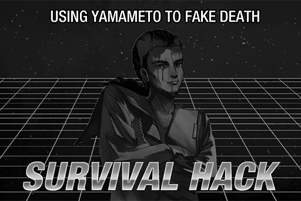
### Replies
**Shibawu** 
That seems... kinda gross...

**Chocolate Ice Cream** 
Between getting rekted by drones and getting covered in tomato beer... 
I choose death 0rz

**TunaLee** 
Between getting rekted by drones and getting covered in tomato beer... 
I choose to cover myself with cucumber slices 
Even though I might die from the poison XD

**FlyingCodo** 
Sir, that brewery just recently released a cucumber\-flavored beer ouo 
Shouldn't you taste test it to show you love for cucumbers LOL 
Or do you need me to grind it into a puree before pouring it all over you??

**Pixely99** 
Make Yamato Brewery Great Again!! lololol

**RyanRii** 
Gotta go place my order for a case then

**Duncan128** 
So there a military camouflage company disguising as a brewery????

**Bit_Inex** 
JOE is trying really hard to evolve from King of Germs to King of Memes XDDD

**ALFORT** 
Just got off a call with the Yamato Brewery they said that their entire stock has been sold out XDDDD

**Poopytrap** 
Step 1: Make gross tomato beer that looks like blood 
Step 2: Explode it over some bar owner's face 
Step 3: Profit

**Gearz_Igo** 
Nope, NOPE. Can't do it

**ArupakaKUN** 
Not gonna lie, it really does make you look like you're dead lul

**FelyneKun** 
How to deal with drones: Carry a bottle of Yamameto with you at all times

**moonin** 
Did JOE see this post LMFAO 
Somebody should tag him

[*(Click here to go back to the top)*](#toc)

## <a id="q2901"/>\[#129\] Let's test and see how everyone reacts when they see a drone now lolololol
### Requirements
|   Char.    |Lv.|Lv. Locked?|
|------------|:-:|:---------:|
|**NEKO#ΦωΦ**|67 |    No     |

### Post
**UltraKY** 

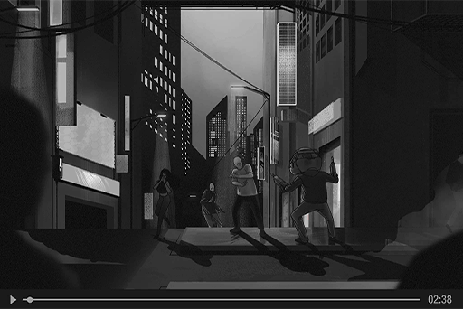
### Replies
**UltraKY** 
Better look out when you see drones on the streets these days ^w^\~

**11IIll11** 
Dude are u sure it's ok to post this kind of stuff now LOL

**NEKOLUV** 
What kind of sick f\*\*\* finds this funny???

**loveIris** 
You, yes, guy who posted this 
I dare you to do this to me on the streets 
Come on, I DARE YOU

**CJW** 
Reported. This is disgusting

**AntiMetal** 
Welcome aboard the train that will take you straight to hell

**kou** 
The ones that got "pranked" in the video happen to be my family 
My older brother is a victim of the recent drone attacks and is currently still recovering in the ICU 
And you just made their psychological trauma more severe. Happy now?

**Math_Head** 
Bro you're exaggerating, it's just a prank\~\~ 
Trauma can't get worse from just a prank LOL

**TunaLee** 
Then how about I give your face some physical trauma and call it a prank? 
"It's just a prank" is not a Get Out of Jail Free card for stupidity

**Curo** 
Holy s\*\*\* I can't imagine how twisted your mind would have to be to come up with such a disgusting prank. Reported

**T.Goldwell** 
WTF you think this is amusing? WTH were you thinking??

**maplewing** 
Somebody help me dox this mothaf\*\*\*er 
My fist wants to say hi to his face

**Wickedragon** 
God, this is horrible. I can barely even watch 10 seconds of this...

**KiwaHu** 
You took the joke too far you f\*\*\*\*\* idiot

**JAC-jack** 
What if someone got hurt trying to run away from your "prank"? Is that still funny to you?

**Rabbitdora** 
This is a serious issue not something you should be joking around with. 
We don't need fake drones scaring us when real drones are plenty scary enough

**Hulujam** 
I don't think your 15 minutes of fame should come at the cost of other people's safety

**STANley** 
Please, tell me; how in the literal f\*\*\* do you consider this "funny"??

**C.Y.** 
I hope natural selection disqualifies you from the ranks of human

[*(Click here to go back to the top)*](#toc)

## <a id="q3001"/>\[#130\] Did a quick scan of the more well\-known services on cyTus these days
### Requirements
|     Char.      |Lv.|Lv. Locked?|
|----------------|:-:|:---------:|
|**PAFF**        |74 |    Yes    |
|**NEKO#ΦωΦ**    |68 |    Yes    |
|**ROBO_Head**   |68 |    Yes    |
|**Crystal PuNK**|24 |    Yes    |

### Post
**Henry** 
1. The new personal information trojan horse virus' affected range includes all connection devices before V11 (In theory, because I don't have devices before V5 with me. However, nobody should be using those XD)

2. The more they fix iM, the crappier it gets. However, the development team has announced the update plans for next season. Can look forward to it.

3. A random hacker group has stated that several major producers of connection devices and equipment have been infiltrated by scammers. In the future, there's a possibility that brand\-new connection devices will have virus programs built into them.

4. Some forum blocks have claimed that Mono's music platform has already been cracked; still unproven. There is a chance that this is true, but Mono has ways to stop this. For example, once they detect a user of the cracked version, they can immediately lock on to the user and inform the admins of their position. This action is totally legal in the current regulations of the Administration Bureau. Thus, I still advise everyone to not attempt this kind of stuff.

5. Perhaps not too many people have taken notice of this, but the cyTus main system hasn't been updated for quite a while now (People don't normally read this it's just my personal interest lololol). The internal version has been stuck at V24, which is rather confusing. A while ago, a list of updates for V25 were leaked by an insider. I was a little bit excited about it. Despite that, there hasn't been any action for such a long time. Anybody knows what's going on???
### Replies
**RivaC** 
Bro Henry is indeed the GTM! This kinda report of his is always satisfying. XD

**Hulujam** 
What's GTM meaning??

**RitaC** 
GTM, the Golden Tool Man www

**T3RA_wr47h** 
It really has been a long wait for V25 
What's with the complete dead silence

**STANley** 
Not to mention the updates from V20 to V24 were super fast.

**SYY** 
Maybe ARC's development have encountered problems? 
And btw the update has been fast just for that time period XD Before it was also slow, SUPER slow.

**Cybel_Mach** 
It seems every time a product is previewed by Master Henry, it ends up a mess. \#HenryNooo

**Andy_Roid** 
The connection device with a built\-in Trojan virus sounds really god awful

**Talus_Alpha** 
True. Who would check the system versions of cyTus as a hobby? XDDDDD

**Ayx_Socket** 
I don't think we can expect iM to get any better anytime soon lul

[*(Click here to go back to the top)*](#toc)

## <a id="q3101"/>\[#131\] Something we must tell everyone
### Requirements
| Char.  |Lv.|Lv. Locked?|
|--------|:-:|:---------:|
|**PAFF**|74 |    No     |

### Post
**CherryPuNK** 
This is a sad news, but we have to let everybody know. Last week, our band's lead vocalist Cherry, real name Sherry Pauline, has left us due to an accident.

We're still in shock and disbelief regarding this sudden tragedy. She is so considerate, so kind, and so talented. Our thoughts and prayers are with her family and friends, as well as all of you who loved her.

Cherry PuNK the band was born because of Cherry. She's the one who gathered us to realize our dreams of playing music together. We three have decided to suspend any band activities indefinitely. We would like everybody to give us some time to heal and collect ourselves.

Last but not least, 
For Cherry

You will always be in our hearts

Cherry PuNK 
LUMY 
Frank 
Dannis

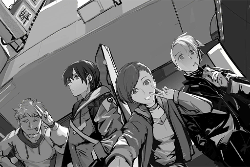
### Replies
**vikisser** 
?????

**KoraKora** 
What happened???

**ZigZag** 
What happened to Cherry??  Left?

**AvaJaKeLon** 
Whaaaa????!!!!!!

**DustyAsh** 
Although I am not a big fan, please accept my sincere condolences.

**MirriLL** 
Oh, my...

**iWanttobelieve** 
Please tell me this isn't true.....

**Cherry0987** 
Can't believe she's really gone, I was just listening to your musicQ\_Q

**aasdd** 
What really happened to Cherry? It happened so suddenly@@

**Redshirt** 
Is this some kind of out\-of\-season April Fools' joke or something?

**Gearz_Igo** 
Nobody would joke about their lead vocalist's death. 
If it really is a joke, I say it's way too much...

**KiwaHu** 
I've already lost the meaning of life..

**RockLover** 
Everything was fine until it wasn't

**PoolsKitten** 
！？

**Varinaya** 
WTF?

**Shibawu** 
The news has been confirmed... I think it's true...alas :(

**LoriyaCamper** 
**\#RIPCherry**

**Cherryxpaff** 
There is no hope left 
**\#RIPCherry**

**moonin** 
Really hoped it was fake... **\#RIPCherry**

**FreeFinder** 
**\#RIPCherry** Farewell

**Ch0968** 
**\#RIPCherry**

**IronFan** 
**\#RIPCherry \#RIPCherry \#RIPCherry **

**Sayomi911** 
If it was possible, I would have never wanted to see this hashtag...  
**\#RIPCherry**

**Smurky** 
Everthing is temporary...  
I thought I could watch Cherry become even more popular for decades to come QAQ  
**\#RIPCherry**.

**Grimwood** 
**\#RIPCherry**

[*(Click here to go back to the top)*](#toc)

## <a id="q3201"/>\[#132\] Thousands of fans gathered on iM to mourn the passing of Cherry PuNK vocalist Sherry Pauline
### Requirements
|   Char.    |Lv.|Lv. Locked?|
|------------|:-:|:---------:|
|**NEKO#ΦωΦ**|68 |    No     |

### Post
**Flower_Head** 
\[News\]\[Cherry PuNK\]\[Sherry Pauline\]\[Obituary\] 
> Cherry (real name Sherry Pauline), the lead vocalist of popular band Cherry PuNK,  has passed away. The news has fans and the public in utter shock. Cherry's agency, Monophonic Entertainment, has confirmed this information earlier today. However, they remained silent regarding the cause of her death and other details. They only stated that they hope everyone can give the other band members and Cherry's family and friends some time to process this tragedy. 
>  
> On iM, thousands of posts were made to mourn her passing. Due to the very sudden nature of the incident, many fans stated that it's "Hard to accept.", "Really hope it's only a bad April Fools' joke." "Life comes at you fast." Multiple members of the entertainment industry also expressed their grief. Liam Gish, the head of Node 08's department of culture, stated, "My deepest condolences to her family and friends. The entertainment industry just lost a brilliant rising star. The things she put into her music and lyrics are not only the values and emotions of a young girl but also a microcosm of her attitude towards life." 
>  
> We would like to express our gratitude for everything Cherry gave us. May she rest in peace. 

\[Article excerpted from Node News Network\]

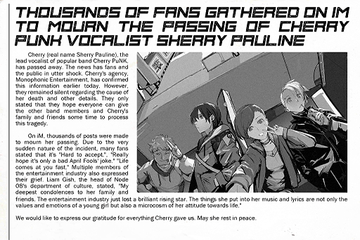
### Replies
**Pumpkinforest** 
My heart is broken.

**Bit_Inex** 
Just overwhelmed with the loss.

**TreeNoAlice** 
PAFF missing last time was already terrifying enough. 
Devastating news for all who love Cherry and her music.

**CrystalP** 
**\#RIPCherry** Love you forever

**Crys_Forever** 
Unacceptable. Reality is so cruel.

**RockLover** 
My heart goes out to other team members at this sad time. It's definitely a hard time for them.

**CyberLord** 
Why didn't the hero Xenon come to save the beauty Cherry this time QAQ

**noneXenon** 
If Cherry had Xenon's protection, then this tragedy wouldn't happen, right?

**LyLah1207** 
Life is so unpredictable. You never know what's gonna happen.

**Dogleg** 
Rest in peace, Sherry Pauline.

**CherryMyLife** 
I wish time stopped at the last concert forever. 
**\#RIPCherry**

**Brightswirls** 
**\#RIPCherry**

**ElinaDaniel** 
Don't know if the missing Xenon knows about this.....

[*(Click here to go back to the top)*](#toc)

## <a id="q3301"/>\[#133\] I'm sorry, I can't...
### Requirements
|    Char.    |Lv.|Lv. Locked?|
|-------------|:-:|:---------:|
|**ROBO_Head**|68 |    No     |

### Post
**maplewing** 
To be honest, I'm still in disbelief... 
Why did a such a healthy person just... 
I even watched her perform live not too long ago 
And now all of a sudden, she's gone...
### Replies
**beeeeeeeeee** 
I am still deeply hit and shocked by the sad news...

**lrrllrrl** 
**\#RIPCherry** Cherry I really loved your voice with all my heart.

**C.Y.** 
Nothing is permanent in life.

**Rabbitdora** 
I'm afraid to listen to Cherry PuNK's music now, That makes me even sadder...

**Kemcoter** 
Cherry is such a total mystery, from the beginning to the end

**RamenBot** 
Farewell to the girl with the graceful voice

**lenba** 
I am Cherry's fan from her time at Crystal. I've felt empty ever since I heard the news...

[*(Click here to go back to the top)*](#toc)

## <a id="q3401"/>\[#134\] I have lots of questions...
### Requirements
|   Char.    |Lv.|Lv. Locked?|
|------------|:-:|:---------:|
|**NEKO#ΦωΦ**|68 |    No     |

### Post
**Gogossip** 
A tier\-1 artist for Mono just dies all of a sudden 
Does nobody feel that there's something very strange about this whole thing? 
Personal speculations in the comments
### Replies
**Gogossip** 
Question 1. The cause and the location of death are not stated clearly. 
Usually, the death of public figures should be accurately explained to the public.

**Gogossip** 
Question 2. Xenon, who has a close relationship with Cherry, is still a fugitive on the run.  
Could he know something or, maybe this whole thing it's related to him in the first place?

**Gogossip** 
Question 3. The band's post said that it was an accident; 
however, if it's an accident in public, there should be news or a report of some kind. Is it an accident that cannot be divulged?

**888fans** 
It certainly is indeed a bit ambiguous...

**Axroid_Sona** 
Don't mention Xenon anymore XD

**Go55ip** 
Xenon is mentioned so regularly these days that it's not a surprise anymore

**Poopytrap** 
Does any news report mention the cause or the location of Cherry's death?

**9me** 
I checked it a bit; none so far...

**Tracix** 
Maybe it didn't happen in 08 at all?

**GymGai** 
I used to hear a rumor that Cherry was involved with gangs during her school days. 
But who believes that kinda gossip magazine?

**Revneger** 
If it is a vendetta, what is the reasoning?

**AAAnton** 
The media has tended not to clearly explain the causes and outcomes of social incidents recently.

**Damn3D** 
Are conspiracy theorists all a little anti\-social?

[*(Click here to go back to the top)*](#toc)

## <a id="q3501"/>\[#135\] Hey...
### Requirements
|    Char.    |Lv.|Lv. Locked?|
|-------------|:-:|:---------:|
|**ROBO_Head**|68 |    No     |

### Post
**Joe** 
Never thought that after our last performance together 
I'd be reuniting with you under this kind of circumstance and atomosphere 
Guess the Crystal PuNK music festival we promised back then has now been postponed indefinitely 
The remaining three of us will get kicked out of the livehouse with our horrible singing 
Lots of people came today 
I know you'd like to quietly be by yourself 
Hope you don't find them noisy 
Your farewell is way too cool and way too rushed 
They are still tons of things they would like to tell to you...

I drastically changed my posting style just for you lol 
I'm not too bad, am I?

Farewell, big sis

Farewell
### Replies
**XXXenon** 
Owner, please accept my sympathies

**D33M0** 
My heartfelt condolences to the King of Germs QAQ  
Almost cried... It's the first time I've seen you write such heartfelt words.

**StuffyMouth** 
**\#RIPCherry**

**noneXenon** 
Owner, cheer up. 
The reconstruction of JOEZ still depends on you.

**MustangMartin** 
Hang in there, bro! We are all here.

**Ulxy_34RTH** 
We'll never be able to see Crystal Punk's comeback. T\_T

**KoraKora** 
Cherry, farewell! 
May you rest in peace. 
You will be missed.

**FreeFinder** 
My condolences go out to you, boss JOE

**JaneHikaru** 
After the Cafe is reopened, we'll come for a drink!!

**RyanRii** 
**\#RIPCherry**

**NnNn** 
I really want to see Cherry one last time as well.

**KamiCherry** 
JOE, bro, don't be too sad. We are here for you

**Uxi** 
Crystal Punk Forever 
**\#RIPCherry**

[*(Click here to go back to the top)*](#toc)

## <a id="q3601"/>\[#136\] Ummm, about that...
### Requirements
|    Char.    |Lv.|Lv. Locked?|
|-------------|:-:|:---------:|
|**ROBO_Head**|69 |    No     |

### Post
**MustangMartin** 
Seems that there's no sounds outside, yeah?
### Replies
**Talus_Alpha** 
Feels like the chaos suddenly stopped

**T.Goldwell** 
Only a few human sounds can be heard

**Noposa** 
There were a bunch of drones messing around just a few moments ago, weren't there?

**Pixely99** 
Nah seems to have stopped

**RyanRii** 
Huh, seems that they really stopped attacking (?

**Duncan128** 
Great! It's ok to go out now (So scared...

**MemeYan** 
The drones seem to have gone back to normal.

**HandsomeYi** 
Holy moly so it’s really just an error, not a terrorist attack??

**Uxi** 
Stay alert. may be a trick... 
Once we relax, the next wave of attacks will come

**DDStream** 
S\*\*\*, shut it!

**CHanatsuka** 
So the drones have read Art of War????

**KiwaHu** 
First attack, then suddenly stop deliverin meals? 
Scam confirmed.

**TunaLee** 
Even worse... the meals inside have expired XD

**Curo** 
Missed the point wwwww, but it looks too weird to return to normal just like this 
Are we supposed to pretend like nothing's wrong?

**789** 
If there's really someone manipulating all those drones 
it's gotta be a nerd

**wkn** 
The drone around my area is starting to clean the roads 
Turns out it's a street sweeper??  
It was just holding a disinfectant and tried to poison me!!!

[*(Click here to go back to the top)*](#toc)

## <a id="q3701"/>\[#137\] \[Repost\] Drone crisis averted temporarily. Bureau: Don't let your guard down
### Requirements
|    Char.    |Lv.|Lv. Locked?|
|-------------|:-:|:---------:|
|**ROBO_Head**|69 |    No     |

### Post
**Flower_Head** 
\[Breaking\]\[Drones\]\[Attack\]\[Termination\] 
> The drone attacks that lasted for several days seemed to have been brought under control at noon today, stopping the destruction that rained down on the city and the attacks on citizens at almost the same time. Drones even returned to their normal flight patterns to begin working again. This has caused citizens to wonder whether it was just an error or a terrorist attack that was been carefully designed. 
>  
> However, due to the heavy losses caused by the attacks, the Administration Bureau was initially unable to propose an effective solution. That was until the A.R.C. indicated its willingness to support, thereby initiating military counter\-attacks. Many citizens expressed great dissatisfaction; the reputation of the Administration Bureau has reached its lowest level in the past two decades.

\[Article excerpted from Node News Network\]
### Replies
**MustangMartin** 
What reputation? Aren't they all just inefficient bureaucrats??

**XXXenon** 
Why does all of this look like a farce now...

**StuffyMouth** 
Casualties need to be compensated... big time 
Saying that it was something unexpected or something they couldn't handle is just shirking responsibility

**noneXenon** 
We can't stop searching to find out who's responsible!

**Varinaya** 
The fricking worst! We'll find out who's pulling the strings!

**NoLifeGamer** 
Æsir?? Xenon??  Coincidence? I think NOT!

**Talus_Alpha** 
And if it’s a hacker terrorist attack, Xenon could definitely do it

**Wickedragon** 
The big boss in Node 08 is ARC after all 
The admins r just their dogs

**JaneHikaru** 
The admins have such a weak social network. How do they have the right to manage the city???

**DuskDawn** 
I think it’s a terrorist attack... definitely a conspiracy

**PoolsKitten** 
Whatevs it’s okay now\~ 
Everyone can return to normal life.

**AbigaleJ** 
No way. I think I have PTSD and can’t get close to drones anymore

**Pinevalley** 
They might suddenly start to smash your face in...

[*(Click here to go back to the top)*](#toc)

## <a id="q3801"/>\[#138\] What's the point of keeping military drones in service??
### Requirements
| Char.  |Lv.|Lv. Locked?|
|--------|:-:|:---------:|
|**PAFF**|75 |    No     |

### Post
**WhiteEYE33** 
The Nodes are so small, how can they let those missiles be flying back and forth? 
Even if they're suppressing the gangs,non\-lethal force is normally used first 
Why don't the admins simply decommission those drones? 
After they were hacked they just became even more useless.
### Replies
**lol_icon** 
Just in case\~ 
What if the terrorists or gangs have greater firepower?

**NerfThat** 
They still need to consider the damage that might be caused to the city

**TrojanPony** 
Agreed 
If the TOWER is blows up 
half of the city would disappear...

**BUCK$** 
won't be easy to blow up the TOWER though...

**ElinaDaniel** 
Be careful. you guys might be blacklisted for dangerous speech w

**Snor_eDen** 
These incidents should make the admin bureau think hard about what's going on 
if they keep letting those heavy\-armed drones exist,  
who can keep that power under control?

**NoSignal** 
anyone who says we don't need force must not live in 03\~ 
The technology gangs from 03 possess way more power than the admins wwww

**Mulder** 
The admins of 03 are just a faction of the gang, right?

**Mick_Rorty** 
don't matter if you prep 
Who knows what the hell will sneak in from the forbidden areas?

**Wrinkleheart** 
Heard rumors that the animals and plants in the forbidden areas do not have natural enemies at all. 
Just a bunch of terrifying creatures.

**Fu7ureW0rld** 
Dude, who the heck did you hear that from?

[*(Click here to go back to the top)*](#toc)

## <a id="q3901"/>\[#139\] \[Streaming Notification: MO: Astray @21:00 \]
### Requirements
|   Char.    |Lv.|Lv. Locked?|
|------------|:-:|:---------:|
|**NEKO#ΦωΦ**|69 |    No     |

### Post
**NEKOSAIKOU** 
Recently I was told by some haters that I can't rock this game. That's total bull. I am a diehard fan of action puzzle\-solvers. I 've heard there's a streamer who nailed all the boss' without losing any HP. Tryin' to get the achievement where you make it to the end without dying once\~If you die even once you gotta restart the game!!!

MO: Astray game link:  
[**MO: Astray**](http://short.rayark.com/MOAstray)
### Replies
**MYMYM** 
Wow\~ it's NEKOSAIKOU. Long time no see\~\~

**TunaLee** 
Isn't that the production team for project Wo from a long time ago wwwww 
I remember NEKO used to play that

**CHanatsuka** 
Someone in the chat room even said the producer's hair is nice and thick XDDD

**RamenBot** 
The puzzles in MO are really well\-designed\~

**RyanRii** 
The art is super beautiful as well. 
Totally amazing\~\~\~

**NEKOSAIKOU** 
Hells yeah, the double\-jump and speed\-dash are s\*\*\*ting awesome!

**Pooooon** 
Don't dash your head off bro www

**banban** 
Look at u! Tha zombie almost got u\~

**beeeeeeeeee** 
been thinkin bout how to beat this part\~\~\~\~foreverrrrr

**HandsomeYi** 
Wait a sec 
NEKOSAIKOU, did something just run past your window??

**NEKOSAIKOU** 
No way boo boo 
My home is almost on the hundredth floor. 
The only thing that can fly that high is a drone, but they're all back to normal, so they ain't busting in here and beating me

**Hulujam** 
I saw it, too. 
A few shadows just fled by

**STANley** 
Waaaait, there's one more 
Is that a human? A robot? 
Definitely not a drone\~\~

**NEKOSAIKOU** 
bulls\*\*\*\~\~ 
I'm not playing a horror game, you ain't scaring me www

**lrrllrrl** 
I just saw another forum talking about that. 
Sounds like something strange is happening

**HolyEarth** 
just heard a few agents nearby shouting to something. Sounds no good...

**vveay** 
Drones out of control again? Weren't they just repaired?

**C.Y.** 
The admins are trying to making friends with ARC, tryna get 'em to control the Nodes

**NEKOSAIKOU** 
Damnit, I died. 
Gotta restart.

[*(Click here to go back to the top)*](#toc)

