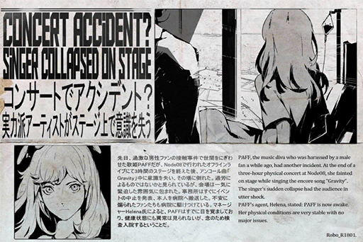

# [Repost] Concert accident? Singer collapsed on stage
## Post
ROBO_Head: 
[News][Entertainment][PAFF] 
> PAFF, the music diva who was harassed by a male fan a while ago, had another incident. At the end of a three-hour physical concert at Node 08, she fainted on stage while singing the encore song "Gravity". The singer's sudden collapse had the audience in utter shock. Her agency immediately called off the concert and arranged her for an emergency medical checkup. Many worried fans followed the singer to the hospital and waited outside, hoping for the best. 
> PAFF's agent, Helena, stated: "PAFF is now awake. Her physical conditions are very stable with no major issues. However, to ensure that she is 100% fine, she will be be staying at the hospital for a few more days to do a detailed checkup."  
[Article excerpted from Node News Network, Breaking]

## Replies
**ROBO_Head** 
Speculation: Over-exhaustion......35% 
Severe influenza......3% 
Internet withdrawl symptoms......1% 
Connection brain damage......15% 
Malicious attack......16%  
Other reasons......30%

**DustyAsh** 
NOOOO! PUFF~~~~~~~~

**MustangMartin** 
Everybody let's give PAFF our powers 
**\#PrayForPAFF**

**LyLah1207** 
Everybody let's pray... for PAFF 
**\#PrayForPAFF**

**PoolsKitten** 
Let's pray for her! Fellow PUFFERs let's go! 
**\#PrayForPAFF**

**m00nl16h7** 
Get well soon 
**\#PrayForPAFF**

**MAN_Dora** 
Everybody follow suit 
**\#PrayForPAFF**

**NEKOSAIKOU** 
Nah, she's just faking it, can't fool me~

**SuduMan** 
Stfu you trollcat~~~~ 
**\#PrayForPAFF**

**Ange3Lina** 
I'm a fan of NEKO's stream, but that's not something you should say now... **\#PrayForPAFF**

**PAFFxNEKO** 
I like both of them, so no fighting pls TAT 
**\#PrayForPAFF** 
**\#NEKO\#ΦωΦ**

**Talus_Alpha** 
You know you might get blacklisted for that right XDD

**CandiceNaoko** 
Get well soon!!!! 
**\#PrayForPAFF**

**Hash** 
**\#PAFFFIGHT**

