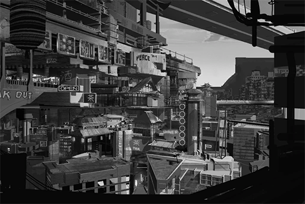

# [Excerpt] Travel Guide to All Nodes: 
Node 03, Part.1
## Post
ROBO_Head: 
[Show][Travel][Node 03] 
> Half-an-Earth away from Node 08,  the unique Node 03 stands, oozing its mysterious eastern flavors.  
>  
> Tourist: "It's very common here to walk down an old street thinking nothing will happen, only to make a turn and find yourself in front of a glass curtain wall building. I find this contrast to be quite charming." 
>  
> Ancient towns and temples, paired with the scenery of a traditional garden, all well-preserved to this very day. Look up and there stand the modern architectures that aim for the skies. The marks of history and the structures of modern day mixed together to create a unique sight. Among all Nodes, this place ranks second in terms of visiting tourists every year, a sign of its one-of-a-kind appeal.  
>  
> Tourist: "The best feature of this city is probably the food! On top of that, many unique tasting delicacies can only be found at the outskirts of the slums. Compare to us at Node 08, the issue here may be the large gap between the rich and the poor. The Administration Bureau here doesn't seem to properly take care of the poor fellows." 
>  
> [>>>Fast Foward>>>] 
>  
> The downtown area of Node 03 is the home of illegal gangs. Many major underground organizations got the start in their early days by trading resources in the grey area of the law. Before the Administration Bureau and A.R.C. could establish and refine their systems, these gangs have already established rules of their own. At the peak of their powers, over 30% of the residents of Node 03 were involved in gang-related activities/businesses one way or another. Anyone who dared to resist will likely end up in a sewer somewhere, dead.  
>  
> Node 03 resident: "In my high school class, over half of my classmates once participated in gang activities. Of these people, only a small percentage of them were forced to do so. Others view this as a very common way of life and don't find anything wrong with it. When I mention this to my friends from other Nodes, they all find it to be utterly shocking." 
>  
> The gangs are so widespread that the Administration Bureau is simply overwhelmed by this issue. Many anonymous sources even point out that the Node 03 Administration Bureau is basically under the control of the gangs.  
[Article excerpted from the show "Travel Guide to All Nodes"]

## Replies
**ROBO_Head** 
Analysis: 80% of Node 08 gangs originated from Node 03

**Ange3Lina** 
WTF so this post is corresponding to the gang purge news 
The opening introduction is so enticing that I nearly went ahead and applied for Cross-Node travel

**ElinaDaniel** 
Well, Node 08 is where all the big bucks are at. Not only do the gangs want a piece, regular folks also want to come here for an opportunity to get rich~~

**Popo** 
Been to 03 a couple of times already 
It is a pretty good place for vacation 
Although you must be extra careful when passing by the slums and at night

**An0nym0us** 
The admins and ARC seem pretty useless there

**Heart_Head** 
The few big gangs and major families probably control over half of the underground forces there

**Talus_Alpha** 
Holy that screenshot when they are talking about the food. That noodle looks way too f\*\*\*\*\* tasty!!!! (Ready to book trip

**Andy_Roid** 
It's pretty ridiculous that over 30% of residents are involved with gang activities.  
Like, will the kids there actually be OK once they grow up????

**Ayx_Socket** 
Feels like a major gap between the haves and have-nots always leads to bigger problems

**Abin** 
There's a report a few days ago about a major gang being purged in Node 08~~

**Flower_Head** 
Their headquarters is in 03 right?

**TobeTobe** 
My grandmother lives in Node 03 
Seems like she is all numb to these kinds of things already

**Ararar** 
There was a transfer student in our class who is from 03 
His family is in a leadership position of a gang XDD 
There were always two bodyguards to escort him home from school

**DustyAsh** 
Wanted to visit, but terrified...

