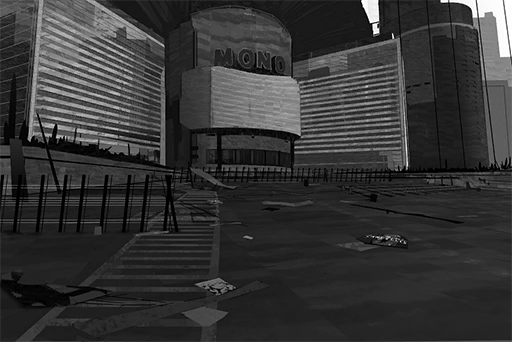

# [Repost] Looking back at major riots in history
## Requirements
|  Character  |Level|
|-------------|:---:|
|**ROBO_Head**| 46  |

## Post
**ROBO_Head** 
[Riot][Monophonic Entertainment][Social Commentary][Show] 
> Welcome back to Blitz Newsline, the place where we provide news on the latest news. I'm your host, Jay. Alright, the Monophonic Entertainment riot incident that caused quite the ruckus these days has finally come to an end after the Administration Bureau interfered. This is a riot that escalated from a street protest, a rare sight in recent years. What kind of meaning does this represent? Our history expert Sid is here to answer the question. Hello, Sid! 
>  
> Thank you, Jay. As everyone may know, Node 08 has had dozens of street riots just like this one throughout history. Most of them occurred around 200 to 100 years ago. Judging by the records, that time period was when the Architects just disappear and humans were starting to attempt to survive on their own. 
>  
> Alright, Sid, you stop there. Let us turn to our tech expert Yu. Yu, do you have any idea what Architects are? 
>  
> Jay, you're underestimating me. Of course I know what Architects are! In fact, I know them very well! I wrote a report about how the Architects helped humans rebuild civilization as my Academy project. What do you know, I graduated with the highest grade. The best-looking girl in my grade even became my wife. I can guarantee you that if the Architects reappears, I'm the person that can communicate with them the best! 
>  
> Got it. Sid, you mentioned something about how street riots have decreased a lot in the past one hundred years, right? 
>  
> Indeed, mostly because the Administration Bureau's policies gradually matured and the technology products under their control also increased. Take Node 08 for example; the last time we had such a major riot was 23 years ago. Back then, the reason for that was to protest the high taxes. That incident concluded after the law enforcement agents arrested the leader of the rioters. What I want to say is, if an idol can create an incident of this magnitude, we need to discuss whether or not... 
>  
> Stop right there, Sid. We don't need to delve that deep into tiny details; the ratings are dropping. Yu, after we returned from commercials we'll talk more about your Architect report and your hot wife. Stay tuned! 
[Soundbite excerpted from Neo Channel 8's late-night show "Blitz Newsline"]

## Replies
**ROBO_Head** 
Decision: This show among all social commentary shows, level of practicality  high

**TunaLee** 
They look so desperate, hahaha... (Not laughing at all 
How bad do the other shows have to be for this POS to be categorized as "High practicality"...

**STANley** 
You can tell Sid wants to talk, but the host is trying his best to not let him talk LMFAO

**Dogleg** 
To be honest, it is pretty stupid to have a riot over something this insignificant

**lrrllrrl** 
Just my two cents, but I feel like the number of angry folks has decreased a lot recently. People are starting to think calmly about what they should do. That [FindingPAFF] website is a pretty good example

**ConneR** 
As you all may observe, the constant repeat of such foolish actions is the perfect showcase of human nature. We are the same as we are two hundred years ago. When we lost our direction, we humans will recklessly fly around in the darkness like headless flies. In order to fulfill our diminishing and selfish greed and desires, we still choose to resort to violence, threats, and force. 

    A sad, neverending vicious cycle.

**RaiKiyumi** 
Trying to think of something to rebut sensei, yet couldn't even muster a word... I am sorry to be born a human

**Ewx_Data** 
I'm not to the point of complete despair. The value of humans needs to be created by our own hands.  
I believe Dr. ConneR will acknowledge this direction as well

**ConneR** 
Very well. Then the first thing we should do is to make sure worthless garbage like this show no longer exists.

