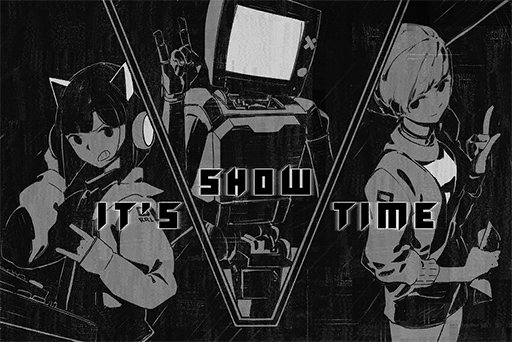

# ROBO\_Radio\_LIVE starts now!
## Requirements
|  Character  |Level|
|-------------|:---:|
|**PAFF**     | 48  |
|**NEKO#ΦωΦ** | 48  |
|**ROBO_Head**| 48  |

## Post
**ROBO_Head** 
Due to a connection error, network traffic unable to reach required level. High\-quality stream unavailable, apologies：( 
Audiences already in the virtual space will not be affected. Please rest assured and enjoy the performances：)

## Replies
**beeeeeeeeee** 
Excited! Ready on STANDBY!!!

**Kemcoter** 
The LQ stream is so blurry\~\~ Should have tried fighting for a ticket 
Robohead please upload photos of the performance later!!!

**ROBO_Head** 
**Performer on stage: NEKO\#ΦωΦ   Performance start! ：)**

**NEKOLUV** 
My waifu is leading off the show!! Get your hands moving everyone!

**loveIris** 
The first song is wild XD! The chorus really gets stuck in your brain XDDD 
O\-oooooooooo AAAAE\-A\-A\-I\-A\-U\- something along that line

**Flower_Head** 
Dude how the f\*\*\* did you figure out the lyrics XD 
NEKO is surprisingly good at her music skills. The view from row 3 is really nice

**ROBO_Head** 
Warning: NEKO's performance completely different from rehearsal. Can not compute.

**NEKOSAIKOU** 
LMFAO She went completely off\-course again LOLOLOL

**Noposa** 
It's a shame that the internet is acting really funky tonight. I already connected using the virtual internet yet it still lags from time to time

**ROBO_Head** 
**Performer on stage: Cherry   Performance start! ：)**

**CherryMyLife** 
My goddess!!! Why is it so blurry damnit!!

**iluvpuf** 
Seeing this photo reminds me of PAFF... They are both so focused when they are singing... I'm going to cry...

**K1ssK1tty** 
She's starting to sing the song NEKO plays. This combination is so amusing, but the music isn't too bad XD

**ROBO_Head** 
**Mysterious guest, JOE  on stage! 
Notice: This performance not organized by this unit }: /**

**JAC-jack** 
God my sides hurt LMAO King of Germs owner joins the fight XDDDDD

**Rabbitdora** 
Cherry just went to say hi to him, didn't expect him to break out the bass immediately and jump on stage LOLOL

**noneXenon** 
Too bad you guys weren't there on\-site. The owner was so hilarious lul 
I even saw Xenon in the corner with an expression that basically says "Somebody shoot me" LOLOLOL

**ROBO_Head** 
**Performer on stage: ROBO\_Head   Performance start! ：)**

**CyberLord** 
So ROBO is really a robot??

**TreeNoAlice** 
In the virtual internet space everyone uses an avatar, so there's no way you can tell 
Unless you're like Xenon who's avatar is just how he actually looks

**ElinaDaniel** 
The most breathtaking EDM bombardment EVAR! Unnnnggghhhh, this performance is SO worth it

**Snor_eDen** 
Out of pure curiosity, I looked up the traffic data during the performance. I discovered that a significant amount of connections do not belong to the audience on\-site. In fact, they far outnumber the audience. Not only that, most of these connections are encrypted connections. With all that crammed into this virtual space, no wonder the network traffic is slow... What is going on?

**DogBark** 
There was a lot of people watching. They're floating around in the skies can't you guys see them ROFL

**Otis_Emik** 
Don't be stupid, ghosts don't exist in the virtual space... Even if they do they're probably computer viruses anyway

