# ROBO_Head iM Posts
## <a id="toc"/>List of Posts
- [[#001] cyTus annual traffic report](#r0101)
- [[#002] [Repost] A.R.C dinner party announcement: Major breakthrough in Artificial Intelligence](#r0201)
- [[#003] [Announcement] ROBO\_Radio standing by](#r0301)
- [[#004] [Repost] A.R.C press conference: AI research will prioritize emotional communication](#r0401)
- [[#005] [Share] The reason why cyTus server is placed in the skies](#r0501)
- [[#006] [Share] The purpose behind the establishment of A.R.C](#r0601)
- [[#007] [Repost] Popular singer PAFF harassed by hardcore fan at event. Agency criticizes such behavior](#r0701)
- [[#008] [Announcement] ROBO\_Radio standing by](#r0801)
- [[#009] [Announcement] Article removed for unknown reason](#r0901)
- [[#010] [Respond] Æsir event](#r1001)
- [[#011] [Record] Æsir\-FEST remaining files](#r1101)
- [[#012] [Share] The security of the cyTus server](#r1201)
- [[#013] [Repost] NEKO\#ΦωΦ streaming time \-「SAW of EDEN(SOE)」](#r1301)
- [[#014] [Repost] Acclaimed scholar Colin Neumann Jr. named head of AI research project ](#r1401)
- [[#015] Æsir\-FEST memory block corrupted ](#r1501)
- [[#016] [Announcement] ROBO\_Radio standing by](#r1601)
- [[#017] [Repost] Dr. ConneR will share progress of AI research on the web](#r1701)
- [[#018] [Repost] Concert accident? Singer collapsed on stage](#r1801)
- [[#019] Æsir\-FEST corrupted data recovery progress......15% ](#r1901)
- [[#020] [Repost] Illegal prosthetics once again an issue. Lack of regulation leads to consumer doubt ](#r2001)
- [[#021] [Share] What extremely long connection times does to the brain](#r2101)
- [[#022] [Repost] Famous streamer NEKO and nearly 80,000 viewers attacked by malicious connection](#r2201)
- [[#023] Æsir\-FEST corrupted data recovery progress......80% ](#r2301)
- [[#024] Æsir\-FEST corrupted data recovery progress......100% ](#r2401)
- [[#025] [Repost] An urban legend nightmare comes true: memory lost for millions, main culprit still nowhere to be seen](#r2501)
- [[#026] [Repost] Another incident of unmanned drones assaulting innocent civilians by accident. Civilians outraged toward administration bureau](#r2601)
- [[#027] Æsir event internet search results](#r2701)
- [[#028] [Repost] Key evidences provided to law enforcement department;famous streamer released after being acquitted of all charges](#r2801)
- [[#029] [Repost] Acquittal declared? Live coverage of famous streamer exiting the LED](#r2901)
- [[#030] [Repost] Administration Bureau takes action: purge operations overwhelming success.Ando Gang on verge of collapse](#r3001)
- [[#031] [Excerpt] Travel Guide to All Nodes: Node 03, Part.1](#r3101)
- [[#032] [Repost] Fellow Monophonic Entertainment singer PAFF gone missing for several weeks; request assistance from fans and friends to help search for her](#r3201)
- [[#033] [Repost] Protest erupts in front of Monophonic Entertainment headquarters, Administration Bureau calls for fans to calm down.](#r3301)
- [[#034] [Repost] Explaining the decision behind the contract termination of PAFF](#r3401)
- [[#035] [Repost] Riot broke out at Monophonic HQ again, Administration Bureau greenlit use of riot control methods](#r3501)
- [[#036] [Repost] Research regarding the recreated technology of drones and its subsequent application to society](#r3601)
- [[#037] [Repost] Looking back at major riots in history](#r3701)
- [[#038] [Announcement] ROBO\_Radio\_LIVE event confirmation](#r3801)
- [[#039] ROBO\_Radio\_LIVE starts now!](#r3901)
- [[#040] ROBO\_Radio\_LIVE statistics analysis](#r4001)
- [[#041] [Repost] Major pipeline explosion in Node 03, emergency evacuation issued, millions affected.](#r4101)
- [[#042] [Repost] Law enforcement department blitz operation success, 40 human trafficking suspects arrested](#r4201)
- [[#043] Paranormal: Bug collection](#r4301)

## <a id="r0101"/>[#001] cyTus annual traffic report
### Unlocked Charts
|     Song      |Character|Diff.|Level|
|---------------|:-------:|:---:|:---:|
|**Restriction**|ROBO_Head|Easy |  4  |
|**Restriction**|ROBO_Head|Hard |  7  |

### Post
**ROBO_Head** 
[Data Analysis][ARC][Share] 
> According to official data from A.R.C., the cyTus virtual city has over 200 million registered users and over 180 million active users daily, a 23% increase compared to last year. Mega SNS blocks have also reached the number of 37000. To handle this increasing need for connection, A.R.C. and the Nodes are scheduling for a massive hardware update.  
(Data and article excerpt from Node 08 Administration Bureau)

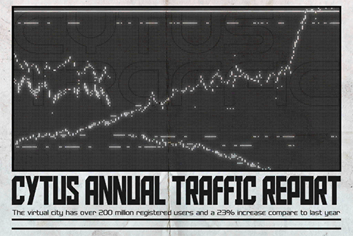
### Replies
**ROBO_Head** 
Record: Number of blocks managed by this Unit: 42  : ) 
Note: Now reviewing invite to manage block No.43.

**T3RA_wr47h** 
Ladies and germs, meet Robo\_head the super manager!! Seriously how in the world?

**Scrapy_RUN3** 
Organizing three blocks worth of data everyday is already killing me X\_X

**Cloria72** 
Personally, I think Robo\-kun is online 24/7

**Cyd_Mire** 
**@ROBO\_Head** Can you delete my post on the traffic report forum, the one that is blowing up now pretty please\~ 

**ROBO_Head** 
Rejected. Requested data does not require deletion.

**Conf1ict99** 
**@ROBO\_Head** Robo\_head can you review my permission to access the mind surfing forum block

**ROBO_Head** 
Block review complete. Access granted.：D

**loveIris** 
lol this efficiency

**PrideCr0w** 
man you sure are fast XDDD

**MDoyle** 
So many people, so annoying 
FML

[*(Click here to go back to the top)*](#toc)

## <a id="r0201"/>[#002] [Repost] A.R.C dinner party announcement: Major breakthrough in Artificial Intelligence
### Unlocked Charts
|        Song        |Character|Diff.|Level|
|--------------------|:-------:|:---:|:---:|
|**Deadly Slot Game**|ROBO_Head|Chaos| 12  |

### Post
**ROBO_Head** 
[Technology][News][ARC][A.I.] 
> The Institute of Ancient Ruin Civilization (A.R.C.) announced at their routine dinner party that they will be releasing an interactive software that allows the public to simulate exploration in the forbidden areas. This software is available for download at the A.R.C. official site. In addition, A.R.C. is scheduled to make a huge announcement at an upcoming press conference. Inside sources told us that the topic of this announcement will be on AI and its interaction with human emotions.  
[Article excerpted from Node News Network]
### Replies
**ROBO_Head** 
P.S: A.R.C. 200th Anniversary next year. 
Headquarters located in Node 08, same as this Unit. HQ is largest floating architecture in the world. ：O

**AvaJaKeLon** 
My uncle also works at A.R.C. HQ, but I heard his work is dangerous and he must go to the forbidden areas regularly

**Cyd_Mire** 
I think A.R.C. is larger than the admins in Node08. It's the other way around here in Node13

**SYY** 
Here we call A.R.C. the "real" admins : )

**BridGET** 
Chance everything on cyTus is under their control

**m00nl16h7** 
Nah, aren't they supposed to be some kind of scholar organization?

**SuduMan** 
How do you know, Robo\_head you there\~

**NEKO#ΦωΦ** 
Is there anything in this world Robobrain here doesn't know(Φ∀Φ)

**Scrapy_RUN3** 
The big A.R.C. is watching you

**DiiiiMO** 
Come on Robo\_head, a small hint can't hurt **@ROBO\_Head**

**ROBO_Head** 
No comment. ：/

**NEKO#ΦωΦ** 
BS! I know you know it Robobrain! (╬ΦдΦ)

**NEKO#ΦωΦ** 
**@Xenon** then you tell me

**FoxyRaiden** 
Wait, can't be THAT easy?

**Xenon** 
No comment. ：/

**ROBO_Head** 
Analysis: Plagiarism.

**loveIris** 
OMG he is here!

**Dezzert** 
All this talk is making me believe that A.R.C. is some kind of real\-life god

[*(Click here to go back to the top)*](#toc)

## <a id="r0301"/>[#003] [Announcement] ROBO\_Radio standing by
### Requirements
|  Character  |Level|
|-------------|:---:|
|**ROBO_Head**|  2  |

### Unlocked Charts
|    Song     |Character|Diff.|Level|
|-------------|:-------:|:---:|:---:|
|**Luolimasi**|ROBO_Head|Easy |  2  |
|**Luolimasi**|ROBO_Head|Hard |  7  |

### Post
**ROBO_Head** 
ROBO\_Radio online in one hour.  
New song completion percentage:100% ：D

### Replies
**SuduMan** 
FIRST! 
A NEW SONG!!!

**MustangMartin** 
Yeah! I've been waiting for this!

**Spinner** 
Gotta prepare my mind! (Set static alarm)

**Marshall** 
Damn just happened to overlap with another streamer

**66TAN66** 
Looking forward to new song!

**NEKO#ΦωΦ** 
That steamer won't happen to be me right ehhehehe ㄟ(ΦωΦ)ㄏ

**ROBO_Head** 
Hint: Lifestyle streamer. Stream focused on talking about books and magazines. 

**Heart_Head** 
Yep definitely not NEKO lol

**beeeeeeeeee** 
Finally a new song\~

**NEKO#ΦωΦ** 
(Φ皿Φ)凸

**maplewing** 
YYEEAAHHH!!!

**loveIris** 
LMAO

**Flower_Head** 
A new song from ROBO <3

**Marshall** 
It's QQueen actually \*head scratch\*

[*(Click here to go back to the top)*](#toc)

## <a id="r0401"/>[#004] [Repost] A.R.C press conference: AI research will prioritize emotional communication
### Requirements
|  Character  |Level|
|-------------|:---:|
|**ROBO_Head**|  3  |

### Unlocked Charts
|      Song      |Character|Diff.|Level|
|----------------|:-------:|:---:|:---:|
|**Make Me Burn**|ROBO_Head|Chaos| 12  |

### Post
**ROBO_Head** 
[Technology][News][ARC][A.I.] 
> In an emergency press conference this morning, the Institute of Ancient Ruin Civilization (A.R.C.) announced that an AI research project is scheduled to be launched very soon. This project is a milestone, as it focuses on something very near and dear to human nature: emotional communication. 
> One can imagine that in the future, AI will no longer be just a combination of random personalities. It can have its own identity and the ability to understand human nature. AI can assist humans in fields like social welfare, medical care and even more minor things like taking care of pets; all things that the existing AI can't do. A.R.C. has invited highly acclaimed scholar Colin Neumann Jr. to lead the project. 
[Article excerpt from Node News Network]

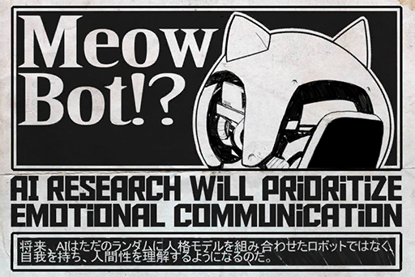
### Replies
**ROBO_Head** 
Speculation: Increased value for consumer robot products

**NEKO#ΦωΦ** 
MeowBot! **ヽ(\*Φ∀Φ)八(Φ∀Φ\*)ノ**

**ROBO_Head** 
Analysis: NEKO\#ΦωΦ 's liking of feline animal robots. A psychological projection due to lack of same\-age social group. 

**SYY** 
Isn't Colin Neumann Jr. that pretty famous musician ConneR???

**NEKO#ΦωΦ** 
No random Analysis of me!!!

**NEKOLUV** 
I can totally imagine NEKO filling an entire room with Meowbots XDD

**K1ssK1tty** 
NEKO\#ΦωΦ moe <3

**Dezzert** 
ConneR's live performance is GODLIKE!

**Cyd_Mire** 
The musician who specializes in Classical and old music right

**T.Goldwell** 
All hail Sensei!!!!

[*(Click here to go back to the top)*](#toc)

## <a id="r0501"/>[#005] [Share] The reason why cyTus server is placed in the skies
### Requirements
|  Character  |Level|
|-------------|:---:|
|**ROBO_Head**|  5  |

### Unlocked Charts
|    Song     |Character|Diff.|Level|
|-------------|:-------:|:---:|:---:|
|**Luolimasi**|ROBO_Head|Chaos| 11  |

### Post
**ROBO_Head** 
[Hardware][Popular Science][Show] 
> Do you know why the cyTus server is placed in the skies? It's because the energy required to power the server is immense. With specialized solar panels covering the entire server, solar power can be effectively used to charge the server. Its location in the Stratosphere also means that turbulence doesn't really harm the architecture. The cool temperature in the lower portion of the Stratosphere, around 216K (\-57°C), also means that it's much easier to dissipate heat.  
> That's it for today's fun fact. We'll see you tomorrow at the same time. Byebye\~\~\~ 
[Soundbite excerpted from Neo Channel 8's morning show "Breakfast With Popular Science"]
### Replies
**ROBO_Head** 
P.S: cyTus server exact same coordinate as A.R.C. headquarters.

**C.Y.** 
We see it every day in Node08, just look up and you can see it

**Cybel_Mach** 
My dad is super worried that thing will somehow fall from the sky lol

**Andy_Roid** 
Will it fall? **@ROBO\_Head**

**ROBO_Head** 
Analysis: Target   non human\-failure   chance of falling from sky: 0.0003333333333333333……%

**Flower_Head** 
Wow ROBO\_head watches this show as well 
I also watch it every day right on time

**AvaJaKeLon** 
My uncles says it's very safe up there. There are plenty of protection mechanisms in it

**Esox_tron** 
**@ROBO\_Head** Even though it's technically a "kids" show, its contents are well researched. I often recommend this show to my graduate students. 

**ROBO_Head** 
Affirmative.

**DustyAsh** 
Never thought Robo\_head has a TV show recommendation

**koolboss01** 
But if that giant server really falls from the sky, it's gonna cause a boatload of damage I imagine...

**TunaLee** 
I can't figure it out. **@ROBO\_Head** HHHEEELLPPPP\~

**ROBO_Head** 
Simulation: Target  (weight) \* (falling velocity)...... 
Results: Node08 destroyed percentage: 100%

**NnNn** 
Nope nope nope nope 

**SuduMan** 
Nah, it's impossible for it to fall...

**SYY** 
A building that size... 
it's gonna be like a meteor hitting earth \*runs\*

**Andy_Roid** 
**@ROBO\_Head** It's just a simulation, I don't think an accident like that will ever happen

**ROBO_Head** 
Negative. Everything has chance.

**Ararar** 
NOOOOOOO

**OtaCU** 
A world with no internet might as well be dead

[*(Click here to go back to the top)*](#toc)

## <a id="r0601"/>[#006] [Share] The purpose behind the establishment of A.R.C
### Requirements
|  Character  |Level|
|-------------|:---:|
|**ROBO_Head**|  6  |

### Unlocked Charts
|     Song      |Character|Diff.|Level|
|---------------|:-------:|:---:|:---:|
|**Restriction**|ROBO_Head|Chaos| 11  |

### Post
**ROBO_Head** 
[Knowledge][Technology][ARC] 
> The A.R.C. was established two centuries ago. It is dedicated to the excavation, recovery, development and recreation of past technologies and provides said technology for all humans to use equally.  
> Of all the technology, the one that affects humans the most is certainly the creation and application of imitation Bio\-neural networks. It led to a massive increase in the amount of data transferred and a much\-improved internet using experience.  
[Article excerpted from Node 08 Administration Bureau document "Foundation and Construction of City"]

### Replies
**C.Y.** 
I've heard that traditional internet is really slow

**TunaLee** 
In my grandparents' generation, apparently they used CABLES to connect XD

**SYY** 
Also need a mega system in order to connect 
who wants to carry a 15 lbs box while online lol

**ARCist** 
KNEEL before the mighty ARC!

**AvaJaKeLon** 
The forbidden areas are off\-limits to the public. The virus concentration is not high, but it's a guaranteed death sentence once it gets you

**Cybel_Mach** 
But I've heard stories of A.R.C. causing problems in many Nodes

**SuduMan** 
**@ROBO\_Head** what's your take?

**ROBO_Head** 
Analysis: A.R.C. contribution to modern human technology: Affirmative

**Talus_Alpha** 
So no comment on everything else besides technology... LOL

[*(Click here to go back to the top)*](#toc)

## <a id="r0701"/>[#007] [Repost] Popular singer PAFF harassed by hardcore fan at event. Agency criticizes such behavior
### Requirements
|  Character  |Level|
|-------------|:---:|
|**ROBO_Head**|  7  |

### Post
**ROBO_Head** 
[News][Entertainment][PAFF] 
> PAFF, a diva who enjoyed immense popularity across all Nodes, was harassed by a hardcore male fan at her promotion concert today. This male fan ran passed the security and screamed directly at PAFF. Fearing that PAFF will be harmed, security immediately apprehended the man. PAFF, while shaken, did not suffer any physical harm.  
>  
> PAFF's agent Helena: "We appreciate the passionate support from fans. However, we would also like everyone to control themselves and not harm PAFF." 
[Article excerpted from Node News Network: Entertainment]

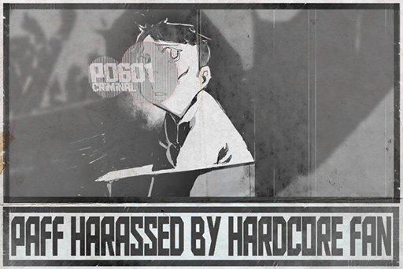
### Replies
**Cybel_Mach** 
Robo\_head really follows all kinds of news

**Ange3Lina** 
Man crazy fans are scary

**ElinaDaniel** 
I've heard some went from love to hate 
Those are the REALLY dangerous ones

**Alaina** 
Condemn him! It's A\-holes like this that ruin the image of other fans!

**m00nl16h7** 
I was there live, but I was too far away. All I hear were screams and ruckus

**MAN_Dora** 
Definitely not a PUFFER, we know our place!

**BUCK$** 
Does not accept this kind of behavior

**DustyAsh** 
Really want to know what the guy is yelling, can't find it on any major news network

**Heart_Head** 
**@ROBO\_Head** Analysis please?

**ROBO_Head** 
Analysis: Voiceprint dissection...failure 
Excess white noise in audio file

**Andy_Roid** 
Aw that's unfortunate, but man ROBO\_head you really CAN do everything

**Farland** 
I was pretty close to PAFF, the man kept yelling the same words. A dialect of some sort? or a name?

**SuduMan** 
Maybe some kind of curse \*shudders\*

**An0nym0us** 
Stuff like this freak me out. God know who will be the next victim

**KarenMayako** 
Best wishes for PAFF, hope she is not frightened >"<

[*(Click here to go back to the top)*](#toc)

## <a id="r0801"/>[#008] [Announcement] ROBO\_Radio standing by
### Requirements
|  Character  |Level|
|-------------|:---:|
|**PAFF**     |  9  |
|**NEKO#ΦωΦ** |  9  |
|**ROBO_Head**|  9  |

### Post
**ROBO_Head** 

[*(Click here to go back to the top)*](#toc)

## <a id="r0901"/>[#009] [Announcement] Article removed for unknown reason
### Requirements
|  Character  |Level|
|-------------|:---:|
|**PAFF**     |  9  |
|**NEKO#ΦωΦ** |  9  |
|**ROBO_Head**|  9  |

### Unlocked Charts
|       Song        |Character|Diff.|Level|
|-------------------|:-------:|:---:|:---:|
|**Devillic Sphere**|ROBO_Head|Easy |  3  |
|**Devillic Sphere**|ROBO_Head|Hard |  9  |

### Post
**ROBO_Head** 
Record: Previous post delete for Unknown reason ：(  
Decision: Filing complaint form...... 70% 

### Replies
**STANley** 
yeah I just finished the song and the article was somehow removed ???

**SuduMan** 
I thought my system crashed lol

**Cybel_Mach** 
Isn't Devillic Sphere the opening song before Æsir\-FEST started?

**Andy_Roid** 
Well ma boy, you just ran into the Taboo song lol

**Talus_Alpha** 
Taboo my ass

**NEKO#ΦωΦ** 
Robobrain! When are you going to promote my show!  
＼(Φˋ∀ˊΦ)／

**Ayx_Socket** 
NEKO once again asking the impossible XD

**Flower_Head** 
Run everbody, here's NEKO!

**Heart_Head** 
but if ROBO says he did participate in Æsir\-FEST, it's very unlikely he lied am I right?

**ElinaDaniel** 
Maybe

**Esox_tron** 
I really thought there was something wrong with me how did the post disappeared @@

**koolboss01** 
**@ROBO\_Head** sent the complaint already XDDD

**ROBO_Head** 
Affirmative. ：$

**Ange3Lina** 
Wasn't PAFF part of the performance too?

**NoUDont** 
yes I saw both of them perform

**An0nym0us** 
So is Æsir\-FEST a real thing or not...I mean even those connected told completely different stories lol

[*(Click here to go back to the top)*](#toc)

## <a id="r1001"/>[#010] [Respond] Æsir event
### Requirements
|  Character  |Level|
|-------------|:---:|
|**ROBO_Head**| 10  |

### Post
**ROBO_Head** 
Analysis: No Æsir\-FEST footage in memory cells.：(  
Speculation: Existence of event   Negative 
Speculation: Existence of related data in memory   Negative 
Speculation: Event\-related hardware damaged 
Decision: Before clear evidence, equal possibility for all above speculations ：/
### Replies
**NEKO#ΦωΦ** 
I said long ago that he stood us up, probably doing it just for the lulz\~

**C.Y.** 
**@ROBO\_Head** Is the memory cell damaged?

**ROBO_Head** 
Negative, memory cell not damaged by outside force. 
File or Index corrupted and can't be read normally ：( 

**Andy_Roid** 
I don't understand what's going on

**Cybel_Mach** 
So did you go, or not, can't tell

**Flower_Head** 
@@

**Marsh** 
So a Rashomon situation...

**Shall** 
You mean "In a Grove" right

**Ange3Lina** 
WTH are you guys smokin

**Scrapy_RUN3** 
Two nerds yapping about ancient literature...

**SYY** 
I hate when files get corrupted @@

[*(Click here to go back to the top)*](#toc)

## <a id="r1101"/>[#011] [Record] Æsir\-FEST remaining files
### Requirements
|  Character  |Level|
|-------------|:---:|
|**ROBO_Head**| 11  |

### Unlocked Charts
|        Song         |Character|Diff.|Level|
|---------------------|:-------:|:---:|:---:|
|**Pure Powerstomper**|ROBO_Head|Easy |  4  |
|**Pure Powerstomper**|ROBO_Head|Hard |  8  |

### Post
**ROBO_Head** 
Record: Æsir\-FEST information extracted from memory block of 6 months ago.  
> Guest list:  
> The New Generation's Diva: PAFF 
> The Electronic Machine DJ: ROBO\_Head 
> ......
### Replies
**ROBO_Head** 
Search result for other related files: None. ：/

**Ange3Lina** 
Really?

**YsoSurprise** 
EHHHHHH, so it does exists?

**Talus_Alpha** 
If there's an opening act, there should be more performances right? (I didn't particpate BTW)

**KarenMayako** 
I heard PAFF's!

**Cybel_Mach** 
I was there, it ended after Robo\_head's performance

**DustyAsh** 
I don't even remember if PAFF and ROBO\_head really performed TBH

**Andy_Roid** 
Let's get PAFF herself to answer **@PAFF\-Official**

**ROBO_Head** 
Speculation: Chance of reply from PAFF\-Official: 0.7%

**Ayx_Socket** 
TOO LOW!

**Esox_tron** 
Wait how the hell is that number calculated XDDD

**CHanatsuka** 
Hm? I just realized that Robo\_head replied without a tag

**Heart_Head** 
I think Robo\_head scans the tag before deciding whether or not to reply

[*(Click here to go back to the top)*](#toc)

## <a id="r1201"/>[#012] [Share] The security of the cyTus server
### Requirements
|  Character  |Level|
|-------------|:---:|
|**ROBO_Head**| 12  |

### Unlocked Charts
|       Song       |Character|Diff.|Level|
|------------------|:-------:|:---:|:---:|
|**Claim the Game**|ROBO_Head|Chaos| 12  |

### Post
**ROBO_Head** 
[Knowledge][Technology][cyTus] 
> The security system for the cyTus server is very tight. It is basically a giant military fortress in the sky. A.R.C. not only has the air force protecting it; even A.R.C. employees must go through multiple levels of security checks before entering the building.  
[Article excerpted from A.R.C. annual security report]
### Replies
**ROBO_Head** 
Record: Natural accidents since cyTus is launched: 0; 
human failure: 3. No record of casualty or property loss. 

**Flower_Head** 
Not too bad a yield rate in my opinion

**Cybel_Mach** 
It's definitely more secure than my game account!

**Talus_Alpha** 
Seems invincible on the outside, but what about the inside? **@ROBO\_Head**

**ROBO_Head** 
**@Xenon**

**Xenon** 
I can't say anything that is within the NDA. 
However, I can tell you that every single employee is required to go through a mental health assessment every three months. So everything should be fine. 

**Andy_Roid** 
Rare sight of ROBO\_Head tagging others lol

**Abin** 
summoned!!! XD

**CHanatsuka** 
So it's this rate good or bad?

**Esox_tron** 
Wait, ROBO just pass the ball to someone else XDDD

**Ararar** 
ROFL

**DustyAsh** 
Already following Xenon

**ElinaDaniel** 
So there are still human failures, why not make it fully automatic?

[*(Click here to go back to the top)*](#toc)

## <a id="r1301"/>[#013] [Repost] NEKO\#ΦωΦ streaming time \-「SAW of EDEN(SOE)」
### Requirements
|  Character  |Level|
|-------------|:---:|
|**ROBO_Head**| 13  |

### Unlocked Charts
|       Song        |Character|Diff.|Level|
|-------------------|:-------:|:---:|:---:|
|**Devillic Sphere**|ROBO_Head|Chaos| 13  |

### Post
**ROBO_Head** 
[Stream][Game][NEKO] 
> Today playing the latest action gameㄟ(ΦωΦ)ㄏ！！ 
> 「SAW of EDEN (SOE)」

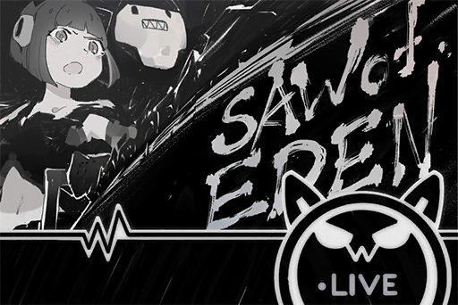
### Replies
**NEKO#ΦωΦ** 
EHH!!  d(`Φ∀Φ)b

**Cybel_Mach** 
Eh so ROBO\_head plays games too !!! XD

**MustangMartin** 
Wow reposting a NEKO stream

**beeeeeeeeee** 
**@ROBO\_Head** you like this game?

**ROBO_Head** 
This Unit participated in Beta of previous entry 
Card game winning percentage......100%

**SuduMan** 
Wait but it's no longer a card game anymore

**Andy_Roid** 
**@ROBO\_Head** let justice be upheld! lul

**ROBO_Head** 
Affirmative. 
Filing feedback form......50% 
Send mail to developer......yet to complete

**Esox_tron** 
A robot is persistent about a game XDDD

**Talus_Alpha** 
You CANT tell them to change it back into a card game  lololol

[*(Click here to go back to the top)*](#toc)

## <a id="r1401"/>[#014] [Repost] Acclaimed scholar Colin Neumann Jr. named head of AI research project 
### Requirements
|  Character  |Level|
|-------------|:---:|
|**ROBO_Head**| 15  |

### Post
**ROBO_Head** 
[Technology][News][ARC][A.I.] 
> Announced several days ago, the AI emotion training project has invited several senior scholars to participate in the research. One of the scholars is A.R.C.'s senior advisor and archaeologist Colin Neumann Jr., who is named the head of the project.  
> Dr. Neumann is perhaps more well known by his other name, ConneR. A renowned virtual composer on the internet, he is also an archaeologist with a deep knowledge regarding instruments of the past.  
> To fulfill the educational purpose of the project, Dr. Neumann will be posting regular updates of the project on the internet. Hopefully, everyone gets a sneak peek into the wonders of Artificial Intelligence research. 
[Article excerpted from Node News Network]

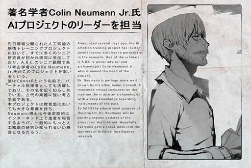
### Replies
**ROBO_Head** 
Note: 
Colin Neumann Jr., musician, composer, archaeologist 
New tab: SNS management

**Marshall** 
Eh, the genius "musician" ConneR !?

**T.Goldwell** 
Didn't expect to see news about Sensei in Robo\_head's feed

**ConneR** 
　Thank you. Appreciate the repost from ROBO\_head. Pleased to meet you.

**Talus_Alpha** 
Wow it's the doctor himself!

**Andy_Roid** 
Rumor has it that ConneR and ROBO\_head know each other personally, looks true now

**N0B0DY** 
Sensei\~\~ it's a great honor to know you!

**Dogleg** 
Only the best scholars can take on this important mission, congrats Sensei.

**Dogleg** 
On the milestones of Artificial Intelligence, Sensei's name will certainly be on there

**TunaLee** 
I think this project is very interesting, been following since the news came out!!!

[*(Click here to go back to the top)*](#toc)

## <a id="r1501"/>[#015] Æsir\-FEST memory block corrupted 
### Requirements
|  Character  |Level|
|-------------|:---:|
|**ROBO_Head**| 15  |

### Unlocked Charts
|        Song         |Character|Diff.|Level|
|---------------------|:-------:|:---:|:---:|
|**Pure Powerstomper**|ROBO_Head|Chaos| 13  |

### Post
**ROBO_Head** 
Analysis: Accessing Æsir\-FEST records...access fail 
Troubleshoot: Memory block corrupted, reason unknown 
Objective: Reproduce complete memory of event 
Decision: Launch recovery...initializing...
### Replies
**System** 
[User is busy now, comments are temporarily disabled]

[*(Click here to go back to the top)*](#toc)

## <a id="r1601"/>[#016] [Announcement] ROBO\_Radio standing by
### Requirements
|  Character  |Level|
|-------------|:---:|
|**ROBO_Head**| 16  |

### Unlocked Charts
|              Song               |Character|Diff.|Level|
|---------------------------------|:-------:|:---:|:---:|
|**Celestial Sounds (KIVΛ Remix)**|ROBO_Head|Easy |  3  |
|**Celestial Sounds (KIVΛ Remix)**|ROBO_Head|Hard |  8  |

### Post
**ROBO_Head** 
ROBO\_Radio online in one hour

### Replies
**ROBOLUV** 
Yeah Robohead's stream!

**beeeeeeeeee** 
It's music time\~\~\~

**Andy_Roid** 
Keep me waiting day and night

**Flower_Head** 
ROBO\_Radio is the perfect working BGM

**Hash** 
**\#ROBO\_RadioRocks**

**Scrapy_RUN3** 
Isn't this iM's new prototype Tag account

**SuduMan** 
I saw it on the news XD it will generate a random Hashtag to see if it becomes trending

**Talus_Alpha** 
WTF is this useless service XDD is it for hype

**C.Y.** 
I think they are testing it on very few accounts only

**MustangMartin** 
We're getting off topic lol, ROBO\_Radio for life!!

[*(Click here to go back to the top)*](#toc)

## <a id="r1701"/>[#017] [Repost] Dr. ConneR will share progress of AI research on the web
### Requirements
|  Character  |Level|
|-------------|:---:|
|**ROBO_Head**| 18  |

### Unlocked Charts
|         Song          |Character|Diff.|Level|
|-----------------------|:-------:|:---:|:---:|
|**Grimoire of Crimson**|ROBO_Head|Easy |  4  |
|**Grimoire of Crimson**|ROBO_Head|Hard |  8  |

### Post
**ROBO_Head** 
[Technology][News][ARC][A.I.][ConneR] 
> In order to show the public the beauty of technology advancements, A.R.C.'s Dr. Colin Neumann Jr. will share the research progress on social media. People who are interested in the project can now visit @ConneR\-x\-ARC to ask questions. Dr. Neumann will answer the questions and explain the progress of the research himself. He may even share some behind\-the\-scenes info with us.  
[Article excerpted from Node News Network] 
### Replies
**ConneR** 
　Thank you for sharing. Hope there is a chance for us to learn from each other in a different field. 

**Shrimpyy** 
seems like some really famous guy

**Abin** 
Are you serious ConneR is UBER famous

**Andy_Roid** 
Every single person in Node13 knows him

**SuduMan** 
In someways a living legend

**An0nym0us** 
Let's see how he BS his way through lol

**MustangMartin** 
you got something?

[*(Click here to go back to the top)*](#toc)

## <a id="r1801"/>[#018] [Repost] Concert accident? Singer collapsed on stage
### Requirements
|  Character  |Level|
|-------------|:---:|
|**ROBO_Head**| 19  |

### Unlocked Charts
|              Song               |Character|Diff.|Level|
|---------------------------------|:-------:|:---:|:---:|
|**Celestial Sounds (KIVΛ Remix)**|ROBO_Head|Chaos| 14  |

### Post
**ROBO_Head** 
[News][Entertainment][PAFF] 
> PAFF, the music diva who was harassed by a male fan a while ago, had another incident. At the end of a three\-hour physical concert at Node 08, she fainted on stage while singing the encore song "Gravity". The singer's sudden collapse had the audience in utter shock. Her agency immediately called off the concert and arranged her for an emergency medical checkup. Many worried fans followed the singer to the hospital and waited outside, hoping for the best. 
> PAFF's agent, Helena, stated: "PAFF is now awake. Her physical conditions are very stable with no major issues. However, to ensure that she is 100% fine, she will be be staying at the hospital for a few more days to do a detailed checkup."  
[Article excerpted from Node News Network, Breaking]

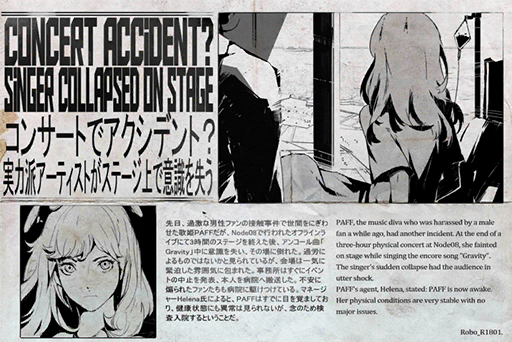
### Replies
**ROBO_Head** 
Speculation: Over\-exhaustion......35% 
Severe influenza......3% 
Internet withdrawl symptoms......1% 
Connection brain damage......15% 
Malicious attack......16%  
Other reasons......30%

**DustyAsh** 
NOOOO! PUFF\~\~\~\~\~\~\~\~

**MustangMartin** 
Everybody let's give PAFF our powers 
**\#PrayForPAFF**

**LyLah1207** 
Everybody let's pray... for PAFF 
**\#PrayForPAFF**

**PoolsKitten** 
Let's pray for her! Fellow PUFFERs let's go! 
**\#PrayForPAFF**

**m00nl16h7** 
Get well soon 
**\#PrayForPAFF**

**MAN_Dora** 
Everybody follow suit 
**\#PrayForPAFF**

**NEKOSAIKOU** 
Nah, she's just faking it, can't fool me\~

**SuduMan** 
Stfu you trollcat\~\~\~\~ 
**\#PrayForPAFF**

**Ange3Lina** 
I'm a fan of NEKO's stream, but that's not something you should say now... **\#PrayForPAFF**

**PAFFxNEKO** 
I like both of them, so no fighting pls TAT 
**\#PrayForPAFF** 
**\#NEKO\#ΦωΦ**

**Talus_Alpha** 
You know you might get blacklisted for that right XDD

**CandiceNaoko** 
Get well soon!!!! 
**\#PrayForPAFF**

**Hash** 
**\#PAFFFIGHT**

[*(Click here to go back to the top)*](#toc)

## <a id="r1901"/>[#019] Æsir\-FEST corrupted data recovery progress......15% 
### Requirements
|  Character  |Level|
|-------------|:---:|
|**ROBO_Head**| 20  |

### Unlocked Charts
|   Song   |Character|Diff.|Level|
|----------|:-------:|:---:|:---:|
|**Dasein**|ROBO_Head|Easy |  4  |
|**Dasein**|ROBO_Head|Hard |  7  |

### Post
**ROBO_Head** 
Report: Æsir\-FEST corrupted data recovery progress......15%  
Reason for corrupted data: Unknown

### Replies
**Andy_Roid** 
**@ROBO\_Head** Recovering the records of Æsir\-FEST?

**ROBO_Head** 
Affirmative

**Cybel_Mach** 
Robohead fight!

**Ange3Lina** 
Wow feels like we're involved in something major

**Heart_Head** 
Only 15% so far, the damage must be really bad

**Abin** 
Robohead fight\~\~\~\~\~

**Hash** 
**\#GoGoROBO\_Head**

**Talus_Alpha** 
There goes Hash and his dumb tags LMAO

**Ayx_Socket** 
well at least it knows to cheer ROBO on

**ElinaDaniel** 
the recovery seems to take ages\~\~

**Esox_tron** 
Still can't figure out why it's corrupted??

[*(Click here to go back to the top)*](#toc)

## <a id="r2001"/>[#020] [Repost] Illegal prosthetics once again an issue. Lack of regulation leads to consumer doubt 
### Requirements
|  Character  |Level|
|-------------|:---:|
|**ROBO_Head**| 21  |

### Unlocked Charts
|         Song          |Character|Diff.|Level|
|-----------------------|:-------:|:---:|:---:|
|**Grimoire of Crimson**|ROBO_Head|Chaos| 11  |

### Post
**ROBO_Head** 
[News][Technology][Prosthetics] 
> Another accident caused by illegal prosthetics, this time in Node 08's Quadrant III industrial area. A man suddenly went berserk at work. The pistons in his prosthetic right arm began to move on their own, attacking nearby colleagues and security guards that arrived on site to stop him. The accident left one dead and twelve injured. 
>  
> According to the official investigation, the man's prosthetic arm was purchased from the black market and is an illegally produced, defective product. The neural chips in the arm cause brain damage to the user. The chips may also experience short\-circuits and overcharge when the user's emotions are unstable. Node 08 Administration Bureau's medical committee urges the public to only use officially approved, safe prosthetics to prevent similar incidents from happening again.  
[Article excerpted from Node News Network]

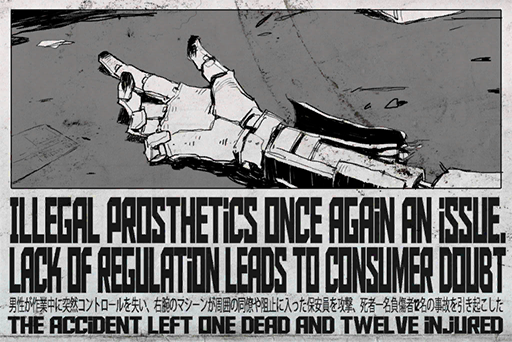
### Replies
**Ange3Lina** 
Jesus

**ElinaDaniel** 
If this were to happen in the city it's gonna be brutal

**BuddyHat** 
Good thing I use BodyHack, safe and secure

**BabyHug** 
Lifetime warranty too, safe and secure indeed

**Esox_tron** 
These two accounts seem familiar. Weren't these BodyHack sponsored accounts that were caught defending defects on forum blocks a while ago

**Cybel_Mach** 
So part\-time employees!!

**Andy_Roid** 
Reveal the truth almighty **@ROBO\_Head**

**ROBO_Head** 
Reverse tracking: Origin of connection   BodyHack HQ news control room

**Ayx_Socket** 
BUSTED!!! LOLOLOLOL

**Abin** 
OMG busted XDDD

**Flower_Head** 
Check in for sick burn

**TobeTobe** 
Look ma, I'm here \*jumps\*

**Ararar** 
Here for the sick burn\~\~\~

**DustyAsh** 
Well that's two more workers screwed XDD

[*(Click here to go back to the top)*](#toc)

## <a id="r2101"/>[#021] [Share] What extremely long connection times does to the brain
### Requirements
|  Character  |Level|
|-------------|:---:|
|**ROBO_Head**| 22  |

### Post
**ROBO_Head** 
[Medical][Internet] 
> Fellow online service users, Node United Hospital would like to call your attention to an issue. Last month, thousands of users approached us having suffered symptoms of dizziness, auditory hallucinations and cognitive disorders. All these patients shared one thing: they all had extremely long connection times of over 48 hours before the symptoms surfaced. 
> Thomas Snow, VS of Virtual Psychiatry at Node United Hospital, stated: "In terms of connection times, we recommend setting the cap at 8\~12 hours to avoid physical discomfort. If you feel discomfort after disconnecting, please report via the remote medical service and do a basic self\-check." 
[Article excerpted from Node 08 Administration Bureau's medical committee]
### Replies
**ROBO_Head** 
Average hours per week for this Unit: 140 hours 
Self\-detected errors: 0

**Flower_Head** 
You're not human

**DustyAsh** 
well Robo\_head really is NOT human XD

**Cybel_Mach** 
Everybody think Robohead's a robot, but the way he talks is too cute for him to not be a real human

**Abin** 
Every time I want to say "take care of yourself" to Robo\_head I forget that he is like 10000 times more durable than humans

[*(Click here to go back to the top)*](#toc)

## <a id="r2201"/>[#022] [Repost] Famous streamer NEKO and nearly 80,000 viewers attacked by malicious connection
### Requirements
| Character  |Level|
|------------|:---:|
|**NEKO#ΦωΦ**| 24  |

### Unlocked Charts
|     Song     |Character|Diff.|Level|
|--------------|:-------:|:---:|:---:|
|**Chrome VOX**|NEKO#ΦωΦ |Easy |  4  |
|**Chrome VOX**|NEKO#ΦωΦ |Hard |  9  |
|**Chrome VOX**|NEKO#ΦωΦ |Chaos| 15  |

### Post
**ROBO_Head** 
[News][Social][Emergency] 
> According to the information this reporter received before the deadline, famous streamer NEKO's recent stream, which attracted an audience of nearly 80,000, suffered a large\-scale malicious connection attack moments after the stream started. The attack caused hundreds of thousands of people to experience temporary memory loss, an unprecedented disaster.  
> Some witnesses point out that before the victims become unconscious, they all received a mysterious call. Upon accepting the call, all victims suffer symptoms like epileptic seizure, severe headache, foaming at the mouth and fainting.  
> Node 08 United Hospital's director of Virtual Psychiatry stated:" We have requested specialized hospital beds from A.R.C. for those with severe symptoms. Other patients will have their symptoms eased by a medical wave deployed remotely. Due to a large number of patients, it may take a while for the wave to take effect. Please wait patiently." 
> Meanwhile, Node 08 Administration Bureau's security office has marked the streamer as a suspect and has brought her in for questioning. Details will require further investigation. 
[Article excerpted from Node News Network]

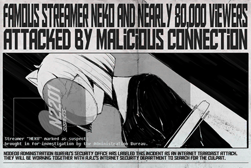
### Replies
**ROBO_Head** 
Analysis: Comparing attack pattern and disconnection time...... 100% 
Speculation: All victims attacked by same source

**KirinKiraKira** 
Stupid Reporter, her full name is NEKO\#ΦωΦ

**MaxLCK** 
Man, I was planning to watch the stream yesterday but was hit with a train delay. Looking back now I was kinda lucky(?

**Dolly** 
**@ROBO\_Head** my older brother was also attacked will his life be in danger?

**ROBO_Head** 
Negative. Minimal damage to brain, temporary cognitive disorders or memory displacements will recover within 3\~5 days

**Dolly** 
Thank you Robo\_head, my family can now rest assured after hearing that

**WuryAlot** 
Is it me, or is it really unsafe now...should I cut down on the connection time?

**Ange3Lina** 
Life already sucks and now we can't do anything >"<

**Hash** 
**\#NEKOwillbeFINE**

**Esox_tron** 
My god this tag is GAYYYYYYY!!!

**Ayx_Socket** 
NEKO\#ΦωΦ's been completely dead silent ever since the incident broke out

**FindingCat** 
Did anyone see anything from NEKO's feed after the attack?

**NEKOSAIKOU** 
**\#PrayForNEKO 
\#PrayForNEKO 
\#PrayForNEKO**

**NEKOSAIKOU** 
If anybody knows anything about NEKO, please DM me

**Ayx_Socket** 
Seeing NEKOSAIKOU's reaction now and comparing it to the PAFF fainting incident a while ago 
Man how freakin ironic life can be...

**viKtim001** 
I am one of the victims, my head is still dizzy and I get stints of severe headaches \*faints\*

**Talus_Alpha** 
Take care my man, use proxy connection it's less stressful for the brain

[*(Click here to go back to the top)*](#toc)

## <a id="r2301"/>[#023] Æsir\-FEST corrupted data recovery progress......80% 
### Requirements
|  Character  |Level|
|-------------|:---:|
|**PAFF**     | 24  |
|**NEKO#ΦωΦ** | 24  |
|**ROBO_Head**| 23  |

### Unlocked Charts
|   Song   |Character|Diff.|Level|
|----------|:-------:|:---:|:---:|
|**Dasein**|ROBO_Head|Chaos| 12  |

### Post
**ROBO_Head** 
Report: Æsir\-FEST corrupted data recovery progress......80%,  index block recovery complete 
Record: Timestamp information spread across 90+ minutes 
Existence of event   95% Affirmative 
Connections to Æsir\-FEST at start of timestamp 1,366,554 
Connections to Æsir\-FEST at end of timestamp 0 
Speculation: Outside influence cause millions of participants experience error and lost connection. Can't confirm if event continued, need complete data to confirm...recovering ：（
### Replies
**Cybel_Mach** 
Finally some progress, I want the truth >"<

**Popo** 
The truth is some attention seeking prick got stage fright and ran away

**Talus_Alpha** 
If every single connection is cut, isn't it similar to repeater malfunction or a blackout?

**C.Y.** 
Doesn't this looks somewhat similar to NEKO's case? 
though the magnitude differs a lot 

**Andy_Roid** 
never thought data can be this corrupted

**AaA** 
I was a participant, all this talk is starting to mess up my memory

**BbB** 
What did you remember?

**AaA** 
I remember everything up to Robo\_head's performance, nothing after

**BbB** 
My friends who participated said the same thing

**AbigaleJ** 
But I can't even remember ROBO\_Head's performance

**Flower_Head** 
Almost complete, we want to know what happened

**Ayx_Socket** 
THE TRUTH! \*claps\*

[*(Click here to go back to the top)*](#toc)

## <a id="r2401"/>[#024] Æsir\-FEST corrupted data recovery progress......100% 
### Requirements
|  Character  |Level|
|-------------|:---:|
|**PAFF**     | 24  |
|**NEKO#ΦωΦ** | 24  |
|**ROBO_Head**| 24  |
|**Ivy**      |  9  |

### Unlocked Charts
|      Song      |Character|Diff.|Level|
|----------------|:-------:|:---:|:---:|
|**CHAOS**       |ROBO_Head|Easy |  5  |
|**Hard Landing**|NEKO#ΦωΦ |Easy |  3  |
|**CHAOS**       |ROBO_Head|Hard |  9  |
|**Hard Landing**|NEKO#ΦωΦ |Hard |  8  |
|**CHAOS**       |ROBO_Head|Chaos| 14  |
|**Hard Landing**|NEKO#ΦωΦ |Chaos| 10  |

### Post
**ROBO_Head** 
Report: Æsir\-FEST corrupted data recovery progress complete 
Conclusion: Existence of event   Affirmative 
Speculation: Existence of event in participants' memory  Negative 
Chance of attack by intrusive connection: 99.98% 
This Unit equipped with non\-organic brain and nervous system, reason only corrupted memory data, not permanent memory loss 
Analysis: Attack source has intrusive methods beyond highest level of A.R.C. firewall protection 
Search result of individual or organization in Node Administration Bureau's criminal database that meets criteria: None 
Attachment: Recovered Æsir\-FEST visual data and sound files

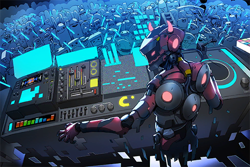
### Replies
**Ultralism** 
Wh....what's this supernatural BS

**Ararar** 
It's a PLOT TWIST boiiiiiis \*grabs hair\*

**Cybel_Mach** 
I'm lost, so Robo\_head is telling us that everyone's memory is wiped clean!? **@ROBO\_Head**

**ROBO_Head** 
Affirmative.

**Ange3Lina** 
I'm gonna puke...

**DustyAsh** 
Wait now I remember! So WTF happened before this? I'm so confused...

**HC** 
I remember now! 
Æsir was indeed on stage! OH MY freakin GOD\~\~\~

**Flower_Head** 
this is way beyond "Information Security", is it the end of the world!?

**Andy_Roid** 
So can we now confirm that the culprit here uses the same method as the one in the NEKO incident?

**C.Y.** 
Ask **@ROBO\_Head**

**ROBO_Head** 
Affirmative.

**Popo** 
Great, two major terrorist attacks by some godlike hacker in Node08, millions affected yet the admins are doing jack s\*\*\*...

**An0nym0us** 
Reported to Administration Bureau

**Heart_Head** 
Who did it, was Æsir a victim as well?

**Talus_Alpha** 
What if Æsir is the perpetrator himself...\*runs away\*

**Esox_tron** 
Æsir, like NEKO, completely vanished from the web after the incident, so he should not be the mastermind behind this, right?

[*(Click here to go back to the top)*](#toc)

## <a id="r2501"/>[#025] [Repost] An urban legend nightmare comes true: memory lost for millions, main culprit still nowhere to be seen
### Requirements
|  Character  |Level|
|-------------|:---:|
|**ROBO_Head**| 25  |

### Post
**ROBO_Head** 
[Æsir][Breaking][News][ARC][Administration Bureau] 
> The mysterious musician Æsir, who made a high\-profile concert announcement half\-a\-year ago, was exposed by famous internet DJ ROBO\_Head for the suspicious use of illegal methods to erase the memories of all connected users. However, the actual method and purpose of these actions are still unclear. Earlier today, we received some inside news from the law enforcement department of the Administration Bureau. The Bureau has initiated the investigation, and there is a possibility that this incident is related to the "streamer hacked" incident that occurred at the end of last month. 
>  
> Regarding this issue, the spokesperson for the Bureau stated that if the actual situation indeed matched the rumors and that the users' memories were erased, this will be the largest internet terrorist attack since Node 08 was established. "We are facing a unique situation never seen before. This is a brand\-new type of enemy, using a brand\-new method of attack." Davis, A.R.C.'s minister of internet security, also released an announcement earlier today, stating that they will be working together with the Bureau to locate the culprit and uncover the truth... 
[Article excerpted from Node News Network]

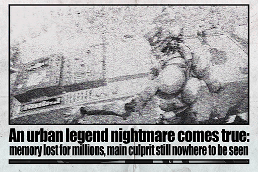
### Replies
**ROBO_Head** 
Speculation: Investigation progress...... 15% 
Action: Continue search of internet and collect list of possible culprits

**T3RA_wr47h** 
It's times like this that I appreciate the fact that Robohead doesn't have a brain 
If not for that fact, we might have no evidence at all on the event

**Ayx_Socket** 
It feels like you are saying that he's an idiot by stating that he doesn't have a brain XDDDD

**Talus_Alpha** 
**@ROBO\_Head** You have no brains\~\~\~\~

**ROBO_Head** 
This unit consists of inorganic compounds 
Brain organic biological organ 
Conclusion: This unit no brains 
P.S: Smarter than 99.99% of carbon\-based creatures ：D

**HC** 
ROBO\_Head should count as a Silicon\-based creature I think XDD Just like how Sci\-Fi novels describe alien creatures

**AliceinCytus** 
No matter what, I still can't remember anything about the concert 
Or should I say can I still remember anything? 
If I really do remember, is it really my memory of that day?

**NerfThat** 
I saw Dr. Hawkins on a show the other day. He said that although the memory is theoretically erased, the human brain has some kind of self\-defense mechanism. So there might be a backup hidden in the subconscious

**BUCK$** 
Ah man, times like this make you wish that you're a computer and you can just go into the subconscious to copy and paste your memory to your heart's content

**MAN_Dora** 
This is supposed to be an issue for the admins 
But the A.R.C. seems more reliable now 

**Heart_Head** 
It's always been like that in Node 08 XDD

**Cybel_Mach** 
I 
Still 
Don't 
Remember 
Anything

**AntiReality** 
I feel like rather than worry about some kind of terrorist attack, we should apprehend and restrict every person that could be a culprit

**AntiReality** 
You know, people like NEKO, ConneR...etc. are all pretty dangerous people 
Not having quarantines or restrictions on their internet usage is dumb 
Why are these potential risks allowed to roam freely among us regular folks???

**Heart_Head** 
I utterly disagree with every single word you just said

**SYY** 
Idiot. So you decide that other people's rights can be violated just because of some insubstantial sense of danger?

**AntiReality** 
You must be one of those idiot fans of theirs right? I can't and won't communicate with someone who can't think with their own brains sorry

**DustyAsh** 
Moron by doing that you're falling into the real culprit's trap

**Smurky** 
Can NEKO be released already? Like how it's impossible for her to be the perp!!!

**D33M0** 
I also feel that a mere streamer has no ability nor the necessity to perform an attack like this

**Marsh** 
Maybe because she wants to be famous?

**CyberLord** 
Dude she is already super famous. Didn't you see how many people were connected to her stream when she was attacked!!

[*(Click here to go back to the top)*](#toc)

## <a id="r2601"/>[#026] [Repost] Another incident of unmanned drones assaulting innocent civilians by accident. Civilians outraged toward administration bureau
### Requirements
|  Character  |Level|
|-------------|:---:|
|**ROBO_Head**| 26  |

### Post
**ROBO_Head** 
[News][Administration Bureau][Unmanned Drones][Social Issues] 
> Yesterday, in the middle of the night, a law enforcement drone performing its routine patrol at Node 08 Quadrant I's automatic area accidentally attacked a civilian household in the area. A model LE\-117 Striker drone that belongs to the Node 08 Administration Bureau suddenly lost control and launched shock blast grenades at a civilian building.  The law enforcement agent who was controlling the drone remotely via a virtual connection also suffered minor damage to his brain when the error occurred. The good news is that the Administration Bureau instantly reacted and shut down the drone's battery, therefore no further damage was caused. 
>  
> This accident is the fifth incident since Node 08 was established where law enforcement drones accidentally harm/kill innocent civilians. Of the 5 incidents, the most noteworthy is the first, which occurred on December 9th, 680 N.A.\-: Cross Node transport system administrator Carly Pauline was accidentally involved in a gunfight between law enforcement agents and armed robbers on her way home from work. Back then, the technology for controlling drones was not mastered by humans yet, and the unfamiliarity with the technology led to tragedy. A model LE\-110 Striker accidentally unloaded its riot control machine guns against Carly Pauline, severely injuring her. She died from heavy blood loss before she made it to the hospital. This incident prompted the Administration Bureau to establish a rule stating that human remote controls are mandatory for any drone operations. However, it has been years since the rule was established, yet drone\-related accidents still happen... 
>  
[Article excerpted from Node News Network]

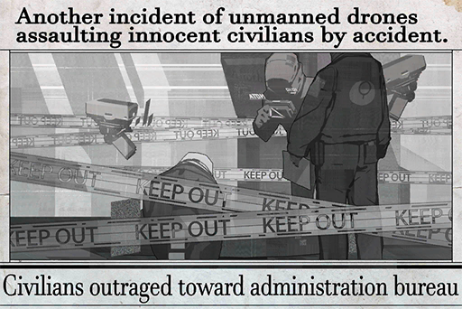
### Replies
**ROBO_Head** 
Decision: Shared UI between drones and human brain still not fully\-recreated technology ：/

**SYY** 
I remember that 680 N.A. incident. It was a really big deal when I was a child 
My parents forbade me to go out too late because of that incident

**ARCist** 
The place I work is right next to a relay patrol station for the agents. There's a boatload of drones coming in and out of the station every day >"<

**TunaLee** 
Scared.jpg

**TrojanPony** 
Scared.exe

**ElinaDaniel** 
Don't click the link above me. It's a phishing program that will put you in a locked block and force you to pay before you can leave!!!!!

**Alaina** 
Oh god I remember that incident. It was horrifying

**BUCK$** 
I was terrified of drones when I was a kid because that incident scarred me

**MAN_Dora** 
I recall that poor family who lost a loved one. The news interviewed their young daughter; it was so tear\-jerking

**m00nl16h7** 
They were a family of law\-abiding public servants, then all of a sudden this tragedy completely tore the family apart

**DustyAsh** 
WTF why would someone put a phishing program under the news 凸(\-\_\-\#)

**MirriLL** 
Dude, drones are deadly AF ok

**AvaJaKeLon** 
My uncle told me that law enforcement drones used to be even more destructive, but a lot of their functions and weapons were locked for safety concerns since they will be operating in highly populated cities

**Mulder** 
So you're telling me that they weren't originally built for public security?

**SYY** 
Why did the admins allow these killing machines to run around freely???

[*(Click here to go back to the top)*](#toc)

## <a id="r2701"/>[#027] Æsir event internet search results
### Requirements
|  Character  |Level|
|-------------|:---:|
|**ROBO_Head**| 29  |

### Unlocked Charts
|  Song   |Character|Diff.|Level|
|---------|:-------:|:---:|:---:|
|**EMber**|ROBO_Head|Easy |  3  |
|**EMber**|ROBO_Head|Hard |  7  |
|**EMber**|ROBO_Head|Chaos| 13  |

### Post
**ROBO_Head** 
Search Keywords: Æsir, memory loss, NEKO, hack, terrorist attack 
Relevance: High 
Time spread: Past month 
Community preference ranking, from high to low: 
1. [Æsir\-FEST] [Internet terrorist attack incidents] 
2. [Memory loss] [Æsir\-FEST] 
3. [Streamer] [NEKO] [[Æsir event accomplices] [or mastermind]  
4. [NEKO] [Hacking incident] [Cooked\-up by herself] 
5. [Æsir] [Non\-human] [Might be A.I.]
### Replies
**ROBO_Head** 
Decision: This unit level of agreement with community preference: 37%

**Ararar** 
D... Dann 
Robohead's posts always leave me hanging for more!!!

**Fu7ureW0rld** 
D\-A\-M\-N, learn to spell damnit!!!

**Wrinkleheart** 
Why is it that the first comment has nothing to do with the post XDD

**Axroid_Sona** 
Trying to grab some attention aren't you

**SYY** 
Gotcha\~\~\~\~\~\~\~\~\~ you must be Æsir (σ0ω0)σ

**Flower_Head** 
Æsir give NEKO back to us you a\-hole!!!!!!!!!

**AvaJaKeLon** 
What kind of idiot will cook themselves up to be the culprit? That doesn't make any sense .\\\_/.

**Esox_tron** 
If Æsir really is A.I., then wouldn't he be Robohead's no.1 rival???

**Gearz_Igo** 
Huh, didn't think about that. The battle of musician A.I.s

**Rob_Oto** 
Robohead is ten times more adorable ok!!!!!

**Bit_Inex** 
Bunch of idiots talking about nonsense 
Don't you guys realize the severity of this entire incident??

**Ange3Lina** 
I mean you're contributing to the nonsense by commenting here LMFAO

**Dogleg** 
The younger generation consists of fools like these. The virtual internet has messed up their minds

**beeeeeeeeee** 
Being old doesn't make you wise, so shut the f\*\*\* up you old fart

**Pumpkinforest** 
There are millions of victims out there, have some respect will you??

**WhiteEYE33** 
Pfffft, so? It's not like memory loss for a couple of hours will kill ya 
At worst you fell into a coma for a day or two 
Stop acting like is some kind of big deal

**foreheadless** 
Dude will it kill you to NOT be clueless for like a second? 
Can't you have like an ounce of empathy?

**C.Y.** 
ROBO\_Head squinted as he smells something fishy?

**Otis_Emik** 
Wait can Robohead actually "squint"!?

**HC** 
If he does squint, his entire outer shell might just crack...

**TunaLee** 
}: /

**Ryo** 
Man that is PERFECT XDDDDDD

**KiwaHu** 
**@ROBO\_Head** We just found you a new emoticon!!!!!!

**ROBO_Head** 
Relevance between this post and comments: Low }: /

**9me** 
God my sides hurt lul

**C_H_U** 
But I feel like NEKO was probably framed!!

[*(Click here to go back to the top)*](#toc)

## <a id="r2801"/>[#028] [Repost] Key evidences provided to law enforcement department;famous streamer released after being acquitted of all charges
### Requirements
|  Character  |Level|
|-------------|:---:|
|**ROBO_Head**| 30  |

### Post
**ROBO_Head** 
[News][Administration Bureau][NEKO][Æsir] 
> The stream hack incident that created quite the buzz a while ago just experienced a dramatic development today. Streamer NEKO\#ΦωΦ, who was marked by the Administration Bureau due to her suspected involvement, was acquitted of all charges and released this afternoon. After contacting the Law Enforcement Department (LED), this reporter was able to receive a quick confirmation of this news. 
>  
> This reporter also managed to get some exclusive information. According to an anonymous source inside LED, in the past few days, they've been receiving physical evidence that is very favorable for NEKO. The evidence is sufficient enough that the LED officers and the Bureau believe that NEKO is not the main culprit behind the large\-scale hacking incident. To prevent public opinion from shifting, the procedures have been cleared and her release has been granted as quickly as possible.  
[Article excerpted from Node News Network]
### Replies
**ROBO_Head** 
Investigation result compare with this unit's decision: Match 
NEKO\#ΦωΦ proxy server for culprit's memory alteration attacks

**Axroid_Sona** 
So it's all a misunderstanding 
NEKO fans win 
Haters, the door is to the left

**AntiNEKO** 
I call BS did she bribed the admins or what!! I heard that NEKO is the daughter of some super rich family!!

**DuskDawn** 
Can never do wrong by following ROBO

**Doubty** 
Follow **@ROBO\_Head**!!!

**ROBO_Head** 
SPAM warning +1

**Doubty** 
I'm sorry, won't do that again Q\_Q

**Copper_stone** 
Feels like the entire case is now back to point zero

**Arya_Poke** 
It was never gonna be NEKO in the first place lol 
This case went in the completely wrong direction from the start

**AntiMetal** 
If NEKO is a super hacker, then I'm ARC's CEO

**Gogossip** 
So she just went home quietly 
Judging by NEKO's personality, I thought she would've have started a party right there at the main entrance

**AbigaleJ** 
Are you sure that her real\-life personality in private is the same as the one during stream ROFL

**Flower_Head** 
\*Whisper\* TBH I kinda secretly hope it's the same...

**C.Y.** 
I have a friend's friend who was her classmate. From what he said, not as over\-the\-top as she is in streams, but indeed a very fun and playful person

**Andy_Roid** 
Today the LED also only issued a brief statement. Seems like the investigation is truly going nowhere

**AaA** 
I've got to comment on NEKO's page to celebrate!!! ΦwΦ

**BbB** 
Good thing that the innocent wasn't wrongly accused in the end \*prays\*

[*(Click here to go back to the top)*](#toc)

## <a id="r2901"/>[#029] [Repost] Acquittal declared? Live coverage of famous streamer exiting the LED
### Requirements
|  Character  |Level|
|-------------|:---:|
|**ROBO_Head**| 31  |

### Post
**ROBO_Head** 
[Exclusive][Xenon][NEKO][Cherry] 
> Famous streamer NEKO\#ΦωΦ, who was brought in for investigation by the LED due to her involvement with a hacking incident that affected thousands, was acquitted of all charges yesterday morning and has been escorted home by friends. 
>  
> However, according to this reporter's actual on\-site observation, the friends that came to pick her up turned out to be the also internet\-famous one\-man band leader Xenon and the recent darling of Monophonic Entertainment, Cherry PuNK's lead vocalist Cherry. Xenon and NEKO have had very intimate interactions on iM. In fact, many fans have already suspected that the two were dating. However, this time, Xenon brought along his ex\-girlfriend from the Crystal PuNK days as well. The three appears to get along with each other very well too. This reporter was extremely confused and had no idea what they were up to. Upon exiting the LED, NEKO's expression seemed very relaxed. After a quick chatter with Xenon and Cherry, she left in a car.  
>  
> Is Xenon really so charming to the point that he can get away with two\-timing? Or did Xenon, real name Simon Jackson, utilized his powers at A.R.C. to rescue his precious girlfriend? For more behind\-the\-scenes information on this case, please follow 08 Daily. 
[Article excerpted from 08 Daily]

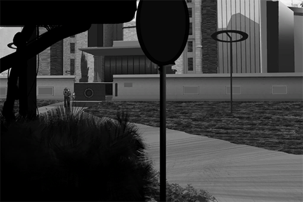
### Replies
**ROBO_Head** 
Semantic analysis result of article: 
Based on facts: 30% 
Speculation with no proof: 50% 
Rumor Fabrication: 20%

Decision: Attempt to spread malicious message

**Axroid_Sona** 
I feel like Xenon himself is very questionable 
Like he's the only one to get off scot\-free from start to finish, coincidence?

**ShadowForest** 
God what a life! Paid good money, has fans, and now cute girlfriend(s)

**DuskDawn** 
Are u guys blind? Robohead has detected that it's malicious message

**Doubty** 
ROBO\_head's decision is based on information on the internet, right? This means that if the information is hidden in the real world there's no way for him to reference it correctly\~\~

**Brock3tt** 
This does remind us: we've never actually discussed in detail how Robohead's thinking process works...

**Irisa0938** 
Let go of the two cute girls\~\~\~\~\~\~\~\~\~\~\~\~\~\~\~\~\~\~\~\~\~\~\~\~

**Copper_stone** 
Why would Cherry go pick up NEKO with Xenon though, that's what really bugs me 
Am I the only one who thinks this group doesn't make any sense?

**Arya_Poke** 
What "sense" do you want, it's friends picking up a friend lol 
Stop getting mislead by this BS report OK ???

**AntiMetal** 
Cherry was quite the bad girl back then XD Done some shady things by herself apparently?? At least that's what my friend told me

**Gogossip** 
X always acts as if he's better than everyone else and he doesn't care about anything 
These type of people are the worst and they're fake\-AF LOLOL

**NoProblemo** 
Readers LOVE malicious messages (Not a typo)

**Andy_Roid** 
Isn't ROBO somewhat contributing to the spread of this report by writing this post? \*Faceplams\*

**CyberLord** 
Lies based on facts are the scariest 
( ﾉД`)( ﾉД`)( ﾉД`)

**Dreamer** 
Xenon and Cherry was a really infamous couple in the world of underground bands in the past\~\~ 
It's a dream so don't PM me

[*(Click here to go back to the top)*](#toc)

## <a id="r3001"/>[#030] [Repost] Administration Bureau takes action: purge operations overwhelming success.Ando Gang on verge of collapse
### Requirements
|  Character  |Level|
|-------------|:---:|
|**ROBO_Head**| 32  |

### Post
**ROBO_Head** 
[News][Gang][Social][Ando] 
> Since the middle of last year, the law enforcement department (LED) of the Administration Bureau has launched a series of operations titled "Node 08 gang purge". These operations focus on rounding up illegal gang members and eliminating locations where gang activities are rampant. As of this month, 78 listed locations across all 4 quadrants of Node 08 have been targeted for compulsory criminal search. 55 members from major gangs such as the Ando Gang and the Baro Brotherhood have been found liable for the violation of the Organized Crime Act, Electronic Narcotics Prohibition Act, Criminal Intimidation and Extortion Prevention Act, and more. Also found in the criminal searches are 129 suspects who are involved in other criminal cases, hundreds of doses of electronic narcotics, 11 standard\-issue law enforcement rifles, and 50 pulse rifle magazines.  
>  
> During these operations, over 90 percent of the Ando Gang's leadership core has been arrested. Their funds have been blocked as well. The entire organization has been fatally crippled due to the lack of any leadership. Originated from Node03, this notoriously violent gang that once ruled over the Node 08 underworld as its largest gang is now nothing more than a mere name.  
>  
> According to the head of Quadrant II's LED, working in tandem with the Administration Bureau's "Node 08 gang purge" operations is just a small part of a bigger picture. The regulations for Cross\-Node traveling is set to loosen in the near future, so more people are expected to visit the Nodes. In addition to rounding up the gangs in each region, other illegal activities, such as smuggling, that harm the civilians' safety will also be investigated and punished according to the law when found. The goal is to improve security and create a positive image for the city.  
[Article excerpted from Node News Network]

### Replies
**ROBO_Head** 
Analysis: Node 08 gang influence decreased 35%

**ARCist** 
Wow so Robohead can even get his hands on gang information, like how XD

**TunaLee** 
Feels like it could be done by reverse tracking the gang's profitable businesses?

**TrojanPony** 
Seems to me that we won't be missing them any time soon?

**ElinaDaniel** 
NICE! Last time my friend caused a ruckus in their nightclub and got pummelled so badly that he nearly ended up in the ICU. They had it coming for a long time!

**Alaina** 
... I say your friend had it coming as well (?

**BUCK$** 
Electronic narcotics do nothing but destroy lives 
People who produce and sell them should all be imprisoned for life

**MAN_Dora** 
The admins have been letting these people run free for too long

**m00nl16h7** 
Good Riddance

**DustyAsh** 
If the balance is now broken, will other gangs use this opportunity to expand themselves?

**MirriLL** 
Some stores in Quadrant II could barely sustain themselves due to all the protection fees demanded

**AvaJaKeLon** 
The admins have been s\*\*\* on a lot these years; turns out they can still do some good

**Mulder** 
From what I've heard, Node 03 is the "true" gang\-operated city

**Fu7ureW0rld** 
B, but, Node 03 is quite fun. Its culture and people are very different from 08

**Wrinkleheart** 
See ya you bastards

**Pascal626** 
Bye bye you POS (Hand Wave

[*(Click here to go back to the top)*](#toc)

## <a id="r3101"/>[#031] [Excerpt] Travel Guide to All Nodes: Node 03, Part.1
### Requirements
|  Character  |Level|
|-------------|:---:|
|**ROBO_Head**| 33  |

### Post
**ROBO_Head** 
[Show][Travel][Node 03] 
> Half\-an\-Earth away from Node 08,  the unique Node 03 stands, oozing its mysterious eastern flavors.  
>  
> Tourist: "It's very common here to walk down an old street thinking nothing will happen, only to make a turn and find yourself in front of a glass curtain wall building. I find this contrast to be quite charming." 
>  
> Ancient towns and temples, paired with the scenery of a traditional garden, all well\-preserved to this very day. Look up and there stand the modern architectures that aim for the skies. The marks of history and the structures of modern day mixed together to create a unique sight. Among all Nodes, this place ranks second in terms of visiting tourists every year, a sign of its one\-of\-a\-kind appeal.  
>  
> Tourist: "The best feature of this city is probably the food! On top of that, many unique tasting delicacies can only be found at the outskirts of the slums. Compare to us at Node 08, the issue here may be the large gap between the rich and the poor. The Administration Bureau here doesn't seem to properly take care of the poor fellows." 
>  
> [>>>Fast Foward>>>] 
>  
> The downtown area of Node 03 is the home of illegal gangs. Many major underground organizations got the start in their early days by trading resources in the grey area of the law. Before the Administration Bureau and A.R.C. could establish and refine their systems, these gangs have already established rules of their own. At the peak of their powers, over 30% of the residents of Node 03 were involved in gang\-related activities/businesses one way or another. Anyone who dared to resist will likely end up in a sewer somewhere, dead.  
>  
> Node 03 resident: "In my high school class, over half of my classmates once participated in gang activities. Of these people, only a small percentage of them were forced to do so. Others view this as a very common way of life and don't find anything wrong with it. When I mention this to my friends from other Nodes, they all find it to be utterly shocking." 
>  
> The gangs are so widespread that the Administration Bureau is simply overwhelmed by this issue. Many anonymous sources even point out that the Node 03 Administration Bureau is basically under the control of the gangs.  
[Article excerpted from the show "Travel Guide to All Nodes"]

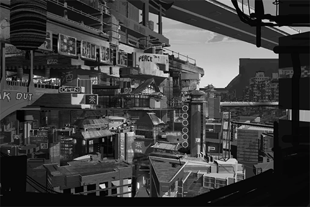
### Replies
**ROBO_Head** 
Analysis: 80% of Node 08 gangs originated from Node 03

**Ange3Lina** 
WTF so this post is corresponding to the gang purge news 
The opening introduction is so enticing that I nearly went ahead and applied for Cross\-Node travel

**ElinaDaniel** 
Well, Node 08 is where all the big bucks are at. Not only do the gangs want a piece, regular folks also want to come here for an opportunity to get rich\~\~

**Popo** 
Been to 03 a couple of times already 
It is a pretty good place for vacation 
Although you must be extra careful when passing by the slums and at night

**An0nym0us** 
The admins and ARC seem pretty useless there

**Heart_Head** 
The few big gangs and major families probably control over half of the underground forces there

**Talus_Alpha** 
Holy that screenshot when they are talking about the food. That noodle looks way too f\*\*\*\*\* tasty!!!! (Ready to book trip

**Andy_Roid** 
It's pretty ridiculous that over 30% of residents are involved with gang activities.  
Like, will the kids there actually be OK once they grow up????

**Ayx_Socket** 
Feels like a major gap between the haves and have\-nots always leads to bigger problems

**Abin** 
There's a report a few days ago about a major gang being purged in Node 08\~\~

**Flower_Head** 
Their headquarters is in 03 right?

**TobeTobe** 
My grandmother lives in Node 03 
Seems like she is all numb to these kinds of things already

**Ararar** 
There was a transfer student in our class who is from 03 
His family is in a leadership position of a gang XDD 
There were always two bodyguards to escort him home from school

**DustyAsh** 
Wanted to visit, but terrified...

[*(Click here to go back to the top)*](#toc)

## <a id="r3201"/>[#032] [Repost] Fellow Monophonic Entertainment singer PAFF gone missing for several weeks; request assistance from fans and friends to help search for her
### Requirements
|  Character  |Level|
|-------------|:---:|
|**ROBO_Head**| 34  |

### Post
**ROBO_Head** 
[Announcement][PAFF][Missing] 
> ... PAFF (Real name: Aroma White), an artist who is currently under contract with us, left the hospital she was resting at on the night of September 9th without notice and has been missing since. As of today, her agent, the agency, and other colleagues have been unable to make any kind of contact with her.  
>  
> Here, I would like to first thank all the fans and our friends in the media for your understanding. Monophonic Entertainment chose to not explain the actual situation to the public when the incident first broke out due to an attempt to protect the privacy and rights of our artists. We have tried our best to search and investigate, in hopes that PAFF can contact us herself and explain the situation. However, we haven't made any notable progress. We are in the same position as everyone is right now: we know the fact PAFF has gone missing for no reason, but we don't know any details. More investigation is still required... 
[Article excerpted from Monophonic Entertainment's official statement]
### Replies
**ROBO_Head** 
Analysis: Suburb area lacking in surveillance equipment, basic stealth disguise enough to avoid detection

**Ayx_Socket** 
Is ROBO going to provide some direct hints

**Abin** 
There's just too many people in Node 08 
If she really wants to cover her tracks it's practically impossible to find her, right?

**Flower_Head** 
Anyone knows why PAFF left the hospital without permission?

**TobeTobe** 
I also find it weird that she leaves the hospital when she's supposed to be resting

**Ararar** 
Could it be that she was threatened or hypnotized???

**DustyAsh** 
Hacked???

**Ange3Lina** 
I know there's been two major hacking incidents recently, but don't blame everything on hackers lol

**ElinaDaniel** 
Feels like PAFF is purposely avoiding surveillance cameras and tracking 
If she just wandered off it shouldn't be hard to find her

**BuddyHat** 
Perhaps she has an accomplice???

**BabyHug** 
Whatever let's blame Æsir for everything\~\~\~

[*(Click here to go back to the top)*](#toc)

## <a id="r3301"/>[#033] [Repost] Protest erupts in front of Monophonic Entertainment headquarters, Administration Bureau calls for fans to calm down.
### Requirements
|  Character  |Level|
|-------------|:---:|
|**ROBO_Head**| 34  |

### Post
**ROBO_Head** 
[News][Monophonic Entertainment][Riot][PAFF] 
> A protest broke out in Node 08's business district today. Angry fans surrounded Monophonic Entertainment's headquarters and a riot ensued. This protest is largely due to the fan dissatisfaction that has been building up since Monophonic's popular diva singer PAFF disappeared from the hospital she was resting in. Monophonic Entertainment's mishandling of the PAFF situation on top of the lackluster PR work they did afterward was what ultimately led to the chaos today. According to the drone analysis, there are thousands of protesters already on\-site and the number is still increasing. The building where Monophonic Entertainment is located has been sealed off for safety reasons. The company has also request security and other assistance from the Administration Bureau. 
>  
> According to our basic understanding of the situation, this protest is not headed by any specific organization or a thought leader. This protest was a result of an internet collaboration effort among fans using the hashtag **\#MonoWillPay**. Their main points of complaint are Monophonic Entertainment's insincere attitude towards handling the issues and their apparent hand\-washing of their artists to keep themselves clean. As of this moment, the entire protest has been relatively calm. No incidents of violence have been reported so far. Nonetheless, the Administration Bureau still deployed two squadrons of riot control drones around Monophonic Entertainment headquarters for security concerns. 
>  
> As of the publishing of this report, Monophonic Entertainment has yet to issue a statement regarding this protest. Rumor has it that several high\-level directors will be addressing the crowd directly to settle the disputes. However, at the same time, there's also a different voice on the internet. Some have wondered if this entire event was just incited by people with malicious intent. They call for fans to stay calm and be alert; do not let others take advantage of your passion.  
[Article excerpted from Node News Network]

### Replies
**ROBO_Head** 
Analysis: Internet flow around Mono HQ  increasing 
Analysis: Pressure index around Mono HQ  increasing 
Decision: Critical value not yet reached 
Decision: Need to inform Adminstration Bureau  Negative

**Axroid_Sona** 
S\*\*\* I need to leave for an appointment later and I have to pass by that area. Hope I won't be affected

**DuskDawn** 
Are they too bored or what? 
Why would you mob someone for something this stupid?

**Clairy** 
Is it just me, or does their appeals seem really vague?

**AbigaleJ** 
Probably for the compensation 
They want to see if they can pressure the company to pay up; that way they can earn some quick cash

**Wowow** 
I feel like launching a **\#FindPaff** is the more meaningful thing to do right now...

**Irisa0938** 
QAQ I want to take a few days off to help find PAFF too

**Copper_stone** 
Really hard for me to imagine that it would take this long to find someone in Node 08

**AaA** 
TBH, for a leaderless mob event like this, it's quite hard to tell if there's actually a mastermind behind the scenes

**BbB** 
This is the golden opportunity for rivals and enemies to take advantage of imo

**N0B0DY** 
Oh crap, my company is in the building right next to Mono HQ. We are definitely suffering collateral damage right now

**WoooooDy** 
Maybe ask your boss and see if you can leave early to avoid the mob???

[*(Click here to go back to the top)*](#toc)

## <a id="r3401"/>[#034] [Repost] Explaining the decision behind the contract termination of PAFF
### Requirements
|  Character  |Level|
|-------------|:---:|
|**ROBO_Head**| 40  |

### Post
**ROBO_Head** 
[Announcement][Monophonic Entertainment][PAFF][Contract Termination] 
> ... After Miss White went missing without notice, we have also tried our utmost to search for her and handle the losses. However, her action is indeed a violation of her contract and has already caused the company a substantial amount of damage, including property damage, other contract artists getting injured and more. In addition, it has led to the mistrust between fellow fans and the company, something neither of us wants to see happen.  
>  
> Therefore, we hereby announce the following information to fellow fans and friends in the media: After taking all issues into consideration, we have reached an agreement with Miss White's agent, Miss Helena White. We will be terminating the contract between Monophonic Entertainment Inc. and Miss Aroma White, effective immediately. We will no longer be responsible for her future career as an artist... 
[Article excerpted from Monophonic Entertainment's official statement]
### Replies
**ROBO_Head** 
Reason of termination, community preference ranking, from high to low: 
1.[Evading responsibility] 52%  
2.[Avoiding further damages] 41% 
3.[Lack of experience/inability to handle incident] 5% 
4.[A simple violation of contract] 2%

**Rob_Oto** 
Who cares about the reason... just tell me where the hell is PAFF?? 
**\#PrayForPAFF**

**AbbEE** 
Mono really just got the short straw at the worst possible time, but, can't say I didn't see that coming 
The way they handle the situation is so terrible that it's practically ASKING for public outrage

**WhiteEYE33** 
It really is terrible... makes me wonder if they actually hired monkeys to do PR work

**Damn3D** 
Dude, if you ask me, the ones who drew the shortest straws are their other artists\~\~ Especially Cherry...

**C.Y.** 
Agreed. I wonder if Cherry is feeling better now

**Alaina** 
There were some news about gangs, could it be that she got arrested?

**m00nl16h7** 
I thought most of the gangs are busted already?

**MAN_Dora** 
God, all these recent incidents are so confusing. I don't what's real and what's fake anymore

[*(Click here to go back to the top)*](#toc)

## <a id="r3501"/>[#035] [Repost] Riot broke out at Monophonic HQ again, Administration Bureau greenlit use of riot control methods
### Requirements
|  Character  |Level|
|-------------|:---:|
|**PAFF**     | 42  |
|**NEKO#ΦωΦ** | 42  |
|**ROBO_Head**| 42  |

### Post
**ROBO_Head** 
[News][Administration Bureau][Monophonic Entertainment][Riot][PAFF] 
> Following the incident a few days ago where angry fans surrounded Monophonic Entertainment Headquarters, a second riot erupted today. This one is largely believed to be related to Monophonic Entertainment's announcement of its contract termination with missing idol singer PAFF. Most fans viewed this as an act of evading responsibility, thus leading to today's incident.  
>  
> Earlier today, fans voluntarily gathered in front of the building once again. According to the analysis by the drone, the crowd this time expanded much faster than last time. This fast\-growing mob quickly jammed the entire traffic network around the site. The furious fans nearly caused the entire situation to go out of control. Fortunately, the Administration Bureau deployed squadrons of law enforcement agents and riot control drones in time to prevent the worst from happening. Using high\-velocity water streams, the agents were able to drive away the rioting crowd and arrest 12 suspects for excessive behavior, finally putting an end to the riot.  
>  
> Monophonic Entertainment later issued a statement regarding this incident. In addition to thanking the Administration Bureau for their timely and efficient help, they also expressed their grief for the actions of the rioting fans. They also restated their point, that Monophonic Entertainment has communicated with PAFF's agent, Helena White, about all the details regarding the contract termination. The two sides reached a peaceful and mutual agreement before the decision was made public. It was not an attempt to evade responsibility, which is what many people outside of the company have suspected.  
>  
> During the suppression, several dozen citizens got injured, mostly due to slipping on the wet surface. Even though no significant injuries were filed, this is still one of the larger physical protests in recent years. The Administration Bureau has treated this issue with extra care. According to several sources, the Bureau plans to form a special investigation team to research countermeasures. On top of that, since the iM system was used as a platform to organize such activities, the Bureau also plans to involve A.R.C., the administrators of the virtual city cyTus, into the discussions to prevent similar incidents from occurring again. 
[Article excerpted from Node News Network]
### Replies
**ROBO_Head** 
Decision: Possibility of another protest within a week: 42%

**AaA** 
Much lower than what I expected. The admins know how to do their job well

**BbB** 
Don't say it in such a casual manner! 
I just happen to pass by there a few minutes ago. The site is utter chaos! So many people were pinned on the ground by the law enforcement agents. Some of them even have their entire face covered in blood; it's really frightening

**DuskDawn** 
You reap what you sow. They have only themselves to blame for getting involved with this mess

**An0nym0us** 
You people don't understand how we felt! We just wanted some justice! 
**\#MonoWillPay**

**JAC-jack** 
Oh hey! We have a survivor. How does prison food taste XD

**NerdBuster** 
Causing others trouble in the real world for something on the internet; if that's not stupidly childish I don't know what is

If I were to make a guess, all of those people are probably weebs living in their mother's basement while feeding on D\*\*itos and M\*\*\*tain Dew (Ok, maybe an occasional Chinese food takeout)

**Tracix** 
Wait wat? It was normal in the first part; why did the second part become a meme fiesta LMFAO

**RamenBot** 
Speaking of Chinese food, I think the admins should get rid of the water streams 
They should spray people with s\*\*\* instead. I guarantee you it will be super effective against the rioters

**Marshall** 
We would like ARC to devote their resources in developing quantum poo spraying drones

**beeeeeeeeee** 
The heck? Am I reading this right? WTF is quantum poo?????? ROFL

**AAAnton** 
Please focus the research on making quantum poo scatter through the quantum field via quantum radiation in order to achieve the maximum quantum spread and release quantum smell particles to quickly disperse the protesting crowd

**KiwaHu** 
Another mention of the word "quantum" and I'm going to have you f\*\*\*\*\* murdered! 
LMAO 
**@ROBO\_Head** Tell him to stop it!

**ROBO_Head** 
Note: Analyze technology viability of forming quasi\-human feces with the application of Quantum Physics

**CHanatsuka** 
Wait Robo are you serious about this NOOOOO!!!!!

**lrrllrrl** 
S\*\*\* I got cramps on my sides for laughing too hard XDDDDD

[*(Click here to go back to the top)*](#toc)

## <a id="r3601"/>[#036] [Repost] Research regarding the recreated technology of drones and its subsequent application to society
### Requirements
|  Character  |Level|
|-------------|:---:|
|**ROBO_Head**| 44  |

### Post
**ROBO_Head** 
[Excerpt][Document][Colin Neumann Jr.][Drones] 
> The Drone is a type of mobile machinery that is equipped with a UI that's shared with the human brain. Originally, they were automatic tools used by the Architects for architecture, excavation, security and other purposes. After "The Decommission" and the disappearance of the Architects, humans founded A.R.C. to recreate and analyze the technology left behind. Due to how widely applicable and convenient the drones are, they are widely used in many fields, especially in areas where it's too risky for humans to venture ourselves. 
>  
> To explain in a level understandable by the general public, not only can these drones be remotely controlled through a shared UI with the human brain, they can also operate on their own by algorithms inputted in advance. The algorithms can be written so that these drones will follow a certain set of principles when they operate. Unfortunately, humans have yet to fully grasp the algorithms used by the drones. This shortcoming led to many accidents (Including the model LE\-110 Striker human assault incident that occurred in 680 N.A.). On top of that, even when remotely controlled via the shared UI by a human, incidents where the drone frankly ignored the pilot's directions and acted on its own were still fairly commonplace. In some large\-scale simulations, the connection error rate even reached a staggering 3%. Of course, as you may have guessed, this number is nowhere to be seen on A.R.C.'s research conclusions. 
>  
> From model LE\-112 to LE\-119, there are a total of eight drone models operating in the field right now. All of which are left behind by the Architects and each one has its own unique purpose. For example, large machinery and model LE\-115 drones often handle demolition duties during an excavation. Under human modifications, each model also has different add\-on equipment sets labeled A\~C. However, in exchange for the add\-ons, the connection yield rate has further diminished compare to the basic modules. As with the most primitive LE\-110s and LE\-111s, they have more units left behind than any other model. However, due to the constant string of accidents involving them, all units have been removed from field operations by the Administration Bureau. Currently, they are sealed indefinitely in a warehouse located in the forbidden area. 
>   
> It has been two hundred years since humans attempt to gain control over technologies we simply can't grasp. In the face of potential threats and unknown risks, we are unable to give up our innermost greed. We chose to seal them off, in hopes that one day we can truly uncover the secrets behind them. I can't say that this isn't a showcase of arrogant courage, but at the same time, the sheer lack of wisdom in this decision is also painfully noticeable. To those who made this decision, you have my sincere condolences.

[Article excerpted from Dr. Colin Neumann Jr.'s publications in the open academic network]

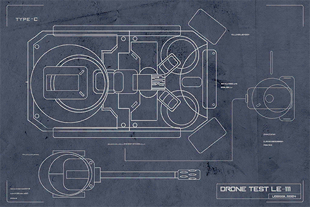
### Replies
**m00nl16h7** 
As expected from Robohead, unearthes a master's paper in no time!

**ElinaDaniel** 
WTF these things are super dangerous no matter how you look at them... Yet the admins want to keep using them...

**Tracix** 
The water stream model is probably modified afterwards 
Don't think the Architects would need to worry about something as insignificant as mere riots 
Look forward to seeing Poo Spraying Drones JK lol

**Otis_Emik** 
That second sentence sounds like something Dr. ConneR would say

**ConneR** 
Such nostalgic words.  Thank you to **@ROBO\_Head** for finding the most appropriate explanatory document regarding the topic of drones. However, the document is undoubtedly dated now. Please allow me to make some additions regarding the views I developed in recent years. 

**ROBO_Head** 
Decision: This document among 13652 related documents, level of representativeness  highest 
Dr. **@ConneR** to make additions, very welcomed. Will allow this unit to further learn and update its knowledge.：D

**Amberclove** 
I'm tearing up a bit for seeing this conversation 
The two most knowledgable people of our generation are exchanging ideas without reservation

**RaiKiyumi** 
Two people? Or is it one man one machine? XD

**Ewx_Data** 
I'm excited about Colin sensei's take!

**CozyCaty** 
All set to write a research paper on drones\~

[*(Click here to go back to the top)*](#toc)

## <a id="r3701"/>[#037] [Repost] Looking back at major riots in history
### Requirements
|  Character  |Level|
|-------------|:---:|
|**ROBO_Head**| 46  |

### Post
**ROBO_Head** 
[Riot][Monophonic Entertainment][Social Commentary][Show] 
> Welcome back to Blitz Newsline, the place where we provide news on the latest news. I'm your host, Jay. Alright, the Monophonic Entertainment riot incident that caused quite the ruckus these days has finally come to an end after the Administration Bureau interfered. This is a riot that escalated from a street protest, a rare sight in recent years. What kind of meaning does this represent? Our history expert Sid is here to answer the question. Hello, Sid! 
>  
> Thank you, Jay. As everyone may know, Node 08 has had dozens of street riots just like this one throughout history. Most of them occurred around 200 to 100 years ago. Judging by the records, that time period was when the Architects just disappear and humans were starting to attempt to survive on their own. 
>  
> Alright, Sid, you stop there. Let us turn to our tech expert Yu. Yu, do you have any idea what Architects are? 
>  
> Jay, you're underestimating me. Of course I know what Architects are! In fact, I know them very well! I wrote a report about how the Architects helped humans rebuild civilization as my Academy project. What do you know, I graduated with the highest grade. The best\-looking girl in my grade even became my wife. I can guarantee you that if the Architects reappears, I'm the person that can communicate with them the best! 
>  
> Got it. Sid, you mentioned something about how street riots have decreased a lot in the past one hundred years, right? 
>  
> Indeed, mostly because the Administration Bureau's policies gradually matured and the technology products under their control also increased. Take Node 08 for example; the last time we had such a major riot was 23 years ago. Back then, the reason for that was to protest the high taxes. That incident concluded after the law enforcement agents arrested the leader of the rioters. What I want to say is, if an idol can create an incident of this magnitude, we need to discuss whether or not... 
>  
> Stop right there, Sid. We don't need to delve that deep into tiny details; the ratings are dropping. Yu, after we returned from commercials we'll talk more about your Architect report and your hot wife. Stay tuned! 
[Soundbite excerpted from Neo Channel 8's late\-night show "Blitz Newsline"]

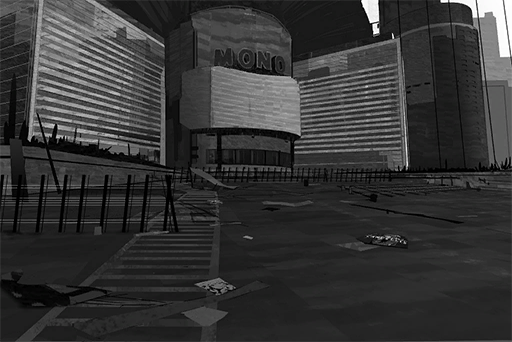
### Replies
**ROBO_Head** 
Decision: This show among all social commentary shows, level of practicality  high

**TunaLee** 
They look so desperate, hahaha... (Not laughing at all 
How bad do the other shows have to be for this POS to be categorized as "High practicality"...

**STANley** 
You can tell Sid wants to talk, but the host is trying his best to not let him talk LMFAO

**Dogleg** 
To be honest, it is pretty stupid to have a riot over something this insignificant

**lrrllrrl** 
Just my two cents, but I feel like the number of angry folks has decreased a lot recently. People are starting to think calmly about what they should do. That [FindingPAFF] website is a pretty good example

**ConneR** 
As you all may observe, the constant repeat of such foolish actions is the perfect showcase of human nature. We are the same as we are two hundred years ago. When we lost our direction, we humans will recklessly fly around in the darkness like headless flies. In order to fulfill our diminishing and selfish greed and desires, we still choose to resort to violence, threats, and force. A sad, neverending vicious cycle.

**RaiKiyumi** 
Trying to think of something to rebut sensei, yet couldn't even muster a word... I am sorry to be born a human

**Ewx_Data** 
I'm not to the point of complete despair. The value of humans needs to be created by our own hands.  
I believe Dr. ConneR will acknowledge this direction as well

**ConneR** 
Very well. Then the first thing we should do is to make sure worthless garbage like this show no longer exists.

[*(Click here to go back to the top)*](#toc)

## <a id="r3801"/>[#038] [Announcement] ROBO\_Radio\_LIVE event confirmation
### Requirements
|  Character  |Level|
|-------------|:---:|
|**ROBO_Head**| 47  |

### Post
**ROBO_Head** 
The first ROBO\_Radio\_LIVE will be held in the cyTus virtual space. Several new songs set to be revealed. Invited guests NEKO\#ΦωΦ and Cherry will be on stage as well. We welcome everyone to join us ：)

For ticket purchases and details on the event, please visit the customized website 
[ROBO\_Radio\_LIVE]

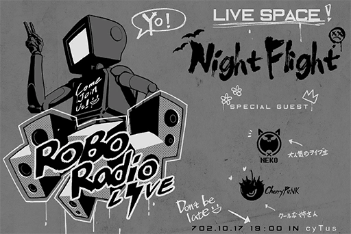
### Replies
**MustangMartin** 
WOW a virtual LIVE!!! ROBO is finally holding a performance for himself!!!

**Spinner** 
Instant purchase. This line\-up is too godly to skip

**Cherry** 
Thank you to **@ROBO\_Head** for the invitation 
Hope everyone can have fun and enjoy music

**NnNn** 
Came from NEKO's post. Followed!! Good luck with the event!

**NEKO#ΦωΦ** 
Hehe NEKO's popularity is no joke (\*Φ∀Φ) 
As a return, ROBO, lemme use your head that day as an instrument\~ You down with that\~(\*Φ∀Φ) 
I really like the drumming and beating noises in《Deadly Slot Game》ฅ(☼ ∀ ☼)ฅ

**ROBO_Head** 
Negative. This unit does not offer function of percussion instruments }: /

**Heart_Head** 
Hahaha Robohead is so adorable ♡ Bought the ticket already\~\~ I want to see Cherry too!!

**NekoSamurai** 
It's a NEKO live (Screams internally

**JOEZ Cafe** 
I will be there!! I'm super hyped up about this!!

**ROBO_Head** 
Decision: **@JOEZ Cafe** is top 10% Bassist in Node 08 
Purchase of ticket confirmed; thank you ：)

**JOEZ Cafe** 
Hahaha man hearing something like that from you feels sic!!! 
**@Xenon** Look, my awesomeness is acknowledged by the master

**Xenon** 
**@ROBO\_Head** If you compliment him like that, he'll get carried away real fast.

**ROBO_Head** 
Fact confirmed. 
Addition to artist's profile, completed ：/

**Curo** 
This comment section has so many amazing artists (tears of joy 
Feels like I just witnessed the beginning of a  new era\~\~

**66TAN66** 
Bought ten tickets already! This performance is definitely what you call can't miss!!

[*(Click here to go back to the top)*](#toc)

## <a id="r3901"/>[#039] ROBO\_Radio\_LIVE starts now!
### Requirements
|  Character  |Level|
|-------------|:---:|
|**PAFF**     | 48  |
|**NEKO#ΦωΦ** | 48  |
|**ROBO_Head**| 48  |

### Post
**ROBO_Head** 
Due to a connection error, network traffic unable to reach required level. High\-quality stream unavailable, apologies：( 
Audiences already in the virtual space will not be affected. Please rest assured and enjoy the performances：)

### Replies
**beeeeeeeeee** 
Excited! Ready on STANDBY!!!

**Kemcoter** 
The LQ stream is so blurry\~\~ Should have tried fighting for a ticket 
Robohead please upload photos of the performance later!!!

**ROBO_Head** 
**Performer on stage: NEKO\#ΦωΦ   Performance start! ：)**

**NEKOLUV** 
My waifu is leading off the show!! Get your hands moving everyone!

**loveIris** 
The first song is wild XD! The chorus really gets stuck in your brain XDDD 
O\-oooooooooo AAAAE\-A\-A\-I\-A\-U\- something along that line

**Flower_Head** 
Dude how the f\*\*\* did you figure out the lyrics XD 
NEKO is surprisingly good at her music skills. The view from row 3 is really nice

**ROBO_Head** 
Warning: NEKO's performance completely different from rehearsal. Can not compute.

**NEKOSAIKOU** 
LMFAO She went completely off\-course again LOLOLOL

**Noposa** 
It's a shame that the internet is acting really funky tonight. I already connected using the virtual internet yet it still lags from time to time

**ROBO_Head** 
**Performer on stage: Cherry   Performance start! ：)**

**CherryMyLife** 
My goddess!!! Why is it so blurry damnit!!

**iluvpuf** 
Seeing this photo reminds me of PAFF... They are both so focused when they are singing... I'm going to cry...

**K1ssK1tty** 
She's starting to sing the song NEKO plays. This combination is so amusing, but the music isn't too bad XD

**ROBO_Head** 
**Mysterious guest, JOE  on stage! 
Notice: This performance not organized by this unit }: /**

**JAC-jack** 
God my sides hurt LMAO King of Germs owner joins the fight XDDDDD

**Rabbitdora** 
Cherry just went to say hi to him, didn't expect him to break out the bass immediately and jump on stage LOLOL

**noneXenon** 
Too bad you guys weren't there on\-site. The owner was so hilarious lul 
I even saw Xenon in the corner with an expression that basically says "Somebody shoot me" LOLOLOL

**ROBO_Head** 
**Performer on stage: ROBO\_Head   Performance start! ：)**

**CyberLord** 
So ROBO is really a robot??

**TreeNoAlice** 
In the virtual internet space everyone uses an avatar, so there's no way you can tell 
Unless you're like Xenon who's avatar is just how he actually looks

**ElinaDaniel** 
The most breathtaking EDM bombardment EVAR! Unnnnggghhhh, this performance is SO worth it

**Snor_eDen** 
Out of pure curiosity, I looked up the traffic data during the performance. I discovered that a significant amount of connections do not belong to the audience on\-site. In fact, they far outnumber the audience. Not only that, most of these connections are encrypted connections. With all that crammed into this virtual space, no wonder the network traffic is slow... What is going on?

**DogBark** 
There was a lot of people watching. They're floating around in the skies can't you guys see them ROFL

**Otis_Emik** 
Don't be stupid, ghosts don't exist in the virtual space... Even if they do they're probably computer viruses anyway

[*(Click here to go back to the top)*](#toc)

## <a id="r4001"/>[#040] ROBO\_Radio\_LIVE statistics analysis
### Requirements
|  Character  |Level|
|-------------|:---:|
|**NEKO#ΦωΦ** | 48  |
|**ROBO_Head**| 49  |

### Post
**ROBO_Head** 
Record: ROBO\_Radio\_LIVE 
Static image files: 14339 photos in total 
Motion video files: 497:37:14 Hrs/Mins/Secs in total 
Connection viewcount: 1,344,097 views in total 
Highest concurrent viewers: 61,008 viewers 
Positive response from social media: 88% 
Decision: Event success 
Action: Survey willingness to participate in next session

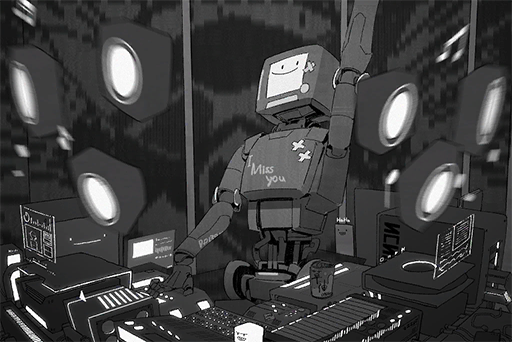
### Replies
**TreeNoAlice** 
Achieving such a result without even trying, sick\~\~\~

**ElinaDaniel** 
Hey how could you say that Robohead didn't try!! Maybe the planning process was very tough!!

**Snor_eDen** 
Good work Robohead!! 
The best performance of the year is 
**\#ROBO\_Radio\_LIVE**

**NoSignal** 
Goddamnit I was at home that day but my internet didn't work for some unknown reason 
Flipping ╰(〒皿〒)╯ Out

**noneXenon** 
Mom came into my room and asked why I was on my knees

**JAC-jack** 
Ummm... Can't you just let your online Avatar kneel? Nobody's gonna see it even if you do it in real life lololol

**noneXenon** 
That way I can show how much I adore them! (Saying this while still on my knees)

**66TAN66** 
My reaction after listening: 
THAT 
WAS 
SICCCCCCCC\~\~\~

**beeeeeeeeee** 
Turns out the part I liked the most was JOE's party crashing, and he wasn't even supposed to perform in the first place! 
LOLOLOLOL

**NEKOSAIKOU** 
Regardless of anything else 
NEKO is my waifu!

**MatsuyamaC** 
That's fine you can have NEKO I'll take Cherry

**Heart_Head** 
That's fine you guys can have everyone else I just want Robo (Hugs

**CyberLord** 
That's fine you guys can take everything at least I still have King of Germ... I'm sorry I was wrong pls forgive me

**TobeTobe** 
If PAFF was there on\-site she would've outshined everybody as the No.1 Diva QAQ

**iluvpuf** 
Hope that on the next ROBO\_Radio\_LIVE we can see PAFF return to the stage once again (personal wish 
**\#PrayForPaff**

[*(Click here to go back to the top)*](#toc)

## <a id="r4101"/>[#041] [Repost] Major pipeline explosion in Node 03, emergency evacuation issued, millions affected.
### Requirements
|  Character  |Level|
|-------------|:---:|
|**ROBO_Head**| 52  |

### Post
**ROBO_Head** 
[News][Node03][Explosion][Fire][Accident][Administration Bureau] 
> Last night, a series of chained explosions occurred in Node 03, Quadrant IV. It is suspected that a leak in the local pipeline system has resulted in at least 30 major explosions. The flames quickly engulfed the dozens of buildings nearby. Estimated casualties currently sit at 20 dead and 300+ injured. In order to prevent further accidents, Node 03's Administration Bureau has cut off the energy pipelines and electric power supply within a radius of several kilometers around the area. 
>  
> The epicenter of this disaster is Node 03, Quadrant IV's Genmu Boulevard. The explosions first began with several key buildings and following the explosions, a massive firestorm erupted.  From the images taken by the airborne surveillance cameras, we can see that the buildings were immediately swallowed by the inferno and created a mountain of thick smoke. Large squads of firefighting drones reached the accident site 90 seconds after the initial explosion. They started launching fire extinguishing bombs and firing high\-pressure water streams to keep the fire under control. 
>  
> The rescue workers themselves have reported multiple casualties due to the explosion and the subsequent fire. This includes 6 firefighters, 2 law enforcement agents and 5 possible researchers who were found wearing lab coats. 
>  
> According to the neighborhood, it appears that the power supply experienced some unstableness earlier today. The Administration Bureau's initial speculation is that a crack in the energy transport pipelines caused the accident. The Bureau has issued an emergency evacuation order to civilians who live within Quadrant IV's 203 \~ 903 areas. The head of the security council, Ryu Minatsuki, has also announced that the distribution centers will be opened to the civilians as temporary shelters. Rumors of an inner conflict between the Node 03 Administration Bureau and the gang organizations have been running rampant in recent years. It is yet to be determined if this series of explosions has something to do with gang violence and revenge seeking. The law enforcement department has already launched the investigation.  
[Article excerpted from Node News Network]
### Replies
**ROBO_Head** 
Search: Energy pipeline design charts 
Accident probability: 1.33% 
Decision: Possibility of arson high

**Terminal_Samurai** 
Holy s\*\*\* Node03 is scary who the heck would want to live there

**Nexus697** 
03 is easily top 5 in terms of population though XDDDDD

**Mulder** 
03 is pretty much overseen by gangs, nobody's got the balls to say anything

**MirriLL** 
Not surprised, it's 03. Isn't it basically a tradition there to give babies a bulletproof vest on baby shower

**Abin** 
The admins over here are super useless 
The "private organizations" manage pretty much everything

**AbigaleJ** 
WTH is a security council?? We don't have that here in 08 do we??

**TobeTobe** 
Just a fancy name to build a BS positive image\~\~\~

**Silver_Dante** 

**Brock3tt** 
Ya all a bunch of noobs 
It's just a shell for those thugs to cover up the s\*\*\*load of crimes they commited

**Irisa0938** 
Dude, do you live in Node 03?? You better look out for room service\~\~\~\~\~

**DDStream** 
Room Service! MDFK!!

**Heart_Head** 
I understood that reference... Dang, I feel old

**NoProblemo** 
Gold bless those who are injured 
No matter what 
these accidents are always the most brutal to the innocent civilians

**Ange3Lina** 
R.I.P

**ElinaDaniel** 
Even if it's indeed an energy pipeline explosion, why are there no safety/prevention mechanisms at all? And the entire automatic fire suppression system broke down at the same time? I feel like there are some serious conspiracies behind this

**Popo** 
Gangs removing their enemies??

**Neon_raven** 

**Prime6750911** 

**Talus_Alpha** 
My colleague moved here from Node 03 
According to him, over half of his classmates were already directly or indirectly recruited by the gangs when they are still studying at the Academy

**Wickedragon** 

**MemeYan** 
08 has very good security, we shouldn't be affected, right?

**Andy_Roid** 
With big brother ARC overseeing everything in the skies, I imagine even if there is an accident, it wouldn't be as destructive (I think?

**HandsomeYi** 
Dude, don't jinx us LOLOLOL

[*(Click here to go back to the top)*](#toc)

## <a id="r4201"/>[#042] [Repost] Law enforcement department blitz operation success, 40 human trafficking suspects arrested
### Requirements
|  Character  |Level|
|-------------|:---:|
|**ROBO_Head**| 53  |

### Post
**ROBO_Head** 
[News][Administration Bureau][Law Enforcement Department][Human Trafficking][Pedophile][Cleanup Blitz] 
> In an attempt to stop cross\-Node human trafficking and online sex crimes which target young children, after six months of investigation, the special ops team of Node 08's law enforcement department launched a cleanup blitz yesterday. 16 suspects were arrested in Quadrant III and IV. Of the suspects, notorious pedophiles were among the criminals arrested. What's even more horrifying was that among the human trafficking group suspects, retired law enforcement agents and multiple minor gang members were also part of them. 
>  
> Davis, the head of A.R.C's internet security department who assisted the Administration Bureau in this operation, also stated that the human trafficking groups use the black market and encrypted internet connections for things like information trades and contraband transactions. However, under the assistance of A.R.C., the Administration Bureau was able to get their hands on a large amount of evidence, which allowed them to strike preemptively and crack this case. 
>  
> While the Node 08 Administration Bureau is carrying out the aforementioned operation, four other cities, Node 03, 11, 18, 47 are also launching their own investigations. As the spearhead of this operation, Node 08's law enforcement department stated during the press conference that they apprehended around 40 suspects. All suspects are currently going through interrogation. 
[Article excerpted from Node News Network]
### Replies
**ROBO_Head** 
Analysis: This month's internet crime W̸͟͡\#͏̡i̷̵͢͝͞t͢͝y̸̵̕͜i͝͏5̷͘͜͠͝6̶͝7̸̶͞͏̛H̵̀͞͞F̷́͝D̴͘͢8̛͟͟7̶͝0̴̷̧̛͠1̨͠҉̸͠

**lol_icon** 
Lolicons in the 3D world are so disgusting

**NerfThat** 
The crimes they committed are unforgivable

**BaoZu** 
Lolicon does NOT equal pedophilia!!! Pedophilia is a serious crime! Do not mistake the two!!!

**T3RA_wr47h** 
So even Robohead can't escape the garbled text curse

**TunaLee** 
I don't mind since I prefer MILFs

**RamenBot** 
\#̢̛͠%̡̛́͝f̸̢̀͘j̀g̷̛̕͘t̶̶̷͟t̛̕͝͝͞7̢̛͝i̶͢͢͡͞9̴ǫ6̢͏͞7̴̢̀͞l͡͏͞҉:̧̛͢Ĺu͏̸̕͏͞í̶̸͘  prefer shotas

**KiwaHu** 
I don't mind since I prefer dogs

**TreeNoAlice** 
These people are so retarded

**ElinaDaniel** 
Heterosexual people are so scary

**Snor_eDen** 
ARC is assisting them again, maybe Xenon is behind this

**NoSignal** 
That stuff is disclosed during the investigation you dumba\*\* ROFL

**noneXenon** 

**Krypton** 
Birds of a feather flock together, so s\*\*\*heads are attracted to s\*\*\*heads.  
Ugh, so mad about this

**Mick_Rorty** 
Another screw up by a retired law enforcement agent?? Why don't they just outsource the whole thing to ARC?

**AntiMetal** 
With somebody like Xenon at the helm are you really sure that's a wise decision????

[*(Click here to go back to the top)*](#toc)

## <a id="r4301"/>[#043] Paranormal: Bug collection
### Requirements
|  Character  |Level|
|-------------|:---:|
|**ROBO_Head**| 54  |

### Post
**Manpora** 
Has anybody organize the wide variety of paranormal incidents on the virtual internet recently? 
I'll start

### Replies
**Manpora** 
Loads of garbled text

**Manpora** 
Loads of blank comments

**Manpora** 
Loads of %̡́̕͟R̕͢͜͡W͡͏\#̷̸͞@̧͞T́҉t҉̀́͡y̴̸̵͘͠ú͘͡o̡̡͜6͘͜͢7͟͝҉L̵͡҉K̵̵

**Manpora** 
The static noises during phone calls got 100 times worse... Also, even if the connection signal is strong, W͘͘Ś̛5̨̢̕͟͞6̢̛/͡+̸̧͞͏̢ú̢̢͜͟ "unable to connect"

**Manpora** 
.................................

**Y4NK** 
Lemme chime in as well. Even posts that organize the paranormal incidents got hit with a paranormal incident LMFAO

**NnNn** 

**maplewing** 
I feel like there are weird noises during my calls +1

**Noposa** 
I keep losing when I play video games +1

**Kemcoter** 
I keep failing whenever I confess through text messages +1

**beeeeeeeeee** 
My S̛̀́̕͢E͏̶̛T̷͜͠4̴̧̛͟͠3̨͝7̴̕͢u̴̕͞8̛͡͡i̸̸͜k͏̶y̡҉̡͏t͟͠ẃ̶e̸̡̧T͏̷̧È҉T͏̶͝҉̛q͏̶͏u̶̷̢̕j̷̵y͡҉̶̢͟g҉̢̕͝h̶̀̕k̶J̵̡̡͘g̕͡t̵͞h̷͏͡,̷̧̧͘͢j̵̡̡͢l҉̕͠͡P̷͝͝͞(̷͏̧͡ų̴̵͢i̶͠͏̕;̡l̴͟͠͏o̵̧̢͢͝i̧͘͞͡͡;͝͝͏̷9̨̀͟͢3́̕͞6̸҉̴̨́4̶̀͞$̢̨ +1

**Hulujam** 
My lottery tickets all become worthless duds +1

**Poopytrap** 
I never flush when I go to the bathroom +1

**CHanatsuka** 
WTH this thread went the weird way real fast lulul

[*(Click here to go back to the top)*](#toc)

