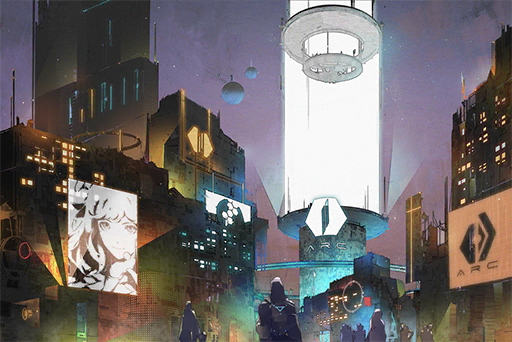
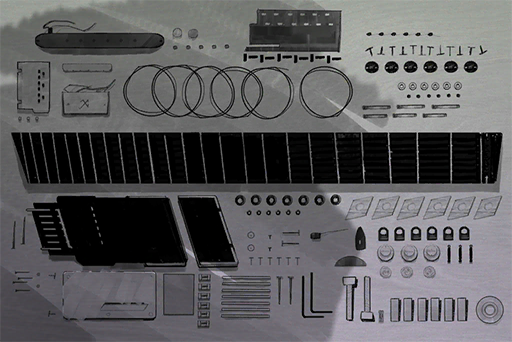
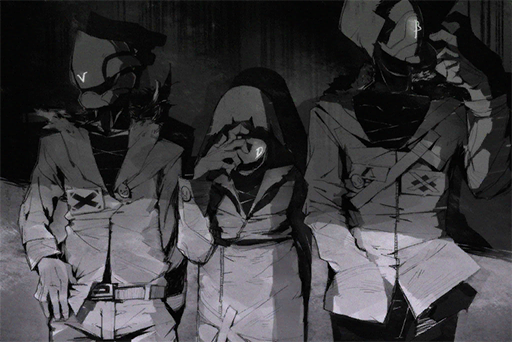
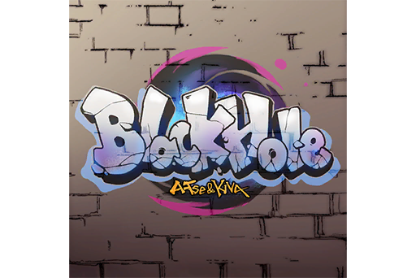
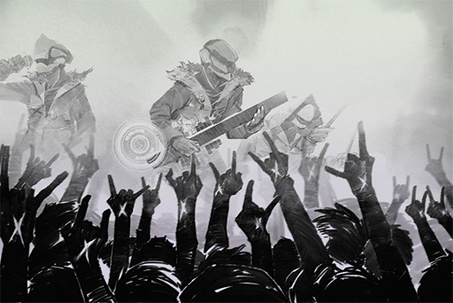
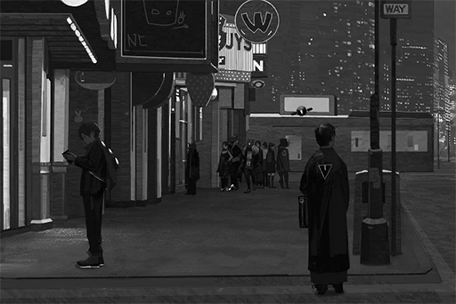

# Xenon iM Posts
## List of Posts
- [iM Post #001](#im-post-001)
- [iM Post #002](#im-post-002)
- [iM Post #003](#im-post-003)
- [iM Post #004](#im-post-004)
- [iM Post #005](#im-post-005)
- [iM Post #006](#im-post-006)
- [iM Post #007](#im-post-007)
- [iM Post #008](#im-post-008)
- [iM Post #009](#im-post-009)
- [iM Post #010](#im-post-010)
- [iM Post #011](#im-post-011)
- [iM Post #012](#im-post-012)
- [iM Post #013](#im-post-013)
- [iM Post #014](#im-post-014)
- [iM Post #015](#im-post-015)
- [iM Post #016](#im-post-016)

## iM Post #001

[Back to Top](#list-of-posts) | [Next Log](#im-post-002)

### Returning to the skies.
**Xenon**  
Was originally planning to stay on the surface for only half a year, but the IT at the Node Administration Bureau needs more help, so I had to stay for several more months before finally getting everything on track.

All in all, finally returned to a more comfortable working environment. Although I will miss my physical workshop, this does give me more time with the band.

### Replies
**NEKO#ΦωΦ**  
No longer able to visit Xenon? NEKO will miss Xenon a lot WAAAA (╥ω╥)

**Xenon**  
...Please don't remind me of the carnage in my workshop after every single visit from you.

**Xenon**  
I'll find a new space in cyTus to put all the equipment. We can use that from now on.

**EvilForce**  
Just showing off the fact that you get cute girls visiting your workshop, BOOOO!!!!

**CyberLord**  
Good looks do get you everything...

**TreeNoAlice**  
Must be nice to be able to look outside the A.R.C. while you work. The view should be great

**Xenon**  
I can't see the outside from my office, but I do go to the observation deck during break.

**Shibawu**  
Congrats on leaving the abyss of misery \\x/\\x/\\x/\\x/

**JOE**  
Come visit my shop when you're free

**Xenon**  
Of course, although I only order milk when I'm there

**noneXenon**  
More music from Xenon, yeah. GL on the job! \\x/

[Back to Top](#list-of-posts) | [Next Log](#im-post-002)

## iM Post #002

[Last Log](#im-post-001) | [Back to Top](#list-of-posts) | [Next Log](#im-post-003)

### Requirements
|   Char.    |Lv.|Lv. Locked?|
|------------|:-:|:---------:|
|**NEKO#ΦωΦ**| 3 |    No     |

### Preparing broadcast for new song.
**Xenon**  
Finally have more time to write new songs and organize the next performance. Been getting a lot more inspirations after returning to A.R.C.

This is a collab project with **@NEKO\#ΦωΦ**. Song title "Return" to celebrate my return to the skies. Hope everyone likes it.

### Replies
**NEKO#ΦωΦ**  
Ehhh!? If I knew this song was this important  
NEKO would have spent more time fine\-tuning it (Φ艸Φ)

**Xenon**  
It's ok, I think you did a great job on your parts.

**Xenon**  
A bummer that we didn't have chance to record a Solo with the optic guitar; been wanting to test its sound.

**Bit_Inex**  
OOHHHH yeah! Awesome song! \\x/

**Fu7ureW0rld**  
This combo feels so weird hahaha

**NEKO#ΦωΦ**  
What does that mean\~(ΦДΦ)

**w_Rosabel_w**  
The synthesizer in the beginning is very "NEKO" ! XDD

**JOE**  
Another collab with a cute girl...man, good looks get you everything

**D33M0**  
YEAH BOIIIIIIIIII!!!

**noneXenon**  
GODLIKE!

**CyberLord**  
SOLO is awesome!!

**lenba**  
\\Return/

[Last Log](#im-post-001) | [Back to Top](#list-of-posts) | [Next Log](#im-post-003)

## iM Post #003

[Last Log](#im-post-002) | [Back to Top](#list-of-posts) | [Next Log](#im-post-004)

### Requirements
| Char.  |Lv.|Lv. Locked?|
|--------|:-:|:---------:|
|**PAFF**| 7 |    No     |

### Unlocked Charts
|    Song     |Char.|Diff.|Lv.|
|-------------|:---:|:---:|:-:|
|**Body Talk**|PAFF |Chaos|12 |

### \[Repost\] Popular singer PAFF harassed by hardcore fan at event. Agency criticizes such behavior
**Xenon**  
> PAFF's agent Helena: "We appreciate the passionate support from fans. However, we would also like everyone to control themselves and not harm PAFF."

Personally, I really like PAFF, but even I won't go creating a commotion like this.

### Replies
**Bit_Inex**  
I was there live, it was a huge mess XD

**Pumpkinforest**  
That guy doesn't look like a fan to me. Maybe it's mental problems; he seems to mistake PAFF for someone he knows

**Xenon**  
Though Node08 is pretty safe, but stuff like this still happens.  
Though I've seen more maniacs at my performances.

**w_Rosabel_w**  
The no.1 maniac in your performances is definitely **@NEKO\#ΦωΦ**. Last time, she poured drinks all over Robohead, LMFAO

**NEKO#ΦωΦ**  
That was an accident!  
Also "Node08 is pretty safe", really? A few days ago, NEKO was knocked down by a mad fan looking for a signature!!    
All you do is care about PAFF! NEKO is sad.･ﾟ･(つдΦ)･ﾟ･

**Xenon**  
I was worried if she was injured.

**TreeNoAlice**  
Both of you are too famous seems like you run into crap like this everyday XDD

**EvilForce**  
If you want to prevent this just don't show your face at all, like ROBO and Xenon lol

**noneXenon**  
I want to see X without the mask!!

**NEKO#ΦωΦ**  
NEKO has seen it! Hohohoho (Φ艸Φ)

**Wrinkleheart**  
EHHHHH REALLY!!!!

**CyberLord**  
Want Photo! PM

**Fu7ureW0rld**  
PM

**Axroid_Sona**  
PM.

[Last Log](#im-post-002) | [Back to Top](#list-of-posts) | [Next Log](#im-post-004)

## iM Post #004

[Last Log](#im-post-003) | [Back to Top](#list-of-posts) | [Next Log](#im-post-005)

### Requirements
|   Char.    |Lv.|Lv. Locked?|
|------------|:-:|:---------:|
|**NEKO#ΦωΦ**| 8 |    No     |

### About Æsir\-FEST.
**Xenon**  
Everyone remembers Æsir\-FEST from half a year ago right?  
There have been many different theories on the internet, so I'm here to tell what I remember:

I was also connected to the cyTus background system that day. I was monitoring the huge flow of server data (hence I was not on stage). Afterwards, the entire backstage and site blacked out. 

I recall that **@PAFF\-Official** and **@ROBO\_Head** were invited as guests that day. 

Since I was working and was not paying attention to the performances, I want to ask: did the blackout occur before or after they took stage?
### Replies
**ROBO_Head**  
Analysis: No Æsir\-FEST footage in memory cells. ：(   
Record: File \- Æsir\-FEST\_Live\_Set.nwav   
Views on that day: 1

**Irisa0938**  
**@ROBO\_Head** Too hard to understand. How come there is a viewcount when there is no performance?

**ROBO_Head**  
Analysis: File corrupted. ：(   
Recovery progress......15%

**Gearz_Igo**  
I don't remember PAFF taking the stage that day either

**CyberLord**  
Didn't the blackout happen at the very start?

**NEKO#ΦωΦ**  
Wasn't simple case of **@Æsir** standing everyone up? (ΦωΦ)

**Xenon**  
You were not there, stop making things more complicated OK?

**NEKO#ΦωΦ**  
WAAAAA Xenon is mad\~\~. ･ﾟ･(つдΦ)･ﾟ･

**D33M0**  
Good ol' NEKO lololol

**noneXenon**  
I remembered that it was super dark after the blackout, like do blackouts usually go completely pitch black??

**Pumpkinforest**  
Æsir did take the stage right? I somehow have an impression that he played a song despite there being no lights

**Fu7ureW0rld**  
BS how do you play song when there's no power??

**Wrinkleheart**  
How come what I remembered was that the entire event was just canceled?

**Axroid_Sona**  
Node03: Just according to Keikaku!

[Last Log](#im-post-003) | [Back to Top](#list-of-posts) | [Next Log](#im-post-005)

## iM Post #005

[Last Log](#im-post-004) | [Back to Top](#list-of-posts) | [Next Log](#im-post-006)

### Requirements
| Char.  |Lv.|Lv. Locked?|
|--------|:-:|:---------:|
|**PAFF**| 9 |    No     |

### \[Ticket Request\] One in physical area A for 7th PAFFCON.
**Xenon**  
Since I was so busy with work I missed the first chance to snap up a ticket. If you know anyone that has an extra ticket please contact me. Thanks.
### Replies
**Axroid_Sona**  
I only have a ticket for virtual area A, is that OK? Get a bit sick every time I attend a virtual concert since Æsir\-FEST, so would like to sell my virtual ticket

**Xenon**  
If I still can't get anything until next week I'll buy your virtual ticket. Still prefer hearing it in person. The organizer this time, PA, is not exactly good at adjusting virtual sound field. Had a bad experience last time... thanks anyway.

**noneXenon**  
I only have one for area C

**Xenon**  
Area C's location is terrible, so not an option right now. Thank you.

**NEKO#ΦωΦ**  
EHH shocked Xenon wants to go to PAFF's concert don't go. If you have a holiday, come and have fun with NEKO PLZ!! (ΦˋдˊΦ)

**Xenon**  
I just like her voice, that's it. What's your problem with her?

**Gearz_Igo**  
NEKO seems to know PAFF??

**Rob_Oto**  
Can't be right? Like they are from completely different circles

**Bit_Inex**  
Almighty **@ROBO\_Head** give us an answer lol

**ROBO_Head**  
Record: NEKO\#ΦωΦ came in contact with PAFF when she still at Monophonic Entertainment. ：l

**Wrinkleheart**  
OMG an actual answer! Almighty indeed!

**NEKO#ΦωΦ**  
NEKO said it before, don't want to repeat! I just don't like her!! (ΦˋдˊΦ)

**NEKO#ΦωΦ**  
NEKO will have a physical event as well and you all have to come (ΦˋдˊΦ)

**Xenon**  
I had a Jam session on your stream just a while ago. You threw our practice right out the window and went completely off track.

**NEKO#ΦωΦ**  
Teehee (

**Xenon**  
"Teehee" my ass.

**NEKO#ΦωΦ**  
Then I'll collab with **@ROBO\_Head** next time! (ΦωΦ)

**ROBO_Head**  
NEKO\#ΦωΦ's mixtape logic this Unit can't analyze.：l

[Last Log](#im-post-004) | [Back to Top](#list-of-posts) | [Next Log](#im-post-006)

## iM Post #006

[Last Log](#im-post-005) | [Back to Top](#list-of-posts) | [Next Log](#im-post-007)

### Requirements
| Char.  |Lv.|Lv. Locked?|
|--------|:-:|:---------:|
|**PAFF**|13 |    No     |

### About Xenon and this iM account.
**Xenon**  
It's been three years since I started creating content under the name Xenon. Most people probably followed this personal account because of the music. 

The reason I didn't use the official account for promotion is simple; because I just want to share music with you guys. Not for fame or money.

If the music I write in my spare time, be it happy, angry or touching music, can resonate with some people, that will be the biggest comfort in my life. 

Quite a few of you may know that I work at A.R.C. as an IT, but I would like to keep this account free from my work stuff. This place is just for music.
### Replies
**JOE**  
Isn't having milk in my shop your biggest comfort in life?

**Xenon**  
What's wrong with ordering milk at a bar?

**noneXenon**  
Loved Xenon's music GL on your job \\x/

**lenba**  
Loved you guys' songs, been listening since Cystal PuNK so sad that it's now gone QQ

**JOE**  
Jasus there are still people who know that band? XD

**nnwgi**  
**@JOE** of course! You guys inspired millions of student bands when you were still there!!

**JOE**  
Hey we are still here live and kicking lolol

**TreeNoAlice**  
JOE and Xenon's duo\-Solo was amazing, never seen a band that can live up to that.

**Gearz_Igo**  
Indeed! Never though Bass can keep up with Xenon's guitar!

**JOE**  
All past glory. I'm too old for this now haha

**Bit_Inex**  
Xenon doesn't seem to like talking about the ex\-band QwQ

**Xenon**  
Don't actively avoid it, just felt like it was too long ago.

**Xenon**  
Maybe it's because the Bassist is too gross for me to keep playing.

**JOE**  
...I'm here you know

**w_Rosabel_w**  
XDDDDDD

**Pumpkinforest**  
Xenon I love you!!!

**xxScarlexx**  
\\x/ \\x/ \\x/ \\x/

[Last Log](#im-post-005) | [Back to Top](#list-of-posts) | [Next Log](#im-post-007)

## iM Post #007

[Last Log](#im-post-006) | [Back to Top](#list-of-posts) | [Next Log](#im-post-008)

### Requirements
| Char.  |Lv.|Lv. Locked?|
|--------|:-:|:---------:|
|**PAFF**|15 |    No     |

### About the optic guitar.
**Xenon**  
Some people may have seen my performance using the optic guitar. That's only a prototype, what do you guys think about the sound?

The purpose of this post is to inform you guys that a modified version is almost complete. Should survive the recording of an entire album. 

I fixed the problem of the UI crashing after just 10 minutes of play. The sound quality is enhanced by electromagnetic resonance since this guitar doesn't have a body. Can directly control overtones of over 24kHz so the sound is less stressful for the ears. It can simulate body and strings made from different materials as well 

All in all, look forward to seeing this baby in my next performance.

### Replies
**Xenon**  
Oh BTW, some people keep telling me to mass produce this for sale. But I don't have plans for that so give up.

**JOE**  
Why you're gonna make a huge fortune if you do

**Gearz_Igo**  
Mass produce +1

**noneXenon**  
It's finally heeeerrreee!!!! \\x/\\x/\\x/\\x/

**Fu7ureW0rld**  
I'm E\-X\-C\-I\-T\-E\-DDDD!!! \\x/

**Wrinkleheart**  
The sound quality is amazing! Regular guitars just can't produce sounds like that XD

**Seaflash**  
The pride of Node08! \\x/

**NEKO#ΦωΦ**  
NEKO want to play with it as well!!! (ΦˋдˊΦ)

**Xenon**  
...Return the Bass to me first will ya? You are not practicing at all.

**NEKO#ΦωΦ**  
I am!!! It's just there're too many new games recently!!.  
･ﾟ･(つдΦ)･ﾟ･

**JOE**  
**@Xenon** you lend someone MY BASS...?

**NEKO#ΦωΦ**  
Oh so it's uncle JOE's! Then NEKO will return it to you next time I visit your shop! (Φ∀Φ)σ

**JOE**  
Don't call me "uncle"!!

**D33M0**  
OMG this thread is hilarious ROFL

**w_Rosabel_w**  
NEKO is here so much that I sense something fishy XDDD

**Pumpkinforest**  
Can it produce an even cooler sound than the last one!?

**Bit_Inex**  
Is JOE still playing Bass? \\x/

**TreeNoAlice**  
JOE close that JOEZ Cafe and make a comeback!

**Shibawu**  
\\x/\\x/\\x/\\x/\\x/

[Last Log](#im-post-006) | [Back to Top](#list-of-posts) | [Next Log](#im-post-008)

## iM Post #008

[Last Log](#im-post-007) | [Back to Top](#list-of-posts) | [Next Log](#im-post-009)

### Requirements
|   Char.    |Lv.|Lv. Locked?|
|------------|:-:|:---------:|
|**NEKO#ΦωΦ**|17 |    No     |

### My band members.
**Xenon**  
Topic looks like something right out of a middle school essay. Whatever, today I would like to introduce my band members:

**Lead Singer \- Xenon \- V  
Guitar \- Xenon (myself)  
Bass \- Xenon \- B  
Drums \- Xenon \- D**

All Codenames. TBH I wrote this post because I was surprised a lot of people didn't know the fact that:
  
Members of Xenon, with the exception of myself, are all robots made by me. They perform based on their programming. There are no actual band members.
  
I apologize if you had wild imaginations about the members' personalities.

### Replies
**Shibawu**  
Already knew that!

**JOE**  
NERD! Can the robots match my skills?

**Xenon**  
Yes.

**D33M0**  
Roasted lol

**foreheadless**  
! Shocking Truth !

**Whysosurprise**  
EHHHHHH WTH !?!?!?!?!XDDDD

**Fu7ureW0rld**  
So there really are people who didn't know this LMFAO

**Pixely99**  
Wait a sec, they move too much like real people! I did not realize that!

**Bit_Inex**  
So robots can't have personalities? lol

**TreeNoAlice**  
Yeah you can give them personalities just like **@ROBO\_Head**

**ROBO_Head**  
This Unit does not have actual personality. ：l

**Queenof08**  
No wonder you're always MC!!!

**EvilForce**  
If you think about it, it's pretty basic technology lol

**Rob_Oto**  
It's not that hard to tell that they're robots \\x/

**MatsuyamaC**  
I was wondering how can the main singer do so many different voices!?

**noneXenon**  
OLD NEWS \\x/

**Axroid_Sona**  
One man does it all!!

**w_Rosabel_w**  
I...I can't accept it! I really liked the lead singer!!

**Gearz_Igo**  
You made the other members stand out too much!!! lol

[Last Log](#im-post-007) | [Back to Top](#list-of-posts) | [Next Log](#im-post-009)

## iM Post #009

[Last Log](#im-post-008) | [Back to Top](#list-of-posts) | [Next Log](#im-post-010)

### Requirements
|   Char.    |Lv.|Lv. Locked?|
|------------|:-:|:---------:|
|**NEKO#ΦωΦ**|19 |    No     |

### Pray for PAFF.
**Xenon**  
Although I've heard that PAFF was not feeling well, collapsing during the Encore song is serious business. 

I hope she will be alright. Really want to stay on the surface, but need to return to the A.R.C. for work. 


  
**\#PrayForPAFF**
### Replies
**pufluv**  
On the first live performance of Gravity too!  
**\#PrayForPAFF**

**Xenon**  
Yeah, but right now we should care about PAFF's health.

**CeLiA**  
PAFF was saved by the A.R.C. a few years ago right? She will be fine!  
**\#PrayForPAFF**

**noneXenon**  
**@pufluv** that song was performed on Æsir\-FEST already.

**TreeNoAlice**  
Wish her the best of luck. would miss her singing  
**\#PrayForPAFF**

**CyberLord**  
Apparently many audience members in the virtual area also fainted when PAFF collapsed

**Xenon**  
Heard about it, currently under investigation. I'll talk more in your shop.

**ArupakaKUN**  
**\#PrayForPAFF**

**Pumpkinforest**  
PAFF get well soon! QAQ  
**\#PrayForPAFF**

**Jiwa77**  
Want to see **@ROBO\_Head** pray as well. ：D

**ROBO_Head**  
Record: Reported discomfort from virtual music platform increase by 77% from certain time period. ：l

**Jiwa77**  
EHHH! I just want to see Ropohead hashtag, instead we got some dark secrets!?

**Fu7ureW0rld**  
You're kidding right?

**NEKO#ΦωΦ**  
Eh?? Scary!! NEKO also streams music a lot, it seems really unsafe recently?? (つдΦ)つ

**Gearz_Igo**  
Robohead also talks about urban legends?

**Axroid_Sona**  
Wow, is it some kind of virtual internet virus or a hacker?

**Xenon**  
Not enough clues now, but if I know anything I will make sure to tell everyone. I promise that as both an A.R.C. IT and a PAFF fan.

**NEKO#ΦωΦ**  
Sounds reliable but both identities sound so gross... (Φ  ωΦ)

**Shibawu**  
**@NEKO\#ΦωΦ** What gross!? Protecting your life U Know !! XDD

[Last Log](#im-post-008) | [Back to Top](#list-of-posts) | [Next Log](#im-post-010)

## iM Post #010

[Last Log](#im-post-009) | [Back to Top](#list-of-posts) | [Next Log](#im-post-011)

### Requirements
|    Char.    |Lv.|Lv. Locked?|
|-------------|:-:|:---------:|
|**ROBO_Head**|22 |    No     |

### Teaser for new song "Black Hole".
**Xenon**  
Dream realized, finally get to collab with **@ROBO\_Head**. ROBO's composing is simply out of this world.   
For the first reveal, it will be a small Live at cyTus virtual space. Those who subscribed will get a notification.

### Replies
**ROBO_Head**  
Hint: That day this Unit will be in status of: unable to connect. ：(

**Xenon**  
**@ROBO\_Head** Still fixing Æsir\-FEST's data? You've been at it for too long.

**ROBO_Head**  
Use of "Too long" negative.   
Damage to this level this Unit top 5% in recovery speed among users of this model of memory cell. ：l

**Queenof08**  
Ehhh! Really want to see ROBO perform live with Xenon! QQ  
Whatever, still look forward to the reveal of the new song!

**NEKO#ΦωΦ**  
\\RX/ \\RX/ \\RX/ \\(ΦωΦ ≡ ΦωΦ)/ \\RX/ \\RX/ \\RX/

**Axroid_Sona**  
Ahh that sucks. Every time ROBO performs in a virtual space it's ultra sparkling, to a point where it's almost seizure inducing! XD

**Jiwa77**  
Seizures LOL

**ArupakaKUN**  
On a side note, I was wondering is **@ROBO\_Head** a real person or a robot? Because he seems way too smart for a robot!

**ROBO_Head**  
This Unit is a robot. : )

**Bit_Inex**  
You'll always get the same answer from him ROFL

**Pixely99**  
OMG I need to set 10 alarms that day!

**CyberLord**  
Subscribed, thank god!! \\x/\\x/\\x/

**Gearz_Igo**  
Here comes the optic guitar XDD

**noneXenon**  
Awaiting!! \\x/\\x/

**Pumpkinforest**  
Immediate subscribe\~

**Fu7ureW0rld**  
YAAASSSSSSS!!! \\x/\\x/\\x/\\x/\\x/

[Last Log](#im-post-009) | [Back to Top](#list-of-posts) | [Next Log](#im-post-011)

## iM Post #011

[Last Log](#im-post-010) | [Back to Top](#list-of-posts) | [Next Log](#im-post-012)

### Requirements
| Char.  |Lv.|Lv. Locked?|
|--------|:-:|:---------:|
|**PAFF**|22 |    No     |

### Virtual space performance is very successful. 
**Xenon**  
Thank you to everyone who connected to the Live yesterday.   
Although the optic guitar went nuts due to connection, making it hard to control, the performance overall is a great success.   
Since this is a subscribers\-only performance, there wasn't too much promotion beforehand.   
Those who didn't see it live don't have to worry. The performance has a holo\-recording. It will be recreated on major platforms for everyone to see in a few days.  
It feels great to be able to share music with everybody in my spare time. See you guys next time. ：)

### Replies
**Bit_Inex**  
\\x/ \\x/ \\x/ \\x/ \\x/ \\x/

**JOE**  
Damn you didn't miss a single note in your Solo. Was looking forward to seeing you mess up haha

**Xenon**  
That part took some tedious practice, made it way too hard.

**Wrinkleheart**  
you stole **@ROBO\_Head**'s emoticon lololol

**ROBO_Head**  
This Unit analyze emoticon to be imitation. ：l

**Xenon**  
You're seeing things. ：l

**xxScarlexx**  
\\x/ \\x/ \\x/ \\x/

**noneXenon**  
The performance was fantastic! Xenon is awesome! \\x/

**NEKO#ΦωΦ**  
EHHHHHHH!!! WHHYYY!??? NEKO is also a subscriber!!! Why didn't you invite MEEEEEE??? (ˊΦдΦˋ)

**Xenon**  
...You said you were streaming yesterday.

**NEKO#ΦωΦ**  
That's in the afternoonnnnnggghhhhh!!!!  (╬ΦдΦ)

**JOE**  
Haha, seriously you two go get married will ya

**Xenon**  
Dumbass.

**TreeNoAlice**  
Hey that's mean!!

**JOE**  
**@Xenon** What's up? Not quite the same attitude when you are in the shop, eh?

**Xenon**  
...Shut Up.

**Pumpkinforest**  
The optic guitar sounds so COOOLL!!! Record more new songs with it

**Axroid_Sona**  
S\*\*\* didn't make it, really want to go!!  
Have to wait for the recreation QAQ

**Fu7ureW0rld**  
Want to go +1 QQ

**lenba**  
The new song is really good!!!

[Last Log](#im-post-010) | [Back to Top](#list-of-posts) | [Next Log](#im-post-012)

## iM Post #012

[Last Log](#im-post-011) | [Back to Top](#list-of-posts) | [Next Log](#im-post-013)

### Requirements
|    Char.    |Lv.|Lv. Locked?|
|-------------|:-:|:---------:|
|**PAFF**     |29 |    No     |
|**ROBO_Head**|29 |    No     |

### Please Calm Down.
**Xenon**  
Even though posting stuff that is not music here is against my original intention when I first created this account, things have been getting out of hand lately, to the point where I feel like an explanation is necessary.

Regarding the recent string of internet incidents and the memory and physical harm caused to users by Æsir\-FEST, I understand everyone's anxiety and panic right now. However, I'm not exactly in a more comfortable position than you guys.

I'm also very worried about PAFF; plus I'm also one of the people whose memory was affected. Not to mention that my friend NEKO is also restricted and is currently under the admins' investigation. It's impossible for me to brush off these incidents like they're nothing serious.

However, before the truth is clear, I will not disclose incomplete information on the internet. I would also like everyone to not casually believe random information that comes from unreliable sources. 

You've all heard my supervisor talk on the news. A.R.C. will be wholeheartedly supporting the admins in the investigation of these incidents. I myself have agreed to offer everything I can to help out as well. 

Due to the non\-disclosure agreement, this is as much as I can say on iM. 

Both technology and the internet are, in essence, things created to give humans a better life. However, if they are abused for the wrong purposes, they can become a double\-edged sword.

The purpose of this post is not to appease everyone, but in the hopes that at least the people around me can have more reasonable opinions when it comes to treating the victims of these incidents. We don't want them to suffer any secondary injuries because of the internet. 

Also please stop tagging this account.
### Replies
**TreeNoAlice**  
Xenon you're such a great guy. Fight!

**xxScarlexx**  
\\x/ \\x/ \\x/ \\x/

**Gearz_Igo**  
Buncha idiots tagging for no reason, super annoying

**noneXenon**  
Good work Xenon QQ

**Gogossip**  
Friends? Not just that right ( ͡° ͜ʖ ͡°)

**Nyd_Ans**  
Umm, it somehow gives off a feeling that he's trying to dodge responsibilities. Shouldn't ARC give us a proper explanation?

**Seaflash**  
Dude, are you stupid? Xenon's just an employee, he can't do squat about that

**Fu7ureW0rld**  
Music is innocent! \\x/

**AngryMan**  
Calm? If I'm not calm I would have broken into the admins' offices and beat the living hell out of those little b\*\*\*\*\*!

**SuperKY**  
Heard rumors of Xenon being a two\-timer, is that true?

**KiwaHu**  
More and more dumb comments, pls ban them

**Wrinkleheart**  
Agreed, like is it that hard to read the mood?

**RyanRii**  
So many people making random guesses without proper knowledge, so dumb

**Quest_ION**  
So you have "proper knowledge"?? LOL

**KiwaHu**  
Didn't he just say don't blabber on the net before the truth is revealed? Do you need me to spell it out word for word?

**Pinevalley**  
Bunch of useless hacks, completely forgetting the fact that this is the very person that allowed them to use the virtual internet safely for all these years. Now there's A problem then all of a sudden he's "the bad guy"

**Axroid_Sona**  
Good point

**Pixely99**  
Agreed

**Queenof08**  
I've seen those people who have been harassing Xenon, god they are annoying. I've reported every single one I saw yet there's still more!!

**lenba**  
Xenon is practically a saint compared to them

**FindingCat**  
What can I do, I'm so worried about NEKO...

**PAFFxNEKO**  
I hope that they are both fine!!  
**\#PrayForPAFF**  
**\#GoodLuckNEKO**

**NnNn**  
Someone send help. It's only been days, but the lack of NEKO streams are killing me...

[Last Log](#im-post-011) | [Back to Top](#list-of-posts) | [Next Log](#im-post-013)

## iM Post #013

[Last Log](#im-post-012) | [Back to Top](#list-of-posts) | [Next Log](#im-post-014)

### Requirements
|    Char.    |Lv.|Lv. Locked?|
|-------------|:-:|:---------:|
|**ROBO_Head**|33 |    No     |

### Some things must be stated clearly
**Xenon**  
Didn't think that I would be so busy that I wouldn't have time to post on iM, and that every time I post it's about things that I find very irritating.

I believe everyone has more or less seen the cover story of this issue's 08 Daily, some reports about my friends and me. 

For the record, I must declare that the motivation behind this report to be very, very questionable. If its purpose is to only provide a description of an event, then the absurd amount of misinformation mixed into the report is unforgivable. It has seriously affected the public image of my friends and me and has invaded the privacy of our lives.

First of all, NEKO's release is a legal procedure based entirely on the independent judgment of the law enforcement department. There is no way myself or even my company could influence their judgment by so\-called " relationships". The reporter attempted to direct the case to a presumption in which NEKO was guilty and was only able to escape legal procedures because of her influences. I find this false accusation to be very offensive and thoroughly uncomfortable. 

Second, my personal relationship situation is not what was made up in the report. Regarding the two females who were present on\-site that day, we are merely good friends right now. 

I hope that some media outlets can be aware of the quality of their reports and follow basic journalism ethics. This type of rumor\-mongering should not be allowed in the future.
### Replies
**TreeNoAlice**  
I'm with you!! I was super p\*\*\*ed as well when I read that article; it's a load of BS

**xxScarlexx**  
I believe Xenon is not someone who would do something like that

**Gearz_Igo**  
Do you want to sue them?? I know a lawyer who specializes in dealing with cases like this

**noneXenon**  
\\x/ \\x/ \\x/ \\x/ I got your back \\x/ \\x/ \\x/ \\x/

**Gogossip**  
Probably indecent sexual relationships? There were witnesses of you dating and spending the night outside

**Axroid_Sona**  
Dude, watch your mouth. You better have proof before you say something like that or you're gonna get sued

**Brock3tt**  
You can't say that ARC's internet security department and the LED are completely unrelated organizations though  
There's a ton of cases out there where the two collaborated

**Nyd_Ans**  
Is there finally a crack in Xenon's facade LOLOL

**AngryMan**  
Chink in the armor XD

**SuperKY**  
If you look at Xenon's posts from another angle you'll notice that there's something seriously wrong about this guy

**KiwaHu**  
If you can't read then would you kindly f\*\*\* off pls

**Wrinkleheart**  
More and more retarded comments. Shouldn't you ban them

**RyanRii**  
It's pointless\~  
If you ban them, they say you're hiding something  
If you don't ban them, they just keep ignoring the post and spilling BS

**Quest_ION**  
Xenon we are here to support you \\x/

**AntiNEKO**  
You're quite the man though, getting together with two uber\-popular goddesses

**Pinevalley**  
He came out to issue a proper statement  
yet still a buncha idiots commenting nonsense

**Doubty**  
So what? Issuing a statement doesn't mean he did nothing wrong. Criminals issue statements all the time; doesn't mean a thing if they're still guilty

**Pixely99**  
Wow you're comparing gossip/fake news to criminal statements  
Did you s\*\*\* out your logic the last time you took a dump?

**Arya_Poke**  
There's plenty out there who would pretend they saw nothing when their idols did something wrong

**FindingCat**  
Should we boycott these terrible reports（￣へ￣）

[Last Log](#im-post-012) | [Back to Top](#list-of-posts) | [Next Log](#im-post-014)

## iM Post #014

[Last Log](#im-post-013) | [Back to Top](#list-of-posts) | [Next Log](#im-post-015)

### Requirements
|   Char.    |Lv.|Lv. Locked?|
|------------|:-:|:---------:|
|**NEKO#ΦωΦ**|38 |    No     |

### Listen, all of you
**Xenon**  
Right now, pointless protest and/or sabotage will only bring trouble on yourselves. Surrounding Mono HQ is a nonsensical and dumb idea in the first place. 

As you know, someone already got injured. You people really think that resorting to violence and being the loudest voice in the crowd will justify your actions? All this blind emotion will only make you look like a bunch of uncivilized monkeys. 

Think carefully about what you want to achieve before actually making a move. Or else, it would be too late to regret your decisions.
### Replies
**UltraKY**  
Yeah, yeah right. You're so awesome and so correct  
You’re just mad cause your dear girlfriend got hurt, aren’t you  
**\#MonoWillPay**

**xxScarlexx**  
An angry Xenon is still so cool \\x/\\x/\\x/

**noneXenon**  
I think it’s ok to express your opinions, but it is definitely wrong to injured others, not to mention it's someone innocent

**TreeNoAlice**  
Good work Xenon Orz

**SuperKY**  
If it's not Cherry who got hurt today, will you still give a f\*\*\*  
**\#MonoWillPay**

**Arya_Poke**  
Shut up you two\-timer   
**\#MonoWillPay**

**AngryMan**  
Feels like I'm getting stupider reading some of the comments. Block them?

**Gogossip**  
Nothing wrong screwing over a shady s\*\*\*hole company like Mono  
**\#MonoWillPay**  
**\#MonoWillPay**  
**\#MonoWillPay**

**noneXenon**  
Xenon's trying to offer some helpful advice, ended up attracting a whole bunch of haters @@

**Wrinkleheart**  
I find those who resort to violence utterly detestable  
They are making everyone on\-site look horrible, even the reasonable fans who just want a proper answer

**Pinevalley**  
Nah, reasonable fans don't exist anymore. Even if they do, they are the extreme minority imo

**NathaN**  
I was watching my friend streaming  
He said that the crowd on\-site is mixed with many different people, some definitely not just "fans"

**RamenBot**  
F\*\*\*! Plenty of folks don't know WTF is up yet still went there to cause trouble  
Bunch of f\*\*\*\*\* idiots

**Quest_ION**  
Xenon, are really not going to block those hater comments...

**4nonymous**  
Mr. Xenon, I started following you after the recent NEKO news (To see how much of a POS you are of course)  
Before you criticize others, shouldn't you take a good look in the mirror first?

**GymGai**  
Heard you're played multiple instruments during your band days, no wonder you're this good at playing two girls   
**\#MonoWillPay**

**AntiNEKO**  
Music doesn't make you bad, it just makes you a hypocrite

**lenba**  
If you just want to be a hater behind the screen then please shut the f\*\*\* up

**TunaLee**  
You shouldn’t take retards who trust info from stupid gossip magazines seriously

**AntiXenon**  
**\#MonoWillPay**  
**\#XenonWillShutUp**

[Last Log](#im-post-013) | [Back to Top](#list-of-posts) | [Next Log](#im-post-015)

## iM Post #015

[Last Log](#im-post-014) | [Back to Top](#list-of-posts) | [Next Log](#im-post-016)

### Requirements
|   Char.    |Lv.|Lv. Locked?|
|------------|:-:|:---------:|
|**NEKO#ΦωΦ**|49 |    No     |

### It felt like forever since I last picked up the guitar.
**Xenon**  
Visited my long\-forgotten workshop to take a quick breather between jobs, only to discover that a  thick layer of dust had gathered on the equipment. The strings on the optic guitar were all rusty as well.   
This personal account has always existed for the sole purpose of sharing music. However, recently, I've just been tangled up in too many baffling incidents and had to deal with way too many nonsensical people. All that has caused music to be pushed to the sidelines for quite some time now. The originally simple motivation has also been covered in dust, similar to the guitar.  
This situation might still continue for a while. To the people who have been supporting and looking forward to my music, I can only apologize from the bottom of my heart...

A special promotional shoutout here for **@ROBO\_Head** and his upcoming event   
\[ROBO\_Radio\_LIVE\]  
Seeing so many friends in the music industry participate in this event does make me a bit envious, since I couldn't join them. Unfortunately, I just couldn't find the time to prepare a performance. What a shame.  
Still, a sincere thank you for the invitation.   
Wish the event a great success.

### Replies
**xxScarlexx**  
Is it because of all the incidents regarding cyTus a while back? The connection quality these days seems to have a lot of issues as well  
Uninvited trouble one after another... Thanks for the Hard work, X

**11IIll11**  
Ah, is it because everyone now knows you're a two\-timing Piece of S\*\*\*?. You don't seem to be sorry about it either, worthless hack

**Quest_ION**  
Your comment shows the level of your intelligence and it seems to be somewhere around "bottom of the barrel"  
Good work Xenon; will look forward to your new songs

**NEKO#ΦωΦ**  
Hey, I came up with a great idea! NEKO will write the songs for you! You on board for that \~(\*Φ∀Φ)  
The《Return》we previously wrote together is REALLY amazing (\*Φ∀Φ)

**ROBO_Head**  
Analysis:《Black Hole》active streams in cyTus Lobby 17% higher than《Return》  
Looking forward to the next collaboration with **@Xenon** ：)

**NEKO#ΦωΦ**  
I don't need this kind of comparison!!!  \\(Φˋ口ˊΦ)/

**Xenon**  
**@ROBO\_Head** I will finish up the troublesome work I currently have as soon as possible. If you have any new ideas, send them my way.  I sure can use some composing to take a break from work.

**NEKO#ΦωΦ**  
EHHHHH What do you mean by this!? Why did you only reply to Ropohead and not NEKO!? (Φˋ皿ˊΦ)

**AntiMetal**  
All this useless fluff,  just who the heck are you dating now? 08 Daily would love to hear the truth from you Mr. X

**CeeJay**  
Why would so many people lower their standards to the level of paparazzi nonsense... All in all, reported

**JOEZ Cafe**  
Stay happy, my man. If you have time, come to the shop and relax

**Xenon**  
Thanks. I will if I have the time.

[Last Log](#im-post-014) | [Back to Top](#list-of-posts) | [Next Log](#im-post-016)

## iM Post #016

[Last Log](#im-post-015) | [Back to Top](#list-of-posts)

### Requirements
|    Char.    |Lv.|Lv. Locked?|
|-------------|:-:|:---------:|
|**PAFF**     |55 |    Yes    |
|**NEKO#ΦωΦ** |55 |    Yes    |
|**ROBO_Head**|55 |    Yes    |
|**Ivy**      |25 |    Yes    |

### 　　　　　　　　　　
**Xenon**  

[Last Log](#im-post-015) | [Back to Top](#list-of-posts)

