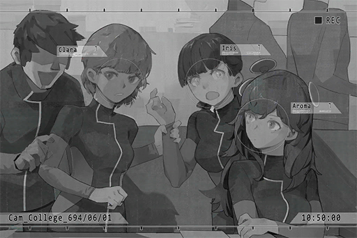

# Cam_Academy_694_08_01
## Requirements
|Character|Level|
|---------|:---:|
|**Aroma**|  2  |

## Log Content
*\[Class Bell\]*

**Clara** 
Aroma... Congratulations on your discharge from the hospital! Are you feeling alright?

**Aroma** 
... Thank you. I'm feeling fine.

**Clara** 
We've all heard about it from sis Helena. Everyone here will try their best to help you recover your memory. Do you remember anything about me and the things here?

**Aroma** 
... No...

**Clara** 
... Is that so... 
No worries. I'll reintroduce myself then. I'm Clara, the class representative of J\-1. If you have any questions, feel free to ask me.

**Classmate A** 
You really don't remember anything...? You two were really close friends.

**Aroma** 
Yes... I'm sorry.

**Clara** 
You don't have to apologize... We can build a new friendship starting today! If we're being honest, the person that's real\~ close to you is right there\~ Iris, why don't you come and greet Aroma?

**Iris** 
......

**Classmate A** 
Ah, she ran away.

**Classmate B** 
She said that if Aroma doesn't recognize her, she might just collapse on the spot.

**Clara** 
Nah, isn't that a bit overreacting? My grandmother used to have light dementia as well. She recovered after our relatives started spending more time with her. I'll go get her.

**Classmate A** 
What kind of terrible metaphor is that...? Then I guess I'll go first! Aroma, do you remember me? I'm Thomas; we were dating each other before!

**Aroma** 
Eh?

**Classmate B** 
Hey! Stopping spewing nonsense. Aroma, don't listen to him. I'm your real boyfri...

**Clara** 
Shut your pie holes! Seriously, why are you guys so immature!

**Iris** 
Waah! You don't have to drag me here...

**Clara** 
What are you talking about? You're Aroma's best friend! If you're not here, what's the point? Maybe seeing you can help her remember something.

**Iris** 
......

**Clara** 
This is Iris. She was your closest friend. Anything comes to mind?

**Aroma** 
Iris... Iris... 
Iris... Baker...?

**Iris** 
EH!? Do you remember me!?

**Aroma** 
... Ummm...

**Classmate A** 
How is it!? Is there anything else you remember!?

**Clara** 
......

**Aroma** 
... I'm sorry. All I can remember is your last name...

**Iris** 
... *\*Cries\**!

**Classmate B** 
Why are you crying? This is good news! Give us some time and we can help her remember everything for sure!

**Iris** 
I know... I know... *\*Cries\**...

**Clara** 
Jeez, stop crying... Can't tell if you're happy or sad with your face like this.

**Aroma** 
Iris... I will try my best.

**Iris** 
Yes... *\*Sobs\**...

**Classmate A** 
Oh, speaking of people that might collapse if forgotten, there's that guy as well... He should be able to help Aroma remember some things.

**Clara** 
......

**Classmate B** 
You have a point. He, Clara and Aroma; putting the Big 3 in our class together will certainly help... Ah, but he's probably smoking on the roof again.

**Iris** 
... Should I go get him?

**Classmate B** 
Forget about it. Didn't you see him in class? He is in a terrible mood today. He might beat you up if you go talk to him right now.

**Classmate A** 
Sighs\~ Seriously, what's the point of having good test scores if you're going to act like that? If he keeps doing this, his conduct score will be in the negatives very soon.

**Aroma** 
......?

**Clara** 
...... Ah, whatever\~ Forget it. Let's take Aroma on a tour of the Academy. Pretty sure that'll be more helpful than waiting here for that punk.

*[Signal Lost]*
