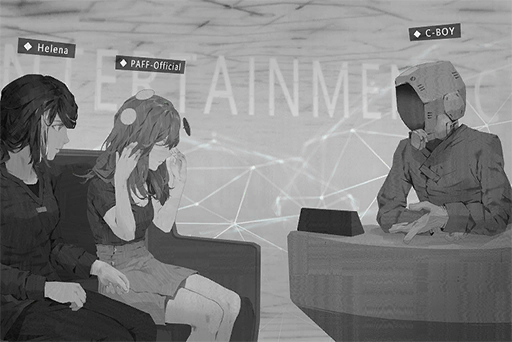

# Aroma_Interview_697_08_31
## Requirements
|Character|Level|
|---------|:---:|
|**Aroma**|  6  |

## Unlocked Charts
|       Song        |Character|Diff.|Level|
|-------------------|:-------:|:---:|:---:|
|**Bring the light**|  Aroma  |Chaos|  8  |

## Log Content
**Host** 
Good evening, ladies and gentlemen! Thank you for tuning in to《Entertainment C+》. I'm your host and DJ, C\-BOY! 
For today's show, we invited a guest that packs a serious punch. So, let's sit tight and hear a part of her latest single first!

*\[Music\]*

**[Narrator]** 
*PAFF, 19 years old, a superstar of "Monophonic Entertainment". In the two years since her debut, she took over the music industry by storm with her beautiful voice and her gorgeous features. Her two albums so far have captured two consecutive [Best selling female artist] titles in the "Platinum Awards".  However, despite her immense popularity, she rarely talks or interacts with fans in front of the camera, thus earning her the nickname "The Mysterious Diva". What kind of private persona will she show us today?  Let us find out more about PAFF.*

**Host** 
Before we welcome our guest, a quick reminder for our audiences: today's show will have a holographic live stream on iM as well~ Fellow Puffers, connect to cyTus ASAP to have a close encounter with PAFF! 
Now, it's time to welcome our guests: PAFF, and her agent Helena!

**Aroma** 
Hello everyone... I, I'm PAFF...

**Helena** 
Hello everyone, I'm Helena.

**Host** 
My my~ It's an honor of myself and everyone here at《Entertainment C+》to have an exclusive interview with PAFF.  
This should be PAFF's first time doing a live stream interview like this, right? It seems like she's quite nervous?

**Helena** 
It is indeed her first time. PAFF is not particularly used to a situation like this, so I'm here with her this time. Apologies for the intrusion.

**Host** 
Oh, please don't be. An interview of not only PAFF but also her dear sis Helena; our audience will certainly be very satisfied. 
Are you two blood\-related sisters like the rumors have said?

**Helena** 
Yes.

**Host** 
I see. You two sure do look alike. Sister, you're actually quite a beauty yourself too!

**Helena** 
Eh? Thank you...

**Host** 
Could it be that sister is a good singer too?

**Helena** 
No... I know nothing about singing. Let's put the focus on PAFF today.

**Host** 
Ah, certainly.

**Aroma** 
Inhale... Exhale...

**Host** 
......? 
PAFF has been massaging her temple for a while now. Is she not feeling well?

**Helena** 
PAFF, are you alright?

**Aroma** 
Eh? Ah, No... nothing. I'm fine. I was just easing my nervousness... I'm sorry...

**Host** 
Hoho? Is that a little magic trick to calm down the butterflies?

**Aroma** 
Yes... For some reason, doing this makes me less nervous...

**Host** 
Did your sister teach you that?

**Aroma** 
Eh? Umm... I think...so? I don't really know...

**Helena** 
......

**Host** 
Haha, PAFF is so adorable. The rumors said that you were the "ice queen" type. Looks like we've already busted that myth!

**Aroma** 
... Thank you.

**Host** 
Like I mentioned before, our interview today has a holographic live stream on iM. Since this is a rare chance to talk directly with PAFF, we've allowed Puffers to ask questions online. Of course, if directly talking to fans will make you too nervous, I can read the questions out loud for you. Is that ok with you?

**Aroma** 
Sure...

**Host** 
Here's the first question: "The electronic pet that PAFF has with her all the time, what's its name? I want to buy one myself!"

**Aroma** 
Ah... This is "Tuner\-san".

**Host** 
OH, I know this company. However, from what I recall, they've been working on this new product call the "MeowBot" or something... Is this "Tuner\-san" a discontinued product?

**Helena** 
Yes... I don't believe it's available for purchase now. PAFF bought this a long time ago when she's still a little girl.

**[Tuner-san]** 
*Discontinued! Discontinued!*

**Host** 
Wow~ What a shame. You can no longer own an electronic pet that is the same style as PAFF's. If you're one of the lucky fellas who bought one, perhaps you can now sell it at a very high price! 
Second question from the Puffers: "Really loved PAFF's singing voice! Has PAFF been such a good singer since she was little?"

**Aroma** 
Umm...

**Helena** 
She was already a very good singer when she was little. However, she also had to practice very hard to bring everybody her best singing.

**Host** 
I see, so a beautiful is not something that can be obtained without hard work. 
Before we continue with the fan questions, we would like PAFF to give us a live performance of a song in her latest EP!

**Aroma** 
Ah, okay...

*[Signal Lost]*
