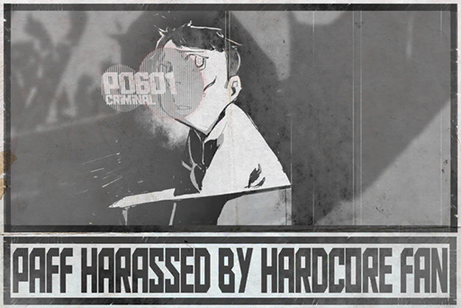

# Aroma_Mobile_702_03_27
## Requirements
|Character|Level|
|---------|:---:|
|**Aroma**| 13  |

## Unlocked Charts
|       Song        |Character|Diff.|Level|
|-------------------|:-------:|:---:|:---:|
|**Anzen Na Kusuri**|  Aroma  |Easy |  2  |

## Log Content
**Helena** 
Aroma, are you alright? Did you get injured?

**Aroma** 
No... I'm fine.

**Helena** 
I'll ask the company to improve the training of the bodyguards. How could they let someone get so close to you...

**[Entertainment News]** 
*The reporter is at Monophonic Entertainment's Performance Hall I right now. We can see that PAFF's autograph session has already concluded. PAFF herself has also been escorted to the car and has left the site.  
As with the audience member who caused a commotion earlier, he has also been taken away from the site by bodyguards and law enforcement agents.*

**Helena** 
The news is already reporting this...

**[Entertainment News]** 
*What is the identity of this reckless man? According to witnesses, this man is a crazed fan who couldn't control his passion. He forced his way through the wall of bodyguards to have an intimate contact with PAFF. This action triggered the other fans on\-site, thus leading to a lot of pushing and shoving. In the commotion, several people were also injured. As of now, the suspect has been taken away by the Administration Bureau for further investigation. 
This is a photo of the suspect (male) taken by one of our reporters.*

**Helena** 
... The hell? This isn't the photo of that man at all! Moreover, that guy came running out of the media area, not the fan area.

**Aroma** 
......

**Helena** 
The media company definitely had this information suppressed... 
Damnit.

**Aroma** 
... Forget about it. That person didn't do any harm to me anyway. He just said some things to me...

**Helena** 
... What did he tell you?

**Aroma** 
Hmm... I don't really remember. I was so scared at the time that I couldn't really understand what he is saying...

**Helena** 
That's not good. This is a serious security issue. I'm absolutely going to have a meeting with the folks in the security department...

**Aroma** 
It somehow feels like...

**Helena** 
Hmm?

**Aroma** 
No... nothing at all.

*[Signal Lost]*
