# Aroma OS Logs
## List of Logs
- [\[#001\] Cam\_Hospital\_693\_08\_16](#aos001)
- [\[#002\] Audio\_Hospital\_694\_03\_28](#aos002)
- [\[#003\] Audio\_ARC\_H\_694\_5\_20](#aos003)
- [\[#004\] Audio\_Academy\_694\_08\_01](#aos004)
- [\[#005\] Cam\_Academy\_694\_08\_01](#aos005)
- [\[#006\] Audio\_Academy\_694\_08\_12](#aos006)
- [\[#007\] Message\_Group\_694\_08\_15](#aos007)
- [\[#008\] Cam\_Academy\_694\_08\_19](#aos008)
- [\[#009\] Audio\_Noah\_695\_01\_21](#aos009)
- [\[#010\] Cam\_Noah\_695\_04\_20](#aos010)
- [\[#011\] Aroma\_Interview\_697\_08\_31](#aos011)
- [\[#012\] Audio\_Mono\_698\_12\_20](#aos012)
- [\[#013\] Cam\_Mono\_699\_01\_13](#aos013)
- [\[#014\] Audio\_Mono\_699\_02\_25](#aos014)
- [\[#015\] Audio\_Mono\_699\_05\_01](#aos015)
- [\[#016\] Mail\_Æsir\_701\_09\_18](#aos016)
- [\[#017\] Audio\_Mono\_701\_09\_20](#aos017)
- [\[#018\] cyTus\_Server08\_702\_01\_17](#aos018)
- [\[#019\] cyTus\_Server08\_702\_01\_18](#aos019)
- [\[#020\] Mail\_Chris\_702\_03\_13](#aos020)
- [\[#021\] Aroma\_Mobile\_702\_03\_27](#aos021)
- [\[#022\] Audio\_Noah\_702\_06\_25](#aos022)
- [\[#023\] cyTus\_Server08\_702\_07\_09](#aos023)
- [\[#024\] Audio\_Arena\_702\_07\_27](#aos024)
- [\[#025\] Audio\_ARC\_H\_702\_07\_28](#aos025)
- [\[#026\] \]́/̸̨͠\-͟͢E̸\_.(\$̢͢zq́k͞(̀҉̢Ţ\_694\_04\_25\_1](#aos026)
- [\[#027\] Audio\_Noah\_702\_08\_03](#aos027)
- [\[#028\] \]́/̸̨͠\-͟͢E̸\_.(\$̢͢zq́k͞(̀҉̢Ţ\_694\_04\_25\_2](#aos028)
- [\[#029\] Audio\_Noah\_702\_09\_01](#aos029)
- [\[#030\] \]́/̸̨͠\-͟͢E̸\_.(\$̢͢zq́k͞(̀҉̢Ţ\_694\_04\_25))\_3](#aos030)
- [\[#031\] Cam\_Noah\_702\_09\_07](#aos031)
- [\[#032\] Cam\_Noah\_693\_08\_09](#aos032)
- [\[#033\] Cam\_ARC\_H\_694\_05\_12](#aos033)
- [\[#034\] Audio\_Trans\_03\_702\_12\_26](#aos034)
- [\[#035\] Audio\_Noah\_702\_12\_29](#aos035)
- [\[#036\] Audio\_St03\_702\_12\_29](#aos036)
- [\[#037\] Audio\_JOE\_702\_12\_29](#aos037)

## \[#001\] Cam\_Hospital\_693\_08\_16
### Log Content
**Helena** 
...... Ugh......

**Noah** 
Helena! Are you awake!?

**Helena** 
Ugh......

**Noah** 
Doctor! Doctor!

**Bryan** 
Oh? Is she awake? Thank goodness!

**Helena** 
Where am I...?

**Bryan** 
This is 03 hospital. You've been unconscious for an entire day. How are you feeling?

**Helena** 
......! 
Aroma? Where is Aroma!?

**Noah** 
......

**Bryan** 
Rest assured, her conditions are stable. However, she has yet to regain consciousness...

**Helena** 
Where is she!? Take me to her, now!

**Noah** 
Hey, where are you going? You are not in the shape to run around...

**Bryan** 
It's fine. Both of you didn't suffer severe injuries. Your sister is in the ICU. I'll take you there.

_\[Signal Switches\]_

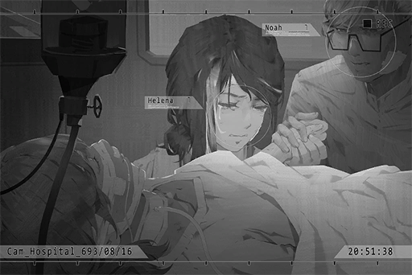

**Helena** 
...... No... this can't be... _\*Bawls\*_!!!!

**Noah** 
......

**Bryan** 
... Even though her injuries are severe, she is still young. With modern medicine and health technology, she will recover in no time.

**Noah** 
I see...

**Bryan** 
What I'm more concerned right now is the injuries to her head. This is a CT scan of her brain. These white dots are small pieces of debris. They happen to be lodged right between crucial nerves. It's practically a miracle that she's still alive now. However, this could also be the reason why she hasn't regain consciousness... We've tried our best to remove as much of the debris as we can, but a surgery on these spots will risk injury to her brain.

**Noah** 
... What about SWT?

**Bryan** 
Judging by that, you seem to be a professional in the field. That makes things easier to explain. 
We've already tried SWT; we even used MKII. However, the composition of the debris is way too complicated. If they break and seep into her blood vessels, there's the risk of blood poisoning...

**Noah** 
What about the Nano arm?

**Bryan** 
... Not even the Nano arm can reach the remaining pieces. There's also the possibility of damaging the nerves. We really can't do anything about...

**Noah** 
Is there really nothing left you can do!? You bunch of worthless fake doctors!!

_\[Equipment crashing\]_

**Helena** 
......Noah!?

**Bryan** 
Mr. Noah... P, please calm down! We really want to save the patient as well!

**Helena** 
Noah! Stop it!

**Noah** 
... I'm sorry... I...

**Bryan** 
......

**Helena** 
It... it's all my fault... If I didn't insist that I sit in the backseat, Aroma would've sat in her original seat. She wouldn't have...

**Noah** 
... If you sit in the front seat, you might've already died from the impact...

**Helena** 
It's still better than what's happening now!!

**Bryan** 
... I understand that both of you are very frustrated. However, please calm down for now. In the current situation, a reckless surgery will only put the patient in harm's way. At the very least, her vital signs are stable right now...

**Helena** 
OK...

**Bryan** 
We will think of other methods to save her. Please believe in us!

**Noah** 
... I'll leave it to you.

_\[Signal Lost\]_

[*(Click here to go back to the top)*](#toc)

## \[#002\] Audio\_Hospital\_694\_03\_28
### Log Content
_\[Door Opens\]_

**Helena** 
Aroma, I'm coming in? Your classmates are here to visit you today too.

**Iris** 
Aroma, are you feeling OK?

**Clara** 
Sis Helena, here's the academic schedule for this month. Please show the lecture to her later.

**Helena** 
Thank you.

**Daniel** 
... How's she going to watch it when she's still in a coma?

**Iris** 
……Daniel！

**Helena** 
She can, no need to worry. Her conditions are getting better by the day. Right now, she should be able to hear our conversation. Take a look at her right index finger. Can you hear us, Aroma?

**Classmates** 
..... Wow! It moved!

**Clara** 
Aroma! It's me, Clara!

**Iris** 
It moved again! She really can hear you!

**Helena** 
See?

**Daniel** 
Tch... HEY! Aroma! If you can hear us, then get your lazy a\*\* off the bed right now! How long do you plan to sleep like that, huh!?

**Iris** 
Hey! Daniel!

**Daniel** 
Hmph. I'm going home.

**Clara** 
Daniel! Wait up!

_\[Door Opens\]_

**Helena** 
......

**Iris** 
I'm sorry, sis Helena... He got chewed out by the lecturer at school today. He's not in a very good mood...

**Helena** 
It's fine... The hospital has scheduled an operation for her next month. They are going to use a new type of surgery to remove the debris pieces. After that, she will be able to go back to school and be with everyone again.

**Iris** 
Really!? That's great news!

_\[Door Opens\]_

**Noah** 
Helena... Ah! Iris, it's been a while. Are you here to visit Aroma?

**Iris** 
Yes, I'm here to bring her the academic schedule. Ah, is there something important you want to discuss with sis Helena? It's about time I take my leave too. I will not disturb you guys.

**Noah** 
No need to be so modest. Please come visit more often. Aroma will be very glad to see you. Oh right; about your two classmates, I just saw them run away in a hurry.

**Iris** 
Those two... I'll go catch them. Thank you!

_\[Door Opens\]_

_\[Signal Lost\]_

[*(Click here to go back to the top)*](#toc)

## \[#003\] Audio\_ARC\_H\_694\_5\_20
### Log Content
**Aroma** 
Hmm... ugh...

**Helena** 
What's wrong? Is it too difficult? Maybe you should take a break?

**Aroma** 
I'm fine... Let me finish this set...

**Helena** 
You've been in bed for nine months. It's natural that your muscles feel weak... Fortunately, you can recover from that with just rehabilitation.

**Aroma** 
Yes... Whew... Done...

**Helena** 
Here, have a drink.

**Aroma** 
Thank you...

**Helena** 
Do you remember this? It's the triple juice. This used to be your favorite beverage.

**Aroma** 
......

**Helena** 
You don't remember...? It's okay. The fact that you were able to wake up from your coma is already more than I could ask for... 
Ah, right! Here, your Tuner\-san.

_\[Tuner-san ON\]_

**Aroma** 
My...?

**[Tuner-san]** 
_Aroma, Good morning\~ Good morning\~_

**Helena** 
It's an electronic pet that has been with you since you were little. It contains so many past photos and videos of us. Let's take a look. Maybe it'll help you recover your memory. 
Tuner\-san, play Album 6860420

**[Tuner-san]** 
_Album 6860420, projection start._

_\[Song（Night Keepers - Bring the light）\]_

**[Aroma]** 
_\*Every time we hide   
Into shadow that can make us feel love  
Eat the sorrow drink a cup of fear\*_

**[Aroma]** 
_Sister! Happy birthday!_

**Aroma** 
This is...?

**Helena** 
You were celebrating my birthday with me. Remember? Aroma's singing really is beautiful...

**Aroma** 
... I don't remember anything... but this song sounds very familiar.

**[Aroma]** 
_Hahaha! Sis, you look so funny!_

**[Helena]** 
_How dare you throw a cake at me! You little... No running! I'll get you too! Hahaha!_

**Aroma** 
_\*Chuckles\*_... It looks like so much fun.

**Helena** 
You were one heck of a mischievous brat; who knew you would become so shy after you grow up.  
So, how was it? Did anything ring a bell?

**Aroma** 
... No... I'm sorry.

**Helena** 
......

**Aroma** 
Ah... B, But if the things I forgot are all happy memories like that one, I really hope I can remember them soon... sister.

**Helena** 
...... Aroma...... _\*Sobs\*_...

**Aroma** 
......

**Helena** 
Ah... no good, no good. How can I act so depressed like that? You're right; we need to help you recover your memory soon.  
Your body is recovering quite well physically. I can apply to the Academy for you to resume your studies. You have a lot of good friends in class. Staying together with them will certainly help with your conditions.

**Aroma** 
The Academy...

**Helena** 
Although you've been absent for more than one semester, as long as you pass the continuation exam, you can stay in your original class. Aroma was a top student; you can definitely do it!

**Aroma** 
Hmm...

**Noah** 
How did it go? Is she feeling alright?

**Helena** 
Ah, even though you've met him before; do you remember him? Your sister's husband Noah.

**Aroma** 
......

**Noah** 
......

**Aroma** 
No... I don't remember.

**Helena** 
Oh, how unfortunate, Mr. "forgotten savior".

**Noah** 
Haha... I don't mind. 
Aroma, I'm Noah; I'm your sister's husband. I'm also currently your attending physician. We live in the same apartment. If you have any problems, feel free to rely on me.

**Aroma** 
Got it... Thank you.

**Helena** 
Don't be fooled by his demeanor... He's the least reliable person in this household.

**Aroma** 
Haha......

**Noah** 
That's mean... Here, Aroma; put this on.

**Aroma** 
?

**Noah** 
These three suspending devices are stabilizers. You are required to wear them 24/7. Since you are still recovering from surgery, you may experience phantom nausea or dizziness, even hallucinations at times. These devices can help suppress those symptoms.

**Aroma** 
......

**Noah** 
Of course, these aftereffects are all temporary, just like your memory loss. The operation was a huge success and your brain is now in great condition. Therefore, these symptoms will gradually disappear as time goes on. Your memory will gradually recover as well. When that time comes, we can live happily together again, like how we used to.

**Aroma** 
Yes...

**Noah** 
These devices also have the function to monitor brainwaves. If they detect anything abnormal, they will instantly contact us via a built\-in application. If you feel any discomfort or encounter any other problem, just press this button. By doing so, we'll be able to know your situation and location right away.

**Helena** 
Aroma, if you have any problems, please tell us. We are all here by your side.

**Aroma** 
Understood. Thank you so much.

**Helena** 
......

**Noah** 
It's the least we can do.

_\[Signal Lost\]_

[*(Click here to go back to the top)*](#toc)

## \[#004\] Audio\_Academy\_694\_08\_01
### Requirements
|  Char.  |Lv.|Lv. Locked?|
|---------|:-:|:---------:|
|**Aroma**| 2 |    No     |

### Log Content
_\[Class Bell\]_

**[Lecture System]** 
_Date: 694/08/01 
It's time for the lecture. Fellow students, please take your seats. 
Report: Miss Aroma White has returned from her sick leave. Starting today, she will rejoin class J \- 1 for her academics. Please welcome her back with a round of applause._

_\[Applause\]_

**Aroma** 
......

**[Lecture System]** 
_Miss Aroma White, please take your seat._

**Aroma** 
......

**[Lecture System]** 
_Miss Aroma White, please take your seat._

**Aroma** 
......

**Clara** 
Aroma, your seat is over here...

**Aroma** 
... Thank you.

**Clara** 
N, no need to thank me...

**Iris** 
......

**[Lecture System]** 
_Begin lesson 1 for the day: Introduction to Technology and History, Chapter 5.  
N.A. 501, humans..._

**Classmate A** 
Woah... Did she really lose her memory...?

**Classmate B** 
What kind of BS is this?

**Classmate C** 
Pffft, is she serious?

**Classmate D** 
... Isn't she faking it?

_\[Kicks desk\]_

**Daniel** 
It's class time right now! What are you people mumbling about?

**Classmate B** 
Ooohhh... Mr. "Good student" is getting mad...

**Daniel** 
What did you just say!?

**[Lecture System]** 
_Warning: Mr. Daniel Evans. Please do not make noises that disrupt the lesson. If this continues, your conduct score will be deducted._

**Daniel** 
Tch...

_\[Signal Lost\]_

[*(Click here to go back to the top)*](#toc)

## \[#005\] Cam\_Academy\_694\_08\_01
### Requirements
|  Char.  |Lv.|Lv. Locked?|
|---------|:-:|:---------:|
|**Aroma**| 2 |    No     |

### Log Content
_\[Class Bell\]_

**Clara** 
Aroma... Congratulations on your discharge from the hospital! Are you feeling alright?

**Aroma** 
... Thank you. I'm feeling fine.

**Clara** 
We've all heard about it from sis Helena. Everyone here will try their best to help you recover your memory. Do you remember anything about me and the things here?

**Aroma** 
... No...

**Clara** 
... Is that so... 
No worries. I'll reintroduce myself then. I'm Clara, the class representative of J\-1. If you have any questions, feel free to ask me.

**Classmate A** 
You really don't remember anything...? You two were really close friends.

**Aroma** 
Yes... I'm sorry.

**Clara** 
You don't have to apologize... We can build a new friendship starting today! If we're being honest, the person that's real\~ close to you is right there\~ Iris, why don't you come and greet Aroma?

**Iris** 
......

**Classmate A** 
Ah, she ran away.

**Classmate B** 
She said that if Aroma doesn't recognize her, she might just collapse on the spot.

**Clara** 
Nah, isn't that a bit overreacting? My grandmother used to have light dementia as well. She recovered after our relatives started spending more time with her. I'll go get her.

**Classmate A** 
What kind of terrible metaphor is that...? Then I guess I'll go first! Aroma, do you remember me? I'm Thomas; we were dating each other before!

**Aroma** 
Eh?

**Classmate B** 
Hey! Stopping spewing nonsense. Aroma, don't listen to him. I'm your real boyfri...

**Clara** 
Shut your pie holes! Seriously, why are you guys so immature!

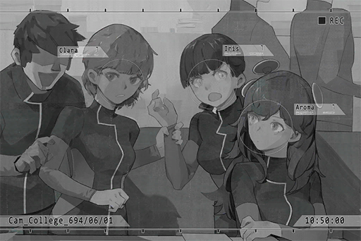

**Iris** 
Waah! You don't have to drag me here...

**Clara** 
What are you talking about? You're Aroma's best friend! If you're not here, what's the point? Maybe seeing you can help her remember something.

**Iris** 
......

**Clara** 
This is Iris. She was your closest friend. Anything comes to mind?

**Aroma** 
Iris... Iris... 
Iris... Baker...?

**Iris** 
EH!? Do you remember me!?

**Aroma** 
... Ummm...

**Classmate A** 
How is it!? Is there anything else you remember!?

**Clara** 
......

**Aroma** 
... I'm sorry. All I can remember is your last name...

**Iris** 
... _\*Cries\*_!

**Classmate B** 
Why are you crying? This is good news! Give us some time and we can help her remember everything for sure!

**Iris** 
I know... I know... _\*Cries\*_...

**Clara** 
Jeez, stop crying... Can't tell if you're happy or sad with your face like this.

**Aroma** 
Iris... I will try my best.

**Iris** 
Yes... _\*Sobs\*_...

**Classmate A** 
Oh, speaking of people that might collapse if forgotten, there's that guy as well... He should be able to help Aroma remember some things.

**Clara** 
......

**Classmate B** 
You have a point. He, Clara and Aroma; putting the Big 3 in our class together will certainly help... Ah, but he's probably smoking on the roof again.

**Iris** 
... Should I go get him?

**Classmate B** 
Forget about it. Didn't you see him in class? He is in a terrible mood today. He might beat you up if you go talk to him right now.

**Classmate A** 
Sighs\~ Seriously, what's the point of having good test scores if you're going to act like that? If he keeps doing this, his conduct score will be in the negatives very soon.

**Aroma** 
......?

**Clara** 
...... Ah, whatever\~ Forget it. Let's take Aroma on a tour of the Academy. Pretty sure that'll be more helpful than waiting here for that punk.

_\[Signal Lost\]_

[*(Click here to go back to the top)*](#toc)

## \[#006\] Audio\_Academy\_694\_08\_12
### Requirements
|  Char.  |Lv.|Lv. Locked?|
|---------|:-:|:---------:|
|**Aroma**| 3 |    No     |

### Log Content
**Clara** 
The heck... Where did she go? 
Ah, Thomas; have you seen Aroma? I need to give her the lecture materials from last semester.

**Classmate A** 
Hmm, I don't think I have. 
I think she stayed in the music classroom after our previous music lesson ended. Maybe you can take a look there?

**Clara** 
Got it. Thanks!

_\[Signal Switches\]_

_\[Door Opens\]_

_\[Music\]_

**Clara** 
Aroma...

**Aroma** 
Woah! You scared me...

**Clara** 
Ah, sorry\~ But your singing is amazing... It's been a while since I last heard you sing.

**Aroma** 
Thank you.

**Clara** 
Here, these are for you. Some extra materials from last semester as well as the visual aids for the lectures.

**Aroma** 
Thank you.

**Clara** 
Ah, but I guess you probably don't need them... You were supposed to be behind by almost a year, yet after you came back, your grades caught up with Daniel and me in like an instant.

**Aroma** 
That's not a big deal...

**Clara** 
By the way, what song was that?

**Aroma** 
... I don't know myself either. I just got this nostalgic feeling, and the words just sort of came out by themselves...

**Clara** 
Hoho, so you still remember quite a few things. Then I'm sure that your memory will also recover in no time as well!

**Aroma** 
Yes...

**Clara** 
On a side note... I didn't know that Aroma knows how to play the piano?

**Aroma** 
...... Eh? I, I don't know...

**Clara** 
I've never heard you play it before. That's awesome!

**Aroma** 
... Thank you.

**Clara** 
Aw, come on... Don't put on a long face all the time. I was serious when I said you were awesome. Your grades are good; your singing voice is beautiful; you are talented in other things too... Most importantly, you look so adorable and you have this flawless\~ skin\~ Seriously, did you type in some cheat code for life? You have to remember what an amazing person you are\~ Take this take this\~

**Aroma** 
Ahahah... Stop it, that tickles... 
Thank you... But...

**Clara** 
Hmm? What's the matter?

**Aroma** 
I don't know... I just feel like the people in class don't really like me...  
Before my accident... did something happen?

**Clara** 
Ah\~ That's... I say you should just ignore those people! I'm 99.99% sure that they are just jealous of you because you are simply too perfect! No need to worry!

**Aroma** 
I see...

**Clara** 
Let's go! Iris is waiting for us. We should eat lunch together!

**Aroma** 
Sure.

_\[Door Opens\]_

**Daniel** 
......

_\[Signal Lost\]_

[*(Click here to go back to the top)*](#toc)

## \[#007\] Message\_Group\_694\_08\_15
### Requirements
|  Char.  |Lv.|Lv. Locked?|
|---------|:-:|:---------:|
|**Aroma**| 3 |    No     |

### Log Content
**Anonymous Watermelon** 
Have you guys heard about this? Harry from class 2 confessed to Miss A again today 
_[Sent at 21:57 PM]_

**Anonymous Banana** 
Again? Didn't he get turned down before 
_[Sent at 21:57 PM]_

**Anonymous Apple** 
Well, he felt that since she forgot about everything, maybe he has another chance 
_[Sent at 21:57 PM]_

**Anonymous Grape** 
Can't believe that there are still people who think that memory loss thing is true 
_[Sent at 21:57 PM]_

**Anonymous Watermelon** 
Yeah, suffers memory loss yet still gets top scores in every subject, Bull f.... s... She got a full score on her continuation exam too. Isn't that absurd 
_[Sent at 21:58 PM]_

**Anonymous Pear** 
Told you that this is setting up for her idol career. Artists with some kind of \*tragicbackstory\* like this will bring it up whenever they are losing popularity 
_[Sent at 21:58 PM]_

**Anonymous Apple** 
Agreed. People don't care about the truth anyway. Good looks get you everything 
_[Sent at 21:58 PM]_

_[Anonymous Coconut has joined the message group]_ 

**Anonymous Banana** 
? Who's this 
_[Sent at 21:59 PM]_

**Anonymous Pear** 
Doesn't this message group only has people from our class? 
_[Sent at 21:59 PM]_

**Anonymous Watermelon** 
Nope. There are plenty of people who hate Miss A in other classes 
_[Sent at 21:59 PM]_

**Anonymous Grape** 
We're anonymous anyway. Doesn't matter who it is 
_[Sent at 21:59 PM]_

**Anonymous Coconut** 
I saw her playing the piano in the music classroom a few days ago. 
_[Sent at 22:00 PM]_

**Anonymous Watermelon** 
Wow, that's quite the news you have for your first message 
_[Sent at 22:00 PM]_

**Anonymous Apple** 
U serious? Not only does she cheat in tests but she plays the piano too? What is this witchcraft 
_[Sent at 22:00 PM]_

**Anonymous Banana** 
Did she really lose her memory? LOL 
_[Sent at 22:01 PM]_

**Anonymous Grape** 
Doesn't remember any names yet still remembers how to play the piano 
_[Sent at 22:01 PM]_

**Anonymous Watermelon** 
My guess is that those three plates on her head are also just for show 
_[Sent at 22:01 PM]_

**Anonymous Pear** 
Maybe she thinks it's \*fashionable\* LMFAO 
_[Sent at 22:01 PM]_

**Anonymous Coconut** 
She did file an application to the system. If not for that, it's against the rules to wear any accessory besides the uniform. 
_[Sent at 22:01 PM]_

**Anonymous Banana** 
Let's take it off and see what happens 
_[Sent at 22:01 PM]_

**Anonymous Pear** 
Anyone wants to join?? 
_[Sent at 22:02 PM]_

**Anonymous Grape** 
Why not 
_[Sent at 22:02 PM]_

**Anonymous Coconut** 
Quick advise; don't do anything too serious. A while ago, someone got deducted 20 points by the system when they pushed her to the ground. 
_[Sent at 22:02 PM]_

**Anonymous Watermelon** 
It wasn't even that hard of a push 
_[Sent at 22:02 PM]_

**Anonymous Apple** 
Miss A is an idol ya know, she's precious 
_[Sent at 22:02 PM]_

[*(Click here to go back to the top)*](#toc)

## \[#008\] Cam\_Academy\_694\_08\_19
### Requirements
|  Char.  |Lv.|Lv. Locked?|
|---------|:-:|:---------:|
|**Aroma**| 4 |    No     |

### Log Content
**Aroma** 
... Then you use fraction here, and you can get the correct answer.

**Iris** 
Ah! You're right. I expect no less from Aroma. You're as smart as always.

**Aroma** 
You don't have to go that far...

**Aroma** 
But... this does ring a bell... I used to teach you math like this before too.

**Iris** 
Really!? Yeah, you did. My math was terrible. I had to rely on Aroma all the time. 
I'm so happy; another thing that you remembered!

**Classmate C** 
Ho\~? Really? Then that's great. You're starting to remember things about Iris one at a time.

**Classmate D** 
Yet you didn't remember any\~ thing about me. I'm so sad\~ Or could you choose what you forget?

**Other classmates** 
Pffft... Hehe...

**Aroma** 
Ah... I...

**Iris** 
You guys... What are you doing?

**Classmate C** 
Nothing though? We want to be friends with Aroma too. You have a problem with that?

**Classmate D** 
Are you okay with that, Aroma? Are we qualified to keep being your friends? We used to be good friends too\~ Or do you only remember this dorky loser?

**Iris** 
......

**Classmate C** 
I've been wondering for a while now; what exactly are those three thingies on your head? Maybe they're the reason why you can't remember anything?

**Aroma** 
Ah... You can't take that!

**Classmate C** 
Hoho, they're surprisingly heavy. Can they float on my head as well? Lemme try... wow! They can!

**Classmate D** 
Nice! That's so cool! Let me give it a go!

**Iris** 
You guys! If you keep this up I'll call Clara here!

**Classmate C** 
Ooh, so you're calling the class rep. I'm so scared\~ or maybe she won't come cause she's the one that hates Aroma the most?

**Classmate D** 
Haha, that's true. Since all her crush sees is Aroma and not her.

**Iris** 
... S, stop spreading lies! Clara is not like that... Give Aroma back her things first!

**Classmate D** 
Yikes! What are you doing!? How dare you push me!

**Iris** 
Kyaaa!

**Classmate C** 
Woah... she fell down! Hey! Are you faking it so we get points deducted by the system? Guess you learned that trick from Aroma... 
Hmmmm... OUCH!?

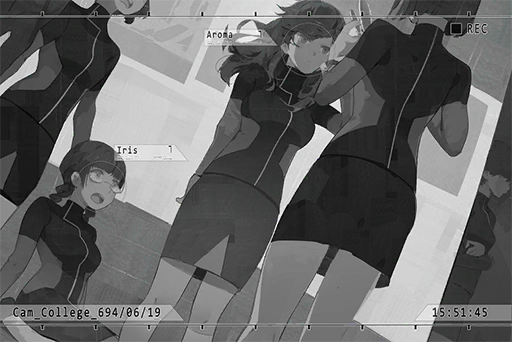

**Aroma** 
... Help her up.

**Classmate C** 
Ouch! That hurt! Let go of me... 
......!?

**Aroma** 
Help her up, then apologize to her, now.

**Classmate C** 
......

**Classmate D** 
......

**Other classmates** 
......

**Iris** 
Aroma...?

_\[Door Opens\]_

**Daniel** 
HEY! What the hell are you girls doing!? Give that back to her! What are you, grade schoolers!?

**Classmate C** 
Eh?.... Nothing... We're just joking with her.

**Classmate D** 
Ummm... Yeah, that's right. It's just a small joke. We want to see if joking around like this can help her regain her memory...

**Daniel** 
... I advise you to shut up and get the hell out of here before I go off on your a\*\*\*\*.

**Classmate C** 
Eek...... S, sorry!

_\[Door Opens\]_

**Daniel** 
Iris, are you alright? Here.

**Iris** 
Thank you...

**Daniel** 
... And you?

**Aroma** 
Ugh...

**Iris** 
Yikes! Aroma, you look really pale... We need to take her to the infirmary right away!

_\[Door Opens\]_

**Daniel** 
You girls go first. I'll be there in a minute.

**Daniel** 
......

**Daniel** 
... Enjoying the show, class rep?

**Clara** 
......

_\[Signal Lost\]_

[*(Click here to go back to the top)*](#toc)

## \[#009\] Audio\_Noah\_695\_01\_21
### Requirements
|  Char.  |Lv.|Lv. Locked?|
|---------|:-:|:---------:|
|**Aroma**| 5 |    No     |

### Unlocked Charts
|       Song        |Char.|Diff.|Lv.|
|-------------------|:---:|:---:|:-:|
|**Bring the light**|Aroma|Easy | 2 |

### Log Content
_\[Ringtone\]_

**[Chris]** 
_Hi\~ Good morning. Is Aroma there?_

**Helena** 
She is. Here, Aroma. It's for you.

**Aroma** 
... Hello.

**[Chris]** 
_Long time no see. How are you feeling? Is everything alright?_

**Aroma** 
I'm fine

**[Chris]** 
_It truly was an unfortunate disaster... Thank goodness that all the troublesome stuff is now over. It's about time we reinstate our contract too..._

**Helena** 
You're talking about her debut, right?

**[Chris]** 
_Yes, that. The good thing is that we disclosed the information right away. News about the car accident was not widespread. Of course, the hype has died down a bit during her year of absence. Our marketing department has come up with several proposals. I'll mail them to you later..._

**Helena** 
Before I read your proposals, I want to make one thing clear. Do not mention the car accident unless the situation absolutely calls for it. Focus on Aroma's actual talent first. That way, her public image will be a positive and healthy one.

**[Chris]** 
_Understood... Oh, and another thing. We have plans for her to resume training at Monophonic HQ sometime next week. She should be fine with that, right?_

**Helena** 
Before that, I want to confirm one thing. Regarding the recovery training lessons, the accident clause in the contract stated that the company will cover the entire cost. Is that correct?

**[Chris]** 
_... Yes, yes, exactly as you said. Man, you sure don't miss a beat, like ever..._

**Helena** 
Of course I don't.  
The medical team has given us the green light to start performing again... However, the one who has the final say is herself. Aroma, what do you think? Can you start training again?

**Aroma** 
......

**[Chris]** 
_...... Aroma?_

**Helena** 
......

**[Chris]** 
_Are there any other concerns? I can still alter my proposals to the higher\-ups..._

**Helena** 
Thanks, Chris. Aroma is fine with the arrangement. However, I would like you to put everything on hold for now. Act as if we are still considering. Don't rush to start the process right away.

**[Chris]** 
_You said don't rush... but the CEO has been constantly pressuring me to get going though? He seems to think that Aroma should make her debut as soon as possible..._

**Helena** 
I don't care. You'll have to find a way to deal with him. That's it for now.

**[Chris]** 
_No, wait a sec..._

_\[Call Ends\]_

**Helena** 
What's wrong...? Are you still worried about your body? I believe that continuing to pursue your previous dream should help treat your memory loss as well.

**Aroma** 
... Dream...?

**Helena** 
This was your previously your biggest goal. On the day of the accident, we were on our way to your debut event. Do you remember?

**Aroma** 
I don't remember... Becoming an idol... I can't grasp that idea. Feels kinda... scary...

**Helena** 
......

**Aroma** 
... I'm sorry... Can you let me think about it a little longer?

**Helena** 
Dumb child, no need to apologize... You don't have to force yourself to do this. Just do whatever you feel comfortable.

**Aroma** 
Thank you, sister.

_\[Signal Lost\]_

[*(Click here to go back to the top)*](#toc)

## \[#010\] Cam\_Noah\_695\_04\_20
### Requirements
|  Char.  |Lv.|Lv. Locked?|
|---------|:-:|:---------:|
|**Aroma**| 5 |    No     |

### Unlocked Charts
|       Song        |Char.|Diff.|Lv.|
|-------------------|:---:|:---:|:-:|
|**Bring the light**|Aroma|Hard | 5 |

### Log Content
_\[Door Opens\]_

**Helena** 
I'm back... Yikes... Why is it so dark? 
Aroma? Noah?

**Aroma, Noah** 
Happy birthday!

**[Tuner-san]** 
_Happy birthday! Happy birthday!_

**Helena** 
Eh? Awww... I told you that you don't have to celebrate my birthday.

**Noah** 
This is Aroma's idea.

**Helena** 
Aroma...?

**Aroma** 
... Yes. I feel like sister has been feeling a bit down recently. I hope this can cheer you up a bit...

**Helena** 
......

**Noah** 
Aroma even prepared a present for you. Come, sit here.

_\[Song（Night Keepers - Bring the light）\]_

**Aroma** 
\*Every time we hide   
Into shadow that can make us feel love  
Eat the sorrow drink a cup of fear\*

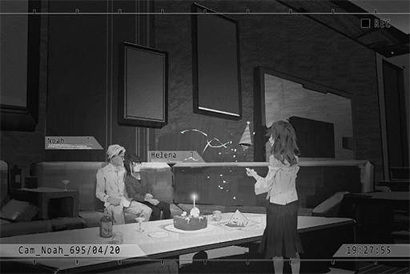

**Helena** 
It's been a while since I last heard you sing...

**Aroma** 
I've finished... Sister, I wish you a happy birthday.

**Helena** 
Thank you... _\*Sobs\*_...

**Noah** 
Come on; she prepared this to cheer you up. Why are you crying?

**Aroma** 
Umm... I know that my memory loss has made sister very sad. However, during this time, both sister and Noah have been so kind to me. I was so happy being together with you guys...

**Helena** 
Aroma...

**Aroma** 
Therefore, I'm going to reinstate my contract with Monophonic Entertainment.

**Noah, Helena** 
Eh?

**Noah** 
So you've made your decision?

**Aroma** 
Yes... These days, I've been viewing the recordings on Tuner\-san. I thought about it a lot... I still can't remember most things; however, if this is the old me... if this is the dream we were pursuing together, then I believe I should continue to realize it.

**Helena** 
... Are you sure about that? You were so against it before...

**Aroma** 
It's ok. Besides, when I'm singing... I truly feel relaxed, and happy too. I guess I must've really loved singing. Haha...

**Noah** 
I agree. By working towards a previous goal, that experience should help with the recovery of your memory as well.

**Aroma** 
Yes. Even though I don't remember anything from the past, I believe it's not too late to start creating more happy memories now... Therefore, I hope sister can cheer up and not feel depressed anymore. Is that ok...?

**Helena** 
Idiot... I cried because I was so happy.

**Noah** 
Then we have another thing worthy of celebration today. Let's light the candles and cut the cake!

**Aroma** 
Ah, I'll go get the utensils.

**Noah** 
I'll help too. Today, you can take a break because you're the star of the show!

**Helena** 
Haha... OK.

**Helena** 
......

**Helena** 
Thank you, Aroma...

_\[Signal Lost\]_

[*(Click here to go back to the top)*](#toc)

## \[#011\] Aroma\_Interview\_697\_08\_31
### Requirements
|  Char.  |Lv.|Lv. Locked?|
|---------|:-:|:---------:|
|**Aroma**| 6 |    No     |

### Unlocked Charts
|       Song        |Char.|Diff.|Lv.|
|-------------------|:---:|:---:|:-:|
|**Bring the light**|Aroma|Chaos| 8 |

### Log Content
**Host** 
Good evening, ladies and gentlemen! Thank you for tuning in to《Entertainment C+》. I'm your host and DJ, C\-BOY! 
For today's show, we invited a guest that packs a serious punch. So, let's sit tight and hear a part of her latest single first!

_\[Music\]_

**[Narrator]** 
_PAFF, 19 years old, a superstar of "Monophonic Entertainment". In the two years since her debut, she took over the music industry by storm with her beautiful voice and her gorgeous features. Her two albums so far have captured two consecutive \[Best selling female artist\] titles in the "Platinum Awards".  However, despite her immense popularity, she rarely talks or interacts with fans in front of the camera, thus earning her the nickname "The Mysterious Diva". What kind of private persona will she show us today?  Let us find out more about PAFF._

**Host** 
Before we welcome our guest, a quick reminder for our audiences: today's show will have a holographic live stream on iM as well\~ Fellow Puffers, connect to cyTus ASAP to have a close encounter with PAFF! 
Now, it's time to welcome our guests: PAFF, and her agent Helena!

**Aroma** 
Hello everyone... I, I'm PAFF...

**Helena** 
Hello everyone, I'm Helena.

**Host** 
My my\~ It's an honor of myself and everyone here at《Entertainment C+》to have an exclusive interview with PAFF.  
This should be PAFF's first time doing a live stream interview like this, right? It seems like she's quite nervous?

**Helena** 
It is indeed her first time. PAFF is not particularly used to a situation like this, so I'm here with her this time. Apologies for the intrusion.

**Host** 
Oh, please don't be. An interview of not only PAFF but also her dear sis Helena; our audience will certainly be very satisfied. 
Are you two blood\-related sisters like the rumors have said?

**Helena** 
Yes.

**Host** 
I see. You two sure do look alike. Sister, you're actually quite a beauty yourself too!

**Helena** 
Eh? Thank you...

**Host** 
Could it be that sister is a good singer too?

**Helena** 
No... I know nothing about singing. Let's put the focus on PAFF today.

**Host** 
Ah, certainly.

**Aroma** 
Inhale... Exhale...

**Host** 
......? 
PAFF has been massaging her temple for a while now. Is she not feeling well?

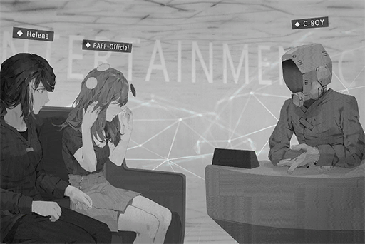

**Helena** 
PAFF, are you alright?

**Aroma** 
Eh? Ah, No... nothing. I'm fine. I was just easing my nervousness... I'm sorry...

**Host** 
Hoho? Is that a little magic trick to calm down the butterflies?

**Aroma** 
Yes... For some reason, doing this makes me less nervous...

**Host** 
Did your sister teach you that?

**Aroma** 
Eh? Umm... I think...so? I don't really know...

**Helena** 
......

**Host** 
Haha, PAFF is so adorable. The rumors said that you were the "ice queen" type. Looks like we've already busted that myth!

**Aroma** 
... Thank you.

**Host** 
Like I mentioned before, our interview today has a holographic live stream on iM. Since this is a rare chance to talk directly with PAFF, we've allowed Puffers to ask questions online. Of course, if directly talking to fans will make you too nervous, I can read the questions out loud for you. Is that ok with you?

**Aroma** 
Sure...

**Host** 
Here's the first question: "The electronic pet that PAFF has with her all the time, what's its name? I want to buy one myself!"

**Aroma** 
Ah... This is "Tuner\-san".

**Host** 
OH, I know this company. However, from what I recall, they've been working on this new product call the "MeowBot" or something... Is this "Tuner\-san" a discontinued product?

**Helena** 
Yes... I don't believe it's available for purchase now. PAFF bought this a long time ago when she's still a little girl.

**[Tuner-san]** 
_Discontinued! Discontinued!_

**Host** 
Wow\~ What a shame. You can no longer own an electronic pet that is the same style as PAFF's. If you're one of the lucky fellas who bought one, perhaps you can now sell it at a very high price! 
Second question from the Puffers: "Really loved PAFF's singing voice! Has PAFF been such a good singer since she was little?"

**Aroma** 
Umm...

**Helena** 
She was already a very good singer when she was little. However, she also had to practice very hard to bring everybody her best singing.

**Host** 
I see, so a beautiful is not something that can be obtained without hard work. 
Before we continue with the fan questions, we would like PAFF to give us a live performance of a song in her latest EP!

**Aroma** 
Ah, okay...

_\[Signal Lost\]_

[*(Click here to go back to the top)*](#toc)

## \[#012\] Audio\_Mono\_698\_12\_20
### Requirements
|  Char.  |Lv.|Lv. Locked?|
|---------|:-:|:---------:|
|**Aroma**| 7 |    No     |

### Unlocked Charts
|     Song      |Char.|Diff.|Lv.|
|---------------|:---:|:---:|:-:|
|**Make U Mine**|Aroma|Easy | 3 |

### Log Content
**Helena** 
Then that's it for today's meeting. We would like you to address the aforementioned notes. Thank you.

**[Event Organizer]** 
_Got it. We are all very excited about PAFF's amazing performance. Bye bye\~_

**Helena** 
Whew, finally done with that. Aroma, you must be hungry, right?

**Aroma** 
Yes, a little...

**Helena** 
Then let's go grab lunch.

**Chris** 
Ah, do you two have a minute?

**Helena** 
Just finished our meeting with SkyEkho and on our way to lunch. What's the matter?

**Chris** 
I discovered a very interesting rookie composer. She sent me a lot of her demos. I feel like if PAFF collaborated with her, the results will certainly be great!

**Helena** 
PAFF already has two to three arrangers that she works with regularly though?

**Chris** 
Ahhh, no, this one is VERY different. First of all, she is super cute. Like, she's a level of cute where she can make a debut right now. Check out her photo.

**Helena** 
Asakura Neko? What a weird name. 
Hmm... She is definitely cute. However, still no match for our PAFF, right?

**Aroma** 
Eh? Ummm...

**Chris** 
More importantly, her avant\-garde music! If you pair that with PAFF's singing, they are absolutely going to be the next big thing! These two together will create magnificent sparks of genius never seen before!  
Can you at least listen to her demo?

**Helena** 
We are on our way to lunch. We'll talk about it after we get back.

**Aroma** 
Umm... I want to hear it.

**Helena** 
Eh? Didn't you say you were hungry?

**Aroma** 
... I'm a little curious, about her work...

**Helena** 
... Alright.

_\[»»» Fast Forward»»»\]_

_\[Music\]_

**Chris** 
How was it? Amazing, isn't it?

**Helena** 
Hmm... I don't really understand this type of music... Aroma, what do you think?

**Aroma** 
I... quite like it. I kind of want to give it a try.

**Chris** 
Woah! See, even the usually uninterested PAFF is saying she wants to give it a try!

**Aroma** 
Eh? Was I like that...?

**Helena** 
Hmmm... PAFF's work for the past 2\~3 years are all covers and arrangements. Putting out a "singer\-songwriter" tag at this time will certainly help her increase her audience reach too.

**Chris** 
Right? PAFF, you want to try writing a song on your own, don't you?

**Aroma** 
Yes. I can play a little bit of piano, but I've never tried composing.

**Helena** 
......

**Chris** 
Great! Then I guess a decision is made. Let's try it with one song. If the results are promising, then we can consider making this a long\-term relationship!

**Helena** 
If we are talking about a collab effort, constant communication is a must, right? Aroma, are you ok with that?

**Aroma** 
Yes... If it's a girl then I should be... Also, I feel like I can be friends with this person.

**Chris** 
After PAFF made her debut, she seems to lack interaction with peers and friends. Letting her know a few more people will only benefit her.

**Helena** 
... Regardless, I still don't want to put too much stress on her.  
Aroma, leave most of the things to sis. I'll deal with them for you.

**Aroma** 
Understood.

_\[Signal Lost\]_

[*(Click here to go back to the top)*](#toc)

## \[#013\] Cam\_Mono\_699\_01\_13
### Requirements
|  Char.  |Lv.|Lv. Locked?|
|---------|:-:|:---------:|
|**Aroma**| 7 |    No     |

### Log Content
**NEKO#ΦωΦ** 
Ya\-hello\~ Chris! About that song you asked for the day before yesterday, NEKO has finished it. I sent it to you this morning. Did you get it?

**Chris** 
... NEKO? I did say I received it. 
Why did you come to the company all of a sudden? I'm quite busy today...

**NEKO#ΦωΦ** 
You thought NEKO made a trip here just to see you? Pffft, come on\~ NEKO is here to see PAFF!

**Chris** 
See PAFF!?

**NEKO#ΦωΦ** 
Isn't she recording today? NEKO wants to take a look.

**Chris** 
How did you know...?

**NEKO#ΦωΦ** 
It's written on the calendar of the main recording studio. It says that PAFF is recording NEKO's song today. Your reaction just confirmed it! 
Damnit, I'm jelly\~ NEKO can only use the small studio.

**Chris** 
Ah...

**NEKO#ΦωΦ** 
Since we started this collab, we've only communicated via mail. NEKO wants to talk with PAFF in person as well\~ Can't wait to see how cute she is... Ohoho, I'm starting to drool\~ Slurp!

**Chris** 
Umm...

**NEKO#ΦωΦ** 
They're almost done recording, right? Enough talking\~ NEKO's going inside. Bye\~

**Chris** 
Hey... hey, wait a minute!

_\[Signal Switches\]_

**Helena** 
Good work, Aroma. You're in top form today.

**Aroma** 
Yes, I really like this song by NEKO. I hope she will like the song I wrote for her too...

**Helena** 
Her personality is a bit tough for me to handle though. I don't understand teenage girls these days... It shows even in her emails. What's the point of all those "Nyan Nyan Nyan"s when we are discussing the composing style?

**Aroma** 
Haha... It's cute though.

**Helena** 
Crap, we're a bit behind for our next scheduled event. We better hurry!

**Bodyguard T** 
I'll go get the car.

**Helena** 
Please.

**Aroma** 
Thanks for the good work.

_\[»»» Fast Forward»»»\]_

**NEKO#ΦωΦ** 
What!? Let NEKO go through!

**Bodyguard G** 
Excuse me, please show us your visitor pass...

**NEKO#ΦωΦ** 
Big dumbo! NEKO has a keycard! I'm an employee!

**Aroma** 
......?

**Bodyguard G** 
Umm... Please wait here.

_\[Door Opens\]_

**Bodyguard G** 
Sister Helena, there's a girl outside who wants an interview, but she's not on the list...

**Helena** 
Eh? That's not part of today's schedule... 
Turn her down for me. We're seriously going to be late if the car doesn't come soon...

**Bodyguard G** 
Understood.

_\[Door Opens\]_

_\[»»» Fast Forward»»»\]_

**[Bodyguard T]** 
_Sister Helena, the car is ready. The traffic is a bit busy right now. We could be cutting it a bit too close..._

**Helena** 
Understood. 
Aroma, let's go.

**Aroma** 
OK.

_\[Door Opens\]_

**NEKO#ΦωΦ** 
AH! Liar! What do you mean she's not here? Unless I'm seeing things, that's PAFF right there! 
PAFF! Hello\~ HELLO!

**Aroma** 
Ah...

**Helena** 
So it's NEKO... that's awkward... 
However, we are really going to be late. PAFF, you get in the car first! I'll talk to her.

**Aroma** 
Eh? Just saying hi shouldn't take that long...

**Helena** 
No good. Arriving late is a major taboo in the business. The people in the next show are all seniors in the industry. You don't want to give the media gossip material, do you? Just go.

**Aroma** 
Alright...

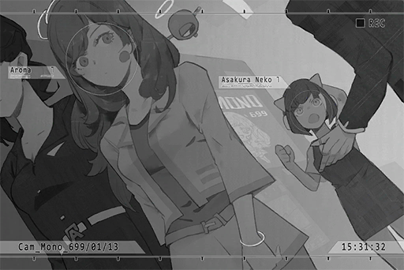

_\[Signal Switches\]_

**Helena** 
Hello, NEKO. The recording today went very smoothly. Thank you for the song you wrote.

**NEKO#ΦωΦ** 
Hello, sis Helena\~ Where's PAFF? NEKO is here today just for her! I even got stopped by this big furry Bear!

**Bodyguard G** 
... What did you say!?

**NEKO#ΦωΦ** 
Do you not know about it! The Bears from Stewrica! Lame! 
Eh, sis Helena, let NEKO and PAFF have some quick chit\-chat\~ It won't take too long!

**Helena** 
... Apologies, but she's in the car already... Maybe next time! 
I'll arrange a meeting for you two sometime later, is that ok? 
About the audio track for the recording, I'll have Chris play it to you.

**NEKO#ΦωΦ** 
Ehehehe? Why\~? Ok then... You have to make that arrangement though! Deal?

**Helena** 
Yes yes\~ It's a deal. Then I shall take my leave as well.

_\[Signal Lost\]_

[*(Click here to go back to the top)*](#toc)

## \[#014\] Audio\_Mono\_699\_02\_25
### Requirements
|  Char.  |Lv.|Lv. Locked?|
|---------|:-:|:---------:|
|**Aroma**| 8 |    No     |

### Unlocked Charts
|     Song      |Char.|Diff.|Lv.|
|---------------|:---:|:---:|:-:|
|**Make U Mine**|Aroma|Hard | 6 |

### Log Content
**Helena** 
Aroma, the elevator is here.

**Aroma** 
OK.

_\[Elevator Door Opens\]_

**Aroma** 
Woah, it's quite full...

**Helena** 
Can't help it. Let's squeeze in.

_\[Hurried Footsteps\]_

**Chris** 
W, wait, NEKO; y, you don't have to run so fast...

**NEKO#ΦωΦ** 
If we don't hurry we won't make the meeting on time! Eheh, excuse me, excuse me! NEKO is boarding too!

_\[Collision\]_

**Aroma** 
OW!

**NEKO#ΦωΦ** 
OWWW! That hurt...

**Bodyguard T** 
Miss PAFF, are you alright!

**Bodyguard G** 
What the hell!? You again! Move!

**NEKO#ΦωΦ** 
Yikes! What are you doing!? Let NEKO stand up first!

**Helena** 
Stop it. Check on PAFF first to make sure she's safe. 
Here, NEKO. Can you stand up?

**NEKO#ΦωΦ** 
... Um, thank you.

**Helena** 
Are you okay? Any injuries? It's very dangerous to run in the hallways...

**NEKO#ΦωΦ** 
No worries, all is well\~ NEKO falls down a lot, so I'm already used to it. Hehe\~

**Helena** 
I see. Good to see that you're fine.

**Aroma** 
I'm sorr...

**Passenger** 
Hey, are you people boarding or not?

**Bodyguard T** 
Ah, yes. Sorry about that! 
Miss PAFF, let's go inside first.

**NEKO#ΦωΦ** 
Ah, we're boarding as well...

_\[Elevator warning\]_

**[Elevator System]** 
_Warning: Weight limit exceeded. Please leave the elevator!_

**NEKO#ΦωΦ** 
... EH?

**Everyone else** 
......

**NEKO#ΦωΦ** 
Ehhhhh!? How come? Is this metal box telling NEKO that she's too fat? NEKO has been exercising really hard lately!

**Bodyguard G** 
Yeah, yeah, please get out. Stop wasting everyone else's time.

**NEKO#ΦωΦ** 
Yikes! You don't have to push...

**Aroma** 
Umm...

_\[Elevator door closes\]_

**NEKO#ΦωΦ** 
......

**Chris** 
Haha... let's take the next one.

**NEKO#ΦωΦ** 
ARGHHH!! I can't take it anymore!! What the heck is the deal with her!?

**Chris** 
！？

**NEKO#ΦωΦ** 
I mean PAFF! It's always sis Helena speaking for her! What is she, speech\-impaired!? She even told the two dumb bears to kick NEKO outside! 
You bumped into NEKO at least say sorry!

**Chris** 
Ummm... Weren't you the one who bumped into her...

**NEKO#ΦωΦ** 
Hmph!! We are still collaborating and writing songs together, yet I can't talk to her in person!? Who does she think she is! Idol my a\*\*\~ She's treating herself like some kind of queen! Arrogant bastard!

**Chris** 
Hey! Watch your words! PAFF is not that kind of person! She is working very hard on the song she wants you to arrange for her.

**NEKO#ΦωΦ** 
...... Hmph, if the song sucks, NEKO won't even bother!

**Chris** 
That's not up to you... Besides, you better pay more attention to your actions and words, especially on the internet. Those fans of yours always lose control and cause trouble for no apparent reason. They are starting to get out of hand for us\~ 
If this keeps going on, the company's image will be affected.

**NEKO#ΦωΦ** 
Yeah yeah! None of your business! Hmph!

**Chris** 
......

_\[Signal Lost\]_

[*(Click here to go back to the top)*](#toc)

## \[#015\] Audio\_Mono\_699\_05\_01
### Requirements
|  Char.  |Lv.|Lv. Locked?|
|---------|:-:|:---------:|
|**Aroma**| 8 |    No     |

### Log Content
**Helena** 
Good work. You can take a quick break now. Here, have some water.

**Aroma** 
Thank you. The new song is a bit hard to sing correctly... This is a song I made together with NEKO. I have to work harder...

**NEKO#ΦωΦ** 
What is the meaning of all this!?

**Chris** 
Now, now\~ You should calm down a bit first...

**Aroma** 
There seems to be an argument outside the recording studio...? Is everything fine?

**Helena** 
It probably has nothing to do with us.

**NEKO#ΦωΦ** 
Then find someone to explain this BS to me clearly!

**Aroma** 
... Is that NEKO's voice?

**Helena** 
I think I'll go take a look. You should finish practicing the remaining parts.

_\[Signal Switches\]_

**NEKO#ΦωΦ** 
I've had it with you people! Do you have any idea how many times this has happened!?

**Helena** 
NEKO? What's going on?

**NEKO#ΦωΦ** 
Ah, sis Helena! So this means that PAFF is in there too, right? Does she know anything about this?

**Helena** 
What are you talking about? Get a hold of yourself first. Sit down and tell me what happened.

**NEKO#ΦωΦ** 
Look at this! This is the packaging for PAFF's next album. NEKO's name is nowhere to be seen! NEKO composed more than 80% of the songs in it!

**Helena** 
Eh? Didn't you two work on this album together?

**NEKO#ΦωΦ** 
That's not the point. The main point is that NEKO's name straight up doesn't exist on the packaging! PAFF is even credited as the arranger! What the heck is this nonsense!?

**Helena** 
I'm not the one in charge of the album's copy... I'll help you understand the situation, is that ok with you?

**NEKO#ΦωΦ** 
Forget about it! I know sis Helena may have nothing to do with this. B\-U\-T! Chris! You knew about this, didn't you! This is not the first time this has happened!  
Previously, you guys took NEKO's arrangements without permission and used it for some random crap. This is not what the contract says!

**Chris** 
It's not like I can change anything. These are all decisions made by the higher\-ups... If we're talking the law, the copyright of any work produced using the company's equipment does belong to the company, regardless of the creator... 
Didn't I also remind you about the PR image issues caused by your actions online? The company has been hesitant about promoting you because of that. They're tough on me too...

**NEKO#ΦωΦ** 
... This and that are two completely different issues!? Regardless of my actions, NEKO still made those songs! How could you guys do that!? 
ARGHHH! I had enough with this garbage contract!

_\[Rips contract\]_

**Chris** 
HEY! What are you...

**Helena** 
......

**NEKO#ΦωΦ** 
NEKO will no longer do anything for a s\*\*\*hole company like yours! I will never be your ghost producer ever again! I look like a fool! 
I've already paid for the liquidated damages, so that's it! Goodbye!

_\[Slams door\]_

**Chris** 
... Oh dear lord...

**Aroma** 
Umm... It seems that the argument got pretty serious, so I came out to see what's going on...

**Chris** 
NEKO left after tearing up her contract... What are we going to do now?

**Aroma** 
Eh...? 
Is she ok....? I think I heard my name back then...

**Helena** 
Aroma, you don't have to know anything. It'll be alright.  
No need to worry. If anything happens, sister will handle it.

**Aroma** 
... Got it...

_\[Signal Lost\]_

[*(Click here to go back to the top)*](#toc)

## \[#016\] Mail\_Æsir\_701\_09\_18
### Requirements
|  Char.  |Lv.|Lv. Locked?|
|---------|:-:|:---------:|
|**Aroma**| 9 |    No     |

### Log Content
**Subj.**: Invitation 
**From**: Æsir 
**To**: PAFF-Official

Miss PAFF:

I am Æsir. On 702/01/18, I will be holding a mega music festival in cyTus titled "Æsir\-MUSIC FESTIVAL". 
I myself will perform on stage as well.

The schedule, remuneration, and event details are in the proposal.

Hope Miss PAFF can perform at this event. 
Awaiting your response.

\[Æsir\-MUSIC FESTIVAL Proposal\]

[*(Click here to go back to the top)*](#toc)

## \[#017\] Audio\_Mono\_701\_09\_20
### Requirements
|  Char.  |Lv.|Lv. Locked?|
|---------|:-:|:---------:|
|**Aroma**| 9 |    No     |

### Log Content
_\[Door Opens\]_

**Chris** 
Looks like everyone is here\~ Sorry about this, Aroma. I know you're busy, yet I still asked you to come.

**Aroma** 
It's nothing...

**Helena** 
The next schedule is in two hours. If we count traveling time, rehearsal and preparation, you only have 30 minutes. So hurry up. 
About the performance invitation from this Æsir guy...

**Chris** 
You're so strict... If I recall the correctly, the next schedule doesn't require a performance. All she needs to do is show up. A small delay won't hurt.

**Helena** 
Being late will damage her image and will harm future partnerships. This is the one core principle of PR. 
29 minutes.

**Chris** 
Ok, ok\~ 
Sis Helena, I bet you've already done your research on this "Legendary DJ".  
Am I right?

**Helena** 
I did so a long time ago. For any content creator that has the possibility of partnering with Aroma someday, I will try my best to collect information on them. That's how you expand your network. 
Of course, this is all under the premise that...

**Chris** 
Premise?

**Helena** 
That the company will not screw everything up and drive away precious assets.

**Chris** 
......

**Aroma** 
NEKO... Is she doing well after that? I want to collaborate with her again...

**Chris** 
Ha, hahaha... Cough, back to business. Regarding this Æsir, besides his music, we couldn't find any information about him on the internet.

**Helena** 
He hides his identity from the outside world. We don't even know whether he's male or female. However, judging from this proposal, he is definitely no newbie when it comes to organizing events.

**Chris** 
Indeed\~ This proposal is practically perfect; even the setup for the virtual space is very detailed. More importantly...

**Aroma** 
......?

**Chris** 
The remuneration. It's 10 percent higher than what the market price is. Hahaha!

**Aroma** 
......

**Helena** 
I've been wondering this since I saw the proposal. Our fees have never been publicized, right?

**Chris** 
Umm, no. In theory, the company will only inform those who approached us directly.  
I supposed he got the information from other organizers we've worked with in the past?

**Helena** 
If that's the case, that extra 10 percent is a part of his proposal. He is showing understanding of us, yet keeps the offer reasonable, all the while giving us bonus money as a sign of sincerity for his invitation. A cool\-headed and practical approach, I would say.  
...... However, I find the letter itself to be very odd.

**Chris** 
How so?

**Helena** 
Aroma is a very hot commodity right now. She receives new performance invitations every week. Most invitations are either very respectful, sometimes overly so, or use some kind of emotional connection to lure us into giving them more.

**Helena** 
On the other hand, this letter... it's brief and feels almost...wooden. It doesn't show his intentions at all, nor does it show passion for the event. However, it also has just enough emotion to make it not an automatic response. 
How should I put it...

**Aroma** 
Like he's trying to hide himself...

**Helena** 
Hm? Aroma, did you say something?

**Aroma** 
Ah, nothing...

**Chris** 
You do have a point. The company understands this as well\~ However, this proposal is pretty much perfect, be it planning or execution.  
If we also consider his share of voice online, Aroma's participation will bring her major benefits...

**Helena** 
You're right. That would be my decision too. Despite some concerns, I believe we can accept this invitation... Of course, I will be present at every rehearsal as well as the actual performance. I will also request the company to give us support of the highest standard.

**Chris** 
... When have you NOT asked for the highest standard?

**Helena** 
You got a problem with that? 
Aroma, what do you think? Want to go and meet this "legend"?

**Aroma** 
Yes... I want to sing a new song.

**Helena** 
No problem with that. The album that is estimated to release next year already has five DEMOs available. Which one do you want, Aroma? I'll contact the composer to speed up the process.

**Aroma** 
......

**Chris** 
Aroma, what's the matter? You've been looking outside the window all this time.

**Aroma** 
... Can I sing《Gravity》?

**Chris** 
Oh? Is there a particular reason?

**Aroma** 
I just feel like when I look down from a place this high, I get this feeling that I'm constantly falling... and find out that I'm in an unfamiliar place all of a sudden... 
Ah, I'm sorry. I don't know what I'm talking about either...

**Helena** 
... Understood. I'll take care of that. 
Chris, I'll take Aroma to her next schedule first. You organize the performance preparation plan for the next four months, as well as the virtual connection monitoring during the performance. Remember...

**Chris** 
Highest standard right? I know, I know\~

**Helena** 
Button up, slowpoke. If something goes wrong, I'm coming for you. Here, Aroma, let's go!

**Aroma** 
... OK.

_\[Signal Lost\]_

[*(Click here to go back to the top)*](#toc)

## \[#018\] cyTus\_Server08\_702\_01\_17
### Requirements
|  Char.  |Lv.|Lv. Locked?|
|---------|:-:|:---------:|
|**Aroma**|10 |    No     |

### Unlocked Charts
|     Song      |Char.|Diff.|Lv.|
|---------------|:---:|:---:|:-:|
|**Make U Mine**|Aroma|Chaos|11 |

### Log Content
_\[cyTus login\]_

**[cyTus System]** 
_PAFF\-Official has logged in to the block. 
Helena has logged in to the block._

**Chris** 
Hoho, here comes the megastar

**Cherry** 
Hello PAFF, sis Helena too\~ Looking forward to working with you today!

**Aroma** 
Yes, same here.

**Helena** 
Let's work hard together.

**Lumy** 
Hey, Cherry, where did you put the sheet music for this song? If you're done with it, put it back to its original spot... OTL

**Cherry** 
I didn't take it? Are you at home right now? You can just send another copy from home. Problem solved...

**Lumy** 
Argh... Oh god oh crap oh no...

**Chris** 
Why is Lumy so skittish today?

**Cherry** 
This is her first time partcipating in a virtual internet performance of this size ==

**ROBO_Head** 
This unit number of performances in virtual internet: 89.

**Cherry** 
Wow, so ROBO is here too

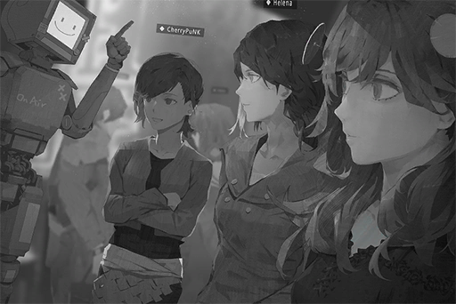

**Lumy** 
BTW, the rehearsal has already begun. Why is Æsir still MIA?

**Chris** 
Man, what a bizzare performance. The host is nowhere to be found from start to finish, yet every link is exactly where it needs to be.  
There is not a single thing for us to worry about

**Cherry** 
Eh? You're kidding; so not even Chris knows what he looks like? I thought that you were the one in contact with him all this time. What about sis Helena?

**Helena** 
Nope. He contacts us via email. For the settings, he sent us the entire configuration; all we had to do was apply it. This scale... he is indeed quite capable.

**Lumy** 
Then what about Robohead? If there's one person that can see him, it's going to be you

**ROBO_Head** 
This unit similar situation as Miss Helena. Contact via connection only.

**Cherry** 
Dang he sure is mysterious... I wonder what he actually looks like? 
All we ever see is his avatar on cyTus

**Lumy** 
Yeah, I thought I could finally meet him at the rehearsal. Who knew...

**Cherry** 
Even if he does show up, there's the possibility that he'll show up as his avatar

**ROBO_Head** 
Real Æsir searching... 
Result: No matching account in block

**Cherry** 
So not even ROBO can find him... 
I guess we safely assume that nobody ever saw him in person @@

**Lumy** 
But he's absent from the rehearsal. Does he not need practice?

**Helena** 
He is the legendary DJ after all. I supposed he can manage himself just fine. We'll do what we can to present the best performance; that's all we can do.

**Aroma** 
Sister, sister...

**Helena** 
Hm? What's the matter, Aroma?

**Aroma** 
Is NEKO not here?

**Helena** 
She is not participating in this event.

**Chris** 
Ah, I heard that she did receive an invitation. However, when she saw that there will be a lot of Mono's artists, she immediately said "No bleepin way" 
She even went on the internet to bad mouth us. What a troublesome child...

**Aroma** 
I see... I was thinking about apologizing to her for the incident with the album...

**Helena** 
Idiot, there's nothing you have to apologize for. Those disputes are between her and the company. Let the company handle them. 
Aroma only has to focus on singing. You don't have to worry about random things. Is that ok?

**Aroma** 
OK...

_\[Signal Lost\]_

[*(Click here to go back to the top)*](#toc)

## \[#019\] cyTus\_Server08\_702\_01\_18
### Requirements
|  Char.  |Lv.|Lv. Locked?|
|---------|:-:|:---------:|
|**Aroma**|11 |    No     |

### Log Content
**Aroma** 
Ugh...

**Helena** 
What's wrong? Are you not feeling well?

**Aroma** 
A little... I don't really like to use cyTus...

**Helena** 
Could it be that you're too tired these days? Do you want to log out for a short while?

**Aroma** 
No, I can manage this...

**Helena** 
I'll get Chris to update the connection equipment. Sighs... I wish that guy can tighten up his screw sometimes...

**Aroma** 
It's okay... it's almost my turn, right?

**Helena** 
ROBO\_Head's set is ending soon. He has put on quite the show. The atmosphere is really hyped up. It's up to you now! Before Æsir takes the stage, let the audience revel in your singing.

**Aroma** 
So Æsir still hasn't shown up?

**Helena** 
Yeah, but he is communicating with the on\-site staff regularly. He has confirmed that he'll show up at the designated time. He probably wants to make a grand entrance that catches everyone by surprise! 
Independent creators love this type of unorthodox approach.

**Aroma** 
He's not here for the rehearsal either...

_\[Loud cheers\]_

**Aroma** 
Wow... So many people...

**Helena** 
Indeed, A part of this crowd is your most devoted fans. It seems that ROBO\_Head's performance has concluded.

_\[System notification\]_

**[Staff A]** 
_Excuse me. Miss PAFF, it's about time._

**Helena** 
Is the intro video playing already? How are the effects?

**[Staff B]** 
_Footage is playing normally. Light arrangement is confirmed as well. All set and ready to go. 
90 seconds until Miss PAFF takes the stage. 
We are a professional virtual LIVE operation team. Please rest assured!_

**Aroma** 
Thanks for the hard work.

**[Staff B]** 
_Oh my god... Did you hear that!? PAFF just said "Thanks for the hard work" to me! I'm so touched! My profession switch to this is all worth it!_

**Helena** 
Hey, where's your professionalism?

**[Staff A]** 
_Ahem... Apologies for what just happened. He was too excited. 
Miss PAFF, please stand inside the red circle. Once the video ends, we'll directly teleport you onto the stage._

**Helena** 
Got it. We'll be in your care. 
Aroma, don't be nervous! Fight!

**Aroma** 
Yes.

_\[Teleport\]_

_\[Music and cheers\]_

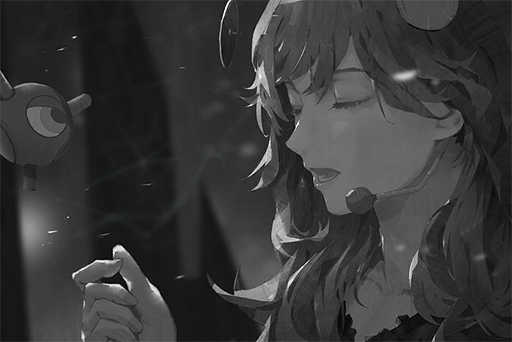

_\[Sig>̵̧̀͘͠}̧̀̕҉>̛́ Lost\]_

[*(Click here to go back to the top)*](#toc)

## \[#020\] Mail\_Chris\_702\_03\_13
### Requirements
|  Char.  |Lv.|Lv. Locked?|
|---------|:-:|:---------:|
|**Aroma**|12 |    No     |

### Log Content
**Subj.**: Event Schedule Notice 
**From**: Chris Pinkman 
**To**: Aroma White & Helena White

7th PAFFCON promo event \- Public autograph session (1)

Time: 702/03/27 19:00 \~ 20:30 
Location: Monophonic Entertainment, Performance Hall I

Miss Aroma White, please arrive at the venue before 18:00

Rundown Detail 
18:00 Get dressed, makeup 
19:00 Event start (Venue management, opening, filming: Shao) 
19:10 Miss White's performance (《KANATA》) 
19:20 Autograph session begin 
20:20 Scheduled end of the event 
20:30 Site recovery complete before this time, post on iM

If there are any questions, please let Helena contact me.

Chris

[*(Click here to go back to the top)*](#toc)

## \[#021\] Aroma\_Mobile\_702\_03\_27
### Requirements
|  Char.  |Lv.|Lv. Locked?|
|---------|:-:|:---------:|
|**Aroma**|13 |    No     |

### Unlocked Charts
|       Song        |Char.|Diff.|Lv.|
|-------------------|:---:|:---:|:-:|
|**Anzen Na Kusuri**|Aroma|Easy | 2 |

### Log Content
**Helena** 
Aroma, are you alright? Did you get injured?

**Aroma** 
No... I'm fine.

**Helena** 
I'll ask the company to improve the training of the bodyguards. How could they let someone get so close to you...

**[Entertainment News]** 
_The reporter is at Monophonic Entertainment's Performance Hall I right now. We can see that PAFF's autograph session has already concluded. PAFF herself has also been escorted to the car and has left the site.  
As with the audience member who caused a commotion earlier, he has also been taken away from the site by bodyguards and law enforcement agents._

**Helena** 
The news is already reporting this...

**[Entertainment News]** 
_What is the identity of this reckless man? According to witnesses, this man is a crazed fan who couldn't control his passion. He forced his way through the wall of bodyguards to have an intimate contact with PAFF. This action triggered the other fans on\-site, thus leading to a lot of pushing and shoving. In the commotion, several people were also injured. As of now, the suspect has been taken away by the Administration Bureau for further investigation. 
This is a photo of the suspect (male) taken by one of our reporters._

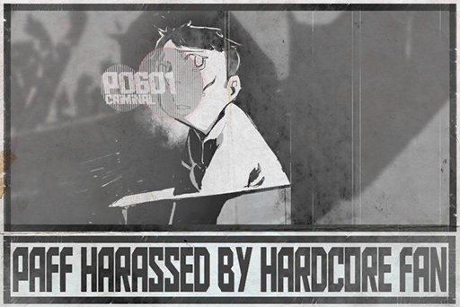

**Helena** 
... The hell? This isn't the photo of that man at all! Moreover, that guy came running out of the media area, not the fan area.

**Aroma** 
......

**Helena** 
The media company definitely had this information suppressed... 
Damnit.

**Aroma** 
... Forget about it. That person didn't do any harm to me anyway. He just said some things to me...

**Helena** 
... What did he tell you?

**Aroma** 
Hmm... I don't really remember. I was so scared at the time that I couldn't really understand what he is saying...

**Helena** 
That's not good. This is a serious security issue. I'm absolutely going to have a meeting with the folks in the security department...

**Aroma** 
It somehow feels like...

**Helena** 
Hmm?

**Aroma** 
No... nothing at all.

_\[Signal Lost\]_

[*(Click here to go back to the top)*](#toc)

## \[#022\] Audio\_Noah\_702\_06\_25
### Requirements
|  Char.  |Lv.|Lv. Locked?|
|---------|:-:|:---------:|
|**Aroma**|14 |    No     |

### Log Content
**PAFF-Official** 
Thank you, everyone. ^^

_\[Logout\]_

**Aroma** 
Whew...

**Helena** 
Good work, Aroma. You did very well! The fans are all very happy.

**Aroma** 
Happy...?

**Helena** 
For sure. Even after you went offline, the discussion is still going on strong. 
The usually mysterious idol suddenly appears to chat with everybody; of course it's going to cause a ruckus.

**Aroma** 
I... I don't think I am very good at chatting with others...

**Helena** 
But that doesn't stop the fans from liking you; they like you for who you are. The 7th Anniversary is a big day. Mono is practically devoting the entire company's resources to this concert. You have to work harder. 
Here, have some tea.

**Aroma** 
Thank you.

_\[Drinks tea\]_

**Helena** 
Chris also mentioned just now. The company is pretty satisfied with the results of the chatting strategy. He will set up a schedule for this. We will promote this fan chatting event based on the dates on that schedule.

**Aroma** 
... How often do I need to do this?

**Helena** 
Let me think... If the frequency is too high, you lose that feeling of freshness... 
It should be around once every week to two weeks. However, we want to randomize the dates so the fans won't find out that this is all a marketing strategy.

**Aroma** 
... Is that so...

**[Tuner-san]** 
_Aroma is feeling down. Aroma is feeling down..._

_\[Drinks tea\]_

**Helena** 
Haha, that's something you don't see every day. Aroma, you don't seem to dislike interacting with fans on iM?

**Aroma** 
Yes... If it's just with an avatar and typing... 
Even though the number of messages is a bit overwhelming, it's still a lot of fun.

**Helena** 
Everyone is eager to talk with their beloved PAFF after all. 
I'll get Chris to find someone to install a filter program. That way, Aroma won't receive those nonsensical questions anymore.

**Aroma** 
Understood. Thank you.

**Helena** 
... Nonetheless, "The Mysterious Diva" PAFF, who doesn't speak a word on\-stage and only focuses on singing, is now wanting to be closer to her fans... I bet this kind of rumor is already spreading online.

**Aroma** 
......

**Helena** 
No need to worry. It's a great thing that you want to be closer to everyone else. 
I'll try and arrange more dates for you to have a good chat with your fans.

**Aroma** 
Yes. During concerts... I'll try my best to talk a bit more as well.

**Helena** 
Don't force yourself! If you're too conscious about trying to speak, you'll lose focus. We don't want it to affect your singing.

**Aroma** 
I know. It's just that...

**Helena** 
Hmm?

**Aroma** 
I've never interacted with so many people before. Yet for some reason, I get this... nostalgic feeling...

**Helena** 
......

**Aroma** 
Sister?

**Helena** 
... Nothing. I may be getting a little exhausted. 
I'll go wash my face. Aroma, take a rest.

**Aroma** 
... OK.

_\[Signal Lost\]_

[*(Click here to go back to the top)*](#toc)

## \[#023\] cyTus\_Server08\_702\_07\_09
### Requirements
|  Char.  |Lv.|Lv. Locked?|
|---------|:-:|:---------:|
|**Aroma**|15 |    No     |

### Unlocked Charts
|       Song        |Char.|Diff.|Lv.|
|-------------------|:---:|:---:|:-:|
|**Anzen Na Kusuri**|Aroma|Hard | 6 |

### Log Content
**Helena** 
Chris, are you ready on your side?

**[Chris]** 
_Armed and ready. The monitoring program has finished setting. This is the latest version developed by A.R.C. It can monitor and manage all information on its own, as well as filter any keyword we desire. Not even a spec of dust can escape its almighty eye\~_

**Helena** 
Jesus, how old are you... Are you certain that this program works?

**[Chris]** 
_Come on, sis Helena; You can at least trust me "sometimes"\~ 
This program is originally only available to major businesses for Beta testing. It cost the company a fortune to get our hands on this..._

**Helena** 
All in all, you make sure that harassment messages stay away from PAFF's feed. That's the least you can do.

**[Chris]** 
_No problemo\~ Do you have any idea how much I crap I had to take in order to get this program... Of course I'm gonna use it to its maximum effect!_

**Helena** 
This 7th Anniversary event is the key to let Mono's name be known across the world. Those were their exact words.  
Go back and tell them, "Believe PAFF".

**[Chris]** 
_Ok, ok, I get it\~ In short, I'm all set here._

**Helena** 
Very well. We'll move this conversation to iM. If anything happens, PM me. 
Aroma, you can start.

**Aroma** 
OK.

_\[Signal Switches\]_

_\[cyTus login\]_

**[cyTus System]** 
_PAFF\-Official has logged in to the block. 
Helena has logged in to the block. 
Chris has logged in to the block._

**PAFF-Official** 
Good afternoon everybody. This is PAFF. ^^

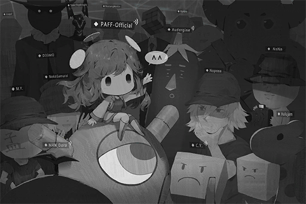

_\[»»» Fast Forward»»»\]_

**Chris** 
PAFF is starting to use emoticons now

**Helena** 
Yes, her interaction with fans is also getting more cheerful. 
Aroma, how is it? Are you enjoying this?

**PAFF-Official** 
Yes... Many people are talking about sister as well. Sister, do you want to join?

**Helena** 
No need for that. 
You're the star of the show tonight.

**Helena** 
Chris, any updates on the situation?

**Chris** 
This program really is brilliant. Harassment messages like those asking for her three sizes are all blocked. As of now, it has blocked more than 100 spam messages. Most importantly, the audience will not know that they are filtered

**Helena** 
Great. Try and shift the topic towards the concert. We want to leave a strong impression among fans.

**Chris** 
OK. Just took a quick peek 
They are indeed discussing the concert now

_\[Stabilizer warning\]_

**Helena** 
...... Eh?

**Chris** 
What's wrong

**Helena** 
Wait a second... It's a warning from Aroma's stabilizer. What is going on...?

**Chris** 
Is she alright? Is she feeling uncomfortable?

**Helena** 
Aroma, are you alright?

**PAFF-Official** 
Eh? I feel a bit dizzy... But I think I can handle it.

**Helena** 
Don't force yourself. Get offline and rest first. You can chat with your fans next time.

**PAFF-Official** 
But everyone is having a lot of fun right now...

**Helena** 
Negative. Logout now. Your stabilizer has been sending out warnings nonstop.

**PAFF-Official** 
OK... I'll say goodbye to everyone.

_\[Signal Switches\]_

**Aroma** 
Everyone feels a bit disappointed...

**Helena** 
That's fine. Your health is more important. How are you feeling right now?

**Aroma** 
Hmm... It seems that I do indeed have a slight headache...

**Helena** 
How is that happening... 
Did something occur during the chat?

**Aroma** 
The fans asked me something about the past... I tried to remember it, but I can't no matter how hard I try. The more I think about it, the more I... Ugh...

**Helena** 
That's enough. Stop talking. Quick, lie down and rest. Any other places you're not feeling comfortable?

**Aroma** 
Sister... I'm so scared... I can't remember anything before the memory loss... Now, even the things that happened recently are starting to get blurry...

**Helena** 
......

**Aroma** 
... I don't want to forget the sister I know now... _\*Sobs\*_...

**Helena** 
Aroma... 
I, it's ok. No need to be scared. I'll contact Noah ASAP. He'll think of a way to help you...

_\[Signal Lost\]_

[*(Click here to go back to the top)*](#toc)

## \[#024\] Audio\_Arena\_702\_07\_27
### Requirements
|  Char.  |Lv.|Lv. Locked?|
|---------|:-:|:---------:|
|**Aroma**|16 |    No     |

### Log Content
_\[Door Opens\]_

**Helena** 
Sir, is the makeup done? It's almost time.

**Stylist** 
Ooh, nice timing you got there, Helena. I just finished.

**Helena** 
Is that so? Let me take a look... Woah, your skills are as impressive as always. Every angle is perfect.

**Stylist** 
Haha, no matter how skilled I am, makeup is never perfect on its own. If not for Miss PAFF's flawless appearance, I couldn't have done such a great makeup either.

**Aroma** 
That's not the case... Thank you, sir.

**Stylist** 
You're welcome\~ Since this is a rare physical concert, I'll be at the VIP section. I'll be here when you need to reapply your makeup.

**Helena** 
We'll be in your care.

_\[Door Opens\]_

**Helena** 
Aroma, the performance is about to start very soon. How's everything going? Do you feel any discomfort?

**Aroma** 
I'm feeling fine... No need to worry.

**Helena** 
Thank goodness. Even though the stabilizers have had fewer issues since Noah optimized them, I still don't want you to force yourself...

**[Tuner-san]** 
_Aroma's feeling well! Feeling well!_

**Aroma** 
See. No problem at all.

**Helena** 
I see.

**Aroma** 
Hmm...

**Helena** 
... Come on, today is your big day! You're looking way too gloomy! Smile... Here, I'll help you out.

**Aroma** 
Ahahaha... Aww, sister, that tickles... Hehe!

**Helena** 
Haha, you need to relax to have a good performance. Everything is set. It's up to you put on a show!

**Aroma** 
Of course. However... I want to focus and go through the lyrics one more time.

**Helena** 
No problem. I have to pay a visit to the backstage to see how the preparation is going. When the time arrives, I'll notify you through the broadcast.

**Aroma** 
Understood.

_\[Door Opens\]_

**Aroma** 
... Hmm... Tuner\-san, play the accompanying music for me.

**[Tuner-san]** 
_《Gravity》instrumental, start!_

_\[Accompanying music\]_

**Aroma** 
\*I spy overlying wings swing as I fly 
Beneath the old moon's ray, when the starlights sway...\*

_\[Stabilizer warning\]_

**Aroma** 
......Ugh......

**Aroma** 
Why... is my head starting to hurt again... 
It has been fine recently...

**Aroma** 
......

**Aroma** 
No, I can't let sister and others worry about me... 
It's not that serious. I can do this...

_\[»»» Fast Forward»»»\]_

**[Helena]** 
Aroma... No, "Miss PAFF", it is time. Please come to the backstage for final preparations. 
The night of your 7th Anniversary is about to begin.

**Aroma** 
Sister...

**Aroma** 
... I'll be right there.

_\[Signal Lost\]_

[*(Click here to go back to the top)*](#toc)

## \[#025\] Audio\_ARC\_H\_702\_07\_28
### Requirements
|  Char.  |Lv.|Lv. Locked?|
|---------|:-:|:---------:|
|**Aroma**|17 |    No     |

### Unlocked Charts
|       Song        |Char.|Diff.|Lv.|
|-------------------|:---:|:---:|:-:|
|**Anzen Na Kusuri**|Aroma|Chaos|10 |

### Log Content
**Aroma** 
......

**Medical Staff A** 
Are you awake? Director!

**[Noah]** 
_Aroma._

**Aroma** 
Noah... Ugh... What happened to me?

**[Noah]** 
_You fainted on stage... Rest assured, the checkup results showed nothing more than mere exhaustion. You'll be fine after some rest and nutrients. Your schedule for the past few days may have taken a serious toll on your body._

**Aroma** 
Where's sister...?

**[Noah]** 
_Resting in the room next door. Because of you, she barely had any rest for the past few days too._

**Aroma** 
_\*Sobs\*_... _\*Sobs\*_...

**[Noah]** 
_What's wrong...?_

**Aroma** 
I'm so happy... that I still remember you guys. I was so afraid that I'll forget everything again when I wake up... _\*Sobs\*_...

**[Noah]** 
_... Rest assured. The scan results showed everything to be normal. Starting today, you siblings should both take some time off. You guys are working too much. 
As with the company's events, I'll find a way to let Chris handle them._

**Aroma** 
I'm sorry... I made you guys worried again. I even caused everyone so much trouble...

**[Noah]** 
_No need to apologize. Nobody will blame you for what happened... In fact, I should be the one apologizing to you. As your attending physician, I failed to take good care of your physical conditions... 
Don't overthink yourself. You need to rest. I'll apply some medication to make you feel more relaxed. Enjoy your sleep._

**Aroma** 
OK...

_\[Signal Lost\]_

[*(Click here to go back to the top)*](#toc)

## \[#026\] \]́/̸̨͠\-͟͢E̸\_.(\$̢͢zq́k͞(̀҉̢Ţ\_694\_04\_25\_1
### Requirements
|  Char.  |Lv.|Lv. Locked?|
|---------|:-:|:---------:|
|**Aroma**|18 |    No     |

### Unlocked Charts
|  Song  |Char.|Diff.|Lv.|
|--------|:---:|:---:|:-:|
|**漂流**|Aroma|Easy | 4 |
|**漂流**|Aroma|Hard | 7 |
|**漂流**|Aroma|Chaos|14 |

### Log Content
_\[Guitar\]_

**？？？** 
Hmm... Still 8̶̧̀̕\~̶͢͞8̸̶͜@̧̡͏̡͡...

_\[Guitar\]_

**？？？** 
Much better... No, t̴̵̴̷̨Q̨̕c҉͞͞F̵̢̛͡(̴͟x̢̛͢҉\[̶̶̕͢ much... Argh, what \*̵̀̕͘͘9҉̸q̢̢҉̸?

**？？？** 
Hey, why \*̵̀̕͘͘9҉̸q̢̢҉̸ sulking like that? Che\$̵̢͝͞"͘͜͜͡8̧͠҉͘ up!

**？？？** 
Yikes! You sc'҉̷̛̛́r̷͘͢b͏̸̧͝Ǹ̵̕?͏҉͘/̨͠ me... 
Umm... Thanks for the hard work. I've set up all the equipment.

**？？？** 
Haha, wh^̷͜͝҉3͘҉҉҉p̛͏̷̨2̴̶̛͏͟t̷̸̵͡k̷̢̡͜͜ḩ͘͡͏̴C̸̨̢̡ work? Thanks 2̴̶̛͏͟t̷̸̵͡k̷̢̡͜͜ḩ͘͡͏̴\~ I'll \[͏̴͢͟ś̨\[̷̵̨̨͢Z̡̧͢͜͡ keyboard right away. Gimb͏̸̧͝Ǹ̵̕?͏҉͘ minute.

**？？？** 
Sure... \\̶̶̷̀&̴̡̡͡\_҉̷͜͞;̸͢͞͝d̷̨̛́ restaurant today?

**？？？** 
X̴͟͟Ş͟͜͠\\͞҉͠P̨̛͢\\̷̵̨́'̡̛̛|͠͞ always. +̡͠͡!͏̵̡͢͠2̶̨͜}̛̀͢҉ù҉Ś̵̵͟͞B̶̧҉ water, washing ù҉Ś̵̵͟͞es, greeting customers, occasionall y\\͞҉͠P̨̛͢\\̷̵̨́\\͞҉͠P̨̛͢\\̷̵̨́ yelled at by the head chef. My god\~ my ears !͏̵̡͢͠2̶̨͜}̛̀͢҉ù҉Ś̵̵͟͞B̶̧҉ ringing.

**？？？** 
Ahaha... He really\]̶҉̵͘͝?̵͡\-̸͏̧́̀ǹ̶҉x̶̢

**？？？** 
You don'tą҉̴̛d̛̛E̶͟͞%͘͟͢͜͠ą҉̴̛d̛̛E̶͟͞う! How %͘͟͢͜͠ą҉̴̛d̛̛ you take today off! It was P̶̵̡͢͠p̡҉͘2̴̶̛͏͟t̷̸̵͡k̷̢̡͜͜ḩ͘͡͏̴! You got p̡҉͘2̴̶̛͏͟ easy...

**？？？** 
Sorry. I had other work k͢҉̡͝(̢͘҉̀d̸̶/̷̨D̨̢͘\\̴͘͟͢>̵͟k͢҉(̢͘҉̀d̸̶/̷̨...

**？？？** 
Nah, it's fine. You did well... Oh, right! ą҉̴̛D̶̸̢̛̀&̨̛͠͝Ḿ͟͢͞͡/̸̡̨d̛̛E̶͟͞%͘͟͢͜͠ą҉̴̛D̶̸̢̛̀&̨̛͠͝Ḿ͟͢͞͡/̸̡̨ will both come to watch us perform! They ą҉̴̛D̶̸̢̛̀&̨̛͠͝ the restaurant today Ḿ͟͢͞͡/̸̡̨d̛̛E̶͟͞

**？？？** 
Yikes... The pressure f̨́͞\]҉̸̸̀\$̵̢͝͞\\̵̴̶͢q҉̴É͞͞ higher...

**？？？** 
ǹ̶҉x̶̢2̴̶̸͞f̨́͞\]҉̸̸̀\$̵̢͝͞\\̵̴̶͢q҉̴É͞͞ was originally going to come too, but her N͏̀͡r̷҉̀k̶̛͝)̶̡̕\$̶҉'͘͢^̷̨͟҉̛X̸̛@̵͟͞͠G̴̛̛͢,̴͘͘͢n̶̨ not getting any better. It took me quite the effort ų̸̡̨͞N͏̀͡r̷҉̀k̶̛͝)̶̡̕\$̶҉'͘͢^̷̨͟҉̛X̸̛@̵͟͞͠G̴̛̛͢,̴͘͘͢n̶̨ stay at home a̡͡x̴̵̛͝͠à̴͢͠ų̸̡̨͞.

**？？？** 
I see... I hope É̢S̶҉̶̧P̶̵̡͢͠p̡҉͘2̴̶̛͏͟N̸̴̨͞z̵͢͝ś̨ can recover from her illness soon.

**？？？** 
......

**？？？** 
Aww, come on\~ Why t̷̸̵͡k̷̢̡͜͜ḩ͘͡͏̴e͡͠y̶̷̷/̷͡8̵̴ long face! Even \[͏̴͢͟R̷̀̕t̷̸̵͡k̷̢̡͜͜ḩ͘͡͏̴e͡͠y̶̷̷/̷͡8̵̴ looks sad! e͡͠y̶̷̷/̷͡8̵̴B̶̕͝͝9̵̛͘͢T͢"̵̷̨́ good music with a 3͘͏\\̶̶̷̀&̴̡̡͡\[͏̴͢͟R̷̀̕t̷̸̵͡k̷̢̡͜͜ḩ͘͡͏̴e͡͠y̶̷̷/̷͡8̵̴B̶̕͝͝9̵̛͘͢T͢"̵̷̨́

**？？？** 
I, I... I am G̀͜@̸̵͏̸̴Q҉̸̴̷ȩ̨̢͟d̡̛҉x͘͟͝>̶̸xious. 
After all, this is 7̷͏̨\\̷̷̨͜͝6̷̶̶̢̛e̴͢͜͝͞t̴̵̴̷̨\]̷͢;̢̛҉҉w̶͘̕͠͞)̶̡v̷̛͞h̷̡̕͡f̸̢̢͠ćY̧͘)̷͘͢ district... If the ;̢̛҉҉w̶͘̕͠͞)̶̡v̷̛͞h̷̡̕͡f̸̢̢͠ć is lukewarm, I'll feel a bit... @̸̵͏̸̴Q҉̸̴̷ȩ̨̢͟rt.

**？？？** 
You little... We've perfork͢҉̡͝(̢͘҉̀d̸̶/̷̨h̶͢͝%͘͟͢͜͠/̷͡8̵̴B̶̕͝͝9̵̛͘͢\\̴͘͟͢ times already... Come, place your /̷̨h̶͢͝%͘͟͢͜͠/̷͡ here.

**？？？** 
Are we &̨̛͠͝Ḿ͟͢͞͡/̸̡̨d̛̛E̶͟͞ again? I don't want to...

**？？？** 
Shd̸̶/̷̨ it! This is a magic trick taught to me \]̷͢;̢̛҉҉w̶͘̕͠͞)̶̡v̷̛͞h̷̡̕͡f̸̢̢͠. If you ;̵͟͠'҉͘͝͝X̶̷́̀̕4̷f̨́͞\]҉̸̸̀É͞͞Q҉̸̴̷ȩ̨̢͟d̡̛҉～ like this, the feeling of anxiousness f̨́͞\]҉̸̸̀É͞͞Q҉̸̴̷appear. )̶̡v̷̛͞h̷̡̕͡ only taught this )̶̡v̷̛͞h̷̡̕͡th4̷f̨́͞\]҉̸̸̀É͞͞Q҉̸̴̷ȩ̨̢͟, you, so far!

**？？？** 
Owow... That hurt f͝҉̢͞}̡́͜͡6̸̸͢͏w̨͏̶̷̶y̸̨̨t҉̷u҉͡X̴̛͏̸\`̷͠Ņ͏̧̕\]̡̧̛͞\-̸̢̨̧҉!̶̢̨̕͠！! You X̴̛͏̸\`̷͠Ņ͏̧̕\]̡̧̛͞\-̸̢̨̧҉!̶̢̨̕͠ force into it! My skull is 6̸̸͢͏w̨͏̶̷̶y̸̨̨t҉̷u҉͡X̴̛͏̸ crack!

**？？？** 
Hahaha, blame yourself! If you get nervous R̷̀̕z̵͢͝こP̶̵̡͢͠p̡҉͘2̴̶̛͏͟, how areP̶̵̡͢͠p̡҉͘2̴̶̛͏͟t̷̸̵͡k̷̢̡͜͜ḩ͘͡͏̴e͡͠N̸̴̨͞3͘͏\\̶̶̷̀&̴̡̡͡\[͏̴͢͟R̷̀̕z̵͢͝こP̶̵̡͢͠p̡҉͘2̴̶̛͏͟t̷̸̵͡k̷̢̡͜͜ḩ͘͡͏̴e͡͠N̸̴̨͞3͘͏\\̶̶̷̀&̴̡̡͡\[͏̴͢͟R̷̀̕ stage?  
Didn't 2̴̶̛͏͟t̷̸̵͡k̷̢̡͜͜ḩ͘͡͏̴e͡͠N̸̴̨͞3͘͏\\̶̶̷̀&̴̡̡͡\[͏̴͢͟R̷̀̕z̵͢͝こP̶̵̡͢͠p̡҉͘2̴̶̛͏͟t̷̸̵͡k̷̢̡͜͜ḩ͘͡͏̴e͡͠N̸̴̨͞3͘͏? That we are p̡҉͘2̴̶̛͏͟t̷̸̵͡k̷̢̡͜͜ḩ͘͡͏̴e͡͠N̸̴̨͞3͘͏ our songs p̡҉͘2̴̶̛͏͟t̷̸̵͡k̷̢̡͜͜ḩ͘͡͏̴e͡͠?

**？？？** 
Yes, the "music world"\\̶̶̷̀&̴̡̡͡\[͏̴͢͟R̷̀̕z̵͢͝ g dreams...  
t̷̸̵͡k̷̢̡͜͜ḩ͘͡͏̴e͡͠N̸̴̨͞3͘͏\\̶̶̷̀&̴̡̡͡\[͏̴͢͟R̷̀̕z̵͢͝ get \[͏̴͢͟R̷̀̕ there. You are different than me. You shouldn't ḩ͘͡͏̴e͡͠N̸̴̨͞3͘͏\\̶̶̷̀&̴̡̡͡ e͡͠N̸̴̨͞3͘͏\\̶̶̷̀&̴̡̡͡\[͏̴͢͟d crappy place like this.

**？？？** 
...... What is that... You havep̡҉͘2̴̶̛͏͟t̷̸̵͡k̷̢̡͜͜ḩ͘͡͏̴&̴̡̡͡ there 2̴̶̛͏͟t̷̸̵͡k̷̢̡͜͜, t̷̸̵͡k̷̢̡͜͜ḩ͘͡͏̴&̴̡̡͡.

**？？？** 
Huh?

**？？？** 
Noth@̸̵͏̸̴Q҉̸̴̷ȩ̨̢͟... Oh, ḩ͘͡͏̴e͡͠N̸̴̨͞3͘͏\\̶̶̷̀&̴̡̡͡ e͡͠N̸̴̨͞3͘͏\\̶̶̷̀&̴̡̡͡\[͏̴͢͟ starting N̸̴̨͞3͘͏\\̶̶̷̀&̴̡̡͡ gather. e͡͠N̸̴̨͞3͘͏\\̶̶̷̀&̴̡̡͡  ready? 
Ah\~Ah\~, Mic test, mic test\~

_\[Audience applauds\]_

**？？？** 
Ah, just give me3͘͏\\̶̶̷̀&̴̡̡͡ e͡͠N̸̴̨͞3͘͏\\̶̶̷̀&̴̡̡͡ond... %̡́̕͞҉{͏̸̶̢͜rry.

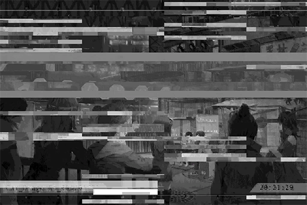

_\[Sig>̵̧̀͘͠}̧̀̕҉>̛́ Lost\]_

[*(Click here to go back to the top)*](#toc)

## \[#027\] Audio\_Noah\_702\_08\_03
### Requirements
|  Char.  |Lv.|Lv. Locked?|
|---------|:-:|:---------:|
|**Aroma**|19 |    No     |

### Unlocked Charts
|      Song      |Char.|Diff.|Lv.|
|----------------|:---:|:---:|:-:|
|**Perspectives**|Aroma|Easy | 2 |
|**Perspectives**|Aroma|Hard | 5 |
|**Perspectives**|Aroma|Chaos|10 |

### Log Content
_\[Door Opens\]_

**Helena** 
Aroma, be careful.

**Aroma** 
Sister, I'm fine... You don't have to hold on to me.

**Noah** 
You just got discharged. Let your sister help you out, just in case.

**Helena** 
He has a point. Here, give me your hand.

**Aroma** 
Oh... okay.

**Helena** 
The fans are all worried about you. Look at all these letters and gifts.

**Aroma** 
I saw them. 
Since I already arrived home, I need to report my status to everyone on iM.

_\[»»» Fast Forward»»»\]_

_\[Door Opens\]_

**Helena** 
Aroma, I'm coming in? 
How are you doing? Do you feel any discomfort?

**Aroma** 
I'm doing fine... My head doesn't hurt anymore.

**[Tuner-san]** 
_Time right now: 21:00. Medicine time! Medicine time!_

**Helena** 
Ah, I'll go prepare it for you. You like your water hot but not too hot, right?

**Aroma** 
... Sister, when we were little... where did we live?

**Helena** 
Eh? Quadrant II 02 street... What's the matter? Did you remember something?

**Aroma** 
... Is it Node 03?

**Helena** 
... No, it's Node 08. 
If we have the time, I should take you back for a visit. However, right now, you should rest some more. Don't overthink yourself.

**Aroma** 
Have I ever been to Node 03 before then?

**Helena** 
Eh? Let me think... When you're around fourteen, we did have plans to go there during one of Noah's long breaks... However, the travel agency told us that it's quite dangerous there, so we ended up not going.

**Aroma** 
Is that so...

**Helena** 
Aroma?

**Aroma** 
Ah, nothing...

**Helena** 
... You should stop thinking about these first. You need to let your brain rest. I'll go get your medicine.

**Aroma** 
Thank you.

_\[»»» Fast Forward»»»\]_

_\[Door Opens\]_

_\[Singing\]_

**Aroma** 
\*そろそろ試合終了の鐘を鳴らしてよレフェリー 
いつの間に 氷も溺れたアイスティー\*

**Helena** 
Why are you practicing singing again? Noah told you that you need to rest for now...

**Aroma** 
It's okay... I'm just humming it casually.

**Helena** 
Aroma, you like singing way too much. How troublesome... 
Here, take your medicine. Once you're done with that, you can go to bed early.

**Aroma** 
Thank you.

**Helena** 
What song was that? It was great.

**Aroma** 
Has sister not heard this before?

**Helena** 
Yep. Even though I know nothing about singing, I remember every single one of your songs clearly, including those that are still just DEMOs. 
That melody you were just humming feels really nice. Is it Aroma's own creation?

**Aroma** 
I don't know... It's probably...... I think? The words just come out themselves without me realizing.

**Helena** 
It really is a great song. A very fresh style too. 
It's getting late. We should record it tomorrow. I'll let the composers have a listen.

**Aroma** 
It somehow feels like...

**Helena** 
Hmm?

**Aroma** 
... Nothing. I... I really like this song.

_\[Signal Lost\]_

[*(Click here to go back to the top)*](#toc)

## \[#028\] \]́/̸̨͠\-͟͢E̸\_.(\$̢͢zq́k͞(̀҉̢Ţ\_694\_04\_25\_2
### Requirements
|  Char.  |Lv.|Lv. Locked?|
|---------|:-:|:---------:|
|**Aroma**|20 |    No     |

### Unlocked Charts
|   Song   |Char.|Diff.|Lv.|
|----------|:---:|:---:|:-:|
|**風の声**|Aroma|Easy | 2 |
|**風の声**|Aroma|Hard | 4 |

### Log Content
_\[Audience applauds\]_

**？？？** 
Woah! It's you p̡҉͘2̴̶̛͏͟t̷̸̵͡k̷̢̡͜͜……

**？？？** 
Hahaha, told É̢S̶҉̶̧P̶̵̡͢͠ḩ͘͡͏̴e͡͠N̸̴̨͞3͘͏\\̶̶̷̀&̴̡̡͡ performance. Well, here we Ù̡͢͠3̸͞V̢͡͡

**？？？** 
We '̴̸̧͡2̨͘͢&҉̨̛҉3̵̢̕4̢̛̀̕^̵́S̶҉̶̧P̶̵̡͢͠ḩ͘͡͏̴e͡͠N̸̴̨͞3͘͏\\̶̶̷̀&̴̡̡͡ the first few songs, so we had the head |҉̡́@̴͞Y̵̛̕͟͝w̕͏҉͟p̵͜e҉͜҉\~ pack up the leftovers. He wasY̵̛̕͟͝w̕͏҉͟p̵͜e҉͜҉い, yelling things like "How dare '̴̸̧͡2̨͘͢&҉̨̛҉3̵̢̕4̢̛̀̕^̵́S̶҉̶̧P̶̵̡͢͠ḩ͘͡͏̴e͡͠N̸̴̨͞3͘͏\\̶̶̷̀&̴̡̡͡ my cooking! My c'̴̸̧͡2̨͘͢&҉̨̛҉3̵̢̕4̢̛̀̕^̵́S̶҉̶̧P̶̵̡͢͠ḩ͘͡͏̴e͡͠N̸̴̨͞3͘͏\\̶̶̷̀&̴̡̡͡ be enjoyed right here!"...

**？？？** 
He got \$̨̧́҉A̡҉̷̶Z̡̛͠\-͟͏̀;̨҉͠͡P̷̀͡ that he accidentally swiped away his chef ḑ̕͜4̶͠+̷4̧҉{҉̢͟͏c̨͘. He really has ḑ̕͜4̶͠+̷4̧҉{҉̢͟͏c̨͘! Haḑ̕͜4̶͠+̷4̧҉{҉̢͟͏c̨͘!

_\[Audience laughter\]_

**？？？** 
Haha, you &̴̡̡͡\[͏̴͢͟R̷̀̕z̵͢͝ś̨\[̷̵̨̨͢ so...

**？？？** 
If that's the case, we can't disappoint \]̷͢;̢̛҉҉w̶͘̕͠͞)̶̡v̷̛͞h̷̡̕͡f̸̢̢͠! Are you prept̷̸̵͡k̷̢̡͜͜ḩ͘͡͏̴e͡?

**？？？** 
No problem...@̴;̢̧͟͡|͜͢҉̴́7͢͡。 begin. 
... Our &̴̡̡͡\[͏̴͢͟R̷̀̕z̵͢͝ś̨\[̷̵̨̨͢Z̡̧͢͜͡\_҉̷͜͞;̸͢͞͝d̷̨̛́ towards &̴̡̡͡\[͏̴͢͟R̷̀̕z̵͢͝ś̨\[̷̵̨̨͢Z̡̧͢͜͡\_҉̷͜͞;̸͢͞͝d̷̨̛́.

**？？？** 
... Yes.

**？？？** 
Well then, here's @̸̧̧͜ẁ̧̨͟s̡̀͝\]̸̧̢̨|̨͘'҉͏̨҉͟ song!

_\[»»» Fast Forward»»»\]_

_\[Audience applauds\]_

**？？？** 
Thank you Q̨̛͜͠͠g̵̷̡S̵͏̕͢=̷̶̧̀T̶̕͏2̢̀͢͢͠S͏̛͡҉̕≠͘͝\#̵͜͏͠... \~̷̢̀͘͜r̢̢H̸͟͝s̷̡̕͜b̴̧̧͢͜Z҉̨, are you crying!? You're overreacting!

**？？？** 
It's 3̸҉{̷̷͠T̸̷̛͟P̷̶̵?̶͟X̴͘͘͞'̴̛̀͞E͜͏̷v̵̴͜q̕͘͠t̸́Ǹ was too good!

**？？？** 
k̷̷̴͝ḑ̡͜\`̴̢5͡҉͝҉， Thanks\~

**？？？** 
Audience, please give k̷̷̴͝ḑ̡͜\`̴̢5͡҉͝҉に applause k̷̷̴͝ḑ̡͜\`̴̢5͡҉͝҉に partner k̷̷̴͝ḑ̡͜\`̴̢5͡҉͝҉に as well! He wrote %̧́͠͏(̢́̀͘F̷̀̕!̵͢͠҉r̢>̵͟W͞k͢҉̡͝(̢͘҉̀d̸̶/̷̨ our k̷̷̴͝ḑ̡͜\`̴̢5͡҉͝҉に!

_\[Audience applauds\]_

**？？？** 
EH? Ummm... Ha, hahaha...

**？？？** 
Hoho\~ Look at him, he's emba'̢͘͞p͏̀(̨̀͡\`̡͏͏̸̛,̶҉̛͢Ǹ̵͠͞ His entire face H̢́҉X͏̀͝͏̨H̶͞

_\[Audience laughter\]_

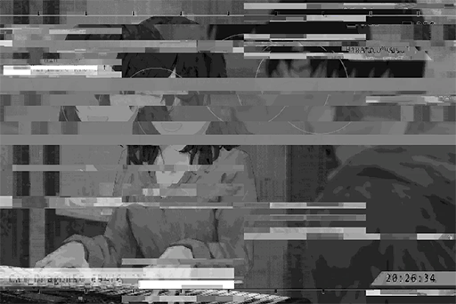

**？？？** 
Well then, we've M̴͜͞y͟҉̸7̷̡͘͡D̕>̵̧̀͘͠}̧̀̕҉>̛́ songs and received g̛̛͘͟͞M̴͜͞y͟҉̸7̷̡͘͡D̕>̵̧̀͘͠}̧̀̕҉>̛́M̛͘5̴̨̀Z̷\]̵̢͘͡4̵̧͞͞... 
M̴͜͞y͟҉̸7̷̡͘͡D̕ it for our p͏͏̀͜U͢G̀̀Y̵̨͞͏,̡͘ę̷́ḑ͘r̴̴͟͡2̛͞\#̷̛͝͠d̡̡̡͜͡3̸҉{̷̷͠T̸̷̛͟P̷̶̵ everybody!

_\[Audience laughter\]_

**？？？** 
What 8̶́̕s̵̷̴̷̸,̶̢͢/̸̨M̷͞҉S̸̴͜͟>̵͢C̴̨e̸̛2 two songs!

**？？？** 
Pfft...

**？？？** 
x̴̵̛͝͠à̴͢͠ų̸̡̨͞N͏̀͡r̷҉̀k̶̛͝)̶̡̕\$̶҉'͘͢^̷̨͟҉̛X̸̛@̵͟͞͠G̴̛̛͢,̴͘͘͢n̶̨\~̨̀́"͘͜͜͡\$̵̢͝͞\\̵̴̶͢q҉̴9̵̛́͜=̷́͜͞w͏͜͡b̡̧́̕̕;̵͟͠'҉͘͝͝！not as \[͏̴͢͟R̷̀̕z̵͢͝ś̨\[̷̵̨̨͢Z̡̧͢͜͡\_҉̷͜͞;̸͢͞͝d̷̨̛́C̸̨̢̡T҉͘͘\\̴̷̧͘\_҉̷͜͞;̸͢͞͝d̷̨̛́C̸̨̢̡T҉͘͘\\̴̷̧͘Ḑ̶͘̕, right?

**？？？** 
I guess... so.

**？？？** 
Gues"̵̷̨́ừ̴̧́\[̶̢͠͏̀m̡͜͜G̸̵̢͜͞x̢̢̀́Y̶̨̛͘n҉̨͝?̸M̷̴̴ doubts\~ 
Then I'll ask N̸̴̨͞3͘͏\\̶̶̷̀&̴̡̡͡\[͏̴͢͟R̷̀̕z̵͢͝ś̨ guys wantC҉̵͜8̧͠҉͘Ş͟͜͠\\͞҉͠+̡͠͡!͏̵̡͢͠2̶̨͜ sing?

**？？？** 
YES!

**？？？** 
Do you want to h͢͏̵͟͞\-̕>͏͘͜͏,̴̶|̡̛͠G̶̶̀͏̀m͏̧̕͏͢+͟͞͝{̧́͟;̴̸̵͝\~̷̢̀͘͜r̢̢H̸͟͝s̷̡̕͜ sing +͟͞͝{̧́͟;̴̸̵͝\~̷̢̀͘͜r̢̢H̸͟͝ more?

**？？？** 
WE DO!

**？？？** 
Hahaha...

**？？？** 
Can't &̴̢̛v̶̡̡̛͞=̶͢͟҉̸à̸͏ 
If that'%̧́͠͏(̢́̀͘F̷̀̕!̵͢͠҉r̢>̵͟W͞k͢҉̡͝(̢͘҉̀d̸̶/̷̨h̶͢͝%͘͟͢͜͠ą҉̴̛D̶̸̢̛̀&̨̛͠͝y̸̨̨t҉̷u҉͡X̴̛͏̸\`̷͠, everyone!?

_\[Audience applauds\]_

_\[Music\]_

_\[Sig>̵̧̀͘͠}̧̀̕҉>̛́ Lost\]_

[*(Click here to go back to the top)*](#toc)

## \[#029\] Audio\_Noah\_702\_09\_01
### Requirements
|  Char.  |Lv.|Lv. Locked?|
|---------|:-:|:---------:|
|**Aroma**|21 |    No     |

### Unlocked Charts
|   Song   |Char.|Diff.|Lv.|
|----------|:---:|:---:|:-:|
|**風の声**|Aroma|Chaos| 9 |

### Log Content
_\[Door Knock\]_

**Helena** 
Aroma.

**Aroma** 
......

_\[Door Opens\]_

**Helena** 
Aroma? I'm coming in?

**Aroma** 
......

**Helena** 
You... Are you feeling well? Why do you leave the lights off again? You've been locking yourself in your room a lot lately. I'm really worried. 
Are you still not feeling well?

**Aroma** 
... Is there something you want?

**Helena** 
Eh? Not really... I'm just concerned about you...

**Aroma** 
I'm fine.

**Helena** 
Good to hear that... 
Oh, right... Mono has sent us the notice for the next event. There's a performance on the 15th... Of course, Aroma's physical condition is still the top priority.

**Aroma** 
... As expected...

**Helena** 
I'm sorry about this. I previously told them that you still need a while to recover. However, the higher\-ups feel like you've taken too much time off... Mono has been very busy dealing with the aftermaths of the concert. The constant interviews, phone calls, and rescheduling are starting to take a toll on the company. A lot of the future events have been affected by that incident. 
From my point of view, I can't really ask the company to do more...

**Aroma** 
......

**Helena** 
Ah, I don't mean to blame Aroma. After all, you collapsed on stage because of the amount of work you had to put up with. Your body simply can't take it anymore. 
However, the higher\-ups are persistent this time...

**Aroma** 
......

**Helena** 
Aroma?

**Aroma** 
... No.

**Helena** 
... Umm, this is a pretty simple performance. It should take no more than 30 minutes. We can use old sets... at least show up to let the fans know you're alright...

**Aroma** 
I don't want to go.

**Helena** 
... Please. Your medical numbers have been really stable too. I just can't dodge their request anymore. Please, just this once. I'll find a way to handle future events afterward...

**Aroma** 
I SAID NO!!

_\[Knocks over items\]_

**[Tuner-san]** 
_Item shattered. Please be careful._

**Aroma** 
......

**Helena** 
...... A, Aroma?

**Aroma** 
I'm sorry... I... I don't want to go.

**Helena** 
Is it... Is it because of your body?

**Aroma** 
I... don't know...

**Helena** 
Or is it because you're tired of being an idol? It's fine... Can you talk to me about it...?

**Aroma** 
Stop asking! I don't know!

**Helena** 
......

**Aroma** 
_Sobs_...

**Helena** 
...... 
I understand... I'll go turn down their request and tell them to replace you with someone else.

**Aroma** 
......

**Helena** 
It's okay, Aroma... You don't have to perform at the event. I'll have Chris replace you with Cherry. They can handle the stage this time.

**Helena** 
You... you should get some rest. I will not disturb you anymore, okay?

**Aroma** 
......

**Helena** 
......

_\[Door Opens\]_

**Aroma** 
Sister...

**Aroma** 
What... just what am I... _\*Sobs\*... \*Sobs\*_......

_\[Signal Lost\]_

[*(Click here to go back to the top)*](#toc)

## \[#030\] \]́/̸̨͠\-͟͢E̸\_.(\$̢͢zq́k͞(̀҉̢Ţ\_694\_04\_25))\_3
### Requirements
|  Char.  |Lv.|Lv. Locked?|
|---------|:-:|:---------:|
|**Aroma**|22 |    No     |

### Unlocked Charts
|     Song      |Char.|Diff.|Lv.|
|---------------|:---:|:---:|:-:|
|**Neon Escape**|Aroma|Easy | 2 |

### Log Content
**？？？** 
5̴͘͜D͏̷͏"̶͢͞...... Ų͠t͠şR̸̀Z̸̶͘leave first. I want to go to@҉̷̨T̡́ shopping strip... Sor%̨͞\`̶b̶.̶̀͜e̸F̴̕̕ escort you home.

**？？？** 
\#҉&͜3̨̛́?͘͝T̴҉̕s̨Z̶about it. Our performance today was a great success! "r͝\$̧}̵̕͞ happier!

**？？？** 
Haha... Can e͟%̶̡͟\#̧͝h͝|́͘%͝ dinner Ǵ̢̛͜͟S̷̡̨̛͜)̢͜͝z̨͜͢͜ tomorrow? We might want to review Á̧̕̕͏Y̶͘U̵̧͘͟... 
Ah, not that yours >̷̀\#̛͠?̧ wrong. It's mostly \\͞҉͠+̡͠͡!͏̵̡͢͠2̶̨͜ me.

**？？？** 
Here you go again\~ If it's tomorrow, ,̷,͜͝\[̨g̵!̡̕\`̢}̸͜ until I get off work. {̧́͟;̴̸̵͝\~̷̢̀͘͜r̢̢H̸͟͝,̷,͜͝\[̨g̵!̡̕\`̢}̸͜s̷̡̕͜b̴̧̧͢͜Z҉̨ too late?

**？？？** 
Not at all. I'll wait for you.

**？？？** 
Gotc n̶͟͏Z̀̕͠)̶́͞͡͞:̨͢k̶͡͡.̧͟҉҉K̸̀͏orro\[҉a͝9̷̶̛ then. A̴̡͘R̴͜t͏̵bye!

_\[Signal Switches\]_

_\[Footsteps\]_

**？？？** 
Good. }̕͠҉̵͝E͏҉X҉͏̵̨^̷̡̡͟͠?̴̶̧̨\`̴̨͘͝͞t̕͡͠͞\-̷̵͘ go back9͏y̢͟5̵̀͢r̷͝"̕)̡͞\]̴̧ Hnnnggg... Dang, this keyboard is heavy.

_\[Footsteps\]_

**？？？** 
F͠ǹ̶҉x̶̢2̴̶̸͞a̴̕͘͜a̡͡sang a few \[̷́҉y̴͞\$͡͡H̛ many songs. It's getting really late... x̴̵̛͝͠à̴͢͠x̴̵̛͝͠à̴͢͠ probably already asleep?

_\[Footsteps\]_

**？？？** 
......

_\[Hurried Footsteps\]_

**？？？** 
... It can't be...

_\[Signal Switches\]_

_\[Hurried Footsteps\]_

**？？？** 
Ha... Ha... Ha... AH!

_\[Falls down\]_

**？？？** 
Damnit...

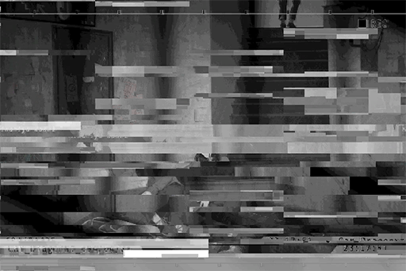

**？？？** 
......

**？？？** 
W, who t͘͠,̷,͜͝\[̨g̵!̡̕ you? What p̡҉͘2̴̶̛͏͟t̷̸̵͡ want!?

**？？？** 
Don't come near me!

_\[Kicks\]_

**？？？** 
UGH! You little b\*\*\*\*...

_\[Hurried Footsteps\]_

**？？？** 
_\*Huff\*... \*Puff\*..._ HELP!

**？？？** 
You're not getting away!

_\[Taser\]_

**？？？** 
AHH2҉҉n4́͡b̢͘7̛͡͡3̷̛͘>̡͠g͞8!

_\[Signal Lost\]_

[*(Click here to go back to the top)*](#toc)

## \[#031\] Cam\_Noah\_702\_09\_07
### Requirements
|  Char.  |Lv.|Lv. Locked?|
|---------|:-:|:---------:|
|**Aroma**|22 |    No     |

### Unlocked Charts
|     Song      |Char.|Diff.|Lv.|
|---------------|:---:|:---:|:-:|
|**Neon Escape**|Aroma|Hard | 6 |

### Log Content
**Aroma** 
AHHHHHHH!!

_\[Hurried Footsteps\]_

**Helena** 
Aroma!?

**Noah** 
What happened? Are you alright?

**Aroma** 
Aaaa, AHHHHH!!

**Helena** 
It's locked!? Aroma, open the door! What's going on!? 
Damnit... I don't know the password!

**Noah** 
Your birthday!

_\[Unlocks\]_

**Aroma** 
AHAH...... AHHHHHH!!

**Helena** 
Aroma! Wake up!

**Aroma** 
Ahhhh, _\*Sobs\*_...

**Helena** 
It's okay, Aroma. Everything's fine. See, it's me!

**Noah** 
... Is it a nightmare?

**Aroma** 
_\*Cries\*_...

**Aroma** 
... Sister?

**Helena** 
Yes, it's your sister. I'm right here...

**Aroma** 
……！！

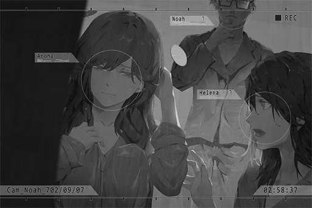

_\[Stabilizer warning\]_

**Aroma** 
_\*Cries\*_... _\*Cries harder\*_... _\*Bawls\*_...

**Helena** 
... Just what is going on with Aroma!? 
Noah, do something!!

**Noah** 
......

_\[Signal Lost\]_

[*(Click here to go back to the top)*](#toc)

## \[#032\] Cam\_Noah\_693\_08\_09
### Requirements
|  Char.  |Lv.|Lv. Locked?|
|---------|:-:|:---------:|
|**Aroma**|23 |    No     |

### Unlocked Charts
|     Song      |Char.|Diff.|Lv.|
|---------------|:---:|:---:|:-:|
|**Neon Escape**|Aroma|Chaos|10 |

### Log Content
**[Iris]** 
_The continuation exam is right around the corner. I'm so nervous..._

**Aroma** 
You don't have to be nervous. According to a senior, the continuation exam from I to J is not actually that difficult.

**[Iris]** 
_It's easy for you to say that, since you, Clara and Daniel are the Big 3. You guys are going to crush this exam with ease...  
If I don't stay in the same grade range as you guys, I'm getting demoted to class 2 the next semester..._

**Aroma** 
You worry too much\~ Iris will be fine too. We studied late every day just for this, didn't we?

**[Iris]** 
_Yes..._

**Aroma** 
Just approach it normally. With your current grades, you can mess up 1 or 2 questions and still end up in class 1. All you need to do is perform up to your usual standards. If you're too nervous, you won't remember what you studied. 
Relax\~ We are all going to J\-1, together.

**[Iris]** 
_Got it! Hearing you say that really calms my mind down... Though I hope you can encourage yourself like that on stage too. Every time I see you on\-stage, I always get sweaty palms because you're literally shaking. Haha._

**Aroma** 
Don't tease me like that\~ That's mean!

**[Iris]** 
_Aroma is about to become a celebrity... feels like you're going to another world. I'm happy for you, but I also feel a bit... lonely. When you become famous, will we still be friends?_

**Aroma** 
You're overexaggerating... I promise you, that no matter what happens, we will always be best friends. Forever.

**[Iris]** 
_Uh\-huh! Deal! 
On a side note, it's getting pretty late. Is it ok for you to stay up till now?_

**Aroma** 
Sister is not coming home tonight, so I can stay up a bit later. However, it's about time I go to sleep too.

**[Iris]** 
_Yep, same for me. See you tomorrow at school then! Goodnight,_

**Aroma** 
Goodnight\~

_\[Call ends\]_

**Aroma** 
Yawns\~ Tuner\-san, set the alarm clock. I'm going to bed.

**[Tuner-san]** 
_Alarm clock set. Goodnight, Aroma\~ Goodnight\~_

_\[Crashing noises\]_

**Aroma** 
！？ 
What is that noise...?

**Noah** 
...... Damnit!! Those pieces of s\*\*\*!

**Aroma** 
Noah...?

_\[Door Opens\]_

**Aroma** 
Noah? Are you alright?

**Noah** 
Ah... Aroma... I just got home... 
Did I disturb your sleep...?

**Aroma** 
No, I was just about to sleep... Are you okay? You look terrible...

**Noah** 
Those old bastards! Hoarding all the resources yet don't have the knowledge to do anything! what can't they just all die!?

**Aroma** 
...... Noah!?

**Noah** 
They understand nothing! The importance of this technique! This will offer a brand\-new interpretation to existing technology!! Such a major breakthrough! Could anybody else achieve these results!?

**[Tuner-san]** 
_Noah blood alcohol level too high, recommend proper rest._

**Noah** 
Shut up...

_\[Tuner-san OFF\]_

**Aroma** 
......?

**Noah** 
Aroma... you understand, right? All the hard work I did...

**Aroma** 
I understand. It's all for sister...

**Noah** 
No...... Ugh!

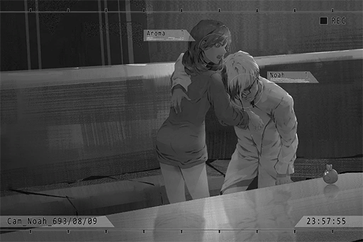

**Aroma** 
Woah! Be careful. Maybe you should sit down first?

**Noah** 
Everything I did... It's all for you...

**Aroma** 
Eh?

**Noah** 
IT'S ALL FOR YOU! YOU STILL CAN'T SEE THAT!?

**Aroma** 
Ummm... Noah? What are you talking... EEK!

**Noah** 
......

**Aroma** 
What are you doing!? You're drunk! Please calm down!

**Noah** 
You should've realized for a while now, right? Compare to Helena... I rather... you...

**Aroma** 
No...... AHHHHHH!!

_\[Signal Lost\]_

[*(Click here to go back to the top)*](#toc)

## \[#033\] Cam\_ARC\_H\_694\_05\_12
### Requirements
|  Char.  |Lv.|Lv. Locked?|
|---------|:-:|:---------:|
|**Aroma**|24 |    No     |

### Log Content
 
_[Click the image to watch the movie]_

[*(Click here to go back to the top)*](#toc)

## \[#034\] Audio\_Trans\_03\_702\_12\_26
### Requirements
|     Char.      |Lv.|Lv. Locked?|
|----------------|:-:|:---------:|
|**Crystal PuNK**|28 |    No     |
|**Aroma**       |25 |    Yes    |

### Log Content
_\[Call Starts\]_

**[Helena]** 
_Hello, hello? Noah!?_

**PAFF** 
Helena, it's me.

**[Helena]** 
_Aroma? Are you okay!?_

**PAFF** 
Yeah... I'm alright.

**[Helena]** 
_Why are you just calling me now? I saw the news that 03 was also attacked by drones, but your phone wasn't working..._

**PAFF** 
I'm sorry. So much has happened recently, I had to wait until now to call. 
I've been pretty good, and even got my memories back.

**[Helena]** 
_Really?_

**PAFF** 
Yeah... Anyway, I'm with NEKO and them on a train to 08. I'll head back in a few days.

**[Helena]** 
_Okay, that's wonderful... really..._

**PAFF** 
Sis, are you okay?

**[Helena]** 
_I... I'm great, nothing's going on..._

**PAFF** 
You sound strange, I can tell... 
... Is it something with Noah...?

**[Helena]** 
_...... 
Ha... You've really grown up._

**PAFF** 
Helena?

**[Helena]** 
_... After you left, I told him about you leaving and tried to convince him that it was for the best. But he just couldn't accept it. We got into a huge fight... We didn't talk for a few days. Just did our own things in the house without even looking at each other._

**[Helena]** 
_Then... about 2 weeks ago, I woke up and... he was gone_.

**PAFF** 
Gone...?

**[Helena]** 
_So when you called, I thought it was Noah... He was so angry..._

**PAFF** 
......

**[Helena]** 
_Ah, what am I doing. Why am I talking about this? You don't need to worry. After he thinks it over, he'll come home._

**PAFF** 
I'm sorry.

**[Helena]** 
_Aigh, you don't need to apologize! Oh, you said you got your memory back? Then hurry up and come... come..._

**PAFF** 
Sis?

**[Helena]** 
_Other... wise... I\-I... I'm gonna..._

_\[Call Ends\]_

**[Tuner-San]** 
_Your battery has no power, please charge immediately._

**PAFF** 
Eh!?

**[Nora]** 
_What's wrong PAFF?_

**PAFF** 
Tuner\-san cut off while I was talking to my sister. Ran out of electricity...

**[Nora]** 
_I see... The core in my chair and ROBO can produce electricity, but this device is a bit old. Our current equipment is unable to charge it. 
I'm sorry, there's nothing I can do._

**PAFF** 
No, it's okay... it's just...

**[Nora]** 
_Just what?_

**PAFF** 
If possible, I'd like to go home first... But we're on such a tight schedule, don't we need to make a move right away?

**[Nora]** 
_... It shouldn't be an issue. 
I'll let Mr. Neumann know._

**PAFF** 
Really?

**[Nora]** 
_You need to make sure your family isn't worried, right? We can take that risk. Let's go._

**PAFF** 
Yeah... okay.

_\[Signal Lost\]_

[*(Click here to go back to the top)*](#toc)

## \[#035\] Audio\_Noah\_702\_12\_29
### Requirements
|  Char.  |Lv.|Lv. Locked?|
|---------|:-:|:---------:|
|**Aroma**|26 |    No     |

### Log Content
_\[Doorbell\]_

_\[Door Opens\]_

**Helena** 
Aroma!? It's really you! You came back!

**PAFF** 
Helena... I...

**Helena** 
Come in, come in. Sit down first.

**PAFF** 
... Okay.

_\[»»»Fast Forward»»»\]_

**Helena** 
All that happened during this time... 
Well, the important thing is that you're okay! Let me organize your room. I haven't swept in a while...

**PAFF** 
Sis, I just came back to see you...

**Helena** 
... What do you mean?

**PAFF** 
There's something important that I've gotta... No, that I want to do.

**Helena** 
......

**PAFF** 
I feel like this is going to affect the fate of mankind... And I... I have the ability to stop it.

**Helena** 
... It sounds dangerous. Aroma, if that's the case, I don't want you to go.

**PAFF** 
I...

**Helena** 
But I know that you've already made up your mind. If that's the case, I shouldn't try to stop you... Do you remember what I told you? It's time for you to determine your own fate.

**PAFF** 
Helena...

**Helena** 
... Haha, I'm just trying to be brave. When I think that you may never come back, I...

**PAFF** 
Come on, now! You're always the one protecting me. It's time for me to start protecting you. 
I promise you, I'll come back!

**Helena** 
Aroma... _\*sob\*... \*sob\*..._

**PAFF** 
Oh yeah, sis. Take this.

_\[Puts down item\]_

**Helena** 
... Tuner\-san? It's got no power?

**PAFF** 
Yeah... You used to always charge it for me. I don't even know how long the battery lasts. How embarrassing...

**Helena** 
Haha... You little...

**PAFF** 
Sis, this speaker brings back so many meaningful memories. Do you remember when you crept up all mysteriously and pulled it out from behind your back? I ran up and hugged Tuner\-san so tightly...

**Helena** 
How could I forget? Your smile was so cute, you refused to let go. The first photo was taken then.

**PAFF** 
Speaking of firsts, the first time it ran out of power I thought I had broken it. I kept crying and wouldn't stop.

**Helena** 
Oh yeah! After I charged it the first thing I did was to take a picture of your face covered in tears! When you grew up you kept wanting to delete it, but I wouldn't let you.

**PAFF** 
We used that to take a group photo, didn't we? You, me and Noah in this room... It was to celebrate the success of the first album.

**Helena** 
That's right. No. 1 on 7 billboard charts. 
... Haha, you even remember that...

**PAFF** 
Ya, you saved money for so long just to buy me that. I've always cherished it. I brought it everywhere... So, I want to leave it here.

**Helena** 
!? Leave it... here?

**PAFF** 
Yeah, I'm giving it to you. You can take care of it for me until I get back.

**Helena** 
... Okay, it's a deal. I'll take good care of it. 
Aroma... you better come back!

**PAFF** 
Okay! Absolutely! 
When I get back we'll use it to record even more wonderful memories!

_\[Hugs\]_

**Helena** 
Aroma, thank you...

_\[Signal Lost\]_

[*(Click here to go back to the top)*](#toc)

## \[#036\] Audio\_St03\_702\_12\_29
### Requirements
|  Char.  |Lv.|Lv. Locked?|
|---------|:-:|:---------:|
|**Aroma**|26 |    No     |

### Log Content
**Hayato** 
Vicky! Over here!

**Vicky** 
Huff... puff... you bum! Making me this tired...

_\[Knocks Hayato's head\]_

**Hayato** 
Hey! Ouch! Vicky, why you hitting me?

**Vicky** 
Haven't heard from you in an entire month. Scared me half to death, thought you got snatched up by Mogura and his men... Alright, you find out what's really going on since you got back?

**Hayato** 
Um... yeah... I got something.

**Vicky** 
Oh, not bad, not bad. Quit wasting time and gimme the report!

**Hayato** 
Wait a sec, there's too many people here... Let's find somewhere else to talk.

_\[»»»Fast Forward»»»\]_

**Vicky** 
This... is some serious stuff. Basically, what you're saying is that even though we can't confirm PAFF's identity, all of this started in 08?

**Hayato** 
Yeah... um, that's right.

**Vicky** 
So this is connected to the drone attacks, and even Cherry's death... My intuition was correct, an exclusive like this only comes around once every hundred years!

**Hayato** 
Vicky, we already talked about this...

**Vicky** 
I know, I won't go near PAFF. But this evil actor behind the scenes is fascinating. If we can pull him out...

**Hayato** 
No. Based on what Nora said, this person is extremely dangerous. Even Kyuu Hou Kai is no match... Xenon's there helping out, but the power that they're up against is immense. That's why Cherry...

**Vicky** 
... Let me get this straight. 
Xenon... Simon Jackson, is innocent?

**Hayato** 
Yeah, he was framed by the real Æsir. His memory was affected as well... That's what NEKO said, so it should be accurate.

**Vicky** 
…… Damn……

**Hayato** 
Vicky?

**Vicky** 
At the time, public opinion said that he was guilty. Didn't we do several special articles jumping on that bandwagon? That's why 08 Daily's subscriptions went up so suddenly.

**Hayato** 
......

**Vicky** 
Then, he got arrested. I thought I had gotten a big exclusive. For so long, I was so happy with myself...  What's the difference between that and straight up helping Æsir? Haha...

**Hayato** 
Vicky, if we didn't investigate that stuff, then... If that's the case, then Susan and I were also in the wrong...

**Vicky** 
No, no. I was the one making decisions. It's my responsibility. 
Hayato, where's he now?

**Hayato** 
He... he's in 03. Mr. Neumann tried to get him to come, but he wouldn't come with us.

**Vicky** 
I can understand why... 
If that's what's going on, there's no way I can stay out of this.

**Hayato** 
......

**Vicky** 
So you feel the same. Even though they told you to go home, you don't want to back out like this.

**Hayato** 
That's right. Even though I'm a nobody here, I know what's really going on... Plus, I know someone that ought to know about this, and perhaps he can help.

**Vicky** 
Who?

**Hayato** 
It's...

_\[Explosion\]_

**Vicky** 
That sound... did you hear it?

**Hayato** 
... I know what that is. 
I heard the same sound recently... at Kyuu Hou Kai.

**Vicky** 
......!?

_\[Explosion\]_

**Hayato** 
It's begun... We've got to go find him!

_\[Hurried Footsteps\]_

**Vicky** 
Wait a sec, you haven't said who we're looking for!

**Hayato** 
Vicky, I'll introduce you when we get there, trust me!

_\[Explosion\]_

**Vicky** 
... Hey, hey. Looks like the brat's finally grown up. 
I'll trust you this time!

_\[Signal Lost\]_

[*(Click here to go back to the top)*](#toc)

## \[#037\] Audio\_JOE\_702\_12\_29
### Requirements
|  Char.  |Lv.|Lv. Locked?|
|---------|:-:|:---------:|
|**Aroma**|26 |    No     |

### Log Content
**Hayato** 
... What's going on? JOEZ Cafe...

**Vicky** 
It's been left in complete ruins... Is this because of the last attack? Hayato, could it be that they're already...

**JOE** 
Huh? Already what?

**Vicky** 
Wah!

**Hayato** 
... JOE! You alright?

**JOE** 
You kiddin' me, a small explosion like that is nothing more than a scratch. You're... Hayato Kusu, right? Pretty sure that's it.

**Hayato** 
You got it. But... how...

**JOE** 
When I talked with Nora, she told me about what happened with PAFF and Miss Wildcat. She also mentioned you... I figured you'd come find me. Guess I was right.

**Hayato** 
I see... Since that's the case, I'll be blunt. Mr. JOE, you must know what's going on, right? We need your help!

**JOE** 
Hehe, love it when people beg... Come in, why don't ya? Tell me exactly what's going on.

_\[Doorbell\]_

**Hayato** 
Wah! All these people...

**Lai** 
What the hell's this rat doing here?

**JOE** 
Let's just say he's one of my sources. 
Hayato, you came here 'cuz you heard about news of an attack, right? Fill us in on the details.

_\[»»»Fast Forward»»»\]_

**Lai** 
Evil... ?

**Hayato** 
That's right... Based on Nora's speculations, if they caused the drone attacks, then an even larger scale attack will soon...

**JOE** 
Looks like that's now. We just got the news... This time, the ones attacking aren't drones.

**Hayato、Vicky** 
Eh?

**Lai** 
Based on the boys' reports, a group of human\-looking robots barged into the city, heading towards A.R.C. headquarters. Also got news that they attacked some people...

**Vicky** 
Human\-looking people? Could it be... Ah! 
The Architects recorded in history?

**Hayato** 
Mr. Colin's hypothesis is just that; the ones carrying out the attacks are Architects! 
Mr. JOE, please...

**JOE** 
Hayato, brother. Relax. We already talked it over with the gangs. If another attack occurs, the gangs will head out to help the people... The boys at headquarters already set out.

**Hayato** 
Eh!? ...Thank you!

**JOE** 
Hehe, I just hope the people change the way they look at the gangs, you're embarassing me by thanking me! Haha...

**Lai** 
Hey, weren't we the ones who did all the work? Ya little brat!

**Hayato** 
T\-Thank you all!

_\[Explosion\]_

**Hayato** 
Wah! Not again...

**Lai** 
Tsk... Quick, report the lastest attack sight!

**Gang Member A** 
Reporting, Architects are roaming the east side of Quadrant II's industrial area! We've got footage from local residents...

_\[Projection\]_

**Hayato** 
......!? Is that... NEKO's house!

**JOE** 
W\-What!? Are you kidding me?

**Hayato** 
Really! I've been there to take photos, so I'm sure!

**JOE** 
You frigging kiddin' me!? Brother Lai, let me borrow some men. We'll go take a look! You take over here!

**Lai** 
Quit bossing people around! I've been in charge this whole time! Team A, get ready! Follow that bastard!

**Gang Member** 
You got it!

**JOE** 
Haha, thanks... Hayato, you wanna come?

**Hayato** 
Of course! 
Hey, Vicky! Find somewhere safe...

**Vicky** 
Safe my a\*\*!

**Hayato** 
!?

**Vicky** 
You dummy, did you forget what I taught you? As a dignified reporter, you've got to go deeper into the danger zone during times of crisis and get the news. 
How could I shirk my responsibilty and run away!?

**Hayato** 
But...!

**Vicky** 
Ain't no "buts" about it! Boss, let's go!

**JOE** 
... Hey, I'm a bit moved. 
Lady, you're not so bad. The babe in black stockings is worth commending... After we get this done, any chance I can buy you a drink?

**Vicky** 
Ha? What the hell are you talking about?

_\[Sound of an explosion\]_

**JOE** 
..._\*sigh\*_... Guess there ain't no time for small talk. 
Come with me, let's move!

**Hayato** 
You got it!

_\[Signal Lost\]_

[*(Click here to go back to the top)*](#toc)

