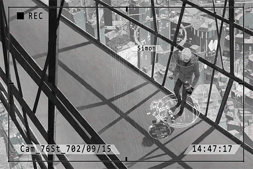

# Cam_76St_702_09_15_2
## Requirements
|Character |Level|
|----------|:---:|
|**Cherry**| 14  |

## Unlocked Charts
|     Song     |Character|Diff.|Level|
|--------------|:-------:|:---:|:---:|
|**SYSTEMFEIT**| Cherry  |Easy |  3  |

## Log Content

**[Xenon-A.I.]** 
*Rewind complete. Communication records that match criteria: 1.*

**Xenon** 
Nailed it. Tracked down several scattered coordinates, all in Quadrant I.

**Cherry** 
How many times do we have to repeat this process?

**Xenon** 
The coordinates are a lot less scattered than I imagined. Looks like our target only operates in certain areas. Might get it within two or three more tries. 
We need to visit the next location on the 18th at 09:00 p.m. The next location is... *\*Sighs\**... why did it have to be here?

**Cherry** 
Where?

**Xenon** 
The river bank where we broke up...

**Cherry** 
Ah... I visit there from time to time when I'm by myself.

**Xenon** 
......

**Cherry** 
Hey, Ummm... even though I don't really understand this stuff, but I suppose what you're tracking now was where he contacted me last year, right?

**Xenon** 
Yeah, but it's still better than no clue at all. 
My A.I. is also investigating the current location of the hooded female suspect. If we visit the locations where she might show up at the same time, we may discover more things. 

**Cherry** 
So you're finally using "we"? I guess I'm now a part of this as well? Investigation team member code 01, Sherry Pauline, reporting for duty!

**Xenon** 
... Same as usual. Stay cautious.

**Cherry** 
Yes, sir! Captain Xenon!

**Xenon** 
Do you still have time to goof around like this? It's 5 minutes to 3 now.

**Cherry** 
EHH!? Well, gotta go. Chris is going to be soooo mad.

**Xenon** 
You can keep the transceiver. Without disruption, it should be able to receive signals from a radius of 10 km. Use this for contact.

**Cherry** 
Yes, sir! Captain Xenon!

**Xenon** 
OK, OK, I get it. The pedestrians are staring at you, so get going.

*[Signal Lost]*
