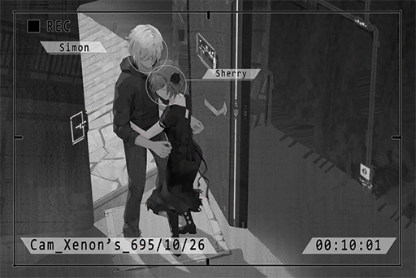

# Cam_Xenon's_695_10_26
## Requirements
|Character |Level|
|----------|:---:|
|**Cherry**| 18  |

## Log Content
*\[Door Opens\]*

**Xenon** 
Sherry? Why are you here all of a sudden? 
... Why are you dressed up like this?

**Cherry** 
......

**Xenon** 
... What happened? Are you crying?

**Cherry** 
*\*sniff\**... no...

**Xenon** 
Come inside first.

*\[Door Closes\]*

*[»»» Fast Forward »»»]*

**Xenon** 
... Are you going to tell me what happened?

**Cherry** 
...Sorry. I don't want to say anything now.

**Xenon** 
......

**Cherry** 
Can you just... hug me and don't say anything?

**Xenon** 
... Sure.

**Xenon** 
......

**Cherry** 
......

**Cherry** 
Hey, sing "Still" for me...

**Xenon** 
\*I know why they are laughing at us 
I see the sadness spread in your eyes  
once we were dancing, singing 
somehow it all changed 
no one else  could understand\*

**Cherry** 
Haha... your singing sucks.

**Xenon** 
This song was written for you originally... the pitch is too high. 
How about you sing it.

*\[Singing\]*

**Xenon** 
... Beautiful.

**Cherry** 
The song is very well\-written... Lately, when I'm feeling distressed, I'll sing this song. It calms me down.

**Xenon** 
... Is there something that makes you feel distressed?

**Cherry** 
... Simon, There are secrets between us, certainly. But I'm scared at the thought that I'll lose you once you know about them... I'm scared that you can't accept the "real" me...

**Xenon** 
... Every person needs secrets. I will not ask you to tell me everything just because we're together. We both agreed to give each other some space, didn't we?

**Cherry** 
Yes...

**Xenon** 
It's fine if you tell me when you're ready. No matter what the "real" you is, I will always try to accept it, because I treasure this relationship as much as you do.

**Cherry** 
Thank you... you're so kind. 
I still can't tell you everything now, but I will once I'm ready to do so...

**Xenon** 
It's ok. I'll be waiting.

*[Signal Lost]*
