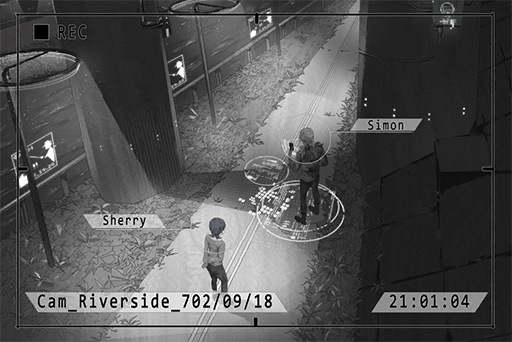

# Cam_Riverside_702_09_18_1
## Requirements
|Character |Level|
|----------|:---:|
|**Cherry**| 20  |

## Log Content
*\[Engines Off\]*

**Xenon** 
We're here.

**Cherry** 
We don't need to use the transceivers here?

**Xenon** 
There's no one here, no need for that. On top of that, I can pretty much guess where you were standing at the time...

**Cherry** 
Yeah, it's right there.

**[Xenon-A.I.]** 
*Rewind Starts.*

**Xenon** 
So you really do come here by yourself for no reason...?

**Cherry** 
Yes. I come here to repent myself for leaving without ever saying "Sorry" to you...

*[<<< Flashback <<*

**Xenon** 
Here's all the evidence. Is this the "secret" that you've been unable to tell me all this time...?

**Cherry** 
I...

**Xenon** 
... I should have let him die...

**Cherry** 
Simon... I really don't know about this...

**Xenon** 
You've been helping him all this time, right?

**Cherry** 
We... this is the only way for us to live...

**Xenon** 
He's a murderer!!

**Cherry** 
HE'S MY FATHER!!

**Xenon** 
... Even if he is, he is just a criminal to me now. For the things that he has done... I will not allow him to escape the law!

**Cherry** 
... Then what about me? Am I also just a criminal to you now?

**Xenon** 
......

**Cherry** 
You can't accept this, can you? The real me...

**Xenon** 
......! 
... I don't...

**Cherry** 
*\*Bawls\**

**Xenon** 
......

*[Signal Lost]*
