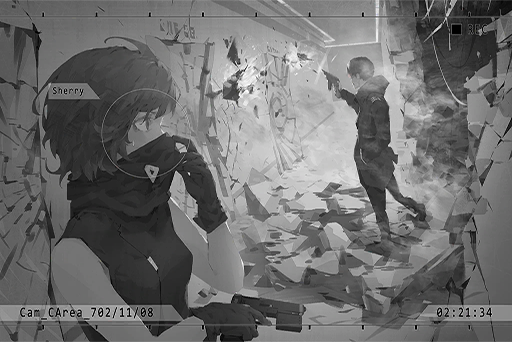

# Cam_CArea_702_11_08
## Requirements
|Character |Level|
|----------|:---:|
|**Cherry**| 34  |

## Log Content
**Cherry** 
This is S. I'm in.

**[Rald]** 
*I see your position on the map now. Turn right at the next intersection. Open the second door. You'll see a LE\-113A drone inside.*

*\[Gunshot\]*

**[Rald]** 
*Nice shot. I expect no less for someone hired by the Cafe.*

**Cherry** 
Having such a detailed understanding of the underground passages in the restricted area, you're not too bad yourself either.

**[Rald]** 
*\*Chuckles\* I appreciate your comments.*

**Cherry** 
Will we really reach Simon's cell by going down this way?

**[Rald]** 
*No need to worry, trust me. Later, there will be a brief moment with no signal. Therefore, you'll need to follow my instructions.*

*[»»» Fast Forward»»»]*

**Cherry** 
... I'm curious. If you know the topography down here so well, why hire a gunman? Why don't you just do it yourself?

**[Rald]** 
*Hmm... Perhaps I'm currently in a situation where I can't quite move around easily, or perhaps I feel like things are more interesting this way. Who knows?*

**Cherry** 
......

**[Rald]** 
*Isn't this great for you though? Don't you want to save him yourself? Miss Pauline?*

**Cherry** 
......!? How did you know my name? 
Hey? Hello...?

**[Rald]** 
*[Signal Lost]*

**Cherry** 
... Damnit, signal lost.

*\[Hurried Footsteps\]*

**Cherry** 
This is it. Password lock... Simon, I'll be there in a minute.

*\[Alarm\]*

**Cherry** 
......!?

**[Control System]** 
*Decision: Incorrect password. Defense system activate. Deploy model LE\-113C security drones to perform full area scan. Law enforcement agents, please leave this area as soon as possible.*

**Cherry** 
The password is incorrect!?

**[Control System]** 
*Model LE\-113C security drones, deploy start.*

**Cherry** 
... We're tricked.

*[→Signal Switch]*

**[Drone]** 
*Target acquired. Initiate termination process immediately.*

*\[Hurried Footsteps\]*

**Cherry** 
S\*\*\*! It's a dead end!

**[Drone]** 
*Target acquired. Initiate termination process immediately.*

**Cherry** 
Tch...

**[Rald]** 
*This is R. Woah, looks like it's quite the spectacle on your side of things.*

**Cherry** 
You bastard! How dare you trick me! Where the f\*\*\* am I at right now!?

**[Rald]** 
*No need to worry. I've already opened Simon's cell door. However, it seems like he doesn't really want to come out.*

**[Xenon]** 
*Sherry!? What are you doing here?*

**Cherry** 
......!

**[Rald]** 
*As you just saw, your dear friends are literally risking their lives for you. All in all, I will leave the door open for you, the door to end this entire fiasco. The rest is up to you. 
Feels like your dear friends are in a pretty serious pinch. Allow me to take my leave first.*

*[»»» Fast Forward»»»]*

*\[Explosion\]*

**Cherry** 
WAAA!?

*\[Gunshot\]*

**ConneR** 
Thanks for the hard work, Miss Pauline.

**ConneR** 
All clear. Let's go. The operation is over.

**Cherry** 
You...!

**ConneR** 
Yikes... K270? So you held on for so long using that piece of junk? Impressive, I should give you some bonus payment.

**Cherry** 
... The agents back there, as well as the password... You used us!

*\[Things crashing\]*

**ConneR** 
First, I "hired" you folks. Not quite "used". 
Second, From start to finish, I never mentioned anything about you meeting Simon. Seems like it's just your own misunderstanding.

**Cherry** 
......

**ConneR** 
Thanks to you folks, I was able to move around easily... Both you and the Cafe's successor have outperformed my expectations significantly. Praiseworthy indeed. 
Third, when pointing the K270 at someone, don't do it from the front...

*\[Dismantles gun\]*

**Cherry** 
......!

**ConneR** 
This toy crumbles with the slightest touch.

**Cherry** 
You... just who exactly are you? Why are you saving Simon? If you're trying to harm him...

**ConneR** 
Not the smartest question, young lady. 
If I want to cause him harm, I would've already dragged him out of there. I wouldn't leave him in there to make a "choice". This choice is essential in determining whether or not he is qualified to be my comrade.

**Cherry** 
......?

**[Drone]** 
*Target acquired. Initiate termination process immediately.*

**ConneR** 
Chit\-chat time over. You don't have that worthless gun anymore. Follow me if you don't want to die. We still got one more person to rescue.

*[Signal Lost]*
