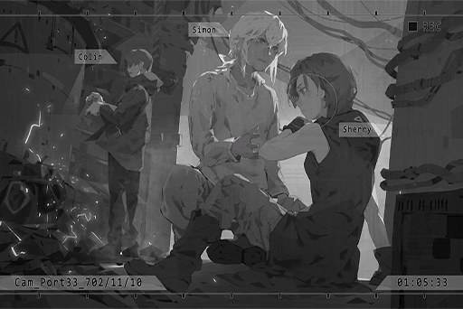

# Cam_Port33_702_11_10
## Requirements
|Character |Level|
|----------|:---:|
|**Cherry**| 35  |

## Log Content
**Hunter** 
Listen up; after I get my hands on the cargo, you guys will board the transporter right away. Don't you dare do anything unnecessary. I accepted the money. The most I can do is pretend that I saw nothing.

**Cherry** 
Okay, okay. I get it.

**Xenon** 
... You paid him?

**Cherry** 
No, not me...

**ConneR** 
I'm the one who paid.

*\[Footsteps\]*

**Xenon** 
......!

**ConneR** 
Good evening, fellas. Thanks for the hard work. You won't mind letting this old man hitch a ride as well, won't you?

**Cherry** 
... Where did you... Forget it. I don't want to know. You have a gun, right?

**ConneR** 
Not the best time for dumb and obvious questions, don't you think?

**Cherry** 
From now on, you guys will act according to my commands. Stay closely behind me. Simon, you don't have a gun, so you will bring up the rear and follow us three.

**Xenon** 
......

**ConneR** 
At you command, Mediator.

*[»»» Fast Forward»»»]*

**ConneR** 
This is my first time taking this route. Underground tunnels like this one that used to transport goods have not been properly managed since The Decommission, yet the entire system and the drone production still continue to function normally. It's as if this is a dungeon of machines. Truly a magnificent sight.

**Cherry** 
We're not here for sightseeing. Although the drones here are kinda dumb, they have very powerful weapons. Don't let your guard down.

**Hunter** 
Sighs... I wanna go home.

**Cherry** 
Shh! Get down!

*\[Drones Cruising\]*

**Cherry** 
Crap, more units that I expected. We'll miss the transporter's arrival time if we can't get through here...

**ConneR** 
One, two, three, four... Hmmm, interesting.

**Cherry** 
What?

**ConneR** 
Miss Pauline, can you somehow jump to that platform across from here? I have an idea.

**Cherry** 
... I find it hard to believe you after what happened back there in the restricted area.

**ConneR** 
Rest assured. I'm part of the team now too. I won't do anything that will harm myself. Please, take your jump.

**Cherry** 
......

*\[Lands\]*

**ConneR** 
Ah, such breathtaking grace. It's such a pleasure to watch her in action. 
You're one lucky man, Mr. Jackson.

**Xenon** 
......

**Cherry** 
Quit talking nonsense. What next?

**ConneR** 
You see those cables up there?

**Cherry** 
......! I get it, the power supply for this area... but I can't hit them from this angle.

**ConneR** 
No need to worry. When I open fire later, you just need to follow up my shots at the same time. Mr. Mad Dog, please circle over to the right side. You'll be handling the two units on the right.

**Hunter** 
... Tch.

**ConneR** 
On your mark...

*\[Gunshot\]*

**Cherry** 
......! The cables are exposed!

*\[Gunshot\]*

**Cherry** 
We did it! This should be able to buy us some time.

**[Drone]** 
*Warning, illegal trespasser detected.*

*\[Things crashing\]*

**Cherry** 
Waah!

**ConneR** 
Tch, did Mad Dog miss his targets? How useless.

**[Drone]** 
*Initiate attack.*

*\[Hacking\]*

**[Drone]** 
*Iiiiinnitiaatte atttttt....*

**Cherry** 
......

**Xenon** 
Sherry! Are you alright?

**Cherry** 
I'm fine...

**ConneR** 
(Whistle) Not bad at all, Mr. Jackson. If that thing opened fire, your girlfriend would definitely be filled with holes right now.

**Cherry** 
You! If you have this kind of trick up your sleeve, use it first! We wouldn't have to go through all that trouble in the first place!

**Xenon** 
... I've never even seen this model before. Took me a long time to finally find a loophole. Be glad that I did it in time to take out one.

**Cherry** 
The heck, that's so inconvenient!

**Xenon** 
What, you think this is GAMEBAI and all you need to do is press a few buttons?

**[Drone]** 
*Warning, illegal trespasser detected.*

**ConneR** 
You two lovebirds can save your squabble for later. We still got work to do. Mad Dog, we are going to leave you behind.

**Hunter** 
Yikes! Wait for me! Damn it...

*[Signal Lost]*
