# Cherry OS Logs
## List of Logs
- [Added on v1.1](#added-on-v11)
    - [OS Log #001](#os-log-001)
    - [OS Log #002](#os-log-002)
    - [OS Log #003](#os-log-003)
    - [OS Log #004](#os-log-004)
    - [OS Log #005](#os-log-005)
    - [OS Log #006](#os-log-006)
    - [OS Log #007](#os-log-007)
    - [OS Log #008](#os-log-008)
    - [OS Log #009](#os-log-009)
    - [OS Log #010](#os-log-010)
    - [OS Log #011](#os-log-011)
    - [OS Log #012](#os-log-012)
    - [OS Log #013](#os-log-013)
    - [OS Log #014](#os-log-014)
    - [OS Log #015](#os-log-015)
    - [OS Log #016](#os-log-016)
    - [OS Log #017](#os-log-017)
    - [OS Log #018](#os-log-018)
    - [OS Log #019](#os-log-019)
    - [OS Log #020](#os-log-020)
    - [OS Log #021](#os-log-021)
    - [OS Log #022](#os-log-022)
    - [OS Log #023](#os-log-023)
    - [OS Log #024](#os-log-024)
    - [OS Log #025](#os-log-025)
    - [OS Log #026](#os-log-026)
    - [OS Log #027](#os-log-027)
    - [OS Log #028](#os-log-028)
    - [OS Log #029](#os-log-029)
    - [OS Log #030](#os-log-030)
    - [OS Log #031](#os-log-031)
    - [OS Log #032](#os-log-032)
- [Added on v1.6](#added-on-v16)
    - [OS Log #033](#os-log-033)
    - [OS Log #034](#os-log-034)
- [Added on v1.8](#added-on-v18)
    - [OS Log #035](#os-log-035)
- [Added on v1.9](#added-on-v19)
    - [OS Log #036](#os-log-036)
    - [OS Log #037](#os-log-037)
    - [OS Log #038](#os-log-038)
- [Added on v2.0](#added-on-v20)
    - [OS Log #039](#os-log-039)
    - [OS Log #040](#os-log-040)
- [Added on v2.1](#added-on-v21)
    - [OS Log #041](#os-log-041)
    - [OS Log #042](#os-log-042)
- [Added on v2.2](#added-on-v22)
    - [OS Log #043](#os-log-043)
- [Added on v2.3](#added-on-v23)
    - [OS Log #044](#os-log-044)
- [Added on v2.4](#added-on-v24)
    - [OS Log #045](#os-log-045)
- [Added on v2.8](#added-on-v28)
    - [OS Log #046](#os-log-046)
- [Added on v2.9](#added-on-v29)
    - [OS Log #047](#os-log-047)

## Added on v1.1

### OS Log #001
___

[Back to Top](#list-of-logs) | [Next Log](#os-log-002)

#### Message\_Xenon\_702\_09\_01
**Cherry**  
Hello Simon, it's been a while  
If you see this message, can you reply to me...?  
_[Sent at 06:59 AM]_

**Cherry**  
...I know you may not have forgiven me yet   
But I do have something important that I want to tell you. If you see this, please call me back...  
_[Sent at 11:32 PM]_

[Back to Top](#list-of-logs) | [Next Log](#os-log-002)

### OS Log #002
___

[Last Log](#os-log-001) | [Back to Top](#list-of-logs) | [Next Log](#os-log-003)

#### Call\_Xenon\_702\_09\_03
_\[Call Starts\]_

**Xenon**  
Hello.

**Cherry**  
... Hi. So you still have my number.

**Xenon**  
You said you had something important to tell me. What is it?

**Cherry**  
Haha, your voice hasn't changed at all.

**Xenon**  
... If you just want to chit\-chat, I'm hanging up.

**Cherry**  
Sorry... I really do have something important to tell you! Not just about us two...  
I felt that this has something to do with your work, and I should tell you about it.

**Xenon**  
Then stop beating around the bush.

**Cherry**  
The details might get lost in the call. On top of that, I don't think we should talk about this on the internet. If you have the time, can we schedule a meetup...?

**Xenon**  
.......

**Cherry**  
You're... still mad at me, aren't you?

**Xenon**  
... I don't know.  
So many years have passed. I can now understand the situation you were in back then, and I don't really have that strong of a feeling anymore. However, now that you mentioned it all of a sudden... I don't know.

**Cherry**  
Back then, I never had the opportunity to properly apologize, or properly thank you...... I never expected you to forgive me, but at least listen to what I have to say...

**Xenon**  
... You're somewhat of a celebrity now. Is it really ok for you to meet up with me?

**Cherry**  
I'll disguise a little bit. Let's meet up at Joe's. It's quieter there.

**Xenon**  
_\*Sighs\*_... Alright, can't hurt. I'll be there this weekend at night.

**Cherry**  
Thanks. See you then.

**Xenon**  
See you.

_\[Call Ends\]_

[Last Log](#os-log-001) | [Back to Top](#list-of-logs) | [Next Log](#os-log-003)

### OS Log #003
___

[Last Log](#os-log-002) | [Back to Top](#list-of-logs) | [Next Log](#os-log-004)

#### Requirements
|  Char.   |Lv.|Lv. Locked?|
|----------|:-:|:---------:|
|**Cherry**| 2 |    No     |

#### Unlocked Charts
|                  Song                   |Char. |Diff.|Lv.|
|-----------------------------------------|:----:|:---:|:-:|
|**Stop at nothing (Andy Tunstall remix)**|Cherry|Easy | 2 |

#### Cam\_Cafe\_702\_09\_06\_1
_\[Doorbell\]_

**JOE**  
Oh, hello there Simon, as u... wait, what!? Cherry...?

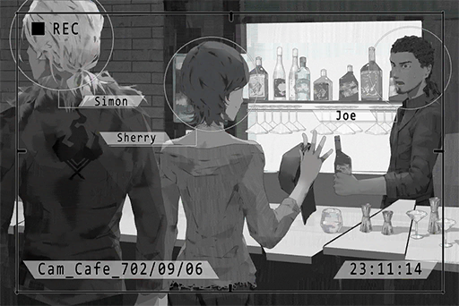

**Cherry**  
Hi! Long time no see, Joe.  
Damn, you still recognize me through all this disguise.

**JOE**  
Long time indeed! What brought you guys together again? Are you...? Simon you sneaky little playboy.

**Xenon**  
Idiot. We're just here to talk. Get us a booth.

**Cherry**  
... Haha, so you got a new girlfriend?

**Xenon**  
Don't listen to the BS he's spilling...

**JOE**  
Here, you guys can have the innermost booth. What would you like to drink?

**Xenon**  
The usual.

**Cherry**  
Long Island. Thank you.  
Hmm, you look much more handsome with your hair tied up like that. We can talk more about it later.

**JOE**  
Haha, of course!

_\[Door Closes\]_

**Cherry**  
_\*Chuckles\*_  Nothing has changed. Good to see that.

**Xenon**  
Yeah. Besides that mess of hair, he's as noisy as he ever was.

**Cherry**  
I'm talking about you. You look exactly the same as you were six years ago.

**Xenon**  
...Yeah. Probably because I've been working in air\-conditioned rooms. It probably slowed my metabolism.

**Cherry**  
We three getting together just like the old days. Man, I miss those times.

**Xenon**  
... Yes, I do too. However, that's all in the past now.

**Cherry**  
I was fiddling around iM the other day, and I came across our chatting records. Wanna take a look?

_\[Signal Lost\]_

[Last Log](#os-log-002) | [Back to Top](#list-of-logs) | [Next Log](#os-log-004)

### OS Log #004
___

[Last Log](#os-log-003) | [Back to Top](#list-of-logs) | [Next Log](#os-log-005)

#### Requirements
|  Char.   |Lv.|Lv. Locked?|
|----------|:-:|:---------:|
|**Cherry**| 2 |    No     |

#### Message\_Group\_693\_05\_26
_[S.J. has joined the chat group]_  

**JOE**  
Here he is! The future superstar!  
_[Sent at 09:20 PM]_

**Cherry**  
The guitarist you mentioned before?  
_[Sent at 09:20 PM]_

**S.J.**  
Hello everyone. I'm Simon.  
_[Sent at 09:21 PM]_

**KAI**  
Hi, I'm KAI, the drummer.  
_[Sent at 09:21 PM]_

**Cherry**  
I'm the lead singer, Cherry  
_[Sent at 09:21 PM]_

**KAI**  
We've all heard your compositions. They're f\*\*\*ing awesome!  
_[Sent at 09:21 PM]_

**JOE**  
No kidding! I almost want to worship you! Please go out with me! XD  
_[Sent at 09:21 PM]_

**JOE**  
  
_[Sent at 09:21 PM]_

**Cherry**  
...You're gonna scare him away  
_[Sent at 09:21 PM]_

**S.J.**  
Haha, it's fine.  
_[Sent at 09:22 PM]_

**S.J.**  
I've also heard your DEMO. I'm quite interested. The lead singer's voice is very nice.  
_[Sent at 09:22 PM]_

**JOE**  
XD She wrote most of it. I wrote a little bit\~  
_[Sent at 09:22 PM]_

**Cherry**  
Thank you. I did indeed write most of it  
_[Sent at 09:22 PM]_

**KAI**  
Jesus you guys are making it sound like I'm doing nothing...  
_[Sent at 09:22 PM]_

**S.J.**  
Haha, but I quite like this method of composition. By starting with the main melody, the emotions are very much on point.  
For your first song, I made a new chord for it. Give it a listen.  
_[Sent at 09:24 PM]_

**S.J.**  
\[S.J. uploads a sound file\]  
_[Sent at 09:24 PM]_

**JOE**  
OMG!! It's amazing!! Let's make this the final ver\~  
_[Sent at 09:25 PM]_

**KAI**  
Very nice. You can come to our band practice this weekend. Big sis, set up the practice room will you.  
_[Sent at 09:25 PM]_

**Cherry**  
Why are you grown\-a\*\* men calling me big sis? I'm the youngest here!  
_[Sent at 09:25 PM]_

**JOE**  
You sure? Simon's only 17  
_[Sent at 09:25 PM]_

**Cherry**  
Thy fair lady here is only 16  
_[Sent at 09:25 PM]_

**KAI**  
Thy fair lady... you sound like a big sis saying that...  
_[Sent at 09:25 PM]_

**Cherry**  
Stop yapping. I'm done setting up the virtual space in Area 3  
_[Sent at 09:27 PM]_

**S.J.**  
Umm, sorry for bothering, but can we use a physical space for practice? I'm more used to analog resonance.  
_[Sent at 09:27 PM]_

**Cherry**  
I'm ok with it, but I've never used a physical space before  
_[Sent at 09:27 PM]_

**JOE**  
Me neither\~ Won't there be a bunch of problems with feedback and stuff?  
_[Sent at 09:27 PM]_

**JOE**  
  
_[Sent at 09:27 PM]_

**S.J.**  
Yeah, but I assume that the band will have plenty of opportunities to perform in a physical space in the future. It's best that everyone learned to deal with different situations when they come up.  
_[Sent at 09:28 PM]_

**KAI**  
You have a point. Looks like we have a new band leader XD  
I'll book a practice room. My friend's instrument store has access to physical spaces.  
_[Sent at 09:28 PM]_

**S.J.**  
Thank you. Sorry for bothering everyone.   
I look forward to seeing everyone.  
_[Sent at 09:28 PM]_

**KAI**  
  
_[Sent at 09:28 PM]_

**JOE**  
Hahaha get excited! Cherry is quite the eye candy <3  
_[Sent at 09:28 PM]_

**Cherry**  
Shut up you perv...  
_[Sent at 09:29 PM]_

[Last Log](#os-log-003) | [Back to Top](#list-of-logs) | [Next Log](#os-log-005)

### OS Log #005
___

[Last Log](#os-log-004) | [Back to Top](#list-of-logs) | [Next Log](#os-log-006)

#### Requirements
|  Char.   |Lv.|Lv. Locked?|
|----------|:-:|:---------:|
|**Cherry**| 3 |    No     |

#### Unlocked Charts
|                  Song                   |Char. |Diff.|Lv.|
|-----------------------------------------|:----:|:---:|:-:|
|**Stop at nothing (Andy Tunstall remix)**|Cherry|Hard | 7 |

#### Audio\_Cafe\_702\_09\_06\_2
**Xenon**  
Man, JOE was annoying as f\*\*\* back then...

**Cherry**  
Not that he isn't now though. Haha.

**Xenon**  
This also brings back memories of our first band practice. That was one hell of a horrific mess.

**Cherry**  
I know right! JOE kept hitting the wrong notes, and KAI was so pissed off that he looked like he's gonna explode any second.

**Xenon**  
I remember there was a slap where he failed like a dozen times. KAI simply couldn't take it and threw his drumsticks at him...

**Cherry**  
But then the drumsticks somehow got lodge in his hair!

**Xenon**  
Haha... that was an instant classic. Everyone was really mad before that, but seeing it instantly made everyone crack up.

**Cherry**  
Then all of a sudden, JOE just stopped messing up. After that, every time when JOE was struggling during practice, KAI would stick a drumstick in his hair. God that was hilarious, hahaha!

**Xenon**  
Haha. Yeah, that was so dumb.

**Cherry**  
Did you remember the time when he was drunk? He stuck his hair full of drumsticks and started running around on the streets, What was he yelling...

**Cherry&Xenon**  
"I'm the King of Germs!!"

**Xenon**  
Haha! For someone who's so terrible with alcohol, it's quite ballsy of him to open up a bar.

_\[Door Opens\]_

**JOE**  
I can hear that! Simon, your milk. Cherry, Long Island.

**Cherry**  
Hi, King of Germs.

**JOE**  
Shut it! Aren't you guys here to talk about something? Is that what you guys want to talk about?

**Cherry**  
It's a lot of fun talking about it.  
Everyone was pretty drunk that day, except Simon who didn't drink. He was the only one awake.

**Xenon**  
I remember that it was eight years ago this exact day. It was your birthday.

**Cherry**  
Haha... so you still remember.

**JOE**  
Oh oh! Right! Today's your birthday! Happy birthday! I'll treat you a special cocktail later.

**Cherry**  
Thanks

**JOE**  
Haha, I recall that Simon prepared a super amusing present for you that day.

_\[Doorbell\]_

**JOE**  
Ah, got customers. You guys can go on.

_\[Door Closes\]_

_\[Signal Lost\]_

[Last Log](#os-log-004) | [Back to Top](#list-of-logs) | [Next Log](#os-log-006)

### OS Log #006
___

[Last Log](#os-log-005) | [Back to Top](#list-of-logs) | [Next Log](#os-log-007)

#### Requirements
|  Char.   |Lv.|Lv. Locked?|
|----------|:-:|:---------:|
|**Cherry**| 4 |    No     |

#### Unlocked Charts
|    Song    |Char. |Diff.|Lv.|
|------------|:----:|:---:|:-:|
|**RETRIEVE**|Cherry|Easy | 3 |

#### Audio\_Cherry's\_694\_09\_06\_1
_\[Door Opens\]_

**JOE、KAI**  
HAPPY BIRTHDAY!!

**Cherry**  
Waaah!

**KAI**  
Muhahaha! We got big sis to squeal like a little girl! Great Success!

**Cherry**  
... That scared the s\*\*\* out of me! What the hell are you guys up to?

**KAI**  
Simon told us that today is your birthday.

**JOE**  
Yeah, he said that your account ended with 0906, so he guessed that today's the day.

**Cherry**  
You bunch of... what if you made a mistake and messed up?

**JOE**  
Umm? Did we mess up?

**Cherry**  
... No, you didn't.  
That was quite the scare. Did my father know you guys are here?

**JOE**  
He was the one who let us in in the first place. He kept saying "Thank you" too.  
Too bad he has to work, or we would have made him part of the scare.

**KAI**  
What's your father's job? It's odd that he leaves for work so late.

**Cherry**  
Um, a security guard of some sort... where's Simon?

**JOE**  
He said he's going to go buy some booze, but he sure is taking his sweet time. Did he run all the way to Node 03 to buy them?

**KAI**  
He doesn't drink though. It's going to be you and me that's doing the drinking.

**Cherry**  
I can drink.

**KAI**  
You're underage! If your dad found out about it...

**Cherry**  
Nah, no probs. My father always drinks with me. I might have a higher tolerance for alcohol than you two.

**JOE**  
Oh? Interesting. Not many have dared to talk such trash to me, the Alcohol Master of Quadrant III.

**KAI**  
Well, that's all fine and dandy. But if Simon doesn't come back, we won't have anything to drink.

**Cherry**  
Ah, crap... I haven't practiced a single chord he told me to practice last week... what if he tests me on that later?

**JOE**  
Oh, right. He's teaching you the guitar.  
_\*Sighs\*_ But seriously, good looking, check. Plays Bass, check. Plays guitar, double check. On top of it all, he has a younger sister... Life ain't fair! _\*cries\*_

**KAI**  
Really good with the computer too. That guy, he really is a winner in life...

**Cherry**  
Pfft! But he's not a good singer though. His singing is so damn horrible. Hahaha.

**KAI**  
Haha! You serious? Man, I want to hear it!

_\[Signal Lost\]_

[Last Log](#os-log-005) | [Back to Top](#list-of-logs) | [Next Log](#os-log-007)

### OS Log #007
___

[Last Log](#os-log-006) | [Back to Top](#list-of-logs) | [Next Log](#os-log-008)

#### Requirements
|  Char.   |Lv.|Lv. Locked?|
|----------|:-:|:---------:|
|**Cherry**| 4 |    No     |

#### Audio\_Cherry's\_694\_09\_06\_2
_\[Door Opens\]_

**JOE**  
Hey, as we are talking, there he is.

**Xenon**  
_\*Huff\*_... I'm back. _\*Huff\*_... _\*Puff\*_

**Cherry**  
What's up? Someone after you a\*\*?

**Xenon**  
_\*Huff\*_... Something like that... Here, I bought some drinks and snacks.   
Happy birthday.

**Cherry**  
Oh... thanks.

**JOE**  
Jasus! That's quite a lot of booze. How drunk do you want to get?

**KAI**  
I thought you were the Alcohol Master of Quadrant III? Show us what you got.

**Cherry**  
None of these are very strong stuff though.

**KAI**  
Hmm? Quite experienced aren't you, big sis.

**Cherry**  
I told you I drink quite often. So what do you say, Alcohol Master? Let's get going!

**JOE**  
Umm... let's open the presents before we drink! Here's a gift prepared by yours truly.

**Cherry**  
So there are presents too? This is the first time I get presents from someone besides my father.

**JOE**  
Well then be prepared to get them every year after! Now open it!

**Cherry**  
Alright alright...

_\[Opens Present\]_

**Cherry**  
Uh... what's this?

**JOE**  
Optic therapy set! I saw this selling for cheap in the shopping area, so I ordered it. Didn't you mention that your face is a little puffy? With this set, you can obtain the golden ratio and become the idol of the new generation by simply lying down!

**Cherry**  
My face is not THAT puffy! Idiot! Dumbass! Die!

**JOE**  
No! Not the hair!

**Xenon**  
It's your fault for being so insincere. You deserve it.

**KAI**  
Yeah. Now here's mine.

_\[Opens Present\]_

**Cherry**  
Wow! A signed copy of GuluJam's Giraffe! Where in the world did you get it!?

**KAI**  
Pretty awesome right? There are only 10 copies in the entire Node. Preserve it well. Next time, we'll go see them perform.

**Cherry**  
YES of course! I'm going to treat it like the treasure of my life! Just a heads up, there's no way I can prepare a gift that can surpass this on your birthday...

**KAI**  
Haha, it's ok. Simon, how about yours?

**Xenon**  
It's here... but, I think it's better for you to open it sometime later...

**Cherry**  
Hoho? What are you trying to hide? Give it to me! Let me take a look...

_\[Opens Present\]_

**Cherry**  
......

**JOE**  
Pf, Pfhahahahah! What the heck? A necklace with a small cub!? No way in hell would she fancy something like this! Hahahaha!

**KAI**  
Pfft! Hard to say, maybe big sis will be surprisingly "Kawaii" with this necklace, hahahaha! Great present, I give it 10 JOEs for its crappiness!

**Xenon**  
... I asked my sister to pick a present. She picked this!

**KAI**  
So it's Shannon...pfft! Yep, looks like something she would pick. Can't help it then.

**JOE**  
Man, how dare you call me out for being insincere when your present is the suckiest!? And you had your sister pick it! What the heck!? Hahaha!

**Xenon**  
Sorry...

**Cherry**  
What sorry? Now drink! I'm going to get all you boys so drunk that you forget everything!

**Xenon**  
Wait, I really can't...

_\[Signal Lost\]_

[Last Log](#os-log-006) | [Back to Top](#list-of-logs) | [Next Log](#os-log-008)

### OS Log #008
___

[Last Log](#os-log-007) | [Back to Top](#list-of-logs) | [Next Log](#os-log-009)

#### Requirements
|  Char.   |Lv.|Lv. Locked?|
|----------|:-:|:---------:|
|**Cherry**| 5 |    No     |

#### Unlocked Charts
|                  Song                   |Char. |Diff.|Lv.|
|-----------------------------------------|:----:|:---:|:-:|
|**Stop at nothing (Andy Tunstall remix)**|Cherry|Chaos|11 |

#### Image\_Cherry's\_693\_09\_06
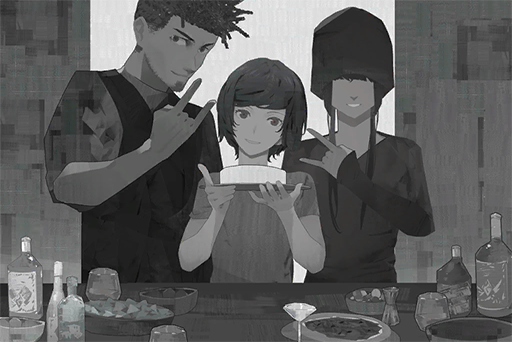

Date: 693/09/06  
Location: Node 08 \- Quadrant III, Apartment 33

[Last Log](#os-log-007) | [Back to Top](#list-of-logs) | [Next Log](#os-log-009)

### OS Log #009
___

[Last Log](#os-log-008) | [Back to Top](#list-of-logs) | [Next Log](#os-log-010)

#### Requirements
|  Char.   |Lv.|Lv. Locked?|
|----------|:-:|:---------:|
|**Cherry**| 5 |    No     |

#### Audio\_Cafe\_702\_09\_06\_3
**Cherry**  
See, I'm still wearing it, the necklace.

**Xenon**  
It looks so out of place with the outfit you are currently wearing...

**Cherry**  
That's why I've hidden it inside.  
_\*Sigh\*_... The time with Crystal\_PuNK is undoubtedly the happiest time in my life.  
What a pity that it disbanded.

**Xenon**  
Yeah, that's also the happiest time in my life.

**Cherry**  
... Will there ever be a chance that we can go back to it?

**Xenon**  
I don't see it. Everyone has their own life now. JOE hasn't played in a while. I've never seen KAI again after we disbanded. You have your own band now and it's quite successful too.

**Cherry**  
I was talking about us two...

**Xenon**  
......

**Cherry**  
Ah... sorry. That's not what I want to talk with you about... what's wrong with me?  
I actually contacted you because I want to talk to you about Æsir\-FEST.

**Xenon**  
Huh? What happened?

**Cherry**  
You know that I was one of the invited performers for that event, right?  
The stuff revealed on the internet a while ago has allowed me to recall some details... I think I've come in contact with him on the internet before the performance.  
There have been a string of terrorist attacks on the internet. I was wondering if he has anything to do with it; that's why I contacted you.

**Xenon**  
Seriously? Do you still have the conversation records?

**Cherry**  
When I went back, the records were deleted. However, I still remember the dates.

**Xenon**  
Nice! Give me the specific date and location. I should be able to rewind and track down the source location of the signal.

**Cherry**  
... So you're really investigating this person?

**Xenon**  
Yes, I have a friend. I feel that she was attacked by Æsir, but the administration bureau believes she was the one responsible for that large\-scale attack... She is currently in custody for investigation. I need to help her.

**Cherry**  
I supposed you're talking about that streamer?

**Xenon**  
Yes.

**Cherry**  
... New girlfriend?

**Xenon**  
... No. Just a collab partner.

**Cherry**  
Haha... All in all, I get you the specific time and location, you'll figure out a way to do something with them, am I right?

**Xenon**  
Yes. It would really help if you can recall all the details.  
However, don't contact me via the internet for this case. I need to investigate in the real world.   
The admins are watching me quite closely these days. It seems that they are trying to hide something from me.

**Cherry**  
Are you... tangled up in some kind of really troublesome case?

**Xenon**  
... Maybe we are all tangled up in this already.

**Cherry**  
... What do you mean?

**Xenon**  
Nothing... Whatever happens, I would not allow anything dangerous to happen to those around me.

**Cherry**  
Whether it's dangerous or not, let me help you. Take it as a small compensation for what I have done...

**Xenon**  
...Ok.

_\[Signal Lost\]_

[Last Log](#os-log-008) | [Back to Top](#list-of-logs) | [Next Log](#os-log-010)

### OS Log #010
___

[Last Log](#os-log-009) | [Back to Top](#list-of-logs) | [Next Log](#os-log-011)

#### Requirements
|  Char.   |Lv.|Lv. Locked?|
|----------|:-:|:---------:|
|**Cherry**| 6 |    No     |

#### Unlocked Charts
|    Song    |Char. |Diff.|Lv.|
|------------|:----:|:---:|:-:|
|**RETRIEVE**|Cherry|Hard | 7 |

#### Image\_Hospital\_702\_09\_07
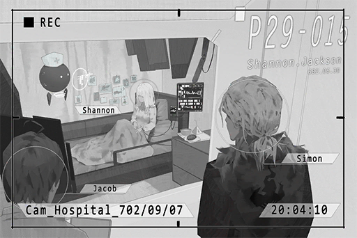

Date: 702/09/07  
Location: Node 08 \- Quadrant III, Hospital 15

[Last Log](#os-log-009) | [Back to Top](#list-of-logs) | [Next Log](#os-log-011)

### OS Log #011
___

[Last Log](#os-log-010) | [Back to Top](#list-of-logs) | [Next Log](#os-log-012)

#### Requirements
|  Char.   |Lv.|Lv. Locked?|
|----------|:-:|:---------:|
|**Cherry**| 7 |    No     |

#### Unlocked Charts
|  Song   |Char. |Diff.|Lv.|
|---------|:----:|:---:|:-:|
|**Still**|Cherry|Easy | 2 |

#### Audio\_Studio\_702\_09\_08\_1
**Cherry**  
When did you move here?

**Xenon**  
I didn't. I now live on the A.R.C. This is a workshop that I'll occasionally use when I'm on a holiday.

_\[Kicks Can\]_

**Cherry**  
Yikes! I think I just kicked something?

**Xenon**  
_\*Sighs\*_... Sorry, it's quite messy in here. I'll clean it up a bit so you can have a place to sit.

**Cherry**  
Huh, it's so unlike you to leave a room in such a sloppy condition.

**Xenon**  
It's not me. This is the handiwork of that brat.

**Cherry**  
... NEKO? You guys are a lot closer than I thought. From what I remember, you were the type of people who would get really mad when someone else touches your equipment.

**Xenon**  
... Whatever you say. I won't bother to explain anymore. I only treat her like a little sister.

**Cherry**  
Little sister... about that, how's Shannon doing?

**Xenon**  
... I don't want to talk about that.  
No more chit\-chat. Did you bring the information?

**Cherry**  
Oh... yeah, it's all here.

**Xenon**  
Why is it that your handwriting STILL looks like it's written by an elementary student? You should write more often. How am I suppose to understand this stuff...?

**Cherry**  
N, none of your business! If you want to whine then give it back!

**Xenon**  
I was just kidding, I can read it just fine.  
... He really contacted you this many times?

**Cherry**  
Yes, but each time, it's just a brief conversation to tell me something regarding the event. I've never heard him talk too. We only communicated through text.  
I can't remember the exact time on some of them, sorry...

**Xenon**  
It's okay. With this sample size, I'm fairly certain that I can rewind and find the signal source.

**Xenon**  
Give me a minute. I'll go and get something inside.

**Cherry**  
......

_\[Signal Lost\]_

[Last Log](#os-log-010) | [Back to Top](#list-of-logs) | [Next Log](#os-log-012)

### OS Log #012
___

[Last Log](#os-log-011) | [Back to Top](#list-of-logs) | [Next Log](#os-log-013)

#### Requirements
|  Char.   |Lv.|Lv. Locked?|
|----------|:-:|:---------:|
|**Cherry**| 7 |    No     |

#### Audio\_Studio\_702\_09\_08\_2
_\[Scan\]_

**[Xenon-A.I.]**  
_Data Recorded. Analyzing..._

**Cherry**  
Wow, what is that?

**Xenon**  
It's an A.I. I wrote. During the time I lost my memory, it had been investigating suspicious connections to the Æsir event for me. Yet I had no idea it was doing this.

**Cherry**  
You're also a victim?

**Xenon**  
Really don't want to admit it... but yeah. That day, I was backstage and was also affected. Similar to you, only until ROBO\-Head's recent post did I remember what actually happened in between.
  
Before that, when my A.I. kept sending me anonymous emails, I spent quite a while figuring out who's behind those emails. Turns out it was myself...

**Cherry**  
Haha... what is it doing now?

**Xenon**  
I want it to analyze the time periods where the admins will not pay that much attention to the security cameras at the locations you wrote down.  
After the humans took over the administration bureau, the difference is that they need to change shifts. There's quite a time gap between the shifts. I'll use that gap to visit those locations to rewind.

**Cherry**  
... You sound like a criminal. You'll be quite terrifying if you ever went down that path...

**Xenon**  
... You're the last person who has the right to tell me that.

**Cherry**  
Ah... Sorry...

**Xenon**  
On a side note, have you ever seen the female with a hoodie in this photo? This is the final result of my A.I.'s investigation. I feel that this person has a lot to do with the Æsir event.

**Cherry**  
... No, I haven't. I've never come in contact with him in real life, or even via a mediator. He always contacted me directly with text...

**[Xenon-A.I.]**  
_Analysis Complete._

**Xenon**  
It's done. The biggest time gap at this location, Quadrant III, 76th street, is September 15th at 02:00 p.m. I'll have plenty of time to investigate this location beforehand.

**Cherry**  
Ah, yes. That was where I received the first invitation. I should go with you.

**Xenon**  
NO, it's too dangerous.

**Cherry**  
If I go with you, I might be able to recall the more exact time and location. It's easier for you this way, isn't it?

**Xenon**  
... Still no. I'm going by myself.

**Cherry**  
That's a public location. If I want to pop up there at that exact time, you can't stop me, can you? Let me help.

**Xenon**  
... Alright, you win.  
Be careful yourself. When we arrive there, we don't want to stay too close to each other. We will communicate with the frequency transceiver. If you ever remember anything, tell me.

**Cherry**  
This is just like a spy movie.

**Xenon**  
This is not a movie though... stay cautious.

_\[Signal Lost\]_

[Last Log](#os-log-011) | [Back to Top](#list-of-logs) | [Next Log](#os-log-013)

### OS Log #013
___

[Last Log](#os-log-012) | [Back to Top](#list-of-logs) | [Next Log](#os-log-014)

#### Requirements
|  Char.   |Lv.|Lv. Locked?|
|----------|:-:|:---------:|
|**Cherry**| 8 |    No     |

#### Unlocked Charts
|    Song    |Char. |Diff.|Lv.|
|------------|:----:|:---:|:-:|
|**RETRIEVE**|Cherry|Chaos|12 |

#### Mail\_Chris\_702\_09\_10
**Subj.**: Event Schedule Notice  
**From**:  Chris Pinkman  
**To**:  Sherry Pauline

Quadrant III, Tower 054 new floor "108" opening celebration event

Time: 702/09/15, 13:00 \~ 16:30

Members of Cherry PuNK,  
please arrive before 13:00 for rehearsal

Rundown Detail  
13:00 Rehearsal  
14:30 End of rehearsal  
15:00 Admission start (15:00 \~ 15:20 check\-in: Shao)  
15:30 Event start (Venue management, opening, filming: Shao)  
17:30 scheduled end of the event  
18:30 Site recovery complete before this time, post on iM

Chris

[Last Log](#os-log-012) | [Back to Top](#list-of-logs) | [Next Log](#os-log-014)

### OS Log #014
___

[Last Log](#os-log-013) | [Back to Top](#list-of-logs) | [Next Log](#os-log-015)

#### Requirements
|  Char.   |Lv.|Lv. Locked?|
|----------|:-:|:---------:|
|**PAFF**  |18 |    No     |
|**Cherry**| 9 |    No     |

#### Call\_Chris\_702\_09\_10
_\[Call Starts\]_

**Chris**  
Hello. This is Monophonic Entertainment. I'm Chris. How may I help you?

**Cherry**  
It's me.

**Chris**  
Huh, Cherry? Why are you using this unknown number? What's the matter?

**Cherry**  
I got the notice. What's the deal with that event on the 15th? It's not on our schedule before!

**Chris**  
Ahhh, that one. PAFF was supposed to attend that event, but as you may know she's kind of... Therefore, the agency arranged you guys to go and save the day.

**Cherry**  
What the hell? When did we agree to this?

**Chris**  
I asked the Keyboard. He said that the members are all OK with it.

**Cherry**  
... I have things to deal with that day. I can't make it.

**Chris**  
Don't be stubborn. This is an event big enough to get PAFF! You guys just started, this is a prime opportunity for media exposure. Cases like this don't come by that easily, so don't make it difficult for us.

**Cherry**  
Is PAFF really in such a terrible condition that she couldn't be on stage? I saw her a while ago at the office; she looked just fine...

**Chris**  
Umm...  not quite her physical condition, more like she just completely disappeared to nowhere. The higher\-ups are in full\-on panic mode now.

**Cherry**  
Huh?? Completely disappeared? What the hell is that supposed to mean? Does Sis Helena know anything?

**Chris**  
Ah crap... no, nothing, just some rumors I heard. This is all top secret stuff, so don't spill the beans!   
All in all, the performance is already scheduled. The company hosting the event is also very open to the switch to you guys, so you better be there!

**Cherry**  
... Understood. Bye.

_\[Call Ends\]_

[Last Log](#os-log-013) | [Back to Top](#list-of-logs) | [Next Log](#os-log-015)

### OS Log #015
___

[Last Log](#os-log-014) | [Back to Top](#list-of-logs) | [Next Log](#os-log-016)

#### Requirements
|  Char.   |Lv.|Lv. Locked?|
|----------|:-:|:---------:|
|**PAFF**  |18 |    No     |
|**Cherry**|10 |    No     |

#### Call\_Xenon\_702\_09\_11
_\[Call Starts\]_

**Cherry**  
Hello, it's me.

**Xenon**  
Sherry? Did you change your number?

**Cherry**  
Yes, this is a friend's spare number. It's more secure this way.

**Xenon**  
OK. What's wrong?

**Cherry**  
Umm... about that meeting on the 15th, I might not be able to make it... agency wants me to replace PAFF at an event she can't attend. I only just received the notice.

**Xenon**  
Is PAFF's condition really that severe?

**Cherry**  
You darn cream Puff, all you do is care about her first... Ah, then I have some big news to tell you.

**Xenon**  
What news?

**Cherry**  
Although it's a slip of the tongue by my agent, it appears that PAFF has been missing recently.

**Xenon**  
Missing!? What on earth happened?

**Cherry**  
Yeah, it seems like Sis Helena can't find her either.

**Xenon**  
... My instincts tell me that PAFF's incident might have something to do with the case I'm investigating right now.

**Cherry**  
How so?

**Xenon**  
PAFF began canceling her official events since she collapsed on stage during her 7th\-anniversary concert. She hasn't even shown up in public since that event. When she collapsed, she was performing the very song she performed on Æsir\-FEST. PAFF herself has experienced memory loss in her past, which leads me to believe that the memory alteration caused by the Æsir event could have particularly severe effects on her.

**Cherry**  
... Your speculation makes so much sense that it could make the news if you post it on the internet.

**Xenon**  
The internet is too chaotic. My identity doesn't allow me to post stuff like this. Before I figure out the truth behind all this, I would not do anything.

**Cherry**  
Sounds just like you.

**Xenon**  
In short, don't force yourself to come. I'll investigate on my own. If I made any progress, I'll inform you.   
Also, if it's possible, inform me if you know anything new about PAFF's situation.

**Cherry**  
Ok, ok. See ya you cream Puff.

**Xenon**  
... Is this a thing? Why's everyone using this term?

_\[Call Ends\]_

[Last Log](#os-log-014) | [Back to Top](#list-of-logs) | [Next Log](#os-log-016)

### OS Log #016
___

[Last Log](#os-log-015) | [Back to Top](#list-of-logs) | [Next Log](#os-log-017)

#### Requirements
|  Char.   |Lv.|Lv. Locked?|
|----------|:-:|:---------:|
|**Cherry**|11 |    No     |

#### Unlocked Charts
|  Song   |Char. |Diff.|Lv.|
|---------|:----:|:---:|:-:|
|**Still**|Cherry|Hard | 6 |

#### Cam\_76St\_702\_09\_14
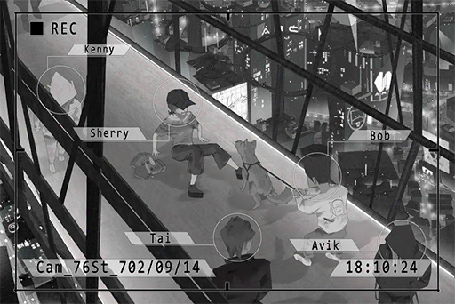

Date: 702/09/14  
Location: Node 08 \- Quadrant III, 76th Street

[Last Log](#os-log-015) | [Back to Top](#list-of-logs) | [Next Log](#os-log-017)

### OS Log #017
___

[Last Log](#os-log-016) | [Back to Top](#list-of-logs) | [Next Log](#os-log-018)

#### Requirements
|  Char.   |Lv.|Lv. Locked?|
|----------|:-:|:---------:|
|**Cherry**|12 |    No     |

#### Unlocked Charts
|  Song   |Char. |Diff.|Lv.|
|---------|:----:|:---:|:-:|
|**Still**|Cherry|Chaos|11 |

#### Cam\_76St\_702\_09\_15\_1
**[Xenon-A.I.]**  
_Rewind complete. Communication records that match criteria: 0._

**Xenon**  
Tch, still can't get anything...? As expected, it's quite difficult to do so without knowing the exact location and direction...

_\[»»» Fast Forward »»»\]_

**[Xenon-A.I.]**  
_Rewind complete. Communication records that match criteria: 1._

**Xenon**  
Got it!... year 677, she was just born. Not this one...  
If Sherry is here, things would go a lot smoother.

**Cherry**  
WAAH!! Looking for me?

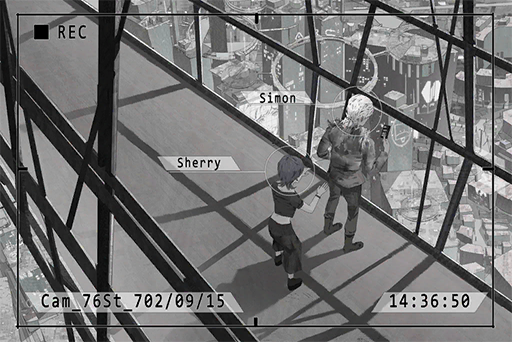

**Xenon**  
... Why are you here?

**Cherry**  
Hmph, I heard you calling out for me.  
By the way, isn't your reaction a bit too cold...?

**Xenon**  
Didn't I tell you not to force yourself to come? And don't you have a performance to deal with?

**Cherry**  
I skipped the rehearsal. Just need to get back before 3. It's just next door too.

**Xenon**  
_\*Sigh\*_ You're always like this...  
Here, take this.

**Cherry**  
What's this? Cough Drop?

**Xenon**  
It's a micro transceiver. We two are standing out too much here. Let' go over there.

**Cherry**  
So you said you are going to investigate on your own, yet you brought a pair of transceivers?

**Xenon**  
... Let's get going.

_\[»»» Fast Forward »»»\]_

**Cherry**  
Ah\~ Ah\~ Ah\~ Test, Test.

**Xenon**  
... You're way too loud. This is not a stage audio test. Don't put the mic so close to your mouth. Just pinch it to your clothes.

**Cherry**  
Why're you mad at me? I've never used things like this... how is it now?

**Xenon**  
Much better.  
Do you remember where you were standing back then?

**Cherry**  
From this angle, I do remember some things. Walk forward a bit, like 10 steps.

**Xenon**  
One, two, three, four, five, six, seven...

**Cherry**  
Stop stop stop! Stop right there. Dang, your legs are long...

**Xenon**  
OK. Where were you facing?

**Cherry**  
Hmm... probably towards your 9 o'clock direction?

**Xenon**  
Ok. My A.I. is performing the rewind now. May need some time.

**Cherry**  
... Hey, did you remember that arcade right ahead? The one we used to visit a lot to play video games?

_\[Signal Lost\]_

[Last Log](#os-log-016) | [Back to Top](#list-of-logs) | [Next Log](#os-log-018)

### OS Log #018
___

[Last Log](#os-log-017) | [Back to Top](#list-of-logs) | [Next Log](#os-log-019)

#### Requirements
|  Char.   |Lv.|Lv. Locked?|
|----------|:-:|:---------:|
|**Cherry**|13 |    No     |

#### Unlocked Charts
|    Song    |Char. |Diff.|Lv.|
|------------|:----:|:---:|:-:|
|**CREDENCE**|Cherry|Easy | 3 |

#### Audio\_bug\_692\_05\_13
_\[Gunshot\]_

**Luis**  
No good. Try again.

**Cherry**  
......

_\[Gunshot\]_

**Luis**  
Your shoulders are too stiff. You're going to injure yourself like this. Try again.

**Cherry**  
......

_\[Gunshot\]_

**Cherry**  
... Father, do I have to practice this?

**Luis**  
We're staying at a pretty dangerous place this time. The security robots might also be a model I'm unfamiliar with. You need to learn to protect yourself.  
If it's too hard, how about we take a break and continue afterwards?

**Cherry**  
No, it's okay... I don't want to be a burden to you.

_\[Gunshot\]_

**Luis**  
Still no good. Take a break, you're tired. Here, have some water.

**Cherry**  
Thank you... and sorry.

**Luis**  
Silly child, what's there to be sorry about? You just started. When you began learning the guitar, you didn't get the hang of it on day 1 either, right?

**Cherry**  
Yeah...

**Luis**  
... Daddy should be the one saying sorry. I'm the one at fault for making you have to live this kind of life...

**Cherry**  
I told you to stop bringing that up. We can't do anything about it... This is our way of life.

**Luis**  
......

**Cherry**  
Also, stop calling yourself "daddy". It's so... childish. I'm 15 years old already.

**Luis**  
... You're all grown up now. Feels kinda lonely, haha... understood.

_\[Gunshot\]_

**Cherry**  
I got it!

**Luis**  
Oh! Great! Remember the feeling you have right now. Flex your diaphragm to slow down your breathing, and fire when you exhale.

_\[Gunshot\]_

_\[Gunshot\]_

_\[Gunshot\]_

_\[Signal Lost\]_

[Last Log](#os-log-017) | [Back to Top](#list-of-logs) | [Next Log](#os-log-019)

### OS Log #019
___

[Last Log](#os-log-018) | [Back to Top](#list-of-logs) | [Next Log](#os-log-020)

#### Requirements
|  Char.   |Lv.|Lv. Locked?|
|----------|:-:|:---------:|
|**Cherry**|14 |    No     |

#### Unlocked Charts
|    Song    |Char. |Diff.|Lv.|
|------------|:----:|:---:|:-:|
|**CREDENCE**|Cherry|Hard | 8 |

#### Cam\_Gamecenter\_695\_09\_15
_\[Gunshot\]_

**JOE**  
UGHH!!  
... Cherry... H, how come...?

**Cherry**  
I'm sorry... now, die.

_\[Gunshot\]_

**[Arcade Shooter]**  
_Player1 Cherry WIN!_

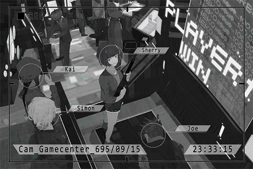

**Cherry**  
Yeah! Muhahaha! You owe me a drink, loser!

**JOE**  
Impossible... me, the Quadrant III gunslinger god, loses to a girl...

**Cherry**  
Never look down on a lady\~  
How 'bout you KAI? Want a match?

**KAI**  
I'm not really interested in this kind of game. I'm gonna go play DrumPsycho.

**Cherry**  
Tch, coward.  
Simon, you in? Wanna avenge your fellow male comrade?

**Xenon**  
Sure. Just a heads up though, I'm pretty confident when it comes to this game.

**JOE**  
YEAH! Get her!

**Cherry**  
Interesting! Bring it on!

_\[»»» Fast Forward »»»\]_

**[Arcade Shooter]**  
_Time Over! Player1 Cherry WIN!_

**Cherry**  
_\*Huff\*_... _\*Puff\*_...

**JOE**  
I... is this what a match between the pros looks like? I have absolutely no idea what the hell you guys are doing...

**Xenon**  
Ah\~\~, I lost. Haven't played in a while, needs more practice.

**Cherry**  
Doesn't count! The time was up and I didn't get to kill you!

**Xenon**  
You had a little bit more HP than I did, so you won.

**Cherry**  
I don't care, that doesn't count! Also, you went easy on me, didn't you? I demand a rematch!

**Xenon**  
I didn't... also I'm exhausted. I'll treat you tomorrow; is that ok with you?

**Cherry**  
I don't want a victory like this! I want to properly kill you!

**JOE**  
Or you can have a rematch with the new and reborn gunslinger god...

**Xenon**  
It's getting late. We should go home. I'll go get KAI and Shannon.

**JOE**  
Jasus! It's almost 12 a.m. now? Oh no, my mom's gonna shave all my hair off...

**Xenon**  
......

**Cherry**  
......

**Xenon**  
... Are you mad?

**Cherry**  
... No.

**Xenon**  
_\*Sighs\*_... Here. This is for you. Now stop being mad.

**Cherry**  
Hm? Wow! You got it from the crane game!?

**Xenon**  
Yeah. I saw you struggling at the machine for quite a while. So I decided to give it a shot.

**Cherry**  
Thank you! Wow! It's super cute!

**Xenon**  
Put it away before JOE and the others come back. Or you're gonna get mocked again.

**Cherry**  
Hmm... wait a second. How many attempts did you use to get this?

**Xenon**  
Um, one.

**Cherry**  
WHAT!? I'm going to challenge again! Damnit!

**Xenon**  
... _\*Sighs\*_.

_\[Signal Lost\]_

[Last Log](#os-log-018) | [Back to Top](#list-of-logs) | [Next Log](#os-log-020)

### OS Log #020
___

[Last Log](#os-log-019) | [Back to Top](#list-of-logs) | [Next Log](#os-log-021)

#### Requirements
|  Char.   |Lv.|Lv. Locked?|
|----------|:-:|:---------:|
|**Cherry**|15 |    No     |

#### Unlocked Charts
|     Song     |Char. |Diff.|Lv.|
|--------------|:----:|:---:|:-:|
|**SYSTEMFEIT**|Cherry|Easy | 3 |

#### Cam\_76St\_702\_09\_15\_2
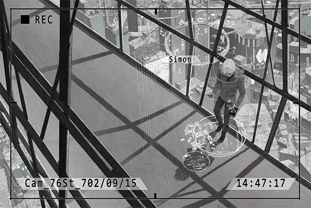

**[Xenon-A.I.]**  
_Rewind complete. Communication records that match criteria: 1._

**Xenon**  
Nailed it. Tracked down several scattered coordinates, all in Quadrant I.

**Cherry**  
How many times do we have to repeat this process?

**Xenon**  
The coordinates are a lot less scattered than I imagined. Looks like our target only operates in certain areas. Might get it within two or three more tries.  
We need to visit the next location on the 18th at 09:00 p.m. The next location is... _\*Sighs\*_... why did it have to be here?

**Cherry**  
Where?

**Xenon**  
The river bank where we broke up...

**Cherry**  
Ah... I visit there from time to time when I'm by myself.

**Xenon**  
......

**Cherry**  
Hey, Ummm... even though I don't really understand this stuff, but I suppose what you're tracking now was where he contacted me last year, right?

**Xenon**  
Yeah, but it's still better than no clue at all.  
My A.I. is also investigating the current location of the hooded female suspect. If we visit the locations where she might show up at the same time, we may discover more things.

**Cherry**  
So you're finally using "we"? I guess I'm now a part of this as well? Investigation team member code 01, Sherry Pauline, reporting for duty!

**Xenon**  
... Same as usual. Stay cautious.

**Cherry**  
Yes, sir! Captain Xenon!

**Xenon**  
Do you still have time to goof around like this? It's 5 minutes to 3 now.

**Cherry**  
EHH!? Well, gotta go. Chris is going to be soooo mad.

**Xenon**  
You can keep the transceiver. Without disruption, it should be able to receive signals from a radius of 10 km. Use this for contact.

**Cherry**  
Yes, sir! Captain Xenon!

**Xenon**  
OK, OK, I get it. The pedestrians are staring at you, so get going.

_\[Signal Lost\]_

[Last Log](#os-log-019) | [Back to Top](#list-of-logs) | [Next Log](#os-log-021)

### OS Log #021
___

[Last Log](#os-log-020) | [Back to Top](#list-of-logs) | [Next Log](#os-log-022)

#### Requirements
|  Char.   |Lv.|Lv. Locked?|
|----------|:-:|:---------:|
|**Cherry**|16 |    No     |

#### Unlocked Charts
|    Song    |Char. |Diff.|Lv.|
|------------|:----:|:---:|:-:|
|**CREDENCE**|Cherry|Chaos|12 |

#### Image\_Tower054\_702\_09\_15
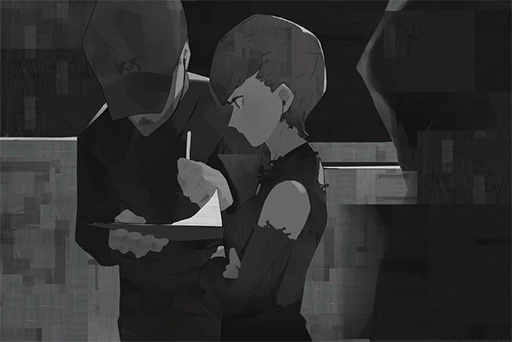

Date: 702/09/15  
Location: Quadrant III, Tower 054

[Last Log](#os-log-020) | [Back to Top](#list-of-logs) | [Next Log](#os-log-022)

### OS Log #022
___

[Last Log](#os-log-021) | [Back to Top](#list-of-logs) | [Next Log](#os-log-023)

#### Requirements
|  Char.   |Lv.|Lv. Locked?|
|----------|:-:|:---------:|
|**Cherry**|17 |    No     |

#### Cam\_Cherry's\_694\_09\_07
**JOE**  
I'm the King of Germs!!

**KAI**  
Get your a\*\* back here you moron!! Give me back my drumsticks!

**Xenon**  
Haha... he is VERY drunk.

**KAI**  
You two, go back in the house. It's really cold outside. I'll go chase him down. HEY! Where the heck do you think you're going!

**Cherry**  
Woah, it is really cold. Let's go up.

**Xenon**  
OK.

_\[→Signal switch to Cam\_Elevator\_02\]_

**Xenon**  
Are you ok? Feeling drunk?

**Cherry**  
I'm fine.

**Xenon**  
You sure? You live on floor 48, right? You picked the top floor.

**Cherry**  
Be quiet and just come with me.

_\[→Signal switch to Cam\_Roof\_01\]_

**Xenon**  
Why are we up here? I'm gonna freeze to death...

**Cherry**  
It's almost time for sunrise. We can see it here.

**Xenon**  
There's quite a bit of cloud though. Isn't that quite unlikely?

**Cherry**  
We can see it, I'm sure. Every time I'm in a bad mood, I'll visit here at this time.  
Seeing the sunrise gives me a feeling that the world is still going on. It will keep going on, with or without me. Once I'm aware of how insignificant I am, everything seems to feel better.

**Xenon**  
Didn't realize that you're such a romantic person...

**Cherry**  
Haha... don't kid yourself. You knew that, didn't you?  
Thank you for the necklace. Shannon is not the one who picked it, right?

**Xenon**  
Ah... yeah. Last time we went out for food, you were staring at it for a long time. You really wanted to buy it, didn't you?

**Cherry**  
But it was gone when I visited the shop later by myself. Where did you find it?

**Xenon**  
Didn't you mention that someone was after my a\*\*? I had to run to so many shops before I could find one that looks the same.

**Cherry**  
......

**Xenon**  
Sorry for embarrassing you in front of the guys. I feel that you don't really want other people to know that you like cute things.

**Cherry**  
... It's ok. Today is the first time that I had friends celebrate my birthday for me. I was so happy.

**Xenon**  
The happiest you got was for KAI's present, right? You had quite the reaction.

**Cherry**  
Nope, it's yours.  
You always notice all the little details. You were the one who organized this birthday surprise too. Are you secretly a girl or something...?

**Xenon**  
I didn't really organize it... I just told them that your birthday may be right around the corner. They were the ones who came up with the plan and other crap. I was sort of forced into... HMM!?

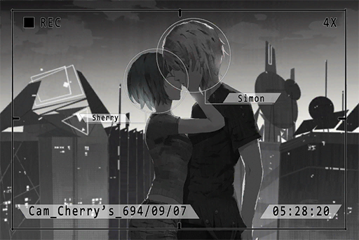

**Cherry**  
... If you treat me so kindly, you can't blame me for falling for you, can you?

**Xenon**  
......

**Cherry**  
See, I told you we can see it here, didn't I? The sunrise.

_\[Signal Lost\]_

[Last Log](#os-log-021) | [Back to Top](#list-of-logs) | [Next Log](#os-log-023)

### OS Log #023
___

[Last Log](#os-log-022) | [Back to Top](#list-of-logs) | [Next Log](#os-log-024)

#### Requirements
|  Char.   |Lv.|Lv. Locked?|
|----------|:-:|:---------:|
|**Cherry**|18 |    No     |

#### Unlocked Charts
|     Song     |Char. |Diff.|Lv.|
|--------------|:----:|:---:|:-:|
|**SYSTEMFEIT**|Cherry|Hard | 7 |

#### Message\_Joe\_702\_09\_18
**Cherry**  
Hi when does the Cafe open?  
_[Sent at 09:58 AM]_

**JOE**  
8, you coming for a drink?  
_[Sent at 10:01 AM]_

**Cherry**  
Band practice ends at 5. Have a meeting with Simon at 8  
No place to go, so I want to see if I can wait for him at your place  
_[Sent at 10:01 AM]_

**JOE**  
OH Sure! Then I'll be in the shop at 5. You can just cone in  
_[Sent at 10:02 AM]_

**Cherry**  
'Come'' in  
_[Sent at 10:02 AM]_

**JOE**  
Stop nitpicking my spelling mistakes. What, are you Simon now XDDD  
_[Sent at 10:02 AM]_

**JOE**  
By the way, did you guys get back together?  
Why are you guys contacting each other so often recently?  
_[Sent at 10:02 AM]_

**Cherry**  
No, we didn't  
Some things happened. It's complicated...  
_[Sent at 10:05 AM]_

**Cherry**  
I'd ask another question, are Simon and NEKO really not dating or anything?  
_[Sent at 10:07 AM]_

**JOE**  
I don't think so. He said their age is too far apart. He treats her like a little sister  
_[Sent at 10:07 AM]_

**Cherry**  
So like Shannon...  
_[Sent at 10:07 AM]_

**Cherry**  
Have you talked to him about it? How his sister is doing and stuff  
_[Sent at 10:07 AM]_

**JOE**  
Nope. He never allowed me to even mention his sister. Every time I bring it up, he gives me this look with ''SHUT UP'' written all over it  
_[Sent at 10:07 AM]_

**JOE**  
  
_[Sent at 10:07 AM]_

**Cherry**  
I see. I'm almost leaving. I'll talk about the rest at your place  
_[Sent at 10:08 AM]_

**JOE**  
Got it. I'll be waiting in the shop  
_[Sent at 10:08 AM]_

**Cherry**  
Just a heads up, don't get wasted by me before your customers show up,   
Alcohol Master\~  
_[Sent at 10:08 AM]_

**Cherry**  
  
_[Sent at 10:08 AM]_

**JOE**  
I have a lot more restraint now  
_[Sent at 10:08 AM]_

[Last Log](#os-log-022) | [Back to Top](#list-of-logs) | [Next Log](#os-log-024)

### OS Log #024
___

[Last Log](#os-log-023) | [Back to Top](#list-of-logs) | [Next Log](#os-log-025)

#### Requirements
|  Char.   |Lv.|Lv. Locked?|
|----------|:-:|:---------:|
|**Cherry**|19 |    No     |

#### Cam\_Xenon's\_695\_10\_26
_\[Door Opens\]_

**Xenon**  
Sherry? Why are you here all of a sudden?  
... Why are you dressed up like this?

**Cherry**  
......

**Xenon**  
... What happened? Are you crying?

**Cherry**  
_\*sniff\*_... no...

**Xenon**  
Come inside first.

_\[Door Closes\]_

_\[»»» Fast Forward »»»\]_

**Xenon**  
... Are you going to tell me what happened?

**Cherry**  
...Sorry. I don't want to say anything now.

**Xenon**  
......

**Cherry**  
Can you just... hug me and don't say anything?

**Xenon**  
... Sure.

**Xenon**  
......

**Cherry**  
......

**Cherry**  
Hey, sing "Still" for me...

**Xenon**  
\*I know why they are laughing at us  
I see the sadness spread in your eyes   
once we were dancing, singing  
somehow it all changed  
no one else  could understand\*

**Cherry**  
Haha... your singing sucks.

**Xenon**  
This song was written for you originally... the pitch is too high.  
How about you sing it.

_\[Singing\]_

**Xenon**  
... Beautiful.

**Cherry**  
The song is very well\-written... Lately, when I'm feeling distressed, I'll sing this song. It calms me down.

**Xenon**  
... Is there something that makes you feel distressed?

**Cherry**  
... Simon, There are secrets between us, certainly. But I'm scared at the thought that I'll lose you once you know about them... I'm scared that you can't accept the "real" me...

**Xenon**  
... Every person needs secrets. I will not ask you to tell me everything just because we're together. We both agreed to give each other some space, didn't we?

**Cherry**  
Yes...

**Xenon**  
It's fine if you tell me when you're ready. No matter what the "real" you is, I will always try to accept it, because I treasure this relationship as much as you do.

**Cherry**  
Thank you... you're so kind.  
I still can't tell you everything now, but I will once I'm ready to do so...

**Xenon**  
It's ok. I'll be waiting.

_\[Signal Lost\]_

[Last Log](#os-log-023) | [Back to Top](#list-of-logs) | [Next Log](#os-log-025)

### OS Log #025
___

[Last Log](#os-log-024) | [Back to Top](#list-of-logs) | [Next Log](#os-log-026)

#### Requirements
|  Char.   |Lv.|Lv. Locked?|
|----------|:-:|:---------:|
|**Cherry**|20 |    No     |

#### Unlocked Charts
|   Song   |Char. |Diff.|Lv.|
|----------|:----:|:---:|:-:|
|**hunted**|Cherry|Easy | 2 |

#### Cam\_Cafe\_702\_09\_18
_\[Doorbell\]_

**JOE**  
Yo, Simon.

**Xenon**  
... What's wrong with her? Is she drunk?

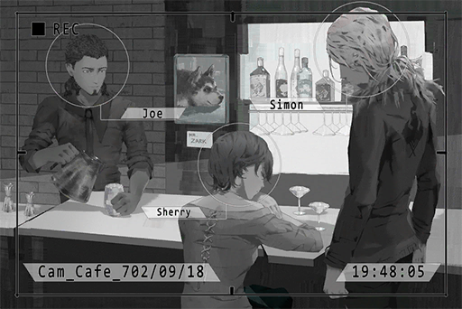

**JOE**  
Her? Do you really think she can get drunk? She just fell asleep; apparently, band practice was tough today.  
Should we wake her up?

**Xenon**  
There's still some time, let her sleep a little longer.  
Milk

**JOE**  
Coming.  
On a side note, you seem a bit too free these days. Don't you have work?

**Xenon**  
No, because my support of the admins some time ago got me plenty of holidays.

**JOE**  
Oh, I see, congrats! Then where are you guys going later?

**Xenon**  
Not telling you.

**JOE**  
Huh\~? Why are you also acting so mysterious and such? Are you guys having an underground affair?

**Xenon**  
How can there be an underground one when there's nothing on the surface to begin with... stop acting like an idiot.

**JOE**  
OK, ok. I won't delve too much into the privacy of my customers.  
Here, your milk.

**Xenon**  
... We're investigating Æsir's trace, and we might be on his tail now.

**JOE**  
Wow, you serious!? How did you guys do that?

**Xenon**  
Even if I do explain, there's no way that blockhead of yours gets it. To keep it short, once we get the evidence we need, we'll go get NEKO from the admins.

**JOE**  
Oh I see\~ Then good luck\~ Mr."Big Hero"\~  
But all things aside, isn't this quite dangerous? I mean if it's really him, he's pretty much a terrorist, isn't he?

**Xenon**  
Yeah, but someone has to do it, right? Everyone in the Node will have their brains hacked to eternity by the time those worthless admins move a muscle.

**Cherry**  
Mmm... how long have I been asleep?

**JOE**  
Around an hour... Jasus! Why are there tears all over your face!? Were you crying?

**Cherry**  
Umm... no, I wasn't! My contacts are too dry!

**Xenon**  
... Since you're awake, it's about time we get going.

**Cherry**  
Ah, ok... let's go!  
See ya JOE. I'll come for a drink next time.

**JOE**  
See ya, guys! Please be careful!

_\[Doorbell\]_

**Xenon**  
... Your makeup is a mess. Here, clean up your face.

**Cherry**  
Uh\-huh... I had a dream about our past together. So people really do cry when they wake up from crying in their dreams. Haha...

**Xenon**  
... A while ago there's someone on iM who sent a mail in their dream only to realize that they actually sent it in real life too.  
Put on the helmet, we'll ride my bike there.

_\[Engines On\]_

**Cherry**  
Wow, it's still the one I used to wear, feels nostalgic... hmm? When did it become so tight? Did you let someone else wear it?

**Xenon**  
Ah, probably NEKO? Sometimes when we compose late into the night, I'll give her a ride home.

**Cherry**  
So she really is your new...

**Xenon**  
Yeah Yeah\~ she is\~ now stop talking and get on.

_\[Signal Lost\]_

[Last Log](#os-log-024) | [Back to Top](#list-of-logs) | [Next Log](#os-log-026)

### OS Log #026
___

[Last Log](#os-log-025) | [Back to Top](#list-of-logs) | [Next Log](#os-log-027)

#### Requirements
|  Char.   |Lv.|Lv. Locked?|
|----------|:-:|:---------:|
|**Cherry**|21 |    No     |

#### Cam\_Riverside\_702\_09\_18\_1
_\[Engines Off\]_

**Xenon**  
We're here.

**Cherry**  
We don't need to use the transceivers here?

**Xenon**  
There's no one here, no need for that. On top of that, I can pretty much guess where you were standing at the time...

**Cherry**  
Yeah, it's right there.

**[Xenon-A.I.]**  
_Rewind Starts._

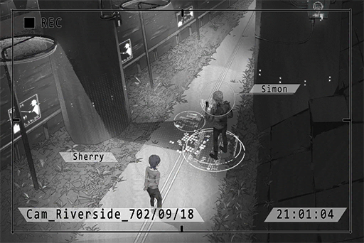

**Xenon**  
So you really do come here by yourself for no reason...?

**Cherry**  
Yes. I come here to repent myself for leaving without ever saying "Sorry" to you...

_\[<<< Flashback <<_

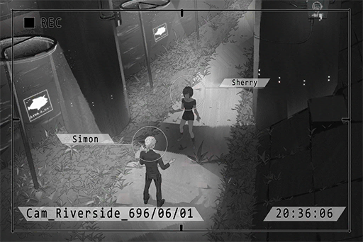

**Xenon**  
Here's all the evidence. Is this the "secret" that you've been unable to tell me all this time...?

**Cherry**  
I...

**Xenon**  
... I should have let him die...

**Cherry**  
Simon... I really don't know about this...

**Xenon**  
You've been helping him all this time, right?

**Cherry**  
We... this is the only way for us to live...

**Xenon**  
He's a murderer!!

**Cherry**  
HE'S MY FATHER!!

**Xenon**  
... Even if he is, he is just a criminal to me now. For the things that he has done... I will not allow him to escape the law!

**Cherry**  
... Then what about me? Am I also just a criminal to you now?

**Xenon**  
......

**Cherry**  
You can't accept this, can you? The real me...

**Xenon**  
......!  
... I don't...

**Cherry**  
_\*Bawls\*_

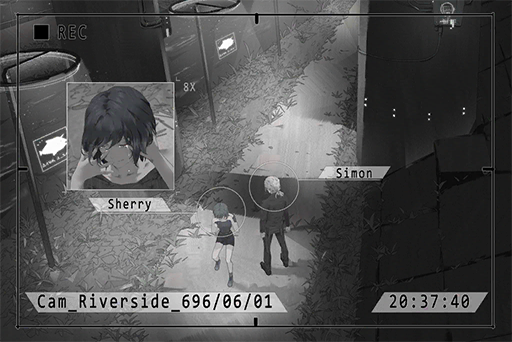

**Xenon**  
......

_\[Signal Lost\]_

[Last Log](#os-log-025) | [Back to Top](#list-of-logs) | [Next Log](#os-log-027)

### OS Log #027
___

[Last Log](#os-log-026) | [Back to Top](#list-of-logs) | [Next Log](#os-log-028)

#### Requirements
|  Char.   |Lv.|Lv. Locked?|
|----------|:-:|:---------:|
|**Cherry**|22 |    No     |

#### Unlocked Charts
|   Song   |Char. |Diff.|Lv.|
|----------|:----:|:---:|:-:|
|**hunted**|Cherry|Hard | 6 |

#### Cam\_Riverside\_702\_09\_18\_2
_\[»»» Fast Forward »»»\]_

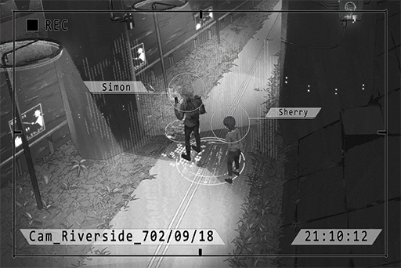

**Cherry**  
... I was too scared to hear your answer, so I ran away... haha...

**Xenon**  
I was planning to say "I don't know" back then... but if you ask me that same question again now...

**Cherry**  
Then... can you let me finish what I should have said back then?

**Xenon**  
... Go ahead.

**Cherry**  
... I'm really, really... sorry...  
Regardless of the reasons I have, the lives that perished because of me will never return. Shannon is in her current state because of me as well... Therefore, I never expected you to forgive me with just this one apology, but I really want you to know how heartbroken I was, how regretful I was...  
I'm very grateful that you saved him and protected me. If it wasn't for you, I won't be able to stand on the stage and perform now either.  
You are the most important person in my life. The fact that I was unable to contact you these past six years was an extremely cruel punishment for me...  
I'm sorry... _\*sniffs\*_...

**Xenon**  
......

**Cherry**  
...... Eh? Haha... so weird... I was planning to keep a straight face while telling you this stuff... Why am I crying...? Sorry.

**Xenon**  
... I've been thinking these past few days... Maybe the person I couldn't forgive for these six years wasn't you, or even him.

**Cherry**  
...Huh?

**Xenon**  
It's myself.  
If I cared about you more back then, maybe those incidents would never happen...

**Cherry**  
... You already the person who cared for me the second\-most in my life.

**Xenon**  
The one who cared for you the most was put in the restricted area by me...  
Must be pretty tough these years for you, wasn't it?

**Cherry**  
To be honest with you, when the admins came, I was prepared to be arrested as well, but they only took away father...

**Xenon**  
Yeah... I tampered with the evidence so you would come out clean.

**Cherry**  
Why wouldn't you let me be arrested along with my father?

**Xenon**  
You know I couldn't do that.

**Cherry**  
... Maybe it's better to be arrested that day...

**Xenon**  
Hm? What did you say?

**Cherry**  
Nothing... you should stop being a "nice guy", you look like an idiot...

**Xenon**  
I'm trying.

**Cherry**  
Then your trying doesn't seem to work. Look at yourself now...

**[Xenon-A.I.]**  
_Rewind complete. Communication records that match criteria: 1._

**Xenon**  
It's done... Awesome, the range is reduced significantly. Only a distance of two coordinates.  
Looks like we can directly confirm the location... Quadrant I, looks like an abandoned factory.

**Cherry**  
Huh? Didn't you say that we still need two to three more rewinds?

**Xenon**  
The A.I. is more efficient than I thought. No need for another rewind, let's just go.

**Cherry**  
EH? NOW!?

**Xenon**  
Strike while the iron is hot. Besides, we would stand out too much if we visit a place like this in broad daylight.

_\[Engines On\]_

_\[Signal Lost\]_

[Last Log](#os-log-026) | [Back to Top](#list-of-logs) | [Next Log](#os-log-028)

### OS Log #028
___

[Last Log](#os-log-027) | [Back to Top](#list-of-logs) | [Next Log](#os-log-029)

#### Requirements
|  Char.   |Lv.|Lv. Locked?|
|----------|:-:|:---------:|
|**Cherry**|23 |    No     |

#### Audio\_Bug\_688\_09\_18
**Luis**  
... Still mad with daddy?

**Cherry**  
......

**Luis**  
I'm sorry. Daddy didn't do it on purpose. And look, I did see you on the podium. Took pictures too.

**Cherry**  
... The competition is already finished at that point! You said you will definitely come. LIAR!!

**Luis**  
WAAH! Don't shake! Daddy's still riding the bike; it's dangerous.

**Cherry**  
Who cares. All you do is lie anyway...

**Luis**  
... Come on, don't be angry. I know! I'll take you to uncle Ben's shop later. You can pick out a toy, anything you want and daddy will buy it for you!

**Cherry**  
... Anything?

**Luis**  
Anything!

**Cherry**  
Then I want a「SENA GAMEBAI III」.

**Luis**  
Eh? A gaming console...? That's a bit expensive...

**Cherry**  
You said ANYTHING! Are you going to lie to me again?

**Luis**  
Alright, alright! You can get it!

**Cherry**  
Also no more lying. If you can't come, say you can't come. Every time you just agreed without considering, Sherry doesn't like that...

**Luis**  
OK... Daddy just doesn't want you to be unhappy.

**Cherry**  
... I know that daddy is busy with work. We don't have a mom in our home, so it's hard...

**Luis**  
... You're such a good kid.  
I'm sorry; daddy's such a useless daddy.

**Cherry**  
No kidding. You rea\~lly are a useless daddy. _\*Chuckles\*_

**Luis**  
Woah! Directly hearing it from Sherry still hurts quite a bit. Haha...

**Cherry、Luis**  
Ahahahaha!

**Cherry**  
... Because you are a useless daddy, Sherry has to be more independent. I can't rely on daddy so much anymore.

**Luis**  
......

**Cherry**  
Even if you're a useless daddy, you're still the best daddy...

**Luis**  
……Sherry……

_\[Signal Lost\]_

[Last Log](#os-log-027) | [Back to Top](#list-of-logs) | [Next Log](#os-log-029)

### OS Log #029
___

[Last Log](#os-log-028) | [Back to Top](#list-of-logs) | [Next Log](#os-log-030)

#### Requirements
|  Char.   |Lv.|Lv. Locked?|
|----------|:-:|:---------:|
|**Cherry**|23 |    No     |

#### Unlocked Charts
|     Song     |Char. |Diff.|Lv.|
|--------------|:----:|:---:|:-:|
|**SYSTEMFEIT**|Cherry|Chaos|13 |

#### Image\_Cherry\_688\_09\_18
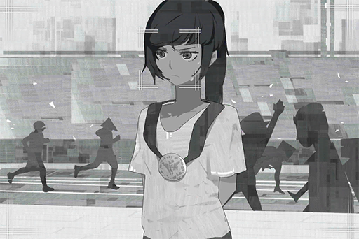

Date: 688/09/18  
Location: Node 08 \- Quadrant VI \- Academy 01 (Track Field)

[Last Log](#os-log-028) | [Back to Top](#list-of-logs) | [Next Log](#os-log-030)

### OS Log #030
___

[Last Log](#os-log-029) | [Back to Top](#list-of-logs) | [Next Log](#os-log-031)

#### Requirements
|  Char.   |Lv.|Lv. Locked?|
|----------|:-:|:---------:|
|**Cherry**|24 |    No     |

#### Cam\_Factory3\_702\_09\_18\_1
**Xenon**  
……Sherry……Sherry！

**Cherry**  
Ah... I fell asleep...  
Woah! Sorry, I drooled all over your back...

**Xenon**  
... You can sleep while riding a motorcycle? You're amazing in a certain way.  
We arrived. Get off.

**Cherry**  
Here? Isn't it way too dark? There are not even streetlights here...

**Xenon**  
My helmet has night\-vision, you follow me.  
The coordinates are right below us. My guess is that it's in this factory.

**Cherry**  
Never thought that there's a ruin like this in Node 08...

**Xenon**  
Apparently, many facilities were shut down after the Decommission. No one knows how to operate them either, so they were just left here.

**Cherry**  
Then? How are we gonna get in? The entrance looks tightly locked.

**Xenon**  
Umm... I didn't think about that either. For starters, let's circle the facility to see if there's an opening where we can climb in and such?

**Cherry**  
... When it comes to tech, you're really smart. Everything else? You're a complete mess, be it back then or now...

**Xenon**  
Yes, yes, I know\~ Then what kind of great idea do you have, Miss "Criminal Master"?

**Cherry**  
Shhhhh! Stay down! Something's there.

**[Recycle Robot]**  
_Recycle, recycle. Please put the discarded materials on the platform.  
Recycle, re... cycle. Please put ... the discarded materials... on the platform._

**Xenon**  
It's the facility's robot. Has it been operating like that ever since this place was abandoned...?

**Cherry**  
Feels kinda sad...  
Look, it appears that they have a fixed travel path. Maybe it knows where to enter the building?

**Xenon**  
Possible. Let's follow it and see.

_\[Switch signals to Cam 044\]_

**Xenon**  
Got it. It opens that small door there. We can crawl inside.

_\[Security Robot Warning\]_

**[Security Robot]**  
Civilian, this is a prohibited area. Please identify yourself or leave. If not, you will be evicted by force.

**Xenon**  
WAH!

**[Security Robot]**  
Civilian...... prohibited. Please...... evicted by force. Initiate eviction process.

_\[Pulse Pistol Fires\]_

**Xenon**  
……!!

**[Security Robot]**  
Civilians...... prohibited...

**Xenon**  
......

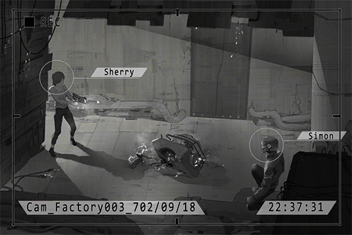

**Xenon**  
... Did you destroy it?

**Cherry**  
Yeah. Good thing that these are old models. I've come across plenty of them; I know where to hit.

**Xenon**  
You carry something like that with you all the time...? Is that legal?

**Cherry**  
For self\-defense purposes... That door's closing; let's move!

_\[Signal Lost\]_

[Last Log](#os-log-029) | [Back to Top](#list-of-logs) | [Next Log](#os-log-031)

### OS Log #031
___

[Last Log](#os-log-030) | [Back to Top](#list-of-logs) | [Next Log](#os-log-032)

#### Requirements
|    Char.    |Lv.|Lv. Locked?|
|-------------|:-:|:---------:|
|**PAFF**     |25 |    No     |
|**NEKO#ΦωΦ** |25 |    No     |
|**ROBO_Head**|25 |    No     |
|**Cherry**   |25 |    No     |

#### Cam\_Factory3\_702\_09\_18\_2
  
_[Click the image to watch the movie]_

**Xenon**  
The steps are slippery. Grab hold of me.

**Cherry**  
Hey... there's light down there...

**Xenon**  
Shhhh! There's a person there!

_\[»»» Fast Forward »»»\]_

**Xenon**  
Give me the gun.

**Cherry**  
What?

**Xenon**  
Give me the gun! I'm going to apprehend him.

**Cherry**  
Idiot! We don't know if there are other people. Besides, do you know how to use it?

**Xenon**  
... Then what are we gonna do?

**???**  
_Initiate Eradication Process._

**Cherry**  
He found us!

**???**  
Initiate Eradication Process.

_\[Gunshot\]_

**Xenon**  
UGH!

**Cherry**  
Simon!!

**Cherry**  
F\*\*\* OFF!!

_\[Pulse Pistol Fires\]_

_\[»»» Fast Forward »»»\]_

**Cherry**  
Are you alright !?

**Xenon**  
I'm fine... it only scraped my arm.  
She's not moving... did you kill her?

**Cherry**  
B\*\*\*S\*\*\*! This thing doesn't have the power to kill even if it hits people...

_\[»»» Fast Forward »»»\]_

**Xenon**  
...This... isn't this the hooded female in the picture!?  
Look at her, her face. It's a... robot?

**Cherry**  
I've never seen a robot that looks this much like a real human...

**Xenon**  
It... and all this equipment... what in the world...?

**Cherry**  
Looks like your investigation doesn't end here.

_\[Signal Lost\]_

[Last Log](#os-log-030) | [Back to Top](#list-of-logs) | [Next Log](#os-log-032)

### OS Log #032
___

[Last Log](#os-log-031) | [Back to Top](#list-of-logs) | [Next Log](#os-log-033)

#### Requirements
|    Char.    |Lv.|Lv. Locked?|
|-------------|:-:|:---------:|
|**PAFF**     |25 |    No     |
|**NEKO#ΦωΦ** |25 |    No     |
|**ROBO_Head**|25 |    No     |
|**Cherry**   |25 |    No     |

#### Unlocked Charts
|   Song   |Char. |Diff.|Lv.|
|----------|:----:|:---:|:-:|
|**hunted**|Cherry|Chaos|12 |

#### Image\_Factory3\_702\_09\_18
[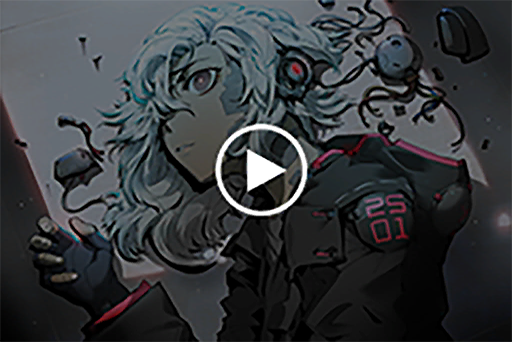](https://youtu.be/83x4Bh9ELmc)  
_[Click the image to watch the movie]_

Date: 702/09/18  
Location: Node 08 \- Quadrant I, Factory 03

[Last Log](#os-log-031) | [Back to Top](#list-of-logs) | [Next Log](#os-log-033)

## Added on v1.6

### OS Log #033
___

[Last Log](#os-log-032) | [Back to Top](#list-of-logs) | [Next Log](#os-log-034)

#### Requirements
|  Char.   |Lv.|Lv. Locked?|
|----------|:-:|:---------:|
|**Cherry**|26 |    No     |

#### Unlocked Charts
|     Song     |Char. |Diff.|Lv.|
|--------------|:----:|:---:|:-:|
|**Capture me**|Cherry|Easy | 2 |
|**Capture me**|Cherry|Hard | 7 |

#### Audio\_Hospital\_702\_09\_25
**Jacob**  
Miss Sherry, how are you feeling today?

**Cherry**  
I'm feeling fine, doctor.

**Jacob**  
Congratulations, you're now medically fit for discharge. You should be able to leave the hospital this afternoon.

**Cherry**  
It's just scraps and bruises. A day in the hospital is a bit of an overreaction, don't you think...

**Jacob**  
Since you displayed slight symptoms of a concussion, we decided to be extra careful. Apologies.

**Cherry**  
It's OK. Thank you for the treatment.

**Jacob**  
How unfortunate of you to be involved in that kind of riot. It must be tough being an artist...

**Cherry**  
Haha... I don't mind though. It's PAFF after all. It's pretty much expected that her disappearance will cause the fans to lose control.

**Jacob**  
Get some rest. There are still some procedures you will have to go through. Once you are done with those, you will be discharged.

_\[Door Knock\]_

**Nurse**  
Doctor!

**Jacob**  
What's wrong? Why are you in such a panic?

**Nurse**  
The patient in P29\-015 is having epileptic seizures again!

**Jacob**  
Shannon? How is that...? ... Have you tried TIVA?

**Nurse**  
Already did! It was not effective. You said that a dose of over 45ml could be potentially dangerous...

**Jacob**  
Understood. I'll be on my way right now!

**Cherry**  
Excuse me! Umm... Shannon... could you be talking about a Shannon Jackson?

**Jacob**  
... Yes. Do you know her?

**Cherry**  
I'm her friend! Can I see her...?

**Jacob**  
The patient is not in a stable condition right now, so it might be a bit difficult... We'll deal with her current symptoms first. If her condition stabilizes later in the day, I'll schedule an afternoon visit for you. Are you fine with that?

**Cherry**  
Please! Thank you!

_\[Signal Lost\]_

[Last Log](#os-log-032) | [Back to Top](#list-of-logs) | [Next Log](#os-log-034)

### OS Log #034
___

[Last Log](#os-log-033) | [Back to Top](#list-of-logs) | [Next Log](#os-log-035)

#### Requirements
|  Char.   |Lv.|Lv. Locked?|
|----------|:-:|:---------:|
|**Cherry**|27 |    No     |

#### Unlocked Charts
|     Song     |Char. |Diff.|Lv.|
|--------------|:----:|:---:|:-:|
|**Capture me**|Cherry|Chaos|11 |

#### Cam\_Hospital\_702\_09\_25
**Cherry**  
Hello, I'm here to visit Shannon Jackson.

**Nurse**  
Got it. You must be Miss Sherry Pauline, right? The area beyond this is the Electronic Trauma Treatment area. Please place your mobile device and all electronic accessories in this basket. You can retrieve them when you leave.

**Cherry**  
... Understood.

**Nurse**  
Walk straight until you reached the end of the hallway, then turn left. You will see ward P29\-015 there.

**Cherry**  
Thank you.

_\[Signal Switches\]_

**Jacob**  
Oh, you're here.

**Cherry**  
... Shannon...

**Jacob**  
We just completed emotion\-focused therapy with her. She is in a much more stable state now. Look, she's drawing sketches of insects. She loves to draw these kinds of things in her free time.

**Cherry**  
... What happened to her?

**Jacob**  
Virtual\-Internet Related Post\-Traumatic Stress Disorder, or VR PTSD for short. If a patient happened to be connected to the cyTus internet when experiencing extreme shock and mental trauma, it will cause severe damage to the nervous system. Due to the lack of case studies, we are unable to develop an effective treatment as of now...

**Cherry**  
... Can I go in and see her up close?

**Jacob**  
I'm sorry... you can only observe her through this glass. The patient has lost all communication capabilities. In addition, any outside simulation that triggers her memory may cause her to suffer panic attacks again.

**Cherry**  
... _\*Sniff\*_...

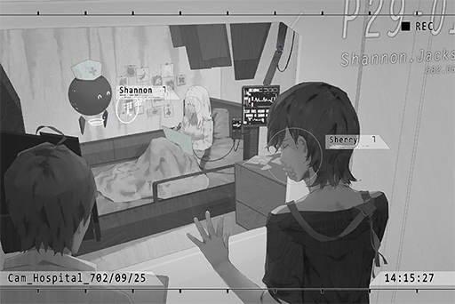

**Jacob**  
If she knows that a friend has come to visit, she will be very happy, I believe. For the past two years, she has had very few visitors besides family members.

**Cherry**  
So, Simon?

**Jacob**  
Do you know him as well? He and their mother visit her almost every week.   
Mr. Simon is also the only person that can somehow come in contact with her so far.

**Cherry**  
Eh? Didn't you say...?

**Jacob**  
Hmm, to be honest, it doesn't really count as "contact"... If he enters the ward without wearing that strange helmet of his, Miss Shannon will immediately enter a panic state upon seeing him as well.

**Cherry**  
......

**Jacob**  
We later discovered that "Music Treatment" is the most effective at treating the symptoms. For different patients, different genres of music can help stabilize their emotions.

**Cherry**  
Music Treatment...

**Jacob**  
In the case of Miss Shannon, guitar music played by Mr. Simon has proven to have the most significant effect. Therefore, every once in a while, he will come here to play the guitar for her. However, he can only do so while wearing the helmet. He could never tell her that he is her actual older brother; it's a bit cruel if you ask me...

**Cherry**  
......

**Jacob**  
Ah... no need to feel so depressed! We are also focusing our research on proving the relationship between music and said disorder. This research has a very good chance to provide us with the breakthrough needed to discover a treatment method.

**Cherry**  
... It's all my fault...

**Jacob**  
Miss Sherry?

**Cherry**  
No... nothing...

**Jacob**  
... Apologies, the visiting time is over. We are turning off the lights. This way, please.

**Cherry**  
OK...

_\[Signal Lost\]_

[Last Log](#os-log-033) | [Back to Top](#list-of-logs) | [Next Log](#os-log-035)

## Added on v1.8

### OS Log #035
___

[Last Log](#os-log-034) | [Back to Top](#list-of-logs) | [Next Log](#os-log-036)

#### Requirements
|  Char.   |Lv.|Lv. Locked?|
|----------|:-:|:---------:|
|**Cherry**|28 |    No     |

#### Audio\_Cherry's\_702\_10\_05
_\[Ringtone\]_

_\[Call Starts\]_

**Cherry**  
Hello?

**[???]**  
_Sherry._

**Cherry**  
... How did you know this number?

**[???]**  
_Did you forget that we are omniscient...?_

**Cherry**  
... Is there anything you want?

**[???]**  
_You didn't forget what we asked you to do, didn't you?_

**Cherry**  
... Yes.

**[???]**  
_We discovered that he is taking action again. It seems like he has no intention to stop at all._

**Cherry**  
Understood. I'll talk to him about it.

**[???]**  
_I don't really care who the hell they want to use as the "Mediator". However, as you already know, the Boss likes you a lot. Don't screw it up yourself._

**Cherry**  
......

**[???]**  
_That's it. We will contact you again soon._

_\[Call Ends\]_

**Cherry**  
...... _\*Cries\*_......

_\[Signal Lost\]_

[Last Log](#os-log-034) | [Back to Top](#list-of-logs) | [Next Log](#os-log-036)

## Added on v1.9

### OS Log #036
___

[Last Log](#os-log-035) | [Back to Top](#list-of-logs) | [Next Log](#os-log-037)

#### Requirements
|  Char.   |Lv.|Lv. Locked?|
|----------|:-:|:---------:|
|**Cherry**|29 |    No     |

#### Audio\_Cafe\_702\_10\_10
_\[Doorbell\]_

**Cherry**  
Hi\~ You busy?

**JOE**  
Big sis!? If you're coming, gimme a heads\-up! All the booths are full... sorry.

**Cherry**  
It's okay. I'm just here by myself. A bar seat is fine; or are you going to be distracted with me sitting here?

**JOE**  
Not at all! Take a seat! All my customers tonight are smelly middle\-aged men. A balance to the scenery is exactly what I need for mah eyes...

**Customer A**  
Huh? Your place is the only one around here that serves decent cocktails; that's the only reason why we are here. Why else would we want to taint our eyes with your sea cucumber hair!

**JOE**  
Haha, I'll take that as a compliment!

**Customer B**  
You mean the sea cucumber hair part?

**JOE**  
Shut it! You talk too much!  
Big sis, what would you like to drink?

**Cherry**  
I'll let you decide. I quite like the tangy drink you served me last time.

**JOE**  
Okay\~ The first one is on me! You always order four or five more drinks anyway.

**Customer B**  
Ho? Young lady, you're a good drinker too? How about a drinking match with us old folks?

**JOE**  
Hey, she is my friend. Keep your dicks in your pants, you perverts...

**Cherry**  
Sure! That seems like a lot of fun!

**JOE**  
Oyoy... you serious? Don't underestimate those geezers; they are the type that can really drink a lot...

**Cherry**  
Who cares\~ I don't have work tomorrow anyway. I planned to get 70% drunk today in the first place. The remaining 30% should be more than enough to handle these folks, right?

**Customer A**  
Hmph! Interesting! Hey, bring that thing out! It's on me!

**JOE**  
Sighs... Then don't blame me for what's gonna happen next.

_\[Signal Lost\]_

[Last Log](#os-log-035) | [Back to Top](#list-of-logs) | [Next Log](#os-log-037)

### OS Log #037
___

[Last Log](#os-log-036) | [Back to Top](#list-of-logs) | [Next Log](#os-log-038)

#### Requirements
|  Char.   |Lv.|Lv. Locked?|
|----------|:-:|:---------:|
|**Cherry**|29 |    No     |

#### Cam\_Cafe\_702\_10\_11
_\[Doorbell\]_

**JOE**  
Whew...... Finally got the Ciber driver to send them away... Big sis, are you even human? You took down all of them by yourself! And you don't even look one bit flustered...

_\[Glasses clanging\]_

**JOE**  
Hey! Big sis!?

_\[»»» Fast Forward»»»\]_

**JOE**  
You awake?

**Cherry**  
Ugh... how long have I been asleep?

**JOE**  
Just around 20 minutes. I'm going to start closing the shop. You should rest a bit more.

**Cherry**  
Sorry, I did drink too much after all... haha...

**JOE**  
The amount you drank is ridiculous even for you... Now that I think about it, I've never seen you drunk.

**Cherry**  
Sorry for causing you the trouble...

**JOE**  
Nah, it's fine, as long as you don't throw up on the table. I'll escort you home later.

**Cherry**  
Hmm... thanks.

**JOE**  
Don't thank me so soon. I'm gonna charge you like Ciber. Your home is so damn far away; you really thought I will give you a free ride?

**Cherry**  
Haha... Your brain still reeks with the stink of money...

**JOE**  
Why do you speak the exact same words as Simon...?

**Cherry**  
... Simon...  
Nah, have you... seen him recently?

**JOE**  
Eh? Ah... at the end of last month, I ran into him at the cemetery. We had a quick chat.

**Cherry**  
I see... I can't reach him for some reason.

**JOE**  
......  
Is there... something you need to tell him?

**Cherry**  
...... A while ago, at hospital 15, I ran into Shannon...

**JOE**  
... EH!?

**Cherry**  
She was locked inside a special ward and was unable to talk... visitors couldn't enter the ward to see her either...

**JOE**  
......

**Cherry**  
Afterward, I've been trying to have a chat with Simon... However, after the Æsir incident was over... he seems to be hiding from me...

**JOE**  
Big sis......

**Cherry**  
I'm so foolish... After all the things that happened, I still hoped that he'll talk to me...... Even though that itself is already a luxury......

**JOE**  
......

**Cherry**  
_\*Sobs\*_... I'm sorry... It's all my fault...  
......zzZ

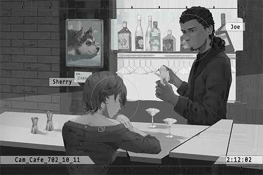

**JOE**  
... Get some sleep. Don't blame yourself... We're all living in guilt for our crimes...

_\[Signal Lost\]_

[Last Log](#os-log-036) | [Back to Top](#list-of-logs) | [Next Log](#os-log-038)

### OS Log #038
___

[Last Log](#os-log-037) | [Back to Top](#list-of-logs) | [Next Log](#os-log-039)

#### Requirements
|  Char.   |Lv.|Lv. Locked?|
|----------|:-:|:---------:|
|**Cherry**|30 |    No     |

#### Audio\_Cherry's\_702\_10\_11
**Punk**  
Meow\~

**Cherry**  
Ummm.... this is... my home?  
Ah, right... JOE escorted me home...

**Punk**  
Meow\~

**Cherry**  
What's the matter, Punk? You hungry? Sorry, sorry; I'll go fix you some food now\~  
Owww...... my head hurts...

**Punk**  
Meow\~

**Cherry**  
Hey! What are you eating!? You can't just eat random things! Spit it out!  
Hmmm...? What is this? A note?

**Cherry**  
"To Big sis"... Did JOE write this? Woah, his handwriting is so bad... Why did he choose to hand\-write this? Ah! Could it be that I did something stupid yesterday!?

**Cherry**  
......

**Cherry**  
...... "To Big sis, after you finish reading this note, burn it immediately. What I'm about to tell you now is the full conversation between Simon and me a while ago."

**Cherry**  
......!

_\[»»» Fast Forward»»»\]_

**Cherry**  
... "That's more or less it. To be fair, if what Simon said was indeed true, then Big sis should already know about the Cafe and its business as well. Haha, what the hell is going on with Crystal PuNK? Why are there so many hidden identities in this band? Not to mention they are all somehow connected to one another..."

**Cherry**  
...... "However, I think that we all just weren't given a chance to pick our path; or we just missed countless chances to make the right choice... TBH, I don't really know what I'm even writing now either, since I'm not someone who's good with words. I just wanted to say, I think... or hope, in the end, what truly connects us all together is still music after all."

**Cherry**  
...... " I feel like the CP days were the happiest, most fulfilling memories in our lives to all four of us. I really hope that I'm not the only one who thinks this way... If we can, perhaps everything still has a chance to go back to what it once was. Simply playing music, simply screwing around, simply living life, just like how we used to be back then... As long as the four of us work hard together, I never thought that anything is a "luxury"..."

**Cherry**  
...... "I believe that Big sis has the same wish as well. That's why I wrote this down. We all still have a chance to make the right choice. King of Germs."

**Cherry**  
......

**Cherry**  
Idiot... my life... has never been simple...

**Cherry**  
......

**Cherry**  
Idiot...... _\*Sobs\*_...

_\[Signal Lost\]_

[Last Log](#os-log-037) | [Back to Top](#list-of-logs) | [Next Log](#os-log-039)

## Added on v2.0

### OS Log #039
___

[Last Log](#os-log-038) | [Back to Top](#list-of-logs) | [Next Log](#os-log-040)

#### Requirements
|  Char.   |Lv.|Lv. Locked?|
|----------|:-:|:---------:|
|**Cherry**|31 |    No     |

#### Unlocked Charts
|   Song    |Char. |Diff.|Lv.|
|-----------|:----:|:---:|:-:|
|**Realize**|Cherry|Easy | 3 |
|**Realize**|Cherry|Hard | 8 |
|**Realize**|Cherry|Chaos|12 |

#### Audio\_Dash\_702\_10\_21
**Hunter**  
Capo.

**Angus**  
Too late. You got the balls to let me wait now? You want my fist in your face that badly?

**Hunter**  
Okay, okay... She's not here either, isn't she?

**Angus**  
She said she has an event and will be running late.

**Hunter**  
What's this discrimination towards me compare to the hot girl...

**Angus**  
What did you say!?

**Hunter**  
Nothing... So "Puppets" this time as well?

**Angus**  
Yes. We're using the "tunnels". That's why we need her.

**Hunter**  
Say, do we really need this "Mediator" role anymore...? We've done this for years. I feel like we can handle this ourselves just fine.

**Angus**  
Nobody understands the structure of the tunnels better than her. As long as we have her, we can smuggle stuff through that area with no troubles. Besides, business is getting harder and harder these days. Better be safe than sorry.

**Hunter**  
Eh? How so?

**Angus**  
I heard this from the folks in the information department. First, our mole in the Administration Bureau has been getting less and less effective. Second, recently, the A.R.C. people seem to be continuously tracking our internet activities.

**Hunter**  
Ah, that incident... Didn't Boss ask her to handle this issue already?

**Angus**  
From the looks of it, it wasn't handled well. I'll ask her when we meet up later. One of our old customers got busted a few days ago. You knew that, right?

**Hunter**  
You mean that lolicon bastard? Yeah. I even personally carried out several of his orders. I was freaking the f\*\*\* out. Thank goodness that the investigation wasn't traced back to us.

**Angus**  
Yes. Although still uncertain whether it's related to this incident or not, right now, Boss is suspecting that someone within the gang leaked the information.

**Hunter**  
Isn't it easier to just tell the Cafe to investigate?

**Angus**  
You mean JOE? He appears to be one of the people Boss is suspecting.

**Hunter**  
HA! That s\*\*\*head has that kind of balls?

**Angus**  
All in all, we'll let Boss handle this case. As long as it doesn't affect us, we should still be able to run this business safely for a while. To avoid suspicion, you best not go off the tracks and do something stupid these days.

**Hunter**  
Okay, okay...

_\[Footsteps\]_

**Cherry**  
Sorry for coming late.

**Angus**  
... Get in the car. We'll talk in the car.

_\[Door Opens\]_

**Cherry**  
Here's the route layout for this time. It appears that the admins reprogrammed the drones in this area to give them a different set of actions and movement patterns. You guys better memorize all this first.

**Hunter**  
So annoying...

**Cherry**  
This model of drones requires the P30 to penetrate. Can you find a way to get at least one before this transaction?

**Angus**  
Not a problem. I can get three.

**Hunter**  
With big sis here, one for her is plenty enough if you ask me...

**Cherry**  
Don't call me big sis...

**Angus**  
Is there anything else we must pay attention to?

**Cherry**  
Not much. The route we picked this time is very old. The surveillance cameras have all stopped functioning already, so it's relatively simple.

**Angus**  
Thanks for the hard work. We'll let you off here. We'll contact you on that day.

**Cherry**  
Sure...

**Angus**  
Ah, right. Regarding that thing they called you last time for, are you dealing with it right now?

**Cherry**  
... I couldn't get in contact with him... Besides, he stopped investigating you guys recently, right?

**Angus**  
No idea. The information department is the one that reported this. I'm just responsible for passing on Boss's message.

**Cherry**  
......

**Angus**  
However, I advise you to be careful. They said that our mole in the Administration Bureau is on the hot seat now. If they slip up even one bit, they could be in trouble. That guy... he's your ex\-boyfriend, right?

**Cherry**  
......

**Hunter**  
If anything happens, Boss is gonna get it fixed anyway.

**Cherry**  
... Anything else?

**Angus**  
Oh, one more thing from Boss. He said that he has been trying his best regarding your dad's case. If he's lucky, he might get a few more years off his sentence.

**Cherry**  
...... Understood.

_\[Signal Lost\]_

[Last Log](#os-log-038) | [Back to Top](#list-of-logs) | [Next Log](#os-log-040)

### OS Log #040
___

[Last Log](#os-log-039) | [Back to Top](#list-of-logs) | [Next Log](#os-log-041)

#### Requirements
|  Char.   |Lv.|Lv. Locked?|
|----------|:-:|:---------:|
|**Cherry**|32 |    No     |

#### Audio\_Cell32\_702\_11\_02
_\[Door Opens\]_

**Agent A**  
Sherry Pauline, you have 20 minutes.

**Cherry**  
Thank you. Dad!

**Luis**  
You're here?

**Cherry**  
Why did you get fat again? Is the food too tasty in there?

**Luis**  
Not bad... As with you, you lost weight again... Are you alright?

**Cherry**  
Hmm? I'm alright! Everything is fine!

**Luis**  
Good to hear that. I watched your performance at Tower. It was great.

**Cherry**  
Aww, why would you do that, it's so embarrassing. Here, I brought you some fruits. You've become so fat.

**Luis**  
You can send this stuff in here now?

**Cherry**  
It seems that they got a new scanning system. As long as we clear that, it'll be fine. But it also seems that this is only available in the low\-level restricted areas.

**Luis**  
I see... Thank you.

**Cherry**  
Ah, right. They said that you might get a few more years off your sentence. Thank goodness...

**Luis**  
......

**Cherry**  
... What's wrong?

**Luis**  
I deserve to be in here. It was Simon who brought me back to my senses.

**Cherry**  
......

**Luis**  
You too...

**Cherry**  
I know... Don't talk about it anymore...

**Luis**  
Your band is slowly hitting the stride too. You don't need to suffer this anymore. I don't mind staying in here for a few more years.

**Cherry**  
......

**[TV]**  
_... Just earlier today, A.R.C. backend administrator Simon Jackson has been arrested in A.R.C. by law enforcement agents. Our sources show that he is none other than the biggest suspect for "Æsir", the mastermind behind the recent string of internet crime incidents._

**Cherry**  
Eh? Dad, turn up the volume!

**Luis**  
...... Understood!

**[TV]**  
_... discovered a large number of commands used by said A.I. to commit internet crimes, which even includes the infamous cyberterrorism incident during a live stream a few months ago. All this evidence are proof of Simon Jackson's highly possible association with Æsir._

**Cherry**  
Simon!? How come?

**Luis**  
......

**[TV]**  
_Faced with such serious accusations, Simon Jackson did not say a single word to defend himself, nor attempted to prove his innocence..._

**Luis**  
Simon is Æsir...?

**Cherry**  
That's impossible! We even investigated this case together. Although I don't know about what happened after that...

**Luis**  
Wait a minute... the footage on this news report... He's in the area just next door, isn't he?

**Cherry**  
I'll go see him!

**Luis**  
Wait, the area next door is the advanced restricted area. If you didn't apply beforehand, they are not going to let you inside.

**Cherry**  
Even so, I'm still going! That's it for now.

**Luis**  
......

_\[Signal Lost\]_

[Last Log](#os-log-039) | [Back to Top](#list-of-logs) | [Next Log](#os-log-041)

## Added on v2.1

### OS Log #041
___

[Last Log](#os-log-040) | [Back to Top](#list-of-logs) | [Next Log](#os-log-042)

#### Requirements
|  Char.   |Lv.|Lv. Locked?|
|----------|:-:|:---------:|
|**Cherry**|33 |    No     |

#### Cam\_Cafe2\_702\_11\_05
_\[Doorbell\]_

**Cherry**  
Hi\~

**JOE**  
Big sis.

**Cherry**  
You're not open yet? Can I get a drink?

**JOE**  
Of course. Want would you like?

**Cherry**  
... Milk.

**JOE**  
... Simon... I didn't think he would actually get arrested...

**Cherry**  
......

**JOE**  
The admins have released the investigation report used in court, as well as his confession...

**Cherry**  
I don't understand why he would make that kind of speculation himself and admit that he is Æsir...  
Something's definitely messed up. After all, he and I investigated this case together for a long time. We even got assaulted by a weird robot. It's as if he has forgotten about all these things...

**JOE**  
That incident... how many people knew about it?

**Cherry**  
Not many. Besides the two of us who were part of the action, the only other ones are probably the very few A.R.C. employees who participated.

**JOE**  
You saw the court report yourself. The folks at A.R.C. will never say a word about this since they are trying to protect the company's a\*\*. As with the admins, the only thing they care about now is concluding this incident ASAP so they can give the people a quick answer. They wouldn't even bother to investigate the details. If this keeps going on, it's very likely that he'll be charged with serious crimes...

**Cherry**  
Damnit! Why didn't Simon refute their accusations!?

**JOE**  
Doesn't Æsir have the ability to erase people's memories? Could that be the reason why?

**Cherry**  
Very possible... If that's the case, the same method that's effective on other victims should work with him too. We just need to take him to the site or show him clear footage that can remind him of the incident. That way, he'll be able to recover his memory.

**JOE**  
Is there any way for us to do that?

**Cherry**  
I've tried to apply for a visit, but the advanced restricted area gave me a giant cold shoulder... Can you do something through the Cafe's resources?

**JOE**  
... Yeah. There are plenty of skilled people on the Cafe's network. As long as we offer a high enough reward, we should be able to find helpers. However, the tricky thing now is that the Baro people are frankly ecstatic about Simon's arrest. There's a very good chance that they don't want him to ever come out again.

**Cherry**  
Diego...

**JOE**  
... Big sis... so you're still working under him?

**Cherry**  
The "Mediator" job is not affiliated with any particular organization in the first place. Our role is merely a simple underground customs. But in recent years, the influence of Baro has just grown way too fast. Almost every available resource is now under their control. The previous balance has also been... You are more aware of this than anyone else, aren't you?

**JOE**  
......

**JOE**  
I'm sorry... I don't have what it takes to carry pops' scale after all...

_\[Ringtone\]_

**Cherry**  
... Chris? What's up?

**[Chris]**  
_What do you mean "What's up"!? The rehearsal has already begun! Where are you!?_

**Cherry**  
... Eh? AH! It's today!?

**[LUMY]**  
_Give me the phone! You remember the wrong date!? You're helpless! Where the heck are you now? Get your butt over here ASAP!_

**Cherry**  
Gotcha! I'll get going right now! However, it may still take a while. Just sing a few songs in my place first!

**[LUMY]**  
_If you're paying for the celebration party._

**Cherry**  
... F, FINE! I'll pay for it! Happy now!?

_\[Call Ends\]_

**Cherry**  
I gotta go. I remembered the wrong performance date. Oh crap, this is bad...

**JOE**  
Ah, right. It is today... Best of luck with your performance. I'll watch the live stream if I have free time.

**Cherry**  
Bye.

**JOE**  
Bye...

**Cherry**  
... Hey, don't look so depressed. Isn't having your hair look like s\*\*\* already bad enough?

**JOE**  
Hey hey hey! That's mean!

**Cherry**  
Haha...  
You... Don't blame yourself. We're all living in guilt for our crimes, right?

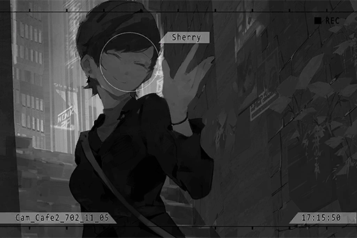

**JOE**  
......!  
...... Yeah.

_\[Doorbell\]_

**Cherry**  
Remember to watch the stream. I will use our songs to bring that stupid smile back onto your face. That's what suits you. Bye\~!

_\[Doorbell\]_

**JOE**  
......

_\[Signal Lost\]_

[Last Log](#os-log-040) | [Back to Top](#list-of-logs) | [Next Log](#os-log-042)

### OS Log #042
___

[Last Log](#os-log-041) | [Back to Top](#list-of-logs) | [Next Log](#os-log-043)

#### Requirements
|  Char.   |Lv.|Lv. Locked?|
|----------|:-:|:---------:|
|**Cherry**|34 |    No     |

#### Audio\_Cell32\_702\_11\_06
_\[Heavy things falling down\]_

**Angus**  
Here, three P30s. Check them yourself.

**Cherry**  
... Impressive. You actually got them.

**Angus**  
What else do you expect? We're the Baro Brotherhood.

_\[Checking the guns\]_

**Cherry**  
Hmm... All in great condition. Should work just fine.

**Angus**  
The Boss said that if you like them, you can keep one after the transaction is over.

**Cherry**  
......

**Angus**  
What's wrong? Aren't you a gun maniac? Shouldn't you be more happy for stuff like this?

**Cherry**  
... Yeah, thanks.

**Hunter**  
Ah, Capo, big sis! I've been looking for you guys for quite some time!

**Angus**  
What's the matter?

**Hunter**  
Got some info about making money! There's this "R" guy who's hiring gunmen through Cafe. He's paying some serious big bucks!

**Angus**  
R...? Oh, isn't he the one who specializes in information trading?

**Hunter**  
Yep. The operation this time is that he plans to "jailbreak" a criminal out from the restricted area.

**Angus**  
Hmm... The reward is indeed very high. Who is this person he's trying to save?

**Hunter**  
It's not stated clearly on the request, but the boys from other teams have speculated from this proposal... that this person is very likely Simon Jackson. Ya know, the one who got busted just recently.

**Cherry**  
......!

**Angus**  
Simon? Isn't he the guy who caused quite the headache for the organization? Hey, I advise you to stay out of this. From what I can tell, the Boss seems quite happy about his arrest.

**Cherry**  
......

**Hunter**  
But this money...

**Angus**  
Didn't I tell you not to go off the tracks and do something stupid? Right now, Boss is treating our team quite well. There's no need for us to do something that is against his will.

**Cherry**  
Give me the request.

**Angus**  
... What do you want to do? You're not thinking about rescuing your boyfriend, are you?

**Cherry**  
... What I want to do is none of your business, right?

**Angus**  
You're not part of the organization, so I won't interfere with your actions. Just make sure that it won't affect the transaction that's happening in a few days.

**Hunter**  
Big sis, let me tag along! I'll show you my improved gun skills...

**Angus**  
Mad dog, I will not repeat this a third time... DON'T go off the tracks and do something stupid. You're a dog, so behave like one.

**Hunter**  
Tch...

**Cherry**  
......

_\[Signal Lost\]_

[Last Log](#os-log-041) | [Back to Top](#list-of-logs) | [Next Log](#os-log-043)

## Added on v2.2

### OS Log #043
___

[Last Log](#os-log-042) | [Back to Top](#list-of-logs) | [Next Log](#os-log-044)

#### Requirements
|  Char.   |Lv.|Lv. Locked?|
|----------|:-:|:---------:|
|**Cherry**|35 |    No     |

#### Cam\_CArea\_702\_11\_08
**Cherry**  
This is S. I'm in.

**[Rald]**  
_I see your position on the map now. Turn right at the next intersection. Open the second door. You'll see a LE\-113A drone inside._

_\[Gunshot\]_

**[Rald]**  
_Nice shot. I expect no less for someone hired by the Cafe._

**Cherry**  
Having such a detailed understanding of the underground passages in the restricted area, you're not too bad yourself either.

**[Rald]**  
_\*Chuckles\* I appreciate your comments._

**Cherry**  
Will we really reach Simon's cell by going down this way?

**[Rald]**  
_No need to worry, trust me. Later, there will be a brief moment with no signal. Therefore, you'll need to follow my instructions._

_\[»»» Fast Forward»»»\]_

**Cherry**  
... I'm curious. If you know the topography down here so well, why hire a gunman? Why don't you just do it yourself?

**[Rald]**  
_Hmm... Perhaps I'm currently in a situation where I can't quite move around easily, or perhaps I feel like things are more interesting this way. Who knows?_

**Cherry**  
......

**[Rald]**  
_Isn't this great for you though? Don't you want to save him yourself? Miss Pauline?_

**Cherry**  
......!? How did you know my name?  
Hey? Hello...?

**[Rald]**  
_\[Signal Lost\]_

**Cherry**  
... Damnit, signal lost.

_\[Hurried Footsteps\]_

**Cherry**  
This is it. Password lock... Simon, I'll be there in a minute.

_\[Alarm\]_

**Cherry**  
......!?

**[Control System]**  
_Decision: Incorrect password. Defense system activate. Deploy model LE\-113C security drones to perform full area scan. Law enforcement agents, please leave this area as soon as possible._

**Cherry**  
The password is incorrect!?

**[Control System]**  
_Model LE\-113C security drones, deploy start._

**Cherry**  
... We're tricked.

_\[→Signal Switch\]_

**[Drone]**  
_Target acquired. Initiate termination process immediately._

_\[Hurried Footsteps\]_

**Cherry**  
S\*\*\*! It's a dead end!

**[Drone]**  
_Target acquired. Initiate termination process immediately._

**Cherry**  
Tch...

**[Rald]**  
_This is R. Woah, looks like it's quite the spectacle on your side of things._

**Cherry**  
You bastard! How dare you trick me! Where the f\*\*\* am I at right now!?

**[Rald]**  
_No need to worry. I've already opened Simon's cell door. However, it seems like he doesn't really want to come out._

**[Xenon]**  
_Sherry!? What are you doing here?_

**Cherry**  
......!

**[Rald]**  
_As you just saw, your dear friends are literally risking their lives for you. All in all, I will leave the door open for you, the door to end this entire fiasco. The rest is up to you.  
Feels like your dear friends are in a pretty serious pinch. Allow me to take my leave first._

_\[»»» Fast Forward»»»\]_

_\[Explosion\]_

**Cherry**  
WAAA!?

_\[Gunshot\]_

**ConneR**  
Thanks for the hard work, Miss Pauline.

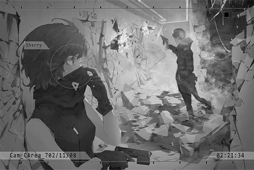

**ConneR**  
All clear. Let's go. The operation is over.

**Cherry**  
You...!

**ConneR**  
Yikes... K270? So you held on for so long using that piece of junk? Impressive, I should give you some bonus payment.

**Cherry**  
... The agents back there, as well as the password... You used us!

_\[Things crashing\]_

**ConneR**  
First, I "hired" you folks. Not quite "used".  
Second, From start to finish, I never mentioned anything about you meeting Simon. Seems like it's just your own misunderstanding.

**Cherry**  
......

**ConneR**  
Thanks to you folks, I was able to move around easily... Both you and the Cafe's successor have outperformed my expectations significantly. Praiseworthy indeed.  
Third, when pointing the K270 at someone, don't do it from the front...

_\[Dismantles gun\]_

**Cherry**  
......!

**ConneR**  
This toy crumbles with the slightest touch.

**Cherry**  
You... just who exactly are you? Why are you saving Simon? If you're trying to harm him...

**ConneR**  
Not the smartest question, young lady.  
If I want to cause him harm, I would've already dragged him out of there. I wouldn't leave him in there to make a "choice". This choice is essential in determining whether or not he is qualified to be my comrade.

**Cherry**  
......?

**[Drone]**  
_Target acquired. Initiate termination process immediately._

**ConneR**  
Chit\-chat time over. You don't have that worthless gun anymore. Follow me if you don't want to die. We still got one more person to rescue.

_\[Signal Lost\]_

[Last Log](#os-log-042) | [Back to Top](#list-of-logs) | [Next Log](#os-log-044)

## Added on v2.3

### OS Log #044
___

[Last Log](#os-log-043) | [Back to Top](#list-of-logs) | [Next Log](#os-log-045)

#### Requirements
|  Char.   |Lv.|Lv. Locked?|
|----------|:-:|:---------:|
|**Cherry**|36 |    No     |

#### Cam\_Port33\_702\_11\_10
**Hunter**  
Listen up; after I get my hands on the cargo, you guys will board the transporter right away. Don't you dare do anything unnecessary. I accepted the money. The most I can do is pretend that I saw nothing.

**Cherry**  
Okay, okay. I get it.

**Xenon**  
... You paid him?

**Cherry**  
No, not me...

**ConneR**  
I'm the one who paid.

_\[Footsteps\]_

**Xenon**  
......!

**ConneR**  
Good evening, fellas. Thanks for the hard work. You won't mind letting this old man hitch a ride as well, won't you?

**Cherry**  
... Where did you... Forget it. I don't want to know. You have a gun, right?

**ConneR**  
Not the best time for dumb and obvious questions, don't you think?

**Cherry**  
From now on, you guys will act according to my commands. Stay closely behind me. Simon, you don't have a gun, so you will bring up the rear and follow us three.

**Xenon**  
......

**ConneR**  
At you command, Mediator.

_\[»»» Fast Forward»»»\]_

**ConneR**  
This is my first time taking this route. Underground tunnels like this one that used to transport goods have not been properly managed since The Decommission, yet the entire system and the drone production still continue to function normally. It's as if this is a dungeon of machines. Truly a magnificent sight.

**Cherry**  
We're not here for sightseeing. Although the drones here are kinda dumb, they have very powerful weapons. Don't let your guard down.

**Hunter**  
Sighs... I wanna go home.

**Cherry**  
Shh! Get down!

_\[Drones Cruising\]_

**Cherry**  
Crap, more units that I expected. We'll miss the transporter's arrival time if we can't get through here...

**ConneR**  
One, two, three, four... Hmmm, interesting.

**Cherry**  
What?

**ConneR**  
Miss Pauline, can you somehow jump to that platform across from here? I have an idea.

**Cherry**  
... I find it hard to believe you after what happened back there in the restricted area.

**ConneR**  
Rest assured. I'm part of the team now too. I won't do anything that will harm myself. Please, take your jump.

**Cherry**  
......

_\[Lands\]_

**ConneR**  
Ah, such breathtaking grace. It's such a pleasure to watch her in action.  
You're one lucky man, Mr. Jackson.

**Xenon**  
......

**Cherry**  
Quit talking nonsense. What next?

**ConneR**  
You see those cables up there?

**Cherry**  
......! I get it, the power supply for this area... but I can't hit them from this angle.

**ConneR**  
No need to worry. When I open fire later, you just need to follow up my shots at the same time. Mr. Mad Dog, please circle over to the right side. You'll be handling the two units on the right.

**Hunter**  
... Tch.

**ConneR**  
On your mark...

_\[Gunshot\]_

**Cherry**  
......! The cables are exposed!

_\[Gunshot\]_

**Cherry**  
We did it! This should be able to buy us some time.

**[Drone]**  
_Warning, illegal trespasser detected._

_\[Things crashing\]_

**Cherry**  
Waah!

**ConneR**  
Tch, did Mad Dog miss his targets? How useless.

**[Drone]**  
_Initiate attack._

_\[Hacking\]_

**[Drone]**  
_Iiiiinnitiaatte atttttt...._

**Cherry**  
......

**Xenon**  
Sherry! Are you alright?

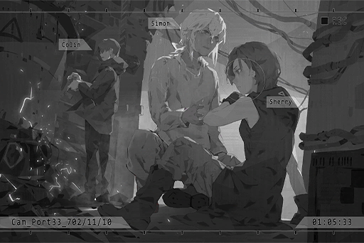

**Cherry**  
I'm fine...

**ConneR**  
(Whistle) Not bad at all, Mr. Jackson. If that thing opened fire, your girlfriend would definitely be filled with holes right now.

**Cherry**  
You! If you have this kind of trick up your sleeve, use it first! We wouldn't have to go through all that trouble in the first place!

**Xenon**  
... I've never even seen this model before. Took me a long time to finally find a loophole. Be glad that I did it in time to take out one.

**Cherry**  
The heck, that's so inconvenient!

**Xenon**  
What, you think this is GAMEBAI and all you need to do is press a few buttons?

**[Drone]**  
_Warning, illegal trespasser detected._

**ConneR**  
You two lovebirds can save your squabble for later. We still got work to do. Mad Dog, we are going to leave you behind.

**Hunter**  
Yikes! Wait for me! Damn it...

_\[Signal Lost\]_

[Last Log](#os-log-043) | [Back to Top](#list-of-logs) | [Next Log](#os-log-045)

## Added on v2.4

### OS Log #045
___

[Last Log](#os-log-044) | [Back to Top](#list-of-logs) | [Next Log](#os-log-046)

#### Requirements
|  Char.   |Lv.|Lv. Locked?|
|----------|:-:|:---------:|
|**Cherry**|37 |    No     |

#### Cam\_Port33\_702\_11\_10
_\[Door Opens\]_

**ConneR**  
We're finally here. Another second in that cramped space and I'm going to go insane.

**Xenon**  
What next?

**Cherry**  
Not the time to celebrate just yet. If we are to sneak into other Nodes from here, we still need to take one more ride in these transporters.

**ConneR**  
... _\*Sigh\*_, I would prefer if you could spare the body of this old man in his thirties. Not built to sit in this tiny space.

**Cherry**  
Eh? You're only in your thirties!? I thought that you must be at least fifty.

**ConneR**  
How rude. It's not exactly easy to do skin care when you're wandering around in the forbidden areas all the time.

**Xenon**  
... So, where do we go next?

**Cherry**  
I've never been here before as either. It's a lot more complicated than I imagined... However, based on experience, if we follow the black electric pipelines, we are likely to find some sort of central hub area. We should be able to find the map of this entire facility there.

**[Xenon A.I.]**  
_Analyzing... complete._

**Xenon**  
It doesn't seem to be that simple. Lots of turns and branched routes here... I tried to analyze these circuits; there is more than one path to the hub. On top of that, those drones...

**ConneR**  
Please follow me.

**Xenon**  
You know your way around here?

**ConneR**  
No, but based on my sixth sense, I don't think I'm too far off. I've got a knack for exploration.

**Xenon**  
......

**Cherry**  
Let's trust him for now. From the jailbreak operation all the way until now, although his commands tend to be reckless, he does know what he's doing.  
I don't want to admit this since I am quite confident in my abilities when it comes to finding my way around underground facilities like this one, but he's clearly on another level...

**ConneR**  
Thank you for your compliment.

_\[»»» Fast Forward»»»\]_

**Xenon**  
We haven't seen a single drone the whole time.

**ConneR**  
Those things patrol in a certain pattern. As long as you understand the pattern, it's not difficult to circle away from them.

**Cherry**  
... You really are an expert with this stuff. It took me a long time before I mastered that, and all it took you was a few minutes back there...

**ConneR**  
_\*Chuckles\*_ If you keep complimenting me, someone's gonna get jealous.  
Besides, there are other things we need to worry about, not just the drones.

**Xenon**  
What do you mean?

**ConneR**  
"Splice", does that name ring a bell?

**Xenon**  
... A Node 08 gravedigger organization. Came in contact with them a few years ago.

**ConneR**  
Ho, so you still remember that case. The one who completely screwed them over back then was...

**Xenon**  
It was you, wasn't it? I remember it now... Sherry referred to you as "R" when we were in the restricted area.

**ConneR**  
That's right. The fact that you still remember our perfect teamwork; I'm touched.

**Xenon**  
Back then, all I did was get tricked and pulled around by you like a fool.

**ConneR**  
Don't say that. When I first joined A.R.C., I didn't notice that you were the "X" from back then either. Never thought we would reunite like this. Don't you think that fate has something to do with it?

**Xenon**  
No wonder you kept bothering me back then...

**ConneR**  
Hey, can't blame me. After all, you're one of the very few people in this world who can directly decrypt my counterfeited encryptions.

**Xenon**  
Your methods are too crude. I can do that all day.

**ConneR**  
Haha! We're getting off topic... Splice isn't an organization that just operates in Node 08. In fact, traces of their activities can be found across all Nodes. After that incident, they discovered that doing business in 08 was going to be tough. Thus, they began to focus their attention and resources on other areas. They're the ones we need to look out for.

**Cherry**  
Do they know this route as well...?

**ConneR**  
With this route being so convenient and well\-concealed, I'd be more surprised if those gravediggers don't know about it. Personally, since I tend to only focus my research on areas I'm interested in, I didn't pay too much attention to these smuggling hotspots. I'm a bit ashamed of that, to be honest.

**Cherry**  
It's hard for me to imagine that we'll run into other humans here...

**Xenon**  
This type of facility... Isn't it supposed to be fully automatic? Why are there still so many pieces of equipment that look as if they need to be operated by humans?

**ConneR**  
So you young fellas don't know about this? These were all once operated by Architects. Naturally, after they disappeared, many facilities weren't put back into operation and were thus completely shut down. That was the case with the factory in Quadrant I. This place is very obviously not one of them.

**Xenon**  
......

**ConneR**  
Oh, how time flies when you're chatting. See for yourself, the central control panel.

**Cherry**  
That's great!... Ah, authentication required.

**Xenon**  
Let me try.

_\[»»» Fast Forward»»»\]_

**[Central System]**  
_Authentication success. Welcome, OPCII\_1409\_II._

**Cherry**  
OPCII...?

**ConneR**  
The serial number for Architects... Now I'm starting to get interested. Can you decrypt the database's firewall as well, Mr. Jackson?

**Xenon**  
Our objective is only the map, isn't it? We already know where to go. I'm not helping you with this. If you want something, go get it yourself.

**Cherry**  
Hey... wait a minute. Look, the next transporter to Node 03 is on...

**Xenon**  
November 17th... Seven days from now, is it?

**Cherry**  
Damnit, I miscalculated the time. Sorry.  
What do we do now? Are we going to stay in a place like this for seven days? Food and water...

**ConneR**  
I'll handle those. The map shows that there's a tunnel that leads to the surface. Right next to the tunnel exit is a river. If there's water, then it shouldn't be that difficult to obtain food as well.

**Xenon**  
What do you mean? Are you going to stay here with us for seven days? Even though you could've left first?

**ConneR**  
You fellas don't have the equipment to go to the surface, right? If I am to leave now, you two might as well be dead.

**Cherry**  
Didn't think you're the type to go that far to help others...  I'm a bit surprised, thanks.

**ConneR**  
_\*Chuckles\*_ I would be quite troubled if you decided to just casually treat me as "a good guy".

_\[Signal Lost\]_

[Last Log](#os-log-044) | [Back to Top](#list-of-logs) | [Next Log](#os-log-046)

## Added on v2.8

### OS Log #046
___

[Last Log](#os-log-045) | [Back to Top](#list-of-logs) | [Next Log](#os-log-047)

#### Requirements
|  Char.   |Lv.|Lv. Locked?|
|----------|:-:|:---------:|
|**Cherry**|38 |    No     |

#### vÒ̴̵́̕S̶\_͟҉͞V͢͜͡҉a͏͢?̕͟e̷̡̕?̴̷̡͘?̷̡̨̀́ą͘͟͝\_̛́͘͢?͘͜҉?͏͟?̸́\_̸̡́̀͠?̨̢̛͞͡?̶̷͜\_̡͠͠͝͡?̧͝?̴̧͠
**Cherry**  
……

**Cherry**  
...... ugh......

**Cherry**  
Where am I... ?

**Cherry**  
Blue flower... ? It's that dream!  
... Is it... a dream?

_\[?͏̷̢̀?̸̡̧?̵̵̢҉̢?̧͡҉̧͝?͜͠?̴̧́͢͡\]_

**Cherry**  
...... ?

**?̵̕҉̴̛?̢͟҉͘͝?̀͜͞?̶̵?̸̶̨̛͘?̛͜҉?̶̶̢̨**  
MuV̶̢̨́≯̢҉̵p̴̧͘̕͡2̴̛́... KIL/̷̡̛͘|́̕ḑ̸... kill them s̴̢̛̀S͏̨͠҉q̵͞͡͝....!!

**Cherry**  
!?  
Who, who's there!?

**?̢͟҉͘͝?̀͜͞?̶̵?̸̶̨̛͘?̛͜҉**  
A̴͜͟l̨̢͟y̸̕͘͠x̶̀̕i̶͏a̸̸̛... Ļ̴́̕͝u͢҉k͜͝͝a͏̛... I'a͟͞^̷̧̧̧̕≠͡҉̴ sorry... It was \$̶̨́̀͘x̷̵҉̶̴ me... Damz҉̶̡̛è̶̡͠͞h̸̨̧̕6̸̛͜͟͏...

**Cherry**  
......?

**?̵̕҉̴̛?̢͟҉͘͝?̀͜͞?̶̵?̸̶̨̛͘?̛͜҉?̶̶̢̨**  
S̵̴̴̨h̡͢e͟͢͠r̴̀r̨̕͟͡ý̨ ̢͏P̨͡a̸͘͝ú̵͘l҉͏̶̴̕i̶̶̸n͜e͏͏̷͠……

**Cherry**  
Eh... ? What do... you want from me... ? NOO!!!

\[Signal≯̢҉̵p̴̧͘̕͡st\]

[Last Log](#os-log-045) | [Back to Top](#list-of-logs) | [Next Log](#os-log-047)

## Added on v2.9

### OS Log #047
___

[Last Log](#os-log-046) | [Back to Top](#list-of-logs)

#### Requirements
|  Char.   |Lv.|Lv. Locked?|
|----------|:-:|:---------:|
|**Cherry**|39 |    No     |

#### Audio\_Cell32\_702\_12\_29
**[TV]**  
_The attacks that occurred earlier in Node 08 have spread to Quadrant II's industrial district, causing widespread panic amongst the citizens. Besides more and more drones joining in on the attack, many eyewitnesses also pointed out that the Architects gathered at A.R.C. headquarters have become more dangerous..._

**Criminal G**  
Hey, what's going on here? We're not going to get attacked, are we?

**Criminal J**  
Let us out! I don't want to die here!

**Agent P**  
Shut up! Keep it down in there! Otherwise, you're gonna get it!

**Luis**  
......  
......?

_\[Explosion\]_

**Luis**  
!?

**Agent P**  
_... \*cough\*... \*cough\*_... What the...

**[Drone]**  
_Threat detected, initiating elimination._

**Agent P**  
!? S\*\*\*...

_\[Consecutive Gunshots\]_

**Fang**  
It's done. Everyone get in there and make sure everyone's safe!

**Gang Member**  
You got it, Brother Fang!

**Agent P**  
Are you... from the Administration Bureau?

**Fang**  
Ha? You kidding me?

_\[Electric Shock\]_

**Agent P**  
WWAAAAHHHH!!! ... Ugh...

**Fang**  
You'll be fine ya dirty cop. This card opens the locks, right?

_\[Lock Opens\]_

**Criminal G**  
Oh, oh oh. Comin' to save us?

**Criminal J**  
Yeah! ...Eh!?

_\[Raises Gun\]_

**Fang**  
Anyone makes a move, and I blow your brains out.  
GOT IT!?

**Criminal G, Criminal J**  
Y\-Yeah!

**Fang**  
Wonderful.  
I'm looking for Luis Pauline. Where is he?

**Luis**  
... That's me.

**Fang**  
Ah, great.  
... Everyone, show your respect!

**Gang Member**  
Yes, sir! Sir, how are you, sir!

**Luis**  
......!?

**Fang**  
Sorry to bother you, sir. We're here to get you outta here.

**Luis**  
... Ah, yes. Now I remember. I saw you at the funeral. You're one of Baro's...

**Fang**  
It's a long story... JOE got a plan together and everyone agreed on it. The gangs are now cooperating and are preparing to help the citizens.

**Luis**  
!? ... Diego agreed?

**Fang**  
Diego's dead. He died in Baro's 03 branch.

**Luis**  
... Is that so...  
And why exactly are you protecting me?

**Fang**  
JOE predicted there'd be another attack, so he sent us here to protect you. It's a mess outside, we've got to be quick. Com' on, let's go.

**Luis**  
... No. I'll stay here. You guys head back.

**Fang**  
Brother, the attack this time is totally different. If necessary, all citizens will need to be evacuated. JOE begged us to get you out of the restricted area before it's too late...

**Luis**  
Well... it doesn't matter.  
JOE probably told you that I'm in for homicide. Simon's father died at my hands.

**Fang**  
......

**Luis**  
I got what I deserved. Even if I die, it's a life for a life. Not to mention that my daughter's gone as well. If I go down then I'll be able to join her. Nothing bad about that...

**Fang**  
... JOE told us that Simon's already back in Node 08, currently fighting with the enemy.

**Luis**  
!? Simon, he... he returned?

**Fang**  
Yeah. Looks like he's doing everything he can to stop this.

**Luis**  
......

**Fang**  
Brother, us gang members have all made some mistakes. Some of us will never be able to atone for our crimes; we'll regret what we've done for the rest of our lives. Maybe you think it doesn't matter if you die, but if we can use the remainder of our time to do something good...

**Luis**  
......!

**Fang**  
Brother?

**Luis**  
Watch out!

_\[Consecutive Gunshots\]_

**[Drone]**  
_Threat......tected...... elimination......_

**Luis**  
Huff, puff... huff...

**Fang**  
Impressive. Took my gun that quick? And still shot with perfect accuracy...

**Luis**  
... Take me to JOE.

**Fang**  
Brother... get it?

**Luis**  
You said it. After all, I'm still alive.  
I may be a piece of s\*\*\*... but I ought I use this useless life for something good. It's about time I start helping others.

_\[Signal Lost\]_

[Last Log](#os-log-046) | [Back to Top](#list-of-logs)

