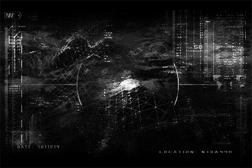

# Log_701_12_14_1
## Log Content

Excavation log 7011214\_1 
Location: Ruins N13A448 
Depth: \-33 Meters below sea level 
Geography: Steep, mostly Effusive rocks 
Equipment damage rate: 3%, still within safe range

Record: 
Entry\_1 
According to the scan by the drone, there seems to be a large structure beneath this area. If my speculations are correct, the key to figuring out the mystery behind father's artifact is very likely to be here.  
The environment is in great condition. 
[Detection: Descent device activated] 
I found a stable location to install the descent device on the edge of the crack.

Entry\_2 
When I was descending from the crack, I caught a glimpse of A.R.C.'s transport aircraft circling the area. They better not come here and mess with me. All these pests do is take everything inside the Ruins and hand it to their third\-rate scientists. Their "research" often produces worthless results...  
The earth's getting soft; better descend to the base before I talk anymore.  
End recording.

Time of recording: 701\_1214\_0545