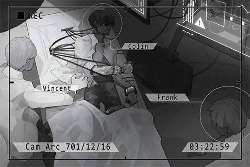

# Cam_Arc_701_12_16
## Unlocked Charts
|          Song           |Character|Diff.|Level|
|-------------------------|:-------:|:---:|:---:|
|**Light of Buenos Aires**| ConneR  |Easy |  3  |

## Log Content
**Sagar** 
What's the patient's situation?

**Medical Staff** 
The operation is successful. Vital signs are stable, but the patient has yet to regain consciousness...

*\[Equipment knocked over\]*

**Medical Staff** 
Yikes!

**Sagar** 
He's awake!

**ConneR** 
Where am I? Let go of me!

**Medical Drone** 
Detection: Patient emotion unstable. 
Treatment: Sedative injection. Dosage: 15%

**ConneR** 
......!

**Sagar** 
Please calm down, Dr. Neumann. This is A.R.C.'s medical department in Node 08. 
28 hours ago, we found you unconscious and badly injured in Node 13's forbidden area. After giving you emergency medical treatment, a transport aircraft flew you here for a complete operation.

**ConneR** 
My right arm... what... have you people... done to me!?

**Sagar** 
When we found you, you had an inoperable comminuted fracture of your entire right arm, a badly damaged right eye and extreme blood loss. The doctors decided it was impossible to reconsruct your arm, so we installed a biomechanical prosthetic and an electronic eye. Right now, we are still in the process of reconstructing the nervous system. Please lie down and try to relax your muscles.

**ConneR** 
... Get this... disgusting piece of junk... off me...

**Medical Staff** 
Mister! Please don't do this! You guys, hold him down!

**Medical Drone** 
Detection: Patient attempts to interrupt reconstruction of nervous connection. 
Treatment: Sedative injection. Dosage: 35%

**Sagar** 
Alright, let him take a little nap. 
He may still have severe emotional reactions. Turn up the sensibility on the medical drones. I'll have two groups guarding the door in turns.

*[Replay Ends]*