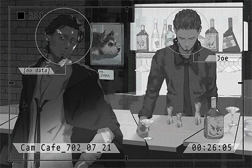

# Cam_Cafe_702_07_21
## Requirements
|Character |Level|
|----------|:---:|
|**ConneR**| 14  |

## Unlocked Charts
|         Song         |Character|Diff.|Level|
|----------------------|:-------:|:---:|:---:|
|**Nostalgia Sonatina**| ConneR  |Hard |  8  |

## Log Content

*\[Doorbell\]*

**JOE** 
Wel... come.

**Unknown** 
Long time no see, JOE.

**JOE** 
... Martini?

**Unknown** 
Don't be nervous. No martini today. Just want to get some info from you.

**JOE** 
Doesn't that mean you still want a Martini?

**Unknown** 
Just a quick chat. If you don't want to talk about it, I'll order.

**JOE** 
What quick chat? I have no intention to chat with you.

**Unknown** 
Simon Jackson, a regular here, right? Heard he's an old friend of yours. 
Talk to me about this person. Anything works. 

**JOE** 
......

**Unknown** 
Seems like you don't want to talk about it. Alright then. Martini, three olives.

**JOE** 
... What did he do? I advise you guys to stay away from him...

**Unknown** 
I said, Martini, three olives. Do I need to repeat myself?

*\[Make Cocktail\]*

**JOE** 
...What do you want to know?

**Unknown** 
Let's see... tell me about what he has been doing since he joined A.R.C.

**JOE** 
He discovered my shop two years after he joined A.R.C. We haven't contacted each other for many years. He rarely talks about his work when he's here. All I know is that he works for A.R.C.'s internet security department. Despite being a relatively new member of A.R.C., he established many safety protocols and firewalls for cyTus. Despite his contributions, he has yet to be promoted to managerial positions and get access to...

**Unknown** 
Are you playing dumb? the grumpy lady in the shoddy barber shop across the street knows this information. Tell me something "useful".

**JOE** 
... A while ago, he told me that they were working with the admins to investigate a case, However, he didn't tell me the details...

**Unknown** 
Now that's more like it. Anymore? Tell me more info that only you know.

**JOE** 
That's about it. He's a very careful person. He rarely talks about the details of his job when he is with me.

**Unknown** 
That's about it? I ordered booze, you better not BS me.

**JOE** 
It's precisely because you ordered booze that I told you anything. There really isn't anything left. Why do you guys suddenly start investigating him?

**Unknown** 
Guys? Nah you're wrong. The organization has no interest in that little pussy. It's a personal request I accepted. Money problems you know, regular jobs just aren't enough.

**JOE** 
... Boss is not going to let you off the hook if he found out that you ordered Martini for a "personal request".

**Unknown** 
I know! Therefore you better keep that mouth tightly shut! I won't be an A\-hole; I'll give you your share once I get paid.

**JOE** 
No need for that. Now get out once you're done drinking.

**Unknown** 
Watch your attitude. Have you forgotten what happened to the dog? Although that's against the rules as well. LOL.

**JOE** 
......

**Unknown** 
Whatever, before the job is done I'll be here every day. You better prepare more information on this guy. Bye.

*\[Doorbell\]*

*[Replay Ends]*