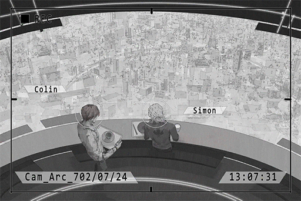

# Cam_Arc_702_07_24
## Requirements
|Character |Level|
|----------|:---:|
|**ConneR**| 16  |

## Log Content

**ConneR** 
Good afternoon sir. May I sit here?

**Xenon** 
... What do you want?

**ConneR** 
Don't be so hostile. This is a pretty nice place to have lunch, never realized that before.

**Xenon** 
I'm on my break now. If there's a problem, file a work request.

**ConneR** 
*\*Chuckles\** Don't worry I'm not asking you to work. Just want to chat with you a little. May I, Mr. Xenon?

**Xenon** 
...Don't call me that at work.

**ConneR** 
Apologies, but you aren't exactly keeping a low profile. I've had the pleasure of listening to your album.

**Xenon** 
Oh.

**ConneR** 
It's quite interesting. In terms of composing, there's plenty of digital mixing and post\-production edits. However, when it comes to the all\-important strings, you didn't abandon the traditional method of physical resonance. I admire that.

**Xenon** 
If the strings became digital as well, the guitar would have no life. It certainly wouldn't sound good.

**ConneR** 
Ohhh, not what I expect to hear from someone who works in such a lifeless environment. Lives among technology and machines every day, yet your music is still full of emotion. It seems that on this front, we have a consensus.

**Xenon** 
Don't speak like you know me so well...

**ConneR** 
*\*Chuckles\**  Maybe I know you a lot better than you think. 
Technology is the torch that lights the road for humans and we are the ones holding it. Our every action directly affects the future of the human race.

**Xenon** 
That only applies to you right? I'm not that great.

**ConneR** 
Don't underestimate yourself. It's a complete tragedy for a talent like you to be at the bottom. I look forward to the day you make your leap to the top.

**Xenon** 
... Thanks for the compliment.

**ConneR** 
This is my album. If you don't mind, give it a try and tell me what you think about it.

**Xenon** 
If I'm in the right mood.

**ConneR** 
*\*Chuckles\** quite indifferent are you. Then I shall take my leave. Enjoy your break, Mr. Xenon.

**Xenon** 
I would appreciate that.

*[Replay Ends]*