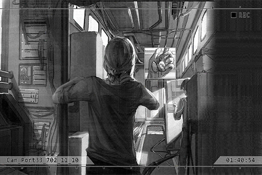

# Cam_Port33_702_11_10
## Requirements
|Character |Level|
|----------|:---:|
|**ConneR**| 33  |

## Log Content
*\[Door Opens\]*

**ConneR** 
......

**ConneR** 
......

**Xenon** 
Cough cough...

*\[Closes pocketwatch\]*

**ConneR** 
... Ah, Mr. Jackson. Apologies. It's too noisy here, hence why I didn't notice you.

**Xenon** 
She said that we're still a few hours away from arriving.

**ConneR** 
I know.

*\[Violin sound\]*

**Xenon** 
... What are you doing?

**ConneR** 
I found this crappy violin in the old storage compartment over there. Although the sound is as thick and gooey as mucus, it's still nice to have something to kill time.

**Xenon** 
......

*\[Violin sound\]*

**ConneR** 
The sound is off... but have you heard this melody before?

**Xenon** 
Some musician's work that was excavated in Node 13, right? I processed that document when I was still working.

**ConneR** 
Correct. I expect no less from you. The place I'm going next, Node 13, is the mecca of ancient music that has its own unique charm. I truly miss the time I spent there.

**Xenon** 
It's about time you explain your plan, isn't it? I'm not here to listen to your history lessons.

**ConneR** 
Take it easy. The history lessons are part of my explanation for you too. After all, I don't want you to get confused by what I'm going to say. 
We're in no hurry too, so have a seat.

**Xenon** 
... You have a point. Go ahead.

**ConneR** 
The Neumann household's ancestors were a notable family in Node 13, but that was several hundred years ago. Why the family had such a high status back then is already unidentifiable. The only things that remained were the family teachings and traditions, now reduced to a mere formality.

**ConneR** 
That was until my father took over the family. He became deeply engrossed in the items that have been passed down through the family and began researching them. This was also the reason why he joined the A.R.C. exploration team. I believe you know a few things about his story too, don't you? 

**Xenon** 
Used to be an elite member of the exploration team, until a mission accident that resulted in the death of his entire team. After returning from that mission, he was declared mentally ill and... Ah, sorry. He passed away not too long ago, right? My sincere condolences.

**ConneR** 
It's alright. Mentally ill, eh...? Perhaps that is the case. After that incident, my relationship with him has never been a good one, all the way until the day of his death. At one point, I even detested him. *\*Chuckles\**

**Xenon** 
......

**ConneR** 
Nevertheless, from those messy researches and relics of his, I was able to figure out some clues. At the very least, I am certain that he is definitely not mentally ill. 
In order for you to better understand this, let me tell you about his story. That "truth" that has been ingrained in his vision and passed down to me...

*[»»» Fast Forward 15 minutes»»»]*

**Xenon** 
......!

**ConneR** 
This is the reason why people refer to him as a "mad man". What do you think? Does it make some kind of sense to you after hearing all that?

**Xenon** 
... Nothing illogical according to my understanding, that much I can say. If everything you said is true, then it's all connected... The Decommission, the secret A.R.C. is hiding in Library, the virtual internet, Æsir... this entire world...

**ConneR** 
Starting to get a bit interested, aren't you? Next, I'll be going to Node 13 to continue to investigate and verify my theory. As with you, you'll be responsible for finding "that person" in Node 03. With that, we'll obtain all the cards we need.

**Xenon** 
Under the premise that everything you just said is true.

**ConneR** 
What a paranoid... Indeed, lying is one of my specialties. However, before you can confirm the truthfulness of my words, you guys can only do as I say for now too. If you notice that something is off, you guys can quit whenever you want anyway. So, what do you think? Not too bad a deal for you, right?

**Xenon** 
... "Guys"?

**ConneR** 
*\*Chuckles\** Your conversation with Miss Pauline just now, I heard it all. 
"Partners" eh....? How interesting.

**Xenon** 
......

**ConneR** 
Quick advice for you. It appears that you understand your heartbeat far less than those tech products. For your sake, it's better that you be honest with your own emotions. Be too easily influenced by it, and you'll often find yourself on the short end of the stick.

**Xenon** 
My emotion is none of your business... You should be concerned about yourself.

**ConneR** 
I don't have such mundane concerns.

**Xenon** 
Ho? Is that so? Then who is the person in that photo just now? You were completely engrossed looking at it.

**ConneR** 
... Unfortunately, the only information I will provide you are those that benefit this operation.

**Xenon** 
Idiot, I'm not interested in your past at all. If you don't want to be asked, stop pretending that you know other people very well.

**ConneR** 
Apologies, I tend to do that unintentionally when I'm interacting with you. After all, we may have come into contact with each other far before we first "met"... Forget it, all things in the past. Not important right now.

**Xenon** 
......?

*[Signal Lost]*