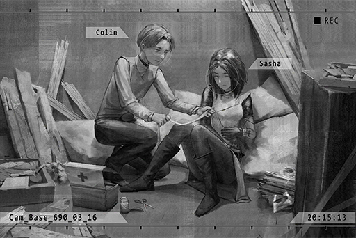

# Cam_Base_690_03_16
## Requirements
|Character |Level|
|----------|:---:|
|**ConneR**| 34  |

## Log Content
**???** 
... I can do it myself. It's just a tiny wound...

**ConneR** 
You can't properly bandage yourself from this angle. Let me do it.

**???** 
Don't you dare use this chance to feel me up.

**ConneR** 
I won't do that! Well then... please excuse me.

**???** 
Ah! Ow.... ow...

**ConneR** 
... Did... a law enforcement agent do this?

**???** 
Yep... I thought things were going smoothly. Was a really well\-concealed transaction too... Where exactly did the info leak? Damnit...

**ConneR** 
......

**???** 
... First time seeing a gunshot wound?

**ConneR** 
Umm... if it's from this distance... Yeah, it's a first.

**???** 
*\*Chuckles\**. If you want to survive in this business, you better be careful yourself too. Maybe one day this hole will be on you instead.

**ConneR** 
Eh...? No, I'm just a normal civilian...

**???** 
Hmph, don't play dumb. I saw the martini on the table. You're also one of "us", aren't you? You suck at lying, and that's a terrible weakness to have in this world.

**ConneR** 
...... 
Your wounds are dressed. Please don't move around too much for now.

**???** 
Ho? You're quite clever with your hands. Thanks. 
The thing you hid just now, it's something from A.R.C., isn't it? Can you let me take a look?

**ConneR** 
......

**???** 
No need to be so cautious. Judging by how refined you look, you don't seem like a gunman or hitman... You're probably more of an information broker or a deceiver. I'm good at sizing people up. If that's really what you are, consider me your senior.

**ConneR** 
Deceive...

**???** 
Buyer? Seller? You look like a fawn who wandered into a pack of wolves without realizing it. I may be able to give you some advice. Show it to me. It's not like we can leave this place any time soon either.

**ConneR** 
I'm a seller... I don't mind showing it to you since I can't decrypt this data either. The buyer offered a good price, and I just so happen to have a way to obtain it.

*\[Load data\]*

**???** 
This serial number... how did you get your hands on this stuff!?

**ConneR** 
Ummm... trade secrets.

**???** 
Interesting... How much is the buyer paying?

**ConneR** 
... (Whispers)

**???** 
Hahahaha! And you call that a "good price"? Are you kidding me!? 
Lemme tell you... you got conned.

**ConneR** 
EH?

**???** 
This is a level 4 encryption of A.R.C. The undecrypted data alone can easily get you at least ten... no, twenty times the price if you sell it on the market.

**ConneR** 
For real!?

**???** 
You really are completely oblivious... How the hell did you get yourself into this business...  
Nevertheless, judging by the fact that you're able to obtain this piece of data, guess it's safe to conclude that you're somewhat capable.

**ConneR** 
This is just a small part of the whole thing too... I can't steal all the data at once. However, if it's one small package at a time...

**???** 
Stop right\~ there!  
Lesson 1: Never blurt out information without the other person asking first. Seriously, just how gullible are you?

**ConneR** 
......! 
Umm... I could be telling a lie...

**???** 
Lesson 2: Bluffing is utterly useless if you are not certain the amount of information the other person has. 
What you said is true. Area 09, right? I heard rumors about this stuff on the market. From the serial number and transfer protocol, I can easily tell that this baby here is the real deal.

**ConneR** 
......!

**???** 
According to the rumors, A.R.C. hid a ton of files in that server block. All stuff they don't want the public to see.  
Nobody knows what the actual content in those files is. Both the connection and physical security of that block are extremely tight. As of now, not a single soul has successfully infiltrated it. 

**???** 
Yet a pretty boy like you somehow managed to obtain a part of that data... Don't you find that intriguing?

**ConneR** 
......

**???** 
Excellent... I can smell the money. 
I'm "Sasha", a professional deceiver. 
What do you say? Wanna work together with me?

**ConneR** 
You certainly look very experienced... But with how messy you look right now, I presume you just failed a transaction? I find it hard to believe that...

**Sasha** 
Haha, what do you think is in these two cases? One of them contains the goods. The other one contains the money. Do you understand? In a busted transaction, I was able to get my hands on both and leave the other person with nothing. Although I did get shot a few times...

**ConneR** 
......

**Sasha** 
Abandon your original buyer. I can guarantee you that they offered you such a s\*\*\*\*\* price because they saw you as an idiot who knows nothing. Trust me. Setting aside how you get your hands on that data, I can get you more value for your abilities on the market hands down. 
You got into this business 'cause you need the money too, right?

**ConneR** 
... Alright. I will trust you, temporarily that is.

**Sasha** 
"Temporarily" eh... how cold. Ah, one more thing. I don't know your name yet.

**ConneR** 
... "Colin".

**Sasha** 
Colin... What a weird codename. I already have a basic concept of this plan in my mind. 
Come to this address at 3 P.M. tomorrow.

**ConneR** 
This place is...?

**Sasha** 
One of my "offices". We'll discuss the details there. 
I look forward to our partnership. Let's start from zero... Partners?

*\[High Five\]*

**ConneR** 
... Partners.

*[Signal Lost]*