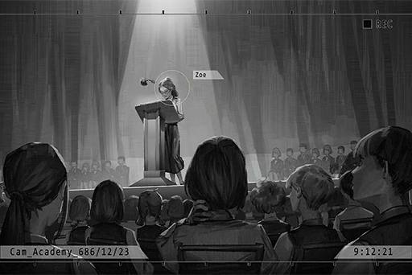

# Multi_Files_686_12_21
## Requirements
|Character |Level|
|----------|:---:|
|**ConneR**| 40  |

## Log Content
**Colin** 
Alyxia! Alyxia!

**ConneR** 
... Father, mother is already gone. Come on, take your meds.

**Colin** 
Alyxia... Luka... I'm sorry... It was all me... Damnit...

**ConneR** 
... Father, I'm still here.

**Colin** 
......

**ConneR** 
Ah, Right! I've made progress on my thesis again. I'm now number 2 in the entire Node accroding to the grading system.

**Colin** 
... Take it away! Don't let me see your unacceptable thesis! To the Neumann family, it's only honorable if it's number 1!

*\[Things crashing\]*

**ConneR** 
...... 
I'll give you some sedatives. You need to rest. Good night.

*\[Door closes\]*

**Grace** 
Master! You could've asked me to give the medicines to Sir...

**ConneR** 
No, it's okay. I want to do it. 
... I'm hungry. Can you go make me some food?

**Grace** 
Certainly! 
... Master, thank you so much.

**ConneR** 
...* \*Chuckles\** What's the matter? Why this all of a sudden...

**Grace** 
Thank you for not giving up on Sir and this home... and me.

**ConneR** 
Of course I won't give up. One day, we will return to the lives we once had...  
... Enough talking. Can you make me some food now? I'm starving! Also, make some for yourself too. We can eat together.

**Grace** 
Yes, master.

*\[Footsteps\]*

*\[Things crashing\]*

**Colin** 
Useless! All of them are a bunch of useless hacks!

*\[Sits on ground\]*

**ConneR** 
What exactly... am I doing all this for...?

*[→File Switches]*

**[Tutorial System]** 
*687, Year J, first exam final score ranking announcement: 
1st place, Year J Class 1 \- Zoe Watson 
2nd place, Year J Class 3 \- Colin Neumann Jr. 
3rd place...*

**ConneR** 
Her again... Damnit, why am I always losing to her...

**Student A** 
Yikes, I failed again. My dad's gonna be really, really mad...

**Student B** 
As expected, first place belongs to "Miss Academy" again.

**ConneR** 
Whatever, what's the point of me working so hard... This is stupid...

*[→File Switches]*

**[Tutorial System]** 
*Year J model student representative Zoe Watson, please come to the stage for your speech.*

*\[Applause\]*

**ConneR** 
... It's her.

**Zoe** 
Another year has passed. I am extremely blessed to be given the honor to deliever a speech as the model student representative again this year. I believe that everyone has encountered all kinds of difficulties on their path to knowledge...

**ConneR** 
... Beautiful.

*[→File Switches]*

**[Tutorial System]** 
*688, Year K, first exam final score ranking announcement: 
1st place, Year K Class 1 \-  Colin Neumann Jr. 
2nd place......*

**Student A** 
Oh, so that eternal 1st place finally gave up her spot... Who is this guy?

**Student B** 
Well, she suspended her studies. I heard that when she's still here, no one can ever beat her in an exam.

**ConneR** 
......

*[Signal Lost]*