# ConneR OS Logs
## <a id="toc"/>List of Logs
- [\[#001\] Log\_701\_12\_14\_1](#cos001)
- [\[#002\] Cam\_Arc\_701\_12\_16](#cos002)
- [\[#003\] Audio\_Raven\_701\_12\_21](#cos003)
- [\[#004\] Cam\_Arc\_702\_01\_30](#cos004)
- [\[#005\] Audio\_Arc\_702\_02\_05](#cos005)
- [\[#006\] Log\_702\_02\_14\_repaired](#cos006)
- [\[#007\] Audio\_Home\_697\_07\_11](#cos007)
- [\[#008\] Mail\_iM\_702\_07\_01](#cos008)
- [\[#009\] Log\_Home\_697\_08\_08](#cos009)
- [\[#010\] Mail\_690\_05\_14](#cos010)
- [\[#011\] Cam\_Arc\_702\_04\_04](#cos011)
- [\[#012\] Diary\_ConneR\_702\_04\_06](#cos012)
- [\[#013\] Mail\_BH\_702\_07\_12](#cos013)
- [\[#014\] Call\_702\_07\_12](#cos014)
- [\[#015\] Log\_Arc\_702\_07\_14](#cos015)
- [\[#016\] Cam\_Arc\_702\_07\_20](#cos016)
- [\[#017\] Cam\_Cafe\_702\_07\_21](#cos017)
- [\[#018\] Diary\_ConneR\_702\_07\_22](#cos018)
- [\[#019\] Cam\_Arc\_702\_07\_24](#cos019)
- [\[#020\] Mail\_Arc\_702\_07\_27](#cos020)
- [\[#021\] Diary\_ConneR\_702\_07\_28](#cos021)
- [\[#022\] Mail\_Arc\_702\_07\_22](#cos022)
- [\[#023\] Audio\_Arc\_702\_08\_26](#cos023)
- [\[#024\] Diary\_ConneR\_702\_08\_26](#cos024)
- [\[#025\] Audio\_Arc\_702\_08\_12](#cos025)
- [\[#026\] Mail\_Arc\_702\_08\_20](#cos026)
- [\[#027\] Audio\_Arc\_702\_08\_07](#cos027)
- [\[#028\] Audio\_Arc\_702\_08\_08](#cos028)
- [\[#029\] Audio\_Arc\_702\_08\_11](#cos029)
- [\[#030\] Audio\_Arc\_702\_08\_17](#cos030)
- [\[#031\] Diary\_ConneR\_702\_08\_28](#cos031)
- [\[#032\] Log\_702\_08\_08\_12](#cos032)
- [\[#033\] Cam\_Arc\_702\_09\_21](#cos033)
- [\[#034\] Audio\_Factory3\_702\_09\_21\_1](#cos034)
- [\[#035\] Audio\_Factory3\_702\_09\_21\_2](#cos035)
- [\[#036\] Mail\_Grace\_702\_10\_22](#cos036)
- [\[#037\] Cam\_Home\_702\_10\_23](#cos037)
- [\[#038\] Audio\_Arc\_702\_11\_02](#cos038)
- [\[#039\] Diary\_ConneR\_702\_11\_04](#cos039)
- [\[#040\] Cam\_CArea\_702\_11\_08](#cos040)
- [\[#041\] Audio\_Port33\_702\_11\_10](#cos041)
- [\[#042\] Cam\_Port33\_702\_11\_10](#cos042)
- [\[#043\] Audio\_Cafe\_690\_03\_16](#cos043)
- [\[#044\] Cam\_Base\_690\_03\_16](#cos044)
- [\[#045\] Audio\_Sasha\_690\_03\_17](#cos045)
- [\[#046\] Audio\_Home\_676\_04\_08](#cos046)
- [\[#047\] Audio\_St166\_690\_3\_23](#cos047)
- [\[#048\] Audio\_Graveyard\_682\_06\_16](#cos048)
- [\[#049\] Cam\_Sasha\_690\_06\_30](#cos049)
- [\[#050\] Audio\_admins\_690\_07\_07](#cos050)
- [\[#051\] Cam\_Hotel\_690\_07\_09](#cos051)
- [\[#052\] Audio\_Home\_683\_07\_09](#cos052)
- [\[#053\] Audio\_St199\_690\_07\_10](#cos053)
- [\[#054\] Multi\_Files\_686\_12\_23](#cos054)
- [\[#055\] Audio\_Truck\_690\_07\_11](#cos055)
- [\[#056\] Multi\_Files\_686\_12\_21](#cos056)
- [\[#057\] Audio\_Truck\_690\_07\_11](#cos057)
- [\[#058\] Audio\_Garion's\_702\_11\_20](#cos058)
- [\[#059\] Audio\_Garion's\_702\_11\_20](#cos059)
- [\[#060\] Audio\_13St57\_702\_11\_21](#cos060)
- [\[#061\] Audio\_Sasha\_702\_11\_21](#cos061)
- [\[#062\] Audio\_Sasha\_702\_12\_15](#cos062)
- [\[#063\] Audio\_Sasha\_702\_12\_16](#cos063)
- [\[#064\] Audio\_13St35\_702\_12\_17](#cos064)

## <a id="cos001"/>\[#001\] Log\_701\_12\_14\_1
### Log Content
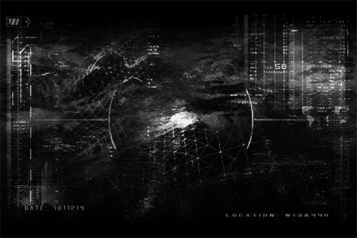

Excavation log 7011214\_1 
Location: Ruins N13A448 
Depth: \-33 Meters below sea level 
Geography: Steep, mostly Effusive rocks 
Equipment damage rate: 3%, still within safe range

Record: 
Entry\_1 
According to the scan by the drone, there seems to be a large structure beneath this area. If my speculations are correct, the key to figuring out the mystery behind father's artifact is very likely to be here.  
The environment is in great condition. 
\[Detection: Descent device activated\] 
I found a stable location to install the descent device on the edge of the crack.

Entry\_2 
When I was descending from the crack, I caught a glimpse of A.R.C.'s transport aircraft circling the area. They better not come here and mess with me. All these pests do is take everything inside the Ruins and hand it to their third\-rate scientists. Their "research" often produces worthless results...  
The earth's getting soft; better descend to the base before I talk anymore.  
End recording.

Time of recording: 701\_1214\_0545

[*(Click here to go back to the top)*](#toc)

## <a id="cos002"/>\[#002\] Cam\_Arc\_701\_12\_16
### Unlocked Charts
|          Song           |Character|Diff.|Level|
|-------------------------|:-------:|:---:|:---:|
|**Light of Buenos Aires**| ConneR  |Easy |  3  |

### Log Content
**Sagar** 
What's the patient's situation?

**Medical Staff** 
The operation is successful. Vital signs are stable, but the patient has yet to regain consciousness...

*\[Equipment knocked over\]*

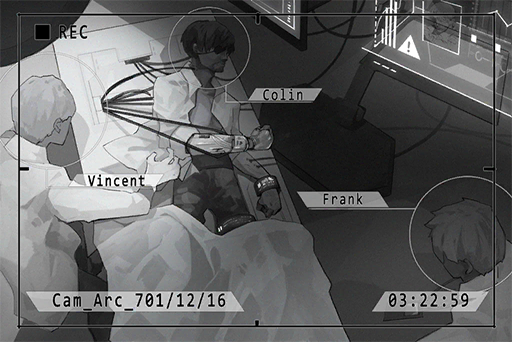

**Medical Staff** 
Yikes!

**Sagar** 
He's awake!

**ConneR** 
Where am I? Let go of me!

**Medical Drone** 
Detection: Patient emotion unstable. 
Treatment: Sedative injection. Dosage: 15%

**ConneR** 
......!

**Sagar** 
Please calm down, Dr. Neumann. This is A.R.C.'s medical department in Node 08. 
28 hours ago, we found you unconscious and badly injured in Node 13's forbidden area. After giving you emergency medical treatment, a transport aircraft flew you here for a complete operation.

**ConneR** 
My right arm... what... have you people... done to me!?

**Sagar** 
When we found you, you had an inoperable comminuted fracture of your entire right arm, a badly damaged right eye and extreme blood loss. The doctors decided it was impossible to reconsruct your arm, so we installed a biomechanical prosthetic and an electronic eye. Right now, we are still in the process of reconstructing the nervous system. Please lie down and try to relax your muscles.

**ConneR** 
... Get this... disgusting piece of junk... off me...

**Medical Staff** 
Mister! Please don't do this! You guys, hold him down!

**Medical Drone** 
Detection: Patient attempts to interrupt reconstruction of nervous connection. 
Treatment: Sedative injection. Dosage: 35%

**Sagar** 
Alright, let him take a little nap. 
He may still have severe emotional reactions. Turn up the sensibility on the medical drones. I'll have two groups guarding the door in turns.

_\[Replay Ends\]_

[*(Click here to go back to the top)*](#toc)

## <a id="cos003"/>\[#003\] Audio\_Raven\_701\_12\_21
### Requirements
|Character |Level|
|----------|:---:|
|**ConneR**|  2  |

### Unlocked Charts
|          Song           |Character|Diff.|Level|
|-------------------------|:-------:|:---:|:---:|
|**Light of Buenos Aires**| ConneR  |Hard |  7  |

### Log Content
*\[Door Opens\]*

**Raven** 
Colin Neumann Jr. We're from Node 08's Administration Bureau...

**ConneR** 
No need for introductions. Just tell me why you're here.

**Raven** 
I am Raven, law enforcement agent from Node 08 Administration Bureau. This is my partner, Hawk.

**Hawk** 
We always knew that you have been visiting the forbidden areas and conducting illegal explorations behind the bureau's back. Here's a record of the violations you were charged with by the bureau in the past decade...

**ConneR** 
Raven and Hawk... did your brain hurt figuring out those codenames...

**Hawk** 
You got a problem with our names!? You better watch your mouth...

**Raven** 
We would like to question you about the recent incident in Ruins N13A448. I hope you can comply. This conversation is being recorded.

**ConneR** 
I have to clarify my stance. We citizens have no obligation to follow any law that was established after A.R.C. and humans took over as admins. Therefore the term "illegal" is quite... inappropriate.  

**Raven** 
Are you finding an excuse for your various crimes? If you want a reminder, that includes illegal trespassing into the forbidden areas, encroachment of public property within Ruins and resisting arrest from Administration Bureau officers, among a long list of others.

**ConneR** 
No, I'm serious, boy. I have my rules when I operate and these rules are built on core beliefs. The only thing that bothers me is that you can't force others to accept your belief.

**Hawk** 
Easier said than done!

**ConneR** 
You have to believe me, young fowls. What I am doing is for the sake of you people.

**Hawk** 
What did you just say!?

**Raven** 
Hawk, calm down. 
Dr. Neumann, can we talk about what happened to your right arm?

**ConneR** 
Even though my memory is still a bit blurry, I told everything to the people that gave me emergency treatment back at the accident site. I believe the medical drones captured every single word I spoke. I don't want to repeat myself. 

*\[Drinks Tea\]*

**Hawk** 
Mr. Neumann! Right now you're a criminal with multiple serious charges! I advise that you watch your attitude!

*\[Cup Shatters\]*

**Raven** 
Hawk! Stand down! The hard way doesn't work with this guy.

**ConneR** 
You two have quite the teamwork. Are we doing the full good cop/bad cop routine now?

**Hawk** 
What the hell is a "cop"?

**Raven** 
It's what civilians called law enforcement agents in the past. This guy is a complete professional when it comes to things of the past.

**ConneR** 
All in all, I don't have anything new to tell you people. Everything is in the records. You guys can now go and report back to your superiors.

**Hawk** 
Your punishment will be issued very soon. We'll see then!

**Raven** 
I will report this to the bureau. It seems that you've run out of tricks this time. I'm sorry. 

**ConneR** 
Farewell, young fowls.

*\[Electronic Door\]*

_\[Replay Ends\]_

[*(Click here to go back to the top)*](#toc)

## <a id="cos004"/>\[#004\] Cam\_Arc\_702\_01\_30
### Requirements
|Character |Level|
|----------|:---:|
|**ConneR**|  3  |

### Log Content
*\[Electronic Door\]*

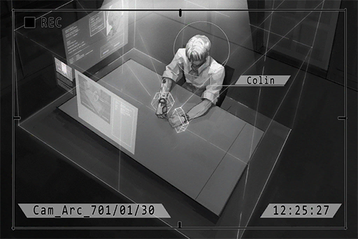

**Sagar** 
Hello, Dr. Neumann. Didn't have the chance to introduce myself last time. I'm...

**ConneR** 
Mr. Sagar, A.R.C.'s top exploration team captain. I thought I'd never see you again.

**Sagar** 
Haha, you really do know everything.  
I've heard about the bureau's progress. Since you had no intention to cooperate during the interrogation, the judgment is not looking good... 

**ConneR** 
You mean those two young fowls? They call that "Interrogation"... My, my. Too young, too naive. 

**Sagar** 
Doctor, I'm not kidding. You might be sentenced to life in prison this time.

**ConneR** 
_\*Chuckles\*_ With their current level of technological understanding, if the admins really want to try and imprison me...

*\[Handcuffs Unlock\]*

**ConneR** 
they have to try harder.

**Sagar** 
My God! Doctor! What are you doing? There are cameras around here. Put it back!

**Sagar** 
How in the world did you...

**ConneR** 
These types of electronic cuffs was designed in the past for lightweight criminals in the slums. It works based on the bio waves emitted from the skin. Right now, my entire right arm is machine. All I did was mess with the cuffs on my left arm a little, and voilà. 
Be it the admins or A.R.C., they are simply using technology while having no idea how it works. 

**Sagar** 
... Doctor, are you planning to break out of prison...?

**ConneR** 
I've said it before. We citizens have no obligation to follow any law that was established after humans took over as admins. I will not accept my arrest on such fabricated charges.

**Sagar** 
You really are a man of principles, just like the rumors said. 
To be honest with you, I came here to make you a deal. It may free you from your current criminal charges and punishments. 

**ConneR** 
I guessed as much. 

**Sagar** 
Huh?

**ConneR** 
_\*Chuckles\*_ I can crack this piece of junk handcuffs with my eyes closed. What makes you think that I willingly stayed in this dump for several days? You came to try and persuade me to join A.R.C.'s research, am I right?

**Sagar** 
Haha... you really did predict everything. I expect no less from the Doctor. 
Actually, the person who came up with this proposal was me. There are plenty of people at A.R.C. who have a deep level of respect for you; I am one of them. We feel that you don't deserve to be locked up like this. 

**ConneR** 
I won't be anyway.

**Sagar** 
Doctor, join us! As a representative of A.R.C., I officially invite you to join us as an advisor. With that position, you can participate in any project we have here. Be it research or exploration, there should be a place for you to display your talents. 

**ConneR** 
Sure.

**Sagar** 
Please give it a solid consideration... EH? Did you just say "Sure"?

**ConneR** 
Yes. Joining A.R.C. was part of my plans anyway. I'm very interested in that "thing" you guys built in the sky and what's stored in it. Never imagined that I would get my opportunity in this fashion though.

**Sagar** 
The higher\-ups told me "No f\*\*\*ing way", but I decided to give it a try nonetheless. I'm so glad that you agreed! 
With your academic knowledge and field experience, combined with the resources and talents at A.R.C. HQ, I believe you won't be disappointed.

**ConneR** 
_\*Chuckles\*_ I don't necessarily agree with the "talent" part, but we'll see about it. 

**Sagar** 
Anyway, thank you so much! Later today, we will have our agents deal with all the registration and documents. Tomorrow morning, someone will take you to the presentation center to listen to the newcomer's guide.  
Oh, and please put the handcuffs back on. You're putting me in a very awkward situation...

*\[Electronic Door\]*

_\[Replay Ends\]_

[*(Click here to go back to the top)*](#toc)

## <a id="cos005"/>\[#005\] Audio\_Arc\_702\_02\_05
### Requirements
|Character |Level|
|----------|:---:|
|**ConneR**|  4  |

### Unlocked Charts
|        Song        |Character|Diff.|Level|
|--------------------|:-------:|:---:|:---:|
|**tondari-hanetari**| ConneR  |Easy |  3  |

### Log Content
*\[Electronic Door\]*

**Sagar** 
Doctor, you're doing rehab?

**ConneR** 
Ah, Mr. Sagar. Good afternoon.

**Sagar** 
As expected from doctor. Writing is the most efficient way to improve the compatibility of a prosthetic arm.  
How does your body feel?

**ConneR** 
Still need some time to adjust. If possible, I would like to practice playing some instruments as well.

**Sagar** 
I know doctor lived in Node 13 for a while and left many personal items back there. If there is the need, I can file an application to get someone to move it here, including your instruments.

**ConneR** 
That would be great. You have my gratitude.

**Sagar** 
... Doctor, you are not as difficult as I imagine. From what I've heard, you're supposed to be unapproachable and bad\-tempered. In reality, you're a very kind and soft\-spoken gentleman.

**ConneR** 
What I loathe are the admins and the higher\-ups in the A.R.C. committee. What's the point of getting mad at you? As an exploration captain, you saved my life and made me a deal that spared me from imprisonment. I should be respectful and thankful to you.

**Sagar** 
Don't say that doctor. I really don't deserve such politeness from you.

**ConneR** 
Being well\-mannered is a proud tradition of the Neumann family. I'm more surprised by you. I'm technically a criminal to you people, yet you don't seem to show any distaste when you're around me.

**Sagar** 
Personally, I feel that doctor's contributions to archeology and exploration technology cannot be judged with traditional legal concepts. I originally wanted to pursue a career in archeology too, but I've always been a "brawn over brains" type of person. My physical ability is far superior to its intellectual counterpart, so doing exploration became my only option. People like Dr. Neumann, who are both physically and intellectually capable, are like gods to us!

**ConneR** 
Young fella, there are no "gods" in this world. There are plenty of "humans" pretending to be gods though, so I would prefer if you don't call me that.

**Sagar** 
Sorry. Just want to tell you that I really look up to you.

**ConneR** 
Thank you.  
By the way, I believe that A.R.C. and the admins can simultaneously see what my right eye sees. Am I right?

**Sagar** 
Heck no! Back then, we were working our asses off trying to save you. We don't have the spare time to perform such cheap tricks. I was there in person, trust me!

**ConneR** 
... Alright. Still, doesn't hide the fact that it makes me quite uncomfortable... can I cover it up?

**Sagar** 
Eh? It should be fine... but you're lucky to recover your sight. Are you just going to throw it away like that?

**ConneR** 
It's more of an issue of principle. I have my doubts about a world viewed through the eye of a machine. Therefore, I'd rather not use it.

_\[Replay Ends\]_

[*(Click here to go back to the top)*](#toc)

## <a id="cos006"/>\[#006\] Log\_702\_02\_14\_repaired
### Requirements
|Character |Level|
|----------|:---:|
|**ConneR**|  5  |

### Unlocked Charts
|          Song           |Character|Diff.|Level|
|-------------------------|:-------:|:---:|:---:|
|**Light of Buenos Aires**| ConneR  |Chaos| 12  |

### Log Content
\[Data partially damaged due to external force\] 
Excavation Log 7011214 
Location: Ruins N13A448 
Depth: \-41 Meters below sea level 
Geography: Steep, mostly Effusive rocks 
Equipment damage rate: 5%, still within safe range

Record: 
Entry\_1 
After a descent of around 50 minutes, I reached the bottom of the Ruins. Just like the drone scan, there is indeed a very large space down here. I'm walking along a straight passageway that should be heading towards the center of the structure. 

Entry\_2 
Movement at the pillar in the corner ahead of me. The thing seems to run towards the side passageway after discovering me. I'm pursuing it! \[Detection: Sonar device activated\]

Entry\_3 
Damnit! I lost it. I'm certain it ran this way... Wait a second, the sonar detected something... UGH! My eye! Bastard.... How is it possible? Why is that thing here?...  
\[Detection: User fires pistol\] 
... Come on! That the best you got!... 
\[Detection: User fires pistol\] 
\[Detection: User fires pistol\] 
\[Detection: User fires pistol\] 
...  AHHHHHHH MY ARM! You god forsaken...  
\[Diary is interrupted due to unknown reasons\]

\[Recording device is damaged due to blunt force\]

Time of interruption: 701\_1214\_0637

[*(Click here to go back to the top)*](#toc)

## <a id="cos007"/>\[#007\] Audio\_Home\_697\_07\_11
### Requirements
|Character |Level|
|----------|:---:|
|**ConneR**|  6  |

### Unlocked Charts
|        Song        |Character|Diff.|Level|
|--------------------|:-------:|:---:|:---:|
|**tondari-hanetari**| ConneR  |Hard |  8  |

### Log Content
*\[Doorbell\]*

**Grace** 
Hello, Neumann residence, how may I... Huh!? Master Colin!

**ConneR** 
Grace, it's been a while.

**Grace** 
Just a moment please. I'll open the gates for you right now!

*\[Gate Opens\]*

**Grace** 
Master! You finally came back!

**ConneR** 
The hugs can wait; let me put my stuff down first... Woah, why are you crying? Are you that touched?

**Grace** 
Apologies. I'll take your luggage to your room. Everything is pretty much in the place where you left them. 

**ConneR** 
Thank you. How's father doing?

**Grace** 
Sir is... he's fine, but I think you might have to take a look yourself.

**ConneR** 
What's the matter?

_\[»»» Fast Forward »»»\]_

**ConneR** 
... Father?

**Colin** 
......

**ConneR** 
... Just what in the world happened?

**Grace** 
After you left home, Sir began to lock himself in the workshop for days on end on a regular basis. At first, he still ate the food I placed in front of his door. Until one day, I discovered that the food hasn't been touched in a while. I broke into the room, only to find him collapsed among messy piles of data and pieces of equipment...

**ConneR** 
... And he has been in this state ever since?

**Grace** 
Yes... He still performs eating motions when I feed him, but that's it. He has no reaction to everything else. He just keeps staring into nothingness like he has no soul. The doctors can't identify what's wrong with him either...

**ConneR** 
... Father, it's me.

**Colin** 
......

**ConneR** 
Father!

**Grace** 
Apologies. I thought he would have some reaction after seeing you. Doesn't seem like it... 
Master! I'm so sorry. It's... _\*sniff\*_... all my fault. If I had taken a better care of Sir, he wouldn't...

**ConneR** 
Don't apologize. I should have come back earlier. I was too obsessed with my own achievements... Looks like I don't even have the chance to show off to him anymore... 

**Grace** 
Master...

**ConneR** 
... I'm fine. Let me take a look at father's workshop...

_\[»»» Fast Forward »»» \]_

*\[Door Opens\]*

**Grace** 
Apologies. I don't know where to start organizing all this complicated stuff.

**ConneR** 
Don't mind. Just keep it this way.

**Grace** 
Ah yes. Sir was holding this in his hand when I found him... There's also a letter on the desk; I believe it's addressed to you.

**ConneR** 
It's the Neumann family chip...

*\[Opens Envelope\]*

_\[Replay Ends\]_

[*(Click here to go back to the top)*](#toc)

## <a id="cos008"/>\[#008\] Mail\_iM\_702\_07\_01
### Requirements
|Character |Level|
|----------|:---:|
|**ConneR**|  6  |

### Log Content
**Subj.**: [Reply to account transfer request] Transfer "Colin Neumann Jr." to "ConneR" 
**From**: iM service center 
**To**: Colin Neumann Jr.
___

Dear user,

Based on the account transfer request you filed 24 hours ago, 
the system has accepted the request. It will be applied within 1 hour. 

Details: 
Original account: Colin Neumann Jr. 
New account: ConneR 
Account type: Regular, accepts public follows

Thank you for using iM's full\-sense social networking system. 
If there are any problems, please contact us. We will answer your questions for you. Thank you.

Best regards,

The iM full\-sense social networking team

[*(Click here to go back to the top)*](#toc)

## <a id="cos009"/>\[#009\] Log\_Home\_697\_08\_08
### Requirements
|Character |Level|
|----------|:---:|
|**ConneR**|  7  |

### Unlocked Charts
|    Song     |Character|Diff.|Level|
|-------------|:-------:|:---:|:---:|
|**Abduction**| ConneR  |Easy |  4  |

### Log Content
Diary Log 6970808\_ConneR 
Location: Node 08 Mansion

　Returned to this big, empty house after I left it more than a decade ago, only to find out that the only things waiting for me are father's soulless shell and an endless sense of loss. Maybe I came back to prove something; maybe I want to tell him that I did not disappoint and lived up to family expectations. All of a sudden, those things are no longer important anymore. The chip father left me is a token that has been passed down through the Neumann family for generations. Although I've never heard my father talk about the details, I think it should be some kind of ancient technology? In my faint memory of my childhood, I remember there was a period where father was in a very irritated mood, likely because of this chip. Not long after that, mother and I left this home. Did a quick analysis with father's equipment. The chip itself is still somewhat recognizable, but the port is something I've never seen before. There are way too many questions left behind by the Neumann family. I just might have the ability to find the truth behind those questions, in Node 13. 

ConneR 6970808

[*(Click here to go back to the top)*](#toc)

## <a id="cos010"/>\[#010\] Mail\_690\_05\_14
### Requirements
|Character |Level|
|----------|:---:|
|**ConneR**|  8  |

### Log Content
To my son: When you see this letter, I might be on my last breath. Maybe I can't even remember who I am. Shortly after you and your mother Alyxia left, I was diagnosed with neurodegenerative dementia. Don't worry though; I wrote this letter when I'm still in the early stages of the disease. I might forget some words; my description of things might not be 100% clear; my thoughts might not flow smoothly. So, I had Grace help me. The letter you are reading now was basically co\-written by Grace and me. First of all, I would like to apologize to you and your mother in place of my irritable self back then. Due to my fear and my ignorance, I was a childish fool that did nothing but blame others for my personal mistakes. The biggest, most irredeemable mistake I ever made was losing you and your mother. I owe Alyxia so much, far too much. I don't even know how to put that into words. I cared only about my work. I had no control over my emotions and often vented my frustration on her. I took her forgiveness for granted countless times. Now that I think about it, I don't even have the courage to apologize to her and atone for my mistakes in person. If Alyxia is still alive when you read this letter, please tell her, "Thank you for raising our son. Colin may have a failure of a father, but he is lucky to have the perfect mother."    The Neumann family is a noble family from Node 13. We have a close relationship with the A.R.C.'s senior committee members. The chip that I gave you is a family token that has been passed down for centuries. Our ancestor, Rald Neumann, played a very important role in the rebuild of this world's order. In the past few years, I've been attempting to unveil its secret, but I failed utterly. However, someone as talented and smart as you might have the possibility of doing what I can't. Throughout the years, I've heard plenty about what you accomplished outside this home. It seems like yesterday when you are still the little boy who only knows how to play catch. Now, you are an independent, highly\-acclaimed archaeologist, capable of publishing papers that point out the mistakes in A.R.C.'s research. When I saw that news, I was pleasantly surprised, but at the same time extremely conflicted. So many colleagues have told me that I should be proud of your accomplishments. On one hand, as your father, I am indeed very proud of you, but on the other, I deeply regret the harsh and unrealistic expectations I placed on you in the past. If one day, you finally returned to this home and saw this letter, please know that dad only wants to tell you this, " I'm sorry, and good job." The Neumann family will always be proud of you. 

Your father 
Colin Neumann Sr.

[*(Click here to go back to the top)*](#toc)

## <a id="cos011"/>\[#011\] Cam\_Arc\_702\_04\_04
### Requirements
|Character |Level|
|----------|:---:|
|**ConneR**|  9  |

### Unlocked Charts
|        Song        |Character|Diff.|Level|
|--------------------|:-------:|:---:|:---:|
|**tondari-hanetari**| ConneR  |Chaos| 13  |

### Log Content
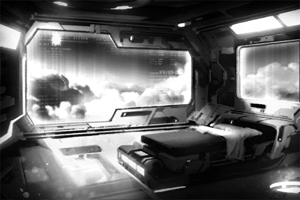

**Mark** 
Hello Dr. Neumann. My colleague told me that you're looking for me?

**ConneR** 
Ah yes, Mr. Mark. You see, I know you helped me with the system access level two weeks ago, but there are still some things I would like to confirm.

**Mark** 
May I ask what would you like to confirm?

**ConneR** 
The data I can access is up to security Level 4, am I right?

**Mark** 
I'll take a look, please wait.

**ConneR** 
......

**Mark** 
Yes, it's indeed Level 4.

**ConneR** 
But last night I took some time to look through them. Turns out that I don't have 100% access to the Library's central database and the virtual connection's firewall files.

**Mark** 
Hmm... It's because of Dr. Neumann's unique identity and position. Therefore, despite the higher\-ups granting you Level 4 access, each department has their own independent review system to determine whether or not to grant you access. That process may take a while.

**ConneR** 
Is that so.... It seems like the title of "advisor" is not as convenient as I thought it would be?

**Mark** 
... Yes.

**ConneR** 
On a side note, do you know who has access to the physical central database in A.R.C.?

**Mark** 
Ah... that... I'm sorry, that is beyond my security level. If Dr. Neumann has any more questions, you can contact the committee directly

**ConneR** 
Understood. Thank you.

_\[Call Ends\]_

[*(Click here to go back to the top)*](#toc)

## <a id="cos012"/>\[#012\] Diary\_ConneR\_702\_04\_06
### Requirements
|Character |Level|
|----------|:---:|
|**ConneR**| 10  |

### Unlocked Charts
|    Song     |Character|Diff.|Level|
|-------------|:-------:|:---:|:---:|
|**Abduction**| ConneR  |Hard |  8  |

### Log Content
Diary Log 7020406\_ConneR 
Location: A.R.C. HQ living quarters\_Room V017

　Been three months since that incident, the right side of my body still gets stints of extreme pain. Physically, my body is starting to learn to control the new eye and arm. Mentally, however, I can never accept it like this; at least not before I find out the truth about what attacked me.

　A.R.C. HQ is indeed where resources and talents go. I must admit that I did somewhat underestimate their abilities in the past. I just might be able to find the answers I want here. Even though the title of "advisor" sounds impressive, I have a feeling that they are still very cautious about me. As far as the people I've come in contact with here, most of them are just lackeys. That Sagar guy doesn't look to be the especially "smart" type, but since he is captain of the exploration team, there must be something special about him. The Supreme Committee members keep their whereabouts a complete secret. Need to find a chance to meet with them in the future.

ConneR 7020406

[*(Click here to go back to the top)*](#toc)

## <a id="cos013"/>\[#013\] Mail\_BH\_702\_07\_12
### Requirements
|Character |Level|
|----------|:---:|
|**ConneR**| 11  |

### Unlocked Charts
|         Song         |Character|Diff.|Level|
|----------------------|:-------:|:---:|:---:|
|**Nostalgia Sonatina**| ConneR  |Easy |  4  |

### Log Content
**Subj.**: Allow us to offer our sincerest apologies 
**From**: Body Hack Corp. VIP Service 
**To**: Colin Neumann Jr.
___

Dear Mr. Colin Neumann Jr.,

About the unpleasant experience you had with our company's product, we would like to offer our sincerest apologies. 
We will send an agent to your doorsteps to recycle the defective product and provide you with a brand\-new set of the latest model of prosthetic arms. On top of that, Body Hack will cover the costs of removal, installation and warranty fees. 

Last but not least, thank you again for using Body Hack products. If you have any questions for us, please contact us and tell us your opinions. Your feedback is the motivation for us to keep improving. 

Best wishes

Max Kristian 
Body Hack Corp. CEO

[*(Click here to go back to the top)*](#toc)

## <a id="cos014"/>\[#014\] Call\_702\_07\_12
### Requirements
|Character |Level|
|----------|:---:|
|**ConneR**| 12  |

### Log Content
**ConneR** 
Hello.

**Maggie** 
Hello, may I speak to Mr. ConneR?

**ConneR** 
I am ConneR.

**Maggie** 
Greetings Sensei. We are SkyEkho. I'm Maggie, a curator.

**ConneR** 
Greetings. What would you like from me?

**Maggie** 
Ah yes. Recently, we saw some clips of Sensei's performance on the internet. We also know that Sensei has published several great pieces under your real name Colin Neumann Jr. and you have garnered a minor following.

**ConneR** 
All stories of the past.

**Maggie** 
Yes. We would like to put the focus on Sensei's recent performances, which features instruments. We believe that these instruments have the potential to start a brand\-new trend in music.

**ConneR** 
Hoho? I was not impressed a while ago, now you have caught my interest.

**Maggie** 
We hope that Sensei can hold a personal concert and perform solo. SkyEkho has a professional team that can adjust the best virtual sound field, guaranteed to let Sensei's music...

**ConneR** 
Physical.

**Maggie** 
... Excuse me,  I didn't catch that. Can Sensei repeat what you just said?

**ConneR** 
I will only perform at a physical concert.

**Maggie** 
Oh... is that so. If that's what Sensei desires, we can do that. I'll have the team rearrange the performance style and promotion content. A purely physical performance is very rare nowadays. It will certainly be a marketing point.

**ConneR** 
I would like to hear about the venues you can offer.

**Maggie** 
Of course. Our company has a contract with Central Music Hall, the best music hall in Node 08. As long as we are prepared, our performances get first priority when it comes to the schedule.

**ConneR** 
Good. Then about the contract and future preparations, contact me when everything is settled.

**Maggie** 
Thank you Sensei! We'll arrange everything as soon as possible. Look forward to working with you!

_\[Call Ends\]_

[*(Click here to go back to the top)*](#toc)

## <a id="cos015"/>\[#015\] Log\_Arc\_702\_07\_14
### Requirements
|Character |Level|
|----------|:---:|
|**ConneR**| 13  |

### Unlocked Charts
|    Song     |Character|Diff.|Level|
|-------------|:-------:|:---:|:---:|
|**Abduction**| ConneR  |Chaos| 11  |

### Log Content
Research Log 7020714\_ConneR The benefit of working inside A.R.C. is that I get to see all their unannounced inventions, research and all kinds of recreated technologies. Even though they have gathered the best talents here, without the data of past technology obtained through exploring the Ruins, especially the central database "Library" and the establishment of the virtual internet, A.R.C. will be nowhere near their current wealth and power. However, nobody ever asks any questions. The variety of automatic management systems used in the countless Nodes we live in; the ultra\-high\-speed capsule tracks that connect the Nodes; the breeding center that controls the population; the city structure that seems to be aiming for the skies; how do they actually function, and who is managing all of them? The admins are merely pawns. A.R.C.'s "accomplishments" are only built on top of the artifacts that were left behind. The sight I saw in those Ruins when I was attacked, just what in the world was that...? If I want to find some answers, there is no better place than here. I need more time and more trustworthy comrades. In reality, humans are fragile flowers that are trapped inside a greenhouse. Yes, this city, this world; there are still way too many things we don't understand. Right now, we are merely herds of sheep, blindly following the script and acting according to it. 

ConneR 7020714

[*(Click here to go back to the top)*](#toc)

## <a id="cos016"/>\[#016\] Cam\_Arc\_702\_07\_20
### Requirements
|Character |Level|
|----------|:---:|
|**ConneR**| 13  |

### Log Content

**ConneR** 
Greetings. I believe this is our first meeting. I'm Colin Neumann Jr.

**Xenon** 
I'm Simon from the IT department. We received a report that there is a problem with your system.

**ConneR** 
Master Simon, pleased to meet you. The system kept overheating when attempting to process this piece of data. I would be quite troubled if this issue can't be solved.

**Xenon** 
Understood. Let me take a look; this may take a while.

**ConneR** 
Of course.

**Xenon** 
......

**ConneR** 
......

**ConneR** 
By the way, can you give me access to cyTus's virtual connection security reports? I heard that you were the person who established the majority of the security protocols?

**Xenon** 
...I can't give you access to anything without the higher\-ups agreeing to it first.

**ConneR** 
Is that so? What a pity. My job would be much easier if I have those documents.

**Xenon** 
... Your job should have nothing to do with those documents, right?

**ConneR** 
"Assist Library in the research and development of technology from ancient cultures". That's my job description. I believe there is no conflict between my job and me having those documents.

**Xenon** 
... I have improved the algorithms for you. The overheating should not occur anymore.

**ConneR** 
Ahh, it is running fine now. My sincerest gratitude.

**Xenon** 
Also, the amount of data you are processing is far too much. The estimated data flow for every project will be sent to our department. You're a non\-regular employee; best you not do anything that is not related to the company.

**ConneR** 
You are very sharp indeed, but don't worry. All my actions are part of A.R.C.'s requirements.

**Xenon** 
I hope so. If there aren't any more problems, I will leave now.

**ConneR** 
Of course. It's a great pleasure meeting you.

_\[Replay Ends\]_

[*(Click here to go back to the top)*](#toc)

## <a id="cos017"/>\[#017\] Cam\_Cafe\_702\_07\_21
### Requirements
|Character |Level|
|----------|:---:|
|**ConneR**| 14  |

### Unlocked Charts
|         Song         |Character|Diff.|Level|
|----------------------|:-------:|:---:|:---:|
|**Nostalgia Sonatina**| ConneR  |Hard |  8  |

### Log Content
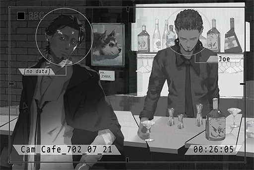

*\[Doorbell\]*

**JOE** 
Wel... come.

**Unknown** 
Long time no see, JOE.

**JOE** 
... Martini?

**Unknown** 
Don't be nervous. No martini today. Just want to get some info from you.

**JOE** 
Doesn't that mean you still want a Martini?

**Unknown** 
Just a quick chat. If you don't want to talk about it, I'll order.

**JOE** 
What quick chat? I have no intention to chat with you.

**Unknown** 
Simon Jackson, a regular here, right? Heard he's an old friend of yours. 
Talk to me about this person. Anything works. 

**JOE** 
......

**Unknown** 
Seems like you don't want to talk about it. Alright then. Martini, three olives.

**JOE** 
... What did he do? I advise you guys to stay away from him...

**Unknown** 
I said, Martini, three olives. Do I need to repeat myself?

*\[Make Cocktail\]*

**JOE** 
...What do you want to know?

**Unknown** 
Let's see... tell me about what he has been doing since he joined A.R.C.

**JOE** 
He discovered my shop two years after he joined A.R.C. We haven't contacted each other for many years. He rarely talks about his work when he's here. All I know is that he works for A.R.C.'s internet security department. Despite being a relatively new member of A.R.C., he established many safety protocols and firewalls for cyTus. Despite his contributions, he has yet to be promoted to managerial positions and get access to...

**Unknown** 
Are you playing dumb? the grumpy lady in the shoddy barber shop across the street knows this information. Tell me something "useful".

**JOE** 
... A while ago, he told me that they were working with the admins to investigate a case, However, he didn't tell me the details...

**Unknown** 
Now that's more like it. Anymore? Tell me more info that only you know.

**JOE** 
That's about it. He's a very careful person. He rarely talks about the details of his job when he is with me.

**Unknown** 
That's about it? I ordered booze, you better not BS me.

**JOE** 
It's precisely because you ordered booze that I told you anything. There really isn't anything left. Why do you guys suddenly start investigating him?

**Unknown** 
Guys? Nah you're wrong. The organization has no interest in that little pussy. It's a personal request I accepted. Money problems you know, regular jobs just aren't enough.

**JOE** 
... Boss is not going to let you off the hook if he found out that you ordered Martini for a "personal request".

**Unknown** 
I know! Therefore you better keep that mouth tightly shut! I won't be an A\-hole; I'll give you your share once I get paid.

**JOE** 
No need for that. Now get out once you're done drinking.

**Unknown** 
Watch your attitude. Have you forgotten what happened to the dog? Although that's against the rules as well. LOL.

**JOE** 
......

**Unknown** 
Whatever, before the job is done I'll be here every day. You better prepare more information on this guy. Bye.

*\[Doorbell\]*

_\[Replay Ends\]_

[*(Click here to go back to the top)*](#toc)

## <a id="cos018"/>\[#018\] Diary\_ConneR\_702\_07\_22
### Requirements
|Character |Level|
|----------|:---:|
|**ConneR**| 15  |

### Unlocked Charts
|   Song    |Character|Diff.|Level|
|-----------|:-------:|:---:|:---:|
|**I luv U**| ConneR  |Easy |  3  |

### Log Content
Diary Log 7020722\_ConneR 
Location: A.R.C. HQ living quarters\_Room V017

　Finally met someone that is more interesting than that Sagar guy, a boy called Simon Jackson.  He was quite successful in the world of underground bands under the name "Crystal PuNK", but one day he just disappeared for no reason. Many years later, he joined A.R.C.'s internet security department with a phenomenally high score and genius\-level talents. Many of the security protocols that prevent modern internet crimes were his handiwork. One can even say that A.R.C.'s recent success with preventing internet terrorist attacks and virtual crimes can all be credited to this young fella. If I can recruit his help, it might be a lot easier to solve the mystery behind that item. However, I must first confirm that he is someone trustworthy. I'll need to talk with him a few more times and obtain more information on him. 

ConneR 7020722

[*(Click here to go back to the top)*](#toc)

## <a id="cos019"/>\[#019\] Cam\_Arc\_702\_07\_24
### Requirements
|Character |Level|
|----------|:---:|
|**ConneR**| 16  |

### Log Content

**ConneR** 
Good afternoon sir. May I sit here?

**Xenon** 
... What do you want?

**ConneR** 
Don't be so hostile. This is a pretty nice place to have lunch, never realized that before.

**Xenon** 
I'm on my break now. If there's a problem, file a work request.

**ConneR** 
_\*Chuckles\*_ Don't worry I'm not asking you to work. Just want to chat with you a little. May I, Mr. Xenon?

**Xenon** 
...Don't call me that at work.

**ConneR** 
Apologies, but you aren't exactly keeping a low profile. I've had the pleasure of listening to your album.

**Xenon** 
Oh.

**ConneR** 
It's quite interesting. In terms of composing, there's plenty of digital mixing and post\-production edits. However, when it comes to the all\-important strings, you didn't abandon the traditional method of physical resonance. I admire that.

**Xenon** 
If the strings became digital as well, the guitar would have no life. It certainly wouldn't sound good.

**ConneR** 
Ohhh, not what I expect to hear from someone who works in such a lifeless environment. Lives among technology and machines every day, yet your music is still full of emotion. It seems that on this front, we have a consensus.

**Xenon** 
Don't speak like you know me so well...

**ConneR** 
_\*Chuckles\*_  Maybe I know you a lot better than you think. 
Technology is the torch that lights the road for humans and we are the ones holding it. Our every action directly affects the future of the human race.

**Xenon** 
That only applies to you right? I'm not that great.

**ConneR** 
Don't underestimate yourself. It's a complete tragedy for a talent like you to be at the bottom. I look forward to the day you make your leap to the top.

**Xenon** 
... Thanks for the compliment.

**ConneR** 
This is my album. If you don't mind, give it a try and tell me what you think about it.

**Xenon** 
If I'm in the right mood.

**ConneR** 
_\*Chuckles\*_ quite indifferent are you. Then I shall take my leave. Enjoy your break, Mr. Xenon.

**Xenon** 
I would appreciate that.

_\[Replay Ends\]_

[*(Click here to go back to the top)*](#toc)

## <a id="cos020"/>\[#020\] Mail\_Arc\_702\_07\_27
### Requirements
|Character |Level|
|----------|:---:|
|**ConneR**| 16  |

### Unlocked Charts
|         Song         |Character|Diff.|Level|
|----------------------|:-------:|:---:|:---:|
|**Nostalgia Sonatina**| ConneR  |Chaos| 13  |

### Log Content
**Subj.**: We invite you to be a guest at the conference 
**From**: A.R.C. PR department 
**To**: Colin Neumann Jr.
___

Dear guest,

Thank you for accepting the position as head of the project. The institute will be holding an open conference at the A.R.C. HQ's main lobby in three days. We will be announcing at the conference: the outline of the project, the main members and how the resources will be distributed. 

To ensure academic exchange and the objective of delivering a positive image, we have invited the media, industry people and executives of the administration bureau to participate in this conference. We would like you to attend as well.

Best regards. 
A.R.C. Supreme Committee

[*(Click here to go back to the top)*](#toc)

## <a id="cos021"/>\[#021\] Diary\_ConneR\_702\_07\_28
### Requirements
|Character |Level|
|----------|:---:|
|**ConneR**| 17  |

### Unlocked Charts
|   Song    |Character|Diff.|Level|
|-----------|:-------:|:---:|:---:|
|**I luv U**| ConneR  |Hard |  7  |

### Log Content
Diary Log 7020728\_ConneR 
Location: A.R.C. HQ living quarters\_Room V017

　A piece of news caught my eye recently. An idol singer collapsed during an event and many audience members also showed signs of discomfort at the same time. I manage to get my hands on plenty of patient information from A.R.C.'s internal medical channel. Most patients were diagnosed with internet withdrawal symptoms or a sudden rejection from the brain. There are plenty of medical institutes in Node 13. They mainly hold patients who suffered side\-effects from technology overuse. My time there has allowed me to have a much deeper understanding of similar symptoms. From the information of several patients who had more severe symptoms, this looks like a relapse of memory loss. It's a side\-effect that occurs when trying to save data forcefully to an already damaged memory area in the brain. However, why such symptoms appeared during a concert and what is the reason behind the trigger, that has caught my interest. 

ConneR\_7020728

[*(Click here to go back to the top)*](#toc)

## <a id="cos022"/>\[#022\] Mail\_Arc\_702\_07\_22
### Requirements
|Character |Level|
|----------|:---:|
|**ConneR**| 17  |

### Log Content
**Subj.**: Job Done 
**From**: Underworld 
**To**: Rald [This mail have been encrypted]
___

This is everything I can get from Joe. I'll send you the detailed info in another mail. 
Remember to split the money into three payments and send it to my account in Node 03.  
If there's anything else you want, tell me. Boss is on tight watch recently, so use Dead drop.

H.H

[*(Click here to go back to the top)*](#toc)

## <a id="cos023"/>\[#023\] Audio\_Arc\_702\_08\_26
### Requirements
|Character |Level|
|----------|:---:|
|**ConneR**| 18  |

### Unlocked Charts
|    Song    |Character|Diff.|Level|
|------------|:-------:|:---:|:---:|
|**Instinct**| ConneR  |Easy |  4  |

### Log Content
*\[Door Opens\]*

**ConneR** 
Oh, Mr. Xenon. Have you listened to my album?

**Xenon** 
This is Library's record of connection errors from last month. Every single one of them has signs that they've been intercepted to your IP. Just what the hell are you doing?

**ConneR** 
... Are you questioning me? Quite frankly, I work in Library. It's normal for me to analyze these connection errors, am I right?

**Xenon** 
I'm the one in charge of internet security. As a non\-regular employee, your personal interception of these records is trespassing into my territory.

**ConneR** 
Hmmm? Then what can you do? Arrest me?

**Xenon** 
I have the right to report any suspicious activities to the higher\-ups.

**ConneR** 
Then what is your reason for not doing so, instead opting to come talk to me? Wasn't "following the rules" your way of doing things?

**Xenon** 
......

**ConneR** 
As someone who invented countless protocols and almost singlehandedly established the current internet security, you couldn't figure out whether the connection errors are from internal or external sources. I'm a bit disappointed.

**Xenon** 
Are you saying that you have nothing to do with this?

**ConneR** 
No. In fact, it's the exact opposite. This is not just about me; it's about you, it's about everybody. The entire world is living in a giant deception.

**Xenon** 
What?

**ConneR** 
The current cyTus virtual internet is developed based on the ancient technology in Library combined with the original internet.

**Xenon** 
... And your point is?

**ConneR** 
Controlling technology that you have no idea how to actually control; won't that make you very nervous?

**Xenon** 
What the hell are you talking about?

**ConneR** 
From what I can tell, those security protocols weren't "invented"; they were "discovered", right? All you did was apply it to modern technology, yet A.R.C. is holding it like it was their invention. To me, that is no different than theft

**Xenon** 
... Internet security is not some kind of artwork. It exists so the people can use the internet under safe and fair conditions. I don't think there is a problem with that.

**ConneR** 
Indeed. "Conditions", "Rules", "Protocols". Having such arrogant limitations on a technology that you barely understand and acting as if you're some kind of god; that is the thing that makes me the most furious.

**Xenon** 
... I don't get what you are saying.

**ConneR** 
Pardon me, I've strayed a bit too far. All in all, I'm not the "mastermind" behind Library's connection errors. On a side note, I'm not the "Anonymous" who has been sending you mail either. 
Instead of wasting time on an old man like me, there are more important matters that you should be dealing with, Mr. Simon Jackson. 

_\[Replay Ends\]_

[*(Click here to go back to the top)*](#toc)

## <a id="cos024"/>\[#024\] Diary\_ConneR\_702\_08\_26
### Requirements
|Character |Level|
|----------|:---:|
|**ConneR**| 18  |

### Log Content
Diary Log 7020826\_ConneR 
Location: A.R.C. HQ living quarters\_Room V017

　Had a few drinks today. Feel like everything sucks. How many people in this bogus world can hold on to a principle like me. Pioneers are always the ones to suffer; it's a common theme across history. It feels just like the time when I left that home to find my own reason for existence many years ago. If I can leave something for this world, please allow me to cheer from the bottom of my hear and celebrate the arrival of humanity's freedom.

ConneR 7020826

[*(Click here to go back to the top)*](#toc)

## <a id="cos025"/>\[#025\] Audio\_Arc\_702\_08\_12
### Requirements
|Character |Level|
|----------|:---:|
|**ConneR**| 19  |

### Unlocked Charts
|    Song    |Character|Diff.|Level|
|------------|:-------:|:---:|:---:|
|**Instinct**| ConneR  |Hard |  8  |

### Log Content
*\[Alarm goes off\]*

**Mark** 
Dr. Neumann, we just received the record of a malicious program's attempt to tamper with the encryption key index of Library's central database. After doing some reverse tracking, one of the attacking IP addresses came from the sub terminal in your office. 

**ConneR** 
What? There must be some kind of misunderstanding. I am not operating the terminal. 

**Mark** 
It might also be a mistake by the alarm system...

**ConneR** 
So the situation right now is...?

**Mark** 
You might have to go through the safety protocols. We'll handle the checking remotely. 

**ConneR** 
What a bother. Right in the middle of my work too...

*\[Scanning Device\]*

**Mark** 
Did doctor recently use any software or devices that came from unidentified sources? Due to your unique identity, you might be using equipment that is not supplied by A.R.C.   

**ConneR** 
Hmm... not really "unidentified" per say, but some projects use devices that were imported directly from my old lab. They might not meet A.R.C. standards. Does that count?

**Mark** 
... For insurance purposes, can doctor label these devices? We will send someone to check on them in a minute just to make sure.

**ConneR** 
No problem.

**Mark** 
Full scan complete. Seems that Doctor's sub terminal was just another randomly selected decoy.

**ConneR** 
Glad to hear that. Hope you guys can find the person behind all this soon.

**Mark** 
Thank you for your cooperation. 

_\[Replay Ends\]_

[*(Click here to go back to the top)*](#toc)

## <a id="cos026"/>\[#026\] Mail\_Arc\_702\_08\_20
### Requirements
|Character |Level|
|----------|:---:|
|**ConneR**| 20  |

### Log Content
**Subj.**: Congratulations on a successful performance 
**From**: SkyEkho_Maggie 
**To**: ConneR
___

Dear Sensei,

Right now we can barely contain our excitement. Please allow me and the team to pay you the highest respect we can give. The concert worked much better than any of us ever imagined. It also completely changed our views on the impact and emotions a physical concert can give.  
Sensei's performance not only touched the audience; the owner of the Central Music Hall came to us and told us that if Sensei ever wants to perform again, Central Music Hall will give Sensei the no.1 priority to pick any venue you desire.  
We look forward to working with you again.

Sincerely,

The entire SkyEkho team

[*(Click here to go back to the top)*](#toc)

## <a id="cos027"/>\[#027\] Audio\_Arc\_702\_08\_07
### Requirements
|Character |Level|
|----------|:---:|
|**ConneR**| 20  |

### Unlocked Charts
|   Song    |Character|Diff.|Level|
|-----------|:-------:|:---:|:---:|
|**I luv U**| ConneR  |Chaos| 11  |

### Log Content
**Nancy** 
Hello, Doc. Getting coffee by yourself again today?

**ConneR** 
As usual. One glass of Cold\-Brew Irish Coffee.

*\[Coffee Machine operating\]*

**Nancy** 
Here's your Irish Coffee. We switched to a different brand of whiskey this week. See if you can taste any notable difference.

**ConneR** 
Hmm... the alcohol tastes a bit stronger than before, but I like this taste.

**Shinshima** 
Hey man! Rare seeing yours truly grab a drink now. Aren't you busy with running analysis on the latest test statistics?

**ConneR** 
Professor Shinshima, the fact that I am running stat analysis is precisely the reason I have some time to sneak in here for a break.

**Nancy** 
Rare? You serious? Doc has been visiting us at this exact time for a whole week now!

**ConneR** 
A while ago, there was a batch of data that need the central database's calculating capabilities to do the analysis. That was a lot more tiring; had to make several trips myself.

**Shinshima** 
You should be hiring a few more assistants.

**ConneR** 
Haha. On a side note, Professor Shinshima. I recall you mentioning before that you came from Node 15, right?

**Shinshima** 
Correct. It's one of the few Nodes that was built on giant islands. It has scenery that you can never see here in Node 08.

**ConneR** 
Have you ever been to Node 13 after you began studying recreated technologies? I stayed there for quite some time. The unique culture and traditions make it a bit difficult for me to fully blend in, but I still really enjoyed my stay there.

**Shinshima** 
Unfortunately, I moved directly to Node 08 with my family after I was hired by A.R.C. I didn't have too much time to stay at other Nodes for an extensive time. As you may know, applying for cross\-node traveling is not exactly easy.

**ConneR** 
I see... what a pity. How about Node 03? When I was searching for data, I discovered that incidents of "Architects" attacking humans were once quite common there. Due to some personal reasons, I'm quite interested in things like this.

**Shinshima** 
I've been there a few times for vacation, but I have no ideas about the incidents you mentioned. Maybe you can try asking the locals?

**ConneR** 
None of my project team members are from Node 03. How about Professor Shinshima's team?

**Shinshima** 
Hmm... no one in my lab really comes to mind. I'm sorry. If I get the chance, I'll help you find someone.

**Nancy** 
If you are looking for someone who grew up in Node 03 and has a deep understanding of its history, I know a person who meets that criteria!

**ConneR** 
Oh? A regular here?

**Nancy** 
Not really... It's a shy female researcher. She specializes in the analysis of recreated technology. Doc should be familiar with her partner; it's Sagar from the exploration team.

**ConneR** 
Sagar? Never heard him mention such a person.

**Nancy** 
She usually comes here herself only when it's late night or early morning. Other times, she would ask us to deliver the order to her lab.

**ConneR** 
Her lab number is...?

**Nancy** 
Room C3101, in the central database area. That room is quite hard to find, so you may need to ask those who work there. The name's "Rin".

**Shinshima** 
You can also bring your data with you there while you're at it. 

**ConneR** 
Thank you so much. I really appreciate your help.

_\[Replay Ends\]_

[*(Click here to go back to the top)*](#toc)

## <a id="cos028"/>\[#028\] Audio\_Arc\_702\_08\_08
### Requirements
|Character |Level|
|----------|:---:|
|**ConneR**| 21  |

### Log Content
**Staff A** 
C3101? Do we even have a room that begins with C3 in our area?

**Staff B** 
In the restricted zone maybe? Go down the hallway 'til you reach the end, then turn left. There's an elevator there. I've rarely been there though, so you might have to look for it yourself after you go up.

**ConneR** 
Understood. Thank you for the assistance. 

_\[»»» Fast Forward »»»\]_

*\[Electronic Door\]*

**Rin** 
Eek!?... who's there?

**ConneR** 
Ah, apologies. Did I scare you? I'm here to take a look at the data I sent in for analysis yesterday... Jesus!

*\[Beast Roars\]*

**Rin** 
S....sorry! I'll turn off the projection first!

**ConneR** 
I thought one of the forbidden area creatures just broke into the lab... are you working?

**Rin** 
Umm... N, not really. I was too enthralled by the environment hologram... sorry. 

**ConneR** 
Cough... apologies. I lost my composure back there.  
Greetings, Miss Rin. I am Colin Neumann Jr. from Library. Yesterday, I sent in some data of the Node 03 forbidden areas. I'm here to see how the analysis is going. 

**Rin** 
I, I'll try and find it. Please wait a minute!

**ConneR** 
Don't worry. Take your time.

**Rin** 
... Search... Library... Colin...Huh?... No results? Oh no, did I send the data to the wrong address again? Sagar has been sending in so many things recently... schedule... Ah crap\~ No, not this one...

**ConneR** 
... Got a problem?

**Rin** 
_\*Almost crying\*_  J, just another minute. I'm this close to finding it...

**ConneR** 
Um, the file that is on your left screen should be the one I'm looking for.

**Rin** 
Huh? Ah! You're right. I was looking in the wrong unit... sorry.

**ConneR** 
No big deal. I would prefer if you stop apologizing so much though. It's making me a bit embarrassed

**Rin** 
I'm sorry...

**ConneR** 
Haha... I must say, this is quite the room. All this plant life, looks like it's been abandoned for years... Don't see scenery like this in A.R.C. too often.

**Rin** 
Yes, I really enjoy growing these plants... I\-I'm sorry. I've been living here all alone. I haven't organized them properly, so it's quite chaotic...

**ConneR** 
A single person managing such a large research space? You look like you're in your early twenties...
 
It seems A.R.C. has a knack for child geniuses. First Mr. Sagar, then Mr. Xenon, now you... I take back my previous views on "talent"...

**Rin** 
Ummm... I...

**ConneR** 
Ah, my apologies. It's very rude to ask a lady about her age. What's wrong with me?

**Rin** 
I don't mind...

**ConneR** 
Let me take a look at the data... 
I see... a very detailed analysis indeed. So many little things that I didn't notice. Just as good as they say. You really do know a lot about Node 03's culture. 

**Rin** 
T, Thank you.

**ConneR** 
Have you stayed at Node 03 before?

**Rin** 
Yes. Node 03 is my hometown. 

**ConneR** 
I've never been there. What kind of place is it?

**Rin** 
I haven't gone back in a long time... but from what I remember, it's a very beautiful place. The people are kind and passionate. The culture and the architectures are very different from here. It's a colorful and very lively city. 

**ConneR** 
Hm? From what I've heard, their administration bureau crumbled after "The Decommission". The entire city has been under the control of law\-breakers for more than a hundred years. How long ago was the Node 03 you stayed in?

**Rin** 
Umm... there are still places that are very pretty... I, I don't remember it too clearly. All things from a long time ago...Ah! 

*\[Cup Spills\]*

**ConneR** 
Yikes!

**Rin** 
Oh no, oh no, oh no... I'm so sorry. Are you injured!?

**ConneR** 
No, I'm fine. The tea is not hot anymore. Good thing it's not my right arm that got spilled on. Haha...

**Rin** 
Uguu... I'm sorry. I've always been a very clumsy person...

**ConneR** 
It's alright. Only a little bit of tea actually got me. I shall no longer disturb you. The analysis is very detailed and well\-done. Thank you.  
In a few days, there should be a new set of statistics sent here. I'll see you then. Goodbye. 

**Rin** 
U, Understood. I'll try my best!

*\[Electronic Door\]*

_\[Replay Ends\]_

[*(Click here to go back to the top)*](#toc)

## <a id="cos029"/>\[#029\] Audio\_Arc\_702\_08\_11
### Requirements
|Character |Level|
|----------|:---:|
|**ConneR**| 22  |

### Unlocked Charts
|    Song    |Character|Diff.|Level|
|------------|:-------:|:---:|:---:|
|**Instinct**| ConneR  |Chaos| 12  |

### Log Content
_\[Recording from wiretapped watch begins\]_

_\[Call Starts\]_

**Sagar** 
Frequency 107.83, Captain Sagar. Please identify yourself.

**Rin** 
Hello, Sagar, it's me...

**Sagar** 
Rin?

**Rin** 
Yes. Are you alright?

**Sagar** 
I'm fine? It's quite rare that you decided to call me on the radio. We're about to enter the Ruins. The signal might get lost all of a sudden.

**Rin** 
Umm... I have something I want to ask you; it's about work...

**Sagar** 
Hm? Sure, go ahead. 

**Rin** 
Dr. Neumann from Library sent in the data of an "artifact" for me to analyze. I find it a bit odd. 

**Sagar** 
You met with him!? Did he do anything weird to you?

**Rin** 
Um, no. Actually, he's pretty nice to me. 

**Sagar** 
Good. Pay extra attention to that person. He's very sharp. I don't want him to know about that incident. 

**Rin** 
Yeah...

**Sagar** 
What's wrong with the artifact data he sent in?

**Rin** 
Yeah... according to analysis, this artifact should be classified as grade S, but there are no records of it in A.R.C.'s listings...

**Sagar** 
What kind of artifact is it?

**Rin** 
He didn't give me the actual item, but judging from the holo\-simulation and the data he gave me, it looks like some kind of chip. The circuit part is ancient technology; I can analyze that no problem. However, both ports on the top are models I've never seen before. I can't find the communication protocols in the database either...

**Sagar** 
I expect no less from Doc... I've been in this exploration thing with my dad for years; never discovered an artifact of this type... 
But I'm not surprised. He has such an experience trespassing into the forbidden areas and Ruins. Naturally, it makes sense that he secretly owns several grade S artifacts or has information on them. 

**Rin** 
... Is this legal?

**Sagar** 
Of course it's illegal! However, he's indeed a very special figure. As a matter of fact, his hiring at A.R.C. itself is something that is way outside the system... 
Regardless, complete the report first; but don't report it to the higher\-ups. Wait until I get back, then we'll deal with it together. OK?

**Rin** 
How about the report for doctor?

**Sagar** 
Umm, let me think... just give him a fake one with minimum analysis, for now at least. 

**Rin** 
Huh? C, Can we do that?

**Sagar** 
In theory, no; but like I just said, he is someone who operates outside the system. Can't go wrong by being more careful when dealing with him. 
Also, I'm pretty certain that he didn't go through the proper procedures when filing this analysis request. In that case, you don't have to follow the rules either.

**Rin** 
OK...

**Sagar** 
If anything comes up, contact me immediately. I won't let anything harm you. 

**Rin** 
Thank you... By the way, this artifact actually allowed me to remember some things...

**Sagar** 
Oh? About your past? That's great! What did you remember?

**Rin** 
Umm... N, not much actually, just some broken pieces of imagery. I can't really describe it... but I feel a sense of fear in them...

**Sagar** 
Hey, no worries. Don't think about it.  
I said before: I won't force you to remember your forgotten past. Instead, I want you to focus on living your current life, OK?

**Rin** 
... Yes. I'm sorry. There isn't much I can help with...

**Sagar** 
Don't be too hard on yourself. You've been plenty of help to me already.  
The job this time is near Node 15. There are tons of exotic plants and flowers in the lower levels of this area. Run some analysis yourself. If there are any particular ones that interest you, tell me. I'll bring them back for you. 

**Rin** 
Really? That's awesome! 
Let's see... There should be a fern plant that can change its color at the coordinates \-2247.5, 2166.3, \-330.1. Haven't come up with an actual name yet. Also, above that location, there is a small plain. A flower known as Iris exists there. Oh, there's more! The daisies you brought back last time, there should be some on the lower levels as well. The different environment may cause them to grow a bit differently...

**Sagar** 
My god, slow down there miss... No way in hell I can remember all this if you just dump them to me through the radio! Organize a list and send it to me. Once we get to a place where we can access the internet, I'll get it. Then I'll try and find everything you want. Understand?

**Rin** 
AH! S, sorry. I was too excited...

**Sagar** 
Haha... it's ok. 

**Sagar** 
... Oh, right. After I come back from this exploration...

**Rin** 
Hmm?

**Sagar** 
Umm... nothing! We are about to enter a place where the signals can't reach, so let's stop here! 
Remember to contact me if something happens with Doc's request; don't take any action before discussing it with me, ok? See ya!

**Rin** 
OK, I get it...

_\[Signal Lost\]_

**Rin** 
... I'll be waiting for you.

_\[Replay Ends\]_

[*(Click here to go back to the top)*](#toc)

## <a id="cos030"/>\[#030\] Audio\_Arc\_702\_08\_17
### Requirements
|Character |Level|
|----------|:---:|
|**ConneR**| 23  |

### Log Content
*\[Electronic Door\]*

**Rin** 
EEK!?

**ConneR** 
Ah, apologies. Did I scare you again? I rang the doorbell several times, but nobody answered...

**Rin** 
Ah, hello, Dr. Neumann. Sorry about that; I was in the internet... 
Oh, about the data you sent in a few days ago, the analysis was just completed. I'll go get it.

**ConneR** 
Oh? Is it done already? That's unexpectedly quick; I thought it still needs several days.

**Rin** 
Uh? Aren't you here for the analysis report?

**ConneR** 
No. I might have left my watch here during my last visit. Have you seen it somewhere?

**Rin** 
Ah. I remember you taking it off when I spilled the tea. Let me see if I can find it...

**ConneR** 
It should be on the shelf way back there.

**Rin** 
U, understood. I'll go take a look.

**ConneR** 
......

*\[Extracting Data\]*

**ConneR** 
......

**Rin** 
Doctor, this is the watch, right?

**ConneR** 
Yes, Thank you. 
Since the analysis report is ready, I guess I'll have the pleasure of reading it now.

**Rin** 
Sure, unfortunately, the analysis this time is not quite positive... 
About your "artifact" I didn't find any related information that is worthy of further research...

**ConneR** 
Let me take a look... Hm, what a pity. The clues in Node 03 are the only ones I haven't done research. I thought bringing it here to you might enlighten some possibilities.

**Rin** 
I'm very sorry...

**ConneR** 
No worries; there are still plenty of analyses I can use as references.  
To be honest with you, I'm more curious about your personal opinion on this artifact.

**Rin** 
Uh? Mine?... This looks like some kind of... chip? I'm certain it uses ancient technology, but I've never seen an artifact quite like it... May I ask where did you obtain this? 

**ConneR** 
This? Well, I can tell you, but only if you promise me that you'll keep a secret. Can you do that?

**Rin** 
Huh? Um... s, sure...

**ConneR** 
This is a Neumann family treasure that has been passed down for generations, starting from our ancestors before "The Decommission". For two hundred years, no one really knew its meaning and purpose, until my father joined A.R.C. and started researching it. 

**Rin** 
Eh? Pre\-Decommission... how come an artifact of such importance is not part of A.R.C.'s listings...?

**ConneR** 
For some reason, father didn't hand this item to A.R.C.; instead, he chose to study it himself. However, even after all these years, he made little to no progress. Now a sickly old man, he passed it down to me. 

**Rin** 
My sincere condolences...

**ConneR** 
I believe this chip is the key to understanding ancient technology, which is everything that was left behind by the "Old Humans" for modern humans. It's also the key to allow humans to escape from this made\-up peace we are in right now. We no longer have to live in this deadly greenhouse. 

**Rin** 
D, deadly...?

**ConneR** 
Father had a terrifying experience of being assaulted while exploring the Ruins. To make matters worse, I also had a similar experience myself. My right arm and eye are in their current state because of that attack...

**Rin** 
......

**ConneR** 
It's common to be assaulted during exploration, be it wild creatures or even other explorers. That is what they've been telling me too... 
But no... if you ask me, those "things" are not creatures nor humans. They're more like... "Architects". Although it's hard to believe that Architects still exists after The Decommission, and even harder to believe that they will actually perform those actions.

**Rin** 
... I, is it possible that you made a mistake? It could be illusions or memory displacements caused by inhaling minor doses of the virus in the forbidden areas...

**ConneR** 
Miss Rin, I've been exploring by myself without support from A.R.C. for over a decade now. I know the difference between the effects of the virus and what I saw with my own eyes.  
If I don't get to the bottom of that "thing" that assaulted us, I have a feeling that in the future, this will be a worldwide catastrophe for the human race.

**Rin** 
......

**ConneR** 
My, my. Look what I've done. Yapping so long about such heavy topics... 
Don't know why, but I feel especially relaxed in this messy, laid\-back environment and in front of you. I don't usually say this much to other people. Apologies. 

**Rin** 
I, I don't mind. Thank you for willing to share these with me...

**ConneR** 
You won't spill the beans, right? I trust you. 

**Rin** 
Yes... of course, I won't!

**ConneR** 
Lunch break is about to end too. I'll go back to work. Goodbye.

**Rin** 
OK. Bye\-bye.

*\[Electronic Door\]*

_\[Replay Ends\]_

[*(Click here to go back to the top)*](#toc)

## <a id="cos031"/>\[#031\] Diary\_ConneR\_702\_08\_28
### Requirements
|Character |Level|
|----------|:---:|
|**ConneR**| 24  |

### Log Content
Diary Log 7020828\_ConneR 
Location: A.R.C. HQ living quarters\_Room V017 Although it's because of a freak accident, I've been in A.R.C. HQ for over half a year now. Ironically, they are half the reason why I am still alive. But now, look at me; not only did I make a successful comeback on my first concert, garnering applause and praise, but I'm also using their resources to try to take down the order they are maintaining. No, more like trying to reveal the truth they are hiding. Should I congratulate myself for being such a great schemer, or should I say "Destiny brought me here"? From the real report I obtained from Rin, the chip father left me is a device that can fuse with the cranial nerves of humans. I've studied father's disease and the symptoms he is displaying right now; the two have no connections whatsoever. Can't rule out the possibility that father is in his current state due to using himself as a test subject. If this chip really contains the important message that has been passed down through the Neumann family history, I have to find a way to extract the data from it. 

ConneR 7020828

[*(Click here to go back to the top)*](#toc)

## <a id="cos032"/>\[#032\] Log\_702\_08\_08\_12
### Requirements
|  Character  |Level|
|-------------|:---:|
|**PAFF**     | 24  |
|**NEKO#ΦωΦ** | 24  |
|**ROBO_Head**| 24  |
|**ConneR**   | 24  |

### Unlocked Charts
|      Song       |Character|Diff.|Level|
|-----------------|:-------:|:---:|:---:|
|**Floor of Lava**| ConneR  |Easy |  6  |
|**Floor of Lava**| ConneR  |Hard | 10  |
|**Floor of Lava**| ConneR  |Chaos| 15  |

### Log Content
Analysis Report 7020808\_12 
Target Listing: Unknown Artifact 
Quantity: 1 
Note: Artifact provided by Dr. Colin Neumann Jr. 
Analysis: Environment Simulation Test. Operation Simulation Test. Age Determination. 

[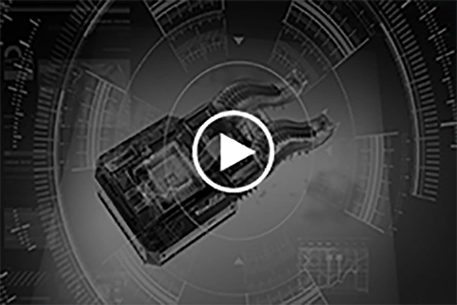](https://youtu.be/I53d17j6pX4) 
*[Click the image to watch the movie]*

Record: 
Entry\_1 
Target Artifact has appearance of some kind of circuit chip. Consists of two major components: the chip itself and the specialized port. The chip itself is produced with unparalleled precision. Even if we gather A.R.C.'s most elite teams, it's still nearly impossible to reach this level of precision. Estimated production date is 250 years ago, around 50 years before "The Decommission".

Entry\_2 
Performed a simple power transfer simulation to target chip. Was able to understand the majority of its inner workings through that. Besides its precision in production, has no notable difference to regular memory cells. The only exception is the specialized port part. Can't access the port directly. Preparing environment simulation test to search for possible ways to access said port. 

Entry\_3 
After 154,684 simulations, can conclude that target chip has functions that can only be activated when it is planted into the human brain via invasive methods. If unable to identify target to be human DNA, will trigger no reactions. Even when simulating human brain data with environment simulation, target chip saw through the simulation almost instantly and denied access. Risk is still under evaluation. Using actual human brain for direct experiments is strictly forbidden. 

Entry\_4 
During environment simulation test, had an extremely rare instance of bypassing the chip's defense mechanisms. During said bypass, instruments captured fragments of data. It's a message consisting of sound and imagery, like part of someone's memory. Besides that, mostly contains a data type that can't be analyzed by modern instruments. 

Judgement: 
Target chip's origin and usage highly suspectable. Suggest not reporting actual analysis results to Dr. Neumann. Discuss with Sagar to see if any special precautions are required. 

Report Saved Time: 702\_0810\_1745

[*(Click here to go back to the top)*](#toc)

## <a id="cos033"/>\[#033\] Cam\_Arc\_702\_09\_21
### Requirements
|Character |Level|
|----------|:---:|
|**ConneR**| 25  |

### Unlocked Charts
|   Song    |Character|Diff.|Level|
|-----------|:-------:|:---:|:---:|
|**Olympia**| ConneR  |Easy |  3  |
|**Olympia**| ConneR  |Hard |  6  |
|**Olympia**| ConneR  |Chaos| 12  |

### Log Content
*\[Door Opens\]*

**ConneR** 
It has been a while, Mr. Xenon. You've been on break for quite a long time. Tea?

*\[Drinks Tea\]*

**Xenon** 
I'm not here to chit\-chat. I have something to ask you.

**ConneR** 
About Æsir, I presume?

**Xenon** 
... How did you know?

*\[Drinks Tea\]*

**ConneR** 
_\*Chuckles\*_ Young man, you have to be more conscious of your words. You spill your secrets too easily.

**Xenon** 
......

**ConneR** 
I am personally quite interested in him as well. Therefore, I did some "investigation" on my own. That's how I knew you are investigating him as well. The recent incident with Miss Kittyears, it has something to do with this, isn't it? 
I figure that if you are actively seeking my advice, it's probably about this case. 

**Xenon** 
Investigation? You are using the company's equipment for private stuff again...

**ConneR** 
Young man, you can't blame me for that. Do you have any idea how easy it is to bypass the security system these days when you are not around? It's so easy that I almost fell asleep doing it.

**Xenon** 
... I'll let it slide. I want you to take a look at this photo.

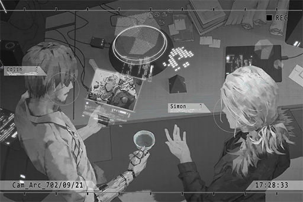

**ConneR** 
......!

**Xenon** 
What do you think this object looks like?

**ConneR** 
Judging from the parts... it's a model OPCI "Architect". However, its appearance is not exactly the same... so this is the extent of how similar to humans they can get...?  These wretched monsters... 
... Where did you get this photo?

**Xenon** 
I tracked a signal source Æsir accessed last year. In the end, I found that it originated from an abandoned factory. We came across this thing in the factory and it attacked us.

**ConneR** 
Us?

**Xenon** 
... A fellow friend who was with me at the time.

**ConneR** 
Ah\~ the Miss Cherry who's on the news a lot these days?

**Xenon** 
......

**ConneR** 
No need for the scary face. I have no interest in gossip about your relationships. Then? Did you guys destroy it?

**Xenon** 
With a pulse pistol. It is no longer operational, but the core should still be intact.

**ConneR** 
What a shame... do you realize how precious still\-operational Architects are? Most of the ones we found are already piles of useless junk.

**Xenon** 
... However, it seems that it was already on the verge of falling apart before we attacked it. Its actions are really weird too. My guess is that it's a puppet of Æsir, yet I have no idea how he got his hands on this stuff.

**ConneR** 
_\*Chuckles\*_ Young man, if there's a will, there's a way. A.R.C. is not the only one capable of retrieving resources from the Ruins. Many so\-called "Gravediggers" like myself are still very much alive and well out there. Of course, I will not tell you any names.

**Xenon** 
... Whatever. I presume that you've come in contact with them before? The Architects, I mean.

**ConneR** 
As I said before, the things we found are all junk that had been broken for ages. The amount of information we can retrieve from them is very limited because of that. My only experience with still\-operating ones was the incident at the Ruins outside of Node 13. Due to that god\-forsaken incident, I can't feel the violin bow anymore. Damnit...

**Xenon** 
From what I heard, you were indeed assaulted.

**ConneR** 
But, I guess all those lies I told in the past have to come back and bite me someday. Nobody believed me... Worst of all, I caused the whole place to collapse. Not even Sagar and his team can recover any evidence. 
I mean, it's an entire group of functioning ones! What a waste... 

**Xenon** 
... Anyhow, if I take you to that factory now, will you be able to recover something from its core? I'm going back there again with company personnel to retrieve an A.R.C. analyzer and some other equipment left on\-site. They're probably all stolen by that guy.

**ConneR** 
I am indeed very interested... if you believe me to be trustworthy. I mean, it's not like there's a lack of options; plenty of folks to chose from in the research department.

*\[Drinks tea\]*

**Xenon** 
I don't trust you. However, right now I have even less trust in those who are affiliated with the Administration Bureau.

**ConneR** 
A wise decision. You made a smart choice, for once.

**Xenon** 
Put this on.

**ConneR** 
Hoho? A tri\-handcuff used by the admins. This is the version altered by the A.R.C., I presume? Even though it became a twisted pile of ugliness, it's much harder to crack now.

**Xenon** 
Your bail is granted under my application. If you do anything remotely suspicious, you will be electrocuted.

**ConneR** 
Yes\~, Yes\~, I get that.

_\[Signal Lost\]_

[*(Click here to go back to the top)*](#toc)

## <a id="cos034"/>\[#034\] Audio\_Factory3\_702\_09\_21\_1
### Requirements
|Character |Level|
|----------|:---:|
|**ConneR**| 26  |

### Log Content
*\[Engines turned off\]*

**Xenon** 
We're here.

**ConneR** 
I'm impressed that you people even found this location. Even the admins have removed this location from their maps.

**Xenon** 
We were only able to reach here by following the coordinates... Hey, stop wandering around. Follow me closely.

**ConneR** 
Yes Sir\~

_\[Signal Switches\]_

*\[Walking Down The Stairs\]*

**A.R.C. Employee A** 
So you guys are here. We went ahead and started the recovery progress for some of the items. These are equipment that was previously stolen... but that's not all of it. Some of the items here don't even exist on the list of artifacts. We will directly send those to Library.

**Xenon** 
... Hey, where are the robot remains? Didn't I tell you guys to not touch the things on the floor for now?

**A.R.C. Employee B** 
Err... about that... When we got down here, we didn't see any remains on the floor. The equipment was all there was.

**Xenon** 
How's that possible? It's a robot that looks just like the one in this photo. How can something that big just disappear into thin air?

**A.R.C. Employee A** 
We really didn't see it.

**Xenon** 
... The admins immediately locked down the area around here. No one should be able to come into this room before you guys...

**ConneR** 
... Water is dripping from up there.

**Xenon** 
......?

**ConneR** 
However, the water marks are cut off right here. The shape of the cut\-off is exactly the same as what you showed me in the photo.

**Xenon** 
That's the position where it collapsed.

**ConneR** 
Which means it was here not too long ago... 
There are no dragging marks on the floor. Judging by how damaged it was in the photo, we should be able to exclude the possibility of it moving on its own first.  
Model OPCI Architects weight around 100 kilograms. If someone were to haul it away, that creaky staircase we just came down from would definitely not survive all that extra pressure.

**ConneR** 
This hole you are using to crane the equipment was just opened by you folks, right? Which means that the robot was moved using other methods... Of course, there's also the possibility that it was hidden away by you folks.

**A.R.C. Employee A** 
... And what benefit would we get from doing such a thing!?

**ConneR** 
Who knows? When it comes to information about the Architects, A.R.C. has always been trying their damnedest to hide them. It's as if there's some major secret that they are afraid to let the public learn about. If it's an order from your superiors, you folks have no choice but to obey them, don't you?

**A.R.C. Employee B** 
If you don't shut your damn mouth...!

**Xenon** 
Enough. They are just employees. It's pointless to have these arguments here.

**ConneR** 
Haha. I was just kidding. Come on guys, don't be so tense.

**Xenon** 
... What should we do now?

**ConneR** 
Use your A.I. It should be able to rewind any electronic trace that once existed here, right? Let's give it a try and see if we can find any useful information.

**Xenon** 
I can try... However, it functions by connecting to cyTus. The signal here is not very good, so I don't know how effective it is going to be.

**[Xenon A.I.]** 
_Rewind Starts_

_\[»»» Fast Forward»»»\]_

**[Xenon A.I.]** 
_Rewind Complete_

**Xenon** 
... No good. All it got was signal fragments, nothing noteworthy.

**ConneR** 
... Mr. Xenon, it seems that your guess was spot\-on. This particular Architect is very likely to be nothing more than a mere puppet.

**Xenon** 
Hmm?

**ConneR** 
Zoom in on the area around the head. You can see some command codes, right? These are very basic commands that even crane game machines in the arcades can process. What this represents is that this thing has long lost its ability to function on its own. It only acts based on the command input.

**Xenon** 
True... You really do notice the tiniest of details.

**ConneR** 
So now, the problem comes down to this: who's the puppeteer? I still feel like A.R.C. is the primary culprit since it's so easy for them to play the victim and act as if they have nothing to do with all this. Collecting users' memories and information for some shady behind\-the\-scenes dealings, then dump all the criminal charges on a virtual idol they fabricated themselves...

**A.R.C. Employee A** 
F\*\*\* are you still talking about that crap?

**Xenon** 
Hey, shut up. Did you forget that I still have the switch to your cuffs? I can electrocute you anytime, you know.

**ConneR** 
Ohhhh\~ Scary\~

**Xenon** 
... Let's talk about this outside.

_\[Signal Lost\]_

[*(Click here to go back to the top)*](#toc)

## <a id="cos035"/>\[#035\] Audio\_Factory3\_702\_09\_21\_2
### Requirements
|Character |Level|
|----------|:---:|
|**ConneR**| 27  |

### Log Content
**ConneR** 
Haha, did you see that? The reactions of those people, how amusing. The level of their stupidity is practically out of this world. My, my, that was quite the sight to behold.

**Xenon** 
... You are well\-known for constantly humiliating them in public. I never expected them to be like me and only focus on the issue at hand.

**ConneR** 
Ooh, still speaking up for them? Didn't expect you to be on their side.

**Xenon** 
The only side I'm on is my own.

**ConneR** 
_\*Chuckles\*_ I can guarantee you that it'll do you no harm if you just lean a bit towards my side. Of course, that's under the premise that you're smart enough... All in all, we had quite the pleasant experience collaborating this time, didn't we?

**Xenon** 
Don't be full of yourself. I was only borrowing your expertise to help us solve this case. I have absolutely no intention to acknowledge you.

**ConneR** 
Oh\~ Such a response makes me slightly... disappointed. I really thought we are the same type of people, Simon.

**Xenon** 
Don't try to change the topic. 
Speak. You believe that the people within A.R.C. are the ones who directed the entire Æsir event?

**ConneR** 
_\*Chuckles\*_ Didn't I just say? That random nonsense was made up just so I can get an amusing reaction out of those monkeys. 
There is not a single person within A.R.C. who has the ability to direct such a major incident. 
If we were to include those outside of A.R.C.... To my knowledge, there's just one person who might be able to pull this off, and even that is a bit of a stretch.

**Xenon** 
Who?

**ConneR** 
The legendary hacker "X". I believe that name still rings a bell to you? He doesn't really count as someone within A.R.C.

**Xenon** 
......!

**ConneR** 
_\*Chuckles\*_ I told you that I know you a lot better than you think. 
However, I also believe that you're someone who is only on "your own" side. If that's the case, I can't figure out what your motivation is right now...  
Besides, I am fairly certain that you're not someone who's so foolish to the point that you would ask me to help investigate a case where you yourself is the perpetrator. That doesn't make any sense either.

**Xenon** 
......

**ConneR** 
Of course, everything I just said was merely a speculation based on technological prowess and the presumption that the main suspect is a "human".

**Xenon** 
... What do you mean?

**ConneR** 
What do you think I mean?

**Xenon** 
I am not here to play games with you. If you know anything, you better start talking or I'm going to flip the switch.

**ConneR** 
_\*Chuckles\*_ Calm down, boy\~ Although I'm not 100% certain... A while ago, the Library experienced a data overload that lasted for quite some time. Don't you find that incident to be particularly suspicious?

**Xenon** 
......!

**ConneR** 
When "stealing" the memories of such a large number of users simultaneously, it's practically impossible not to leave a trace on the internet, since it involves transferring large amounts of data. However, the signs of such a major data transfer are nowhere to be found. The only place where we have yet to look is the A.R.C. Library, which acts as the "core" of cyTus...

**Xenon** 
Now that you mentioned it... I do also feel like A.R.C.'s security regarding Library is so tight that it's a bit absurd. Not even people from the IT department know what's inside...

**ConneR** 
Yet this situation is like the elephant in the room; nobody wants to address it. If the committee did indeed tell the truth, that what they excavated was a massive server room which consists of multiple super processing units, then the level of security they applied to this thing is totally unnecessary.

**Xenon** 
......

**ConneR** 
Simon, you're the expert in this. When you observe the operational logic of Library and cyTus, do you really think that it is just a "dead" database? You've had plenty of experience with the deep layers of the virtual internet; you should more or less notice this already, right?

**Xenon** 
... Indeed. As of now, the virtual internet we have gained access to is merely the tip of the iceberg. As with the rest... the logic there is so complicated that not even I can't understand. It's like it has a consciousness of its own...

**ConneR** 
If I can do a complete browsing of the information on Library's core, I can prove that my hypothesis is close to 100% accuracy.

**Xenon** 
... No good. It's simply impossible to access the Library's core via connection without leaving a trace. The committee will discover it in no time.

**ConneR** 
No, we don't need a connection. What if we bypass the company's security system and cameras, and go directly inside Library in person to take a look? Should be able to do that, right?

**Xenon** 
Can't do.

**ConneR** 
_\*Chuckles\*_ If we are talking about Simon Jackson, then of course you can't; but what about "X"?

**Xenon** 
......

**ConneR** 
To sum up, the "answer" we are pursuing may be right in there. As with the next step... it will be decided by your actions. 
Looks like I have no business here anymore. May I go back?

**Xenon** 
... I'll make sure everything is okay.

_\[Signal Lost\]_

[*(Click here to go back to the top)*](#toc)

## <a id="cos036"/>\[#036\] Mail\_Grace\_702\_10\_22
### Requirements
|Character |Level|
|----------|:---:|
|**ConneR**| 28  |

### Log Content
**Subj.**: Something is wrong with Sir 
**From**: Grace Garcia 
**To**: Colin Neumann Jr.
___

Master:

Sir did something very strange. I don't know how to describe it, but he is now collapsed on the floor of his room. I've called the doctor. Please come back as soon as possible.

Grace

[*(Click here to go back to the top)*](#toc)

## <a id="cos037"/>\[#037\] Cam\_Home\_702\_10\_23
### Requirements
|Character |Level|
|----------|:---:|
|**ConneR**| 29  |

### Log Content
*\[Door Opens\]*

**ConneR** 
Sagar, I didn't expect you to escort me home yourself. This isn't something a person of your level should do, isn't it?

**Sagar** 
Your father——Sir Colin is a figure I have great respect for as well. His contributions... as a member of the A.R.C. exploration team, I feel like I should be present here too...

**ConneR** 
Is that so? Then what a shame. It took A.R.C. so long to review my absence permission that neither of us was able to see him one last time...

**Sagar** 
I'm terribly sorry about that... I didn't act fast enough. You have my condolences.

**ConneR** 
No, you already exercise your authority to speed up the review process as much as possible, right? I can already imagine the loads of reports you are going to have to write for this. 
I owe you a favor again.

**Sagar** 
Ah, please don't say that... 
But to be honest... never thought that it would be this sudden...

**ConneR** 
This is nothing special. People are always convinced that they can see the threads of destiny, yet they can never imagine that they're just a mere pawn on the chessboard. 
Even if they reached the final row and become a queen, they are still locked inside the domain of a "chess move", with no escape in sight.

**ConneR** 
... Just playthings after all, we humans are.

**Sagar** 
Doctor...

**ConneR** 
Heard that the situation is still a bit chaotic inside. Would you mind letting me take a look at him first myself? 
You'll have to wait for me here for a while.

**Sagar** 
Of course.

_\[»»» Fast Forward»»»\]_

**Grace** 
Master...! _\*Cries\*_...

**ConneR** 
Don't cry, Grace... 
You mentioned in the letter, that father was doing some strange things in his room?

**Grace** 
Yes, master... I really... don't know how to describe it...

**ConneR** 
... Tell me about it to the best of your abilities.

**Grace** 
OK... I was in the kitchen at the time. I started running to Sir's room after I heard the alarm. On my way, I constantly heard the noise of things breaking and Sir screaming...

**ConneR** 
Screaming? Hasn't father been completely motionless for the past few years?

**Grace** 
Yes, that's why I was a little hopeful that maybe Sir recovered... However, when I opened the door, I discovered that Sir was screaming while breaking the furniture. He even broke the window, then grabbed the shards with his bare hand and started carving on the wall... Blood spewed everywhere...

**ConneR** 
!?

**Grace** 
Sir's expression... it's like he lost his mind. He was agitated with white foam coming out of his mouth... I was utterly shocked; I even forgot to stop Sir. I just stood there and watched as Sir carved up the entire wallpaper... I... _\*Cries\*_...

**ConneR** 
It's not your fault, Grace... What happens next?

**Grace** 
Afterward... Sir stopped, and he looked at me... 
... It's not an illusion... Sir called my name.

**ConneR** 
......!

**Grace** 
_\*Sobs\*_... I don't know how many years it has been since I last heard those words... "Grace, it's you"... 
Just as I regain my senses to answer... Sir... he just...

**ConneR** 
He just collapsed... didn't he.

**Grace** 
Yes...

**ConneR** 
If the doctors' diagnostics were correct and what father had was indeed neurodegenerative dementia, he shouldn't be able to regain consciousness or recognize you. Not to mention flipping over furniture and breaking items with his own self\-consciousness...

**Grace** 
I don't understand things that are too complicated... We're here, master. As you requested, I haven't moved anything in here. Please take a look...

*\[Door Opens\]*

**ConneR** 
This is...!

**ConneR** 
......

**Grace** 
Master...

**ConneR** 
... Grace, could you please leave me alone for a moment?

**Grace** 
Yes, master... I'll be waiting outside the door. If you need anything, call me.

**ConneR** 
Thank you.

*\[Door Opens\]*

**ConneR** 
......

**ConneR** 
Father... If you haven't gone completely insane... then you truly left me something incredible...

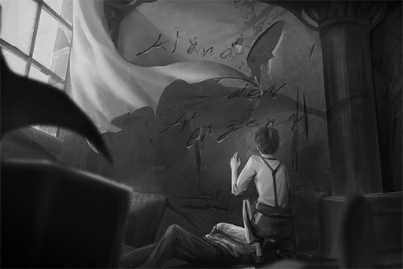

_\[Signal Lost\]_

[*(Click here to go back to the top)*](#toc)

## <a id="cos038"/>\[#038\] Audio\_Arc\_702\_11\_02
### Requirements
|Character |Level|
|----------|:---:|
|**ConneR**| 30  |

### Log Content
*\[Door Opens\]*

**Sagar** 
Apologies for the interruption. Doctor...?

**ConneR** 
......

**Sagar** 
......?

**[TV]** 
_... discovered a large number of commands used by said A.I. to commit internet crimes, which even includes the infamous cyberterrorism incident during a live stream a few months ago. All this evidence are proof of Simon Jackson's highly possible association with Æsir. _

**Sagar** 
This is... the Æsir incident? Heard about it a while ago. It seems like it's a pretty serious issue...

**ConneR** 
Ah, Mr. Sagar. Apologies, I didn't notice you. So you don't know the details regarding this incident?

**Sagar** 
Sorry, I just returned from the outside and I'm leaving for the outside again very soon. Therefore, I don't really have time to pay attention to the news in the city... However, I have heard about the major cyberterrorism attack during a live stream. Didn't expect him to be the culprit.

**ConneR** 
This Simon, you guys count as colleagues as well, right? You don't seem to know him very well?

**Sagar** 
We met a few times. I'm not exactly knowledgeable about internet stuff, so I've asked for his assistance in the past when organizing the documents for the artifacts. Never thought that he was Æsir himself...... Such a key figure in the company turns out to be a criminal. I guarantee that the higher\-ups are in a chaotic state now.

**ConneR** 
Him, you, Miss Rin too... A.R.C. is truly full of all kinds of "amazing" people... I'm impressed.

**Sagar** 
Doctor, I don't know whether I should laugh or not about that comment...

**ConneR** 
Setting aside the criminal suspicions, all of you are elites who are far superior to your average person. This is a compliment through and through. Accept it with ease.

*\[Drinks tea\]*

**ConneR** 
Speaking of which, do you need something from me today, Mr. Sagar?

**Sagar** 
Oh, nothing major... It's just that last week when applying for your absence permission, I bypassed quite a few procedures. Now, the higher\-ups want me to provide the full report. I need doctor to confirm the report in person.

**ConneR** 
So you came to me for such a mundane reason...? 
Looks like even though it's filled with talented people, this place is still filled with ancient and obscure rules, as well as management who's brains have rotten to the core from the lack of usage.

**Sagar** 
... Doctor, every word of our conversation is being recorded, you know.

**ConneR** 
That's precisely why I said it. Give me the report.

**Sagar** 
No problem. I've sent the file. Doctor, please check it. If you have any problem, just point it out for me and I'll fix it immediately.

*\[Signature\]*

**Sagar** 
Eh? Doctor... You didn't even look at it...

**ConneR** 
I said before, I already owed you a favor. If I cause you any more trouble, it will be against the etiquette of the Neumann family. I will feel very terrible about it. 
This report, I have confirmed it. No problem at all.

**Sagar** 
Great! Doctor, you really help me. Thank you!

**ConneR** 
Very well. Allow me to say one more thing, Mr. Sagar. These wordy regulations do not suit you. The place where you can showcase your talents is the forbidden area. That expansive world filled with secrets, that is the place you should call home to.

**Sagar** 
Haha... Not like I want to do all this, but I can't help it. It's part of my responsibility as a captain... 
I shall not bother you any longer. I'll go finish the procedure first.

*\[Door Opens\]*

**ConneR** 
... Resume call.

**[System]** 
_Encrypted call reconnected. Resume in three seconds...... 2...... 1...... Call resumed._

**ConneR** 
Sorry about the long wait. 
Like I just mentioned, I want information on the Æsir incident... as well as info about the arrest of that unlucky boy. The more detailed, the better.

**[???]** 
_Simon Jackson... is it?_

**ConneR** 
Rest assured. I am not related in any manner to said incident. I've been your customer for more than a dozen years. I believe I'm quite trustworthy, right?

**[???]** 
_...... Understood. What are your chips?_

**ConneR** 
Haha, the things I can provide, you should know them very well.

**[???]** 
_Just a usual question to make sure, Mr. R. 
I will find a seller for you. You will receive what you requested very soon. I'll make sure of that._

**ConneR** 
I'll let you handle this, successor. As with this Martini, put it on the tab for now.

_\[Signal Lost\]_

[*(Click here to go back to the top)*](#toc)

## <a id="cos039"/>\[#039\] Diary\_ConneR\_702\_11\_04
### Requirements
|Character |Level|
|----------|:---:|
|**ConneR**| 31  |

### Log Content
Diary Log 7021104\_ConneR 
Location: A.R.C. HQ living quarters\_Room V017 Father's dying message, "Klänge des Herzens", is a phrase written in a language that has appeared multiple times on ancient Node 13 documents. It means "Sound of the Heart". However, even after deciphering the message, I am still completely lost. The flow of the words feels like some type of hidden code. My instincts tell me, that in order to find out the direction this clue is taking me, a return to Node 13 is very much inevitable. I am beginning to understand the reason why father chose to keep this a secret until he lost his mind: we're talking about the mystery of the whole world! My father and I have the same kind of blood flowing through us. When it comes to pursuing the truth, we are father and son; at the same time, we are also each other's closest enemy. Now, with father having passed away, the message on the wall and the research he left behind are the most valuable items I can ever inherit. They are the most precious "voices" that can lead me to my ultimate destination. A while ago, the admins caused a major commotion when they broke into A.R.C. for the arrest. That gave me the opportunity to sneak into the Library. I was able to obtain the secrets hidden within, and let's just say that calling the things I discovered "significant" would be a severe understatement. However, with my current skills, I couldn't delve any further. In order to solve that lock at the deepest part of the puzzle, I would need to obtain more information. I would also need the assistance of some other people, including that unlucky guy who got arrested. Next, I also need to do some preparations: excavation machinery, traveling permits to Node 13 and 03, a fake identity and a Mediator. The plan is about to progress into the next stage. I no longer need this specious cage in the sky. Although there are still interesting toys here like Mr. Sagar and Miss Rin, the phantom of the truth is wavering in front of me, like the Dance of the Seven Veils. I shall follow it into the depth of the abyss as well. The first bar of Salome has been sounded. It's time to move.

ConneR 7021104

[*(Click here to go back to the top)*](#toc)

## <a id="cos040"/>\[#040\] Cam\_CArea\_702\_11\_08
### Requirements
|Character |Level|
|----------|:---:|
|**ConneR**| 32  |

### Log Content
*\[Alarm\]*

**Xenon** 
......

**Agent** 
Trespassers in area C, the underground passages. Send additional agents and drones immediately!

**Xenon** 
......?

_\[»»» Fast Forward»»»\]_

*\[Door Knock\]*

**Xenon** 
......?

*\[Door Knock\]*

**Xenon** 
......

*\[Door Opens\]*

**ConneR** 
Good evening.

**Xenon** 
!? 
How did you...?

**ConneR** 
I knocked, but nobody answered the door. Therefore, I decided to come in myself. Pardon me for my intrusion.

**Xenon** 
... What the hell are you doing?

*\[Data projection\]*

**ConneR** 
I don't have time to explain all the minute details to you. All in all, take a quick look through these files first.

**Xenon** 
......?

**Xenon** 
......!! 
UGH......!

**ConneR** 
......

**Xenon** 
My investigation with her... These images...

**ConneR** 
Ho, so it actually worked? Excellent, I'm getting more and more interested... in this Æsir fellow.

**Xenon** 
......

**ConneR** 
How are you feeling? Do you remember it now? The reason why you are here.

**Xenon** 
... Why are you helping me?

**ConneR** 
Help you? Young man, you're mistaken. You're the one that's going to help me.

**Xenon** 
What do you mean?

**ConneR** 
My next step is to leave Node 08.

**Xenon** 
You're escaping? You're a criminal right now, you know.

**ConneR** 
Haha, being told you are a criminal by a guy wearing a prison uniform, how amusing. 
I've already obtained all the information I wanted to get with A.R.C. There is no reason for me to remain here anymore.

**Xenon** 
......!

**ConneR** 
In the end, I had to rely on myself. Judging by how terrible you look right now, you don't seem to be much help either. That makes things a bit... tricky.

**Xenon** 
What exactly are you trying to do?

**ConneR** 
Your memory has already recovered. Here's your mobile device. I'll put it here. Starting now, I will present you with two "choices".  
Choice number one, go to Node 03, meet up with me there. I will tell you many more interesting things, including things about Æsir, A.R.C., and this world itself.

**Xenon** 
!?

**ConneR** 
Choice number two, stay here and wait for the admins to prove your innocence through the proper procedures, or be a sitting duck and await your own demise.

**Xenon** 
......

**ConneR** 
I shall remind you first. 
Once you set foot outside this door, you are, in all sense of the word, "dead". No one in society will ever acknowledge your existence. Your family, friends, life, and dreams will all be reduced to ashes. Nothing will be left.

**Xenon** 
......

**ConneR** 
I still have more important businesses to tend to, So I don't have time to waste on you here. 
Although having your assistance will make things much easier for me, the final decision is all yours to make.

*\[Alarm\]*

**ConneR** 
Ah, right. Seems like we got a signal. Please give me a minute.

**ConneR** 
This is R. Woah, looks like it's quite the spectacle on your side of things.

**[Cherry]** 
_You bastard! How dare you trick me! Where the f\*\*\* am I at right now!?_

**ConneR** 
No need to worry. I've already opened Simon's cell door. However, it seems like he doesn't really want to come out.

**Xenon** 
Sherry!? What are you doing here?

**[Cherry]** 
_……！_

**ConneR** 
As you just saw, your dear friends are literally risking their lives for you. All in all, I will leave the door open for you, the door to end this entire fiasco. The rest is up to you. 
Feels like your dear friends are in a pretty serious pinch. Allow me to take my leave first.

*\[Footsteps\]*

**Xenon** 
......

_\[Signal Lost\]_

[*(Click here to go back to the top)*](#toc)

## <a id="cos041"/>\[#041\] Audio\_Port33\_702\_11\_10
### Requirements
|Character |Level|
|----------|:---:|
|**ConneR**| 33  |

### Log Content
**Cherry** 
The transporter is over there. Thank god we made it in time. Let's go, Mad Dog. The cargo is in the last car.

**Xenon** 
......

*\[Door Opens\]*

*\[Moves Cargo\]*

**Hunter** 
Hnnngh\~ Dang, this s\*\*\* is heavy...

**Cherry** 
Don't be such a p\*\*\*\*.

**Hunter** 
Okay, cargo in perfect shape. Now get moving.

**ConneR** 
Oh, I see. Using this route to smuggle... how did I not think of this? 
Very clever idea, Miss Pauline.

**Xenon** 
Hey, is that... a human inside there?

**Hunter** 
So what? It's none of your business.

**Xenon** 
......

**Hunter** 
What are you trying to do? I advise you don't try anything stupid!

**Cherry** 
... Simon, we've gone this far already. This is the only way to get you out of here.

**Xenon** 
... Nothing. Now go.

**Hunter** 
...... Hmph.

*\[Drags Cargo\]*

**Cherry** 
Alright, let's board the transporter. This ride will take us back to a transportation hub. We will board another ride there that'll take us into Node 03.

**Xenon** 
What about you?

**ConneR** 
I'll figure out a way to sneak into Node 13 from there. I'm currently a criminal after all.

_\[Signal Lost\]_

[*(Click here to go back to the top)*](#toc)

## <a id="cos042"/>\[#042\] Cam\_Port33\_702\_11\_10
### Requirements
|Character |Level|
|----------|:---:|
|**ConneR**| 33  |

### Log Content
*\[Door Opens\]*

**ConneR** 
......

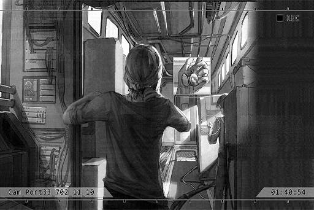

**ConneR** 
......

**Xenon** 
Cough cough...

*\[Closes pocketwatch\]*

**ConneR** 
... Ah, Mr. Jackson. Apologies. It's too noisy here, hence why I didn't notice you.

**Xenon** 
She said that we're still a few hours away from arriving.

**ConneR** 
I know.

*\[Violin sound\]*

**Xenon** 
... What are you doing?

**ConneR** 
I found this crappy violin in the old storage compartment over there. Although the sound is as thick and gooey as mucus, it's still nice to have something to kill time.

**Xenon** 
......

*\[Violin sound\]*

**ConneR** 
The sound is off... but have you heard this melody before?

**Xenon** 
Some musician's work that was excavated in Node 13, right? I processed that document when I was still working.

**ConneR** 
Correct. I expect no less from you. The place I'm going next, Node 13, is the mecca of ancient music that has its own unique charm. I truly miss the time I spent there.

**Xenon** 
It's about time you explain your plan, isn't it? I'm not here to listen to your history lessons.

**ConneR** 
Take it easy. The history lessons are part of my explanation for you too. After all, I don't want you to get confused by what I'm going to say. 
We're in no hurry too, so have a seat.

**Xenon** 
... You have a point. Go ahead.

**ConneR** 
The Neumann household's ancestors were a notable family in Node 13, but that was several hundred years ago. Why the family had such a high status back then is already unidentifiable. The only things that remained were the family teachings and traditions, now reduced to a mere formality.

**ConneR** 
That was until my father took over the family. He became deeply engrossed in the items that have been passed down through the family and began researching them. This was also the reason why he joined the A.R.C. exploration team. I believe you know a few things about his story too, don't you? 

**Xenon** 
Used to be an elite member of the exploration team, until a mission accident that resulted in the death of his entire team. After returning from that mission, he was declared mentally ill and... Ah, sorry. He passed away not too long ago, right? My sincere condolences.

**ConneR** 
It's alright. Mentally ill, eh...? Perhaps that is the case. After that incident, my relationship with him has never been a good one, all the way until the day of his death. At one point, I even detested him. _\*Chuckles\*_

**Xenon** 
......

**ConneR** 
Nevertheless, from those messy researches and relics of his, I was able to figure out some clues. At the very least, I am certain that he is definitely not mentally ill. 
In order for you to better understand this, let me tell you about his story. That "truth" that has been ingrained in his vision and passed down to me...

_\[»»» Fast Forward 15 minutes»»»\]_

**Xenon** 
......!

**ConneR** 
This is the reason why people refer to him as a "mad man". What do you think? Does it make some kind of sense to you after hearing all that?

**Xenon** 
... Nothing illogical according to my understanding, that much I can say. If everything you said is true, then it's all connected... The Decommission, the secret A.R.C. is hiding in Library, the virtual internet, Æsir... this entire world...

**ConneR** 
Starting to get a bit interested, aren't you? Next, I'll be going to Node 13 to continue to investigate and verify my theory. As with you, you'll be responsible for finding "that person" in Node 03. With that, we'll obtain all the cards we need.

**Xenon** 
Under the premise that everything you just said is true.

**ConneR** 
What a paranoid... Indeed, lying is one of my specialties. However, before you can confirm the truthfulness of my words, you guys can only do as I say for now too. If you notice that something is off, you guys can quit whenever you want anyway. So, what do you think? Not too bad a deal for you, right?

**Xenon** 
... "Guys"?

**ConneR** 
_\*Chuckles\*_ Your conversation with Miss Pauline just now, I heard it all. 
"Partners" eh....? How interesting.

**Xenon** 
......

**ConneR** 
Quick advice for you. It appears that you understand your heartbeat far less than those tech products. For your sake, it's better that you be honest with your own emotions. Be too easily influenced by it, and you'll often find yourself on the short end of the stick.

**Xenon** 
My emotion is none of your business... You should be concerned about yourself.

**ConneR** 
I don't have such mundane concerns.

**Xenon** 
Ho? Is that so? Then who is the person in that photo just now? You were completely engrossed looking at it.

**ConneR** 
... Unfortunately, the only information I will provide you are those that benefit this operation.

**Xenon** 
Idiot, I'm not interested in your past at all. If you don't want to be asked, stop pretending that you know other people very well.

**ConneR** 
Apologies, I tend to do that unintentionally when I'm interacting with you. After all, we may have come into contact with each other far before we first "met"... Forget it, all things in the past. Not important right now.

**Xenon** 
......?

_\[Signal Lost\]_

[*(Click here to go back to the top)*](#toc)

## <a id="cos043"/>\[#043\] Audio\_Cafe\_690\_03\_16
### Requirements
|Character |Level|
|----------|:---:|
|**ConneR**| 34  |

### Log Content
**Saxon** 
... This seems like a pretty significant deal. Never thought it would be from such a young lad like you. 

**ConneR** 
I may look like this, but if it's about information and data, I know my stuff.

**Saxon** 
You seem quite confident... I'm already too old to understand the stuff you youngsters are up to these days... Despite that, I'd advise you to be careful. In this world, those who want to be the lion often end up on the wrong end of a bite.

**ConneR** 
Is that so... thank you for the advice. I will keep it in mind.

*\[Hits Doors\]*

**???** 
Ugh! Haa... Whew...

**ConneR** 
Woah!? Hey! You... are you alright!? You're bleeding really badly...

**???** 
Got busted! Pops... gimme a hand, will you...

**Saxon** 
... You got shot! Did the transaction fail?

**???** 
Hehe... what transaction fail? Did you not see these two cases... 
Ugh!

*\[Alarm\]*

**Saxon** 
Save that for later. The law enforcement agents are patrolling. Go hide in the basement, quick! 
Young lad! Accompany her downstairs and help treat her wounds. I'll take care of the things here.

**ConneR** 
Ah! ... Got it!

_\[Signal Lost\]_

[*(Click here to go back to the top)*](#toc)

## <a id="cos044"/>\[#044\] Cam\_Base\_690\_03\_16
### Requirements
|Character |Level|
|----------|:---:|
|**ConneR**| 34  |

### Log Content
**???** 
... I can do it myself. It's just a tiny wound...

**ConneR** 
You can't properly bandage yourself from this angle. Let me do it.

**???** 
Don't you dare use this chance to feel me up.

**ConneR** 
I won't do that! Well then... please excuse me.

**???** 
Ah! Ow.... ow...

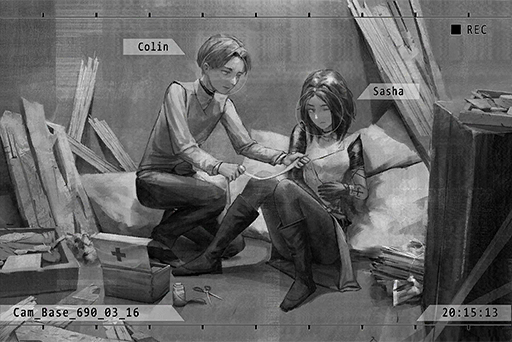

**ConneR** 
... Did... a law enforcement agent do this?

**???** 
Yep... I thought things were going smoothly. Was a really well\-concealed transaction too... Where exactly did the info leak? Damnit...

**ConneR** 
......

**???** 
... First time seeing a gunshot wound?

**ConneR** 
Umm... if it's from this distance... Yeah, it's a first.

**???** 
_\*Chuckles\*_. If you want to survive in this business, you better be careful yourself too. Maybe one day this hole will be on you instead.

**ConneR** 
Eh...? No, I'm just a normal civilian...

**???** 
Hmph, don't play dumb. I saw the martini on the table. You're also one of "us", aren't you? You suck at lying, and that's a terrible weakness to have in this world.

**ConneR** 
...... 
Your wounds are dressed. Please don't move around too much for now.

**???** 
Ho? You're quite clever with your hands. Thanks. 
The thing you hid just now, it's something from A.R.C., isn't it? Can you let me take a look?

**ConneR** 
......

**???** 
No need to be so cautious. Judging by how refined you look, you don't seem like a gunman or hitman... You're probably more of an information broker or a deceiver. I'm good at sizing people up. If that's really what you are, consider me your senior.

**ConneR** 
Deceive...

**???** 
Buyer? Seller? You look like a fawn who wandered into a pack of wolves without realizing it. I may be able to give you some advice. Show it to me. It's not like we can leave this place any time soon either.

**ConneR** 
I'm a seller... I don't mind showing it to you since I can't decrypt this data either. The buyer offered a good price, and I just so happen to have a way to obtain it.

*\[Load data\]*

**???** 
This serial number... how did you get your hands on this stuff!?

**ConneR** 
Ummm... trade secrets.

**???** 
Interesting... How much is the buyer paying?

**ConneR** 
... (Whispers)

**???** 
Hahahaha! And you call that a "good price"? Are you kidding me!? 
Lemme tell you... you got conned.

**ConneR** 
EH?

**???** 
This is a level 4 encryption of A.R.C. The undecrypted data alone can easily get you at least ten... no, twenty times the price if you sell it on the market.

**ConneR** 
For real!?

**???** 
You really are completely oblivious... How the hell did you get yourself into this business...  
Nevertheless, judging by the fact that you're able to obtain this piece of data, guess it's safe to conclude that you're somewhat capable.

**ConneR** 
This is just a small part of the whole thing too... I can't steal all the data at once. However, if it's one small package at a time...

**???** 
Stop right\~ there!  
Lesson 1: Never blurt out information without the other person asking first. Seriously, just how gullible are you?

**ConneR** 
......! 
Umm... I could be telling a lie...

**???** 
Lesson 2: Bluffing is utterly useless if you are not certain the amount of information the other person has. 
What you said is true. Area 09, right? I heard rumors about this stuff on the market. From the serial number and transfer protocol, I can easily tell that this baby here is the real deal.

**ConneR** 
......!

**???** 
According to the rumors, A.R.C. hid a ton of files in that server block. All stuff they don't want the public to see.  
Nobody knows what the actual content in those files is. Both the connection and physical security of that block are extremely tight. As of now, not a single soul has successfully infiltrated it. 

**???** 
Yet a pretty boy like you somehow managed to obtain a part of that data... Don't you find that intriguing?

**ConneR** 
......

**???** 
Excellent... I can smell the money. 
I'm "Sasha", a professional deceiver. 
What do you say? Wanna work together with me?

**ConneR** 
You certainly look very experienced... But with how messy you look right now, I presume you just failed a transaction? I find it hard to believe that...

**Sasha** 
Haha, what do you think is in these two cases? One of them contains the goods. The other one contains the money. Do you understand? In a busted transaction, I was able to get my hands on both and leave the other person with nothing. Although I did get shot a few times...

**ConneR** 
......

**Sasha** 
Abandon your original buyer. I can guarantee you that they offered you such a s\*\*\*\*\* price because they saw you as an idiot who knows nothing. Trust me. Setting aside how you get your hands on that data, I can get you more value for your abilities on the market hands down. 
You got into this business 'cause you need the money too, right?

**ConneR** 
... Alright. I will trust you, temporarily that is.

**Sasha** 
"Temporarily" eh... how cold. Ah, one more thing. I don't know your name yet.

**ConneR** 
... "Colin".

**Sasha** 
Colin... What a weird codename. I already have a basic concept of this plan in my mind. 
Come to this address at 3 P.M. tomorrow.

**ConneR** 
This place is...?

**Sasha** 
One of my "offices". We'll discuss the details there. 
I look forward to our partnership. Let's start from zero... Partners?

*\[High Five\]*

**ConneR** 
... Partners.

_\[Signal Lost\]_

[*(Click here to go back to the top)*](#toc)

## <a id="cos045"/>\[#045\] Audio\_Sasha\_690\_03\_17
### Requirements
|Character |Level|
|----------|:---:|
|**ConneR**| 35  |

### Log Content
**Sasha** 
As expected, the news is all over the market now. Area 09 is no longer just an urban legend on the dark web.

**ConneR** 
Looks like there are more and more people scrambling to get in on the action...

**Sasha** 
Not just that. Check this out, the decryption maniacs among hackers are also looking to buy this data. They all want a shot at cracking this encryption.

**ConneR** 
What a frenzy...

**Sasha** 
If we want to know the content inside these storage units, we'd have to rely on these experts... but we can't let whoever we ask obtain the decrypted data either...

**ConneR** 
If the data is spread on the market, it loses its value... correct?

**Sasha** 
Exactly... Of these hackers, there's this one guy that kind of caught my interest. It's a guy that goes by the name "X"...

**ConneR** 
X?

**Sasha** 
It's a guy that has made a bit of name for himself on the dark web these days. He's nicknamed "Hacker of Private Law". He uses his hacking skills to resolve all sorts of injustices, yet he never seeks to earn any profit from his actions. Many people in my organization got screwed over by him before too.

**ConneR** 
... So people like that still exist? Interesting.

**Sasha** 
Yeah. However, from my perspective, he is nothing more than a naive kid who is presumingly roleplaying as a hero of justice. If justice truly does exist somewhere in this world, it would definitely not be in a s\*\*\*hole like this.

**ConneR** 
......

**Sasha** 
Despite all that, there is no doubt about his skills as a hacker. As of now, no one is able to track him down or find out his real identity. He also has yet to fail an operation. Since it appears that he has little to no personal desires, maybe we can put him to our use. 

**ConneR** 
In other words, since he won't try to make a profit with the decrypted data, we get to maintain the market value of the data while getting its content decrypted. 

**Sasha** 
Yes... The only problem is that this guy only helps those who are "the good guys".

**ConneR** 
No matter how you look at it, I don't think we can be considered "the good guys"...

**Sasha** 
I said before; when dealing with arrogant brats like this who measured the righteousness of things with that utterly crooked ruler in their hearts, we just need to make him "think" that we are on his side. 

**ConneR** 
......!

**Sasha** 
The fact that A.R.C. has a server block like this and its existence is unbeknownst to the admins; that alone is already illegal. Something's definitely fishy.  
If we approach him from that angle, I believe he'll at least be somewhat interested in our case.

**ConneR** 
I see.

**Sasha** 
In short, I'll handle this. However, this still isn't quite enough. It's about time you tell me the method you used to obtain this data too, isn't it?

**ConneR** 
......

**Sasha** 
If your method can be duplicated, we cannot guarantee that our plan will succeed. At the very least, we have to ensure that other people won't be able to get their hands on our prize.

**ConneR** 
That is extremely unlikely. The name I told you yesterday... Colin, that's actually not a codename. My name is Colin Neumann Jr. I am the son of Colin Neumann.

**Sasha** 
......! A.R.C.'s...... 
Sigh... I knew it. You look nothing like someone who actually grew up in these s\*\*\*holes. 

**ConneR** 
Even though father has been suspended by the company and is currently resting at home, his contributions to A.R.C. allowed him to keep his role as an honorable employee. As long as his information and privileges are still there in the database, I can use some small tricks and download the data of Area 09 without leaving any trace at all. That's pretty much the gist of it. 

**Sasha** 
But there's a data flow limit for each download. If you overdo it, you'll get busted, right?

**ConneR** 
Indeed, you're right on point. The time intervals between each download can't be too short either. On average, the amount of data I can download a month is the amount we have on our hands right now.

**Sasha** 
... I think that should be enough. Maybe we can download the entire piece within half\-a\-year...  Then I'll handle the decryption. You'll continue to do what you should do until you empty out Area 09.

**ConneR** 
Empty out!?

**Sasha** 
Yes. You'll do it on the last time you download the data. We still don't know what A.R.C. stored in there, nor do we know who did all this. Nevertheless, I can make a safe guess that whoever did this also plan to profit privately from it. If they hit the market earlier than us, we're gonna be completely screwed. 

**ConneR** 
Understood.

**Sasha** 
One more thing, an extra lesson 3: Don't ever use that real name for any activity again. How retarded do you have to be to use your real name for stuff like this? You're now part of this world too, so you must always be in a cautious state, understood?

**ConneR** 
... I'm very sorry.

**Sasha** 
Whatever... Starting today, you'll be "R". You can call me "Shark". That's my codename on the dark web. Sasha is not my real name either, obviously.

**ConneR** 
R...

**Sasha** 
What? You don't like it?

**ConneR** 
No, it's just that the sight of you lecturing me reminds me of my father during my childhood years.

**Sasha** 
Yikes... Do I really speak that much like an old man?

**ConneR** 
No... that's not what I meant. Don't mind me. Shark... I think I'll just keep calling you Sasha.

**Sasha** 
Whatever you prefer.

_\[Signal Lost\]_

[*(Click here to go back to the top)*](#toc)

## <a id="cos046"/>\[#046\] Audio\_Home\_676\_04\_08
### Requirements
|Character |Level|
|----------|:---:|
|**ConneR**| 35  |

### Log Content
**Colin** 
Wake up.

**ConneR** 
... Ugh...

**Colin** 
Wake up, son.

**ConneR** 
Five more minutes...

*\[Door Opens\]*

**ConneR** 
... Uhhh... Okay, I'm up...

**Colin** 
Finally awake? You overslept for five minutes.

**ConneR** 
... I'm sorry...

**Colin** 
Laziness corrupts the skills and weakens the mind. You are a member of the Neumann family. You are required to be in peak condition at all times... I will not allow you to bring shame upon our ancestors.

**ConneR** 
Yes. I won't commit the same mistake again, father.

**Colin** 
... Don't do it again. Go to the stables now. You have twenty\-five minutes to prepare for your morning practice.

**ConneR** 
I'll go right away!

_\[»»» Fast Forward 2 hours»»»\]_

**ConneR** 
Father, mother, good morning.

**Alyxia** 
You must be hungry, right? Here's your breakfast.

**ConneR** 
Yes, mother... Ah, thank you, Grace! It looks delicious!

**Grace** 
_\*Chuckles\*_ I'm flattered. Enjoy your meal, young master. 
Sir, Madam, do you want some more tea?

**Colin** 
I'm good. You can leave to take a break now.

**Grace** 
Understood. Thank you, sir.

*\[Door Opens\]*

**Colin** 
... Your table manners are not refined enough.

**ConneR** 
I, I'm sorry, father.

**Alyxia** 
It's not a big deal. It's not like we have any guests now.

**Colin** 
No good. One's everyday manners are a showcase of one's personality traits. Neglect is the beginning of all failures.

**Alyxia** 
Yeah, yeah... Speaking of which, it's a holiday. You should sleep until you wake up naturally. It's not a big deal to skip just one morning practice...

**Colin** 
Don't spoil him too much, Alyxia.

**ConneR** 
Mother, I'm fine! Some physical activity in the morning gives me more energy as well!

**Alyxia** 
Good boy. You really do work hard... Could it be, that you want to follow your father's footsteps and become a member of the exploration team?

**ConneR** 
Yes!... If I can...

**Colin** 
The exploration team consists of well\-rounded elites. Be it strength, knowledge, or intelligence, only the best of the best are allowed to join. With your performance right now, you won't even make it past the written test.

**ConneR** 
......

**Colin** 
If you truly want to be a member of the exploration team, you'll have to replace them, surpass yourself... You know very well what you should do, son.

**ConneR** 
Yes! I will work even harder... to become someone as outstanding as father!

**Colin** 
... Then prove it to me with your actions.

**ConneR** 
Understood! Mother, I'll be leaving first to study in my room!

**Alyxia** 
Is that really enough for you? Should I ask Grace to make you some more?

**ConneR** 
It's okay! 
I'm full!

*\[Door Opens\]*

**Alyxia** 
You... Sigh, why do you always have to be so strict?

**Colin** 
At his current level, he won't be able to join the exploration team. That's a fact. Sugarcoating the facts and giving him false consolation is not my style.

**Alyxia** 
But he is capable of doing it, right?

**Colin** 
... Which is why I try my absolute best to provide him with the best in everything.

**Alyxia** 
Just as I expected... But he's been working so hard, yet you don't even give him a single compliment. You just keep wanting him to be like you...

**Colin** 
You're wrong, Alyxia. I don't want him to be like me.

**Alyxia** 
Huh?

**Colin** 
Colin Neumann Jr. The person who inherited my name will definitely not stop here... The Neumann family fell from glory in the past. It was me who brought this name back to the ranks of the elite, and I believe that my son can do even better than me. I am absolutely certain that he will surpass my achievements.

**Colin** 
He is my hope... I earnestly look forward to the arrival of that day.

_\[→Signal Switches\]_

**ConneR** 
... I will, father.

_\[Signal Lost\]_

[*(Click here to go back to the top)*](#toc)

## <a id="cos047"/>\[#047\] Audio\_St166\_690\_3\_23
### Requirements
|Character |Level|
|----------|:---:|
|**ConneR**| 36  |

### Log Content
_\[Call Starts\]_

**[Sasha]** 
_R? Check your account._

**ConneR** 
......!? So much money...

**[Sasha]** 
_I let X think that I'm someone from the Administration Bureau. He's willing to cooperate with me._

**ConneR** 
......

**[Sasha]** 
_In short, I'll skip straight to the conclusion. After the first batch of data was decrypted, I immediately found a buyer. Spent some time talking to squeeze more cash out of him. What you see is your share, 50/50 between us. _

**ConneR** 
It's much, much more than I ever imagined. Thank you. You have my sincere gratitude.

**[Sasha]** 
_Aren't you curious about the content of the data?_

**ConneR** 
Oh, right. What's inside?

**[Sasha]** 
_Detailed personal information of Node 08 citizens._

**ConneR** 
Only personal information?

**[Sasha]** 
_No, not just civilians with regular identities. So far, we've seen personal information of the Administration Bureau's law enforcement agents, both in\-service and retired ones. There's also info on people in the organization. On top of that, it even has info that has already been deleted from the civilian database. _

**ConneR** 
... I remember now. A.R.C. once helped the Administration Bureau recreated the identity recognition system. It recorded the ID of every civilian. A few years ago, when they updated the hardware equipment... I see. Back then, someone kept these data stored somewhere to one day profit from it. 

**[Sasha]** 
_Afraid so. I don't think this is the act of an entire company. Even so, judging by the scale of this plan, it's safe to assume that there was at least a group of people doing this behind the company's back. If that's the case, others who are trying to steal this data will certainly run into a lot of obstacles. Fortunately, we have you. _

**ConneR** 
I'm humbled. Sidenote, is the buyer this time someone from the organization?

**[Sasha]** 
_Yes, a family call Ando. I believe you've heard that name before. They want to use this data to find the snitches that have been placed within their organization by the admins. In other words, spies._

**ConneR** 
......

**[Sasha]** 
_All in all, we'll let them dig through the list. If the organization gets stronger, it's beneficial to information brokers like us too. 
How are things going on your side?_

**ConneR** 
Ah, I can perform the second download in a few days. I altered the logic of the program. I should be able to download even more data than I did last time.

**[Sasha]** 
_Good. Keep at it. If we can do this a couple more times, we'll both be a lot richer after the dust settles._

**ConneR** 
Shark... Sasha, I'm thinking... In our next transaction, can we lock onto an organization call "Splice"? I think they are a sub\-org of the Baro gang.

**[Sasha]** 
_...? Is there something special to them?_

**ConneR** 
Some personal reasons. Besides getting their money, I also want to reduce their influences so things can be a bit easier for my future activities. If you can negotiate a good price with them, shoot me a message before the transaction. I have an idea.

**[Sasha]** 
_If I recall correctly, they're just a bunch of gravediggers, right? They don't have the technical capabilities of A.R.C., so they mostly just do boring antique trading. What's the point of picking a fight with an org like that?_

**ConneR** 
It's precisely because they only do boring antique trades... Excavation should be a much more meaningful activity, whether it's surface or underground. I just had enough of them occupying all the good spots and goofing around like monkeys.

**[Sasha]** 
_... You sound more and more like a pro in this business._

**ConneR** 
Well, I have an excellent teacher after all.

**[Sasha]** 
_\*Chuckles\* Oh, spare me that stuff, you smartmouth. In short, I'll slightly alter the way we approach them to put you at a more advantageous position. Your plan sounds quite interesting, so count me in too, will ya?_

**ConneR** 
Of course, partner. Thanks.

_\[Call Ends\]_

[*(Click here to go back to the top)*](#toc)

## <a id="cos048"/>\[#048\] Audio\_Graveyard\_682\_06\_16
### Requirements
|Character |Level|
|----------|:---:|
|**ConneR**| 36  |

### Log Content
**Man A** 
Riya, I'm sorry...

**Man B** 
Never imagined that this would happen to Luka...

**Riya** 
Thank you... _\*Sobs\*_...

**Man A** 
This really is too abrupt. He left behind you and your son just like this...

**Riya** 
It's that kind of job after all. To be honest, we're all mentally prepared for this sort of thing already. It just... came way too early...

**Raymond** 
Riya.

*\[Footsteps\]*

**Man B** 
Ah, captain Raymond.

**Riya** 
Captain...

**Raymond** 
For such an incident to happen to the exploration team during my term... 
I am truly, truly sorry.

**Riya** 
It's not captain's fault... but what exactly happened? From what I heard, the entire Wolf\-01 squad pretty much got wiped out with only a few survivors...

**Raymond** 
We're still figuring out the situation too. Once we reach a conclusion, I will inform you right away.

**Riya** 
Yes... thank you, captain...

**Raymond** 
Don't say that. Luka is one of my most outstanding subordinates. There really isn't much I can do for him... I have to give you guys a proper answer.

**Man A** 
Speaking of which... Captain, where's Colin? Why didn't we see his family today?

**Raymond** 
......

**Man B** 
Did you not hear about it? After he came back, Colin's mental condition appeared to be in a total mess. The higher\-ups let him go home to rest up first

**Man A** 
Mental condition!?

**Man B** 
Yep. He just kept mumbling nonsense, unable to properly report the ins and outs of the incident.

**Riya** 
That Colin...?

**Man A** 
... Damnit, this is Colin we're talking about, a man among men... Just what the hell happened to Wolf\-01 out there?

**Raymond** 
We figure that Colin suffered from extreme shock, which resulted in his current mindless state. 
We'll let him rest at home for a while. His wife and son will take care of him... This is for the sake of Luka too.

**Man A** 
But still, not even coming to the funeral... Isn't that a bit odd? He did only suffer minor injuries, right? He's not missing a limb or anything...

**Man B** 
Hmm, that's a good point. Luka is his closest friend and greatest rival too...

**Riya** 
It's okay. He is definitely very sad too... _\*Sobs\*_...

**Raymond** 
All in all, my sincere condolences, Riya... If there's anything you need, please contact me. The exploration team will try their absolute best to help.

_\[»»» Fast Forward 5 minutes»»»\]_

*\[Footsteps\]*

**Raymond** 
... Stop hiding, you brat.

**Sagar** 
......

**Raymond** 
Looks like you still recognize me... It's been years since I last saw you, yet you haven't grown one bit. Luka's so tall that my head can barely touch his shoulders.

**Sagar** 
_\*Sobs\*_

**Raymond** 
... Of all the tough men I know, your father was the one that most closely resembles a wolf. He's agile, powerful and has that spark of wild instinct in his eyes... Yet even a man like him ended up losing his life outside. 
That's how dangerous the forbidden areas are.

**Sagar** 
......

**Raymond** 
You don't have the eyes of a wolf. Considering the risk, I won't ask you to follow in your father's footsteps... You just need to live safely inside Node, study and take good care of your mother.

**Raymond** 
However, if you're determined to see what's "beyond" these skies... your mother should know how to find me.

**Sagar** 
......

**Raymond** 
Farewell... son of Luka.

*\[Footsteps\]*

**Sagar** 
......

**Sagar** 
... Beyond... the sky...

*\[Eagle Screech\]*

_\[Signal Lost\]_

[*(Click here to go back to the top)*](#toc)

## <a id="cos049"/>\[#049\] Cam\_Sasha\_690\_06\_30
### Requirements
|Character |Level|
|----------|:---:|
|**ConneR**| 37  |

### Log Content
**ConneR** 
Huff... Puff...

**Sasha** 
Hey! Stand up!

**A.R.C. Security Guard** 
This is Area 09! Intruders! Data got stolen! Request support! 
Where did they go? You, go look that way!

**ConneR** 
Haha... You take the data and get out of here. I'll stay here...

**Sasha** 
What are you talking about? Here! We gotta go!

**ConneR** 
No... They didn't see my face. All the folks here know that I'm Colin's son. As long as I said that this injury is caused by the thief, I should be able to more or less fool them... This wound... it's best if I get treatment here too, since it's the fastest. Or else, I might die from excessive bleeding... go, now.

**Sasha** 
Idiot! You got hit with their bullet. The moment they dug it out, your cover will be blown! Grab on to me! I won't let you die, and I won't let you get captured either!

_\[««« Rewind 15 hours«««\]_

**Sasha** 
Are you ready?

**ConneR** 
Sasha, I still feel like we should think this plan out more carefully.

**Sasha** 
This is a once\-in\-a\-lifetime opportunity. If we miss this chance, we may have to give up on this money forever.

**ConneR** 
But... a physical infiltration and theft... I'm not exactly confident.

**Sasha** 
Due to a sudden change in Area 09's firewall coding, we won't be able to obtain the remaining data unless we do a physical break\-in... Aren't you the one who said that?

**ConneR** 
This is my responsibility... Getting found out is my problem. Therefore, we should also wait for me to crack the new firewall as well. That way, we can continue to follow our original plan.

**Sasha** 
Listen up. The files' encryption itself is one thing. The Area 09 firewall is a totally different matter. To our knowledge, A.R.C. doesn't have a more advanced security system than this. In other words, they didn't change the coding; they just switched to a set of logic you can't crack.

**ConneR** 
......

**Sasha** 
If that's the case, we can't guarantee that other hackers won't use this chance to try to get their share, especially with this info being more and more widespread on the market. We're already running out of time...

**ConneR** 
I've always wanted to ask you this... you seemed very persistent about time. Is there some sort of desperate need on your side? If possible, I'd still prefer to do it slowly and steadily...

**Sasha** 
No, we have to destroy that data. We cannot let other people obtain it.

**ConneR** 
... You don't sound as calm and collected as you usually are.

**Sasha** 
... Sorry... perhaps you're right. You can say that I'm doing this for my own reasons. Just trust me this one time.

**ConneR** 
Sure.

**Sasha** 
I know it's hard to believe, but... Eh? What did you say?

**ConneR** 
I said sure. I trust you.

**Sasha** 
... That straightforward personality of yours... I really don't know whether I should be happy or worried about it.

**ConneR** 
No, I didn't forget your teaching that I should always be cautious towards people. However, right now, I'm trusting you simply because I want to.

**Sasha** 
......

**ConneR** 
After all, Sasha never asked anything about my private life either. Naturally, as your apprentice, I don't have the right to point any fingers at your motives either. Our collaboration for these past few months has been going very smoothly according to your plan. I feel like there's this special understanding between us. If anything, I was merely worried about you getting injured.

**Sasha** 
... Don't be full of yourself, rookie. Compare to me, you should worry about your own a\*\* first.

_\[»»» Fast Forward 20 hours»»»\]_

**ConneR** 
......

**Sasha** 
You're awake?

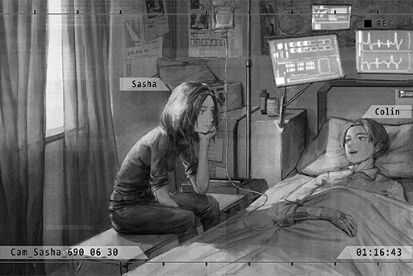

**ConneR** 
... I thought I saw an angel. Turns out I'm still alive.

**Sasha** 
Enough with the snappy remarks. Drink this. It'll help your wounds heal faster.

**ConneR** 
... What about the data?

**Sasha** 
Right here. I expected no less from me. Got both the man and the goods despite a busted transaction.

**ConneR** 
Even though you got me shot a few times... right? Haha... ow...

**Sasha** 
I also said that maybe one day these holes will be on you, right? Stop complaining. Take that as a price for this lesson.

**ConneR** 
Yes yes\~ I get it, my dear teacher.

**Sasha** 
... Although you held me back, for your first ever theft operation, you worked your butt off. It was a commendable effort by you.

**ConneR** 
... I... am doing these things for an ideal I believe is correct. Therefore, I figure that you're probably the same too...right?  
When that thought popped into my mind, my body just inadvertently sprung into action...

**Sasha** 
......

**ConneR** 
Although I said something that sounded really cool, in reality, I ended up looking like a total mess. It seems... that I still have... much to... 
......Zzz......

**Sasha** 
You lost too much blood. Take a rest.

**Sasha** 
......

**Sasha** 
... Thank you. You were really cool back there.

_\[Signal Lost\]_

[*(Click here to go back to the top)*](#toc)

## <a id="cos050"/>\[#050\] Audio\_admins\_690\_07\_07
### Requirements
|Character |Level|
|----------|:---:|
|**ConneR**| 37  |

### Log Content
**???** 
Captain Andrew.

**Andrew** 
You're here. Report.

**???** 
Yes. Reporting on the operation regarding the Area 09 incident.

**???** 
Current designated target Colin Neumann Jr.; last week, he had already successfully stolen all the data stored inside Area 09.

**Andrew** 
Very good. Then everything will return to the previous plan, right?

**???** 
Yes, sir. As of now, the final transaction target has been determined. It's "Splice".

**Andrew** 
The grave robbing group under the "Baro" gang? Although I don't have much interest in them...

**???** 
I understand that they aren't one of our primary targets right now. However, after my own investigation, I can say that they certainly do create a notable profit for Baro.

**Andrew** 
Hmmm...

**???** 
If we can utilize this operation to eliminate them, I believe it would cause pretty significant damage to Baro as well.

**Andrew** 
That does indeed sound like a good move. However, there are also quite a few of our comrades from the "Infiltration Plan" still inside Baro.

**???** 
... Captain, with all due respect, after that operation last year, we barely have any comrades in there now. As of now, we should focus more on the plan at hand.

**Andrew** 
......

**???** 
Colin's target also happens to be Splice. This is a plan that not only allows us to obtain the data but also deals a massive blow to the organization.

**Andrew** 
Kill two birds with one stone. You've always been excellent at that.

**???** 
Captain, you said so yourself. As long as we get our hands on the Area 09 data, the name list for the Infiltration Plan won't be leaked and everyone's safety can be guaranteed too.

**Andrew** 
Certainly. You plan is very ideal. Right now, our most important goals remain the same: cut off any possible routes the gangs may use to obtain this data, recover and archive this data, and finally, arrest the deceiver.

**???** 
......

**Andrew** 
What's the matter?

**???** 
... No, nothing. Then the plan is settled. For the detailed time and location of the transaction, I'll contact you again...

**Andrew** 
You've been serving under me for years. You know you can't hide things from me. Go ahead.

**???** 
... I was thinking... about Colin. He has way too much talent for this sort of thing. An arrest is perhaps not the best way for him to go...

**Andrew** 
You want to make him a member of the Infiltration Plan...?

**???** 
Not to that extent... But if we could further utilize him...

**Andrew** 
Negative. I know his background. In terms of his motives, he is way too difficult to control. We cannot add any more unstable pieces to the plan.

**???** 
......

**Andrew** 
This plan was originally going to be scrapped anyway. In the years it has operated in secret, it helped us admins solve a lot of cases on the surface, no doubt. It's also why I was able to climb all the way to where I am now. However, as an exchange, I'm now the only person that can keep you guys alive.

**???** 
......

**Andrew** 
You've always said that the plan is your first priority. Nevertheless, in reality, you desire to leave this kind of life as soon as possible too, right?

**???** 
... I...

**Andrew** 
I can safely say the operation this time resolved most of my concerns. You've performed exceptionally. If you can accomplish the mission, I will immediately give you back your law enforcement agent identity. You'll be able to put on your uniform once again.

**???** 
Captain... I hear those words from you at least once every year...

**Andrew** 
No. This incident, along with the operation last year, has already made it painfully clear to me. This plan simply cannot keep going on... Maybe the Infiltration Plan will be continued. However, it'd have to be done in a more efficient manner.

**???** 
......

**Andrew** 
You don't want to see more comrades die as well, right? Be it the ones on the surface... or the ones under it.

**???** 
......! No, I...

**Andrew** 
Calm down. I'm not blaming you for developing emotions for people on "that" side. You've been in that environment for so many years. You can't fool those people without having some feelings towards them. Nonetheless, this kind of lifestyle is just way too brutal for you. Someone as talented as you deserve a better life.

**???** 
......

**Andrew** 
In short, this case will be entering its final stages. Once we get our hands on the data, the deceiver and the grave robbing group, I will give you back your uniform.

**???** 
Understood...

**Andrew** 
I'll leave it to you, Sasha.

**Sasha** 
Yes. Then I'll be taking my leave.

_\[Signal Lost\]_

[*(Click here to go back to the top)*](#toc)

## <a id="cos051"/>\[#051\] Cam\_Hotel\_690\_07\_09
### Requirements
|Character |Level|
|----------|:---:|
|**ConneR**| 38  |

### Log Content
**Sasha** 
Not everyone can score a reservation at this restaurant, so enjoy yourself.

**ConneR** 
_\*Chuckles\*_ What's with all this? I didn't expect you to ask me out in private for something that's not related to the operation. Safe to say I'm quite surprised.

**Sasha** 
I'm also quite surprised myself... the fact that you're willing to let me treat you. As a young master of a noble family, I thought you'de be against the idea of a female treating you.

**ConneR** 
Masculism is not part of the Neumann family's teachings. Moreover, not accepting the invitation and treat of a lady is what truly counts as an insult and an act of disdain towards the lady. I feel like that's a message worth living by, don't you think?

**Sasha** 
Haha, couldn't have said it any better myself. 
Here, order anything you want. I trust your taste in food.

**ConneR** 
Then I shall proceed with my orders. Waiter, please...

_\[»»» Fast Forward»»»\]_

**Sasha** 
This is delicious! I've been here so many times, yet I never thought of this combination. I expect no less from you.

**ConneR** 
I'm flattered. Then, as the ending to this meal, this 90\-year aged fine red wine, I believe you'd be very satisfied with it as well.

*\[Glass clinks\]*

**Sasha** 
......! Amazing... It tastes completely different after having the main course just now. On top of that, the impression left on the taste buds by the aperitif... I had this wine before, but it's nothing like this.

**ConneR** 
I'm glad to see you like it. Then, it's about time you tell me the true purpose of this meal, isn't it?

**Sasha** 
Tomorrow is the last transaction. It also marks the end of our partnership. I just want to celebrate this occasion a little bit.

**ConneR** 
Haha, doesn't feel like something you would do. Nevertheless, I thoroughly enjoyed it.

**Sasha** 
I'm not a heartless person. You just don't understand the other, non\-work side of me well enough.

**ConneR** 
Indeed. However, after this meal, I learned quite a few things.

**Sasha** 
Ho? For example?

**ConneR** 
Although Sasha constantly mentioned that you grew up in a "s\*\*\*hole" environment, your table manners are uncharacteristically on point, not something that can be achieved with just a night of practice.  Many details and small habits feel very natural, like you've learned them since childhood. In some instances, your manners are even more on\-point than mine.

**Sasha** 
_\*Chuckles\*_... You're truly... truly an interesting guy. Maybe you're right? Maybe you're not? Maybe everything I told you was a total lie. If I don't do that, how am I going to fool other people?

**ConneR** 
Haha, you have a point. However, I've spent my whole life figuring out other people's lies and truths, and I'm already tired of it. At the very least, I really like who you are right now. That's a truth for me.

**Sasha** 
Fufufu... you drank too much.

_\[→Signal Switches\]_

**ConneR** 
Ugh... cough cough...

**Sasha** 
Oioi... You really drank too much. Here, hold on to me.

**ConneR** 
Apologies... What a shameful display... Where is this?

**Sasha** 
A hotel room upstairs. With you as wasted as you are, I can't just leave you on the side of the road, can I?

**ConneR** 
Thank you...

**Sasha** 
Here, lie down. We still need to do a transaction tomorrow...

**ConneR** 
...... (Kiss)

**Sasha** 
......!

**ConneR** 
...... 
Ah...! I'm so sorry! What the hell is wrong with me... Please forget it. I'm drunk...

**Sasha** 
......

**ConneR** 
......!

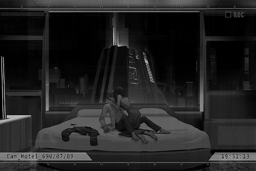

_\[»»» Fast Forward»»»\]_

**ConneR** 
... Can't fall asleep?

**Sasha** 
Yes. Did I wake you from your sleep? Sorry.

**ConneR** 
Not at all. Put on some clothes. You'll catch a cold.

**Sasha** 
......

**ConneR** 
... "What are these people so busy about?"... When I was little, that's the thought that always popped into my mind when I looked at those twinkling dots of light in this night view. This city which I once thought to be so fake, only to turn around and discover its beauty to be so real. How ironic...

**Sasha** 
Is that so...? As with me, I've completely lost sight of the real side already. I don't know when it began. However, to me, it has been covered by something for a very long time.

**ConneR** 
... My father once said, "Humans are a creature that fears the truth. Because of our total ignorance, we choose to cover our cowardness with a layer of lies and refuse to move forward."

**Sasha** 
I thought you left home because you have a terrible relationship with your father, but you really do like to quote him.

**ConneR** 
My respect for him has never changed. Even though he is also engulfed by fear right now, the part of him that's worthy of respect still very much remains in my heart.

**Sasha** 
... You truly are loyal to the human heart.

**ConneR** 
Yes... Loyal to the point where you can consider it sickening. Once I have a person I admire, I can't stand even one tiny bit of smudge on him. I won't allow him to selfishly ruin his place in my heart...

**ConneR** 
I will definitely... use my own strength to solve the mystery that not even father could solve. I will prove to everyone that he's not a mad man... and prove myself to him.

**Sasha** 
......

**ConneR** 
We may not see each other ever again after tomorrow. No matter what happens, I want to tell you, that I am extremely blessed to have you come into my life.

**Sasha** 
...... 
... Colin, I...

**ConneR** 
What's the matter?

**Sasha** 
... Nothing. After all, this is a s\*\*\*hole world where justice doesn't exist anywhere... We can only do what we each believe is the right thing to do.

_\[Signal Lost\]_

[*(Click here to go back to the top)*](#toc)

## <a id="cos052"/>\[#052\] Audio\_Home\_683\_07\_09
### Requirements
|Character |Level|
|----------|:---:|
|**ConneR**| 38  |

### Log Content
**Colin** 
BASTARD! This guy too, that guy too... none of these bastards believe me!

*\[Things breaking\]*

**Colin** 
For the past few decades, all the things I have done for you people, all the items I had excavated... and this is how you repay me!? A suspension!? "Honorable employee"... What the goddamn f\*\*\* is this garbage bulls\*\*\*!

**ConneR** 
......

*\[Door Closes\]*

**Colin** 
You sons of b\*\*\*\*\*\*! If you don't believe me, then open my brain! Dissect it all you want! You'll get to see the sight of those damn Architects attacking us...

**ConneR** 
Sighs...

*\[Door Knock\]*

**ConneR** 
... Father?

**Alyxia** 
Colin, it's me.

*\[Door Opens\]*

**ConneR** 
What's the matter, mothe... Yikes! Your face...

**Alyxia** 
It's okay... I'm fine.

**ConneR** 
The first\-aid kit is downstairs. I'll go get it...

**Alyxia** 
No, he has fallen asleep. Don't disturb him... I have something to tell you.

**ConneR** 
Tell me...?

**Alyxia** 
Colin... let's leave this home.

*\[Things crashing\]*

**ConneR** 
L, leave?

**Alyxia** 
I know you are very surprised. But we've been working so hard, yet he just couldn't come out of it. He just kept thinking that A.R.C. doesn't believe him... then venting all his anger on us...

**ConneR** 
......

**Alyxia** 
You should understand, right? The dignified and prideful Colin has already disappeared in the forbidden areas. He will never come back again. Right now, he is nothing more than a violent drunkard...

**ConneR** 
Mother... I...

**Alyxia** 
I know... I also hope he can recover and return to his previous self again. In my mind, he is still my husband... but for the past year, I feel like... I just can't take it anymore... _\*Sobs\*_...

**ConneR** 
......

**Alyxia** 
I've already contacted my household. We'll be leaving soon... Colin, come with me. If you keep staying here, your life will be ruined by him as well. You're just sixteen. You can't...

**ConneR** 
... Sorry, mother. I... I can't go with you.

**Alyxia** 
W, why?

**ConneR** 
Mother... I know how tough things have been for you this past year. That's why I understand your decision to leave... but if I leave him as well, father will truly lose everything. He'll never, ever return to normal again... It's like I abandoned my own father and left him to die all alone.

**ConneR** 
As his son... I just can't let that happen. I can't do that.

**Alyxia** 
Colin...

**ConneR** 
I'm sorry, mother... I will figure out a way to keep father here. If the situation calls for it, I'll ask Grace to help too. You should leave for a safe place as soon as possible.

**Alyxia** 
Then what about you?

**ConneR** 
I'll continue to work hard... No, work even harder than I did before. I'll let father know, that I achieved his expectations for me. Then, he'll wake up from his nightmare too. We can finally get together as a family again.

**Alyxia** 
_... \*Sobs\*..._

**ConneR** 
Mother?

**Alyxia** 
... In mother's mind, you're always that little boy who fell off a horse and sat there with a beaming smile... But when I didn't notice, you've grown up already. You're now a man capable of making this kind of decision yourself.

**ConneR** 
......

*\[Things breaking\]*

**ConneR** 
Huh! He's awake... Mother, go! Now!

**Alyxia** 
Okay... Colin, no matter what, mother will always be proud of you. I'm really sorry, but I'll leave your father to you, okay?

**ConneR** 
Yes. I'll take care of father. Here, leave from the side gate.

**Alyxia** 
I love you, my son...

**ConneR** 
I love you too... mom.

*\[Door Opens\]*

**Colin** 
Booze? Where is my Booze? 
Gimme the Booze...

**Colin** 
Alyxia! Grace! Get the f\*\*\* over here!

**ConneR** 
Father's... hope...

_\[Signal Lost\]_

[*(Click here to go back to the top)*](#toc)

## <a id="cos053"/>\[#053\] Audio\_St199\_690\_07\_10
### Requirements
|Character |Level|
|----------|:---:|
|**ConneR**| 39  |

### Unlocked Charts
|        Song        |Character|Diff.|Level|
|--------------------|:-------:|:---:|:---:|
|**Fur War, Pur War**| ConneR  |Easy |  4  |
|**Fur War, Pur War**| ConneR  |Hard |  8  |
|**Fur War, Pur War**| ConneR  |Chaos| 15  |

### Log Content
**Agent A** 
This is Squad 3. Target of the transaction confirmed. A total of 8 people, including the encryption hacker working remotely. No other signs of life. Preparing for action.

**Andrew** 
The female seller is an important witness. She has lots of vital information. After the arrest, hand her over to me immediately.

**Agent B** 
Yes, Captain!

_\[→Signal Switches\]_

**Member A** 
The goods?

**Sasha** 
They're here. Don't worry. The hacker is cracking the last set of serial numbers.

**Member B** 
I've heard about it. You guys got that "X" to do the job, right? We know his interests and origin, don't play tricks with us.

**Sasha** 
Ha, you offer this kind of money and you think that buys you the right to talk? If you're scared, I'll find somebody else to sell it to.

**Member C** 
What did you say!?

**Member A** 
Hey, forget it.

**Member C** 
Tch...

**ConneR** 
The final set of serial numbers has been decrypted. The data is all yours.

*\[Door busts open\]*

**Agent A** 
ENFORCEMENT AGENTS!! DON'T MOVE!!

**Member A** 
F\*\*\*!? You sold us out...

*\[Smoke bomb explodes\]*

**Member B** 
_\*cough\* \*cough\*!_ Open fire! 

*\[Gunshots\]*

**Member C** 
Can't see anything! Argh!!

**Member B** 
DIE....!!!

*\[Gunshots\]*

**Member B** 
Wahh!!!

**Agent A** 
1st floor secure. Someone escaped to the 2nd Floor. Units C and D, head up and flank them from the east entrance.

**Andrew** 
Cuffs on. I'll take care of the 2nd floor.

**Agent B** 
Got it.

_\[→Signal Switches\]_

*\[Sprinting\]*

**Sasha** 
R! Listen to me, you can escape through the small door in the front. No one should be there, you...!?

**Sasha** 
......

**Sasha** 
R......?

**Member A** 
S\*\*\*balls! You b\*\*\*\*! How dare you trick us!?

**Sasha** 
... Tch!

*\[Gunshots\]*

**Sasha** 
Argh!

**Andrew** 
Don't move!

*\[Gunshots\]*

_\[»»» Fast Forward»»»\]_

**Sasha** 
... Cap... tain...

**Agent A** 
Get down!  
This is the east side of the 2nd floor! 3 criminals arrested! The captain is down! We need assistance!

**Agent B** 
Damnit! It was you, wasn't it!? The one who shot the captain...

**Sasha** 
No... I...

**Agent A** 
Bill! Stop! Captain said we need her alive... She's hurt. Let's patch her up first. She definitely has valuable information on her.

_\[»»» Fast Forward»»»\]_

**Agent C** 
Reporting back to Administration Bureau Headquarters. This is Squad 3. The transaction disruption was a success. We've arrested 6 criminals on site. 1 male criminal escaped. We suspect that he has the data. We're currently expanding the search area. We also couldn't track the hacker who decrpyted the data remotely. He cleaned his connection trails completely...

**Agent C** 
Captain... Captain Andrew Wood was shot during action. After emergency medical assistance was issused, no signs of life detected...

**[Bureau Staff]** 
_...Understood, bring all the criminals in. Bring the Squad home._

**Sasha** 
Wait! I... I'm...

**Agent A** 
Shut your mouth!

**Sasha** 
I'm a Law Enforcement Agent! "Infiltration Plan" Code 002. I'm with Captain Wood!

**Agent B** 
......?

**Sasha** 
Andrew Wood, Law Enforcement Agent number A6610769. Initiated Infiltration Plan in year 688. Plan number P6880423. I'm Undercover Agent code 002 "Zoe Watson"!

**Agent B** 
... Hey...?

**Agent A** 
Don't believe her! She's the master deceiver Shark. It's not difficult for her to get her hands on this kind of info.

**Sasha** 
... Ugh!

**Agent C** 
Where's your partner?

**Sasha** 
......

**Agent C** 
What about the data? Did he take it?

**Sasha** 
... I don't know.

**Agent C** 
You don't want to talk? So you're with them after all? We'll have a lot more time to open your mouth back at the Bureau.

*\[Heavy Blow\]*

**Sasha** 
Argh!!!

_\[Signal Lost\]_

[*(Click here to go back to the top)*](#toc)

## <a id="cos054"/>\[#054\] Multi\_Files\_686\_12\_23
### Requirements
|Character |Level|
|----------|:---:|
|**ConneR**| 39  |

### Log Content
**[Tutorial System]** 
_Year J model student representative Zoe Watson, please come to the stage for your speech._

*\[Applause\]*

**Student A** 
Of course it's Zoe!

**Zoe** 
Haha, I'll be right back.

**Zoe** 
Another year has passed. I am extremely blessed to be given the honor to deliever a speech as the model student representative again this year. I believe that everyone has encountered all kinds of difficulties on their path to knowledge...

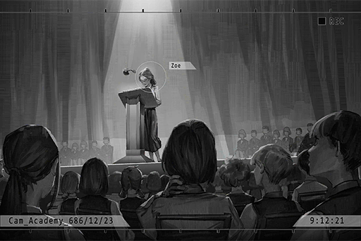

_\[→Signal Switches\]_

**Student A** 
Zoe is so amazing. Every year her speech is so touching. I expect no less from "Miss Academy"!

**Zoe** 
Haha, what's that name? Don't call me that.

**Student B** 
It's true! You're already a top celebrity in the Academy! Just look at how the underclassmen look at you.

**Zoe** 
Oh, please... But giving a speech every year makes me really tired too. Writing a speech isn't easy and I'm always afraid that people will be bored.

**Student A** 
Not at all. If you keep at it, you'll be the model student representative next year as well.

**Zoe** 
Ah\*... Next year, I may not be here anymore.

**Student A** 
Wahh!?!? Why?

**Zoe** 
I got the recommendation, so I'm going to the Law Enforcement Academy.

**Student B** 
Eh!? Isn't that great? I told you your grades wouldn't be an issue!

**Student A** 
But we'll all be lonely without you here,...

**Zoe** 
Haha, it's not like we won't ever see each other. It's my dream, even though it's much earlier than I imagined...

**Student B** 
Do it! You have all of our blessings!

_\[→File Switches: 687\_03\_25\]_

**Zoe** 
Wahh!!

*\[Falls down\]*

**Trainer** 
Watson! Keep up! You want to be last in the class again?

**Zoe** 
No sir! Sorry!

**Trainer** 
Don't think your grades mean anything here. If you get last place here, you're getting flunked the hell out of here!

**Zoe** 
_\*heavy breathing\*.......!_

_\[→File Switches: 687\_12\_10\]_

**Zoe** 
Trainee S6870939, Zoe Watson reporting.

**Andrew** 
In just a few months, you've gotten full score on all the credits in physical training. I didn't make a mistake when I chose you.

**Zoe** 
Yes, sir! Captain taught me very well, sir!

**Andrew** 
Watson, You said you wanted to join my squad, right? Tell me why.

**Zoe** 
Yes. Captain Wood's Squad 3, despite the squad's relatively low ranking position, is the most effective and best\-performing Law Enforcement Squad. If I join the team, I believe the squad will be more dynamic and can climb to a higher position and put an end to even more crimes!

**Andrew** 
I see... You really have good eyes. It's been a long time since I saw such stellar performace from one of my trainees.

**Zoe** 
Thank you Captain for the compliment!

**Andrew** 
From now on, this conversation will not be recorded. Just we two will know. Watson, I'd like to give you a very special opportunity.

**Zoe** 
Opportunity...?

**Andrew** 
The current Administartion Bureau... Let's just say there's a lot of red tape involving various organizations. If this continues, no matter how hard we try to stop criminal activities on the surface, these organizations will simply yield greater and greater power in the shadows of society. That's why I initiated this plan. 

*\[File Projection\]*

**Zoe** 
"Infiltration Plan"...?

_\[→File Switches: 689\_08\_06\]_

**Zoe** 
Coral! Get up! Get up!

**Coral** 
He... hehe... saved by the last in the class. How embarassing.

**Zoe** 
This is our last time operation. We're going to wear our Enforcement Agent uniform together, right? Don't you dare die on me here!

**Coral** 
Ha... don't be silly... That bastard never had the intention to give us back our uniforms.

**Zoe** 
......

**Coral** 
You knew very well yourself, didn't you...? How many shots have we taken doing  these scumbag jobs... you... are you... Zoe? Or Sasha?

*\[Gunshots\]*

**Coral** 
Go... now... Go back... and tell Wood... for my sake... tell him...

**Zoe** 
Coral!!

**Coral** 
To go f\*\*\* himself...

**Zoe** 
Coral！！

_\[Signal Lost\]_

[*(Click here to go back to the top)*](#toc)

## <a id="cos055"/>\[#055\] Audio\_Truck\_690\_07\_11
### Requirements
|Character |Level|
|----------|:---:|
|**ConneR**| 40  |

### Log Content
**Sasha** 
Ughhh... huh?

**ConneR** 
Are you awake?

**Sasha** 
Is this... where is this? What happened...?

**ConneR** 
Don't move. You're injured.

**Sasha** 
......

**ConneR** 
Is your mind clearer now? Do you know what happened?

**Sasha** 
... I was arrested. Captain Wood... died. On the way back... right, the car malfunctioned. It was you...

**ConneR** 
Not just me. I borrowed a bit of help from X in order to get you out. Though I had to pull some tricks before he was willing to help... he really is quite the interesting character.

**Sasha** 
I didn't think you could escape... Did you already know? That I was a spy...

**ConneR** 
Yeah. I thought you'd notice it too. However, whether you noticed or not doesn't really matter to me anyway.

**Sasha** 
Ha... being played by my own disciple... When did you start suspecting me?

**ConneR** 
Suspecting? Ah, I see. That's what you think. As a deceiver, you failed spectacularly.

**Sasha** 
... Thanks to that hypnotizing bomb you threw at me back there, I'm really dizzy right now. I'm too lazy to think anymore. Explain it to me.

**ConneR** 
I'll give you a clue. That busted transcation that resulted in you escaping to Saxon's place, have you ever wondered why it got busted to begin with?

**Sasha** 
......!

**ConneR** 
That's right. From our little encounter there, to all the time we spent together these past couple months, it was all part of my plan.

**Sasha** 
......

**ConneR** 
I knew very early on what kind of data was stored in Area 09, because it wasn't encrypted at all in the first place. I imitated A.R.C.'s encryption methods and added the encryption myself.

**ConneR** 
I knew that you were sending the decrypted data back to the Administration Bureau. X was only willing to work with you because Captain Wood directly talked to him, right?

**ConneR** 
And all the money given to me after each transaction, they were going to be taken back by the Bureau when I was captured anyway. Not a bad idea.

**ConneR** 
But unfortunately for you, the data you folks archived was one that was swapped out by me. The real data has been with me all this time, in the storage unit right behind me.

*\[Data Projection\]*

**ConneR** 
This is your deleted Law Enforcement Agent profile, right? Zoe Watson.

**Sasha** 
So you knew my identity all along... Do you know me?

**ConneR** 
_\*Chuckles\*_  Know isn't exactly the right word. We're merely students of the same graduation class. You left to study at the Law Enforcement Academy. When I read through these profiles, I noticed your name right away, which is how I learned of your identity.

**Sasha** 
... You used me and the Administration Bureau to get huge amounts of resources and money. All the data is in your hands. The people from the organization and Bureau were all played by you like a fiddle. Both seriously injured as a result...

**Sasha** 
So even your feelings for me are fake... A, haha, so that's how it is?

**Sasha** 
I've got to applaud you. I nearly thought you were serious...

**ConneR** 
......

**Sasha** 
Well, then what is all this about? Your plan should've ended once I got captured, right?

**ConneR** 
Originally, yes. But the plan has been slightly altered.

**Sasha** 
... So where are you going to take me now?

**ConneR** 
Is this really the life you want? Andrew Wood is dead. The data that can prove your identity is in my hands. There's nowhere in Node 08 for you to go.

**Sasha** 
......

**ConneR** 
Go to another Node and start a new life. The nearest I can take you to is Node 10. Even though that place has not been functioning since "The Decomission", it's still works as a temporary shelter. For you, surviving there shouldn't be an issue.

**ConneR** 
Your family is in Node 13, just like me. Although you no longer have family there, going back may not a bad idea either. I really like it there.

**Sasha** 
... Is caring about my life part of your plan as well? I don't see this bringing you any benefits.

**ConneR** 
Indeed. It's a thankless and boring task, and I don't get anything out of it.

**Sasha** 
Then why...

**ConneR** 
Didn't I already tell you? I really like who you are right now. That's a truth for me.

**Sasha** 
......

**ConneR** 
"No... not just now... It was long before all this... How do I put it? In my mind, I believe I owed you a massive favor, and I've always wanted to repay that favor.

**Sasha** 
......?

**ConneR** 
When I first saw your profile, I had already completely forgotten that feeling. I was only thinking about how I was going to use you to achieve my goals.

**ConneR** 
But I guess I'm not as rational as I consider myself to be. After spending some time together with you, that truth has become more obvious it than ever was. 

**Sasha** 
......

**ConneR** 
It was when we were both students...

_\[Signal Lost\]_

[*(Click here to go back to the top)*](#toc)

## <a id="cos056"/>\[#056\] Multi\_Files\_686\_12\_21
### Requirements
|Character |Level|
|----------|:---:|
|**ConneR**| 40  |

### Log Content
**Colin** 
Alyxia! Alyxia!

**ConneR** 
... Father, mother is already gone. Come on, take your meds.

**Colin** 
Alyxia... Luka... I'm sorry... It was all me... Damnit...

**ConneR** 
... Father, I'm still here.

**Colin** 
......

**ConneR** 
Ah, Right! I've made progress on my thesis again. I'm now number 2 in the entire Node accroding to the grading system.

**Colin** 
... Take it away! Don't let me see your unacceptable thesis! To the Neumann family, it's only honorable if it's number 1!

*\[Things crashing\]*

**ConneR** 
...... 
I'll give you some sedatives. You need to rest. Good night.

*\[Door closes\]*

**Grace** 
Master! You could've asked me to give the medicines to Sir...

**ConneR** 
No, it's okay. I want to do it. 
... I'm hungry. Can you go make me some food?

**Grace** 
Certainly! 
... Master, thank you so much.

**ConneR** 
..._ \*Chuckles\*_ What's the matter? Why this all of a sudden...

**Grace** 
Thank you for not giving up on Sir and this home... and me.

**ConneR** 
Of course I won't give up. One day, we will return to the lives we once had...  
... Enough talking. Can you make me some food now? I'm starving! Also, make some for yourself too. We can eat together.

**Grace** 
Yes, master.

*\[Footsteps\]*

*\[Things crashing\]*

**Colin** 
Useless! All of them are a bunch of useless hacks!

*\[Sits on ground\]*

**ConneR** 
What exactly... am I doing all this for...?

_\[→File Switches\]_

**[Tutorial System]** 
_687, Year J, first exam final score ranking announcement: 
1st place, Year J Class 1 \- Zoe Watson 
2nd place, Year J Class 3 \- Colin Neumann Jr. 
3rd place..._

**ConneR** 
Her again... Damnit, why am I always losing to her...

**Student A** 
Yikes, I failed again. My dad's gonna be really, really mad...

**Student B** 
As expected, first place belongs to "Miss Academy" again.

**ConneR** 
Whatever, what's the point of me working so hard... This is stupid...

_\[→File Switches\]_

**[Tutorial System]** 
_Year J model student representative Zoe Watson, please come to the stage for your speech._

*\[Applause\]*

**ConneR** 
... It's her.

**Zoe** 
Another year has passed. I am extremely blessed to be given the honor to deliever a speech as the model student representative again this year. I believe that everyone has encountered all kinds of difficulties on their path to knowledge...

**ConneR** 
... Beautiful.

_\[→File Switches\]_

**[Tutorial System]** 
_688, Year K, first exam final score ranking announcement: 
1st place, Year K Class 1 \-  Colin Neumann Jr. 
2nd place......_

**Student A** 
Oh, so that eternal 1st place finally gave up her spot... Who is this guy?

**Student B** 
Well, she suspended her studies. I heard that when she's still here, no one can ever beat her in an exam.

**ConneR** 
......

_\[Signal Lost\]_

[*(Click here to go back to the top)*](#toc)

## <a id="cos057"/>\[#057\] Audio\_Truck\_690\_07\_11
### Requirements
|Character |Level|
|----------|:---:|
|**ConneR**| 41  |

### Log Content
**Sasha** 
... I remember now. That guy who was always right behind me and kept getting second place... Turns out that was you.

**ConneR** 
My, I was so young and naive back then. I originally thought that if I can beat you in a test, I can grab your attention. Yet when I finally got that 1st place, it was because you left.

**ConneR** 
Back then, when I was at my most helpless and despaired, when I was hiding in a dark corner, seeing you work so hard as the model student, seeing your determined eyes... I don't know why, but it gave my life undescribable courage and an objective to chase. It without a doubt pulled me out of the terrible state I was in. To you, who have never even met me in person, this is probably very difficult to understand.

**Sasha** 
... So that's why you wanted me to get my life back... and you even killed captain... Stop screwing around with me... Acting like some kind of savior for this reason... Do I look that pathetic in your eyes!?

**ConneR** 
First, I did not kill the captain. I would even go as far as to say that his death caught me by complete surprise... Second, even if he didn't die, you already knew what's going to happen, don't you? He's never going to return your identity as a Law Enforcement Agent, even after this mission concluded.

**Sasha** 
......

**ConneR** 
The Infiltration Plan and the ecosystem of the Administration Bureau, I believe you know them much better than me. Once you lose possession of this data, your only option is to rely on him, all the while being stuck in this incompetent system and barely staying afloat. You will be forced to watch helplessly as more and more comrades perish.

**Sasha** 
......

**ConneR** 
Amanda, Leon, Coral; these names won't be the end of this trail of blood. Perhaps the name Zoe will eventually join them at the end of this trail as well.

**Sasha** 
... Shut up...

**ConneR** 
When that time arrives, I will appear in front of you once again and ask you the same question: Is this really the life you want? Or have you been a deceiver for long that you ended up fooling yourself too?

**Sasha** 
...... Shut up!

**ConneR** 
If I don't give you a reason and excuse like this, you'll be fine with things staying as the status quo? If that's really the case, then yes, you are indeed pathetic.

*\[Loads Gun\]*

**Sasha** 
... ENOUGH! I told you to shut up! How dare you speak like you understand everything! You don't...

**ConneR** 
You're right. I don't understand. Nevertheless, you were without a doubt once a sublime figure in my mind; or perhaps that's just an image of you I created myself and hoped you could be. However, once I have a person I admire, I can't stand even one tiny bit of smudge on her. I won't allow her to selfishly ruin her place in my heart... Because to me, that is more painful than anything else.

**Sasha** 
......

**ConneR** 
If this is all my misunderstanding, please, go ahead and pull the trigger. Take back the data. Take back your own identity.

**ConneR** 
After all, I am well aware that what I am doing now is purely based on my wishful thinking. I am foolishly doing what I believe is the right thing to do in this s\*\*\*hole world where justice doesn't exist anywhere. That's all.

**Sasha** 
... Ugh...!

**ConneR** 
Dying at your hands... That's not too bad of an ending for me either.

**Sasha** 
......

*\[Retracts gun\]*

**ConneR** 
......

**Sasha** 
... Captain Wood... I know that he was only using me all this time. He's definitely not the model Law Enforcement Agent I envisioned too...  But even so, he still taught me a lot of things and helped me a great deal... At the very least, he is not someone who should've died for this.

**ConneR** 
I am very sorry to hear that. But you know very well yourself, don't you? No matter which side you're on...

**Sasha** 
The justice and peace I dream about are nowhere to be seen.

**Sasha** 
......

**ConneR** 
......

**Sasha** 
... Node 10... what kind of place is it?

**ConneR** 
"Deserted" and "Desolate" are words created to describe that place.

_\[Signal Lost\]_

[*(Click here to go back to the top)*](#toc)

## <a id="cos058"/>\[#058\] Audio\_Garion's\_702\_11\_20
### Requirements
|Character |Level|
|----------|:---:|
|**ConneR**| 42  |

### Log Content
_\[Call Starts\]_

**[Xenon]** 
_Hello?_

**ConneR** 
Mr. Jackson? I thought I called Miss Pauline's number.

**[Xenon]** 
_So what? Any progress with the investigation?_

**ConneR** 
Ooh, such a hostile attitude. Should I remind you who kept you two alive for an entire week not too long ago?

**[Xenon]** 
_Okay okay\~ Thanks\~ 
You told me not to actively connect back to investigate the Æsir incident. That's why I'm waiting here in 03 like an idiot. If we don't get going soon..._

**ConneR** 
No need to rush. I just arrived in Node 13 not too long ago. It's quite difficult to find a place with a powerful enough signal here. It's definitely a lot more difficult than walking into a bar and ordering pork knuckles with a light beer, that much I can say for sure.

*\[Drinks wine\]*

**[Xenon]** 
_... And this is your investigation? Stop messing around. Now's not the time for you to be causally sightseeing._

**ConneR** 
I'm kidding. I still have to eat. Can't do anything with an empty stomach, right?

**[Xenon]** 
_... I'm hanging up._

*\[Drinks wine\]*

**ConneR** 
Haha, quite hot\-blooded, aren't you? 
Like I just said, I'm preparing to do some historical investigations and finish some research that was left unfinished from my previous stay here. My goal is to verify my speculations. This requires time, luck, preparation, and a little adventure.

**[Xenon]** 
_Don't forget about your right arm and right eye. The Exploration Team won't just happen to pass by there to save you every time._

**ConneR** 
Thank you for being concerned about little old me, but no worries. I've always been pretty lucky.

**[Xenon]** 
_I'm concerned about the information you can provide. If you don't get any results on your side, we can't continue on our side, right?_

**ConneR** 
_\*Chuckles\*_ Rest assured. After the time I spent together with you guys, I've understood the importance of teamwork. I won't be a lone wolf and do everything by myself this time. Perhaps I'll find myself a trusty partner.

**[Xenon]** 
_Whatever you do. All in all, you better hurry._

**ConneR** 
I know. About the next mission for you two to do in 03...

**[Xenon]** 
_"The Eye of Horus", right? I did a quick investigation according to the hints you provided. Such a person does indeed exist. This person has the ability to access digital information in the internet space, including ancient files that no one knows about anymore._

**ConneR** 
... Now that's quite surprising. You already knew about this?

**[Xenon]** 
_This is all the info I can get. In 03, this seems to be a very well\-known urban legend among members of the underground society. 
Even though we can't confirm the authenticity of this... does someone like this really exist? It doesn't sound scientific at all._

**ConneR** 
Aren't the most interesting parts of science the ones we know nothing about? Known science is one of the most boring things in this world.

**[Xenon]** 
_………_

**ConneR** 
Allow me to remind you once again. Your current situation is not a suitable one for you to conduct more investigations. Add to that the unstable nature of 03 and any careless action is a foolish one, not to mention something as idiotic as coming in direct contact with the gangs.

**[Xenon]** 
_Then do you have any advice, wilderness survival expert?_

**ConneR** 
_\*Chuckles\*_ I do. Listen carefully. 
"Wait for my next contact."

**[Xenon]** 
_………_

**ConneR** 
My food order is coming. Apologies, Mr. Jackson, but I have to go now.

**[Xenon]** 
_Are you for real? You're not taking this seriously..._

**ConneR** 
Ah, one more thing.

**[Xenon]** 
_？_

**ConneR** 
Your account got frozen, right? I'll send you one later. Feel free to use the money in there however you desire. With the garbage equipment you two have right now, I can't imagine that you'll be much of any help.

_\[Signal Lost\]_

[*(Click here to go back to the top)*](#toc)

## <a id="cos059"/>\[#059\] Audio\_Garion's\_702\_11\_20
### Requirements
|Character |Level|
|----------|:---:|
|**ConneR**| 43  |

### Log Content
**Waiter** 
Your order, sir.

**ConneR** 
Danke schön\~ Your food is truly a treat to all senses. A visit to this city just doesn't feel complete without eating here at least once.

**Waiter** 
We are very honored to receive such kind words.

*\[Notification\]*

**Waiter** 
... Got it. Understood. 
Mr. Neumann, the customer in booth no.5 would like to treat you to a Martini. Would you like to accept it?

**ConneR** 
... Of course I would.

_\[»»» Fast Forward»»»\]_

**Waiter** 
Excuse me, Sir. Your martini.

**ConneR** 
Danke.

**Waiter** 
If you need anything else, please ring the bell. I'll be at your service right away.

*\[Close curtains\]*

**ConneR** 
Three olives... Placing the memory unit under the glass, is it? You're still as careful as you always have been.

*\[Plays Message\]*

**[???]** 
_Quadrant III, 57th street, No. 16._

**ConneR** 
......

_\[Signal Lost\]_

[*(Click here to go back to the top)*](#toc)

## <a id="cos060"/>\[#060\] Audio\_13St57\_702\_11\_21
### Requirements
|Character |Level|
|----------|:---:|
|**ConneR**| 44  |

### Log Content
**ConneR** 
How unfortunate. We could've enjoyed yesterday's meal together.

**???** 
If a particular wanted criminal didn't cause a huge ruckus in 08's restricted area while on the run, we indeed could've.

**ConneR** 
It has been a long time, Sasha.

**Sasha** 
You... really have gotten old.

**ConneR** 
And you're as beautiful as you always have been.

**Sasha** 
_\*Chuckles\*_ Thank you. Come on in.

_\[→Signal Switches\]_

**ConneR** 
This is your home?

**Sasha** 
This is a house my grandfather left me.

**ConneR** 
Very tasteful interior decoration.

**Sasha** 
He is a native Node 13 person after all. 
Alright, enough with the chitchat. We haven't been in contact for years, ever since that day... Why are you contacting me now?

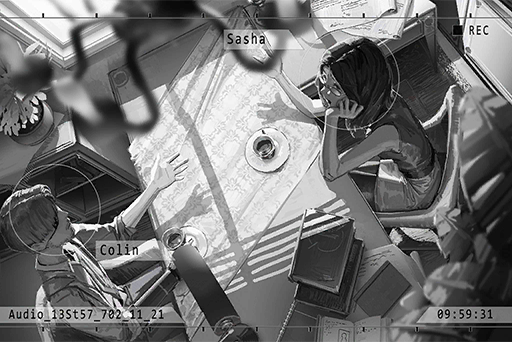

**ConneR** 
You only recently returned to Node 13, right? Before that, I really had no idea where you were. 
I read some of the ancient civilization research papers you published in recent years. That's why I felt you might just be the person who can help me.

**Sasha** 
Those should've all been published anonymously... Well, since it's you, it certainly wouldn't be difficult for you to find out.

**ConneR** 
Haha, I've been following you since our Academy days after all. I can recognize your writing style in just one quick glance. Nonetheless... going from undercover Law Enforcement Agent to ancient civilization research scholar; do you plan to go back to your 2nd career option?

**Sasha** 
Pretty much. Never imagined that after discarding those boring ideas, doing this would turn out to be so surprisingly enjoyable.

**ConneR** 
Boring ideas? You mean pursuing justice in this world or something along that line?

**Sasha** 
Haha, stop it. Right now, I... no longer think like that anymore.

**ConneR** 
No, what you're doing now is likely going to bring you even closer to that objective, as long as you partner up with me again.

**Sasha** 
... What do you mean?

**ConneR** 
I didn't simply come back to chat with an old friend. Didn't I mention that you're the person who can help me?

**Sasha** 
That depends on what the thing it is. I owe you a favor for the peaceful life I have now. Although I don't care about the legality of what you're going to do, I have no intention to get myself in trouble again.

**ConneR** 
All in all, hear me out first. I'll tell you the information I gathered and my speculations. I believe you'll definitely be interested. 
First, your research regarding Node 13's regional dialect should be much thorough than mine, correct? There are some data I would like you to take a look at.

_\[Signal Lost\]_

[*(Click here to go back to the top)*](#toc)

## <a id="cos061"/>\[#061\] Audio\_Sasha\_702\_11\_21
### Requirements
|Character |Level|
|----------|:---:|
|**ConneR**| 45  |

### Log Content
**ConneR** 
So? Any thoughts?

**Sasha** 
... Looks like the case you got involved in this time is truly a significant one, is it?

**ConneR** 
The use of the word "involved" is approximately 50% accurate in this situation.

**Sasha** 
How so?

**ConneR** 
At first, I started investigating this series of events out of personal interest. However, when I dug deeper and deeper, I discovered that the truth and I... no, and "us" were more and more connected to each other.

**Sasha** 
Us...? Does it have something to do with me?

**ConneR** 
No, not just the two of us... I was referring to all of us.

**Sasha** 
......?

**ConneR** 
Father and Co.—— the incident encountered by the last generation of exploration elites, the large\-scale internet terrorist attacks headlined by Æsir, the lies made up by A.R.C. out of desperation to hide the truth, "The Decommission"... They may bring about humanity's greatest catastrophe since then.

**Sasha** 
... Is that so? Based on the clues you currently have right now, this speculation is quite a bit of a stretch.

**ConneR** 
Indeed, which is why I would like to get your take on this. After all, your instincts have always been much more on point than mine. I believe you.

**Sasha** 
_\*Chuckles\*_ Man, your every word... I'm having trouble determining whether you're praising me or teasing me.

**ConneR** 
I say about half\-and\-half. So, any thoughts?

**Sasha** 
Sigh...For starters, let's organize everything. First, these are your father's research documents, all in paper documents... They're in pretty bad shape. Some of them even got burnt...

**ConneR** 
Yes, my father was in a really unstable mental state before his passing. Even though I really don't want to admit that those rumors outside were correct... by that time, he had, without a doubt, gone insane.

**Sasha** 
I'm sorry to hear that... There's also the phrase he left on the wall. According to a direct translation of Node 13's dialect —— "XXX; Sound of the Heart" is what it says.

**ConneR** 
Even someone of my level knows that much but knowing the words didn't bring me any closer to understanding what they mean.

**Sasha** 
It feels like some kind of secret code or phrase... I can look into it to see if any related organizations used these words. 
Next is this chip he left you. Any idea what it is? I've never seen this model...

**ConneR** 
So far, the only things I know are ——  
Number one, my father spent much of his life studying it. At first, it was for his own fame and glory. That was until he lost his teammates. Afterward, he became more and more obsessed with it. Regardless of all that, he was never able to find an answer before he passed away.

**ConneR** 
Number two, this item is a relic of technology from ancient civilization. It has been passed down from my ancestors —— from the era of Rald Neumann... In other words, this thing has been passed down from the time of "The Decommission".

**Sasha** 
That info I already know. Anything else?

**ConneR** 
Number three, this could be a technology created by the Architects, which is precisely one of the many truths A.R.C. has been trying diligently to hide all this time.

**Sasha** 
......!? 
Architects aren't supposed to do this kind of thing.

**ConneR** 
This is the lie A.R.C. wants to fabricate. How much do you know about Architects?

**Sasha** 
Umm... some things here and there; but judging by how much you've changed... perhaps not as much as you.

**ConneR** 
Before father died, he was diagnosed with a disease called "neurodegenerative dementia", which took away his ability to move and normal cognitive functions. My research into medicine barely scratches the surface, but I know that his symptoms are absolutely different than that disease.

**Sasha** 
......

**ConneR** 
The doctor who made the diagnosis was sent by A.R.C. and has been treating him ever since he "resigned" from the company. His trustworthiness is about as low as it gets.

**ConneR** 
Before he passed away, I received a letter handwritten by him. The content is mostly his apology to mother and I. It also mentioned the chip. It certainly is his handwriting but I know very well that the letter wasn't written by him. If I'm to make a guess, it's a counterfeit made by those bastards at A.R.C.

**Sasha** 
Why are you so sure?

**ConneR** 
With the mental and physical state father was in back then, it's hard to imagine that he ever had the ability and mood to write those words. The letter did indeed mention the chip, but it has one major error——father is someone who values his job and honor as much as his own life. There's no way he merely mentions his research on the chip amid all those mushy words.

**ConneR** 
If he truly wanted me to inherit the chip, he would've definitely handed over more detailed data and reports regarding his research. Yet what actually happened was that I had to painstakingly retrieve these documents from his messy lab all by myself.

**Sasha** 
But... if A.R.C. had the intention to hide all this, why did they let the chip still end up in your hands? They even went out of their way to write a fake letter.

**ConneR** 
There's one thing they don't know. Based on these fragmented data pieces, we can tell that father once connected this thing with his own virtual internet chip. Take a look; this is the scan data.

**Sasha** 
... There's even a date on it.

**ConneR** 
That's right, and that's exactly the point in time where his symptoms began to get significantly more severe.

**ConneR** 
The way I look at it, there's something hidden in this chip; something A.R.C. really wants yet is unable to get. They've been waiting all this time for father's research to produce results. However, he died before he ever did. And now, they plan to use me to solve this puzzle before retrieving it themselves.

**Sasha** 
Hoho? So it seems that you were let go on purpose... You're being underestimated.

**ConneR** 
I won't act that it doesn't bother me greatly. However, right now, our number one priority is still to restore these documents completely. We need to find the mistakes in father's research and in turn, obtain the content of the chip.

**Sasha** 
About that... I don't think my profession will be of much help.

**ConneR** 
It will. Back then, father treated this research as his own secret treasure and guarded it tightly. He insisted on completing all on his own. I think this was one of his flaws when conducting such a risky experiment. As with me... I have you by my side. Setting aside how much help you'll actually be, it at least makes me feel much more at ease

**Sasha** 
... Is that so? Then don't hate me for accidentally getting you killed.

**ConneR** 
_\*Chuckles\*_ Didn't I say before? 
Dying at your hands... That's not too bad of an ending for me either.

**Sasha** 
... Okay, okay\~ Let's get going. 
I'll handle the investigation of the message on the wall and the restoration of these documents. What about you?

**ConneR** 
I've got to first make a trip back to my previous home——the mansion of my ancestor Rald. Although the equipment has mostly been confiscated by A.R.C., I should be able to recreate a lab similar to the size of my father's.

**Sasha** 
How nostalgic, we're partners in crime again.

**ConneR** 
_\*Chuckles\*_ Partners.

*\[High Five\]*

_\[Signal Lost\]_

[*(Click here to go back to the top)*](#toc)

## <a id="cos062"/>\[#062\] Audio\_Sasha\_702\_12\_15
### Requirements
|Character |Level|
|----------|:---:|
|**ConneR**| 45  |

### Log Content
*\[Door Knock\]*

**Sasha** 
R? I'm coming in?

*\[Door Opens\]*

**Sasha** 
R......?

**ConneR** 
......zzZ

**Sasha** 
He fell asleep... Falling asleep while sitting on a chair, holding a violin... Is he a child or something...

*\[Covers\]*

**ConneR** 
... Sasha, you're here? Sorry...

**Sasha** 
... I don't use that name anymore.

**ConneR** 
It's the name I know you by. Please, let me call you that.

**Sasha** 
_\*Sigh\*_... do as you wish. How about you take a quick break? You haven't slept in days.

**ConneR** 
Can't... there are still two tests running. How's the progress with the document restoration?

**Sasha** 
Even for someone like me, the 70% we have now is about as good as it can get. Give me some more time.

**ConneR** 
I've already tested all the combinations in 70% of the documents. Still couldn't read the content of the chip. If these last two sets fail as well...

**Sasha** 
I can kind of understand what your father felt now.

**ConneR** 
_\*Chuckles\*_ Don't be silly. Unlike father, I'm not going to be defeated by this setback. Besides, he spent his entire life on this research. I figured it's very unlikely that we get any major breakthrough in just a few days.

**Sasha** 
That being said, you certainly look very tired.

**ConneR** 
I feel much better after seeing you.

**Sasha** 
Oh, is that so? 
Ah, enough with the long face. I'm here to inform you of some good news. Although... well, it's not exactly total good news... it's about the investigation into the message on the wall.

**ConneR** 
"Sound of the Heart" is it?

**Sasha** 
Yep. While you were working your a\*\* off these past few days, I was busy with my own investigations, though I've only made limited progress... I was able to find it in the library in 13. This is very likely a secret code used by some sort of organization. The phrase before it is "Core of the Azure".

**Sasha** 
When my search went nowhere, I began to go through music books from that era. I accidentally came across several books of which Rald is credited as the author. Take a look; these books all have a hidden layer inside their cover.

**Sasha** 
Inside the layer is a piece of sheet music with just a single note. The note on this one is a half note with the tag "Core of the Azure". Then, you'd find another half note in another book and combine them to create a complete measure. The tag on that one would be "Sound of the Heart". Judging by the rest and the tags on the notes, these pieces of sheet music can all match into pairs.

**ConneR** 
"Core of the Azure; Sound of the Heart"... Still can't understand what it means... 

**Sasha** 
My instincts tell me... this is probably utilized by the organization as a way to confirm identities and conduct regular operations.

*\[Books falling\]*

**ConneR** 
Uhh, sorry... what an embarrassment.

**Sasha** 
I told you that you're very tired. Go get some slee... eh...? 
Wait a second. Don't pick them up yet.

**ConneR** 
......? 
What are you doing?

**Sasha** 
If we stack these books accordingly to their chapter numbers like this... the first letter of the titles... 
A, N, T, I, T, E, C, H...

**ConneR** 
"Anti\-tech"...? I see. This organization was an anti\-technology organization back then. And this is their secret code for their operations? However, what kind of operation would require such a rigorous hiding process...?

**Sasha** 
Does this also represent the fact that your ancestors were related to this organization...? 
R... When I was investigating this in the library, I discovered some bizarre things.

**ConneR** 
Bizarre?

**Sasha** 
In the library, almost every single document and book that was written around the time of The Decommission has clear signs of missing pages.

**ConneR** 
...... 
I'm not surprised. Ever since The Decommission, Node 13 stopped using any and all technology products. Therefore, all data afterward was stored via paper documents, and that just so happened to be exactly what A.R.C. wanted. I'm quite certain that they're responsible for this...

**Sasha** 
So this is the extent they're willing to go to...? Not even the data and history of other Nodes are spared... 
Sorry, so far, this is all I could obtain.

**ConneR** 
No, you did a great job. Thanks for the hard work. The secrets of history are right within our grasp... 
Our first priority right now is still the content of the chip. Perhaps the answer lies within it...

**[Operating System]** 
_Analysis complete. Unable to read._

**ConneR** 
Damn it... so even these last two sets don't work...?

**Sasha** 
I'll work hard on the remaining documents. You should...

**ConneR** 
Sasha, I'm entering the chip myself.

**Sasha** 
... Eh?

**ConneR** 
As with the method, I've already more or less completed the research on that. Let's proceed with it tomorrow.

**Sasha** 
......

**ConneR** 
Rest assured. I won't repeat the same mistakes as my father.

**Sasha** 
... Why are you so certain about that?

**ConneR** 
I found a few errors in father's algorithms when I looked through this data, and I resolved them. Despite that, it seems that machines made with the current technology level can't accept these new algorithms.

**ConneR** 
Father chose to use the virtual internet chip at the very end because the entire virtual internet is a cloned product of the technology A.R.C. excavated from inside Library. And inside Library...

**Sasha** 
......

**ConneR** 
By the time he conducted this experiment, his mental state was already an utter mess. In contrast, with the state I am in now... perhaps there's a chance.

**Sasha** 
R, the risk of this is way too high.

**ConneR** 
Indeed. Therefore, will you be willing to accompany me?

**Sasha** 
......

_\[Signal Lost\]_

[*(Click here to go back to the top)*](#toc)

## <a id="cos063"/>\[#063\] Audio\_Sasha\_702\_12\_16
### Requirements
|Character |Level|
|----------|:---:|
|**ConneR**| 46  |

### Log Content
**Sasha** 
Do we really have to be in such a hurry? Perhaps there are other methods...

**ConneR** 
_\*Chuckles\*_ Did I not tell you about this? A.R.C. has already dispatched people to come and apprehend me. They've already gotten hold of my whereabouts too. Don't be surprised if they bust through the door any time now.

**Sasha** 
......! 
How did you know about something this important... 

**ConneR** 
I only found out about this a few days ago. It's all thanks to the watch shop owner's watch... I made some minor changes to it.

**ConneR** 
In short, we don't have much time. Let's begin right away. I'll leave the controls to you.

**Sasha** 
Just a heads up, once I detect any danger to your vital signs, I'll terminate the program immediately.

**ConneR** 
Fine by me. 
I'm not as weak and fragile as you think.

**Sasha** 
Then... I'm going to start.

**ConneR** 
......

*\[Connection activate\]*

**ConneR** 
......! 
Ugh.... ARRGGHHHH!!!!

**Sasha** 
R!? I'll stop right...

**ConneR** 
Don't stop!  
I haven't......!?!?

_\[→Sign/̷̢̛҉2̧̧̛͢͡ź̴̷̵p̸͡͠2̧̧̛͢͡ź̴̷̵\]hes\]_

**̴͟͝͏̛?̵̨̀̕?̶҉?̨̢̛?̸͟͝** 
2501 w̨̡X҉̵͡͏͏R̵̕04, Unit4̶R͏̕҉̕͞X̷̕.

**?̸̴̕͝?̸̢̛́?̶̧͟** 
...... Yes, please issue the command.

**̴͟͝͏̛?̵̨̀̕?̶҉?̨̢̛?̸͟͝** 
,̶B́͏͘K̨҉y̴̴͏X̴̴͘,̸̡̨̀;̀̀͢B̵̕=̀̕͟͟+̸̀͠z͏͏B̵͘proceed to the next stage. Bef\$̷̶3̨́t͏̨̛͟\[͏̛t̨̢̨X̧̡͞͡b̷͝2̀͢z̨͘͜9̧͘͡\_̢̢̨

**̸͢?̶̨?̢?̶͏̨͏̨?҉̷̧?̸̷?͠͞?̵̨** 
......?

_\[>>> FastE҉̴͠҉D̸̛͟͞>>>\]_

**?̸̴̕͝?̸̢̛́?̶̧͟** 
Install... Are we not going to the main\\̡̡͟d̸̀̕͢͡\*̵͏̴̧͞\_̸̴͟͡k̸8҉̴̵́̕\_̴̕͝͞Ķ̷͝t̷́͟? Why isn't this done through a system announcement?

**̴͟͝͏̛?̵̨̀̕?̶҉?̨̢̛?̸͟͝** 
We've been observing you guys for more than a year. We determined that you twoq̧͡҉̷X̵̢͘͝8̡\]̸̧́̕͟M̨̛͏̵̧ R̵̵̕͟X̸̵̧͘͘3̷̧̛̕͏q̴͝͏̧/̵͞/̸̢̕5̧͟͡fulfill the qualifications. Next, we will be usingņ̷̡͟͠t͘͠g̷̸͡͠͠\[͢҉̵͞2̴̀͟\`̵̧͟medium to let you two absorb new information. When the procedure is complete, we would also like you two to process the information obtained3̢̕͜͢'̶̧̀4̴̶K̵̢̀̕D̷̷K̛͟͏̸͡ų̨̡̛u̴͝, as well as attempt to analyze said information. 

**?̸̴̕͝?̸̢̛́?̶̧͟** 
... You guys?

_\[>>> FastE҉̴͠҉D̸̛͟͞>>>\]_

**?̸̴̕͝?̸̢̛́?̶̧͟** 
......! This...... N̵̨̛v̕h͏̴̴̧w͏҉̴w͡͞?̡̀......

**̸͢?̶̨?̢?̶͏̨͏̨?҉̷̧?̸̷?͠͞?̵̨** 
......EEK! ...... No......NO!

_\[>>> FastE҉̴͠҉D̸̛͟͞>>>\]_

**̴͟͝͏̛?̵̨̀̕?̶҉?̨̢̛?̸͟͝** 
How was it? 3̵́͘͝t̸̸͠͏͢\[̵̛͢t̛́X̷̷̡͝b́̀2̴comments?

**̸͢?̶̨?̢?̶͏̨͏̨?҉̷̧?̸̷?͠͞?̵̨** 
Hmmm... Ugh...

**?̸̴̕͝?̸̢̛́?̶̧͟** 
\#͏̸̷ţH̢̨̡͡Ģ͞8̢̛͘\*̀P̨̢Z̶҉A̡̕͞҉e̢̨̡̡͘! Are you alright?

**̸͢?̶̨?̢?̶͏̨͏̨?҉̷̧?̸̷?͠͞?̵̨** 
... I\-I... can't... seem to...

**?̸̴̕͝?̸̢̛́?̶̧͟** 
She must(̴͟͟͢>̴͘͢͟͝?̸̛(̶̵̵ý̶͘͢{̸̕͝͡͝\$̶̀R̷̨͡͠T̴̸synchronization immediately!

**̴͟͝͏̛?̵̨̀̕?̶҉?̨̢̛?̸͟͝** 
What a shame... Let her go.

_\[>>> FastE҉̴͠҉D̸̛͟͞>>>\]_

**̸͢?̶̨?̢?̶͏̨͏̨?҉̷̧?̸̷?͠͞?̵̨** 
I'm sorry. Your name is Ivy, right? You can\*̸̨͢҉͏;͏̸̶́̀:̵̢͞Y̶̵̢͠l͏̸k̷̢̀̕͜a̢͜͠͝.

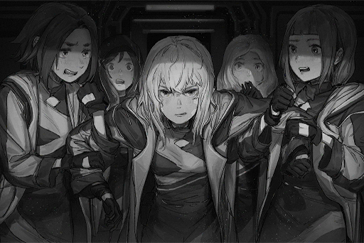

_\[→Sign/̷̢̛҉2̧̧̛͢͡ź̴̷̵p̸͡͠2̧̧̛͢͡ź̴̷̵\]hes\]_

**ConneR** 
Huuuhhh! Ha! Ha... Ha...

**Sasha** 
R!? You okay!?

**ConneR** 
I'm... fine.

**Sasha** 
So? DId you succeed!?

**ConneR** 
I'm... not sure.

**Sasha** 
... Eh?

**ConneR** 
Ivy...? 
What did I... just see...?

**Sasha** 
......?

**ConneR** 
This algorithm is no good... It can't read the complete data... 
However, at the very least, it confirms that I'm not completely insane... Haha...

**Sasha** 
Then...

**ConneR** 
That face... I think I've seen it somewhere? 
Sorry, I got to do a quick investigation first...

**Sasha** 
......?

_\[→Signal Switches\]_

**[News Clip]** 
_... Tower, a serious accident occurred. Due to a suspected mistake of the on\-site construction staff, a fence cracked and broke off, causing a five\-year old girl named Vivian Rose to almost fall off the platform. Fortunately, a mysterious female came to her rescue..._

**ConneR** 
......

**[News Clip]** 
_... That's right. And then that lady over there made this super far jump to finally grab that little girl's hand._

**[News Clip]** 
_This distance...?_

**[News Clip]** 
_It's true! I saw it with my own eyes!_

**ConneR** 
...... 
Is that you...? Architect.

_\[Signal Lost\]_

[*(Click here to go back to the top)*](#toc)

## <a id="cos064"/>\[#064\] Audio\_13St35\_702\_12\_17
### Requirements
|Character |Level|
|----------|:---:|
|**ConneR**| 47  |

### Log Content
**ConneR** 
Hoho, compared to a few years ago, it seems that this area hasn't changed one bit. Still as captivating as ever... The vines on that towering church seem a bit more dense, no? Tsk tsk, they've done a good job taking care of it.

**Sasha** 
Are you a tourist or something? Don't get too close. That's a historic site from a long time ago. Everyone here cherishes it immensely.

**ConneR** 
I understand. Don't forget that I was quite active here some time ago. Hoho? The apartment complex next to it is half\-collapsed... It was built by the Architects, wasn't it? No wonder nobody liked it.

**Sasha** 
You seem quite relaxed... I would never guess that someone's coming to arrest you.

**ConneR** 
Are you concerned about me? No need to worry. That will bring some much\-needed joy to my journey.

**Sasha** 
The leader of the team is an elite, right? If it's someone who can get even you to talk with such high praise, there's no way he's someone that can be dealt with easily.

**ConneR** 
......Taking our relationship into consideration, I would indeed prefer to not face Mr. Sagar... However, they most likely are tracking me fervently as we speak.

**Sasha** 
……? 
I'm not too clear about the relationship between you guys. It's just that you went through quite a lot to get this new information. I'm sure you're not willing to get captured in a place like this.

**ConneR** 
_\*chuckles\*_... You never know... Node 13 is a nice place. It's always been a dream of mine to spend my final years here. Of course, if there was someone by my side to accompany me, well, I could think of nothing better.

**Sasha** 
Yea, yea. Whatever makes you happy. Speaking of which, I've heard that the Neumann family is quite famous here...

**ConneR** 
This is indeed true. Since you're aware of this, you must also be privy to the relationship between this place and the Neumann family?

**Sasha** 
You mean that ancestor of yours?

**ConneR** 
That's correct. Rald Neumann... During those years, he was very much considered something of a hero figure in this ancient city. Thanks to his legacy, even though I was born in Node 08, I'm able to do as I please here. Mr. Sagar is going to have quite the task ahead of him, starting from just trying to get around.

**Sasha** 
Haha, when I first came to Node 13, I was interrogated for quite some time as well. Despite me keep telling them that I was here to do research... It wasn't until just recently that I finally established a nice relationship with my neighbors.

**ConneR** 
Let me guess. They confiscated your cell phone?

**Sasha** 
And they still haven't given it back to this day... I'm guessing they never will.

**ConneR** 
"Electrical appliances that possess the function to connect to the internet system are grade 1 restricted items in this Node." That's pretty much where things are… The so\-called "ANTITECH" is much more than just a simple catchphrase in Node 13 these days.

**Sasha** 
To be honest, you get used to it after living here for a while. The people here merely have a more extreme view on technology. Life may be inconvenient, but people here are willing to help each other get through hard times. As of now, I'm even starting to regret the fact that I didn't come back sooner.

**Sasha** 
Haha, who would've thought a world like this existed...? The old me would've never been able to imagine it.

**ConneR** 
People will always change, including the things they value. Don't you agree?

**Sasha** 
That's for sure. After taking a look at you I'm even more sure. When you get the time, take a look in a mirror.

**ConneR** 
_\*chuckles\*_... That tongue of yours is as sharp as ever...... We're here. 
Guten Tag.

**Man** 
Danke schön, Mr. Neumann. Your delivery is in tent number 9.

**ConneR** 
Perfect, as always. Truly, thank you.

*\[Footsteps\]*

**Sasha** 
... When I first heard you talk about it, I thought you were joking. I never thought Node 13 would have a place like this.

**ConneR** 
This is a mobile trading post for illegal excavators and distributors. Only those on the inside can get this information. Everyone makes payments in advance and secretly passes on the information concerning time and location. On the scheduled date, everyone arrives to pick up own goods, that way it's completely safe.

**Sasha** 
Quite an impressive system... How is the information passed?

**ConneR** 
Trade secret. 
Ah, here's my "ride". I'll take it to the pick\-up station on the border. That way, they won't be able to track me... I hope Mr. Sagar won't feel too bad about this.

*\[Horse Neighs\]*

**Sasha** 
Wah! What a fierce horse...

**ConneR** 
Don't worry. I'm an expert at dealing with them. The more ferocious the horse, the more I like it. Hyah!

**Sasha** 
Not bad! Haha, I've known you for so long and yet you still always manage to surprise me... You really are quite the guy!

**ConneR** 
…… 
If you come with me, I can show you even more.

**Sasha** 
...... You being serious, R?

**ConneR** 
I'm sure you are aware. What we managed to uncover, it could very likely unleash a devastating nightmare upon mankind... The so\-called "justice" you acknowledge in your heart might just disappear from this world completely, in an instant.

**Sasha** 
…… 
Is that why you're going to do something about it? I didn't take you to be that kind of person.

**ConneR** 
Don't misunderstand me. It's just that there are some things I value that I don't want to see blown into the abyss. In the sea of sand that is human civilization, one can occasionally find a few pearls... wouldn't you agree?

**Sasha** 
I do agree... It's just, too far.

**ConneR** 
Oh?

**Sasha** 
If I was a bit younger, perhaps I'd let go of everything and just jump on the back of a horse. But what you speak of, to the person I am now, it's just way too far away... That's not the world I want to gaze upon, and I also have no intention to try to put the fate of all mankind on my shoulders... It's too much.

**Sasha** 
Instead, I'm here. Only after returning to Node 13, which basically has nothing, did I finally get to see more of this world... things I thought would never exist in this s\*\*\*hole world.

**ConneR** 
......

**Sasha** 
R, when the nightmare that you speak of arrives, knowing what I already know, I'll try my best to do something for the people here... However, compared to accompanying you on your path, I feel like helping these people is more suitable for the person I am now.

**ConneR** 
I see... You aren't giving up on finding the justice and peace that exist in your fantasies. Rather, you're doing everything in your power to make it a reality, right here.

**Sasha** 
I'm sorry, I've changed a lot, haven't I.

**ConneR** 
Haha, relax. 
The person you are now is still very much to my liking.

*\[Horse Neighs\]*

**ConneR** 
Well then, Auf Wiedersehen… partner.

**Sasha** 
... We shall meet again someday. 

_\[Signal Lost\]_

[*(Click here to go back to the top)*](#toc)

