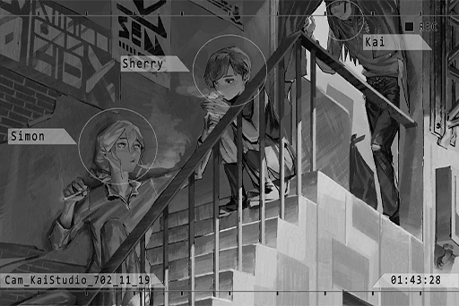

# Cam_KaiStudio_702_11_19
## Log Content
**[NEKO]** 
*... You be careful yourself too. Bye\-bye.*

*[Call Ends]*

*\[Door Opens\]*

**Cherry** 
I was wondering where you went. Turns out you're reporting your safety to NEKO.

**Xenon** 
... I was calling JOE.

**Cherry** 
Yeah, yeah.

**Xenon** 
He said that Punk is in his care now. You don't have to worry about it.

**Cherry** 
Man, his wallet is gonna take a beating. Punk eats twice as much food as the average cat. 
About PAFF... is everything alright?

**Xenon** 
I don't really understand the situation. If I wasn't in the state I am now, I could've helped... Nevertheless, let's leave it to NEKO for now. That brat has matured quite a bit too.

*\[Lights cigarette\]*

**Cherry** 
You got any more? Gimme one. I've finished mine.

**Xenon** 
Here.

*\[Door Opens\]*

**KAI** 
It's all squeaky clean now, captain.

**Xenon** 
Oh, good work. You can leave now.

**KAI** 
Haha, screw you. 
Seeing you two smoking outside the studio, what a nostalgic scene.

**Xenon** 
We haven't performed together in a very long time either.

**KAI** 
Wanna jam for a little? The instruments all still work.

**Cherry** 
Ehh\~ maybe tomorrow? Aren't you boys tired?

**KAI** 
I'm very much a night owl, and this guy barely sleeps at all in the first place.

**Cherry** 
Well, not the case for me. I really have to sleep now... I don't want my skin to get flaky.

**Xenon** 
Yeah. You can sleep first. Goodnight.

**Cherry** 
Goodnight.

*\[Door Closes\]*

**KAI** 
...... 
You two got back together?

**Xenon** 
... No.

**KAI** 
Ha, thought as much. Even if you two did, you wouldn't say anything either.

**Xenon** 
Too many things are happening right now. I don't have time to think about that stuff.

**KAI** 
About big sis... she's not the type of person who just casually relies on others. However, back then, everyone could actually tell that the cheerful and strong\-willed facade she put on was like armor to protect herself. If she didn't do that, her life would've been really, really tough...

**Xenon** 
......

**KAI** 
Although everyone always said that having a couple within the band will cause a lot of trouble, and you two did indeed cause us huge trouble... setting aside my position as the band leader, I was really thankful that you were by her side.

**Xenon** 
... Is that so? If we weren't together back then, perhaps things would have been a lot simpler...

**KAI** 
Even now, I am still not entirely certain about what happened between you guys. However, I know very well that she needs you.

**Xenon** 
......

*\[Footsteps\]*

**KAI** 
Think about it yourself.

**Xenon** 
Where are you going?

**KAI** 
Hmm? I'm going home. I'll leave this place to you.

**Xenon** 
Why are you giving me that perverted look...?

**KAI** 
Hehe... Bye\~

*[Signal Lost]*
