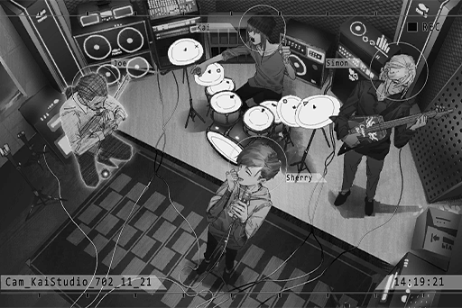

# Cam_KaiStudio_702_11_21
## Requirements
|   Character    |Level|
|----------------|:---:|
|**Crystal PuNK**|  3  |

## Unlocked Charts
|        Song         | Character  |Diff.|Level|
|---------------------|:----------:|:---:|:---:|
|**Sunshine Duration**|Crystal PuNK|Chaos| 12  |

## Log Content
*\[Browsing data\]*

**Xenon** 
Morning.

**KAI** 
Morning? It's noon already. Big sis still sleeping?

**Xenon** 
Yep.

**KAI** 
I bought you guys some food. Here.

**Xenon** 
Thanks. 
What are you doing?

*\[Browsing data\]*

**KAI** 
Hmm? Nothing much. Just scrolling through some of the news I collected. People going missing is a pretty common occurrence in 03. I've long developed a habit of collecting information on these things. I helped out in some searches too. At the same time, I'm also checking to see if there are any investigations about you two. So far, things seem pretty safe.

**Xenon** 
Missing people... That's a lot. Has anyone ever been found?

**KAI** 
The chances are slim to none. However, this did indeed help some people return to their homes.

**Xenon** 
... There's even a child this small.

**KAI** 
This is the latest one, just listed a few days ago. I heard it from the old man at the food stall over there. Apparently, there's a giant robot asking people on the streets about her.

**Cherry** 
Morning... *\*Yawn\**\~\~ So sleepy... Waah! KAI is here as well...!?

**Xenon** 
... Why are you only wearing that? At least put on some pants!

**Cherry** 
I'm sorry...!

**KAI** 
...... 
Hehehe...

**Xenon** 
... What? Why that face?

**KAI** 
LOTS\~ of things happened last night, didn't it?

**Xenon** 
Nothing happened. We didn't even sleep in the same room.

**KAI** 
Blah, blah, blah\~

**Xenon** 
... You little...

**KAI** 
Oh, right. I contacted JOE to schedule a jam later. He'll be here via connection. The projection is all set up.

**Xenon** 
Later, is it...?

**KAI** 
You guys have been really tense these days. A bit of relaxation won't hurt.

**Xenon** 
Yeah. You're right.

*[»»» Fast Forward»»»]*

*\[Performance\]*

**KAI** 
Stop stop STOP! JOE, what the f\*\*\* are you playing? You really haven't been practicing these years, haven't you?

**[JOE]** 
*What the hell are you talking about? My performance was spot on, okay? It's a lag from the connection, right?*

**KAI** 
Spot\-on my a\*\*, you s\*\*\*head. Play that previous part again and then we can talk.

*\[Bass performance\]*

**KAI** 
......

**[JOE]** 
*Eh...? So I guess it really was me who messed up.*

*\[Throws drumstick\]*

**[JOE]** 
*Muhaha, unfortunately for you, I'm a projection now! Your drumsticks are not very effective against me! Check out my Shadow C\*\*\*\* Technique! Muhahaha!*

**Cherry** 
Ahaha! What the hell?

**Xenon** 
Even the once amazing Crystal PuNK has fallen to this level...

**Cherry** 
Haha, I don't mind just playing around. I really enjoy this. I haven't felt like this in a long time.

**[JOE]** 
*Is big sis not happy in Cherry PuNK?*

**Cherry** 
It's not like I'm unhappy. It's just that the rehearsals for entertainment agencies are all really standardized. It feels completely different than the casual feel we had when we were still an underground band.

**Xenon** 
I haven't practiced with real people in a long time as well.

**[JOE]** 
*Hehe, those shabby robots are no match for us after all, right?*

**Xenon** 
If a particular someone doesn't keep messing up the root, I would agree.

**[JOE]** 
*Hey, the ones just now don't count. The BASS God of Quadrant III is about to get serious! One more time!*

*\[Performance\]*

**Xenon** 
You finally got it right...

**[JOE]** 
*Hoho, not bad! This is it! This is the feeling!*

**KAI** 
Hey, serious talk now. Do you guys want to host another music festival? You know, the one we never got to host.

**[JOE]** 
*Of course! With our teamwork, we'll return to our peak form in no time!*

**Xenon** 
JOE, stop chitchatting. Your rhythm is off.

**[JOE]** 
*Waahh... It's a connection problem!*

**Cherry** 
Hahahaha! Hahaha!

*[Signal Lost]*