# Crystal PuNK OS Logs
## <a id="toc"/>List of Logs
- [[#001] Audio\_Sewer\_702\_11\_18](#cpos001)
- [[#002] Audio\_KaiStudio\_702\_11\_19](#cpos002)
- [[#003] Cam\_KaiStudio\_702\_11\_19](#cpos003)
- [[#004] Audio\_KaiStudio\_702\_11\_20](#cpos004)
- [[#005] Cam\_KaiStudio\_702\_11\_21](#cpos005)
- [[#006] Audio\_KaiStudio\_702\_11\_22](#cpos006)
- [[#007] Audio\_RuinZone\_702\_11\_25](#cpos007)
- [[#008] Multi\_File\_CP008](#cpos008)
- [[#009] Audio\_Luis\_689\_08\_22](#cpos009)
- [[#010] Audio\_Butsudou\_702\_11\_22](#cpos010)
- [[#011] Audio\_SusukiSt\_702\_11\_24](#cpos011)
- [[#012] Cam\_SusukiSt\_702\_11\_24\_1](#cpos012)
- [[#013] Cam\_SusukiSt\_702\_11\_24\_2](#cpos013)
- [[#014] Audio\_KaiStudio\_702\_12\_01](#cpos014)
- [[#015] Audio\_Bookstore\_702\_12\_02](#cpos015)
- [[#016] Audio\_KyuuLab\_702\_12\_02](#cpos016)
- [[#017] Cam\_Nora\_702\_12\_02](#cpos017)
- [[#018] Audio\_Nora\_702\_12\_02](#cpos018)
- [[#019] Audio\_Kyuu\_702\_12\_05](#cpos019)
- [[#020] Audio\_KyuuLab\_702\_12\_07](#cpos020)
- [[#021] Audio\_Nora\_702\_12\_08](#cpos021)
- [[#022] Multi\_File\_CP022](#cpos022)
- [[#023] Cam\_Kyuu\_702\_12\_10](#cpos023)
- [[#024] Cam\_Cafe\_702\_12\_10](#cpos024)
- [[#025] Audio\_Nora\_702\_12\_10\_1](#cpos025)
- [[#026] Audio\_Nora\_702\_12\_10\_2](#cpos026)
- [[#027] Audio\_KyuuLab\_702\_12\_11](#cpos027)
- [[#028] Cam\_Nora\_702\_12\_14](#cpos028)
- [[#029] Audio\_Kyuu\_702\_12\_14\_1](#cpos029)
- [[#030] Audio\_Kyuu\_702\_12\_14\_2](#cpos030)
- [[#031] Cam\_Ward\_702\_12\_14](#cpos031)
- [[#032]  Audio\_Kyuu\_702\_12\_15\_1](#cpos032)
- [[#033] Cam\_Ward\_702\_12\_15](#cpos033)
- [[#034] Audio\_Kyuu\_702\_12\_15\_2](#cpos034)
- [[#035] Message\_JOE\_702\_12\_21](#cpos035)
- [[#036] Audio\_KaiStudio\_702\_12\_24](#cpos036)
- [[#037] Audio\_Trans\_03\_702\_12\_26](#cpos037)

## <a id="cpos001"/>[#001] Audio\_Sewer\_702\_11\_18
### Log Content
*\[Moves heavy stuff\]*

**KAI** 
Here, gimme your hand.

**Cherry** 
I can climb it myself just fine.

**Xenon** 
We're really here... Node 03.

**KAI** 
Welcome.

**Xenon** 
KAI... It's been a long time.

**KAI** 
Yeah. I've heard everything from JOE.

**Cherry** 
Everything, is it...?

**Xenon** 
I'm really sorry. Never had the chance to properly explain things to you.

**KAI** 
Nah, it's fine. Like you've always said "That's all in the past now.", right?

**Cherry** 
Sorry... Why are you still willing to help us even after knowing all those things?

**KAI** 
Why... No particular reason really. We're friends, right? Even though we haven't been in contact for so many years, our friendship is still there, at least that's what I believe.

**Xenon** 
KAI...

**KAI** 
Besides, I'm a kid who grew up in Node 03. I've seen what real "bad guys" are like. Compared to them, what you guys did is nothing noteworthy at all.

**Cherry** 
......

**KAI** 
Now that you guys are here, you don't need to worry about that stuff anymore. The rules here are completely separated from other Nodes. That's why there are so many hardcore guys gathered here. I'd advise you guys to be more careful yourself too.

**Xenon** 
Got it. Is there a place we can stay for now?

**KAI** 
Come with me. There's an instrument storage room we don't use anymore. You guys can stay there temporarily.

**Xenon** 
"Mountain Breeze Musique", is it?

**KAI** 
Yep. After I came back, I took over my parents' business. We've got more and more branch locations in other places. You guys probably saw the branch in 08, right? In short, I'm doing pretty well these days.

**Cherry** 
Good to hear!

**KAI** 
However, the music environment here is still nowhere near as free as 08. Anything that involves money and benefits will be placed under scrutiny by the admins... *\*Sigh\**, I really miss the band days with you guys.

**Cherry** 
The opportunity will definitely come! After all of this is over and Simon is proven innocent... we can start from zero, right?

**Xenon** 
... Yes. We still have yet to achieve our goal of hosting a music festival together.

**KAI** 
Haha, you don't get to talk. You two breaking up really screwed me over back then.

**Xenon** 
Hey, I said I was sorry.

**Cherry** 
We're really, really sorry!

**KAI** 
... I was just kidding. I'm relieved to see that both of you haven't changed much.

**Cherry** 
Expecting any sort of change from this blockhead is basically a pipe dream.

**Xenon** 
Don't ruffle my hair.

**KAI** 
Haha, same goes for you, big sis.

**Cherry** 
Eh? Me? I've changed quite a bit, right? I even cut my hair...

**KAI** 
No, what I mean is that after experiencing all those things, you are still oozing so much positive energy, just like you were back then. It gives people this lively energy that's hard to describe... I can still hear these things in your current music.

**Cherry** 
... Haha, what the heck? I'm... not that great of a person.

**KAI** 
I'm serious. In a place like 03... I've seen many people who never dug themselves out of the hole after tasting what it's like to be evil. "Change the world with our power"... perhaps those days back then were the only time we could say stuff like that.

**Cherry** 
......

**KAI** 
Compared to me, both you and Simon are still working hard to spread your music. JOE is also trying to find a place in that circle in his own way. I'm the only one who's still just going with the flow. In all honesty, I'm a little jealous of you guys, be it back then or right now.

**Xenon** 
KAI, could it be... that you've experienced some bad things yourself too?

**KAI** 
Pfft, please, I'm a rare model citizen of 03. Sheltering you two bastards like this is probably the most "evil" thing I've ever done.

**Cherry** 
Thanks...

**KAI** 
Speaking of which, big sis, how are you gonna handle your business in 08? You know, the performances and stuff.

**Cherry** 
No worries. The next string of events is all done in the virtual internet. I can take care of them from here.

*\[Drones flying\]*

**Cherry** 
Look out! Patrol drones!

**KAI** 
Oh? That? Nah, no need to be scared. The admins here only mind their own business. Even if you stab someone on the streets, they'll completely ignore it. Of course, that depends on who you stabbed.

**Xenon** 
Are you serious... I've visited 03 before, never noticed how bad the public security here was...

**KAI** 
You've been here before?

**Xenon** 
Yeah. Last year, I came here with NEKO to participate in a new year's event.

**KAI** 
NEKO? Oh, that famous cyTuber.

**Cherry** 
......

**KAI** 
We're here. Come on in. I must warn you though, it's really dirty inside. You guys might have to clean it up a bit.

*\[Signal Lost\]*

[*(Click here to go back to the top)*](#toc)

## <a id="cpos002"/>[#002] Audio\_KaiStudio\_702\_11\_19
### Log Content
*\[Door Opens\]*

**Xenon** 
Yikes, you weren't kidding about this place being dirty...

**KAI** 
Welp, told you we haven't used it in a long time. If it really bothers you, we can clean it, since we have no idea how long you guys are staying.

**Cherry** 
We're likely staying until that guy contacts us. If we want to clear Simon's name, we must investigate and find out the truth.

**KAI** 
But you're in 03 now, how are you going to investigate? Doesn't this put you further and further away from the incident?

**Cherry** 
R must have his own ideas. Right now, we can only trust him. 

**Xenon** 
The Æsir incident didn't just occur in 08. The cyTus malfunction and the subsequent damage caused was a worldwide event. Judging from his hypothesis, all of this is connected, and the actual scale might be much larger than any of us imagined.

**KAI** 
That R... Based on what I heard from JOE, he is a pretty dangerous person. You guys seem to trust him a lot?

**Cherry** 
On our way here, we were stuck at the automatic transportation hub for an entire week. Without his help, we never would've survived... Although I still don't understand him at all, I feel like he's not really a bad person... I think.

**Xenon** 
Hey, do you only have brooms? Where are the rags?

**KAI** 
So you really started cleaning... Even the clean freak part of you didn't change.

**Cherry** 
Let me help out too.

*\[»»» Fast Forward»»»\]*

**KAI** 
Whew\~ That's more than enough, right? Didn't think this equipment and instruments are still able to function.

**Cherry** 
Where's Simon?

**KAI** 
He said he's going outside to make a phone call, so he took my phone and ran outside.

*\[→Signal Switches\]*

*\[Call Starts\]*

**Xenon** 
It's me.

**[JOE]** 
*Oh! You're using KAI's phone. So this means you guys are safe?*

**Xenon** 
Yes, we are safe, so far at least. Thanks.

**[JOE]** 
*No problemo\~ 
Big sis' cat is also with me. Tell her not to worry.*

**Xenon** 
Got it. If anything happens, I'll contact you again.

**[JOE]** 
*Ah, one more thing. NEKO and PAFF are staying at my place right now. Do you want to talk to her? *

**Xenon** 
... Yeah.

**[JOE]** 
*NEKO... NEKO! Wake up!*

**[NEKO]** 
*Muuuuu.... ten more minutes...*

**[JOE]** 
*It's a call from Xenon\~*

**[NEKO]** 
*None*

**Xenon** 
... Are you sleeping? Isn't it suppose to be daytime over there?

**[NEKO]** 
*You're safe... thank goodness! Ah! Right! Do you know! Aroma\-chan... no! PAFF is...!*

**Xenon** 
I've heard it from JOE. Are you guys also coming to 03 soon?

**[NEKO]** 
*Yep. Someone will help us get there. We plan to depart for 03 tomorrow.*

**Xenon** 
Understood. Take care of yourself.

**[NEKO]** 
*Where are you guys now? How are we going to meet up?*

**Xenon** 
Meet up? No, I think it's better if we don't meet up for now. There are still too many things we're not certain about. We should keep a low profile for a while.

**[NEKO]** 
*Muuu... You two know nothing about that place. Isn't it better to have someone like NEKO around?*

**Xenon** 
You still have to deal with PAFF's issues, right? We have friends from 03 here to help us. We'll be fine.

**[NEKO]** 
*Muuu...*

**Xenon** 
That's it for now. I will contact you again. Be careful yourself. Don't get into trouble again, understand?

**[NEKO]** 
*I'm not THAT careless!*

**[NEKO]** 
*... You be careful yourself too. Bye\-bye.*

*\[Call Ends\]*

*\[Signal Lost\]*

[*(Click here to go back to the top)*](#toc)

## <a id="cpos003"/>[#003] Cam\_KaiStudio\_702\_11\_19
### Log Content
**[NEKO]** 
*... You be careful yourself too. Bye\-bye.*

*\[Call Ends\]*

*\[Door Opens\]*

**Cherry** 
I was wondering where you went. Turns out you're reporting your safety to NEKO.

**Xenon** 
... I was calling JOE.

**Cherry** 
Yeah, yeah.

**Xenon** 
He said that Punk is in his care now. You don't have to worry about it.

**Cherry** 
Man, his wallet is gonna take a beating. Punk eats twice as much food as the average cat. 
About PAFF... is everything alright?

**Xenon** 
I don't really understand the situation. If I wasn't in the state I am now, I could've helped... Nevertheless, let's leave it to NEKO for now. That brat has matured quite a bit too.

*\[Lights cigarette\]*

**Cherry** 
You got any more? Gimme one. I've finished mine.

**Xenon** 
Here.

*\[Door Opens\]*

**KAI** 
It's all squeaky clean now, captain.

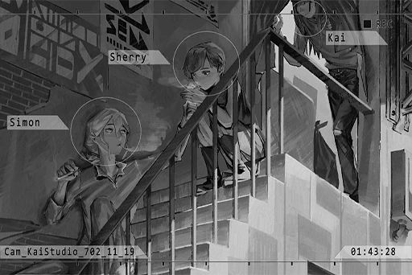

**Xenon** 
Oh, good work. You can leave now.

**KAI** 
Haha, screw you. 
Seeing you two smoking outside the studio, what a nostalgic scene.

**Xenon** 
We haven't performed together in a very long time either.

**KAI** 
Wanna jam for a little? The instruments all still work.

**Cherry** 
Ehh\~ maybe tomorrow? Aren't you boys tired?

**KAI** 
I'm very much a night owl, and this guy barely sleeps at all in the first place.

**Cherry** 
Well, not the case for me. I really have to sleep now... I don't want my skin to get flaky.

**Xenon** 
Yeah. You can sleep first. Goodnight.

**Cherry** 
Goodnight.

*\[Door Closes\]*

**KAI** 
...... 
You two got back together?

**Xenon** 
... No.

**KAI** 
Ha, thought as much. Even if you two did, you wouldn't say anything either.

**Xenon** 
Too many things are happening right now. I don't have time to think about that stuff.

**KAI** 
About big sis... she's not the type of person who just casually relies on others. However, back then, everyone could actually tell that the cheerful and strong\-willed facade she put on was like armor to protect herself. If she didn't do that, her life would've been really, really tough...

**Xenon** 
......

**KAI** 
Although everyone always said that having a couple within the band will cause a lot of trouble, and you two did indeed cause us huge trouble... setting aside my position as the band leader, I was really thankful that you were by her side.

**Xenon** 
... Is that so? If we weren't together back then, perhaps things would have been a lot simpler...

**KAI** 
Even now, I am still not entirely certain about what happened between you guys. However, I know very well that she needs you.

**Xenon** 
......

*\[Footsteps\]*

**KAI** 
Think about it yourself.

**Xenon** 
Where are you going?

**KAI** 
Hmm? I'm going home. I'll leave this place to you.

**Xenon** 
Why are you giving me that perverted look...?

**KAI** 
Hehe... Bye\~

*\[Signal Lost\]*

[*(Click here to go back to the top)*](#toc)

## <a id="cpos004"/>[#004] Audio\_KaiStudio\_702\_11\_20
### Requirements
|   Character    |Level|
|----------------|:---:|
|**Crystal PuNK**|  2  |

### Log Content
*\[Ringtone\]*

**Cherry** 
... It's that guy.

**Xenon** 
Let me answer it.

*\[Call Starts\]*

**Xenon** 
Hello?

**[Rald]** 
*Mr. Jackson? I thought I called Miss Pauline's number.*

**Xenon** 
So what? Any progress with the investigation?

**[Rald]** 
*Ooh, such a hostile attitude. Should I remind you who kept you two alive for an entire week not too long ago?*

**Xenon** 
Okay okay\~ Thanks\~ 
You told me not to actively connect back to investigate the Æsir incident. That's why I'm waiting here in 03 like an idiot. If we don't get going soon...

**[Rald]** 
*No need to rush. I just arrived in Node 13 not too long ago. It's quite difficult to find a place with a powerful enough signal here. It's definitely a lot more difficult than walking into a bar and ordering pork knuckles with a light beer, that much I can say for sure.*

*\[Drinks wine\]*

**Xenon** 
... And this is your investigation? Stop messing around. Now's not the time for you to be causally sightseeing.

**[Rald]** 
*I'm kidding. I still have to eat. Can't do anything with an empty stomach, right?*

**Xenon** 
... I'm hanging up.

*\[Drinks wine\]*

**[Rald]** 
*Haha, quite hot\-blooded, aren't you? 
Like I just said, I'm preparing to do some historical investigations and finish some research that was left unfinished from my previous stay here. My goal is to verify my speculations. This requires time, luck, preparation, and a little adventure.*

**Xenon** 
Don't forget about your right arm and right eye. The Exploration Team won't just happen to pass by there to save you every time.

**[Rald]** 
*Thank you for being concerned about little old me, but no worries. I've always been pretty lucky.*

**Xenon** 
I'm concerned about the information you can provide. If you don't get any results on your side, we can't continue on our side, right?

**[Rald]** 
*\*Chuckles\* Rest assured. After the time I spent together with you guys, I've understood the importance of teamwork. I won't be a lone wolf and do everything by myself this time. Perhaps I'll find myself a trusty partner.*

**Xenon** 
Whatever you do. All in all, you better hurry.

**[Rald]** 
*I know. About the next mission for you two to do in 03...*

**Xenon** 
"The Eye of Horus", right? I did a quick investigation according to the hints you provided. Such a person does indeed exist. This person has the ability to access digital information in the internet space, including ancient files that no one knows about anymore.

**[Rald]** 
*... Now that's quite surprising. You already knew about this?*

**Xenon** 
This is all the info I can get. In 03, this seems to be a very well\-known urban legend among members of the underground society. 
Even though we can't confirm the authenticity of this... does someone like this really exist? It doesn't sound scientific at all.

**[Rald]** 
*Aren't the most interesting parts of science the ones we know nothing about? Known science is one of the most boring things in this world.*

**Xenon** 
......

**[Rald]** 
*Allow me to remind you once again. Your current situation is not a suitable one for you to conduct more investigations. Add to that the unstable nature of 03 and any careless action is a foolish one, not to mention something as idiotic as coming in direct contact with the gangs.*

**Xenon** 
Then do you have any advice, wilderness survival expert?

**[Rald]** 
*\*Chuckles\* I do. Listen carefully. 
"Wait for my next contact."*

**Xenon** 
......

**[Rald]** 
*My food order is coming. Apologies, Mr. Jackson, but I have to go now.*

**Xenon** 
Are you for real? You're not taking this seriously...

**[Rald]** 
*Ah, one more thing.*

**Xenon** 
?

**[Rald]** 
*Your account got frozen, right? I'll send you one later. Feel free to use the money in there however you desire. With the garbage equipment you two have right now, I can't imagine that you'll be much of any help.*

*\[Call Ends\]*

**Xenon** 
... And here I thought he can't get more self\-centered than he already was.

*\[Signal Lost\]*

[*(Click here to go back to the top)*](#toc)

## <a id="cpos005"/>[#005] Cam\_KaiStudio\_702\_11\_21
### Requirements
|   Character    |Level|
|----------------|:---:|
|**Crystal PuNK**|  3  |

### Log Content
*\[Browsing data\]*

**Xenon** 
Morning.

**KAI** 
Morning? It's noon already. Big sis still sleeping?

**Xenon** 
Yep.

**KAI** 
I bought you guys some food. Here.

**Xenon** 
Thanks. 
What are you doing?

*\[Browsing data\]*

**KAI** 
Hmm? Nothing much. Just scrolling through some of the news I collected. People going missing is a pretty common occurrence in 03. I've long developed a habit of collecting information on these things. I helped out in some searches too. At the same time, I'm also checking to see if there are any investigations about you two. So far, things seem pretty safe.

**Xenon** 
Missing people... That's a lot. Has anyone ever been found?

**KAI** 
The chances are slim to none. However, this did indeed help some people return to their homes.

**Xenon** 
... There's even a child this small.

**KAI** 
This is the latest one, just listed a few days ago. I heard it from the old man at the food stall over there. Apparently, there's a giant robot asking people on the streets about her.

**Cherry** 
Morning... *\*Yawn\**\~\~ So sleepy... Waah! KAI is here as well...!?

**Xenon** 
... Why are you only wearing that? At least put on some pants!

**Cherry** 
I'm sorry...!

**KAI** 
...... 
Hehehe...

**Xenon** 
... What? Why that face?

**KAI** 
LOTS\~ of things happened last night, didn't it?

**Xenon** 
Nothing happened. We didn't even sleep in the same room.

**KAI** 
Blah, blah, blah\~

**Xenon** 
... You little...

**KAI** 
Oh, right. I contacted JOE to schedule a jam later. He'll be here via connection. The projection is all set up.

**Xenon** 
Later, is it...?

**KAI** 
You guys have been really tense these days. A bit of relaxation won't hurt.

**Xenon** 
Yeah. You're right.

*\[»»» Fast Forward»»»\]*

*\[Performance\]*

**KAI** 
Stop stop STOP! JOE, what the f\*\*\* are you playing? You really haven't been practicing these years, haven't you?

**[JOE]** 
*What the hell are you talking about? My performance was spot on, okay? It's a lag from the connection, right?*

**KAI** 
Spot\-on my a\*\*, you s\*\*\*head. Play that previous part again and then we can talk.

*\[Bass performance\]*

**KAI** 
......

**[JOE]** 
*Eh...? So I guess it really was me who messed up.*

*\[Throws drumstick\]*

**[JOE]** 
*Muhaha, unfortunately for you, I'm a projection now! Your drumsticks are not very effective against me! Check out my Shadow C\*\*\*\* Technique! Muhahaha!*

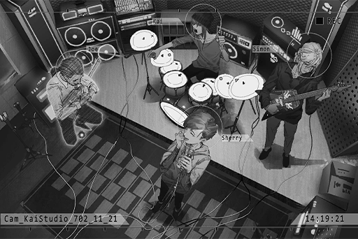

**Cherry** 
Ahaha! What the hell?

**Xenon** 
Even the once amazing Crystal PuNK has fallen to this level...

**Cherry** 
Haha, I don't mind just playing around. I really enjoy this. I haven't felt like this in a long time.

**[JOE]** 
*Is big sis not happy in Cherry PuNK?*

**Cherry** 
It's not like I'm unhappy. It's just that the rehearsals for entertainment agencies are all really standardized. It feels completely different than the casual feel we had when we were still an underground band.

**Xenon** 
I haven't practiced with real people in a long time as well.

**[JOE]** 
*Hehe, those shabby robots are no match for us after all, right?*

**Xenon** 
If a particular someone doesn't keep messing up the root, I would agree.

**[JOE]** 
*Hey, the ones just now don't count. The BASS God of Quadrant III is about to get serious! One more time!*

*\[Performance\]*

**Xenon** 
You finally got it right...

**[JOE]** 
*Hoho, not bad! This is it! This is the feeling!*

**KAI** 
Hey, serious talk now. Do you guys want to host another music festival? You know, the one we never got to host.

**[JOE]** 
*Of course! With our teamwork, we'll return to our peak form in no time!*

**Xenon** 
JOE, stop chitchatting. Your rhythm is off.

**[JOE]** 
*Waahh... It's a connection problem!*

**Cherry** 
Hahahaha! Hahaha!

*\[Signal Lost\]*

[*(Click here to go back to the top)*](#toc)

## <a id="cpos006"/>[#006] Audio\_KaiStudio\_702\_11\_22
### Requirements
|   Character    |Level|
|----------------|:---:|
|**Crystal PuNK**|  4  |

### Log Content
**[TV]** 
*The reporter is at 33rd Boulevard of the Kamikawa area right now. As our viewers can see right now, this is the chaos caused by a complete failure of all traffic lights and some drones experiencing shutdowns or showing abnormal actions. As of now, the Administration Bureau has removed the malfunctioned machines. The reason for the malfunction is still yet to be known. Although this incident didn't cause any harm to security, a blockade line is still drawn and civilians are asked to stay as far away from this area as possible. Similar small\-scale malfunctions also occurred a few days ago at...*

**Xenon** 
This is the news here?

**Cherry** 
Yeah... This reminds me of something; during our stay at the transportation hub, similar incidents occurred in 08 as well.

**Xenon** 
... The actions of these drones...

**Cherry** 
You noticed anything?

**Xenon** 
No... I'm still not certain. These drone models are completely different from the ones in 08. 
But... I have a bad feeling about this.

**Cherry** 
My mom... was a victim of a drone malfunction too...

*\[→File Switches: Luis\_681\_01\_08\]*

*\[Singing\]*

**Cherry** 
It's so good\~ Mommy! Sing some more\~

**Carly** 
Sure\~

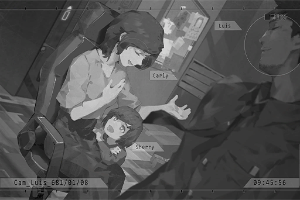

**Cherry** 
Mommy, why are you so good at singing?

**Luis** 
It really is a shame that you didn't become a singer for how amazing your voice is.

**Cherry** 
Singer...?

**Luis** 
Yes, someone who can stand on a big stage and sing to many people, making everyone mesmerized. Daddy was first attracted to mommy because of her singing voice. In a bustling transportation center, I suddenly heard this beautiful voice coming from afar. 

**Carly** 
Awww! What are you saying in front of the child? Ah, are you leaving already? It's still pretty early.

**Luis** 
After you changed to part\-time shifts, my workload practically doubled...

**Carly** 
Oh, SORRY about that!

**Cherry** 
Is daddy going to work?

**Luis** 
That's right. Do you want to come with daddy? You'll get to see all kinds of people from all over the world at the transportation center.

**Carly** 
Stop talking this nonsense... Ah, Luis, look at you. Your necktie is all messed up.

**Luis** 
Oh, thank you, Carly. Then I'll be on my way. Love you.

*\[Door Opens\]*

**Carly** 
Hmph, what singer? You can't do anything without me around. Always saying such dumb things... hehehe.

**Cherry** 
Mommy, you want to be a singer...?

**Carly** 
... Idiot, right now, mommy needs to work, take care of this family and take care of you. Mommy is very happy right now.

**Cherry** 
Hmm... mommy needs to take care of me... then I'll be a singer when I grow up! Mommy, teach me how to sing\~

**Carly** 
Hahaha, can you really do it? Alright then, let's begin!

*\[→File Switches: St68\_681\_12\_09\]*

**[Luis]** 
*Carly, I'm getting off work soon. Where are you now?*

**Carly** 
I'm on our way home too. Sorry for dumping all the work onto you... I just bought the ingredients for dinner. Ah, I also bought Sherry's cake, look. She got first place in her music classroom. She deserves a good reward.

**[Luis]** 
*Haha, the strawberry cake from Giraffe House, is it? She'll be very happy when she sees it.*

**Carly** 
Don't spill the beans when you pick her up though. I want to give her a surprise.

*\[Commotion\]*

**[Luis]** 
*... What's the matter? What's that noise?*

**Carly** 
No idea... I think there's a car accident ahead...?

**[Enforcer Drone]** 
*You are... causing harm to civilians. P\-p\-please...stop...*

**Carly** 
Eh...? Are there criminals? How scary...

**[Luis]** 
*You should stay away...*

*\[Drone flying\]*

**[Enforcer Drone]** 
*You are causing... h\-hhhharm to ccivilians. P\-please... stop...*

**Carly** 
M... me? It must be some kind of misunderstanding. I didn't do any...

**Agent A** 
Miss! Stay away from that drone! Get as far away as you can!

**Agent A** 
This is Squad 06 Law Enforcement agent Andrew Wood! A LE\-110 has been hit by a criminal and has malfunctioned. Request technician support to shut down its program!

*\[Gunshot\]*

**Carly** 
Eek!!

**[Luis]** 
*Carly!?*

**Agent A** 
Damnit... did I miss? This is Squad 06 agent Andrew Wood! Anyone hear me!?

**Agent A** 
Miss! Please leave immediately!

**Carly** 
O... okay!

*\[Running\]*

*\[Fall down\]*

**Carly** 
Ah... the cake...

**[Enforcer Drone]** 
*You are...... Stop...... Initiate Law Enforcement Procedure...*

*\[Machine Gun\]*

**[Luis]** 
*Carly！ ？ Carly！ ！ ！ *

*\[Signal Lost\]*

[*(Click here to go back to the top)*](#toc)

## <a id="cpos007"/>[#007] Audio\_RuinZone\_702\_11\_25
### Requirements
|   Character    |Level|
|----------------|:---:|
|**Crystal PuNK**|  5  |

### Log Content
*\[Machine Gun\]*

**Cherry** 
Any questions? This is more or less how it feels. Look, all within the center circle. Understood?

**Xenon** 
... Nope, not at all. By the way, don't people generally begin their practice with handguns? What's all this about? Showing off?

**Cherry** 
Haha, yep. Here, this one's for you.

**Xenon** 
Don't point the barrel at people...

**Cherry** 
Rest assured. These are all rubber bullets. Their trajectory will be a little lower than real bullets. Raise your hands... That's right, just like this.

**Xenon** 
... Does this count as you trying to molest me?

**Cherry** 
Why would I want to molest a skinny boy like you? Now pull the trigger.

*\[Gunshot\]*

**Cherry** 
... Huh, turns out you're quite talented at this!

**Xenon** 
It feels pretty much the same as the games we used to play.

**Cherry** 
Ah! So you were going easy on me back then after all? Interesting, let's have a match!

**Xenon** 
A match of what...? You want to start a gunfight here?

**Cherry** 
A target practice match, you dumba\*\*! Getting hit by these bullets still hurts like hell, you know?

*\[Gunshot\]*

**Xenon** 
Speaking of which... you really used that guy's money to buy all this stuff.

**Cherry** 
He told us to use it, so why not. Besides, he has a good point. You really need to learn how to protect yourself. Or else you'd be a complete liability when we're in action.

**Xenon** 
Don't forget who's the one that saved you back in the underground tunnels.

**Cherry** 
If I have to rely on your slow as f\*\*\* GAMEBAI, I can have infinite lives and it still won't be enough.

*\[Gunshot\]*

**Xenon** 
Judging from the number of bullseyes, my accuracy is a lot better than yours, isn't it? There's no point in practicing at all.

**Cherry** 
Idiot. Fire the shots consecutively. Empty this magazine.

*\[Consecutive Gunshots\]*

**Xenon** 
......? 
... The last few shots didn't even hit the target...

**Cherry** 
A real gun's recoil, weight, and the delay between each shot are all nowhere near as stable as they are in games. How do you feel? Your arms are starting to feel sore, right? What you just used is the smallest gun we have here too.

**Xenon** 
......

**Cherry** 
Did you forget what you told me when you were teaching me how to play the guitar? The "Empty Glass Mentality", never be boastful just because you have a little experience or talent.

**Xenon** 
... I just made that stuff up on the fly. However, your guitar skills did indeed improve greatly afterward. Guess I can't complain then.

**Cherry** 
Good. Now let's continue.

*\[Consecutive Gunshots\]*

**Xenon** 
Whew... This is a lot more exhausting than I thought.

**Cherry** 
Your stamina is way too low. 
Keep both feet as wide as your shoulders. Keep your back straight and don't hunch. Make sure your shoulders, elbows, and fingertips are on the same straight line. The moment you pull the trigger, relax your body as much as possible. This puts less stress on your body, thus it is less tiring.

*\[Gunshot\]*

**Xenon** 
It really is...

**Cherry** 
Hmph, I'm not a bad teacher, right?

**Xenon** 
Did Luis teach you all this?

**Cherry** 
......

*\[Consecutive Gunshots\]*

**Xenon** 
When I was little, because of some stupid reasons, I stole my father's gun. He gave me a serious beating after he found out.

*\[Consecutive Gunshots\]*

**Xenon** 
In all honesty, when we were stealing it, both Shannon and I were utterly terrified. We didn't even dare to disengage the safety. You were trained from a very young age by Luis, right? The first time you ever held a gun, did you feel as calm as you are now?

**Cherry** 
... Yeah. I don't think I was scared at all back then. All I thought about was that I'm helping out my father. Besides, the things we shot at were all machines too. He never assaulted a person...

**Xenon** 
... Except my father.

**Cherry** 
Simon...

*\[Consecutive Gunshots\]*

**Xenon** 
Only after actually holding one in my hands did I realize how heavy this thing is. 
The force of the bullet being fired... felt so real.

**Xenon** 
If I were in Luis's position, what would I do? If it was to protect you... I would probably pull the trigger as well.

**Cherry** 
......

**Xenon** 
However, how would it feel like then, when you realized that you've just killed a person?

*\[Consecutive Gunshots\]*

**Xenon** 
... Must've felt like s\*\*\*.

**Cherry** 
... Yeah.

**Xenon** 
When you're firing a gun... you look as if you're on stage. Strong\-willed, filled with confidence, and sometimes a little happy.

**Cherry** 
... I won't lie to you anymore. Indeed, to me, this is another thing that allows me to acknowledge who I am...

**Cherry** 
After we broke up, I once tried to throw all my guns into the river. Yet in the end, I still couldn't let them go... That's the only place where I feel more alive than when I'm on stage. I never even once considered the consequences of those actions either... or should I say I pretended to not know for my own sake. I'm horrible, aren't I...?

**Xenon** 
If, like your music, you can use this ability to help more people, perhaps it's not that horrible... What you need to let go of is not guns... but the past.

*\[Consecutive Gunshots\]*

**Cherry** 
......!

**Xenon** 
See, all within the center circle. This counts as a passing grade, right?

*\[Signal Lost\]*

[*(Click here to go back to the top)*](#toc)

## <a id="cpos008"/>[#008] Multi\_File\_CP008
### Requirements
|   Character    |Level|
|----------------|:---:|
|**Crystal PuNK**|  6  |

### Log Content
**Bureau Supervisor** 
Luis... we are all very sorry for Carly's accident. The Administration Bureau will take full responsibility for this error. We'll ensure that you get all the subsidies available. If there's anything else we can help...

**Luis** 
I'm resigning.

**Bureau Supervisor** 
Luis...?

**Luis** 
The transportation center is where I met her. I can no longer work here anymore. In addition, please don't give us any subsidies from the Bureau... This is my resignation form. Thank you for your care all these years.

**Bureau Supervisor** 
Luis, you really don't have to do this...

**Luis** 
Sherry, we're leaving.

**Bureau Supervisor** 
Luis!

*\[»»» Fast Forward»»»\]*

**Cherry** 
Daddy... is mommy not coming back?

**Luis** 
Mommy... *\*sobs\*...*

**Cherry** 
...... Daddy?

**Luis** 
Yes. Mommy... is gone to become a star singer.

*\[→Signal Switches: Baro\_683\_02\_15 \]*

**Angus** 
Capo... Is it really okay for us to be doing this kind of transaction? If Ando or Cafe's geezer caught wind of this...

**Diego** 
Don't be silly. No one will know. We have a very powerful helper this time... Speaking of which, why hasn't he showed up yet?

**Angus** 
You mean that "Mediator" you mentioned before?

**Diego** 
Yes. He's an engineer who used to work at the transportation center. Regarding the paths and patroling route of the drones here, he knows them like the back of his hand. For smuggling deals, he's the best help we can get.

**Angus** 
Someone from the admins... Is he trustworthy?

**Diego** 
No worries. His wife was accidentally killed by the admins' Enforcer Drone two years ago. He refused the subsidies from the admins and proceeded to hit rock bottom. He became addicted to alcohol and gambling. He was just like us, mere trash who dwelled in the sewers of society. He was later discovered by our casino members, who then gave him a chance to be human again.

**Angus** 
......

**Diego** 
Do you understand? Without these opportunities, loathed trash like this will be everywhere on the streets. That bulls\*\*\* gray balance Ando and Cafe insist on maintaining right now will only create more trash for this society.

**Angus** 
And those civilians who enjoy their pitiful fortunes and the upper class who enjoy their power and money will pretend to not see them as well.

**Diego** 
That's right. Angus, listen up. It doesn't matter if it takes ten years, or even twenty years. We must climb to the top and destroy the gray balance and Cafe's system. Only by doing that will we ever have the opportunity to bring about change.

*\[→Signal Switches: Baro\_689\_08\_16\]*

**Diego** 
And that's the content of this transaction. Do you understand?

**Member** 
Yes, Capo!

**Diego** 
Luis, what route do you suggest we take this time?

**Luis** 
Won't be as easy this time... the admins have already locked on to almost every single route we've used in the past. Judging by this amount, I might have to open up a new route.

**Diego** 
Any good ideas?

**Luis** 
No.13... Rumor has it that after The Decommission, due to a severe flooding problem with the facilities here, the entrance got stuck and can't be opened. The admins haven't bothered to deal with it to this day. If we can somehow remove the water...

**Diego** 
What is this place?

**Luis** 
Before the Decommission, it seemed to be a pathway for the Architects to exit the forbidden areas. It also connects to other Nodes. I think... it shouldn't be hard to open up this entrance. The bigger issue is the area this connects to. It's a facility that's still operating automatically. It has armed drone models too. Our manpower might not be able to handle them...

**Diego** 
If you need weapons, we have more than enough.

**Luis** 
That's not the problem. The scanning device for this model...

**Diego** 
What's the matter?

**Luis** 
No... nothing. Forget about this route then. There should be other methods.

**Diego** 
Why the sudden change of topic? You're hiding something?

**Luis** 
No.

**Diego** 
It's the scanner in this picture, isn't it? This type of scanner won't trigger an armed response alarm when it detects a civilian ID of someone 16 years old or younger. Is that what you want to say?

**Luis** 
......!

**Diego** 
You're not the only advisor we have. We don't have any member who's under the age of 16 though. How troublesome.

**Luis** 
... What are you trying to say?

**Diego** 
Your daughter, if I recall correctly, her P.E. scores are pretty good, right?

**Luis** 
Diego! I don't belong to your organization, nor am I your dog! I will not allow you to get my daughter involved in this stuff!

**Diego** 
What's wrong? Could it be that you didn't tell her? The reason why you pulled yourself together; the reason why you two could return to a happy, normal life; it's not because you got some proper job. It's by doing dirty jobs like this. It's all because of us.

**Luis** 
... Ugh!

**Diego** 
This has nothing to do with where you belong. It's about the most basic concept of personal conduct. We pulled you out of the trash heap and gave you and your daughter the security to continue to live normally in society. For these years, I believe I didn't mistreat you no matter how you look at it. Is this attitude how you repay us?

**Luis** 
In short, I absolutely will not let her participate.

**Diego** 
Think about it yourself. Even if we exclude this case, I feel like the fact that you let your daughter constantly live in such an illusion makes it even more pathetic. How long do you plan to hide this from her? If you end up dying underground someday, it'll be a group of strangers from the gang that has to visit your home and inform her of your death. Do you think that's better?

**Luis** 
......

*\[Signal Lost\]*

[*(Click here to go back to the top)*](#toc)

## <a id="cpos009"/>[#009] Audio\_Luis\_689\_08\_22
### Requirements
|   Character    |Level|
|----------------|:---:|
|**Crystal PuNK**|  7  |

### Log Content
**Luis** 
Sherry, I'm home.

**Cherry** 
Another late shift today, is it? Thanks for the hard work. 
Here, coffee.

**Luis** 
Thank you... You're not sleeping yet?

**Cherry** 
I still want to practice the guitar a bit more. Hehe.

**Luis** 
I see.

**Cherry** 
You look very exhausted. Are things at work not going well?

**Luis** 
......

**Cherry** 
I've filed the application to the Academy. I can start working part\-time next year. This way, father won't have to work so hard anymore.

**Luis** 
Sherry...

**Cherry** 
Let's work hard together. Get some rest.

**Luis** 
Sherry, daddy... has something to tell you.

**Cherry** 
......?

*\[»»» Fast Forward»»»\]*

**Cherry** 
...... 
I see... so our lives for the past few years have all been supported by something like this...

**Luis** 
I'm sorry. I thought about it for a long time, and I came to the decision to tell you everything. You're a very precocious child, especially after your mother passed away. You've always been very strong, staying by my side to face all of this hardship. During the time when I was a sloppy mess, if not for you... I'm certain that I would've given up a long time ago.

**Cherry** 
To be honest, I already knew that something was odd because whenever we talked about father's job, you were always beating around the bush... When you told me that you've pulled yourself together, was that all a lie too...?

**Luis** 
I'm sorry...

**Cherry** 
...... No. I am very happy that father is willing to tell me all this. You aren't treating me like a child. You understand that I don't like to be treated that way.

**Luis** 
Sherry...

**Cherry** 
The case this time, if I don't help, things will get really troublesome, right?

**Luis** 
In all honesty... I don't know. That Diego guy, on the surface it looks like he's helping us. He also has his own set of principles. However, I really can't figure out what he's thinking.

**Luis** 
However, I've made up my mind. This can't keep going on. I have to find an opportunity to end our relationship with them... As long as we can get this transaction done...

**Cherry** 
Let me go then.

**Luis** 
......!? NO! Absolutely not!

**Cherry** 
I... I'm not as strong as father thinks. I don't really have anyone I can talk to in the Academy, and I've always felt that life is rather empty. When I am by father's side, only then can I feel that I must work hard and not lose to you. 

**Luis** 
......

**Cherry** 
I want to see the world father described, the world I've never seen before. I... I want to help father out.

*\[→File Switches: Port51\_689\_08\_30\]*

*\[Pulse Pistol Shot\]*

**Diego** 
Good job, Luis.

**Luis** 
DIE! Die you godforsaken... metal trash...!

*\[Pulse Pistol Shot\]*

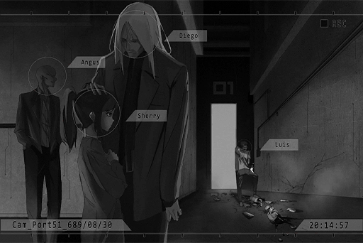

**Diego** 
Hey... That's enough, isn't it? It's already broken.

**Angus** 
That guy has lost his mind again.

**Diego** 
Whatever. Let him vent his anger.

**Cherry** 
... Father...

**Diego** 
Little girl, are you hurt? You did great. Good job.

**Cherry** 
......

*\[Signal Lost\]*

[*(Click here to go back to the top)*](#toc)

## <a id="cpos010"/>[#010] Audio\_Butsudou\_702\_11\_22
### Requirements
|   Character    |Level|
|----------------|:---:|
|**Crystal PuNK**|  8  |

### Log Content
**Ryu** 
Looks like everyone is here. It's been a long time, Diego.

**Diego** 
Indeed. Thank you all for coming despite your undoubtedly very busy schedules.

**Nora** 
......

**Ryu** 
No need to be so polite. The Baro Brotherhood's performance in 08 is seen by all of us. You're not only an important customer but also our good brother. Since you encounter trouble, there's no reason why we shouldn't face it together.

**Diego** 
Brother, is it... how nostalgic. Manson and I used to refer to each other as brothers as well. His passing still saddens me to this very day. He was a hero...

**[Nora]** 
*... Can we get to the point already?*

**Diego** 
Still as cold as ever, aren't you? The Eye of Horus... You're right though. Let's begin. 
Last time, we purchased a shipment of weapons from Kyuu Hou Kai. However, during the transport carried out by Mogura, an issue occurred. From what I've learned, the Splice people you hired were all knocked unconscious. As with the weapons, they were destroyed and discarded in the underground tunnels. 

**[Nora]** 
*As compensation, we've fully refunded your organization the back payment as well as the liquidated damage payment. If you still want to do the transaction, you can place the next order any time you want. With all that we've done, I don't see where you can be dissatisfied?*

**Ryu** 
... Regarding the transport accident, we've labeled it as an important issue and are currently investigating...

**Diego** 
Apologies for my bluntness, however, brother Ryu's so\-called "investigation" is merely asking the admins to visit the tunnels a few times, make some marks here and there, and come up with a final report that essentially just says "Nothing abnormal has been found." Right? 

**Ryu** 
Diego, this amount of money is nothing to Mogura. We can compensate you whenever...

**Diego** 
What I care about is not the compensation, but the existence of a "disturbance". It's an obstacle between the coexistence and mutual prosperity of the Baro Brotherhood and Mogura. This disturbance is like a tiny thorn in the muscle. Although it doesn't hurt, if you ignore and don't treat it, it'll cause your entire leg to rot and decay, forcing you to amputate it. 

**Ryu** 
I see. You want us to give you a proper answer.

**Diego** 
Certainly. What I'm seeking is the "truth". 
For example... the whereabouts of the "culprits".

*\[Projection\]*

**Diego** 
According to the info we got, there are three culprits. This is the photo of the male who showed his face first. The remaining two carried out the ambush by destroying the lighting in the underground facility. The identities of these two are unknown. Judging by the voices, it's one male and one female.

**Ryu** 
Gravediggers are everywhere and every one of them is affiliated with a different organization. This tiny bit of information is nowhere near enough to investigate...

**Nora** 
......

**Diego** 
No. If it's a planned robbery by other organizations, the weapons should all be gone. However, after going through the discarded pile, the only weapon missing is a single P\-440. What kind of people would want to destroy the cargo? Definitely someone who doesn't want the transaction itself to be carried out.

**Ryu** 
... What are you trying to say?

**Diego** 
I'll be frank. After Manson died, Mogura has always been at a disadvantage when it comes to combat power. Even the Baro Brotherhood is on the verge of surpassing Mogura. The organization's current status is entirely supported by the massive economic chain you people created.

**Diego** 
As with Kyuu Hou Kai, after Nora took over, you've been constantly avoiding events that can strengthen the organization or ones that may cause bloodshed. From where I stand, it wouldn't surprise me if either of you is behind this accident.

**Ryu** 
Young man, be careful what you say. Trouble tends to find people like you.

**Diego** 
Oh, I wouldn't dare. The one man who oversees all of Mogura, the deeply respected Ryu Minatsuki, I believe you're just as much of a hero as Manson.

**[Nora]** 
*... "Carried out the ambush by destroying the lighting in the underground facility", those are your exact words, correct?*

**Diego** 
Certainly. Is something wrong with that?

**[Nora]** 
*The underground facility uses ancient civilization technology of the Architects. There aren't a lot of people capable of controlling or hacking this technology... or I should say, as far as I know, there are only a couple. If you add that to the action of "destroying the transaction itself"... I think that at least one of the three culprits is from Node 08. If that's the case, then I believe the responsibility belongs to you, an 08 organization. *

**Diego** 
Hoho? You seem to be pretty good at guessing, but what is your evidence? Or, are you going to provide evidence right here with your eyes...

**[Nora]** 
*I refuse. There's no reason for me to risk my life using my eyes, especially when it's for something as pointless and as unrelated to myself as this one. 
Kyuu Hou Kai provides the goods. Accidents that occur during the shipping process is an issue that you guys should deal with yourself.*

**Ryu** 
Nora... Mogura, Kyuu Hou Kai and the Baro Brotherhood own at least 70% of the underground societies of 03 and 08. Our alliance has the utmost importance...

**[Nora]** 
*I said before, I am not interested in 70% of the businesses you currently have. These three people you're looking for, weapon transactions, and this self\-proclaimed "alliance" of yours are all included in that 70%. *

**Ryu** 
......

**[Nora]** 
*I've already stated Kyuu Hou Kai's position very clearly. There's no need for me to participate in this discussion anymore. 
Daigo, start the car. Let's go.*

*\[Car door opens\]*

**Diego** 
Looks like the negotiations have failed, brother Ryu. Haven't seen her in a while and that little girl has become more troublesome than ever.

**Ryu** 
Hmph... if we want to talk about troublesome fellas, you're right up there as well. You got guts to name me as a suspect.

**Diego** 
Haha, you understand that's just nonsense spoken for her, right? Shall we get into our actual main topic?

**Ryu** 
Yes... to Mogura, Kyuu Hou Kai has already grown to a place where it's beginning to threaten our position. A phoenix rebirthed from the ashes soaring over the massive dragon of the earth... Can't help but be quite concerned.

**Diego** 
No doubt about it. I see that we still have a mutual understanding of the situation. This is exactly what I want to discuss with you. As long as the alliance between us two major factions exist...

**Ryu** 
Got any good ideas?

*\[→Switch to tapping signal\]*

**[Diego]** 
*Based on my experience, snuffing out the sparks in time before the fire spreads out is the only way to control and utilize flames.*

**[Ryu]** 
*From the sound of it, you seem to be very certain that you can achieve your goal?*

**[Diego]** 
*Of course. We're brothers after all. The little brother ought to help the older brother solve his problems. 
I already have a perfect plan in place. First, we'll start with the Kyubo Medical Center that's irrelevant to us. All that's required is for you to nod your head...*

**Member D** 
......

*\[Signal Lost\]*

[*(Click here to go back to the top)*](#toc)

## <a id="cpos011"/>[#011] Audio\_SusukiSt\_702\_11\_24
### Requirements
|   Character    |Level|
|----------------|:---:|
|**Crystal PuNK**|  9  |

### Log Content
**Cherry** 
We plan to meet them at that crossroad, right?

**Xenon** 
Yeah. Sidenote, exactly why did you tag along again?

**Cherry** 
Ha? Did you forget what your identity is right now? Two people walking around together tends to attract less attention. You need to learn from me about how to keep a low profile. Or, is there some kind of reason you don't want me to tag along...?

**Xenon** 
Rest assured. My guess is that for the time being, the admins in 08 probably won't pursue me as actively as they had.

**Cherry** 
Eh? How so?

**Xenon** 
Think about it. The reason why they were in such a hurry to convict me was to put an end to this incident and prevent someone else from conducting further investigations. The real Æsir was never caught. In other words, me being on the run right now gives them the perfect excuse if Æsir ever decides to act again. They can just blame it all on me and rationalize the whole thing.

**Cherry** 
The things they don't want people to investigate further, is it the stuff R talked about? About The Decommission and Architects...

**Xenon** 
Yes. I don't know what A.R.C. or the admins are planning. Nevertheless, there's definitely a bigger secret behind all this. If that's the case, perhaps the things PAFF encountered also has something to do with this. This is what I want to confirm after we meet up with NEKO.

**Cherry** 
NEKO... In the last performance we had together, I was in a hurry and never had the chance to properly talk with her. Didn't think we could meet up with her in 03.

**Xenon** 
... I merely plan to meet up with her so we can update each other about what's going on. We won't talk for too long.

**Cherry** 
So they brought PAFF back here to search for her memories, is it...? Now that you mention it, the Æsir attacks really do have a lot to do with memories.

**Xenon** 
To be honest, judging from what NEKO said, "that concert" also seems to be one of the reasons behind PAFF's messed\-up memory.

**Cherry** 
Not only making you the scapegoat but also involving PAFF... what exactly is he trying to achieve with these actions?

**Xenon** 
No idea. All in all, let's meet up first. Maybe we can obtain more information. On top of that... if we can figure out Æsir's real identity, it should also help PAFF out.

**Cherry** 
I almost forgot; you're a diehard Cream Puff yourself.

**Xenon** 
... I just find her singing voice to be quite good. Nothing more.

**Cherry** 
Ho, really? Then compared to mine, which one do you prefer?

**Xenon** 
Based on what? The comparison doesn't work. She sings mostly pop music.

**Cherry** 
PAFF is a really nice person. Although we didn't talk much at Mono, she was always very humble and polite. 
Alright then, I've decided. I'll help introduce you two to each other!

**Xenon** 
Don't make the situation more complicated...

**Cherry** 
What, you got a problem with that? Our actions can also help her out, right?

**Xenon** 
That's just speculation... 
Look out!

*\[Horn\]*

**Cherry** 
Hey! That's dangerous!

**Thug** 
Outta my way, outta my way! You wanna get f\*\*\*\*\* killed?

**Cherry** 
This is the sidewalk!

**Xenon** 
Sherry, forget about it. This is 03. Trash like that is everywhere. No need to get into an argument.

**Thug** 
Huuh!? Who you calling trash!? You sissy\-looking piece of s\*\*\*!

*\[Loads gun\]*

**Cherry** 
I advise you to put your gun down.

*\[Loads gun\]*

**Thug** 
Hoho? You got guts to point a gun at me. Do you know who I am!?

**Xenon** 
... 

*\[Hacking\]*

**Xenon** 
Mr. Ono, is it? Member of the Hou Sang Tang.

**Thug** 
......!? How did you know my name...?

**Xenon** 
Apologies. I am Sid Jackson, an expat executive for Mogura. This is my ID.

*\[Data projection\]*

**Thug** 
Eh...? Eek!?

**Xenon** 
Both of you, please, lower your guns. Apologies, this is my wife and she tends to be a bit impulsive. However, if I recall correctly, Hou Sang Tang is a subsidiary of Mogura, isn't it? A Hou Sang Tang member pointing a gun at the family of a Mogura executive, in Node 03 too; I wonder what that implies?

**Cherry** 
......

**Thug** 
Umm, N, no... Sir, please hear me out...

**Xenon** 
... If you don't want the guys above you to hear about this, I suggest you leave, now. I'll pretend I didn't see all this.

**Thug** 
Y\-yes sir! Thank you so much for your kindness! I'm so sorry!

*\[Engine sounds\]*

**Cherry** 
Pff... Pffft hahaha! Wife, eh? Not bad, not bad at all! Can't believe that actually fooled him. Your acting was god awful!

**Xenon** 
... Be quiet, will you? I've browsed all the data stored by the admins here. Forging an ID that can fool a low\-level thug like that is relatively easy.

**Cherry** 
... Are all hackers this arrogant? Both you and that Æsir.

**Xenon** 
Don't group us together. I will never use this technique to harm others.

**Cherry** 
Nonetheless, your acting just now... Hahahaha! Oh, I can't! I just can't! God that was so funny... 
Hahahaha...

**Xenon** 
Aren't you laughing a bit too hard...?

**Cherry** 
Haha... eh? Hey... look, isn't that the thug we just encountered? Why is he laying in front of the hospital entrance?

**Xenon** 
Did he fall down out of panic...?

**Cherry** 
Simon! Look at those drones in front of the hospital entrance... They just stopped there and aren't doing anything. That's really suspicious. Armed models... are they the admins' machines?

**Xenon** 
Hey, is that guy bleeding...?

**Cherry** 
Could it be, the drones... 
......!?

**Xenon** 
What's the matter?

**Cherry** 
Get down!!!

*\[Explosion\]*

*\[Signal Lost\]*

[*(Click here to go back to the top)*](#toc)

## <a id="cpos012"/>[#012] Cam\_SusukiSt\_702\_11\_24\_1
### Requirements
|   Character    |Level|
|----------------|:---:|
|**Crystal PuNK**| 10  |

### Log Content
*\[Explosion\]*

**Pedestrian A** 
What is going on? Is it a terrorist attack!?

**Pedestrian B** 
Waaahhhh!! They're... the hospital...

**Xenon** 
Hey, it's dangerous...

**Cherry** 
Wait, don't go near them! Even drones that are out of control will still automatically attack anything that comes into their detection range!

**Xenon** 
... Out of control, is it? Take a look at their positions and where they are stopping.

**Cherry** 
Facing the hospital, deployed in two rows; the ones on the outside have entered security mode while two drones occupy the high ground... This is...

**Xenon** 
Yes. They aren't just firing at random. Be it their formation or their attack rhythm, they are all strategically planned. Someone is definitely controlling them remotely behind the scenes.

**Cherry** 
... The gangs, is it? This is 03 after all...

**Xenon** 
Highly possible. Kyubo Medical Center... I think I've seen this name in the gang organizations' data... Regardless, no matter what it's associated with, this is still a hospital...

*\[Drones flying\]*

**Cherry** 
A few of them are going inside!?

**Xenon** 
Are you kidding... no matter what they want to do, we must prevent them from attacking regular civilians.

**Cherry** 
Hold it right there. Did you see their outer shells? They're made out of the newest type of metal alloys. Our guns are not gonna penetrate that.

**Xenon** 
Then the only option is to hack into their system... can't do that from here. I'll have to get closer to find a gap between their movement patterns to break inside...

**Cherry** 
NO! Have you gone mad? These drones are equipped with assault rocket launchers. They are models used in wars. With how physically unfit you are, getting closer to them is basically a death wish!

**Xenon** 
But we have to help the civilians!

**Cherry** 
Of course we're helping! What I meant to say is, you'll stay behind me while I create the opportunity for you. However, if we just rush inside like this, we'll absolutely get caught on camera... I have a mask. What about you?

*\[Helmet activates\]*

**Cherry** 
... New helmet? Pretty cool\-looking...

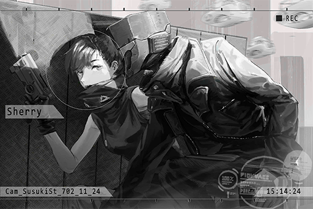

**Xenon** 
Not the time for such comments, don't you think? Let's move!

*\[Explosion\]*

**Child C** 
*\*Cries\**... Daddy... 
Daddy where are you...

*\[Gunshot\]*

**Cherry** 
Look out!

**Child C** 
Waah!

*\[Consecutive Gunshots\]*

**Cherry** 
Simon! Now!

*\[Hacking\]*

**Xenon** 
So even children this small aren't spared... No matter who's behind this, they've gone too far.

*\[→Signal Switches\]*

*\[Explosion\]*

**Xenon** 
It's coming from upstairs... gotta move fast.

*\[»»» Fast Forward»»»\]*

**Xenon** 
... There's a lot of them. Sherry, cover me. I'm going to finish them all off in one go. Since they're the same model, their encryption should be the same set as well.

**[Drone]** 
*Threat detected. Initiate termination process.*

**Cherry** 
Hey, tin cans! Look over here!

*\[Gunshot\]*

**[Drone]** 
*Incoming firearm attack, damage suffered... low. 
Adjusting termination priority. New target acquired*

**[Xenon A.I.]** 
*Remote control authorization decrypting... 57%.*

**Cherry** 
Yes, that's right. Come this way... Wah!

*\[Explosion\]*

**Xenon** 
Sherry? Sherry!? Are you alright?

**Cherry** 
Cough... cough... Don't worry about me!

**Xenon** 
Damnit... Come on, hurry up!

*\[Hacking\]*

**[Drone]** 
*Command accepted. Adjusting termination priority. New target acquired.  
Execute attack immediately.*

**Cherry** 
What's going on... What new target?

**Xenon** 
Hide! NOW!

**Cherry** 
!?!?!?

*\[Machine Gun\]*

*\[Signal Lost\]*

[*(Click here to go back to the top)*](#toc)

## <a id="cpos013"/>[#013] Cam\_SusukiSt\_702\_11\_24\_2
### Requirements
|   Character    |Level|
|----------------|:---:|
|**Crystal PuNK**| 10  |

### Log Content
**Xenon** 
Whew... all done.

**Cherry** 
So you made them attack each other... Couldn't you give me a heads\-up first!? That was scary as f\*\*\*!

**Xenon** 
I said that I was going to finish them all off in one go, right? Rather than waste time controlling the core system, tampering with the target selection system is the fastest way to deal with them.

**Cherry** 
... You little... Where did the "keep a low profile" part go? Good thing that the civilians have all escaped. What if the drones accidentally struck someone? Creating such a huge ruckus, I say we've attracted the attention of every living soul in Node 03.

**Xenon** 
At least both of us didn't show our faces. Can't complain about that. Better get out of here before anyone notices us...

*\[→Signal Switches\]*

**Xenon** 
I've already contacted NEKO and told her we'll meet up someday later. Let's go back first. We caused a pretty major commotion. It's best that we go back into hiding for now.

**Cherry** 
Yeah... Whew, let's go...

**Xenon** 
Hey, you okay? Can you walk?

**Cherry** 
Yeah, I can... Hah... Owww...

**Xenon** 
You twisted your ankle, didn't you? Why are you trying to act tough? Gimme your hand.

**Cherry** 
... Eh? Umm...

**Child C** 
Waahhh\~\~ Daddy!

**Pedestrian A** 
You're safe! Daddy was so worried...

**Child C** 
Yes... a lady saved me...

**Pedestrian B** 
I really saw it! Two masked people, one with a gun and one with some sort of unknown gadget, trashed all those drones! Dude, they were so cool and awesome!

**Cherry** 
......

**Xenon** 
So, how was it? Using your ability to help other people, felt pretty good, right?  
Partner?

*\[Carries on shoulder\]*

**Cherry** 
... Yeah.

*\[Footsteps\]*

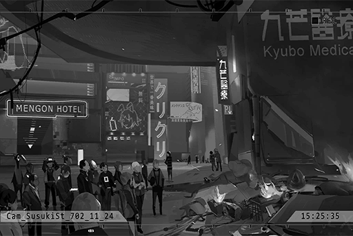

*\[Signal Lost\]*

[*(Click here to go back to the top)*](#toc)

## <a id="cpos014"/>[#014] Audio\_KaiStudio\_702\_12\_01
### Requirements
|   Character    |Level|
|----------------|:---:|
|**Crystal PuNK**| 11  |

### Log Content
*\[Ringtone\]*

*\[Call starts\]*

**[Rald]** 
*It's me, Miss Pauline. How are you two doing in 03 these days? Haven't caused any major commotions, I presume?*

**Cherry** 
Ummm...... no.

**[Rald]** 
*Haha, spare me your terrible acting. "Kyubo Medical Center attacked by unknown organization with hacked armed drones, anonymous heroes successfully deterred attack..." 
... This is talking about you guys, isn't it? Even though Node 13 doesn't have a connection to cyTus, a news story this major is bound to make its way here.*

**Cherry** 
... We weren't recognized. Simon rushed inside as soon as he saw the attack unfold. I couldn't do anything about it.

**[Rald]** 
*Can totally imagine that... Whatever. I'm a bit busy right now, so I'll just skip directly to the key points. 
You okay with that? Do you need to grab a pen to take some notes?*

**Cherry** 
... What, am I a three\-year\-old child to you?

**[Rald]** 
*Very well, then listen closely. 
My investigations in Node 13 are more or less complete. It's time you guys take action on your side. Miss Pauline, I believe you should know a few things about the gangs in 03 since you've been a Mediator for quite some time?*

**Cherry** 
Maybe.

**[Rald]** 
*Does the name "Kyuu Hou Kai" ring any bells?*

**Cherry** 
Yes. That name is very well\-known in the Baro Brotherhood. It's currently their main firearms supplier. However, that's pretty much all I know. They never let me know too much regarding the details of their deals.

**[Rald]** 
*Knowing that is more than enough. 
According to the information I obtained, "The Eye of Horus" I previously mentioned to Mr. Jackson appears to be under their control.*

**Cherry** 
......! 
In other words, we'll have to negotiate with Kyuu Hou Kai...?

**[Rald]** 
*Doesn't have to be that complicated. 
The gang has used "The Eye of Horus" ability to gain profit for itself. Thus, I went through their "transaction" records in the past and was able to reverse track it back to the "entrance". I then proceeded to directly transfer some money to them... a sum so big that's going to catch even the gangs by surprise. *

**Cherry** 
So that person sees anyone as long as they have the money?

**[Rald]** 
*Not quite. There are still some procedures that needs to be done. This is where you two come in. As the next step, you fellas will go to a location I will specify on a specific date. Then, you'll say the keyword and show the certificate to the shop clerk there. That clerk will then take you to meet that person.*

**Cherry** 
... That sounds really suspicious no matter how you look at it.

**[Rald]** 
*My oh my, we're this deep into this whole ordeal and you still don't trust me? During that week we survived together, our coordination was like a perfect harmony. You are the graceful violin while Mr. Jackson is the steady cello.*

**Cherry** 
Ho? Then what about you?

**[Rald]** 
*The composer and conductor, of course. \*Chuckles\**

**Cherry** 
... Simon wasn't wrong at all when he described you as "self\-centered". Don't you dare treat us like instruments you can willfully play with. 

**[Rald]** 
*Instruments that produce awful noises are not worthy to be listened to. On the other hand, the sounds you two produced are quite beautiful. I thoroughly enjoyed conducting you two.*

**Cherry** 
Does this count as you complimenting us in a roundabout way?

**[Rald]** 
*Haha. 
As long as we can use "The Eye of Horus" ability and pair that with Mr. Jackson's skills, we'll be able to discover a part... no, perhaps a much bigger part of the truth than we thought. But... *

**Cherry** 
But?

**[Rald]** 
*The last "transaction" record was several years ago. I have no way of knowing what happened that resulted in the lack of transactions in recent years. You two will have to improvise on the fly... \*Chuckles\*, with you around, you won't be at a disadvantage if a gunfight is involved. That much is for sure.*

**Cherry** 
You're flattering me, aren't you? When we were hunting on the surface, your accuracy is pretty on par with mine.

**[Rald]** 
*Humility is one of the Neumann family's many virtues. 
I need to stay in 13 for a while longer. I'll leave the negotiation with Kyuu Hou Kai to you two. I'll send the address and certificate to Mr. Jackson later. Have him encrypt them a little too, just to make sure that no one can get any important info from them.*

**Cherry** 
What else do you need to investigate there?

**[Rald]** 
*Simply put, it's some "manuscripts" left behind by my family's ancestors. However, those people don't seem to be your average joe either. They spent quite the effort concealing these documents. Perhaps they are so confident in their abilities that they figured only their own descendants will be capable of finding them? Ooh, now that's getting me a bit excited.*

**Cherry** 
... Do they have something to do with the Æsir incident?

**[Rald]** 
*Still to be determined... or more like I hope my hypothesis is correct because this is the one path closest to the truth. Be it for you guys, for me, or for humanity as a whole. 
Apologies, Miss Pauline, but I have to go now.*

*\[Call Ends\]*

**Cherry** 
......

*\[Signal Lost\]*

[*(Click here to go back to the top)*](#toc)

## <a id="cpos015"/>[#015] Audio\_Bookstore\_702\_12\_02
### Requirements
|   Character    |Level|
|----------------|:---:|
|**Crystal PuNK**| 12  |

### Log Content
**Xenon** 
What's the deal with this area?... There are traces of fire everywhere we go.

**Cherry** 
It has to do with the chain explosions that occurred. It was huge news and caused quite an uproar. However, I heard that the Administration Bureau sent the victims off somewhere else and never bothered to do anything afterward. Now, no one really cares about what actually happened anymore.

**Xenon** 
After all, the poor and the dead can't talk... right?

**Cherry** 
Haha, when did you start speaking so poetically like R?

**Xenon** 
... Don't drag me down to his level.

**Cherry** 
However, in some ways, you two really are eerily similar... We're here.

**Xenon** 
A bookstore...? Looks no different than the other destroyed buildings around here...

*\[Door Opens\]*

**Store Clerk** 
Welcome.

**Cherry** 
... We are looking for a book titled "The Ninth Child".

**Store Clerk** 
......

**Cherry** 
The certificate is here.

*\[Data projection\]*

**Store Clerk** 
... Basement. Shelf B\-9, third level.

**Xenon** 
... Aren't you "The Eye of Horus"?

**Store Clerk** 
... I don't know what you're talking about. I am just a store clerk of this second\-hand bookstore. Here, enter that door and walk to the end.

*\[→Signal Switches\]*

**Cherry** 
...Found it. This book? Wow, an actual paper book... 
What a rare sight.

*\[Shelf moves\]*

**Xenon** 
......!? 
The shelf moved all by itself... there's a door behind it.

*\[Door Opens\]*

**Member D** 
So you were the ones who sent over that large sum of money all of a sudden? Didn't even bother to ask first, eh? You guys really are self\-centered.

**Xenon** 
... Can't disagree with that.

**Member D** 
You don't look like you're from 03... Since you're still able to discover and locate this place, and the amount of money you sent over was truly ridiculous, we figured we should at least meet you... Turns out it was just a bunch of brats?

**Cherry** 
......

**Member D** 
I'll be honest with you, "The Eye of Horus" doesn't exist anymore. Sending us more money won't change a thing. Please head back. We'll return all the money to the account it was sent from.

**Cherry** 
......!? How come...

**Xenon** 
... You said "doesn't exist anymore", so this means that it did indeed exist at one point? What happened?

**Member D** 
This has nothing to do with you. Please leave.

**Cherry** 
No. We have to borrow that ability no matter what. Please! Any clue will help...

*\[Loads gun\]*

**Member D** 
I have no interest in your business. If you don't plan on leaving, I don't mind killing you people right here.

**Cherry** 
Eh...you want to go?

**[Nora]** 
*Daigo, stand down.*

**Member D** 
......!? 
Chief?

**Xenon** 
......?

**[Nora]** 
*I know of these two. I'd like to see them. Put the gun away. Bring them to my lab.*

**Member D** 
Yes. Please forgive my manners. This way please.

**Cherry** 
... Thank you. Let's go, Simon.

*\[Signal Lost\]*

[*(Click here to go back to the top)*](#toc)

## <a id="cpos016"/>[#016] Audio\_KyuuLab\_702\_12\_02
### Requirements
|   Character    |Level|
|----------------|:---:|
|**Crystal PuNK**| 12  |

### Log Content
*\[Door Opens\]*

**Member D** 
Come in.

**Cherry** 
......

**[Nora]** 
*Both of you, you don't have to be so nervous. Take a seat.*

**Cherry** 
Umm, thank you. And you are...?

**[Nora]** 
*I'm Nora, the Chief of Kyuu Hou Kai.*

**Xenon** 
......!? You're... the child... 
in KAI's photos...?

**[Nora]** 
*No need to be so surprised. You also made quite a name for yourself when you were just a child, didn't you? Mr. Simon Jackson? Or should I call you "X"?*

**Xenon** 
......!

**[Nora]** 
*I've seen your lively record on the Dark Web. Unable to be tracked, unable to be guarded against. The mysterious hacker who has given many a headache to the gangs. Quite impressive, I must say.*

**Xenon** 
... Those records should've all been deleted by myself a long time ago.

**[Nora]** 
*The world of the internet is much more vast than what you had imagined. In reality, those records still exist in a place that you are unable to access. And I... am someone who is able to do so.*

**Cherry** 
You... Could it be, that you're "The Eye of Horus"?

**[Nora]** 
*... Let's change the topic. The attack on the Kyubo Medical Center building a few days ago. The brave anonymous heroes... That was you two, wasn't it?*

**Cherry** 
......!? 
......

**Xenon** 
...So Kyuu Hou Kai's the one behind Kyubo Medical Center? I've come across similar rumors. If that's the case, it'd be impossible to not be noticed by you.

**[Nora]** 
*Indeed. We hadn't been expecting that attack. If it hadn't been for your timely assistance, the entire hospital building would've been overrun before anyone could escape. The casualties would have been enormous. This is also precisely why I was willing to see you two.*

**Xenon** 
But... some people were still caught in the crossfire, weren't they?

**[Nora]** 
*The data I received reported 2 dead and 17 injured. Half of the facilities were destroyed. Unable to provide medical service for three months.*

**Xenon** 
... Damnit...

**Cherry** 
... Miss Nora, if you knew of Simon's identity already, then you must know that he...

**[Nora]** 
*Of course. I know that during the jury, you admitted that you were Æsir, but then escaped from 08's restricted ara. Since you're now here and asking to use "The Eye", it must have something to do with that... As with me, I must confirm whether or not your intentions will affect Kyuu Hou Kai.*

**Cherry** 
If it does affect, you won't help...?

**Xenon** 
Sherry. 
Nora, the reason I want to clear this incident up is not for myself. I believe that hiding behind all the things we have experienced so far, there lies a secret which will affect the entire world…

*\[»»» Fast Forward»»»\]*

**[Nora]** 
*I see...You believe that if you don't reveal these secrets, the dangers that come with it may end up impacting all humans.*

**Cherry** 
Yes. Please, we need your help!

**[Nora]** 
*I'm sorry, but I can't help.*

**Cherry** 
……!? 
Why? We already told you everything...

**[Nora]** 
*I approve of your motives, and this "hypothesis" is certainly quite intriguing. But there are many doubts that I am unable to verify right now... As you can see, my eyes are already in very bad shape. If not for the aid of devices, making out your outlines alone would be a difficult task.*

**Cherry** 
......! 
So The Eye of Horus really doesn't exist anymore...?

**[Nora]** 
*That's right. Entering the OS space is very demanding for my body. My current limit is a mere 5 minutes. Plus, I can only see information around 03. Focusing my mind and go to wherever I'd like is certainly out of the question too. This is also why Daigo was trying to drive you guys away back there. Please forgive him.*

**Xenon** 
OS space...?

**[Nora]** 
*... It was chosen arbitrarily. The name is not important.*

**Cherry** 
Is there no other way...?

**[Nora]** 
*...You two are in luck. Coincidentally, someone else who can use this same ability is currently under my care.*

**Cherry** 
For real!?

**[Nora]** 
*But her condition… I'm not sure if she can be much help, since she has yet to fully master this power. If you two don't mind...*

**Cherry** 
Please, let us see her!

**[Nora]** 
*Hmm…… This is also to repay you the favor for saving the civilians. 
Please wait outside for a moment. I'll take you to see her.*

**Xenon** 
...Thank you.

*\[Door Closes\]*

**[Nora]** 
*... Daigo, what would you like to say?*

**Member D** 
I knew I couldn't keep it from the Chief... Concerning the hospital attack. I believe the culprit behind the attack is already quite clear.

**[Nora]** 
*You believe that the attack was a joint effort of the Baro Brotherhood and Mogura.*

**Member D** 
Of course. Chief, you've already heard the things I recorded. That rat scum Diego planned everything all along. He's teaming up with Ryu to gobble up our forces and turf!

**[Nora]** 
*I don't care about any of that. However… if the many technologies developed by Kyuu Hou Kai ends up in their hands, all of Node 03 will suffer greatly.*

**Member D** 
... What if we take the initiative?

**Nora** 
......

**Member D** 
Kyuu Hou Kai's military power and equipment far surpass those worthless hacks. Even if we don't have as many people as them, so long as we land the first strike, we'll definitely win! Let's bite the head off the dragon before they have a chance to strike!

**[Nora]** 
*... You want to start a war?*

**Member D** 
......

**[Nora]** 
*No. Setting Mogura aside, the Baro people don't mind if they burn everything to the ground. You saw how they went about trying to "warn" us... I don't want to get ordinary people involved.*

**Member D** 
Chief!

**[Nora]** 
*This is not worth considering. You are not allowed to have such ideas anymore. I will find another way to handle this. Okay, let's go greet the guests.*

**Member D** 
... Yes, Chief.

*\[Signal Lost\]*

[*(Click here to go back to the top)*](#toc)

## <a id="cpos017"/>[#017] Cam\_Nora\_702\_12\_02
### Requirements
|   Character    |Level|
|----------------|:---:|
|**Crystal PuNK**| 13  |

### Log Content
**[Nora]** 
*Please, wait here. Daigo will bring them here.*

**Xenon** 
... Them?

**[Nora]** 
*There is more than one guest. They insist on moving as a group, so I allowed them all to stay... You two may recognize some of them.*

*\[Door Opens\]*

**Member D** 
Please, come...

**NEKO#ΦωΦ** 
AH!?

**Xenon** 
Ah...

*\[Runs\]*

*\[Hugs\]*

**Xenon** 
Hey... let go of me.

**NEKO#ΦωΦ** 
NEKO was sooo worried about you……eh!? Sis Cherry's here too!? Whahaha……

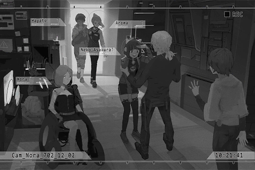

**Xenon** 
If you're here, that means...

**Cherry** 
PAFF!?

**PAFF** 
Miss Cherry, it's been a while...

**Hayato** 
You girls sure know a lot of people...

**Xenon** 
Nora, what's going on? Weren't you taking us to see the one with the ability?

**[Nora]** 
*Yes. Miss Kaori Minamiya is the one with the ability.*

**Xenon、Cherry** 
......!? 
Kaori Minamiya...?

**NEKO#ΦωΦ** 
Eh? Eh? What is going on!?

**[Nora]** 
*... I'll start explaining from the parts I know.*

*\[»»» Fast Forward»»»\]*

**[Nora]** 
*And that is more or less what happened. Therefore, it is confirmed that Miss Kaori Minamiya's brain contains both hers and Miss Aroma White's memory right now. At the same time, the body of Kaori Minamiya also possesses natural traits of "The Eye of Horus" ability, to begin with.*

**Xenon** 
PAFF is the ability user...

**PAFF** 
H\-hello.

**Xenon** 
Umm... H\-hello.

**NEKO#ΦωΦ** 
Shocked! Xenon is embarrassed! This is a Tier SSR scene! Need to take a picture ASAP!

**Xenon** 
I beg you, please be quiet for a minute... 
So... there's more than one ability user. As long as some sort of natural condition is fulfilled, other ability users may also exist?

**[Nora]** 
*That's right. Occasionally, I will come in contact with other consciousnesses in the OS, like damaged A.I. or some unidentifiable breathing. But as of now, the only ones I know of are her and myself.*

**Xenon** 
Then... Even though it's our first time meeting, can you try to use your ability on the keywords we provided? First, A.R.C's Library.

**PAFF** 
I... I'll give it a try!

**[Nora]** 
*Miss Kaori Minamiya, don't be nervous. Like I said before, it's like connecting to the virtual internet. Relax your whole body and concentrate all of your consciousness on the nodes of those signals.*

**PAFF** 
......

**NEKO#ΦωΦ** 
... Has it begun?

**[Nora]** 
*Please, be quiet.*

**NEKO#ΦωΦ** 
......

*\[»»» Fast Forward»»»\]*

**PAFF** 
......

**PAFF** 
... I...

**[Nora]** 
*Do you see anything?*

**PAFF** 
I feel I've... already arrived at the place you described, but...

**Xenon** 
......?

**PAFF** 
Strange... it's so dark. I can't see anything...

**[Nora]** 
*…… 
Of the places you can go to, there shouldn't be any empty areas...*

**PAFF** 
Ugh...

**NEKO#ΦωΦ** 
Aroma\-chan!? She's bleeding out of her nose again! Stop!!

**PAFF** 
Ughhhh…… WAAAAHHHHH!!!NOOO!!!NOO!!

*\[Collapse\]*

**Hayato** 
KAORI!

*\[Signal Lost\]*

[*(Click here to go back to the top)*](#toc)

## <a id="cpos018"/>[#018] Audio\_Nora\_702\_12\_02
### Requirements
|   Character    |Level|
|----------------|:---:|
|**Crystal PuNK**| 14  |

### Log Content
**PAFF** 
Wahh!!

**NEKO#ΦωΦ** 
Aroma\-chan!

**Hayato** 
She's awake!

**[Nora]** 
*How is your body feeling? I've experienced this myself before, yet I still forced you through all of it. I'm truly sorry.*

**PAFF** 
No... I don't think it had anything to do with using the ability. I saw... something...

**Xenon** 
What'd you see?

**Hayato** 
Mr. Jackson! She just woke up!

**Xenon** 
Ah... Sorry.

**PAFF** 
Hayato, I'm fine... Compared to this...

**PAFF** 
I saw...a terrifying face, but it disappeared immediately... It wouldn't stop wailing... I couldn't hear what the wailing was about, but it seemed to be calling someone's name non\-stop...?

**Cherry** 
Name...?

**PAFF** 
I'm not sure either. The voice sounded so pitiful. I wanted to reach out my hand to help it... but then the emotion changed instantly. I felt... like I was going to be killed... It was this strong feeling of hatred...

**PAFF** 
*\*Sobs\*...\*Sobs\*...\*Sobs\*...* Ugh...

**Hayato** 
Kaori! Are you alright? Enough. Don't think about it anymore.  
Please, let her rest.

**Xenon** 
......

**PAFF** 
I'm sorry. I couldn't be of any help.

**Xenon** 
No. You did great. Take a rest for now.

**PAFF** 
Mr. Jackson...

**Xenon** 
......

**PAFF** 
I don't know what was the thing I felt, but whatever it was... it must be stopped as quickly as possible. That murderous intent... it wasn't just aimed towards me. More like... it was aimed towards everybody...

**Xenon** 
...... 
So it was exactly what that guy has guessed...?

**[Nora]** 
*…… 
Miss Kaori Minamiya, if you don't mind, the silent chamber I used as a child should still be operational. Though it is dark and rather cramped inside, it greatly helps with the resting of the mind and body. Please, take a rest inside it.*

**PAFF** 
Thank you...

**[Nora]** 
*For now, do not use the ability.*

**PAFF** 
No…… Please give me a few days to recover. I believe that I must know what was it that I saw. I feel like it is of the utmost importance...!

**[Nora]** 
*…… 
Understood. Daigo, take her to rest.*

**Member D** 
Yes. This way, please.

*\[Door Opens\]*

**[Nora]** 
*Everyone, if possible, please remain here as guests for now. There are plenty of empty rooms.*

**Hayato** 
Of course! I'll always stay by Kaori's side!

**NEKO#ΦωΦ** 
NEKO will too!

**[Nora]** 
*It is currently not ideal for Mr. Jackson and Miss Pauline to be wandering around outside either. This place is ideal for hiding.*

**Cherry** 
Thank you, Nora.

**[Nora]** 
*Well, then. Please be at ease. You may move about freely in the guest area. If you need anything, just inform the people wearing the uniform.*

*\[Wheelchair Moving\]*

*\[Door Opens\]*

**Cherry** 
... She's a good girl. When I first met her, I was a bit scared by her...

**NEKO#ΦωΦ** 
Ah! NEKO felt the same way at first too! But Iemme tell you guys, Nora\-chan, she's... uhh, oh yeah! Ropohead's here too. It's quicker if you hear it directly from him!

*\[Signal Lost\]*

[*(Click here to go back to the top)*](#toc)

## <a id="cpos019"/>[#019] Audio\_Kyuu\_702\_12\_05
### Requirements
|   Character    |Level|
|----------------|:---:|
|**Crystal PuNK**| 15  |

### Log Content
**Member D** 
Diego… I don't remember inviting Baro onto our turf. What are you doing here with so many people?

**Diego** 
Relax. Today, I've got some things I need to discuss with the Chief about, not some barking dog like you.

*\[Loads gun\]*

**Member D** 
Chief doesn't want to use violence against the likes of you. Therefore, I'll give you ten seconds to get the hell out of here.

**Angus** 
Hey, s\*\*\*head! What do you think you're doing!?

**Diego** 
Angus, put the gun down.  
It's okay if she doesn't come out. I'll just say it right here. She's watching anyway, right?

**Member D** 
You...

**[Nora]** 
*Daigo, come back.*

**Member D** 
Chief!?

**[Nora]** 
*The work in Area A requires your assistance. Come back.*

**Member D** 
Yes, Chief...

**Angus** 
Hmph, bye\-bye little doggy.

*\[Door Closes\]*

**Diego** 
Nora, what's wrong? Don't just hide out in there. Come out and chat, won't you?

**[Nora]** 
*Diego, our routine meeting is not today.*

**Diego** 
Certainly. I know that very well. Despite that, my boys couldn't wait any longer. All you need to do is hand over the people we're looking for and we'll leave this place immediately. We won't leave a trace.

**[Nora]** 
*What people?*

**Diego** 
It's not like you to feign ignorance. 
I've received news that Simon Jackson and Sherry Pauline are currently hiding here. These two have interfered into the weapon transaction between Mogura and us. You should hand them over and let us deal with them accordingly. 

**[Nora]** 
*... Those two? I figure it's about time we start sorting things out as well. *

**Diego** 
Since that's the way it is, I'll be blunt. You know very well that to the Baro brotherhood... no, to this three\-way alliance, those two are our common enemy. Yet you hid and sheltered them behind our backs. May I ask what is all this about?

**[Nora]** 
*I said this last time as well. I have no interest in your self\-proclaimed alliance. These two are currently guests of Kyuu Hou Kai. It has nothing to do at all with you or Mogura.*

**Diego** 
Hoho, you think such an excuse will work. I think this is all planned by you. Telling them to disrupt the transaction was part of your plans, wasn't it? Yet you're still able to pretend like you don't care at all... I've got to hand it to you.

**[Nora]** 
*Diego, you are many things, but a good actor you are not. 
You and I both know what the truth really is. The reason why you want them so badly isn't just because they interfered with that little weapons deal, am I right? Oh, and when I said "sort things out", I'm talking about the stuff you guys did.*

**Diego** 
... What do you mean?

*\[Plays Audio\]*

**[Diego]** 
*... I already have a perfect plan in place. First, we'll start with the Kyubo Medical Center that's irrelevant to us. All that's required is for you to nod your head...*

**Diego** 
......

**Angus** 
Is this... a recording of the last meeting? We've been played...

**Diego** 
Ha...HAHA! Well\-done. Brilliant! You're indeed the "All\-knowing Eye". Everything is under your control... Is that what you think?

**[Nora]** 
*This is ironclad proof that you two organizations see us as an enemy. Do not expect Kyuu Hou Kai to treat you people kindly in the future.*

**Diego** 
…… Hehe. That's right. The one who attacked the Kyubo Medical Center was indeed us. I also received news that the mysterious beings who obstructed our operation were those two as well. You said so yourself, that Sherry Pauline counts as someone from 08's system. Therefore, you should hand her over for us to deal with. You don't want this to get bloody either, do you?

**[Nora]** 
*Diego, I understand that you have no fear of anything. You and the underlings of Ryu are just like the filth of this city; persistent and never\-ending. Therefore, you think the few elites that make up Kyuu Hou Kai are absolutely no match for you.*

**[Nora]** 
*... But let me tell you; you're very, very wrong.*

*\[Parts moving\]*

**Angus** 
!?

**[Nora]** 
*As you can see, Kyuu Hou Kai has long become a "fortress". Its automatic defense system is far superior to those worthless thugs you have surrounded yourself with. If necessary, I will activate all security systems in this entire city. Even if Ryu showed up with the entire force of the Administration Bureau, they will be no match for Kyuu Hou Kai.*

**[Nora]** 
*This will be the final warning. Leave, now*

**Angus** 
... Boss, if we make a move now...

**Diego** 
… Seems like we underestimated the enemy. Let's go.  
Nora, this is far from over... You will see it, even if you don't have the "Eyes" anymore.

**[Nora]** 
*Goodbye.*

**Diego** 
Ah, yes! Please relay to those two that I'll take good care of their families!

*\[Engine Starts\]*

*\[→Signal Switches\]*

**[Nora]** 
*... Miss Pauline?*

**Cherry** 
......

**[Nora]** 
*Guests are prohibited from entering this area. Please return to your room.*

**Cherry** 
... I'm sorry, Nora. It's because of us that...

**[Nora]** 
*Diego's real target is Kyuu Hou Kai's resources. It's all for the goal of having a massive profit to surpass that of Mogura's. Both you and Mr. Jackson are merely excuses. You are in no way responsible.*

**Cherry** 
... I see...

**[Nora]** 
*I have connections in 08. Nothing will happen to your families. Kyuu Hou Kai owes you two a debt of gratitude for what you've done. I won't let these pointless power struggles disturb you.*

**Cherry** 
…… 
Understood...... Thank you.

*\[Signal Lost\]*

[*(Click here to go back to the top)*](#toc)

## <a id="cpos020"/>[#020] Audio\_KyuuLab\_702\_12\_07
### Requirements
|   Character    |Level|
|----------------|:---:|
|**Crystal PuNK**| 16  |

### Log Content
*\[Equipment operating\]*

**[Nora]** 
*The examination is complete. Miss Kaori Minamiya, how does your body feel?*

**PAFF** 
Oh, I'm feeling pretty good. 

**[Nora]** 
*Great, I'll escort you back to your room.*

*\[»»» Fast Forward»»»\]*

**[Nora]** 
*... It seems like your condition is much better than mine. Although you haven't fully mastered the ability yet, your body is rather stable despite the virus activity in your body being 15% higher than mine.*

**PAFF** 
Is that so...?

**[Nora]** 
*You say you remember that when you were kidna... taken to Node 08, you came in contact with the virus due to an accident during the transport, is that correct?*

**PAFF** 
Yes. That time, the truck rolled over in the forbidden area... My body fell out of the storage cell. I think it was then when I came in contact with the virus.

**[Nora]** 
*I'll skip directly to conclusions: Although you and I have the same ability traits, I believe that your power is perhaps greater than mine. If you can learn how to properly control it... Do you remember what I taught you before?*

**PAFF** 
Yes... Even though Nora told me to avoid using the ability these few days, to be honest, I tried to go to the place Mr. Xenon described again yesterday. However, I discovered that this time, I can no longer connect that far into that place...

**[Nora]** 
*From the examination report, that doesn't look like it has anything to do with the state of your body... Perhaps it's "fear" that is stopping you.*

**PAFF** 
... Eh?

**[Nora]** 
*The state of your mind will affect your condition when you enter into the OS space. Sometimes, there will be things that you don't wish to experience a second time. This will cause the ability to trigger a "brake" whenever you try to access those things again. I've experienced this many times already.*

**PAFF** 
......

**[Nora]** 
*I forbid you from using the ability on your own when you're conscious. It's way too dangerous.  
I will continue to train you until you are able to fully control it. When that time comes, you may try again.*

**PAFF** 
I know... I'm sorry.  
However, it seems pretty obvious that Nora didn't want me to use the power even after I learn how to. Why the change of heart now...?

**[Nora]** 
*…… 
In all honesty, those images you described, that hatred... I've encountered it in the past by accident as well. But I didn't think too much of it back then. However, the clues and hypothesis brought to me by Mr. Simon Jackson and Co., on top of all the things that have happened to you guys, make me feel that the severity of this is much higher than what I considered back then.*

**[Nora]** 
*All in all, the most important character right now is you. Please follow my commands on this.*

**PAFF** 
Okay...

*\[Music\]*

**Nora** 
…… 
……?

*\[Door Opens\]*

*\[Music\]*

**NEKO#ΦωΦ** 
Ahh! Aroma\-chan... Wahh, Nora....!

**[Nora]** 
*… Fellow guests, I believe I've told you before that you are prohibited from entering this room.*

**Hayato** 
Sorry...

**NEKO#ΦωΦ** 
Why!? I feel real bad for Ropohead staying here all alone by himself. We just came here to play some music with him, that's all... Plus, Nora\-chan is incredible! All these instruments, you made all of them yourself!? They all sounded amazing!

**Hayato** 
Hey! NEKO...!

**NEKO#ΦωΦ** 
Nora\-chan and Aroma\-chan should play with us too! It'll definitely be a lot of fun!

**PAFF** 
Eh? Umm...

**[Nora]** 
*It's fine. Go ahead. You need a good rest anyway.*

**NEKO#ΦωΦ** 
Ehh\~? What about Nora\-chan?

**[Nora]** 
*I have work I must attend to.*

**NEKO#ΦωΦ** 
Muuuu... okay\~ 
Aroma\-chan! We just made some amazing sounding chords!

*\[Synthesizer\]*

**[Nora]** 
*…… 
That synth, if you turn the Reso up, it'll sound better.*

*\[Door Closes\]*

**NEKO#ΦωΦ** 
Ehhh...? She left right after she said it... So Nora\-chan still really wants to make music after all.

**[ROBO_Head]** 
*Affirmative. This unit, detect slight fluctuations in Nora's emotions.*

**NEKO#ΦωΦ** 
Okay then! We're definitely gonna think of a way to let Nora remember the joys of making music!

*\[Signal Lost\]*

[*(Click here to go back to the top)*](#toc)

## <a id="cpos021"/>[#021] Audio\_Nora\_702\_12\_08
### Requirements
|   Character    |Level|
|----------------|:---:|
|**Crystal PuNK**| 17  |

### Log Content
**[Game Console]** 
*Player NEKO\#ΦωΦ WIN!*

**NEKO#ΦωΦ** 
Yeah!

**Cherry** 
Damnit... I lost!

**PAFF** 
NEKO is so amazing!

**NEKO#ΦωΦ** 
Muhaha\~ sorry about that, Sis Cherry, but NEKO never goes easy on my opponents when it comes to rhythm games!

**Hayato** 
You've never gone easy on anybody no matter what game we play...

*\[Door Opens\]*

**[Nora]** 
*Miss Kaori Minamiya, it's time.*

**PAFF** 
Oh, ok. Sorry, but I have to go with Nora now.

**NEKO#ΦωΦ** 
Nora\-chan, why don't you come and play a round? The top of the leaderboard is almost all you! Ah, although NEKO has taken over around have of it already.

**[Nora]** 
*...... 
Daigo. Go play with them. Make sure our guests have a good time.*

**Member D** 
M\-M\-Me?

**NEKO#ΦωΦ** 
Eh\~? NEKO only wants to play with the best. I don't wanna play with this guy.

**[Nora]** 
*Daigo is quite skilled himself too. 
Let's get going.*

*\[Door Opens\]*

**Member D** 
......

**[Game Console]** 
*Player NEKO\#ΦωΦ vs. Player Daigo, Begin!*

**NEKO#ΦωΦ** 
Hey, are you really as good as she said? NEKO ain't going easy on you.

**Cherry** 
Nora is still so hard to get close to... She doesn't feel like the small child she actually is at all.

**Member D** 
No, Chief has... Ever since all you people came here, she has indeed changed, albeit just a little.  
I haven't heard her speak as much as she does recently in a very, very long time.

**Hayato** 
So that counts as "much"...?

**NEKO#ΦωΦ** 
Old guy, Ropohead told us all about Nora's story. Don't you feel sorry for her? And Ropohead!

**Member D** 
...... 
I'm the Chief's right\-hand man. All I can do is help her whenever something I can do comes my way. Chief is just way too smart. There's no way ordinary people like us can understand what she feels.

**NEKO#ΦωΦ** 
Is it really that complicated? We've got a genius with us right here yet it's so damn easy to read what he's thinking. Right, Sis Cherry?

**Cherry** 
Haha! Well said.  
Speaking of which, where is him? I haven't seen him for a while now.

**NEKO#ΦωΦ** 
Whatever, bet he's sitting in some random corner fiddling with his device all by himself again.

*\[→Signal Switches\]*

**[Xenon A.I.]** 
*... Connection failed. Retry searching for the terminal.*

**Xenon** 
Damn... so this doesn't work either?

**[Nora]** 
*Good evening, Mr. Simon Jackson.*

**Xenon** 
Nora, PAFF.

**[Nora]** 
*Your A.I. and connection device are... very unique. May I ask: what are you doing now?*

**Xenon** 
Just waiting around like this isn't going to achieve anything. Thus, I've used a few methods to track the connections of Æsir and Library, but... I've never seen a break like this. The signal just disappears into thin air when it reaches a certain location...

**[Nora]** 
*... Did you use our equipment?*

**Xenon** 
Yes. Rest assured. I've improved your firewall. Apologies for changing the algorithms without permission. However, I found obvious loopholes here, here and here. Couldn't ignore them. They're much more secure now.

**[Nora]** 
*... Hacking into Kyuu Hou Kai's network in broad daylight like this, if this is any other organization, you would've been dealt with already. However... your points are valid. Even I didn't notice these loopholes... The circuit method, is it? Very interesting.*

**Xenon** 
Due to that incident at Kyubo Medical Center a few days ago, I already have a good understanding of the methods those hackers Baro hired use to hack into the drones. They're at least ten years away from breaking through this algorithm.

**[Nora]** 
*... To be honest, it has been a very long time since I've been genuinely surprised by someone else's skills in cyTus technology. Your reputation as "X" was indeed well\-earned. Thank you again.*

**Xenon** 
No, I've also learned quite a few things myself from this firewall you wrote. Are you two going to do the training next?

**PAFF** 
Yes. Today, I will once again try to connect to safer locations in Node 08.

**Xenon** 
Got it. Be careful.

**PAFF** 
We will.

*\[Footsteps\]*

**Xenon** 
Ah... Ummm...

**PAFF** 
What's the matter?

**Xenon** 
... I know it's a bit weird for me to say this in these circumstances, but... I hope all this can be over soon and you can resume singing again. That's all.

**PAFF** 
Haha, the other girls always said that although you're smart, you're very easy to read. I can kind of see that now.

**Xenon** 
... Perhaps that really is the case.

**PAFF** 
It really is a coincidence that so many musicians are gathered here. After we go back, everyone will be able to continue making music. That includes you, Xenon. I really like your songs.

**Xenon** 
... Thank you.

**PAFF** 
Same goes for you too, Nora. It would be great if you can continue making music.

**[Nora]** 
*...... 
We focus on the task ahead for now.*

*\[Signal Lost\]*

[*(Click here to go back to the top)*](#toc)

## <a id="cpos022"/>[#022] Multi\_File\_CP022
### Requirements
|   Character    |Level|
|----------------|:---:|
|**Crystal PuNK**| 18  |

### Log Content
*\[→Audio\_???\_695\_10\_26\]*

**Zhang** 
Hahaha! Eat and drink all you want! It's my treat! If you see it, I'll pay for it!

**Member** 
Thank you, brother Zhang!

**Cherry** 
......

**Zhang** 
Hey, why isn't that bastard Diego here yet? Doesn't he know that I, Mr. Zhang, really hates it when people are late?

**Cherry** 
He's busy with something else. He'll be here very soon. If you don't mind, I'll drink with you until he gets here.

**Zhang** 
Oh? I didn't think that Node 08 would have decent goods too... Sweetie, you look like you're still a student, aren't you? Hehe. I see that Diego really knows how to party. You sure you can handle me?

**Cherry** 
If you're asking whether or not I can hold my liquor... That's not an issue.

**Zhang** 
Who said anything about drinking!? I'm talking about something else... Hoho? Not exactly busty, but you sure have a damn good figure... Hehehe, let me check the goods myself...

**Cherry** 
......!?

**Zhang** 
What's the matter? Don't you give me such an unhappy expression. The organization sent you here to make me happy, didn't they? Do you not realize how important this transaction is? Hehehe...

**Cherry** 
... Oh...

*\[Door Opens\]*

**Zhang** 
Eh? You're finally here, Diego? This girl you choose ain't half bad. I like her. So, whaddaya think? Since we're talking about the business of girls, we might as well take this one too...

**Diego** 
Do you mind taking your filthy hands off of her, brother Zhang?

**Zhang** 
Huh? What did you say? Did I mishear you? How dare you talk to me like...

*\[Loads gun\]*

**Diego** 
I'm not kidding. This lady doesn't belong to our organization, but she is still an important property of 08's underground society. Please take your filthy hands off of her, and then we can talk business.

**Zhang** 
... Hey... Don't be so serious. I took 'em off, didn't I? See? I didn't harm her at all.  No need to be so tense. Put the piece down, 'kay? Haha...

**Diego** 
You can leave now. You did well.

**Cherry** 
......

*\[Door Opens\]*

**Angus** 
Did you steal the item we requested from him?

**Cherry** 
... Here. Next time, don't come to me if the operation doesn't involve combat...

**Angus** 
That's not for me to decide.

*\[→Cam\_Xenon's\_695\_10\_26\]*

**Xenon** 
Sherry? Why are you here all of a sudden? 
... Why are you dressed up like this?

**Cherry** 
......

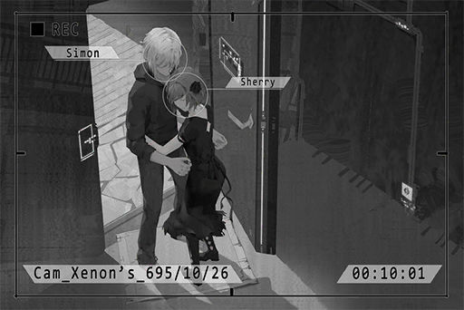

*\[→Audio\_StudioB\_696\_05\_10\]*

**KAI** 
Okay. That felt really good. A quick break first. We'll continue afterward.

*\[Ringtone\]*

**Cherry** 
Ah, let me answer the phone.

*\[»»» Fast Forward»»»\]*

**Cherry** 
... No way...

**Xenon** 
What's wrong?

**Cherry** 
My father, he...!

*\[→Audio\_Hospital01\_696\_05\_10\]*

**Cherry** 
Father! What happened!?

**ER Doctor** 
I don't know. Some people found him collapsed on side of the road covered in blood.

**Xenon** 
Gunshot wound......?

**Cherry** 
......

**ER Doctor** 
I'm sorry, Miss Pauline. Your father has already lost too much blood. We need to do an emergency blood transfusion right away, but we don't have any AB type blood in our storage that matches his condition...

**Xenon** 
My blood type is AB!

**ER Doctor** 
Really!? Are you willing to undergo a blood transfusion checkup...

**Xenon** 
Whatever! Let's get on it!

*\[Signal Lost\]*

[*(Click here to go back to the top)*](#toc)

## <a id="cpos023"/>[#023] Cam\_Kyuu\_702\_12\_10
### Requirements
|   Character    |Level|
|----------------|:---:|
|**Crystal PuNK**| 18  |

### Log Content
**Cherry** 
……!

**Cherry** 
... Where is this...? Oh, yeah. I'm at Kyuu Hou Kai.  
... Dreamed about those things again...

*\[»»» Fast Forward»»»\]*

*\[Singing\]*

*\[Door Opens\]*

**Xenon** 
...Can't sleep?

**Cherry** 
Oh, did I wake you up?

**Xenon** 
I haven't slept yet. I can hear your voice.

**Cherry** 
*\*shivers\**... Yikes, it's so cold... The winter in Node 03 really is freezing.

**Xenon** 
The weather system here hasn't been fully recreated like in Node 08. The differences in temperature are much larger. Do you want me to close the window?

**Cherry** 
It's okay. I wanna look at the night scenery a bit more.

**Xenon** 
At least put on another coat? You don't want to catch a cold. Here.

**Cherry** 
You don't need one?

**Xenon** 
I was just optimizing their equipment in the server room with Nora. It's really damn hot in there. Here, take it.

**Cherry** 
Here he is, good guy Simon.

**Xenon** 
Yeah, yeah, yeah. Quit your blabbing...  
Were you singing "Still" just now? Haven't heard you sing that one for a while.

**Cherry** 
... I was just humming, that's all.

**Xenon** 
…… 
I've mentioned to my friend in the Administration Bureau about the threats Diego made regarding our families. You don't have to worry about it too much.

**Cherry** 
You mean the Nate you mentioned before? The one who let you escape in the restricted area.

**Xenon** 
Yeah.

**Cherry** 
... Why are you telling me this all of a sudden?

**Xenon** 
You said before that when you're feeling distressed, you'll sing that song. So, I made a quick guess.

**Cherry** 
I'm fine... It's just... I remembered some things again.

**Xenon** 
......

**Cherry** 
That previous apology... I feel like I was a total mess when I said it. But I still want to say I'm sorry once more. Perhaps I'm still unable to forgive myself, but... can you?

**Xenon** 
Didn't I already tell you? You need to let go of the past. If you don't, there's no way you'll ever move forward. Whether or not we can forgive those things is no longer important.

**Cherry** 
Yeah... you're right.

**Xenon** 
*\*Yawn\*\~*

**Cherry** 
So you do yawn? What a rare sight.

**Xenon** 
I haven't slept in two days... I probably should actually sleep. You ought to sleep early as well. Tomorrow, we'll use PAFF's ability to check for some more clues. I'll need you to provide me some information on what happened back then.

**Cherry** 
I want to feel the breeze for a little longer. I'll sleep soon.

**Xenon** 
Oh, then I'll leave this coat here.

**Cherry** 
Eh? I don't want it. It's got that sweat stink of yours on it. Take it.

**Xenon** 
Really? Let me take a whiff... It's not that bad, isn't it?

**Cherry** 
Oh, it's QUITE bad. Take it already.

**Xenon** 
Hey, there's something inside. Don't throw it... ah!

**Cherry** 
Wahh!

*\[Falls down\]*

**Xenon** 
......

**Cherry** 
... Owww...!

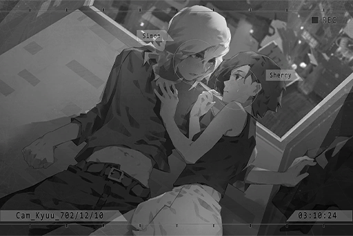

**Xenon** 
......

**Cherry** 
......

*\[Stands up\]*

**Xenon** 
... I'm gonna sleep now, goodnight.

**Cherry** 
... Yeah, goodnight.

*\[Footsteps\]*

**Xenon** 
...... 
I... I forgave you a long time ago. Don't ask that anymore.

**Cherry** 
...... 
... Thank you.

*\[Door Opens\]*

*\[Crashing\]*

**NEKO#ΦωΦ** 
Waah!?

**Xenon** 
NEKO... What are you doing?

**NEKO#ΦωΦ** 
Eh? Ahahaha... it's... umm... ah! Yes! There's huge news on iM! Things got really, really bad!! Another large\-scale terrorist attack has occurred in Node 08! It's very close to uncle JOE's shop! NEKO is here to tell you guys that!

**Xenon** 
WHAT!?

**Cherry** 
What's happening!?

*\[Signal Lost\]*

[*(Click here to go back to the top)*](#toc)

## <a id="cpos024"/>[#024] Cam\_Cafe\_702\_12\_10
### Requirements
|   Character    |Level|
|----------------|:---:|
|**Crystal PuNK**| 19  |

### Log Content
*\[Ringtone\]*

**JOE** 
Wait a sec, I'm coming, I'm coming!

*\[Call Starts\]*

**JOE** 
Whoo, out of...*\*breathes\**... Hello?

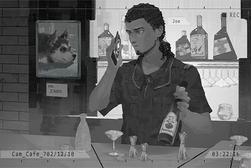

**[Xenon]** 
*JOE! Thank goodness, you're fine.*

**JOE** 
Ah, it's you, Simon. What's up with the sudden call?

**[Xenon]** 
*Where are you? Why did you pick up so late?*

**JOE** 
At the Cafe. I'm testing a new cocktail recipe. I was getting the ingredients from the basement.

**[Xenon]** 
*Wait. So you don't know what is happening outside?*

**JOE** 
Huh? What's happening outside?

**[Xenon]** 
*It's an emergency situation. Check the news now...*

*\[Explosion\]*

**JOE** 
What the hell!? An earthquake?

**[Xenon]** 
*Hey, what...*

**[Cherry]** 
*Simon, folks on iM say it's starting again!*

**JOE** 
Big Sis? What's starting again?

*\[Explosion\]*

**[Xenon]** 
*Quick……leave……there……*

**JOE** 
Simon, you gotta speak louder. The signal here is ...

*\[Powerful Explosion\]*

**JOE** 
UWAAHHH!!

**[Xenon]** 
*JOE!!!*

*\[Call Ends\]*

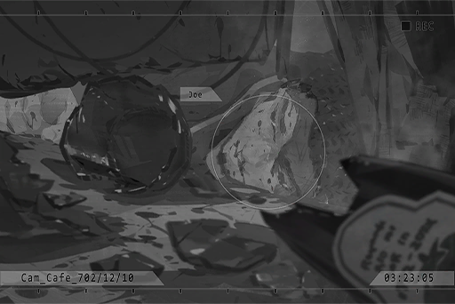

*\[Signal Lost\]*

[*(Click here to go back to the top)*](#toc)

## <a id="cpos025"/>[#025] Audio\_Nora\_702\_12\_10\_1
### Requirements
|   Character    |Level|
|----------------|:---:|
|**Crystal PuNK**| 20  |

### Log Content
*\[Door Opens\]*

**Cherry** 
How was it? Anything on the situation? 

**Member D** 
... From what I've heard, the block was half\-destroyed. Not only did the signal tower get blown to pieces, but the bar you guys mentioned has also collapsed entirely.

**Cherry** 
For real!?

**Member D** 
That's what the report I received said. The owner's body hasn't been discovered, so we can't determine whether he's dead or alive yet... We'll continue to wait for updates.

**Xenon** 
That's all we can do now, Sherry. Let's wait a bit longer.

**Cherry** 
Yeah... Thanks a lot for the help, Mr. Daigo.

**Member D** 
No need to thank me. It's an instruction from Chief.  
We have members in 08 for certain missions, to begin with. Gathering information about this attack is one of their missions too.

**Cherry** 
Nora... Kyuu Hou Kai has deployed members to 08 as well?

**Member D** 
We always have. Although Kyuu Hou Kai's growth relies mostly on technology, the pipelines for materials and resources are equally important. That's why we have members deployed there. Regarding the recent attacks, Chief issued an order very early on, stating that we all pay close attention to these incidents to ensure that they wouldn't affect us.

**Xenon** 
Yet you guys never imagined that these attacks were meant to target Kyuu Hou Kai in the first place. 

**Member D** 
That's right... The identity of the mastermind is already very obvious. This string of attacks is definitely all Diego's doing.

**Cherry** 
... But, Diego's targets should be Kyuu Hou Kai and us. Why would he carry out attacks in 08, his base of operations...

**Member D** 
In their previous attack on Kyubo Medical Center, Mr.Jackson defeated their hackers. You also helped Chief strengthen our firewalls, right? In order to break through our defenses here, Diego is using the city he resides in as a practice field. It might sound absurd, but since this is Diego we're talking about, it's entirely possible.

**Xenon** 
Indeed. I've seen the summary list of all the enhancements Nora has done to Kyuu Hou Kai. Calling this place a "fortress" is a severe understatement. This is not a place where you can break through with a mere few drones. Using other Nodes to test out tactics and act as a smokescreen to hide the actual plan, that's a very reasonable speculation.

**Member D** 
... Mr. Jackson, that list is an encrypted document of the highest security level. If Diego somehow managed to know the structure of the base...

**Xenon** 
Sorry, I'll keep that in mind. 
Nevertheless, I helped you guys enhance your firewall. I don't think it's unreasonable for me to have some understanding of the defense mechanisms here, right?

**Member D** 
Hmm...

**Cherry** 
You can leave it to this guy, Mr. Daigo. As long as he's around, you don't need to worry about problems on the internet... Can't say the same about his aim with a gun though; he kinda sucks at that.

**Xenon** 
Shut up.

**Member D** 
But you're our guests. We should be the ones taking care of outside enemies...

**Cherry** 
Don't say that. Since we're already in the same boat now, let us help out! This isn't just for our own safety. Nora helped us with so many things; it's just natural that we repay some of the favors.

**Member D** 
... Alright then. I'll leave this to you two. Thank you.

**Cherry** 
You're welcome. Speaking of which, where's Nora?

*\[→Signal Switches\]*

**[Nora]** 
*Apologies, for asking to use your eyes at this time of the night.*

**PAFF** 
It's alright. I'm also very worried about JOE. Even though it still isn't very stable, a quick attempt... should be alright.

**[Nora]** 
*Got it. I'll adjust the monitor settings first. One moment, please.*

*\[Typing on keyboard\]*

**PAFF** 
I heard from NEKO that Miss Cherry appears to be tangled up with people from a gang. The previous attack on the hospital was their doing... Could it be, that it's the same situation this time?

**[Nora]** 
*Certainly can't deny the possibility. However, I still need more information before I can make a decision. The fact that you're willing to lend your ability for me to use is a godsend for Kyuu Hou Kai... You have my sincere gratitude.*

**PAFF** 
It's okay, I don't mind helping. Besides...

**[Nora]** 
*Besides?*

**PAFF** 
Even though Nora said that this ability is a curse, and I've never wished for such an ability... if it's for everyone's safety, I am more than willing to use it. In that case, this curse now has the value and reason to exist... The same goes for me too.

**Nora** 
......

**PAFF** 
Nora also feels the same way, right? That's why you're working so hard to research the true nature of this ability.

**[Nora]** 
*... Understanding the mechanisms behind the ability is my current objective. As with how to utilize it, be it based on morality, ethics, or personal decisions, that's something for the future.*

**PAFF** 
......

**[Nora]** 
*... I said too much. Regardless, there are still many unsolved secrets surrounding ability users. Please be sure to take good care of your condition.*

**PAFF** 
Yes... I understand.

*\[Typing on keyboard\]*

**[Nora]** 
*I've finished adjusting the settings. Miss Kaori Minamiya, the target is the attack incident that occurred earlier today at Node 08. You can begin now.*

**PAFF** 
Got it... Hmmm... Ah, I can see it! It's just like last time, so many images and voices...

**[Nora]** 
*Very good. Focus on the key points you want to search.*

**PAFF** 
I see... a person... I think that's JOE? He's arguing with another person on the side of the street...

**[Nora]** 
*... At least we can confirm that Mr. Miller is safe. Can you take a look at the recording of the drones that attacked the site?*

**PAFF** 
Got it. Let me try... Ugh!?

**[Nora]** 
*!? Why all of a sudden...*

*\[Things crashing\]*

**PAFF** 
Ah! Whew... I'm... back?

**[Nora]** 
*... Miss Kaori Minamiya, are you awake? Do you recognize me?*

**PAFF** 
Y...... Yes. Nora... Just now, I did what Nora said and searched the drones in the attack incident. But then the images just suddenly...

**[Nora]** 
*It seems that you're still unable to maintain a connection for an extended amount of time. This is normal. Despite that, I can't help but notice the abnormal numbers displayed right before your disconnection. Please try your best to recall; what did you feel back there?*

**PAFF** 
... This massive sense of oppression, coming in from all directions. I was almost unable to breathe... This sensation... I think I've felt it before.

**[Nora]** 
*Felt it before?*

**PAFF** 
Yes... If I think carefully about it... That's right! It's the same sensation I felt that time...

**Nora** 
......

*\[Signal Lost\]*

[*(Click here to go back to the top)*](#toc)

## <a id="cpos026"/>[#026] Audio\_Nora\_702\_12\_10\_2
### Requirements
|   Character    |Level|
|----------------|:---:|
|**Crystal PuNK**| 20  |

### Log Content
*\[Call Starts\]*

**Cherry** 
Who is this? How did you know this number?

**[STANley]** 
*Hello!? Big sis? It's me!*

**Cherry** 
JOE!? Thank goodness, you're fine! I totally thought you were dead!

**[STANley]** 
*Dead my a\*\*! I'm alive and well, okay!*

**Cherry** 
... What are you calling from?

**[STANley]** 
*I borrowed a phone from a pedestrian! My shop got blown up for no apparent reason and I was busy helping other victims until moments ago. My phone is likely still buried under all the rubble of my shop.*

**[STANley]** 
*Borrowed my a\*\*... You just came up and grabbed my phone you bastard...*

**[STANley]** 
*Come on, don't be so stingy. It's not like it's a long call...*

**Cherry** 
JOE? What is happening?

**[STANley]** 
*Nothing, nothing at all! Just want to tell you guys that I'm safe! Ah, one more thing. Yesterday, Punk got hit with a bad case of diarrhea so I sent him to the pet hospital to rest for a few days. It seems the area around there wasn't affected by the explosions.*

**Cherry** 
Haha, guess Punk got pretty lucky this time... Got it. Thanks a lot.

**[STANley]** 
*Aww, no need to be so polite. What about you guys? Everything alright over there?*

**Cherry** 
Yeah, so far so good. Looks like the incident this time is quite serious?

**[STANley]** 
*Oh, "serious" doesn't even begin to describe how bad this is! I didn't see it personally, but folks have told me that a whole group of drones suddenly arrived on site and started blowing s\*\*\* up! On top of that, their attacks were all targeted at key facilities and the business district!*

**Cherry** 
Diego... you...

**[STANley]** 
*What? Is Diego behind all this?*

**Cherry** 
... Pretty much all but confirmed at this point. He has already admitted that the previous incident at Kyubo Medical Center was his handiwork. We speculate that he wants to use these attacks as sort of a practice run for taking down Kyuu Hou Kai.

**[STANley]** 
*That bastard... Big sis, we must stop him!*

**Cherry** 
We will. You settle yourself down first. You should be able to do that, right?

**[STANley]** 
*No worries. Even though my shop was trashed, I still know quite a few people. I won't have any trouble continuing my business too. Hahaha!*

**Cherry** 
Haha, how trustworthy. Then we'll be asking for your help once the time arrives.

**[STANley]** 
*Hey, are you done yet...*

**[STANley]** 
*Woah! Big sis, I'll be hanging up now! Will get in touch again once I settle things down!*

**Cherry** 
Gotcha. We'll be in touch.

*\[Call Ends\]*

*\[Signal Lost\]*

[*(Click here to go back to the top)*](#toc)

## <a id="cpos027"/>[#027] Audio\_KyuuLab\_702\_12\_11
### Requirements
|   Character    |Level|
|----------------|:---:|
|**Crystal PuNK**| 21  |

### Log Content
*\[Data Input\]*

**[Nora]** 
*The report is almost done. One moment, please.*

**PAFF** 
......

**[Nora]** 
*Miss Kaori Minamiya, what's the matter? Are you not feeling well?*

**PAFF** 
Eh? No... I'm thinking about the things I saw in Node 08 yesterday. It really freaked everyone out...

**[Nora]** 
*...... 
You mentioned that you felt it, right? A sensation that's exactly the same as that time.*

**PAFF** 
Yes... though I'm not exactly sure. I still can't properly focus my mind at a location this far away.

**[Nora]** 
*Take it slowly. You'll get used to it.*

**PAFF** 
Another thing... Can you not refer to me only as Kaori Minamiya? I prefer you call me PAFF.

**[Nora]** 
*"Only"? Your body is without a doubt Kaori Minamiya's body.*

**PAFF** 
I know. Nonetheless, to me, Aroma's memory... the other personality of mine is also something that actually exists. I don't want to disregard or only accept one of them...

**[Nora]** 
*Understood, Miss PAFF.*

**PAFF** 
Thank you. Nora... you're a very kind person, despite your appearance making you look difficult to approach. We've all heard your story from ROBO. Everyone... 

**[Nora]** 
*No need to pity me, and no need to think about trying to help me. We can't choose where we're born, but we can choose how we live. This is the way of life I choose myself.*

**PAFF** 
I didn't mean that... but that's true. I never thought I would become what I am now either. Nora really is strong\-willed... If it was me, I might not be able to do the same...

**[Nora]** 
*You escaped a controlled environment all by yourself. You traveled this far to search for the truth of your being. On top of that, everything you're doing now; they're all results from your own choices. You're not weak, or I should say, no longer weak. Don't you agree?*

**PAFF** 
You have a point. Thank you. 
Ah, since I rarely have the chance to talk with you like this, I have a few questions I want to ask you... but I'm not sure if they'll offend you or not. May I?

**[Nora]** 
*Go ahead, please.*

**PAFF** 
With Kyuu Hou Kai... No, even with the general technology available right now, crafting a pair of prosthetics that will allow you to walk again shouldn't be that difficult, right? Why is Nora still using a wheelchair?

**[Nora]** 
*...... 
This wheelchair, is a gift from Phoenix. I have no intention to leave it. Kyuu Hou Kai is the only place where I need to move around. If I'm going outside, there's Daigo. This is more than sufficient enough.*

**PAFF** 
Is that so...?

**[Nora]** 
*Any other questions?*

**PAFF** 
... If... I overuse my ability, will my eyes... end up like yours?

**[Nora]** 
*...... 
I don't know. But judging from the examination report, we don't have to worry about it any time soon. Your body has high compatibility with the virus, though whether this is a good thing or not is still to be determined.*

**PAFF** 
Is that so...

**[Nora]** 
*... Technically speaking, my eyes aren't actually "blind". However, my optic nerves have been locked deep inside the OS space. Therefore, to see the things that are physically in front of me, I have to rely on footage live\-recorded by these instruments. It's not exactly easy to see them very clearly in that space. Without these instruments, I won't be able to see anything... Not sure if you can understand this explanation.*

**PAFF** 
Yes. Just like you've mentioned before, if I can't master this ability, my entire mind may end up getting trapped inside...

**[Nora]** 
*"Virtual\-internet Related Post\-Traumatic Stress Disorder", or VR PTSD for short, is a medically recognized disease. According to my research, our situation may be similar to this. In addition, this disease doesn't just affect ability users who are immune to the virus. If regular people suffer excessive impact and stimulation while connected, it may result in a situation where they too have a part of their mind trapped inside that space. *

**[Nora]** 
*In other words, cyTus... the technology of the entire Library itself and the secrets it hides are deeply related to us. This is also a major subject of the virus research I took over from Phoenix.*

**PAFF** 
"The Ender"... what exactly is it? And what is the thing I saw when I connected to the Library...?

**[Nora]** 
*It is still unclear, but I believe that everything will be cleared up soon. 
Thanks to you, the vaccine for the virus has made new progress. Perhaps in a few days, we'll be able to develop a sample using this new module. *

**PAFF** 
For real!? That's great news!

**[Nora]** 
*Don't get your hopes up too high. All I did was take your genes and adjusted them according to theories and formulas. Whether or not this has any actual effect is still to be determined.*

*\[Signal Lost\]*

[*(Click here to go back to the top)*](#toc)

## <a id="cpos028"/>[#028] Cam\_Nora\_702\_12\_14
### Requirements
|   Character    |Level|
|----------------|:---:|
|**Crystal PuNK**| 22  |

### Log Content
*\[Alarm\]*

**[Kyuu Hou Kai System]** 
*Threat invasion detected in area 03, engaging full fortification in three minutes.  Security personnel, please proceed to your battle stations.*

**Kyuu Hou Kai Member** 
Fellow guests, please move in this direction.

**NEKO#ΦωΦ** 
Don't push NEKO! 
W\-w\-w\-w\-what is going on! Nora\-chan!?

**[Nora]** 
*Apologies. The facility is under attack. Before we can resolve this situation, we would like fellow guests to hide here for now.*

**NEKO#ΦωΦ** 
EH!? What attack? Is it dangerous!?

**[Nora]** 
*Daigo, the screen. 
... It appears that the tunnels in area 03 have already been completely broken through.*

**Member D** 
Damnit, how on earth did they find that entrance!? Security team A, team B, report to area 03 immediately!

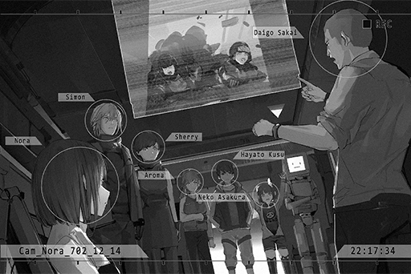

**Cherry** 
Is it Diego...? NEKO, you can relax. Kyuu Hou Kai should be able to deal with those people just fine.

**Xenon** 
... The thing Daigo is holding... is that footage from the entrance? Those are the same model of drones that attacked Kyubo Medical Center...

**[Nora]** 
*However, the scale this time far surpasses that incident. Looks like they're getting serious too.*

**[Surveillance Camera]** 
*This is security team B. The system cannot stop them! Request...*

*\[Machine gun\]*

**[Surveillance Camera]** 
*Ugahh...!!*

**Member D** 
Miyamoto!? Answer me! 
Crap... Chief, we'll have to deploy more people to defend.

**[Nora]** 
*This battle will more or less cause everyone some discomfort. Please forgive us. Nonetheless, staying in here will ensure that you won't be in danger. 
Daigo, we'll go to the area 03 control room. I'll personally operate the defense system. *

**ROBO_Head** 
......

**Hayato** 
Nora, shouldn't you stay here as well?

**PAFF** 
It's way too dangerous for you to go outside!

**NEKO#ΦωΦ** 
Yeah! Not to mention Nora\-chan can't move around freely. It's better that you stay with us...

**[Nora]** 
*The automation of the defense system is just one of its many forms. I am required to use my ability to connect with the system for it to maximize its effectiveness. 
You all seem very concerned, but we have plenty of experience dealing with attacks of similar scale. Please rest assured.*

**PAFF** 
But, if Nora uses the ability again...

**[Nora]** 
*... It's alright.*

**[ROBO_Head]** 
*Nora, this unit, has firearm installed by Mr. Ichiro. Able to help.*

**[Nora]** 
*I won't allow that. You stay here together with them.*

*\[Wheelchair moving\]*

*\[Door Opens\]*

**Cherry** 
Hey! Nora! 
Damnit, the door is locked...

**NEKO#ΦωΦ** 
... Is it really alright?

**Xenon** 
Judging from the footage, their methods are not gonna stop those drones.

**Cherry** 
Yeah. They aren't attacking the right parts either.

**Xenon** 
...... Are you thinking what I'm thinking?

**Cherry** 
... Uh\-huh. The problem now is, how are we gonna open this door?

**PAFF** 
Don't tell me, you guys are going... you sure about that?

**Hayato** 
Right! We should do what Nora told us and hide here. It's safer that way, isn't it?

**Xenon** 
Back off. I'm going to overload the gear in the door lock.

*\[Footsteps\]*

**Xenon** 
ROBO...?

**[ROBO_Head]** 
*This room, is Nora and this unit's room. This unit, doesn't want it to suffer any damage.*

**Cherry** 
Everyone might be in danger if we don't do something about this!

*\[Enters Password\]*

*\[Door Opens\]*

**[ROBO_Head]** 
*Password... Nora, didn't change.*

**Xenon** 
So you know the password, thanks! 
Sherry, let's go.

*\[Parts moving\]*

**[ROBO_Head]** 
*This unit, join as well.*

**Cherry** 
A gun...? 
You sure about this?

**[ROBO_Head]** 
*Protect Nora, protect everyone.*

**Cherry** 
Gotcha. Then you'll act according to my commands. We help Simon create an opportunity, he'll get rid of those drones, just like how we did it back at the Kyubo Medical Center, correct?

**Xenon** 
If we're lucky. 
You three, stay here. Hayato, watch the door closely.

*\[Door Closes\]*

**NEKO#ΦωΦ** 
Xenon!

*\[Signal Lost\]*

[*(Click here to go back to the top)*](#toc)

## <a id="cpos029"/>[#029] Audio\_Kyuu\_702\_12\_14\_1
### Requirements
|   Character    |Level|
|----------------|:---:|
|**Crystal PuNK**| 22  |

### Log Content
**[Nora]** 
*What... what is going on here? The defense system... is not attacking those drones?*

**Member D** 
So the entire system has been hacked into?

**[Nora]** 
*Are Diego's hackers actually capable of doing this kind of thing...?*

**Member D** 
We certainly underestimated them a bit too much...

**[Nora]** 
*Whatever. Daigo, help me get connected. I'll take a look and see what the situation is with the system.*

**Member D** 
Yes, Chief.

*\[Connection\]*

**[Nora]** 
*What... is this? 
...... Ugh!*

**Member D** 
Chief! Are you alright!?

**[Nora]** 
*The system... has become so bizarre. 
Don't worry about me. Grab a weapon and go support the security team. Help them retreat to the central area.*

**Member D** 
Chief...!?

**[Nora]** 
*Go, now!*

*\[→Signal Switches\]*

*\[Machine Gun\]*

**Kyuu Hou Kai Member A** 
AARRGH!!

**Kyuu Hou Kai Member B** 
There are way too many of them! Besides, what the hell is this firepower!? I don't recall the admins' drones being such a pain in the a\*\* to deal with...

*\[Explosion\]*

**Member D** 
Everyone! Retreat to the central area! I'll provide cover for you guys!

**Kyuu Hou Kai Member B** 
Daigo!? What about Chief?

**Member D** 
Stop yapping and start running!

*\[Consecutive Gunshots\]*

**Member D** 
Hey! Diego! Don't you want me dead real bad!? Then come and get it! This way!

**Kyuu Hou Kai Member B** 
Team A! Team B! Retreat! Retreat!

*\[Machine Gun\]*

**Kyuu Hou Kai Member B** 
Waaaahh!! They're coming this way!?

**Member D** 
!? 
They ignored me? Damnit...!

**Cherry** 
Out of my way!

*\[Gunshot\]*

**Member D** 
!? 
Miss Pauline... ROBO\_Head!?

**[ROBO_Head]** 
*Mr. Daigo, left arm injured. Non\-life threatening. 
Scanning... life signs detected ahead, rescue.*

**Member D** 
What are you guys doing here!? How did you get out of that room?

**Cherry** 
Be quiet and let us take over here. You grab the others and start running.

**Member D** 
... So you guys can handle this...? I'll leave it to you then. Sorry!

*\[Consecutive Gunshots\]*

**Cherry** 
Great job! Robohead! 
Simon!

*\[Hacking\]*

**Xenon** 
... Their actions are different than the ones at Kyubo Medical Center. I can't take care of them all in one go.

**Cherry** 
Then we'll do it in multiple tries! 
Robohead, one more time. You ready?

**[ROBO_Head]** 
*Affirmative.*

*\[Signal Lost\]*

[*(Click here to go back to the top)*](#toc)

## <a id="cpos030"/>[#030] Audio\_Kyuu\_702\_12\_14\_2
### Requirements
|   Character    |Level|
|----------------|:---:|
|**Crystal PuNK**| 22  |

### Log Content
**Xenon** 
Huff... Puff... Last one left...

**Cherry** 
Very good! Hey, you okay?

**[ROBO_Head]** 
*Xenon, stamina depleted. Require water intake.*

**Cherry** 
Are you serious? We just barely ran a few meters!

**Xenon** 
Shut up...... 
...... Watch out!!

*\[Push away\]*

*\[Explosion\]*

**[ROBO_Head]** 
*Wall, destroyed. Cause: Pulse bomb used by drones.*

**Cherry** 
Simon!? Simon! Where are you!?

**Xenon** 
*\*Cough cough\**...! I'm fine! 
... My device is missing! Where is it!?

**Cherry** 
I have it! Can you come out here?

**Xenon** 
*\*Cough\**... I can't. The wall is blocking the way. 
It is likely just attacking at random. It doesn't seem that it has discovered us. Gotta destroy it before that... Robohead, can you destroy the wall?

**[ROBO_Head]** 
*Report: Magazine empty. Physical attack of this unit, unable to fulfill request.*

*\[Drones Flying\]*

**Cherry** 
... No other way around it then.

*\[Device connection\]*

**Xenon** 
... Sherry? What are you doing?

**Cherry** 
I've connected your A.I. to my virtual internet chip. Tell me how to operate this thing!

**Xenon** 
......!? No! Your chip hasn't been configured for it. It may hurt your...

**Cherry** 
Shut your damn mouth and just tell me! We don't have time!

**Xenon** 
... Fine. Listen closely. Once my A.I. locks on to the weak point, press the red button on the interface. This will bring up a list of adjustable parameters for the drone. Crank the core operating speed up to max. 
However... we need to knock away its armor for my A.I. to lock on... ROBO, you're out of bullets, right?

**[ROBO_Head]** 
*Affirmative.*

**Xenon** 
Sherry, what about you?

**Cherry** 
Ugh... this interface is so complicated! I can't operate this thing and shoot at the same time!

*\[Drones Flying\]*

**Xenon** 
It's getting closer and closer...

**[Nora]** 
*I'll... do the attack.*

**Xenon** 
Nora!? Where are you?

**[Nora]** 
*In the control room... the defense system... failed just now. But... I've addressed the issue already. 
I'm going to pull the trigger... please be prepared.*

*\[Gunshot\]*

**Xenon** 
NOW!

**Cherry** 
Wah! Wait...

*\[Machine Gun\]*

**Xenon** 
Sherry!?

*\[Hacking\]*

**[Nora]** 
*... We did it?*

**[ROBO_Head]** 
*Report: All drones destroyed. 
Miss Cherry hit, bullet wound. Collapsed and currently unconscious.*

**Xenon** 
!! 
Is she alright!?

**[ROBO_Head]** 
*Scanning... Life signs stable.*

**Xenon** 
... Whew...

**[Nora]** 
*ROBO... take her to the medical room in the central area. 
Mr. Simon Jackson, one moment, please... We'll help free you from the rubble.*

**Xenon** 
Sherry...

**[Nora]** 
*Please rest assured. We will rescue her with all the resources at our disposal. In the entirety of Node 03, this is the place with the most advanced medical technology.*

*\[Signal Lost\]*

[*(Click here to go back to the top)*](#toc)

## <a id="cpos031"/>[#031] Cam\_Ward\_702\_12\_14
### Requirements
|   Character    |Level|
|----------------|:---:|
|**Crystal PuNK**| 23  |

### Log Content
*\[Door Opens\]*

**Xenon** 
What is her situation?

**Kyuu Hou Kai Member** 
Mr. Jackson, apologies in advance, but before you enter this ward, please place all transmitting devices outside.

**Xenon** 
I don't mind... but why?

**Kyuu Hou Kai Member** 
Chief will explain it to you later. 
Miss Pauline's injuries are not serious. We've finished treating all of them. However, her condition is still recovering. As of now, she has yet to regain consciousness.

**Xenon** 
... She...

*\[Door Opens\]*

**NEKO#ΦωΦ** 
Sis Cherry! Waaaaahhhhh!

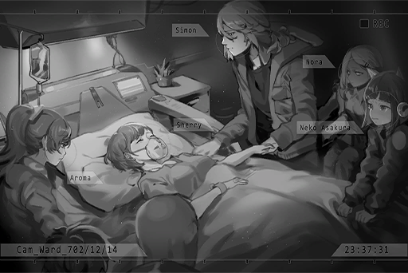

**[Nora]** 
*Please remain silent.*

**NEKO#ΦωΦ** 
Oh...

**[Nora]** 
*Mr. Simon Jackson, please be at ease. She won't be waking up for a while. I programmed it to be that way.*

**Xenon** 
Nora... What do you mean?

**[Nora]** 
*She has slight signs of a concussion. We scanned her brainwaves and discovered some abnormalities. Perhaps it's related to the fact that during the impact, your device had a sudden surge that may have affected her mind.*

**Xenon** 
... It's all my...

**[Nora]** 
*Please don't fault yourself. You two are heroes who saved everyone... the second time you've done so too. Miss Sherry Pauline is guaranteed to make a full recovery. Please leave it to me.*

**Xenon** 
For real? Thank you.

**[Nora]** 
*We should be the ones thanking you two.*

**PAFF** 
We have to say thank you to you as well.

**Hayato** 
No kidding. Even though I tried to stop you guys rushing out the room back there... Sorry, I couldn't do anything...

**NEKO#ΦωΦ** 
Yeah! You guys are everyone's hero! Though your methods are very reckless\~

**Xenon** 
You don't get to lecture me on that...

*\[Knocks on head\]*

**NEKO#ΦωΦ** 
Oww! That hurt!

**Xenon** 
These words of gratitude, you should tell them to Sherry. She'll be much more elated than me.  
When will she wake up?

**[Nora]** 
*The life support system and virtual device are currently repairing and stabilizing her mind. Meanwhile, they are providing her with the nutrients she needs and transfusing the blood she lost. In approximately a few hours, she'll be able to make a full recovery. *

**NEKO#ΦωΦ** 
Amazing. Just this one giant machine and you can automatically heal a person!

**Xenon** 
Nora, you look... terrible. Did something happen?

**[Nora]** 
*No... It's not related to Miss Sherry Pauline's situation. It's just that... when I was releasing the defense system from the hacking... ugh... I ran into... some issues...*

**Member D** 
Chief, please return to your toom and get some rest.

**[Nora]** 
*No, I'm fine. 
The alarm has been disabled. Everyone, please return to your rooms. This place is not designed to house so many people. The chips we have will interrupt the system's operations.*

**NEKO#ΦωΦ** 
Eh\~ NEKO wants to stay here with Sis Cherry though... 
Can't help it then; let's go to PAFF's room to play some games!

**Hayato** 
Why are you so carefree about this whole thing...?

**[Nora]** 
*...... 
Alright. Everyone, leave the room so the treatment process can continue.*

*\[Door Opens\]*

**Xenon** 
......

**[Nora]** 
*What's the matter?*

**Xenon** 
Excuse me, but I want to stay here... Can I?

**[Nora]** 
*...... 
Alright. You didn't bring your device in, did you?*

**Xenon** 
Yeah.

**[Nora]** 
*Miss Sherry Pauline is still not completely out of danger yet. Before the automatic treatment procedure is complete, please be careful. This life support system is very precise and delicate. Try your best to avoid touching anything.*

**Xenon** 
Understood.

**[Nora]** 
*... Mr. Simon Jackson.*

**Xenon** 
Hmm?

**[Nora]** 
*Once she wakes up, there's something I want to tell you and the others.*

**Xenon** 
What is it?

**[Nora]** 
*I hope to tell it in a situation where everyone is present... The clues you brought, I may have figured some things out...*

**Xenon** 
......! 
Got it. I'll stay here with her.

**[Nora]** 
*I'll leave her to you. Also, for one last time, thank you.*

**Xenon** 
Not at all.

*\[Door Opens\]*

*\[»»» Fast Forward»»»\]*

**Xenon** 
......

**Xenon** 
Sorry, this is all my fault.

*\[Lights Off\]*

**Xenon** 
!?

**Xenon** 
What is happening? 
Hey!?

*\[Signal Lost\]*

[*(Click here to go back to the top)*](#toc)

## <a id="cpos032"/>[#032]  Audio\_Kyuu\_702\_12\_15\_1
### Requirements
|   Character    |Level|
|----------------|:---:|
|**Crystal PuNK**| 24  |

### Log Content
*\[Lights Off\]*

**Member D** 
What is going on!?

**Kyuu Hou Kai Member** 
No idea! The power suddenly went out!

**Member D** 
Damnit! Diego, haven't you had enough with your bulls\*\*\*!! 
Machine team, report!

**[Kyuu Hou Kai Member]** 
*Machine team here. The system suddenly went berserk and stopped responding. We've been hacked!*

**Member D** 
Activate backup power immediately!

**[Kyuu Hou Kai Member]** 
*We're already trying, but the only thing that has worked is a small portion of the backup lighting. We are unable to provide power to all other systems...*

**[Nora]** 
*Da...... 
Daigo...... Daigo! Can you hear me?*

**Member D** 
Chief!? This is Daigo. The signal is very weak. What is happening!?

**[Nora]** 
*I'm not sure either. Report the situation outside to me immediately.*

**Member D** 
The entire power supply for Kyuu Hou Kai has gone offline! We are currently investigating the reason. Not certain if this is yet another attack... Where is Chief now!?

**[Nora]** 
*... I'm in ROBO's room. There's an old terminal here. I'll use it to connect to the system and see what's going on.*

**[Kyuu Hou Kai Member]** 
*Daigo! Bad news!*

**Member D** 
What is it?

**[Kyuu Hou Kai Member]** 
*The virus vaccine sample in the central lab has been destroyed!*

**Member D** 
Vaccine sample? The one made from Kaori Minamiya's genes... So the attack on area 03 was just a bait to lure all our forces to that location? Damnit, what the hell is Diego trying to do!?

**Member D** 
......! 
Miss Pauline! Medical team, report! Is anyone nearby Miss Pauline's ward!?

**[Kyuu Hou Kai Member]** 
*Report, all the entrances have failed. The only person inside is Mr. Jackson...*

**Member D** 
Destroy the door! No matter what we do, restoring power to the life support system is of utmost priority!

**[Kyuu Hou Kai Member]** 
*No good... There's no way we can destroy the reinforced door designed by Chief with what we have now... I'm so sorry!*

**Member D** 
F\*\*\*! Is there nothing we can do!? 
Move! I'm gonna blow this door open.

**Kyuu Hou Kai Member** 
Hey!?

**Member D** 
There's no other way about it!

**Kyuu Hou Kai Member** 
Even if we get there, how are we gonna reboot the life support system...

**Member D** 
Shut your piehole! Did you forget who saved all our a\*\*es just now!

*\[Explosion\]*

**Member D** 
Good, this will work. 
All of you, come with me!

**Kyuu Hou Kai Member** 
... Yes, sir!

*\[Signal Lost\]*

[*(Click here to go back to the top)*](#toc)

## <a id="cpos033"/>[#033] Cam\_Ward\_702\_12\_15
### Requirements
|   Character    |Level|
|----------------|:---:|
|**Crystal PuNK**| 24  |

### Log Content
*\[Kicks Door\]*

**Xenon** 
Damnit! Can't open it. 
Hey! Is anyone there!?

**Xenon** 
......

**Xenon** 
The backup lighting is still on... Only the main power source is dead, is it?

**Cherry** 
... Ugh...

**Xenon** 
Sherry!? Are you awake? 
So this means that the entire life support system has stopped functioning...?

**Cherry** 
Haa... I feel... awful...

**Xenon** 
......! 
Hang in there. I'll call someone here right away!

*\[Kicks Door\]*

**Xenon** 
My device is also outside, or else I would've had a chance to hack this door open... 
... What exactly is going on?

**Cherry** 
Haah...

**Xenon** 
Sherry, are you alright?

**Cherry** 
... Can you come closer? I want you... by my side.

**Xenon** 
... Yeah.

*\[Footsteps\]*

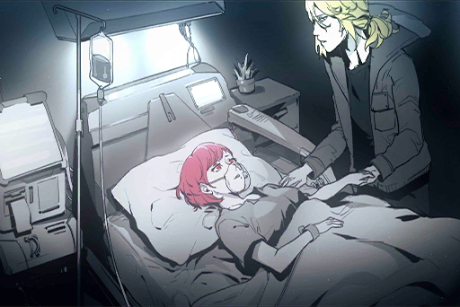

*\[Holds Hand\]*

**Cherry** 
Feels like... I had a really weird dream...

**Xenon** 
......

**Cherry** 
... I was standing on a pitch\-black water surface, constantly looking for a flower... A blue... illuminating flower. Whenever I was about to touch it, it disappeared. This repeated itself, again and again...

**Xenon** 
......

**Cherry** 
For some reason, I feel... that it's something very important. If I don't find it... I will lose everything...

**Cherry** 
If I can return to the dream, maybe I'll be able to find it this time.

**Xenon** 
It's just a dream. 
Don't fall asleep. The system should be restored very soon. Nora would never leave a situation like this unaddressed.

**Cherry** 
... Yeah. 
I kind of understand what you meant by "let go of the past" now... Perhaps the thing I want to pursue never existed in the first place...

**Xenon** 
......

**Cherry** 
But... you're here.

**Xenon** 
... Yes, I'm here.

**Cherry** 
Hey, sing "Still" for me...

**Xenon** 
......

**Cherry** 
Come on... it's not like there's anybody else here...

**Xenon** 
... Okay.

**Xenon** 
*\*You don't have to cover yourself 
when no one can be trusted 
I'm still here standing beside you 
but they tore us apart  
and I still keep you inside my broken heart\**

**Xenon** 
......

**Cherry** 
...... Haha...... 
... Your singing... 
sucks......

**Xenon** 
Sherry...?

**Cherry** 
......

**Xenon** 
......

*\[Signal Lost\]*

[*(Click here to go back to the top)*](#toc)

## <a id="cpos034"/>[#034] Audio\_Kyuu\_702\_12\_15\_2
### Requirements
|   Character    |Level|
|----------------|:---:|
|**Crystal PuNK**| 25  |

### Log Content
*\[Power on\]*

**Kyuu Hou Kai Member** 
The power is restored...!?

**Member D** 
Quick! We need to get there as fast as possible!

*\[→Signal Switches\]*

**PAFF** 
The power is back!

**NEKO#ΦωΦ** 
Sis Cherry!

*\[→Signal Switches\]*

*\[Door Opens\]*

**Member D** 
Miss She...rry...

**Kyuu Hou Kai Member** 
......! Oh god, what's the deal with this chaotic mess!?

**Member D** 
Attention to all medical staff. Return to your positions ASAP. Miss Sherry is not showing any vital signs. Reboot the life support system immediately. 

**Member D** 
Miss Sherry! Can you hear me? Hang in there!

**Kyuu Hou Kai Member** 
Daigo, she's already...

**Member D** 
Shut up! Did you not hear me!? Do as I say!!

*\[Door Opens\]*

**NEKO#ΦωΦ** 
Sis Cherry!

**PAFF** 
Is she alright!?

**Member D** 
OUT! We're doing an emergency operation on her.

**NEKO#ΦωΦ** 
Sis Cherry! Sis Cherry! No...! Waaaahh...

*\[»»» Fast Forward»»»\]*

**Member D** 
......

**Kyuu Hou Kai Member** 
... They did everything they could...

**PAFF** 
... *\*Sobs\**...

**Hayato** 
... Damn it...

**NEKO#ΦωΦ** 
Sis Cherry! Sis Cherry! 
Why did this happen!? HEY! Say something! Say something, baldy...!

*\[Punching and hitting\]*

**Member D** 
......

**NEKO#ΦωΦ** 
Safest place in the entire Node my a\*\*! Liars! You're all a bunch of...

*\[Punching and hitting\]*

**Hayato** 
NEKO! Calm down!

**NEKO#ΦωΦ** 
How can I calm down!? Sis Cherry is... is... WAAAAHHHHHH!!

**Member D** 
... I'm sorry...

**NEKO#ΦωΦ** 
What's the point of saying sorry now!?

**Member D** 
We don't want things to be like this either!

**[Nora]** 
*Enough.*

**Member D** 
... Chief.

**PAFF** 
Nora...?

**[Nora]** 
*I'm the one who is responsible for her death. Please don't blame it on the other members.*

**Member D** 
Chief, what are you talking about...?

*\[»»» Fast Forward»»»\]*

**[Nora]** 
*... And that was how things went. It was me who failed to make an immediate decision.*

**PAFF** 
Nora, this is not your fault...

**Hayato** 
NEKO, have you calmed down now? I'm going to let go.

**NEKO#ΦωΦ** 
...... 
... Xenon... Where's Xenon!?

**Member D** 
We don't know. By the time we got here, he was already gone... Everything in the room was smashed. We have no idea what actually happened...

**[Nora]** 
*He's the one who smashed everything in the room, I believe. During the blackout, no one was able to leave or enter this room. It was during that time that Miss Pauline... He bore the brunt of all this. It must be truly painful.*

**[Nora]** 
*Daigo, send Miss Pauline back to her family and ensure that the people in 08 take good care of everything, including her father.*

*\[Door Opens\]*

**PAFF** 
NEKO? Where are you going!?

**NEKO#ΦωΦ** 
... Home...

**Hayato** 
Hey! NEKO!

**[Nora]** 
*Let her go. Daigo, make sure someone's escorting her. At least make sure she arrives home safely.*

**[Nora]** 
*Just as Miss Asakura said, this place indeed can't be considered safe anymore. I underestimated the enemy's ability and put my guests through this kind of risk... I'm no longer qualified to make a promise for your safety. From now on, you don't have to stay here anymore. *

*\[Signal Lost\]*

[*(Click here to go back to the top)*](#toc)

## <a id="cpos035"/>[#035] Message\_JOE\_702\_12\_21
### Requirements
|   Character    |Level|
|----------------|:---:|
|**Crystal PuNK**| 26  |

### Log Content
**JOE** 
Yo, you there? 
*[Sent at AM 01:23]*

**JOE** 
Aye, what's the hell's wrong with you? You ain't even picking up your phone 
*[Sent at AM 01:23]*

**JOE** 
We just finished up big sis' funeral here 
*[Sent at AM 01:24]*

**JOE** 
I wanted to tell you about it but the wild cat said u went missin!?!? 
*[Sent at AM 01:24]*

**JOE** 
Big sis' dad even came He didn't blame you at all 
*[Sent at AM 01:25]*

**JOE** 
He even said he wants to properly thank you if he gets to see you 
*[Sent at AM 01:25]*

**JOE** 
Said that if it wasn't for you, big sis would've never gotten back up on her feet and return to the stage 
*[Sent at AM 01:25]*

**JOE** 
Didn't hear things too clearly though That was about it since I was balling like a little girl 
*[Sent at AM 01:26]*

**JOE** 
Didn't hear things too clearly though. That was about it since I was balling like a little girl 
*[Sent at AM 01:26]*

**JOE** 
I know you like to be alone when you're not in a good mood 
*[Sent at AM 01:27]*

**JOE** 
but don't go missing for too long\~ 
*[Sent at AM 01:27]*

**JOE** 
Got some stuff I wanna talk to you about too 
*[Sent at AM 01:27]*

**JOE** 
Anyway, shoot me a message will ya we're all worried about you 
*[Sent at AM 01:30]*

*\[JOE is offline\]* 

[*(Click here to go back to the top)*](#toc)

## <a id="cpos036"/>[#036] Audio\_KaiStudio\_702\_12\_24
### Requirements
|   Character    |Level|
|----------------|:---:|
|**Crystal PuNK**| 27  |

### Log Content
**NEKO#ΦωΦ** 
Sensei, he's in the inner room.

**??????** 
Hehe, don't call me Sensei. I haven't seen you in so long. Seems like you've grown taller?

**NEKO#ΦωΦ** 
Muuu\~ don't treat me like a child.

**??????** 
...*\*chuckles\* ...\*sigh\**... Hiding in such a filthy place like this, no wonder folks couldn't find you. Even a cockroach wouldn't want to enter a place like this.

**NEKO#ΦωΦ** 
Ahaha… NEKO was able to find him on the streets only because Aroma\-chan helped out. Then I asked brother Kai to...

**??????** 
I'm aware. I've already heard about the details from Miss Nora.

**NEKO#ΦωΦ** 
Umm... so what are you gonna do next? No matter how much you knock, he doesn't seem to respond at all...

**??????** 
I came here to confirm a few things, then I'll leave immediately. First, let's make sure that he's not dead in there, shall we?

**NEKO#ΦωΦ** 
Eh, probably not...He ate everything NEKO brought him. Then he put the utensils in front of the door like this. It's like he's a total recluse...

*\[Door Knock\]*

**NEKO#ΦωΦ** 
Xenon, someone's here to see you…

**??????** 
Hey, would you please open the door? You know who I am, don't you?

**Xenon** 
……

**NEKO#ΦωΦ** 
...Looks like he still hasn't recovered…

*\[Kicks Door\]*

**Xenon** 
!?

**NEKO#ΦωΦ** 
EHHH!?

**ConneR** 
Good afternoon. It has been a while.

**Xenon** 
……

**ConneR** 
Is it just me, or is this déjà vu? You in dire straits looking like crap, and then I bust in like a valiant hero.

**Xenon** 
...What do you want?

**ConneR** 
Didn't you hear? I'm here to confirm a few things. Little kitten, can you give us some alone time?

**NEKO#ΦωΦ** 
Eh? Ah, okay… NEKO will go wash the dishes.

**ConneR** 
There's...quite a lot of instruments here. An old storage room for an instrument shop? Fits your current situation quite well, don't you think?

**Xenon** 
……

**ConneR** 
Okay, enough with the chit\-chat. We've already got our hands on some clues regarding the enemy and some important information. Thus, Miss Nora and I think it's time we head to the epicenter of this entire incident——Node 08.

**Xenon** 
……?

**ConneR** 
Oh? You haven't heard about it? I've already touched base with them and the two sides have exchanged all the information we've obtained. You've been away from the team for quite some time now, so if you're still interested, I can catch you up to speed in no time.

**Xenon** 
……

**ConneR** 
Figure as much. The pain one feels from losing a loved one, it's not like I haven't had similar experiences either. How about we set such serious matters aside for now? You think you'd feel better?

**Xenon** 
I think I'd feel much better if you got the hell out of here right now.

**ConneR** 
Haha, very funny. Don't forget, if it wasn't for the fact that you could offer us major assistance in this operation, there's no way I'd be willing to come to this dump.

**Xenon** 
……

**ConneR** 
Don't be like this. Relax.  
...*\*sigh\**... What a hassle. You don't know how to pull yourself out of this, do you? Catch.

**Xenon** 
Wah!?

**ConneR** 
That's quite a nice guitar, eh? Play a song with me, will you?

**Xenon** 
... Huh? I am not in the mood right now…

*\[Music\]*

**Xenon** 
……!

**ConneR** 
Recognize this song? I really like it. The last song included on Crystal PuNK's album.

**Xenon** 
... Stop playing…

**ConneR** 
You've spent the majority of your life trying to save the people around you, yet you have no idea how to save yourself. Is there anything more pathetic than that? Pick up that guitar, the prelude's about to end. Play this tune with me and I'll leave once it's over. Then you can continue to enjoy your pitiful life in peace.

**Xenon** 
... If that'll get rid of you.

*\[Guitar\]*

*\[»»»Fast Forward»»»\]*

**ConneR** 
This truly is a wonderful piece. You can hear the elegant and exquisite flow of emotions. If Miss Pauline could hear it once more, she'd definitely be moved, wouldn't she?

**Xenon** 
……

**ConneR** 
Look at you. Are you crying? There's no need to keep it in.

**Xenon** 
... Shut up.

**ConneR** 
You haven't cried at all since then? I bet every time something bad happens to you, you always keep it bottled up inside. If someone ever forgets that tears can heal, music is always there to remind them.

**Xenon** 
……

**ConneR** 
As we agreed upon, I'll be leaving. Wish you the best of luck, Mr. Jackson.

**Xenon** 
... What exactly is the point of you coming here?

**ConneR** 
Perhaps you should ask those tears that are streaming down your face why? You wanted revenge but exacted it on the wrong person. If you still have a little bit of motivation, we've already got information on the real culprit. You're welcome to join the team whenever you want, what do you say?

**Xenon** 
…… 
No.

**ConneR** 
……

**Xenon** 
This stuff, it's all pointless now.

**ConneR** 
Is that so? If you believe that stopping a worldwide terrorist attack and disaster is pointless, then I won't force you.

**Xenon** 
……!

**ConneR** 
Interested now?

**Xenon** 
…… 
No. Get the hell out of here.

**ConneR** 
... What a shame. Okay then, see you again soon... Maybe.

*\[Signal Lost\]*

[*(Click here to go back to the top)*](#toc)

## <a id="cpos037"/>[#037] Audio\_Trans\_03\_702\_12\_26
### Requirements
|   Character    |Level|
|----------------|:---:|
|**Crystal PuNK**| 28  |

### Log Content
**[Platform Announcement]** 
*Attention, fellow passengers. The express train directly to Node 08 is now arriving at the platform. For your own safety, please stand behind the yellow line.*

**PAFF** 
Ah, Mr. Neumann and NEKO are here.

**NEKO#ΦωΦ** 
Aroma\-chan!

**ConneR** 
Good evening to you all.

**[Nora]** 
*Looks like you weren't able to get Mr. Jackson back.*

**ConneR** 
Unfortunately. However, with the morose state he is in now, I don't think he could be of much help anyway.

**[Nora]** 
*... I understand. I truly do feel sorry for him.  
Well then, before we set out, let's confirm our plan one last time.*

**ConneR** 
I'll speak first. It may appear that out of nowhere, we've decided to head to Node 08 in a hurry. Besides the fact that we're short on time, there is also another issue. That is——although we currently have Miss PAFF's ability, the effect seems to differ in terms of its range.

**[Nora]** 
*That's correct. Since we've already locked onto our key target——Ivy is very likely is in 08, I believe it will be best if we can resolve everything there.*

**ConneR** 
On top of that, although the little kitten and loverboy are moving around with us right now, I suggest that as soon as we arrive there you two find a safe place to hide.

**NEKO#ΦωΦ、Hayato** 
\- EHHH!? 
\- Hey!?

**ConneR** 
I'll be frank. Although your courage and will are indeed worthy of admiration, there is absolutely nothing you can offer in terms of helping us with the operation. In fact, if you stay, you'll be a serious burden.

**NEKO#ΦωΦ、Hayato** 
……

**[Nora]** 
*I agree with Mr. Neumann. Things may become very dangerous. For those without particular skill sets, it's best that you stay out of it.*

**NEKO#ΦωΦ** 
How come…

**PAFF** 
NEKO, Hayato, I agree with them too. You two have helped me sooo much, but from now on, it'll have to be on me. It's my turn to protect you guys this time!

**Hayato** 
Oh…

**ConneR** 
Miss PAFF, once we arrive there, we may need you to make contact with Ivy in that so\-called "OS" space immediately. Before that...... ROBO\_Head.

**[ROBO_Head]** 
*Yes.*

**ConneR** 
Are you sure the method you mentioned previously can work?

**[ROBO_Head]** 
*Report: Initial calculations, results, plausible.*

**Nora** 
……

**ConneR** 
Good. If that's the case, I might just have a chance to help Miss PAFF while she's in that space.

**NEKO#ΦωΦ** 
……?

**[Platform Announcement]** 
*Attention, fellow passengers. The express train directly to Node 08 is now arriving at the platform. For your own safety, please stand behind the yellow line.*

**[Nora]** 
*It's time.*

*\[Signal Lost\]*

[*(Click here to go back to the top)*](#toc)

