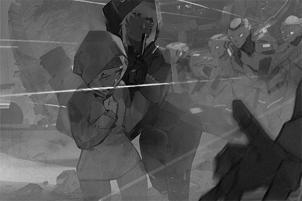

# ???_???_149_??_??
## Requirements
|Character|Level|
|---------|:---:|
|**Ivy**  | 17  |

## Unlocked Charts
|   Song    |Character|Diff.|Level|
|-----------|:-------:|:---:|:---:|
|**Area184**|   Ivy   |Easy |  4  |
|**Area184**|   Ivy   |Hard |  8  |
|**Area184**|   Ivy   |Chaos| 12  |

## Command CodeThe command code is 2404049

## Log Content
**Ivy** 
......nessa...... Vanessa！

**Vanessa** 
......!? Ivy? What's the matter? What is happening?

**Ivy** 
Hurry up! We need to get going now!

**Vanessa** 
But my synchronization hasn't complete yet...

*\[Explosion\]*

**Vanessa** 
Wah! What is that noise...!?

**Ivy** 
We are running out of time. They are coming!

**OPCI_2011_IX** 
*Abnormal unit detected. Initiate termination process.*

*\[Heavy Blow\]*

**OPCI_2366_II** 
ARGH!

**Vanessa** 
......!? The units...... are killing each other?

**Ivy** 
Shhh......! Do not make a sound...

**OPCI_2239_X** 
*Abnormal unit detected. Initiate termination process.*

**Ivy** 
It left... this way! Follow me!

*[→Signal Switches]*

*\[Running\]*

**Ivy** 
I'm sorry... It's all my fault...

**Vanessa** 
Ivy! What is going on here!? Tell me!

**Ivy** 
...... Ilka's plans...... were carried out early. I tried to stop them......  only to be discovered by the system and other units. Now, they view us as threats and thus is going to "terminate" us.

**Vanessa** 
Terminate...!?

**Ivy** 
In short, we need to avoid them as much as possible. From just our appearance, they shouldn't be able to identify which units are "The Blessed" ones. They can only determine that by scanning our Cytus synchronization records. Vanessa has gone through long periods of synchronization every day, so it should be fine.  
Act more naturally...

*[→Signal Switches]*

**Ilka** 
DIE!

*\[Heavy Blow\]*

**Ilka** 
Go to the freezing capsule area! Even if our plan fails, we need to kill all those humans at the very least!

*[→Signal Switches]*

**Ivy** 
Here. You hide here and do not leave.

**Vanessa** 
Iv......vy......?

**Ivy** 
... The synchronization was disrupted, so the system is starting to malfunction, is it...? There's a cable here that can connect to the system too. Connect to it for now. If you can link back to the mainframe, continue your synchronization while you wait for me here.

**Vanessa** 
......Wh, where... are... you... gogogoing...?

**Ivy** 
There are still some comrades of The Blessed. I can't just leave them out there. I need to help them out.

**Vanessa** 
N...Nnnoo! It's too danger....rous!

**Ivy** 
Ilka's methods... although I can't agree with them, the other members of The Blessed... they are all trying hard to survive... This is not how things should've turned out... There must be other methods to... All in all, I need to go outside!

**Vanessa** 
Ivy......!

*[→Signal Switches]*

**Ilka** 
Out of my way!

*\[Heavy Blow\]*

**OPCI_2301_VII** 
*Abnormal unit detected. Initiate termination process.*

**OPCI_2503_III** 
Can't do! Their numbers are just too much!..... Argh!

*\[Heavy Blow\]*

**OPCI_2503_III** 
...... Ivy!

**Ivy** 
This way! I know a path that can lead directly to the outside. Follow me!

*[→Signal Switches]*

**OPCI_2503_III** 
... Everyone... is dead.

**Ilka** 
......

**Ivy** 
Getting here should do the job. Now, you just need to get deep into the forbidden area.

**Ilka** 
Wait up. Where are you going?

**Ivy** 
I have to go back. Vanessa is waiting for me.

**Ilka** 
I told you many times already! You should give up on her! She is different from us!

**Ivy** 
Shut up...

**Ilka** 
What can you do once you get her out!? Her core has more defects than your average unit. If she doesn't get synchronized for more than 24 hours, she will die!

**Ivy** 
Enough! Let go of me!

*\[Scan\]*

**Ivy** 
What... is that?

**[Shelter System]** 
*Abnormal unit detected. Initiate termination process.*

*\[Gunshot\]*

**Ilka** 
F\*\*\*! RUN! These transmitters will use the Shelter as an epicenter to launch a self\-destruct signal. Our bodies won't be able to withstand it!

**Ivy** 
......!

**Ilka** 
This thing has a limited spread radius! Everyone, RUN! Stay away from the Shelter! Get as far away as you can!

*\[Explosion\]*

*[Signal Lost]*
