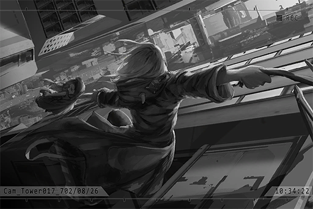

# Cam_Tower017_702_08_26
## Requirements
|Character|Level|
|---------|:---:|
|**Ivy**  | 25  |

## Unlocked Charts
|    Song    |Character|Diff.|Level|
|------------|:-------:|:---:|:---:|
|**Pressure**|   Ivy   |Easy |  3  |
|**Pressure**|   Ivy   |Hard |  7  |

## Log Content
**Man** 
Wait for daddy here, okay? I'll be back in a minute.

**Girl** 
...... Okay.

**Man** 
... Today is your birthday. Don't look so gloomy. Let's go to the amusement park in the afternoon, shall we?

**Girl** 
... If big sister is not going together...

**Man** 
...... 
Vivi, your sister is not coming back again. People who have passed on will never come back again. You must learn to get used to this... get it? Your sister wouldn't want to see you like this either.

**Girl** 
...... Okay.

**Man** 
Then daddy will go upstairs to work. You wait here. Don't get too close to the railing though, it's dangerous.

*[»»» Fast Forward»»»]*

**Girl** 
So high... big sister also... from a place this high...

**Girl** 
If I... from here, I'll be able to visit big sister, right...? Mr. Doll...

**Staff A** 
Alright, alright, alright! Keep going!

**Staff B** 
HEY! Look out! There's someone behind you!

**Staff A** 
WOAH!

*\[Crash\]*

**Girl** 
Ah! Mr. Doll!

**Staff A** 
Little girl, it's dangerous...

*\[Railing breaks\]*

**Girl** 
AHHHHH!!

**Staff B** 
Yikes! She's going to fall down! Dude, come and help me out, now!

**Girl** 
AHH! WAAHHHH!!

**Staff A** 
Hold on tight, little girl! Do not let go no matter what! Hey, get something, anything and stretch it out for her to grab!

**Staff B** 
N... not good! She's too far away!

**Man** 
Vivian!! 
That's my daughter! Please save her!

**Staff A** 
Hngg... Just a little bit more...

*\[Railing breaks\]*

**Staff A** 
WAHHH!

*\[Running\]*

**Girl** 
AHHHHHHH!!

**Ivy** 
Hmph......!

*\[Lands\]*

**Ivy** 
Ha~......

**Girl** 
*\*Bawls\**

**Man** 
Vivian!! 
MIss! Thank you! Thank you so much!

**Staff A** 
That jump was insane... how did you do it? Thank you!

**Ivy** 
......

*[»»» Fast Forward»»»]*

**Agent A** 
In short, your construction company will be responsible entirely for this accident. Are you fine with that?

**Staff A** 
Yes...... We are very sorry. It really is our mistake...

**Ivy** 
......

**Man** 
Miss! Wait, don't leave yet! Is there anything I can do to repay you...

**Ivy** 
...... No......

**Girl** 
*\*Cries\*... \*Cries harder\*...* Mr. Doll...

**Ivy** 
That thing... is it very important to you? You leaped out into the open to pick it up...

**Girl** 
... Mr. Doll, is the thing sister and me... I thought... I could go and find sister together with it... But it was so scary... *\*Sobs\**... I was really scared... waahhhh...

**Man** 
......

**Ivy** 
......

**Staff A** 
Yes, then that girl over there made this super far jump. That's how she was able to grab the little girl.

**Agent A** 
From this distance...?

**Ivy** 
... I have to leave now.

*\[Hurried Footsteps\]*

**Man** 
Ah! Wait......!

*[→Signal Switches]*

**Ivy** 
Why... did I rescue her...?

**Ivy** 
...... 
......?

**Ivy** 
This is... that little girl's doll. Should I go up there and give it back to her...? 
...... Forget it.

*[Signal Lost]*
