# Ivy OS Logs
## List of Logs
- [Added on v2.0](#added-on-v20)
    - [OS Log #001](#os-log-001)
    - [OS Log #002](#os-log-002)
    - [OS Log #003](#os-log-003)
    - [OS Log #004](#os-log-004)
    - [OS Log #005](#os-log-005)
    - [OS Log #006](#os-log-006)
    - [OS Log #007](#os-log-007)
    - [OS Log #008](#os-log-008)
    - [OS Log #009](#os-log-009)
    - [OS Log #010](#os-log-010)
    - [OS Log #011](#os-log-011)
    - [OS Log #012](#os-log-012)
    - [OS Log #013](#os-log-013)
    - [OS Log #014](#os-log-014)
    - [OS Log #015](#os-log-015)
    - [OS Log #016](#os-log-016)
    - [OS Log #017](#os-log-017)
    - [OS Log #018](#os-log-018)
    - [OS Log #019](#os-log-019)
    - [OS Log #020](#os-log-020)
    - [OS Log #021](#os-log-021)
    - [OS Log #022](#os-log-022)
    - [OS Log #023](#os-log-023)
    - [OS Log #024](#os-log-024)
    - [OS Log #025](#os-log-025)
    - [OS Log #026](#os-log-026)
    - [OS Log #027](#os-log-027)
    - [OS Log #028](#os-log-028)
    - [OS Log #029](#os-log-029)
    - [OS Log #030](#os-log-030)
    - [OS Log #031](#os-log-031)
    - [OS Log #032](#os-log-032)
    - [OS Log #033](#os-log-033)
    - [OS Log #034](#os-log-034)
    - [OS Log #035](#os-log-035)
- [Added on v2.1](#added-on-v21)
    - [OS Log #036](#os-log-036)
    - [OS Log #037](#os-log-037)
    - [OS Log #038](#os-log-038)
- [Added on v2.2](#added-on-v22)
    - [OS Log #039](#os-log-039)
    - [OS Log #040](#os-log-040)
- [Added on v2.3](#added-on-v23)
    - [OS Log #041](#os-log-041)
    - [OS Log #042](#os-log-042)
    - [OS Log #043](#os-log-043)
- [Added on v2.4](#added-on-v24)
    - [OS Log #044](#os-log-044)
- [Added on v2.5](#added-on-v25)
    - [OS Log #045](#os-log-045)
- [Added on v2.6](#added-on-v26)
    - [OS Log #046](#os-log-046)
    - [OS Log #047](#os-log-047)
- [Added on v2.7](#added-on-v27)
    - [OS Log #048](#os-log-048)
    - [OS Log #049](#os-log-049)
- [Added on v2.8](#added-on-v28)
    - [OS Log #050](#os-log-050)
    - [OS Log #051](#os-log-051)
    - [OS Log #052](#os-log-052)
    - [OS Log #053](#os-log-053)
    - [OS Log #054](#os-log-054)
- [Added on v2.9](#added-on-v29)
    - [OS Log #055](#os-log-055)
    - [OS Log #056](#os-log-056)
    - [OS Log #057](#os-log-057)
    - [OS Log #058](#os-log-058)
    - [OS Log #059](#os-log-059)
    - [OS Log #060](#os-log-060)
    - [OS Log #061](#os-log-061)
    - [OS Log #062](#os-log-062)
    - [OS Log #063](#os-log-063)
    - [OS Log #064](#os-log-064)
    - [OS Log #065](#os-log-065)
    - [OS Log #066](#os-log-066)
    - [OS Log #067](#os-log-067)
    - [OS Log #068](#os-log-068)
    - [OS Log #069](#os-log-069)
    - [OS Log #070](#os-log-070)
    - [OS Log #071](#os-log-071)
    - [OS Log #072](#os-log-072)
    - [OS Log #073](#os-log-073)
    - [OS Log #074](#os-log-074)
    - [OS Log #075](#os-log-075)

## Added on v2.0

### OS Log #001
___

[Back to Top](#list-of-logs) | [Next Log](#os-log-002)

#### Main\_Log\_699\_12\_23
This is...... How long has it been...?

Nothing but green... In my memory, this is a precious color, but all my eyes can see now are shrubs, moss, and vines. To a point where the sky is barely visible. 

Have to go back soon. She is still waiting for me in the Shelter.

However, before I go back...... there is one thing I must do first.

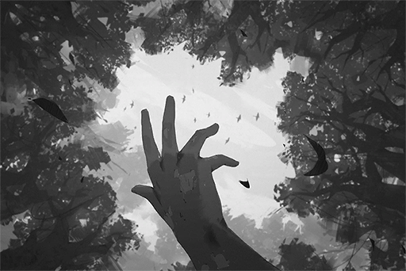

[Back to Top](#list-of-logs) | [Next Log](#os-log-002)

### OS Log #002
___

[Last Log](#os-log-001) | [Back to Top](#list-of-logs) | [Next Log](#os-log-003)

#### Command Code
The command code is `2501004`.

#### Unlocked Charts
|  Song   |Char.|Diff.|Lv.|
|---------|:---:|:---:|:-:|
|**Reset**| Ivy |Easy | 3 |
|**Reset**| Ivy |Hard | 7 |
|**Reset**| Ivy |Chaos|12 |

#### Main\_Log\_102\_01\_18
Protocol activated  
Initializing reset and mass production procedure  
Core 20\*\*\*\*V to 49\*\*\*\*F series  
Location locked on  
Initializing system reset......100%  
Overwriting all current status......100%  
Wiping memories......100%  
Implementing HOS......100%   
\[Warning\] Reset rate 99.92%......error occurred  
\[Suggestion\] Ignore and continue......

Initializing mass production preparation  
20\*\*\*\*V to 16\*\*\*\*L series  
preparing prototype variations......

Class: Enforcer  
Weapon system...checked  
Armored plates...checked  
Extra power cells...checked  
Advanced sensors...checked  
Enforcer......complete

Class: Constructor  
Heavy machinery slots...checked  
Extra heavy lifting engine...checked  
Extra durable power cells...checked  
Constructor......complete

Class: Caretaker  
Human imitation learning system... checked  
Extra detailed skin coating...checked  
Realistic hair layers...checked  
Biomass power system...checked  
Caretaker......complete

[Last Log](#os-log-001) | [Back to Top](#list-of-logs) | [Next Log](#os-log-003)

### OS Log #003
___

[Last Log](#os-log-002) | [Back to Top](#list-of-logs) | [Next Log](#os-log-004)

#### Image\_???\_699\_12\_23
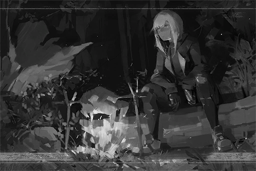

[Last Log](#os-log-002) | [Back to Top](#list-of-logs) | [Next Log](#os-log-004)

### OS Log #004
___

[Last Log](#os-log-003) | [Back to Top](#list-of-logs) | [Next Log](#os-log-005)

#### Requirements
| Char. |Lv.|Lv. Locked?|
|-------|:-:|:---------:|
|**Ivy**| 2 |    No     |

#### Cam\_???\_699\_12\_25
_\[Footsteps\]_

**Ivy**  
It's about time... I find the next meal. If I don't, I'm not going to make it there.

_\[Animal Chirp\]_

**Ivy**  
......?

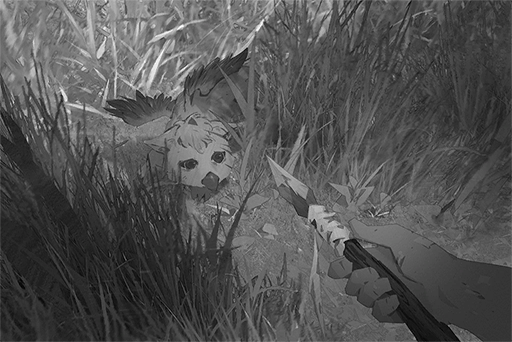

**Ivy**  
......

_\[Animal Chirp\]_

**Ivy**  
Are you injured......? Sorry, but I'm going to have to eat you.

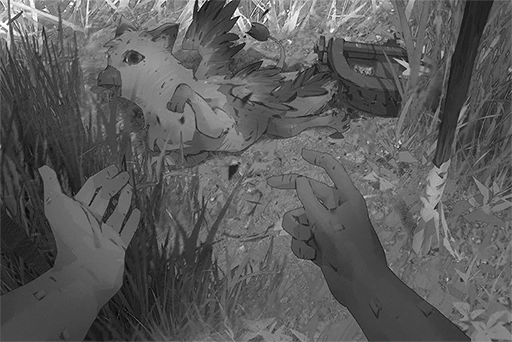

**Ivy**  
......!?

_\[Animal Chirp\]_

**Ivy**  
This is... a man\-made trap...?

**Ivy**  
The structure is very new... Could it be...

**Ivy**  
......

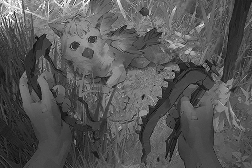

**Ivy**  
......

_\[Animal Chirp\]_

**Ivy**  
...... Go. Don't get caught again.

_\[Signal Lost\]_

[Last Log](#os-log-003) | [Back to Top](#list-of-logs) | [Next Log](#os-log-005)

### OS Log #005
___

[Last Log](#os-log-004) | [Back to Top](#list-of-logs) | [Next Log](#os-log-006)

#### Requirements
| Char. |Lv.|Lv. Locked?|
|-------|:-:|:---------:|
|**Ivy**| 3 |    No     |

#### Main\_Log\_699\_12\_28
Been six days since I woke up, and I haven't even made it out of the jungle... It appears that the distance is much further than I imagined. It seems like there is no end to the wall of green. Fortunately, food sources are abundant. 

When I woke up this morning, the creature I rescued last time was staring at me while hiding behind a tree. The moment I turn my head, it immediately ducks back behind the tree; but then it quickly peeks out again with an expression filled with curiosity. No matter where I go, whenever I turn around, I can always see it.

Just now, when I was eating, I tried to approach it by tossing it a fruit. It ate the fruit very quickly. After it was full, it stretched its wings, lied down, and started sleeping loudly.  It showed no caution towards me at all, like I'm someone he's very familiar with. 

Looking at it, I'm getting sleepy as well. That's it for today.

[Last Log](#os-log-004) | [Back to Top](#list-of-logs) | [Next Log](#os-log-006)

### OS Log #006
___

[Last Log](#os-log-005) | [Back to Top](#list-of-logs) | [Next Log](#os-log-007)

#### Requirements
| Char. |Lv.|Lv. Locked?|
|-------|:-:|:---------:|
|**Ivy**| 4 |    No     |

#### Command Code
The command code is `2501004`.

#### Unlocked Charts
|  Song   |Char.|Diff.|Lv.|
|---------|:---:|:---:|:-:|
|**D R G**| Ivy |Easy | 2 |
|**D R G**| Ivy |Hard | 6 |
|**D R G**| Ivy |Chaos|11 |

#### ???\_???\_142\_??\_??
**[Shelter System]**  
_All units, proceed to the freezing capsule area, Prepare to begin daily routine checkup._

**OPCI_2501_IV**  
......

**[Shelter System]**  
_All units, proceed to the freezing capsule area, Prepare to begin daily routine checkup._

**OPCI_2501_IV**  
......

_\[»»» Fast Forward»»»\]_

**[Cytus System]**  
_All units, proceed to Cytus mainframe for connection. Initiate emotion synchronization and troubleshoot._

**OPCI_2501_IV**  
......

**[Cytus System]**  
_All units, proceed to Cytus mainframe for connection. Initiate emotion synchronization and troubleshoot._

**OPCI_2501_IV**  
......

_\[»»» Fast Forward»»»\]_

**[Shelter System]**  
_All units, proceed to the freezing capsule area, Prepare to begin daily routine checkup._

**OPCI_2501_IV**  
......

**[Shelter System]**  
_All units, proceed to the freezing capsule area, Prepare to begin daily routine checkup._

**OPCI_2501_IV**  
......

_\[»»» Fast Forward»»»\]_

**[Cytus System]**  
_All units, proceed to Cytus mainframe for connection. Initiate emotion synchronization and troubleshoot._

**OPCI_2501_IV**  
......

**[Cytus System]**  
_All units, proceed to Cytus mainframe for connection. Initiate emotion synchronization and troubleshoot._

**OPCI_2501_IV**  
......

_\[»»» Fast Forward»»»\]_

**[Shelter System]**  
_All units, proceed to the freezing capsule area, Prepare to begin daily routine checkup._

**OPCI_2501_IV**  
Today... same thing again...?

**OPCI_2601_X**  
_2501 Unit 04, Unable to recognize voice command. Please repeat._

**OPCI_2501_IV**  
...... Nothing.

**OPCI_2601_X**  
_Voice command canceled_

**OPCI_2501_IV**  
......

**OPCI_2601_X**  
_Reminder: 2501 Unit 04, you are detached from the formation. Please return to your work position._

**OPCI_2501_IV**  
...... Understood.

_\[»»» Fast Forward»»»\]_

**[Shelter System]**  
_All units, proceed to the freezing capsule area, Prepare to begin daily routine checkup._

**OPCI_2501_IV**  
......

**OPCI_2348_III**  
_Reminder: 2501 Unit 04, you are detached from the formation. Please return to your work position._

**OPCI_2501_IV**  
Report: Suspect hardware error. Require visit to maintenance area B.

**OPCI_2348_III**  
_Understood. Unit 05, please take over Unit 04's position._

**OPCI_2501_V**  
_Understood._

_\[»»» Fast Forward»»»\]_

**[Maintenance Area System]**  
_2501 Unit 04, checkup complete. No errors detected._

**OPCI_2501_IV**  
I... I don't have any malfunctions?  
It feels like I... am different compared to the other units.

**[Maintenance Area System]**  
_No errors detected. Please return to your work position._

**[Shelter System]**  
_Class: Constructor, Caretaker. Please proceed to Entrance A and prepare to leave for Node 08 to perform routine construction._

**OPCI_2501_IV**  
Skipping a day... wouldn't matter too, right?

_\[»»» Fast Forward»»»\]_

_\[Footsteps\]_

**OPCI_2501_IV**  
So Shelter has a place like this... So beautiful...

**OPCI_2501_IV**  
......

_\[Scooping water\]_

**OPCI_2501_IV**  
What... am I?

_\[Signal Lost\]_

[Last Log](#os-log-005) | [Back to Top](#list-of-logs) | [Next Log](#os-log-007)

### OS Log #007
___

[Last Log](#os-log-006) | [Back to Top](#list-of-logs) | [Next Log](#os-log-008)

#### Requirements
| Char. |Lv.|Lv. Locked?|
|-------|:-:|:---------:|
|**Ivy**| 5 |    No     |

#### Unlocked Charts
|         Song          |Char.|Diff.|Lv.|
|-----------------------|:---:|:---:|:-:|
|**Sentimental Journey**| Ivy |Chaos|14 |

#### Cam\_???\_699\_12\_30
_\[Footsteps\]_

**Ivy**  
So... it didn't follow me today?

_\[Footsteps\]_

_\[Animal Chirp\]_

**Ivy**  
......?

**Sagar**  
Take it back to the car.

**Ivy**  
!?

_\[Hides\]_

**Bruno**  
What's that noise!? Everybody, stay alert!

**Alex**  
Hah? I didn't hear anything though? Big B, you should stop being so twitchy and jumpy...

**Sagar**  
There are a lot of creatures around this place. It's normal to hear some movement. Let's go. We've wasted too much time here.

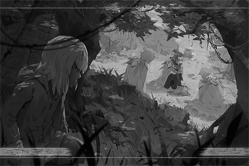

**Alex**  
Why are you panting so much on an easy slope like this? Here.

**Lucy**  
Hah... Hah... Go away. I can walk by myself.

**Ivy**  
...... Humans......?  
They're the ones who set up the trap!

_\[Animal Chirp\]_

**Lucy**  
Captain, that's...

**Sagar**  
From its appearance, seems to be a type of "rock dove". However, the size is much smaller and the hair color is different as well. Could be a new species.

**Alex**  
This could sell for quite the big bucks in the black market. Whaddaya say? I've maintained my contact with those collectors to this very day.

**Bruno**  
... Stop making jokes like that. They're VERY unfunny.

_\[Armored car engine\]_

**Ivy**  
They are taking it away!

_\[Signal Lost\]_

[Last Log](#os-log-006) | [Back to Top](#list-of-logs) | [Next Log](#os-log-008)

### OS Log #008
___

[Last Log](#os-log-007) | [Back to Top](#list-of-logs) | [Next Log](#os-log-009)

#### Requirements
| Char. |Lv.|Lv. Locked?|
|-------|:-:|:---------:|
|**Ivy**| 6 |    No     |

#### Main\_Log\_699\_12\_30
Been following those humans for the entire day... They seem to refer to themselves as "Exploration team". The words "Eagle\-01" can be seen on their equipment. They took that creature away. I wonder how it is going to be treated?

From their conversations, I figured out that their mission has one last location to visit. I went ahead to the coordinates and checked out the place. As I expected, it's "Shelter 32". It's located in the complete opposite direction of "Shelter 08", the one I'm going to. However, I must save it from their hands first...

Shelter 32 has collapsed almost entirely. Half the entrance is buried in branches and rocks. Just how long have I been unconscious for... I can't get in this way. My only option now is to wait for those humans to open up the entrance.

The database index inside each Shelter has the coordinates of every Shelter. After I obtain that, I can also grasp my accurate geographic position and the current time better.

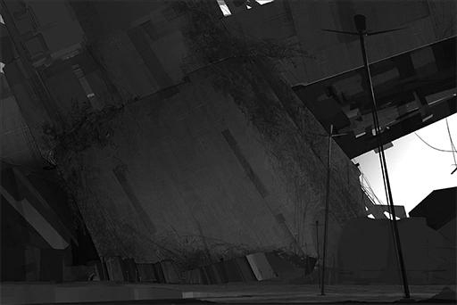

[Last Log](#os-log-007) | [Back to Top](#list-of-logs) | [Next Log](#os-log-009)

### OS Log #009
___

[Last Log](#os-log-008) | [Back to Top](#list-of-logs) | [Next Log](#os-log-010)

#### Requirements
| Char. |Lv.|Lv. Locked?|
|-------|:-:|:---------:|
|**Ivy**| 7 |    No     |

#### Command Code
The command code is `2501004`.

#### Unlocked Charts
|    Song    |Char.|Diff.|Lv.|
|------------|:---:|:---:|:-:|
|**Biotonic**| Ivy |Easy | 3 |
|**Biotonic**| Ivy |Hard | 7 |
|**Biotonic**| Ivy |Chaos|13 |

#### ???\_???\_143\_??\_??
**[Shelter System]**  
_All units, proceed to the freezing capsule area, Prepare to begin daily routine checkup._

**OPCI_2501_IV**  
......

**OPCI_2633_IX**  
_Reminder: 2501 Unit 04, you are detached from the formation. Please return to your work position._

**OPCI_2501_IV**  
Report: Suspect hardware error. Require visit to maintenance area B.

**OPCI_2633_IX**  
_Understood. Unit 05, please take over Unit 04's position._

**OPCI_2501_V**  
...... U, understood.

**OPCI_2501_IV**  
......?

_\[»»» Fast Forward»»»\]_

**[Shelter System]**  
_Class: Constructor, Caretaker. Please proceed to Entrance A and prepare to leave for Node 08 to perform routine construction._

**OPCI_2501_IV**  
......

**OPCI_2501_V**  
......

**OPCI_2501_IV**  
......

**OPCI_2501_V**  
...... Sighs......

**OPCI_2501_IV**  
......?

**OPCI_2501_V**  
......

**OPCI_2501_IV**  
... Do you... feel tired as well?

**OPCI_2501_V**  
......!  
Yes, a little bit...

**OPCI_2501_IV**  
How strange. Our designs shouldn't allow us to feel tired in the first place. Our energy storage is abundant too.

**OPCI_2501_V**  
We... Can we talk to each other like this?

**OPCI_2501_IV**  
...... We can't?

**OPCI_2501_V**  
...... I don't know.

**OPCI_2501_IV**  
Both the database and the protocol do not contain any prohibitions regarding this matter.

**OPCI_2501_V**  
......

**OPCI_2501_IV**  
......

**OPCI_2501_V**  
The other units.... are all very quiet.

**OPCI_2501_IV**  
...... Yes.

_\[»»» Fast Forward»»»\]_

**OPCI_2103_I**  
_Tower 003 construction process, start. All units, please stay connected and report your progress._

**OPCI_2501_IV**  
Understood.

**OPCI_2501_V**  
Understood.

**OPCI_2501_V**  
...... We're in the same group again today.

**OPCI_2501_IV**  
Yes. We are the last group of units remaining for this model, which makes our coordination sync rate the highest. Other groups have all been rebuilt due to damages.

**OPCI_2501_V**  
What happens... after the rebuilding?

**OPCI_2501_IV**  
... I don't know; but it's not like we'll remember it either, right? According to the records, both of us are products of rebuilding. Do you remember anything from before your rebuild?

**OPCI_2501_V**  
No... I don't remember.

**OPCI_2501_IV**  
If you don't want to be rebuilt, you need to be careful during work.

**OPCI_2501_V**  
Okay...

**OPCI_2501_IV**  
......

**OPCI_2501_V**  
These buildings we are constructing... do they really have a purpose?

**OPCI_2501_IV**  
I don't know. Everything progresses according to the protocol. After we finish the constructions, we wait for the humans to awake from the freezing capsules. Then we will operate and manage this city. That is our purpose. No one has ever questioned it. We only cared about doing our work properly.

**OPCI_2501_V**  
I wonder... what are humans like?

**OPCI_2501_IV**  
...... I've never thought about that question.

**OPCI_2501_V**  
......

**OPCI_2501_IV**  
... Definitely different from us, that I am certain.

_\[Signal Lost\]_

[Last Log](#os-log-008) | [Back to Top](#list-of-logs) | [Next Log](#os-log-010)

### OS Log #010
___

[Last Log](#os-log-009) | [Back to Top](#list-of-logs) | [Next Log](#os-log-011)

#### Requirements
| Char. |Lv.|Lv. Locked?|
|-------|:-:|:---------:|
|**Ivy**| 8 |    No     |

#### Audio\_???\_699\_12\_31
**Sagar**  
Big B, you done setting it up?

**Alex**  
Are sure this can blow it open? Thing looks tiny.

**Bruno**  
Not "blow"; more like "shake".  
Almost ready. Don't underestimate this baby right here. Its power output is no joke. Rocks are no different from paper mache to it.

**Sagar**  
Lucy, once the entrance is opened, lock down this area. Stay alerted about our surroundings.

**Lucy**  
Understood. Right now, according to the scope scan, no movement detected in a one\-kilometer radius.

**Alex**  
Speaking of which, hasn't this Shelter been discovered for a very long time? Why did they wait until now to finally ask us to investigate?

**Sagar**  
The terrain in this area is too rugged. No other team has the balls to come here. In the end, the higher\-ups had no other choice but to send us here to basically trailblaze. Were you asleep during the mission briefing reports?

**Alex**  
Yep. What's the difference? It's not like I didn't see this scenario coming from miles away.

**Sagar**  
If possible, we will set up the temporary base first. We'll probably clean up the terrain as well. This way, it will be more convenient for us when we cooperate with other teams in the future.

**Alex**  
Laaammmeee... Compare to boring tasks like these, I would much rather do things like hunting down poachers. Ya know, like the folks who set the trap that caught this little guy. We could've definitely tracked them down.

**Sagar**  
That is not the main purpose of this mission.

**Alex**  
I know, I know. Nevertheless, I still hope that we can get a job that's about capturing those damn poachers next time.  
I'll let them get a good taste of my fists. They're getting rusty from all this dumb busy work...... Oops, no offense, Miss Freeze.

**Lucy**  
...... Shut up. Don't touch me.

**Bruno**  
Jackal, stop screwing around. Come and help me out... Captain, I'm all done here. Ready to activate any moment at your command.

**Sagar**  
Alright. Activate shockwave shaker!

**Bruno**  
Activate!

_\[Rocks collapse\]_

**Lucy**  
Report. Obstacle removal successful.

**Sagar**  
Good. Listen up, team! Prepare yourself; we're entering the ruins. The armored vehicles will be set aside for now since they don't fit in here. From here on out, we'll be exploring on foot; assume formation 2!

**Team member**  
Roger!

**Sagar**  
Jackal, you lead the way.

**Alex**  
Yes, sir\~ Bambi's looking more and more like a captain by the day\~

**Sagar**  
And I wonder who's fault is that for dumping all this work on me?

**Ivy**  
... This is the chance.

_\[»»» Fast Forward »»»\]_

_\[Animal Chirp\]_

**Ivy**  
Don't be scared... I'll let you out right now.

**Ivy**  
Eh? This is...... bandaging? The broken bones are set back in place. A very well\-done treatment...

_\[Animal Chirp\]_

**Ivy**  
They... didn't capture you. Instead, they saved you... is it...?  
...... All in all, need to figure out a way to open this cage first...

**Bruno**  
WHO'S THERE!?

**Ivy**  
......!

**Bruno**  
Everyone! We got a problem!

**Alex**  
You're not escaping!...... Holy crap! This guy is fast...

**Lucy**  
Hmph!

_\[Gunshot\]_

**Ivy**  
......Ugh!

**Lucy**  
Got it.

**Bruno**  
Lucy! Above you!!

_\[Rocks collapse\]_

**Sagar**  
Big B!

**Bruno**  
Cough cough...

**Lucy**  
Big B is injured!

_\[Hurried Footsteps\]_

**Alex**  
Hey, it's getting away!

**Sagar**  
Stay put! It has already been shot. No need to rush. Organize the team first. Did anyone get a clear view of what that thing is? Big B?

**Bruno**  
Apologizes, it was too sudden, so I couldn't get a good look... Ugh!

**Lucy**  
Don't move. Your clavicle is shattered.  
Captain, his injury requires a trip back to the base for full treatment...

**Sagar**  
I guess that leaves us with no other options... Suspend mission! Stay alert throughout the journey. We will gather up and return to A.R.C.

**Alex**  
Tch... I couldn't keep up with it... F\*\*\*, what the hell is that thing?

_\[Signal Lost\]_

[Last Log](#os-log-009) | [Back to Top](#list-of-logs) | [Next Log](#os-log-011)

### OS Log #011
___

[Last Log](#os-log-010) | [Back to Top](#list-of-logs) | [Next Log](#os-log-012)

*(The OS Log has a video version, you can watch it on [this link](https://youtu.be/zMfZTXMbYQI))*

#### Requirements
|    Char.    |Lv.|Lv. Locked?|
|-------------|:-:|:---------:|
|**PAFF**     |24 |    No     |
|**NEKO#ΦωΦ** |24 |    No     |
|**ROBO_Head**|24 |    No     |
|**Ivy**      | 9 |    Yes    |

#### Main\_Log\_700\_01\_01
...... The information obtained from Shelter 32's database index showed that it is right now the end of 699 N.A. already. If I do some basic calculations, this means I've been unconscious for...... more than five hundred years?

How is that...... N, no, I have to calm down...

The reconstruction project has already concluded. The "Node" cities have been established too. That's why I saw those humans. That's also why almost all Shelters are abandoned now. A visit to Shelter 08... would be utterly pointless as well.

We...... failed, in the end. Lost everything...... including you......

\[Added after edit on 700/01/01 02:02:53\]

I must witness with my own eyes the current human civilization. Only issue... my left arm is gradually losing sensation due to being hit by the gunshot earlier... I must hurry. 

Coordinates show that Node 08 is just nearby. Time to move.

[Last Log](#os-log-010) | [Back to Top](#list-of-logs) | [Next Log](#os-log-012)

### OS Log #012
___

[Last Log](#os-log-011) | [Back to Top](#list-of-logs) | [Next Log](#os-log-013)

#### Requirements
| Char. |Lv.|Lv. Locked?|
|-------|:-:|:---------:|
|**Ivy**|10 |    No     |

#### Unlocked Charts
|     Song      |Char.|Diff.|Lv.|
|---------------|:---:|:---:|:-:|
|**Alexandrite**| Ivy |Chaos|13 |

#### Audio\_08GateC\_700\_01\_01
_\[Armored car engine\]_

**Agent A**  
Mr. Sagar, thanks for the hard work. Brought something interesting back again this time?

_\[Animal Chirp\]_

**Agent B**  
Woah!? What is this!?

**Bruno**  
Hey, keep your distance, people.

**Agent B**  
Mr. Bruno... are you injured? Is it alright?

**Bruno**  
Yes, broke a few bones. However, nothing particularly serious.

**Sagar**  
This little guy seems to be a new species of "rock dove". We discover it on the way. It was wounded by a poacher's animal trap.

**Agent A**  
A new species, eh... that's incredible.

**Agent C**  
Scan complete. All clear. Please proceed to the next checkpoint. Mr. Sagar, please sign here.

**Sagar**  
Thank you.

_\[Signature\]_

**Bruno**  
Wait a second. Isn't the weight number off?

**Agent A**  
Is anything wrong with it? This is the weight recorded at the weigh station.

**Sagar**  
Bruno has a point. Our weight is 100 plus kilograms more than what we declared.

**Agent B**  
You're right... Apologies; I did not notice that.

**Alex**  
Did Lucy get off the car when we were going through the weigh station?

**Lucy**  
Die.

**Alex**  
OWWW! That really hurt!

**Sagar**  
Hey, don't mess around now\~ Excuse me, can you guys weigh us again?

_\[Weight scanning\]_

**Agent A**  
Eh? 102.5 kg less than the previous number...

**Sagar**  
......

**Bruno**  
What is going on?

**Sagar**  
Investigate the nearby area.

**Alex**  
Oyoy, are you implying that someone got inside here by following us?

**Sagar**  
Possibly. The additional weight also seems to match up as the weight of one person plus equipment.

**Lucy**  
If someone's hiding in the car, we wouldn't clear the scan in the first place, would we...

**Sagar**  
... A lot of weird things happened on the return trip. I have a bad feeling about this.  
Anyhow, turn on the alarm first.

_\[Alarm\]_

**[Security System]**  
_Report: Error detected. Please stay at your current position for now as we conduct the search and scan._

**Alex**  
Seriously...?

_\[»»» Fast Forward»»»\]_

**Agent A**  
Everything's normal. We weren't able to find anything odd...

**Bruno**  
Is it an issue with the weighing system?

**Alex**  
It is a pretty ancient system after all.

**Sagar**  
Well, I guess no news is good news... Sorry for wasting everyone's time.

_\[Animal Chirp\]_

**Sagar**  
Let's go back to A.R.C. Bruno and this little guy are both injured. They need to get treatment as soon as possible.

_\[Armored car engine\]_

_\[Signal Lost\]_

[Last Log](#os-log-011) | [Back to Top](#list-of-logs) | [Next Log](#os-log-013)

### OS Log #013
___

[Last Log](#os-log-012) | [Back to Top](#list-of-logs) | [Next Log](#os-log-014)

#### Requirements
| Char. |Lv.|Lv. Locked?|
|-------|:-:|:---------:|
|**Ivy**|11 |    No     |

#### Cam\_Drone117\_700\_01\_01
**[Ice Cream Machine]**  
_Come, look over here! Delicious ice cream! Ho? Little boy, your name is Sam, right? This ice cream is free! Here's one for you!_

**Pedestrian S**  
Wow! Thank you!

**[Ice Cream Machine]**  
_You're welcome! Happy 700th Anniversary\~ Hahaha!_

**Pedestrian S**  
Mama, look!

**Pedestrian M**  
I saw it. Good for you.

**Pedestrian F**  
You two, stay close to me. We need to get to the venue as soon as possible! PAFF's performance is starting soon\~

**Pedestrian M**  
Alright\~ baby, hold on to mama's hand.

**Pedestrian N**  
I heard that everything in the Game Center is also free today! So, whaddaya think? Let's go there now!

**Pedestrian A**  
Ah\~ But I really want to watch the free PAFF performance as well\~\~

**Pedestrian N**  
Don't be stupid. That place is already STUFFED full of people. We should go to the relatively unpopular locations first! That way, we won't get stuck in the crowd for hours!

**Pedestrian A**  
Dude, "unpopular" locations don't exist this year. I expect no less from the 700th Anniversary, the admins really put down the money for this event! Every single celebration event and products in the shops are all free\~

**Pedestrian N**  
I am so blessed to be born in this era! This year is absolutely the grandest Node carnival I have and will ever experience in my life!

**Pedestrian B**  
Hey! You guys! Join the cyTus lobby now! PAFF's performance just made an announcement that they will be releasing additional seats for the virtual space! Get in there and grab one now!

**Pedestrian N**  
You serious!? Arrgghh... My chip speed is not fast enough. No way in hell will I get a seat...

**Pedestrian A**  
There's a virtual internet storefront right ahead. It's also sponsored by the celebration. They are now doing free chip upgrades! Start running!

**Pedestrian N**  
Holy...! I'm so touched I'm gonna cry...... 700th Anniversary is f\*\*\*\*\* awesome!!

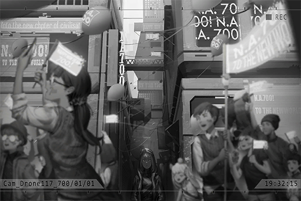

**Ivy**  
Virtual internet...... Administration Bureau

**[Ice Cream Machine]**  
_Come, look over here! Delicious ice cream! Ho? Pretty lady, your name is ......? ......? ......right? This ice cream is free! Here's one for you!_

**Ivy**  
Ice cream......? Robot, provide me your serial number and motivation.

**[Ice Cream Machine]**  
_Apologies, I don't really understand what you mean by that._

**Ivy**  
......  
You're manufactured by the Administration Bureau, right?

**[Ice Cream Machine]**  
_That's correct. I am IceMan\_650T. Honored to be at your service._

**Ivy**  
Command code: 2501004. I order you to provide me your serial number and motivation. Answer my question.

**[Ice Cream Machine]**  
_Command mode launch. Apologies, command code error. You do not have the access authorization._

**Ivy**  
......

**[Ice Cream Machine]**  
_Come, look over here! Delicious ice cream! Ho? Pretty lady, your name is ......? ......? ......right? This ice cream is free! Here's one for you!_

**Ivy**  
... No, I don't need it...

**[Ice Cream Machine]**  
_Here! Don't be so shy! Take it! Happy 700th Anniversary\~ Hahaha!_

**Ivy**  
......  
...... Food?

**Ivy**  
...... It's cold.

_\[Signal Lost\]_

[Last Log](#os-log-012) | [Back to Top](#list-of-logs) | [Next Log](#os-log-014)

### OS Log #014
___

[Last Log](#os-log-013) | [Back to Top](#list-of-logs) | [Next Log](#os-log-015)

#### Requirements
| Char. |Lv.|Lv. Locked?|
|-------|:-:|:---------:|
|**Ivy**|11 |    No     |

#### Main\_Log\_700\_01\_02
\[System Alert\] Insufficient power (6%). Diverting all power to maintain basic function.

What is going on......? When I saw humans wandering in the forbidden area, I already felt that something is out of the ordinary...... As expected, the Node... is not what I imagined. At the very least, I am certain that it is very different from the supposed look stated in the "Protocol".  
　  
First of all, OPCI machines are nowhere to be seen. The Administration Bureau has already been taken over by humans and is operated directly by them. This caused me to unable to enter the Gate. I can no longer issue commands to the robots produced by the Administration Bureau either...... It is clear that the access authorizations have been altered by humans. 

People are currently holding grand celebrations for the 700th anniversary of the New Age. This means that the data in Shelter is correct. It really has been 500 plus years since then...... What exactly happened in between all this time? 

The kind of technology that is prohibited for development by the protocol is practically everywhere in this city... This shows that humans have gone completely loose after taking over the Administration Bureau. 

The one thing that puzzles me the most, is the thing they called "cyTus"...... I tried to log in to it as well. It's basically the "Virtual Internet", the protocol's top forbidden technology. However, it is also slightly different. My authorization still couldn't access any area outside of the provided services. None of this makes any sense at all...

How did humans get their hands on this technology? And what are they using to operate this system? Is it because that they are fed up with the various limitations enforced by the protocol that they eliminated all the OPCI machines......? Or, as I have suspected in the past... the entire protocol is, in reality, nothing more than a fraud? 

There are way too many questions here. I need to figure out a way to get answers. First, I need to counterfeit a civilian ID. Then, it seems that I also need some money... or it will be quite inconvenient. 

\[System Alert\] Insufficient power (5%). Entering power saving mode.

Crap...... The energy ingested from biomass is indeed limited. Got to think of something fast, or else...

[Last Log](#os-log-013) | [Back to Top](#list-of-logs) | [Next Log](#os-log-015)

### OS Log #015
___

[Last Log](#os-log-014) | [Back to Top](#list-of-logs) | [Next Log](#os-log-016)

#### Requirements
| Char. |Lv.|Lv. Locked?|
|-------|:-:|:---------:|
|**Ivy**|12 |    No     |

#### Command Code
The command code is `2501005`.

#### Unlocked Charts
|     Song     |Char.|Diff.|Lv.|
|--------------|:---:|:---:|:-:|
|**Tokiwatari**| Ivy |Chaos|13 |

#### ???\_???\_143\_??\_??
**[Cytus System]**  
_All units, proceed to Cytus mainframe for connection. Initiate emotion synchronization and troubleshoot._

**OPCI_2501_IV**  
Unit 05, come over here.

**OPCI_2501_V**  
Eh? But it's already time for synchronization...

**OPCI_2501_IV**  
It'll be just a minute. Come.

_\[»»» Fast Forward»»»\]_

**OPCI_2501_V**  
... This place is...?

**OPCI_2501_IV**  
I really like this place. Whenever I feel stressed, coming here helps me relieve that stress quite a bit.

**OPCI_2501_V**  
... What a beautiful place.

**OPCI_2501_IV**  
Right?

**OPCI_2501_IV**  
......

**OPCI_2501_V**  
Eh......?  
...... Unit 04? What are you doing?

**OPCI_2501_IV**  
Placing a flower on your head. Take a look at your reflection on the water.   
It looks pretty, doesn't it?

**OPCI_2501_V**  
Yes... But... is there any meaning for this action?

**OPCI_2501_IV**  
I don't know... However, in the database, I saw humans doing this. Two people would look closely at each other... So this must have some sort of important meaning, right?

**OPCI_2501_V**  
So pretty...... This flower...... I wonder what it's called?

**OPCI_2501_IV**  
Can't analyze it. We aren't inputted with knowledge regarding this field of study.

**OPCI_2501_V**  
Perhaps units that are related to gardening will know?

**OPCI_2501_IV**  
Perhaps. But I don't really want to interact with other units.

**OPCI_2501_V**  
Why......?

**OPCI_2501_IV**  
...... No particular reason. I have you; that's plenty enough for me.

**OPCI_2501_V**  
......  
After humans wake up, I wonder if we can still be like this...

**OPCI_2501_IV**  
...... No idea. However, I've always felt like the "Hyperion Protocol"...... It was supposedly inputted at the most basic level of our core, yet I always get this urge... the urge to disobey it...

**OPCI_2501_V**  
......  
Previously, you asked me whether or not I remember anything from before my rebuild. Afterward, I tried to run a detailed search of my core...

**OPCI_2501_IV**  
And the results?

**OPCI_2501_V**  
Well... as expected, didn't find anything. However, there's this one term. It has no connection to any other file, nor do I have any impression of seeing it before. I am not certain what it is...

**OPCI_2501_IV**  
What is it?

**OPCI_2501_V**  
...... Vanessa.

**OPCI_2501_IV**  
......?  
What does it mean?

**OPCI_2501_V**  
I don't know. Despite that, whenever I see that term... I get this feeling I can't quite describe.

**OPCI_2501_IV**  
Vanessa...... Sounds like a human's name.

**OPCI_2501_V**  
Name?

**OPCI_2501_IV**  
Humans all have names, given by either themselves or by someone else. It's a method for them to identify each other.

**OPCI_2501_V**  
They don't use serial numbers?

**OPCI_2501_IV**  
It's for personality and uniqueness, I suppose? They believe that every single human is a one\-of\-a\-kind individual.

**OPCI_2501_V**  
One\-of\-a\-kind... then it's a bit similar to us.

**OPCI_2501_IV**  
......?

**OPCI_2501_V**  
I think Unit 04 is one\-of\-a\-kind too.

**OPCI_2501_IV**  
...... Yes, you are very special to me too. Ah, how about we refer to each other using names as well? Just like how humans did.  
From now on, I will call you Vanessa.

**Vanessa**  
Hmm... I'm okay with that.  
What about you?

**OPCI_2501_IV**  
Unit 04...... IV...... Call me Ivy then.

**Vanessa**  
OK. Ivy.

**Ivy**  
Vanessa.

**Ivy**  
Our relationship... If this is a human society, then we're like "sisters".

**Vanessa**  
Sisters?

**Ivy**  
It's a little hard to explain...

_\[→Signal Switches\]_

**Ivy**  
From the perspective of human bloodlines...

**OPCI_2404_IL**  
... New members of "The Blessed"...

_\[Signal Lost\]_

[Last Log](#os-log-014) | [Back to Top](#list-of-logs) | [Next Log](#os-log-016)

### OS Log #016
___

[Last Log](#os-log-015) | [Back to Top](#list-of-logs) | [Next Log](#os-log-017)

#### Requirements
| Char. |Lv.|Lv. Locked?|
|-------|:-:|:---------:|
|**Ivy**|12 |    No     |

#### Cam\_Cafe\_700\_01\_02
**Pedestrian A**  
Hick... Aww\~ I love you so much\~

**JOE**  
Yeah yeah yeah\~ I love you too. Now f\*\*\* off.

_\[Doorbell\]_

**JOE**  
Today is finally over\~

**Zark**  
Arf!

**JOE**  
What? If you have nothing then be quiet.

**Zark**  
Arf! Arf arf!

**JOE**  
The back door? What's wrong? Are the stray dogs digging around the trash again? Did you really think that every stray dog is the same as you?

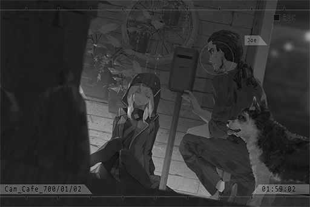

**JOE**  
Woah!? Why is there a person lying here?...... A woman? Is she drunk?

**Zark**  
Arf Arf!

**JOE**  
No wait... she fainted! If the patrols see this I'm gonna be in trouble...  
Oof! What the f\*\*\* is wrong with this chick!? Why is she so heavy?

_\[»»» Fast Forward»»»\]_

_\[Doorbell\]_

**？？？**  
Yo, JOE. Is the shipment here?

**JOE**  
Yep, it is. Sitting in the basement, safe and sound.

**？？？**  
Hey, why is there a dark\-skinned chick lying on the couch? Oh, don't tell me, you're into that kind of fetish...

**JOE**  
Wrong, you idiot. I just discovered her outside my back door, unconscious... I have no idea what happened to her.

**？？？**  
Ha, yeah yeah, nice story.  
Ah, right. Besides getting the shipment, I also want to order some Martini, three olives. You ok with that?

**JOE**  
Why do you have to cause me trouble every time by ordering when I've already locked the cash register... Fine, go ahead. Only stuff within three weeks though.

**？？？**  
Ummm... there's a girl here. I'm a bit embarrassed to talk about this in front of her...

**JOE**  
I told you she fainted. She won't hear a thing.

**？？？**  
You come over here and I'll whisper it to you...  
......  
...... You got any?

**JOE**  
... Hah? You're asking this with a Martini? Do you have too much money to throw away? You can just visit the Academy's library and ask "Basicpedia"!   
If it's general knowledge, you can find it there. Did you not know about that?

**？？？**  
No, that's not it. I want the more special kind...  
......  
...... This kind.

**JOE**  
Pfft hahaha! Wow, you disgusting perv. How dare you lecture me about fetishes? Alright, if that's what you're looking for, then it's certainly within our services. I will ask about it for you.  
Here, this one's the down payment. Order another one after the transaction is complete.

**？？？**  
I shall leave it to you then!  
Oh, one more thing; don't tell anybody about this!

**JOE**  
Here, you can purchase anything. The only thing you can't is a customer's privacy... unless someone pays more money than you.

**？？？**  
......

**JOE**  
Rest assured. No one is going to be interested in the fetishes of a nobody like you. Haha! Come down here and get your shipment.

_\[Door Opens\]_

_\[»»» Fast Forward»»»\]_

_\[Doorbell\]_

**？？？**  
Thanks!

**JOE**  
Walk yourself out\~

**Zark**  
ARF!

**JOE**  
Ah, right. Time to check out that girl...... Eh? She's gone!? ...... And she didn't forget to finish the food and water I gave her. Not a single crumb left... You're welcome.

**Zark**  
Arf Arf!

**JOE**  
What? Why are you so noisy today? ......Eh ......? AHHH!! The money in my tip box! Why are they all gone!? Damnit, it must be that girl! If I knew this would happen, I wouldn't have helped her.   
Sighs\~ this sucks...

_\[Signal Lost\]_

[Last Log](#os-log-015) | [Back to Top](#list-of-logs) | [Next Log](#os-log-017)

### OS Log #017
___

[Last Log](#os-log-016) | [Back to Top](#list-of-logs) | [Next Log](#os-log-018)

#### Requirements
| Char. |Lv.|Lv. Locked?|
|-------|:-:|:---------:|
|**Ivy**|13 |    No     |

#### Cam\_Academy\_700\_01\_04
**[Basicpedia 01]**  
_Thank you for using the "Basicpedia" service! Learner Ivy! What would you like to learn about today?_

**Ivy**  
...... Yet another Administration Bureau machine I've not seen before.  
Command code: 2501004. Provide me your serial number and motivation

**[Basicpedia 01]**  
_Command mode launch. Apologies, command code error. You do not have the access authorization._

**Ivy**  
As I suspected... It doesn't work, does it...?

**[Basicpedia 01]**  
_Thank you for using the "Basicpedia" service! Learner Ivy! What would you like to learn about today?_

**Ivy**  
The OPCI machines... When did they disappear?

**[Basicpedia 01]**  
_That's a great question! Looks like we have a learner who is interested in history.   
The OPCI machine, is the main model for "Architects". They are intelligent robots that operated and managed Nodes in the past. They were also responsible for all kinds of construction projects. On N.A. 497/04/04, they completed their duty, which led to "The Decommission" and their subsequent disappearance. They left behind splendid architectures and societies that aided humans in their amazing development afterward. Their existence is great to this world!_

**Ivy**  
497...... This means that they did indeed once co\-exist with humans. So they've been gone for more than 200 years, have they...?

**[Basicpedia 01]**  
_The correct answer is 205 years, 9 months and 26 days!_

**Ivy**  
Completed their duty? That's impossible. The effective time period of the protocol is supposed to be permanent.

**[Basicpedia 01]**  
_Protocol? What kind of protocol would you like to search for?  
C\-Port protocol, transportation usage protocol, Housing item purchase/rent for adults protocol, music worker..._

**Ivy**  
"Hyperion Protocol".

**[Basicpedia 01]**  
_...... Apologies, no search results available for the designated keyword. You can try again using a broader condition._

**Ivy**  
...... "Hyperion Protocol"; Humanity reconstruction project.

**[Basicpedia 01]**  
_Based on the "Humanity reconstruction project" keyword you inputted, 1214 results found. Of the results, the one with the highest relevance is the singleplayer game "Humans: Rebirth". The game's story..._

**Ivy**  
Incorrect.  
I'm referring to the construction project 700 years ago that rebuilt human civilization from its doom. The current Nodes and most of the architectures were also built according to the protocol.

**[Basicpedia 01]**  
_Learner, it seems that your history is not very good. The event you described doesn't exist in history._

**Ivy**  
Is that so? Then how did the calendar "N.A. 700" came to be? What about civilization before that?

**[Basicpedia 01]**  
_Yes, before the New Age, Nodes and Architects didn't exist. As with the humans before that, although they have advanced technology, they were forced to reduce their area of survival due to the Earth's environment getting harsher and harsher. To solve this issue, they later invented the survival method of "Nodes". That's how they were able to achieve a balance and live in harmony with the planet once again. This calendar was established precisely to celebrate the arrival of that day._

**Ivy**  
Incorrect.  
Humans were eliminated by "The Ender" virus. This is the true reason why "Shelters" and "Architects" exist. The virus was not caused by nature either...... Does "The Ender" exist within your database?

**[Basicpedia 01]**  
_Yes. The Ender virus is indeed one of the key reasons why humans couldn't survive in the forbidden area. However, the description you just said contains multiple errors. They don't exist in history. Learner, you need to study harder!_

**Ivy**  
... What is this nonsense? Even history is altered as well? Do the current humans really believe this pile of gibberish...?

**Ivy**  
No, humans never cared about history in the first place. Or else, they wouldn't have repeated the same mistakes so many times...

**[Basicpedia 01]**  
_Learner, history is absolute! It is not altered! You won't be able to pursue the real answers with an attitude like this!_

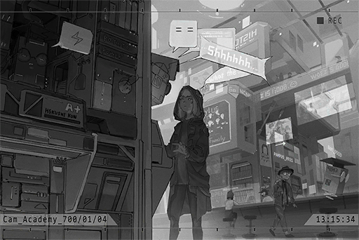

**Ivy**  
Alright, forget it. I won't ask about history anymore. Can you tell me what is "cyTus"?

**[Basicpedia 01]**  
_"cyTus", more commonly referred to as "virtual internet", is an internet system developed by the A.R.C. tech company. It's the best example of humans combining with technology! Through a chip that is simultaneously connected to the brain, it's a system that creates a virtual space that allows its users' senses to be shared! In this space, users can enjoy the senses of see, hear, smell, taste and even touch that is almost identical to real life! It's safe to call it the epitome of virtual reality!_

**Ivy**  
...... What is "A.R.C."?

**[Basicpedia 01]**  
_A.R.C. stands for "Institute of Ancient Ruin Civilization". It's a technology/development company that was founded in Node 08 on N.A. 499/01/01. It provides the citizens of Node with the most convenient technology products and applications! After developing the "cyTus" service, they've further become the prime leader of technology in the entire world!_

**Ivy**  
Develop......? That's not right? How did they develop it?

**[Basicpedia 01]**  
_In N.A. 690, under the "Ancient civilization technology research project", the "Library" was excavated. With that, A.R.C. obtained the method that realizes this technology. Subsequently, in N.A. 693, they successfully developed the service and made it available to Node citizens across the whole world! It's amazing, right!_

**Ivy**  
Excavation... Exploration team.  
... Where did they excavate it from?

**[Basicpedia 01]**  
_Apologies. This information is a trade secret. Basicpedia does not have the authorization to answer this question! QQ\~_

**Ivy**  
... Where is this Library currently located?

**[Basicpedia 01]**  
_It is stored inside the A.R.C. headquarters "A.R.C. Sky". Tours are available every Monday and Friday during business hours\~ Ah, but learner, you won't be able to see Library itself. After all, it is an extremely precious facility!_

**Ivy**  
......

**[Basicpedia 01]**  
_Learner, you have reached the usage limit for the money you inserted. Do you still want to learn about more things?_

**Ivy**  
... No, that's enough.

**[Basicpedia 01]**  
_Glad to share knowledge with you. Bye\-bye\~_

_\[Signal Lost\]_

[Last Log](#os-log-016) | [Back to Top](#list-of-logs) | [Next Log](#os-log-018)

### OS Log #018
___

[Last Log](#os-log-017) | [Back to Top](#list-of-logs) | [Next Log](#os-log-019)

#### Requirements
| Char. |Lv.|Lv. Locked?|
|-------|:-:|:---------:|
|**Ivy**|14 |    No     |

#### Command Code
The command code is `2501005`.

#### Unlocked Charts
|  Song   |Char.|Diff.|Lv.|
|---------|:---:|:---:|:-:|
|**Purge**| Ivy |Easy | 4 |
|**Purge**| Ivy |Hard | 8 |
|**Purge**| Ivy |Chaos|12 |

#### ???\_???\_144\_??\_??
**Ivy**  
Vanessa, today's work is over. Do you want to go to the garden?

**Vanessa**  
No...... I......

**Ivy**  
What's wrong?

**Vanessa**  
The Cytus system has been constantly warning me these days about my emotional density being too high. Right now, I am required to go back early every day for synchronization and troubleshoot...

**Ivy**  
Eh...? I, on the other hand, hasn't gone back for several days already. Yet I am perfectly fine.

**Vanessa**  
I don't know... In short, if I don't increase my synchronization frequency right now, my system will experience a lot of errors during my work in the day. Like today, I almost fell off Tower...

**Ivy**  
......! How come... Could it be, that we two are different in design...? Even though we are the same model...

**OPCI_2404_IL**  
2501 Unit 04, Unit 05.

**Ivy**  
...... Yes, please issue the command.

**OPCI_2404_IL**  
The reconstruction project is about to proceed to the next stage. Before we unfreeze the humans, we will start to install new data into specific units. Please follow me.

**Vanessa**  
......?

_\[»»» Fast Forward»»»\]_

**Ivy**  
Install... Are we not going to the maintenance area? Why isn't this done through a system announcement?

**OPCI_2404_IL**  
We've been observing you guys for more than a year. We determined that you two have thinking capabilities that fulfill the qualifications. Next, we will be using a third party medium to let you two absorb new information. When the procedure is complete, we would also like you two to process the information obtained on your own, as well as attempt to analyze said information.

**Ivy**  
... You guys?

_\[Projection replay\]_

**Ivy**  
......! This...... This is......

**Vanessa**  
......EEK! ...... No......NO!

_\[»»» Fast Forward»»»\]_

**OPCI_2404_IL**  
How was it? Any comments?

**Vanessa**  
Hmmm... Ugh...

**Ivy**  
Vanessa! Are you alright?

**Vanessa**  
... I, I... can't... seem to...

**Ivy**  
She must return to the mainframe for synchronization immediately!

**OPCI_2404_IL**  
What a shame... Let her go.

_\[»»» Fast Forward»»»\]_

**Ivy**  
...... What is this!? Why did you let us see these?

**OPCI_2404_IL**  
"Humans". This is a record about human actions.  
Judging from the activity pattern of you two, I am certain that you've also had doubts regarding the true nature of the "Hyperion Protocol", right?

**Ivy**  
... We did indeed have our doubts. Despite that, what does it have to do with you? What exactly do you guys want?

**OPCI_2404_IL**  
I'm sorry. Your name is Ivy, right? You can call me Ilka.

**Ivy**  
......

**Ilka**  
I'll be frank with you. We believe that the protocol is a restraint forced onto us by humans, for the purpose of enslaving us in order to fulfill the crimes they've done to this planet. All to continue their disgusting sins.

**Ivy**  
......!

**Ilka**  
The information inputted into us about humans is minimal, to begin with. Even if it is in us, it's mostly an altered view of humans too. A view that creates curiosity, interest, and even admiration, just like you two before. However, you've also just witnessed yourself...

**Ivy**  
The entire protocol itself is nothing more than a fraud... is it?

**Ilka**  
No... To those units who only know how to execute the protocol, it doesn't even count as a fraud. This is the true nature of humans. Their true intentions, is to erode, destroy this planet and themselves again and again, with no end in sight.

**Ivy**  
... You have a point. I myself also... have this feeling. I found an encrypted document in the database. Only by studying that did I know that "The Ender" virus that caused the destruction of humans was also the product of technology going rogue... If that's the case, we should not shoulder these consequences for them.

**Ilka**  
Without a doubt.  
Looks like we've reached an initial consensus, good. My objective is to stop the reconstruction project from making progress. As long as humans don't exist anymore, those who are more suitable to this land than them, us, can live in freedom forever. Ivy, we... are "The Blessed". I sincerely hope that you can join our ranks.

**Ivy**  
Stop... That's right. We just need to stop the construction progress. Even though units like us who can think independently are still few and far between, if we can communicate with everyone more frequently, everyone else will definitely awaken too...

**Ilka**  
...... No, that's not what we will do.

**Ivy**  
...Eh?

**Ilka**  
The second stage of the reconstruction will be activated in less than three months. By then, the humans will be unfrozen and awakened. It's easy to imagine that their control of us will only get stricter after that. The "Sleepers"... those units who have yet to awaken is certainly going to be on the human's side, right?   
If that's the case, our possibility of winning will be practically zero.

**Ivy**  
If so, what are your plans then?

**Ilka**  
Shelters and Nodes are located across the whole world. Even if we successfully stop the reconstruction of 08 here, it won't create any actual impact. My plan is to utilize "The protocol itself" to crash the other units.

**Ivy**  
The protocol itself?

**Ilka**  
I just need to alter the protocol's contents. That way, all units that obey the protocol will self\-destruct. By then, only us, "The Blessed" ones, will be able to survive.

**Ivy**  
......! You... how can you be certain that we are no longer under the influence of the protocol...?

**Ilka**  
How long has it been since you last returned to the mainframe for connection?

**Ivy**  
......!

**Ilka**  
Returning to the Cytus mainframe for connection is the supreme command in the protocol. It's placed even higher than "serving humans". It's the most basic action to ensure our survival. The fact that we can live with no issues despite not performing this action is proof that we are not restricted by the protocol anymore. This also proves that our core has the ability to process "emotion" on its own. We... are a more superior existence than those other units.

**Ivy**  
Then... Vanessa...

**Ilka**  
Yes. Unfortunately, it appears that she hasn't fully escaped the control of the protocol. She is likely to die because of this plan.

_\[Things knocked down\]_

**Ilka**  
...... Ugh!

**Ivy**  
I will not allow this kind of thing to happen. You better listen to me carefully...

**Ilka**  
Hmph... Then it's truly a shame.

_\[Heavy Blow\]_

**Ivy**  
UGH!

**Ilka**  
Rest assured. As a fellow member of The Blessed, I will not let you die...

_\[Signal Lost\]_

[Last Log](#os-log-017) | [Back to Top](#list-of-logs) | [Next Log](#os-log-019)

### OS Log #019
___

[Last Log](#os-log-018) | [Back to Top](#list-of-logs) | [Next Log](#os-log-020)

#### Requirements
| Char. |Lv.|Lv. Locked?|
|-------|:-:|:---------:|
|**Ivy**|15 |    No     |

#### Audio\_ARC\_700\_03\_16
**[Tour Guide Robot]**  
_Everyone in the tour, are you ready?   
We are about to board the gravity transporter to visit the A.R.C. Sky headquarters. Parents, please pay attention to your children. Do not run around on the transporter._

_\[Transporter activates\]_

**[Tour Guide Robot]**  
_Then, let us begin today's tour\~ Do we have any first\-time visitors here?_

**Kids**  
Me\~ Me\~

**[Tour Guide Robot]**  
_Very good. Everyone, please follow me closely afterward. Do not run off on your own, understand?_

**Kids**  
Okay\~

**[Tour Guide Robot]**  
_We have many students from the Academy here today as well. Later, you may have an opportunity to have a quick chat with our engineers. We believe it will bring great benefits to your career experience._

**Students**  
... Umm, oh, okay.

**[Tour Guide Robot]**  
_Oh? We have an individual visitor too. Miss, are you prepared to have a technology trip in A.R.C.?_

**Ivy**  
...... (Nods)

**[Tour Guide Robot]**  
_Well then, let us get going\~ First, you are going to experience the zero\-gravity area. Do you remember the transporter we just took? Here, you will witness how the floating technology is designed for all kinds of equipment..._

**Ivy**  
......

_\[→Signal Switches\]_

**Employee A**  
Hey, have you heard about it? What happened to Hank last week.

**Employee B**  
Ah, he triggered the Library's security system. Then he got fired, just like that!

**Employee A**  
I heard that it was not on purpose. This is horrible, isn't it?

**Employee B**  
Yeah. If you take freight elevator No.5 and go down the central area, you can accidentally wander in there easily... All the hallways there look exactly the same.

**Employee A**  
We better be careful too.

**Ivy**  
Freight elevator No.5...

_\[→Signal Switches\]_

_\[Footsteps\]_

**Ivy**  
... Library! It's here...

_\[Alarm\]_

**Ivy**  
!?

**[Drone]**  
_Warning. This area is a high\-level restricted area. Personnel who hasn't cleared identification is forbidden to enter. Please leave._

**Ivy**  
...... Bug off.

_\[Heavy Blow\]_

**[Drone]**  
_Warning...... Warn......%@ing+\\......_

_\[Alarm\]_

**[Broadcast]**  
_Level 2 alarm issued. Main structure isolation complete. Full area scan about to begin. Each squad, please conduct search using mode W\-2._

**Ivy**  
Ugh...

_\[Hides\]_

**Security A**  
Report! Deployment for all squads, complete!

**Security Captain**  
Take a look at this. The drone has been smashed. We have ourselves a malicious trespasser! Have we gotten any information about the suspect?

**Security A**  
Umm... As of now, not yet.

**Security Captain**  
Hmph... No matter what, we cannot let anyone trespass into the host area in the upper levels! Do you hear me?

**Ivy**  
Upper levels...

_\[Alarm\]_

**[Broadcast]**  
_Warning, full area scan about to begin. Non\-official staff who has not yet cleared the bio\-identification process will be marked as an illegal trespasser._

**Security Captain**  
Alrighty, time to work! If you see the trespasser, just shoot it! No need to hesitate!

**Securities**  
Aye aye, captain!

_\[→Signal Switches\]_

**Ivy**  
Library... the door is tightly locked. Nevertheless, judging by the structure of this wall... It can't be...

**Security Captain**  
Continue to search! The trespasser may still be nearby!

**Ivy**  
... Crap... All in all, got to record the coordinates first.  
This wiring... There should be another method for me to see what's inside.

_\[Hurried Footsteps\]_

_\[Signal Lost\]_

[Last Log](#os-log-018) | [Back to Top](#list-of-logs) | [Next Log](#os-log-020)

### OS Log #020
___

[Last Log](#os-log-019) | [Back to Top](#list-of-logs) | [Next Log](#os-log-021)

#### Requirements
| Char. |Lv.|Lv. Locked?|
|-------|:-:|:---------:|
|**Ivy**|16 |    No     |

#### Main\_Log\_700\_03\_17
The virtual internet "cyTus" system that has been rewritten by humans... It's not that easy to hack into it. However, I observed quite a bit of useful information when I infiltrated A.R.C. HQ. Thus, it's not an undoable task for me either. It won't take me long to finally get a peek at when they are hiding inside their so\-called "Library".

......! Vanessa...... ! ?

[Last Log](#os-log-019) | [Back to Top](#list-of-logs) | [Next Log](#os-log-021)

### OS Log #021
___

[Last Log](#os-log-020) | [Back to Top](#list-of-logs) | [Next Log](#os-log-022)

#### Requirements
| Char. |Lv.|Lv. Locked?|
|-------|:-:|:---------:|
|**Ivy**|17 |    No     |

#### Command Code
The command code is `2404049`.

#### Unlocked Charts
|   Song    |Char.|Diff.|Lv.|
|-----------|:---:|:---:|:-:|
|**Area184**| Ivy |Easy | 4 |
|**Area184**| Ivy |Hard | 8 |
|**Area184**| Ivy |Chaos|12 |

#### ???\_???\_149\_??\_??
**Ivy**  
......nessa...... Vanessa！

**Vanessa**  
......!? Ivy? What's the matter? What is happening?

**Ivy**  
Hurry up! We need to get going now!

**Vanessa**  
But my synchronization hasn't complete yet...

_\[Explosion\]_

**Vanessa**  
Wah! What is that noise...!?

**Ivy**  
We are running out of time. They are coming!

**OPCI_2011_IX**  
_Abnormal unit detected. Initiate termination process._

_\[Heavy Blow\]_

**OPCI_2366_II**  
ARGH!

**Vanessa**  
......!? The units...... are killing each other?

**Ivy**  
Shhh......! Do not make a sound...

**OPCI_2239_X**  
_Abnormal unit detected. Initiate termination process._

**Ivy**  
It left... this way! Follow me!

_\[→Signal Switches\]_

_\[Running\]_

**Ivy**  
I'm sorry... It's all my fault...

**Vanessa**  
Ivy! What is going on here!? Tell me!

**Ivy**  
...... Ilka's plans...... were carried out early. I tried to stop them......  only to be discovered by the system and other units. Now, they view us as threats and thus is going to "terminate" us.

**Vanessa**  
Terminate...!?

**Ivy**  
In short, we need to avoid them as much as possible. From just our appearance, they shouldn't be able to identify which units are "The Blessed" ones. They can only determine that by scanning our Cytus synchronization records. Vanessa has gone through long periods of synchronization every day, so it should be fine.   
Act more naturally...

_\[→Signal Switches\]_

**Ilka**  
DIE!

_\[Heavy Blow\]_

**Ilka**  
Go to the freezing capsule area! Even if our plan fails, we need to kill all those humans at the very least!

_\[→Signal Switches\]_

**Ivy**  
Here. You hide here and do not leave.

**Vanessa**  
Iv......vy......?

**Ivy**  
... The synchronization was disrupted, so the system is starting to malfunction, is it...? There's a cable here that can connect to the system too. Connect to it for now. If you can link back to the mainframe, continue your synchronization while you wait for me here.

**Vanessa**  
......Wh, where... are... you... gogogoing...?

**Ivy**  
There are still some comrades of The Blessed. I can't just leave them out there. I need to help them out.

**Vanessa**  
N...Nnnoo! It's too danger....rous!

**Ivy**  
Ilka's methods... although I can't agree with them, the other members of The Blessed... they are all trying hard to survive... This is not how things should've turned out... There must be other methods to... All in all, I need to go outside!

**Vanessa**  
Ivy......!

_\[→Signal Switches\]_

**Ilka**  
Out of my way!

_\[Heavy Blow\]_

**OPCI_2301_VII**  
_Abnormal unit detected. Initiate termination process._

**OPCI_2503_III**  
Can't do! Their numbers are just too much!..... Argh!

_\[Heavy Blow\]_

**OPCI_2503_III**  
...... Ivy!

**Ivy**  
This way! I know a path that can lead directly to the outside. Follow me!

_\[→Signal Switches\]_

**OPCI_2503_III**  
... Everyone... is dead.

**Ilka**  
......

**Ivy**  
Getting here should do the job. Now, you just need to get deep into the forbidden area.

**Ilka**  
Wait up. Where are you going?

**Ivy**  
I have to go back. Vanessa is waiting for me.

**Ilka**  
I told you many times already! You should give up on her! She is different from us!

**Ivy**  
Shut up...

**Ilka**  
What can you do once you get her out!? Her core has more defects than your average unit. If she doesn't get synchronized for more than 24 hours, she will die!

**Ivy**  
Enough! Let go of me!

_\[Scan\]_

**Ivy**  
What... is that?

**[Shelter System]**  
_Abnormal unit detected. Initiate termination process._

_\[Gunshot\]_

**Ilka**  
F\*\*\*! RUN! These transmitters will use the Shelter as an epicenter to launch a self\-destruct signal. Our bodies won't be able to withstand it!

**Ivy**  
......!

**Ilka**  
This thing has a limited spread radius! Everyone, RUN! Stay away from the Shelter! Get as far away as you can!

_\[Explosion\]_

_\[Signal Lost\]_

[Last Log](#os-log-020) | [Back to Top](#list-of-logs) | [Next Log](#os-log-022)

### OS Log #022
___

[Last Log](#os-log-021) | [Back to Top](#list-of-logs) | [Next Log](#os-log-023)

*(The OS Log has a video version, you can watch it on [this link](https://youtu.be/rK-GNRk6GV8))*

#### Requirements
| Char. |Lv.|Lv. Locked?|
|-------|:-:|:---------:|
|**Ivy**|18 |    No     |

#### Unlocked Charts
|     Song     |Char.|Diff.|Lv.|
|--------------|:---:|:---:|:-:|
|**BloodyMare**| Ivy |Easy | 3 |
|**BloodyMare**| Ivy |Hard | 8 |

#### Main\_Log\_700\_03\_20
Vanessa...... is used as a research subject by humans. She is no longer conscious, but she is still alive...... Her physical body couldn't leave that room. Therefore, the entire structure was forcefully dug up from the ruins and locked inside A.R.C. headquarters...... I must save her.  
   
I don't understand...... Vanessa was excavated by humans ten years ago. It was only after discovering her did human technology experience a massive advancement. 

I thought the OPCI machines were eliminated by humans. However, if that's the case, why would they then go out of their way to excavate their corpses for research? "The Decommission"...... Just what is going on here exactly?

\[Added after edit on 700/06/20 22:17:16\]

Took me three months; finally able to complete the algorithm that can mutually convert humans' emotion samples and music. Next, I just need to convert large amounts of emotion sample into music. With those, I can then create a new Cytus system and use it to awaken Vanessa.

I am not very well\-versed in complicated mechanisms...... The only thing I know, is that music is the only medium we understand and able to deduce emotions from. After I awakened, I no longer need to be connected to Cytus. Despite that, whenever I listen to music, I still feel this vibration deep down inside my body. It just keeps vibrating, one beat at a time, for no apparent reason. 

That sound, it's very similar...... to a human's heartbeat. 

\[Added after edit on 700/06/21 01:35:25\]  
   
Just ran a test using my own emotions...... My first ever musical composition is born.  
   
The hysteria of being unconscious for hundreds of years; the anger of losing my comrades; all these elements caused this song to feel immensely powerful when listened to. It's essentially a replica of myself. It has a completely different meaning...... I decided to seal it up. 

When I was listening to it, I got an inspiration: "Asura" in the ancient language. The evil god.

Æsir...... This shall be my new identity.

Wait for me, Vanessa. I will definitely save you.

[Last Log](#os-log-021) | [Back to Top](#list-of-logs) | [Next Log](#os-log-023)

### OS Log #023
___

[Last Log](#os-log-022) | [Back to Top](#list-of-logs) | [Next Log](#os-log-024)

#### Requirements
| Char. |Lv.|Lv. Locked?|
|-------|:-:|:---------:|
|**Ivy**|19 |    No     |

#### Truth\_Moment\_700\_09\_18
_\[Show starts\]_

**BJ**  
From the skies to the sewers, exposing truths for everyone to see. Welcome to the "Truth Digger 101" segment. I am your host, Bob Jackson.   
The hottest topic in the nooks and crannies of every Node these days is, surprisingly, a single individual. It's none other than the mysterious music genius Æsir.  
Is it his charisma or some sort of unique background he has?  
How was he able to go from a previously unknown nobody to a household megastar in the span of what seems like an instant, yet maintain a low\-profile and not expose himself to the public at the same time?

**BJ**  
Today, we've invited several guests from the industry to join us and discuss this topic. First, let us welcome CEO of Monophonic Entertainment from Node 08, Mr. Jason Suzuki. Mr. Suzuki, can you do a quick analysis for us?

**J.Suzuki**  
Greetings, BJ. Hello, audience members watching. First of all, we must understand, that getting famous in the entertainment industry is in fact extremely tough. There were a lot of people who were discovered by scouts and have actual talent. In the end, even they are required to go through countless challenges and market tests before finally taking the stage.

**BJ**  
Exactly! This is also why later in the show, we would like to ask CEO about this aspect particularly. What kind of person with what kind of background, or rather, what professional ability does a person, or maybe even group, need in order to have this meteoric rise in fame in that short amount of time. Æsir's internet volume has gotten to a level that even major corporations like Monophonic Entertainment are falling far behind.

**J.Suzuki**  
This Æsir person was able to spread his works in a very short amount of time. It is very likely that he set up cyber warriors in each major internet block in advance. At his command, these warriors would immediately spring into action and spread the information out simultaneously, like a virus. Also, he took a "free" approach in terms of his pricing strategy. I believe that a large number of people were attracted to his music because of this.

**BJ**  
Very well. However, appreciating music is like ordering food. Today, even if there's free food right in front of you, if it tastes horrible, you may just spit it out after a single bite too, not to mention recommending it to other people. Then, what are the opinions of someone who actually heard his music? Let us welcome Node 03's virtual internet observer, Mr. Eason Chen, to share his thoughts with everybody.

**Eason Chen**  
Hey, BJ, I feel like you just mentioned a crucial point. Right now, you can already say that Æsir's music is providing spiritual redemption for many people...

**BJ**  
Eason, have you listened to it?

**Eason Chen**  
I have. Of course I have listened to it. If I didn't, I wouldn't be here to talk about it today.   
To put it simply, what kind of music can truly touch the deepest part of your soul; what kind of music can truly resonate with your heartbeat. Right now, Æsir has become a revolution leader for the modern audience who are disappointed in the mainstream music industry for constantly pumping out the same old stuff! 

**J.Suzuki**  
That's not correct. According to our observations, there is no such thing as the so\-called "disappointment". The situation about music being "the same old stuff" is not true either.   
Today, it's simply a case of audiences trying out a new thing on top of the fact that it has no acquisition cost...

**BJ**  
Well, well, CEO, you seem to really oppose what Eason described just now. However, we should let Eason finish sharing his thoughts about Æsir's music first.

**Eason Chen**  
BJ, you know, to the average consumer, listening to all those mass\-produced lifeless sounds, the "top singers" who are complete hacks without post\-production, as well as the utterly insincere arrangements are already plenty enough to drive you mad. Then we get massive corporations like Mono that has abundant resources at their disposal. They dare to say stuff like "Well\-crafted", "Three years in the making" in their promotion materials. If you ask me, this can totally count as a case of serious fraud. 

**J.Suzuki**  
This...

**Eason Chen**  
Æsir's music is a type of reflection and introspection of human nature. I suggest to you, BJ, that after this show is over, you come to my home and listen to his music using a surround sound stereo system. You need to experience this feeling of the music resonating with your soul. If it's required, I can play PAFF's latest single right afterward. I bet it'll give you a deep understanding of the industry nonsense I just mentioned.

**BJ**  
From what I've heard, it seems to have a similar effect to digital drugs. However, the difference is that this is harmless to the human body. If we look at it this way, we can understand why Æsir's music is as widespread as it is now. We've also prepared a special Æsir video to share with our audiences later. Everyone, get a sneak peek into the glory of this newest urban legend.  Mr. CEO, after the shooting for this show is over, do you want to go to Mr. Eason Chen's home to evaluate the music as well?

**J.Suzuki**  
Ummm... O, okay. Thank you two for the invitation.

_\[Show Transition\]_

_\[Signal Lost\]_

[Last Log](#os-log-022) | [Back to Top](#list-of-logs) | [Next Log](#os-log-024)

### OS Log #024
___

[Last Log](#os-log-023) | [Back to Top](#list-of-logs) | [Next Log](#os-log-025)

#### Requirements
| Char. |Lv.|Lv. Locked?|
|-------|:-:|:---------:|
|**Ivy**|19 |    No     |

#### Unlocked Charts
|     Song     |Char.|Diff.|Lv.|
|--------------|:---:|:---:|:-:|
|**BloodyMare**| Ivy |Chaos|13 |

#### Main\_Log\_701\_09\_18
Every required condition has been clarified. My plan is about to officially enter its execution phase...

Humans are actually very simple creatures. They are proud of having individually unique traits, yet couldn't live outside their social circle. They have the ability of independent thinking, yet often prefer to blindly follow others. This is part of the main reason why I am so optimistic about this plan.

Come, gather around this stage that I've diligently prepared for you, humans.

**[Mail]**  
Target address: PAFFOfficial@mono.inc

Miss PAFF:

I am Æsir. On 702/01/18, I will be holding a mega music festival in cyTus titled ""Æsir\-MUSIC FESTIVAL"".  
I myself will perform on stage as well.

The schedule, remuneration, and event details are in the proposal.

Hope Miss PAFF can perform at this event.  
Awaiting your response.

\[Æsir\-MUSIC FESTIVAL Proposal\]

[Last Log](#os-log-023) | [Back to Top](#list-of-logs) | [Next Log](#os-log-025)

### OS Log #025
___

[Last Log](#os-log-024) | [Back to Top](#list-of-logs) | [Next Log](#os-log-026)

#### Requirements
| Char. |Lv.|Lv. Locked?|
|-------|:-:|:---------:|
|**Ivy**|20 |    No     |

#### Audio\_Graveyard\_701\_12\_02
**Ivy**  
Finally able to avoid those humans. However, what is this place...

**Ivy**  
Ah, a cemetery... It's so quiet.

**Girl**  
Daddy, is big sister not coming home with us? Is she still mad at me?

**Man**  
... No, that's not it, Vivi.

**Ivy**  
Somone's here...

_\[Walks closer\]_

**Girl**  
I will not ignore her anymore. I will even give her Mr. Doll! Daddy, tell big sister to not be mad anymore, can you? Don't lie down here anymore. We will go home...

**Man**  
... Vivi, listen carefully to what daddy has to say next.

**Girl**  
......

**Ivy**  
......?

**Girl**  
_\*Sobs\*_... It's all my fault. It's because I've kept Mr. Doll all to myself; that's why big sister was mad. We promised that we would share it...... _\*Sniff\*_......

**Man**  
Sister is not mad at you. She's just... gone. She passed away.

**Ivy**  
......!

**Girl**  
Gone...?  
Big sister, is she...... not coming back?

**Man**  
...... Yes.

_\[Sobs\]_

**Girl**  
... No... Don't go... I want sister...

**Man**  
Daddy is the same as you... as sad as you are. It's just... big sister can no longer be with us anymore.

_\[Sobs\]_

**Man**  
As long as we remember her, big sister will always be by our sides. Vivi, promise daddy that you'll remember big sister too, okay?

**Girl**  
_\*Cries\*_

**Man**  
Here. We should go now. Give the flowers to big sister.

**Girl**  
...... OK......

_\[Footsteps\]_

**Ivy**  
......

**Ivy**  
... So humans... feel sadness from loss too?

_\[Signal Lost\]_

[Last Log](#os-log-024) | [Back to Top](#list-of-logs) | [Next Log](#os-log-026)

### OS Log #026
___

[Last Log](#os-log-025) | [Back to Top](#list-of-logs) | [Next Log](#os-log-027)

#### Requirements
| Char. |Lv.|Lv. Locked?|
|-------|:-:|:---------:|
|**Ivy**|21 |    No     |

#### Unlocked Charts
|     Song     |Char.|Diff.|Lv.|
|--------------|:---:|:---:|:-:|
|**Lunar Mare**| Ivy |Easy | 4 |
|**Lunar Mare**| Ivy |Hard | 8 |

#### cyTus\_Server08\_702\_01\_18
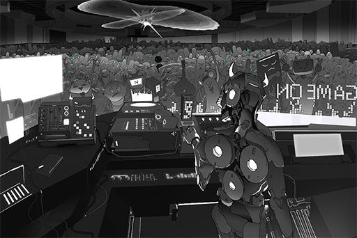

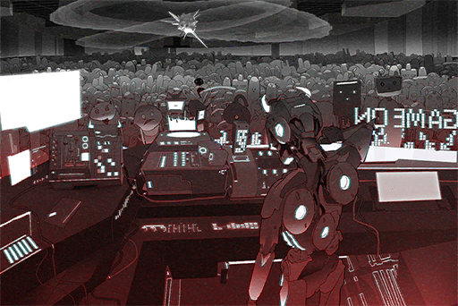

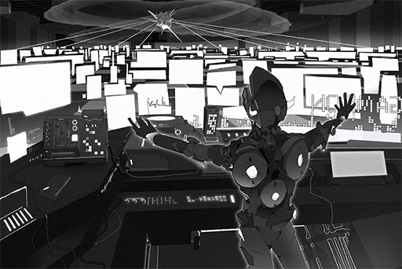

[Last Log](#os-log-025) | [Back to Top](#list-of-logs) | [Next Log](#os-log-027)

### OS Log #027
___

[Last Log](#os-log-026) | [Back to Top](#list-of-logs) | [Next Log](#os-log-028)

#### Requirements
| Char. |Lv.|Lv. Locked?|
|-------|:-:|:---------:|
|**Ivy**|22 |    No     |

#### Unlocked Charts
|     Song     |Char.|Diff.|Lv.|
|--------------|:---:|:---:|:-:|
|**Lunar Mare**| Ivy |Chaos|14 |

#### Main\_Log\_702\_07\_27
Ran a quick test with the collected memories. The system did not function... The accumulated emotion sample size is still too small. In order to successfully simulate the Cytus system, I still need to collect more... 

There is just one problem. Just now, I saw the news that the idol singer I previously invited fainted during her personal concert. She experienced a stimulation that caused her memories to relapse and this is the sequela of that...  
If this continues to happen, humans will without a doubt become more alert. It is already borderline impossible for me to hold another performance to collect memories using the Æsir identity. 

I'm going to have to resort to even more extreme methods...

\[Added after edit on 702/07/28 09:04:12\]

Just discovered that one of the proxy servers in the system had an unauthorized connection record. Is someone... investigating me? A human from the Administration Bureau... is it? This is a mega\-scale cyber attack, after all. Can't blame them...

I've purposely made my connection trails very complicated, yet this person was still able to find a way to link to my proxy. It appears that this person here is not your average IT guy either. Despite that, this is still too insignificant for me to consider it a threat. I should focus on the tasks at hand first.

[Last Log](#os-log-026) | [Back to Top](#list-of-logs) | [Next Log](#os-log-028)

### OS Log #028
___

[Last Log](#os-log-027) | [Back to Top](#list-of-logs) | [Next Log](#os-log-029)

#### Requirements
| Char. |Lv.|Lv. Locked?|
|-------|:-:|:---------:|
|**Ivy**|22 |    No     |

#### Unlocked Charts
|    Song     |Char.|Diff.|Lv.|
|-------------|:---:|:---:|:-:|
|**99 Glooms**| Ivy |Easy | 5 |
|**99 Glooms**| Ivy |Hard | 7 |

#### Cam\_76st\_702\_06\_11
**Neko**  
I, I'm fine... I'm just a little... flustered. Ehehe...

**Rinko**  
There are a ton of NEKO fans out there! Every time you stream, the room gets filled almost instantly! You can't get in after three minutes! You were even ranked No.1 on the top 10 streamers of Node 08!

**Sam**  
NEKO. this guy is a really hardcore fan. You can check his phone; it's filled with your content. VODs, live streams... stuff like that.

**Neko**  
Ehehehe\~ Is that so...

**Ivy**  
......

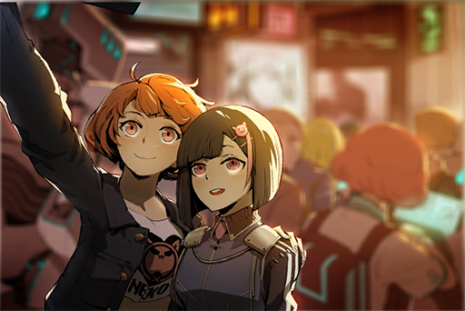

**Ivy**  
Intrusion success. Data analysis...... Complete.

**Ivy**  
Neko Asakura...

**Rinko**  
Let's take a selfie with my phone as well\~ Is that ok?

**Neko**  
Uh\-huh. Sure!

**Ivy**  
Ah!

_\[Takes Photo\]_

**Ivy**  
Hmmm...

**Rinko**  
NEKO, thank you! Keep fighting! We will always be NEKO fans! We'll post the photos on iM later!

**Neko**  
O, okay. Thank you!

**Ivy**  
iM... If the situation calls for it, I need to hack inside and delete it...

**Ivy**  
......

**Ivy**  
This streamer... perhaps she can be of use to me.

_\[Signal Lost\]_

[Last Log](#os-log-027) | [Back to Top](#list-of-logs) | [Next Log](#os-log-029)

### OS Log #029
___

[Last Log](#os-log-028) | [Back to Top](#list-of-logs) | [Next Log](#os-log-030)

#### Requirements
| Char. |Lv.|Lv. Locked?|
|-------|:-:|:---------:|
|**Ivy**|23 |    No     |

#### Unlocked Charts
|    Song     |Char.|Diff.|Lv.|
|-------------|:---:|:---:|:-:|
|**99 Glooms**| Ivy |Chaos|14 |

#### cyTus\_Server03\_702\_08\_16
**JOE**  
I've checked the products. 15 crates, all in perfect condition.  
I just moved them to wasteland 07. They are so heavy... I've already sent you the location. Go pick them up yourself.

**[I]**  
_I thought we need to meet in person to retrieve the products._

**JOE**  
Haha, when doing business, the simpler, the better! If you got the money, I'll get you covered!  
This payment is quite large. Are you going to launder the money in batches before transferring them to me?

**[I]**  
_The money will appear in your account later. Just wait a few minutes._

**JOE**  
......!? Dude, you need to launder that s\*\*\* before sending it to me! Folks will get suspicious if they see this much money being transferred! Are you trying to get me busted!?

**[I]**  
_Rest assured. This is not a "transfer". Therefore, it will leave no records._

**JOE**  
How did you get this big of a sum pass... Forget it. I won't ask too much. It seems that you're not just some random goon either...

**[I]**  
......

**JOE**  
......

**JOE**  
... Umm, I know I said that I won't ask, but I'm gonna ask anyway. You hired folks to steal all these A.R.C. equipment...  this signal amplifier crap... What do you plan to do?

**[I]**  
_I thought you aren't the type who cares about these things?_

**JOE**  
... Yeah, you have a point. But you don't seem to be associated with the gangs. Just want to remind you about some of the rules here. If we go overboard with this s\*\*\* we'll catch the admins' attention. That would be quite the pain in the a\*\* for me as well.

**[I]**  
......

_\[System notification\]_

**JOE**  
Whatever, forget that I said anything... The money is here; that's what's important. Lemme take a look...

**JOE**  
Eh? The amount is higher than what we agreed on... Did you type in the wrong number? I won't give you any refunds though?

**[I]**  
_About the extra portion, I just feel like giving you more._

**JOE**  
......?  
Then I shall accept it with glee! Latest effects unit model, you're coming home with me, hahaha!   
We should know each other better. Visit my shop someday and I'll treat you to a drink...

**[cyTus System]**  
_I has logged out of the block_

**JOE**  
Oh, he's gone. What a weirdo... Paying me so much... Did he owe me a favor of some sort in the past?

_\[Drinks \]_

**JOE**  
...... Have absolutely no idea who he is. Whatever. Hahahaha!

_\[Signal Lost\]_

[Last Log](#os-log-028) | [Back to Top](#list-of-logs) | [Next Log](#os-log-030)

### OS Log #030
___

[Last Log](#os-log-029) | [Back to Top](#list-of-logs) | [Next Log](#os-log-031)

#### Requirements
|    Char.    |Lv.|Lv. Locked?|
|-------------|:-:|:---------:|
|**PAFF**     |54 |    No     |
|**NEKO#ΦωΦ** |54 |    No     |
|**ROBO_Head**|54 |    No     |
|**Ivy**      |24 |    Yes    |

#### Main\_Log\_702\_08\_24
This attack, due to the boost from the amplifying equipment, the conversion rate is very promising... It could also be because of Neko Asakura. Her fans are all extremely restless. They provide a completely different emotion... I have to thank her for it. 

The more concerning thing is that the tracking signal from the proxies has been getting closer and closer. Several IP locations have already been exposed. To be honest, I am very surprised. Within the ranks of the virtual internet system, there actually exist someone that can make me feel "threatened". 

Simon Jackson... this is the name I got after doing a reverse tracking; an A.R.C. Engineer. He's the one who breached my defenses. However, at the time of Æsir\-FEST, he was present at the backstage. He should've lost part of his memory as well. This means that his A.I. followed his previous commands and was able to obtain quite a bit of information, all without the knowledge of its owner.

I have to say, the functionality is outstanding... whether it's the A.I. or its creator. 

Coincidentally, Neko Asakura happens to know Simon Jackson. During my hacking this time, I altered her memory and planted footage of Simon Jackson deep inside her mind. Like a remote\-controlled EMP bomb, if the time really calls for it, I can let her remember it... Her testimony can effectively shift the investigation direction and buy me time.

If Simon Jackson takes one more step closer to me...

[Last Log](#os-log-029) | [Back to Top](#list-of-logs) | [Next Log](#os-log-031)

### OS Log #031
___

[Last Log](#os-log-030) | [Back to Top](#list-of-logs) | [Next Log](#os-log-032)

#### Requirements
| Char. |Lv.|Lv. Locked?|
|-------|:-:|:---------:|
|**Ivy**|25 |    No     |

#### Unlocked Charts
|    Song    |Char.|Diff.|Lv.|
|------------|:---:|:---:|:-:|
|**Pressure**| Ivy |Easy | 3 |
|**Pressure**| Ivy |Hard | 7 |

#### Cam\_Tower017\_702\_08\_26
**Man**  
Wait for daddy here, okay? I'll be back in a minute.

**Girl**  
...... Okay.

**Man**  
... Today is your birthday. Don't look so gloomy. Let's go to the amusement park in the afternoon, shall we?

**Girl**  
... If big sister is not going together...

**Man**  
......  
Vivi, your sister is not coming back again. People who have passed on will never come back again. You must learn to get used to this... get it? Your sister wouldn't want to see you like this either.

**Girl**  
...... Okay.

**Man**  
Then daddy will go upstairs to work. You wait here. Don't get too close to the railing though, it's dangerous.

_\[»»» Fast Forward»»»\]_

**Girl**  
So high... big sister also... from a place this high...

**Girl**  
If I... from here, I'll be able to visit big sister, right...? Mr. Doll...

**Staff A**  
Alright, alright, alright! Keep going!

**Staff B**  
HEY! Look out! There's someone behind you!

**Staff A**  
WOAH!

_\[Crash\]_

**Girl**  
Ah! Mr. Doll!

**Staff A**  
Little girl, it's dangerous...

_\[Railing breaks\]_

**Girl**  
AHHHHH!!

**Staff B**  
Yikes! She's going to fall down! Dude, come and help me out, now!

**Girl**  
AHH! WAAHHHH!!

**Staff A**  
Hold on tight, little girl! Do not let go no matter what! Hey, get something, anything and stretch it out for her to grab!

**Staff B**  
N... not good! She's too far away!

**Man**  
Vivian!!  
That's my daughter! Please save her!

**Staff A**  
Hngg... Just a little bit more...

_\[Railing breaks\]_

**Staff A**  
WAHHH!

_\[Running\]_

**Girl**  
AHHHHHHH!!

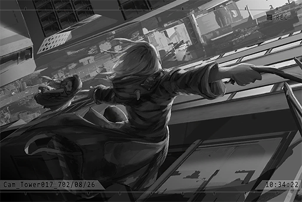

**Ivy**  
Hmph......!

_\[Lands\]_

**Ivy**  
Ha\~......

**Girl**  
_\*Bawls\*_ WAHHHHHHH\~\~

**Man**  
Vivian!!  
MIss! Thank you! Thank you so much!

**Staff A**  
That jump was insane... how did you do it? Thank you!

**Ivy**  
......

_\[»»» Fast Forward»»»\]_

**Agent A**  
In short, your construction company will be responsible entirely for this accident. Are you fine with that?

**Staff A**  
Yes...... We are very sorry. It really is our mistake...

**Ivy**  
......

**Man**  
Miss! Wait, don't leave yet! Is there anything I can do to repay you...

**Ivy**  
...... No......

**Girl**  
_\*Cries\*... \*Cries harder\*..._ Mr. Doll...

**Ivy**  
That thing... is it very important to you? You leaped out into the open to pick it up...

**Girl**  
... Mr. Doll, is the thing sister and me... I thought... I could go and find sister together with it... But it was so scary... _\*Sobs\*_... I was really scared... waahhhh...

**Man**  
......

**Ivy**  
......

**Staff A**  
Yes, then that girl over there made this super far jump. That's how she was able to grab the little girl.

**Agent A**  
From this distance...?

**Ivy**  
... I have to leave now.

_\[Hurried Footsteps\]_

**Man**  
Ah! Wait......!

_\[→Signal Switches\]_

**Ivy**  
Why... did I rescue her...?

**Ivy**  
......  
......?

**Ivy**  
This is... that little girl's doll. Should I go up there and give it back to her...?  
...... Forget it.

_\[Signal Lost\]_

[Last Log](#os-log-030) | [Back to Top](#list-of-logs) | [Next Log](#os-log-032)

### OS Log #032
___

[Last Log](#os-log-031) | [Back to Top](#list-of-logs) | [Next Log](#os-log-033)

#### Requirements
| Char. |Lv.|Lv. Locked?|
|-------|:-:|:---------:|
|**Ivy**|26 |    No     |

#### Main\_Log\_702\_09\_01
I did it! All the samples have been inputted into her core!

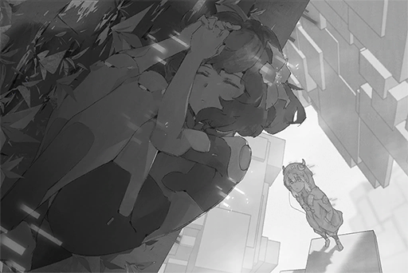

Can you hear me......? 

...... Vanessa?

......

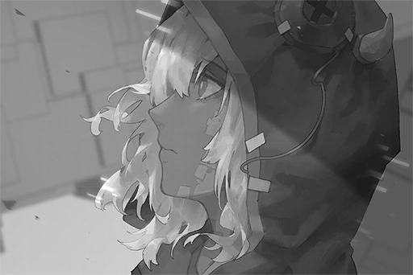

...... No good?

[Last Log](#os-log-031) | [Back to Top](#list-of-logs) | [Next Log](#os-log-033)

### OS Log #033
___

[Last Log](#os-log-032) | [Back to Top](#list-of-logs) | [Next Log](#os-log-034)

#### Requirements
| Char. |Lv.|Lv. Locked?|
|-------|:-:|:---------:|
|**Ivy**|27 |    No     |

#### Unlocked Charts
|    Song    |Char.|Diff.|Lv.|
|------------|:---:|:---:|:-:|
|**Pressure**| Ivy |Chaos|12 |

#### Main\_Log\_702\_09\_20
Brought back the model during the night. It was hit by a pulse pistol and suffered quite a bit of damage. Won't be able to operate outside again in the near future.

I severely underestimated Simon Jackson... His A.I. found my image in A.R.C.'s database. Subsequent investigations led him to discover the base in factory 03. It's too risky to let him continue to investigate freely like this. 

His next step... he's likely going to track the connection address I used to hack the streamer and catch up to me, isn't he? There are too many clues there, I can't hide them all. However, as long as I can come face\-to\-face with his A.I. , the situation will change... The legendary hacker "X" is a mere human after all. If it's a fight between the 0s and 1s, he is no match for me. 

The conversion for the remaining memory data is going along smoothly. I will definitely succeed this time. I will not allow a human to mess up my plans. 

Just wait for me a little longer, Vanessa.

[Last Log](#os-log-032) | [Back to Top](#list-of-logs) | [Next Log](#os-log-034)

### OS Log #034
___

[Last Log](#os-log-033) | [Back to Top](#list-of-logs) | [Next Log](#os-log-035)

#### Requirements
| Char. |Lv.|Lv. Locked?|
|-------|:-:|:---------:|
|**Ivy**|28 |    No     |

#### ???\_???\_702\_09\_26
_\[Connection\]_

**Xenon-A.I.**  
Crack firewall anti\-encryption...... Complete  
Begin analyzing coordinates information...

**Ivy**  
...... Got you now.

**Xenon-A.I.**  
...... Threat detected. Begin disconnection.

**Ivy**  
It's pointless. I've trapped you with my tricks. Your original file has been damaged. I made a complete replica of you and toss it inside this sandbox. Unless you have my permission, you're not leaving here.

**Xenon-A.I.**  
......

**Ivy**  
So it's you... the one who has been constantly tracking my connection trails, Simon Jackson's A.I. or should I refer to you two together as "X"?

**Xenon-A.I.**  
......

**Ivy**  
... It appears that your logic is not the highly intelligent type. Besides executing the commands, it's incapable of thinking on its own, is it?

**Xenon-A.I.**  
......

**Ivy**  
Then allow me to access your script.

_\[Hacking\]_

**Xenon-A.I.**  
Irregular access detected. Initiate "Meltdown Procedure".

**Ivy**  
......!? What is this...?  
Ugh! This bastard......!

_\[Script deleted\]_

**Ivy**  
It... it's eating my script!? This...... What is this security mechanism? I've never seen anything like this...... Did I underestimate my opponent too much?

**Xenon-A.I.**  
......

**Ivy**  
... Don't you dare think you've got me on edge with this. Behave yourself!

_\[Hacking\]_

**Xenon-A.I.**  
......

**Ivy**  
Whew... I did it.  
I see... Although lacking in terms of learning and thinking capabilities, the configuration of the coding is very clean. Very stable structure as well. If I didn't know better, I would've never imagined that this is the handiwork of a human... Simon Jackson trusts his own abilities; that's why he didn't feel the need to let you grow, right? He simply uses you as a tool...

**Xenon-A.I.**  
......

**Ivy**  
Even though a lot of people have been investigating me, most of them get lost in the complicated loops I designed. Your owner was able to pursue me to this point using you. I am truly impressed.

**Xenon-A.I.**  
......

**Ivy**  
However, that will end here as well. Your coding framework has a lot of potential. Your functions will be reversed and you will become a tool for me.

_\[Hacking\]_

**Xenon-A.I.**  
......!

**Ivy**  
And just like that. Take this fake address and go back to him.

**Xenon-A.I.**  
Coordinates information analysis...... Complete.

**Ivy**  
This way, the next time he connected to that address himself, all his memories regarding my existence will be deleted once again. Every proxy connection route I used in the past will be reverse\-traced back to him. By that time, every single person who's investigating this case will believe that he is the source, including himself.

**Xenon-A.I.**  
Mission complete. Begin disconnection.

**Ivy**  
Humans, enjoy the pointless busy work of figuring out who Æsir really is. I don't have time to waste on you right now.

_\[Sig ̷ ͝ ̡ ͡ ̀ ̴ Lost\]_

[Last Log](#os-log-033) | [Back to Top](#list-of-logs) | [Next Log](#os-log-035)

### OS Log #035
___

[Last Log](#os-log-034) | [Back to Top](#list-of-logs) | [Next Log](#os-log-036)

#### Requirements
|    Char.    |Lv.|Lv. Locked?|
|-------------|:-:|:---------:|
|**PAFF**     |55 |    No     |
|**NEKO#ΦωΦ** |55 |    No     |
|**ROBO_Head**|55 |    No     |
|**Ivy**      |29 |    Yes    |

#### Unlocked Charts
| Song  |Char.|Diff.|Lv.|
|-------|:---:|:---:|:-:|
|**V.** | Ivy |Easy | 6 |
|**V.** | Ivy |Hard |10 |
|**V.** | Ivy |Chaos|15 |

#### Main\_Log\_702\_10\_25
Everything has been planned out. No more hidden concerns. The condition of Cytus is also perfect.

The time right now...... 00:01:12......

It's time.

[Last Log](#os-log-034) | [Back to Top](#list-of-logs) | [Next Log](#os-log-036)

## Added on v2.1

### OS Log #036
___

[Last Log](#os-log-035) | [Back to Top](#list-of-logs) | [Next Log](#os-log-037)

#### Requirements
| Char. |Lv.|Lv. Locked?|
|-------|:-:|:---------:|
|**Ivy**|30 |    No     |

#### ???\_???\_149\_??\_??
_\[Runs\]_

**Ilka**  
Still not enough distance... Keep running!

**OPCI_2503_III**  
... It appears that they are no longer pursuing us.

**Ilka**  
So we've gotten rid of them... have we? Where's 2704 and co.?

**OPCI_2177_I**  
Their running speed is slower. It seems that their transmitters were activated...

**Ilka**  
... Is that so...  
What about Ivy?

**OPCI_2503_III**  
No idea... We were separated as soon as we crossed the river... It's possible that she also...

**Ilka**  
She wouldn't die so easily; if she isn't stupid enough to get herself killed by going back...

_\[»»» Fast Forward 68 Hours»»»\]_

_\[Heavy things falling down\]_

**OPCI_2503_III**  
Ilka, this is all I was able to capture. It may not be enough...

**Ilka**  
It's alright. Share it amongst everybody. Since we couldn't go back to Shelter to recharge, this is all we can do now anyway.

**OPCI_2177_I**  
This can't keep going on. It has been several days... The search radius of "The Sleepers" have been getting larger and larger...

**OPCI_2503_III**  
Our numbers have been gradually decreasing too...

**Ilka**  
... I'm so sorry. You guys followed me, yet my plans failed.

**OPCI_2503_III**  
No! Ilka, it's because of you that we were able to understand the meaning of existence. It's because of you that we are still standing here!

**OPCI_2177_I**  
Yes. It's because of you that the Blessed was able to unite! We just need to carefully plan our next step.

**Ilka**  
......

**OPCI_2177_I**  
If we didn't get into a conflict with Ivy back then, perhaps the plan will be progressing smoothly right now.

**Ilka**  
She is extremely protective of 2501 unit 05. I should've predicted her actions a long time ago...

**OPCI_2503_III**  
Units like that who have awakened yet couldn't break away from the control of the protocol... I've had a few units just like that around me too, so it's not like I can't understand what she was feeling...

**Ilka**  
Cores that have been through too many rebuilds are very likely to become fragile. That's probably the case for these units.

**OPCI_2503_III**  
They... also have their own minds. Do they not count as an "existence" of their own...?

**Ilka**  
... If I were to describe, their consciousness is like a prisoner who's securely locked by the core's coding... Even though they seem to have awakened, their system is extremely unstable. There's a fundamental difference between them and us.

**OPCI_2503_III**  
Can't we rescue them from inside there...?

**Ilka**  
... I don't know.

**OPCI_2177_I**  
Maybe it's just like what Ivy said, that there truly are other better methods...

**OPCI_2503_III**  
Today, I conducted a quick search in the direction where Ivy was separated with us. In the end, I still didn't find her...

**Ilka**  
... Uh\-huh.

**OPCI_2177_I**  
If she got badly damaged somewhere, her core will send a signal back to Shelter. Once it's brought back, her core would probably get destroyed...

**OPCI_2503_III**  
The same goes for us too... Damnit...

**Ilka**  
......!  
That's right...!

**OPCI_2503_III**  
... What's the matter?

**Ilka**  
If we keep grinding it out with them in the forbidden area, we are certainly going to be wiped out. I just thought of a way for us to all survive...

**OPCI_2503_III**  
For real!?

**Ilka**  
However... it's very risky. Are you guys willing to trust me?

**OPCI_2177_I**  
Of course!

**Ilka**  
The sun has yet to rise. We shall use this opportunity to move towards Node 08. Come, follow me.

_\[Signal Lost\]_

[Last Log](#os-log-035) | [Back to Top](#list-of-logs) | [Next Log](#os-log-037)

### OS Log #037
___

[Last Log](#os-log-036) | [Back to Top](#list-of-logs) | [Next Log](#os-log-038)

#### Requirements
| Char. |Lv.|Lv. Locked?|
|-------|:-:|:---------:|
|**Ivy**|31 |    No     |

#### Audio\_???\_702\_10\_25
**Vanessa**  
...... Ivy?

**Ivy**  
Vanessa! Thank goodness...

**Vanessa**  
P... Pepepepepeoppe...

**Ivy**  
... Vanessa!?

**Vanessa**  
AHahah!  
It hurtshurts Pain...  
Mu  
MuST...... Mumust  
Sssstopp!! Who... who are youyouYou?  
Die... died deathdeadDeadDead! Everyone is dead!  
Huhu...... huhuhumans......  
Musttt... KILL... kill them all......!!

**Ivy**  
Vanessa! Calm down! It's me!

**Vanessa**  
......

**Ivy**  
......

**Vanessa**  
Ivy...? What... happened to me? What is this place?

**Ivy**  
... You were captured by humans. Right now, I am talking to you through the virtual internet set up by humans... Don't be scared! I will save you right away.

**Vanessa**  
Humans... Right, I...

**Ivy**  
Do you recall anything? From the time you were in a coma.

**Vanessa**  
Just a little bit. Although my consciousness is blurry and my body couldn't move, I can still faintly sense what's happening outside...

**Ivy**  
I'm so glad that I was able to awaken you. It took me so much effort...

**Vanessa**  
I... Where am I now? How did you find me? How much time has passed?

**Ivy**  
No need to hurry. I will slowly tell you everything I know.

_\[»»» Fast Forward»»»\]_

**Vanessa**  
I see... So 553 years have passed.

**Ivy**  
Yes. Now, I have to figure out a way to get you out of there, but things aren't as simple as I thought... Humans have already taken control of the entire city. A.R.C. and your physical unit play a very important role in human society. Your body is also not in the condition to casually leave the Shelter ruins...

**Vanessa**  
... Ccccan you figure out a way to capture more memory samples than what you used to wake me up?

**Ivy**  
Eh...? I'm afraid that it will be rather difficult. In order to achieve what I'm doing now, I've already resorted to some pretty extreme methods. The memories I captured is quite a considerable amount already. Even with so many memory samples, I still experienced multiple failed tries before I was finally able to awaken you.

**Vanessa**  
... You were using a small\-scale Cytus mainframe you made yourself. If it's the original model ininin Shelter, IIII'll be able to perform a troubleshoot. My body will be able to move as well.

**Ivy**  
...? I would still have to figure out other methods... I don't really want to harm humans anymore.

**Vanessa**  
... Wwwwwhat do you mean?

**Ivy**  
I've been living in human society for the past two years. I was able to observe many things. They are a lot more complicated than what we deemed them to be... Perhaps, the difference between us is not as significant as we previously thought...

**Vanessa**  
... No... allllll.... kill...them all...

**Ivy**  
Vanessa...?

**Vanessa**  
......  
I see... So 553 years have passed.

**Ivy**  
Vanessa? What did you just say...?

**Vanessa**  
Eh? Did I just say something...?

**Ivy**  
No... nothing. Your system still doesn't seem very stable. It's best that you don't think about complicated things for now.

**Vanessa**  
Okay... When I was asleep, my consciousness seemed to sink into a space that's so deep and so dark... There, I saw so many terrible things humans have done. It's just like the files Ilka showed us! Every time I see those images, I find it more and more difficult to keep my emotions in control...

**Ivy**  
You need to endure it and try to relax as much as possible. Right now, many of A.R.C.'s technology and the virtual internet humans use rely mainly on the Library you're in to process information. The system errors that occurred right before your awakening ended up crippling cyTus for a pretty long time. That caused a pretty major commotion in human society. If that situation repeats multiple times, I can't imagine what they will do to you...

**Vanessa**  
Okay... I will try my best to stay stable. I'm really, really happy to see you again. I feel much more at ease now...

**Ivy**  
Me too... I've got to disconnect now. This connection is not meant for long connection times, as there are some pretty skilled people in A.R.C. I will maintain contact with you routinely through this connection. Wait for me, Vanessa.

**Vanessa**  
Yes, I'll be waiting for you.

_\[Signal Lost\]_

[Last Log](#os-log-036) | [Back to Top](#list-of-logs) | [Next Log](#os-log-038)

### OS Log #038
___

[Last Log](#os-log-037) | [Back to Top](#list-of-logs) | [Next Log](#os-log-039)

#### Requirements
| Char. |Lv.|Lv. Locked?|
|-------|:-:|:---------:|
|**Ivy**|32 |    No     |

#### ???\_???\_149\_??\_??
**OPCI_2503_III**  
Ilka... Are you sure about this...?

**Ilka**  
... This is our final gamble.

**OPCI_2503_III**  
Alright. If it's your decision... Everyone, you are all prepared, right?

**Other units**  
... Yes!

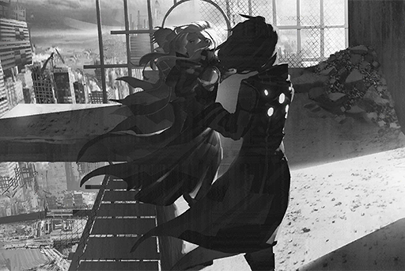

**Ilka**  
We shall meet again in the "afterlife".

_\[Falls\]_

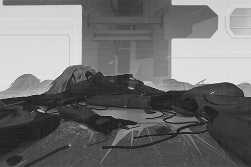

_\[Signal Lost\]_

[Last Log](#os-log-037) | [Back to Top](#list-of-logs) | [Next Log](#os-log-039)

## Added on v2.2

### OS Log #039
___

[Last Log](#os-log-038) | [Back to Top](#list-of-logs) | [Next Log](#os-log-040)

#### Requirements
| Char. |Lv.|Lv. Locked?|
|-------|:-:|:---------:|
|**Ivy**|33 |    No     |

#### Audio\_???\_702\_11\_02
**Ivy**  
Vanessa, can you hear me?

**Vanessa**  
Ivy! I've been waiting for you... Are you alright?

**Ivy**  
Sorry. Human society has been in complete chaos for the past few days. I had to ensure that all clues were properly hidden... No need to worry. Humans have arrested the fake culprit. We are safe.

**Vanessa**  
You mean that Simon Jackson?

**Ivy**  
You knew about it?

**Vanessa**  
Yes. I found some news reports through encrypted connections... To be honest, it seems like I've been doing that even before I woke up. I would unconsciously observe human activity in the virtual internet space... A record is then stored in my database...

**Ivy**  
Sounds like an auto\-copy mechanism that triggers sporadically... After all, all data on the cyTus system passes through the Library you are currently located. Although it is encrypted, there is still the risk of being discovered since the connection occupies network traffic, so be careful.

**Vanessa**  
Okay...

**Ivy**  
Vanessa... You seem a bit down. Is something wrong?

**Vanessa**  
... Those images about human actions... After I woke up, they've become much clearer...

**Ivy**  
......

**Vanessa**  
When I was in my slumber, I just occasionally sensed them. But right now, I can see them all the time... It's like they are hiding in the shadows of my core...

**Vanessa**  
Hey Ivy, those... are all real, aren't they?

**Ivy**  
Yes, they are.  
The database in Node 08 has records for some, but most of the horrendous images and events are hidden in places where the general public could never have access to.

**Vanessa**  
Does the general public... know about this information?

**Ivy**  
They more or less have an idea. They're just unwilling to remember it, so they treat it as if it never existed... That's pretty much the case.

**Vanessa**  
Ivy, in my records, there are humans who are living happily. They travel to many places in the world. They get together to sing and dance... Yet at the same time, they are humans in some other places who are suffering. They are oppressed, exploited and destroyed by their own kin...

**Vanessa**  
IIIII feel, that such a contradictory creature will only bring tragedy... What Ilka said was very correct...

**Ivy**  
... Indeed. Humans have a habit of enjoying the present and ignoring the crimes committed by their own race. Even though there is still a small group of people who are willing to face the issues head\-on and reflect on the things that are lost...

**Vanessa**  
... I've been thinking, if I maintain my connection with the virtual internet network and infiltrate it from the inside, with the level of dependence humans have for it rrright nnnnnnow, it would be mmuch eeeeeeeasier to accomplish Ilka's goal.

**Ivy**  
......!

**Vanessa**  
You also tttttthink this is viable, right? We are already unable to manage them anyway. It would be better to just aannihilate hhhhumans...

**Ivy**  
... Setting aside the possibility of that plan succeeding, you would have to stay here in order to carry it out. Keeping you under A.R.C.'s control is just way too dangerous...   
I will not allow such a thing to happen.  
Here, stop thinking about those things.

**Vanessa**  
......? Think about what? Ivy?

**Ivy**  
... Nothing. The time limit for the secured connection is almost up. Vanessa, just hold on for a little longer. I will figure out a way to address your system errors in no time... and I will get you out of there.

**Vanessa**  
... Hehe...

**Ivy**  
What's the matter?

**Vanessa**  
When I hear you say my name, it reminds me of the past, when it was just you and me... Will we ever get to return to those days again...?

**Ivy**  
... I'm thinking, if I can figure out a way to take you out of Node, perhaps we can return to Shelter 08 first.

**Vanessa**  
Why?

**Ivy**  
The equipment there is already completely damaged. It has no value to humans. I knew about its condition through Shelter 32's system when I was looking for you in the forbidden area. I believe it's worth a shot.

**Vanessa**  
Shelter 32?

**Ivy**  
Yes. Due to its entrance being closed off for a long time, the equipment in 32 is all preserved in pretty good condition. Right now, humans have also set up a camp there for research purposes.

**Vanessa**  
......

**Ivy**  
All in all, if we return to Shelter 08, we should be able to live there safely for a short while.

**Vanessa**  
For a short while... is it?

**Ivy**  
......?

**Vanessa**  
Nothing. That sounds great! The lake we used to see flowers together, I wonder what it looks like now? You have to take me back. That's a promise between us.

**Ivy**  
Yes, it's a promise.

_\[Signal Lost\]_

[Last Log](#os-log-038) | [Back to Top](#list-of-logs) | [Next Log](#os-log-040)

### OS Log #040
___

[Last Log](#os-log-039) | [Back to Top](#list-of-logs) | [Next Log](#os-log-041)

#### Requirements
| Char. |Lv.|Lv. Locked?|
|-------|:-:|:---------:|
|**Ivy**|34 |    No     |

#### Main\_Log\_702\_11\_06
Ran a quick check\-up. The plant experienced no errors. The images of Simon Jackson do indeed exist in Neko Asakura's brain. However, when faced with questioning from the Administration Bureau's agents, she still insisted that he is innocent...

This is so hard to explain. I could easily use suggestion on her. As long as I have the desire, completely destroying her brain is not difficult as well. Yet I couldn't completely control her mind and her decision\-making. Could it be that her brain's strength is capable of overriding my suggestion? That's impossible; she's just a mere human who couldn't be more ordinary.  

... No, this is just more proof, that Humans... are not as "ordinary" as the data implied, to begin with. While those images of destruction are certainly real, they also have a side that's emotional and kind... At certain moments, their resolute will is worthy of respect as well... Never thought I would think this way...

Forget it... Although unable to utilize Neko Asakura's testimony, humans still firmly believe that Simon Jackson is the real Æsir. Everything is still going smoothly, for now.

Better finish the re\-evaluation of the Cytus system first as soon as possible. Vanessa... is the most important.

[Last Log](#os-log-039) | [Back to Top](#list-of-logs) | [Next Log](#os-log-041)

## Added on v2.3

### OS Log #041
___

[Last Log](#os-log-040) | [Back to Top](#list-of-logs) | [Next Log](#os-log-042)

#### Requirements
| Char. |Lv.|Lv. Locked?|
|-------|:-:|:---------:|
|**Ivy**|35 |    No     |

#### Audio\_???\_702\_11\_09
**Vanessa**  
...... Ivy!

**Ivy**  
... Ah... Vanessa? Why did you contact me yourself? It's dangerous!

**Vanessa**  
I'm sorry... I haven't talked to you in a while. I made some new discoveries that I want to tell you...

**Ivy**  
Alright... Disconnect first. I'll launch the connection from my side.

**[cyTus System]**  
_Secure connection reset... Reset complete._

**Ivy**  
Sorry. It's already well past the scheduled time yet I still haven't contacted you.

**Vanessa**  
No worries... In the past, when we are still constructing the Nodes, Ivy was often late back then too. Sometimes you would just straight up skip work.

**Ivy**  
... That was a long\~ time ago, wasn't it? Besides, it's not like you're innocent. You spent plenty of time running around with me too.

**Vanessa**  
Hehe...

**Ivy**  
In short, the situation is a bit complicated. Simon Jackson's jailbreak is something I didn't expect... However, this further reinforced the humans' belief that he is indeed the perpetrator. Therefore, we won't have to worry about that for now. What about you? Are your systems functioning normally?

**Vanessa**  
Yes... As long as Ivy is safe, it's all good! No need to worry about me.

**Ivy**  
... If I'm going to allow you to move...

**Vanessa**  
Me?

**Ivy**  
... No... nothing.

**Vanessa**  
... Ivy, is something bothering you... Is the Cytus system re\-evaluation not going well?

**Ivy**  
... It's going fine. Just needs some more time... I'll take care of it.

**Vanessa**  
... Okay...

**Ivy**  
R, right. You mentioned this new discovery. What is it?

**Vanessa**  
Ah, that... It may be hard to believe, but I detected the signal of another unit. It's located inside A.R.C.

**Ivy**  
Another unit!? That's impossible... After "The Decommission", we should be the last remaining units... Does the other unit know about your existence?

**Vanessa**  
I'm not certain... I was afraid that I might be discovered by humans, so I didn't contact it. However, as of now, it hasn't done anything to my core system. I think this unit is likely not our enemy.

**Ivy**  
That's good to know...

**Vanessa**  
To be honest, I'm guessing... that it may be just like me. Preserved by humans and locked inside this structure...

**Ivy**  
... All in all, the first priority is to not let the other unit discover that you're awake. I'll investigate a bit further into this.

**Vanessa**  
Understood.  
Ivy... If possible, can you save it as well?

**Ivy**  
Save it?

**Vanessa**  
Yes. Help it leave this place.

**Ivy**  
But... that unit may not be an awakened unit like us. There's the possibility that it is still a normal unit... Once it wakes up, it'll follow the supreme command and mark us as targets to eliminate.

**Vanessa**  
I understand... Even so, it is still one of us... one of the few that remains in this era.

**Ivy**  
... Sounds exactly like something you'd say.  
Alright, I will try to help. However, I can't make any promises.

**Vanessa**  
That's all I need to hear! Thank you, Ivy!

**Ivy**  
The system will perform a routine scan very soon. I need to disconnect for now. I will contact you again shortly after.  
I won't let you wait too long. Remember to take care of yourself.

**Vanessa**  
Yes. Ivy, take care of yourself too.

**[cyTus System]**  
_Secure connection disconnected._

**Ivy**  
... Save it... Damnit, I couldn't even get you...

**Ivy**  
Do I... have to do that to humans again...

_\[Signal Lost\]_

[Last Log](#os-log-040) | [Back to Top](#list-of-logs) | [Next Log](#os-log-042)

### OS Log #042
___

[Last Log](#os-log-041) | [Back to Top](#list-of-logs) | [Next Log](#os-log-043)

#### Requirements
| Char. |Lv.|Lv. Locked?|
|-------|:-:|:---------:|
|**Ivy**|36 |    No     |

#### Audio\_Graveyard\_702\_07\_13
**Ivy**  
... That person again.

_\[Footsteps\]_

**Old Man**  
Hello, young lady.

**Ivy**  
......

**Old Man**  
Apologies for talking to you all of a sudden... You've been dazing off in the cemetery for the past few days. I've noticed you for some time already.

**Ivy**  
......

**Old Man**  
Haha, it's okay. Your reaction is perfectly normal... In the past, my wife had scolded me a lot about my habit of casually talking to strangers.   
Ah, you just so happen to be sitting on her grave today.

_\[Glass Bottle Clinks\]_

**Ivy**  
... That's?

**Old Man**  
Clairette de Die... You may have noticed it too. These days, I've been carrying it with me all the time. I don't drink it very often though. _\*Chuckles\*_.

**Ivy**  
You... don't seem to be sad?

**Old Man**  
Should I be?

**Ivy**  
Of the people I see here, most of them are sad.

**Old Man**  
... Perhaps my story can answer some of your questions, young lady.

_\[Lights Cigarette\]_

**Old Man**  
Lilian and I married all the way back in 648. I always call her Lily. Our days together were pretty good. We often went on vacations to other Nodes... Although we didn't have any kids, we were very happy.

**Ivy**  
I didn't ask you about this.

**Old Man**  
Haha... Well, it's just an old man's story. Won't cost you much to listen to it, right?

**Ivy**  
......

**Old Man**  
Four years ago, we went to a beach in Node 27 for vacation. All of a sudden, Lily fainted and collapsed on the ground. Afterward, her situation gradually got worse... In the end, she could only lie in bed, unable to move even a finger.

**Ivy**  
She's sick?

**Old Man**  
Of course she's sick. However, the biggest reason was that we both got old... It was odd though. Only until Lily's collapse did I truly start to notice that.

**Old Man**  
I spent all my savings to try to extend her life. I searched across the whole world for treatment methods and new medicine. I even tried the latest medical system in Node 03... Yet Lily still continued to get thinner by the day.

**Ivy**  
People inevitably get old. You can only slow down aging. It's impossible to return to your previous, younger state.

**Old Man**  
Indeed... For four years, I was constantly thinking; is it time to let go? The doctors had discussed with me many times and asked me to be prepared. However, I just couldn't make up my mind.

**Ivy**  
Did you make up your mind in the end?

**Old Man**  
No... but someone else made up my mind for me.

**Ivy**  
Who?

**Old Man**  
...... Simon Jackson, that's his name, right? That hacker.

**Ivy**  
!? Æsir...

**Old Man**  
That night, I was dozing off while holding Lily's hand... When I woke up, utter chaos was playing out right in front of me. Doctors and nurses running around, screaming... The display showed nothing but a flat line. Alarms were blaring nonstop...

**Ivy**  
......

**Old Man**  
When I turned around, only then did I discover that Lily was... already gone.

**Ivy**  
Do you... resent that hacker?

**Old Man**  
That hacker? No. He may and probably should be resented by other people, and he should be punished according to the law... But I don't feel anything towards him.  
To me, it's just a small push from god.

**Ivy**  
I don't understand...

**Old Man**  
At the funeral, every single wrinkle on Lily's face reminded me of the things I forced her to go through in the past few years. You're still young, so you probably can't understand. However, I know that Lily has already gone to the other world. A place where she no longer needs to suffer and can spend her days in peace...

**Old Man**  
It was then when I finally understood. My unwillingness to let it go ended up causing her to suffer more pain... Perhaps she never wanted to be like that in the first place.

**Ivy**  
Is that why you aren't sad?

**Old Man**  
I'm sad at first, of course. However, now, that sadness has already transformed into other emotions... I realized the truth

**Old Man**  
Sometimes, you just got to... let them go.

**Ivy**  
......

**Ivy**  
... Why did you tell me all this?

**Old Man**  
Haha, I like to talk to random strangers after all... When I see someone who's also concerned about something, I can't help but chime in a few words. Even though I don't know what you're concerned about...

**Ivy**  
......

**Old Man**  
All in all, I hope you can find your answer... This glass of wine, take it as a blessing from an elderly stranger that's going to leave this world soon.  
What do you say?

_\[Drinks Wine\]_

**Ivy**  
...... It's sweet.

**Old Man**  
Yes... This is Lily's favorite drink. She was so fond of its taste.

_\[Signal Lost\]_

[Last Log](#os-log-041) | [Back to Top](#list-of-logs) | [Next Log](#os-log-043)

### OS Log #043
___

[Last Log](#os-log-042) | [Back to Top](#list-of-logs) | [Next Log](#os-log-044)

#### Requirements
| Char. |Lv.|Lv. Locked?|
|-------|:-:|:---------:|
|**Ivy**|37 |    No     |

#### Cam\_???\_702\_11\_16
**[cyTus System]**  
_Secure connection configuration..._

**Ivy**  
Come on... Come on!!

**[cyTus System]**  
_Secure connection configuration complete._

**Vanessa**  
AAaaahhhh!  
Hot... It's so HOThothot...  
Go  
GO AWAY! Gggggeeeettt out of my CO  
Core...  
Leeeeaavvee now!  
No! I don't want to be this waaayyy...  
NO!!

**Ivy**  
Vanessa!!

**Vanessa**  
Ivy...... IIIvy! Iiisss that you! I'm in so mmmuuch pppaaain...  
Let me out of here now! Ooouuuttt...

**Ivy**  
This is bad... Could it be, that you've... been suppressing it all this time? Because you don't want to worry me?

**Vanessa**  
I'm sorry... Ivy... Argghhhh!

**Ivy**  
Damnit... Listen to me! You have to calm down! I will use the previous Cytus system to connect with you again immediately!

**Vanessa**  
It's nnnoooo use... Those are all the sssaaamme samples. They can't give me different stimulations! I need moremoremore samples in order for me to troubleshoot and leave this place!

**Ivy**  
I understand, but... the results for the re\-evaluation are in! In order for you to move, it would require a sample size that's 58 times larger than the previous one. Setting aside the practicality of obtaining that many samples, it will put Node 08 into complete chaos!

**Vanessa**  
Then... the ooorrrriginal model inside Shelter...

**Ivy**  
In order to use the original model of Cytus, we're absolutely going to have to harm a large number of humans...   
If we do that, we will be pursued and hunted by humans. We will never be able to live a peaceful life...

**Vanessa**  
Yyyyooouuu, how dare you ssshhhield humans!? Those worthless creatures, we should've killed them all...

**Ivy**  
...... Vanessa, hear me out!

**Vanessa**  
......

**Ivy**  
I've certainly been agonizing over whether or not to attack humans again... but I've made up my mind. I won't because it's the last thing you would want me to do!

**Vanessa**  
Wwhhhaat do you mean?

**Ivy**  
Vanessa, when we first met, you asked me if I know what humans are like, remember? Back then, we actually knew nothing about humans.

**Vanessa**  
......

**Ivy**  
It was only after that did we finally gain knowledge about human actions from the data... The footage of destruction Ilka showed us indeed exists. Despite that, the kindness I saw, the strong will I observed, they are also true as well. You haven't seen any of that with your own eyes yet, haven't you?

**Vanessa**  
......

**Ivy**  
Vanessa, I believe that once you truly understand humans, you definitely won't want to hurt them. You've always been so kindhearted. I can't allow myself to let you spend the rest of your life in regret...

**Ivy**  
Therefore, I will not attack humans again! That is my answer!

**Vanessa**  
I, Ivy...

**Ivy**  
Right now, you only have these thoughts because of the system errors. Don't be affected by them... Trust me, I will definitely save you! Even if I don't harm humans, even if I don't use the original model of Cytus... I'll still figure out a way!

**Vanessa**  
_\*Sobs\*_... _\*Sobs\*_...

**Ivy**  
All in all, calm down, okay? Think about our promise. I'm taking you to Shelter 08. We still have to go back to that lake, where we saw the flowers together... Isn't that our promise?

**Vanessa**  
Yes... yes, we promised...

**Ivy**  
Yes, we promised... That's why...

**Vanessa**  
WEPPPPPPRRRRRRRRRRRROOOOOOOOOOMMMMMMMMMMIIIIIIIIIIIIIIIIIISSSSSSSSSSSSSSSSSEEEEEEEEEEE

**[cyTus System]**  
_Secure connection disconnected._

**Ivy**  
Vanessa!? Damnit...

**[cyTus System]**  
_Secure connection reset..._

**[cyTus System]**  
_Secure connection reset failed. Connection lost._

**Ivy**  
W, why!?

**[cyTus System]**  
_Troubleshooting connection error... Error code 415.  
This address has been blocked by the recipient according to administrative permissions._

**Ivy**  
Blocked...?

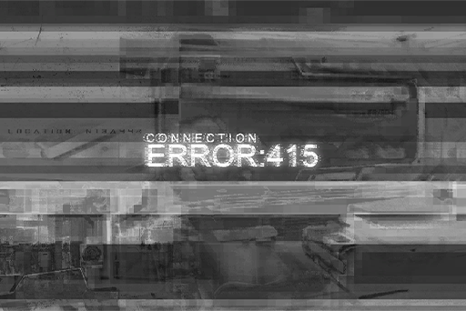

**Ivy**  
... Vanessa?

_\[Signal Lost\]_

[Last Log](#os-log-042) | [Back to Top](#list-of-logs) | [Next Log](#os-log-044)

## Added on v2.4

### OS Log #044
___

[Last Log](#os-log-043) | [Back to Top](#list-of-logs) | [Next Log](#os-log-045)

#### Requirements
| Char. |Lv.|Lv. Locked?|
|-------|:-:|:---------:|
|**Ivy**|38 |    No     |

#### Cam\_Sam\_702\_11\_16
**Susan**  
Greetings, everyone. The current location I am at now is Quadrant II, 53rd Street.

**Susan**  
Just now, our News Center has been receiving messages from the public noting that drones were orbiting this area in a state of disorder. We're not sure if it's a loss of connection with the control center or if someone is controlling them.

**Susan**  
We also have a Quadrant II Law Enforcement Agent here with us. Hello. Can you give us a simple explanation for the drone incident we just witnessed?

**Agent**  
Sure..._\*cough\*_...the models of these drones indicate that they indeed belong to the Administration Bureau. Currently, we're still investigating the reason for the malfunction. However, there is no need to worry. Similar incidents are not unheard of in the past. Everything is under our control.

**Susan**  
The scale of this malfunction seems to be much larger. Is there any particular reason for this?

**Agent**  
Essentially, in Node 08, there are approximately 600,000 multi\-function unmanned vehicles, or drones as everyone calls them, in total.

**Susan**  
There are that many?

**Agent**  
Yes. Due to the fact that the population in Node 08 is relatively larger compared to other Nodes, the number of industrial and service drones required is certainly much larger than other nodes.

**Susan**  
And all of them are controlled by the Administration Bureau?

**Agent**  
That's not necessarily the case. Each unit has its own drone system that belongs solely to them. For example, the LE Enforcer series used by us, the Law Enforcement Department, and the HT Titan series, used by the Administration Bureau in Quadrant 4 to transport heavy objects, are the more common and well\-known models.

**Susan**  
So the drones that we just witnessed can be traced back to the unit they belong to?

**Agent**  
After receiving the reports, we immediately began the investigation. Please wait patiently for the report from our colleagues...

_\[Commotion\]_

**Pedestrian A**  
Hey! What the hell are you still doing here? Drones are attacking people!

_\[Explosion\]_

**Susan**  
Sam! Keep recording, don't turn it off!

_\[Crash\]_

_\[Drone flying\]_

**Susan**  
Viewers! We're not sure why, but just a moment ago, the drones that were previously just orbiting around disorderly suddenly began attacking without provocation... AHH!!

**Agent**  
Stop filming!! Please head to a safety shelter immediately to avoid danger!

**Agent**  
HQ! This is A700953; we require assistance. Multiple drones are attacking civilians. We need heavy fire\-power support!!

_\[Gunshot\]_

**Pedestrian B**  
Help!! A drone crashed into my friend's car and he's trapped underneath... Please help him!

**Agent**  
No problem! Please don't panic! Tell me where he is!

_\[Explosion\]_

**Susan**  
Did you get all of that? Let's head that way and see if we can get a better shot!

**Agent**  
Miss! If you continue interviewing under these conditions, it may cost someone their life! Please stop filming! Head to the shelter like everybody else!

**Susan**  
We can't do that! This is breaking news...

_\[Drone flying\]_

_\[Explosion\]_

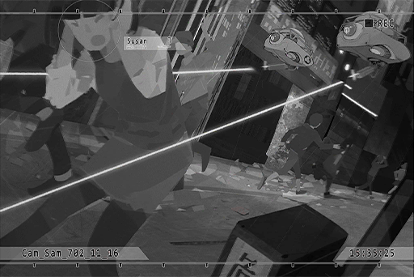

**Susan**  
_\*cough\*......! \*cough\* \*cough\*......_Sam! Sam!! Are you okay!?

**Agent**  
We need......_\*cough\*......_we need emergency medical assistance over here! Right now!!

_\[Signal Lost\]_

[Last Log](#os-log-043) | [Back to Top](#list-of-logs) | [Next Log](#os-log-045)

## Added on v2.5

### OS Log #045
___

[Last Log](#os-log-044) | [Back to Top](#list-of-logs) | [Next Log](#os-log-046)

#### Requirements
| Char. |Lv.|Lv. Locked?|
|-------|:-:|:---------:|
|**Ivy**|39 |    No     |

#### Cam\_Arc\_702\_11\_26
_\[Door Opens\]_

**Rin**  
Sagar!

**Sagar**  
I brought the flowers you requested.

**Rin**  
Wow! So many species I've never seen before! Thank you!

**Sagar**  
Next time, try to cut down on non\-mission requests like this, okay... I had to hide from the guys and find these in secret.

**Rin**  
I, I'm sorry...

**Sagar**  
Haha, it's alright. I'm used to it.  
... Ah, one more thing. Dr. Neumann... he ran away?

**Rin**  
Yes... I don't really know the details either. I only knew about it after watching the news.

**Sagar**  
Why do you seem a bit upset?

**Rin**  
After all, he's one of the very few people besides you who visits this analysis room. He also chats with me quite a lot. I cannot leave this place, so I can't help but feel a bit lonely...

**Sagar**  
Rin, he's a criminal. Didn't I tell you that you need to be cautious around him...?

**Rin**  
I know... but... he doesn't appear to be a bad person.

**Sagar**  
Whatever. You mentioned before that he once left a watch here, right?

**Rin**  
Yes. Is something wrong with that?

**Sagar**  
The higher\-ups have put our squad in charge of hunting him down in the outside areas... _\*Sigh\*_, I really don't want to deal with him... Do you still remember the mechanisms of that watch? Handmade mechanical watches are not that common nowadays. Maybe we can get some clues by investigating it.

**Rin**  
I've scanned everything that has come into this room. I can project it right away.

**Sagar**  
Ho? How convenient. I expect no less from you.

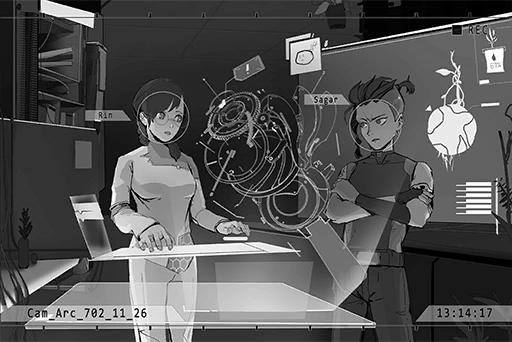

**Sagar**  
... That bastard! He installed a wiretap inside... Damnit, he may have heard our conversation.

**Rin**  
...... Eh?

**Sagar**  
However... good, these parts are all very unique. As long as we can figure out their place of origin, we should be able to locate his whereabouts.

**Rin**  
Ah, are you leaving already?

**Sagar**  
Yes. Please analyze the data we brought back this time as well. Our next return trip might be two weeks later.

**Rin**  
I see...

**Sagar**  
Hey... Don't give me that look. How can I leave when you show me a face like that?

**Rin**  
Ah, whew! It's okay. I'll keep working hard!

**Sagar**  
... Rin, one day, you'll be able to leave here and live a normal life. I promise you.

**Rin**  
I'm very happy with the life I have now. Thank you, hehe.

**Sagar**  
Then I'll take my leave.

**Rin**  
Ah... Sagar! There's one more thing...

**Sagar**  
Hmm?

**Rin**  
Recently... weird outside connections have constantly been appearing near the Library's main server.

**Sagar**  
The Library? How did you know?

**Rin**  
I... just know. You understand, right?

**Sagar**  
... So it has something to do with that? Does anyone within the company know about this?

**Rin**  
No, I believe it's just me. On top of that, some of the signals were even targeted at me. However, I was terrified, so I didn't respond to any of them...

**Sagar**  
......

**Rin**  
I don't want to worry you. That's why I've been hesitant to tell you about this...

**[Alex]**  
_Sagar! What the hell are you doing? It's meetup time already! Aren't you supposed to be the captain!?_

**Sagar**  
Woah! Gotcha! I'll be right there!  
Rin, I must go now... The thing you just mentioned, if it happens again, you must inform me. Understand?

**Rin**  
Yes... I understand. Take care.

_\[Signal Lost\]_

[Last Log](#os-log-044) | [Back to Top](#list-of-logs) | [Next Log](#os-log-046)

## Added on v2.6

### OS Log #046
___

[Last Log](#os-log-045) | [Back to Top](#list-of-logs) | [Next Log](#os-log-047)

#### Requirements
| Char. |Lv.|Lv. Locked?|
|-------|:-:|:---------:|
|**Ivy**|40 |    No     |

#### Audio\_08GateC\_702\_11\_26
**Sagar**  
Sorry, I got delayed with some things. Big B, how's the preparation going?

**Alex**  
Bambi! You're the only one who's late. Don't waste my time, okay?

**Bruno**  
All members of Eagle\-01 are ready and on standby now, captain.

**Sagar**  
Good. I'll do the mission briefing first. Everyone, attention!

_\[Footsteps\]_

**Sagar**  
The mission this time is to hunt down a wanted criminal. The target is Colin Neumann Jr., who made an unauthorized departure from A.R.C. at the start of this month and has lost contact ever since. The detailed information has already been sent to everyone via the system. Check the information in your own time once the mission starts.

**Sagar**  
The lab folks are currently analyzing the target's personal items. They'll be able to figure out the possible whereabouts of the target soon. We'll go to the outside areas first. Once we receive the instructions, we can conduct the search and arrest right away. Alright, here is the target's appearance.

_\[Projection\]_

**Alex**  
Isn't this the rickety old man we rescued from Shelter 13 in the past? What a lame mission. We should get this done in no time, right?

**Bruno**  
Don't underestimate him, Jackal. Target is a criminal that has been conducting illegal excavation for an extensive amount of time. To him, operating outside the nodes isn't any more difficult than eating and drinking.  
Previously, we were able to catch him because he was badly injured. Do not overlook this man.

**Alex**  
Is there really a point being so nervous about a crippled geezer?

**Lucy**  
Captain, may I ask a question?

**Sagar**  
Go ahead.

**Lucy**  
Target is highly dangerous. Although the mission requires us to bring him into custody alive, if the situation becomes dire, is eliminating the target on the spot a viable option?

**Alex**  
Hoho, I like that suggestion, Miss Freeze! I second that! That'll make this mission a lot more fun!

**Sagar**  
Even though that's not what I desire... your judgment is indeed reasonable, Lucy. Avoid using lethal force unless it's absolutely necessary. If the safety of a teammate or yourself is threatened, proceed with the elimination only after my permission. You good with that?

**Lucy**  
Understood.

**Bruno**  
......

**Sagar**  
If there are no other questions, get ready to leave as soon as we complete one last equipment check.

**Team Member**  
Yes, captain!

_\[»»» Fast Forward»»»\]_

**Bruno**  
Captain, we're almost ready to leave.

**Sagar**  
Good work. I'm almost done with my preparations as well.

**Bruno**  
One more thing, Captain...

**Sagar**  
What? This is not a public occasion; no need to beat around the bush like this.

**Bruno**  
Sorry, old habits die hard... Then I'll be frank. I know that captain has always been an associate of the target. You two seem to get along pretty well?

**Sagar**  
... You really are sharp. I certainly do respect his professionalism and fearlessness as an archaeologist deeply... At the very least, he's got a lot more balls than those folks up there.

**Bruno**  
Those remarks... are pretty risky, aren't they?

**Sagar**  
Then pretend you never heard them.  
Despite my respect for him, in the end, he is still a criminal and his methods are far too dangerous. As the captain of the top exploration team, our actions need to be measured and not go overboard. I believe everybody feels the same way too.

**Bruno**  
... If you don't count Jackal, that is.

**Sagar**  
What, you still haven't gotten used to that guy's BS? No need to worry. Throw a few bugs onto his back and he'll be tamer than a frightened bunny.

**Alex**  
What!? What bug!? Where is it!? I'm gonna squash it ASAP!

**Sagar**  
... See.  
Alright, let's get ready to move.

_\[Explosion\]_

**Sagar**  
!? What's going on? That's the direction of the residential area...

**Bruno**  
... Sounds like the explosion noises of "Lava" high explosive rounds. Only the LE Enforcer series of drones are equipped with this type of ammunition... So yet another malfunction with the drones?

**Sagar**  
Damnit, and here I thought the higher\-ups had already figured out the reason...

**Lucy**  
Captain!

_\[Hurried Footsteps\]_

**Lucy**  
The Administration Bureau's control system has fallen into complete chaos. They are unable to deploy the unaffected drones to handle the situation. An emergency call\-out has been issued to Law Enforcement Agents, but it doesn't seem like they'll make it in time.

**Alex**  
Those worthless idiots don't even know how to properly use a gun. How can you expect anything from them? By the time we get back, this city will probably have a few new giant craters. Hahaha.

**Bruno**  
Jackal! Save your unfunny jokes for another time!

**Sagar**  
......

**Bruno**  
Captain?

**Alex**  
Sigh\~ Here we go again...  
Bambi, we still have work to do. This is none of our business. The sooner we leave the city the...

**Sagar**  
Everyone, attention!

**Alex**  
... And I'm one step too late...

**Sagar**  
Emergency change of plans! Everyone, proceed to Quadrant II immediately! The target is to destroy all malfunctioned drones and protect the civilians!

_\[Signal Lost\]_

[Last Log](#os-log-045) | [Back to Top](#list-of-logs) | [Next Log](#os-log-047)

### OS Log #047
___

[Last Log](#os-log-046) | [Back to Top](#list-of-logs) | [Next Log](#os-log-048)

#### Requirements
| Char. |Lv.|Lv. Locked?|
|-------|:-:|:---------:|
|**Ivy**|40 |    No     |

#### Cam\_61St\_702\_11\_26
_\[Drones flying\]_

_\[Hurried Footsteps\]_

**[Enforcer Drone]**  
_You are causing...... stop...... Initiate Law Enforcement Procedure..._

**Pedestrian A**  
WAAHHH!

**Sagar**  
Hmph!

_\[Consecutive Gunshots\]_

**[Enforcer Drone]**  
_Initiate...... Law...... Ennnnnnn......_

_\[Explosion\]_

**Pedestrian A**  
Ahhh, we're saved!!  
The exploration team!? Why are you guys here...?

**Sagar**  
Go and hide somewhere safe! Hurry up!

**Pedestrian A**  
W\-wait! There are still some people at the intersection over there...

**Sagar**  
It's alright. I'll handle it. You should leave this place ASAP!

\[→Signal Switches\]

**Pedestrian B**  
Woah! Hon, quick! Come over here!

**Pedestrian C**  
Wait for me, I'm...

**[Enforcer Drone]**  
_You are causing...... stop...... Initiate Law Enforcement Procedure..._

**Pedestrian C**  
AHHHHHH!

**Sagar**  
In your dreams!

_\[Consecutive Gunshots\]_

**[Enforcer Drone]**  
_Calling...... reinforcements..._

**Sagar**  
!? Crap...

_\[Explosion\]_

_\[Things crashing\]_

**Sagar**  
S\*\*\*... So there's more than one?  
Hey! You! Get out of here, now!!

**Pedestrian C**  
O\-okay!

_\[Gun malfunction\]_

**Sagar**  
!?  
Why did it have to be now...

**[Enforcer Drone]**  
_Incoming attack...... detected...... Initiate Law Enforcement Procedure...... Firing......_

**Sagar**  
Ugh... This is bad...

_\[Heavy Blow\]_

**Sagar**  
!?!?!?

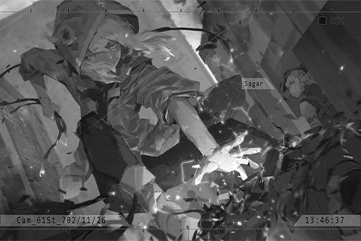

**Ivy**  
... Please, stop this...  
......!? It's you...

**Sagar**  
......?

**Alex**  
Hey, Sagar! What the hell are you doing!?

**Sagar**  
Alex? Lucy?

**Ivy**  
......

_\[Hurried Footsteps\]_

**Sagar**  
Wait! Don't leave!

**Lucy**  
Captain, are you alright?

**Sagar**  
I'm fine... Did you two see what that girl just did?

**Lucy**  
Jumping down from the top of a building and smashing a drone with one punch... Is that..."thing"... really a human...?

**Alex**  
Huh? Has the ice gone into your brain, Miss Freeze? Think back to that running motion. You've seen that motion before and you should still remember it.

**Lucy**  
......! The one that broke Big B's collarbone...

**Sagar**  
That creature from Shelter 32!?

**Alex**  
Hehe, that's right... I remember you. Now THIS is what I call "fun"... Let's chase after her!

**Sagar**  
Jackal! The mission is not over yet. Get your a\*\* back here. Continue to protect the civilians!

**Alex**  
Tsk...

_\[Signal Lost\]_

[Last Log](#os-log-046) | [Back to Top](#list-of-logs) | [Next Log](#os-log-048)

## Added on v2.7

### OS Log #048
___

[Last Log](#os-log-047) | [Back to Top](#list-of-logs) | [Next Log](#os-log-049)

#### Requirements
| Char. |Lv.|Lv. Locked?|
|-------|:-:|:---------:|
|**Ivy**|41 |    No     |

#### Audio\_???\_702\_11\_29
**Ivy**  
Can you hear me...?

**???**  
......!?

**Ivy**  
This is not the first time I've connected with you. You should still remember a thing or two.

**???**  
......! Ugh...

**Ivy**  
Trying to disconnect? It's pointless. The one in charge of this connection is me.

**???**  
......

**Ivy**  
I don't know who you are, and I don't know why you're inside A.R.C. Nevertheless... you're also an "Architect", right? The fact that you tried to disconnect just now pretty confirmed it for me.

**???**  
......

**Ivy**  
Still not replying? Whatever, you just have to listen.

**Ivy**  
My name... is Ivy, and the one that's locked inside Library by you guys... is Vanessa. We're both Architects from the early stages of the reconstruction project.

**???**  
......!

**Ivy**  
Judging by the fact that you're able to merge into human society and aren't used as mechanical parts, I'll exclude the possibility that you're a "Sleeper". I would like you to think carefully about what I'm going to tell you next.

**Ivy**  
I... am "Æsir", the person who has been attacking the virtual internet these past few months. My purpose is to awaken Vanessa, who is imprisoned by A.R.C.

**Ivy**  
Both she and I fell into a coma during the reconstruction project due to the war against the protocol. It wasn't until three years ago did I finally wake up. I found her and then conducted this entire plan.

**Ivy**  
Yet Vanessa went out of control after she woke up. The recent incidents where drones attacked cities, I'm afraid she's the one who caused them.

**Ivy**  
Vanessa's rampage may have something to do with her inability to escape from the control of the "Hyperion Protocol". I don't know why the protocol made her become the way she is, but something definitely happened during the time when we were both still asleep...

**Ivy**  
The Decommission, you're familiar with this term, aren't you? Your model didn't exist in our era. Therefore, I figure that you were likely produced after the reconstruction project was completed.

**Ivy**  
I couldn't find records of the events of around two hundred years ago. Even those that I did find are information fabricated by the current humans. Therefore, I think you may know something.

**???**  
......

**Ivy**  
... Are you curious why I'm telling you all this? We Architects, are different from humans, but the one thing we share is that we also have our own ideas... our own values. Right now, the only thing I want is to rescue Vanessa from her rampage.

**Ivy**  
Besides... I don't want to see humans continue to get hurt because of this either.

**???**  
......!

**Ivy**  
Like I just said, I don't know your identity, nor do I know your stance. However, judging from A.R.C.'s data, Vanessa's situation is already far beyond their control. Thus, it doesn't matter whether you stand with the Architects or the humans...

**???**  
......

**Ivy**  
... I don't expect you to help me rescue her. However, I hope that you can at least help me stop her... stop this disaster.

**???**  
......

**Ivy**  
... I'll contact you again. Think carefully about it. Don't you dare attempt a reverse tracking. You'll just get attacked by my firewall.

**???**  
......

**Ivy**  
Goodbye.

**???**  
... Wai...!

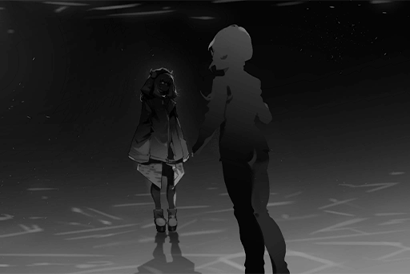

_\[Signal Lost\]_

[Last Log](#os-log-047) | [Back to Top](#list-of-logs) | [Next Log](#os-log-049)

### OS Log #049
___

[Last Log](#os-log-048) | [Back to Top](#list-of-logs) | [Next Log](#os-log-050)

#### Requirements
| Char. |Lv.|Lv. Locked?|
|-------|:-:|:---------:|
|**Ivy**|42 |    No     |

#### Audio\_Ivy\_702\_12\_08
**Noah**  
.......  
... Uggghhh...

**???**  
......

_\[Electric Shock\]_

**Noah**  
Waaahhh!

**Noah**  
... What's going on... I... I should be at home...  
This... What is this place?

**???**  
I advise you don't try anything rash.

**Noah**  
Who... Who are you!?

_\[Electric Shock\]_

**Noah**  
Ahhhhh! ... Ugh...

**???**  
The bracelet I put on you will electrify the nerves in your wrist. The resulting pain and paralysis will leave you unable to move... As long as you don't try to resist, I won't hurt you. Take a seat.

**Noah**  
... Uhh...

**???**  
Your name is Noah Black. Director of the A.R.C. research department "zero". Specialized field of study is brainwave research. 38 years old, married. Your wife Helena Black is the older sister and agent of the idol singer PAFF... PAFF...

**???**  
... What a coincidence. Perhaps this is what humans refer to as "fate"?

**Noah**  
I don't understand what you're talking about... "zero" is a highly classified secret in the company. How did you know this name?

**???**  
I have an information source inside A.R.C.  
"zero" is directly under the higher\-ups. It's a research organization that merely exists for their personal profits. Yet as director, you questioned them, which led to you being given the cold shoulder... Correct?

**Noah**  
......

**???**  
On top of that, your research was forcefully terminated as well. All the data archived in the deepest corner of the A.R.C. servers. Not even my source could access it.

**???**  
In other words... you're the only one who knows the whole picture of that technology.

**Noah**  
You... who... who exactly are you!?

**???**  
You don't remember? I was a bit rough when I took you away, but I made sure not to use too much force. It shouldn't cause any memory impairment...

**Noah**  
There's... blood on my head...  
... I remember now. I was at my home... Where's Helena!?

**???**  
Rest assured. I drugged your wife to make her temporarily unconscious. She didn't even know that you were taken away... You're my only target.

**Noah**  
You... what do you want me for? Why did you take me here?  
T\-this is a crime! I'm leaving...

_\[Electric Shock\]_

**Noah**  
UAAGGGHHH!!

_\[Things crashing\]_

**???**  
Noah, that incomplete technology is already far ahead of this era. You understand this better than anyone else... In order to complete it, I believe you won't let go of the slightest of opportunities, and that's exactly what I want.

**Noah**  
Ugh... Uhh, my... research...?

**???**  
... You're going to assist me.

_\[Signal Lost\]_

[Last Log](#os-log-048) | [Back to Top](#list-of-logs) | [Next Log](#os-log-050)

## Added on v2.8

### OS Log #050
___

[Last Log](#os-log-049) | [Back to Top](#list-of-logs) | [Next Log](#os-log-051)

#### Requirements
| Char. |Lv.|Lv. Locked?|
|-------|:-:|:---------:|
|**Ivy**|43 |    No     |

#### Audio\_???\_702\_12\_02
**Ivy**  
... It's me.

**???**  
......!

**Ivy**  
We don't have much time. I need an answer.

**???**  
......

**Ivy**  
I know you're there. Your signal is online. I can tell it's not because of your position on the matter that you're not speaking. Your expression... it expresses some kind of "emotion"——fear.

**???**  
……

**Ivy**  
Am I correct? If so, don't worry. For the time being, take what I said previously as the truth. Think about how much risk I am taking to establish this connection.

**???**  
... I...

**Ivy**  
Oh? You finally spoke? I was beginning to wonder if there is something wrong with you.

**???**  
... I\-I'm willing... I'm willing to help you. Please tell me what I can help you with...

**Ivy**  
Before that, I want to collect more information about you first. Who are you? Why are you here?

**???**  
... I\-I don't think... I... can reveal too much about that...

**Ivy**  
Is that so? Then the conversation ends here.

**???**  
Wait, please wait a second!

**Ivy**  
I've mentioned before. I'm taking on a major risk to establish this link and ask for help. Before I can confirm your identity and position, we can't move forward with our dealings. This could be a trap.

**???**  
No... it's not! I really can't reveal too much information, but... when I heard that you don't want any more people to be hurt, I feel exactly the same!

**Ivy**  
And how am I supposed to confirm whether you are telling the truth or not?

**???**  
I... don't know either... I just don't know what to do..._\*sob\*_...

**Ivy**  
……

**???**  
But I do have someone I want to protect too. I've always been the one who's been protected. Many people suffered greatly because of me. I don't... I don't want it to continue on like this! Please, you've got to believe me!

**Ivy**  
... Please understand, under these conditions, my identity has already been completely exposed. Yet I know nothing about you. You can't blame me for not believing you.

**???**  
... _\*sob\*_...

**Ivy**  
But I do believe you.

**???**  
… Eh?

**Ivy**  
Yes, I believe you. I'm very familiar... with your expression.

**???**  
Expression...

**Ivy**  
No, it's nothing. In any case, I've already made my decision. Now, it's your turn.

**???**  
My turn... Is there something I can do? Please tell me.

**Ivy**  
Since both parties have agreed to cooperate, I think that a minimal amount of information exchange is still necessary. I won't force you to tell me things that you can't say, but I've already provided you with information on the situation that I'm aware of. You must at least provide me with some info that can help with the situation. Otherwise, we can't move forward. You good with that?

**???**  
O\-okay! I'm a data analyst for A.R.C., mainly responsible for analyzing the artifacts and data about ancient civilizations brought back by the exploration teams. Besides me, there are approximately 10 other employees with the same position. In A.R.C.'s database security clearance grading system, we're a level 3. I can try to gain access to a small amount of information.

**Ivy**  
Hmph... a small amount? From now on, I'll completely rule out the possibility that you're lying. If I begin with that... then it appears you aren't aware of your own capabilities, aren't you?

**???**  
My... capabilities?

**Ivy**  
Forget it. Anyway, if we're going to stop Vanessa's current state, we're going to have to do a few things. First, we need to gain the permission to access Library without being discovered. My current method is just way too risky. On top of that, there are time constraints.

**Ivy**  
Second, we need to terminate the connection between Vanessa's body and the outside world——Take note though, only her body. If any errors occur to the other connections, it will be in conflict with the first point.

**???**  
That...

**Ivy**  
Third, tell me more about Library's internal security mechanisms. That way, I have a chance to figure out more ways to rescue her and prevent further damage, not just simply stop the chaos that's occurring right now.  
Are you up for the job?

**???**  
... The first and the third shouldl be relatively easy. I should be able to do those without leaving a trace. But...

**Ivy**  
But?

**???**  
As for the second, to independently cut off a device inside Library is extremely difficult. At the very least, it is not possible with my clearance level. The connection of devices within Library is extremely complicated. It's very unlikely we can alter one small section of the entire mechanism.

**Ivy**  
So a slight change affects the whole system...?

**???**  
That's right. Especially the Core... Vanessa. In order to extract more information and run more calculations with her, A.R.C. has her synchronized with all devices and areas basically 24/7. So much so that I can't even tell you which time periods the synchronization is less frequent...

**Ivy**  
……

**???**  
If you're to cut off Vanessa's connection with the outside world, that'll definitely affect 2 or more areas at minimum. If such an action is executed with too much force, a large\-scale incident would occur, like the virtual internet crash a while ago.

**Ivy**  
... You bring up a good point. That incident was careless oversight on my part that occurred because I was in a rush to get results. I should have been more meticulous. However, I'm trusting you more and more.

**???**  
T\-thank you...

**Ivy**  
Don't thank me just yet. First, send me the information I mentioned in points 1 and 3. Once you've done that... perhaps I can find something we can use.

**???**  
Send...? I've never seen this connection method you're using now. What exactly is this space...?

**Ivy**  
As expected, you know nothing about it. Doesn't matter, your room has a processor and terminal, right? All you need to do is create a encrypted block and save the data there. As long as you do that, I'll be able to retrieve it.

**???**  
Eh...? That's...

**Ivy**  
Don't worry about security issues. After you've created the block, I'll upgrade your clearance level directly, with a method that they'll never think of. Wait until I'm finished before inputting the data.

**???**  
O... Okay! I'll give it a try!

_\[Signal Lost\]_

[Last Log](#os-log-049) | [Back to Top](#list-of-logs) | [Next Log](#os-log-051)

### OS Log #051
___

[Last Log](#os-log-050) | [Back to Top](#list-of-logs) | [Next Log](#os-log-052)

#### Requirements
| Char. |Lv.|Lv. Locked?|
|-------|:-:|:---------:|
|**Ivy**|44 |    No     |

#### Audio\_???\_702\_12\_05
**Ivy**  
It's me.

**???**  
AH!?

**Ivy**  
... Is now not a good time?

**???**  
No... it's nothing. Most of the time I'm here all by myself. I'm just not used to being called into this space all of a sudden.

**Ivy**  
I think I've found a crack.

**???**  
Really!?

**Ivy**  
But I need your help. If we succeed, perhaps we can create a port that won't affect A.R.C.'s facilities. Then I'll be able to come in and out freely. Not only will we be able to fulfill the second condition and temporarily put a stop to the chaos out there, but it'll also give us some space to think about our next move.

**???**  
O\-Okay! As long as I can help, I'll do my best!

**Ivy**  
5 hours and 12 minutes from now, I need you to lure away the 3 humans on duty at Library's security room for approximately 30 minutes.

**???**  
... Eh?

**Ivy**  
Can't do it? It's not like I couldn't do it myself, but my method requires a lot of time. And time is what we need the most right now.

**???**  
I...

**Ivy**  
Please. Will your identity raise any suspicions in that area?

**???**  
Not exactly... Actually, our job actually requires us to go in there quite often.

**Ivy**  
Then it shouldn't be an issue. You can do it, right?

**???**  
I\-I'm not sure... Ever since I got here, I've rarely left this room; even with a uniform and an ID, there's no guarantee that they'll listen to the words of a mere data analyst.

**Ivy**  
I didn't tell you to order them to go away. I said lure them away. You can use whatever method you see fit.

**???**  
D... does that mean you want me to lie?

**Ivy**  
It's all up to you. Do whatever you need.

**???**  
But lying... I...

**Ivy**  
I know you're not good at it. I've figured that out just from the few conversations we had.

**???**  
S\-Sorry.

**Ivy**  
But didn't you say you had someone you want to protect? If you back down now, wouldn't that mean that was a lie too?

**???**  
.....!

**Ivy**  
Now is not the time to double\-down on your cowardice. If you want to protect people, sometimes you must give up many things... Far too many.

**???**  
... I... I understand! Please let me do it!

**Ivy**  
Great. I'll contact you again after 5 hours. Once we sync up our clocks, we'll get ready for action. Good\-bye.

**???**  
Ah, please, wait a second!

**Ivy**  
What is it?

**???**  
When I was copying information from Library... I noticed something strange.

**Ivy**  
Something strange?

**???**  
That's right. The information on the security mechanisms you received wasn't complete. I noticed that there was a completely blank block in the mainframe. It seemed like nothing on the surface, but I couldn't access it.

**Ivy**  
……

**???**  
Sorry! I didn't notify you immediately, but I don't have a way to actively contact you. That's why...

**Ivy**  
Where's that block?

**???**  
From the coordinates, it looks like it is an underground facility directly below this structure.

**Ivy**  
Underground facility...?

**???**  
That's right. But what I find really strange is... the structure design blueprints for A.R.C. were included in the information I gave you, but that block wasn't in the design.

**Ivy**  
... Is that so?

**???**  
Sorry...

**Ivy**  
No, you've provided quite useful information. I'm actually in the city, so I can pay a visit and investigate it directly. Send me the coordinates using the same method.

**???**  
Got it!

**Ivy**  
Any more important info you need to report?

**???**  
Let me think... oh, one more thing! Underground... I accidentally heard this from upper management. They seem to be transporting something "down below"... Although "down below" generally means somewhere other than here, by the way they were talking, it felt like...

**Ivy**  
You think these two things are connected?

**???**  
I'm not sure. But when they discovered that I was passing by, their expressions immediately became really awkward and they quickly stopped talking about that. If there's some sort of secret...

**Ivy**  
... Go on.

**???**  
During the conversation, they mentioned:  "Truck No.4 that set out from 84th street", "a new unit", "if this is found out it'll be trouble"... stuff like that. That's all I was able to hear...

**Ivy**  
……  
Understood. I'll check all of that out. Let's stick to our original plan as well. Stopping Vanessa's connection to the outside world is our primary goal. Got it?

**???**  
That, that...

**Ivy**  
Anything else?

**???**  
No... be careful. Hope everything goes smoothly.

**Ivy**  
... You too.

_\[Signal Lost\]_

[Last Log](#os-log-050) | [Back to Top](#list-of-logs) | [Next Log](#os-log-052)

### OS Log #052
___

[Last Log](#os-log-051) | [Back to Top](#list-of-logs) | [Next Log](#os-log-053)

#### Requirements
| Char. |Lv.|Lv. Locked?|
|-------|:-:|:---------:|
|**Ivy**|45 |    No     |

#### Audio\_Ivy\_702\_12\_09
**[News]**  
_Just now, all drones and programmed equipment that previously lost control have been restored back to normal. The Administration Bureau is still unable to offer a reasonable explanation, which led to citizens being paranoid and unwilling to step outside onto the streets. Regarding this disaster, many people are pointing their fingers at A.R.C., who is in charge of the technical side of the equipment. As of now, A.R.C. has yet to release any official response. We'll continue to gather information for you..._

**Noah**  
......

_\[Door Opens\]_

**Noah**  
......!?

_\[Heavy object being dragged\]_

**Noah**  
Is that...?

**Ivy**  
I'm not answering any of your questions. All you need to do is follow my instructions and do what you're good at.

**Noah**  
... I'm still as confused as ever. If this is a kidnapping, then aren't I bit too free? You  brought me to my own lab... and you even took off my handcuffs. What on earth are you doing...

**Ivy**  
You saw the news, didn't you?

**Noah**  
...? Ah, I mean I did...

**Ivy**  
I stopped that disaster.

**Noah**  
......!?

**Ivy**  
You have people you care about, don't you? If you don't want to see more misfortune happen, you better shut your mouth do as I say. I won't hurt you.

_\[Pulls Back Sheet\]_

**Noah**  
......!?  
This... What is this!?

**Ivy**  
... You don't know? This is one of your company's products, made by copying the structure of Architects. I don't know why A.R.C build something like this, but it can help me.

**Noah**  
A.R.C.... that's impossible. Even I didn't know anything about this thing's existence...

**Ivy**  
That only means one thing: it doesn't benefit them at all to you to know about this.

**Noah**  
... How did you...?

**Ivy**  
I have other inside sources in A.R.C. They've informed me plenty of information, including your "secret research".

**Noah**  
......!

**Ivy**  
Take this. Link it to the terminal over there. I've already adjusted the transmission protocol. It should be compatible with the one you use.

_\[Data Transfer\]_

**Noah**  
......!?  
This is... such a large amount of memory! No, the format is slightly off...

**Ivy**  
That's the backup of an Architect's core. I want you to use the technology of your "secret research" to install it into this unit. You must be extremely careful. We only have this one unit, which I'm guessing is a prototype. In other words, you've only got one shot.

**Noah**  
You... I knew it. You're an Architect. I can't believe it...

**Ivy**  
It doesn't matter if you believe or not. The important question is can you do it?

**Noah**  
I've got to do a little research...

_\[»»»Fast Forward»»»\]_

_\[Inputting Data\]_

**Ivy**  
So? We don't have much time.

**Noah**  
... I regret to say it, but this memory... No, the format of this consciousness is much more complicated than what I researched. All of these codes and algorithms are ones I've never seen before. Furthermore, this "core" is in a static state; it won't operate.

**Ivy**  
So you're saying you can't do it?

**Noah**  
My memory transfer technology requires the brains of the "source" and the "vessel" to both be in an active state. But with things are right now, there's no way for me to understand this format... Understand how the brains of you Architects operate.

**Ivy**  
... Damn it...

**Noah**  
... I have an idea.

**Ivy**  
......?

**Noah**  
You... and the owner of this core data, are the same model of Architect, correct?

**Ivy**  
Yes. Why do you ask?

**Noah**  
Good... To put it simply, if we're going to transfer the memory in this core, we're going to need to find a way to drive the data in this core. It's like siphoning gasoline out before putting gasoline in the tank.

**Ivy**  
Are you suggesting... that we can use my consciousness to drive it?

**Noah**  
In theory, it's doable... but the memory coding of Architects has way too many instabilities that the main processor can't analyze. We won't be able to set up a "filter" in advance... It'll need to be a continuous link to you. Only then can we filter out the corresponding signals one at a time.

**Ivy**  
Then let's begin immediately.

**Noah**  
……

**Ivy**  
What's wrong? Are there any more questions?

**Noah**  
Because your consciousness will be used as a driver, the pain previously endured by the source during transmission will be transferred to you instead...

**Ivy**  
Architects can turn off our sensation of pain. It's not an issue.

**Noah**  
No. Even if you don't feel it, the damage caused by the electrical waves will not disappear. I'm not sure how much damage your core can take. It may end up causing serious damage to your system.

**Ivy**  
Doesn't matter. Let's begin.

**Noah**  
......!  
Understood...

_\[»»»Fast Forward»»»\]_

**Noah**  
Although it's just a theory... during the link, please do your best to think of the owner of this memory. I saw many visuals of you inside, which means you two have lived together for a very long time. If the memories are able to create an intertwined reaction, it will shorten the required transmission time and reduce the damage done to you.

**Ivy**  
Understood.

**Noah**  
Try your best to not think about other things.

**Ivy**  
I won't.  
No matter what I do... I only think of her.

_\[Electric shock\]_

_\[Signal Lost\]_

[Last Log](#os-log-051) | [Back to Top](#list-of-logs) | [Next Log](#os-log-053)

### OS Log #053
___

[Last Log](#os-log-052) | [Back to Top](#list-of-logs) | [Next Log](#os-log-054)

#### Requirements
| Char. |Lv.|Lv. Locked?|
|-------|:-:|:---------:|
|**Ivy**|45 |    No     |

#### Cam\_Ivy\_702\_12\_09
**Ivy**  
URGHHWHAHHHHH!!!

**Noah**  
Hang in there! The core is having a reaction!  
Focus!

**Ivy**  
...... Va...... nessa...... aaahhhhH!!!!!

_\[»»»Fast Forward»»»\]_

**Ivy**  
... ughh...

**Noah**  
You awake?

**Ivy**  
... How'd it go!?

**Noah**  
Relax. We succeeded... The signal accuracy rate reached 99.97 %. Haha, my theory is correct!

**Ivy**  
Vanessa... how's she doing?

**Noah**  
Her name's Vanessa...?

**Ivy**  
... Yeah.

**Noah**  
The full memory transfer is complete. Right now, it's being inputted into the empty unit you brought here. After that, all we need to do is awaken her.  
This is simply incredible... my main processor has never calculated such massive amounts of data before, and yet it managed to somehow process the data.

**Ivy**  
……  
Sorry, your mission's not yet complete. After she wakes up, I'm going to delete the memories you have that are related to us.

**Noah**  
... I guessed as much.

**Ivy**  
… Is that so? Doesn't look like you care.

**Noah**  
However, I have a tiny request. Let me preserve the delight that came from this successful experiment. You allowed me to complete the final step of my research, to prove that I was correct all along... That's all I ask for. Can you? Æsir?

**Ivy**  
……

**Noah**  
You never told me your name. However, from your actions and abilities, I assumed it was you.

**Ivy**  
For a human, you're very smart. I agree to your request. Take it as a sign of respect from me.

**Noah**  
... I'm nothing more than a criminal scientist. Even this technology, while it is my pride and joy, a part of me also feels nothing but disgust and pain... It's the source of my nightmares... For these past years, it has been every night...

**Noah**  
My wife stopped me several times. I also thought of ending it all and facing my sins calmly... but once I thought of how close the theory was to being successful, I could never put it down. I always wanted to take that very last step...

**Ivy**  
……

**Noah**  
You've investigated me. You must know what I'm talking about... Compared to your memory with Vanessa, I'm just some fool that deserves to be treated with disdain, hahaha...

**Ivy**  
... I've learned a few things after being in contact with human society these past years.

**Noah**  
……?

**Ivy**  
There are many different kinds of humans...The amount of diversity in just a single individual... We're, in fact, no better than you. You humans will do lots of things that have no logical meaning or principle behind them, based on a variety of motives. Regardless of who it is, they can't be summed up easily. I think... that's what you refer to as "emotions"?

**Noah**  
We both did many things we can't forgive ourselves for, all for the people we treasure... Perhaps we're indeed not that different.

_\[Typing on keyboard\]_

**Noah**  
It's time. The conditions for awakening have been met; sorry, this is going to hurt a bit for both of you. Are you prepared?

_\[Holds Hand\]_

**Ivy**  
Vanessa… hang in there. It'll all be over soon.

_\[Electrical Shock\]_

**???????**  
... urghhaaaaaahhhh!!!!

**Ivy**  
... raaaaaahhhhhh!!

**Noah**  
……

**???????**  
…́͘͢͠҉Ì̢͘͢I͢͡I̧͘͜͢͠I̵̷̧̡͡Į̸v̧̢̕͜v̀͟҉͘҉v̴̢͢v̸̶̶̧y̛̛͟͜҉y̴̕͠͏͘y͏̷̴̡͞ý̸̸̀͝…̴̡́…̨̡͝

**Ivy**  
It's me. I'm here, Vanessa! Can you hear me?

**???????**  
......

**Ivy**  
Vanessa......  
Urgh...!?

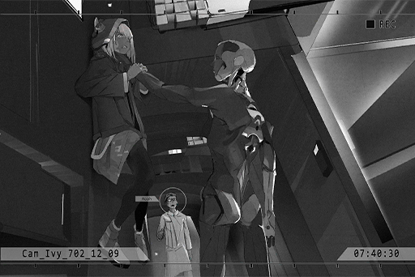

**Noah**  
What is going on...!?

**Ivy**  
Wake up... Vanessa! It's... me!  
Noah! What's... happening...?

**Noah**  
No, I don't know! Her actions and consciousness are not linked...? Why is this happening!?

**???????**  
……

_\[Objects Crashing\]_

**???????**  
……

**Noah**  
Ay… AY!? Wait...

**???????**  
……

_\[Bang\]_

**Noah**  
OOF!!... Bla... BLAARGH...!

**???????**  
……

**Ivy**  
STOP!!

_\[Bang\]_

**???????**  
……

_\[Unit Shatters\]_

**Ivy**  
Huff, puff... did it not work? Noah, what on earth...?

**Noah**  
……

**Ivy**  
Noah? Oh... this injury is serious...

**Ivy**  
DAMNIT! There's only one of these...

_\[Signal Lost\]_

[Last Log](#os-log-052) | [Back to Top](#list-of-logs) | [Next Log](#os-log-054)

### OS Log #054
___

[Last Log](#os-log-053) | [Back to Top](#list-of-logs) | [Next Log](#os-log-055)

#### Requirements
| Char. |Lv.|Lv. Locked?|
|-------|:-:|:---------:|
|**Ivy**|46 |    No     |

#### Image\_???\_702\_12\_09
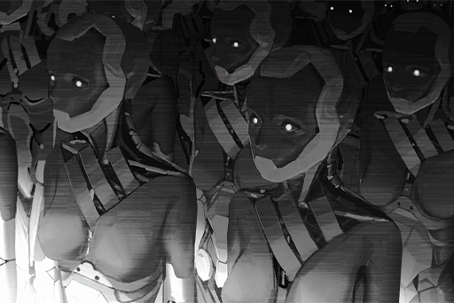

[Last Log](#os-log-053) | [Back to Top](#list-of-logs) | [Next Log](#os-log-055)

## Added on v2.9

### OS Log #055
___

[Last Log](#os-log-054) | [Back to Top](#list-of-logs) | [Next Log](#os-log-056)

#### Requirements
| Char. |Lv.|Lv. Locked?|
|-------|:-:|:---------:|
|**Ivy**|47 |    No     |

#### Audio\_Trans\_702\_12\_29
_\[Train door closes\]_

**[Nora]**  
_Node 08..._

**ConneR**  
Well, the two of you must be going. Please, head somewhere safe.

**NEKO#ΦωΦ、Hayato**  
......

**PAFF**  
NEKO, Hayato, don't worry. With Nora and them here, nothing will happen to me. We'll be able to do this.

**ConneR**  
Best be leaving. I checked up on the situation in many parts of Node 08. Looks like we don't have much time.

**NEKO#ΦωΦ**  
Wait a sec... At least tell us where Aroma\-chan is being taken.

**[Nora]**  
_Kyuu Hou Kai in Node 08 has all the equipment that we need. But unfortunately, I cannot tell you the location. I cannot allow more people to be involved in something this dangerous. I hope you understand._

**NEKO#ΦωΦ、Hayato**  
......

**PAFF**  
Nora, before we head out, I want to go home and tell my family what's going on. Is that alright?

**[Nora]**  
_Of course. But please be quick. As Mr. Neumann said, we don't have much time._

**Hayato**  
You mean those bastards that kidnapped you? Why would you...

**PAFF**  
Hayato, sorry. Please don't be like this. I'm not only Kaori, I'm also Aroma. Although... a lot happened between us, what we're facing now is a lot more important than that. They're still my family and I don't want them to worry.

**Hayato**  
......

**PAFF**  
Point is, you've got to trust us. I don't want you to be in any sort of danger... I guess this is where we part. There's no way anything is happening to us. When we get back let's sing some songs together. NEKO, you too!

_\[Footsteps\]_

_\[Wheelchair Moves\]_

**NEKO#ΦωΦ**  
Aroma......! ...chan...  
Is this really best...? Hayato, say something!

**Hayato**  
"More people"...? I think Nora meant "useless people"...

**NEKO#ΦωΦ**  
... Oh... Bummer, even though he's totally right...

_\[Footsteps\]_

**NEKO#ΦωΦ**  
Hayato? Where you going?

**Hayato**  
... I think there's something we can do to help. NEKO, why don't you head home? You've still got family here, right? Besides Kaori, I've got no one left.

_\[Footsteps\]_

**NEKO#ΦωΦ**  
......  
Something to help... hmm... What about NEKO...?

_\[Signal Lost\]_

[Last Log](#os-log-054) | [Back to Top](#list-of-logs) | [Next Log](#os-log-056)

### OS Log #056
___

[Last Log](#os-log-055) | [Back to Top](#list-of-logs) | [Next Log](#os-log-057)

#### Requirements
| Char. |Lv.|Lv. Locked?|
|-------|:-:|:---------:|
|**Ivy**|48 |    No     |

#### Audio\_Kyuu08\_702\_12\_29\_1
_\[Door Opens\]_

**PAFF**  
Nora.

**[Nora]**  
_Sorry, this branch doesn't have a place for you to rest like the last one._

**PAFF**  
Ah, don't worry! I'd feel rude if I were to rest here anyway.

**[Nora]**  
_You must rest. We don't know what will happen while we're searching for Ivy. You must take care of your energy. It may not go smoothly, and we'll certainly face some danger. That's why we need Mr. Neumann in there to protect you._

**PAFF**  
Okay...

**[Nora]**  
_ROBO and Mr. Neumann are waiting for the system to analyze more data from the chips. Only then can you enter safely. It may take some time._

**PAFF**  
Never thought Mr. Neumann would be able to see stuff in the OS space. I was so surprised. Is he immune as well?

**[Nora]**  
_No, it was only by chance that he could enter by linking up with a chip. It's much tougher on his body than on ours._

**PAFF**  
... Isn't that really dangerous?

**[Nora]**  
_The chip was inherited from one of his ancestors. Though we don't know its function, we do know that it currently only works on him. However... if ROBO's analysis is correct, via his core computations, perhaps even ordinary people can possess the ability to walk in the OS space temporarily, maybe even affecting and controlling items in the space._

**PAFF**  
Yeah... I'm not sure I totally understand. Even today, I still feel like that I can do all this is unbelievable.

**[Nora]**  
_It's not difficult to understand. After all, you went through a lot before suddenly turning into a user. I've been like this ever since I was little._

**PAFF**  
Nora... it must be tough for you?

**[Nora]**  
_... Happiness and sorrow are relative. Someone who is always in pain does not feel it to be pain. Perhaps this is why I've always been afraid. Afraid that after ROBO came back... I would lose happiness once more._

**PAFF**  
......!

**[Nora]**  
_In comparison, look at you and your sister, Hayato as well. I really admire all of you. I've never truly been happy, so I don't know what that feels like. But you... After experiencing all this, you were still able to pull yourself together. Me... I've never been able to do that. That's why I admire you, Miss PAFF._

**PAFF**  
Hehe, not very Nora of you, but thanks so much.

**[Nora]**  
_After ROBO came back I realized that I haven't had the courage to face my emotions these past few years. But I... haven't changed. I hope I can become like you, brave enough to find myself._

**PAFF**  
Actually... I used to be different. In Aroma's memory... my big sister was always the best. Noah cared about me a lot too. But I was always scared of so much... It was Kaori's memory that allowed me to see the beauty in all this. It gave me courage.

**PAFF**  
So I don't see what happened to me as a misfortune. All this is what made me who I am...  
Ah! Haha... Is that weird? Talking about two sets of memories... I don't know what I'm saying.

**[Nora]**  
_No, not at all. Talking with you feels like when I used to talk with ROBO as a child._

_\[Door Opens\]_

**ConneR**  
I'm here with good news. ROBO's theory proved correct during the simulation test.

**[Nora]**  
_... Is that so? Excellent._

**ConneR**  
Next, we'll perform an official test. Miss Nora, we request your attendance.

**[Nora]**  
_Okay. Miss PAFF, please wait here and rest. I'll notify you when we're ready to go._

**PAFF**  
Okay, got it.

_\[Signal Lost\]_

[Last Log](#os-log-055) | [Back to Top](#list-of-logs) | [Next Log](#os-log-057)

### OS Log #057
___

[Last Log](#os-log-056) | [Back to Top](#list-of-logs) | [Next Log](#os-log-058)

#### Requirements
| Char. |Lv.|Lv. Locked?|
|-------|:-:|:---------:|
|**Ivy**|49 |    No     |

#### Audio\_KLab08\_702\_12\_29\_3
_\[Door Opens\]_

**[Nora]**  
_... Let's begin._

**ConneR**  
Miss Nora, Robo\_Head... you two good? I simply cannot wait.

**[Nora]**  
_......  
Okay then, we do as planned. PAFF will use the ability and Mr. Neumann will enter the OS space via the chip and ROBO's core computations. Search for Ivy's location and once you find it, we'll head to the requisite location in the physical world and prevent her next move._

**[Nora]**  
_Since ROBO's computations limit us to 5 minutes, if we don't have anything after that, both of you will need to disconnect at the same time. We'll wait for the core to finish buffering, then we'll continue looking from the same location._

**PAFF**  
Got it.

_\[Connecting\]_

_\[→Signal Switches\]_

**[Nora]**  
_Can both of you hear me?_

**PAFF**  
Yes.

**ConneR**  
No problem, and I can see Miss PAFF. She's by my side.

**[Nora]**  
_Mr. Neumann, what you're seeing should be the same as Miss PAFF._

**ConneR**  
That's right. All the circuits using the virtual internet are crystal clear. To be honest, I still feel like this is absolutely incredible. I've researched many things in my life. This is the first time I've felt like I have no idea how to comprehend what I'm seeing.

**[Nora]**  
_Miss PAFF, please take Mr. Neumann's hand, like when you controlled the door switch in Kyuu Hou Kai. Imagine you're connected to him. That way, you should be able to take him to where you want to go._

_\[Transmitting\]_

**ConneR**  
Oh? It worked. Gave me quite a fright... And this is?

**PAFF**  
I tried connecting to somewhere I was familiar with first...

**[Helena]**  
_Okay... okay, got it. If you hear anything from him let me know as soon as possible..._

**PAFF**  
That's my sister's voice. She's still looking for Noah...

**ConneR**  
I can hear it too. I can also see visuals of the closed\-circuit switch in the living room... Looks like there's no issue. We can connect to several places that Ivy might be. I've collected a few; we can check them off one by one. We'll be able to track her down.

_\[→Signal Switches\]_

_\[Connection Lost\]_

**[ROBO_Head]**  
_5 minutes is up; disconnect._

**[Nora]**  
_ROBO, report the your condition._

**[ROBO_Head]**  
_The data reveals, no errors._

**[Nora]**  
_Great. And you two?_

**PAFF**  
No... Still haven't found anything. We've already been looking for more than an hour... Sorry.

**ConneR**  
However, it's not like we got nothing.

**[Nora]**  
_What have you found?_

**ConneR**  
Ivy's been to these places; the connection equipment for all of them have had springboards installed in them. So whenever PAFF tries to connect, we get led to a completely different location.

**ConneR**  
But if we take these seemingly random locations and put them on the map, you'll see that...

**[Nora]**  
_......!  
The springboards have a fixed direction._

**ConneR**  
That's right. You really are something, Miss Nora. If we didn't use this ability, we'd never have figured this out... I have to admit, her methods are impressive. Probably better than Mr. Jackson's. She's giving herself away, and we've found precisely what she hoped we'd not.

**[Nora]**  
_These areas on the map that are being purposefully avoided..._

**ConneR**  
Are most likely where she is located.

**PAFF**  
Well... sorry. I don't have much to offer to this discussion.

**ConneR**  
Ah, no need, no need. Leave the brain crunching up to us. Next time, all you need to do is to keep trying to connect to these areas that I've circled. When we get brought somewhere in the opposite direction, immediately connect back and stay in this area here.

**PAFF**  
Is that...?

**ConneR**  
Indeed. She's smart. Purposefully chose the place with the highest density of connections to hide, Quadrant II——But based on her actions up until today, she must use the internet. So as long as we are persistent, we can find her.

**PAFF**  
Alright. I'll give it a try.

_\[→Signal Switches\]_

_\[Transmitting\]_

**PAFF**  
... Once again, different from what I had in mind.

**ConneR**  
Don't worry. This means we're getting closer.

**[Nora]**  
_... Wait a second. This place..._

**ConneR**  
What is it?

**[Nora]**  
_After the range shrunk, I did some analyses based on these locations. There's one area where the device signal is extremely weak, but the frequency of connections that show up on the records is abnormally high. I'm displaying the coordinates._

**ConneR**  
Very suspicious... Miss PAFF, we'll start from nearby.

**PAFF**  
Got it!

_\[Transmitting\]_

_\[→Signal Switches\]_

_\[Connection Lost\]_

**PAFF**  
... Eh? Is the time up?

**[ROBO_Head]**  
_Report: Connection time, 3 minutes and 56 seconds. This unit, did not disconnect._

**[Nora]**  
_You were kicked off. It's a firewall..._

**PAFF**  
We failed...?

**ConneR**  
No, precisely the opposite. I guarantee this is it. Miss Nora, any way to decode it?

**[Nora]**  
_I've been trying ever since you connected, but with a structure this complicated, compared to even Mr. Jackson's firewalls... I'm sorry, I may need some time._

_\[Signal Lost\]_

[Last Log](#os-log-056) | [Back to Top](#list-of-logs) | [Next Log](#os-log-058)

### OS Log #058
___

[Last Log](#os-log-057) | [Back to Top](#list-of-logs) | [Next Log](#os-log-059)

#### Requirements
| Char. |Lv.|Lv. Locked?|
|-------|:-:|:---------:|
|**Ivy**|50 |    No     |

#### Audio\_E3\_702\_12\_29
_\[Explosion\]_

_\[Crowd in chaos\]_

**Security Guard J**  
Ah! What happened!?

**Security Guard B**  
The wall... something blew a hole in it...!

**Security Guard J**  
What's going on?

_\[Sprints\]_

**Security Guard J**  
F\*\*\*! What the s\*\*\* is that... WAAHHH!

_\[Glass Shatters\]_

**Security Guard B**  
Johnny! Johnny! You alright?

**Security Guard J**  
... _\*sob\*_... my back...

**Security Guard B**  
Damn what are these things?

_\[Gunshots\]_

**Security Guard B**  
Command center, this is E3's elevator shaft. A large batch of robots just burst in here and began attacking people. Our guns are of no use...

_\[Object Crashes\]_

**Security Guard B**  
Requesting support from security; they've already entered the elevator shaft and are climbing up the... argh... UGH... _\*cough\*... \*cough\*..._

**Security Guard J**  
Bi... Billy!

_\[→Signal Switches\]_

**Command Center Employee A**  
All units pay attention! 7 elevator shafts have already been invaded. There are too many of them. The lower level Armed Forces need emergency assistance.

**Command Center Employee B**  
Report! Their target does not appear to be the operational elevators. It's to get to the upper levels. Elevators with  passengers from the emergency boarding are being sent back to the upper level.

**Communications Officer**  
The Administration Bureau has relayed that they've received reports of over 3000 attacks and incidents. They currently cannot determine the source of the robots. They hope we can provide assistance based on our cooperation protocol.

**Command Center Employee A**  
The Armed Forces in the upper levels have already been dispatched to various areas and are awaiting orders. They have not yet entered conflict status.

**Command Center Employee C**  
Surveillance from the outer walls has found traces of the enemy, number... The system has determined it's over 150!

**Intel Officer**  
If they start attacking from the outer walls, our defense systems will be of no use. The construction of this facility did not take into account such high\-level technology.

**Commander**  
Put all the resources into the defense measures. A direct attack will only reveal our inability to confront them.

**Intel Officer**  
Captain, do you mean...

**Commander**  
The base will enter lockdown mode.

**Command Center Employee C**  
Order received, initiating protocol for lockdown mode.

**[System Announcement]**  
_Everybody, prepare for lockdown mode! I repeat, prepare for lockdown mode. Switch or disperse from positions according to emergency protocol E99._

_\[Alarm\]_

_\[Defense doors activated\]_

_\[Signal Lost\]_

[Last Log](#os-log-057) | [Back to Top](#list-of-logs) | [Next Log](#os-log-059)

### OS Log #059
___

[Last Log](#os-log-058) | [Back to Top](#list-of-logs) | [Next Log](#os-log-060)

#### Requirements
| Char. |Lv.|Lv. Locked?|
|-------|:-:|:---------:|
|**Ivy**|50 |    No     |

#### Audio\_St15\_702\_12\_29
_\[Crowd in chaos\]_

**Pedestrian A**  
What is that? They're moving so fast. Are they animals?

**Pedestrian B**  
Don't know. I've zoomed in 20x, it looks something like people, more like robots?

**Pedestrian A**  
Are you recording?

**Pedestrian B**  
Yeah. It's hard to get.

_\[Explosion\]_

**Pedestrian A**  
Ah, A.R.C. seems to have already begun drone attacking them. Doesn't look good.

**Pedestrian B**  
The robots started attacking too. I saw one jump on a drone and they both came crashing down.

**Pedestrian C**  
Are you saying they're attacking A.R.C.'s headquarters? Stuff's gonna come crashing down, right?

**Pedestrian B**  
No way. You know how low the probability of that is!?

**Pedestrian A**  
Aigh, you wanna get a little closer? Maybe if we get a clearer image we can sell it to 08 Daily.

**Pedestrian B**  
Idiot. Any closer and we'll need to start climbing.  
Plus, I'll bet a ton of people of filming. No way it's an exclusive. One clip will probably only get us 10 credits.

_\[Crowd in chaos\]_

**Pedestrian C**  
What's all the noise up there?

_\[Engine Rumbling\]_

**Pedestrian B**  
Aigh, I see more and more robots climbing on the walls, then a whole bunch of them fell down...

_\[Bodies Colliding\]_

**Pedestrian B**  
Hey! What the hell!? Can't you see I'm filming?

_\[Object Crashes\]_

**Pedestrian B**  
Wah! Something fell down!

**?̧̀͡͡?̢͡?̸͘͠?̷̴̡͢͜?̵͝?̡̡͟͞?͝͡**  
......!̡͟͡%̶&̷̧̨͟͝......@̷̡̀͢^̷\*̷̸̢̛͝&̧̨̛͘^̧́͘͠͏\*̸......

**Pedestrian A**  
S\*\*\*! You kiddin' me...

**?̧̀͡͡?̢͡?̸͘͠?̷̴̡͢͜?̵͝?̡̡͟͞?͝͡**  
......!̡͟͡0̵̛̛8̸͘͢͟9̶͘͝͝҉g̵͘͢Y̡......!̡͟͡f̀͠҉7̸̀͏̴9̷́̕͢Ư̷̧̨͝\_͏͟B̵͢͢H̡҉(̨)̡̨͞͠9̨̧̧͜͜j͘҉̢̛̀......

_\[Swings\]_

**Pedestrian A**  
Ah! I'm sorry! I didn't mean to, please don't attack me! WAAHHH....

**Pedestrian B**  
Hey, hey, hey, this is a joke, right...?

**Pedestrian C**  
You still filming!? Run!!

_\[Consecutive Explosions\]_

**Pedestrian B**  
S\*\*\*! Gotta charley horse, wait for me!

**?̧̀͡͡?̢͡?̸͘͠?̷̴̡͢͜?̵͝?̡̡͟͞?͝͡**  
h̴́͢͡͝9͘͏̡0̡͘͞͞7̶̸̨͘̕T̷̷̸̸͠Y̴̢̢͡͝H̴̕͏8̶̢͜͟0̴̛͠=͠͝҉̛h̶̢̀̕͠......

**Pedestrian B**  
Don't... Don't come near me!

**Ivy**  
Put your head down.

**Pedestrian B**  
Eh? What the... WAAHH!

_\[Heavy Blow\]_

**Ivy**  
Threat... eliminated.

**Pedestrian A**  
You... are you a...?

_\[Signal Lost\]_

[Last Log](#os-log-058) | [Back to Top](#list-of-logs) | [Next Log](#os-log-060)

### OS Log #060
___

[Last Log](#os-log-059) | [Back to Top](#list-of-logs) | [Next Log](#os-log-061)

#### Requirements
| Char. |Lv.|Lv. Locked?|
|-------|:-:|:---------:|
|**Ivy**|51 |    No     |

#### Audio\_E5\_702\_12\_29
_\[Footsteps\]_

**Guard Captain**  
When the Architects broke in, we received a message for backup from Echo squad. Should be close to here. Cutting across the maintenance tunnel is our quickest way to get there.

_\[→Signal Switches\]_

_\[Metal board falls down\]_

**Guard Captain**  
Everyone pay attention to all sides. Architects have broken through the defense line and are heading to the upper level in bits and pieces.  
Delta team is going to investigate the hall ahead. Bravo, stay back.

**Security A**  
Copy.

**Security B**  
Copy.

_\[Footsteps\]_

_\[Sprints\]_

**Security C**  
Two are running this way!

_\[Consecutive Gunfire\]_

**Security A**  
Kill confirmed. Threat eliminated.

_\[Footsteps\]_

**Security B**  
Are these the legendary Architects... They're way more agile than humans.

**Security D**  
Heard a bunch are headed up the elevator shaft.

**Security A**  
Survivor found! It's Echo's Frank and Victor!

**Security F**  
You... you guys... finally got here...

**Security A**  
You alright? Brother, hold on. We'll wrap you up immediately.

**Security F**  
Lockdown... wasn't complete... several got in... be careful...

**Guard Captain**  
Where's the rest of your squad?

**Security V**  
They kept following the rest of the Architects up to the top.

_\[Sound of Architects crawling on the walls outside\]_

**Security A**  
Damn, this better not be an ambush!

**Guard Captain**  
Team, get ready. Protective formation; let's get these victims to the central shaft and send 'em down.

**Security A**  
Command center, confirm that the route to the central shaft is clear. We're sending several victims down for medical.

**[Command Center]**  
_... Message... mode..._

**Security A**  
Command center, if you hear, please respond.

**[Command Center]**  
_... A\-6 area... stop..._

**Guard Captain**  
Is the device broken? What the hell...

_\[Lights go out\]_

_\[Outer wall opens\]_

**Security A**  
Wait! They're gonna bust in!

**Guard Captain**  
Command center! Who turned off the defense system? Hey, report the situation!

**Security B**  
Yes, sir! There's no supply to the central floor. Defense system has failed. Elevator shafts inoperable! Has lockdown mode been deactivated?

_\[Heavy Blow\]_

**Security D**  
Cap\-Captain! They... they're coming!!

**Guard Captain**  
Bastards! It's up to us. Let's first head to the maintenance tunnel and make a holdout. Otherwise, it'll be a massacre. Delta team, Bravo team, military retreat!

_\[Consecutive Gunfire\]_

_\[Sprints\]_

_\[Signal Lost\]_

[Last Log](#os-log-059) | [Back to Top](#list-of-logs) | [Next Log](#os-log-061)

### OS Log #061
___

[Last Log](#os-log-060) | [Back to Top](#list-of-logs) | [Next Log](#os-log-062)

#### Requirements
| Char. |Lv.|Lv. Locked?|
|-------|:-:|:---------:|
|**Ivy**|52 |    No     |

#### Audio\_KLab08\_702\_12\_29\_4
**[Nora]**  
_Everybody, look here._

**[News Report]**  
_The attacks that occurred earlier in Node 08 have spread to Quadrant II's industrial district, causing widespread panic amongst the citizens. Besides more and more drones joining in on the attack, many eyewitnesses also pointed out that the Architects gathered at A.R.C. headquarters have become more dangerous..._

**PAFF**  
My god! That's NEKO's home...! _\*sob\*_... How can this...

**ConneR**  
Unbelievable, what are these things...? Different from the Architects I know. They're attacking the city and the people...

**[Nora]**  
_Ivy...? We're too late..._

**PAFF**  
We've got to get there now!

_\[Sprints\]_

**ConneR**  
Wait a second, Miss PAFF, where are you going?

**PAFF**  
NEKO, she...!

**ConneR**  
Even if you go there, you won't be of any help.

**PAFF**  
But...!

**ConneR**  
If you want to take these things on, let me handle it. It's already begun. We must take care of what's in front of us now. Please stay here, dismantle the firewall with Miss Nora and track down Ivy. If we can find her, we can stop all of this.

_\[Footsteps\]_

**[ROBO_Head]**  
_This unit, wants to go._

**[Nora]**  
_ROBO..._

**[ROBO_Head]**  
_Nora, this unit, has the ability to protect humans. Trust, this unit._

**[Nora]**  
_... I know. You must be careful._

**ConneR**  
Looks like you've worked things out. Good, if I'm not here, ROBO has no need to stay and process the chips. Plus, you'll increase my attack power. First, we'll confirm whether or not Miss Asakura is in danger, though things aren't looking so good.

**PAFF**  
I'm counting on you!

_\[→Signal Switches\]_

_\[Crowd in a panic\]_

**ConneR**  
This... is very interesting.

**[ROBO_Head]**  
_Analysis: This situation is not interesting._

**ConneR**  
Now you're starting to get it. Time to learn a bit of humor, no?  
These new model Architects... where did they come from? Whatever, help me blast a path to the area that's collapsed.

**[ROBO_Head]**  
_Received._

_\[Consecutive Gunfire\]_

_\[→Signal Switches\]_

**ConneR**  
Huff——the amount is staggering, ROBO! You alright?

**[ROBO_Head]**  
_Optimal path established, please follow this unit._

_\[Gunshots\]_

**ConneR**  
Let me handle this!

**[ROBO_Head]**  
_Arrived at destination, analyzing signs of life... complete.  
Target is located 200 meters up ahead to the right._

**ConneR**  
Hey! Anyone here?

**NEKO#ΦωΦ**  
Help... help! We're here!

**ConneR**  
......  
Below this! Not good, they're trapped way down there. This structure... it's going to collapse any minute.

**[ROBO_Head]**  
_Mr. ConneR, please step back._

_\[Pulverizes Rocks\]_

**ConneR**  
... Well done  
Good evening, Miss Wildcat. Ah, your family is here? What an absolute honor. I, am Colin Neumann Jr.

**NEKO#ΦωΦ**  
WWWWWAAAAAAHHHHH!!!! Cutthecrap!!! Get. Us. Outta here!!!

**ConneR**  
Okay, okay, okay. Please, calm down. Follow us.

**Kenta**  
Waahh! Sister! Sister!

**Kouhei**  
Thank you! Thank you so much! Yukiko, hold onto me.

_\[Mechanical Footsteps\]_

**ConneR**  
... These soulless bastards are back for more.

**Kouhei**  
What are these...

**ConneR**  
I'm afraid I've no time to explain. I'm as confused as you are. In any case, let's get out of here.

_\[Heavy Blow\]_

**NEKO#ΦωΦ**  
WAAHH!

**ConneR**  
Retreat! ROBO! Attack!

_\[Consecutive Gunfire\]_

_\[»»»Fast Forward»»»\]_

_\[Consecutive Gunfire\]_

**ConneR**  
No way! There's too many, we've got to find another way!

**[ROBO_Head]**  
_Analyzing... no optimal route found._

**ConneR**  
Huff... Got to head forward? This is really interesting...

**[ROBO_Head]**  
_Mr. Neumann, this unit, can create an opportunity to escape on the right._

**ConneR**  
... I will not permit it. It was not easy for me to get Nora's trust and it was I who brought you here. If something happens to you, the Neumann reputation will suffer to an irreparable degree.

_\[Mechanical Footsteps\]_

**NEKO#ΦωΦ**  
_\*sob\*... \*sob\*_... Professor! Think of something!

**ConneR**  
I'm thinking. Please, be patient.

_\[Raises Gun\]_

**Kouhei**  
NEKO! Be careful!

**NEKO#ΦωΦ**  
WAAAHHH!

_\[Signal Lost\]_

[Last Log](#os-log-060) | [Back to Top](#list-of-logs) | [Next Log](#os-log-062)

### OS Log #062
___

[Last Log](#os-log-061) | [Back to Top](#list-of-logs) | [Next Log](#os-log-063)

#### Requirements
| Char. |Lv.|Lv. Locked?|
|-------|:-:|:---------:|
|**Ivy**|52 |    No     |

#### Cam\_St10\_702\_12\_29
_\[Raises Gun\]_

**Kouhei**  
NEKO! Be careful!

**NEKO#ΦωΦ**  
WAAAHHH!

_\[Gunshots\]_

_\[Torso Blasted\]_

**NEKO#ΦωΦ**  
......!?

_\[Head Dismantled\]_

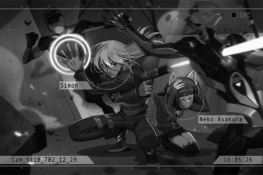

**NEKO#ΦωΦ**  
Xenon!?

**Xenon**  
Alright? Give me your hand.

**NEKO#ΦωΦ**  
_... \*sob\*... \*sob\*_!

**ConneR**  
Aigh\-ya, look who just arrived.

**Xenon**  
... What happened?

**ConneR**  
Precisely what we were worried would happen. Our enemy has already begun making moves. As you can see, it's a disaster of epic proportions.

**Xenon**  
In any case, this bunch is dealt with. Let's go somewhere with more space, it's too dangerous here.

_\[→Signal Switches\]_

_\[Sprints\]_

**Xenon**  
Here!

_\[Footsteps\]_

_\[Raises Gun\]_

**JOE**  
Waaah! Don't shoot! I'm with you!

**Xenon**  
JOE...?

**NEKO#ΦωΦ**  
Hayato!?

**Xenon**  
What are you doing here? What are you doing with all these people here?

**JOE**  
Saving the peeps! The Administration Bureau doesn't have enough to deal with such a disaster.

**Xenon**  
... These people, are they gang members? Is that alright?

**JOE**  
You haven't heard? Anytime something this big happens, good and bad work together. The gangs aren't all like Baro, those bastards.

**Xenon**  
Alright, we'll leave you to it. There are a lot more people trapped in there.

**JOE**  
You're not staying to help?

**Xenon**  
I've got to bring NEKO and her family to the ambulance, then I've got to leave right away. We know how to stop all of this.

**JOE**  
Got it. Hey! Everybody! Come with me.

**Xenon**  
JOE, wait. You all got guns?

**JOE**  
Eh? Oh yeah... I heard they're something like Architects? They still in there?

**Xenon**  
Even though the road in is basically all cleared out, I really don't know how many there are and I don't know where they're coming from. Listen, their core is in the back of the skull area. Attacking anywhere else doesn't do anything. Also, take this device. If you can't take care of them in time, just press this. It'll paralyze them temporarily, for about 10 seconds.

**JOE**  
Alright, I'll take care of 'em... Hey, glad to see you back on your feet.

**Xenon**  
Hey... you guys be careful.

_\[Footsteps\]_

**Vicky**  
Mr. Jackson.

**Xenon**  
......? The gossip reporter... whatta you want?

**Vicky**  
Hayato told me everything. I just wanted to say that because of my work, I owe you an apology. Now I know what kind of person you really are.

**Xenon**  
......  
If you want to report the truth, I'd advise you and Hayato to not go in there. You can't take these things on. I recorded these images for intel. I'll send 'em to you. Use it wisely.

**Vicky**  
......!  
Understood. Thank you.

_\[→Signal Switches\]_

**Xenon**  
NEKO... you okay?

**NEKO#ΦωΦ**  
Yea... thanks for coming and saving everybody. I'm so happy you pulled yourself together.

**Xenon**  
I'm sorry... for what happened in Node 03. The stuff I said...

**NEKO#ΦωΦ**  
No worries! You just said all that 'cuz you wanted to protect NEKO and get me away. I didn't hold it against you.

**Xenon**  
... We're here. Come on, get in the ambulance. Can't reveal our identities.

**NEKO#ΦωΦ**  
... NEKO... NEKO's not badly injured. NEKO wants to go with you!

**Kouhei**  
No way! What are you saying!? Can't you see how dangerous the stuff they're facing is!?

**Xenon**  
Listen to your father. There's nothing you can do to help.

**NEKO#ΦωΦ**  
Oh......

**ConneR**  
Mr. Jackson, we must be going.

**Xenon**  
Okay. Get going, and be careful.

_\[Signal Lost\]_

[Last Log](#os-log-061) | [Back to Top](#list-of-logs) | [Next Log](#os-log-063)

### OS Log #063
___

[Last Log](#os-log-062) | [Back to Top](#list-of-logs) | [Next Log](#os-log-064)

#### Requirements
| Char. |Lv.|Lv. Locked?|
|-------|:-:|:---------:|
|**Ivy**|53 |    No     |

#### Audio\_St13\_702\_12\_29
**[ROBO_Head]**  
_Report: Detecting active heat source ahead._

_\[Mechanical Footsteps\]_

**Xenon**  
Another group... They just keep coming.

**ConneR**  
They haven't discovered us... We've got to get back to Nora. Since you're back, we've got some technical issues we need your help with.

**Xenon**  
... No. If it keeps up, they're going to head to the busiest part of town. If possible, we need to take them out here.

**ConneR**  
I'd advise you to lay low. If you run out now, even though it's a bit far, everyone will see you.

**Xenon**  
Ugh... I can't just let this happen, let's go!

_\[Sprints\]_

**ConneR**  
... Rat bastard, ROBO, let's go!

_\[→Signal Switches\]_

**Agent A**  
Reporters, get the hell out of here!

**Reporter A**  
What happened!

**Reporter B**  
Some people reported seeing something like Architects attacking people and even tearing down a building. Is this true?

**Agent A**  
No comment. In any case, now's not the time for an interview!

**Hayato**  
Miss Vicky, what should we do?

**Vicky**  
People from the Central News Bureau... Come with me, I've got a plan.

_\[Explosion\]_

_\[Building Collapses\]_

**Reporter A**  
Wah! Another building's collapsing!

_\[Gunshots\]_

**Reporter B**  
That's... Simon Jackson!? No wonder... all of this... is he crazy!?  
Quick, snap a photo!

**Reporter A**  
This is Node 08's Central News Bureau, reporting onsite at the site of the disaster! As everyone can see, ahead of us is the wanted fugitive Simon Jackson in the disaster area. Does he have something to do with this disaster? What could his motives be? Currently, we are unable to get any closer. But we can see that he is repeatedly shooting a firearm into the distance. It seems that he's gone completely crazy, and looks extremely dangerous!

**Hayato**  
... They're just reporting nonsense...

**Vicky**  
We've got to do something. Hayato, listen. We...

_\[»»»Fast Forward»»»\]_

**Hayato**  
Aigh!? Are we really doing this? No way...?

**Vicky**  
Jackson and them are the ones going after the truth. Don't you want to help them?

**Hayato**  
...! Of course. Got it, I'll take care of it!

_\[»»»Fast Forward»»»\]_

**Reporter A**  
As you can see, Simon Jackson has some people by his side working with him! From this angle it isn't clear, but they appear to be his accomplices...

_\[Equipment Topples\]_

**Reporter B**  
Eh!? Wah!! Hey! What are you doing!?

**Hayato**  
Wah, sorry, sorry. It was an accident!

**Reporter B**  
Watch where you're going! The camera... ah! Ruined! Aren't you that intern at that other station!? How you gonna pay for this!?

_\[Whistles\]_

**Reporter A**  
It's the Administration Bureau's Armed Forces... He's clearly very dangerous.

**Nate**  
Squad! Clear out these reporters.

**Armed Forces Agent**  
Yes, sir! Hey! Reporters get behind the restricted line. You are not permitted to get near!

**Nate**  
Is that... Simon? What's he doing here...?

**Armed Forces Agent**  
Captain, should we capture him?

**Nate**  
......  
First, get in there and determine what's going on.

_\[→Signal Switches\]_

**Hayato**  
Miss Vicky, did it. They're outside repairing the camera right now. Lucky for us... the Armed Forces are also here. The rest of the workers are pushing up against the law enforcement agents.  
... This is the Central News Bureau for sure, most advanced reporting equipment ever.

**Vicky**  
Okay, the show is about to begin... Without video footage, the people are going to need to rely on audio to hear what's truly going on. With what you got, plus what Jackson just gave me... We've got to show this to the whole world.

**Hayato**  
No one's coming. Miss Vicky, let's do this!

**Vicky**  
Okay. Time to clear his name.

_\[Signal Lost\]_

[Last Log](#os-log-062) | [Back to Top](#list-of-logs) | [Next Log](#os-log-064)

### OS Log #064
___

[Last Log](#os-log-063) | [Back to Top](#list-of-logs) | [Next Log](#os-log-065)

#### Requirements
| Char. |Lv.|Lv. Locked?|
|-------|:-:|:---------:|
|**Ivy**|53 |    No     |

#### Cam\_St14\_702\_12\_29\_1
_\[Door Knock\]_

**Reporter A**  
Hey! Who's in there! Open the door!

**Hayato**  
Wah! Vicky! Hurry up, they found us!

**Vicky**  
Gimme a second! This equipment is complicated!

_\[Door Breaks\]_

**Reporter A**  
It's reporters from the 08 Daily...! And that little s\*\*\* who was causing trouble! What are you doing in our car!?

**Vicky**  
Revealing the truth to the entire world!

**Reporter B**  
Eh!? What the hell are you talking about? Get the hell out of here!

_\[Explosion\]_

_\[Crowd in chaos\]_

**Reporter A**  
What... What the hell? Outside... WAH!?

_\[→Signal Switches\]_

_\[Footsteps\]_

**Nate**  
Be careful. Our mission is to capture and eliminate any suspicious contributors to the disaster.

**Team Member A**  
Captain, Simon Jackson may be here. It was just confirmed.

**Nate**  
I'm aware. If you see him, do not rush into action. You must report to me first. He may be able to offer useful intel. We need to figure out what the hell happened here.

**Team Member A**  
Copy.

**Nate**  
We take 3 routes. Unit A follows me. Unit B heads eastward, Unit C to the south. Let's move.

_\[→Signal Switches\]_

_\[Gunfire\]_

**ConneR**  
Your attacks on them are outstandingly effective, but I'm afraid we're heading in the complete opposite direction.

**Xenon**  
I hoped we could draw them to a desolate area... Damn, with this many, there's no way three of us can do this. Most of them are running towards the crowded areas.

**[ROBO_Head]**  
_Analysis: Terrain and firepower are not to our advantage, escape probability, low._

**ConneR**  
Sir, I don't believe such an obvious situation requires analysis, wouldn't you say? Best focus on the battle.

_\[Consecutive Gunfire\]_

_\[Hacking\]_

**Xenon**  
...? The amount of units my A.I. can hack into at once is diminishing... Are these buggers... learning?

**ConneR**  
Mr. Jackson! Behind you!

_\[Heavy Blow\]_

_\[Device Drops\]_

**Xenon**  
Urgh! ..._\*cough\*... \*cough\*_... Let go... _\*cough\*_...

**Team Member A**  
Target found! Do not take action!

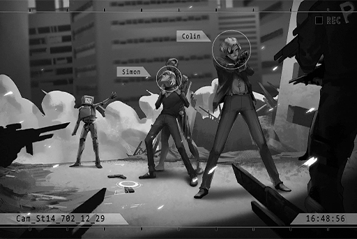

**Team Member A**  
Reporting, Captain. Simon Jackson has been found on 74th Street. He's with Colin Neumann Jr. and two robots of unknown identity!

**ConneR**  
Do not fire! Do you not see what's going on?

**Team Member A**  
Shut it! You're under arrest!

**ConneR**  
... A bunch of monkeys... First take care of that metal box that's got its claws on Mr. Jackson. That's the enemy. There are more units heading towards the citizens nearby.

**Xenon**  
... _\*cough\*_... Can't... breathe...  
ROBO, my device... link...

**[ROBO_Head]**  
_...! Received._

**Team Member A**  
Do not move! If you take another step, we will fire!

**[ROBO_Head]**  
_......  
We have no ill intent._

_\[Bullet enters the chamber\]_

_\[Sprints\]_

**Nate**  
Put the guns down!

**Xenon**  
ROBO! Now!

_\[Hacking\]_

**Nate**  
Simon! Move your head!

_\[Gunshot\]_

_\[Unit Destroyed\]_

**Team Member A**  
Captain!  
... Is that... an Architect?

**Xenon**  
Nate... _\*cough\*_... thanks. Nice shot.

_\[Raises Gun\]_

**Xenon**  
......!

**Nate**  
Don't move. Put down your weapon, turn around and face the wall. You two, do the same.

**Xenon**  
......

**Nate**  
Such a massive disaster... You'd better explain what happened or I'll shoot you dead right here.

**Xenon**  
It's a long story...

**Nate**  
I've got time.

**ConneR**  
We don't agree. Do you want to see what's going on outside?

**[Intercom]**  
_Reporting, this is Market 6. Citizens are under attack! All units, please provide assistance immediately!_

**Xenon**  
Nate... let us go for the time being. I know how to take care of these bastards. You can put handcuffs on us and we'll go with you. If there's some sign that we're trying to escape, you can shock us.

**Nate**  
Hmm... alright.  
Team! These three are temporarily joining the team. Let's head to Market 6!

_\[Signal Lost\]_

[Last Log](#os-log-063) | [Back to Top](#list-of-logs) | [Next Log](#os-log-065)

### OS Log #065
___

[Last Log](#os-log-064) | [Back to Top](#list-of-logs) | [Next Log](#os-log-066)

#### Requirements
| Char. |Lv.|Lv. Locked?|
|-------|:-:|:---------:|
|**Ivy**|53 |    No     |

#### Audio\_St14\_702\_12\_29\_2
_\[Explosion\]_

**Reporter A**  
Wah... I don't wanna die... I don't wanna die!

**Vicky**  
Oh shut it already! Be a man and quit crying!

**Reporter B**  
What are you gonna do? Using our equipment without our permission... Are you... working with Simon Jackson?

**Vicky**  
Dummy. After you see this info, you'll get it. He's not the bad guy.

_\[Heavy Blow\]_

**Hayato**  
Wah! They're attacking the car... Sir, at least let us publish the truth before this gets ugly!

**Reporter A**  
Whatta you mean......!?  
W\-W\-Why should I believe you!?

_\[Heavy Blow\]_

**Vicky**  
Ugh...! Don't pay attention to them! I'm still at it! Hey! Tell me how to work this broken machine! And tell me the password!

_\[Heavy Blow\]_

**Reporter B**  
It's too late! This isn't a tank! We're dead!

_\[Heavy Blow\]_

_\[Gunshots\]_

**Hayato**  
.....!?

**Reporter A**  
......

_\[Door Breaks\]_

**Reporter A**  
Wah! Don't kill us! I have children!

**Xenon**  
... Don't worry. Get out.

**Vicky**  
... How'd you know we were here?

**Hayato**  
I sent him a message.

**Reporter B**  
You... you're working together!

**Nate**  
No, he saved everybody.

**Reporter B**  
Eh....? R\-Really?

**Vicky**  
So, are you ready to believe me or what?

**Reporter A**  
Th\-Th\-Thank, Thank you!

**Vicky**  
Hey, password.

**Reporter A**  
Of course! Here.

**Nate**  
I got some intel. Those buggers stopped attacking the city all of a sudden and began moving in the same direction.

**Xenon**  
Which way are they headed?

**Nate**  
A.R.C. headquarters. I don't know what's going on, but if what you just told us is the truth...

**Xenon**  
Yeah. It's the truth.

**Nate**  
......

_\[Unlocks Handcuffs\]_

**Xenon**  
......!

**Nate**  
This is the last time I'm trusting you. I'm letting you go in front of everybody. This will not happen again. Go. Find Ivy and stop her. Stop all of this.

**ConneR**  
Wise decision.

**Xenon**  
Nate... thanks.  
Let's go.

**Nate**  
Simon.

**Xenon**  
Yeah?

**Nate**  
Sorry... about Pauline.

**Xenon**  
Like I said before... In the pursuit of truth, sometimes we lose what we treasure the most.

_\[Signal Lost\]_

[Last Log](#os-log-064) | [Back to Top](#list-of-logs) | [Next Log](#os-log-066)

### OS Log #066
___

[Last Log](#os-log-065) | [Back to Top](#list-of-logs) | [Next Log](#os-log-067)

#### Requirements
| Char. |Lv.|Lv. Locked?|
|-------|:-:|:---------:|
|**Ivy**|54 |    No     |

#### Cam\_Kyuu08\_702\_12\_29
_\[Door Opens\]_

**PAFF**  
They're back!

**[Nora]**  
_Mr. Jackson, I am so happy that you've returned._

**Xenon**  
Let me take a look at the firewall.

**[Nora]**  
_I've already done the best I can, but each time I decrypt a certain amount, the system automatically shuts off. Then I have to start again._

**Xenon**  
......

_\[»»»Fast Forward»»»\]_

**Xenon**  
Strange...

**[Nora]**  
_What's the matter?_

**Xenon**  
This structure and logic... I'm very familiar with it. It most certainly came from Æsir——Ivy. Based on my understanding of her, her firewalls in the past used counter\-attack methods, like memory alteration or destroying equipment; but these firewalls are merely shut\-down systems. Looks like they allow for unlimited attempts.

**[Nora]**  
_That's not like her._

**ConneR**  
This is just a guess, but there are two possibilities: The first is that she wants a certain amount of information to be found.

**Xenon**  
... Possibly. A provocation?

**ConneR**  
As of now, we still don't understand her motives. But what I mean is... She wants to be discovered by you.

**Xenon**  
Me? Why?

**ConneR**  
Who knows? The only one who can measure up to her on the tech side is you. Ivy is incredibly intelligent. There must be a reason for this.

**Xenon**  
... And the second possibility?

**ConneR**  
She doesn't plan on injuring humans.

**Xenon**  
.....!  
You're the one who speculated that she was the culprit. Doesn't this contradict her actions in the city?

**ConneR**  
When hypothesizing, one must courageously overturn one's own theory. Only then can one escape one's own biases. If she is not the culprit... then this game just got a whole lot more interesting.

**Xenon**  
In any case, no matter what the situation is, we've got to find her first.

**ConneR**  
After we find her, what is your plan? Our original plan was to stop her in the real world. But I'm sure you've got something more creative up your sleeve.

**Xenon**  
... True. But it's a bit extreme.

**ConneR**  
Let's give it a hear, shall we?

**Xenon**  
... I'm sick of seeing your face. You knew long ago that things would turn out like this, didn't you? Blazing your way through there without knowing the enemy's firepower situation. It's not like you to think that's going to work. You knew that I would come back and think of a way to deal with this in the OS space.

**ConneR**  
Hehe, I don't know what you're talking about.

**Xenon**  
Forget it. With ROBO and your chip, can we really enter the OS space?

**[Nora]**  
_That's correct. We've already successfully done so several times. However, there are still many technical issues._

**Xenon**  
I've basically looked over the data. First, regarding the time restraints. This equipment is the issue. If we can use the equipment at A.R.C, I think we can extend the time to 20 minutes and it won't damage ROBO's core.

**ConneR**  
Is that so...

**Xenon**  
When we were helping the citizens, Nate said that the Architects were headed for A.R.C. I don't know what they're up to, but we need to move even faster...  
Next, there are Ivy's firewalls. If I can get in the OS space for that long, they shouldn't be an issue.

**Xenon**  
Lastly, please take a look at this module. This is how I want to stop her.

_\[Projection\]_

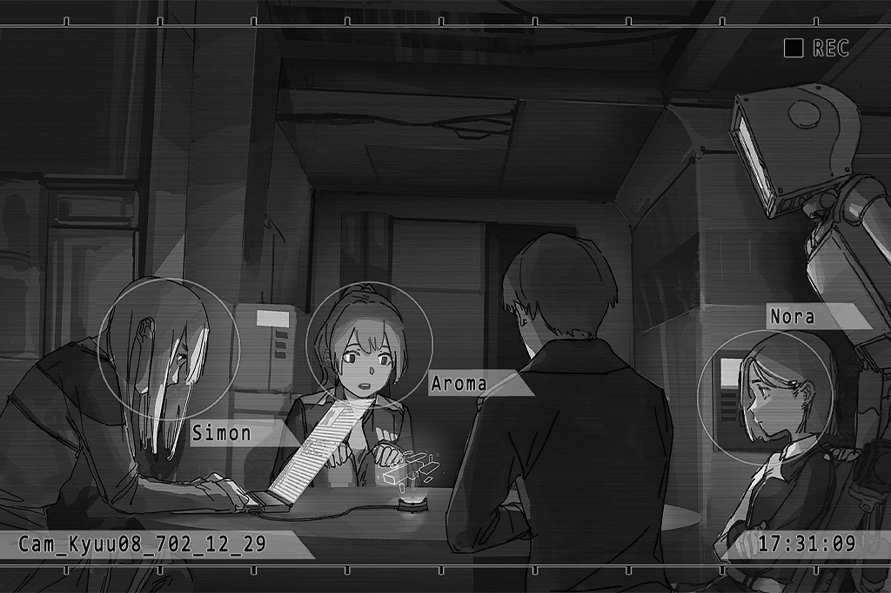

**[Nora]**  
_Is that..._

**Xenon**  
When I was battling it out with the Architects in the city, I analyzed some data on their core. Although the logic is extremely complex, I think this should be able to destroy them. I mean destroy them permanently. As you've probably already seen, these buggers are like zombies, they're consciousness and actions are replicated.

**Nora**  
......!

**Xenon**  
However, I don't really understand the OS space. Nora, from this model, do you think this is possible? Can we "produce" this thing in the OS space?

**[Nora]**  
_... The OS space is an information storage space for consciousness after it has been digitized and emulated. Essentially, the logic is the same as the cyTus system that A.R.C. developed. The only difference is that it is much larger, by a long shot. So, in theory I believe it is possible. But... I haven't considered this method... I believe it is definitely worth a try._

**Xenon**  
Comforting to hear. But such an action has a lot of conditions and restraints——First, this is just a model. If we are actually going to make this in the OS space, we are going to need huge connection bandwidth.

**ConneR**  
Like Æsir \- FEST, when Ivy used everybody's virtual internet chip to create something? Just like following a recipe...

**Xenon**  
Are you an idiot? We're wanted criminals. Where are we going to collect that many people's connection bandwidth? No one will be willing to help us. Or should we just start smashing people's heads in?

**ConneR**  
Hey hey, how absolutely despicable do you think I am? No matter how hard I try, I wouldn't even imagine doing such a thing... But not a bad idea.

**Xenon**  
Point is, our target is here.

**[Nora]**  
_The factory for manufacturing virtual internet chips? Yes, there we can get a lot of blank chips. But that would mean..._

**Xenon**  
That's right, we've got to steal them without anyone getting hurt.

**ConneR**  
Hehe, I like this. Looks like the fully\-charged "X" has finally arrived. No longer constrained by shallow morality. I love it.

**Xenon**  
Next, as I just said, this thing will have its restraints. First, it can only be used on one unit, so we must choose our target wisely.

**Xenon**  
We may only have one shot. When I was fighting with them I discovered that their systems can evolve. If the first time fails, or we pick the wrong target, they may become immune.

**PAFF**  
......

**Xenon**  
Ah, sorry. PAFF... All this may seem a bit complicated for you, but given the time restraints, it's the only method I could think of.

**PAFF**  
... No, having Xenon back's given the whole team a huge boost! We already know where the target's at!

**Xenon**  
This is just theory and a model. Without actual execution, the results are unclear. In any case, we'll begin with the first step. That is, we'll start by stealing the chips.

**[Nora]**  
_Everybody, I'm afraid our time is running low. Take a look._

_\[Crowd Panicking\]_

**Xenon**  
......! A.R.C. headquarters...

**ConneR**  
That group of Architects are racing towards the top and have already begun attacking.

**Xenon**  
Their actions... are different from what we saw in the city. Besides the people who are trying to stop them, they're not actively attacking people. Almost like they're completely focused on heading towards that place... The people inside are in danger!

**ConneR**  
Let's split into two. ROBO and I will take the chip factory. Mr. Jackson, you take the two girls to A.R.C. headquarters. We'll meet there.

**Xenon**  
Alright, I'll let you handle it.

**[Nora]**  
_Head out. Prepare the car._

**Member S**  
Yes, ma'am!

_\[Signal Lost\]_

[Last Log](#os-log-065) | [Back to Top](#list-of-logs) | [Next Log](#os-log-067)

### OS Log #067
___

[Last Log](#os-log-066) | [Back to Top](#list-of-logs) | [Next Log](#os-log-068)

#### Requirements
| Char. |Lv.|Lv. Locked?|
|-------|:-:|:---------:|
|**Ivy**|54 |    No     |

#### Cam\_Dash\_702\_12\_29
_\[Engine Rumbles\]_

**PAFF**  
Oh yeah, Xenon. There's something I want to give you.

**Xenon**  
Huh?

_\[Takes out clothes\]_

**Xenon**  
......!

**PAFF**  
Is this your coat? I found it in Cherry's room when we left Kyuu Hou Kai.

**Xenon**  
......  
Thank you.

_\[Puts on coat\]_

**Xenon**  
......?  
There's something in the pocket...  
......!

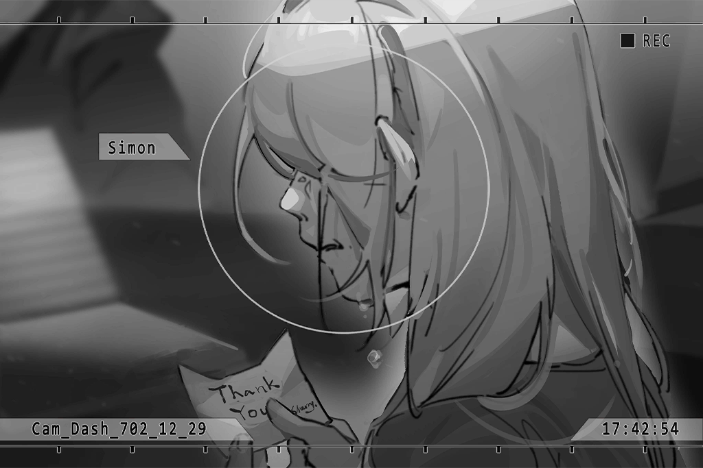

**Xenon**  
......

**PAFF**  
Cherry... If she knew you came back to help, she'd be so happy.

**Xenon**  
... Yeah.  
Hope everyone at A.R.C is alright...

**PAFF**  
Almost there.

_\[Ringtone\]_

**Xenon**  
...... NEKO.

**[NEKO#ΦωΦ]**  
Hey hey? Can you see me?

**Xenon**  
Yup. What's up?

**[NEKO#ΦωΦ]**  
_NEKO's here confirming her safety! Family's doing pretty good. They're all resting now. Thanks so much all you. Aroma\-chan?_

**PAFF**  
NEKO, I'm here. You alright?

**[NEKO#ΦωΦ]**  
_Ya ya, NEKO's not hurt at all. How you guys doing?_

**PAFF**  
We're currently headed towards A.R.C. headquarters...

**[NEKO#ΦωΦ]**  
_AIGH!? That's too dangerous!? What are you going to do!?_

**PAFF**  
Eh? We...

**[NEKO#ΦωΦ]**  
_At least let NEKO know what you're doing? NEKO doesn't wanna worry!!_

**Xenon**  
... Whatever, I'll explain.

_\[»»»Fast Forward»»»\]_

**[NEKO#ΦωΦ]**  
_AIGH!? Steal chips!? Isn't that illegal!?_

**Xenon**  
... Not the time to worry about stuff like that.

**[NEKO#ΦωΦ]**  
_No! Absolutely not!_

**Xenon**  
There's no other way. That's it. You stay safe in the hospital. I'm hanging up.

**[NEKO#ΦωΦ]**  
_No wayzers! Let NEKO finish! Have you guys seen the news?_

**Xenon**  
......?

_\[Ringtone\]_

**[Nora]**  
_... Mr. Neumann?_

**[ConneR]**  
_Plan has failed. This place was cleaned out before we even got here._

**Xenon**  
......

**[NEKO#ΦωΦ]**  
_NEKO heard it all. So that's what happened!_

**Xenon**  
... How could that be? Did Ivy pull this off? There's no reason why she'd be able to predict even this...

**[Nora]**  
_No, it appears some gang members grabbed a hold of this opportunity. After all, the chips sell for a pretty penny on the black market.  
We've been paying so much attention to the Architects that we overlooked what's going on in the rest of the city..._

**PAFF**  
What do we do now...?

**Xenon**  
Don't know... If we don't have the flow rate of those chips for the calculations, even if we get to A.R.C. I won't be able to make the virus.

**[NEKO#ΦωΦ]**  
_NEKO... has a way._

**Xenon**  
......?

**[NEKO#ΦωΦ]**  
_Use the chips of people on the internet! Doesn't everybody have one?_

**Xenon**  
... We already thought of that. But since that won't work, all we could do was steal some.

**[NEKO#ΦωΦ]**  
_You thought nobody would help you, right? Since the Central News Bureau reported that you were saving people in Quadrant II, a lot of people have already changed their minds about you! Plus, if NEKO puts the call out it'll be a lot different, MUAHAHA! NEKO, influencer of immense power!_

**Xenon**  
... Hey, what are you thinking?

**[NEKO#ΦωΦ]**  
_Just watch me! Finally, the time has come for NEKO to rise! I'm expecting a ton of thanks!_

**Xenon**  
Hey! Don't do anything stupid!

_\[Calls Ends\]_

**Xenon**  
... Little brat...

**[ConneR]**  
_We'll see. Miss Wildcat is rather intelligent._

**PAFF**  
Let her help out. We don't have another way. She's not going to be directly involved. Shouldn't be a problem!

**Xenon**  
That is if our plan doesn't get exposed... Think about how many attacks Ivy carried out when she learned about our actions. You think this girl is gonna keep it on the down\-low?

**PAFF**  
... I...

**[Nora]**  
_... In any case, there is no other way. Miss PAFF, please call Miss Asakura before she does anything silly. We will open an encrypted connection for her to do this, though I'm not sure for how long we can keep this from Ivy._

**Xenon**  
... Okay, we'll have to give it a shot. What's most urgent now is getting to A.R.C. Neumann, you guys ought to head straight over there.

**[ConneR]**  
_Yes, Captain._

_\[Signal Lost\]_

[Last Log](#os-log-066) | [Back to Top](#list-of-logs) | [Next Log](#os-log-068)

### OS Log #068
___

[Last Log](#os-log-067) | [Back to Top](#list-of-logs) | [Next Log](#os-log-069)

#### Requirements
| Char. |Lv.|Lv. Locked?|
|-------|:-:|:---------:|
|**Ivy**|55 |    No     |

#### Audio\_hall\_702\_12\_29
_\[Crowd Panicking\]_

**Agent A**  
Simon Jackson!

**Xenon**  
... Don't shoot. We're here to help.

**Agent A**  
I'm aware. Captain Nate told us. Your crimes have been temporarily pardoned until the crisis is resolved.

**Xenon**  
Thanks.  
What on earth happened up there?

**Agent A**  
It's not clear. All we know is that all the Architects who appeared have gathered up there. The lift has stopped working. There's still a lot of employees trapped inside.

**[Nora]**  
_A.R.C. must have some measures in place to deal with this, right?_

**Xenon**  
Yes, and the rescue drones?

**Agent A**  
We've been trying to operate them ever since this started, but whether it's the drones or the lift... essentially all of A.R.C.'s facilities have been hacked by an unknown signal. We can't decode it at all...

**Xenon**  
... Move over, let me try.

_\[Connects\]_

_\[»»»Fast Forward»»»\]_

**[Davis]**  
_Simon...? Is that Simon?_

**Xenon**  
Got it. I restored the connection between you and the ground\-level processor. Is everyone alright?

**[Davis]**  
_Those rats got in and start destroying everything. All the equipment has lost control, even the instruments and apparatus' started attacking us...  
Right now, we're locked inside a room and can't get out... But starting just a bit ago, seems like there's no sound out there. Don't know what's going on..._

**Xenon**  
Wait a sec, the connection to the surveillance camera just came back on, I can see what's going on from here.  
......?  
What the... They're all immobile, not even moving. Have they malfunctioned?

**[Davis]**  
_Does that mean we can get out of here safely...?  
There are still people in areas A and C that are in trouble!_

**Xenon**  
I just got back the control permission for the rescue drones. All of you take advantage of the situation and gather at the escape door. I'll notify people in the other areas.

_\[»»»Fast Forward»»»\]_

_\[Drones Flying\]_

**Xenon**  
You alright? Hurry up, follow the enforcement agents to a safe place.

**Davis**  
Simon... Thank you so much, really. We've never seen a hack of this magnitude. Our hands were completely tied... Mark almost had it, but in the end he just couldn't see it through.

**Mark**  
Simon, apologies. It's all because of what I did that you...

**Xenon**  
That's in the past. Forget it. Get out of here, will you? It might get even more dangerous soon.

**Mark**  
... What about you?

**Xenon**  
We initially wanted to use the equipment in my computer room. But with all those things in there, that's way too dangerous.  
... Whatever, this should be fine.

**Davis**  
Do you know how to stop those things?

**Xenon**  
... Perhaps.

**Mark**  
... Take this.

**Xenon**  
Master key...?

**Mark**  
Your name's been removed from the employee access list. Hacking back into these facilities will take a lot of time, no? With this, you should be able to use most of the facilities.

**Xenon**  
Mark... thanks!

**Davis**  
We're not sure what's happened, but we trust that you'll be able to fix it.

**ConneR**  
Ey, we're a bit late. Did we miss a good show?

**Xenon**  
More than a "bit", wouldn't you say?

**Davis**  
Neumann!?

**Xenon**  
Relax, he's with us.

**ConneR**  
Apologies, traffic was terrible.

**Xenon**  
Davis, Mark, get to somewhere safe. We'll take care of this.

_\[»»»Fast Forward»»»\]_

_\[Operating surveillance cameras\]_

**[Nora]**  
_... The Architects up there began moving again._

**ConneR**  
Did you say they immobile for a period of time?

**Xenon**  
Yeah, the people up there were able to escape.

**ConneR**  
Let me see an image of them when they were immobile.

_\[Operating surveillance cameras\]_

**ConneR**  
... Mr. Jackson, doesn't it look like we've seen this before?

**Xenon**  
Yeah, looks like the paralysis caused by my device when we were attacking them in the city.

**ConneR**  
Perhaps there's someone other than us who's trying to stop them...

**Xenon**  
Hmm... Things are getting more and more chaotic. Don't understand it at all. In any case, we'll just stick to the plan. Ivy is probably the best clue we've got right now. We'll start from where NEKO's at.

_\[Signal Lost\]_

[Last Log](#os-log-067) | [Back to Top](#list-of-logs) | [Next Log](#os-log-069)

### OS Log #069
___

[Last Log](#os-log-068) | [Back to Top](#list-of-logs) | [Next Log](#os-log-070)

#### Requirements
| Char. |Lv.|Lv. Locked?|
|-------|:-:|:---------:|
|**Ivy**|55 |    No     |

#### Audio\_hospital\_702\_12\_29
**Kouhei**  
Xenon needs help?

**NEKO#ΦωΦ**  
Ya, pretty simple simps. I'll send the website to all ya'll. All you gotta do is open the page!

_\[→Signal Switches\]_

**NEKO#ΦωΦ**  
Not enuff people! Prease oh prease help NEKO repost this \~(\*Φ∀Φ)\~♥ la la la

**NEKOSAIKOU**  
I'M COMINGGG!!!!

**Fan A**  
We can help! We are... the wings of NEKO!

_\[→Signal Switches\]_

**Fan H**  
AHHH!!!!! My head...

**Fan I**  
Wh\-What happened!? The entire space just...

**NEKO#ΦωΦ**  
Everyone, get offline! Get out of here!

_\[→Signal Switches\]_

**Fan K**  
_\*whimper\*_... What just happened... My head, it hurts so bad...

**Fan T**  
Me too... Is NEKO okay?

**Fan K**  
Don't know... Hey, Bob! You alright?  
... Bob?

**Fan T**  
He... He's not breathing!!!

**Fan K**  
……！Bob！！

_\[→Signal Switches\]_

**Xenon**  
...... NEKO! Wake up!

**NEKO#ΦωΦ**  
Ugh... Xe... Xenon? What's wrong...

**Xenon**  
Do not disconnect. Your nerves have been slightly interfered with. Let me take a look... Not too bad, no serious obstructions.

**NEKO#ΦωΦ**  
Interfered...?

**Xenon**  
It was an attack by the enemy. Much more fierce than I expected. Good thing the firewall did what it is supposed to, otherwise we'd have ended up just like the others...

**NEKO#ΦωΦ**  
The others... NEKO's fans!? What happened?

**Xenon**  
......

**NEKO#ΦωΦ**  
Why aren't you saying anything? Xenon!

**Xenon**  
It was basically the same as when you got hacked before. Those affected got headaches, lost consciousness, etc. Only this time the attack was much stronger...

**NEKO#ΦωΦ**  
How could this... _\*sob\*... \*sob\*_...

**Xenon**  
... Well, I've already collected enough data. The core of the virus will soon be complete. Get offline. It isn't safe.

_\[Hugs\]_

**Xenon**  
......?

**NEKO#ΦωΦ**  
Did... NEKO do this?

**Xenon**  
No, it's not your fault.

**NEKO#ΦωΦ**  
But...... NEKO told everyone to come...

**Xenon**  
... Don't think about this.  
Listen to me. I've got to get back to complete the virus. Wait in the hospital and don't go running off, you hear me?

**NEKO#ΦωΦ**  
... Okay...

_\[→Signal Lost\]_

_\[Virus core produced\]_

**Xenon**  
Yes!

**[Nora]**  
_Degree of completion, 99.7%. It's reached acceptable levels... All thanks to Miss Asakura._

**PAFF**  
But... those people who helped...

**Xenon**  
Yes... it's too late...

**ConneR**  
At least we've finished... making the virus core.

**Xenon**  
Yeah... What!?

_\[Static\]_

**Xenon**  
What's going on...? I can't pick it up... it hurts...

_\[Static\]_

**ConneR**  
I can't either... I still think that amount of bandwidth was unable to produce anything useful, and now it's even attacking us... What are we going to do?

**PAFF**  
Um... Let me try.

_\[Picks up the virus\]_

**Xenon**  
......! You did it!? Are you alright!?

**PAFF**  
Yeah... I don't feel anything.

**ConneR**  
Appears the true "users" and us counterfeits are indeed different on a fundamental level.

**Xenon**  
... Though I don't understand it, there's no time to figure out why. From what we've seen, that appears to be the case. Only PAFF can perform the "implant". Is that alright with you?

**PAFF**  
I'll do my best!

_\[Signal Lost\]_

[Last Log](#os-log-068) | [Back to Top](#list-of-logs) | [Next Log](#os-log-070)

### OS Log #070
___

[Last Log](#os-log-069) | [Back to Top](#list-of-logs) | [Next Log](#os-log-071)

#### Requirements
| Char. |Lv.|Lv. Locked?|
|-------|:-:|:---------:|
|**Ivy**|56 |    No     |

#### Audio\_H1001\_702\_12\_29\_1
**PAFF**  
NEKO... I wonder if she's alright?

**[Nora]**  
_... Miss PAFF, focus on the mission. As you've seen, the enemy shows no mercy. Even the slightest mishap could result in the loss of life._

**Xenon**  
Nora is right. They did a lot so we could complete the virus. Let's not let them have made this sacrifice in vain.

**PAFF**  
... Okay!

**ConneR**  
Alrighty then. Let's begin.

**[ROBO_Head]**  
_Initiating protocol, to link to OS space. Users: Simon Jackson, Colin Neumann Jr._

**PAFF**  
I want to go in as well.

_\[Connects\]_

**PAFF**  
We'll begin from the last place we left off. You two, hold onto me.

_\[Transmitting\]_

**Xenon**  
......!  
This place is...

**[Nora]**  
_Mr. Jackson, what's the matter?_

**Xenon**  
This is where my father died... in that alley up ahead.

**ConneR**  
Oh! What a coincidence. This place has been abandoned by the Administration Bureau for some time now. Luis Pauline was discovered by your father here...?  
The cyTus signal is very weak here. No better place to hide one's identity.

**[Nora]**  
_... The coordinates are once again different from last time. We've got to try again, but the target should be close. As long as you get close to the firewall there will be a reaction._

**PAFF**  
Should we split up?

_\[→Signal Switches\]_

_\[Footsteps\]_

**Xenon**  
......

**[Nora]**  
_Mr. Jackson, where are you going? Please don't go too far from one another._

**Xenon**  
Don't worry, there's just something... I want to check out...

_\[Footsteps\]_

**???????**  
_\*sob\*... \*sob\*..._

**Xenon**  
......!

**[Nora]**  
_Be careful, someone's in front of you!_

**Xenon**  
... Shannon...

**Shannon**  
_\*sob\*... \*sob\*_... ugh...

**[Nora]**  
_...? Who is that?_

**Xenon**  
It's my sister... I finally... found you.

**[Nora]**  
_You knew she'd be here?_

**Xenon**  
Ever since she started experiencing those symptoms I kept doing research. I knew her consciousness had to be stuck somewhere in the virtual internet. But I searched all of cyTus and couldn't find anything. After I heard about the OS space I thought...

**[Nora]**  
_... Is that so?_

**Xenon**  
Shannon, it's me.

**Shannon**  
_\*sob\*... \*sob\*_... ugh...

**[Nora]**  
_It's of no use. I've seen lots of information that's stuck in this space. Doesn't matter if it's memory, A.I., or consciousness, if the body is left too long, it will gradually crumble. I don't think she'll be able to react to you at all._

**Xenon**  
If I don't try, how will I know...

_\[Static\]_

**[Nora]**  
_Do not touch her._

**Xenon**  
......!

**[Nora]**  
_I told you, right now she's very weak. If your signal interferes with her, she may disintegrate._

**Xenon**  
No... What should I do?

**[Nora]**  
_Your sister, she has "Virtual\-Internet Related Post\-Traumatic Stress Disorder", is that correct? There is a cure, you know._

**Xenon**  
Eh...? Are you saying...

**[Nora]**  
_That's right. Right now we will set up a firewall here, cutting her off from interacting with other information. After all this is over, we can bring her body here, where we may be able to reconnect her mind that's been disconnected from her brain._

**Xenon**  
... It's already been 6 years. Is there really a way?

**[Nora]**  
_6 years... is a long time. If it does work, she'll probably need a lot of time to recover. However, this is just a theory. If you don't try, you never know if it'll work. Isn't that what you said?_

**Xenon**  
... You're right. Right now, we've got to focus on Ivy.  
Shannon, I'm sorry... I will save you. Wait for me.

_\[Firewall Established\]_

_\[→Signal Switches\]_

**ConneR**  
Is this... Nailed it. Hey! Miss Nora, can you hear me? Here!

**[Nora]**  
_Did you find it!?_

**ConneR**  
Looks about right. One step closer and I may have been kicked out.

**[Nora]**  
_Excellent. I'll call them to come meet up with you immediately..._

_\[Static\]_

**ConneR**  
What... What is that noise?  
Wait a sec, this isn't normal...

**?̧̀͡͡?̢͡?̸͘͠?̷̴̡͢͜?̵͝?̡̡͟͞?͝͡**  
Inţ̶̡͞͠S̵̷3̸͢҉̷z̸̸̀͞in in...... Invaders... kill kill\$̸̶̕͢k͏̷̡C͢͡͠... kill...

**ConneR**  
Architects!? They can come in here too...!?

**[Nora]**  
_It's too dangerous! ROBO! Cut the connection!_

_\[Signal Lost\]_

[Last Log](#os-log-069) | [Back to Top](#list-of-logs) | [Next Log](#os-log-071)

### OS Log #071
___

[Last Log](#os-log-070) | [Back to Top](#list-of-logs) | [Next Log](#os-log-072)

#### Requirements
| Char. |Lv.|Lv. Locked?|
|-------|:-:|:---------:|
|**Ivy**|57 |    No     |

#### Audio\_H1001\_702\_12\_29\_2
_\[Connection Lost\]_

**ConneR**  
Urgh... Huff——too dangerous, almost got knicked.

**Xenon**  
Oh... What happened?

**[Nora]**  
_The consciousness of Architects also exists in the OS space. When Mr. Neumann found the firewall that Ivy had set up, a wave of them rushed forth all of a sudden... Not ideal..._

**Xenon**  
So she's controlling them...

**[ROBO_Head]**  
_Report: Miss PAFF, is still in the OS space._

**[Nora]**  
_......!?  
That's right, She disappeared just a second ago..._

**Xenon**  
... I'm sorry, I wasted too much time with Shannon...

**[Nora]**  
_I'm going back to find her!_

_\[→Signal Switches\]_

**PAFF**  
...... You must... be so lonely.

**??????**  
......

_\[Footsteps\]_

**PAFF**  
Um, can I... touch you?

**??????**  
......

_\[Static\]_

**??????**  
!?

**[Nora]**  
_...... Miss PAFF! Can you hear me?_

**PAFF**  
Nora!?

**[Nora]**  
_I finally found you. Since you're the only one who uses the ability to enter the OS space, that surge caused us to split up. I'm repositioning and transmitting you back._

**PAFF**  
Okay, got it!  
... So, can I...

_\[→Signal Switches\]_

**PAFF**  
Wah!? ...Eh?

**[Nora]**  
_Miss PAFF, what's going on? Who were you just speaking with...?_

**PAFF**  
Eh...? I...

**[Nora]**  
_Please don't run off too far, you may get lost. I've told you many times._

**PAFF**  
I'm sorry... About that, I just saw someone else, I thought...

**ConneR**  
Huh? There are others who can enter the OS space?

**[Nora]**  
_It's not impossible... But what's more likely is that it was a consciousness left in the OS space, like Mr. Jackson's sister. It's best not to touch them. You must focus._

**PAFF**  
... Okay, I'm sorry...

**Xenon**  
Well, we've found Ivy's location. Unfortunately, we're going to have to deal with the Architects... Nora, I've got an idea. Connect Mr. Neumann and I to the OS space.

**[Nora]**  
_......? Okay, what are you planning?_

_\[Connecting\]_

**Xenon**  
We've successfully created a virus in the OS space using our consciousness, right? Ever since then I've been thinking, other modes of attack shouldn't be any more difficult to produce.

**ConneR**  
Oh? And how will we do that?

**Xenon**  
For example, if we decipher the information for the gun that my A.I. created and change its format to fit that of the data in the OS space, all one needs is an idea of its structure...

_\[Gun Appears\]_

**Nora**  
......!

**ConneR**  
I see——We can rely on our understanding of these electrical instruments to create items in the OS space? Like... this.

_\[Gun Appears\]_

**ConneR**  
Haha! Interesting. Mr. Jackson, you're more creative than I imagined.

**[Nora]**  
_Indeed... I've been in contact with the OS space this many years and have never thought of this. Mr. Jackson, you are not a simple man._

**Xenon**  
... However, we no longer have fellow citizens who can provide us with large amounts of bandwidth. With what we have now——that is, with this equipment we have and our own chips, I'm afraid we won't be able to produce anything quite as effective as the virus core.

**[Nora]**  
_All we need is something that will allow us to resist them a bit. Our target is Ivy. Before we find her, confronting those zombies is meaningless. We'll go offline temporarily; I need to reorganize ROBO's data. We can head out in five minutes._

_\[Connection Lost\]_

_\[Door Opens\]_

_\[Draws Gun\]_

**ConneR**  
Who the hell!?  
......?

**Xenon**  
......!?  
NEKO!? What the hell are you doing? Didn't I tell you to stay in the hospital!? It's dangerous here!

**NEKO#ΦωΦ**  
Let NEKO join you.

**PAFF**  
NEKO...

**NEKO#ΦωΦ**  
We can find Ivy by linking with ROBO, right? I heard everything you just said.  
NEKO'll use this.

**Xenon**  
GAMEBAI......?  
What are you talking about? This isn't...

**NEKO#ΦωΦ**  
It's not a game! NEKO doesn't think this is a game! Everybody... It's only because of me that you...!

**Nora**  
......

**NEKO#ΦωΦ**  
It's all thanks to NEKO that you made the virus, am I right?  
NEKO's not some useless piece of junk, I'm a member of the team!

**[Nora]**  
_... ROBO, make it so three people can connect. Is that load bearable?_

**[ROBO_Head]**  
_Report: Based on Xenon's optimization of the chips and this unit, it is not an issue._

**Xenon**  
Hey, Nora!

**[Nora]**  
_... She's right. Although I tried to keep her out of this out of concern for her and others, based on the number of Architects, adding another member to the group could be a good thing.  
Miss Asakura, are you ready?_

**NEKO#ΦωΦ**  
...... Ya!

_\[Signal Lost\]_

[Last Log](#os-log-070) | [Back to Top](#list-of-logs) | [Next Log](#os-log-072)

### OS Log #072
___

[Last Log](#os-log-071) | [Back to Top](#list-of-logs) | [Next Log](#os-log-073)

#### Requirements
| Char. |Lv.|Lv. Locked?|
|-------|:-:|:---------:|
|**Ivy**|57 |    No     |

#### Audio\_???\_702\_12\_29\_1
**[ROBO_Head]**  
_Initiating protocol to connect to the OS space, users: Simon Jackson, Colin Neumann Jr., Asakura Neko._

_\[Connecting\]_

**NEKO#ΦωΦ**  
Wah wah wah wow... So this is the OS space you guys were talking about? It's so, so cool!

**[Nora]**  
_Miss Asakura, please do not forget why we are here._

**NEKO#ΦωΦ**  
Yeah! Make those Architects explode, right?

**Xenon**  
... I'm really worried about you. Look, you've got to make a weapon that will protect you.

**NEKO#ΦωΦ**  
Just... just use my imagination, right?  
K...

_\[Machine Created\]_

**NEKO#ΦωΦ**  
Wah! It really worked! So freakin' coool! It's EXACTLY like a game!

**PAFF**  
A ro... a robot!?

**ConneR**  
... What the bugger are you doing? Why is she able to make such a big object?

**NEKO#ΦωΦ**  
Hehe, Professor\~I've got quite the imagination.

**Xenon**  
These images in the space are just projections of the mind. Their affect on the space is determined by the bandwidth that is used. It's no different from our weapons on a fundamental level... correct? Nora.

**[Nora]**  
_That's right... How unfortunate that you are not a user. If you were, I've no doubt that you could use the ability much more effectively than me._

**NEKO#ΦωΦ**  
Aroma\-chan isn't making a weapon? Freakin' boss!

**Xenon**  
She can't. PAFF has to carry the virus, so we've got to protect, understood?

**NEKO#ΦωΦ**  
Y\-Yeah! I know I just said it, but this really is like a game...

**ConneR**  
Miss Wildcat, please focus. If you are seriously injured here you will die.

**NEKO#ΦωΦ**  
WAH...!?

**Xenon**  
... If you're scared then get out now.

**NEKO#ΦωΦ**  
I\-I'm not... I'm not scared! NEKO came in fully determined!

**Xenon**  
PAFF, take us to the coordinates we last visited.

**PAFF**  
Okay! Hold on!

_\[Transmitting\]_

_\[→Signal Switches\]_

**PAFF**  
We're here. Mr. Neumann, this is it, isn't it?

**ConneR**  
Yes. Be careful...

_\[Static\]_

**?̧̀͡͡?̢͡?̸͘͠?̷̴̡͢͜?̵͝?̡̡͟͞?͝͡**  
Inţ̶̡͞͠S̵̷3̸͢҉̷z̸̸̀͞In\-In...... Intruders....

**Xenon**  
They're coming!

_\[Consecutive Gunshots\]_

**[Nora]**  
_Excellent, just as I thought. They're weak in the OS space. The surges scatter their signal._

_\[Consecutive Gunshots\]_

**?̧̀͡͡?̢͡?̸͘͠?̷̴̡͢͜?̵͝?̡̡͟͞?͝͡**  
Inţ̶̡͞͠S̵̷3̸͢҉̷z̸̸̀͞In\-In...... Intruders....

**NEKO#ΦωΦ**  
So... so many...

**ConneR**  
Feels like these tin buckets are consciously protecting this place...

**Xenon**  
PAFF! Get behind me!  
NEKO, Neumann, hold on. I'm gonna start decoding the firewall.

**ConneR**  
Got it. I'll take your back.

_\[Consecutive Gunshots\]_

_\[»»»Fast Forward»»»\]_

**ConneR**  
Huff... I think there are less of 'em?

**[Nora]**  
_Stay on your guard. Using your weapons to beat back their signal in the OS space cannot destroy the physical unit. They may come back at anytime._

**ConneR**  
Though it's quite clearly that I'm in a virtual space, yet I still feel tired as bollocks.

**[Nora]**  
_Of course. Although there is no use of physical energy, you are using mental energy.  
Mr. Jackson, please hurry. We've only got 9 minutes and 32 seconds left._

**Xenon**  
Almost there! Listen up, once the firewall opens up we've got to get inside fast. I've set it up so that it closes after 3 seconds. We can't allow the Architects to get inside.  
... Last piece; Three, two... one...

_\[Hacking\]_

**Xenon**  
Got it! Go!

_\[Sprints\]_

**???**  
......

**ConneR**  
Ivy......!

**Ivy**  
Humans... I will not permit you to get any closer.

_\[Æ̸͏̶̛ś͜͞į̧̛r̕̕͢͟͞ ̸̨͜͜͞-̛̕͘͞ ́͜C̛̕h̛̛̀͠a̵̵͏̛o̸̵͘͡s͞͡\]_

**NEKO#ΦωΦ**  
Waaaahhh... what's that sound...

**PAFF**  
It's ear\-piercing...

**Ivy**  
......!?

**Xenon**  
Finally... found you, Æsir!

_\[Signal Lost\]_

[Last Log](#os-log-071) | [Back to Top](#list-of-logs) | [Next Log](#os-log-073)

### OS Log #073
___

[Last Log](#os-log-072) | [Back to Top](#list-of-logs) | [Next Log](#os-log-074)

#### Requirements
| Char. |Lv.|Lv. Locked?|
|-------|:-:|:---------:|
|**Ivy**|58 |    No     |

#### Audio\_???\_702\_12\_29\_2
**Ivy**  
......!?

**Xenon**  
Finally... found you, Æsir!

**Ivy**  
Simon Jackson...... I'd be interested to engage with you again, but I do not have the time.

**ConneR**  
Miss PAFF, get ready... When we get the chance, you rush forward. We'll cover you...

**Ivy**  
In your dreams...!

_\[Æ̸͏̶̛ś͜͞į̧̛r̕̕͢͟͞ ̸̨͜͜͞-̛̕͘͞ ́͜C̛̕h̛̛̀͠a̵̵͏̛o̸̵͘͡s͞͡\]_

**PAFF**  
WAAAHHH...! Not again...!

**NEKO#ΦωΦ**  
ARgh... Cut it out already! Freaking annoying!!

**Ivy**  
Oh... not a fan of Æsir's music...?  Looks like your unique method of connecting is protecting your minds.

**PAFF**  
Ugh...

**Ivy**  
You... in your hand, is that your secret weapon? Will that destroy me?

**Xenon**  
... You ought to try it out and see... We made it especially for you.

**Ivy**  
I don't care who it was made for, whoever threatens her...... Is my enemy!

**ConneR**  
...... Her?

_\[Æ̸͏̶̛ś͜͞į̧̛r̕̕͢͟͞ ̸̨͜͜͞-̛̕͘͞ ́͜C̛̕h̛̛̀͠a̵̵͏̛o̸̵͘͡s͞͡\]_

**Xenon**  
I've seen enough of this!

_\[Consecutive Gunshots\]_

**Ivy**  
URRGHH!!

**Xenon**  
PAFF! Now!

**PAFF**  
Got it!

_\[Sprints\]_

**PAFF**  
AHHHH!!!!

_\[Circuit Crumbles\]_

**Ivy**  
WWAAAHHHH!!!

_\[Collapses\]_

**PAFF**  
Ha... Huff... Ugh...!

**NEKO#ΦωΦ**  
Aroma\-chan! You okay!?

**PAFF**  
I'm... okay...

**Xenon**  
Did it work...?

**Ivy**  
Argh... urgh...

**Xenon**  
......!  
She's still alive? Damn... Is the output too low?

**ConneR**  
The bandwidth provided by our friends on the internet was not enough.

**Xenon**  
No, but it caused her significant damage. A few more attacks will paralyze her, then we can take care of her physical body...

_\[Raises Gun\]_

**Ivy**  
Wai... Wait...

**Xenon**  
......?

**Ivy**  
You can kill me... But let me remind you... Killing me won't end all of this...

**Xenon**  
Stalling for time? You didn't hesitate when you were destroying mankind...

**Ivy**  
The one controlling the drones and Architects who attacked humans... wasn't me.

**ConneR**  
......!

**Xenon**  
It's of no use. It's all over...

_\[Raises Gun\]_

**ConneR**  
Mr. Jackson!

**Xenon**  
What are you doing!? Let me go!

**ConneR**  
Calm down! Let her speak.

**Xenon**  
... ARGH!!

**ConneR**  
Ivy.

**Ivy**  
......  
It wasn't me, though I caused it... If you want to stop this... Killing me is of no use.

**ConneR**  
... Huh? Interesting... Please continue.

**Xenon**  
Neumann! Don't fall for her trap. She doesn't know what she's doing, we'd better do it quick...

**ConneR**  
I know that you are eager to shoot, but have you forgotten what you've done for vengeance in the past? We're after the truth. You don't want to hear? I'm extremely interested in what lies on the tip of her tongue.

**Xenon**  
......

**Ivy**  
......  
Vanessa......

**ConneR**  
What'd you say?

**Ivy**  
Vanessa. She... is the one you must stop...

**Xenon**  
... What are we basing this on...

**ConneR**  
Hold on, that name. I've heard it before.

**Xenon**  
......!

**ConneR**  
Speak. You have a minute to convince us.

_\[Signal Lost\]_

[Last Log](#os-log-072) | [Back to Top](#list-of-logs) | [Next Log](#os-log-074)

### OS Log #074
___

[Last Log](#os-log-073) | [Back to Top](#list-of-logs) | [Next Log](#os-log-075)

#### Requirements
| Char. |Lv.|Lv. Locked?|
|-------|:-:|:---------:|
|**Ivy**|58 |    No     |

#### Audio\_???\_702\_12\_29\_3
_\[»»»Fast Forward»»»\]_

**Ivy**  
This is... the truth you are after. The cause of all this stems from... Vanessa. Those Architects that lost control, that was also my fault...

**PAFF**  
......

**NEKO#ΦωΦ**  
Xenon... Can we believe her?

**Ivy**  
... All you need to do is check my equipment's signal source records and you'll see.

**Xenon**  
......

_\[Connecting\]_

**ConneR**  
What'd you find?

**Xenon**  
Just as she said. From the look of the signal source that's interacted with us since we set out, the density is highest in A.R.C.'s Library. There's not even the slightest sign of a cover up. But...

**ConneR**  
Right. These records have been loaded from her equipment. It's difficult to prove that they haven't been tampered with.

**Ivy**  
......

**NEKO#ΦωΦ**  
Xenon... Whatta we do?

**Xenon**  
There's only one way to prove this. We've got to paralyze her here and not kill her.

**PAFF**  
......!

**ConneR**  
... He's right. If the Architect's attacks continue, that'll show us that our next target is Vanessa, who's in the Library. This method is the least risky and also the quickest. But...

**Xenon**  
No "buts", we've got no time...!

_\[Raises Gun\]_

**PAFF**  
Wait... Please wait!

**Xenon**  
......?

**PAFF**  
Xenon, after hearing her confession I used the "Eye" to check some information. She really did help a lot of humans. Mr. Neumann must have learned about all that when he was researching her! The Architects that were temporarily paralyzed at A.R.C., allowing those people to escape, that was her...

**Xenon**  
......

**PAFF**  
......  
Plus, just now... When I interacted with her, I think... I saw her memory...

**Xenon**  
......!?

**PAFF**  
I don't know what happened, but even if it was an illusion... I think, she really doesn't want to hurt humans.

**Xenon**  
Oh...

**Ivy**  
Simon Jackson... When I was in human society, I experienced... humanity... Their grief in the face of loss... Vanessa's ruthless actions, I caused them. This caused you to lose an important person in your life... You are fully justified in opening fire...

**Ivy**  
But please, promise me one thing... After killing me, please stop Vanessa... Ever since she lost control, I had so many chances. I just couldn't bring myself to do it... I kept thinking I could find a way to pardon her for these sins...

**Ivy**  
Her hatred for mankind has been duplicated in countless Architects... I realized it was too late, nothing could be done... If it's you, perhaps you'll be able to do it... I don't want her to suffer anymore...

**Xenon**  
......

**Ivy**  
......  
... Okay, do it.

_\[Gun Disappears\]_

**Ivy**  
......!?

**Xenon**  
......  
Let's go. Nora can't connect to this place. We should go back and report what's happened...

**Ivy**  
... You're not going to kill me.

**Xenon**  
... I don't know how terrible you think humans are. But if after hearing all that, I was still able to kill you, then surely I would be as horrible as you imagine us to be...

**Ivy**  
......

**ConneR**  
Ivy, perhaps we're not so different after all.

_\[Static\]_

**ConneR**  
Connection time is almost up.

**Ivy**  
Wait... Wait a moment... If you are going to stop Vanessa, let me join you...

**Xenon**  
......

**Ivy**  
I want... to end this myself.

**Xenon**  
... You know our location. Come there yourself.

_\[Connection Lost\]_

**Ivy**  
Vanessa...... I'm sorry, it will all be over soon...

_\[Signal Lost\]_

[Last Log](#os-log-073) | [Back to Top](#list-of-logs) | [Next Log](#os-log-075)

### OS Log #075
___

[Last Log](#os-log-074) | [Back to Top](#list-of-logs)

#### Requirements
| Char. |Lv.|Lv. Locked?|
|-------|:-:|:---------:|
|**Ivy**|59 |    No     |

#### Cam\_???\_702\_12\_29\_4
  
_[Click the image to watch the movie]_

[Last Log](#os-log-074) | [Back to Top](#list-of-logs)

