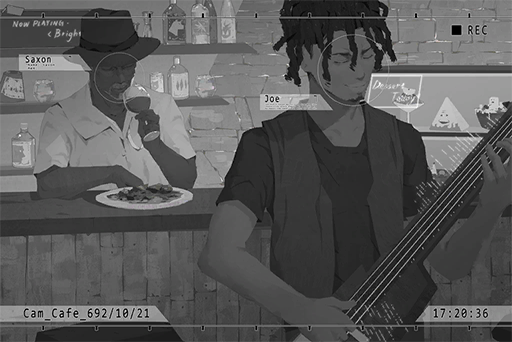

# Cam_Cafe_692_10_21
## Requirements
|Character|Level|
|---------|:---:|
|**JOE**  |  5  |

## Log Content
**Saxon** 
Not bad. Boy, you've been improving fast recently.

**JOE** 
I know that!

**Saxon** 
Keep your pride in check. Overall, your play is still too rash. You can't just ignore the tempo and play random notes...  
If you are playing in a band, the drummer is definitely going to throw drumsticks at you.

**JOE** 
But speed picking is cool!! The neat and tidy stuff is too slow for me. This is my style!

**Saxon** 
Oh, god have mercy. Please don't let other musicians know that I'm your mentor...

**JOE** 
No need to worry! Remember the web guitarist I mentioned before, Simon? His style is just like this too. 
In the entire Node 08, only I can keep up with his speed. Pretty awesome, isn't it?

**Saxon** 
Speed and Fluency are two very different entities... However, I was just like you when I was young, so who am I to judge? 
Back then, I formed a band with friends and performed at many live houses. We had quite the reputation.

**JOE** 
Another story about your band? How rare; I've only heard you talk about that for like... eight million times, I guess? 
Are you starting to get Dementia?

**Saxon** 
Then the first thing I'll forget is ever teaching a little retard like you.

**JOE** 
Hahaha.

**Saxon** 
If not for the injury to my ear, I may still be playing music now... 
Now, all I can do is teach a little retard how to play BASS... *\*Sighs\** man, how life can change.

**JOE** 
If not for the arrow I took in the knee, I am still an adventurer\~ 
Sidenote, what do you actually do in a band? Practice, perform, have s\*\*?

**Saxon** 
Mostly the first two. We also write tunes, compose songs, do audio mixings...

**JOE** 
Mostly... so you still had s\*\*?

**Saxon** 
... Once, with the lead female vocalist. Jazz music, red wine, wonderful night.

**JOE** 
WOW!

**Saxon** 
But then she had an affair with the guitarist and they both ran away. The band had to disband..

**JOE** 
Pffft! Ha, ha, HAHAHAAA! AHAHAHAHA! So even you experienced times like that. God, that is hilarious!

**Saxon** 
Laugh all you want.

**JOE** 
Ha... why the long face? Are you mad?

**Saxon** 
No. JOE, answer me seriously now. Do you have any plans to play in a band and test out the extent of your abilities?

**JOE** 
Umm...

**Saxon** 
You do have some ideas, right? Tell me about them.

**JOE** 
To be honest with you... yeah. I've been thinking about it since I heard Simon's work.

**Saxon** 
That's it. For us musicians, interacting with each other is the only way we create sparks of genius and improve ourselves even more. Shutting yourself in and practicing alone will not make you grow.

**JOE** 
Zzz……

**Saxon** 
You little... I'm serious. Give it a go. Use the skills I taught you and show those arrogant wannabe musicians what real music is like. Tell them that one does not simply play music and expect quick fame.

**JOE** 
Ok, ok. To be honest, I've already started forming the band online. 
Also what's with the "One does not simply..." thing? What have you been reading these days?

*[Signal Lost]*