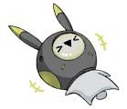

# Message_Group_693_05_25
## Requirements
|Character|Level|
|---------|:---:|
|**JOE**  |  6  |

## Unlocked Charts
|         Song         |Character|Diff.|Level|
|----------------------|:-------:|:---:|:---:|
|**Standby for Action**|   JOE   |Chaos| 12  |

## Log Content
**KAI** 
Hi, everyone, time for the band meeting 
*[Sent at PM 08:35]*

**JOE** 
Meeting time!!!
Big sis, if you're there, make a noise\~ 
*[Sent at PM 08:35]*

**Cherry** 
I am here, so shush 
*[Sent at PM 08:36]*

**KAI** 
That's rare. Big sis not the first one to respond 
*[Sent at PM 08:36]*

**Cherry** 
Was dealing with stuff late last night, didn't sleep too well 
*[Sent at PM 08:37]*

**JOE** 
Late last night!?!?
Could it be a boyfriend... >///< 
*[Sent at PM 08:37]*

**Cherry** 
... Gross 
*[Sent at PM 08:37]*

**JOE** 
 
*[Sent at PM 08:37]*

**JOE** 
OK, let's get back to the meeting XD 
*[Sent at PM 08:37]*

**KAI** 
First the band name, final decision is the one Big sis came up with, crystal punk, everyone ok with this? 
*[Sent at PM 08:38]*

**Cherry** 
Some of the letters are capitalized, it's Crystal PuNK 
*[Sent at PM 08:39]*

**KAI** 
Got it. I myself quite like this name. It has a nice ring to it 
*[Sent at PM 08:39]*

**JOE** 
How bout CRYSTAL PUNK? Looks more impactful 
*[Sent at PM 08:39]*

**Cherry** 
All Caps names are everywhere, doesn't stand out 
*[Sent at PM 08:40]*

**JOE** 
I know that XDDD I'm ok with the name\~
The most important thing is that it's a band with you guys! 
*[Sent at PM 08:40]*

**JOE** 
We are Crystal PuNK!! Our goal is the world stage!! 
*[Sent at PM 08:40]*

**Cherry** 
... If KAI's the one who said this, I would probably be really touched 
*[Sent at PM 08:41]*

**KAI** 
That's a bit much
Alright, one thing done, next thing. 
Regarding other members, any thoughts or possible candidates? 
*[Sent at PM 08:41]*

**KAI** 
I'll go first. Last time, I went on a LIVE and came across a pretty good bassist. He's pretty consistent; let's switch JOE out 
*[Sent at PM 08:42]*

**Cherry** 
Agreed 
*[Sent at PM 08:42]*

**JOE** 
Wait, WTF XDDD
What about our goal of the world stage!!!!! 
*[Sent at PM 08:42]*

**KAI** 
Who said it's going to be with you? That guy's slap is incredible 
*[Sent at PM 08:43]*

**Cherry** 
Looks like JOE you can leave in peace 
*[Sent at PM 08:43]*

**JOE** 
NOOOOOOO\~\~\~\~ 
*[Sent at PM 08:43]*

**KAI** 
Nah, just kidding. JOE, you mentioned about a guitarist you knew. Is he any good? 
*[Sent at PM 08:44]*

**JOE** 
Ah, right! I'll show you guys his solo!!
He's totally gonna be the next big thing! 
*[Sent at PM 08:44]*

**JOE** 
[JOE has shared a link.] 
*[Sent at PM 08:45]*

**Cherry** 
Holy cow... he's amazing... that's professional level stuff right there 
*[Sent at PM 08:48]*

**KAI** 
Amazing indeed. The sound is stable. The tone is smooth and clear even during shredding. How did you get to know him? 
*[Sent at PM 08:48]*

**JOE** 
I actively harassed him ofc XD
We know each other pretty well now. Should I get him in this chat? 
*[Sent at PM 08:48]*

**Cherry** 
Sure, but I have things to deal with tonight. How about tomorrow? 
*[Sent at PM 08:49]*

**KAI** 
I think tomorrow's fine too. JOE, contact him. Invite him to this chat tomorrow night and we can continue the discussion then 
*[Sent at PM 08:49]*

**JOE** 
Understood! Yes Sir, leader!!! 
*[Sent at PM 08:50]*

**KAI** 
Can someone else be the leader instead... please... 
*[Sent at PM 08:50]*

**JOE** 
 
*[Sent at PM 08:50]*