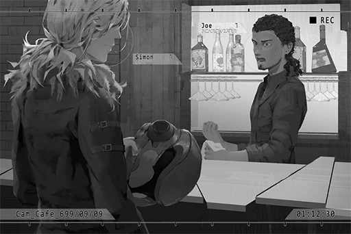

# Cam_Cafe_698_09_09
## Requirements
|Character|Level|
|---------|:---:|
|**JOE**  | 19  |

## Unlocked Charts
|          Song           |Character|Diff.|Level|
|-------------------------|:-------:|:---:|:---:|
|**Take me to the Future**|   JOE   |Easy |  3  |
|**Take me to the Future**|   JOE   |Hard |  7  |

## Log Content
*\[Doorbell\]*

**Zark** 
Arf arf! Arf!

**Xenon** 
.....

**Customer** 
Oh? An unfamiliar face... does this count as a face?

**Xenon** 
... Hello.

**Customer** 
Have a seat. The owner went to take a s\*\*\*, haha.

**Zark** 
ARF!

**JOE** 
Why the hell are you barking, stupid dog? What, a customer? Welcome, helmet guy. First time here?

**Xenon** 
JOE!?

**JOE** 
Huh? Do we know each other?

*\[Removes Helmet\]*

**Xenon** 
Do you know now?

**JOE** 
JASUS! Simon!? Why are you here!?

**Xenon** 
Just happen to pass by here. Came in out of pure curiosity.

**Customer** 
Your friend?

**JOE** 
He's the guitarist of my old band!  
I mentioned him before! Where the f\*\*\* did you disappear to though? It's been years!

**Xenon** 
Umm, it's a long story...

**JOE** 
Take a seat first. Why are you standing there? Haha.

**Xenon** 
Sure... pretty nice shop you've got here. Did you open this yourself?

**JOE** 
I inherited this shop from my uncle. 
Ah, right. You've never been here before. I did some renovation. What do you think?

**Xenon** 
It is quite nice. I was lured inside by the music and the exterior decoration.  
Of course, that suspicious sign also helped... your horrible naming sense might be the only major flop.

**JOE** 
My uncle was the one who came up with the name! He wants me to treat this shop like myself and take good care of it.

**Xenon** 
Too bad you're someone who can barely take care of yourself properly... 
Right, Zark? It's been a long time.

**Zark** 
Ruff ruff ruff... Arf!

**JOE** 
Dude, maybe he doesn't remember you at all. Be careful; he might chomp you if you touch him in the wrong place.

**Xenon** 
You're the only person he bites though?

**JOE** 
Aha, that's it! Your super sharp verbal jabs! Damn do I miss them!

**Xenon** 
Haha... Are you still playing in a band now?

**JOE** 
Never since. Not long after we disbanded, my uncle died and left me with this shop. 
I've been working my a\*\* off operating this place. I don't have the time.

**Xenon** 
I'm sorry...

**JOE** 
Nothing to be sorry about, all things from a long time ago. Bro, you have no idea how happy I am seeing you again!  
Here, order a drink! It's on me!

**Xenon** 
You know that I don't drink alcohol, right?

**JOE** 
Huhhhh? Is this how you apologize for your past actions?

**Xenon** 
... Didn't you just say there's nothing to be sorry about?

**JOE** 
Haha, I know, I know. Just make an order, soft stuff is fine too.

**Xenon** 
Soft?

**JOE** 
It means non\-alcoholic drinks.

**Xenon** 
Um, milk?

**JOE** 
Puhahaha, in the long history of this shop, this may be the first time we see "milk" on a receipt! Puhahahahaha!

**Xenon** 
... Shut up.

**JOE** 
It's probably not gonna be the last time though?

**Xenon** 
Probably.

*[Signal Lost]*
