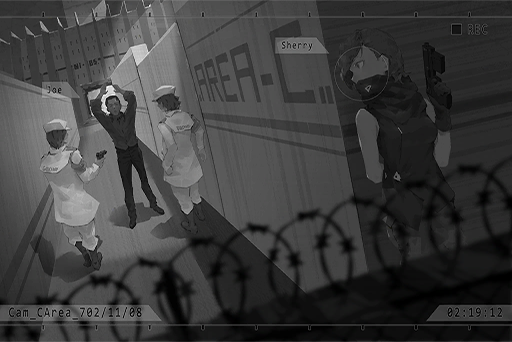

# Cam_CArea_702_11_08
## Requirements
|Character|Level|
|---------|:---:|
|**JOE**  | 31  |

## Log Content
*\[Footsteps\]*

**Cherry** 
... There is actually no one guarding the main gates. Nice job.

**JOE** 
Muhaha, of course. I've already paid off all the people R mentioned. We have a 19\-minute window, more than enough to get Simon out.

**Cherry** 
But can we really trust that shady guy? Seems like he's hiding something from us.

**JOE** 
... I can more or less guess who he is...

**Cherry** 
What did you say?

**JOE** 
Nothing. 
Speaking of which, didn't think big sis would actually accept this case... Is this really okay?  
"Famous singer trespass into restricted area." This is stuff that'll definitely make Node News Network headlines, ya know?

**Cherry** 
If it's about shooting guns, I won't fail. You, on the other hand, tagging along despite your crappy aim... Just don't forget to hide behind me.

**JOE** 
Haha, big sis is such a boss\~ No need to worry, I just have to unleash the true power of the Quadrant III gunslinger god...

**Agent A** 
Hey, did you hear that noise?

**Cherry** 
Quiet! Got company!

**JOE** 
!? Oh crap...

*[→Signal Switch]*

**Agent B** 
You're hallucinating, aren't you? Must be because you drank too much last night.

**Agent A** 
Drink my a\*\*... Hey, go take a look.

**Agent B** 
Oh, gimme a break. Having to work overtime is exhausting enough... That place is filthy. Maybe it's just a rat...

**Agent A** 
Stop whining. Go, now.

**JOE** 
... Big sis, you know the way, don't you? It's up to you now.

**Cherry** 
……！

*\[Things crashing\]*

**Agent A** 
WHO'S THERE!?

**JOE** 
Chill out, chill out\~ I'm nobody suspicious. Ahahaha!

**Agent A** 
Stop right there! Hands in the air or I'll shoot!

**JOE** 
Okay okay okay, hands in the air, got it. See\~

**Agent B** 
No weapons, safe... Huh, no civilian ID card with you? That's quite suspicious.

**Agent A** 
Hey, tell us who you are.

**JOE** 
Just your average joe\~ Really\~ a\-ver\-ge joe. I was drinking with a few friends just nearby... Haha, what is this place?

**Agent A** 
This is an area under the restriction of Node 08's Administration Bureau. It's pretty far away from the city. Why would you travel all the way here to drink?

**JOE** 
You guys don't know? There's this abandoned piece of land in the nearby factory area. There was this rumor on iM. It says that a girl committed suicide there while connected to the virtual internet. After that, at the night of the full moon, when you login to iM there, you'll see a magnificent sight of the souls of the dead being trapped in the virtual internet. All of us are major fans of supernatural phenomenons. That's why we decided to meet up and drink there. 
This is the rare opportunity for a sacred pilgrimage!

**Agent B** 
Idiot... There are like 800 different versions of that urban legend. You actually believed that crap?

**JOE** 
... Yeah, yeah... I knew I shouldn't trust that bastard so easily in the first place...

**Agent A** 
What are you mumbling?

**JOE** 
No... I was just thinking, I just accidentally passed by. I probably won't get locked up for this, right?

**Agent A** 
Who knows if you're bulls\*\*\*ing us? Before we confirm your identity, stay here and behave yourself. Hey, watch over him. Don't let him try anything funny.

**Agent B** 
... Sighs\~ What a pain in the a\*\*...

**JOE** 
Sorry 'bout that, mate. Haha... I'm thirsty. Do you have booze?

*[→Signal Switch]*

**Cherry** 
Is he going to be alright...? 
Sorry... Leave Simon up to me.

*\[Footsteps\]*

*[Signal Lost]*
