# JOE OS Logs
## List of Logs
- [Added on v1.4](#added-on-v14)
    - [OS Log #001](#os-log-001)
    - [OS Log #002](#os-log-002)
    - [OS Log #003](#os-log-003)
    - [OS Log #004](#os-log-004)
    - [OS Log #005](#os-log-005)
    - [OS Log #006](#os-log-006)
    - [OS Log #007](#os-log-007)
    - [OS Log #008](#os-log-008)
    - [OS Log #009](#os-log-009)
    - [OS Log #010](#os-log-010)
    - [OS Log #011](#os-log-011)
    - [OS Log #012](#os-log-012)
    - [OS Log #013](#os-log-013)
    - [OS Log #014](#os-log-014)
    - [OS Log #015](#os-log-015)
    - [OS Log #016](#os-log-016)
    - [OS Log #017](#os-log-017)
    - [OS Log #018](#os-log-018)
    - [OS Log #019](#os-log-019)
    - [OS Log #020](#os-log-020)
    - [OS Log #021](#os-log-021)
    - [OS Log #022](#os-log-022)
    - [OS Log #023](#os-log-023)
    - [OS Log #024](#os-log-024)
    - [OS Log #025](#os-log-025)
    - [OS Log #026](#os-log-026)
    - [OS Log #027](#os-log-027)
    - [OS Log #028](#os-log-028)
    - [OS Log #029](#os-log-029)
- [Added on v1.6](#added-on-v16)
    - [OS Log #030](#os-log-030)
    - [OS Log #031](#os-log-031)
- [Added on v1.8](#added-on-v18)
    - [OS Log #032](#os-log-032)
- [Added on v1.9](#added-on-v19)
    - [OS Log #033](#os-log-033)
- [Added on v2.0](#added-on-v20)
    - [OS Log #034](#os-log-034)
- [Added on v2.1](#added-on-v21)
    - [OS Log #035](#os-log-035)
- [Added on v2.2](#added-on-v22)
    - [OS Log #036](#os-log-036)
- [Added on v2.3](#added-on-v23)
    - [OS Log #037](#os-log-037)
- [Added on v2.4](#added-on-v24)
    - [OS Log #038](#os-log-038)
    - [OS Log #039](#os-log-039)
- [Added on v2.8](#added-on-v28)
    - [OS Log #040](#os-log-040)
    - [OS Log #041](#os-log-041)
- [Added on v2.9](#added-on-v29)
    - [OS Log #042](#os-log-042)

## Added on v1.4

### OS Log #001
___

[Back to Top](#list-of-logs) | [Next Log](#os-log-002)

#### Unlocked Charts
|    Song    |Char.|Diff.|Lv.|
|------------|:---:|:---:|:-:|
|**Childish**| JOE |Easy | 4 |
|**Childish**| JOE |Hard | 7 |
|**Childish**| JOE |Chaos|12 |

#### Cam\_Cafe\_684\_08\_28
**JOE**  
Look! I have everything set up!

**Saxon**  
Alright, set up the music stand here...

**JOE**  
No need for that! Yours truly here have memorized the entire thing already!

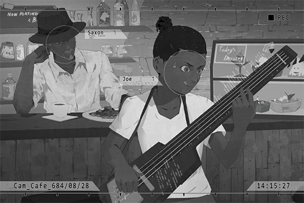

**Saxon**  
You're way too young to be calling yourself "yours truly"... alright then, let's begin.

**JOE**  
No probs!

_\[»»» Fast Forward »»»\]_

**JOE**  
Ehhh... do this here...

**Saxon**  
Seems a bit different from what I taught you?

**JOE**  
Ah, it's this string...

_\[»»» Fast Forward »»»\]_

**JOE**  
Uhhhh...

**Saxon**  
Your fingering is off. I'll teach you one more time...

**JOE**  
Nah pops, I got this!

**Saxon**  
... Then try again.

_\[»»» Fast Forward »»»\]_

**Saxon**  
That's right, just like this. Don't stop, keep going.

_\[»»» Fast Forward »»»\]_

**Saxon**  
Your fingers are too stiff. Don't forget: sway your body, feel the music.

_\[»»» Fast Forward »»»\]_

**JOE**  
Hehe, hehehehe...

**Saxon**  
Yes, smile. Music is like good wine. You need to enjoy it with ease and to the fullest. Only then can you truly perform music with soul.

_\[»»» Fast Forward »»»\]_

**JOE**  
Whew, I finished! Yeah!

**Saxon**  
Not bad. However, your pinky finger is not flexible enough. Are you doing your scale exercises properly? That's the most basic skill, you must practice it every day.

**JOE**  
Of course I did\~ You never believe me, even though I'm such a good boy!

**Saxon**  
I will believe you once you show me some results. One more time?

**JOE**  
Again? How about you have a go!

**Saxon**  
For what? You're the one who's learning how to play BASS.

**JOE**  
If you don't practice, I will be as good as you in no time. Then you will have nothing to teach me!

**Saxon**  
Hoho... you really think you can catch up with the BASS god of Quadrant III...

**JOE**  
If you're really that godly, then show me! Come on, come on...

**Saxon**  
... Alright; give me the BASS. I'll show you a glimpse of a true master at work.

**JOE**  
YEAH! Love ya so much, pops! Here, now hurry!

_\[Signal Lost\]_

[Back to Top](#list-of-logs) | [Next Log](#os-log-002)

### OS Log #002
___

[Last Log](#os-log-001) | [Back to Top](#list-of-logs) | [Next Log](#os-log-003)

#### Cam\_Cafe\_687\_02\_27
**JOE**  
Look over there. It's that dog.

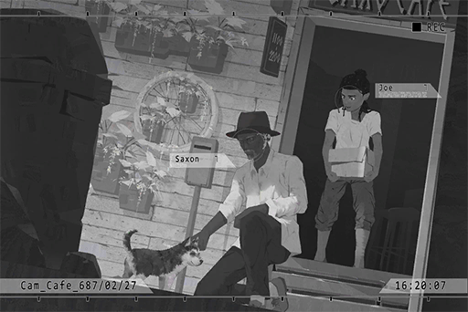

**Saxon**  
Still very much a puppy though, probably no more than a few months old.

**JOE**  
It's been around here a lot lately. It keeps digging around in the trash cans and making a huge mess, super annoying. Chase it away!

**Saxon**  
... It's only looking for food, no need to go that far. When you were digging around in the shop's fridge, I didn't say anything too.

**JOE**  
Hey! Why are you comparing me to a dog!

**Saxon**  
Give me the bone in the bag.

**JOE**  
You even prepared such a thing? Here, take it.

**Puppy**  
Arf! Arf!

**Saxon**  
No need to be scared... This is all yours, dig in.

**Puppy**  
Arf... arf.

**JOE**  
It's enjoying that bone way too much... ok, it doesn't look THAT annoying right now.

**Puppy**  
Arooo\~ ARF!

**JOE**  
Yikes! This stupid dog bit me! Forget it; we should chase it away!

**Saxon**  
The way you touched it was wrong.

**JOE**  
BullS\*\*\*!

**Saxon**  
... Give it a name.

**JOE**  
Name? For what?

**Saxon**  
I'm going to raise him as a guard dog.

**JOE**  
Huh? You serious?

**Saxon**  
Yes.

**JOE**  
Okay, okay... lemme think... how about Cerberus?

**Saxon**  
Cer... what is that?

**JOE**  
Cerberus, something I learned in school. Have you not heard about it? It's a creature from Old Age myths. Apparently, it's a giant dog with three heads. Sounds really cool.

**Saxon**  
I've never even finished school. No good, too hard to remember, not to mention that it doesn't have three heads.

**JOE**  
... Yeah, you have a point.

**Saxon**  
Let's call him Zark. It's the name of an old friend. Ah... it is male, right?

**JOE**  
Look at that "thing", you see that? Definitely male.

**Saxon**  
Good. Remember to come and take care of him from now on.

**JOE**  
Me? No freakin way! That sounds like a terrible chore!

**Saxon**  
The decision is already made. Zark, let's go back.

**Zark**  
Arf! Arf!

**JOE**  
Stupid dog...

_\[Signal Lost\]_

[Last Log](#os-log-001) | [Back to Top](#list-of-logs) | [Next Log](#os-log-003)

### OS Log #003
___

[Last Log](#os-log-002) | [Back to Top](#list-of-logs) | [Next Log](#os-log-004)

#### Requirements
| Char. |Lv.|Lv. Locked?|
|-------|:-:|:---------:|
|**JOE**| 2 |    No     |

#### Audio\_Cafe\_690\_01\_13
_\[Doorbell\]_

**JOE**  
Hi, pops!

**Saxon**  
Be quiet. Zark is sleeping.

**JOE**  
You still haven't dump him yet? He's a pretty terrible guard dog if you ask me...  
Maybe I should wake him up with the noise of my practice? Hey, I came up with this really awesome move yesterday!

**Saxon**  
Practice by your self first. I've got work coming in very soon. We'll discuss about it later today.

**JOE**  
That type of work again?

**Saxon**  
Urgent case. Customer here to collect the packages.

**JOE**  
Okay, okay. whatever. You're not going to tell me more details anyway, even if I asked you.

**Saxon**  
... Interested in my work?

**JOE**  
Uh\-huh, a little bit. These "mysterious underground dealings" stuff seems quite fun.

**Saxon**  
If you keep treating "fun" as your top priority, it will come back to bite you someday.

**Saxon**  
To be fair, the customer ordered quite a bit of stuff this time. It's going to be tough if I carry it all by myself. What do you think, you want to help me carry this stuff?

**JOE**  
Hoho? Did someone hit you in the head? You want me, of all people, to help out?

**Saxon**  
You're all brawn and no brains anyway. Physical work should be right up your ally.

**JOE**  
Stinkin old man...Then what do I gain from this?

**Saxon**  
What you gain is that I will not tell your mother about the trouble you caused at school.

**JOE**  
EHHH! That's not fair...

**Saxon**  
Come, I'll pay you accordingly. It's about time you learn a little bit about where money comes from anyway.

**JOE**  
Cargobob no.1, JOE! At your service!

**JOE**  
Since you're getting me to help out, can you now tell me who these customers are, and what they are buying?

**Saxon**  
You're not a grown\-up yet, no need to rush. Wait till the day I pour you your first glass of booze, then we can talk about it.

**JOE**  
Alright, alright, you stingy old man.

**Saxon**  
Finish your drink quickly. Once you're done washing the cup, come find me in the basement.

_\[Signal Lost\]_

[Last Log](#os-log-002) | [Back to Top](#list-of-logs) | [Next Log](#os-log-004)

### OS Log #004
___

[Last Log](#os-log-003) | [Back to Top](#list-of-logs) | [Next Log](#os-log-005)

#### Requirements
| Char. |Lv.|Lv. Locked?|
|-------|:-:|:---------:|
|**JOE**| 3 |    No     |

#### Unlocked Charts
|         Song         |Char.|Diff.|Lv.|
|----------------------|:---:|:---:|:-:|
|**Standby for Action**| JOE |Easy | 4 |

#### Audio\_Cafe\_691\_08\_12
_\[Doorbell\]_

**Saxon**  
So you're here?

**JOE**  
We're talking about money, of course I'm here! What are we carrying this time?

**Saxon**  
No need to rush now.  
Here, have a drink.

**JOE**  
... Milk?

**Saxon**  
What? You want booze? Wait another year, you lil' brat.  
... It's been several months since you started helping me, right?

**JOE**  
Woah, serious talk isn't it... I guess so.

**Saxon**  
You've made yourself a decent fortune these days. You should understand what this "work" is all about now.

**JOE**  
I know, I know. Contact sellers for the customers, look over the products for them, then wait for them to come pick it up.

**Saxon**  
More or less. Those products are not illegal but are hard to obtain. The customers' identities are also rather obscure. That's why my social network is required in these transactions.

**JOE**  
No wonder they are super respectful of you.

**Saxon**  
Sort of. Besides transactions, I sometimes provide other assistances. For example, leading customers to specific locations.

**JOE**  
So basically a tour guide. Why don't they go there themselves?

**Saxon**  
Because they don't know how... in fact, most of the customers come from Node 03.

**JOE**  
That really messed up place? Your social network really is wide and expansive.

**Saxon**  
.... Being naive is not a bad thing. Here, take this paper.

**Zark**  
Arf\-arf! Arf\-arf!

**JOE**  
Hey Zark! Knock it off, don't bite it... what is this, an address?

**Saxon**  
When the customers arrive in a minute, you help me lead the way. Escort everyone to the location on the paper. Once they reached the location, you come back to me, I pay you the money. Simple enough?

**JOE**  
Are you treating me like a guide dog? I feel like this is a job for Zark...

**Saxon**  
I will pay you double.

**JOE**  
I'm going to wait for the customers outside!

**Saxon**  
What's with the hurry? Finish your milk before you go!

**JOE**  
Give it to Zark! Only idiots drink milk in a bar!

_\[Doorbell\]_

**Saxon**  
You little brat... Zark's gonna get diarrhea if you give him this stuff.

**Zark**  
Arf?

_\[Signal Lost\]_

[Last Log](#os-log-003) | [Back to Top](#list-of-logs) | [Next Log](#os-log-005)

### OS Log #005
___

[Last Log](#os-log-004) | [Back to Top](#list-of-logs) | [Next Log](#os-log-006)

#### Requirements
| Char. |Lv.|Lv. Locked?|
|-------|:-:|:---------:|
|**JOE**| 3 |    No     |

#### Cam\_124St\_691\_08\_12
**Wang**  
Good... I dare you to repeat that s\*\*\* again!

**Fang**  
Idiot, your lack of brains is why you've been stuck in your position all these years.

**JOE**  
Eheheh, what the heck is going on?  
Wasn't everything fine beforehand? How come I went to take a p\*\*\* and now you two are trying to bash each other's head in?

**Fang**  
None of your business, now get out of the way.

**Wang**  
Hey, you. Take that out.

**Crew Member**  
Eh? Are we using it here?

**Fang**  
Ha! That's why I said you lack brains! Did you even think about the consequences of using cargo for private purposes!?

**Wang**  
Shut your damn mouth. I'll blow your sorry a\*\* to kingdom come, then say it was a trigger accident.

**Fang**  
I advise you to shut up before I send one right through that blockhead of yours...

**JOE**  
THE FIRSSSTTT\~\~\~\~ EVARRRRR\~\~\~\~ GUNSLINGER SHOWDOWN!!!!

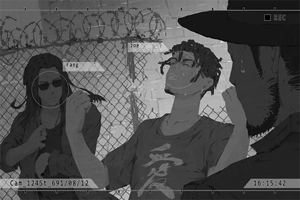

**Fang、Wang、Crew Member**  
……！？

**JOE**  
Everybody's connected to the internet, right? Gimme a sec, I'll set up the room.

**Wang**  
... What are you talking about?

**JOE**  
Done! Let's see... 1 vs 1 Deathmatch between you two, select.

**Fang**  
Woah! A gun appeared...

**Wang**  
What the heck are these?

**JOE**  
You guys don't know? This is an AR shooter that's all the rage on cyTus these days. First one to 50 kills wins.

**Wang**  
Hey! You really think a child's game like this can...

**[Game notification]**  
_Headshot! First Blood!_

**Fang**  
Ahahaha! Holy S\*\*\*! His head exploded! The effects are sick!

**Wang**  
OWW!

**JOE**  
Capo Wang, even though it's a game, it hurts like s\*\*\* when you get hit.  
I've cranked up the immersion to max. If you get hit consecutively, you're gonna faint from the pain.

**Wang**  
Hmph! Nonsense!

**[Game notification]**  
_Headshot!_

**Fang**  
That's two points for me. If I win, you better shut your damn mouth for now on.

**Wang**  
F\*\*\* you! Die! Die, you son of a b\*\*\*\*!!!

**Crew Member**  
T... they really started playing...

**JOE**  
Hey! I've added all you guys to the observer mode. Come, place your bets! Press the UI on your arm and the choices will appear. I accept both C coins and cash! But, I will take 15 percent commission.

**Crew Member**  
Hey, this seems quite interesting... 10 grand for capo Wang!

**Crew Member**  
20 grand for capo Fang!

**Crew Member**  
20 grand for capo Wang!

**Fang**  
Hey, you bastards! I'm in the lead; why is everyone placing bets on Wang?

**JOE**  
His odds are higher. If he wins in the end, those who bet on him will get a boatload of money.

**Fang**  
HA! Interesting!

**JOE**  
Hoho\~ this way, we keep the cargo intact, nobody gets hurt, and I make some quick dough.  
Haha! I'm such a genius!

_\[Signal Lost\]_

[Last Log](#os-log-004) | [Back to Top](#list-of-logs) | [Next Log](#os-log-006)

### OS Log #006
___

[Last Log](#os-log-005) | [Back to Top](#list-of-logs) | [Next Log](#os-log-007)

#### Requirements
| Char. |Lv.|Lv. Locked?|
|-------|:-:|:---------:|
|**JOE**| 4 |    No     |

#### Unlocked Charts
|         Song         |Char.|Diff.|Lv.|
|----------------------|:---:|:---:|:-:|
|**Standby for Action**| JOE |Hard | 8 |

#### Audio\_Cafe\_691\_08\_15
_\[Doorbell\]_

**Zark**  
Arf!

**Luo**  
It's been quite a while, UNCLE. Been in your care for quite some time now.

**Saxon**  
Oh, it's you! Haven't seen you in a long time. Must be tough managing an entire gang, right? Martini?

**Luo**  
No, just here to open my wine collection and have a chat. How are you doing these days?

**Saxon**  
Business is booming. Thanks to "R", I recently got access to a brand\-new group of customers.

**Luo**  
R... the information broker you mentioned before?

**Saxon**  
Yes. His purchases mostly feature obscure documents, be it about history, ancient technology, information on other Nodes... all rare and exquisite stuff. Also, I've seen this guy do business myself; not your average joe.

**Luo**  
How so?

**Saxon**  
He is well educated and very intelligent. It's very obvious that he is vastly different than the other thugs who come here to trade for information. I often see him play his informant like a fiddle.

**Luo**  
Sounds like a dangerous folk... you should be careful yourself too.

**Saxon**  
Hmph, no need to worry\~ He is good enough to earn my praise, but not enough to truly impress me. He has a clear understanding of the rules here, and he never buys on credit too.

**Luo**  
So he has a good credit score just like me.

**Saxon**  
Indeed. Over here at my place, "Credit is everything".   
Cheers?

**Luo**  
Of course.

_\[Cheers\]_

**Luo**  
Ah, right. During the last trade, some crew members got into a fight and things nearly got out of hand. It was your boy who came in and calmed everyone down. I have to thank you for that.

**Saxon**  
You mean... JOE?

**Luo**  
You've never heard about it?

**Saxon**  
He didn't mention anything about this to me. What happened?

**Luo**  
Well, it's like this...

_\[»»» Fast Forward »»»\]_

**Luo**  
Those two love to compete with each other, too much actually. Sometimes the mood in the gang just gets really awkward when those two are at it. Even I was having a little trouble dealing with them...  
Since JOE introduced them to the game, now they handle most of their clashes through that game. Thanks to that, the other gang members can also treat their competition with a more relaxed manner.

**Saxon**  
Is that so...

**Luo**  
Pretty good job by that kid, don't you think? I expect no less from your protégé.

**Saxon**  
The only thing he cared about is the money. Don't you dare think about dragging him into your world.

**Luo**  
You're still as sharp as always. Don't worry, I won't.  
Even though it is a pity...

**Saxon**  
A pity... is it?

**Luo**  
Yeah. From what I see, he's a kid with quite the potential.

**Saxon**  
......

**Luo**  
Woah, so it's this time already. Thanks for the drink. I have to go.

**Saxon**  
Alright. See you next time.

_\[Doorbell\]_

**Saxon**  
... Potential, eh? Not that I could see any.

**Saxon**  
Ah! Ugh...

_\[Glass Shatters\]_

**Saxon**  
_\*Huff\*_, _\*Puff\*_... My chest...

**Saxon**  
_\*Huff\*_...... _\*Puff\*_...... Damnit, what's going on...

**Zark**  
Arf, arf!, ARF!

**Saxon**  
No need to worry, Zark... I'm ok.

_\[Signal Lost\]_

[Last Log](#os-log-005) | [Back to Top](#list-of-logs) | [Next Log](#os-log-007)

### OS Log #007
___

[Last Log](#os-log-006) | [Back to Top](#list-of-logs) | [Next Log](#os-log-008)

#### Requirements
| Char. |Lv.|Lv. Locked?|
|-------|:-:|:---------:|
|**JOE**| 5 |    No     |

#### Cam\_Cafe\_692\_10\_21
**Saxon**  
Not bad. Boy, you've been improving fast recently.

**JOE**  
I know that!

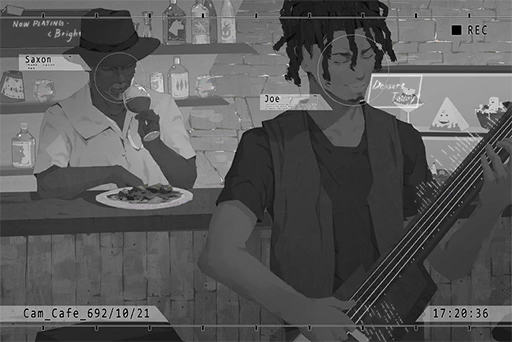

**Saxon**  
Keep your pride in check. Overall, your play is still too rash. You can't just ignore the tempo and play random notes...   
If you are playing in a band, the drummer is definitely going to throw drumsticks at you.

**JOE**  
But speed picking is cool!! The neat and tidy stuff is too slow for me. This is my style!

**Saxon**  
Oh, god have mercy. Please don't let other musicians know that I'm your mentor...

**JOE**  
No need to worry! Remember the web guitarist I mentioned before, Simon? His style is just like this too.  
In the entire Node 08, only I can keep up with his speed. Pretty awesome, isn't it?

**Saxon**  
Speed and Fluency are two very different entities... However, I was just like you when I was young, so who am I to judge?  
Back then, I formed a band with friends and performed at many live houses. We had quite the reputation.

**JOE**  
Another story about your band? How rare; I've only heard you talk about that for like... eight million times, I guess?  
Are you starting to get Dementia?

**Saxon**  
Then the first thing I'll forget is ever teaching a little retard like you.

**JOE**  
Hahaha.

**Saxon**  
If not for the injury to my ear, I may still be playing music now...  
Now, all I can do is teach a little retard how to play BASS... _\*Sighs\*_ man, how life can change.

**JOE**  
If not for the arrow I took in the knee, I am still an adventurer\~  
Sidenote, what do you actually do in a band? Practice, perform, have s\*\*?

**Saxon**  
Mostly the first two. We also write tunes, compose songs, do audio mixings...

**JOE**  
Mostly... so you still had s\*\*?

**Saxon**  
... Once, with the lead female vocalist. Jazz music, red wine, wonderful night.

**JOE**  
WOW!

**Saxon**  
But then she had an affair with the guitarist and they both ran away. The band had to disband..

**JOE**  
Pffft! Ha, ha, HAHAHAAA! AHAHAHAHA! So even you experienced times like that. God, that is hilarious!

**Saxon**  
Laugh all you want.

**JOE**  
Ha... why the long face? Are you mad?

**Saxon**  
No. JOE, answer me seriously now. Do you have any plans to play in a band and test out the extent of your abilities?

**JOE**  
Umm...

**Saxon**  
You do have some ideas, right? Tell me about them.

**JOE**  
To be honest with you... yeah. I've been thinking about it since I heard Simon's work.

**Saxon**  
That's it. For us musicians, interacting with each other is the only way we create sparks of genius and improve ourselves even more. Shutting yourself in and practicing alone will not make you grow.

**JOE**  
Zzz……

**Saxon**  
You little... I'm serious. Give it a go. Use the skills I taught you and show those arrogant wannabe musicians what real music is like. Tell them that one does not simply play music and expect quick fame.

**JOE**  
Ok, ok. To be honest, I've already started forming the band online.  
Also what's with the "One does not simply..." thing? What have you been reading these days?

_\[Signal Lost\]_

[Last Log](#os-log-006) | [Back to Top](#list-of-logs) | [Next Log](#os-log-008)

### OS Log #008
___

[Last Log](#os-log-007) | [Back to Top](#list-of-logs) | [Next Log](#os-log-009)

#### Requirements
| Char. |Lv.|Lv. Locked?|
|-------|:-:|:---------:|
|**JOE**| 6 |    No     |

#### Unlocked Charts
|         Song         |Char.|Diff.|Lv.|
|----------------------|:---:|:---:|:-:|
|**Standby for Action**| JOE |Chaos|12 |

#### Message\_Group\_693\_05\_25
**KAI**  
Hi, everyone, time for the band meeting  
_[Sent at 08:35 PM]_

**JOE**  
Meeting time!!!  
Big sis, if you're there, make a noise\~  
_[Sent at 08:35 PM]_

**Cherry**  
I am here, so shush  
_[Sent at 08:36 PM]_

**KAI**  
That's rare. Big sis not the first one to respond  
_[Sent at 08:36 PM]_

**Cherry**  
Was dealing with stuff late last night, didn't sleep too well  
_[Sent at 08:37 PM]_

**JOE**  
Late last night!?!?  
Could it be a boyfriend... >///<  
_[Sent at 08:37 PM]_

**Cherry**  
... Gross  
_[Sent at 08:37 PM]_

**JOE**  
  
_[Sent at 08:37 PM]_

**JOE**  
OK, let's get back to the meeting XD  
_[Sent at 08:37 PM]_

**KAI**  
First the band name, final decision is the one Big sis came up with, crystal punk, everyone ok with this?  
_[Sent at 08:38 PM]_

**Cherry**  
Some of the letters are capitalized, it's Crystal PuNK  
_[Sent at 08:39 PM]_

**KAI**  
Got it. I myself quite like this name. It has a nice ring to it  
_[Sent at 08:39 PM]_

**JOE**  
How bout CRYSTAL PUNK? Looks more impactful  
_[Sent at 08:39 PM]_

**Cherry**  
All Caps names are everywhere, doesn't stand out  
_[Sent at 08:40 PM]_

**JOE**  
I know that XDDD I'm ok with the name\~  
The most important thing is that it's a band with you guys!  
_[Sent at 08:40 PM]_

**JOE**  
We are Crystal PuNK!! Our goal is the world stage!!  
_[Sent at 08:40 PM]_

**Cherry**  
... If KAI's the one who said this, I would probably be really touched  
_[Sent at 08:41 PM]_

**KAI**  
That's a bit much  
Alright, one thing done, next thing.   
Regarding other members, any thoughts or possible candidates?  
_[Sent at 08:41 PM]_

**KAI**  
I'll go first. Last time, I went on a LIVE and came across a pretty good bassist. He's pretty consistent; let's switch JOE out  
_[Sent at 08:42 PM]_

**Cherry**  
Agreed  
_[Sent at 08:42 PM]_

**JOE**  
Wait, WTF XDDD  
What about our goal of the world stage!!!!!  
_[Sent at 08:42 PM]_

**KAI**  
Who said it's going to be with you? That guy's slap is incredible  
_[Sent at 08:43 PM]_

**Cherry**  
Looks like JOE you can leave in peace  
_[Sent at 08:43 PM]_

**JOE**  
NOOOOOOO\~\~\~\~  
_[Sent at 08:43 PM]_

**KAI**  
Nah, just kidding. JOE, you mentioned about a guitarist you knew. Is he any good?  
_[Sent at 08:44 PM]_

**JOE**  
Ah, right! I'll show you guys his solo!!  
He's totally gonna be the next big thing!  
_[Sent at 08:44 PM]_

**JOE**  
\[JOE has shared a link.\]  
_[Sent at 08:45 PM]_

**Cherry**  
Holy cow... he's amazing... that's professional level stuff right there  
_[Sent at 08:48 PM]_

**KAI**  
Amazing indeed. The sound is stable. The tone is smooth and clear even during shredding. How did you get to know him?  
_[Sent at 08:48 PM]_

**JOE**  
I actively harassed him ofc XD  
We know each other pretty well now. Should I get him in this chat?  
_[Sent at 08:48 PM]_

**Cherry**  
Sure, but I have things to deal with tonight. How about tomorrow?  
_[Sent at 08:49 PM]_

**KAI**  
I think tomorrow's fine too. JOE, contact him. Invite him to this chat tomorrow night and we can continue the discussion then  
_[Sent at 08:49 PM]_

**JOE**  
Understood! Yes Sir, leader!!!  
_[Sent at 08:50 PM]_

**KAI**  
Can someone else be the leader instead... please...  
_[Sent at 08:50 PM]_

**JOE**  
  
_[Sent at 08:50 PM]_

[Last Log](#os-log-007) | [Back to Top](#list-of-logs) | [Next Log](#os-log-009)

### OS Log #009
___

[Last Log](#os-log-008) | [Back to Top](#list-of-logs) | [Next Log](#os-log-010)

#### Requirements
| Char. |Lv.|Lv. Locked?|
|-------|:-:|:---------:|
|**JOE**| 7 |    No     |

#### Cam\_Velvet\_693\_08\_28
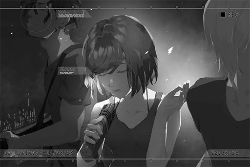

_\[Crowd screams and applauds\]_

**Cherry**  
That was《CREDENCE》! Thank you, everybody!

**Cherry**  
Didn't expect so many people to show up today... Everyone's so passionate! Give yourselves a large round of applause!

**Cherry**  
Good... For our next song, it is written by the bassist of Crystal PuNK, JOE... hey JOE, you introduce it yourself.

**JOE**  
You serious? Can I hold the mic?

**Cherry**  
Hurry up.

**JOE**  
Ehe, hehehe, um, hello everyone. I'm JOE... Oh god, I'm so nervous. Umm, the, um, next song is...

**Cherry**  
Why are you stammering! Stopping faking it! Your acting sucks!

**JOE**  
OWWW!

_\[Crowd laughs\]_

**JOE**  
We agreed on not to hit the hair! Alright, hello guys! I'm Crystal PuNK's bassist JOE!

_\[Crowd screams\]_

**JOE**  
Those who have followed us must know this. WHO AM I??

**Audience**  
THE BASS GOD OF QUADRANT III!

**JOE**  
Good, very good! Everyone's being nice today! To be fair, my BASS was taught by my uncle. I call him pops. Pops loves Jazz music, so much so that he opened a Jazz bar. The shop's name is SAXO Café. If you happen to pass by, we welcome you to come in and have a drink...

**Xenon**  
Hey, time is running out.

_\[Crowd screams\]_

**JOE**  
Wait, what are you guys screaming for? Damn you Xenon, you and your good looks...

**Xenon**  
Another word and you get drumsticks to the face.

**JOE**  
You're not even the drummer... ok, ok. All in all, I wrote a song with a bit of Jazz flavor in it. It's slightly different from our previous style. I hope...

**JOE**  
……！！

**JOE**  
……Pops?

**Xenon**  
What's the matter?

**JOE**  
Umm, nothing... I hope everyone likes it!

_\[Crowd screams and applauds\]_

_\[Signal Lost\]_

[Last Log](#os-log-008) | [Back to Top](#list-of-logs) | [Next Log](#os-log-010)

### OS Log #010
___

[Last Log](#os-log-009) | [Back to Top](#list-of-logs) | [Next Log](#os-log-011)

#### Requirements
| Char. |Lv.|Lv. Locked?|
|-------|:-:|:---------:|
|**JOE**| 8 |    No     |

#### Cam\_Velvet\_693\_08\_28
**Saxon**  
JOE.

**JOE**  
So it was you! How come you didn't tell me that you're coming!

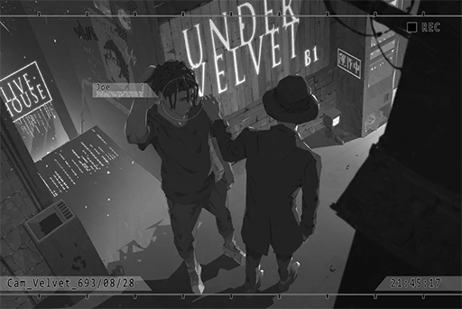

**Saxon**  
Didn't want to give you pressure.  
The performance was good. The song you wrote was great.

**JOE**  
Hahaha! Thanks! Just like you said; the feeling is so awesome!

**Saxon**  
The crowd is so packed that it reached the exit. The ticket sales must be pretty good, right?

**JOE**  
Super good! If we calculate based on the rent this time, the profit alone is more than enough to hold two more sessions. Did you have a crowd this big when you're performing?

**Saxon**  
We didn't even have a Live House the size of Under Velvet back then.

**JOE**  
Hahaha... If we can keep this up, a few more sessions and I will have enough for a brand\-new effects unit. Pops, are you interested in sponsoring me?

**Saxon**  
We'll see about it. Set aside the money stuff, how does it feel performing on stage?

**JOE**  
It was SOOO amazing! Even though I screwed up a lot haha.

**Saxon**  
Can't help it. You can practice your skills anywhere, but the cheering and attention you received from the audience is something you can't experience at home.

**JOE**  
Indeed. Man, what should I do now; I want to perform again right now!

**Saxon**  
No need to worry. From what your band showcased today, it won't be a long time. Trust me; this is a prophecy from the true BASS god of Quadrant III.

**JOE**  
Woah, why are your words so kind today... feels creepy. Thanks a lot for coming though! Is everything ok back at the bar?

**Saxon**  
I closed it to come to hear your performance. However, have work later tonight. I have to go.

**JOE**  
Then I'll collect my stuff and go back with you too...

**Saxon**  
No need for that. You guys still have to celebrate and discuss your performance, right? Don't waste your time on an old man like me.

**Saxon**  
Remember... enjoy these times as much as you can.

**JOE**  
Huh?

**Saxon**  
Listen, when I look at you, I see my younger self. In the future, you will begin to shoulder more responsibility... Cherish these experiences right now, as they will be a memory you recall when that time comes.

**JOE**  
What the... why are you telling me this now?

**Saxon**  
Nothing. Remember to call your mother if you're going to stay out late at night. I'll be leaving now.

**JOE**  
Got it. See ya pops!

_\[Signal Lost\]_

[Last Log](#os-log-009) | [Back to Top](#list-of-logs) | [Next Log](#os-log-011)

### OS Log #011
___

[Last Log](#os-log-010) | [Back to Top](#list-of-logs) | [Next Log](#os-log-012)

#### Requirements
| Char. |Lv.|Lv. Locked?|
|-------|:-:|:---------:|
|**JOE**| 9 |    No     |

#### Unlocked Charts
|      Song       |Char.|Diff.|Lv.|
|-----------------|:---:|:---:|:-:|
|**Open the Game**| JOE |Easy | 4 |

#### Image\_Hotpot\_693\_09\_01
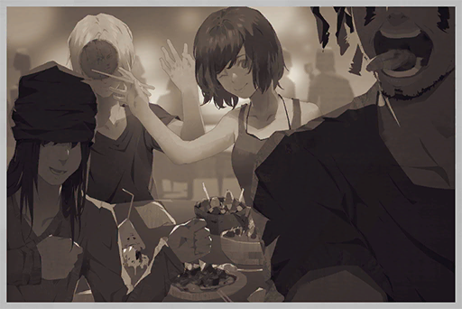

Date: 693/09/01  
Location: Node 08 \- Hot Pot Restaurant

[Last Log](#os-log-010) | [Back to Top](#list-of-logs) | [Next Log](#os-log-012)

### OS Log #012
___

[Last Log](#os-log-011) | [Back to Top](#list-of-logs) | [Next Log](#os-log-013)

#### Requirements
| Char. |Lv.|Lv. Locked?|
|-------|:-:|:---------:|
|**JOE**|10 |    No     |

#### Audio\_Cafe\_694\_04\_27
**JOE**  
Hello, I'm JOE...

**Angus**  
I know who you are. Is the cargo here yet?

**JOE**  
Um, not yet... Ah! It's that truck, right?

**Hunter**  
Capo, I've got the cargo. So you're JOE? Open the basement gate; we'll get the cargo down there right away.

**JOE**  
Got it! No probs!

**Angus**  
Any issues?

**Hunter**  
Nothing. Everything went very smoothly.

**Angus**  
Open it. I want to check.

_\[Back door opens\]_

**Hunter**  
......

**Angus**  
Hey, why is there so much dirt underneath here?

**Hunter**  
Huh? Oh... the air conditioning in the car broke down on the way, so I opened the windows. Maybe that's why...

**Angus**  
... Open the crate.

**Hunter**  
Umm... the buyer specifically told us that we are not allowed to look inside before...

**Angus**  
I said open the damn crate! I'm going to check what's inside. If you let me repeat one more time, I'll use your ear as an ashtray.

_\[Unlocks crate\]_

**Angus**  
... Hey, what the heck is this all about?

**Hunter**  
Umm... I'm so sorry! The fact is, we ran into a little accident on the way here. But I can promise, the cargo was not damaged! It just got a little bit of smudge on it!   
It's true! I swear!

**Angus**  
Uh\-huh, I get it.

**Hunter**  
......

**Angus**  
You can close it now.

**Hunter**  
Ummm... O, okay.

_\[Punch\]_

**Hunter**  
Blargh! Ughhhh...

**JOE**  
HOLY!

**Angus**  
......

_\[Punch\]_

**Hunter**  
Awk! Capo, I'm sorry...

**Angus**  
Hmm? Why are you apologizing?

_\[Punch\]_

**Hunter**  
I damaged the cargo! I damaged the cargo!

**Angus**  
Hmm? Didn't you say that it was not damaged? I also think it just got a little bit of smudge on it, just like your f\*\*\*\*\* face!

_\[Punch\]_

**JOE**  
Hey! Are you trying to beat him to death?

**Angus**  
Is the gate opened yet?

**JOE**  
It is opened. Umm...

**Angus**  
Then shut up. Another noise from you and your face will look like his.

**Angus**  
Mad Dog, be grateful that I can cover up your s\*\*\* this time with just a few punches. If you dare to have this attitude again on the next delivery, Diego will deal with you himself; and he's not exactly a kind soul like me. Capiche?

**Hunter**  
Yes...

**JOE**  
......

**Angus**  
Hey, s\*\*\*head, leave this piece of trash here. You watch over the cargo with every f\*\*\*\*\* thing you have. I'll go get the buyer now. Before that, clean up the cargo so that it looks good as new.   
Also, about the accident this idiot here caused, no leaks to anyone, get it?

**JOE**  
What accident?

**Angus**  
Smart kid.

_\[Signal Lost\]_

[Last Log](#os-log-011) | [Back to Top](#list-of-logs) | [Next Log](#os-log-013)

### OS Log #013
___

[Last Log](#os-log-012) | [Back to Top](#list-of-logs) | [Next Log](#os-log-014)

#### Requirements
| Char. |Lv.|Lv. Locked?|
|-------|:-:|:---------:|
|**JOE**|10 |    No     |

#### Unlocked Charts
|      Song       |Char.|Diff.|Lv.|
|-----------------|:---:|:---:|:-:|
|**Open the Game**| JOE |Hard | 6 |

#### Cam\_Base\_694\_04\_27
_\[Puts down crate\]_

**JOE**  
Dang, this crate is heavy as s\*\*\*... what the hell is in it?

**Hunter**  
......

**JOE**  
Um... are you ok? You spewed a crap ton of blood...

**Hunter**  
Shut up. I'll go clean up my wounds. You clean up the crate and the cargo inside.

_\[»»» Fast Forward »»»\]_

**JOE**  
Good, the outside is now squeaky clean. Next, the cargo inside...

_\[Unlocks crate\]_

**JOE**  
Jesus f\*\*\*\*\* Christ!!!

**Young Girl**  
...... Ugh......uhhh......

**JOE**  
A... a girl?

**Young Girl**  
...... Water......

**JOE**  
Water?

**Young Girl**  
Water...

**JOE**  
Oh! Gimme a sec.

_\[»»» Fast Forward »»»\]_

**JOE**  
Here, drink it.

**Young Girl**  
...... Gulp... _\*Cough! Cough cough!\*_

**JOE**  
Slow down, slow down girl. Take it easy!

**Young Girl**  
... _\*Cough cough\*_... tha...

**JOE**  
What did you say?

**Young Girl**  
......

**JOE**  
She fainted...

_\[Door opens\]_

**Hunter**  
You done? The buyer is almost here.

**JOE**  
Hey dude! What the f\*\*\* is this? There's a human inside!

**Hunter**  
S\*\*\*! Why did you move her out again!? Are you really trying to get me f\*\*\*\*\* killed?

**JOE**  
She said she wanted water...

**Hunter**  
I don't give a f\*\*\* if she wanted water or p\*\*\*, put her back in, now! Goddamnit... did I miscalculate the amount of narcotic to use? If the buyer finds out that she's awake, we're both dead meat! Move, I'll give her another shot.

**JOE**  
... Let her go.

**Hunter**  
... Huh??

**JOE**  
I said let her go. How could you take this? It's a living young girl!

**Hunter**  
Do you realize what you are talking about right now?

**JOE**  
Let her go. I'll take the responsibility.

_\[Punch\]_

**JOE**  
ARGH!

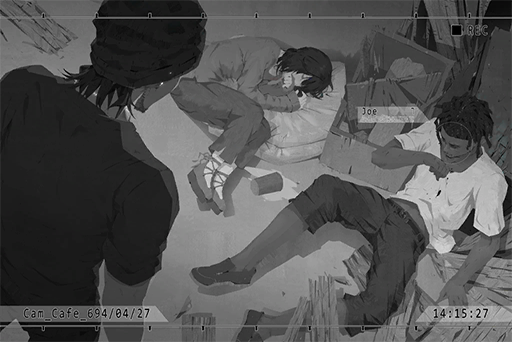

**Hunter**  
Responsibility? You can't even take one punch from me! Ptui!

**Hunter**  
Listen, s\*\*\*head, this is a very important transaction for us. Stop causing us trouble! When we first announced the reward, you were the first one to agree to help; and now you're trying to play hero?

**JOE**  
I had no idea that you guys are doing human trafficking! If pops knew about this kind of private business...

_\[Punch\]_

**JOE**  
UGHHH!

**Hunter**  
Pops this, pops that... shut it, you damn p\*\*\*\*! That stinkin old man, always spewing about that "balance" stuff. Do you have any idea how much crap we Baro crew members had to deal with these days because of that?

_\[Ringtone\]_

**Hunter**  
Hello? Yes, the cargo is cleaned, no problem at all... Yes, of course... understood!

**Hunter**  
They are arriving in ten minutes. I need to prep the cargo. You better lay there and don't interfere. Use your brain and think carefully before you take on a case, you f\*\*\*\*\* idiot.

**JOE**  
Ugh...

_\[Signal Lost\]_

[Last Log](#os-log-012) | [Back to Top](#list-of-logs) | [Next Log](#os-log-014)

### OS Log #014
___

[Last Log](#os-log-013) | [Back to Top](#list-of-logs) | [Next Log](#os-log-015)

#### Requirements
| Char. |Lv.|Lv. Locked?|
|-------|:-:|:---------:|
|**JOE**|11 |    No     |

#### Unlocked Charts
|      Song       |Char.|Diff.|Lv.|
|-----------------|:---:|:---:|:-:|
|**Open the Game**| JOE |Chaos|13 |

#### Audio\_37St\_696\_07\_05
**JOE**  
Here ya go! Honey lemon juice with max sugar and no ice. All the syrup has sunk to the bottom, so it's gonna taste like diabetes if you suck it with a straw!

**KAI**  
... You really don't have to order a drink for me. I can only stay here for a short time anyway.

**JOE**  
We haven't seen each other for so long, yet this is how you treat me? How cold... I guess I'll give it to Zark then.

**Zark**  
Arf!

**KAI**  
... Is it ok for a dog to drink this?

**JOE**  
No worries, Zark is a super dog!  
Do you have any plans for the future?

**KAI**  
I might have to go back to Node 03. My parents are getting old, and I have to go back to take care of the store for them.

**JOE**  
Ho\~ is that so. I thought we were going to find other members to continue the band.

**KAI**  
I'm older than all of you. It's about time I start to face life. I can't keep messing around like this. To be honest, I should have returned home the year I graduated from vocational school.  
On top of it all, a band without those two cannot be called "Crystal PuNK" anymore...

**JOE**  
Yeah, I agree.

**KAI**  
Did Simon contact you afterward?

**JOE**  
Nope... I've messaged him hundreds of times already, but he completely ignored me.

**KAI**  
Is that so...

**JOE**  
I don't blame him though, he had too much to deal with... dad died on duty, Shannon hospitalized, even broke up with big sis...   
I tried to contact big sis too, absolutely no response as well.

**KAI**  
Do you know the reason they broke up?

**JOE**  
How would I know?

**KAI**  
... Then do you know that big sis's dad is now in prison?

**JOE**  
You mean Luis!? Are you serious!? Why?

**KAI**  
From what I heard, it's smuggling or something along that line. However, that got me thinking; could this have something to do with Simon's dad?

**JOE**  
Huh? It can't be... the news said that his dad was shot by a thug who was robbing a convenience store. That thug looked nothing like Luis though?

**KAI**  
I don't know... I just felt like Simon was still pretty calm when he first heard the news about his father and sister, even until the end of the funeral. He was still chatting with me about the music festival at the end of the year back then.

**JOE**  
... You have a point. If we think about it, that's the kind of response the Simon we knew would have.

**KAI**  
Yeah, I knew he was very sad, but he doesn't seem to be the type of person who would have an emotional breakdown from things like this.  
Only until his breakup with big sis did he completely vanish from our sights...  
Luis was arrested sometime around that too, which is why I can't help but feel like these two incidents are related.

**JOE**  
... But these are just your speculations, aren't they? I don't really want to think like that. Luis is a good person...

**KAI**  
I don't either. Simon's dad, and Shannon... if Luis really was the cause of all this, I don't know how I would deal with it. At the very least, Luis is indeed a criminal. We can confirm that.

**JOE**  
... I'm not exactly smart, so I can't say much. However, there are a lot of things that can't be simply divided into black and white, right? Nobody knows the whole situation behind these incidents too.

**KAI**  
Why does it feel like you're really sentimental about this?

**JOE**  
Nothing, just a feeling I have.

**KAI**  
... You are very correct. However, you can't persuade Simon with these reasons, because he is the one actually involved in this. You understand that, don't you? Even though you're dumb.

**JOE**  
Dude, what the f\*\*\*? I know that...

**JOE**  
... About Crystal PuNK, is there anything I can still help out?

**KAI**  
I've dealt with everything already. Those event organizers and other bands were really p\*\*\*ed off at me... Whatever, I'm leaving anyway. Doesn't affect me at all.

**JOE**  
P\*\*\*ed off at you? It's not your fault that we disbanded.

**KAI**  
I know, but we did indeed let them down. That's a fact, and someone has to shoulder the responsibility, right?

**JOE**  
Thank you, Mr. Secretary... nothing, forget it.

**KAI**  
Haha. It's time. I need to go back and pack my stuff.

**JOE**  
Come visit me at Node 08 if you have the time!

**KAI**  
If I have the chance. Farewell, King of Germs.

**JOE**  
F\*\*\* you. Goodbye!

_\[»»» Fast Forward »»»\]_

**Zark**  
Arf!

**JOE**  
... Hmm? It's all over, the band. We will not see them again... feeling lonely, aren't you? Let's have a toast, stupid dog! For Crystal PuNK!

**JOE**  
......

**JOE**  
... Wrong drink, taste so bitter.

_\[Signal Lost\]_

[Last Log](#os-log-013) | [Back to Top](#list-of-logs) | [Next Log](#os-log-015)

### OS Log #015
___

[Last Log](#os-log-014) | [Back to Top](#list-of-logs) | [Next Log](#os-log-016)

#### Requirements
| Char. |Lv.|Lv. Locked?|
|-------|:-:|:---------:|
|**JOE**|12 |    No     |

#### Audio\_Base\_696\_07\_13
_\[Puts down box\]_

**Saxon**  
Last one, all done.

**JOE**  
Uh\-huh.

**Saxon**  
... You are not your usual cheery self today. What's wrong?

**JOE**  
Nothing.

**JOE**  
......

**Saxon**  
... Something did happen, didn't it? What happened? Tell me about it!

**JOE**  
... Are you trying to read my mind?   
Nothing much; it's just that our band disbanded.

**Saxon**  
Disbanded? What happened? You guys had an argument?

**JOE**  
Umm... the situation is... complicated. I myself haven't digested the info properly too.

**Saxon**  
Do you want to tell me about it?

**JOE**  
Yeah...

**Saxon**  
... Come up here. Pops will treat you to a drink.

_\[→Signal switch to Cam\_Cafe\_01\]_

**JOE**  
... They are all good people and are serious about making a splash in the music world... Perhaps I'm the only one who treated it as just something fun. Whatever, it's all over now. I'll probably never see them again, ever.

**Saxon**  
Do not look down on yourself. For Crystal PuNK, every single member is crucial, including you. Without any one of you, the band will not be the same. That's why you guys chose to disband instead of finding replacements.

**Saxon**  
Having played music with such wonderful friends, you are already much more fortunate than many others.

**JOE**  
......

**Saxon**  
Let's listen to some music. Rock? Metal? Some Shredding...

**JOE**  
No... something slower.

**Saxon**  
... Then how about this one?

_\[Music\]_

**JOE**  
... Ah...

**Saxon**  
When you were still a kid, you stood there playing this very song. That was the first time you finished this song, remember?

**JOE**  
Yes.

**Zark**  
Arf!

**JOE**  
... Such a good song. Zark, do you think so too?

**Zark**  
Arf Arf!

**Saxon**  
... We don't get to drink together often. Another one?

**JOE**  
Yeah...

_\[Cheers\]_

**JOE**  
_\*Gulp!\* \*Sniff\* \*Sobs\*_......

**Saxon**  
Oh? So you're the type who cries when drunk?

**JOE**  
I wanted to cry back when I was talking with KAI about this. I don't want him to think that I'm a sissy... but I really don't want it to end! We had become such good friends! We are hosting a music festival at the end of the year too!

**Saxon**  
Who told you that crying means you're a sissy? Crying is what turns you into a man. So go ahead and cry. Remember, tears and laughs are the best ingredients for any good music.

**JOE**  
_\*Sobs!\*_ Shut it... old man! _\*Sobs\*_...

**Saxon**  
Man, if you can't hold your liquor well, how can I entrust this shop to you?

**JOE**  
What... entrust...

**Saxon**  
... Knocked out already? Too young, too young.

_\[Signal Lost\]_

[Last Log](#os-log-014) | [Back to Top](#list-of-logs) | [Next Log](#os-log-016)

### OS Log #016
___

[Last Log](#os-log-015) | [Back to Top](#list-of-logs) | [Next Log](#os-log-017)

#### Requirements
| Char. |Lv.|Lv. Locked?|
|-------|:-:|:---------:|
|**JOE**|13 |    No     |

#### Unlocked Charts
|    Song     |Char.|Diff.|Lv.|
|-------------|:---:|:---:|:-:|
|**Hydrangea**| JOE |Easy | 3 |

#### Cam\_Hospital04\_697\_04\_14
**JOE**  
Hi\~ How are you doing today?

**Saxon**  
The doctor said I can have one drink today.

**JOE**  
Then drink my p\*\*\*, you drunkard. Getting hospitalized because of a heart attack, I was scared s\*\*\*less you know!

**Saxon**  
No need to worry, death won't take me down that easily... is Zark doing well?

**JOE**  
He's much healthier than you, so no probs. I did visit the shop to feed him before I came here.

**Saxon**  
Thanks for the help.

**JOE**  
Don't say that. You're a patient, ya know?

**Saxon**  
......

**JOE**  
... Here, apples.

**Saxon**  
Your knife skills have improved a lot.

**JOE**  
Of course! I've been practicing it every day while preparing the ingredients. I've learned over half of the cocktail recipes too.

**Saxon**  
By that, I'm assuming that you have agreed to my proposal. When is the sign going to change?

**JOE**  
Scheduled to be next week. But, um... what's with the "JOEZ Cafe" name? It's kinda embarrassing...

**Saxon**  
It's your shop; of course it's going to bear your name.  
I want you to take care of this shop just like yourself. Also, don't worry your mother.

**JOE**  
We're just a bar selling booze...

**Saxon**  
... JOE, I told you many times before. This bar is not just about selling booze.

**JOE**  
Yes, yes... the "Underground Balance" thing, I get it.

**Saxon**  
Do not underestimate it. For many years, the gangs of Node 08 are able to maintain balance, thrive together with each other and not harm regular civilians till this very day. The reason for that is because of the service we provide. Do you understand? Cafe plays a very important role in this.

**JOE**  
... Assist gangs in their transaction, yet insists on not taking part in illegal businesses. I can't really understand why. Is it a moral thing? Or is it just personal taste?

**Saxon**  
Neither. I did so because it's the only effective method.

**JOE**  
Huh?

**Saxon**  
There is no absolute black or white in this world. We are all different tints of grey, carefully traversing between the light and the shadow. Those who go for the extremes are often too much for the regular folks to accept. However, as long as some rules are in place, those who walk on the edge can live on with their head held high too.

**JOE**  
You mean... the gangs are not really the bad guys?

**Saxon**  
What I mean is, we have the ability to not let gangs become something truly evil.

**JOE**  
With this shop?

**Saxon**  
And you.

**JOE**  
... Alright. But even if everything you said is accurate, would those guys actually listen to me?

**Saxon**  
Of course not. Do you know which gangs are in Node 08?

**JOE**  
The largest one is Ando, then Baro; the smallest is Cino...

**Saxon**  
Besides these, Node 03's "Mogura (土竜)" and "Kyuu Hou Kai (玖凰會)" also has operations over here. Let me tell you, those are the real big boys.

**JOE**  
You seem to know a lot about all of them...

**Saxon**  
Yes. This is the answer: make friends.

**JOE**  
Hoho, then I'm really good at that!

**Saxon**  
... There are still exceptions, though. For example, the Baro Brotherhood has been constantly trying to break the balance. I just never gave them the opportunity.

**JOE**  
Oh...

**Saxon**  
Don't just think about being friends with everybody. You must always be alerted. One little slip\-up... the consequences will be unimaginable. There are also some people that you must pay extra attention to.

**JOE**  
Like whom...?

**Saxon**  
I'll gradually tell them to you once we have the time. No need to worry, as long as you don't get involved with illegal businesses, they won't be able to touch this shop if you bring up my name.

**JOE**  
Umm... hmm... alright.

**Saxon**  
Also, take good care of your mother.

**JOE**  
Of course I will. Why did this pop up all of a sudden?

**Saxon**  
... Just something that came to my mind. Any more questions about this job?

**JOE**  
... One last question. What did you spend your entire life doing this? Maintaining the balance between the gangs... what benefit does this bring you?

**Saxon**  
.... Wait till the day I pour you my last glass of booze, then we can talk about it.

_\[Signal Lost\]_

[Last Log](#os-log-015) | [Back to Top](#list-of-logs) | [Next Log](#os-log-017)

### OS Log #017
___

[Last Log](#os-log-016) | [Back to Top](#list-of-logs) | [Next Log](#os-log-018)

#### Requirements
| Char. |Lv.|Lv. Locked?|
|-------|:-:|:---------:|
|**JOE**|14 |    No     |

#### Image\_Graveyard\_697\_04\_16
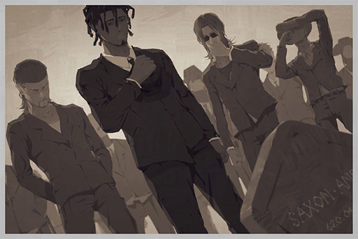

Date: 697/04/16  
Location: Node 08 \- Cemetery

[Last Log](#os-log-016) | [Back to Top](#list-of-logs) | [Next Log](#os-log-018)

### OS Log #018
___

[Last Log](#os-log-017) | [Back to Top](#list-of-logs) | [Next Log](#os-log-019)

#### Requirements
| Char. |Lv.|Lv. Locked?|
|-------|:-:|:---------:|
|**JOE**|15 |    No     |

#### Unlocked Charts
|    Song     |Char.|Diff.|Lv.|
|-------------|:---:|:---:|:-:|
|**Hydrangea**| JOE |Hard | 6 |

#### Audio\_Cafe\_697\_06\_07
**Wang**  
JOE, why does this Sea Breeze tastes so... light?

**JOE**  
You don't understand. That's how Sea Breezes should taste.

**Wang**  
Bull f\*\*\*\*\* s\*\*\*! You forgot to add Vodka, you dumba\*\*!

**JOE**  
Ah f\*\*\*! You're right. Got too caught up with squeezing the juices...

**Wang**  
I miss UNCLE... at least back then we can get actual good cocktails.

**JOE**  
Too much "work" lately, didn't have time to practice.

**Wang**  
... So you're now blaming us?

**JOE**  
Hold it right there! Capo Wang, you know me. No matter what happens, I will never blame the bros...

**Wang**  
Only thing I know about you is your lip service. On a side note, there was an increase in "work" since you took over this shop, right?

**JOE**  
Just this week so far. I won't complain though, made some pretty decent dough out of them.

**Wang**  
As far as we go, we didn't have any transaction recently that used the Cafe. Who and what were they buying?

**JOE**  
Capo Wang, you know the rules. The answer to this question is already "Martini" stuff.

**Wang**  
......

**Wang**  
JOE, you better be careful.

**JOE**  
Why?

**Wang**  
Those Baro guys, they've been very ambitious since a long time ago. Since you took over Cafe, they've been acting restless. Don't think it's a coincidence; I think you should pay a little attention to them.

**JOE**  
OK. I know, I know.

**Wang**  
In fact, I've been hearing some pretty bad rumors. Do you know the name Diego?

**JOE**  
Who?

**Wang**  
Baro Brotherhood's Consigliere, a callous and deceitful man. He has been amassing power for a long time. He also has some dangerous goons under his command. Everytime we face him, even Boss Luo gets nervous.

**JOE**  
Never heard of this guy.

**Wang**  
He very rarely shows himself in public. However, rumor has it that once he shows up in person, things will definitely go according to his plans... "No matter what happens, everything will work out."

**JOE**  
This type of BullS\*\*\* again... if he's really that brilliant, how come Baro has been stuck in second place forever?

**Wang**  
... Anyway, I gave you my warning.

**JOE**  
I know. I'm saving a file in my brain. Beep, beep, beep...

**Wang**  
Idiot.

**JOE**  
Hahaha. Another drink?

**Wang**  
You mean your mixed juices? No thanks. JOE, stay alert. Don't let UNCLE down.

**JOE**  
Yawn... Got it. Stop worrying about me.

_\[Signal Lost\]_

[Last Log](#os-log-017) | [Back to Top](#list-of-logs) | [Next Log](#os-log-019)

### OS Log #019
___

[Last Log](#os-log-018) | [Back to Top](#list-of-logs) | [Next Log](#os-log-020)

#### Requirements
| Char. |Lv.|Lv. Locked?|
|-------|:-:|:---------:|
|**JOE**|16 |    No     |

#### Unlocked Charts
|    Song     |Char.|Diff.|Lv.|
|-------------|:---:|:---:|:-:|
|**Hydrangea**| JOE |Chaos|12 |

#### Log\_System\_697\_08\_12
Exterior Data Record 6970811  
File type: Document  
Time received: 23:58:36  
Encryption level: Basic, decryption available

Loading decryption package  
Initiating phase 1 decryption...  
Phase 1 decryption complete

Content: Roster list  
Keyword: Ando

Loading decryption package  
Initiating phase 2 decryption...  
Estimated completion time: 3hrs25mins

Registered save time: 697\_0812\_0236

[Last Log](#os-log-018) | [Back to Top](#list-of-logs) | [Next Log](#os-log-020)

### OS Log #020
___

[Last Log](#os-log-019) | [Back to Top](#list-of-logs) | [Next Log](#os-log-021)

#### Requirements
| Char. |Lv.|Lv. Locked?|
|-------|:-:|:---------:|
|**JOE**|17 |    No     |

#### Audio\_Cafe\_697\_08\_19
_\[Doorbell\]_

**Wang**  
JOE!

**JOE**  
Capo Wang, what's up?

**Wang**  
Watch the news!

**JOE**  
Huh? Calm down will ya, how about a drink first...

**Wang**  
STOP MESSING AROUND! QUICK!

_\[»»» Fast Forward »»»\]_

**News**  
... Law enforcement agents ambushed several criminal organization strongholds late last night, uncovering dozens of firearms and criminal evidence. Dozens were arrested. According to the info, included in the arrested criminals are several key figures of Node 08's notorious Ando gang...

**JOE**  
Holy f\*\*\*! Is Boss Luo alright?

**Wang**  
Got busted! Several top members in the gang didn't make it too. Everyone's saying that those damn admins definitely got their hands on the roster list available only to the top members!

**JOE**  
Roster list... ah!

**Wang**  
What?

**JOE**  
No, it can't be... oh god, oh god...

**Wang**  
Did you think of something?

**JOE**  
No... there are still other customers.

**Hunter**  
I don't mind. Tell us.

**JOE**  
!! You're...

**Hunter**  
Long time no see, s\*\*\*head. Finally recognizing me now?

**Wang**  
Mad Dog of Baro...

**Hunter**  
Who the f\*\*\* are you? The grown\-ups are talking business, you kids can go play with your toys.

**Wang**  
So you can't even recognize a senior. Is it a death sentence you're looking for?

**Hunter**  
S\*\*\*head, Martini, three olives.

**JOE**  
......

_\[Doorbell\]_

**Diego**  
... The Martini is my order.   
Gentlemen, please; let me talk with this boy here alone.

**Hunter**  
You guys heard it. The "grown\-ups" are going to talk business. We "kids" better not interrupt them. Shoo, shoo. Get out.

**Wang**  
... JOE, you bastard...

**JOE**  
I don't know anything!

_\[Doorbell\]_

**JOE**  
You know about the Martini rule. You're...

**Diego**  
My name is Diego.

**JOE**  
Baro's Consigliere...

**Diego**  
Wrong, the Boss now. Since you know me, then things should be simple.  
I also happen to know that you're the owner of the Cafe, JOE... and that you're also the one who took the admins' cheap bait and accidentally leaked the roster list.

**JOE**  
......

**Diego**  
No need to be nervous. I can turn that info into an eternal secret. Today, I'm only here to have a little chat with the successor of the great UNCLE \- Saxon.

**JOE**  
... A chat about what?

**Diego**  
A brand\-new order... or something like that.

_\[Signal Lost\]_

[Last Log](#os-log-019) | [Back to Top](#list-of-logs) | [Next Log](#os-log-021)

### OS Log #021
___

[Last Log](#os-log-020) | [Back to Top](#list-of-logs) | [Next Log](#os-log-022)

#### Requirements
| Char. |Lv.|Lv. Locked?|
|-------|:-:|:---------:|
|**JOE**|17 |    No     |

#### Unlocked Charts
|     Song     |Char.|Diff.|Lv.|
|--------------|:---:|:---:|:-:|
|**Absolutely**| JOE |Easy | 2 |
|**Absolutely**| JOE |Hard | 5 |

#### Cam\_Cafe\_697\_08\_19
**Diego**  
Good stuff. Exactly the same as the one Saxon made.

**JOE**  
......

**Diego**  
You seem to be very cautious towards me.  
Please, relax. I'm one of your uncle's old friends as well.

**JOE**  
I've never seen you before.

**Diego**  
Your uncle wasn't exactly welcoming to me... Our ideals are a bit... different. However, he's a great man. He dedicated his entire life for all of us. He deserves all the respect he got.

**JOE**  
But Boss Luo and other are...

**Diego**  
Yes, the top members of the Ando gang getting arrested has made everyone very nervous. I have a meeting with a few old friends later today.  
... However, I feel like the talk with you deserves priority, so I came here first.

**JOE**  
With me...? I was the one who f\*\*\*ed up and got Boss Luo and Co. busted... The thing uncle's been carefully maintaining...

**Diego**  
Balance, right?

**JOE**  
... Yes.

**Diego**  
Saxon did a lot of things for everyone. The three gangs benefited greatly from him and were able to thrive together. Despite our differences, I also hold a deep respect for your uncle.

**JOE**  
......

**Diego**  
However, JOE, an opportunity now rests in your hands... one that allows both us and the entire gang business to take a big step forward.

**JOE**  
A big step forward?

**Diego**  
The Ando gang is now in disarray. This very night, the Baro Brotherhood is the biggest organization still operating. So, naturally, we have to do something for everyone. To do so, we need to prepare a large amount of resources and information... a lot more than anything in the past.

**JOE**  
Umm, and then?

**Diego**  
I feel like you should realize this as well... Why do you think I specifically made the trip here?

**JOE**  
Aren't you here for a drink?

**Diego**  
Indeed, for this "Martini".

**JOE**  
... OH! You mean this!

**Diego**  
JOEZ Cafe's ability to collect resources and information surpasses that of the three gangs combined. When Saxon was still alive, he only allowed transactions in the grey area... but now, we have even more options.

**JOE**  
But pops did that because...

**Diego**  
To maintain the balance between the gangs. That's why he didn't get involved with illegal businesses. I know.  
... Yet the balance no longer exists anymore.

**JOE**  
Umm...

**Diego**  
JOE, the gangs are facing a very tough situation. However, a crisis is also an opportunity. As long as you work with me, not only can we recreate the glory days, but we can also receive even greater benefits... you, me, every gang organization in Node 08, all of us.

**JOE**  
I... get benefits as well?

**Diego**  
... Certainly.   
In the past, the price of this Martini is ten percent of the transaction amount, correct?

**JOE**  
Yes. A price set by pops. Hasn't changed in decades.

**Diego**  
I give you double.

**JOE**  
!?

**Diego**  
If you agree to lift the limitations, for future Baro Brotherhood transactions, you get twenty percent. What do you think?

**JOE**  
......

**Diego**  
Don't pull a long face. I'm asking you a question.

**JOE**  
... Twenty\-five.

**Diego**  
... What?

**JOE**  
I want one\-fourth of the transaction amount...!

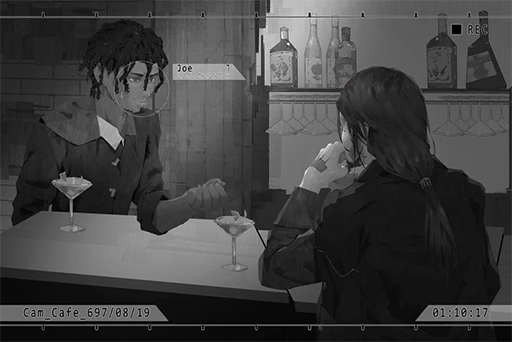

**Diego**  
Hoho... hahaha! Boy! I knew you wouldn't disappoint me!  
Alright! One\-fourth it is!

**JOE**  
To celebrate our future partnership, a toast?

**Diego**  
Of course! I'm beginning to like you even more, boy!

_\[Cheers\]_

**Zark**  
......

**Zark**  
Arooo...

_\[Signal Lost\]_

[Last Log](#os-log-020) | [Back to Top](#list-of-logs) | [Next Log](#os-log-022)

### OS Log #022
___

[Last Log](#os-log-021) | [Back to Top](#list-of-logs) | [Next Log](#os-log-023)

#### Requirements
| Char. |Lv.|Lv. Locked?|
|-------|:-:|:---------:|
|**JOE**|18 |    No     |

#### Unlocked Charts
|        Song         |Char.|Diff.|Lv.|
|---------------------|:---:|:---:|:-:|
|**Higher and Higher**| JOE |Easy | 3 |
|**Higher and Higher**| JOE |Hard | 6 |

#### Call\_Fang\_698\_02\_12
_\[Call Starts\]_

**JOE**  
... Hello.

**Fang**  
It's me.

**JOE**  
Brother Fang? Business?

**Fang**  
Yes.

**JOE**  
A bit too much recently, don't you think? I'm almost sleep deprived these days.

**Fang**  
Who gives a f\*\*\*? I'm gonna speak, listen carefully.

**JOE**  
Gimme a sec, I'll grab the Pad... OK, go ahead.

**Fang**  
Capo Hunter wants me to inform you, transaction date is three nights later. Secret code: "Devil's Candy". Pretty big package, be prepared.

**JOE**  
Candy... so, the cargo this time is...

**Fang**  
Even if you guessed it, don't say it. It's gonna leave a record.

**JOE**  
... Just a heads up, I don't have much experience dealing with this stuff. When pops is still alive, we would absolutely not touch this stuff. When did Baro start selling "Candy"?

**Fang**  
A few dozen years already. Boss wants to expand the business, which is why you are involved this time. If things go along smoothly, will become one of the major products in the future.

**JOE**  
......

**Fang**  
What's wrong?

**JOE**  
... Nothing, it just hit me, that Diego is really now your Boss.

**Fang**  
The Ando gang is nothing more than a name at this point. Only a small bunch is still holding on. Joining Diego's ranks is the way to go. I still want my career to last longer.

**JOE**  
Brother Wang is now one of Ando's top members. He's gonna explode if he hears this from you.

**Fang**  
That guy's too stubborn. I don't expect him to understand my choices either. Sorry, no more gunslinger showdowns for you to charge commission anymore.

**JOE**  
Haha...

**Fang**  
......

**JOE**  
... Feels like you have changed, brother Fang.

**Fang**  
People change. Nothing special.

**JOE**  
Really? Cause I feel like I didn't change much, haha.

**Fang**  
It's been more than half a year since you started working with Boss. Are you sure about that?

**JOE**  
......

**Fang**  
That's all there is. See you in three days.

**JOE**  
... Bye.

_\[Call Ends\]_

[Last Log](#os-log-021) | [Back to Top](#list-of-logs) | [Next Log](#os-log-023)

### OS Log #023
___

[Last Log](#os-log-022) | [Back to Top](#list-of-logs) | [Next Log](#os-log-024)

#### Requirements
| Char. |Lv.|Lv. Locked?|
|-------|:-:|:---------:|
|**JOE**|19 |    No     |

#### Unlocked Charts
|          Song           |Char.|Diff.|Lv.|
|-------------------------|:---:|:---:|:-:|
|**Take me to the Future**| JOE |Easy | 3 |
|**Take me to the Future**| JOE |Hard | 7 |

#### Cam\_Cafe\_698\_09\_09
_\[Doorbell\]_

**Zark**  
Arf arf! Arf!

**Xenon**  
.....

**Customer**  
Oh? An unfamiliar face... does this count as a face?

**Xenon**  
... Hello.

**Customer**  
Have a seat. The owner went to take a s\*\*\*, haha.

**Zark**  
ARF!

**JOE**  
Why the hell are you barking, stupid dog? What, a customer? Welcome, helmet guy. First time here?

**Xenon**  
JOE!?

**JOE**  
Huh? Do we know each other?

_\[Removes Helmet\]_

**Xenon**  
Do you know now?

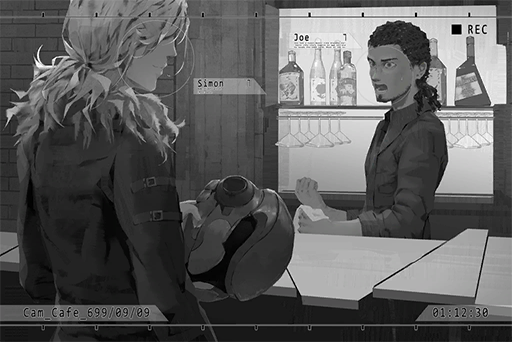

**JOE**  
JASUS! Simon!? Why are you here!?

**Xenon**  
Just happen to pass by here. Came in out of pure curiosity.

**Customer**  
Your friend?

**JOE**  
He's the guitarist of my old band!   
I mentioned him before! Where the f\*\*\* did you disappear to though? It's been years!

**Xenon**  
Umm, it's a long story...

**JOE**  
Take a seat first. Why are you standing there? Haha.

**Xenon**  
Sure... pretty nice shop you've got here. Did you open this yourself?

**JOE**  
I inherited this shop from my uncle.  
Ah, right. You've never been here before. I did some renovation. What do you think?

**Xenon**  
It is quite nice. I was lured inside by the music and the exterior decoration.   
Of course, that suspicious sign also helped... your horrible naming sense might be the only major flop.

**JOE**  
My uncle was the one who came up with the name! He wants me to treat this shop like myself and take good care of it.

**Xenon**  
Too bad you're someone who can barely take care of yourself properly...  
Right, Zark? It's been a long time.

**Zark**  
Ruff ruff ruff... Arf!

**JOE**  
Dude, maybe he doesn't remember you at all. Be careful; he might chomp you if you touch him in the wrong place.

**Xenon**  
You're the only person he bites though?

**JOE**  
Aha, that's it! Your super sharp verbal jabs! Damn do I miss them!

**Xenon**  
Haha... Are you still playing in a band now?

**JOE**  
Never since. Not long after we disbanded, my uncle died and left me with this shop.  
I've been working my a\*\* off operating this place. I don't have the time.

**Xenon**  
I'm sorry...

**JOE**  
Nothing to be sorry about, all things from a long time ago. Bro, you have no idea how happy I am seeing you again!   
Here, order a drink! It's on me!

**Xenon**  
You know that I don't drink alcohol, right?

**JOE**  
Huhhhh? Is this how you apologize for your past actions?

**Xenon**  
... Didn't you just say there's nothing to be sorry about?

**JOE**  
Haha, I know, I know. Just make an order, soft stuff is fine too.

**Xenon**  
Soft?

**JOE**  
It means non\-alcoholic drinks.

**Xenon**  
Um, milk?

**JOE**  
Puhahaha, in the long history of this shop, this may be the first time we see "milk" on a receipt! Puhahahahaha!

**Xenon**  
... Shut up.

**JOE**  
It's probably not gonna be the last time though?

**Xenon**  
Probably.

_\[Signal Lost\]_

[Last Log](#os-log-022) | [Back to Top](#list-of-logs) | [Next Log](#os-log-024)

### OS Log #024
___

[Last Log](#os-log-023) | [Back to Top](#list-of-logs) | [Next Log](#os-log-025)

#### Requirements
| Char. |Lv.|Lv. Locked?|
|-------|:-:|:---------:|
|**JOE**|20 |    No     |

#### Unlocked Charts
|     Song     |Char.|Diff.|Lv.|
|--------------|:---:|:---:|:-:|
|**Absolutely**| JOE |Chaos|11 |

#### Call\_Diego\_701\_06\_25
_\[Call Starts\]_

**JOE**  
Hello, brother Fang? Gimme a sec, I'm cleaning a glass...

**Diego**  
Hi, JOE.

**JOE**  
... Diego!? Why did you call me yourself?

**Diego**  
The next job is very crucial. So I decided to inform you directly.

**Zark**  
Arf... Arf!

**JOE**  
Woah! Zark...

**Diego**  
Playing with the dog?

**JOE**  
One moment please... get down you dumb dog... can't you see that I'm working?

**Diego**  
......

**JOE**  
Apologies, I'm back. So what's this crucial job?

**Diego**  
Three days later, secret code: "Devil's puppet". Hunter will be on\-site to supervise everything. You get it, right?

**JOE**  
Puppet?

**Diego**  
Yes.

**JOE**  
... A human, isn't it? Another kidnapping?

**Diego**  
F\*\*\*! Wise up! Now I have to spend money to erase this phone call from the records.

**JOE**  
......

**Diego**  
Hunter told me that you helped out a few years ago. You know what to do then.  
These types of buyers are very rare, but the payment is usually significant. Both you and I can make a fortune out of this deal.

**JOE**  
Hmm...

**Diego**  
What's wrong?

**JOE**  
Nothing.

**Diego**  
... JOE, do you know what I see when I look at you?

**JOE**  
... Huh?

**Diego**  
The answer is myself. Your eyes show my reflection. Maybe you think you've kept it well\-hidden, but I'm always there. You and I are the same. What you see, what you hear, what you think, I know it like the back of my hand.

**JOE**  
......

**Diego**  
So, you just need to do one thing... tell me, whatever is on your mind. Tell me clearly, word by word.

**JOE**  
I...

**Diego**  
I'm listening.

**JOE**  
Recently... I've been thinking about this a lot. I still feel like this is not good. Pops' ideals exist for their reasons. I don't understand them back then, still don't really understand them now, but...

**Diego**  
Your conclusion?

**JOE**  
I don't want to break the law anymore! In the future, JOEZ Cafe will return to what it used to be. I will only offer services to legal transactions and maintain the current balance... even though you guys are already by far the largest gang now.

**Diego**  
......

**JOE**  
Hello?

**Diego**  
... I've been expecting you to say that, JOE.  
We've been partners for a long time now. To be honest, I already noticed that your mind was struggling.

**JOE**  
Is that so...?

**Diego**  
However, I've already accepted this deal. Canceling it now will do great harm to my credibility. Take this as a final request. Help me out on this case, and we'll talk about the details after its done. Deal?

**JOE**  
... Alright.

**Diego**  
Boy, I've been in the gang business since I was 15. It's been decades. Yet you're the only person in my career so far that feels "alive" to me. I won't let you suffer.

**JOE**  
... Thank you!

**Diego**  
No need for that. Go play with your dog.

_\[Call Ends\]_

[Last Log](#os-log-023) | [Back to Top](#list-of-logs) | [Next Log](#os-log-025)

### OS Log #025
___

[Last Log](#os-log-024) | [Back to Top](#list-of-logs) | [Next Log](#os-log-026)

#### Requirements
| Char. |Lv.|Lv. Locked?|
|-------|:-:|:---------:|
|**JOE**|21 |    No     |

#### Unlocked Charts
|        Song         |Char.|Diff.|Lv.|
|---------------------|:---:|:---:|:-:|
|**Higher and Higher**| JOE |Chaos|13 |

#### Mail\_Diego\_701\_06\_25
**Subj.**: Untitled  
**From**: D  
**To**: H.H.

Cafe's stance has shaken. Talk with him during the puppet deal. Make him behave.

D.

[Last Log](#os-log-024) | [Back to Top](#list-of-logs) | [Next Log](#os-log-026)

### OS Log #026
___

[Last Log](#os-log-025) | [Back to Top](#list-of-logs) | [Next Log](#os-log-027)

#### Requirements
| Char. |Lv.|Lv. Locked?|
|-------|:-:|:---------:|
|**JOE**|22 |    No     |

#### Unlocked Charts
|          Song           |Char.|Diff.|Lv.|
|-------------------------|:---:|:---:|:-:|
|**Take me to the Future**| JOE |Chaos|14 |

#### Cam\_Cafe\_701\_06\_28
_Engines turned off_

**Hunter**  
The cargo is here. Come help.

**JOE**  
... Ok.

_\[Truck backdoor opens\]_

**Little Girl**  
Hmmmm! Mmm!

**JOE**  
!?  
Hey! How come it's a little girl!?

**Hunter**  
Ha! Isn't the purpose loud and clear?

**JOE**  
Didn't even use any narcotics, and what's with the nasty rope\-tying...

**Hunter**  
A request from the buyer. Looks like we have ourselves a serious sicko. Stop yapping, lock her in the basement.

**JOE**  
......

_\[→Signal switch to Cam\_B1\_01\]\]_

**Hunter**  
We should wait a moment. The buyer should be coming anytime... ARGH!

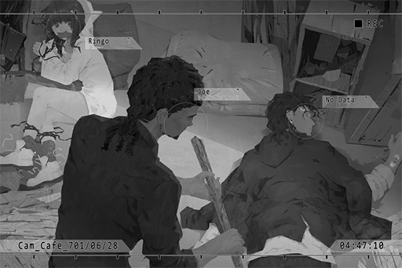

**JOE**  
I CAN'T ACCEPT THINGS LIKE THIS AFTER ALL!!!!

**JOE**  
Are you ok? I'll untie the ropes now!

**Little Girl**  
HmmmMNN!!

_\[Gunshot\]_

**JOE**  
ARGH!

**Hunter**  
Don't move... next shot... won't be on the legs...

**JOE**  
... Ugh...

**Hunter**  
I've heard from the boss... so you want out? You really think you can leave whenever you want and keep yourself squeaky clean? What do you think we are, a f\*\*\*\*\* summer camp!?

**JOE**  
Please, I really... don't want to do things like this anymore.

**Hunter**  
Do you realize how much the organization has grown in the past few years? Stop acting that you didn't benefit from that! You made a s\*\*\* ton of money, didn't you? You think you can get off scot\-free with all that money? Who do you think you are!? HUH!?

**JOE**  
... If you kill me, the Boss won't let you off the hook.

**Hunter**  
Ha! Idiot! You really think the Boss cares about you? Anyone can run this shop. Stop flattering yourself, you narcissistic a\*\*hole!

**JOE**  
... Then that's even better. I'm going to take this girl and run away right now.

**Hunter**  
If you dare take another step... I'll shoot.

**Zark**  
GRRR! ARF! ARF ARF!

**Hunter**  
Yikes! You stupid dog! F\*\*\* off!

**JOE**  
Zark!! No...

_\[Gunshot\]_

**Zark**  
Arooo\~...

**JOE**  
Zark！！！！！！

**JOE**  
YOU BASTARD!! I'M GONNA F\*\*\*\*\* KILL YOU!!!!!!

**Diego**  
Stop!

**JOE**  
！！  
Uh... zzZ

**Diego**  
Good job. Let him sleep for a while.

**Angus**  
Yes, Boss.

**Diego**  
I knew things are going to go wrong with only you in charge. Thank god the meeting ended early.

**Angus**  
Hey, why did you killed the dog?

**Hunter**  
This son of a b\*\*\*\* bit me!

**Angus**  
So the Mad Dog is scared of dog bites? How amusing...

**Diego**  
You fool! I told you to talk with him and persuade him, and your idea of a "talk" is to kill his dog? Damn, now things are going to get complicated...

**Hunter**  
Boss, I'm sorry... I... this bastard wanted to escape with the cargo!

**Angus**  
Is that so? Then I guess this is a type of "persuasion", right? Send him a message that this time it's the dog. Next time, it's gonna be his mom or friends... even though this is a very vulgar method.

**Diego**  
Hmph... this is just temporary. Interpersonal relationships are not as easy as you think. This is the reason why you guys are stuck at your position. Mad Dog, clean up this mess. I don't want the buyer to see this wreck.

**Hunter**  
Yes, Boss... Umm... what should we do with the dog?

**Diego**  
It's s\*\*\* you made; deal with it yourself.

**Angus**  
Just find a random place and bury it. Hurry up.

_\[Signal Lost\]_

[Last Log](#os-log-025) | [Back to Top](#list-of-logs) | [Next Log](#os-log-027)

### OS Log #027
___

[Last Log](#os-log-026) | [Back to Top](#list-of-logs) | [Next Log](#os-log-028)

#### Requirements
| Char. |Lv.|Lv. Locked?|
|-------|:-:|:---------:|
|**JOE**|22 |    No     |

#### Image\_Zark\_700\_02\_20
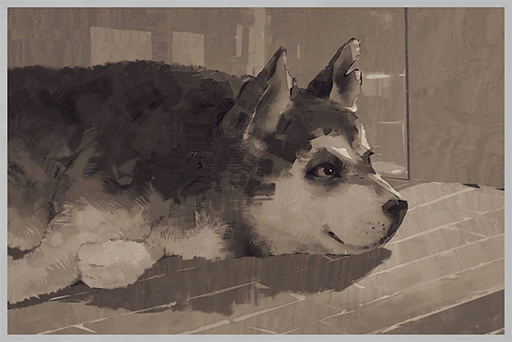

Date: 700/02/20  
Location: JOEZ Cafe

[Last Log](#os-log-026) | [Back to Top](#list-of-logs) | [Next Log](#os-log-028)

### OS Log #028
___

[Last Log](#os-log-027) | [Back to Top](#list-of-logs) | [Next Log](#os-log-029)

*(The OS Log has a video version, you can watch it on [this link](https://youtu.be/aaD9TOfq8HI))*

#### Requirements
| Char. |Lv.|Lv. Locked?|
|-------|:-:|:---------:|
|**JOE**|24 |    No     |

#### Cam\_Cafe\_702\_10\_01
_\[Doorbell\]_

**JOE**  
Hello, sit anywhere you like.

**Hayato**  
Do you have saké?

**JOE**  
Yep, wait one sec.  
Do you want it heated?

**Hayato**  
No.

**JOE**  
Never seen you before. Are you from the east? Node 03?

**Hayato**  
Yes. Is it rare to see one around these places?

**JOE**  
Nah, where do you think this is? It's 08, any type of people can be found here.  
But cold saké... indeed not an order you see every day.

**Hayato**  
Back home we call this "Yukihie", refreshes the brain quite well... _\*Gulp!\*_

**JOE**  
Yukihie, I see...

**Hayato**  
_\*Gulp!\*_

**JOE**  
Jasus, slow down. If you get drunk so fast, I'm gonna be the one carrying your limp body outside.  
I've always had a fond interest in chatting with customers from other Nodes.

**Hayato**  
I'm... not exactly the type who's good at chatting.

**JOE**  
Haha, it's fine. I'm JOE, and you are?

**Hayato**  
Hayato... _\*Gulp!\*_

**JOE**  
Did you get dumped?

**Hayato**  
... Why did you ask?

**JOE**  
Well, a young fella with a depressed look visiting an unfamiliar bar with the sole purpose of getting trashed. Pretty sure that means it has something to do with relationship issues... I think?

**Hayato**  
I'm... looking for a female.

**JOE**  
Girlfriend?

**Hayato**  
More or less my childhood friend, been missing for years already... _\*Gulp!\*_

**JOE**  
For years... could it be that she already... ah, I'm sorry.

**Hayato**  
No need to be...I gave up a long time ago too. In Node 03, missing people usually stay missing forever. It's practically a part of everyday life.  
However, for some unknown reason, I just always have this feeling that she is right here in Node 08. A very powerful feeling too..._\*Gulp!\*_

**JOE**  
... If you're looking for someone, maybe you've come to the right location.  
Not to brag about it, but this little shop really has all kinds of people visiting every day. Give me some hints, maybe I can help. If you have a photo, even better.

**Hayato**  
A photo... I always have it with me. Here.

**JOE**  
Hoho, lemme take a look. Heard from folks that Node 03 is where all the cute gals are at...

**JOE**  
......!

**JOE**  
...... This person......

**Hayato**  
...... zzZ......

**JOE**  
... He's drunk.

**Hayato**  
...... Kaori......

_\[Signal Lost\]_

[Last Log](#os-log-027) | [Back to Top](#list-of-logs) | [Next Log](#os-log-029)

### OS Log #029
___

[Last Log](#os-log-028) | [Back to Top](#list-of-logs) | [Next Log](#os-log-030)

#### Requirements
| Char. |Lv.|Lv. Locked?|
|-------|:-:|:---------:|
|**JOE**|24 |    No     |

#### Unlocked Charts
|    Song    |Char.|Diff.|Lv.|
|------------|:---:|:---:|:-:|
|**Nautilus**| JOE |Easy | 2 |
|**Nautilus**| JOE |Hard | 5 |
|**Nautilus**| JOE |Chaos|11 |

#### Cam\_DragonSt\_693\_06\_03
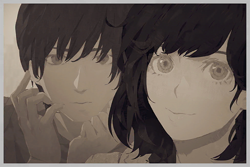

Date: 693/06/03  
Location: Node 03 \- Wolong St.

[Last Log](#os-log-028) | [Back to Top](#list-of-logs) | [Next Log](#os-log-030)

## Added on v1.6

### OS Log #030
___

[Last Log](#os-log-029) | [Back to Top](#list-of-logs) | [Next Log](#os-log-031)

#### Requirements
| Char. |Lv.|Lv. Locked?|
|-------|:-:|:---------:|
|**JOE**|25 |    No     |

#### Unlocked Charts
|     Song     |Char.|Diff.|Lv.|
|--------------|:---:|:---:|:-:|
|**Bass Music**| JOE |Easy | 2 |
|**Bass Music**| JOE |Hard | 8 |

#### Cam\_Cafe\_702\_08\_18
**JOE**  
... Then! That guy said my hair looks like a sea cucumber! Damnit... ugh...

**Xenon**  
... Why are you crying over that? You're too drunk, stop drinking.

**JOE**  
Damn you little nerd, all that "I don't drink" crap... Turns out you're a bigger drinker than me. Ha! How interesting...

**Xenon**  
I'm at my limit too. Stop pouring drinks.

_\[Knocks over glass\]_

**Xenon**  
Hey, you can't even hold your glass properly. Take a break.

**JOE**  
......

**Xenon**  
......

**JOE**  
Zark... _\*sniff sniff\*_...

**Xenon**  
... I miss him as well, but his time is already up. Can't do anything about that.

**JOE**  
...Zark did not die of old age.

**Xenon**  
What?

**JOE**  
Those bastards..._\*sniff sniff\*_, sorry...

**Xenon**  
......

**Xenon**  
... I've been investigating a case recently...

**JOE**  
......

**Xenon**  
It's a request from the admins; about a human trafficking organization who operates through the dark web.

**JOE**  
......

**Xenon**  
... I don't trust the admins, so I did some tracking on my own. I found out that they've been operating in Node 08 for almost a decade now.

**JOE**  
......

**Xenon**  
Not so long ago, I located several of them doing business in area A of Quadrant II. They are trading information and goods at a place they call "Cafe"...

**JOE**  
......

**Xenon**  
... JOE, if you know anything...

**JOE**  
Ugh...... UGH! BLARGH!

**Xenon**  
Hey are you ok? Jesus! Turn around! Don't throw up on me...

**JOE**  
BLARGH! Cough! Cough cough...

**Xenon**  
... Sigh, whatever. You get some rest. I'll take my leave.

_\[Doorbell\]_

**JOE**  
The devil...

**Xenon**  
... Hmm?

**JOE**  
The devil... will never be satisfied with just one finger. Once you fall into it... there's no... turning back...

**Xenon**  
... Even if that's the case, I will still be on your side.

_\[Doorbell\]_

_\[Signal Lost\]_

[Last Log](#os-log-029) | [Back to Top](#list-of-logs) | [Next Log](#os-log-031)

### OS Log #031
___

[Last Log](#os-log-030) | [Back to Top](#list-of-logs) | [Next Log](#os-log-032)

#### Requirements
| Char. |Lv.|Lv. Locked?|
|-------|:-:|:---------:|
|**JOE**|26 |    No     |

#### Unlocked Charts
|     Song     |Char.|Diff.|Lv.|
|--------------|:---:|:---:|:-:|
|**Bass Music**| JOE |Chaos|13 |

#### Audio\_Graveyard\_702\_09\_29
**Xenon**  
King of Germs.

**JOE**  
JASUS! That freaked me out... Why are you here?

**Xenon**  
I'm here to visit my father's grave... Hey, are you crying?

**JOE**  
Me? The manly JOE? What nonsense are you spewing! Hahaha!  
I'm also here to visit pops. What a coincidence!

**Xenon**  
Uncle Saxon... When we visited your house back then, he was always so welcoming to us.  
I'm sorry; I wasn't able to make it to his funeral... Let me light a cigarette for him.

**JOE**  
Haha, sure, go ahead! He's gonna love it!

**JOE**  
But seriously, when are you going to quit smoking? You're already 26.

**Xenon**  
Advising me to start drinking while also advising me to quit smoking, isn't that a bit contradictory...?

**JOE**  
Back then, during band practice, you and big sis were constantly going outside to "breath air". It was a waste of everyone's time.

**Xenon**  
Shut up.

**JOE**  
... How's everything going these days, between you and her? 'Bout time you guys get back together, isn't it?

**Xenon**  
... In your dreams. We haven't contacted each other since we were done with the Æsir case.

**JOE**  
Yikes... That's a bit heartless, don't you think?

**Xenon**  
She's kind of a celebrity now. On top of it, some paparazzi people have been harassing me lately. I don't want to have too much connection with her now.

**JOE**  
Jasus, you got paparazzi on you a\*\* now? Why don't I have the luxury to worry about these things...

**Xenon**  
Besides...

**JOE**  
Besides what?

**Xenon**  
Nothing. Forget about it.

**JOE**  
Aww\~ come on, why the hesitation?

**Xenon**  
I told you, it's nothing.

**JOE**  
Ehh\~\~? Muuu\~\~ Come on, tell me\~\~

**Xenon**  
... That's gross. Stop trying to imitate NEKO. You sound nothing like her and it's rather creepy...

**JOE**  
Teehee\~

**Xenon**  
......  
...... All in all, I feel like the fact she approached me all of sudden... it feels very... odd.

**JOE**  
Eh? How so?

**Xenon**  
... Our conversation that night, the one where you got really drunk, you actually didn't forget any of it, did you?

**JOE**  
......

**Xenon**  
What I'm about to tell you next has something to do with that conversation.

**JOE**  
......  
...... Haha, bro, that's cheating... You know very well that I don't want to lie in front of pops. That's why you decided to bring it up here, isn't it?

**Xenon**  
JOE, I said before, that no matter what happens, I will still be on your side.  
This time, I will no longer be hesitant.

_\[Puts down metal can\]_

**Xenon**  
... What is that?

**JOE**  
When I was still a kid, I had no idea what to give to pops for one of his birthdays. So, I found this metal can from a random trash heap, rubbed it until it shines, then gave it to him as a present.

**JOE**  
He gave that can back to me and told me to save my remaining allowance inside it. Once I have the whole can filled, donate it to the admins' Foundation for the Homeless. He said that the action itself can be my birthday gift to him.

**JOE**  
For the next year or so, I made multiple donations. Sometimes, in order to meet the donation deadline, I even asked for extra allowances from pops. Every time I did that, pops would be so happy.

**Xenon**  
... Let me make a guess. What actually happened was that you never even donated once. Instead, you spent all that money on video games.

**JOE**  
Haha! Bingo! You sure do know me well. There was this really popular handheld console at the time, the "SENA GAMEBAI III", right? One time, I got greedy and bought it with the money in the can. Pops later discovered the console and asked me where did I get the money to buy it. I had no choice but to tell him the truth.   
That old man was FURIOUS, let me tell you. I still flinch a bit when I recall the pummeling he served up that day. Haha...

**Xenon**  
You had it coming...

**JOE**  
I've received so many things from pops in my life, too many for me to count... yet I squandered them all.  
My grades at the Academy, Bass...... even now.

**Xenon**  
......

**JOE**  
Pops, I filled the metal can once again. This time, I will not disappoint you...

**Xenon**  
JOE……

**JOE**  
Simon, come to the Cafe tonight. Whatever you want to know, I will tell you.

**Xenon**  
......

**JOE**  
However, you must promise me one thing: make the right decision, one that you truly believe in.

**Xenon**  
Yes, I will. I promise you.

_\[Signal Lost\]_

[Last Log](#os-log-030) | [Back to Top](#list-of-logs) | [Next Log](#os-log-032)

## Added on v1.8

### OS Log #032
___

[Last Log](#os-log-031) | [Back to Top](#list-of-logs) | [Next Log](#os-log-033)

#### Requirements
| Char. |Lv.|Lv. Locked?|
|-------|:-:|:---------:|
|**JOE**|27 |    No     |

#### Audio\_Base\_702\_09\_30
_\[Door Opens\]_

**Xenon**  
What is this place?

**JOE**  
The basement of the Cafe... More commonly known as "The Exchange".

**Xenon**  
......

**JOE**  
Simon, what I'm about to tell you is everything that I have done here, in this very location, all of it.

**Xenon**  
... Got it. Go ahead.

**JOE**  
... This thing started all the way back with pops...

_\[»»» Fast Forward»»»\]_

**JOE**  
... And just like that, all the transactions take place here. Even until now, this cafe is still offering the same services, operating among the gangs...

**Xenon**  
......

**JOE**  
I've never had a person to repent my crimes to. This business was passed down to me by pops. I acknowledged his ideals too... To be honest, I'm not even certain if this is something I need to repent... The only thing I know for sure is that I f\*\*\*ed up big time...

**Xenon**  
......

**JOE**  
After hearing all that... you find me despicable as well, don't you...?

**Xenon**  
... It is indeed despicable.

**JOE**  
Haha... As expected... I don't mind that either. I realized that a long time ago, and I've already prepared myself to live the rest of my life shouldering all the guilt...

_\[Punch\]_

**JOE**  
Ugh!

_\[Consecutive Punches\]_

**JOE**  
Arghhhh!!

**Xenon**  
I'm the sole person that you can repent to, right? Then the only person you need to feel guilty towards is me. I felt really p\*\*\*ed off after hearing you talk about those things, so I punched you. I feel much better now after giving you a smackdown.

**JOE**  
......

**Xenon**  
Now we're even.

**JOE**  
... Huh? Hey, you promised me that you'll make the right decision, one that you truly believe in...

**Xenon**  
Yes, and I just did. Afterward, if I ever remember these things and still feel p\*\*\*ed off, I'll come here and punch you again. I will punish you in place of those who suffered because of your actions. All you need to do is shut up and take my punches like a man.

**JOE**  
Ha... So is this the punishment I'm getting?

**Xenon**  
The underground punisher, didn't you ask if I was interested to make a comeback? Well, here I am.

**JOE**  
Haha... Okay, you win... By the way, what kind of puny punch was that? It barely tickled me.

**Xenon**  
Then how about I treat you to a few more of them?

**JOE**  
...... N, no thanks......

**Xenon**  
... JOE, about the human trafficking you just mentioned, there's a little girl with the name "Ringo", right? That just so happens to be related with the case I'm investigating.

**JOE**  
For real!?

**Xenon**  
Yes. I gave it some thought... About the situation between you and the Baro gang, I can't really do much from my current position. They are way too big of an organization for me to take on...  
However, at the very least, I can help solve the case of this little girl first.

**JOE**  
How are you going to do that? Diego and Co. cover their tracks very well. If any information leaks, they'll immediately suspect that I was involved...

**Xenon**  
Rest assured. The legendary "X" has returned. Let me handle this. I will not let the lines be traced back to you.

**JOE**  
... Simon, thank you.

**Xenon**  
The heck? This is so unlike you. Besides, I now have free punches to throw at your face whenever I feel like it. Don't thank me so soon.

**JOE**  
No, I am truly grateful to you... I've been under this immense pressure for such a long time, to the point where I can barely breathe. It's like the devil is clamping my heart in its claws... It's making me hysterical... Even my mom is really worried about me. I feel so much better after pouring my heart out to you...

**Xenon**  
......

_\[Punch\]_

**JOE**  
Oof!

**Xenon**  
This punch is "You're welcome".

**JOE**  
...... You really should work out more.

**Xenon**  
Shut up.

**JOE**  
... Oh, right. You said... that the incident with big sis may have something to do with the things I just said. What's all that about?

**Xenon**  
Yeah...... Sherry, Luis, Shannon... as well as my father's death; they may all be related to this human trafficking group.

**JOE**  
Eh!?

**Xenon**  
I was able to track this group down afterward. This is an organization whose roots were from Node 03 and have existed for multiple decades already. I think "Mogura" is the name. It's highly possible that 03's Administration Bureau has been infiltrated by them as well... Human trafficking is one of their largest businesses.

**JOE**  
Are you saying that big sis is...?

**Xenon**  
... Here's my personal view on all this...

_\[Signal Lost\]_

[Last Log](#os-log-031) | [Back to Top](#list-of-logs) | [Next Log](#os-log-033)

## Added on v1.9

### OS Log #033
___

[Last Log](#os-log-032) | [Back to Top](#list-of-logs) | [Next Log](#os-log-034)

#### Requirements
| Char. |Lv.|Lv. Locked?|
|-------|:-:|:---------:|
|**JOE**|28 |    No     |

#### Audio\_Cafe\_702\_10\_19
**[News]**  
_...after six months of investigation, the special ops team of Node 08's law enforcement department launched a cleanup blitz yesterday. 16 suspects were arrested in Quadrant III and IV. Of the suspects, notorious pedophiles are among the criminals arrested..._

**JOE**  
Ha... The case is solved... Nice one, Simon!

_\[Turns off TV\]_

_\[Doorbell\]_

**JOE**  
Hello, handsome; we're already closed for the day...  
......!

**Diego**  
I know. That's why I chose to come in at this time.

**JOE**  
......

**Diego**  
It has been a long time since I was here for a drink, JOE.

**JOE**  
Diego...

**Diego**  
What's wrong? Your face has "nervous" written all over it.

**JOE**  
... Martini?

**Diego**  
No, why would you ask that? There aren't any transactions lately, right?  
Give me a Tequila.

_\[»»» Fast Forward»»»\]_

_\[Glass slides\]_

**Diego**  
I haven't talked to you about this, haven't I? I was born in Node 07. There, this type of liquor is a local specialty. I've developed a liking for it since I was eight and that liking has remained to this day.

**JOE**  
......

**Diego**  
Afterward, I arrived at Node 03, joined Mogura, then I came here to control the Baro Brotherhood.  
The world around me is always changing. The only thing that will never betray me is Tequila. This taste will always be what it is.

**JOE**  
What do you want to say?

**Diego**  
Nothing. I'm at that age already; I get nostalgic sometimes.  
Speaking of Mogura... Node 03 has been a huge mess these days. You got the information, haven't you?

**JOE**  
I saw it on the news. Something about a major explosion.

**Diego**  
The news? Haha, if that's all the owner of JOEZ Cafe knows, the great UNCLE \- Saxon will be so disappointed he'll rise from his grave and punch you in the face.

**JOE**  
... You want information about the explosion? You travel to 03 more often than me, right? Isn't it faster for you to go there yourself?

**Diego**  
Due to the previous transaction, I can't leave here in the near future. I've gotten wind of a news that several Node 03 law enforcement agents will be at 08 for the next two days to do business. You figure out a way to get them to Cafe and see if you can squeeze some info out of them.

**JOE**  
... Sure. That's not hard.

**Diego**  
I'll let you handle it. The reward will be included in the next Martini.

**JOE**  
......OK.

_\[Drinks\]_

**Diego**  
I mentioned just now that I'm a nostalgic person. Seeing the explosion incident brings back memory of an old friend who used to be there.  
Have you ever heard the name "Manson Lam"?

**JOE**  
Of course. Former head of the Node 03 Administration Bureau, scientist, as well as Mogura's second\-in\-command. Well\-known for being a sharpshooter ... He died a few years ago...

**Diego**  
You could say that we two admire each other. Unfortunately, when he got caught up in an incident and died, I was already in Node 08...  
He helped Boss Minatsuki create Mogura and made it the largest force to be reckoned with in Node 03. He even allowed the Baro Brotherhood to sneak into Node 08 and thrive. He was one heck of a man.

**JOE**  
Ho... so you're worried about your old friend's organization?   
You don't seem to be that considerate of a person.

**Diego**  
You can look at it that way.  
I'm done with my drink. I shall take my leave.

**JOE**  
Walk yourself out.

_\[Doorbell\]_

**Diego**  
... Right, one more thing.  
Rumor has it that one of our customers got arrested by the admins... He had a couple "Devil Puppet" transactions with us.

**JOE**  
......

**Diego**  
Baro Brotherhood has performed a complete investigation. No one leaked any information...  
Perhaps some men leaked some other things while they're being tortured...  
Forget it. That guy is a downstream customer, no better than human trash. I don't have the time to deal with this issue.

**JOE**  
......

**Diego**  
However, as long as such a leak exists in the organization, it's my duty to figure out the details.  
JOE, do you know how the former boss and Liang died?

**JOE**  
... Betrayed by someone in their own organization?

**Diego**  
Haha, I'll count your answer as half\-correct.  
The correct answer is, betrayed by me. That's how I was able to climb to the top. In other words, I am very aware of how this thing called "Trust" works in our world.

**JOE**  
......

**Diego**  
The method I used back then... is also why I'm paying so much attention to the 03 explosion incident this time. If I can understand this incident, perhaps it won't take me long to figure who is "screwing around" within the organization.

**JOE**  
......

**Diego**  
All things consider, I hope that the next time we meet, I'll still be drinking Tequila instead of being here for something else.  
Adios...

_\[Doorbell\]_

**JOE**  
... Hah\~...

**JOE**  
Zark... please, give me courage... please...

_\[Signal Lost\]_

[Last Log](#os-log-032) | [Back to Top](#list-of-logs) | [Next Log](#os-log-034)

## Added on v2.0

### OS Log #034
___

[Last Log](#os-log-033) | [Back to Top](#list-of-logs) | [Next Log](#os-log-035)

#### Requirements
| Char. |Lv.|Lv. Locked?|
|-------|:-:|:---------:|
|**JOE**|29 |    No     |

#### cyTus\_Server03\_702\_11\_03
**JOE**  
Greetings, Mr. R. I found you a seller.

**[Rald]**  
_Hello, successor. It's not like this is the first time we exchanged information. Why do you have to be so formal?_

**JOE**  
You are my customer. This is a job... The seller wants information regarding the secret passageways in Node 08's outskirt areas. As long as you can provide it, this transaction will be a done deal.  
I would like you to include my handling fees as well.

**[Rald]**  
_The secret passageways in the outskirt areas... That is highly\-classified stuff that both the light and shadow sides of society are pursuing...  Bringing up such a request, and willing to provide me information... The seller is unquestionably related to the Administration Bureau. Young lad, I hope you realize that you're walking on extremely thin ice._

**JOE**  
I have my connections... No need for you to be concerned.

**[Rald]**  
_Hoho... Quick reminder, successor. When Saxon was still around, this was not how you people do business._

**JOE**  
I do things my way. You just haven't understood me well enough.

**[Rald]**  
_This is where you are wrong. About you, I definitely know plenty...  
Sparing other unrelated details, at the very least, I am very well aware of your relationship with Simon Jackson._

**JOE**  
......!

**[Rald]**  
_No need to be shocked. On the day I requested the transaction, I mentioned his name. For an instant, you hesitated. That's why I decided to look into it...  
Band name's Crystal PuNK, right? Still too young, but the music is quite good. You can feel the power._

**JOE**  
... So what? What is there to hide about this?

**[Rald]**  
_Then perhaps you should try to hide it. If someone wants to harm your friend, you are his biggest weakness.  
Oh, or are you the one who's most aware of this?_

**JOE**  
......

**[Rald]**  
_Whatever. I've already sent the information the seller requested to you. The handling fees are transferred to your account as well. You take a look. This dark web travels a long way to the server at Node 03. The signal is so pathetic that every time I use it, I'm worried about an error occurring._

_\[File transfer\]_

**JOE**  
Everything is fine. I will now send you the info you requested.

_\[File transfer\]_

**[Rald]**  
_Got it. Let me take a look... perfect. Even has footage of that guy's arrest.   
It was certainly the right choice to approach you for this deal._

**JOE**  
Arrest...

**[Rald]**  
_......_

**[Rald]**  
_One more question.  
Did you know that he is Æsir? Or, he kept you in the dark too and you didn't notice it at all throughout all these years?_

**JOE**  
... Simon is indeed a phenomenal hacker. However, he is definitely not that Æsir person. The admins got the wrong guy.

**[Rald]**  
_Ho?_

**JOE**  
You seem to be investigating the Æsir incident as well, right? No matter what you want to do, I for one is certain that Simon is innocent. He will be released by the admins in no time.

**[Rald]**  
_Then I have some bad news for you.  
From what I've heard, the Æsir incident has caused immense pressure to the admins. On top of that, the civilian riots a while ago have made them incredibly nervous. Therefore, they plan to make him plead guilty as soon as possible._

**JOE**  
That's bulls\*\*\*. They can't...

**[Rald]**  
_Young lad, You should know very well about the methods they use to doom a person... Hide the truth, force a conviction, manipulate the public... In the end, the gates of hell will be opened to him.  
When it comes to these sort of things, the admins are even more brutal than the gangs. And that, is the end that awaits Simon Jackson._

**JOE**  
......

**[Rald]**  
_... Despite that, you seem to firmly believe that "Simon Jackson = Æsir " is a lie.  
If so, accept this! You will have a use for it._

_\[File transfer\]_

**JOE**  
What the hell... An encrypted file...

**JOE**  
...... Information about the Æsir incident!?  
Why are you giving me this stuff?

**[Rald]**  
_In order to break the power of lies, one must only rely on the truth.  
Keep it somewhere safe! It's a free gift from me. Whatever you want to do with it, I will not interfere, successor..._

**[cyTus System]**  
_Rald has logged out of the block_

**JOE**  
......

**JOE**  
Simon...

_\[Signal Lost\]_

[Last Log](#os-log-033) | [Back to Top](#list-of-logs) | [Next Log](#os-log-035)

## Added on v2.1

### OS Log #035
___

[Last Log](#os-log-034) | [Back to Top](#list-of-logs) | [Next Log](#os-log-036)

#### Requirements
| Char. |Lv.|Lv. Locked?|
|-------|:-:|:---------:|
|**JOE**|30 |    No     |

#### cyTus\_Server03\_702\_11\_06
**[cyTus System]**  
_Rald has logged in to the block_

**JOE**  
R, what do you need this time?

**[Rald]**  
_Good morning, successor. The things I'm doing this time is a bit more... dynamic. I'm going to need some helpers and preparations in advance. Therefore, I would like to request your service._

**JOE**  
Dynamic...?

**[Rald]**  
_Indeed. This time, we're doing a "jailbreak" operation, to rescue a certain "old friend" from the advanced restricted area._

**JOE**  
......!

**[Rald]**  
_Here's the detailed proposal. Basically, we need one person who would listen to my commands and physically infiltrate the location. As with the list of people who needs to be paid off in advance, I've placed it in the attached files. You're an expert regarding this part, aren't you? You may have to shoulder the load here. Special attention is required for here, here and here; we'll need a gunman who is experienced in dealing with drones to get past those sections._

**JOE**  
... This...

**[Rald]**  
_What's the matter? Is there a part that you're particularly familiar with?_

**JOE**  
... No, nothing.

**[Rald]**  
_\*Chuckles\* I know what you are thinking. However, I hope that you can distribute this request while keeping the criminal we're rescuing anonymous._

**JOE**  
Why?

**[Rald]**  
_Why...? Hmm... because it would be more interesting that way._

**JOE**  
......

**[Rald]**  
_Regarding the rewards, I've just handled your portion and the down payment. They should be deposited to your account in a few days. Here._

**JOE**  
...! That's a lot!

**[Rald]**  
_I said before, this operation is more dynamic. I have no intention of letting this plan fail, as it would cause serious harm to my reputation._

**JOE**  
Understood... No problem with the people on the list too. They are all folks who have connections with the organization.  
Dude, you're indeed amazing... The fact that you can investigate and provide all these details has made my job so much easier too.

**[Rald]**  
_\*Chuckles\* Flattering me won't get you any additional benefits though. Well then, I shall take my leave. I am quite excited about the resumes we will receive for this request. Goodbye._

**JOE**  
Wait!

**[Rald]**  
_Hmm?_

**JOE**  
Why... are you rescuing him? Will he be safe?

**[Rald]**  
_Rest assured. My future operations require his ability. I will not let him be harmed. However, it's still ultimately up to him to decide whether he wants to place himself in harm's way or not._

**JOE**  
Who... are you exactly?

**[Rald]**  
_We've had so many transactions, yet you still can't guess my identity? We even met each other in person several times. It seems that I've overestimated you a bit, successor._

**JOE**  
... Nevermind. Forget I ever asked.

**[Rald]**  
_\*Chuckles\* I'm just a musician who's a bit... old\-fashioned._

**[cyTus System]**  
_Rald has logged out of the block_

_\[Signal Lost\]_

[Last Log](#os-log-034) | [Back to Top](#list-of-logs) | [Next Log](#os-log-036)

## Added on v2.2

### OS Log #036
___

[Last Log](#os-log-035) | [Back to Top](#list-of-logs) | [Next Log](#os-log-037)

#### Requirements
| Char. |Lv.|Lv. Locked?|
|-------|:-:|:---------:|
|**JOE**|31 |    No     |

#### Cam\_CArea\_702\_11\_08
_\[Footsteps\]_

**Cherry**  
... There is actually no one guarding the main gates. Nice job.

**JOE**  
Muhaha, of course. I've already paid off all the people R mentioned. We have a 19\-minute window, more than enough to get Simon out.

**Cherry**  
But can we really trust that shady guy? Seems like he's hiding something from us.

**JOE**  
... I can more or less guess who he is...

**Cherry**  
What did you say?

**JOE**  
Nothing.  
Speaking of which, didn't think big sis would actually accept this case... Is this really okay?   
"Famous singer trespass into restricted area." This is stuff that'll definitely make Node News Network headlines, ya know?

**Cherry**  
If it's about shooting guns, I won't fail. You, on the other hand, tagging along despite your crappy aim... Just don't forget to hide behind me.

**JOE**  
Haha, big sis is such a boss\~ No need to worry, I just have to unleash the true power of the Quadrant III gunslinger god...

**Agent A**  
Hey, did you hear that noise?

**Cherry**  
Quiet! Got company!

**JOE**  
!? Oh crap...

_\[→Signal Switch\]_

**Agent B**  
You're hallucinating, aren't you? Must be because you drank too much last night.

**Agent A**  
Drink my a\*\*... Hey, go take a look.

**Agent B**  
Oh, gimme a break. Having to work overtime is exhausting enough... That place is filthy. Maybe it's just a rat...

**Agent A**  
Stop whining. Go, now.

**JOE**  
... Big sis, you know the way, don't you? It's up to you now.

**Cherry**  
……！

_\[Things crashing\]_

**Agent A**  
WHO'S THERE!?

**JOE**  
Chill out, chill out\~ I'm nobody suspicious. Ahahaha!

**Agent A**  
Stop right there! Hands in the air or I'll shoot!

**JOE**  
Okay okay okay, hands in the air, got it. See\~

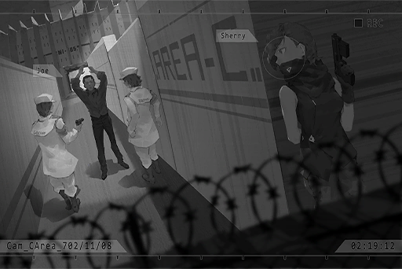

**Agent B**  
No weapons, safe... Huh, no civilian ID card with you? That's quite suspicious.

**Agent A**  
Hey, tell us who you are.

**JOE**  
Just your average joe\~ Really\~ a\-ver\-ge joe. I was drinking with a few friends just nearby... Haha, what is this place?

**Agent A**  
This is an area under the restriction of Node 08's Administration Bureau. It's pretty far away from the city. Why would you travel all the way here to drink?

**JOE**  
You guys don't know? There's this abandoned piece of land in the nearby factory area. There was this rumor on iM. It says that a girl committed suicide there while connected to the virtual internet. After that, at the night of the full moon, when you login to iM there, you'll see a magnificent sight of the souls of the dead being trapped in the virtual internet. All of us are major fans of supernatural phenomenons. That's why we decided to meet up and drink there.  
This is the rare opportunity for a sacred pilgrimage!

**Agent B**  
Idiot... There are like 800 different versions of that urban legend. You actually believed that crap?

**JOE**  
... Yeah, yeah... I knew I shouldn't trust that bastard so easily in the first place...

**Agent A**  
What are you mumbling?

**JOE**  
No... I was just thinking, I just accidentally passed by. I probably won't get locked up for this, right?

**Agent A**  
Who knows if you're bulls\*\*\*ing us? Before we confirm your identity, stay here and behave yourself. Hey, watch over him. Don't let him try anything funny.

**Agent B**  
... Sighs\~ What a pain in the a\*\*...

**JOE**  
Sorry 'bout that, mate. Haha... I'm thirsty. Do you have booze?

_\[→Signal Switch\]_

**Cherry**  
Is he going to be alright...?  
Sorry... Leave Simon up to me.

_\[Footsteps\]_

_\[Signal Lost\]_

[Last Log](#os-log-035) | [Back to Top](#list-of-logs) | [Next Log](#os-log-037)

## Added on v2.3

### OS Log #037
___

[Last Log](#os-log-036) | [Back to Top](#list-of-logs) | [Next Log](#os-log-038)

#### Requirements
| Char. |Lv.|Lv. Locked?|
|-------|:-:|:---------:|
|**JOE**|32 |    No     |

#### Audio\_St91\_702\_11\_10
_\[Door Opens\]_

**Hunter**  
You f\*\*\*ing piece of s\*\*\* machine! The cards you dealt me were totally rigged! You really think I can't tell such clear bulls\*\*\*!?

**[Drone]**  
_Gambling comes with its own risk. Customer, please control your emotions!   
If your numbers exceed the standard, this unit will activate "cleanup mode" and eradicate any dangerous targets!_

**Hunter**  
Tch... I'm not coming to this goddamn place again!

_\[Door Closes\]_

**Hunter**  
F\*\*\* this...

**JOE**  
Man, not your day today, isn't it? Mad Dog.

**Hunter**  
Huh? What the f\*\*\* is a loser with no balls like you doing here?

**JOE**  
Oh, spare me that loser crap. I came all the way here just to find you.

**Hunter**  
Find me for what! You wanna taste my fist that badly?

**JOE**  
... Hey, this is the main street. Drones may pass by here at any moment. Even you should realize this is not the place to do stupid s\*\*\*, right?

**Hunter**  
Hmph... bug off!

_\[Footsteps\]_

**JOE**  
You're leaving? What a shame. I was gonna talk to you about a transaction... Too bad that you don't seem to be interested in some quick cash.

**Hunter**  
Transaction? What transaction?

**JOE**  
Hoho, you interested now? Did you gamble away all your savings back there? Haha.

**Hunter**  
Shut your pie hole and just tell me!

**JOE**  
Well, I know this "investor". Dude's trying to send a few "Automatons" to 03, and he has to do it without alerting the admins.

**Hunter**  
"Automatons"... Oh, illegal travelers.

**JOE**  
Yep. Some folks who can't take the regular routes, so they had to come to me.

**Hunter**  
Then what the hell does that have to do with me?

**JOE**  
I know you're the one in charge of Baro's transactions recently... Simply put, a few people will go to the "tunnels" with you. You just need to pretend to not see them. Shouldn't make much of a difference, right?

**Hunter**  
... How much will I get?

**JOE**  
I knew you'd ask. If it's 50\-50 between us... this much...

**Hunter**  
......! Holy s\*\*\*, that's a lot of dough!

**JOE**  
Right? You don't get opportunities like this every day! So? Are you going to accept this?

**Hunter**  
The f\*\*\* you talking about, of course I'm accepting it!

**JOE**  
Good. Then I'll be frank with you. The "automaton" is this guy.

_\[Send\]_

**Hunter**  
...... Simon Jackson!?

**JOE**  
Yep. You knew about him too, right? The person who was hiring gunmen a while back is also the investor this time. He wants me to help send Simon Jackson to 03 and let him hide there for some time.

**Hunter**  
But, Capo Angus said that Boss wants this guy to just disappear. Why the heck would I help him?

**JOE**  
Diego... you bastard...

**Hunter**  
Huh? What did you say?

**JOE**  
... Mad Dog, think about it. This guy is completely f\*\*\*ed right now. Let's just ship him to 03 and let him rot to death there. Isn't this a much safer move for Baro?

**Hunter**  
Umm...

**JOE**  
As with the Boss, no need to worry. You don't say a word. I don't say a word. No one in the entirety of Baro will ever know about this.

**Hunter**  
......

**JOE**  
As long as you accept this case, Simon Jackson will no longer mess with Baro's business. On top of that, we get to make some sweet cash out of it. Perfect win\-win situation for everyone.

**Hunter**  
Hmph, fine. We'll go with your plan... However!

_\[Hit\]_

**JOE**  
Yikes! What the hell are you...

**Hunter**  
Lemme warn you, if you or this Simon Jackson dare to mess up anything, I will kill both of you on the spot... just like how I killed that disgusting dog of yours.

**JOE**  
......

**Hunter**  
Also, 70\-30 with the money. Of course, the 70 goes to me. Get it?

**JOE**  
A... alright, 70\-30 it is! You get 70%. I get 30%!

**Hunter**  
Hmph, smart move for you. Now p\*\*\* off, loser!

_\[Footsteps\]_

**JOE**  
Whew\~ Sighs... ha, haha, hahaha!

**JOE**  
... That guy... turns out he's not that hard to handle.

_\[Signal Lost\]_

[Last Log](#os-log-036) | [Back to Top](#list-of-logs) | [Next Log](#os-log-038)

## Added on v2.4

### OS Log #038
___

[Last Log](#os-log-037) | [Back to Top](#list-of-logs) | [Next Log](#os-log-039)

#### Requirements
| Char. |Lv.|Lv. Locked?|
|-------|:-:|:---------:|
|**JOE**|33 |    No     |

#### Audio\_Cafe\_702\_11\_17
_\[Door Opens\]_

**JOE**  
......?

_\[Things crashing\]_

**JOE**  
Woah!? PAFF? Are you alright!? Why did you run upstairs?

**PAFF**  
Hah... hah...

**NEKO#ΦωΦ**  
Aroma\-chan! Your nose is bleeding!

**PAFF**  
......

**NEKO#ΦωΦ**  
Ah! It's the same as last time. Could it be that you remembered something again?

_\[Things crashing\]_

**JOE**  
Hey! Where are you going? You can barely stand. Take a seat and catch your breath first, okay?

**PAFF**  
... Kaori...

**JOE**  
......!?

**NEKO#ΦωΦ**  
... Who?

**PAFF**  
I don't know...

**NEKO#ΦωΦ**  
......?

**JOE**  
... Kaori...?

_\[Things crashing\]_

**JOE**  
Hey!? You shouldn't be moving around...

**PAFF**  
I remember now! I have to go find him!

**NEKO#ΦωΦ**  
Find him? Find who!?

**PAFF**  
Hayato!

**JOE**  
......!!

_\[Runs\]_

_\[Doorbell\]_

**NEKO#ΦωΦ**  
Aroma\-chan! Where are you going!? Wait for me!

_\[Runs\]_

_\[Doorbell\]_

**JOE**  
Hey! NEKO!

_\[»»» Fast Forward»»»\]_

**JOE**  
That's... how is that... that can't be right...

_\[Doorbell\]_

**JOE**  
NEKO!? How did it go? Where's PAFF?

**NEKO#ΦωΦ**  
She was so fast. NEKO couldn't catch up to her... _\*Huff\*... \*Puff\*_

**JOE**  
Those names she just mentioned, I think I know who they are.

**NEKO#ΦωΦ**  
Eh!? For real?

**JOE**  
Yeah. They clearly don't sound like Node 08 names, which makes it easier for me to remember. Take a look at this business card.

**NEKO#ΦωΦ**  
... Hayato! Who is this exactly?  
Ah! Isn't this the reporter who was chasing after us yesterday!?

**JOE**  
Looks like he's the one... This guy came to my shop once and mentioned that he was looking for a girl. I think Kaori was the exact name of the girl he was looking for.

**NEKO#ΦωΦ**  
Then why did Aroma\-chan...

**JOE**  
No idea. However, she said just now that she's going to go find him. My guess is that she definitely remembered something.

**NEKO#ΦωΦ**  
Is there an address on the business card?

**JOE**  
Only the address of the company...

**NEKO#ΦωΦ**  
NEKO's gonna go there right now!

_\[Doorbell\]_

**JOE**  
Hey!

_\[Phone Rings\]_

**JOE**  
What the hell? Who would call at this time...  
Hello!?

**[???]**  
_JOE, it's me._

**JOE**  
Simon!?

_\[Signal Lost\]_

[Last Log](#os-log-037) | [Back to Top](#list-of-logs) | [Next Log](#os-log-039)

### OS Log #039
___

[Last Log](#os-log-038) | [Back to Top](#list-of-logs) | [Next Log](#os-log-040)

#### Requirements
| Char. |Lv.|Lv. Locked?|
|-------|:-:|:---------:|
|**JOE**|33 |    No     |

#### Audio\_Cafe\_702\_11\_17
_\[Phone Rings\]_

**JOE**  
What the hell? Who would call at this time...  
Hello!?

**[???]**  
_JOE, it's me._

**JOE**  
Simon!?

**[Xenon]**  
_Is everything fine on your side?_

**JOE**  
NOPE! Nothing is fine here! So many things have happened! My brain is having trouble comprehending everything!  
Besides, shouldn't I be the one asking you? Where are you now? Is this call secure?

**[Xenon]**  
_Yes. I'm calling from Sherry's communication device with encryption. Have you seen the news?_

**JOE**  
......?  
No... I'll watch it now.

**[TV]**  
_... Just now, we've also been gradually receiving news regarding the drones' attacks on the cities. Due to the extreme chaos at the site, the number of casualties and other details are still unknown..._

**JOE**  
Yikes... That seems really bad. Rest assured though. The location in the news is quite a distance from here. From the looks of it, it shouldn't be anything serious.

**[Xenon]**  
_Good to hear._

**JOE**  
Ah, now's not the time to talk about that!  
I just experienced something that's actually a big deal!

**[Xenon]**  
_... What is it?_

**JOE**  
PAFF and NEKO...

**[Xenon]**  
_PAFF and NEKO??_

**JOE**  
Ahh... my brain is still in complete chaos. All in all, you should calm down and listen to me!

**[Xenon]**  
_You're the one that should calm down. What happened exactly?_

_\[»»» Fast Forward»»»\]_

**JOE**  
... That's pretty much it. Oh, and both of them rushed out of my shop just now.

**[Xenon]**  
_......  
Understood. However, this encrypted call won't last too long. Sherry and I are at a really bizarre underground facility right now. We're about to be on our way to Node 03. I'll contact you again once we arrived in Node 03. I'll contact NEKO too._

**JOE**  
Gotcha! Ah, one more thing. Once you get there, go find KAI first. I told him about this. He'll probably figure out a way to get you guys a place to stay for a short while.

**[Xenon]**  
_... Don't get unrelated people involved in this stuff, will you..._

**JOE**  
What are you talking about? We're all related through "Crystal PuNK", right? If there's trouble, of course we'll help each other out!

**[Xenon]**  
_Okay, okay, you win... Alright, I get it. Then that's it for now. Also, thanks._

_\[Call Ends\]_

**JOE**  
Sigh...... I need a drink...

_\[Signal Lost\]_

[Last Log](#os-log-038) | [Back to Top](#list-of-logs) | [Next Log](#os-log-040)

## Added on v2.8

### OS Log #040
___

[Last Log](#os-log-039) | [Back to Top](#list-of-logs) | [Next Log](#os-log-041)

#### Requirements
| Char. |Lv.|Lv. Locked?|
|-------|:-:|:---------:|
|**JOE**|34 |    No     |

#### Audio\_Baro\_702\_12\_21\_1
_\[Door Opens\]_

**Hunter**  
What the f\*\*\* are you arguing about!?

**Fang**  
... Hunter, calm down.

**Hunter**  
Oh, shut your piehole!   
Hey, what are you pieces of crap doing here all of a sudden?

**Zheng**  
Quit barking, Mad Dog. Everybody heard about what happened to Diego. We're here to ask for an explanation.

**Hunter**  
Ex\-Explanation? What explanation?

**Zheng**  
Your entire branch in 03 was f\*\*\*\*\* annihilated and Diego's brains exploded into a bigger bloom than a goddamn sunflower, no? This ain't no resting in peace. Who's Baro feuding with? Will it affect the other gangs? You better give me an explanation.

**Hunter**  
Uhh...

**Lai**  
Brother, that's not all! Some of our boys were also in the branch that was destroyed. Baro was the one that forced us to send people there. How are you gonna take responsibility for that?

**Hunter**  
Responsibility my a\*\*! Most of the guys killed were ours!

**Fang**  
Hunter!  
Sorry, Brother Zheng. We're doing our best to investigate it right now...

**Zheng**  
We're really sorry about what happened to Diego. However, he was making everyone take on work that overstepped certain boundaries. It caused the public reputation of us gangs to become worse and worse. And now, he even got himself involved with those drones that caused all that chaos... He lost his life because of that, didn't he?

**Hunter**  
All this pointless yapping. You think I'm stupid or what?

**Zheng**  
Hmph, so the Mad Dog doesn't understand human language, huh? Then let me be clear... Our organizations are leaving the control of the Baro Brotherhood. From now on, you stay out of our way and we'll stay out of yours.

**Hunter**  
You piece of...!

**Fang**  
... Brother Zheng, you don't have to do this.  
Without the support of Baro, with the power and resources you have now, there's no way you'll survive...

**Lai**  
And why do you think that's the case? Because you Baro bastards took them away from us!

**Zheng**  
Lai, stop it.  
We were able to make it work 20 years ago. Right now, we're merely starting over again. This situation with the drones is serious. If we just contribute our strength and help out the victims, then we'll naturally carve out a new way to survive.

**Fang**  
... I don't oppose that, but Diego unified the gangs so people like me, who were abandoned by society since youth, can get some respect without the need to rely on normal people to get by...

**Zheng**  
Fang... you've been in the gangs since you were a child. I understand how you feel... You entered Baro to protect yourself, but you don't entirely agree with Diego's methods. We don't even need to mention this dumb mutt, obviously...

_\[Fists Flying\]_

**Zheng**  
Oof!

**Lai**  
Brother Zheng!

**Hunter**  
Who said you could keep talking!?

**Fang**  
Hunter!? What the hell are you...

**Hunter**  
Listen carefully, you pieces of s\*\*\*! Diego might not be here, but Baro's men and guns still outnumber all you little s\*\*\*shows combined by a country mile! Fang, ain't that right!!?

**Fang**  
……

**Zheng**  
Tch...

**Hunter**  
Get it straight. The lives of you worthless craps belong to Baro! You wanna leave? Great! You'll soon find out whether or not you can do business without me finding out about it!

**Lai**  
Damnit... are you threatening us?

**Hunter**  
Yeah, I am threatening you f\*\*\*s! You got a problem!?

**Fang**  
... Hunter! They're our elders...

**Hunter**  
_\*spit\*_...! So what? What the hell is there to discuss with the boss of a has\-been gang like that? You think just cuz Diego died, you are free to leave? Bulls\*\*\*! If you wanna live longer, you better listen and listen good!

**Fang**  
……

_\[Door Knock\]_

**???**  
Yo, can I come inside?

**Gang Member**  
You kidding? Course not! The bosses are discussing serious stuff...

**???**  
Oh, so I made it in time? Wonderful.

**Fang**  
......?

**Hunter**  
Wha the hell's going on outside!?

_\[Door Opens\]_

**JOE**  
Long time no see, guys. Ooh, everyone's here.  
... My information was right on the money after all.

**Hunter**  
S\*\*\*head!?

**Fang**  
... It's you?

_\[Signal Lost\]_

[Last Log](#os-log-039) | [Back to Top](#list-of-logs) | [Next Log](#os-log-041)

### OS Log #041
___

[Last Log](#os-log-040) | [Back to Top](#list-of-logs) | [Next Log](#os-log-042)

#### Requirements
| Char. |Lv.|Lv. Locked?|
|-------|:-:|:---------:|
|**JOE**|34 |    No     |

#### Audio\_Baro\_702\_12\_21\_2
**Zheng**  
... JOE? Haven't seen you in years.

**JOE**  
Haha, Brother Zheng! You used to come to the shop to talk things out with Brother Luo. Pops would always treat you to an extra Godfather. You even said that it was the best booze you ever had in your life, am I right?

**Zheng**  
Oh... you still remember that?

**JOE**  
Of course. There's also that one time you guys held a bachelor party in the shop. Threw up all over the place. Pops had quite the long face that night. It was hilarious...

**Hunter**  
F\*\*\*. what are you blabbing 'bout!? Who the hell allowed you to come in here?

**JOE**  
Relax. I know you guys are talking about Diego... He was shot in one of the branches and no one knows who killed him, right?

**Hunter**  
!? How did you know…

**JOE**  
I deal in information. I have first\-hand intel on the situation in 03. Let's talk about the serious stuff. Brother Fang, you guys are in big trouble.

**Fang**  
... We'll figure something out.

**JOE**  
From what I've heard, you are in a total mess now. Baro's been abusing the power and reaping the rewards for a long time. With Diego now gone, many people are skipping out in fear of being avenged... the organization's collapsing, fast.

**Hunter**  
Shut your mouth! You wanna die!?

**Zheng**  
JOE, you came all the way here for a purpose, right? Why don't you just tell us what is it.

**JOE**  
... First, take a look at this.

_\[Projection\]_

**Fang**  
Bank account information... Hmm!? That much...?

**Zheng**  
... That's no small money. Is it yours?

**JOE**  
Heck no... I couldn’t make this much even if I sold all my organs.  
This is Pops' secret bank account.

**Fang**  
Mr. Saxon's...?

**JOE**  
Hehe, Pops kept his account info hidden in a small safe. When he reconstructed the Café for me, he buried it inside the concrete wall. I was only able to find it by accident when my shop got blown to pieces by the drones a few days ago.

**Zheng**  
This is astonishing. This money could easily support the entire gang... Why would Uncle do this?

**JOE**  
About that, Pops left me a note. It's embarrassing to say... but he knew me too well. He knew that I'd spend this money recklessly, so he hid it. He even went as far as to say that he hoped I'd never find it.

**JOE**  
He said that I could only use it if all else failed. On top of that, he wanted me to think carefully about who the right people are to spend this money on, this money that was earned by the boys in the gang, one penny at a time.

**JOE**  
I stressed all night. Even thought about escaping to Node 47 with this money and making it big there... but I can't do that. Pops would be very sad if I did that.

**Fang**  
……

**JOE**  
... Everyone knows in their hearts that Diego had been going overboard these last few years. The ordinary folk already treat the gangs as complete bad guys... This is not the kind of balance that Pops wanted.

**JOE**  
This money should not be used by me. It belongs to the gangs. I want to use it to unify everybody. Let us live with our chests out, chins raised high. Let's change people's opinions of us... Like what Pops would definitely say, "To not let gangs become something truly evil".

**Zheng**  
... You wanna return to Uncle's way of doing things? All by yourself?

**JOE**  
That's right. By myself, and every single brother in the gangs. Haha, I don't have the brightest mind, so that's all I could think of...

**Fang**  
You're too naïve, JOE. Those who live in the shadows will always be treated like trash by those who live under the sun. It was Diego who brought us above them. It was him who gave us our own power and territory...

**JOE**  
But his way of doing things caused way too much misfortune for way too many people. Remember Brother Wang? You and I... we both lost something we'll never get back.

**Fang**  
... Wang, he... was caught by the admins.

**JOE**  
Brother Fang, the admin operation that arrested the remaining Ando members really came out of nowhere; weren't you even a bit suspicious? The Ando gang at the time was already severely weakened; what was the point of arresting them? Who's the one that leaked the info to the admins? And who's the one to gain full control of 08's gangs through all of that?

**Fang**  
……

**JOE**  
Getting rid of all obstacles just for your ideals, not even caring if it's your own people... I don't want to see my friends living in a world like that.

**Zheng**  
_\*Chuckles\*_, everyone can see it clearly. Eh…well then, whatta you wanna do? Successor of Café.

**JOE**  
Brother Zheng, Brother Feng, and all who are here. I, Joe Miller, swear upon Pops' name, that the Café will help everyone maintain order, and bring things back to the way Pops envisioned. However, I can't do it myself... please!

**Fang**  
… JOE…

**Hunter**  
F\*\*\* you!!!

_\[Fists Flying\]_

**Hunter**  
You half\-crocked piece of s\*\*\*! Sweet words, but you ain't doing s\*\*\*. You're just trying to use this chance to steal my business!

**JOE**  
This money was earned by everyone in the gang. It's not yours, Mad Dog! I'm absolutely not backing off this time!

**Hunter**  
Back off my a\*\*\*! Eat my fist!

_\[Blocks\]_

**JOE**  
……

**Hunter**  
!? You stinkin...

**JOE**  
HMPH!

_\[Punch\]_

**Hunter**  
GaPuh!!!!

_\[Objects Crashing\]_

**JOE**  
This punch is for Zark and that girl!

_\[Footsteps\]_

**Fang**  
... Nice.  
JOE... I'll believe you this time. The Baro Brotherhood will comply with your proposal. Go for it.

**Zheng**  
Second.  
However, the purer the idea, the harder it is to implement. I hope you can walk the walk better than you talk the talk.

**JOE**  
Don't worry, I won't screw up this time...  
Let me handle it.

_\[Signal Lost\]_

[Last Log](#os-log-040) | [Back to Top](#list-of-logs) | [Next Log](#os-log-042)

## Added on v2.9

### OS Log #042
___

[Last Log](#os-log-041) | [Back to Top](#list-of-logs)

#### Requirements
| Char. |Lv.|Lv. Locked?|
|-------|:-:|:---------:|
|**JOE**|35 |    No     |

#### Audio\_Factory\_702\_12\_28
_\[Hurried Footsteps\]_

**Gang Member A**  
Huff, puff... Finally got it on the car.

**Hunter**  
S\*\*\*! You little... You let them take a picture of my face!

**Gang Member B**  
You're the one who fell and activated the surveillance equipment...

**Hunter**  
Cut the crap!

**Gang Member A**  
As it stands, all we can do is take the passage to the storage space in 03. We loot the place and get the chips. Mogura will have a buyer, no doubt...

**Hunter**  
Hmph, that's been my plan all along! Let's go...

**Lai**  
Don't move! Everyone put your hands up!

_\[Raises Gun\]_

**Hunter**  
!? ... You? Why are you here!?

**Zheng**  
You think scheming s\*\*\* like this wouldn't be found out? Bit naive, wouldn't you say? JOE, tell 'em what's up.

**JOE**  
... For this robbery, you bought plastic explosives and a full lockpick kit from a middle\-man. Am I right?

**Hunter**  
Y\-You, h\-h\-how'd you...

**JOE**  
What a shame, everyone on the streets knows you've been banished. The broker notified me within five minutes of the deal. That's how I found out what you were up to.

**Hunter**  
... Oh...

**JOE**  
Mad Dog... we're getting ready to change how people look at us. If you do something like this and the gangs lose any sense of morality...

**Zheng**  
Well put. Even Diego knew the importance of keeping 08 the strongest... Only then could we contend with 03; wouldn't have to remain their b\*\*\*\* forever. Why'd you think he never went after this factory?

**Hunter**  
I\-I...

**Zheng**  
Of course you didn't know. You're a friggin' imbecile.  
You see something enticing and you start drooling. You get some cash, a bit of power, and you get so self\-satisfied... Just a stupid, near\-sighted dog.

**Hunter**  
...... SHUT UP!!

**Zheng**  
I don't wanna waste my breath.  
Give up on the chips and go with us.

**Lai**  
Move it! Wanna eat bullets!?

**Gang Member A, B**  
O\-Okay!

**Hunter**  
Ugh... You...!

**JOE**  
Forget it, Mad Dog! Ya failed! Give it up and we won't go hard on you!

**Hunter**  
Failed... Me? Hahaha! You s\*\*\*head, who do you think you are? Think you can just step on me and climb to the top! I'll tell you, you got some imagination! I'm...

**Zheng**  
... Don't worry about him, Lai.  
Give the chips back.

**Hunter**  
... Haha! You made me do this!!

_\[Explosion\]_

**Lai**  
Wah! This bastard... he's crazy!

**Hunter**  
Ha, haha. Real arrogant, ya know! You pieces of trash...

**JOE**  
Hey, what the hell you doing! You set yourself on fire!

**Hunter**  
Wah, Wahhh!? WAAAHHH!!!  
My hair! It's hot, so hot, AAAAAAHH!!

_\[Sprints\]_

**Hunter**  
Waaaahhhh......

**Lai**  
Don't think about runnin'! Get 'em!

**JOE**  
... Wait a sec, Lai. Forget it... The chips are fine. Let him go!

**Lai**  
Forget what? That rotten bastard. I'm gonna peel his skin...

**JOE**  
That guy... He can't do anything. Doesn't matter where he goes, no one is gonna take him in. If Pops was here, he'd feel sorry for him...

**Lai**  
......

**Zheng**  
Hmph, alright, that's enough.  
Law enforcement agents will be here soon. We've got other stuff to do. Can't be bothered having to deal with them.

**Lai**  
You got it, brother Zheng. Should we put the chips back?

**Zheng**  
Nah, let's take them back and watch after them for now.  
JOE, you must be able to get in contact with the Administration Bureau, right? First, let 'em know what's going on. After we're sure we won't get wrapped up in this, then we'll give 'em back the goods.

**JOE**  
... Got it.

_\[Footsteps\]_

**Zheng**  
Ain't no perfect endings in this world, just regrets. Get it? That's life, kid.

**JOE**  
Yeah, yeah. I get it... damn.

**Zheng**  
Hehe... The person that taught me that, even though he knew that life was cruel, he never gave up on his ideals. That kind of commitment really moved us. That's the reason we could last in this city.   
... Haha, his cocktails were really something.

**JOE**  
... Pops...

**Zheng**  
Now it's your turn. It's not too late.  
Do it well. I'm looking forward to it... The time has come for you to be called Uncle.

_\[Signal Lost\]_

[Last Log](#os-log-041) | [Back to Top](#list-of-logs)

