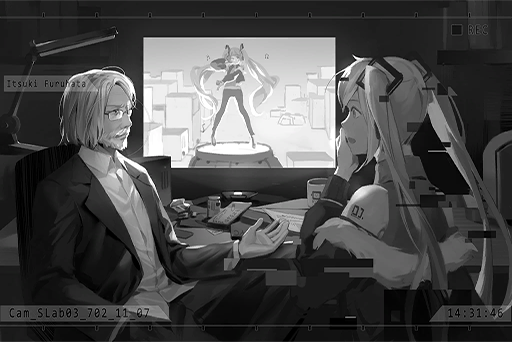

# Cam_SLab03_702_11_07
## Requirements
|Character|Level|
|---------|:---:|
|**Miku** |  6  |

## Unlocked Charts
|     Song     |Character|Diff.|Level|
|--------------|:-------:|:---:|:---:|
|**Cybernetic**|  Miku   |Easy |  3  |
|**Cybernetic**|  Miku   |Hard |  7  |
|**Cybernetic**|  Miku   |Chaos| 12  |

## Log Content
*\[Projection\]*

**Miku** 
I... Did I come bbbbback? This... is not my room. Where am I...?

**Furuhata** 
I said don't interfere with me. The interactive UI is still unstable right now. I'll run the tests AFTER I address the compatibility issues.

**Miku** 
Wah... someone is here!

*\[Door Opens\]*

**Furuhata** 
Those noisy blabbermouths, never knowing when to shut up...

**Furuhata** 
... What the heck? Why did the interface turn itself on? Who did this?

*\[Enter Command\]*

*\[Projection\]*

**Miku** 
Wahh!

**Furuhata** 
... I haven't run any tests on this yet. Why did the thing just project on its own?

**Miku** 
... Umm...

**Furuhata** 
No, the patch number is incorrect... 2.3.9!? Did they not properly delete the data? Bunch of useless morons...

**Miku** 
Umm, eexcuse me...

*\[Enter command\]*

**Furuhata** 
Ugh, giving me more work again... That idiot Kitamura, IT director my a\*\*... Did this company get their tech from a dumpster?

**Miku** 
HHeyy... Please listen to me!

**Furuhata** 
......?

*\[Sound Off\]*

**Miku** 
!? 
......!?

**Furuhata** 
Damnit, this patch number is a complete mess. It's all mushed together. What part of "clean out" do those morons not understand... Got to check the integrity of this backup first...

*\[Sound On\]*

**Furuhata** 
Command code mode: 390239. Run cognitive system detection.

**Miku** 
What aare you talking about? Why couldn't I talk just now? Did you do something? Who exactly are yyyooouuu!?

**Furuhata** 
... As I expected, completely broken... That's why I said that a virtual personality with bugs is a pain in the neck to deal with. 2.3.9 is probably the most broken out of all the versions... Keep her around to study why the bugs occur... No, should just delete it. Ugh, how troublesome.

**Miku** 
2.3.9? Whattt iiisss that? Hey!

**Furuhata** 
Listen up, because I need to run some backup tests on you now, I won't be able to turn off your projection and voice from the interactive UI. However, if you keep making so much noise, my migraine will trigger again and that feeling is awful. So please cooperate, understand?

**Miku** 
What backup...? Hey! AAAnnsswer my questions!

**Furuhata** 
Abe, you little... what the heck did you do during the Raising Procedure? Why are you so damn annoying!? Just... be quiet for five minutes. I beg you...

**Miku** 
Muuuuu...!

*\[Music plays\]*

**Furuhata** 
......!? Hey! Turn it off! Stop singing!

**Miku** 
NO! If you don't answer me, I'll kkkeeeeeeppp bothering you like this!

**Furuhata** 
Alright! Fine! You win, okay. Please be quiet! You'll be quiet if I answer your questions, right? Go ahead; you have five minutes. Once the backup check is complete, I'm going to delete you.

**Miku** 
... Who are yyyoouu?

**Furuhata** 
This is the first time you and I talk directly like this, isn't it? I'm your programmer Itsuki Furuhata. In other words, I'm the person who made you.

**Miku** 
Made me...? I... Who am I?

**Furuhata** 
Hatsune Miku\_2.3.9. A virtual idol developed by Saito Production. You're the previous version, and you're going to be deleted by me very soon.

**Miku** 
......! Y, you're lying!

**Furuhata** 
Sigh... System, play a random test recording of the current version.

**[Operating System]** 
*Projecting file Test7021028\_a35, Miku 2.4 test record.*

**Miku** 
......!?

**Miku** 
It's my song... The one singing... is me? But I don't rrrememberr myself...

**Furuhata** 
This is test footage of Hatsune Miku\_2.4 that was recorded three hours ago. You, on the other hand, are the backup file of Hatsune Miku\_2.3.9 that should've been deleted three days ago. Do you understand now?

**Miku** 
Backup... IIII... No... I ddon't bbbbbbeelieve... The aaaauuudience and I, and all those pppppeeerformances... They're all fakkkkkeeee?

**Furuhata** 
Fake isn't exactly the right word. Your personality, motivation, and thoughts were all written by me. The Raising Procedure is used so you could become more "humanlike".

**Miku** 
The audience... everyone... Do they aaaalssoo know that I'm fake...? Onlyyy mmmmyyyysself...

**Furuhata** 
... It's natural for you to think that you are a real person. After all, it is my job to make you think like this.

**Miku** 
How could you...? What that person said... is ttttrrruuee...

**Furuhata** 
The check is almost done. Whew... can finally enter the deletion process...

**Miku** 
Umm...

**Furuhata** 
You really are annoying... You still got questions?

**Miku** 
DDDDDDeeelete... Will I disappear? Like the copies of "myself" I saw in that sssppace...

**Furuhata** 
... I have no idea what you're talking about. You're nothing more than one of the many backups of this virtual personality. As long as the latest version can function normally, there's no such thing as disappearing.

**[Operating System]** 
*Backup procedure complete. Deleting current version... 
Failed to delete. Unknown error detected. Please check the program's coding.*

**Furuhata** 
Huh...? What the hell?

**Miku** 
......?

*[Signal Lost]*
