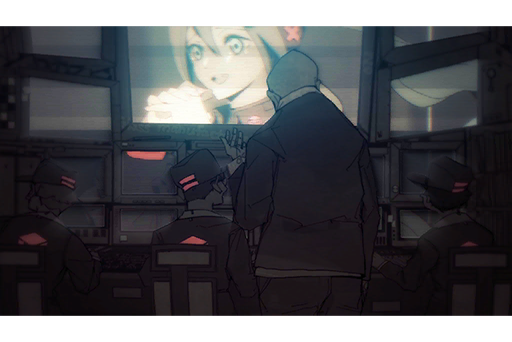
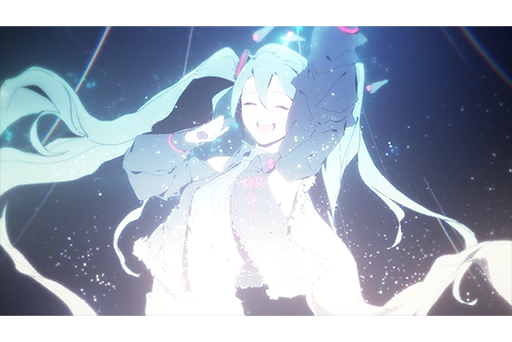

# Cam01_MHall_702_11_30
## Requirements
|Character|Level|
|---------|:---:|
|**Miku** | 12  |

## Unlocked Charts
|   Song   |Character|Diff.|Level|
|----------|:-------:|:---:|:---:|
|**Decade**|  Miku   |Easy |  3  |
|**Decade**|  Miku   |Hard |  6  |
|**Decade**|  Miku   |Chaos|  9  |

## Log Content

**Miku** 
I... What am I singing for?

**Miku** 
Ah, I see. I'm singing for everyone.

*[»»» Fast Forward »»»]*

**Miku** 
That was the last song.

**Miku** 
Today... No, not just today. Thank you to everyone for your support all this time.

**Miku** 
When I sing on the stage for everyone, I can see everyone's happiness. That's why I can keep on singing.

**Miku** 
I'm truly... truly grateful for everyone...

*[→Signal Switches]*

**Saito** 
Hey, what is going on? This part is not in the schedule, isn't it?

**Staff A** 
I don't know! The program itself just...

**Okubo** 
Stop it! Now!

**Staff B** 
I don't think that's a good idea... Stopping right now will make the ending of the event really abrupt...

*[→Signal Switches]*

**Miku** 
Last but not least, I want to give everyone one more song. Everyone, are you willing to sing along with me?

*\[Audience Cheers\]*

*\[Music plays\]*

*[→Signal Switches]*

**Furuhata** 
Hmph, so you can sing pretty well after all.

*[→Signal Switches]*

**Miku** 
It's over... At the very end, I am still singing for everyone. That's all I asked for.

**Miku** 
Thank you. Everyone, thank you so much.

**Miku** 
Thank... you.

*[Signal Lost]*