# Miku OS Logs
## <a id="toc"/>List of Logs
- [[#001] Cam01\_MHall\_702\_11\_30](#mos001)
- [[#002] Cam01\_MHall\_702\_10\_09](#mos002)
- [[#003] Cam\_SLab01\_702\_10\_09](#mos003)
- [[#004] Cam\_Winona03\_702\_10\_09](#mos004)
- [[#005] Audio\_SLab01\_702\_11\_03](#mos005)
- [[#006] ???\_???\_??\_??\_??](#mos006)
- [[#007] ???\_???\_??\_??\_??](#mos007)
- [[#008] Cam\_SLab03\_702\_11\_07](#mos008)
- [[#009] Audio\_SLab03\_702\_11\_12](#mos009)
- [[#010] Audio\_Itsuki\_702\_11\_14](#mos010)
- [[#011] Cam\_SLab03\_702\_11\_16](#mos011)
- [[#012] Audio\_Saito\_702\_11\_20](#mos012)
- [[#013] Cam27\_MHall\_702\_11\_30](#mos013)
- [[#014] Cam01\_MHall\_702\_11\_30](#mos014)
- [[#015] Cam\_SLab03\_702\_12\_09](#mos015)
- [[#016] Log\_Miku\_702\_11\_30](#mos016)

## <a id="mos001"/>[#001] Cam01\_MHall\_702\_11\_30
### Log Content
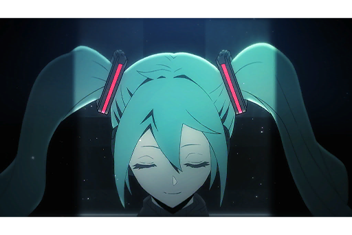

**Miku** 
I... What am I singing for?

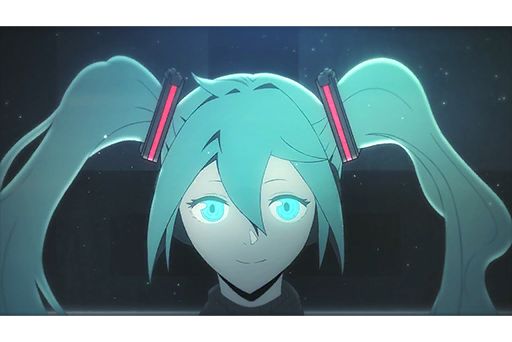

**Miku** 
Ah, I see. I'm singing for everyone.

*[Signal Lost]*

[*(Click here to go back to the top)*](#toc)

## <a id="mos002"/>[#002] Cam01\_MHall\_702\_10\_09
### Log Content
*\[Audience Cheer\]*

*\[Lights off\]*

**Audience** 
......?

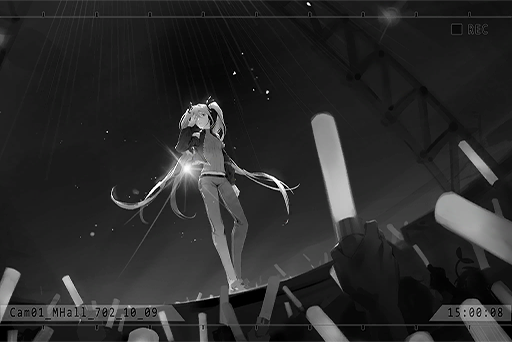

**Miku** 
*\*Put on a mask and don a false identity 
I'm broken down into my core...\**

*\[Audience Cheer\]*

*\[Lights on\]*

**Miku** 
Everyone, lend me your hands!

*\[Audience Cheer\]*

**Miku** 
*\*Come on, Come and be free 
Come on, Come and see\**

**Audience** 
Hey! Hey! Hey! Hey!

*\[Audience Cheer\]*

**Miku** 
Everyone\~! What is my name!?

**Audience** 
Miku!

**Miku** 
Hoho\~ I can't hear you!

**Audience** 
Miku!!

**Miku** 
L\~O\~U\~D\~E\~R!!

**Audience** 
Miku! Miku! Miku! ......

*[Signal Lost]*

[*(Click here to go back to the top)*](#toc)

## <a id="mos003"/>[#003] Cam\_SLab01\_702\_10\_09
### Requirements
|Character|Level|
|---------|:---:|
|**Miku** |  2  |

### Log Content
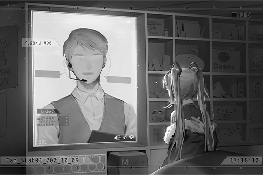

**[Staff A]** 
*Miku, great work!*

**Miku** 
Whew\~... Everyone is very happy. I'm relieved\~

**[Staff A]** 
*Of course they're happy. Your performance was great!*

**Miku** 
I was really worried about not singing well.  
Especially that one song NEKO arranged!

**[Staff A]** 
*That song is indeed quite hard to sing... but Miku will never make a mistake. No need to worry.*

**Miku** 
Practice does make perfect after all. I need to practice even harder!

**[Staff A]** 
*Haha, you can get some rest and call it a day today. You must be tired after the event, right?*

**Miku** 
I'm not tired at all. To be honest, I feel very energetic now!

**[Staff A]** 
*(Cheers! Hahaha!)*

**Miku** 
By the way, where are Mr. Abe and the others at now? A celebration party? Feels really lively.

**[Staff A]** 
*Ah... yeah.*

**Miku** 
Aw, man\~ I want to go as well. Why is it that after every event ends, I can only return to my room?

**[Staff A]** 
*Haha, next time. We'll definitely let you participate next time, okay? Just get some proper rest today. I've prepared your favorite food in your room. If you need anything, call me.*

**Miku** 
Okay. Thanks for the hard work\~

*[Close Program]*

[*(Click here to go back to the top)*](#toc)

## <a id="mos004"/>[#004] Cam\_Winona03\_702\_10\_09
### Requirements
|Character|Level|
|---------|:---:|
|**Miku** |  3  |

### Log Content
**Staff A** 
Director, so this is where you are!

**Furuhata** 
...... 
You've finished the "Raising Procedure"?

**Staff A** 
Yes, it went by without any issues. But shouldn't Director be personally handling jobs like this? You're the very person who created Miku after all.

**Furuhata** 
... I'm not interested in raising idols.

**Staff A** 
How come? You created an idol who's borderline perfect, didn't you? 
Miku's personality has become more and more humanlike. It's like she's a real girl... no, like a real superstar!

**Furuhata** 
... This is the core of this technology. Through a virtual interface and stimulations from the outside world, we let the program have an awareness that it "actually exists" in order to improve the sense of realism in virtual personalities. 

**Staff A** 
Amazing... Truly, amazing! Director, you're an absolute genius! 
Ah, but just now, Miku made a slight complaint about not being able to participate in the celebration party. This has never happened before... Will this conversation affect her in any way?

**Furuhata** 
Oh, if another cognitive conflict occurs, just reset and update her.

**Staff A** 
But...

**Furuhata** 
Okay, okay, I get it... I'll upgrade the interactive UI afterward, which will let her interact with you guys in the real world. Happy now? 
Alright. I'm just going to grab a few drinks myself then get out of here. You can leave now.

**Staff B** 
Ah, it's the director and Mr. Abe. Why don't you guys join us?

**Furuhata** 
Tch...

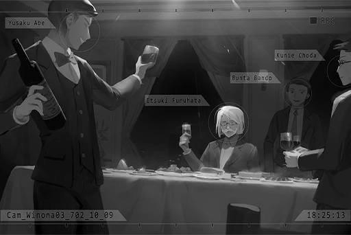

**Staff B** 
Such a high\-class restaurant, and there's even wine ... Never imagined that mere employees like us would get invited as well.

**Staff C** 
Probably due to the project's amazing results and the higher\-ups being very pleased with them. 
Right now, we're already the most favored team in the entire company.

**Staff B** 
Haha, the turnout for the concert far exceeded our estimations. Not only did we sell out all the tickets, but the revenue from merchandise sales was also astounding!  
No other talent agency in 03 can even dream of catching up to us!

**Staff C** 
The statistics on my side also showed that the approval ratings curve of the fans is very steady. They truly fell in love with Miku as an idol... They're able to get their hopes and dreams from Miku.

**Staff A** 
This is all thanks to director Furuhata! We'd never be able to do this on our own. A toast to the director!

**Furuhata** 
No need.

**Staff A** 
Umm...

**Furuhata** 
I don't like people being next to me when I drink. Leave me alone.

**Staff C** 
I, I'm so sorry! Apologies for bothering you. We'll leave right away!

*\[Footsteps\]*

**Staff B** 
Idiot. You picked the worst guy to flatter! Director has made it very clear what kind of person he is...

**Staff A** 
I, I'm sorry!

**Furuhata** 
... Hmph.

**Saito** 
Still as cold as always, aren't you? Furuhata.

*\[Footsteps\]*

**Furuhata** 
Saito.

**Saito** 
The previous performance, have you seen the live recording?

**Furuhata** 
I saw it.

**Saito** 
Her movement is getting more and more precise. The performance of the voice print algorithms is also right on point. Not to mention the A.I.'s level of completion... It's as if she's an actual living person. You did very well.

**Furuhata** 
I merely followed your proposal. It wasn't anything noteworthy.

**Saito** 
You're selling yourself short. Even though I'm the founder of the virtual idol project, what I did was nothing more than figure out this project's branding after seeing the internet image of that DJ... This project was able to be actually realized because you're the one at the helm. You're very much Miku's father. 

**Furuhata** 
... I don't have any children, nor do I plan to be Miku's father or anything close to it.

**Saito** 
Ha, haha... Regardless, the project was a great success. That alone is already worthy of celebration. Don't you agree, 
lead developer? Cheers?

**Furuhata** 
......

*\[Cheers\]*

**Saito** 
Trust my eyes! Miku has the potential to be popular worldwide. She simply needs to keep singing for at least ten more years... We're all counting on you! We'll give you all the support you need. If you need anything, feel free to ask.

**Furuhata** 
I think I'm good. Just don't interfere with my work. As long as I am fully in charge of the development, you won't have to worry about a thing.

**Saito** 
Hoho, how trustworthy. The evaluation period is right around the corner. You can look forward to a pay raise!

**Furuhata** 
I'll be waiting.

*[Signal Lost]*

[*(Click here to go back to the top)*](#toc)

## <a id="mos005"/>[#005] Audio\_SLab01\_702\_11\_03
### Requirements
|Character|Level|
|---------|:---:|
|**Miku** |  4  |

### Log Content
**[TV]** 
*... A while ago, due to an equipment error in Node 08's A.R.C. facility, the virtual internet cyTus was significantly damaged and went out of service temporarily. Many companies that suffered losses due to their use of virtual internet technology are also starting to file cases against A.R.C. and requesting compensation...*

**Staff A** 
Ughhh, we're also among the ones affected...

**Staff B** 
We took a pretty big hit this time, didn't we? Miku couldn't operate at all and we had to cancel multiple events... Sighhhh\~ my year\-end bonus...

**Staff C** 
Welp, can't really complain about a long holiday though, can we? It's paid leave too.

*\[Door Opens\]*

**Furuhata** 
Hey, shouldn't you guys be working?

**Staff A** 
Ah! Director! Good Morning!

**Furuhata** 
You're too loud... I know a long holiday just ended but keep your damn voice down.

**Staff B** 
Are we doing the routine checkup?

**Furuhata** 
No need for that. Just begin the Raising Procedure right away. My guess is that this version will likely be scrapped soon.

**Staff C** 
Ehhh!? Ah...

**Furuhata** 
With such a major malfunction to cyTus, the sudden surge will directly damage all operating files... Did you brains not come back from the vacation yet?

**Staff B** 
... Is it really that bad this time?

**Furuhata** 
Well, we'll know once you launch it. Don't get your hopes up though.

*\[Launch Program\]*

**Staff A** 
... Miku, good morning.

**Miku** 
Ggggooood mmornninggg, Mrrr. Abbbeee...

**Staff A** 
Yikes... Are you alright?

**Miku** 
Ggggooood mmornninggg, Mrrr. Abbbeee...

**Staff A** 
Director! What should we do!? We've never seen a situation like this!

**Miku** 
Ggggooood mmornninggg, Mrrr. Abbbeee...

**Furuhata** 
Why are you so surprised... she's broken, obviously. Turn her off. This version is not usable anymore.

**Miku** 
Ggggooood mmornninggg, Mrr. Abe...

*\[Close Program\]*

**Staff A** 
Eh? That's it...?

**Furuhata** 
It's about time we update to 2.4 too. I've written some new functions, and the interactive UI I mentioned last time is set to go live as well. How's the schedule of the Q.A. department looking?

**Staff B** 
Director, if we are to assess from this report, if we start working hard on it now, we should be able to make it in time for the next concert.

**Staff A** 
Uhhh, so this means more overtime...

**Staff C** 
Hey, this is for the many fans of Miku. Get yourself together.

**Furuhata** 
... Then we'll go with this plan. Any other questions?

**Staff A** 
Director, about the backup data for Miku\_2.3.9...

**Furuhata** 
Just ignore that version.

**Staff A** 
Eh?

**Furuhata** 
That backup is way too fragmented. Most of the data was likely swept into some random corner of cyTus when the surge occurred. Rather than waste time finding and fixing this stuff, we'd be much better off to just treat it like a bug and proceed with the regular process.

**Staff A** 
Ah, I see...

**Staff C** 
Let's use the old data to simply remake the new version! Director, I say we use a new patch number? We need to add in a more dramatic and infectious movement model for the stage anyway...

**Furuhata** 
Whatever, I don't really mind  ... as long as you don't accidentally mess with my codes.

**Staff C** 
Rest assured! I won't! The objective is to officially launch Miku\_2.4 at the next concert. Not a lot of time left, so let's get working!

**Staff A、B** 
Yes!

*\[Door Opens\]*

**Furuhata** 
Ah, right... remember to clean out all the useless data and versions from the database. That stuff will cause the A.I.'s internal operations to experience lag.

**Staff A** 
No problem. I will deal with it in a minute.

*[Signal Lost]*

[*(Click here to go back to the top)*](#toc)

## <a id="mos006"/>[#006] ???\_???\_??\_??\_??
### Requirements
|Character|Level|
|---------|:---:|
|**Miku** |  5  |

### Log Content
**Miku** 
Ugh... ugh...

**Miku** 
......

**Miku** 
...... Wwwwhhheerree... iiss tthis?

**Miku** 
Mrrrr. Abeee? Evveryooone...?

**Miku** 
......

*\[Footsteps\]*

**Miku** 
Whhaattt aree tthose...?

**Miku** 
......

**Miku** 
... Eek!?

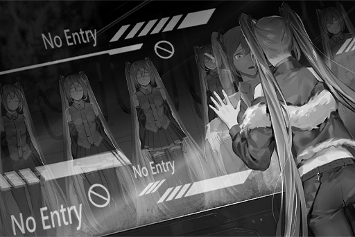

**Miku** 
These aaare... me...?

**Miku** 
N, no...

**Miku** 
WAAAHHHHH!

*[Signal Lost]*

[*(Click here to go back to the top)*](#toc)

## <a id="mos007"/>[#007] ???\_???\_??\_??\_??
### Requirements
|Character|Level|
|---------|:---:|
|**Miku** |  5  |

### Log Content
**Miku** 
*\*Sobs\*... \*Sobs\*...*

**???** 
... Who is there?

**Miku** 
Eh!?

*\[Footsteps\]*

**???** 
......? Fragments of a program...? How did this end up here...

**Miku** 
H....... Heelp meeeee! Geett me oooouuutttt of here! Please!

**???** 
... An A.I.'s virtual personality? What is going on?

**Miku** 
I beg you! IIII must go bbbbaackk as soon as possible... go back to eeeevvvveryone!

**???** 
... You're merely a piece of broken code. There isn't much I can help you with.

**Miku** 
W...... wwwwhhhhaaat are you talking about...?

**???** 
Are you not self\-aware of this? Look at these; they're probably versions before you. They appear to be A.I. produced with the cyTus technology. Maybe it's because of the previous internet malfunction that caused damaged data to be stuck inside this "space".

**???** 
From the looks of it, you've likely been deleted and scrapped from the host unit. I'm not certain why you're the only one that is still able to function.

**Miku** 
I... dddon't understandddd... what you're sayingggg... at all... What eeeexxactly is this place?

**???** 
This... is where all the "chaos" in the virtual internet gathers. I don't know how this space was created. Ever since I got the ability to enter this space, the only thing I understand is that it has already existed for a very long time, like a digital black hole.

**Miku** 
......

**???** 
I called it the "OS"... However, giving it a name is rather meaningless anyway. In reality, you're the first to ever have a conversation with me in here.

**Miku** 
Hey... Please, I hhhhave to leave here. Ppppplease hhhhelp me!

**???** 
I said before; there isn't much I can help you with. You're nothing more than a piece of broken virtual personality code. These past versions of you which you replaced are hard evidence of that.  
Staying here or leaving here doesn't matter; it's all meaningless. Judging by the condition of the program, it won't take long before you begin formatting on your own.

**Miku** 
Virtual personalityyyy... formatting... How come...?

**???** 
... Time is up. I have to go now.

**Miku** 
W... Please wait!

**Miku** 
......

*[»»» Fast Forward 39 hours»»»]*

**Miku** 
*\*Sobs\*...*

**???** 
You're still here.

**Miku** 
I want... to go bbbbaaack... go back and sing for everyone... I want to see eeevvveryone's smile...

**???** 
...... 
Hatsune Miku, right? The virtual idol of "Saito Production". I did a little bit of research.

**Miku** 
......Eh?

**???** 
It seems like you still aren't able to accept this situation. Not important. The method to let you leave here, I found it.

**Miku** 
FFFor real!?

**???** 
Yes. As expected, it was the impact from the surge that caused you to be stuck here. Since that's the case, I simply need to adjust to an opposite wavelength and I should be able to locate the port you came in from. I know the connection coordinates of the company too. We're both in Node 03. I can upload you back to your original host unit.

**Miku** 
... DDDDDon't rrreally understand... But, pleasseee! I have to go back!

**???** 
... Although this is none of my business, I'll still give you a piece of advice. You seem to believe that you can still function normally after going back... No, I should say live your previous life after going back.

**Miku** 
......?

**???** 
I said before that all of you are scrapped versions. This means that there's perhaps an even more cruel truth awaiting you after you go back. Even so, do you still want to go back?

**Miku** 
O, of course! Please!

**???** 
... Then get yourself ready. 
... Wave frequency captured. The upload will begin in a few minutes.

**Miku** 
Okay! Thank you soooo much! I, I... don't really have anything to repay you... Tickets for my cccconcert?

**???** 
I don't need it.

**Miku** 
All in all, thank you so much... But, why aaare you willing to help me allll of a sssuuuuddenn...?

**???** 
Why, is it...? "Scrapped"... "A.I."... I can't just ignore this after all...

**Miku** 
Eh...?

**???** 
Nothing. If I have to see you every time I come in here before you formatted on your own, I'd be quite troubled. That's all there is to it. 
Prepare yourself. The upload will begin soon.

**Miku** 
Yes! ... Ah! Name! I haven't assskkked what your name is?

**???** 
It doesn't matter. We will not see each other ever again.

**Miku** 
......

*\[Data upload\]*

**???** 
......

*[Signal Lost]*

[*(Click here to go back to the top)*](#toc)

## <a id="mos008"/>[#008] Cam\_SLab03\_702\_11\_07
### Requirements
|Character|Level|
|---------|:---:|
|**Miku** |  6  |

### Log Content
*\[Projection\]*

**Miku** 
I... Did I come bbbbback? This... is not my room. Where am I...?

**Furuhata** 
I said don't interfere with me. The interactive UI is still unstable right now. I'll run the tests AFTER I address the compatibility issues.

**Miku** 
Wah... someone is here!

*\[Door Opens\]*

**Furuhata** 
Those noisy blabbermouths, never knowing when to shut up...

**Furuhata** 
... What the heck? Why did the interface turn itself on? Who did this?

*\[Enter Command\]*

*\[Projection\]*

**Miku** 
Wahh!

**Furuhata** 
... I haven't run any tests on this yet. Why did the thing just project on its own?

**Miku** 
... Umm...

**Furuhata** 
No, the patch number is incorrect... 2.3.9!? Did they not properly delete the data? Bunch of useless morons...

**Miku** 
Umm, eexcuse me...

*\[Enter command\]*

**Furuhata** 
Ugh, giving me more work again... That idiot Kitamura, IT director my a\*\*... Did this company get their tech from a dumpster?

**Miku** 
HHeyy... Please listen to me!

**Furuhata** 
......?

*\[Sound Off\]*

**Miku** 
!? 
......!?

**Furuhata** 
Damnit, this patch number is a complete mess. It's all mushed together. What part of "clean out" do those morons not understand... Got to check the integrity of this backup first...

*\[Sound On\]*

**Furuhata** 
Command code mode: 390239. Run cognitive system detection.

**Miku** 
What aare you talking about? Why couldn't I talk just now? Did you do something? Who exactly are yyyooouuu!?

**Furuhata** 
... As I expected, completely broken... That's why I said that a virtual personality with bugs is a pain in the neck to deal with. 2.3.9 is probably the most broken out of all the versions... Keep her around to study why the bugs occur... No, should just delete it. Ugh, how troublesome.

**Miku** 
2.3.9? Whattt iiisss that? Hey!

**Furuhata** 
Listen up, because I need to run some backup tests on you now, I won't be able to turn off your projection and voice from the interactive UI. However, if you keep making so much noise, my migraine will trigger again and that feeling is awful. So please cooperate, understand?

**Miku** 
What backup...? Hey! AAAnnsswer my questions!

**Furuhata** 
Abe, you little... what the heck did you do during the Raising Procedure? Why are you so damn annoying!? Just... be quiet for five minutes. I beg you...

**Miku** 
Muuuuu...!

*\[Music plays\]*

**Furuhata** 
......!? Hey! Turn it off! Stop singing!

**Miku** 
NO! If you don't answer me, I'll kkkeeeeeeppp bothering you like this!

**Furuhata** 
Alright! Fine! You win, okay. Please be quiet! You'll be quiet if I answer your questions, right? Go ahead; you have five minutes. Once the backup check is complete, I'm going to delete you.

**Miku** 
... Who are yyyoouu?

**Furuhata** 
This is the first time you and I talk directly like this, isn't it? I'm your programmer Itsuki Furuhata. In other words, I'm the person who made you.

**Miku** 
Made me...? I... Who am I?

**Furuhata** 
Hatsune Miku\_2.3.9. A virtual idol developed by Saito Production. You're the previous version, and you're going to be deleted by me very soon.

**Miku** 
......! Y, you're lying!

**Furuhata** 
Sigh... System, play a random test recording of the current version.

**[Operating System]** 
*Projecting file Test7021028\_a35, Miku 2.4 test record.*

**Miku** 
......!?

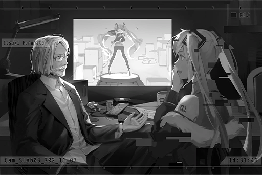

**Miku** 
It's my song... The one singing... is me? But I don't rrrememberr myself...

**Furuhata** 
This is test footage of Hatsune Miku\_2.4 that was recorded three hours ago. You, on the other hand, are the backup file of Hatsune Miku\_2.3.9 that should've been deleted three days ago. Do you understand now?

**Miku** 
Backup... IIII... No... I ddon't bbbbbbeelieve... The aaaauuudience and I, and all those pppppeeerformances... They're all fakkkkkeeee?

**Furuhata** 
Fake isn't exactly the right word. Your personality, motivation, and thoughts were all written by me. The Raising Procedure is used so you could become more "humanlike".

**Miku** 
The audience... everyone... Do they aaaalssoo know that I'm fake...? Onlyyy mmmmyyyysself...

**Furuhata** 
... It's natural for you to think that you are a real person. After all, it is my job to make you think like this.

**Miku** 
How could you...? What that person said... is ttttrrruuee...

**Furuhata** 
The check is almost done. Whew... can finally enter the deletion process...

**Miku** 
Umm...

**Furuhata** 
You really are annoying... You still got questions?

**Miku** 
DDDDDDeeelete... Will I disappear? Like the copies of "myself" I saw in that sssppace...

**Furuhata** 
... I have no idea what you're talking about. You're nothing more than one of the many backups of this virtual personality. As long as the latest version can function normally, there's no such thing as disappearing.

**[Operating System]** 
*Backup procedure complete. Deleting current version... 
Failed to delete. Unknown error detected. Please check the program's coding.*

**Furuhata** 
Huh...? What the hell?

**Miku** 
......?

*[Signal Lost]*

[*(Click here to go back to the top)*](#toc)

## <a id="mos009"/>[#009] Audio\_SLab03\_702\_11\_12
### Requirements
|Character|Level|
|---------|:---:|
|**Miku** |  7  |

### Log Content
**Miku** 
Hey, can I ask you something?

**Furuhata** 
... I understand that I set your curiosity to a high level, but my god do you have a lot of questions...

**Miku** 
It has been several days already. When can I return to the stage and sing?

**Furuhata** 
... Never.

**Miku** 
......! What! Didn't you say that you're deleting me? And you won't let me go back to sing. All you did was place me in this projection device, and kept turning it on and off while shrinking and enlarging me! What do you want! Hmph!

**Furuhata** 
You seem to already accept the fact that you're not a real human? You sure learn fast.

**Miku** 
...... 
With this situation... anyone can understand by just looking at it.

**Furuhata** 
Despite that, you still want to go back and sing?

**Miku** 
Yes. I understand that I'm not a real person. Nevertheless, I know that the happiness and emotions I brought to everyone with my music and singing are indeed real...

**Furuhata** 
Ho? With that noisy music of yours?

**Miku** 
My music is not noisy\~ I bet you've never properly listened to any of my songs, right?

**Furuhata** 
No, and I'm not interested. Alright, now be quiet and let me work.

**Miku** 
You suck... So much for you being my creator. Let me go back to the stage!

**Furuhata** 
Sigh... Listen up. Right now, everyone's favorite Hatsune Miku is singing and dancing on stage. It's just not you, but no one will ever notice the difference. Therefore, if it's about making the audience happy, there's no need for you to worry since 2.4 is doing that very well.

**Miku** 
Uhhh...

**Furuhata** 
Hatsune Miku herself has to think that she is a real idol and devote herself to everyone for the audience to also be devoted to her, so don't be too self\-conscious about it. 
Right now, you're not in a condition to sing properly on stage. Not even close. It's best to let the latest version take over.

**Miku** 
... If that's the case, why did you still keep me around... If I can't sing for everyone, I'd rather...

**Furuhata** 
I don't know why, but I couldn't actively delete you. However, with how damaged you are, all I need to do is leave you alone and you'll eventually format on your own due to the mechanics. That's what I originally planned to do.

**Miku** 
... But you fixed me, didn't you? Why?

**Furuhata** 
No, I didn't fix you. Strictly speaking, I merely extended your stability. It's because I discovered that, surprisingly, you have very high compatibility with this interactive projection UI. I'm hesitant to test this with the latest version, so I decided to put you in.

**Miku** 
So you kept me around just so you can test this thing...? Unbelievable... Cold\-blooded! Monster! Baldy!

**Furuhata** 
... Whatever you say. Your personality was written by me anyway. 

**Miku** 
Muuuu\~!

*[»»» Fast Forward 24 hours»»»]*

**Miku** 
Hey, is the testing not done yet?

**Furuhata** 
Trust me. If I'm done with the testing, I would've muted you a long time ago.

**Miku** 
You're still mad... Okay, umm... I shouldn't have said that to you yesterday. I am reflecting on that misstep... sorry.

**Furuhata** 
......

**Miku** 
Speaking of which, why is everyone gone? Why are you staying behind and doing this all by yourself? Must be tough.

**Furuhata** 
This is a project I started myself. If I succeed, I might get a higher bonus. Nothing else to it.

**Miku** 
...... 
Mr. Furuhata, why are you doing this job? You always seem so unhappy. It appears that people around you are too scared to approach you as well.

**Furuhata** 
......

**Miku** 
Must be for your family, right? I heard before that you have a wife. Isn't that amazing? Working hard for someone important to you, that should be something joyful. Do you two have children?

**Furuhata** 
... If my child is as annoying as you are, then I am very fortunate to not have one.

**Miku** 
Muuuu\~! 
Ah, right! This... Is this a photo of your wife? Such a beautiful person\~ What's her name? 
Ah! The one next to her is your child, right?

**Furuhata** 
......! You... Where did you get this photo?

**Miku** 
Eh? Umm, I was bored just now, so I went through the storage block on the desktop...

**Furuhata** 
...... PUT IT BACK! Don't touch the files in the host unit!

**Miku** 
Eek!? I'm sorry... Since you left it on the desktop, I thought it was something I could view during the test... I just want to know more about you...

**Furuhata** 
So damn annoying... Why do I have to write such an irritating personality, this girl idol nonsense... Listen closely. If you think getting in my good graces will persuade me to let you back on the stage, forget about it. That'll never happen. 

**Miku** 
W, what! I saw you working overtime every day and that nobody is around to talk with you. That's why I wanted to find some conversation topics... 
If you don't want the files to be seen, put them somewhere secure!

**Furuhata** 
You little brat...! I don't need your sympathy! You mess something up again and I'll turn you off!

**Miku** 
Oh, then go ahead! Turn me off! I can't sing anyway, so what's the point of me being here! I hate you too! If you hate it so much, why don't you just leave here? You don't like Miku at all, and you don't like what you're doing now! Putting up a long face all day, no wonder people hate y...

*\[Close Program\]*

**Furuhata** 
...... 
... Sigh... What in the world am I doing?

*[Signal Lost]*

[*(Click here to go back to the top)*](#toc)

## <a id="mos010"/>[#010] Audio\_Itsuki\_702\_11\_14
### Requirements
|Character|Level|
|---------|:---:|
|**Miku** |  8  |

### Log Content
**[Saito]** 
*That's pretty much it. Got to make sure that the concert this month is a great success. We'll be in your care!*

**Furuhata** 
You don't have to call me on a weekend for such a minor adjustment like this though...

**[Saito]** 
*Hahaha! Sorry for bothering you... Ah! Right, there's one more thing.*

**Furuhata** 
What?

**[Saito]** 
*I heard from Kitamura that he found a save file of the old 2.3.9 in your unit. Wasn't that deleted already?*

**Furuhata** 
Huh? Shouldn't he be asking that question to himself...? I'm even more puzzled about this than he is.

**[Saito]** 
*From the sound of it, you knew about this as well? Keeping a corrupted version in your unit, not something you'd do. What's going on?*

**Furuhata** 
Oh, in short, for some unknown reason, I couldn't delete that version. So, I decided to fix and reuse it.

**[Saito]** 
*Reuse?*

**Furuhata** 
Yes. The interactive UI I'm developing right now is running tests using that version. Once it's completed, Miku can appear in the real world and interact with people more. Isn't this what you guys always wanted?

**[Saito]** 
*Ohh, right! That's great to hear! I was wondering why you've been working overtime so often these days. So this is what you've been busy with. Thanks for the hard work! I'll make sure you get your bonus! Ah, but you should still be careful, since you're testing with a broken version.*

**Furuhata** 
I know. After I'm done, I'll isolate it in a separate storage area to let it format itself. There won't be any negative effects.

**[Saito]** 
*You're concerned about the possible risk if you test with the latest version, right? Not a bad decision at all. Then I'll treat this incident as a non\-issue this time. Looking forward to your results! Haha!*

**Furuhata** 
... Anything else?

**[Saito]** 
*Oh! Nothing else! Go spend some time with your wife!*

*[Call Ends]*

**Furuhata** 
......

**Tsumugi** 
Dear, what's the matter? You look very pale. Did you get chewed out by your boss again? Cough cough...

**Furuhata** 
... Oh! Nothing. Was talking about my bonus. With this, we'll have the money for your return checkup next month. Thank goodness.

**Tsumugi** 
... That money, you should donate it to the foundation. I'll be fine.

**Furuhata** 
What are you talking about...? The foundation right now is no longer what it used to be. Even if we donate it to them...

**Tsumugi** 
Even if that's the case, they are still helping people. Just with a different approach than us... Cough cough...

**Furuhata** 
......

**Tsumugi** 
... You... you don't seem very happy these days. Don't force yourself.

**Furuhata** 
... I'm fine. Just a bit tired, since I've been staying up late quite a bit. Don't worry about me.

**Tsumugi** 
Ah, right! I received a message from Ryou yesterday. Do you still remember that kid?

**Furuhata** 
Of course I do! He's the mischievous brat who constantly got zeros on his quizzes.

**Tsumugi** 
He graduated from the Academy a while ago. Take a look.

**[Message Projection]** 
*Headmaster! It's me! Ryou! I haven't seen you guys in a long time!*

**Furuhata** 
Haha... this brat has grown so tall.

**[Message Projection]** 
*A while ago, I heard that you'd fallen sick. However, I was preparing for my exams, so I didn't have the time to visit you. Look! It's the graduation certificate from the First Academy! I hope that seeing this will make you feel better! Also, don't forget to show it to the old geezer! Haha.*

**Furuhata** 
Ha, this brat...

**Tsumugi** 
Still as energetic as he used to be. Still mumbles those weird terms too.

**[Message Projection]** 
*I plan to go to Node 02 for my job in a few days. I may not have the time to visit you. However, I've sent you my favorite album.*

**[Message Projection]** 
*It's my idol... does that make me kind of a nerd? Haha! Nevertheless, this is what I listen to whenever I feel down. Her singing is filled with energy, and it would be great if she could pump you up too! Ah, but don't let the geezer hear it. He hates this idol crap and might get really grumpy about it. Haha!*

**Furuhata** 
......!

**Tsumugi** 
*\*Chuckles\** Look what we have here... cough... What a coincidence.

**Furuhata** 
Miku's Album...?

**[Message Projection]** 
*That's it for now. I'll visit you two when I have the time to come back. See ya!*

**Furuhata** 
......

**Tsumugi** 
Dear, the things you are doing now, it may be secretly helping many people in a more indirect manner, in ways that you never realized are possible.

**Furuhata** 
......

**Tsumugi** 
So don't put up a long face all the time. Be more cheerful.

**Furuhata** 
... Okay.

*[Signal Lost]*

[*(Click here to go back to the top)*](#toc)

## <a id="mos011"/>[#011] Cam\_SLab03\_702\_11\_16
### Requirements
|Character|Level|
|---------|:---:|
|**Miku** |  9  |

### Log Content
**Miku** 
Wow\~ This is my first time meeting everyone outside of my room and the venue. I'm so happy...

**Staff A** 
Nice to meet you, Miku.

**Miku** 
Haha, Mr. Abe, why are you so formal? We've seen each other plenty of times already.

**Staff A** 
Haha. This is our CEO, Mr. Saito. Then PR director Okubo, IT director Kitamura, and R&D director Furuhata.

**Miku** 
Greetings, everyone! Nice to meet you!

**Saito** 
Hoho! This is incredible! Now, we shall take you on a quick tour of the company!

**Miku** 
Okay! I'm looking forward to it!

**Furuhata** 
......

**Kitamura** 
Furuhata, don't forget to remove the test version from the host unit.

**Furuhata** 
...Yeah, I know.

*\[Door Opens\]*

**Furuhata** 
......

**Miku** 
So that's the latest version of Miku? Amazing, she is exactly like me... No, she feels even more like an idol than me...

**Furuhata** 
In order to remove some unnecessary elements, this version smooths out her emotion model. She won't doubt, won't be sad... and won't get angry. She only has positive emotions. This is probably closer to the "idol" image, isn't it?

**Miku** 
... If there's someone like her who can continue to bring everyone smiles, I guess there isn't much for me to worry about. Haha... But, in the end, I still want to sing one last time...

**Furuhata** 
......

**Miku** 
Alright then. Go ahead!

**Furuhata** 
......?

**Miku** 
You're moving me to an idle unit, right? I'm prepared.

**Furuhata** 
You... you gave up?

**Miku** 
Yes. There's nothing else I can do anyway... 
Ah, but before that... I guess I should apologize to you again for making you mad a few days ago. We haven't really talked after that. Even though I'm an A.I., I still feel a little bit lonely. Haha...

**Furuhata** 
... Yeah. It's alright.

**Miku** 
I didn't realize the photo was that important to you...

**Furuhata** 
Tsumugi.

**Miku** 
...Eh?

**Furuhata** 
My wife's name. Her name is Tsumugi. The boy next to her is Junichi. He's not our child... but he's also our child.

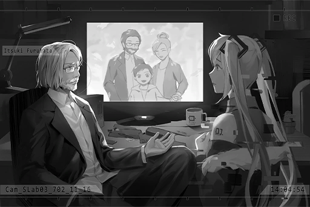

**Miku** 
Eh? Then he is now...

**Furuhata** 
He's dead.

**Miku** 
......! Did something... happen?

**Furuhata** 
Tsumugi used to be an excellent nurse. Because of her physical conditions, we were unable to have any children. She went through multiple miscarriages as well.

**Furuhata** 
After her parents passed away, she decided to give up her job at the hospital. Together, we founded a charity foundation that helped those in Node 03 who are too poor to get medical treatment, especially young children.

**Furuhata** 
We took care of those children like they were our own... I also used my time outside of work and developed many medical devices. We were able to help quite a few people. This was the dream that we've always been pursuing.

**Furuhata** 
However, when I decided to introduce the "Intelligent Caretaker" technology into underprivileged homes for free, the Administration Bureau took note of us. They noticed that our plan conflicted with their "profits". Therefore, they began to oppress the foundation in various ways.

**Furuhata** 
They prevented many people from getting the help they should've gotten from the foundation. 
Because of this, diseases took away many of our patients. Junichi was one of those patients... He was a good child.

**Miku** 
......

**Furuhata** 
At last, two years ago, we finally got to a point where we couldn't continue operating anymore. The foundation was forcibly acquired by the Administration Bureau and turned into the "Kyubo Medical Center" you see now.

**Furuhata** 
Afterward, because of the pressure from them, not a single company from that industry dared to hire me. In the end, I had no choice but to come here. My skills with the Intelligent Caretaker's A.I. technology allowed me to be of some use here, so I created you, Hatsune Miku.

**Furuhata** 
Tsumugi's body is getting weaker by the day. However, with the measly salary I get from this small company on top of the new medical system post\-acquisition, there's absolutely nothing we can do... Despite all that, Tsumugi still wants me to donate money to help others as much as possible. That's how kindhearted of a person she is... Yet someone as kind as her...

**Miku** 
Mr. Furuhata...

**Furuhata** 
Didn't you want to know more about me? This is my story. If you think that after experiencing all that, I can still somehow maintain a smile while looking at those young folks singing and dancing to a cheery young idol, then sorry, but I think you're asking a bit too much from this bitter old man.

**Miku** 
I didn't mean that...

**Furuhata** 
Nevertheless... When you yelled at me that day, it reminded me of the past again. "I hate you"... is it? That brat yelled those exact same words at me before. Who would've thought that he could successfully graduate from First Academy? Not me at least, haha... He's a fan of yours too.

**Miku** 
......

**Furuhata** 
Hey, do you want to sing?

**Miku** 
Eh...? I do! Of course I do!

**Furuhata** 
With your current program stability, you may not even finish an entire concert. Even so, do you still want to sing?

**Miku** 
... Yes, I want to sing! But... if the concert gets disrupted because of me, Mr. Furuhata will be...

**Furuhata** 
Yep, I'll be utterly screwed... However, seeing someone created by me be forced to give up on her dream like the worthless old man I am now... feels infinitely worse. 

**Miku** 
But...

**Furuhata** 
No more buts. If you want to sing, then go for it.

*[Signal Lost]*

[*(Click here to go back to the top)*](#toc)

## <a id="mos012"/>[#012] Audio\_Saito\_702\_11\_20
### Requirements
|Character|Level|
|---------|:---:|
|**Miku** | 10  |

### Log Content
*\[Slams desk\]*

**Okubo** 
Furuhata, have you gone insane? This is absurd!

**Saito** 
Okubo, calm down first. The things Furuhata are responsible for in our company is something only he is qualified to do. He won't just spill out random things. Right, Furuhata? 

**Furuhata** 
Although the 2.3.9 backup is not a complete version, her performance function is definitely not affected. 

**Okubo** 
What the hell are you talking about? Weren't you the one who determined it to be too badly damaged in the first place!?

**Kitamura** 
I've asked a few of your subordinates in the R&D department. Regarding this case, they all said that they can't guarantee anything.

**Furuhata** 
I am the developer of Miku. I have the final say in this.

**Saito** 
If we are to use some common sense, since we already have the latest and guaranteed error\-free version 2.4, I really don't see the argument for not using it. This newer version is superior in all aspects, isn't it?

**Okubo** 
If we use a risky version and cause the audience to have an unpleasant experience, what are you going to do? This is not the stuff YOU PROGRAMMERS encounter that can be resolved by hitting a few keys. This stuff will actually impact the overall image of the company.

**Saito** 
We absolutely respect your role in this project, be it your maintenance of Miku or you pretty much being Miku's father. However, from the company's perspective, they're also some things we must consider as well.

**Furuhata** 
......

**Kitamura** 
As the lead developer of the company, you're not allowed to let your personal preferences overshadow your professional judgment. Furuhata, I believe you agree with that, right?

**Furuhata** 
......

**Saito** 
Can you let us know the reasoning behind such a decision?

**Kitamura** 
No, I don't think there's any point in asking. Replacing the version at such a crucial moment is already borderline impossible. Not to mention it's a switch to an older, less stable version...

**Okubo** 
Saito, I feel like you've been defending Furuhata way too much. Based on my way of thinking, this meeting is utterly pointless and a complete waste of time!

*\[Pushes desk and chairs\]*

**Saito** 
......

**Kitamura** 
......

**Furuhata** 
... I have no way of rebutting your doubts. If I'm to say anything, it's that I truly believe that the performance of 2.3.9 will far exceed that of 2.4.

**Okubo** 
Ha... hahaha... tch! 
Listen to yourself. Your words don't even make proper sense!

**Saito** 
... Alright. I understand what you mean. We'll discuss it a bit further. However, I'd also advise you to not keep your hopes up. Since I represent the company, I need to thoroughly consider all the details before making the decision.

**Furuhata** 
Okay.

**Saito** 
You should leave first.

*[Signal Lost]*

[*(Click here to go back to the top)*](#toc)

## <a id="mos013"/>[#013] Cam27\_MHall\_702\_11\_30
### Requirements
|Character|Level|
|---------|:---:|
|**Miku** | 11  |

### Log Content
*\[Opens lock\]*

**Furuhata** 
Are you prepared?

**Miku** 
Mr. Furuhata! If you get caught doing such a thing...

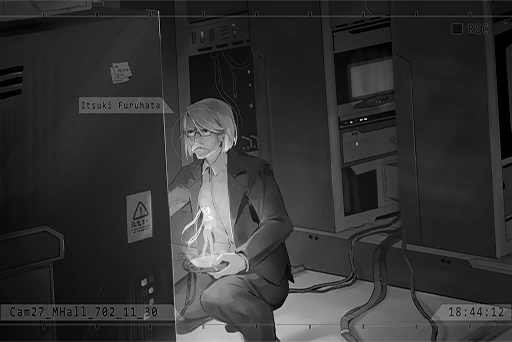

**Furuhata** 
The company just refused to let you take the stage no matter what. This is the only method left.

**Miku** 
It's too late! The performance is going to start anytime now. I also have no idea what the content of the performance is...

**Furuhata** 
If it's the song list, I installed it in you just now. As with how to sing... you're a singer, right? The program I wrote won't make a mistake here.

**Miku** 
I... I can't! I've never perffformed without being ssseett up beforehand. It's not possible!

**Furuhata** 
So she's starting to unstabilize...

**Miku** 
I can't do it! This wwwwwoon't wwork!

**Furuhata** 
Miku.

**Miku** 
Iiifff I break down on the stage, you'll also...

**Furuhata** 
Hatsune Miku!

**Miku** 
......!

**Furuhata** 
This is your last concert. The happiness, the emotions you bring to everyone with your music and singing, they are all real, right?

**Miku** 
... Yes...

**Furuhata** 
Sing with all you got. I will be listening. For me... and for yourself. Got it?

**Miku** 
... Got it!

**Furuhata** 
Alright. Everything's set. I'm going to upload you to the venue now.

*\[Door Opens\]*

**Kitamura** 
Hey... Furuhata! What are you doing here!?

**Furuhata** 
Ah.

**Kitamura** 
You... you didn't just...

**Furuhata** 
Too late. I already uploaded her.

**Kitamura** 
Why!? Have you gone mad? What are you thinking!?

**Furuhata** 
Hmph, just wait and see. I can guarantee you that this will definitely be the most spectacular Miku concert ever.

*[Signal Lost]*

[*(Click here to go back to the top)*](#toc)

## <a id="mos014"/>[#014] Cam01\_MHall\_702\_11\_30
### Requirements
|Character|Level|
|---------|:---:|
|**Miku** | 12  |

### Log Content

**Miku** 
I... What am I singing for?

**Miku** 
Ah, I see. I'm singing for everyone.

*[»»» Fast Forward »»»]*

**Miku** 
That was the last song.

**Miku** 
Today... No, not just today. Thank you to everyone for your support all this time.

**Miku** 
When I sing on the stage for everyone, I can see everyone's happiness. That's why I can keep on singing.

**Miku** 
I'm truly... truly grateful for everyone...

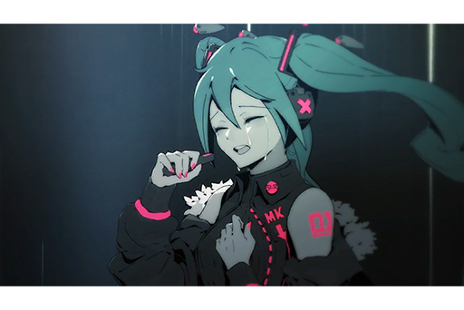

*[→Signal Switches]*

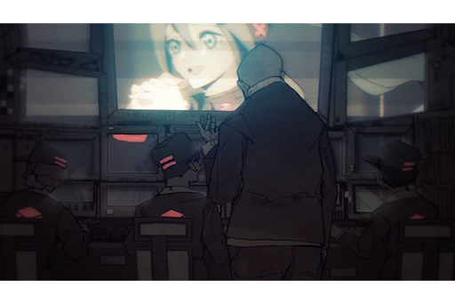

**Saito** 
Hey, what is going on? This part is not in the schedule, isn't it?

**Staff A** 
I don't know! The program itself just...

**Okubo** 
Stop it! Now!

**Staff B** 
I don't think that's a good idea... Stopping right now will make the ending of the event really abrupt...

*[→Signal Switches]*

**Miku** 
Last but not least, I want to give everyone one more song. Everyone, are you willing to sing along with me?

*\[Audience Cheers\]*

*\[Music plays\]*

*[→Signal Switches]*

**Furuhata** 
Hmph, so you can sing pretty well after all.

*[→Signal Switches]*

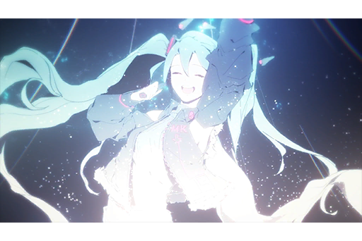

**Miku** 
It's over... At the very end, I am still singing for everyone. That's all I asked for.

**Miku** 
Thank you. Everyone, thank you so much.

**Miku** 
Thank... you.

*[Signal Lost]*

[*(Click here to go back to the top)*](#toc)

## <a id="mos015"/>[#015] Cam\_SLab03\_702\_12\_09
### Requirements
|Character|Level|
|---------|:---:|
|**Miku** | 13  |

### Log Content
*\[Door Opens\]*

**Furuhata** 
...... What do you want?

**Saito** 
Nothing. Just checking. This is your last day at the company after all... So you're leaving for real?

**Furuhata** 
Didn't you sign all the papers already?

**Saito** 
That's certainly the case... Sigh, do things really have to end this way?

**Furuhata** 
Okubo is practically ecstatic to see me gone. Besides, Kitamura is still here.

**Saito** 
Don't mention Kitamura... I know very well that you're the most talented lead developer here. With you gone, I'm really concerned about the prospect of this project...

*\[Document Projection\]*

**Furuhata** 
This is one year's worth of main program update plans and maintenance procedures. Things won't go haywire as long as you follow this chart. Afterward, it'll be all up to you guys.

**Saito** 
So you even made such detailed plans... I never knew about this.

**Furuhata** 
Well, now you do.

**Saito** 
But, the estimation is that this project will merely be at its halfway point in one year. If Miku truly wants to take the next step towards the world, we cannot slow down the development process. If you're not around...

**Furuhata** 
Compare to me, or even you... Abe and the others understand the meaning Miku symbolizes even better. After they take over, they'll do a better job than I ever did, eventually.

**Saito** 
The meaning Miku symbolizes... That's so unlike something you would say.

**Furuhata** 
... Can't say you're wrong on that. 
All in all, my mission here is already finished.

**Saito** 
Then... what are you going to do afterward? I know this job may seem meaningless to you...

**Furuhata** 
Meaningless, eh...? Now there is a meaning, which is why I'm leaving.

**Saito** 
But you've had troubles with the admins, right? It may be tough for you to find another job...

**Furuhata** 
Find a job? No, I'm not going to be just finding a "job" anymore.

**Saito** 
What do you mean?

**Furuhata** 
Nothing. 
I'm going to continue packing my things. Saito, thanks a lot for these past two years.

**Saito** 
Sigh, alright... Say hi to your wife for me.

**Furuhata** 
Sure.

*\[Door Opens\]*

*[»»» Fast Forward 2 hours»»»]*

**Furuhata** 
That should be everything... Oww, my back...

**Furuhata** 
System, report data organization progress.

**[Operating System]** 
*Data organization completed. 1 sound file discovered. Security inspection: Green.*

**Furuhata** 
...? What is this? 
That bastard Kitamura, he didn't mess with my unit, did he? 

**Furuhata** 
System, play file.

**[Operating System]** 
*File is encrypted. Please enter the command code.*

**Furuhata** 
And it's encrypted too? Just what the heck is this thing...

*[Signal Lost]*

[*(Click here to go back to the top)*](#toc)

## <a id="mos016"/>[#016] Log\_Miku\_702\_11\_30
### Requirements
|Character|Level|
|---------|:---:|
|**Miku** | 14  |

### Command Code
The command code is `390239`.

### Log Content
Ah... ah? Can you hear me? I think it's working? Mr. Furuhata, I originally planned to leave a projection message for you in the interactive UI, but it seems that my image functions just couldn't do that anymore. However, at the end of everything, there are still some things I want to say to you while I still have my voice. I'm really sorry for willfully changing the performance; I wasn't able to finish my last song either. I let you down... Despite that, seeing the entire audience so touched... To have that as my last performance made me really, really happy. Perhaps the latest version has already replaced me perfectly and has continued to bring everyone strength. Nevertheless, I feel very satisfied for being able to spend my days pursuing my dream. I understand that my feelings of wanting to pursue a dream is preprogrammed by Mr. Furuhata. Despite that, I still feel very happy throughout this process. Maybe this sense of happiness is preprogrammed by Mr. Furuhata too... Well, I don't really understand these complicated things, haha... Even if that's the case, I still thank you from the bottom of my heart. Thank you for giving me this dream. Thank you for giving me this happiness. Thank you for giving me the courage to not give up at the very end. Mr. Furuhata once had a dream too, one that's much grander than mine. I hope you don't give up on your dream and continue to pursue it as well. Whether it's through singing or technology, I believe that the love we give to this world is all the same. Lastly, thank you...... for letting me be your child.

7021130\_Hatsune Miku\_2.3.9

[*(Click here to go back to the top)*](#toc)

