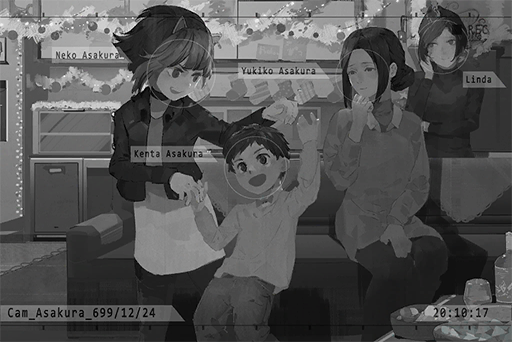

# Cam_Asakura_699_12_24
## Requirements
| Character  |Level|
|------------|:---:|
|**NEKO#ΦωΦ**| 54  |

## Log Content
**NEKO#ΦωΦ** 
Linda\-chan, sorry about that. It's rare that you come to visit us, yet daddy went on a drunken rage again... He is the worst...

**Linda** 
It's alright. My family doesn't celebrate the holidays, to begin with. It was very enjoyable... 
Besides, your dad... I'm not certain, but I feel like he has changed.

**NEKO#ΦωΦ** 
Muu? How so?

**Linda** 
Even though he was a bit drunk back there, he would never say those things in the past, right? Before, I always got this feeling that he didn't really like me, whether it's the way I dress or something else.

**NEKO#ΦωΦ** 
......

**Linda** 
Besides giving me living expenses, my family never cared about what I like or what I dislike... 
This is my first time chatting with older people, and I feel like NEKO has an amazing family.

**NEKO#ΦωΦ** 
... Linda\-chan...

**Linda** 
Aw, man; why did I say those things all of a sudden... That was so cringy, haha... 
Heard that you made another new song? Can I listen to it?

**NEKO#ΦωΦ** 
...... Sure!

*\[Music\]*

**Linda** 
Hoho, this tempo really suits the holiday atmosphere. It's like everyone is holding hands and dancing together.

**NEKO#ΦωΦ** 
Hehe... it's pretty neat, right!

*\[Door Opens\]*

**Yukiko** 
Oh? Is this NEKO's new song? Sounds very joyful.

**NEKO#ΦωΦ** 
Woah! Sis Yukiko... Where's daddy?

**Yukiko** 
Asleep in bed. He was mumbling about wanting to come out and listen to your song, even though he can barely stand. It took me quite some time to finally put him to sleep.

**NEKO#ΦωΦ** 
Ha? Stupid daddy, he's just talking the big talk~ He doesn't understand NEKO's music...

**Kenta** 
Big sister's music is the best!

**NEKO#ΦωΦ** 
You little brat only likes PAFF's songs, don't ya?

**Kenta** 
That's not true~ Big sister's songs are great too!

**NEKO#ΦωΦ** 
... Very well! Then big sister shall teach you how to dance! Here, grab my hand and match the beat! One\-two\-three\-four!

**Kenta** 
Big sister, too, too fast! Waaa! WAAAAAA!

**Yukiko** 
Be careful, NEKO. Don't hurt yourself...

**NEKO#ΦωΦ** 
Sis Yukiko, you should join too! Linda\-chan, turn up the volume! Christmas is a time of celebration after all! Ahahahaha!

**Linda** 
Haha...... Idiot, you're on the verge of bursting into tears, yet you're still trying to act strong.

**Linda** 
......

**Linda** 
Merry Christmas.

*[Signal Lost]*
