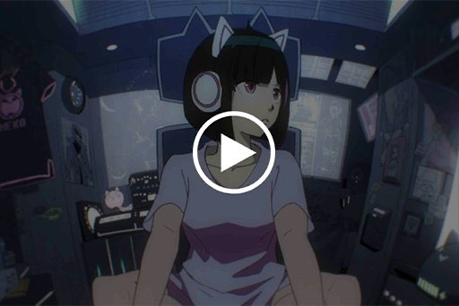

# Audio_Asakura_702_11_01
## Requirements
| Character  |Level|
|------------|:---:|
|**NEKO#ΦωΦ**| 57  |

## Log Content
**NEKO#ΦωΦ** 
Kenta, eat it.

**Kenta** 
Uhhhh...

**[TV]** 
*Welcome to the "Truth Digger 101" segment\~ Tonight's guests...*

**NEKO#ΦωΦ** 
Before you finish it, big sister will not leave this spot. The night is long. We still got plenty\~ of time.

**Kenta** 
*\*Sobs\*...*

**NEKO#ΦωΦ** 
No crying!

**[TV]** 
*... Ladies and gentleman! Only three sets left! Call in now at...*

**NEKO#ΦωΦ** 
Ahhh\~ This is so damn boring. Why are all the shows so terrible...

**Kouhei** 
Then turn off the TV. Stop skipping through the channels like this.

**[TV]** 
*...... Just earlier today, A.R.C. backend administrator Simon Jackson has been arrested in A.R.C. by law enforcement agents.*

**NEKO#ΦωΦ** 
...... Eh?

**Kouhei** 
......!

**Yukiko** 
Woah... What is going on?

**[TV]** 
*...... Our sources show that he is none other than the biggest suspect for "Æsir", the mastermind behind the recent string of internet crime incidents.*

**Kenta** 
... Did big brother Xenon get arrested?

**NEKO#ΦωΦ** 
... How is that possible...! Ugh...!

*\[Things crashing\]*

**Kouhei** 
NEKO!?

**Yukiko** 
Hey! What happened!?

**NEKO#ΦωΦ** 
Ugh... Head... hurts... a lot...

**[TV]** 
*According to our inside sources, the Administration Bureau received investigative information from an A.R.C. employee. The employee accused Simon Jackson of using a specialized A.I. that has yet to clear safety protocols for all kinds of operations. The Administration Bureau decided to delve further into the situation. However, when they came across A.R.C.'s system program records, they discovered a large number of commands used by said A.I. to commit internet crimes, which even includes the infamous cyberterrorism incident during a live stream a few months ago. All this evidence are proof of Simon Jackson's highly possible association with Æsir.*

**NEKO#ΦωΦ** 
Ughh...... AHHHHHHHH!!

*\[Things crashing\]*

**Kenta** 
Big sister!?

**Kouhei** 
What exactly is happening!? Yukiko! Turn off the TV first!

**Yukiko** 
O... okay!

**NEKO#ΦωΦ** 
H... how come? Xenon...

**Yukiko** 
NEKO, are you alright!?

**NEKO#ΦωΦ** 
... NEKO... will go to her room and get some rest for now...!

*\[Runs\]*

**Kouhei** 
Hey! ......?

*[→Signal Switch]*

*\[Door Closes\]*

**NEKO#ΦωΦ** 
Hah...... Hah......

**PAFF** 
NEKO... What's the matter!? You look pale...

**NEKO#ΦωΦ** 
Xenon... That's impossible...

**PAFF** 
......?

**NEKO#ΦωΦ** 
Aroma\-chan!

**PAFF** 
Eh!? Yes!

**NEKO#ΦωΦ** 
You said that your memory is weird... NEKO... might just have experienced the same thing...

**PAFF** 
Eh...?

**NEKO#ΦωΦ** 
I just saw the news. It said that Xenon is Æsir and that he is now under arrest...

**PAFF** 
Ah, I saw the news report online as well... Xenon...

**NEKO#ΦωΦ** 
Now, whenever NEKO thinks back to the time when I was attacked, the images that flash through my mind... are all Xenon... So he's the one who attacked NEKO and everybody...?

**PAFF** 
......!

**NEKO#ΦωΦ** 
H... How is that possible!? There is definitely something wrong with NEKO's memory as well!! Xenon would never...! Ugh...

**PAFF** 
C, calm down... The more you think about it, the more uncomfortable it will get. You should lie down and get some rest first!

**NEKO#ΦωΦ** 
Yeah...

**PAFF** 
I... don't really understand the situation, so I can't quite help you out on this. I'm sorry...

**NEKO#ΦωΦ** 
No, Aroma\-chan have already gone through plenty of crap just dealing with your own troubles.  
NEKO is lucky... I still have a lot of friends who can help. NEKO will go see them tomorrow. You don't have to worry...

**PAFF** 
Okay. Don't be too hard on yourself. If there's anything I can help, please tell me.

**NEKO#ΦωΦ** 
Gotcha. We should both rest early. Good night.

**PAFF** 
Good night.

*[Signal Lost]*
