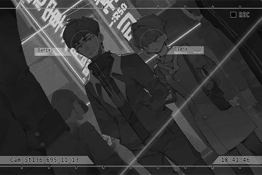

# Cam_St136_695_11_13
## Requirements
| Character  |Level|
|------------|:---:|
|**NEKO#ΦωΦ**| 62  |

## Log Content
**Clara** 
Hi~

**Daniel** 
... What are you doing here?

**Clara** 
Dragging you to the classmate reunion, obviously.

**Daniel** 
I'm just about to go there right now. Bug off.

**Clara** 
... Huh, that's unexpected. I was so sure that you wouldn't attend an event like this.

**Daniel** 
... What kind of class holds a reunion three months after graduation?

**Clara** 
The whole class graduated without a hitch. Your attendance rate also just barely passed the requirement. It's something worthy of celebration~ Come on, be happier!

*[»»» Fast Forward»»»]*

**Daniel** 
Sidenote, why did you come all the way to my home just to fetch me? Isn't your home closer to the venue?

**Clara** 
As class rep, it is my responsibility to ensure that everyone is present!

**Daniel** 
Tch...

**Clara** 
......

**Daniel** 
......

*\[Footsteps\]*

**Daniel** 
... Everyone, is it?

**Clara** 
...... 
I still... can't get in contact with Aroma.

**Daniel** 
...... Oh.

**Clara** 
Every time I try to see her, I always get stopped by her sister. She doesn't even answer my phone calls.

**Daniel** 
Her sister changed her number. She said that this is the most important time period for Aroma.

**Clara** 
Yeah... must be really tough to be an idol...

**Daniel** 
Didn't you...

**Clara** 
?

**Daniel** 
...... Nothing.

**Clara** 
... I miss the time we spent together, especially on the roof. We would eat lunch there together, prepare for tests together... Sometime, you would secretly smoke there and get yelled at by Iris. I really want to go back to those times...

**Daniel** 
... You know very well that's impossible.

**Clara** 
Yeah... Iris moved to a place far away too.

**Daniel** 
No, even before that. Ever since Aroma's car accident...

**Clara** 
......

*\[Footsteps\]*

**Daniel** 
... I'm not going to the reunion after all.

**Clara** 
Eh? But we're almost there...

**Daniel** 
I have nothing to say to those people.

**Clara** 
Hey! Where are you going?

**Daniel** 
I'm going to grab a drink myself. Sorry 'bout that, class rep. We can't get everyone to attend, to begin with.

**Clara** 
......

*\[Footsteps\]*

**Daniel** 
...? What are you doing?

**Clara** 
I'm going with you.

**Daniel** 
Huh? You do realize you're the organizer, right?

**Clara** 
We can't get everyone to attend, to begin with... 
Besides, drinking alone sounds way too pathetic, isn't it? Two people drinking together sounds much better, right?  
Or do you have nothing to say to me as well?

**Daniel** 
......

**Clara** 
On the other hand, I do have a lot of things I want to say to you...

**Daniel** 
So you're going to skip the event you organized yourself... That's so unlike you.

**Clara** 
We've already graduated. I'm tired of being that model student crap too... 
Right now, I just want to be a friend that can chat about the good old times.

**Daniel** 
That's not what you said just minutes ago...

**Clara** 
... Then, how about I treat you? Will you be more willing to let me go with you?

**Daniel** 
......

**Daniel** 
Nah, it's fine... We can split the bill.

**Clara** 
You've grown taller again.

**Daniel** 
......

*\[Footsteps\]*

*[Signal Lost]*
