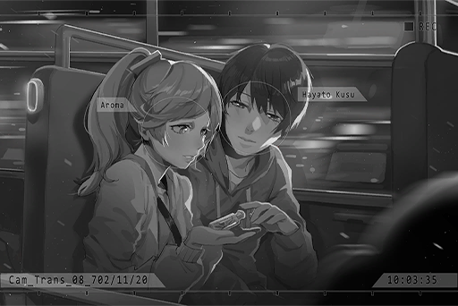

# Cam_Trans_08_702_11_20
## Requirements
| Character  |Level|
|------------|:---:|
|**NEKO#ΦωΦ**| 65  |

## Log Content
**NEKO#ΦωΦ** 
G29, G29... The seat is right here! There really is no one in this carriage.

**PAFF** 
I told you that Miss Russell was actually trying to help us. 
Hnnngghh... the bags...

**Hayato** 
Kao... Umm, I\-I'll help you with that.

**NEKO#ΦωΦ** 
... Kaori... 

**PAFF** 
What's the matter, NEKO? Take your seat. The train will be leaving soon.

**NEKO#ΦωΦ** 
Okay, Aroma... Ah!

**PAFF** 
......

**Hayato** 
......

**NEKO#ΦωΦ** 
... Umm, NEKO feels like this is a really dumb question... What should NEKO call you now?

**PAFF** 
Eh? I'm still myself. You can just call me what you normally call me.

**NEKO#ΦωΦ** 
But, the way you talk right now... it just doesn't feel like the usual Aroma\-chan!

**PAFF** 
Is that so? Hayato, what do you think?

**Hayato** 
I don't know either... The way you speak now is certainly very similar to Kaori, but your appearance is completely different... That's why I'm not sure what I should do either...

**PAFF** 
I see... Then you can also call me whatever you prefer! Sorry for causing you guys trouble.

**Hayato** 
N\-not at all!

**NEKO#ΦωΦ** 
... Report! NEKO is hungry. Need to go buy a lunch box!

**Hayato** 
Eh!? Didn't you just have lunch...?

**NEKO#ΦωΦ** 
Welp, NEKO's still growing after all. Haha! I'll be right back!

*\[Door Opens\]*

**PAFF** 
... She's trying to give us some alone time together, isn't she? 
Hey, why didn't you tell Miss Russell the truth? The things sister told me, although still not confirmed, I believe they're likely all true.

**Hayato** 
I didn't have the time to explain... She helped us so much, all for the sake of finding out the truth. I'm not quite sure when and how to talk to her about this...  
Even though I feel sorry for her, once we get to Node 03, we can then find a chance to explain everything to her. Besides...

**PAFF** 
Hmm?

**Hayato** 
I don't know... If what your sister said is true, doesn't that make them criminals? Spreading such things... I don't know if that's the correct thing to do. After all, they are family to you as well.

**PAFF** 
Yes... If possible, I would like Hayato to keep this a secret, for me. I don't wish to make a big deal out of this.

**Hayato** 
Once we get to Node 03, if we confirm that you're indeed Kaori... Do you plan to return here?

**PAFF** 
I'm not sure myself either. In that basement... the images that flashed through my brain, in addition to "Kaori's memory", I felt like they were some other images... although they are all very fragmented.

**Hayato** 
......

**PAFF** 
This body still has more secrets I know nothing about... Ah, sorry. I'm just causing more trouble by telling you all this, aren't I? I don't really know how to describe this feeling.

**Hayato** 
Eh? No, not at all. Do I look that troubled?

**PAFF** 
Yep. You had a face that screamed, "I'm really scared". Haha.

**Hayato** 
Haha, sorry... I'm still such a weak person...

**PAFF** 
... Hey, why do you have to apologize for something like that?

**Hayato** 
......?

**PAFF** 
The Hayato in my memories has always been like this. You're a scaredy\-cat who gets nervous really easily but have the kindest heart in all of Node 03. Also, you look kinda handsome from the side when you're serious...

**Hayato** 
W\-What's that about...?

**PAFF** 
Rest assured. I believe that once we get there, I'll definitely remember more things.

**Hayato** 
Definitely! I'll try my best to help!

**PAFF** 
Alright then. Don't you have something you want to give me?

**Hayato** 
!? H\-how did you know...?

**PAFF** 
Well, I saw you constantly trying to hide your hand behind your back...

**Hayato** 
... So you noticed?

**PAFF** 
Ah... this is...

**Hayato** 
Yes, it's your favorite flower, the Lavender. On the night we finished our performance, I left early to buy this bottle to store the flowers inside. However, I never got the chance to give it to you... I've always carried it with me, even though the Lavender inside has already wilted, I always believed that one day, I would have the chance to give it to you.

**PAFF** 
Haha... you...

**PAFF** 
*\*Sniff\*... \*Sobs\*...*

**Hayato** 
Hey... why are you crying?

**PAFF** 
No... I'm really happy... Thank you, Hayato.

*[→Signal Switches]*

**NEKO#ΦωΦ** 
... Such a nice atmosphere. Those two... they were definitely a c\-c\-c...... couple in the past, right?

**[Meowbot]** 
*Do you want to play a projection of Xenon meow?*

**NEKO#ΦωΦ** 
...... W\-w\-wwhhat are you talking about! Don't play it! Stupid Meowbot! You're absolutely going in the trash!!

*[Signal Lost]*
