# NEKO#ΦωΦ OS Logs
## <a id="toc"/>List of Logs
- [\[#001\] Cam057\_AB\_702\_09\_20](#nos001)
- [\[#002\] Cam009\_AB\_702\_09\_20](#nos002)
- [\[#003\] Cam11\_St07\_702\_09\_20](#nos003)
- [\[#004\] Cam\_NL\_702\_09\_26](#nos004)
- [\[#005\] Cam11\_St07\_702\_09\_29](#nos005)
- [\[#006\] Cam\_NL\_702\_09\_29](#nos006)
- [\[#007\] Cam\_NL\_702\_09\_29](#nos007)
- [\[#008\] Cam\_NL\_702\_09\_30](#nos008)
- [\[#009\] Audio\_NL\_702\_10\_04](#nos009)
- [\[#010\] Audio\_Asakura\_699\_12\_24](#nos010)
- [\[#011\] Cam\_Asakura\_699\_12\_24](#nos011)
- [\[#012\] Audio\_Asakura\_702\_10\_13](#nos012)
- [\[#013\] Audio\_Asakura\_702\_11\_01](#nos013)
- [\[#014\] Cam\_Academy\_702\_11\_06\_1](#nos014)
- [\[#015\] Cam\_Academy\_702\_11\_06\_2](#nos015)
- [\[#016\] Audio\_Cafe\_702\_11\_07\_1](#nos016)
- [\[#017\] Audio\_Cafe\_702\_11\_07\_2](#nos017)
- [\[#018\] Audio\_MB\_702\_11\_10](#nos018)
- [\[#019\] Audio\_St33\_702\_11\_10](#nos019)
- [\[#020\] Audio\_Velvet\_702\_11\_12](#nos020)
- [\[#021\] Message\_Linda\_702\_11\_XX](#nos021)
- [\[#022\] Cam\_St136\_695\_11\_13](#nos022)
- [\[#023\] Audio\_NL\_702\_11\_13](#nos023)
- [\[#024\] Audio\_Evans\_702\_11\_14](#nos024)
- [\[#025\] Cam\_Evans\_702\_11\_14](#nos025)
- [\[#026\] Cam\_Evans\_702\_11\_14](#nos026)
- [\[#027\] Audio\_Cafe\_702\_11\_17](#nos027)
- [\[#028\] Audio\_Trans\_08\_702\_11\_20](#nos028)
- [\[#029\] Cam\_Trans\_08\_702\_11\_20](#nos029)
- [\[#030\] Audio\_Shiraishi\_702\_11\_22](#nos030)
- [\[#031\] Audio\_Grave\_702\_11\_23](#nos031)
- [\[#032\] Cam\_Nora\_702\_12\_14](#nos032)
- [\[#033\] Audio\_TigerSt\_702\_12\_15](#nos033)
- [\[#034\] Cam\_ShadowSt\_702\_12\_21](#nos034)
- [\[#035\] Audio\_Baro03\_702\_12\_20](#nos035)

## <a id="nos001"/>\[#001\] Cam057\_AB\_702\_09\_20
### Requirements
| Character  |Level|
|------------|:---:|
|**NEKO#ΦωΦ**| 35  |

### Unlocked Charts
|      Song      |Character|Diff.|Level|
|----------------|:-------:|:---:|:---:|
|**extinguisher**|NEKO#ΦωΦ |Easy |  3  |
|**extinguisher**|NEKO#ΦωΦ |Hard |  7  |

### Log Content
**Cherry** 
Do we wait here?

**Xenon** 
Yes. Why did you accompany me here anyway?

**Cherry** 
Hey, I took part in the Boss fight; make sense that I get to rescue the princess, right? I want to see NEKO in person as well.

**Xenon** 
... Princess? I say more pixie than princess.

**Cherry** 
You are so mean\~ She's a cute girl. isn't she?

**Xenon** 
Umm... She's... unique, to say the least. Be prepared when you see her.

**Cherry** 
All this talk is making me even more interested to see her! 
On a side note, that's a serious crowd down there at the main entrance.

**Xenon** 
Reporters and fans, I presume? They've gone nuts since NEKO's release was announced.

**Cherry** 
Good thing you had friends that could let us in through the back door. I thought we're gonna get stuck outside.

**Xenon** 
You're exaggerating things.

**Cherry** 
Didn't you say that the admins have been watching you closely?

**Xenon** 
I still have my connections over here. If not, I wouldn't know any of this in the first place.

**Cherry** 
Wow, so a shut\-in like you actually made "friends"...

**Xenon** 
You... it's all thanks to them that the evidence I provided could actually influence the investigation.

**Xenon** 
... Ah, we should stop chatting here.

_\[»»»Fast Forward»»»\]_

**Xenon** 
Hey. Over here.

**NEKO#ΦωΦ** 
Ehhh? Why are you the one to come and get me? Where are my dad and others?

**Xenon** 
I notify them to wait at home. There are still some procedures to go through.  
You probably have no idea why you are released, right?

**NEKO#ΦωΦ** 
Dude, I don't even know why I was arrested in the first place! It's utterly ridiculous!

**Xenon** 
So you don't remember...? That makes it even harder to explain things clearly.

**NEKO#ΦωΦ** 
...... Who's that behind you?

**Cherry** 
Hi\~

**NEKO#ΦωΦ** 
EHHH!? It's Cherry! OH MY F\*\*\*\*\* GOD!!!

**Cherry** 
Eh? You recognize me?

**NEKO#ΦωΦ** 
Of course! NEKO is a big fan of yours! Why are you here!?

**Xenon** 
She's half the reason why you could be released.

**NEKO#ΦωΦ** 
Huh? What does that mean? Hmm??

**Xenon** 
It's a long story... All in all, we should leave here before we get any attention. Let's go.

**NEKO#ΦωΦ** 
Come on\~ tell me what's going on\~

**Xenon** 
You are so noisy... I'll tell you once we leave here. There's a s\*\*\* ton of people at the main entrance ready to engulf you. Keep your head down.

_\[Signal Lost\]_

[*(Click here to go back to the top)*](#toc)

## <a id="nos002"/>\[#002\] Cam009\_AB\_702\_09\_20
### Requirements
| Character  |Level|
|------------|:---:|
|**NEKO#ΦωΦ**| 37  |

### Unlocked Charts
|      Song      |Character|Diff.|Level|
|----------------|:-------:|:---:|:---:|
|**extinguisher**|NEKO#ΦωΦ |Chaos| 11  |

### Log Content
**NEKO#ΦωΦ** 
The new EP is really, really good! NEKO made a remix for it too! Ah, but I'm still not done making it!

**Cherry** 
Really? Thank you...

**NEKO#ΦωΦ** 
Oh! By the way, did you guys have a performance at 054 a few days ago? NEKO really wanted to go!!! But I was still locked in the bureau...

**Cherry** 
Haha... I have a holographic recreation of the entire performance. How about I send it to you later?

**NEKO#ΦωΦ** 
EHH!? Really? That's awesome!! 
Ah, also, last time on iM...

**Xenon** 
... Hey, didn't you want to know what happened?

**NEKO#ΦωΦ** 
Oh, right! I got too carried away and completely forgot about it. Teehee\~

**Xenon** 
Teehee my ass... I'll give you a brief explanation: In short, during your stream on cyTus, you were hacked by Æsir. The audiences who were connected to the same block, including yourself, suffer an attack identical to the Æsir \- FEST incident. That's why you couldn't remember anything.

**NEKO#ΦωΦ** 
...EH!? You're kidding... so you can actually lose your memory? I thought it was just random B\*\*\*S\*\*\* on the internet...

**Xenon** 
Just like when ROBO revealed the footage of the performance, a clear image is all you need to recover your memory. After you get home, stay in your room for a while and you might remember what happened.

**NEKO#ΦωΦ** 
... Scary...

**Xenon** 
Since the admins were unable to discover any signs of hacking, you, the no.1 suspect, was marked as an important witness. That's why you were restricted for investigation. Not too hard to understand, right?

**NEKO#ΦωΦ** 
Hmm... more or less. But why hack NEKO?

**Xenon** 
Don't know the details... but that stream of yours had the highest connection volume since Æsir \- FEST and the PAFF concert...

**NEKO#ΦωΦ** 
Hoho!

**Xenon** 
... Don't get cocky. I'm guessing that he specifically singles out these kinds of major events with tons of connections for his attacks. Do you realize what this means?

**NEKO#ΦωΦ** 
What?

**Xenon** 
Means you have to temporarily stay low on the internet. Your recent statements and actions have been getting way out of hand, you idiot.

**NEKO#ΦωΦ** 
How could you scold me! NEKO only did so to make money! It's not my fault that fans like to see that kind of stuff! As a matter of fact, NEKO's channel is like this because of you as well...

**Xenon** 
I know. Letting you become a streamer is one of the very few bad decisions I made in my life... Therefore, I am dealing with it now, aren't I?

**NEKO#ΦωΦ** 
......

**Xenon** 
Also, stop using your fans as an excuse to not bear responsibility for your actions on the internet. What are you, a childish brat?

**NEKO#ΦωΦ** 
Mmmm...

**Xenon** 
All in all, behave yourself on the internet these days, at least until this incident settles down. Otherwise, I have the authority to directly delete your account, you know.

**NEKO#ΦωΦ** 
Ummm\~\~ U... understood... 
Then what about Sis Cherry's role? What's the deal about her being the reason NEKO was released?

**Cherry** 
Please don't add "Sis"... sounds so old.

**Xenon** 
... She was a guest performer for Æsir \- FEST. After she remembered some things about Æsir, she provided me some clues to track down this person. 
Later, we were able to locate some of his connection equipment. Using the data copied from those pieces of equipment, we were able to prove that you're not the perpetrator of this attack.

**NEKO#ΦωΦ** 
Ehhh!? That sounds amazing... it's practically the story of a video game!

**Cherry** 
... It's actually not something that fun and dandy. Simon got injured too.

**Xenon** 
Hey, don't tell her anything unnecessary.

**NEKO#ΦωΦ** 
EH!? Really? Where? What happened!?

**Xenon** 
... No big deal. Just scrapped my arm on the Ruins' walls.

**NEKO#ΦωΦ** 
......

*\[Engine Noise\]*

**Xenon** 
The car is here. They will take you back home. Get in the car quickly. You don't want people to catch us three standing together.

**NEKO#ΦωΦ** 
Eh? NEKO wants to chat with Sis Cherry some more though\~

**Cherry** 
Haha, didn't we exchanged iM? We can chat after you get home. I will send you the performance later.

**NEKO#ΦωΦ** 
OK! That's a promise! Thanks, guys! Bye bye\~

*\[Engine Noise\]*

**Xenon** 
See? Pretty unique person, right?

**Cherry** 
Whew\~ and here I thought I was the talkative type. I almost couldn't handle her...

**Xenon** 
Told you so.

**Cherry** 
However, she is indeed a good girl.

**Xenon** 
... Perhaps.

**Cherry** 
... You really do appear to be like her older brother, just like how you treated Sha...

**Xenon** 
I have to go. I need to return to A.R.C. later.

**Cherry** 
Eh? Oh, got it. Goodbye...

_\[Signal Lost\]_

[*(Click here to go back to the top)*](#toc)

## <a id="nos003"/>\[#003\] Cam11\_St07\_702\_09\_20
### Requirements
| Character  |Level|
|------------|:---:|
|**NEKO#ΦωΦ**| 40  |

### Log Content
**NEKO#ΦωΦ** 
Yeepee\~ I'm home, I'm home! 
Say\~ that was one heck of an uncomfortable ride, wasn't it? Can't you guys get a better car? NEKO was wrongly accused; shouldn't I be treated better!?

*\[Engine Sounds\]*

**Agent** 
... Get out the car.

**NEKO#ΦωΦ** 
Fine... Thanks, guys... Blehhh\~!

**Yukiko** 
Coming!

**Kouhei** 
NEKO!

**[MeowBot]** 
_Welcome Back!_

**NEKO#ΦωΦ** 
Daddy! Everyone! Haha, you guys even brought out the MeowBot! Quite the crowd you got there!

**Kenta** 
Big sister! You're back!

**NEKO#ΦωΦ** 
Kenta! Have you been a good boy?

**Kenta** 
Big sister is the one who's not good! You got put in jail!

**NEKO#ΦωΦ** 
I, I did not! They just want to ask me some questions!

**Yukiko** 
Is everything really alright? You are not feeling ill or anything, are you?

**NEKO#ΦωΦ** 
I'm fine, totally fine\~ The admins gave me a good room and good food\~ Ah! Only one major issue: no internet access at all. I thought I was gonna die of boredom in there!

**Kouhei** 
Mr. Xenon has told us about all the details. We can finally rest assured now that you're proven innocent.

**NEKO#ΦωΦ** 
Mu\~ NEKO would never do something that dangerous, ok!? Let's go home! Stop standing here like a bunch of idiots!

**Yukiko** 
OK, we get it\~ you must be dead tired, right? Let's go.

_\[Signal Switch\]_

**NEKO#ΦωΦ** 
Tada\~ the long\-awaited! NEKO cooking time\~\~ 
You guys must all be pretty hungry, right? Let NEKO showcase her skills today!

**[MeowBot]** 
_Tada～♪ Tada～♪_

**Kenta** 
Yeah!! Can finally taste big sister's delicious cooking!!

**Yukiko** 
Can I see this as a complaint about my cooking not tasting good...?

**Kenta** 
But big sister's cooking really tastes better than mom's...

**Kouhei** 
Hey, aren't you tired?

**Yukiko** 
Indeed, you just came back from the bureau. Shouldn't you take a rest? Let me handle it, for today at least...

**NEKO#ΦωΦ** 
Silence! All of you, do not get in my way! How dare they mistreat NEKO! NEKO will vent all this anger and frustration on the ingredients! Muhahaha! Where is my knife!?

**[MeowBot]** 
_The knife is here. Please use with care!_

**Kenta** 
... Looks like we're getting some pretty scary cooking...

**Kouhei** 
Don't force yourself.

_\[»»» Fast Forward»»»\]_

**Kenta** 
Thanks for the meal!

**NEKO#ΦωΦ** 
Hey, what is this? Finish everything on your plate before you leave the table!

**Kenta** 
No! I hate tomatoes!

**NEKO#ΦωΦ** 
You little brat... do you want to waste your sister's cooking? It took me a lot of hard work to prepare this, so open your damn mouth!

**Kenta** 
HELLLPP! Ah... Ahhhhhhhh\~\~ Uhh...ark! Ugh...

**NEKO#ΦωΦ** 
Good boy! Now go wash your hands\~

**Yukiko** 
Impressive, During the few days you were not here, he refused to eat any vegetables. That, or he would hold it in his mouth and spit it out in the toilet. What a troublesome child...

**NEKO#ΦωΦ** 
Sis Yukiko, sometimes, a little brute force is required to discipline kids. Kids of his age are especially rebellious, so extra measures should be taken\~

**Kouhei** 
Such big words, even though you've just graduated from your rebellious phrase not that long ago...

**NEKO#ΦωΦ** 
Hey! Daddy, didn't we promise not to mention that ancient stuff anymore! NEKO is an adult now!

**Yukiko** 
But... it's good to see you still so upbeat. We're all really worried about you...

**NEKO#ΦωΦ** 
... NEKO promised to not let Sis Yukiko and others worry anymore. I am sorry...

**Kouhei** 
We were just worried about how the admins were going to treat you. We did not believe for a second that you were the culprit.

**NEKO#ΦωΦ** 
......

**Yukiko** 
Mr. Xenon helped you out again this time. We owe him so much at the moment that we have no idea how to thank him.

**NEKO#ΦωΦ** 
Nah, no need to thank him. That big nerd, he probably never cared about it in the first place...

**Kouhei** 
By the way, what haven't you two start dating each other yet?

**NEKO#ΦωΦ** 
W, what the heck? Daddy, you start to spill nonsense when you get drunk... stupid drunkard!

**Yukiko** 
I also think you two would make a really cute couple. _\*Chuckles\*_

**NEKO#ΦωΦ** 
Wha... why is Sis Yukiko saying this too\~ NEKO is going to go take a shower!

_\[Signal Lost\]_

[*(Click here to go back to the top)*](#toc)

## <a id="nos004"/>\[#004\] Cam\_NL\_702\_09\_26
### Requirements
| Character  |Level|
|------------|:---:|
|**NEKO#ΦωΦ**| 42  |

### Log Content
*\[Doorbell\]*

*\[Door Opens\]*

**Kenta** 
Ah, Big brother Xenon!

**Xenon** 
Kenta, long time no see. I'm here to see your sister.

**Kenta** 
Big sister is in her room.

**NEKO#ΦωΦ** 
Eh? Why are you here so fast? NEKO is not done cleaning her room yet!

**Xenon** 
No need for that. I know perfectly well that your room resembles a dumpster. It's not like I haven't seen it before.

**NEKO#ΦωΦ** 
No, Nein, Non! You can only come in AFTER I'm done cleaning!

**Xenon** 
... What in the world is she up to?

**Kenta** 
Don't know. Big sister has been acting really weird lately.

_\[»»» Fast Forward»»»\]_

**Xenon** 
So this is where you stream?

**NEKO#ΦωΦ** 
Uh\-huh. Once I returned to my room, I remember what happened on the stream!

**Xenon** 
As I expected...

**[Xenon-A.I.]** 
_Rewind Starts_

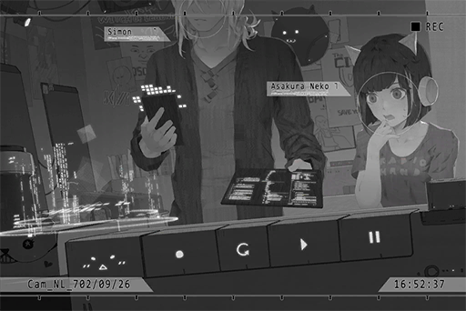

**NEKO#ΦωΦ** 
Ohhhhhh! What is that!? It's so freaking cool!!

**Xenon** 
My A.I. It can rewind and trace the signal source through the connection routes. The admins have now filed an official request to A.R.C. to investigation Æsir himself.

**NEKO#ΦωΦ** 
Rewind...? Don't get it! How does it work!?

**Xenon** 
You're noisy. Cherry also saw this, ask her instead. I don't have the time to explain the details to you.

**NEKO#ΦωΦ** 
Muuuu\~\~

**Xenon** 
Speaking of which, do you know about her getting injured?

**NEKO#ΦωΦ** 
Of course I do! NEKO called her a while ago; she said nothing is serious...

*\[Knock on the head\]*

**NEKO#ΦωΦ** 
Oww! That hurts! Why did you hit me!?

**Xenon** 
What were you thinking with that stream a few days ago? Didn't I tell you to stay low when I got you out? Yet you started spilling random crap immediately... do you really want me to delete your account?

**NEKO#ΦωΦ** 
T, that... that was just a quick chat with everyone whom I haven't seen in a while!

**Xenon** 
Do you realize that many people rushed to Mono because of what you said? And that they made the site even more chaotic? Cherry got hurt because of that, too.

**NEKO#ΦωΦ** 
Eh...? What... how did it...?

**Xenon** 
Your fans are simply too out of control... To be honest, even if we suspend your account now, it will very likely lead to other issues.

**NEKO#ΦωΦ** 
...... T, that's true! You can't blame NEKO for all that!

**Xenon** 
Shut up. It's because of the current situation that you need to pay even more attention to what you post. Now, only you can prevent them from blowing this thing even more out of proportion.

**NEKO#ΦωΦ** 
Umm... OK\~ But didn't I tell them to not make random guesses afterward? And I ended the stream too?

**Xenon** 
Not enough. You started the topic, didn't you?

**NEKO#ΦωΦ** 
Once I got online, everyone just wanted to talk about gossip. If I don't talk about this, it feels like the channel will become kinda boring...

**Xenon** 
... They are your fans after all. All these years of you feeding them content like that...  
No, that's not it. They're probably already like that in the first place; your channel just drew them together into one massive group...

**NEKO#ΦωΦ** 
Heehee, so they are all attracted by NEKO's charm? Nice!

**Xenon** 
... Idiot. All in all, you must have a better understanding of the influences and dangers of the internet. You are already a public figure. Try to avoid creating more chaos, get it? Don't give me more work. 
If your channel is solely dependent on gossip, then that's quite sad.

**NEKO#ΦωΦ** 
... Ok, ok, I get it! Xenon is so annoying in lecture mode!

**[Xenon-A.I.]** 
_Rewind complete. Communication records that match criteria: 1. _

**Xenon** 
Done...huh? What is this? This is a really weird location.

**NEKO#ΦωΦ** 
What's wrong?

**Xenon** 
Nothing. I'll analyze it in detail when I get back.

**NEKO#ΦωΦ** 
Eh? Are you leaving?

**Xenon** 
Yes, my schedule is quite packed. The only reason I came was for the rewind... Ah, and to get JOE's Bass, since you really aren't practicing much.

**NEKO#ΦωΦ** 
EH!? I am! I will practice! Don't take it away!

**Xenon** 
Shut it. I had a bet with him. If I don't take it back to him this time, he will get me trashed for sure. I'm taking it.

**NEKO#ΦωΦ** 
Eheh\~\~\~!

_\[Signal Lost\]_

[*(Click here to go back to the top)*](#toc)

## <a id="nos005"/>\[#005\] Cam11\_St07\_702\_09\_29
### Requirements
| Character  |Level|
|------------|:---:|
|**NEKO#ΦωΦ**| 45  |

### Log Content

**NEKO#ΦωΦ** 
Whew\~ finally home. 
Ugh, so annoying\~ Why is it raining so much these days?

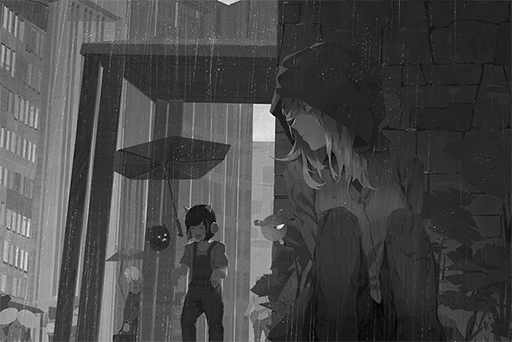

**？？？** 
Umm......

**NEKO#ΦωΦ** 
Man\~\~ Even my shoes are totally drenched...

**？？？** 
Umm......

**NEKO#ΦωΦ** 
? 
A beggar? No no no, I don't have any money.

**？？？** 
... It's me...

**NEKO#ΦωΦ** 
......? 
...... AHH!! PAFF!? WHY ARE YOU HERE!?

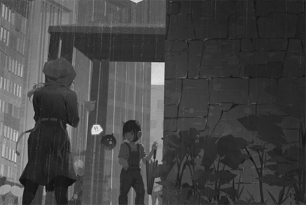

**PAFF** 
P, please keep your voice down...

**NEKO#ΦωΦ** 
Yikes\~ Why are you so dirty and smelly? Don't come near me!

**PAFF** 
I'm so sorry. I... Ugh...

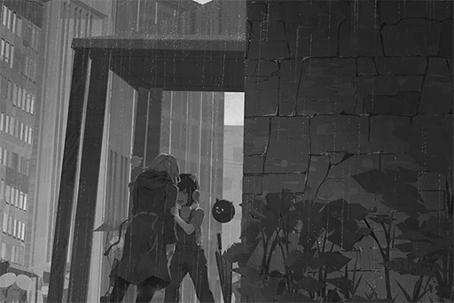

**NEKO#ΦωΦ** 
W,w,w, wait a sec\~ Are you alright...? You can barely stand...

**[Tuner-san]** 
_Aroma's health condition unstable. Water and nutrients required._

**PAFF** 
... _\*Sobs\*_ I'm sorry... _\*Sobs\*_...

**NEKO#ΦωΦ** 
_\*Sighs\*_ What the... Is this some kind of prank for a TV show?

**PAFF** 
_\*Sobs\*_......

**NEKO#ΦωΦ** 
... Anyway, let's get inside first. You're gonna catch a cold if you keep standing in the rain like this.

_\[Signal Lost\]_

[*(Click here to go back to the top)*](#toc)

## <a id="nos006"/>\[#006\] Cam\_NL\_702\_09\_29
### Requirements
| Character  |Level|
|------------|:---:|
|**NEKO#ΦωΦ**| 48  |

### Log Content
*\[Door Opens\]*

**NEKO#ΦωΦ** 
Thank goodness, they went to pick up Kenta. Nobody happens to be home right now. Come in, quick.

**PAFF** 
I'm sorry, I...

**NEKO#ΦωΦ** 
Stop right\~\~ there. There are many\~ things NEKO want to poke fun at, but FIRST! You need to take a shower ASAP; because you stink, a lot!

**PAFF** 
Ah, ok...

**NEKO#ΦωΦ** 
You can take a bath yourself, right? Gimme a sec... Damn, you are so skinny... I guess NEKO's clothes can probably fit you just fine? Here, you can wear these.

**PAFF** 
Thank you...

**NEKO#ΦωΦ** 
HOLY! Your boobs are huge, and they look amazing... Don't think I have a bra that fits you, so that's about it. You can use whatever you want in the bathroom.

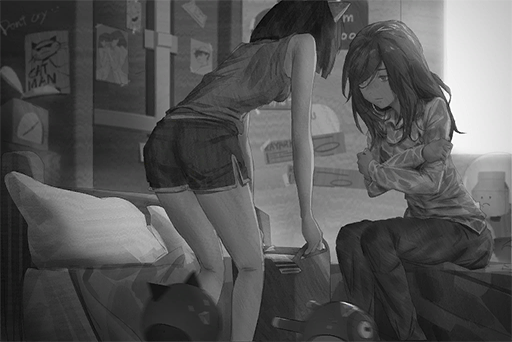

**PAFF** 
......

**NEKO#ΦωΦ** 
... What? Stop dazing off. Get inside now! You stink!

**PAFF** 
Ah, got it! Excuse me!

**NEKO#ΦωΦ** 
Don't take too long in there though. NEKO needs to take a shower as well.

_\[Signal Lost\]_

[*(Click here to go back to the top)*](#toc)

## <a id="nos007"/>\[#007\] Cam\_NL\_702\_09\_29
### Requirements
| Character  |Level|
|------------|:---:|
|**NEKO#ΦωΦ**| 49  |

### Log Content
**NEKO#ΦωΦ** 
Hah\~ That feels nice\~ 
Here, this is for you. You're sick, right? You should take this medicine.

**PAFF** 
......

**NEKO#ΦωΦ** 
... What's the matter? You can't take flu medicine? Ah! Or are you suspecting that NEKO just gave you some weird drug?

**PAFF** 
N, no. I just didn't expect you to be willing to help me. Thank you so much...

**NEKO#ΦωΦ** 
A super idol suddenly pops up on your doorsteps like a beggar and is bawling her eyes out; pretty sure most people would not just ignore her.

**PAFF** 
......

**NEKO#ΦωΦ** 
And turns out you can speak normally after all.

**PAFF** 
Eh? Umm...

**NEKO#ΦωΦ** 
Ah, nothing. It's just that I've never heard you speak back when I was still with Mono.

**PAFF** 
... I'm sorry.

**NEKO#ΦωΦ** 
Umm, you don't have to apologize... Heard rumors that you ran away from Mono. Looks like it's confirmed now?

**PAFF** 
Yes...

**NEKO#ΦωΦ** 
What happened?

**PAFF** 
I... I don't where I should begin. My brain is still a mess right now...

**NEKO#ΦωΦ** 
Oh my... Then, let's start by telling me why you decided to come to NEKO.

**PAFF** 
... Besides the people at Mono, I don't know anybody else...

**NEKO#ΦωΦ** 
Wait a sec, how did you know where NEKO lives?

**PAFF** 
I just found out today that Tuner\-san has Mono's address book stored in it...

**NEKO#ΦωΦ** 
Damnit! Those bastards at Mono still kept my information after all these years... Whatever; now's not the time to be annoyed by that.  
You said today? Then where have you been before I took you in?

**PAFF** 
On the streets...

**NEKO#ΦωΦ** 
On the streets...? For how long?

**PAFF** 
Two weeks... I think?

**NEKO#ΦωΦ** 
Two Weeks!? Did you not find a place to stay?

**PAFF** 
Yes... It seems that I'm easily recognizable, so I'm too scared to go anywhere...

**NEKO#ΦωΦ** 
Idiot! No wonder you looked like a beggar! If NEKO was not released by the admins, wouldn't you be wandering the streets with no end!?

**PAFF** 
...... But I have nowhere to go, and I don't know who I can go to for help...

**NEKO#ΦωΦ** 
... NEKO used to believe that you were protected like a princess by them. Didn't think that you would do something as daring as running away. You definitely caught me by surprise there.

**PAFF** 
Protect...?

**NEKO#ΦωΦ** 
Right? Back then, it's difficult to even come near you. You were always accompanied by your sister and a ton of security people.

**PAFF** 
Sister... _\*Sobs\*_...

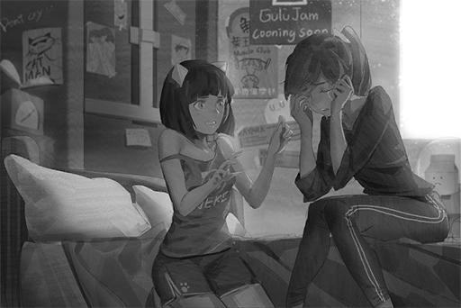

**NEKO#ΦωΦ** 
Ehhh? Why are you crying again...

**PAFF** 
_\*Sobs\*_... I'm sorry.

**NEKO#ΦωΦ** 
Forget it. You were finally able to find a place to settle down. Bet you still need time to organize your thoughts, right? NEKO will spare you the questions. 
All in all, you can stay here tonight! Get some rest; you can take your time and tell me what happened tomorrow.

**PAFF** 
... Is it really ok? Your family...

**NEKO#ΦωΦ** 
No worries\~ They basically never come into my room. Previously, I kept a stray cat in my room without their knowledge for almost a month! It's a much bigger stray cat this time though, Haha\~.

**PAFF** 
...Haha.

**NEKO#ΦωΦ** 
Hoho\~? This is the first I ever see you smile; it's cute! An idol should be more like this, so stop crying.

**PAFF** 
I, is that so...?

*\[Door Opens\]*

**NEKO#ΦωΦ** 
Ah, they're back. Make sure you hide yourself carefully. My little brother is a HUGE\~ fan of yours. If he finds out you're hiding here, he's gonna cause a big ruckus!

_\[Signal Lost\]_

[*(Click here to go back to the top)*](#toc)

## <a id="nos008"/>\[#008\] Cam\_NL\_702\_09\_30
### Requirements
| Character  |Level|
|------------|:---:|
|**NEKO#ΦωΦ**| 51  |

### Log Content
**NEKO#ΦωΦ** 
You can sleep first. Lemme see... you can sleep on the bed. NEKO doesn't mind sleeping on the floor.

**PAFF** 
Eh...? I shouldn't do that...

**NEKO#ΦωΦ** 
Nah, don't worry about it\~ You haven't had a proper sleep in weeks, right? Besides, even if NEKO sleeps on the bed, more often than not I'll wake up and find myself on the floor.

**PAFF** 
Haha... Thank you.

**NEKO#ΦωΦ** 
NEKO still has some work to do. I'll sleep later. Goodnight.

**PAFF** 
Goodnight.

*\[Door Closes\]*

**NEKO#ΦωΦ** 
Whew\~ Alrighty then, what should I do next?

**NEKO#ΦωΦ** 
The missing PAFF turns out to be in NEKO's home. This is the stuff that will make every single news headline!

**NEKO#ΦωΦ** 
Regardless, gotta get online and put this gossip out there!

**NEKO#ΦωΦ** 
"OMGGGGGG! You guys will NOT believe what NEKO just discovered!!! \\(ΦдΦ)/ A really, really, really\~\~\~\~\~ BIG secret!!"

**NEKO#ΦωΦ** 
Done. This post is certainly going to create quite the discussion\~

**NEKO#ΦωΦ** 
Hoho, yesss\~ The fans are starting to get hyped!

_\[»»» Fast Forward»»»\]_

**NEKO#ΦωΦ** 
......

**NEKO#ΦωΦ** 
... This... This is not the best way to handle this news, isn't it? Xenon's probably going to be super mad if he sees this...

**NEKO#ΦωΦ** 
......

**NEKO#ΦωΦ** 
... Guess I'll delete it.

**NEKO#ΦωΦ** 
However, what am I going to do now? I can't let her live here forever; that's just not possible... 
Now that I think about it, I practically know nothing about her situation. Why did I decide to bring her troubles on myself? 
Arrggghh\~ So\~ annoying! MeowBot, what do you think?

**[MeowBot]** 
_When you feel annoyed, it's also important to rely on friends meow\~ If you don't mind, I can be your friend meow\~_

**NEKO#ΦωΦ** 
... It repeating the same dumb phrases a lot recently. Is it broken?

**[MeowBot]** 
_Love can make a girl even more beautiful meow\~ Do you want to play a projection of Xenon meow?_

**NEKO#ΦωΦ** 
W, what nonsense are you spewing!? Don't play it! I said no! UGH\~ this guy is definitely broken! I'm taking you to a repair center tomorrow!

**[MeowBot]** 
_Tomorrow's weather: heavy rain. If you're going out, please remember to bring an umbrella meow\~_

**NEKO#ΦωΦ** 
Lately, it seems to be raining every single day... Brings me back to the time when I first met him. The weather was like this back then too...

**Kenta** 
Big sister, who are you talking to?

**NEKO#ΦωΦ** 
YIKES! That scared me!...... Sister is playing with the MeowBot. 
Why are you awake?

**Kenta** 
Thirsty.

**NEKO#ΦωΦ** 
See, told you that you need to drink some water before going to bed. Come, I'll pour some water for you.

**Kenta** 
Don't want water. I want hot chocolate.

**NEKO#ΦωΦ** 
Ehh\~? Ok, ok... can't help it. Don't tell sis Yukiko about this though!

**Kenta** 
Ah, big brother Xenon; was big sister watching this when I came in?

**NEKO#ΦωΦ** 
WAHHHHH!! Stop stop stop!! I told you not to play it! The MeowBot really is broken! Ahahahaha! Big sister is going to get it fixed tomorrow!

_\[Signal Lost\]_

[*(Click here to go back to the top)*](#toc)

## <a id="nos009"/>\[#009\] Audio\_NL\_702\_10\_04
### Requirements
| Character  |Level|
|------------|:---:|
|**NEKO#ΦωΦ**| 53  |

### Log Content
*\[Door Opens\]*

**NEKO#ΦωΦ** 
Here, see if these clothes fit you. You can't just wear NEKO's clothes all the time, can you?

**PAFF** 
T, thank you...

**NEKO#ΦωΦ** 
And this bra...... HEY\-YA!

**PAFF** 
... Kyaa!

**NEKO#ΦωΦ** 
Muuu... Dang, they're big...... Hoho, so soft\~\~\~ Buhehehe...

**PAFF** 
Umm... please stop... Pfft, haha...

**NEKO#ΦωΦ** 
Hoho\~\~ So PAFF is the type that's weak against tickles...? Take this! Tickle tickle tickle tickle!

**PAFF** 
Ahahaha! Ahahaha!

*\[Door Knock\]*

**Kouhei** 
NEKO? Who's laughing?

**NEKO#ΦωΦ** 
Yikes! Shhh\~!! 
N, NEKO is watching a video. What's the matter?

**Yukiko** 
We three are going to the mall, and we'll buy ingredients for dinner on the way. Please look after the house. Is there anything you want us to buy for you?

**NEKO#ΦωΦ** 
Nothing comes to mind! Have a safe trip\~

*\[Door Opens\]*

**NEKO#ΦωΦ** 
Whew... that was close. PAFF, you're too loud! We're this close to being busted!

**PAFF** 
I, I'm sorry...

**NEKO#ΦωΦ** 
Ah, it's also kinda weird for me to keep calling you PAFF... Can I call you Aroma? Ah! Maybe I'll call you Aroma\-chan instead!

**PAFF** 
Eh? Sure...

**NEKO#ΦωΦ** 
Then a decision is reached! Aroma\-chan it is!

**PAFF** 
Aroma......

**NEKO#ΦωΦ** 
What's wrong? Still thinking about that incident?

**PAFF** 
... It's hard to believe after all, isn't it...? The feeling that I am not myself...

**NEKO#ΦωΦ** 
NEKO doesn't really understand that... However, what do you plan to do next? I'm totally fine with having a cute girl waiting for me everytime I return to my room... but realistically speaking, NEKO can't let you hide here your whole life either.

**PAFF** 
I want... to confirm if what I thought was true or not... But about how...

**NEKO#ΦωΦ** 
Just a suggestion, isn't directly asking you sister a faster way to know the truth?

**PAFF** 
Y, you indeed have a point... but... I'm so scared... I don't know how I should face them...

**NEKO#ΦωΦ** 
...... 
Well... NEKO can somewhat understand this sort of emotion...

**NEKO#ΦωΦ** 
In short, don't think so much for now! Besides, NEKO hates things that cost too much brain power. 
At the very least, letting you hide here for some time as a temporary fix shouldn't be a problem... right?... I think?

**PAFF** 
Thank you...

**NEKO#ΦωΦ** 
Oh, right! Now they are not at home, come to the bathroom with NEKO.

**PAFF** 
Eh?

_\[»»» Fast Forward»»»\]_

**NEKO#ΦωΦ** 
Tada! Look, NEKO bought this!

**PAFF** 
This is...?

**NEKO#ΦωΦ** 
Hair dye! Light slate grey colored\~ Your hair color right now is too noticeable! If we use this and apply some disguise, you should be able to go outside.

**PAFF** 
Go outside...

**NEKO#ΦωΦ** 
No need to worry. NEKO is also very well aware of the troubles of being recognized. Therefore, I know a lot about disguises! Besides, we can't have NEKO deliver food to you every day. It's like I have some weird slave fetish or something... 
In addition, how will you be able to confirm the things you said if you stay at home all the time?

**PAFF** 
Okay...

_\[»»» Fast Forward»»»\]_

**NEKO#ΦωΦ** 
Aroma\-chan's hair is so soft... So you had black hair originally?

**PAFF** 
Yes, the same color as my sister... I recall that I really liked Magenta, that's why I've always dyed my hair that color.

**NEKO#ΦωΦ** 
Huh...? If you ask me, NEKO thinks this color suits you better. Done! Take a look!

**PAFF** 
Wow... what a beautiful color!

**NEKO#ΦωΦ** 
Right? NEKO has a friend—— Linda\-chan. She knows a ton about hairstyles! NEKO learned all of my tricks from her! 
Then, if we tie your hair like how you used to... tada!

**PAFF** 
......!

**NEKO#ΦωΦ** 
So pretty\~ With that plus a simple face mask, I can guarantee that nobody will recognize it's you. Most importantly, it's adorable\~ I originally plan to cut your hair short, but Aroma\-chan's hair is way too pretty. NEKO can't bring myself to do such a cruel thing!

**PAFF** 
T, thank you\~

_\[Signal Lost\]_

[*(Click here to go back to the top)*](#toc)

## <a id="nos010"/>\[#010\] Audio\_Asakura\_699\_12\_24
### Requirements
| Character  |Level|
|------------|:---:|
|**NEKO#ΦωΦ**| 54  |

### Log Content
*\[Door Opens\]*

**NEKO#ΦωΦ** 
Lin\~da\~chan\~! Welcome!

**Linda** 
Sorry for disturbing... Yikes! NEKO...

**Kouhei** 
NEKO, that's dangerous. Don't do that. 
Linda, it has been a while.

**Linda** 
Yes. I'll be in your care tonight.

**Yukiko** 
Hello, Linda. NEKO mentions you a lot in our conversations! I finally get to meet you in person.

**Linda** 
Thank you for the invitation... You're... Sis Yukiko, right?

**Yukiko** 
Yes. Thank you for taking care of NEKO a while ago. Also, apologies for causing you so much trouble... 
Here, come on in. We've prepared a Christmas feast!

**Linda** 
Not at all...... Thank you.

**NEKO#ΦωΦ** 
What do you think!? A very kind person, right!

**Linda** 
Yeah, totally different than you. Let's get inside first.

_\[»»» Fast Forward 30 minutes»»»\]_

**Kenta** 
Mom! I'm full! I want to play video games!

**Yukiko** 
Sure. Go ahead.

**NEKO#ΦωΦ** 
Hold your horses! Get your a\*\* back here! You left tomatoes on your plate again! And green peppers! No video games for you until you finish them!

**Yukiko** 
It's alright; he already ate a lot... Linda, how is the food? Do you like it?

**Linda** 
Ah, it's very tasty! I don't usually have meals this grand back at home. Thank you.

**Yukiko** 
Thank goodness. I was really anxious about messing up the dishes... especially the roast chicken. In my hometown, we didn't normally eat this during Christmas.

**Linda** 
Do people not celebrate Christmas back in Node 03?

**NEKO#ΦωΦ** 
We do, but we don't go as far as roasting a whole chicken for it. 
Speaking of which, the holiday celebrations in Node 08 are nuts! It seems like there's a huge party for every single holiday... We used to just have a simple meal together and call it a day! Muuu\~ it's not the holiday itself, but who you celebrate the holiday with that's important, right?

**Kouhei** 
Haha, material well\-being is very important as well... _\*Gulp!\*_

**Linda** 
Compare to the next event, Christmas really is nothing special. Everybody has more or less gotten used to celebrating it.

**NEKO#ΦωΦ** 
The next event?

**Linda** 
In a few days, it would be new year's eve for 700 N.A. Rumor has it that the admins plan to create the most glorious celebration event ever. There will be a giant parade, parties, DJ performances and magnificent fireworks!  
Oh, and the whole event will be free to attend.

**NEKO#ΦωΦ** 
You're right! The event for last year was super extravagant as well. Since it's the 700th anniversary, it's definitely going to be even more awesome! We should all go to the event, the entire family!

**Kouhei** 
Of course... _\*Gulp!\*_

**Yukiko** 
Linda, will you be going together with us as well? Or are you going with your family?

**Linda** 
No... I don't want to bother you guys anymore. Besides, I'm not really good at dealing with crowds. Haha...

**Yukiko** 
Now that I think about it, do you girls know what Christmas is celebrating? Both Kenta and I aren't exactly sure about that.

**Linda** 
I think the Academy taught us about it, but I already forgot... 
NEKO, you... never mind, can't rely on you to remember things.

**NEKO#ΦωΦ** 
What do you say!? NEKO had a higher score than you in the previous history exam\~ you meanie!

**Linda** 
I don't think 39 and 42 are scores worthy of any comparison...

**Kouhei** 
We old folks don't know either... After all, we learned that humans used to celebrate Christmas from the records. We've never experienced that time ourselves to understand the reasoning... _\*Gulp!\*_

**Kouhei** 
Nevertheless, even if we don't know what we are celebrating, the fact that we can gather together and enjoy a hearty meal is already more than enough to be happy about... Isn't that all we want, to be happy? 
It doesn't matter if we never truly understand it. Hahaha.

**NEKO#ΦωΦ** 
......

**Kouhei** 
That is why, daddy needs to learn from you guys too... Stuff like dying your hair or wearing those ripped clothes... Sighs, I can never figure what young people are up to these days. Daddy was not like this when I was young...... _\*Gulp!\*_

**Linda** 
Umm...

**NEKO#ΦωΦ** 
Daddy, you idiot, why are you talking about this again all of a sudden...

**Kouhei** 
... Even though I don't understand, daddy at least knows that is why you guys like. That's good enough for me. 
Daddy believes, that the things my daughter likes are definitely not bad.

**Yukiko** 
......?

**NEKO#ΦωΦ** 
... Daddy, are you...

**NEKO#ΦωΦ** 
AHH!! I knew it! The thing you've been chugging down all this time, it's wine, isn't it!?

**Yukiko** 
Eh? I'm sure I hid the bottle... Kouhei, you said you were just drinking one glass. Come on...

**NEKO#ΦωΦ** 
Sis Yukiko, look at this! It's hidden behind his legs! The whole bottle is empty! You're way too naive! Once daddy flips the switch there is no stopping him okay!

**Kouhei** 
Not a problem, NEKO, daddy is not drunk... Daddy wants your best friend to teach me, what you young people are into these days... Hick! You two have known each other for so long...

**Linda** 
......

**NEKO#ΦωΦ** 
No harassing Linda\-chan\~! 
Sis Yukiko, we need to drag this drunkard away and lay him in bed now! This fatso will directly collapse into a deep sleep any minute now and won't wake up until tomorrow morning. We won't be able to move him once he is asleep! Hurry, hurry!

**Yukiko** 
Umm, O, okay! Kouhei, come over here...

**NEKO#ΦωΦ** 
Arrggghhhh\~ This is so embarrassing\~ Dumb daddy! Stupid smelly feet!

_\[Signal Lost\]_

[*(Click here to go back to the top)*](#toc)

## <a id="nos011"/>\[#011\] Cam\_Asakura\_699\_12\_24
### Requirements
| Character  |Level|
|------------|:---:|
|**NEKO#ΦωΦ**| 54  |

### Log Content
**NEKO#ΦωΦ** 
Linda\-chan, sorry about that. It's rare that you come to visit us, yet daddy went on a drunken rage again... He is the worst...

**Linda** 
It's alright. My family doesn't celebrate the holidays, to begin with. It was very enjoyable... 
Besides, your dad... I'm not certain, but I feel like he has changed.

**NEKO#ΦωΦ** 
Muu? How so?

**Linda** 
Even though he was a bit drunk back there, he would never say those things in the past, right? Before, I always got this feeling that he didn't really like me, whether it's the way I dress or something else.

**NEKO#ΦωΦ** 
......

**Linda** 
Besides giving me living expenses, my family never cared about what I like or what I dislike... 
This is my first time chatting with older people, and I feel like NEKO has an amazing family.

**NEKO#ΦωΦ** 
... Linda\-chan...

**Linda** 
Aw, man; why did I say those things all of a sudden... That was so cringy, haha... 
Heard that you made another new song? Can I listen to it?

**NEKO#ΦωΦ** 
...... Sure!

*\[Music\]*

**Linda** 
Hoho, this tempo really suits the holiday atmosphere. It's like everyone is holding hands and dancing together.

**NEKO#ΦωΦ** 
Hehe... it's pretty neat, right!

*\[Door Opens\]*

**Yukiko** 
Oh? Is this NEKO's new song? Sounds very joyful.

**NEKO#ΦωΦ** 
Woah! Sis Yukiko... Where's daddy?

**Yukiko** 
Asleep in bed. He was mumbling about wanting to come out and listen to your song, even though he can barely stand. It took me quite some time to finally put him to sleep.

**NEKO#ΦωΦ** 
Ha? Stupid daddy, he's just talking the big talk\~ He doesn't understand NEKO's music...

**Kenta** 
Big sister's music is the best!

**NEKO#ΦωΦ** 
You little brat only likes PAFF's songs, don't ya?

**Kenta** 
That's not true\~ Big sister's songs are great too!

**NEKO#ΦωΦ** 
... Very well! Then big sister shall teach you how to dance! Here, grab my hand and match the beat! One\-two\-three\-four!

**Kenta** 
Big sister, too, too fast! Waaa! WAAAAAA!

**Yukiko** 
Be careful, NEKO. Don't hurt yourself...

**NEKO#ΦωΦ** 
Sis Yukiko, you should join too! Linda\-chan, turn up the volume! Christmas is a time of celebration after all! Ahahahaha!

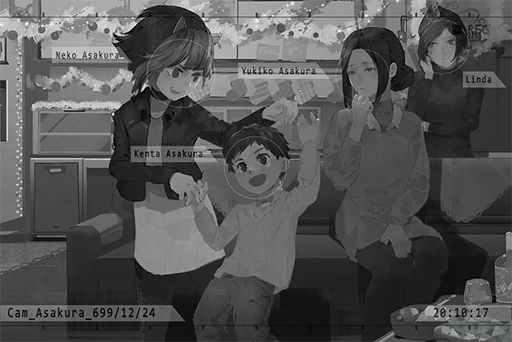

**Linda** 
Haha...... Idiot, you're on the verge of bursting into tears, yet you're still trying to act strong.

**Linda** 
......

**Linda** 
Merry Christmas.

_\[Signal Lost\]_

[*(Click here to go back to the top)*](#toc)

## <a id="nos012"/>\[#012\] Audio\_Asakura\_702\_10\_13
### Requirements
| Character  |Level|
|------------|:---:|
|**NEKO#ΦωΦ**| 55  |

### Log Content
**NEKO#ΦωΦ** 
All done\~ Kenta, time for dinner.

**Yukiko** 
Today's dishes look very successful.

**NEKO#ΦωΦ** 
No kidding\~ Sis Yukiko is getting more and more skilled by the day. You're so close to surpassing NEKO!

**Kouhei** 
I'll get the rice.

**NEKO#ΦωΦ** 
Hey! Kenta, big sister said time for dinner! Did you even hear me? Turn off the TV.

**Kenta** 
I want to finish this!

**NEKO#ΦωΦ** 
Huh? Isn't that show over?

*\[Music\]*

**Kenta** 
I want to finish hearing PAFF's ED!

**NEKO#ΦωΦ** 
Ya little brat...

**Yukiko** 
Well\~ It doesn't hurt to eat dinner with the TV on sometimes.

**NEKO#ΦωΦ** 
Muuu\~ Sis Yukiko, you're going to spoil him like this.

**Kouhei** 
I wonder who's the one that spoils him more.

**[TV]** 
_Good evening, everyone. This is the Evening News._

**NEKO#ΦωΦ** 
Alright, it's all finished. Get in your seat now. No tomatoes today, happy?

**Kenta** 
YEAH!

**Yukiko** 
Eh......? NEKO, did you make an extra serving again? Why is there so much food?

**Kouhei** 
She's right. You seem to do that a lot these days.

**NEKO#ΦωΦ** 
Ah... NEKO gets hungry in the middle of the night, so I figure the extra portion can serve as a late\-night meal!

**Kouhei** 
... You better watch your weight.

**NEKO#ΦωΦ** 
Ha!? NEKO is not fat at all, OK! I'm just not tall enough! Daddy, you don't get to talk! If you keep drinking beer, that beer belly is going to get more and more noticeable!

**Yukiko** 
Hoho, she has a point. You should pay more attention to yourself too.

**Kouhei** 
Ummm...

**[TV]** 
_The next news:  
The super idol PAFF, who went missing a while ago, is still yet to be found by the Administration Bureau. Because of this, some fans have begun to form voluntary search squads. As of now, the scale of this search by the civilians is growing larger and larger. Multiple stores have begun to report this search on being a hindrance to their businesses..._

**Yukiko** 
It seems rare for Node 08 to have a person go missing for so long. It's so scary...

**Kouhei** 
That's just because you've never heard about those who were never found. That simply can't be the case with PAFF. She's way too famous.

**Yukiko** 
However, if she escapes to another Node... for example, somewhere like 03, it will be very difficult to find her.

**Kenta** 
Is PAFF not coming back again...?

**NEKO#ΦωΦ** 
......

**Kouhei** 
NEKO, why are you so quiet today? Usually, whenever we see news about PAFF, don't you always badmouth her for like a minute?

**NEKO#ΦωΦ** 
EH!? Eh... Ah, yeah, haha... 
Well, I guess it is pretty tough to be a superstar...

**Kouhei** 
... What is wrong with you today?

**NEKO#ΦωΦ** 
Nothing! I'm just a bit exhausted from the supplementary classes at the Academy this afternoon. Teehee\~

**Kouhei** 
You're graduating in two months. Keep at it.

**NEKO#ΦωΦ** 
Yep.

**Kouhei** 
Sidenote, these days, whenever you're not at home, there are noises coming from your room. You aren't raising something in secret again, are you?

**NEKO#ΦωΦ** 
Eh!? N, no I did not!

**Kouhei** 
NEKO, we respect you, that's why we won't check your room. To be honest, you have the freedom to have any pet, but please don't get cats anymore...

**Yukiko** 
Sorry. I really couldn't handle cats...

**NEKO#ΦωΦ** 
... Of course I won't! Sis Yukiko is not having allergies as well, right? I really don't have anything!

**Kouhei** 
... If something happened, tell us. We will all help you out, get it?

**NEKO#ΦωΦ** 
..... 
I, I know that. What? Why are you saying this out of nowhere? Ahahaha...

_\[→Signal Switch\]_

*\[Door Closes\]*

**NEKO#ΦωΦ** 
Whew\~ 
Here, your dinner.

**PAFF** 
Thank you... Is something wrong?

**NEKO#ΦωΦ** 
They said that they heard noises from the room in the morning...

**PAFF** 
Ah, I accidentally fell down this morning...... I'm so sorry!

**NEKO#ΦωΦ** 
Come on\~ Be careful, ok! NEKO feel like I can't cover this up anymore...

**PAFF** 
I get it... sorry.

_\[Signal Lost\]_

[*(Click here to go back to the top)*](#toc)

## <a id="nos013"/>\[#013\] Audio\_Asakura\_702\_11\_01
### Requirements
| Character  |Level|
|------------|:---:|
|**NEKO#ΦωΦ**| 57  |

### Log Content
**NEKO#ΦωΦ** 
Kenta, eat it.

**Kenta** 
Uhhhh...

**[TV]** 
_Welcome to the "Truth Digger 101" segment\~ Tonight's guests..._

**NEKO#ΦωΦ** 
Before you finish it, big sister will not leave this spot. The night is long. We still got plenty\~ of time.

**Kenta** 
_\*Sobs\*..._

**NEKO#ΦωΦ** 
No crying!

**[TV]** 
_... Ladies and gentleman! Only three sets left! Call in now at..._

**NEKO#ΦωΦ** 
Ahhh\~ This is so damn boring. Why are all the shows so terrible...

**Kouhei** 
Then turn off the TV. Stop skipping through the channels like this.

**[TV]** 
_...... Just earlier today, A.R.C. backend administrator Simon Jackson has been arrested in A.R.C. by law enforcement agents._

**NEKO#ΦωΦ** 
...... Eh?

**Kouhei** 
......!

**Yukiko** 
Woah... What is going on?

**[TV]** 
_...... Our sources show that he is none other than the biggest suspect for "Æsir", the mastermind behind the recent string of internet crime incidents._

**Kenta** 
... Did big brother Xenon get arrested?

**NEKO#ΦωΦ** 
... How is that possible...! Ugh...!

*\[Things crashing\]*

**Kouhei** 
NEKO!?

**Yukiko** 
Hey! What happened!?

**NEKO#ΦωΦ** 
Ugh... Head... hurts... a lot...

**[TV]** 
_According to our inside sources, the Administration Bureau received investigative information from an A.R.C. employee. The employee accused Simon Jackson of using a specialized A.I. that has yet to clear safety protocols for all kinds of operations. The Administration Bureau decided to delve further into the situation. However, when they came across A.R.C.'s system program records, they discovered a large number of commands used by said A.I. to commit internet crimes, which even includes the infamous cyberterrorism incident during a live stream a few months ago. All this evidence are proof of Simon Jackson's highly possible association with Æsir._

**NEKO#ΦωΦ** 
Ughh...... AHHHHHHHH!!

[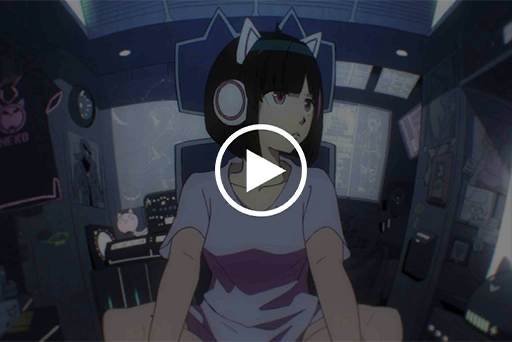](https://youtu.be/QgtLOM2iX2U) 
*[Click the image to watch the movie]*

*\[Things crashing\]*

**Kenta** 
Big sister!?

**Kouhei** 
What exactly is happening!? Yukiko! Turn off the TV first!

**Yukiko** 
O... okay!

**NEKO#ΦωΦ** 
H... how come? Xenon...

**Yukiko** 
NEKO, are you alright!?

**NEKO#ΦωΦ** 
... NEKO... will go to her room and get some rest for now...!

*\[Runs\]*

**Kouhei** 
Hey! ......?

_\[→Signal Switch\]_

*\[Door Closes\]*

**NEKO#ΦωΦ** 
Hah...... Hah......

**PAFF** 
NEKO... What's the matter!? You look pale...

**NEKO#ΦωΦ** 
Xenon... That's impossible...

**PAFF** 
......?

**NEKO#ΦωΦ** 
Aroma\-chan!

**PAFF** 
Eh!? Yes!

**NEKO#ΦωΦ** 
You said that your memory is weird... NEKO... might just have experienced the same thing...

**PAFF** 
Eh...?

**NEKO#ΦωΦ** 
I just saw the news. It said that Xenon is Æsir and that he is now under arrest...

**PAFF** 
Ah, I saw the news report online as well... Xenon...

**NEKO#ΦωΦ** 
Now, whenever NEKO thinks back to the time when I was attacked, the images that flash through my mind... are all Xenon... So he's the one who attacked NEKO and everybody...?

**PAFF** 
......!

**NEKO#ΦωΦ** 
H... How is that possible!? There is definitely something wrong with NEKO's memory as well!! Xenon would never...! Ugh...

**PAFF** 
C, calm down... The more you think about it, the more uncomfortable it will get. You should lie down and get some rest first!

**NEKO#ΦωΦ** 
Yeah...

**PAFF** 
I... don't really understand the situation, so I can't quite help you out on this. I'm sorry...

**NEKO#ΦωΦ** 
No, Aroma\-chan have already gone through plenty of crap just dealing with your own troubles.  
NEKO is lucky... I still have a lot of friends who can help. NEKO will go see them tomorrow. You don't have to worry...

**PAFF** 
Okay. Don't be too hard on yourself. If there's anything I can help, please tell me.

**NEKO#ΦωΦ** 
Gotcha. We should both rest early. Good night.

**PAFF** 
Good night.

_\[Signal Lost\]_

[*(Click here to go back to the top)*](#toc)

## <a id="nos014"/>\[#014\] Cam\_Academy\_702\_11\_06\_1
### Requirements
| Character  |Level|
|------------|:---:|
|**NEKO#ΦωΦ**| 58  |

### Log Content
*\[Class Bell\]*

**Student A** 
Sigh... Why do we have to come to school for a stupid seminar during break...

**Student B** 
Can't help it. This is the last extra credit opportunity of the semester. If we don't take it, neither of us can graduate.

**Student C** 
I want to go home...

**NEKO#ΦωΦ** 
NEKO wants to go home too...

**Student A** 
Wow! It's NEKO! Did you flunk the semester as well?

**NEKO#ΦωΦ** 
Sigh\~\~\~ Yeah, because of the stream incident last time. Like, what the hell! I just wanted to introduce the Academy to my fans!

**Student B** 
Can I sit next to you? We're all big fans of you!

**NEKO#ΦωΦ** 
Sure\~

*\[Door Opens\]*

**ConneR** 
Please be quiet. Class is about to start.

**Student A** 
Yikes, who is that...?

**NEKO#ΦωΦ** 
He seems a bit familiar...

**ConneR** 
Good morning, students. I am your lecturer today. My name is Colin Neumann Jr. 
At the end of today's lesson, there will be a system examination. Although it has nothing to do with me, if you want to graduate on time, I advise trying your best.

**NEKO#ΦωΦ** 
Woah... what a smug teacher.

**Student B** 
Isn't Colin Neumann the guy the news said is dead a while ago...?

*\[Putting down heavy things\]*

**Student** 
...... An ant colony!?

**ConneR** 
Today, I'm going to introduce you young folks to one of my researches. It's about an endangered species found in the desert landscapes located on the east side of 08's forbidden area. They're called "Crystal Ants". You can clearly observe their colony through the glass.

**ConneR** 
The first appearance of this type of ant can date back to around three hundred years ago. Unlike other creatures in the Formicidae family, they have a clear, transparent, almost luminous body. On top of that, they are also abnormally intelligent and have a well\-developed social system. Pretty magnificent creatures, aren't they?

**ConneR** 
Crystal Ants are the only type of creature that will "actively" invade the territory of other ants in that habitat. Even if their own colonies are already very prosperous, they will continue to exterminate other ants in order to expand their own territory. On top of that, they are also one of the very few insect species that knows how to use tools. For example, when they detect that their colony is in danger, they will use all kinds of poisonous thorny plants to protect their colony.

**ConneR** 
This type of ant reproduces at terrifying speeds. While not very poisonous themselves, their deadly aggression and intelligence allowed them to overpower everything. In a very short time, no other species of ant exist in that habitat anymore. They've also ascended to the top of the food chain, having almost no natural enemy.

**Student A** 
Won't other animals attack them?

**ConneR** 
Very good question. In my hand is a "Desert Rat". Its staple food is ants. Now, I will put it in this glass case.

**Student** 
......!!

**ConneR** 
Crystal Ants always move in astonishingly large groups. Whenever they are attacked, no matter how big the attacker may be... this is what happens. They will engulf the attacker in minutes and chew him to death, one small bit at a time. The corpse of this Desert Rat will likely dissolve completely within ten minutes. Not even its bones will be left behind.

**Student** 
... Ewww...

**ConneR** 
Now, why does this seemingly perfect creature end up extinct? That's because, in a desert where resources are scarce, their habitat simply could not withstand their huge appetite. Their lifespan is actually very short, and they don't have the ability to move to another location...

**ConneR** 
Pretty ironic, isn't it? After all, they are the most superior existence of their species. Yet, in the end, they went extinct simply because the environment is unable of withstanding their own capabilities.

**Student** 
......

**ConneR** 
The Crystal Ants in this case are probably the last surviving batch in the entire world. Even now, they have no clue of the dire situation and continue to refer to themselves as kings in this tiny box... How cute. _\*Chuckles\*_\~

_\[»»» Fast Forward»»»\]_

*\[Class Bell\]*

**Student B** 
That lecturer... he feels so... weird. I don't want to take his classes anymore...

**NEKO#ΦωΦ** 
Yeah\~ So much for NEKO thinking that he's kinda handsome...

**ConneR** 
I appreciate your compliment.

**NEKO#ΦωΦ** 
WAAHH!?

**ConneR** 
Miss Neko Asakura... right?

**NEKO#ΦωΦ** 
... Yes. Is there something you want?

**ConneR** 
Even though the grades will be announced by the system at a later date, I managed to sneak a quick peek. You... failed, unfortunately.

**NEKO#ΦωΦ** 
EHHHHH!? How come...

**ConneR** 
It's true. You can see for yourself, a 55.

**NEKO#ΦωΦ** 
Oh crap... This is bad! This is really, really bad!

**ConneR** 
Hmm\~ It's not like there's no space for a few bonus points.

**NEKO#ΦωΦ** 
For real!? Please, please let NEKO pass! I don't want to flunk the whole semester!

**Student B** 
Hey! What are you trying to do!?

**ConneR** 
_\*Chuckles\*_ No need to be so tense. I just want to know some things about the Æsir attack incident. As a victim yourself, do you have any interesting information you can tell me?

**NEKO#ΦωΦ** 
......!?

**Student B** 
That has nothing to do with the course, right!?  
Stop asking that ridiculous crap!

**ConneR** 
What a shame... I will consider about the bonus points. Here is my contact information. Feel free to visit me whenever you feel like it, Miss Kittyears.

**Student B** 
NEKO, let's go!

**NEKO#ΦωΦ** 
......

_\[Signal Lost\]_

[*(Click here to go back to the top)*](#toc)

## <a id="nos015"/>\[#015\] Cam\_Academy\_702\_11\_06\_2
### Requirements
| Character  |Level|
|------------|:---:|
|**NEKO#ΦωΦ**| 58  |

### Log Content
**NEKO#ΦωΦ** 
This sucks... why am I the one harassed by the weird lecturer... But if I drop the course, I won't have enough credits...

**Hawk** 
Hey, you're Neko Asakura, right?

**NEKO#ΦωΦ** 
......? Who the heck are you?

**Raven** 
Hawk, this is the Academy. Stop that. 
Miss Asakura, I am Raven, a law enforcement agent from Node 08 Administration Bureau. This is my partner, Hawk. There are some things we would like to ask you. Can you spare us some time?

**NEKO#ΦωΦ** 
...... 
NEKO doesn't have time, bye\-bye.

**Raven** 
... Previously, we suspended the investigation on you because of the evidence turned in by Simon Jackson. That shifted the direction of our investigation.

**NEKO#ΦωΦ** 
... And what do you guys want?

**Raven** 
No need to be nervous... In fact, that evidence is currently being re\-evaluated. In order to confirm your innocence a second time, we would like to ask you a few questions. Please be sure to cooperate with us. This is for your own good too.

**NEKO#ΦωΦ** 
... NEKO has nothing to tell you losers already!

**Hawk** 
Jackson's confession has pretty much confirmed his crimes. I advise you to not try to hide anything from us.

**NEKO#ΦωΦ** 
……Xenon……

**Raven** 
Miss Asakura, as an important affiliate of this case, the testimony you provided will be essential. If this case can be clarified as soon as possible, we will no longer bother you anymore either.

**NEKO#ΦωΦ** 
......

**Raven** 
So? Did you recall anything? According to the information we obtained, after you were acquitted, you were able to recover your memory that covered the time of the attack. This is identical to the symptoms of the victims who were attacked during the first incident at Æsir\-FEST. We are also willing to believe that you were merely a victim.

**NEKO#ΦωΦ** 
... No...

**Raven** 
If your memory has recovered, you should be able to remember something. For example, at the time of your attack, were there any abnormal connections? What kind of images did you see? Something like that.

**NEKO#ΦωΦ** 
... Stop asking! NEKO doesn't know anything! 
Xenon is not the criminal! You idiots definitely arrested the wrong person!

**Raven** 
Sighs... can't help it then. Hawk, take that thing out.

*\[Device activate\]*

**NEKO#ΦωΦ** 
... What is that!? What are you guys going to do!?

**Raven** 
This device can probe the memory. It will clearly tell us what images you saw at a specific time frame. Although we are still unsure whether or not we can see the memory during a virtual internet connection, since you insisted on not speaking, we had no choice but to resort to force.

**NEKO#ΦωΦ** 
N... NO!

**Raven** 
If you lied, it leaves us with no other option but to put you in custody again. Your family will be very sad too, right? From what we know, this is going to hurt a bit. We don't want to do this to a young girl either. If you know something, I suggest you behave yourself and tell us. Did Simon Jackson actually come in contact with you during the attack?

**NEKO#ΦωΦ** 
... Xenon is...!

**ConneR** 
Hoho? A device that can probe the memory? Now that's impressive.

**Raven** 
......!? It's you.

**ConneR** 
The first device that can probe the memory was developed in N.A. 700 by A.R.C. virtual internetologist Jacob Wilson. The size of that device is about the same size as a chair. In addition, that experiment also failed the human subject test later. I certainly don't recall A.R.C. developing such a lightweight and convenient memory probe. Would you mind if I take a closer look?

**NEKO#ΦωΦ** 
......!

**Hawk** 
... What does this have to do with you!? What the hell are you doing here!?

**ConneR** 
Oh, apologies. I'm here to give a lecture. "Contribute to society and A.R.C. as a form of probation." Wasn't you admins the ones that issued that order?

**Hawk** 
That bulls\*\*\* was issued by the higher\-ups... I should've just shot you dead back then!

**ConneR** 
Hahaha, you know that's impossible, don't you? Two naive little fowls, your methods are as amusing as always. Speaking of which, what exactly are you trying to do here, eh? Harassing such a cute young girl.

**Student** 
Hey, what's happening there? Something big seems to be going on.

**ConneR** 
See, the students are starting to gather.

**Hawk** 
Enough! I'll take both of you back to the Bureau first!

**NEKO#ΦωΦ** 
Wah! Let go of me!

**[Enforcer Drone]** 
_Unable to perform arrest. Authorization insufficient._

**Hawk** 
!?

**ConneR** 
How pathetic. Unfortunately for you, my body right now is the property of the Administration Bureau higher\-ups and A.R.C. On top of that, I'm technically serving my sentence now. With the authorization level of you two, arresting me is quite unlikely.

**Hawk** 
You little...

**Student** 
Let go of her! She didn't do anything!

**Student** 
What is all the fuss about!? We still have classes to take, you know!

**Hawk** 
Shut up! We are currently conducting official business. Do not interfere, or we will arrest you people as well!

**ConneR** 
Oh? You didn't even show a warrant. From what I can tell, all you've done is trying to force a suspicious device onto an innocent student. I don't think any sane person would refer to this as doing "official business".

**Student** 
Yeah, that's right! Stop trying to bully us! You think you can get away with everything just 'cause you're an agent!?

**Student** 
What is your serial number? I'll report your sorry a\*\*!

**ConneR** 
_\*Chuckles\*_ Looks like your plan to take credit for the case has backfired spectacularly, little fowls. Right now, there is nothing you folks can do to her. Flex all you want and threaten her all you want; it is nothing but empty fluff. Better get back to your cozy nest and rethink things over.

**Raven** 
Forget it! Hawk, let's go. 
Miss Asakura, we will visit you again...

*\[Engine sounds\]*

**ConneR** 
Thought they would at least improve a bit after all this time... How boring. Alright, everything is fine now. Go home.

**NEKO#ΦωΦ** 
T... thank you.

**ConneR** 
I see a cute student in trouble, I offer my help, naturally.

**NEKO#ΦωΦ** 
U...Umm, about that!

**ConneR** 
... The bonus points, are you interested now?

**NEKO#ΦωΦ** 
......

**ConneR** 
As you just saw, I am not on the same side as the admins. Rest assured. 
About the Æsir incident, so you do have some secrets you're hiding after all, right?

**NEKO#ΦωΦ** 
... So you also think... that Xenon is guilty?

**ConneR** 
_\*Chuckles\*_ Let's find a place so we can talk about that in detail.

_\[Signal Lost\]_

[*(Click here to go back to the top)*](#toc)

## <a id="nos016"/>\[#016\] Audio\_Cafe\_702\_11\_07\_1
### Requirements
| Character  |Level|
|------------|:---:|
|**NEKO#ΦωΦ**| 59  |

### Log Content
**Linda** 
Hmm... I feel like a bit more Absinthe is probably better.

**JOE** 
Oh? You know your booze well.

**Linda** 
Nah, just a bit. I learned them when I worked at the bar in Under Velvet.

**JOE** 
Ho? So you work there? I used to perform there a lot. 
I thought that since you're a girl, it's better if I tone down the bitterness.

**Linda** 
Haha, it ain't "Queen Kill" if it's not bitter.

**JOE** 
Very well. I'll make a new one for you. This one is on me.

**Linda** 
Thank you.

*\[Doorbell\]*

**NEKO#ΦωΦ** 
NEKO! On stage!

**JOE** 
Girl, be nice to the door! Are you trying to tear down my poor little shop!?

**NEKO#ΦωΦ** 
Linda\-chan\~ Gimme a hug!

**Linda** 
Yikes! Be careful; I have a drink in my hand.

**JOE** 
Oh? So you two know each other?

**NEKO#ΦωΦ** 
Yep! NEKO is meeting up with her here. You didn't get harassed by uncle JOE, did you?

**JOE** 
I'm not that... who you calling uncle? 
Why are you so weirdly excited today? Are you drunk already?

**NEKO#ΦωΦ** 
Of course I'm not\~ Alcohol tastes awful!

**Linda** 
She's just like this all the time.

**JOE** 
Yeah, I get it. What do you want to drink?

**NEKO#ΦωΦ** 
Woah\~ What is Linda\-chan having? It looks so pretty! NEKO wants one as well!

**Linda** 
It's "Queen Kill", but this is an alcoholic beverage.

**NEKO#ΦωΦ** 
Then NEKO wants a "Queen Kill" with no alcohol!

**JOE** 
No alcohol... Isn't that just apple juice? Alright, gimme a minute.

**Linda** 
So, internet superstar, why do you have the spare time to ask me out for a drink today?

**NEKO#ΦωΦ** 
Hmmm... I just miss you very much all of a sudden!

**Linda** 
......? 
What's the matter with you?

**NEKO#ΦωΦ** 
... To be honest... There's something I want to discuss with you, and uncle JOE too...

**JOE** 
Ho? What's wrong? You seem pretty serious all of a sudden. Geez, now I'm getting nervous.

**NEKO#ΦωΦ** 
Yeah... Because it really is something very serious. NEKO has no idea who I should discuss this with...

**Linda** 
... I've been listening to you complain about everything for years, yet this is the first time I see you with this face. What exactly is this "serious" thing?

**NEKO#ΦωΦ** 
Umm... Let NEKO organize myself a bit...

_\[Signal Lost\]_

[*(Click here to go back to the top)*](#toc)

## <a id="nos017"/>\[#017\] Audio\_Cafe\_702\_11\_07\_2
### Requirements
| Character  |Level|
|------------|:---:|
|**NEKO#ΦωΦ**| 59  |

### Log Content
**NEKO#ΦωΦ** 
Well... that's pretty much it. Did you understand what I just said?

**Linda** 
......

**JOE** 
......

**NEKO#ΦωΦ** 
......

**JOE** 
HAAAA!? So Xenon really was the one that attacked you!?

**Linda** 
PAFF is hiding in your home right now!?

**NEKO#ΦωΦ** 
Y, you guys are too loud!

**Linda** 
Oh... sorry!

**JOE** 
Please, gimme a moment... Too much information... My brain needs time to process it a bit...

**NEKO#ΦωΦ** 
Ahhhh\~ NEKO has no idea what she should do now! Help me\~\~ Linda\-Chuwan\~

**Linda** 
Your troubles escalated way too damn fast this time. I don't know what I can help with... However, let's all calm down and organize the current situation first. 
First, the Xenon stuff. Right now, it seems that everyone believes he is the culprit. After watching his trial...

**JOE** 
However, we all know that he absolutely is not. We have sufficient evidence with us to prove that.

**NEKO#ΦωΦ** 
NEKO doesn't believe it either! But...

**Linda** 
Is there anyone else that knows about these things?

**NEKO#ΦωΦ** 
Yes... I've discussed it with a lecturer at the Academy. He said that NEKO's memory was likely altered.

**JOE** 
... That sounds insane.

**Linda** 
... However, if I am Æsir, I would absolutely try my best to mess with the direction of the investigation. Thus, it's not completely out of the question...

**JOE** 
If he can do something like this, wouldn't that make him invincible?

**NEKO#ΦωΦ** 
No... The lecturer told me that the things Æsir can do should be rather limited. Or else, he wouldn't have to go through all that trouble coming up with such a complicated plan. Even if my memory was indeed altered, it's also possible that it's only a small part... And he can only do it to me, who was directly attacked by him.

**Linda** 
Who is this lecturer you're talking about?

**NEKO#ΦωΦ** 
A guy name Colin... something? NEKO forgot his full name...

**JOE** 
Colin Neumann?

**NEKO#ΦωΦ** 
Yes, him!

**JOE** 
Then it's very credible... This way, we are closer and closer to proving that Xenon was framed. 
NEKO, you don't have to worry about Simon's case. I have the information here. On top of that, somebody is already dealing with it. He will be fine. Trust me.

**NEKO#ΦωΦ** 
Eh?

**Linda** 
... What do you mean by "dealing"?

**JOE** 
Well... In short, the worst case scenario is that he will be directly yanked out of the restricted area.

**NEKO#ΦωΦ** 
Ehhhhh? Is that really okay? He won't be caught up in something dangerous, right?

**JOE** 
There really is no other option. All A.R.C. and the admins are doing now is passing the buck around and trying to close this case as fast as possible. If it's a mystery about the virtual internet, then he's the only guy that can solve it. However, we have to get him out of there first.

**NEKO#ΦωΦ** 
... Yeah.

**Linda** 
Then what about PAFF? Do you plan to keep sheltering her?

**NEKO#ΦωΦ** 
Yes... NEKO wants to do what she can and continue to help her recover her memory!

**JOE** 
Have you gotten any clues so far?

**NEKO#ΦωΦ** 
A while ago, we found a place that might be where her classmate previously lived. It's near Mountain Breeze Musique.

**JOE** 
Mountain Breeze Musique eh... how nostalgic.

**NEKO#ΦωΦ** 
However, NEKO is a bit busy with Academy work these days. On top of that, I was a bit lost with all the Xenon stuff, so I never had the chance to take her there... 
Alright then! We'll visit there and take a look in a few days!

**Linda** 
Don't force yourself. Your own memory is in a messy state now too...

**JOE** 
Ah, one more thing. If you really can't hide her anymore, come to me. I have a hiding place here that will never be discovered.

**Linda** 
If you have any problems, I will help as well. Don't forget that.

**NEKO#ΦωΦ** 
Okay... Waaaaaa\~ Thank you guys so much!

**Linda** 
Okay okay, stop faking it. You're gonna spill the drink!

_\[Signal Lost\]_

[*(Click here to go back to the top)*](#toc)

## <a id="nos018"/>\[#018\] Audio\_MB\_702\_11\_10
### Requirements
| Character  |Level|
|------------|:---:|
|**NEKO#ΦωΦ**| 60  |

### Log Content
**NEKO#ΦωΦ** 
Ooh, lucky. No customers in the shop now. Aroma\-chan, wait here. I'll be done in a minute.

**PAFF** 
Okay.

*\[Door Opens\]*

**Frank** 
Welcome to "Mountain Breeze Musique".

**NEKO#ΦωΦ** 
Helllooo!

**Frank** 
NEKO! It has been a long time! How's the machine last time? Have you gotten used to it?

**NEKO#ΦωΦ** 
Yep! The sound is super awesome!

**Frank** 
Good to hear that. So? What are you looking for today?

**NEKO#ΦωΦ** 
Eh\~ I'm not here to buy instruments today. I want to ask uncle Frank something

**Frank** 
Ho? What is it?

**NEKO#ΦωΦ** 
The place on this photo, it's around here, right? Do you recognize where this is?

**Frank** 
Hmm... Lemme see. Nothing comes to mind, really. However, if it's able to capture our sign... Judging from the direction, if you go out, turn right and keep walking, you'll probably see a lot of similar alleys, I think?

**NEKO#ΦωΦ** 
Eh\~? But I want to know which one it is\~ The alleys there are way too complicated.

**Frank** 
Hold on. Let me ask the part\-timer. 
Hey! Ting! Come over here for a minute. Do you know where this is?

**Ting** 
Hmm? Oh, I know this place. It's pretty close to my house.

**NEKO#ΦωΦ** 
Really!?

**Ting** 
Yeah. It's not the easiest place to get to. I'll write you the address. Give me a sec.

*\[Door Opens\]*

**Frank** 
Welcome to "Mountain Breeze Musique".

**NEKO#ΦωΦ** 
Aroma\-chan!?

**PAFF** 
......

**Frank** 
Miss, are you looking for something?

**PAFF** 
Ah... I...

**NEKO#ΦωΦ** 
WAH\~ Hahaha, she is NEKO's friend. Don't mind her.

**Frank** 
......?

*\[Hurried Footsteps\]*

**NEKO#ΦωΦ** 
What are you doing? Didn't NEKO tell you to wait outside?

**PAFF** 
I'm sorry... But there's a group of people across the street who kept staring at me. I think they recognized me...

**NEKO#ΦωΦ** 
Ehhhh...?

**Ting** 
I've written down the address. Here it is.

**NEKO#ΦωΦ** 
Waaah!? Ah... thanks, part\-timer!

**Ting** 
Don't call me part\-timer... Are you guys buying anything?

**NEKO#ΦωΦ** 
Umm... Nope! Uncle Frank, we'll be on our way! Thanks! See ya!

**Ting** 
Hey... wait a second! Are you PAF...

*\[Door Opens\]*

**Linda** 
Ting! You messed up UV's order again! How many times is this? I'm tired of getting chewed out by boss because of your screw\-ups!

**Ting** 
Woah! Linda!

**Linda** 
Here, check it yourself. This time, you better do it carefully.

**Ting** 
Ummm...

**Linda** 
Go, now.

**NEKO#ΦωΦ** 
Ah... gotcha!

*\[Door Opens\]*

**Ting** 
I don't think there's anything wrong...

**Linda** 
Hmm? Is that so? Huh, you're right. Then I guess I made a mistake, sorry.

**Ting** 
That girl just now, don't you think she looks a lot like PAFF!?

**Linda** 
Dude, you serious? 
Stop dreaming, you cream Puff

_\[Signal Lost\]_

[*(Click here to go back to the top)*](#toc)

## <a id="nos019"/>\[#019\] Audio\_St33\_702\_11\_10
### Requirements
| Character  |Level|
|------------|:---:|
|**NEKO#ΦωΦ**| 60  |

### Log Content
**NEKO#ΦωΦ** 
Linda\-chan! Thank you so much back there!

**[Linda]** 
_Happen to visit the instrument store for a restock, just to catch you wandering around the streets with her. Are you really okay?_

**NEKO#ΦωΦ** 
I thought having a disguise will be enough. Looks like PAFF's popularity is the equivalent of more than ten NEKOs combined...

**[Linda]** 
_Of course she is! Like that new employee you just met back at the shop; he's a super hardcore cream Puff. Good thing that I was right behind you guys._

**NEKO#ΦωΦ** 
No kidding! Linda\-chan, you're my hero!

**[Linda]** 
_Yeah yeah. Keep up the hard work.  
If there's anything you need help with, just let me know. Be more careful though. Recently, a lot of folks at UV have been chatting about the search for PAFF too._

**NEKO#ΦωΦ** 
Okay. NEKO understands that. Bye.

_\[Call Ends\]_

**PAFF** 
Did I trouble your friend...?

**NEKO#ΦωΦ** 
Not at all\~ Everything is a\-okay!

**PAFF** 
Good to hear that.

**NEKO#ΦωΦ** 
She's the friend I previously mentioned to you; the one who knows a lot about hairstyles\~ Man, I want to introduce you guys to each other so bad\~ You two will absolutely become good friends!

**PAFF** 
Friend...

**NEKO#ΦωΦ** 
We're here. Do you remember anything about this place?

**PAFF** 
Hmm... I have to think about it...

**NEKO#ΦωΦ** 
What's the matter? You don't look so well.

**PAFF** 
I feel a bit lightheaded...

**NEKO#ΦωΦ** 
Are you alright!? Maybe we should go home first?

**PAFF** 
No. We've gotten all the way here. I'll try a bit harder.

**NEKO#ΦωΦ** 
......

**PAFF** 
I... I remember now! It's this one! Yes, this white door.

**NEKO#ΦωΦ** 
Really!? Then NEKO will ring the doorbell, kay? 
Aroma\-chan, you should probably hide. 
Don't want you to get recognized again.

**PAFF** 
Okay!

*\[Doorbell\]*

**NEKO#ΦωΦ** 
......

**PAFF** 
......

**Jerry** 
Coming.

*\[Door Opens\]*

**Jerry** 
... Who the heck are you?

**NEKO#ΦωΦ** 
Ah... Hello, mister. Umm... Is this the home of Iris Bagel?

**PAFF** 
It's Baker...

**Jerry** 
Huh? Again? No, it's not!

**NEKO#ΦωΦ** 
EHHH?

**Jerry** 
If you don't have anything else, bug off.

**NEKO#ΦωΦ** 
Eh, wait! You just said "again"?

**Jerry** 
Somebody just came to ask the same thing a few days ago and was really damn persistent about it too. Do you reporters have too much time to throw away?

**NEKO#ΦωΦ** 
Reporter...

**Jerry** 
All in all, you girls have the wrong location.

**NEKO#ΦωΦ** 
Mister... please! NEKO is not a reporter. Iris... is a very important friend. \*Sobs\*...

**Jerry** 
... Hey...

**NEKO#ΦωΦ** 
NEKO... just wants to find her... Please, mister, tell NEKO what you know. Anything, anything little thing will do... \*Sobs\*...

**Jerry** 
... S, so cute...

**NEKO#ΦωΦ** 
... _\*Sobs\*_... _\*More sobs\*_...

**Jerry** 
... A, alright. I'll tell you, so stop crying! Baker, is it? They're the previous owner of this house. They moved away a long time ago.

**NEKO#ΦωΦ** 
Eh...? Where did they move to?

**Jerry** 
... I think they moved to Node 19. A place that's pretty far away.

**PAFF** 
......

**NEKO#ΦωΦ** 
How come...

**Jerry** 
That's enough, right? That's really all I know...

**NEKO#ΦωΦ** 
Ah, okay. Thank you...

*\[Door Closes\]*

**PAFF** 
NEKO... Don't cry.

**NEKO#ΦωΦ** 
Ha? Of course it's fake! Hehe, I'm amazing, aren't I? One twitch of the eye and tears just come gushing out!

**PAFF** 
Eh... Haha.

**NEKO#ΦωΦ** 
Nevertheless, what should we do now? He said that they moved to Node 19... With our current circumstances, it's very unlikely that we get to leave the Node.

**PAFF** 
Yeah...

**NEKO#ΦωΦ** 
So, we can only give up for now...? 
Aroma\-chan, are there other classmates we can seek out?

**PAFF** 
I still remember Daniel and Clara, but I don't know where they are now either...

**NEKO#ΦωΦ** 
That's okay! At least we still have hope. Let's fight together! NEKO will absolutely help you figure out what exactly happened to you!

**PAFF** 
NEKO... Thank you.

_\[Signal Lost\]_

[*(Click here to go back to the top)*](#toc)

## <a id="nos020"/>\[#020\] Audio\_Velvet\_702\_11\_12
### Requirements
| Character  |Level|
|------------|:---:|
|**NEKO#ΦωΦ**| 61  |

### Log Content
**Jacky** 
Sigh... Linda, wanna close the store and go grab a drink?

**Linda** 
Please do your job properly, Boss... There are still the documents for the Rock Festival we have to go through.

**Jacky** 
How cold. Can't you be kinder to an old man?

**Linda** 
You're the one who said that you'll be reviewing the band documents yourself.

**Jacky** 
No profit whatsoever, rookie band complains that the sound field sucks, proceeds to rip off the Hi\-hat and smash it... 
If I knew it would be this tiring, I wouldn't have organized it in the first place...

**Linda** 
All that whining yet you still keep organizing it. Don't bring trouble on yourself if you don't want to.

*\[Door Opens\]*

**Vicky** 
Excuse me, is the manager here?

**Jacky** 
Manager is currently escaping from life so he's not here\~

**Linda** 
That's enough... Miss, are you here to tour the venue?

**Vicky** 
No. I am a member of the media. I would like to do an interview. Could you spare me a few minutes?

**Linda** 
Boss Jacky?

**Jacky** 
So bothersome. What interview... HM!?

**Linda** 
... Boss?

**Jacky** 
Apologies, I didn't see clearly. Turns out it's such a pretty lady... Please, come on in, come on in! 
Linda, make two cups of coffee for us. The best we have!

**Vicky** 
Ara, thank you\~ Then pardon me for the intrusion.

**Linda** 
......

_\[»»» Fast Forward»»»\]_

**Jacky** 
... PAFF did indeed perform here in the past. It was a few years ago when she just made her debut. She was still very shy... but her singing was fantastic.

**Vicky** 
She hasn't come here since she became more popular?

**Jacky** 
Yeah. Mono decided to let her focus on virtual Lives... After all, she is not the type of singer who is good at stirring up the atmosphere either.  
Compare to her, Cherry is pretty amazing at that. Ballad, rock, her range covers everything!

**Vicky** 
Mr. Jacky, so you remember every single musician who has performed at UV?

**Jacky** 
Even if I don't remember all of them, I'm sure it's around 80 to 90 percent, haha! After all, we are the most awesome Live House in all of Node 08. Everyone wants to work with us.

**Vicky** 
That's incredible. If there's the chance, I would love to do an exclusive interview... About your philosophy and passion for this business, just you and me, 1\-on\-1...

**Jacky** 
Hehe, of course I'm down with that! Feel free to come anytime!

**Linda** 
... Excuse me, coffee.

**Vicky** 
Ah, thank you.

*\[Drinks coffee\]*

**Vicky** 
Speaking of which, you can recall young musicians as well, right? There's a little girl DJ who gain popularity these days; I'm very interested in her.

**Jacky** 
Little girl DJ... Oh, you mean NEKO?

**Linda** 
......!

**Vicky** 
Ah, yes. That is indeed her name. I heard that she's a regular at UV?

**Jacky** 
Yep. She is a loyal customer of ours. She comes here so often that all of us know her... Don't we, Linda?

**Linda** 
Ah... yeah.

**Vicky** 
Miss here is her friend?

**Linda** 
... We're not really close. We had a few quick chats and that's about it.

**Vicky** 
I see. Does she come here by herself? Has she ever brought friends with her?

**Linda** 
... I'm not really certain...

**Jacky** 
I think she tends to come here by herself... To be honest, these years it has been more and more difficult to promote indie bands...

**Vicky** 
Thanks for doing the hard work. Does she still come here often recently?

**Jacky** 
Not really. Recently, she has come here a lot less. She's probably busy.

**Linda** 
... Boss, I need to go watch the store. You two, take your time.

**Jacky** 
Oh, gotcha. I'll leave it to you then\~

*\[Door Opens\]*

**Linda** 
... She's definitely up to something.

_\[Signal Lost\]_

[*(Click here to go back to the top)*](#toc)

## <a id="nos021"/>\[#021\] Message\_Linda\_702\_11\_XX
### Requirements
| Character  |Level|
|------------|:---:|
|**NEKO#ΦωΦ**| 61  |

### Log Content
**Linda** 
You there 
_[Sent at 03:43 PM]_

**NEKO#ΦωΦ** 
YEP !!!!(ΦωΦ)/ 
_[Sent at 03:44 PM]_

**NEKO#ΦωΦ** 
Oooh so rare\~ 
_[Sent at 03:44 PM]_

**NEKO#ΦωΦ** 
LINDA Chan PMing me on iM 
_[Sent at 03:44 PM]_

**NEKO#ΦωΦ** 
Why you looking for NEKO all of a sudden 
_[Sent at 03:44 PM]_

**NEKO#ΦωΦ** 
 
_[Sent at 03:44 PM]_

**Linda** 
I'm at work now, can't call you. Have something to tell you 
_[Sent at 03:45 PM]_

**NEKO#ΦωΦ** 
What the matter (Φ∀Φ) 
_[Sent at 03:45 PM]_

**NEKO#ΦωΦ** 
Wanna eat Ramen with NEKO?? 
_[Sent at 03:45 PM]_

**NEKO#ΦωΦ** 
 
_[Sent at 03:45 PM]_

**NEKO#ΦωΦ** 
Last time a fan recommended one that only hardcore ramen nerds know 
_[Sent at 03:46 PM]_

**NEKO#ΦωΦ** 
Ah but we can't leave AROMA Chan alone at home for too long 
_[Sent at 03:46 PM]_

**Linda** 
A female reporter came to see our boss. She said she wanted to do an interview about UV, but she kept asking stuff about you and PAFF. I feel like she is already suspecting that PAFF is hiding in your home 
_[Sent at 03:48 PM]_

**Linda** 
All in all, I took a picture first. Do you know this woman? 
_[Sent at 03:49 PM]_

**Linda** 
\[Linda has sent a photo.\] 
_[Sent at 03:49 PM]_

**NEKO#ΦωΦ** 
 
_[Sent at 03:50 PM]_

**NEKO#ΦωΦ** 
NOPE, not at all 
_[Sent at 03:50 PM]_

**NEKO#ΦωΦ** 
What do we do 
_[Sent at 03:50 PM]_

**NEKO#ΦωΦ** 
AHHHHHHH 
_[Sent at 03:50 PM]_

**NEKO#ΦωΦ** 
Do I need to tell AROMA chan 
_[Sent at 03:50 PM]_

**Linda** 
Telling PAFF will only make her worry more, right? Her memory is still very messed up. It's best that we don't stimulate her anymore 
_[Sent at 03:51 PM]_

**Linda** 
If things really get out of hand, we'll ask that bar owner for help. He seems like a pretty nice person 
_[Sent at 03:51 PM]_

**NEKO#ΦωΦ** 
Yeah... 
_[Sent at 03:51 PM]_

**Linda** 
In short, when you guys go out these days, be careful. If it would attract too much attention, just don't do it 
_[Sent at 03:52 PM]_

**NEKO#ΦωΦ** 
Okay 
_[Sent at 03:52 PM]_

**NEKO#ΦωΦ** 
Thanks LINDA Chan 
_[Sent at 03:52 PM]_

**NEKO#ΦωΦ** 
Love ya QQ 
_[Sent at 03:52 PM]_

**Linda** 
That's it for now... I'm still more used to speaking on the phone. All this notification stuff... You really are noisy\-AF 
_[Sent at 03:54 PM]_

**NEKO#ΦωΦ** 
 
_[Sent at 03:54 PM]_

[*(Click here to go back to the top)*](#toc)

## <a id="nos022"/>\[#022\] Cam\_St136\_695\_11\_13
### Requirements
| Character  |Level|
|------------|:---:|
|**NEKO#ΦωΦ**| 62  |

### Log Content
**Clara** 
Hi\~

**Daniel** 
... What are you doing here?

**Clara** 
Dragging you to the classmate reunion, obviously.

**Daniel** 
I'm just about to go there right now. Bug off.

**Clara** 
... Huh, that's unexpected. I was so sure that you wouldn't attend an event like this.

**Daniel** 
... What kind of class holds a reunion three months after graduation?

**Clara** 
The whole class graduated without a hitch. Your attendance rate also just barely passed the requirement. It's something worthy of celebration\~ Come on, be happier!

_\[»»» Fast Forward»»»\]_

**Daniel** 
Sidenote, why did you come all the way to my home just to fetch me? Isn't your home closer to the venue?

**Clara** 
As class rep, it is my responsibility to ensure that everyone is present!

**Daniel** 
Tch...

**Clara** 
......

**Daniel** 
......

*\[Footsteps\]*

**Daniel** 
... Everyone, is it?

**Clara** 
...... 
I still... can't get in contact with Aroma.

**Daniel** 
...... Oh.

**Clara** 
Every time I try to see her, I always get stopped by her sister. She doesn't even answer my phone calls.

**Daniel** 
Her sister changed her number. She said that this is the most important time period for Aroma.

**Clara** 
Yeah... must be really tough to be an idol...

**Daniel** 
Didn't you...

**Clara** 
?

**Daniel** 
...... Nothing.

**Clara** 
... I miss the time we spent together, especially on the roof. We would eat lunch there together, prepare for tests together... Sometime, you would secretly smoke there and get yelled at by Iris. I really want to go back to those times...

**Daniel** 
... You know very well that's impossible.

**Clara** 
Yeah... Iris moved to a place far away too.

**Daniel** 
No, even before that. Ever since Aroma's car accident...

**Clara** 
......

*\[Footsteps\]*

**Daniel** 
... I'm not going to the reunion after all.

**Clara** 
Eh? But we're almost there...

**Daniel** 
I have nothing to say to those people.

**Clara** 
Hey! Where are you going?

**Daniel** 
I'm going to grab a drink myself. Sorry 'bout that, class rep. We can't get everyone to attend, to begin with.

**Clara** 
......

*\[Footsteps\]*

**Daniel** 
...? What are you doing?

**Clara** 
I'm going with you.

**Daniel** 
Huh? You do realize you're the organizer, right?

**Clara** 
We can't get everyone to attend, to begin with... 
Besides, drinking alone sounds way too pathetic, isn't it? Two people drinking together sounds much better, right?  
Or do you have nothing to say to me as well?

**Daniel** 
......

**Clara** 
On the other hand, I do have a lot of things I want to say to you...

**Daniel** 
So you're going to skip the event you organized yourself... That's so unlike you.

**Clara** 
We've already graduated. I'm tired of being that model student crap too... 
Right now, I just want to be a friend that can chat about the good old times.

**Daniel** 
That's not what you said just minutes ago...

**Clara** 
... Then, how about I treat you? Will you be more willing to let me go with you?

**Daniel** 
......

**Daniel** 
Nah, it's fine... We can split the bill.

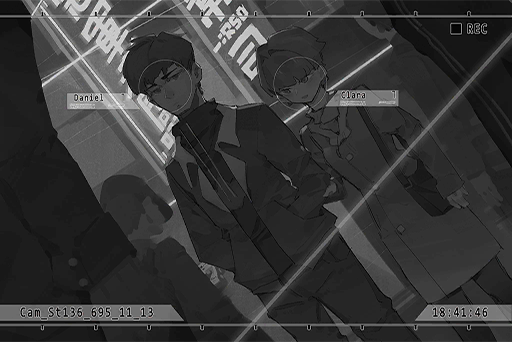

**Clara** 
You've grown taller again.

**Daniel** 
......

*\[Footsteps\]*

_\[Signal Lost\]_

[*(Click here to go back to the top)*](#toc)

## <a id="nos023"/>\[#023\] Audio\_NL\_702\_11\_13
### Requirements
| Character  |Level|
|------------|:---:|
|**NEKO#ΦωΦ**| 62  |

### Log Content
**PAFF** 
Uggghhh...

**NEKO#ΦωΦ** 
... Aroma\-chan?

**PAFF** 
Ugh...

**NEKO#ΦωΦ** 
You... can't fall asleep?

*\[Turns On Light\]*

**NEKO#ΦωΦ** 
Awawawa! Your nose is bleeding! What's the matter!? Hey, wake up!

**PAFF** 
...... Eh?

**NEKO#ΦωΦ** 
Quick, hold down with it! Are you alright? Are you not feeling well!?

**PAFF** 
No... I just... had a dream... I think?

**NEKO#ΦωΦ** 
... A dream?

**PAFF** 
... No, it's not a dream... It's too real to be one.

**NEKO#ΦωΦ** 
Ehh\~ Did you recover a new piece of memory?

**PAFF** 
I don't know... I saw Clara...

**NEKO#ΦωΦ** 
Clara? Ah, the classmate Aroma is looking for. Did you just remember something from your student days?

**PAFF** 
No, I'm not present in the memory... but it was a conversation about me, and it also mentioned that Iris moved away not long after graduation...

**NEKO#ΦωΦ** 
Ehhh... If we knew that sooner, we wouldn't have to take that extra trip\~

**PAFF** 
I'm sorry...

**NEKO#ΦωΦ** 
Ah, I don't mean to blame Aroma\-chan! It's hard to predict this type of thing anyway! 
Here, wipe your tears.

**PAFF** 
Yes... thank you.

**NEKO#ΦωΦ** 
.. Are there any hints in the memory just now? Something related to that Clara. Ah, if you're still not feeling well, don't bother. No need to force yourself.

**PAFF** 
Umm... This... it's a bit... blurry... Clara went to Daniel's home to wait for him...

**NEKO#ΦωΦ** 
Daniel's home? What does it look like?

**PAFF** 
A very normal building. Nothing special...

**NEKO#ΦωΦ** 
Huh...

**PAFF** 
Ah, now I remember... That place doesn't seem to be inside Tower. There also aren't any really tall buildings nearby, because I can still see the sky.

**NEKO#ΦωΦ** 
Wait, stop right there! Buzzer time! NEKO knows this one!

**PAFF** 
Eh?

**NEKO#ΦωΦ** 
That should be the "Midwest Town Area" of Node 08. If we're talking about places on the surface that have skies not yet covered by buildings, that should be the only area left... 
Meowbot, search images of "Midwest Town Area"!

**[Meowbot]** 
_Search complete meow! Meowbot found lots of results meow!_

*\[Projection\]*

**PAFF** 
Ah... it does look very similar. This should be the area!

**NEKO#ΦωΦ** 
Teehee, NEKO's amazing, isn't it\~ 
When we first moved here, we were originally gonna live there, because the rent is very cheap... But daddy said that it's more convenient if the house is closer to the Academy.

**PAFF** 
NEKO really has a good father.

**NEKO#ΦωΦ** 
He's just a stupid Smelly Feet. 
Okey\-doke, our next step is to go to that area and look around. Aroma\-chan, you better recognize which building that Daniel's house is.

**PAFF** 
U, understood. I can probably do it...

**NEKO#ΦωΦ** 
Have some confidence! Aroma\-chan is so smart, you can do it!

**PAFF** 
... Haha. Okay, I will do it.

**NEKO#ΦωΦ** 
Then let's sleep now. G\-night!

**PAFF** 
Yes... Goodnight.

*\[Turns Off Light\]*

**PAFF** 
But... Why did I...

_\[Signal Lost\]_

[*(Click here to go back to the top)*](#toc)

## <a id="nos024"/>\[#024\] Audio\_Evans\_702\_11\_14
### Requirements
| Character  |Level|
|------------|:---:|
|**NEKO#ΦωΦ**| 62  |

### Log Content
*\[Doorbell\]*

**[Daniel]** 
_Who is it?_

**Vicky** 
Are you Mr. Daniel Evans?

**[Daniel]** 
_Yes. And you are?_

**Vicky** 
I am Vicky, a reporter from 08 Daily. This is my assistant. Here's our press passes. 
We are currently doing a report on PAFF. We heard that you were her classmate when she studied at the Academy. We would like to ask you some questions. Could you spare us a few minutes?

**[Daniel]** 
_...... 
I'm afraid there's nothing I can tell you people._

**Vicky** 
Then...

**[Daniel]** 
_Please leave._

**Vicky** 
Hey! Wai...

**Hayato** 
Mr. Evans! To be frank, we are currently investigating the whereabouts of the missing PAFF. And we are already very close to the truth.

**[Daniel]** 
_......!_

**Vicky** 
Hayato!

**Hayato** 
Sis Vicky, let me handle this.

**Hayato** 
To be honest, we think that PAFF... Aroma's missing is deeply connected to her lost memories in the past. There may be some hidden information among all this. If she is caught up in something terrible, we will absolutely try our best to find out what it is. Please, lend us a hand!

**[Daniel]** 
_……_

**[Daniel]** 
_I've opened the door. You can take the left elevator to come upstairs._

*\[Door Opens\]*

**Vicky** 
......!

**Vicky** 
Hey, not bad at all! I didn't know you had this in you.

**Hayato** 
......

_\[Signal Lost\]_

[*(Click here to go back to the top)*](#toc)

## <a id="nos025"/>\[#025\] Cam\_Evans\_702\_11\_14
### Requirements
| Character  |Level|
|------------|:---:|
|**NEKO#ΦωΦ**| 62  |

### Log Content
**Daniel** 
Take a seat. My girlfriend is not here, and I don't know where she put the coffee. You two okay with just water?

**Vicky** 
Water is fine. Thank you.

**Hayato** 
So many trophies... Mr. Evans, you're a novelist? That's amazing.

**Daniel** 
Just call me Daniel.

**Vicky** 
Mr. Daniel, we were finally able to get hold of your home address. When we visited, your parents told us that you've already moved out and is living on your own.

**Daniel** 
Yes, I'm living together with my girlfriend now. 
Go ahead. What do you want to know?

**Vicky** 
... I'll let you handle this.

**Hayato** 
Miss Aroma's accident occurred around the time between grades I and J. When she returned to class, she already lost her memory. Is that correct?

**Daniel** 
Yes. Even though she was in a coma for almost a year, she still passed the continuation exam and continued to be in the same class as us. Back then, Aroma, me and a few other classmates were quite close and we all had pretty good grades.

**Hayato** 
We would like to know, that after returning to class, was there anything strange about Aroma?

**Daniel** 
... Maybe I was the only one who felt this way.

**Hayato** 
... What do you mean?

**Daniel** 
To be honest with you, Aroma didn't really have many close friends in class. She was such a wonderful girl, yet she wasn't popular. After she returned to class with her memory loss, those students who dislike her escalated their actions and began straight up bullying her...

**Hayato** 
......

**Daniel** 
That was also the time I started to notice that there's something... off about her. Sometimes, it felt like she has become a completely different person... She would have this strong and determined look in her eyes. She had this... aura about her, something I had never felt before from her past\-self. When that happened, I felt like I don't know who she is anymore...

**Hayato** 
......!

**Daniel** 
There were also plenty of other things. Some words she used, small gestures... Back then, I felt like me hysterically caring about all these minute details was really gross too. Therefore, I never told anybody about this, all the way until graduation.

**Hayato** 
You... her...

**Daniel** 
Yes, Had feelings for her. However, those are all things in the past. After graduation, I've never seen her again. Now, even if I see her on screen with all that glamour, she still feels so unfamiliar. It's like the time we spent together never existed in the first place...

**Hayato** 
......

**Daniel** 
... All in all, this is all I can say. Even though it's all things from a long time ago, when we heard that she went missing, both my girlfriend and I were still a bit worried. We truly hope she is safe.

**Hayato** 
... We will definitely figure out clearly what happened to her! To be honest, right now, we've already...

**Clara** 
Ah, guests?

**Daniel** 
... Clara, I didn't even hear you come in.

**Clara** 
Yikes! How could you serve the guests plain water? I'll go make some coffee!

**Vicky** 
No need to bother. It's about time we take our leave too. Thank you so much! Mr. Daniel, we appreciate your help!

**Hayato** 
Eh? Sis Vicky...?

**Clara** 
...... 
... If there's any update on Aroma, please let us know.

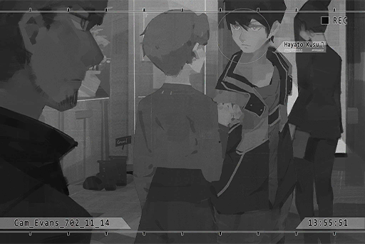

**Hayato** 
.. Certainly!

*\[Door Closes\]*

**Daniel** 
... So you heard everything?

**Clara** 
Just a little bit. I'm sorry...

**Daniel** 
What is there to apologize for?

**Clara** 
Not the eavesdropping... It's for back then, when I helped other classmates bully Aroma...

**Daniel** 
......

**Clara** 
Aroma was truly everything. She was so beautiful, so smart and so good at singing. 
Every time I see her, I always feel like I'm so ordinary, so distasteful... 
Especially after she left, I hate myself even more for doing all those despicable things to her. I used to like her so much too, but the more I like you, the more I...

**Daniel** 
Right now, the one who's with me is you. I've never once considered you to be ordinary or distasteful.

**Clara** 
......

**Daniel** 
If you truly want to apologize, pray for her safety. Then, apologize to her directly.

**Clara** 
...... Okay!

_\[Signal Lost\]_

[*(Click here to go back to the top)*](#toc)

## <a id="nos026"/>\[#026\] Cam\_Evans\_702\_11\_14
### Requirements
| Character  |Level|
|------------|:---:|
|**NEKO#ΦωΦ**| 63  |

### Log Content
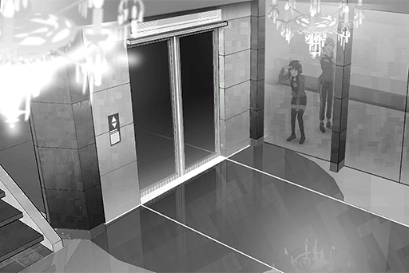

**NEKO#ΦωΦ** 
Is this the place?

**PAFF** 
No.47... should be this building.

**NEKO#ΦωΦ** 
Uuunnnggh, my eyes are getting tired. Why does every single house here look exactly the same...

**PAFF** 
The buildings on the upper levels of Tower are all like this.

**NEKO#ΦωΦ** 
8F... Gotcha! Let's ring the doorbell.

**PAFF** 
Okay.

*\[Elevator Door Opens\]*

**Hayato** 
Sis Vicky, wait for me! Why are we leaving in a hurry all of a sudden?

**Vicky** 
Judging by his attitude, he probably won't tell us anything more... On top of that, if we stayed there, your big mouth is likely gonna leak all the precious information.

**Hayato** 
......

**Vicky** 
Nevertheless... great job! You did exceptionally well this time. Once we get back, let's start writing this report right away!

**Hayato** 
Ah... about that... I... 
... Hmm?

**NEKO#ΦωΦ** 
......! 
Yikes! Isn't that...!?

**Hayato** 
......!

**PAFF** 
...... Ha......

**NEKO#ΦωΦ** 
Aroma\-chan! RUN!

**PAFF** 
Eh!?

**NEKO#ΦωΦ** 
That's the 08 Daily reporter Linda mentioned to NEKO before! They're the ones who are investigating you!

**Vicky** 
Why are you just standing there!? Go after them, you blockhead!

**Hayato** 
......Ah! Okay!

_\[→Signal Switch\]_

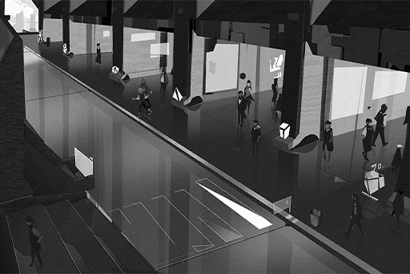

**NEKO#ΦωΦ** 
Ha... ha! Excuse me!

**Pedestrian** 
Waahhh!

**Vicky** 
Stop! NEKO! PAFF! Stop right there!

**Pedestrian** 
Is that... NEKO and PAFF?

**Pedestrian** 
It really is them!

**Pedestrian** 
Quick, take a picture!

**NEKO#ΦωΦ** 
Oh god, oh no! This is bad! This is really, really bad!

_\[→Signal Switch\]_

**PAFF** 
Huff... Puff...

**NEKO#ΦωΦ** 
Ha... Finally got rid of them. Aroma\-chan, are you alright?

**PAFF** 
Yes... I haven't run like this in a very long time. Haha... Hahaha!

**NEKO#ΦωΦ** 
Hahahaha! Haha... Ha... Now's not the time to laugh, isn't it!

**PAFF** 
I'm sorry...

**NEKO#ΦωΦ** 
We caused a super big ruckus! So many people saw us...

**PAFF** 
......

**NEKO#ΦωΦ** 
Woah! I knew it; it's everywhere on iM now, the image of us running around on the streets...

**PAFF** 
W, what should we do...?

**NEKO#ΦωΦ** 
We're pretty close to my home. For now, let's return home first!

**PAFF** 
Okay...!

_\[Signal Lost\]_

[*(Click here to go back to the top)*](#toc)

## <a id="nos027"/>\[#027\] Audio\_Cafe\_702\_11\_17
### Requirements
| Character  |Level|
|------------|:---:|
|**NEKO#ΦωΦ**| 64  |

### Log Content
**JOE** 
Here, you calm down yet?

**NEKO#ΦωΦ** 
... Nyan Special! NEKO wants another drink!

**JOE** 
You're gonna deplete my inventory for tomorrow's business if you keep drinking! I'm going to charge you starting with this one.

**NEKO#ΦωΦ** 
Ehh\~ How could you!? Cheap! S\*\*\*head!

**JOE** 
Shut it! Don't act drunk when you haven't even had a sniff of alcohol... No need to be so anxious. Didn't she say in the phone call that she'd be arriving here soon?

**NEKO#ΦωΦ** 
B\-but, Aroma\-chan will get recognized instantly if she's alone on the streets!

**JOE** 
Isn't her older sister going to drive her to somewhere nearby? This area isn't exactly populated. Rest assured.

**NEKO#ΦωΦ** 
Muuuuu...

**JOE** 
Alright, alright... Here, your Special.

**[TV]** 
_... Regarding the recent case of Æsir\-FEST incident's prime suspect Simon Jackson escaping from the restricted area, the Administration Bureau held a press conference today. They confirmed that as of now, the suspect is still nowhere to be found..._

**NEKO#ΦωΦ** 
Ah...

**JOE** 
... You wanna hear about it? The news on Simon.

**NEKO#ΦωΦ** 
X\-Xenon? I do! NEKO wants to hear! Did he escape from jail? Was Uncle the one who helped him?

**JOE** 
Yeah. We went into the restricted area and yanked him out. We had a crap ton of Law Enforcement Agents and drones chasing us. It got super scary at times... but I got away just fine. Haha.

**NEKO#ΦωΦ** 
Seriously? So he is in the shop right now!?

**JOE** 
Ummm... he's not.

**NEKO#ΦωΦ** 
Why? Didn't Uncle get him out of there?

**JOE** 
There are a lot of reasons... Anyhow, I can ensure that he is safe right now.

**NEKO#ΦωΦ** 
Then... Æsir...

**JOE** 
Of course it's not him! Someone told me that Simon probably got his memory altered by the real Æsir. That was why he plead guilty... It's just like you.

**NEKO#ΦωΦ** 
So that really was the case...

**JOE** 
He has now remembered all of it. Even though his brain was still a bit of a mess, there didn't seem to be any sequelae... You'll be just fine as well.

**NEKO#ΦωΦ** 
NEKO wants to see him!

**JOE** 
Unfortunately, you can't. He is still wanted and pursued by the admins. Only by uncovering the truth can he be cleared of the allegations. My friend has already accompanied him to go outside and investigate. You don't need to worry about him.

**NEKO#ΦωΦ** 
Outside? Do you mean "outside" outside?

**JOE** 
Yeah. He is no longer in Node 08 anymore. 
All in all, you'll have to wait a bit longer. Once the publicity dies down, you can meet up with him.

**NEKO#ΦωΦ** 
Muuu... NEKO wants to help Xenon out too...

**JOE** 
... Keep your voice down. Someone is here.

*\[Doorbell\]*

**PAFF** 
Hello...

**NEKO#ΦωΦ** 
...... Aroma\-chan!!!

**PAFF** 
Waah!!

**NEKO#ΦωΦ** 
WAaaaahhhh!! Aroma\-chan, are you alright? Did anyone do anything terrible to you!? You know, umm... that kind of stuff?

**PAFF** 
Ummm, I'm alright... what's "that kind of stuff"...

**NEKO#ΦωΦ** 
Daddy is so stupid! How can he get drugged like that... NEKO was super worried! WAaaahhh!!

**PAFF** 
NEKO... thank you.

**JOE** 
Hehe, it really is the super idol herself! Hello\~ I am the owner of JOEZ Cafe. Joe Miller's the name.

**PAFF** 
Hello. NEKO mentioned you before... Thank you so much for your help, Mr. Miller.

**JOE** 
Haha, no need for that Mister stuff! Just call me JOE. Come, you can get some rest in the basement first. I can swear by Pops' name that this is the safest place available. No one will ever find you here.

**PAFF** 
Understood... We'll be in your care.

**NEKO#ΦωΦ** 
NEKO will go down there with you as soon as I finish this drink!

_\[Signal Lost\]_

[*(Click here to go back to the top)*](#toc)

## <a id="nos028"/>\[#028\] Audio\_Trans\_08\_702\_11\_20
### Requirements
| Character  |Level|
|------------|:---:|
|**NEKO#ΦωΦ**| 65  |

### Log Content
*\[Platform Announcement Ring\]*

**[Platform Announcement]** 
_Attention, fellow passengers. The express train directly to Node 03 is now arriving at the platform. For your own safety, please stand behind the yellow line._

**Vicky** 
It's almost time. You kids all prepared?

**Hayato** 
All set, Sis Vicky. 
... Thank you so much.

**Vicky** 
What the heck? You're being weird.

**Hayato** 
I never thought you would go this far to help us. You even applied for press passes and got a dedicated carriage for us. This stuff isn't cheap, right...?

**Vicky** 
Well, that's all I can do really. Judging by how PAFF looks now... what you said is true. In that case, you won't make any progress staying here. Take her to Node 03.

**Hayato** 
Yes!

**Vicky** 
Here, you two ladies should get ready to board the train too.

**PAFF** 
Thank you, Miss Russell!

**NEKO#ΦωΦ** 
......

**PAFF** 
NEKO?

**NEKO#ΦωΦ** 
08 Daily... Isn't that the media that secretly sneaked photos of NEKO's home? Popping out all of a sudden and saying you want to help... you can't fool NEKO! NEKO doesn't trust you! You're gonna write some BS news report about this, aren't you?

**Hayato** 
Umm.. that's... It's not what you think...

**Vicky** 
How rude. I help you guys arrange all this stuff. I don't think it's too much to expect a "thank you"... This is why I hate dim\-witted little girls like you.

**NEKO#ΦωΦ** 
Who you calling little!? Who asked for your help? Smelly Paparazzi! Old Hag!

**Vicky** 
... O\-OLD HAG!?

**PAFF** 
A\-apologies, Miss Russell! We'll be leaving right away... NEKO.

**NEKO#ΦωΦ** 
Wait a second! NEKO's not done yet...

*\[Train arrives\]*

**Vicky** 
Goddamnit, that stinkin wildcat... Hey, Hayato!

**Hayato** 
Ah, umm, yes!

**Vicky** 
I promised you that I would back out from PAFF news. However, you need to watch that NEKO carefully. She kind of is a celebrity in her own right and is notorious for running wild. She might expose your whereabouts on accident. Don't waste my money, understand?

**Hayato** 
U\-understood...

**Vicky** 
Why the long face? If you have something to say, say it.

**Hayato** 
Nothing... I was just thinking, why don't you come with us? You also want to know what happened to PAFF, right?

**Vicky** 
Of course. I'm a journalist first, human second. But\~ I've long been blacklisted by Node 03's Administration Bureau, which denies me any form of entry. Not even special privileges can get me in there, so I can only leave it to you.

**Vicky** 
... Besides, if being a paparazzi was all I could think about after hearing your stories, the Vicky Russell that once pursued justice and truth at all costs... is perhaps no longer in me anymore.

**Hayato** 
Sis Vicky...

**Vicky** 
However, don't you misunderstand me! My instincts tell me that there are still plenty of shady secrets to be found in what happened to PAFF. If we can keep investigating, we might be able to catch an even bigger fish.

**Hayato** 
Sis Vicky! Actually...

*\[Platform Announcement Ring\]*

**[Platform Announcement]** 
_Attention, fellow passengers. The express train directly to Node 03 is about to depart. For passengers who haven't board the train, please board soon. Thank you for your cooperation._

**Vicky** 
Enough talking. The train is leaving. Take care and protect those girls, will ya.

**Hayato** 
G\-got it!

**Vicky** 
Good, I expect no less from the disciple I raised myself. You've now obtained the eye of an experienced journalist. Once you're there, don't you dare forget the things I taught you. Do you hear me?

**Hayato** 
I'm just an intern...

**Vicky** 
Do you hear me!

**Hayato** 
Y\-Yes ma'am!

**Vicky** 
Alright, now go... Remember, you are NOT allowed to come back before you find the truth.

**Hayato** 
... Thank you so much!

_\[Signal Lost\]_

[*(Click here to go back to the top)*](#toc)

## <a id="nos029"/>\[#029\] Cam\_Trans\_08\_702\_11\_20
### Requirements
| Character  |Level|
|------------|:---:|
|**NEKO#ΦωΦ**| 65  |

### Log Content
**NEKO#ΦωΦ** 
G29, G29... The seat is right here! There really is no one in this carriage.

**PAFF** 
I told you that Miss Russell was actually trying to help us. 
Hnnngghh... the bags...

**Hayato** 
Kao... Umm, I\-I'll help you with that.

**NEKO#ΦωΦ** 
... Kaori... 

**PAFF** 
What's the matter, NEKO? Take your seat. The train will be leaving soon.

**NEKO#ΦωΦ** 
Okay, Aroma... Ah!

**PAFF** 
......

**Hayato** 
......

**NEKO#ΦωΦ** 
... Umm, NEKO feels like this is a really dumb question... What should NEKO call you now?

**PAFF** 
Eh? I'm still myself. You can just call me what you normally call me.

**NEKO#ΦωΦ** 
But, the way you talk right now... it just doesn't feel like the usual Aroma\-chan!

**PAFF** 
Is that so? Hayato, what do you think?

**Hayato** 
I don't know either... The way you speak now is certainly very similar to Kaori, but your appearance is completely different... That's why I'm not sure what I should do either...

**PAFF** 
I see... Then you can also call me whatever you prefer! Sorry for causing you guys trouble.

**Hayato** 
N\-not at all!

**NEKO#ΦωΦ** 
... Report! NEKO is hungry. Need to go buy a lunch box!

**Hayato** 
Eh!? Didn't you just have lunch...?

**NEKO#ΦωΦ** 
Welp, NEKO's still growing after all. Haha! I'll be right back!

*\[Door Opens\]*

**PAFF** 
... She's trying to give us some alone time together, isn't she? 
Hey, why didn't you tell Miss Russell the truth? The things sister told me, although still not confirmed, I believe they're likely all true.

**Hayato** 
I didn't have the time to explain... She helped us so much, all for the sake of finding out the truth. I'm not quite sure when and how to talk to her about this...  
Even though I feel sorry for her, once we get to Node 03, we can then find a chance to explain everything to her. Besides...

**PAFF** 
Hmm?

**Hayato** 
I don't know... If what your sister said is true, doesn't that make them criminals? Spreading such things... I don't know if that's the correct thing to do. After all, they are family to you as well.

**PAFF** 
Yes... If possible, I would like Hayato to keep this a secret, for me. I don't wish to make a big deal out of this.

**Hayato** 
Once we get to Node 03, if we confirm that you're indeed Kaori... Do you plan to return here?

**PAFF** 
I'm not sure myself either. In that basement... the images that flashed through my brain, in addition to "Kaori's memory", I felt like they were some other images... although they are all very fragmented.

**Hayato** 
......

**PAFF** 
This body still has more secrets I know nothing about... Ah, sorry. I'm just causing more trouble by telling you all this, aren't I? I don't really know how to describe this feeling.

**Hayato** 
Eh? No, not at all. Do I look that troubled?

**PAFF** 
Yep. You had a face that screamed, "I'm really scared". Haha.

**Hayato** 
Haha, sorry... I'm still such a weak person...

**PAFF** 
... Hey, why do you have to apologize for something like that?

**Hayato** 
......?

**PAFF** 
The Hayato in my memories has always been like this. You're a scaredy\-cat who gets nervous really easily but have the kindest heart in all of Node 03. Also, you look kinda handsome from the side when you're serious...

**Hayato** 
W\-What's that about...?

**PAFF** 
Rest assured. I believe that once we get there, I'll definitely remember more things.

**Hayato** 
Definitely! I'll try my best to help!

**PAFF** 
Alright then. Don't you have something you want to give me?

**Hayato** 
!? H\-how did you know...?

**PAFF** 
Well, I saw you constantly trying to hide your hand behind your back...

**Hayato** 
... So you noticed?

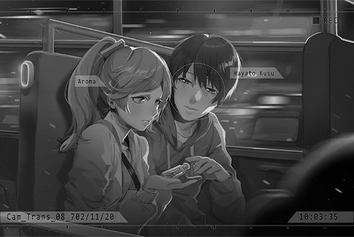

**PAFF** 
Ah... this is...

**Hayato** 
Yes, it's your favorite flower, the Lavender. On the night we finished our performance, I left early to buy this bottle to store the flowers inside. However, I never got the chance to give it to you... I've always carried it with me, even though the Lavender inside has already wilted, I always believed that one day, I would have the chance to give it to you.

**PAFF** 
Haha... you...

**PAFF** 
_\*Sniff\*... \*Sobs\*..._

**Hayato** 
Hey... why are you crying?

**PAFF** 
No... I'm really happy... Thank you, Hayato.

_\[→Signal Switches\]_

**NEKO#ΦωΦ** 
... Such a nice atmosphere. Those two... they were definitely a c\-c\-c...... couple in the past, right?

**[Meowbot]** 
_Do you want to play a projection of Xenon meow?_

**NEKO#ΦωΦ** 
...... W\-w\-wwhhat are you talking about! Don't play it! Stupid Meowbot! You're absolutely going in the trash!!

_\[Signal Lost\]_

[*(Click here to go back to the top)*](#toc)

## <a id="nos030"/>\[#030\] Audio\_Shiraishi\_702\_11\_22
### Requirements
| Character  |Level|
|------------|:---:|
|**NEKO#ΦωΦ**| 66  |

### Log Content
**NEKO#ΦωΦ** 
Mommy! Grandma! NEKO is back!

**Saku** 
Welcome back. You've grown bigger again. Those two behind you, they must be the friends you mentioned, right?

**Hayato** 
Umm, h\-hello...

**PAFF** 
Hello, Mrs. Shiraishi! Sorry for disturbing you. Thank you for willing to let us stay here for a night.

**Mayu** 
Not at all. We're the ones who should thank you. Thank you two for taking care of NEKO all this time.

**NEKO#ΦωΦ** 
Eh!? They did not! Grandma, don't make things up!

**PAFF** 
That's right. We're the ones who NEKO has taken care of instead. We owe her a lot.

**Mayu** 
Is that so? That's surprising...

**NEKO#ΦωΦ** 
GRAND\~ MA\~!!

**Saku** 
Haha... Come one in, don't just stand there. Bring your bags inside. Apologies for the small room, but I can ensure you that it is regularly cleaned. If there's any inconvenience, feel free to tell us.

**PAFF** 
Thank you, Mrs. Shiraishi! 
The room really is very clean. This used to be NEKO's old room, right?

**Hayato** 
Ah... is it really okay for us to live here?

**NEKO#ΦωΦ** 
Teehee\~ No problem at all! I'm sleeping with mommy tonight! Although not being able to cuddle Aroma\-chan kinda sucks...

**Saku** 
Haha, for a child your age, you really are clingy... 
Oh no, I forgot that I need to prepare another set of blankets for you guys...

**Mayu** 
Let me do that, Saku. He\-ya...

**Saku** 
Mom? Is your back alright?

**Mayu** 
It's fine. I'm feeling pretty good today. About time I do a little exercise too.

**PAFF** 
Thank you so much\~ Let us help out too!

*\[Door Opens\]*

**Saku** 
... NEKO, so the female friend you mentioned on the phone is PAFF, the idol you used to talk about a lot? There has been a lot of news about you and her.

**NEKO#ΦωΦ** 
Oh, yeah... Sorry, mommy. Her story is a bit... complicated. NEKO doesn't really know how to explain it clearly...

**Saku** 
It's alright. Miss PAFF seems to be a good girl, and she's very poised too.

**NEKO#ΦωΦ** 
Yeah, she is... To be honest, she was previously really shy and introverted. She was nothing like who she is now.

**Saku** 
Eh? What do you mean?

**NEKO#ΦωΦ** 
Umm... That's also kinda hard to explain. Forget it, no big deal. Ahahahaha!

**Saku** 
... NEKO, whenever you're trying to hide something, you'll always start to laugh really nervously like that. It's been a habit of yours since you were a very small child.

**NEKO#ΦωΦ** 
Teehee, hehehe... I knew I couldn't fool mommy.

**Saku** 
Of course you couldn't. So, tell me.

**NEKO#ΦωΦ** 
When PAFF... Aroma\-chan first came to NEKO, she was exactly the same as the rumors described: a scaredy\-cat and really, really shy! Although I found it quite annoying, I also found it to be very cute. That's the Aroma\-chan NEKO knew as well.  
Right now, she... it's as if she has become an unfamiliar person. NEKO doesn't quite know how to talk to her.

**Saku** 
I see... However, she is still NEKO's friend, right?

**NEKO#ΦωΦ** 
Of course she is! She still remembers everything about the time she spent together with NEKO! It's just that the way she talks now is a bit... cool? 
In short, I'm not quite used to it yet, ahahaha. It's no big deal, actually! Aroma\-chan is still NEKO's friend, that much is for sure!

**Saku** 
Hmmm... Even though I don't know how much help it'll be, we'll let them stay here for now. They can stay until Miss PAFF resolves everything.

**NEKO#ΦωΦ** 
EHHH!? You're going to let them stay here until then?

**Saku** 
Yes. Since Miss PAFF is NEKO's friend, mommy trusts her as well. If NEKO wants to help her, it's only natural that mommy helps her to the very end as well.

**NEKO#ΦωΦ** 
_\*Sobs\*_\~ You're the best mommy in the world...

**Saku** 
However, mommy needs to remind you, do not get yourself involved in anything dangerous, understand?

**NEKO#ΦωΦ** 
Understood! NEKO will not disappoint you!

**Saku** 
Haha... Come, let's go help your grandma out, shall we?

**NEKO#ΦωΦ** 
Yes!

_\[Signal Lost\]_

[*(Click here to go back to the top)*](#toc)

## <a id="nos031"/>\[#031\] Audio\_Grave\_702\_11\_23
### Requirements
| Character  |Level|
|------------|:---:|
|**NEKO#ΦωΦ**| 66  |

### Log Content
**PAFF** 
NEKO!

**NEKO#ΦωΦ** 
Waah!? Aroma\-chan... Are you guys good already? It's okay if you guys want to stay a little longer.

**PAFF** 
Being able to remember Grandma Feng is more than enough. I'm sure she won't want to see me be a sobbing mess. I have to cheer up! 
Speaking of which, what are you doing?

**NEKO#ΦωΦ** 
Eh? Ahaha... nothing really. NEKO just thinks that the face on this gravestone is very funny. Especially the nose...

**Hayato** 
... What? Weren't you also crying just now? Man, your mood changes way too fast...

**PAFF** 
Come on\~ You can't disrespect those who have passed on. Grandma Feng told us before, that the dead will protect us from where they are. Right, Hayato?

**Hayato** 
... Yes. Grandma also said that the only thing we, the people still living, can do for them is to remember them. As long as we still remember them, they aren't truly dead. They will forever be by our side.

**NEKO#ΦωΦ** 
That sounds beautiful... Grandma Feng feels like a really kind person.

**PAFF** 
Yes. She's the best grandma in the entire world.

**Hayato** 
That's right! Ah, NEKO's grandma is really great too.

**NEKO#ΦωΦ** 
Then, I'll have to apologize to this person. 
I'm sorry. NEKO didn't do it on purpose, even though you really do look very funny... I hope you have a happy life on that side and you meet a girl who doesn't care about your nose...

**Hayato** 
... What kind of apology is that?

**PAFF** 
Haha... it's very "NEKO".

**NEKO#ΦωΦ** 
Alright, let's go back\~

**Hayato** 
Uh, umm, NEKO...

**NEKO#ΦωΦ** 
What, Intern Paparazzi guy?

**Hayato** 
D\-don't call me that... Have you seen our bags? 
They were here just a minute ago...

**PAFF** 
... Ah...

**NEKO#ΦωΦ** 
...... Eh!? EHHHHHHH\~\~\~!?

_\[»»» Fast Forward»»»\]_

**NEKO#ΦωΦ** 
N, nothing! Not here either. They're nowhere to be found!!

**Hayato** 
Could they have been stolen? There are quite a few pickpockets around here...

**NEKO#ΦωΦ** 
Oh god, oh no, we're screwed. The press passes the old hag gave us are inside the bags! Without that, we're all gonna get arrested by the admins the moment we go back to 08!

**Hayato** 
This is really bad... I\-I'll keep looking around...

**PAFF** 
Maybe they're... Hmm...?

*\[Collapse\]*

**Hayato** 
Kaori!? Kaori!!

**NEKO#ΦωΦ** 
Aroma\-chan!?

_\[»»» Fast Forward»»»\]_

**PAFF** 
... Eh? What happened to me?

**NEKO#ΦωΦ** 
You fainted all of a sudden! Don't move, your nose is still dripping blood...

**PAFF** 
......! The bags!

*\[Runs\]*

**Hayato** 
Eh? Hey! Kaori!? Where are you going?

**PAFF** 
I know where they are. Come with me.

**NEKO#ΦωΦ** 
F\-For real?

_\[→Signal Switches\]_

**PAFF** 
Huff... Puff... Found them! The bags really are here. Some homeless person took them.

**Hayato** 
......

**NEKO#ΦωΦ** 
Thank goodness. Everything inside is still there!

**Hayato** 
Kaori, how did you know...

**PAFF** 
I... I don't know myself either. When I fainted back there, I think I had... a dream?

**Hayato** 
A dream...? No, the state you were in back then... it was exactly like "The Eye of Horus".

**PAFF** 
The Eye of Horus...? Ah, I\-I think I heard this name back there too... Hayato, how did you know that name?

**Hayato** 
I wasn't able to finish my story back there. After Grandma Feng passed away, I spent every last bit of money I had to seek the help of Kyuu Hou Kai's "The Eye of Horus". It was the clues she gave me that took me to Node 08 in my search for you!

**PAFF** 
Kyuu Hou Kai! That's the place she just showed me. We must go there!

**NEKO#ΦωΦ** 
What? Excuse me, what? Why does NEKO have no freakin idea what you two are talking about?

**Hayato** 
... I think I know where it's located, but that entire area was reduced to rubble not too long ago because of a massive gas explosion...

**PAFF** 
No, I got... an address.

**Hayato** 
However... that organization is a bit dangerous. Are you sure you want to go?

**NEKO#ΦωΦ** 
... Um, Hello? Aroma\-chan? Intern Paparazzi guy? Can you guys, um, explain things a bit to NEKO? NEKO's brain is gonna explode with all the information you guys just spewed...

_\[Signal Lost\]_

[*(Click here to go back to the top)*](#toc)

## <a id="nos032"/>\[#032\] Cam\_Nora\_702\_12\_14
### Requirements
| Character  |Level|
|------------|:---:|
|**NEKO#ΦωΦ**| 67  |

### Log Content
**[Kyuu Hou Kai System]** 
_Threat invasion detected in area 03, engaging full fortification in three minutes.  Security personnel, please proceed to your battle stations._

**Kyuu Hou Kai Member** 
Everyone, please move in this direction.

**NEKO#ΦωΦ** 
Don't push NEKO! 
W\-w\-w\-w\-what is going on! Nora\-chan!?

**[Nora]** 
_Apologies. The facility is under attack. Before we can resolve this situation, we would like fellow guests to hide here for now._

**NEKO#ΦωΦ** 
EH!? What attack? Is it dangerous!?

**[Nora]** 
_Daigo, the screen. 
... It appears that the tunnels in area 03 have already been completely broken through._

**Member D** 
Damnit, how on earth did they find that entrance!? Security team A, team B, report to area 03 immediately!

_\[»»» Fast Forward»»»\]_

**Xenon** 
...... Are you thinking what I'm thinking?

**Cherry** 
... Uh\-huh. The problem now is, how are we gonna open this door?

**PAFF** 
Don't tell me, you guys are going... Is that really a good idea?

**Hayato** 
Right! We should do what Nora told us and hide here. It's safer that way, isn't it?

_\[»»» Fast Forward»»»\]_

*\[Parts moving\]*

**[ROBO_Head]** 
_This unit, join as well._

**Cherry** 
A gun...? 
You sure about this?

**[ROBO_Head]** 
_Protect Nora, protect everyone._

**Cherry** 
Gotcha. Then you'll act according to my commands. We help Simon create an opportunity, he'll get rid of those drones, just like how we did it back at the Kyubo Medical Center, correct?

**Xenon** 
If we're lucky. 
You three, stay here. Hayato, watch the door closely.

*\[Door Closes\]*

**NEKO#ΦωΦ** 
Xenon!

_\[»»» Fast Forward»»»\]_

*\[Explosion\]*

**PAFF** 
It's still going on...

**Hayato** 
Don't worry, Kaori... The sounds have been coming from a distance away. Looks like the defenses weren't cracked. Let's have faith in them.

**PAFF** 
But...

*\[Gunshot\]*

**NEKO#ΦωΦ** 
_\*Sniff\*... \*Sobs\*..._

**PAFF** 
NEKO?

*\[Hugs\]*

**NEKO#ΦωΦ** 
_\*Bawls\*_

**Hayato** 
W, what happened!?

**PAFF** 
NEKO... Are you scared?

**NEKO#ΦωΦ** 
O\-of course I'm scared! T\-this is w\-w\-w\-war! A real war! NEKO never ever thought that I would encounter something like this! And right after I promised mommy that I wouldn't get myself involved in anything dangerous too!

**PAFF** 
I'm sorry for getting you caught up in all this... It's all my fault.

**NEKO#ΦωΦ** 
It's not Aroma\-chan's fault!

**PAFF** 
NEKO...

**NEKO#ΦωΦ** 
NEKO said she would help Aroma\-chan, so NEKO will help to the very end! It's all the bad guys' fault! NEKO is so worried about the others... especially Nora\-chan. She's so weak and fragile, yet she is out there fighting those bad guys for us... while all we can do is hide here...

**PAFF** 
......

**NEKO#ΦωΦ** 
Same with Uncle Daigo, and Sis Cherry, and X\-X\-Xenon... They're all out there, despite this being a war, despite this being so terrifying... 
If anything is to happen to them...

*\[Explosion\]*

**NEKO#ΦωΦ** 
Eek...!

*\[Hugs\]*

**PAFF** 
No need to be afraid. We're all here.

**Hayato** 
... Damnit... I want to help too, anything would do...

*\[Explosion\]*

**NEKO#ΦωΦ** 
NEKO... is someone that can't do anything either...

_\[Signal Lost\]_

[*(Click here to go back to the top)*](#toc)

## <a id="nos033"/>\[#033\] Audio\_TigerSt\_702\_12\_15
### Requirements
| Character  |Level|
|------------|:---:|
|**NEKO#ΦωΦ**| 68  |

### Log Content
*\[Ringtone\]*

**Hayato** 
Who would call...? NEKO!?

_\[Call Starts\]_

**Hayato** 
NEKO! Where are you?

**[NEKO#ΦωΦ]** 
_On my way home... Is Aroma\-chan there?_

**PAFF** 
I'm here. We plan to stay here to continue helping Nora out.

**[NEKO#ΦωΦ]** 
_MmmHmm... \*Sniffs\*..._

**PAFF** 
NEKO... are you alright?

**[NEKO#ΦωΦ]** 
_None_

**Hayato** 
They were sent by Mr. Daigo to protect you. I think they'll leave once you arrive home.

**[NEKO#ΦωΦ]** 
_NEKO knows... \*sobs\*..._

**PAFF** 
... NEKO...

**[NEKO#ΦωΦ]** 
_Aroma\-chan, I'm sorry... I said I was going to help you, but... 
NEKO doesn't know what's wrong with me either..._

**PAFF** 
No, it's okay! NEKO has really helped me a lot already. I'm really grateful to you.

**[NEKO#ΦωΦ]** 
_Even the totally useless Hayato chose to stay behind... NEKO is such a coward..._

**Hayato** 
... I can hear all that, you know... 
NEKO, besides staying by Kaori's side, there's nowhere else for me to go in Node 03. You still have family who's worried about you, right? With the situation this dangerous, it's the right choice to go back home and report your safety first. I'll try my best to protect Kaori. Remember to stay in contact, okay?

**[NEKO#ΦωΦ]** 
_Okay... Hayato, you're a good person. NEKO was wrong about you._

**Hayato** 
It's alright. Miss Cherry's incident... I think we're all feeling very down now. Go home and get some rest first.

**[NEKO#ΦωΦ]** 
_\*Sniff\*... If anything bad happens to Aroma\-chan, NEKO will NOT let you off the hook!_

**Hayato** 
Yeah, I know.

**[NEKO#ΦωΦ]** 
_Aroma\-chan, please be careful. NEKO... will try my best to figure out if there's anything I can help with._

**PAFF** 
Okay... Ah, there's one thing. Xenon has gone missing. We all think it's best that we find him as soon as possible. If you can, can you pay attention to where he might go, since you're more familiar with 03 than us?

**[NEKO#ΦωΦ]** 
_... Got it! I remember Sis Cherry mentioned that the person who helped them was Kai, the drummer of Crystal PuNK. NEKO will try to get in contact with him._

**PAFF** 
We'll leave that to you —— Ah, but that's after you get home and organize your emotions, of course.

**[NEKO#ΦωΦ]** 
_Okay..._

**PAFF** 
NEKO... Allow me to repeat one more time. Thank you, thank you for everything you've done for me.

**[NEKO#ΦωΦ]** 
_Aroma\-chan... We're still friends, right?_

**PAFF** 
Of course! We'll always be!

**[NEKO#ΦωΦ]** 
_Hehe... thanks. Then, NEKO's gotta go since I'm almost home. Bye\-bye\~_

_\[Call Ends\]_

_\[→Signal Switches\]_

*\[Door Knock\]*

**Saku** 
Coming!

*\[Door Opens\]*

**Saku** 
NEKO! We're so worried about you! When we saw those reports on the news, we've been wondering whether they're about you or not... How are you feeling? Are you okay? Did you get hurt?

**NEKO#ΦωΦ** 
......

**Saku** 
NEKO...?

*\[Hugs\]*

**Saku** 
......!

**NEKO#ΦωΦ** 
......

**Saku** 
...... 
You silly child... you must be tired, right?

**NEKO#ΦωΦ** 
...... _\*Nods\*_

**NEKO#ΦωΦ** 
... 

_\[Signal Lost\]_

[*(Click here to go back to the top)*](#toc)

## <a id="nos034"/>\[#034\] Cam\_ShadowSt\_702\_12\_21
### Requirements
| Character  |Level|
|------------|:---:|
|**NEKO#ΦωΦ**| 69  |

### Log Content
**NEKO#ΦωΦ** 
WAHHH... It's really pouring. Shoulda listened to mommy and brought an umbrella. The weather report here is as sucky as always! I'm starting to miss Node 08...

*\[Running\]*

**NEKO#ΦωΦ** 
Aroma\-chan said it was somewhere around here...? 
......! 
Xenon...?

*\[Footsteps\]*

**NEKO#ΦωΦ** 
......

**NEKO#ΦωΦ** 
It really is Xenon! I finally found you... wah! My goddd! How come you are all black and blue!? You're getting soaked! 
Lemme take a pic for Aroma\-chan first...

*\[Takes Picture\]*

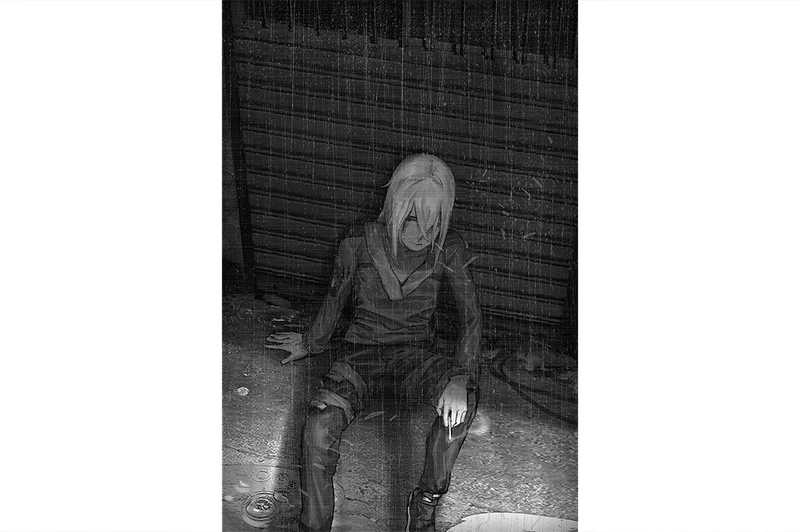

**Xenon** 
......

**NEKO#ΦωΦ** 
You... What happened to you!? How did you end up like this!?

**Xenon** 
......

**NEKO#ΦωΦ** 
Y\-Y\-Y\-You... You gotta go to the hospital! Let's go to Kyubo Medical Center? Nora will definitely help you for free! Ah, gotta tell everybody too.

*\[Pulls hand\]*

**NEKO#ΦωΦ** 
Erghhh\~\~\~com' on and get up! NEKO can't pull ya all alone!

**Xenon** 
......

**NEKO#ΦωΦ** 
...Why aren't ya moving? Whatever! Getting soaked like this with all these cuts is no good! Let NEKO help you, huh? There's a pharmacy over there...

**Xenon** 
... Leave me alone.

**NEKO#ΦωΦ** 
... eh? What?

**Xenon** 
Leave me alone... go away...

**NEKO#ΦωΦ** 
NO WAY!! NEKO promised Aroma\-chan and others that I'd find you!

**Xenon** 
... And then? You found me. Now leave.

**NEKO#ΦωΦ** 
What the heck is that!? Nora needs your help with a lotta stuff over there. NEKO shouldn't couldn't and wouldn't just leave you here.

**Xenon** 
...... 
I... I can't do anything...

**NEKO#ΦωΦ** 
Whatta you mean? Xenon's amazing...

**Xenon** 
You don't understand, do you? All I see is the people around me getting caught up in terrible things... All because of me... ugh...

**NEKO#ΦωΦ** 
It's not like that...

**Xenon** 
Go away. It's not safe with me.

**NEKO#ΦωΦ** 
... Not safe? Well, well so what!? NEKO doesn't know what's going on with you, but I'm not just throwing you to the curb! NEKO knows you're upset about Sis Cherry... but so is everybody else! Point is, everybody's got to work together...

**Xenon** 
You done?

**NEKO#ΦωΦ** 
... eh?

**Xenon** 
I've always... hated your personality.

**NEKO#ΦωΦ** 
......! 
NEKO... just wanted...

**Xenon** 
All you do is blabber on about what you want to talk about. Don't care about anyone else's feelings. You don't know anything, yet you put on this façade of understanding just to feel validated.

**NEKO#ΦωΦ** 
......

**Xenon** 
You just go on and on, so annoying. How old are you? An annoying brat who says the stupidest stuff. Everybody work together? Like what? Who is this "everybody" anyway? Didn't you run away from all that?

**NEKO#ΦωΦ** 
_... \*sob\*..._

**Xenon** 
You're clearly not of any use. No need to say that crap to me. I've heard enough of your voice. If you want to feel validated, go somewhere else. Or maybe go fish for compliments from your fans on the internet. I don't care, just go away...

*\[Slap\]*

**Xenon** 
......!?

**NEKO#ΦωΦ** 
... You... big, dumb idiot... _\*sob\*_... Fine, you can just rot here!

*\[Running\]*

**Xenon** 
......

_\[Signal Lost\]_

[*(Click here to go back to the top)*](#toc)

## <a id="nos035"/>\[#035\] Audio\_Baro03\_702\_12\_20
### Requirements
| Character  |Level|
|------------|:---:|
|**NEKO#ΦωΦ**| 69  |

### Unlocked Charts
| Song  |Character|Diff.|Level|
|-------|:-------:|:---:|:---:|
|**Rei**|NEKO#ΦωΦ |Easy |  3  |
|**Rei**|NEKO#ΦωΦ |Hard |  7  |
|**Rei**|NEKO#ΦωΦ |Chaos| 11  |

### Log Content
**Diego** 
Ha... _\*grunts\*_... gotta admit... you're pretty good... "X"... How about a drink? Whiskey? Kaoliang?

**Xenon** 
......

**Diego** 
A single person took out my entire 03 branch... a talent like you... being "up there" is truly... quite a shame... ha...

**Xenon** 
......

**Diego** 
... And now? What's all this for...? If you want revenge... then I can only tell you, you came to the wrong place... what happened to your girl, that wasn't us...

**Xenon** 
... Shut up.

*\[Loads Gun\]*

**Diego** 
... Haha ... it's the truth. Someone as smart as you must know? There's no way we... have the technology or skill to deal that much damage to Kyuu Hou Kai... But regardless of who it was... I'm very happy that they did it before us.

*\[Punch\]*

**Diego** 
Poo wah!! Ha... hahaha... You've been blinded by your anger and hatred... Mr. Smart guy... Just like... ha... your dad back then...

**Xenon** 
......!

**Diego** 
The moment you pull that trigger, you'll become someone "down here"... Ain't no different... from us... haha...But, you can't pull it, can you?

**Xenon** 
... _\*gulp\*_...

*\[Drinks Liquor\]*

**Diego** 
I've... spent a lifetime helping... the trash at the bottom... helped them find a new worth... a purpose in life... 
Don't you think... you also really need this kind of help right now? People act like these kinds of trash doesn't exist. Always pretending like they're living in a wonderful, clean city... Once someone is abandoned by the system...  they all need redemption, otherwise they can't survive... I'm the one who gives them redemption. I am their redeemer.

**Xenon** 
......

**Diego** 
If you still insist on pulling that trigger, then at least... let me finish... this last glass of liquor...

*\[Pulls out gun\]*

**Xenon** 
......!?

*\[Consecutive Gunshots\]*

_\[→Signal Switches\]_

*\[Holding umbrella\]*

**NEKO#ΦωΦ** 
... Ey. You dead?

**Xenon** 
...... 
Didn't I tell you to go away?

*\[Squats down\]*

**NEKO#ΦωΦ** 
......

*\[Wraps up wound\]*

**Xenon** 
......

**NEKO#ΦωΦ** 
... Your wounds are definitely gonna rot. The rain here is really dirty.

**Xenon** 
... I don't care...

**NEKO#ΦωΦ** 
You don't care, but NEKO does.

**Xenon** 
...... 
I advise you... to get out of here fast... people might still be chasing me...

**NEKO#ΦωΦ** 
......! 
What happened with the gangs... that was really you...?

**Xenon** 
......

**NEKO#ΦωΦ** 
...... 
Whatevs, I gotta at least patch you up first.

**Xenon** 
I'm serious. 
You better...

**NEKO#ΦωΦ** 
ANY! WAY!

**Xenon** 
AH! Ouch!

**NEKO#ΦωΦ** 
Anyway, NEKO does whatever she wants. I don't care what anyone else thinks. If I wanna do it I do it. If I see someone I Ii... an important friend looking like this, I can't just turn away and ignore them.

**Xenon** 
......

**NEKO#ΦωΦ** 
...... 
NEKO may not be... for something this big... no even for something small, NEKO may not be of much help. But I still want to try my best to do what I can. And yea maybe I do want to feel validated and noticed. You can hate NEKO, I don't care, NEKO's still gonna do it. Besides, you can't move so what're you gonna do 'bout it?

**Xenon** 
......

**NEKO#ΦωΦ** 
Okay all done\~ Don't move for now. NEKO already contacted Brother Kai to take you to his place. He'll definitely be able to pick ya up.

_\[→Signal Switches\]_

**NEKO#ΦωΦ** 
Yahooo!! NEKO's here! Brother Kai, thank you. Is Xenon alright?

**Kai** 
After he came home yesterday he locked himself in his room... Won't answer any questions.

*\[Door Knock\]*

**Kai** 
It's no use. When this guy feels down, he hates it when people bother him.

**NEKO#ΦωΦ** 
Ah Ah... Ooo, yea he was pretty pissed at NEKO yesterday.

**Kai** 
Usually he'll be fine if you leave him alone for a while. But this time... I don't know how much time he'll need...

**NEKO#ΦωΦ** 
...... 
This food, did you buy it for him? He hasn't eaten any of it...

**Kai** 
Yea, I'll chuck it.

**NEKO#ΦωΦ** 
_\*groan\*_... Xenon is super picky, this will definitely not do. Soooo, Tada～～NEKO brought some of her homemade stew! He luuuuved this when he tasted it before!  
Xenon, NEKO put some stew here, don't forget to eat it! If you don't, NEKO's gonna give you another big ol' slap!

**Kai** 
... Ay, It actually smells really good. Can I have a bite?

**NEKO#ΦωΦ** 
NO WAY! This is for Xenon!

**Kai** 
Stingy brat. 
Oh, yea... thanks. If you didn't find him. Don't know what woulda happened...

**NEKO#ΦωΦ** 
No probs～～well, let's leave him alone. Let him be. Xenon, we're heading out, kk?

_\[→Signal Switches\]_

**Xenon** 
......

_\[Signal Lost\]_

[*(Click here to go back to the top)*](#toc)

