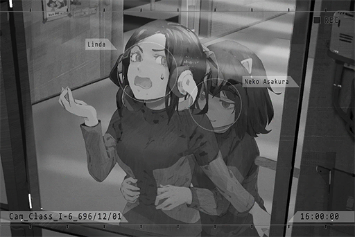

# Cam_Class_I-6_696_12_01
## Requirements
|Character|Level|
|---------|:---:|
|**Neko** |  2  |

## Log Content
*\[Class Bell\]*

**Neko** 
Whew\~ It's over!!! I'm exhausted\~

**Classmate A** 
NEKO, are you going to the game center today?

**Neko** 
Ah! Sure, let's go! NEKO is definitely gonna crush the records today!

**Classmate B** 
Haha! You've already filled the high\-scores with your name, haven't you?

**Neko** 
I'm talking about breaking my own records again of course\~ 
Ah, what about Linda? She coming too?

**Classmate A** 
Eh? Forget it. She's a complete loner. She's not going to come with us.

**Classmate B** 
Yeah. Besides, I think that girl is kinda scary.

**Neko** 
Aww, come on. Don't act like that\~ NEKO's gonna ask her!

*[→Signal Switch]*

**Neko** 
Lin\~da\~chan! I\~ found\~ you!

**Linda** 
Yikes!? Wha... what do you want?

**Neko** 
NEKO, Amy\-chan and others are gonna go to the arcades. Linda\-chan, come with us!

**Linda** 
Sorry, I have other things to do... Also, what's with the "Linda\-chan"...

**Neko** 
You didn't know? That's how we refer to close friends back in NEKO's hometown. It's cute and catchy, right?

**Linda** 
Oh... All in all, I pass. Besides, we're not that close to begin with, right? Stop calling me that... it's so awkward.

**Neko** 
Eheh\~ how come? Linda\-chan is really cute\~ 
That aside, you should get together with everyone in class more often\~ Since your transfer, you're always by yourself. Everyone is super nice. You don't have to be so shy\~

**Linda** 
Hmm... It's fine. This is more an issue on my part. I'm just more used to being by myself.

**Neko** 
Is that so... When NEKO first transferred here, I also couldn't make any friends. I though Linda\-chan is the same too.

**Linda** 
You're a pretty weird person too... Usually, when people see loners like me, they don't actively approach us for a conversation.

**Neko** 
Eh? Really? But Linda\-chan is so cool! Your style is very unique, and you're also very cute! My classmates are also very interested in you. You should talk to everybody more often\~

**Linda** 
Pfff... Haha, is that so? But, no thanks. I feel like my hobbies don't seem to match up with their's...

**Neko** 
Hobbies... Speaking of that, Linda\-chan seems to be wearing headphones all the time. What are you listening to?

**Linda** 
Hmm... some indie bands. Post\-Rock, Metal\-Core... stuff like that.

**Neko** 
Pot... Core...? I don't quite get it. NEKO's vocabulary is not very big...

**Linda** 
Pffft! Pot is something you use in the kitchen! No wonder you're in class 6.

**Neko** 
Eheh\~ You don't get to say that, Linda\-chan! You're also in class 6! NEKO wants to hear it as well!

**Linda** 
Ummm, I wouldn't recommend that...

**Neko** 
No objections!

**Linda** 
Ah! HEY!

*\[Music\]*

**Linda** 
... How is it? Pretty noisy, right...

**Neko** 
SO DOPE!

**Linda** 
... Eh?

**Neko** 
This is so good! NEKO only listens to electronic music before. I never knew that such amazing music existed!

**Linda** 
You... like it?

**Neko** 
I do! What band is this!? Tell NEKO more about it!

**Linda** 
Ah, it's a band by the name of "Crystal PuNK"! Unfortunately, they already disbanded... They were originally going to host a music festival at the end of this year.

**Neko** 
EHH? What a shame! Such an awesome band too!

**Linda** 
Then you should try this song too. It's from an old band call "GuluJam". CP was heavily influenced by them!

**Neko** 
Wow wow WOW! This is so\~ good!!

**Linda** 
Thank goodness... So there are still people in class who likes music. Other people only find it to be really loud and noisy...

**Neko** 
Hmm... NEKO rarely talks to them about music too. But this is really good stuff! NEKO likes it a lot!

**Linda** 
Then we should watch a performance at "Under Velvet" next time! 
It's Node 08's best Live House!

**Neko** 
You bet!

*[Signal Lost]*