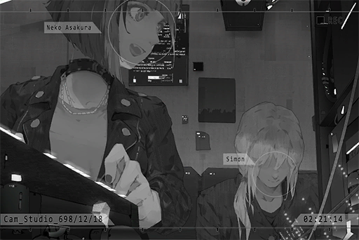

# Cam_Studio_698_12_18
## Requirements
|Character|Level|
|---------|:---:|
|**Neko** | 13  |

## Unlocked Charts
|  Song  |Character|Diff.|Level|
|--------|:-------:|:---:|:---:|
|**リラ**|  Neko   |Easy |  4  |
|**リラ**|  Neko   |Hard |  8  |

## Log Content
*\[Door Opens\]*

**Neko** 
Wow! This is a nice workshop!

**Xenon** 
It's alright. 
Hey, your hands are still wet, so don't touch anything. Here, towel.

**Neko** 
Okay\~ 
This really is a workshop. Where do you sleep?

**Xenon** 
On the couch you're sitting on right now. You can sleep on it tonight. Let's get things straight first. The first thing we do tomorrow morning is escort you home...

**Neko** 
Wow\~ It's PAFF's album. NEKO also has one!

**Xenon** 
Not listening at all...

**Neko** 
Woah! A Kurg synthesizer! This model was just released last month!

**Xenon** 
Yeah. Bought it a while ago, but I still haven't quite figure out how to use it yet.

**Neko** 
Can NEKO try it out?

**Xenon** 
I don't mind... do you know how to use it though?

*\[Synthesizer\]*

**Neko** 
Hmmmm, so good! This sound is so good! The new modulation is awesome!

**Xenon** 
... Not bad. You played with synthesizers before?

**Neko** 
Yep, although NEKO only has a digital version back at home.

*\[Optic guitar activation\]*

**Neko** 
Hawawa! What is that!? So cool!

**Xenon** 
I made this. I'm still testing it out, therefore it doesn't have a name yet... probably something like the "Optic guitar"?  
You wanna have a quick Jam?

**Neko** 
Absolutely! Bring it!

*[»»» Fast Forward»»»]*

**Neko** 
Man\~ that was fun! I never thought I could Jam with Xenon!

**Xenon** 
I'm quite surprised myself as well. I didn't know that you compose music.

*\[Ringtone\]*

**Neko** 
......

*\[Phone shutting down\]*

**Xenon** 
... What's wrong?

**Neko** 
... Family member.

**Xenon** 
You... ran away from home, didn't you?

**Neko** 
......

**Xenon** 
I can tell by just looking at you. I did something similar in the past too. 
Does it have something to do with them opposing your music interests?

**Neko** 
No... Actually...

*[»»» Fast Forward»»»]*

**Xenon** 
I see... Therefore, you suspected that Yukiko only got close to your father for his money?

**Neko** 
... I don't know... 
On top of that, NEKO couldn't accept her, because she is not mommy... 
Yet daddy is adoring her like a fool...

**Xenon** 
... Back when I was around your age, I also left home for a while due to some personal stubbornness. 
Now when I look back at it, that was the most worthwhile, as well as the most regrettable decision I ever made in my life.

**Neko** 
... What do you mean?

**Xenon** 
No, nothing... 
In short, you're at the age where you more or less want your values to clash with your surroundings or even with society. That itself is not an issue; however, the important thing is to learn a lesson from the decisions you made. What you shouldn't do is treat these decisions as mere ways to run away from an undesirable situation. 

**Neko** 
......

**Xenon** 
After all, from what I've heard, your family still loves you very much. That alone makes you so much luckier than many others. Don't make them worried.

**Neko** 
Okay.... it feels like Xenon is lecturing people again...

**Xenon** 
Sorry, that's just how my personality is. You don't have to listen to me.

**Neko** 
It's fine. NEKO was previously a bit lost. Now, after hearing you talk, I have a better idea about what to do now.

**Xenon** 
Is that so?

**Neko** 
Despite that, NEKO still feels that even if I calm down now, I still don't quite know how to face it. Perhaps a temporary leave from home is better for all of us.

**Xenon** 
... Would you be alright?

**Neko** 
Rest assured! NEKO has some money saved up from my part\-time job and selling my singles online. If I continue down this road, I should be able to make a living by myself. Ah, but before I can find a place to live, NEKO will be crashing at your workshop!

**Xenon** 
Hey, I didn't agree to this...

**Neko** 
Ah! Look! "Monophonic Entertainment" is looking for music arrangers! Isn't this PAFF's company!? Seems legit!

**Xenon** 
Not listening at all...

*[Signal Lost]*
