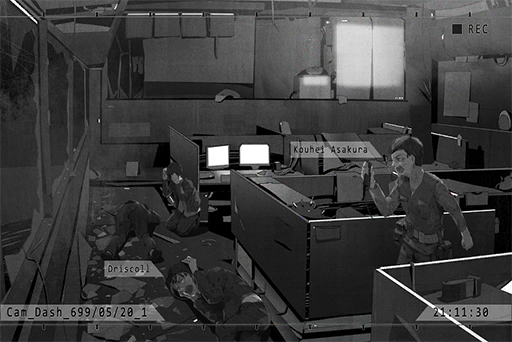

# Cam_Dash_699_05_20_1
## Requirements
|Character|Level|
|---------|:---:|
|**Neko** | 20  |

## Log Content
*\[Car Engine Stops\]*

**Kouhei** 
We're here... This is the place.

**Neko** 
Daddy, are you sure about this? NEKO is more agile. Maybe we should let NEKO go...

**Kouhei** 
NO! I cannot let you do something this dangerous.

**Neko** 
......

**Kouhei** 
I'll be going then. So I press this, then press this and this. Is that right?

**Neko** 
Uh\-huh... NEKO will be in the car. If the situation goes wrong, NEKO will inform the admins immediately.

**Kouhei** 
Got it. 
NEKO... Thank you.

**Neko** 
... W, why are you thanking me?

**Kouhei** 
For willing to stand up for Yukiko... Also, sorry for yelling at you back then.

**Neko** 
Ha!? N, NEKO's not doing this for anybody else! I'm just doing this because I'm mad about being kidnapped! 
E, enough! Get moving! Go kick their butts!

*[»»» Fast Forward»»»]*

**Neko** 
Daddy, can you hear me? NEKO will be telling you the controls from here. 
Daddy? Dad?... AH! Crap... He forgot his earbuds...

*\[Door Opens\]*

**[Man A]** 
*Hmm? Mister, is there something you want? We are already closed for the day...*

**[Kouhei]** 
*...... You... you guys, are the ones who were threatening Yukiko, right?*

**[Man B]** 
*... Huh? Who the f\*\*\* are you? Aha! Could it be that you're her current husband?*

**[Man C]** 
*Are you here to pay her debts for her? Then you better bring enough. The money that woman owed us is no small number...*

**[Kouhei]** 
*I, I warn you guys... leave her alone. We will not pay this wretched illegal company a single cent anymore!*

*\[Flips switch\]*

**[Kouhei]** 
*...... Eh?*

**Neko** 
Daddy you idiot! You pressed the wrong one! Ah! Look out!

*\[Heavy Blow\]*

**[Kouhei]** 
*Argh!*

**[Man A]** 
*You want a death wish, old geezer!?*

**[Man B]** 
*Old man, if you want to mess with us, I advise you come prepared. Looks like you're gonna have to pay the price with your blood and organs!*

**Neko** 
This is bad... Should probably inform...

**[Kouhei]** 
*ALL OF YOU, FREEZE!*

*\[Flips switch\]*

*\[Glass explodes\]*

**[Man C]** 
*......! What!? What is going on...!?*

*\[Flips switch\]*

**[Man B]** 
*UGH! My head! My head is so hot! It's burning!*

**[Man A]** 
*URGHHH! AAHHHH!*

**[Man C]** 
*WAAAAHHHHHH!!*

**[Kouhei]** 
*You people... you all implanted the cyTus chip, right? If you dare move a finger, I will blow your brains out!*

**[Kouhei]** 
*"X"... As fellow cybercriminals, that name should ring a bell, right?*

**[Man B]** 
*......!?*

**[Kouhei]** 
*Exactly. I am X.  
I was already retired from this stuff... but you people crossed the line by messing with my family. I had no choice but to take matters into my own hands again.*

**[Man C]** 
*Impossible... You're that... legendary hacker...*

**[Kouhei]** 
*I just destroyed all your transaction networks. Your names, addresses, lifestyles, family and friend information are all in my hands now...*

**[Man B]** 
*Please stop! My head... it's throbbing... I'm gonna die!*

**[Kouhei]** 
*Your heads must be burning, right? Did you realize that the cyTus chip model you guys implanted has an overcharge loophole? I can split your heads in half whenever I feel like it. It could be when you eating, sleeping or even when you're taking a s\*\*\*. If you have the balls to get the chips removed, I have plenty of other methods to torment you people.*

**[Man B]** 
*Eek~ We, we understood! We apologize! We didn't know that you are X...*

**[Kouhei]** 
*Leave my dear daughter and family alone!  
You worthless sacks of s\*\*\*!!*

**[Man C]** 
*U... Understood! We are very sorry!!*

**Neko** 
Daddy...

*[Signal Lost]*
