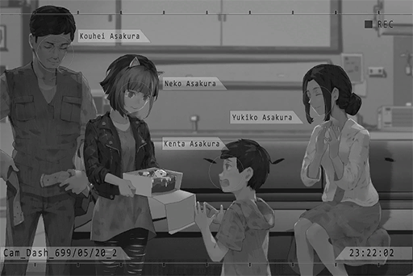

# Cam_Dash_699_05_20_2
## Requirements
|Character|Level|
|---------|:---:|
|**Neko** | 21  |

## Log Content
**Kouhei** 
Judging by their frightened faces... They probably wouldn't dare to bother us anymore from now on. 
What exactly is this "X" thing your friend told you about? The bad guys seem terrified of it...

**Neko** 
NEKO don't really know the details too, but it seems to work quite well...

**Kouhei** 
Daddy had some serious misjudgments about your friends. NEKO has some pretty amazing friends...

**Neko** 
Yeah... By the way! What were you thinking rushing in there without earbuds! And you pressed the wrong button! NEKO was super nervous during all that!

**Kouhei** 
Sorry... Because I want to spew some pretty cringy lines...

**Neko** 
Eh...? Even without earbuds, NEKO can still see you on\-screen. I can hear all the sounds as well.

**Kouhei** 
EH!? For real? Man, so you heard them all? God, that was so embarrassing...

**Neko** 
Not at all... Rather, I feel like... daddy was kinda cool back there.

**Kouhei** 
......

**Neko** 
B\-U\-T! If it's NEKO posing as X, it would be at least ten times cooler! It will definitely look better than that sloppy performance you put out there!

**Kouhei** 
Haha, that was already my best shot. Cut me some slack...

**Neko** 
AH! Daddy, your head is still bleeding! Quick, we have to get you to the hospital!

**Kouhei** 
No big deal; it's just a small scratch... Compare to that, there's a more important place we must be at right now. If we don't hurry, we're not going to make it.

**Neko** 
...... Ha?

*[»»» Fast Forward»»»]*

**Neko** 
Nah! Aren't we almost home? Is it really ok for you to not go to the hospital!? 
You said something about going to a more important place... then you just grabbed this box. What's inside?

**Kouhei** 
No need to panic. You'll know very soon.

*[→Signal Switch]*

*\[Door Opens\]*

**Yukiko** 
Kouhei! NEKO!

**Kouhei** 
NEKO, bring the box over here. 
Open it.

**Neko** 
Huh......? Eh? Cake!?

**Kouhei** 
Today is your birthday, right? We've only got half\-an\-hour left. Let's celebrate!

**Neko** 
......

**Yukiko** 
Happy birthday, NEKO!

**Kenta** 
Big sister, Happy birthday!

**Neko** 
*... \*Sniffs\*...*

**Kouhei** 
This is also daddy's apology to you. I'm sorry for the terrible things I said to you...

**Neko** 
......

**Yukiko** 
NEKO, I have to apologize to you too. It was me who interfered with this family...  
I didn't consider your feelings. On top of that, I dragged both of you into my troubles...

**Neko** 
......

**Yukiko** 
You've already made your decision... about going back to Node 03, right?

**Kouhei** 
......

**Neko** 
Yeah... That day, NEKO came back just to grab some stuff before I leave. Somehow, I got involved with this incident...

**Yukiko** 
It's a shame that we couldn't live together with you. However, we will always keep your room for you.

**Neko** 
Come on... Sis Yukiko, if you put it that way, there's no way NEKO can leave...

**Yukiko** 
......Eh?

**Neko** 
NEKO has decided! I am not leaving! I'm moving back in! Daddy, you're okay with this, right?

**Kouhei** 
......Eh? Of course I'm okay with it!

**Neko** 
This household is so weak; what are you guys gonna do without NEKO!? 
One parent gets knocked out cold with one blow! The other is always on business trips and is never home! Who's going to protect Kenta then? Right?

**Kenta** 
Big sister...

**Neko** 
NEKO also promise... that I will not make you guys worry anymore. I'm sorry...

**Yukiko** 
NEKO... Thank you! Thank you so much! *\*Sobs\*......*

**Neko** 
*...\*Sniffs\*... *Alright! That's enough crying! It's a bad omen to cry on someone else's birthday party! Let's blow out the candles!

*[Signal Lost]*
